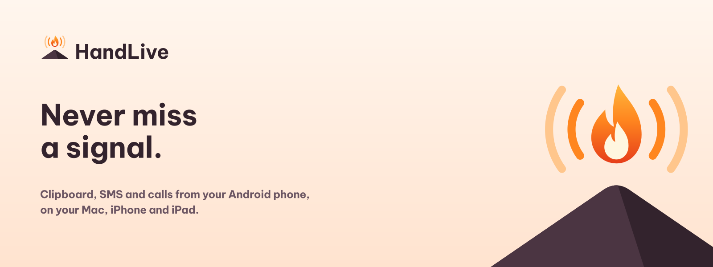
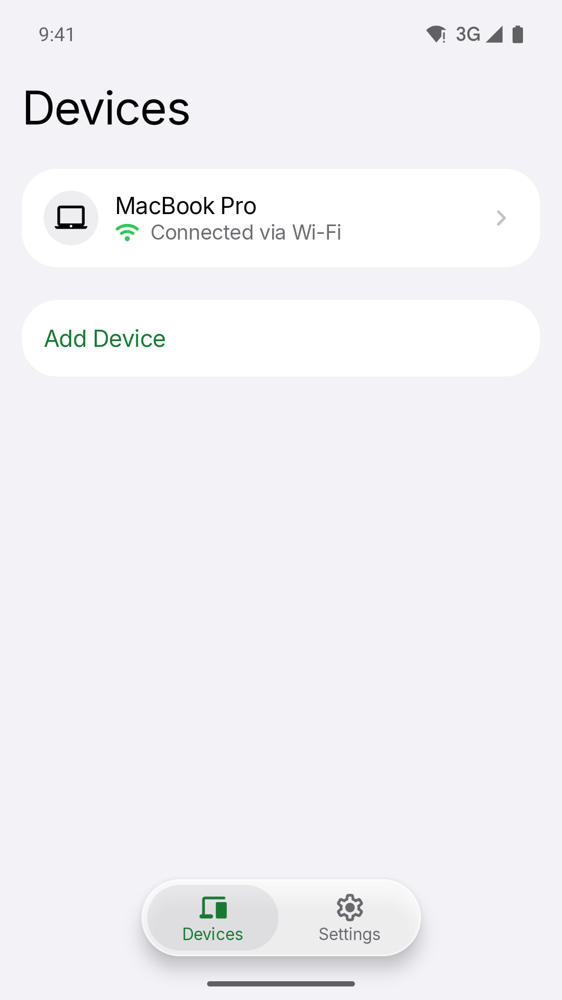
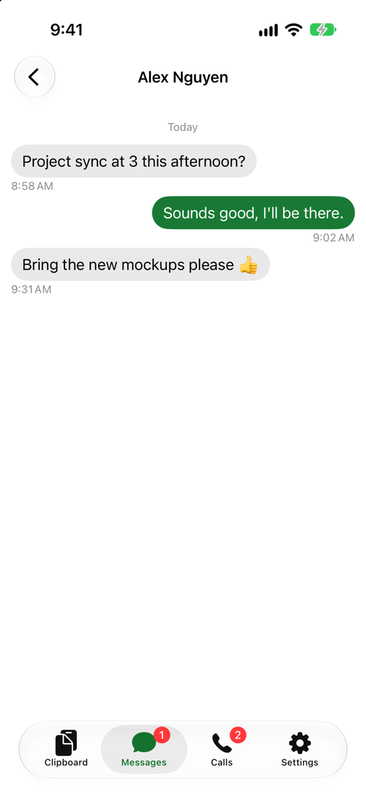
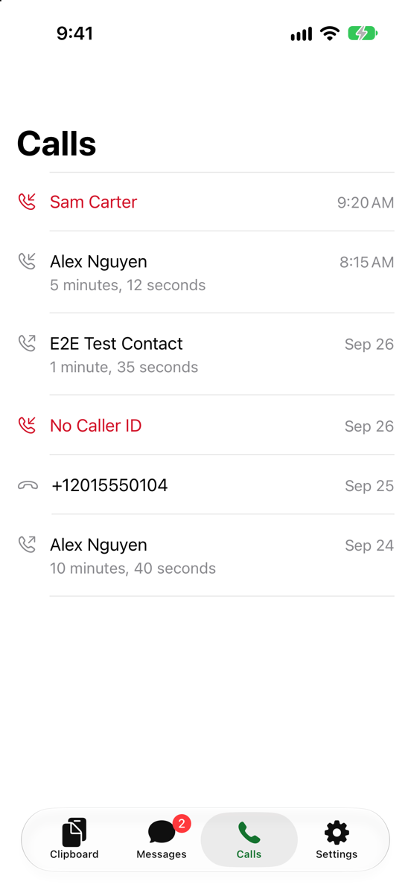
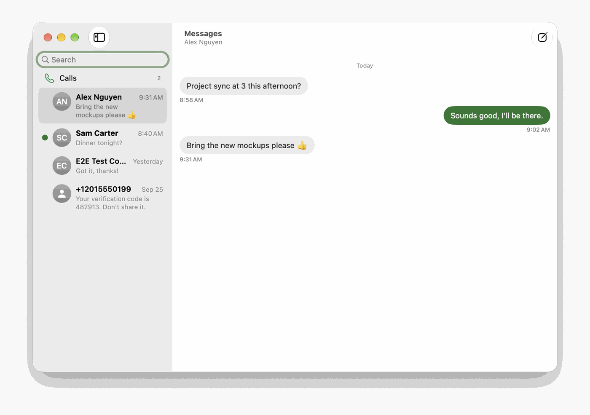
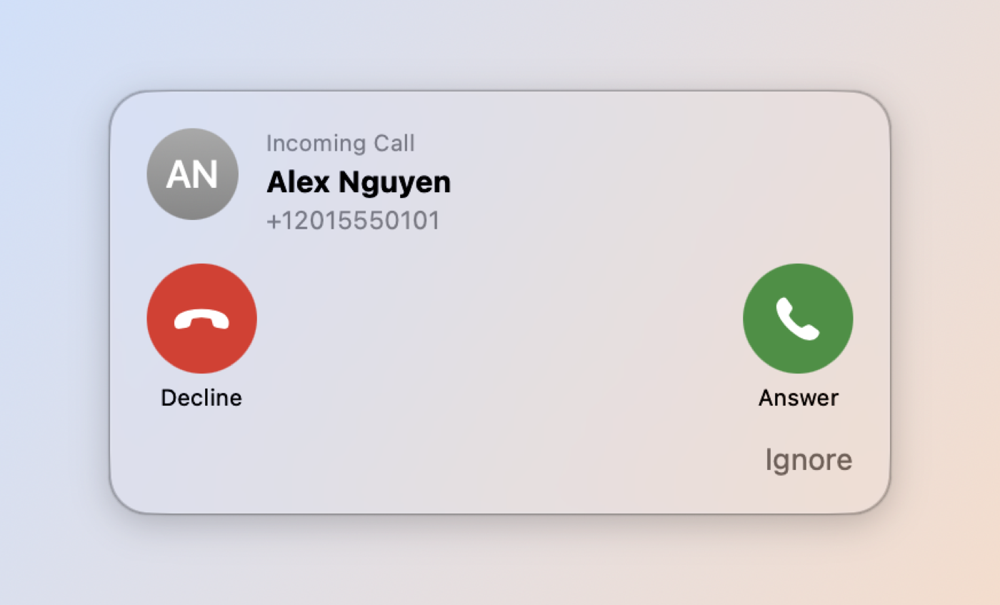

English | [Tiếng Việt](README.vi.md)

# HandLive



> **Never miss a signal.** Your Android phone's clipboard, SMS, and calls, on your Mac, iPhone, and iPad.
>
> *"WebSocket for data, Bluetooth for voice."*

HandLive is open source (Apache-2.0). This repository is the **documentation hub**. App source lives in four sibling repositories (see [Layout](#layout-five-repositories-one-workspace)).

## Status

| | |
|--|--|
| **Latest release** | [`v0.1.0-beta.2`](https://github.com/HandLive/handlive/releases/tag/v0.1.0-beta.2) (2026-10-04): the first with installable files, all on that one page: Mac DMG signed ad hoc (Open Anyway once), iOS IPA (unsigned, for sideloading), Android APK (`foss`, signed); every change since beta.1 passed a security scan ([deployment guide](docs/deployment-guide.md)) |
| **Phases on `main`** | 0–3 product code; Phase 4–6 **spike probes** also on `main` (2026-09-30) |
| **Still open before 1.0** | Gates **G1** (real-device matrix) and **G2** (Play Console); real relay / APNs / FCM checks |
| **In progress** | G4/G5/G6 hardware and browser decisions; product cards for Phases 4–6 not started |
| **Languages** | English (default) and Vietnamese; every hub doc has `X.md` + `X.vi.md` |
| **Website** | WordPress product site and blog in `website/`, English and Vietnamese; runs locally, not deployed yet ([guide](docs/website.md)) |

Beta builds are for early testers. They are not App Store / Play Store releases yet.

## What you get

| Feature | macOS | iOS / iPadOS |
|---------|:-----:|:------------:|
| Two-way clipboard (text keeps its HTML, so an article pastes with its pictures; one image at a time) | Yes | Yes |
| Receive and send SMS | Yes | Yes |
| Call details and control (answer, decline, end; hold/DTMF over HFP later) | Yes | Details and decline only (no audio) |
| Call audio on the computer | Planned (Phase 4) | No (Apple has no HF-side HFP API) |
| Virtual camera and microphone | Planned (Phase 5) | No |
| Continue Browsing (open page follows you) | Planned (Phase 6) | Planned (from the phone only) |

End-to-end encryption stays on. Users cannot turn it off.

## Screenshots

| | | |
|---|---|---|
|  |  |  |
| Android: paired Mac over Wi-Fi | iPhone: SMS from the phone | iPhone: call log |

| | |
|---|---|
|  |  |
| Mac: SMS and call log | Mac: incoming-call panel |

Full set (English and Vietnamese): [`docs/screenshots/README.md`](docs/screenshots/README.md).

## How it works

- **WebSocket** moves clipboard, SMS, call details, and notifications. Android runs a Ktor server; peers find each other with mDNS.
- **Bluetooth HFP SCO** carries **call audio only** (Phase 4). When HFP is busy, the design falls back to Opus over WebSocket (needs Shizuku on some devices).
- **E2E crypto:** XChaCha20-Poly1305 payloads, X25519 + HKDF session keys, **QR pairing**.
- **Cloud relay** (Rust) forwards encrypted blobs when devices are not on the same LAN. It never reads content.

Details: [`docs/system-architecture.md`](docs/system-architecture.md) · [`plans/20260924-definitive-architecture/plan.md`](plans/20260924-definitive-architecture/plan.md).

## Roadmap and progress

Phases ship in order, each as a usable slice. Exception (owner, 2026-09-28): Phases 5 and 6 start before Phase 4 finishes, because Phase 4 waits on the G4 HFP hardware spike.

Full narrative: [`docs/project-roadmap.md`](docs/project-roadmap.md). Task cards: [`plans/20260925-implementation/plan.md`](plans/20260925-implementation/plan.md).

| Phase / gate | Goal | Status (2026-10-05) |
|--------------|------|---------------------|
| **0** Scaffold, protocol, crypto, CI | Shared vectors, green CI | **Done** |
| **1** Clipboard sync (MVP) | Android ↔ Mac, LAN WS, QR | **Code done** · G1 still open · S25↔Mac pairing stable; one-sided pair after a key reset fixed (2026-10-04); an image copied with a text beside its URI is sent as the image, a lost URI grant is told on Send Clipboard, e2e covers phone → Mac images (2026-10-05) · a text clip keeps its HTML (`text/html` capability, CLIP-01 API 5 `html`, 2026-10-05) |
| **2** SMS + iOS + relay + push | Conversations, Rust relay, APNs/FCM | **Code done** · G2 and real push still open |
| **3** Call info and control | Telecom APIs, Mac panel, iOS metadata | **Code done** · real-device checks open |
| **4** Call audio | HFP/SCO + Opus/WS fallback | **Spike on `main`** (`HFPSpike`) · G4 needs BT phone + live call |
| **5** Virtual camera / mic | CMIOExtension + AudioServerPlugin | **Spike on `main`** (`CameraSpike`) · G5 needs paid Apple Developer team |
| **6** Continue Browsing | Foreground URL across devices | **Spike on `main`** · Chrome/Samsung measured; browser go/no-go pending |
| **7** Connect anywhere | Auto link without a shared network: Bluetooth, Wi-Fi Direct (Mac Wi-Fi idle), relay; no Wi-Fi change | **Proposed** (2026-10-01) · starts after G4/G5/G6 with spike G7 |
| **G0** Test vectors | | **Done** |
| **G1** Real-device Phase 1 matrix | | **Open** (before 1.0) |
| **G2** Play Console SMS / call-log | | **Open** (before 1.0; Plan B: F-Droid/APK) |

### Rule: keep this roadmap current

Whenever a concrete task finishes (phase card merged, gate closed, spike go/no-go, real-device fix on `main`), the **same change set** must update:

1. This progress table and the Status section in `README.md` + `README.vi.md`
2. The snapshot in `docs/project-roadmap.md` + `.vi.md`
3. Hub `CHANGELOG.md` + `.vi.md` when the change is user- or release-visible
4. `CLAUDE.md` Next steps when the agent handoff changes

Progress that lives only in a plan report or a chat does not count. A finished task without a README update is incomplete.

## Layout: five repositories, one workspace

This hub holds docs, plans, and doc tools only. Clone the code repos **inside** this folder (git-ignored here). Builds and tests expect `../shared`; Apple tests also read `../docs`.

```
HandLive/                 # hub: handlive
├── docs/  plans/  tools/
├── android/              # handlive-android
├── apple/                # handlive-apple
├── relay/                # handlive-relay
├── shared/               # handlive-shared
└── .github-org/          # HandLive/.github (CONTRIBUTING, SECURITY, …)
```

```sh
git clone git@github.com:HandLive/handlive.git HandLive && cd HandLive
tools/workspace.sh clone git@github.com:HandLive
tools/workspace.sh status
```

## Documentation

| Doc | About |
|-----|--------|
| [`docs/project-overview-pdr.md`](docs/project-overview-pdr.md) | Goals, scope, constraints |
| [`docs/system-architecture.md`](docs/system-architecture.md) | Transports, protocol, security |
| [`docs/project-roadmap.md`](docs/project-roadmap.md) | Phases and effort |
| [`docs/screenshots/README.md`](docs/screenshots/README.md) | App screenshots |
| [`docs/design-guidelines.md`](docs/design-guidelines.md) | UX and security principles |
| [`docs/code-standards.md`](docs/code-standards.md) | Per-platform conventions |
| [`docs/deployment-guide.md`](docs/deployment-guide.md) | Packaging and distribution |
| [`docs/privacy.md`](docs/privacy.md) | Privacy: devices, relay, deletion |
| [`docs/codebase-summary.md`](docs/codebase-summary.md) | Code map |
| [`docs/detailed-design/README.md`](docs/detailed-design/README.md) | Spec: functions, protocol, errors |

## License

Apache License 2.0 — [LICENSE](LICENSE). Applies to all repositories under [HandLive](https://github.com/HandLive).

Contribute: [CONTRIBUTING](https://github.com/HandLive/.github/blob/main/CONTRIBUTING.md) (real name, `git commit -s` DCO). Security: [SECURITY](https://github.com/HandLive/.github/blob/main/SECURITY.md).
