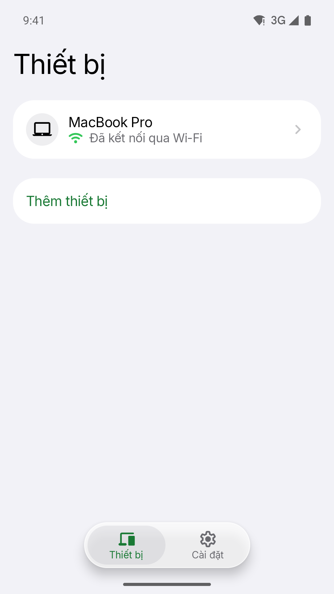
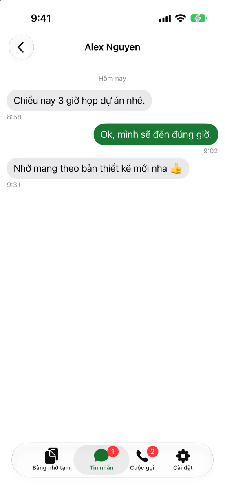
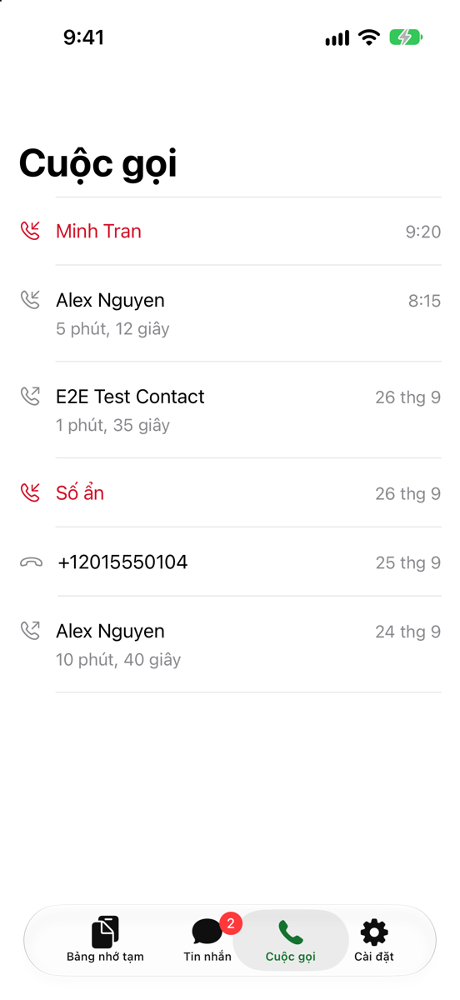
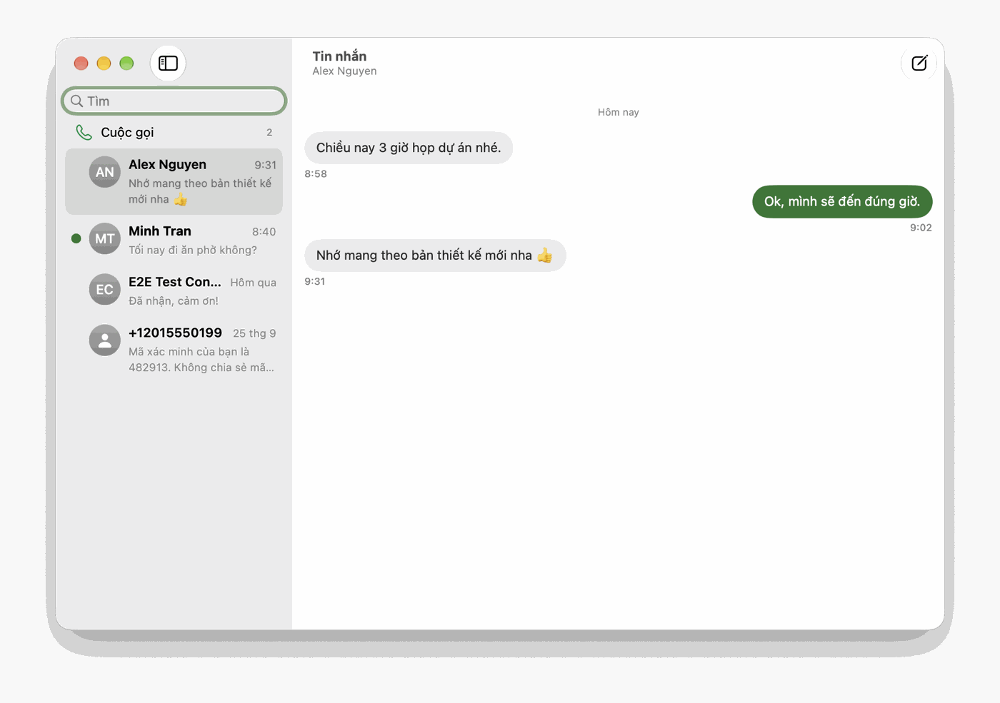
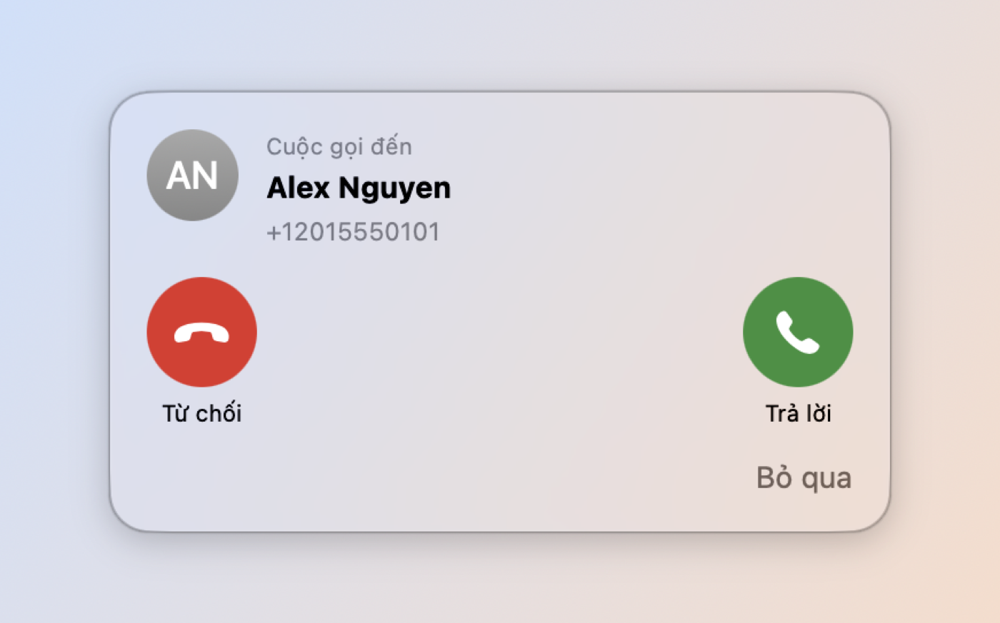

[English](README.md) | Tiếng Việt

# HandLive

> HandLive là dự án mã nguồn mở. Dự án đưa các tính năng native riêng trong từng hệ sinh thái, như Handoff trên Apple, lên Android. Máy Android đồng bộ với Mac, iPhone và iPad. Máy Apple đồng bộ ngược lại với Android. Kho này là hub tài liệu.
>
> Phương châm: *"WebSocket cho dữ liệu, Bluetooth cho giọng nói."*

**Trạng thái:** Phase 0 (khung, giao thức, mã hóa, token và CI), Phase 1 (đồng bộ clipboard giữa Android và Mac), Phase 2 (SMS, ứng dụng iPhone và iPad, cloud relay và thông báo đẩy) và Phase 3 (thông tin và điều khiển cuộc gọi) đã gộp vào `main`. Phase 4 (nghe gọi trên Mac) bắt đầu bằng một spike Bluetooth rảnh tay. Spike này cần điện thoại thật. Cổng G1 (kiểm trên máy thật) và cổng G2 (Play Console) vẫn còn mở, nên chưa có bản phát hành. Mã nguồn nằm ở bốn kho riêng. Clone bốn kho vào thư mục này. Xem mục Cấu trúc. Sản phẩm có hai ngôn ngữ. Tiếng Anh là mặc định. Tiếng Việt là ngôn ngữ thứ hai. Mọi tài liệu có hai bản: `X.md` tiếng Anh, `X.vi.md` tiếng Việt.

## HandLive giải quyết gì

HandLive đưa các tính năng gắn với một hệ sinh thái, như Handoff và Continuity trên Apple, sang Android. Máy Android đồng bộ clipboard, SMS, cuộc gọi, camera và mic với Mac. iPhone và iPad đồng bộ clipboard, SMS và thông tin cuộc gọi. Chiều từ máy Apple về Android cũng vậy. Mã hóa đầu-cuối (E2E) luôn bật. Người dùng không tắt tính năng này.

| Tính năng | macOS | iOS/iPadOS |
|-----------|:-----:|:----------:|
| Clipboard hai chiều | ✅ | ✅ |
| SMS nhận và gửi | ✅ | ✅ |
| Thông tin cuộc gọi và điều khiển (nghe, từ chối, kết thúc; giữ máy và DTMF qua Bluetooth HFP) | ✅ | ✅ (thông tin và từ chối, không có âm thanh) |
| **Âm thanh cuộc gọi** (nghe và nói trên máy) | ✅ | ❌ (Apple không mở API HFP phía tai nghe) |
| Camera và mic ảo (Zoom, Meet, FaceTime, OBS) | ✅ | ❌ |
| Duyệt web tiếp: trang web đang mở trên thiết bị này được xem tiếp trên thiết bị kia (dự kiến, Phase 6) | Dự kiến (hai chiều) | Dự kiến (chỉ từ điện thoại) |

## Ảnh màn hình

| | | |
|---|---|---|
|  |  |  |
| Android: Mac đã ghép nối, kết nối qua Wi-Fi | iPhone: đọc và trả lời SMS của điện thoại | iPhone: nhật ký cuộc gọi của điện thoại |

| | |
|---|---|
|  |  |
| Mac: SMS và nhật ký cuộc gọi trong một cửa sổ | Mac: bảng nổi khi có cuộc gọi đến |

Toàn bộ màn hình của ba ứng dụng, bằng tiếng Anh và tiếng Việt, kèm cách chụp: [`docs/screenshots/README.vi.md`](docs/screenshots/README.vi.md).

## Kiến trúc tóm tắt

- **WebSocket** chuyển mọi dữ liệu: clipboard, SMS, thông tin cuộc gọi, thông báo. Android chạy máy chủ Ktor. Các máy trong cùng mạng tìm nhau qua mDNS.
- **Bluetooth HFP SCO** chỉ chuyển **âm thanh cuộc gọi**. Từ Android 10, ứng dụng không thu âm cuộc gọi qua API công khai. HFP là đường đã chứng minh. Khi HFP bận, tai nghe chiếm sóng hoặc Mac ở xa, hệ thống chuyển sang **Opus qua WebSocket**. Trễ khoảng 100 đến 150 ms. Đường này cần Shizuku. Đường này chỉ chạy trên một số máy và một số phiên bản Android (plan §13 D10).
- **Mã hóa đầu-cuối** áp dụng toàn hệ thống. Nội dung dùng XChaCha20-Poly1305. Hai máy trao khóa bằng X25519 và HKDF, rồi ghép cặp qua **mã QR**. Âm thanh Opus đi qua hai lớp mã hóa. Âm thanh HFP dựa vào mã hóa liên kết Bluetooth (plan §13 D11).
- **Cloud relay** (Rust, Actix-web) chuyển tiếp khối dữ liệu đã mã hóa khi các thiết bị không cùng mạng nội bộ. Relay không đọc nội dung.

Chi tiết: [`docs/system-architecture.md`](docs/system-architecture.vi.md) và [`plans/20260924-definitive-architecture/plan.md`](plans/20260924-definitive-architecture/plan.md).

## Lộ trình

HandLive xây lần lượt. Mỗi phase là một phần dùng được.

1. **Đồng bộ clipboard** (MVP). Android và macOS đồng bộ qua WebSocket trong mạng nội bộ.
2. **Cầu nối SMS.** Thêm ứng dụng iOS, cloud relay và thông báo đẩy.
3. **Thông tin và điều khiển cuộc gọi.** Dùng API Telecom công khai, không dùng `InCallService` (quyết định D9). Mac hiện bảng cuộc gọi nổi.
4. **Âm thanh cuộc gọi.** Dùng HFP/SCO, dự phòng Opus, khử tiếng vang.
5. **Camera và mic ảo.** Dùng CMIOExtension và AudioServerPlugin trên macOS.
6. **Duyệt web tiếp** (đề xuất). Trang web đang mở chuyển giữa điện thoại và Mac, iPhone hoặc iPad; bắt đầu bằng spike G6 và chỉ cần Phase 1.

Chi tiết: [`docs/project-roadmap.md`](docs/project-roadmap.vi.md).

## Cấu trúc: năm kho, một workspace

Kho này (`handlive`) là **hub**. Hub chỉ giữ tài liệu, kế hoạch và công cụ tài liệu. Mã nguồn nằm ở bốn kho riêng. Clone bốn kho vào thư mục hub. Git trên hub bỏ qua bốn thư mục đó. Bố cục này là bắt buộc. Build và test đọc `../shared`. Test Apple đọc `../docs`.

```
HandLive/                # kho hub "handlive"
├── CLAUDE.md            # Hướng dẫn cho Claude Code (đọc trước)
├── README.md
├── docs/                # Tài liệu dự án (xem docs/codebase-summary.md)
│   ├── detailed-design/ # Thiết kế chi tiết: đặc tả cho mọi mã
│   └── design-system/   # Design system (bản sao nguồn của artifact)
├── plans/               # Kiến trúc, nghiên cứu, kế hoạch triển khai + reports/
├── tools/docs/          # validate_design_docs.py, apple_diacritics.py, build_design_html.py
├── tools/workspace.sh   # clone <group-url> | status | run <git…>
├── android/             # kho "handlive-android"  (Kotlin, Gradle)
├── apple/               # kho "handlive-apple"    (Swift, macOS + iOS)
├── relay/               # kho "handlive-relay"    (Rust)
├── shared/              # kho "handlive-shared"   (test vector, JSON Schema, design tokens, tools/vectors, tools/schemas)
└── .github-org/         # kho "HandLive/.github": hồ sơ org, CONTRIBUTING, SECURITY, CODE_OF_CONDUCT, mẫu PR/issue
```

```sh
git clone <group-url>/handlive.git HandLive && cd HandLive
tools/workspace.sh clone <group-url>      # ví dụ git@github.com:HandLive
tools/workspace.sh status
```

## Tài liệu

| File | Nội dung |
|------|----------|
| [`docs/project-overview-pdr.md`](docs/project-overview-pdr.vi.md) | Sản phẩm là gì, mục tiêu, phạm vi, ràng buộc |
| [`docs/system-architecture.md`](docs/system-architecture.vi.md) | Kiến trúc, kênh truyền, giao thức, bảo mật |
| [`docs/project-roadmap.md`](docs/project-roadmap.vi.md) | Năm phase và ước lượng công sức |
| [`docs/screenshots/README.vi.md`](docs/screenshots/README.vi.md) | Ảnh màn hình ứng dụng Android, iPhone, iPad và Mac |
| [`docs/design-guidelines.md`](docs/design-guidelines.vi.md) | Nguyên tắc trải nghiệm và bảo mật |
| [`docs/code-standards.md`](docs/code-standards.vi.md) | Quy ước code từng nền tảng |
| [`docs/deployment-guide.md`](docs/deployment-guide.vi.md) | Đóng gói và phân phối (App Store, PKG, cloud relay) |
| [`docs/privacy.md`](docs/privacy.vi.md) | HandLive và quyền riêng tư: dữ liệu ở lại trên thiết bị, máy chủ relay thấy gì, xóa dữ liệu |
| [`docs/codebase-summary.md`](docs/codebase-summary.vi.md) | Bản đồ codebase, cập nhật khi code đổi |
| [`docs/detailed-design/README.md`](docs/detailed-design/README.vi.md) | Thiết kế chi tiết: 33 chức năng, giao thức, mã lỗi, mô hình dữ liệu |

## Giấy phép

Apache License 2.0. Xem [LICENSE](LICENSE). Giấy phép áp dụng cho cả năm kho trong tổ chức [HandLive](https://github.com/HandLive). Cách đóng góp nằm ở [CONTRIBUTING](https://github.com/HandLive/.github/blob/main/CONTRIBUTING.vi.md). Commit nhỏ, đứng tên người thật, ký DCO bằng `git commit -s`. Lỗi bảo mật báo kín theo [SECURITY](https://github.com/HandLive/.github/blob/main/SECURITY.vi.md).
