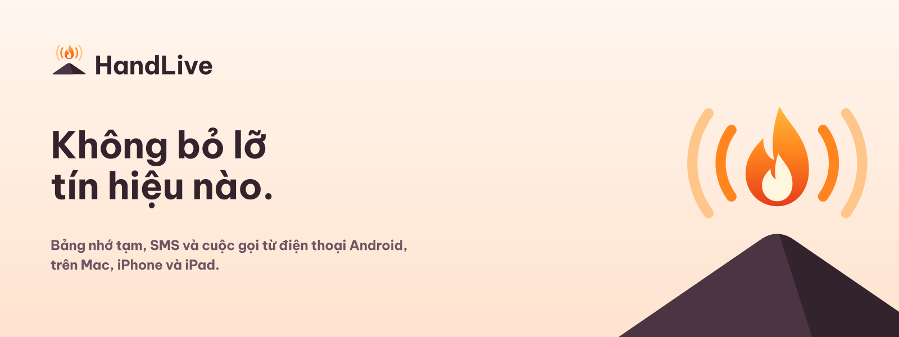

[English](README.md) | Tiếng Việt

# HandLive



> **Không bỏ lỡ tín hiệu nào.** Bảng nhớ tạm, SMS và cuộc gọi từ điện thoại Android, ngay trên Mac, iPhone và iPad.
>
> *"WebSocket cho dữ liệu, Bluetooth cho giọng nói."*

HandLive là mã nguồn mở (Apache-2.0). Kho này là **hub tài liệu**. Mã ứng dụng nằm ở bốn kho anh em (xem [Cấu trúc](#cấu-trúc-năm-kho-một-workspace)).

## Trạng thái

| | |
|--|--|
| **Bản phát hành mới nhất** | [`v0.1.0-beta.3`](https://github.com/HandLive/handlive/releases/tag/v0.1.0-beta.3) (07/10/2026): cuộc gọi từ ứng dụng khác giữ tên ứng dụng và không kết thúc khi thông báo đang gọi bị vuốt bỏ, clip chữ giữ HTML, biểu tượng ứng dụng Liquid Glass trên iPhone, iPad và Mac, iPhone giữ phiên 25 giây khi chạy nền; vẫn các tệp như beta.2 ở cùng trang đó: DMG Mac ký ad-hoc (bấm Open Anyway một lần), IPA iOS (chưa ký, để sideload), APK Android (`foss`, đã ký); mọi thay đổi từ beta.2 đã qua quét bảo mật ([hướng dẫn phân phối](docs/deployment-guide.vi.md)) |
| **Phase trên `main`** | 0–3 mã sản phẩm; spike Phase 4–6 cũng trên `main` (30/09/2026) |
| **Còn mở trước 1.0** | Cổng **G1** (ma trận máy thật) và **G2** (Play Console); kiểm relay / APNs / FCM thật |
| **Đang làm** | Quyết định phần cứng/trình duyệt G4/G5/G6; chưa mở thẻ sản phẩm Phase 4–6 |
| **Ngôn ngữ** | Tiếng Anh (mặc định) và tiếng Việt; mọi tài liệu hub có `X.md` + `X.vi.md` |
| **Website** | Website sản phẩm và blog WordPress ở `website/`, tiếng Anh và tiếng Việt; chạy trên máy, chưa triển khai ([hướng dẫn](docs/website.vi.md)) |

Bản beta dành cho người thử sớm. Chưa phải bản trên App Store / Play Store.

## Tính năng

| Tính năng | macOS | iOS / iPadOS |
|-----------|:-----:|:------------:|
| Clipboard hai chiều (chữ giữ dạng HTML nên bài báo dán ra kèm ảnh; mỗi lần một ảnh) | Có | Có |
| SMS nhận và gửi | Có | Có |
| Thông tin và điều khiển cuộc gọi (nghe, từ chối, kết thúc; giữ máy/DTMF qua HFP sau) | Có | Chỉ thông tin và từ chối (không âm thanh) |
| Âm thanh cuộc gọi trên máy tính | Dự kiến (Phase 4) | Không (Apple không mở API HFP phía tai nghe) |
| Camera và mic ảo | Dự kiến (Phase 5) | Không |
| Duyệt web tiếp (trang đang mở theo bạn) | Dự kiến (Phase 6) | Dự kiến (chỉ từ điện thoại) |

Mã hóa đầu-cuối luôn bật. Người dùng không tắt được.

## Ảnh màn hình

| | | |
|---|---|---|
|  |  |  |
| Android: Mac đã ghép qua Wi-Fi | iPhone: SMS từ điện thoại | iPhone: nhật ký cuộc gọi |

| | |
|---|---|
|  |  |
| Mac: SMS và nhật ký cuộc gọi | Mac: bảng cuộc gọi đến |

Bộ đầy đủ (Anh và Việt): [`docs/screenshots/README.vi.md`](docs/screenshots/README.vi.md).

## Cách hoạt động

- **WebSocket** chuyển clipboard, SMS, thông tin cuộc gọi và thông báo. Android chạy máy chủ Ktor; các máy tìm nhau bằng mDNS.
- **Bluetooth HFP SCO** chỉ mang **âm thanh cuộc gọi** (Phase 4). Khi HFP bận, thiết kế chuyển sang Opus qua WebSocket (cần Shizuku trên một số máy).
- **Mã hóa E2E:** payload XChaCha20-Poly1305, khóa phiên X25519 + HKDF, **ghép cặp QR**.
- **Cloud relay** (Rust) chuyển khối đã mã hóa khi thiết bị không cùng LAN. Relay không đọc nội dung.

Chi tiết: [`docs/system-architecture.vi.md`](docs/system-architecture.vi.md) · [`plans/20260924-definitive-architecture/plan.md`](plans/20260924-definitive-architecture/plan.md).

## Lộ trình và tiến độ

HandLive xây lần lượt. Mỗi phase là một phần dùng được. Ngoại lệ (chủ dự án, 28/09/2026): Phase 5 và 6 làm trước khi Phase 4 hoàn tất, vì Phase 4 chờ spike HFP của cổng G4.

Mô tả đầy đủ: [`docs/project-roadmap.vi.md`](docs/project-roadmap.vi.md). Thẻ việc: [`plans/20260925-implementation/plan.vi.md`](plans/20260925-implementation/plan.vi.md).

| Phase / cổng | Mục tiêu | Trạng thái (05/10/2026) |
|--------------|----------|-------------------------|
| **0** Khung, giao thức, mã hóa, CI | Vector dùng chung, CI xanh | **Xong** |
| **1** Đồng bộ clipboard (MVP) | Android ↔ Mac, WS LAN, QR | **Mã xong** · G1 còn mở · ghép S25↔Mac ổn định; đã sửa ghép đôi một phía sau khi đặt lại khóa (04/10/2026); ảnh sao chép kèm chữ bên cạnh URI được gửi như ảnh, mất quyền URI được báo khi bấm Gửi bảng nhớ tạm, e2e kiểm ảnh điện thoại → Mac (05/10/2026) · clip chữ giữ dạng HTML (capability `text/html`, CLIP-01 API 5 `html`, 05/10/2026) · dịch vụ Hỗ trợ tiếp cận bị Android chặn bởi chế độ cài đặt hạn chế không còn im lặng: hướng dẫn hiện lại khi người dùng quay về mà chưa bật, chỉ hỏi đồng ý một lần (05/10/2026, android #6, đã chạy lại trên S25); công tắc Tự gửi hỏi trước khi tắt một dịch vụ chưa từng bật được (android #7) |
| **2** SMS + iOS + relay + push | Hội thoại, relay Rust, APNs/FCM | **Mã xong** · G2 và push thật còn mở · iPhone giữ phiên tối đa 25 giây khi chạy nền (05/10/2026, apple #4) · biểu tượng ứng dụng Liquid Glass trên iPhone, iPad và Mac (07/10/2026, apple #7 + #8, hub #17 + #19) |
| **3** Thông tin và điều khiển cuộc gọi | API Telecom, bảng Mac, metadata iOS | **Mã xong** · kiểm máy thật còn mở · cuộc gọi từ ứng dụng khác (CALL-05): Mac hiện tên ứng dụng thay vì tên gói, vuốt bỏ thông báo đang gọi trên Android 14+ không còn đóng bảng trên Mac (05/10/2026, android #8 + hub #15, đã merge 07/10/2026; còn kiểm trên S25); bench cuộc gọi đo được cuộc gọi ứng dụng (shared #6); e2e điều khiển một ứng dụng gọi giả trên emulator: tên ứng dụng, từ chối, vuốt bỏ, tải lên, gác máy (07/10/2026, android #9 + shared #7) |
| **4** Âm thanh cuộc gọi | HFP/SCO + Opus/WS dự phòng | **Spike trên `main`** (`HFPSpike`) · G4 cần BT điện thoại + cuộc gọi thật |
| **5** Camera / mic ảo | CMIOExtension + AudioServerPlugin | **Spike trên `main`** (`CameraSpike`) · G5 cần Apple Developer trả phí |
| **6** Duyệt web tiếp | URL đang mở giữa các thiết bị | **Spike trên `main`** · đã đo Chrome/Samsung; còn go/no-go trình duyệt |
| **7** Kết nối mọi nơi | Tự kết nối khi không chung mạng: Bluetooth, Wi-Fi Direct (Wi-Fi Mac rảnh), relay; không đổi Wi-Fi | **Đề xuất** (2026-10-01) · bắt đầu sau G4/G5/G6 bằng spike G7 |
| **G0** Vector mã hóa | | **Xong** |
| **G1** Ma trận Phase 1 máy thật | | **Mở** (trước 1.0) |
| **G2** Tờ khai SMS / nhật ký Play Console | | **Mở** (trước 1.0; phương án B: F-Droid/APK) |

### Quy định: luôn cập nhật lộ trình trên README

Mỗi khi hoàn thành một công việc cụ thể (merge thẻ phase, đóng cổng, go/no-go spike, sửa lỗi máy thật trên `main`), **cùng một đợt thay đổi** phải cập nhật:

1. Bảng tiến độ và mục Trạng thái trong `README.md` + `README.vi.md`
2. Ảnh chụp trong `docs/project-roadmap.md` + `.vi.md`
3. `CHANGELOG.md` + `.vi.md` của hub khi thay đổi nhìn thấy được với người dùng hoặc bản phát hành
4. Mục Next steps trong `CLAUDE.md` khi handoff cho agent đổi

Tiến độ chỉ nằm trong báo cáo plan hoặc chat không được tính. Việc đã xong mà chưa cập nhật README coi như chưa hoàn tất.

## Cấu trúc: năm kho, một workspace

Hub chỉ giữ tài liệu, kế hoạch và công cụ tài liệu. Clone các kho mã **vào trong** thư mục này (git bỏ qua tại đây). Build và test cần `../shared`; test Apple còn đọc `../docs`.

```
HandLive/                 # hub: handlive
├── docs/  plans/  tools/
├── android/              # handlive-android
├── apple/                # handlive-apple
├── relay/                # handlive-relay
├── shared/               # handlive-shared
└── .github-org/          # HandLive/.github (CONTRIBUTING, SECURITY, …)
```

```sh
git clone git@github.com:HandLive/handlive.git HandLive && cd HandLive
tools/workspace.sh clone git@github.com:HandLive
tools/workspace.sh status
```

## Tài liệu

| Tài liệu | Nội dung |
|----------|----------|
| [`docs/project-overview-pdr.vi.md`](docs/project-overview-pdr.vi.md) | Mục tiêu, phạm vi, ràng buộc |
| [`docs/system-architecture.vi.md`](docs/system-architecture.vi.md) | Kênh truyền, giao thức, bảo mật |
| [`docs/project-roadmap.vi.md`](docs/project-roadmap.vi.md) | Phase và công sức |
| [`docs/screenshots/README.vi.md`](docs/screenshots/README.vi.md) | Ảnh màn hình ứng dụng |
| [`docs/design-guidelines.vi.md`](docs/design-guidelines.vi.md) | Nguyên tắc trải nghiệm và bảo mật |
| [`docs/code-standards.vi.md`](docs/code-standards.vi.md) | Quy ước từng nền tảng |
| [`docs/deployment-guide.vi.md`](docs/deployment-guide.vi.md) | Đóng gói và phân phối |
| [`docs/privacy.vi.md`](docs/privacy.vi.md) | Quyền riêng tư: thiết bị, relay, xóa dữ liệu |
| [`docs/codebase-summary.vi.md`](docs/codebase-summary.vi.md) | Bản đồ mã nguồn |
| [`docs/detailed-design/README.vi.md`](docs/detailed-design/README.vi.md) | Đặc tả: chức năng, giao thức, mã lỗi |

## Giấy phép

Apache License 2.0 — [LICENSE](LICENSE). Áp dụng cho mọi kho trong [HandLive](https://github.com/HandLive).

Đóng góp: [CONTRIBUTING](https://github.com/HandLive/.github/blob/main/CONTRIBUTING.vi.md) (tên người thật, `git commit -s` DCO). Bảo mật: [SECURITY](https://github.com/HandLive/.github/blob/main/SECURITY.vi.md).
