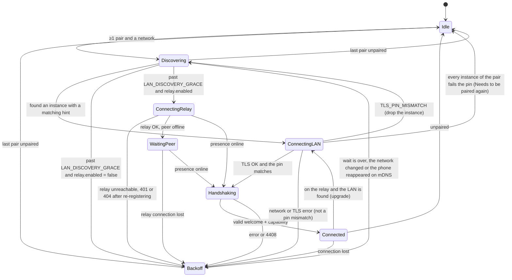

English | [Tiếng Việt](00-common-specs.vi.md)

# 0. Common specifications

> This part is **not a function group**. Every leaf function refers here for components,
> identifiers, data types, message frames, security, error codes, the data model and constants.
> Leaf functions do not redefine these items; a new message type, error code or data column is
> added here first.
>
> The wire format follows the stable conventions in `docs/code-standards.md` exactly: the JSON
> envelope `{v, type, id, ts, payload}` and the binary audio frame `[0x48 0x4C][ver][seq][ts][encrypted]`.

## 0.1 System components

The "Component" column in the step table of every function uses the codes below.

| Code | Component | Platform | Role |
|----|-----------|----------|---------|
| A-UI | HandLive Android app (Activity, Jetpack Compose) | Android 10+ (API 29), target 35 | UI, setup, QR scanning, confirmation |
| A-SVC | `HandLiveService` — foreground service type `connectedDevice` | Android | WSS server (Ktor 3, Netty engine), mDNS (`NsdManager`), relay client, module orchestration |
| A-CLIP | `ClipboardModule`, `ClipboardAccessibilityService`, `ClipboardReadActivity` (transparent), `ClipboardTileService` (Quick Settings tile), `ClipboardShareTarget` (Share target) | Android | Copy detection, reading and writing the clipboard |
| A-SMS | `SmsModule` (`ContentObserver`, `SmsManager`) | Android | Reading, sending and observing SMS |
| A-CALL | `CallModule` (`TelephonyCallback` / broadcast `PHONE_STATE`, `TelecomManager`) | Android | Observing and controlling calls with public APIs (no `InCallService` — see README §5 C12) |
| A-AUD | `CallAudioModule` — interface `CallAudioRelay` with `HfpCallAudioRelay` and `OpusWsCallAudioRelay` | Android | Call audio: HFP monitoring; Opus/WS fallback path |
| A-SHZ | Shizuku UserService (runs as the shell uid) | Android 11+ | Captures call audio (`VOICE_CALL`) and injects audio into the call for the Opus/WS path; optional, requires Shizuku |
| A-CAM | `CameraStreamModule` (Camera2, MediaCodec, libopus JNI) | Android | Camera/microphone streaming |
| M-APP | HandLive for Mac (menu bar, SwiftUI + AppKit) | macOS 13+ | WSS client, UI, clipboard, SMS, calls, video decoding |
| M-HFP | HFP module in M-APP (`IOBluetoothHandsFreeDevice`, behind a protocol abstraction) | macOS | Call audio over SCO |
| M-CAMX | `HandLiveCamera` — CMIOExtension (system extension) | macOS | Virtual camera |
| M-MIC | `HandLiveMic.driver` — AudioServerPlugin | macOS | Virtual microphone |
| I-APP | HandLive for iOS/iPadOS (SwiftUI) | iOS 16+ | WSS client, clipboard, SMS, call information |
| I-NSE | Notification Service Extension | iOS 16+ | Decrypts push content |
| R-API | HandLive Relay (Rust, Actix-web 4 + actix-ws) | Linux VPS | REST, WSS relay, push proxy |
| R-DB | PostgreSQL 16 | Linux VPS | Device registry, pairs, minimal statistics |
| R-KV | Redis 7 | Linux VPS | Presence, routing pub/sub between instances, challenges, rate limits |
| OS | Operating system services (Telecom, SmsManager, ClipboardManager, CoreAudio, CoreMediaIO…) | — | — |
| PUSH | FCM (Android), APNs (iOS) | — | Wake-up, notification delivery |

In a device-to-device connection the **server (S)** is always Android (A-SVC); the **client (C)** is a
Mac or an iPhone/iPad.

## 0.2 Identifiers

| Identifier | Type | Generated by | Rule |
|-----------|------|----------|---------|
| `device_id` | uuid | Each device, on first run | UUIDv8 = first 16 bytes of SHA-256(`ik_sig_pub`), with the 4 version bits set to `8` and the 2 variant bits set to `10`. Self-certifying: any party can check that a `device_id` matches the public key. Changes when the app is reinstalled. |
| `pair_id` | uuid | Mac/iOS during pairing | Random UUIDv4 |
| `id` (envelope) | uuid | Sender | UUIDv7; used to avoid processing duplicates |
| `clip_id`, `transfer_id`, `local_id`, `call_id`, `session_id` | uuid | Per function | UUIDv7 |
| `message_key` | string | Android | `sms:<_id>` with the `_id` of `content://sms` |
| `thread_id` | int64 | Android | `thread_id` of the Telephony provider |
| `entry_id` | int64 | Android | `CallLog.Calls._ID` |

App identifiers and key stores:

| Identifier | Value |
|-----------|---------|
| Android package | `app.handlive.android` |
| Mac bundle / Camera Extension | `app.handlive.mac` / `app.handlive.mac.camera` |
| iOS bundle / Notification Service Extension | `app.handlive.ios` / `app.handlive.ios.nse` |
| App Group (iOS, Mac) | `group.app.handlive` |
| Master key alias in the Android Keystore | `hl_master` (AES-256-GCM, wraps the Tink keyset, `prk_enc`, the PKCS#12 password) |
| Keychain accounts (service `app.handlive.keys`) | `ik_sig`, `ik_dh`, `db_key` (SQLCipher key), `<pair_id>` (`PRK` of each pair) |

## 0.3 Standard data types

| Type | Description | Example |
|------|-------|-------|
| `string` | UTF-8 string | `"Xin chào"` |
| `string(n)` | At most n characters (code points) |  |
| `int32`, `int64` | Signed integer |  |
| `bool` |  | `true` |
| `enum{a\| b}` | One of the listed values | `enum{front\| back}` |
| `uuid` | 36 lowercase characters, with hyphens | `0192f3c1-7c1e-7a55-9d0b-3f4c2a1b9e10` |
| `timestamp` | int64 milliseconds since the Unix epoch, UTC | `1727150000123` |
| `b64` | Standard Base64 (RFC 4648 §4, with padding) |  |
| `b64u` | Base64url without padding (RFC 4648 §5) |  |
| `e164` | Phone number in E.164 format; if it cannot be normalized, the original string is kept | `+84900000123` |
| `bytes` | Raw byte string (binary frames only) |  |
| `object`, `array<T>` | JSON |  |

Convention for the **Input/Output** column in section 3 of every leaf function:

| Value | Meaning |
|---------|-------|
| `Input` | Entered or chosen by the user |
| `Output` | Returned, displayed or played to the user by the system |
| `Input/Output` | The system displays the current value and the user can change it |

Internal fields between components (not displayed) are only described in section 5 (API/service
specification).

## 0.4 Transport channels

### 0.4.1 LAN: mDNS + WSS

- A-SVC listens on TCP **47800** on every interface; if the port is busy it tries 47801–47809 in
  turn and advertises the actual port through the SRV record.
- **TLS 1.3** is mandatory. Self-signed ECDSA P-256 certificate, generated at install time, valid
  for 20 years. The client **pins** the SHA-256 of the certificate (DER) received during pairing; no
  hostname check.
- **mDNS**: service type `_handlive._tcp.local.`; random instance name `HL-<6 hex>`, changed every
  time the service starts (does not reveal the device name). TXT record:

| Key | Value | Present when |
|------|---------|-----------|
| `v` | `1` (protocol version) | Always |
| `h` | Up to 8 hints joined by commas without spaces; one hint per pair = the first 8 lowercase hex characters of HMAC-SHA256(`K_disc`, `"HLDISC1"` ‖ int64 BE `floor(now_ms / 3 600 000)`); `K_disc` = HKDF(`PRK`, info = `"handlive/v1/discovery"`) | There is ≥ 1 pair |
| `pr` | The first 8 lowercase hex characters of SHA-256 over the 32 decoded bytes of `pk` in the QR | Only during the 120 seconds of QR pairing mode |
| `pm` | `1` | Only during the 120 seconds of PIN pairing mode |

The client compares the hints for the previous, the current **and** the next hour (tolerating clock skew of up to an hour either way around the hour boundary). Hints change every hour, so strangers on the LAN cannot track the device
through TXT.

- **WSS endpoints** on A-SVC:

| Path | Purpose | Authentication | Phase |
|-----------|----------|----------|-----------|
| `/v1/pair` | Pairing | HMAC from `pairing_secret` or PIN | P1 |
| `/v1/ctl` | Control channel: every app envelope | Session handshake (0.6.3) | P1 |
| `/v1/stream/call-audio` | Opus/WS call audio — fallback path (AUDIO-04) | Key derived from the ctl session | P4 |
| `/v1/stream/camera` | Camera/microphone stream (separate channel) | Key derived from the ctl session | P5 |

- Each pair has only **one** `/v1/ctl` connection at a time. A new connection that authenticates
  successfully replaces the old one (closed with code 4409).

### 0.4.2 USB (P5, optional)

- M-APP talks directly to the adb server through the host protocol on `127.0.0.1:5037`
  (`host:version`, `host:devices-l`, `host:track-devices`, `forward`, `killforward`) and does not
  run the `adb` command while a server is running — an adb client of a different version would kill
  the server of Android Studio or scrcpy. Only when no server is running does it run
  `adb start-server` with the copy bundled in the app (built from AOSP source, Apache-2.0). Details:
  CAM-04.
- A forward request equivalent to `adb -s <serial> forward tcp:0 tcp:<A-SVC port>` returns a local
  port; connect to `wss://127.0.0.1:<local port>/v1/...` with the **same pinned certificate**.
- Used for `/v1/stream/camera`; `/v1/ctl` only goes over USB when the LAN cannot connect.

### 0.4.3 Relay (P2)

- REST: `https://{RELAY_HOST}/v1/...`, JSON UTF-8. Errors: HTTP status +
  `{"error":{"code":"<CODE>","message":"<description>"}}`.
- WSS: `wss://{RELAY_HOST}/v1/relay`, header `Authorization: Bearer <jwt>`.
- TLS 1.3 with a Let's Encrypt certificate. The client pins the SPKI of ISRG Root X1 and ISRG Root
  X2, plus a backup key held by the project.
- `{RELAY_HOST}` is configured at build time. Examples in the documents use `relay.example.com`.
- The relay has no E2E key: it only sees the routing wrapper, the envelope `type` and the size.
- Routing wrapper (relay ↔ device):
  - WS text frame: `{"to":"<device_id>","env":{<envelope>}}` (device → relay); the relay turns it
    into `{"from":"<device_id>","env":{<envelope>}}`.
  - WS binary frame: `[0x48 0x52]` ("HR") ‖ `ver` (1) ‖ `op` (1, `0x01` = forward) ‖ destination/source
    `device_id` (16 bytes) ‖ the intact HL binary frame.
  - Relay control messages: WS text frame `{"op":"<name>", ...}` (0.7.3).
- Relay handling of `to`/`from` wrappers and `HR` frames (also CONN-03 API 6; the pairing rendezvous
  keeps its own rules, PAIR-01 API 7):
  - The relay checks only the wrapper (a JSON object whose `to` is a `device_id` and whose `env` is an
    object) or the 20-byte `HR` header (magic, `ver` = `0x01`, `op` = `0x01`, `device_id`) and that a
    frame follows it. It never parses or checks the envelope or the inner HL frame; the receiving
    device does (0.5.1, 0.5.2).
  - A malformed wrapper or `HR` frame → relay op `error` with `BAD_REQUEST`; a `to` (or `HR`
    `device_id`) that is not the peer of the sender in a registered, unrevoked pair → `NOT_PAIRED`.
  - A `from` sent by a device is ignored (0.5.1 rule 6): the relay sets `from` itself to the sender's
    `device_id` and re-emits `env` byte for byte, never re-serialized:
    `{"from":"<device_id>","env":<raw env>}`. In an `HR` frame it puts the source `device_id` in place
    of the destination one and forwards the HL frame unchanged.
  - The only exception is the pairing rendezvous (`rv_msg`, PAIR-01 API 7): there the relay reads
    `env.type` and decodes the unencrypted `pair` payload to block a `pair/hello` with
    `mode = "pin"`, because PIN pairing is LAN-only.

### 0.4.4 Push (P2)

- **Android (FCM):** high-priority data message, TTL at most 60 s (the relay caps `ttl_s`),
  `collapse_key` `wake`, **no content**:
  `{"t":"wake","p":"<pair_id>","r":"<reason>"}`.
- **iOS (APNs):** `alert` push, `mutable-content: 1`, `apns-priority: 10`. The default displayed content is generic and is sent as a `loc-key` (a catalog key of the `push` group, 0.12.4) so the iPhone translates it itself; the `hl` field carries the envelope encrypted with `K_push` for I-NSE to decrypt and replace the content. `hl` is standard base64 with padding of the UTF-8 envelope JSON, the same string as `env_b64` of `POST /v1/push` (CONN-04 API 2), ≤ 3,000 characters of base64. Total payload ≤ 4 KB.
- The Mac does not register for push; when it wakes up, M-APP reconnects and syncs from its cursors.

## 0.5 Message frames

### 0.5.1 JSON envelope (WS text frame)

```json
{"v":1,"type":"sms","id":"0192f3c1-7c1e-7a55-9d0b-3f4c2a1b9e10","ts":1727150000123,"payload":"<b64>"}
```

| Field | Type | Required | Description |
|--------|------|----------|-------|
| `v` | int32 | Yes | Envelope version, currently `1` |
| `type` | enum | Yes | Message group (0.7.1) |
| `id` | uuid | Yes | Unique UUIDv7 |
| `ts` | timestamp | Yes | Creation time at the sender |
| `payload` | b64 | Yes | `nonce(24) ‖ ciphertext ‖ tag(16)` of XChaCha20-Poly1305. AAD = UTF-8 of `"<v> | <type> | <id> | <ts>"` in canonical form: `v` and `ts` are decimal numbers without leading zeros, `id` is 36 lowercase characters; the receiver rebuilds the AAD from the parsed values (matches `shared/test-vectors/`) |

Two exceptions:
- Handshake messages (`pair` op `hello` /`offer`/`confirm`/`done`/`error`; `session` op `hello`
  /`welcome`/`error`; `camera` and `call_audio` op `stream_hello` /`stream_welcome`) have
  `payload` = b64 of **unencrypted** JSON (no key exists yet); integrity is protected by the `mac`
  field inside.
- `clipboard` op `chunk` has a **binary** plaintext to avoid double base64: `hdr_len` (uint16 BE) ‖
  JSON `{"op":"chunk","data":{"transfer_id":"<uuid>","index":<int32>}}` ‖ the bytes of the chunk (≤
  `CHUNK_SIZE`).

**Payload plaintext:**

```json
{"op":"send","data":{ }}
```

| Field | Type | Required | Description |
|--------|------|----------|-------|
| `op` | string | Yes | Operation within the group (0.7.1) |
| `data` | object | Yes | Content, depending on the operation |

**Responses** use `type` = `ack`, plaintext:

```json
{"re":"<id of the request>","ok":true,"data":{ }}
{"re":"<id of the request>","ok":false,"error":{"code":"SMS_NO_SERVICE","message":"No cellular service","details":{}}}
```

General rules:

1. Operations marked with an ack in 0.7.1 must be answered with `ack` within **10 s**
   (`REQUEST_TIMEOUT`); after that the caller treats it as a `TIMEOUT` error.
2. The receiver keeps the `id`s processed in the last 5 minutes (LRU of 1,000 entries); on a
   duplicate `id` it resends the earlier `ack` and does not process the message again.
3. Unknown `type` or `op`: for a request → error `ack` `UNSUPPORTED_TYPE`; for an event → ignore
   it.
4. Envelope ≤ 256 KiB. Larger data goes in chunks (`clipboard` op `chunk`).
5. No component logs the `payload` or decrypted content; logs contain only `type`, `op`, size and
   error code.
6. **Forward compatibility** within the same major `protocol`: the receiver ignores unknown fields
   at every level; an unknown enum value does not break the message — an unknown error code is
   handled like `INTERNAL` (keep `message`, log the unknown code), unknown elements of a list (e.g.
   `codecs`, `cameras`) are skipped, an unknown value of a single enum field is treated as "unknown"
   (the dependent feature counts as unsupported). The sender only emits values listed in this
   document; `shared/schemas/` checks the sending side (strictly), not the receiving side.

### 0.5.2 HL binary frame (WS binary frame, only on the `/v1/stream/*` channels)

Exactly the agreed audio format:

| Offset | Length | Field | Description |
|--------|--------|--------|-------|
| 0 | 2 | magic | `0x48 0x4C` ("HL") |
| 2 | 1 | ver | `0x01` |
| 3 | 4 | seq | uint32 BE, increasing per connection, starting at 0 |
| 7 | 4 | ts | uint32 BE, milliseconds since the channel was opened (wraps around) |
| 11 | N | encrypted | `nonce(24) ‖ ciphertext ‖ tag(16)`, AAD = the first 11 bytes |

Plaintext per channel:
- `/v1/stream/call-audio`: one Opus packet.
- `/v1/stream/camera`: `track` (1: `0x01` H.264 video, `0x02` Opus audio) ‖ `flags` (1: bit0
  keyframe, bit1 SPS/PPS codec config, bit2 discontinuity) ‖ `pts_us` (int64 BE) ‖ data.

The receiver drops frames whose `seq` ≤ the largest `seq` received so far (replay protection).

## 0.6 Security

### 0.6.1 Keys

| Key | Algorithm | Stored in | Lifetime |
|------|-----------|---------|----------|
| `ik_sig` | Ed25519 | Android: the private key bytes encrypted with a Tink AEAD keyset (AES256-GCM); the keyset is wrapped by the AES-256 key `hl_master` in the Android Keystore (StrongBox if available) — Tink has no keyset type for raw X25519, so `ik_sig`, `ik_dh` and `PRK` are all stored the same way. Mac/iOS: Keychain | Created on first run; lost when the app is uninstalled |
| `ik_dh` | X25519 | Like `ik_sig` | Like `ik_sig` |
| TLS key | ECDSA P-256 + self-signed certificate | Android: PKCS#12, password wrapped by the Keystore | At install time. A corrupted PKCS#12 store or a lost password → regenerate the key and certificate; every client sees `TLS_PIN_MISMATCH` on every instance → shows "Needs to be paired again" (CONN-01 E2) |
| `pairing_secret` | 32 random bytes | Only in Mac/iOS memory and in the QR | 120 s |
| `PRK` | 32 bytes | Android: column `prk_enc` (Tink AEAD, key in the Keystore). Mac/iOS: Keychain, account = `pair_id` | Per pair |
| `K_push` | HKDF(`PRK`, info = `"handlive/v1/push"`) | Computed when needed | Per pair |
| `k_c2s`, `k_s2c` | 32 bytes | Memory | Per connection; rekey after 24 h or 10,000 envelopes in each direction |

- Keychain: `kSecClassGenericPassword`, service `app.handlive.keys`,
  `kSecAttrAccessibleWhenUnlockedThisDeviceOnly` (per `docs/code-standards.md`). macOS uses the
  data-protection keychain (`kSecUseDataProtectionKeychain = true`) so that this attribute takes
  effect as on iOS; the app must be signed with the `keychain-access-groups` entitlement
  (`docs/deployment-guide.md`); unsigned test processes use an in-memory key store. M-APP and I-APP
  load `PRK` into memory at launch while the device is unlocked and keep it for the whole process
  lifetime, so they can still reconnect while the screen is locked. I-NSE cannot read the key while
  the iPhone is locked → shows generic content (see CONN-04).
- Libraries:
  - Android: Tink 1.14+ (`Ed25519Sign/Verify`, `X25519`, `Hkdf`, `subtle.XChaCha20Poly1305`).
  - Apple: CryptoKit (`Curve25519`, `HKDF`, `HMAC`, `SHA256`, `ChaChaPoly`). CryptoKit has no
    XChaCha20, so XChaCha20-Poly1305 = HChaCha20 (own implementation per draft-irtf-cfrg-xchacha-03
    §2.2, checked with the test vector of §2.2.1) + `ChaChaPoly` with the 12-byte nonce =
    `0x00000000` ‖ the last 8 bytes of the 24-byte nonce.
  - Relay: `ed25519-dalek`, `jsonwebtoken`, `ring`.
- A cross-platform test vector suite (Kotlin ↔ Swift ↔ Rust) covers: `device_id`, `PRK`, the session
  handshake, envelope encryption, the HL frame. It runs in the CI of all three sides.

### 0.6.2 Pairing

- `PRK` = HKDF-SHA256(ikm = X25519(own `ik_dh`, peer `ik_dh`) ‖ `pairing_secret`, salt =
  SHA-256(smaller `device_id` ‖ larger `device_id`, as 16 bytes), info = `"handlive/v1/pair"`, L =
  32).
- With a PIN (fallback): replace `pairing_secret` with `K_pin` = Argon2id(PIN, salt = `nonce_c` ‖ `nonce_s`, t = 3, m = 64 MiB, p = 4, L = 32); the PIN is the UTF-8 bytes of exactly six digits (leading zeros kept), Argon2 version 0x13, no secret and no associated data.
- Strings fed into a MAC, a signature or a hash (device names…) are their UTF-8 bytes as they are, without Unicode normalization (NFC/NFD).
- Pairing attestation (`attestation`): `"HLPAIR1"` ‖ `pair_id` (16) ‖ `device_id` Android(16) ‖
  `device_id` client(16) ‖ `ik_sig_pub` Android(32) ‖ `ik_sig_pub` client(32) ‖ `created_at` (int64
  BE). Both sides sign it with Ed25519; the relay checks both signatures before allowing routing.
- Detailed flow: PAIR-01.

### 0.6.3 Session handshake on `/v1/ctl`

C = Mac/iOS, S = Android. The first two envelopes have an unencrypted payload (0.5.1).

1. C → S, `type` = `session`, op `hello`, data `{protocol, pair_id, device_id, eph, nonce, mac}`
   (`protocol` = 1; a different major → close 4426, see CONN-01; `protocol` is not part of `T1`):
   - `eph` = b64u of an ephemeral X25519 public key; `nonce` = b64u of 32 random bytes.
   - `K_auth` = HKDF(`PRK`, info = `"handlive/v1/session-auth"`); `T1` = `"HL1|hello|"` ‖ `pair_id`
     ‖ `device_id` C ‖ `eph` C ‖ `nonce` C; `mac` = b64u HMAC-SHA256(`K_auth`, `T1`).
2. S checks: the pair exists and is not revoked, `device_id` is the peer's, `mac` is correct
   (constant-time comparison). Failure → op `error`, then close 4401 or 4403.
   S → C, op `welcome`, data `{device_id, eph, nonce, mac}` with `T2` = `"HL1|welcome|"` ‖ `T1` ‖
   `device_id` S ‖ `eph` S ‖ `nonce` S; `mac` = HMAC(`K_auth`, `T2`).
3. C checks `mac`. Both sides compute `secret` = HKDF-SHA256(ikm = X25519(eph) ‖ `PRK`, salt =
   SHA-256(`T2`), info = `"handlive/v1/session"`, L = 64); `k_c2s` = the first 32 bytes, `k_s2c` =
   the next 32 bytes.
4. Every later envelope is encrypted with the key of its sending direction. The first envelope in
   each direction is `capability` op `hello`.
5. Handshake longer than 5 s (`HANDSHAKE_TIMEOUT`) → close 4408.
6. **Rekey**: after 24 h or 10,000 envelopes in one direction, the side that notices first sends
   `session` op `rekey` `{epoch, eph, nonce}` (`epoch` = current key generation + 1; acked with the
   other side's `{epoch, eph, nonce}`, see CONN-02); new keys = HKDF(ikm = X25519(new eph) ‖ old
   `secret`, salt = SHA-256(both nonces), info = `"handlive/v1/rekey"`, L = 64). The side that
   receives the `ack` switches keys immediately; the side that sends the `ack` switches once it has
   sent it; the old keys are kept for another 30 s for envelopes in flight.
7. **Stream channel keys** (`/v1/stream/*`): `K_stream` = HKDF(`secret`, info =
   `"handlive/v1/stream/" ‖ <channel> ‖ "/" ‖ <session_id>`, L = 96) → `k_auth` (32) ‖ `k_c2s` (32) ‖
   `k_s2c` (32). The first message on a stream channel is a `camera` /`call_audio` envelope, op
   `stream_hello` `{session_id, nonce, mac}` with `mac` = HMAC-SHA256(`k_auth`, `"HLSTREAM1|"` ‖
   `session_id` ‖ `nonce_c`); S answers `stream_welcome` `{session_id, nonce, mac}` with `mac` =
   HMAC-SHA256(`k_auth`, `"HLSTREAM1|welcome|"` ‖ `session_id` ‖ `nonce_c` ‖ `nonce_s`) — it binds
   both nonces, so it cannot be replayed. Wrong `mac` → close 4401.
8. **Byte encoding (canonical, matches `shared/test-vectors/`)**:
   - `T1`, `T2` and the `HLSTREAM1` MAC strings concatenate **raw bytes** like `T_offer` (PAIR-01):
     ASCII label ‖ 16-byte uuid ‖ 32-byte `eph` ‖ 32-byte `nonce` (b64u-decoded values). `T1` = 106
     bytes, `T2` = 198 bytes. `protocol` is not part of `T1`; the version is authenticated again in
     `capability` op `hello` (encrypted).
   - An HKDF without a stated salt uses an empty salt; without a stated L, L = 32 (e.g. `K_auth`).
   - Salt of `PRK`: the two `device_id`s are compared as 16 bytes, in unsigned byte order.
   - `info` of `K_stream`: UTF-8 `"handlive/v1/stream/<channel>/<session_id, 36 lowercase characters>"`,
     `<channel>` ∈ {`camera`, `call-audio` }. `K_stream` is always derived from the `secret` of the
     first handshake (epoch 0) for the whole connection, even after a rekey.
   - Rekey: shared = X25519(initiator eph, responder eph); salt = SHA-256(initiator `nonce` ‖
     responder `nonce`); the 64 resulting bytes are split into `k_c2s` ‖ `k_s2c` by the C/S role (not
     by which side initiated) and replace `secret` for the next rekey; `epoch` does not enter the
     KDF.

### 0.6.4 Device authentication with the relay

1. `POST /v1/auth/challenge` `{device_id}` → `{challenge (b64u 32 byte), expires_at}` (60 s).
2. `POST /v1/auth/token` `{device_id, challenge, sig}` with `sig` = Ed25519(`ik_sig`, `"HLAUTH1"` ‖
   challenge (the 32 raw bytes after b64u decoding) ‖ 16-byte `device_id`) → `{access_token, expires_in}`. The
   token is an HS256 JWT, `sub` = `device_id`, valid for 15 minutes.
3. Call REST and open WSS with `Authorization: Bearer <token>`. On 401 `TOKEN_EXPIRED` → repeat
   steps 1–2, then retry once.
4. Every endpoint that uses a JWT checks that `sub` is still in `devices`: if not → 404
   `DEVICE_NOT_FOUND` (the device removed itself from the relay, SET-02), even when the JWT has not
   expired. A row with `revoked_at` (set by operations to lock out an abusive device; the app never
   sets it) → 410 `DEVICE_REVOKED` on registration, challenge, token and every endpoint. A missing
   or malformed `Authorization` header → 401 `SIGNATURE_INVALID`.

### 0.6.5 General security principles

- E2E cannot be turned off. There is no unencrypted sending path.
- No component logs content (clipboard, SMS, phone numbers, contact names).
- SQLite on Mac/iOS is encrypted with SQLCipher (through GRDB); 32-byte key in the Keychain.
- Ed25519 signatures are verified strictly: exactly 64 bytes and S < L (RFC 8032 §5.1.7); never use a lax verifier (negative vectors in `shared/test-vectors/ed25519.json`). Signers may add randomness (CryptoKit does): signatures then differ byte for byte but stay valid, so no side compares signatures as bytes — always verify with the public key.
- The relay only keeps statistics per `device_hash` = SHA-256(16-byte `device_id` ‖ monthly salt),
  for 30 days. The salt is 32 random bytes kept only in Redis (`usage_salt:<YYYY-MM>`, 0.9.4): once
  it expires the hashes can no longer be linked, and a Redis restart mid-month starts a new salt.

## 0.7 Message type catalog

### 0.7.1 Device ↔ device envelopes

`type` keeps exactly the agreed set (`clipboard | sms | call_event | call_audio | pair | ack | ping |
capability`) and adds `session`, `camera` for the session handshake and Phase 5.

| type | op | Direction | Ack | Channel | Function |
|------|----|-------|-----|------|-----------|
| `pair` | `hello` | C→S | returns `offer` | `/v1/pair` | PAIR-01 |
| `pair` | `offer` | S→C | — | `/v1/pair` | PAIR-01 |
| `pair` | `confirm` | C→S | returns `done` | `/v1/pair` | PAIR-01 |
| `pair` | `done` | S→C | — | `/v1/pair` | PAIR-01 |
| `pair` | `error` | Both ways | — | `/v1/pair` | PAIR-01 |
| `pair` | `revoke` | Both ways | Yes | `/v1/ctl` | PAIR-03 |
| `session` | `hello` | C→S | returns `welcome` | `/v1/ctl` | CONN-01 |
| `session` | `welcome` | S→C | — | `/v1/ctl` | CONN-01 |
| `session` | `error` | S→C | — | `/v1/ctl` | CONN-01 |
| `session` | `rekey` | Both ways | Yes | `/v1/ctl` | CONN-02 |
| `session` | `bye` | Both ways | — | `/v1/ctl` | CONN-02, PAIR-03 |
| `capability` | `hello` | Both ways | — | `/v1/ctl` | CONN-01 |
| `capability` | `update` | Both ways | — | `/v1/ctl` | SET-02 |
| `ping` | `ping` | Both ways | Yes | `/v1/ctl` via relay | CONN-02 |
| `clipboard` | `push` | Both ways | Yes | `/v1/ctl` | CLIP-01…04 |
| `clipboard` | `chunk` | Both ways | — | `/v1/ctl` | CLIP-03, CLIP-04 |
| `clipboard` | `cancel` | Both ways | — | `/v1/ctl` | CLIP-03 |
| `clipboard` | `conflict` | Both ways | — | `/v1/ctl` | CLIP-01, CLIP-02 |
| `sms` | `sync` | C→S | Yes (with data) | `/v1/ctl` | SMS-01 |
| `sms` | `history` | C→S | Yes (with data) | `/v1/ctl` | SMS-03 |
| `sms` | `new` | S→C | — | `/v1/ctl` | SMS-02 |
| `sms` | `send` | C→S | Yes (with data) | `/v1/ctl` | SMS-04 |
| `sms` | `status` | S→C | — | `/v1/ctl` | SMS-04 |
| `sms` | `read_changed` | S→C | — | `/v1/ctl` | SMS-05 |
| `call_event` | `state` | S→C | — | `/v1/ctl` | CALL-01…03 |
| `call_event` | `action` | C→S | Yes | `/v1/ctl` | CALL-02, CALL-03 (over WS only `answer`, `reject`, `end`; `hold`, `unhold`, `dtmf`, `mute` go through HFP commands — sent over WS they get `CALL_HFP_REQUIRED`) |
| `call_event` | `hfp_status` | S→C | — | `/v1/ctl` | AUDIO-02 |
| `call_event` | `log_sync` | C→S | Yes (with data) | `/v1/ctl` | CALL-04 |
| `call_event` | `log_new` | S→C | — | `/v1/ctl` | CALL-04 |
| `call_audio` | `open` | C→S | Yes | `/v1/ctl` | AUDIO-04 |
| `call_audio` | `close` | Both ways | Yes | `/v1/ctl` | AUDIO-04 |
| `call_audio` | `stream_hello` / `stream_welcome` | C→S / S→C | — | `/v1/stream/call-audio` | AUDIO-04 |
| `camera` | `start` | C→S | Yes | `/v1/ctl` | CAM-02 |
| `camera` | `ready` | S→C | — | `/v1/ctl` | CAM-02 |
| `camera` | `stop` | Both ways | Yes | `/v1/ctl` | CAM-02 |
| `camera` | `config` | C→S | Yes | `/v1/ctl` | CAM-03 |
| `camera` | `keyframe` | C→S | — | `/v1/ctl` | CAM-02, CAM-04 |
| `camera` | `stats` | C→S | — | `/v1/ctl` | CAM-05 |
| `camera` | `state` | S→C | — | `/v1/ctl` | CAM-02, CAM-05 |
| `camera` | `stream_hello` / `stream_welcome` | C→S / S→C | — | `/v1/stream/camera` | CAM-02, CAM-04 |
| `ack` | — | Both ways | — | Every channel | Response |

### 0.7.2 `capability` op `hello` and `update`

Both sides send it right after the handshake and whenever their configuration changes. An
**effective** feature = turned on on both sides **and** all required operating system permissions
granted.
`capability/update` always carries a **full snapshot** with the same structure as
`capability/hello`; the receiver replaces the whole stored copy and does not merge parts. A feature
the platform does not have (e.g. `camera` on iOS) is absent from `features` and counts as off.
Examples in the function groups may quote only the relevant part.

```json
{
  "op": "hello",
  "data": {
    "protocol": 1,
    "app_version": "1.0.0 (100)",
    "platform": "android",
    "os_version": "15",
    "model": "Pixel 8",
    "features": {
      "clipboard": {"enabled": true, "auto_send": true, "max_text_bytes": 1048576, "max_image_bytes": 10485760, "mimes": ["text/plain", "image/png", "image/jpeg"]},
      "sms": {"enabled": true, "can_send": true, "default_sub_id": 1, "sims": [{"sub_id": 1, "slot": 0, "label": "SIM 1"}]},
      "call": {"enabled": true, "can_answer": true, "can_end": true, "caller_id": true},
      "call_audio": {"enabled": false, "bt_address": null, "hfp_connected": false,
                     "opus_fallback": {"available": false, "downlink": false, "uplink": false, "reason": "shizuku_not_running"}},
      "camera": {"enabled": true, "cameras": ["front", "back"], "max_width": 1920, "max_height": 1080, "max_fps": 30, "codecs": ["h264"]},
      "relay": {"enabled": true}
    },
    "permissions_missing": ["READ_CALL_LOG"]
  }
}
```

| Field | Type | Description |
|--------|------|-------|
| `protocol` | int32 | Protocol version; a different major → close 4426 |
| `app_version`, `os_version`, `model` | string | Shown in PAIR-02 |
| `platform` | enum{android\| macos\| ios\| ipados} |  |
| `features.<name>.enabled` | bool | From the setting key `feature.<name>` (0.9.5) |
| `features.clipboard.auto_send` | bool | Android: Accessibility is on; client: always `true` |
| `features.sms.sims` | array | Android only; the active SIMs (requires `READ_PHONE_STATE`, missing → empty) |
| `features.sms.default_sub_id` | int32 \| null | Android only; the default SIM for sending SMS, null when the phone is set to "Ask every time" |
| `features.sms.notify` | bool | iOS/iPadOS only; equals `sms.notify` — Android only pushes new SMS when `true` |
| `features.call.can_answer`, `can_end` | bool | Android: has the `ANSWER_PHONE_CALLS` permission |
| `features.call.caller_id` | bool | Android: has `READ_CALL_LOG` (incoming number) |
| `features.call.notify` | bool | iOS/iPadOS only; equals `call.notify` — Android only pushes incoming/missed calls when `true` |
| `features.call_audio.bt_address` | string | Mac only: the Mac's Bluetooth address (so that Android can recognize the Mac in its list of HFP devices). Format `AA:BB:CC:DD:EE:FF`, uppercase, separated by `:`; M-APP normalizes it from `IOBluetoothDevice.addressString` (usually lowercase, with hyphens) |
| `features.call_audio.hfp_connected` | bool | Android: the Mac is connected to the phone through the HFP profile |
| `features.call_audio.consented` | bool | Mac only: there is a valid `consent_record` (AUDIO-01). Android rejects every call audio request with `CALL_CONSENT_REQUIRED` while the latest value is `false` |
| `features.call_audio.opus_fallback` | object | Android: capabilities of the Opus/WS path — `available`, `downlink` (can capture the caller's audio), `uplink` (can inject the Mac's voice), `reason` ∈ {`ok`, `disabled`, `android_10`, `shizuku_not_running`, `capture_silent`, `uplink_unsupported`} (`disabled` when `call_audio.allow_opus_fallback = false`) |
| `permissions_missing` | array\<string> | Android only: the missing permissions, used by the client to show guidance |

### 0.7.3 Relay control messages (WS text frame, not E2E)

| op | Direction | Data | Function |
|----|-------|---------|-----------|
| `presence` | R→device | `{pair_id, peer_device_id, online}`; sent for every pair right after connecting, then on every change | CONN-03 |
| `error` | R→device | `{code, message, to?}`; `code` ∈ {`NOT_PAIRED`, `NOT_CONNECTED`, `PAYLOAD_TOO_LARGE`, `RATE_LIMITED`, `BAD_REQUEST`} (CONN-03 API 5; meanings as in 0.8.1 and 0.8.2) | CONN-03 |
| `rv_join` | Device→R | `{rv_id}` — joins the pairing rendezvous | PAIR-01 |
| `rv_joined` | R→device | `{rv_id, peer_present}` | PAIR-01 |
| `rv_msg` | Both ways | `{rv_id, env}` — carries `pair` envelopes through the rendezvous | PAIR-01 |
| `pair_revoked` | R→device | `{pair_id, by}` — the pair has been revoked; sent as soon as it happens and when the device reconnects | PAIR-03 |

### 0.7.4 Relay REST

| Method | Path | Authentication | Description | Function |
|--------|-----------|----------|-------|-----------|
| POST | `/v1/devices` | Signature in the body | Register or update a device | CONN-03 |
| POST | `/v1/auth/challenge` | — | Get a challenge | CONN-03 |
| POST | `/v1/auth/token` | — | Exchange a signature for a JWT | CONN-03 |
| PUT | `/v1/devices/me/push-token` | JWT | Update the push token | CONN-04 |
| DELETE | `/v1/devices/me?revoke_pairs=<bool>` | JWT | Remove the device from the relay. `false`: silent deregistration, the pairs stay usable on the LAN. `true`: revoke every pair and notify the peers. Without `revoke_pairs` → 400 `BAD_REQUEST` (0.8.2) | SET-02 |
| POST | `/v1/pairs` | JWT | Register a pair (attestation + 2 signatures) | PAIR-01 |
| GET | `/v1/pairs` | JWT | List the device's pairs; `?include_revoked=` takes only `true` or `false`, any other value → 400 `BAD_REQUEST` (0.8.2) | PAIR-02, CONN-03 |
| POST | `/v1/pairs/{pair_id}/revoke` | JWT | Revoke a pair | PAIR-03 |
| POST | `/v1/push` | JWT | Send a push to a device of the same pair | CONN-04 |
| GET (WS) | `/v1/relay` | JWT | Relay channel | CONN-03 |

## 0.8 Error codes

Error codes are fixed English identifiers. The accompanying `message` field is an English diagnostic
string for logs, never shown to the user; the UI picks its wording by code through the catalog
(0.12.4).

### 0.8.1 Application error codes (in `ack.error.code`)

| Code | Group | Meaning | Caller handling |
|----|------|---------|----------------|
| `BAD_REQUEST` | General | Missing or invalid field | Fix the programming error; do not retry |
| `UNSUPPORTED_TYPE` | General | `type`/`op` not supported | Hide the feature |
| `UNSUPPORTED_VERSION` | General | Different protocol version | Prompt to update the app |
| `FEATURE_DISABLED` | General | The feature is off on the receiving side | Show "This feature is off on \<device>" |
| `PERMISSION_MISSING` | General | Missing Android permission; `details.permission` | Guide the user to grant the permission (SET-01) |
| `TIMEOUT` | General | No ack within the deadline | Retry according to each function's policy |
| `RATE_LIMITED` | General | Quota exceeded | Wait `details.retry_after_ms` |
| `PAYLOAD_TOO_LARGE` | General | Size limit exceeded | Tell the user |
| `NOT_CONNECTED` | General | No session to the target device | Wait for a connection or queue |
| `INTERNAL` | General | Unexpected error | Retry once, then report the error |
| `QR_INVALID` | Pairing | Wrong QR format or version | Scan again |
| `PAIRING_CLOSED` | Pairing | The 120 s window has ended or the Mac has refreshed the QR | Scan the new QR |
| `PIN_INVALID` | Pairing | Wrong PIN (at most 3 attempts) | Enter it again; after 3 attempts the Mac generates a new PIN |
| `AUTH_FAILED` | Session | Wrong HMAC or signature | No automatic retry |
| `PAIR_UNKNOWN` | Session | No matching pair | Delete the local pair, ask to pair again |
| `PAIR_REVOKED` | Session | The pair has been revoked | Delete the local pair |
| `DECRYPT_FAILED` | Session | The envelope cannot be decrypted | Close the session, reconnect |
| `TLS_PIN_MISMATCH` | Session | The certificate does not match the pin | Drop this instance, try another instance |
| `CLIP_TOO_LARGE` | Clipboard | Exceeds `max_text_bytes`/`max_image_bytes` | Tell the user |
| `CLIP_SENSITIVE_BLOCKED` | Clipboard | Sensitive content blocked | Notify only |
| `CLIP_CHECKSUM_MISMATCH` | Clipboard | Image SHA-256 does not match | Resend once |
| `CLIP_UNSUPPORTED_MIME` | Clipboard | Unsupported format | Ignore |
| `SMS_INVALID_ADDRESS` | SMS | Invalid recipient number | Correct the number |
| `SMS_NO_SERVICE` | SMS | No service | Allow retrying |
| `SMS_RADIO_OFF` | SMS | Airplane mode | Allow retrying |
| `SMS_GENERIC_FAILURE` | SMS | Generic failure from `SmsManager` | Allow retrying |
| `SMS_LIMIT_EXCEEDED` | SMS | The system's sending quota is exceeded | Wait, then retry |
| `SMS_SIM_UNAVAILABLE` | SMS | The selected SIM is not active | Choose another SIM |
| `SMS_THREAD_NOT_FOUND` | SMS | `thread_id` does not exist | Sync again |
| `SMS_CURSOR_INVALID` | SMS | The cursor or `page_token` cannot be read or is stale; `details.reason` ∈ {`cursor`, `page_token`} | Start again from the first page or resync everything |
| `CALL_NOT_FOUND` | Call | `call_id` no longer exists | Refresh the UI from `call_event/state` |
| `CALL_ACTION_NOT_ALLOWED` | Call | The state does not allow the action; `details.reason` ∈ {`state`, `waiting`, `platform`, `system`} | Refresh the UI |
| `CALL_ROUTE_FAILED` | Audio | The audio cannot be routed | Keep the audio on the phone, tell the user |
| `CALL_BT_NOT_CONNECTED` | Audio | The Mac is not connected to the phone over Bluetooth HFP | Guide the user to connect Bluetooth |
| `CALL_CONSENT_REQUIRED` | Audio | The disclosure has not been accepted | Open AUDIO-01 |
| `CALL_HFP_REQUIRED` | Call | The action (hold, DTMF, mute) is only possible through HFP commands when the Mac is connected over Bluetooth; `details.action` = the rejected action | Hide the button or guide the user to connect Bluetooth |
| `SHIZUKU_NOT_RUNNING` | Audio | The Opus/WS path needs Shizuku to be running | Guide the user to start Shizuku (AUDIO-01) |
| `CALL_AUDIO_CAPTURE_UNSUPPORTED` | Audio | This device/Android version cannot capture or cannot inject call audio | Keep the audio on the phone |
| `CAM_BUSY` | Camera | The camera is in use by another app | Tell the user |
| `CAM_UNAVAILABLE` | Camera | The requested camera does not exist | Choose another camera |
| `CAM_USER_CONFIRM_REQUIRED` | Camera | The user has to tap to confirm on the phone | Wait for `camera/ready` |
| `CAM_DENIED_BY_USER` | Camera | The user declined on the phone | Stop |
| `CAM_ENCODER_UNSUPPORTED` | Camera | No suitable H.264 encoder | Lower the resolution or stop |
| `CAM_THERMAL_LIMIT` | Camera | The phone is too hot | Lower the quality or stop |
| `CAM_TRANSPORT_UNSUPPORTED` | Camera | The `/v1/ctl` session runs over the relay; the camera only works over LAN or USB | Show "Requires the same Wi-Fi network or a USB cable" |
| `USB_ADB_UNAUTHORIZED` | USB | The phone has not allowed USB debugging | Guide the user to accept the RSA dialog |
| `USB_ADB_UNAVAILABLE` | USB | USB debugging is off or adb is missing | Open the wizard (CAM-04) |
| `MAC_EXTENSION_NOT_ACTIVE` | Camera | The Camera Extension has not been activated | Open CAM-01 |
| `MAC_MIC_DRIVER_MISSING` | Camera | The virtual microphone driver is not installed | Open CAM-01 |

### 0.8.2 Relay error codes (HTTP)

| HTTP | Code | Meaning |
|------|----|---------|
| 400 | `BAD_REQUEST` | Invalid body |
| 401 | `CHALLENGE_EXPIRED` | The challenge has expired or was already used |
| 401 | `SIGNATURE_INVALID` | Wrong signature or `device_id` does not match the key; also used when the `Authorization` header is missing or malformed |
| 401 | `TOKEN_EXPIRED` | The JWT has expired |
| 403 | `NOT_PAIRED` | The two devices are not in the same valid pair |
| 404 | `DEVICE_NOT_FOUND` | The device is not registered |
| 409 | `PAIR_EXISTS` | `pair_id` already exists with different data |
| 409 | `PUSH_TOKEN_MISSING` | The target device has no push token |
| 410 | `DEVICE_REVOKED` | The device has been removed |
| 413 | `PAYLOAD_TOO_LARGE` | Limit exceeded |
| 429 | `RATE_LIMITED` | Quota exceeded; `Retry-After` header |
| 500 | `INTERNAL` | Server error; the client retries with backoff |
| 502 | `PUSH_PROVIDER_ERROR` | FCM/APNs returned an error |

### 0.8.3 WebSocket close codes

| Code | Meaning |
|----|---------|
| 1000 | Normal closure |
| 4400 | `BAD_REQUEST` |
| 4401 | `AUTH_FAILED` |
| 4403 | `PAIR_REVOKED` |
| 4408 | Handshake timed out |
| 4409 | Session replaced by a newer connection |
| 4410 | `REKEY_FAILED` — rekey without an `ack` within 10 s, an error `ack` or invalid data (CONN-02 E4) |
| 4411 | `IDLE_TIMEOUT` — session silent for more than 45 s (CONN-02) |
| 4426 | `UNSUPPORTED_VERSION` |
| 4429 | `RATE_LIMITED` — more than 16 connections without a handshake, or the IP is blocked for 5 minutes because of a wrong `mac` (CONN-01 API 3, API 4) |
| 4500 | `INTERNAL` |

## 0.9 Data model

> **About "queries taken from code":** as of 2026-09-24 the repo has no source code, so no query
> could be extracted from code. Every query in the documents is a **design**, labeled `[Design]`,
> based on the schema below. Once code exists, replace them with the real queries and drop the label.

### 0.9.1 Android — Room `handlive.db`

```sql
-- [Design] Pairs on the Android side
CREATE TABLE paired_device (
  pair_id           TEXT    PRIMARY KEY,                 -- uuid
  peer_device_id    TEXT    NOT NULL UNIQUE,             -- uuid (UUIDv8 from the key)
  peer_name         TEXT    NOT NULL,
  peer_platform     TEXT    NOT NULL CHECK (peer_platform IN ('macos','ios','ipados')),
  peer_model        TEXT,
  peer_ik_sig_pub   BLOB    NOT NULL,                    -- 32 bytes
  peer_ik_dh_pub    BLOB    NOT NULL,                    -- 32 bytes
  peer_bt_address   TEXT,                                -- Mac only, for audio routing
  prk_enc           BLOB    NOT NULL,                    -- PRK wrapped by Tink AEAD
  attestation       BLOB    NOT NULL,
  sig_self          BLOB    NOT NULL,
  sig_peer          BLOB    NOT NULL,
  features_json     TEXT    NOT NULL DEFAULT '{}',       -- the peer's latest capability
  relay_registered  INTEGER NOT NULL DEFAULT 0,
  created_at        INTEGER NOT NULL,
  last_seen_at      INTEGER,
  revoked_at        INTEGER
);

-- [Design] SMS observer state (single row)
CREATE TABLE sms_observer_state (
  id                INTEGER PRIMARY KEY CHECK (id = 1),
  last_sms_id       INTEGER NOT NULL,                    -- largest _id already emitted as an event
  updated_at        INTEGER NOT NULL
);

-- [Design] Pushes waiting to be sent while the relay has a temporary error
CREATE TABLE push_outbox (
  id                TEXT    PRIMARY KEY,                 -- uuid
  pair_id           TEXT    NOT NULL REFERENCES paired_device(pair_id) ON DELETE CASCADE,
  kind              TEXT    NOT NULL CHECK (kind IN ('wake','alert')),
  body_b64          TEXT,                                -- envelope encrypted with K_push
  collapse_key      TEXT,
  attempts          INTEGER NOT NULL DEFAULT 0,
  next_attempt_at   INTEGER NOT NULL,
  expires_at        INTEGER NOT NULL
);
```

### 0.9.2 Android — system data sources that are read

| URI | Permission | Used for |
|-----|-------|----------|
| `content://sms` (`Telephony.Sms.CONTENT_URI`) | `READ_SMS` | SMS-01…05 |
| `content://mms-sms/conversations?simple=true` (`Telephony.Threads`) | `READ_SMS` | SMS-01 |
| `content://mms-sms/canonical-addresses` | `READ_SMS` | SMS-01 |
| `CallLog.Calls.CONTENT_URI` | `READ_CALL_LOG` | CALL-04 |
| `ContactsContract.PhoneLookup.CONTENT_FILTER_URI` | `READ_CONTACTS` | SMS, CALL (display names) |

HandLive is not the default SMS app, so it **cannot write** to the SMS provider (the system itself
writes messages sent through `SmsManager` into the Sent box).

### 0.9.3 Mac/iOS — SQLite `handlive.sqlite` (GRDB + SQLCipher)

Phase 1 needs only `paired_device`: M-APP keeps it in a file sealed with `db_key` (XChaCha20-Poly1305, AAD `handlive/v1/paired-devices`) behind the same store API; the SQLCipher database below is used from Phase 2 (SMS tables). Data files on the Mac use the "until first unlock" protection class because the menu bar app keeps writing while the screen is locked; the content is sealed with `db_key` anyway.

```sql
-- [Design] Pairs on the client side (the PRK lives in the Keychain, account = pair_id)
CREATE TABLE paired_device (
  pair_id           TEXT    PRIMARY KEY,
  peer_device_id    TEXT    NOT NULL UNIQUE,
  peer_name         TEXT    NOT NULL,
  peer_model        TEXT,
  peer_ik_sig_pub   BLOB    NOT NULL,
  peer_ik_dh_pub    BLOB    NOT NULL,
  peer_tls_sha256   BLOB    NOT NULL,                    -- certificate pin
  attestation       BLOB    NOT NULL,
  sig_self          BLOB    NOT NULL,
  sig_peer          BLOB    NOT NULL,
  features_json     TEXT    NOT NULL DEFAULT '{}',
  last_host         TEXT,
  last_port         INTEGER,
  relay_registered  INTEGER NOT NULL DEFAULT 0,
  created_at        INTEGER NOT NULL,
  last_seen_at      INTEGER,
  revoked_at        INTEGER
);

-- [Design] SMS conversations
CREATE TABLE sms_thread (
  pair_id           TEXT    NOT NULL REFERENCES paired_device(pair_id) ON DELETE CASCADE,
  thread_id         INTEGER NOT NULL,
  addresses_json    TEXT    NOT NULL,                    -- ["+84900000123"]
  display_name      TEXT,
  snippet           TEXT,
  last_ts           INTEGER NOT NULL,
  unread_count      INTEGER NOT NULL DEFAULT 0,          -- as reported by the phone
  local_read_ts     INTEGER NOT NULL DEFAULT 0,          -- read on this device up to this time
  PRIMARY KEY (pair_id, thread_id)
);

-- [Design] SMS messages
CREATE TABLE sms_message (
  pair_id           TEXT    NOT NULL REFERENCES paired_device(pair_id) ON DELETE CASCADE,
  message_key       TEXT    NOT NULL,                    -- sms:<_id>
  thread_id         INTEGER NOT NULL,
  address           TEXT    NOT NULL,
  body              TEXT    NOT NULL,
  box               TEXT    NOT NULL CHECK (box IN ('inbox','sent','outbox','failed','queued')),
  ts                INTEGER NOT NULL,
  ts_sent           INTEGER,
  read              INTEGER NOT NULL DEFAULT 0,
  sub_id            INTEGER,
  local_id          TEXT,                                -- links to sms_outbox when sent from this device
  PRIMARY KEY (pair_id, message_key)
);
CREATE INDEX idx_sms_message_thread_ts ON sms_message (pair_id, thread_id, ts DESC);

-- [Design] Queue of SMS sent from Mac/iOS
CREATE TABLE sms_outbox (
  local_id          TEXT    PRIMARY KEY,
  pair_id           TEXT    NOT NULL REFERENCES paired_device(pair_id) ON DELETE CASCADE,
  thread_id         INTEGER,
  addresses_json    TEXT    NOT NULL,
  body              TEXT    NOT NULL,
  sub_id            INTEGER,
  state             TEXT    NOT NULL CHECK (state IN ('pending','sending','sent','delivered','failed')),
  attempts          INTEGER NOT NULL DEFAULT 0,
  last_error        TEXT,
  created_at        INTEGER NOT NULL,
  updated_at        INTEGER NOT NULL
);

-- [Design] Sync cursors per data stream
CREATE TABLE sync_cursor (
  pair_id           TEXT    NOT NULL REFERENCES paired_device(pair_id) ON DELETE CASCADE,
  stream            TEXT    NOT NULL CHECK (stream IN ('sms','calllog')),
  cursor            TEXT    NOT NULL,                    -- opaque string issued by Android
  updated_at        INTEGER NOT NULL,
  PRIMARY KEY (pair_id, stream)
);

-- [Design] Call log
CREATE TABLE call_log_entry (
  pair_id           TEXT    NOT NULL REFERENCES paired_device(pair_id) ON DELETE CASCADE,
  entry_id          INTEGER NOT NULL,
  number            TEXT,
  display_name      TEXT,
  type              TEXT    NOT NULL CHECK (type IN ('incoming','outgoing','missed','rejected','blocked','voicemail')),
  ts                INTEGER NOT NULL,
  duration_s        INTEGER NOT NULL DEFAULT 0,
  sub_id            INTEGER,
  seen              INTEGER NOT NULL DEFAULT 0,          -- missed call already seen on this device
  PRIMARY KEY (pair_id, entry_id)
);
CREATE INDEX idx_call_log_ts ON call_log_entry (pair_id, ts DESC);

-- [Design] Disclosure consent (Mac only)
CREATE TABLE consent_record (
  id                INTEGER PRIMARY KEY,
  feature           TEXT    NOT NULL CHECK (feature IN ('call_audio')),
  text_version      TEXT    NOT NULL,
  accepted_at       INTEGER NOT NULL,
  revoked_at        INTEGER
);
CREATE UNIQUE INDEX consent_record_active ON consent_record (feature, text_version) WHERE revoked_at IS NULL;
```

iOS uses the same schema, except `consent_record`. The file lives in the App Group container so that
I-APP and I-NSE share its location (I-NSE currently does not write to the DB).

### 0.9.4 Relay — PostgreSQL 16 and Redis 7

```sql
-- [Design] Registered devices
CREATE TABLE devices (
  device_id      UUID        PRIMARY KEY,
  ik_sig_pub     BYTEA       NOT NULL UNIQUE CHECK (octet_length(ik_sig_pub) = 32),
  platform       TEXT        NOT NULL CHECK (platform IN ('android','macos','ios','ipados')),
  app_version    TEXT        NOT NULL,
  push_provider  TEXT        CHECK (push_provider IN ('fcm','apns','apns_sandbox')),
  push_token     TEXT,
  push_topic     TEXT,                                  -- bundle id for APNs
  created_at     TIMESTAMPTZ NOT NULL DEFAULT now(),
  last_seen_at   TIMESTAMPTZ NOT NULL DEFAULT now(),
  revoked_at     TIMESTAMPTZ                            -- set by operations to lock out an abusive device; every endpoint returns 410 (0.6.4)
);

-- [Design] Attested pairs
CREATE TABLE pairs (
  pair_id        UUID        PRIMARY KEY,
  device_a       UUID        NOT NULL REFERENCES devices(device_id) ON DELETE CASCADE,  -- Android
  device_b       UUID        NOT NULL REFERENCES devices(device_id) ON DELETE CASCADE,  -- Mac/iOS
  attestation    BYTEA       NOT NULL,
  sig_a          BYTEA       NOT NULL,
  sig_b          BYTEA       NOT NULL,
  created_at     TIMESTAMPTZ NOT NULL DEFAULT now(),
  revoked_at     TIMESTAMPTZ,
  revoked_by     UUID,
  CHECK (device_a <> device_b)
);
CREATE INDEX idx_pairs_device_a ON pairs (device_a) WHERE revoked_at IS NULL;
CREATE INDEX idx_pairs_device_b ON pairs (device_b) WHERE revoked_at IS NULL;

-- [Design] Minimal statistics, kept for 30 days
CREATE TABLE usage_daily (
  day            DATE        NOT NULL,
  device_hash    BYTEA       NOT NULL,
  envelopes      BIGINT      NOT NULL DEFAULT 0,
  bytes          BIGINT      NOT NULL DEFAULT 0,
  pushes         INTEGER     NOT NULL DEFAULT 0,
  PRIMARY KEY (day, device_hash)
);
```

Redis keys `[Design]`:

| Key / channel | Type | TTL | Description |
|-------------|------|-----|-------|
| `chal:<device_id>` | string | 60 s | Pending challenge |
| `presence:<device_id>` | string (instance id) | 60 s, renewed every 20 s | Which instance the device is connected to |
| `dev:<device_id>` | pub/sub channel | — | The instance holding the connection subscribes; other instances publish the frames to forward |
| `rv:<rv_id>` | set (device_id) | 180 s | Pairing rendezvous |
| `revoked_notice:<device_id>` | set (`<pair_id>\| <by>`) | 30 days | Pairs revoked because the peer deleted all of its data (`DELETE /v1/devices/me?revoke_pairs=true`, the `pairs` row has already been deleted); `pair_revoked` is sent when the device connects to the relay, then the key is deleted |
| `rl:<device_id>:<group>:<minute>` | counter | 120 s | Rate limit |
| `rl:ip:<ip>:reg:<hour>` | counter | 3,600 s | 10 new registrations/hour/IP (CONN-03 API 1); the IP is taken from `X-Forwarded-For` only when the request comes from a trusted reverse proxy (Phase 2) |
| `usage_salt:<YYYY-MM>` | string (32 random bytes) | 40 days | Monthly salt of `device_hash` (0.6.5), kept only here |
| `maintenance:<day>` | string (lock) | 25 h | Only the instance that takes it runs the daily cleanup |
| `wake:<device_id>:<reason>` | string | 300 s | Coalesces repeated `wake` pushes with the same reason (CONN-04 API 2); released when the send fails |

Data cleanup runs daily:

```sql
-- [Design] Delete statistics older than 30 days
DELETE FROM usage_daily WHERE day < current_date - INTERVAL '30 days';
-- [Design] Delete devices inactive for 180 days (their pairs are deleted by CASCADE)
DELETE FROM devices WHERE last_seen_at < now() - INTERVAL '180 days';
```

### 0.9.5 Settings keys

Android stores them with DataStore; Mac/iOS with `UserDefaults` (the App Group suite on iOS). The
SET-02 function manages these keys.

| Key | Type | Default | Platform | Description |
|------|------|----------|----------|-------|
| `setup.started_at`, `setup.completed_at` | timestamp | empty | All | Initial setup progress (SET-01, SET-03) |
| `perm.requested` | set\<string> | empty | Android | Permissions already requested, to tell "not asked yet" from "permanently denied" |
| `feature.clipboard` | bool | `true` | All | Clipboard sync |
| `feature.sms` | bool | `true` | All | SMS bridge |
| `feature.call` | bool | `true` | All | Call information and control |
| `feature.call_audio` | bool | `false` | Android, Mac | Turned on after AUDIO-01 |
| `call_audio.allow_opus_fallback` | bool | `true` | Android, Mac | Allow the Opus/WS path when HFP cannot be used (requires Shizuku) |
| `call_audio.phone_bt_address` | string | empty | Mac | Bluetooth address of the phone the user chose for HFP |
| `feature.camera` | bool | `false` | Android, Mac | Turned on after CAM-01 |
| `relay.enabled` | bool | `true` | All | Allow using the relay outside the LAN |
| `clip.auto_send` | bool | `true` | Android | Send automatically on copy (requires Accessibility, D4) |
| `clip.a11y_consent_at` | timestamp | empty | Android | When the user accepted the Accessibility disclosure |
| `clip.send_images` | bool | `true` | All | Sync images |
| `clip.block_sensitive` | bool | `true` | All | Block sensitive content |
| `clip.auto_clear_s` | int32 | `60` | All | Automatically clear the received clipboard; `0` = off; choices 0/60/300 |
| `clip.seen_change_count` | int64 | `0` | iOS (internal) | The `UIPasteboard.changeCount` already seen, so that sending is only suggested when there is new content |
| `sms.notify` | bool | `true` | Mac, iOS | New SMS notifications |
| `sms.preview` | bool | `true` | Mac, iOS | Show the content in notifications |
| `call.notify` | bool | `true` | Mac, iOS | Call notifications |
| `call.ringtone` | bool | `true` | Mac | Play a ringtone for incoming calls (respects Focus) |
| `call.quick_replies` | array\<string> | 2 default templates | Mac | Quick replies when declining, at most 6 templates × 160 characters |
| `cam.default_camera` | enum{front\| back} | `front` | Mac | Default camera |
| `cam.default_quality` | enum{auto\| 480p\| 720p\| 1080p} | `auto` | Mac | Default quality |
| `cam.usb_boost` | bool | `true` | Mac | Switch to USB automatically when a cable is plugged in |
| `cam.usb_wizard_dismissed` | bool | `false` | Mac | The user chose "Don't Ask Again" in the USB debugging wizard (CAM-04) |
| `mac.menu_bar_extra` | bool | `true` | Mac | Show the HandLive icon in the menu bar; off → the app keeps its Dock icon and its menu bar as the entry point (SET-03 step 6) |

## 0.10 Configuration constants

| Constant | Value | Notes |
|------|---------|---------|
| `CTL_PORT` | 47800 (fallback 47801–47809) |  |
| `PAIRING_WINDOW` | 120 s | QR/PIN validity and the `/v1/pair` window |
| `PIN_MAX_ATTEMPTS` | 3 |  |
| `HANDSHAKE_TIMEOUT` | 5 s |  |
| `REQUEST_TIMEOUT` | 10 s | Waiting for `ack` |
| `WS_PING_INTERVAL` / `PONG_TIMEOUT` | 15 s / 10 s | LAN: WS ping; relay: plus an E2E `ping` every 30 s |
| `RECONNECT_BACKOFF` | 0.5 → 1 → 2 → 4 → 8 → 16 → 30 s, jitter ±20 % | Back to 0 on success; retry immediately on a network change or wake-up |
| `LAN_DISCOVERY_GRACE` | 10 s | Not seen on the LAN after 10 s → try the relay |
| `REKEY_AFTER` | 24 h or 10,000 envelopes/direction |  |
| `DEDUP_WINDOW` | 5 minutes / 1,000 ids |  |
| `CLIP_MAX_TEXT` | 1 MiB (UTF-8) |  |
| `CLIP_MAX_IMAGE` | 10 MiB |  |
| `CHUNK_SIZE` | 64 KiB | Before encryption |
| `CLIP_POLL_MAC` | 500 ms |  |
| `CLIP_CONFLICT_WINDOW` | 500 ms |  |
| `CLIP_INLINE_MAX` | 180 KiB | Larger text goes in chunks (keeps the envelope < 256 KiB after base64) |
| `CLIP_LOOP_WINDOW` | 5 s | Ignore local changes with the same hash as the clip just received |
| `CLIP_DETECT_DEBOUNCE` | 300 ms | Coalesces copy signals from Accessibility |
| `CLIP_TRANSFER_IDLE_TIMEOUT` | 30 s | No new chunk → `clipboard/cancel` |
| `CALL_REJECT_BG_TIMEOUT` | 15 s | Deadline for sending the reject command from an iOS notification |
| `CALL_HFP_CMD_TIMEOUT` | 2 s | Waiting for the response to an HFP command |
| `CLIP_STALE_AFTER` | 120 s | Older clips are not sent on reconnect |
| `SMS_SYNC_THREADS` | 200 most recent conversations | First sync |
| `SMS_SYNC_PER_THREAD` | 50 messages |  |
| `SMS_PAGE_MAX` | 500 messages / `ack` |  |
| `SMS_HISTORY_PAGE` | 50 messages |  |
| `SMS_OUTBOX_RETRY` | 3 times: 5 s, 15 s, 45 s | Resend `sms/send` while there is no `ack` |
| `SMS_OUTBOX_EXPIRY` | 24 h | Waiting messages past the deadline → `failed` |
| `SMS_PAGE_MAX_BYTES` | 180 KiB plaintext / `ack` | Together with `SMS_PAGE_MAX` keeps the envelope < 256 KiB |
| `SMS_BODY_MAX` | 1,600 characters |  |
| `SMS_SEND_MATCH_WINDOW` | 60 s | A new provider row in `sent` or `failed` matches a `SendRegistry` entry still waiting for its final result or at most this long after it (SMS-04 API 4) |
| `SMS_QUICK_REPLY_TIMEOUT` | 20 s | Quick reply from an iOS notification |
| `SMS_OBSERVER_DEBOUNCE` | 100 ms | Coalesces the `onChange` calls of the SMS provider |
| `CALLLOG_SYNC_WINDOW` | 90 days, at most 500 entries |  |
| `JWT_TTL` / `CHALLENGE_TTL` | 15 minutes / 60 s |  |
| `RELAY_IDLE_DISCONNECT` | 5 minutes | Android leaves the relay after this long without a relayed session, a rendezvous or traffic (CONN-03 step 2) |
| `RELAY_RATE_LIMIT` | REST 60/minute, push 30/minute, 2 MiB/s per pair and direction |  |
| `CAM_DEFAULT` | 1280×720, 30 fps, 2.5 Mbps |  |
| `CAM_IDR_INTERVAL` | 1 s (WiFi), 2 s (USB) |  |
| `CAM_STATS_INTERVAL` | 1 s |  |
| `USB_DETECT_DEBOUNCE` | 1 s |  |
| `USB_SWITCH_GAP` | < 500 ms | Target interruption when switching USB ↔ Wi-Fi |
| `CAM_STOP_GRACE` | 5 s | Wait after the last consumer is gone before stopping |
| `CAM_CONFIRM_TIMEOUT` | 60 s | Deadline for the user to tap "Turn On" on the phone |
| `CAM_STREAM_OPEN_TIMEOUT` | 10 s | Deadline for M-APP to open `/v1/stream/camera` after `camera/ready` |
| `CAM_STREAM_STALL` | 1 s | No frame received while a track is on → the stream channel counts as broken |
| `CAM_PLACEHOLDER_AFTER` | 1 s | No frame from the sink → M-CAMX shows a placeholder frame |
| `CAM_JITTER_BUFFER` | 20–60 ms, adaptive | Camera audio on the Mac side |
| `CAM_KEYFRAME_MIN_GAP` | 500 ms | Minimum interval between two IDR requests |
| `CAM_MAX_FRAME` | 1 MiB | Per HL frame |
| `CAM_CONGESTION` / `CAM_RECOVER_AFTER` | `queue_delay_ms` > 150 or frame loss > 5 % continuously for 3 s / stable for 10 s | CAM-05 |
| `MIC_DRIVER_WAIT` | 60 s | Wait for the microphone device to appear after the driver is installed |

## 0.11 Client connection states (Mac/iOS)



Status shown to the user (PAIR-02): `Idle` /`Backoff` → "Disconnected"; `Discovering`
/`Connecting*`/`Handshaking` → "Connecting…"; `WaitingPeer` → "Phone offline";
`Connected` → "Connected via Wi-Fi" or "Connected over the internet" ("Connected via USB" while the
camera channel uses USB); every instance fails the pin → "Needs to be paired again". With the peer's
name (status line, screen-reader text of the status indicator): "Connected via Wi-Fi to \<name>",
"Connected over the internet to \<name>", "Connected via USB to \<name>".

From any state: losing the network → `Idle` (CONN-02 E1); removing the last pair → `Idle`. In `Backoff`, seeing a hint-matching instance on mDNS again ends the wait (except after `AUTH_FAILED`); `4429 RATE_LIMITED` backs off on the normal schedule.

## 0.12 Localization and the UI string catalog

Decision C20: English (`en`) is the default language, the source language and the fallback
language; Vietnamese (`vi`) is the second language. Adding a language later only takes adding its
translations to the catalog and its language code to each platform's list.

### 0.12.1 Catalog `shared/strings/ui-strings.json`

The single source of every displayed string on Android, macOS and iOS/iPadOS: labels, buttons,
menus, notifications, notification channel names, permission purpose strings, accessibility labels,
error messages. Code contains no display text. Schema: `shared/strings/ui-strings.schema.json`.

```jsonc
{
  "version": 1,
  "source_language": "en",
  "languages": ["en", "vi"],
  "strings": [
    {
      "key": "status.connected_wifi",
      "en": "Connected via Wi-Fi",
      "vi": "Đã kết nối qua Wi-Fi",
      "comment": "StatusIndicator when the session runs over the LAN (0.11)",
      "platforms": ["android", "macos", "ios"],
      "specs": ["PAIR-02", "CONN-01"]
    },
    {
      "key": "pairing.paired_with",
      "en": "Paired with {device_name}",
      "vi": "Đã ghép nối với {device_name}",
      "comment": "Feedback when pairing completes",
      "platforms": ["android", "macos", "ios"],
      "args": [{"name": "device_name", "type": "string"}],
      "specs": ["PAIR-01"]
    },
    {
      "key": "sms.unread_count",
      "en": {"one": "{count} unread message", "other": "{count} unread messages"},
      "vi": {"other": "{count} tin chưa đọc"},
      "comment": "Accessibility label of ThreadRow",
      "platforms": ["macos", "ios"],
      "args": [{"name": "count", "type": "int"}],
      "specs": ["SMS-03"]
    },
    {
      "key": "infoplist.microphone_usage",
      "plist_key": "NSMicrophoneUsageDescription",
      "en": "HandLive uses the microphone so you can talk during calls transferred from your phone.",
      "vi": "HandLive dùng micro để bạn nói trong cuộc gọi chuyển từ điện thoại.",
      "comment": "Purpose string of the microphone permission request (SET-03, AUDIO-01)",
      "platforms": ["macos"],
      "specs": ["SET-03", "AUDIO-01"]
    }
  ]
}
```

| Field | Rule |
|--------|---------|
| `key` | Lowercase `[a-z0-9_]`, 2–5 segments joined by dots; the first segment is the group: `common`, `setup`, `settings`, `pairing`, `status`, `menu`, `clipboard`, `sms`, `call`, `call_audio`, `camera`, `permission`, `notification`, `push`, `error`, `a11y`, `infoplist`. A key does not change when its wording is edited; a change of meaning creates a new key. Keys stay unique after `.` is turned into `_` (Android resource names) |
| `en`, `vi` | A string; or a CLDR plural object: `en` has `one` and `other`, `vi` only has `other`; a plural string takes exactly one argument, named `count`. The generators pass `count` as an integer, so it is printed without digit grouping ("1500 messages", not "1,500 messages"); plural texts must read well that way. Never empty; every key has every language in `languages` |
| `args` | Parameters `{name}` with `type` ∈ `string`, `int`, `double`. Every translation uses exactly the same set of parameters, in any order within the sentence (the generator converts them to positional parameters). Dates, times and numbers are formatted before they are passed in (0.12.3), except the `count` of a plural string (row `en`, `vi`) |
| `comment` | Required: where the string appears and its length limit, if any — context for translators |
| `platforms` | Subset of `android`, `macos`, `ios` |
| `specs` | IDs of the leaf functions (or `0.x` sections) that specify the string |
| `plist_key` | `infoplist` group only: the Info.plist key name (purpose string, display name) |

Style per the design system, section "Writing": English uses title-style capitalization for buttons,
menus and window titles; Vietnamese capitalizes only the first word and uses Apple-style tone marks;
"…" is a single character; proper names are not translated (HandLive, Wi-Fi, Bluetooth, USB, SIM,
Mac, iPhone, iPad, Android); system item names follow the operating system's own wording in each
language ("Privacy & Security" / "Quyền riêng tư & Bảo mật"). The English detailed design (`X.md`)
contains the `en` strings, the Vietnamese version (`X.vi.md`) the `vi` strings; catalog and
documents must match.

### 0.12.2 Generating each platform's resources

| Platform | Output | Rules |
|----------|--------|---------|
| Android | `values/strings.xml` (en, default), `values-vi/strings.xml` | A Gradle task in `buildSrc` generates them into the build directory (not committed) and attaches them to the `res` sources; resource name = the key with `.` turned into `_`; plurals become `<plurals>`; `{name}` becomes `%1$s` / `%1$d` in `args` order; escape `'`, `"`, a leading `@` or `?`, and line breaks. `res/xml/locales_config.xml` (en, vi) with `android:localeConfig`; `androidResources.localeFilters` = en, vi |
| Apple | `Localizable.xcstrings`, `InfoPlist.xcstrings` (`sourceLanguage` en) for each target that uses them; Swift accessors generated alongside | A script in `apple/` (like the token generator) generates and commits them; a `--check` test compares them with the catalog; keys keep the dotted form; plurals become String Catalog plural variations; `{name}` becomes `%1$@` / `%1$lld`. `project.yml`: `developmentLanguage: en`, `knownRegions` includes en and vi |

### 0.12.3 Language selection and formatting

- By default, follow the system's list of preferred languages: the first language present in the
  catalog is used, otherwise English.
- A separate choice for HandLive: on Android 13+ the system's App languages page (thanks to
  `locales_config`); on Android 10–12 SET-02 field 32; on iOS/iPadOS Settings › HandLive › Language;
  on macOS System Settings › General › Language & Region › Applications.
- Changing the language does not drop the session; the UI is rebuilt through the operating system's
  own mechanism.
- Dates, times, numbers, file sizes, durations and phone numbers are formatted with the system
  formatters for the displayed locale (design system, section "Writing").
- The two devices of a pair may use different languages; each device displays in its own language.

### 0.12.4 The protocol carries no display text

- Error codes (0.8) are identifiers; the accompanying `message` (`ack.error.message`,
  `session/error`, relay REST errors) is an English diagnostic string for logs. The UI picks its
  sentence by code through the catalog (group `error`).
- Push (0.4.4, CONN-04): FCM carries no content; the APNs `aps.alert` only has a `loc-key` (a
  catalog key of the `push` group), which the iPhone translates into its own language; I-NSE builds
  the decrypted content with the app's catalog.
- User content (SMS messages, device names, contact names, saved quick replies) is not translated.
  The default quick replies (`call.quick_replies`) come from the catalog in the language active when
  they are created; after that they are user data.
- The relay has no UI and sends no display text.

### 0.12.5 Checks

- `shared/tools/strings/check_strings.py`: valid against the schema; unique keys (also after `.` is
  turned into `_`); every language present; the same parameter set in every translation; valid
  plurals; no empty strings, no leading or trailing whitespace, "…" instead of "..."; `vi` uses
  Apple-style tone marks; `specs` are real IDs. `--docs <docs/detailed-design>` reports strings that
  are not found in the documents (warning only).
- Android: lint `HardcodedText`, `MissingTranslation`, `ExtraTranslation` are errors; the
  pseudo-locales `en-XA`, `ar-XB` are enabled for debug builds.
- Apple: a test compares the generated files with the catalog; no hard-coded display strings outside
  the generated accessors.
- Check the UI in both `en` and `vi` at the largest text size (AX5, font scale 200%); Vietnamese
  sentences are usually 20–30% longer than English ones.
