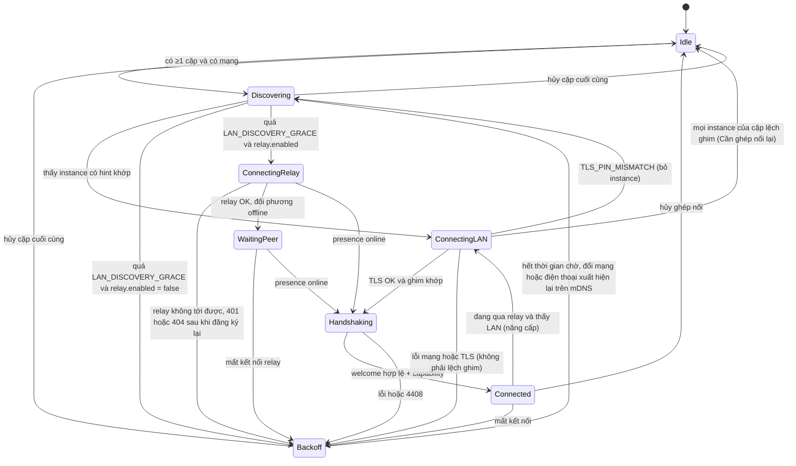

[English](00-common-specs.md) | Tiếng Việt

# 0. Đặc tả dùng chung

> Phần này **không phải nhóm chức năng**. Mọi chức năng lá tham chiếu tới đây cho thành phần, định
> danh, kiểu dữ liệu, khung tin, bảo mật, mã lỗi, mô hình dữ liệu và hằng số. Chức năng lá không
> định nghĩa lại các mục này; nếu cần loại tin, mã lỗi hay cột dữ liệu mới thì bổ sung vào đây
> trước.
>
> Wire format bám đúng quy ước ổn định trong `docs/code-standards.md`: envelope JSON
> `{v, type, id, ts, payload}` và khung audio nhị phân `[0x48 0x4C][ver][seq][ts][encrypted]`.

## 0.1 Thành phần hệ thống

Cột "Thành phần" trong bảng bước của mọi chức năng dùng các mã dưới đây.

| Mã | Thành phần | Nền tảng | Vai trò |
|----|-----------|----------|---------|
| A-UI | Ứng dụng HandLive Android (Activity, Jetpack Compose) | Android 10+ (API 29), target 35 | Giao diện, thiết lập, quét QR, xác nhận |
| A-SVC | `HandLiveService` — foreground service type `connectedDevice` | Android | WSS server (Ktor 3, engine Netty), mDNS (`NsdManager`), relay client, điều phối module |
| A-CLIP | `ClipboardModule`, `ClipboardAccessibilityService`, `ClipboardReadActivity` (trong suốt), `ClipboardTileService` (ô Cài đặt nhanh), `ClipboardShareTarget` (đích Chia sẻ) | Android | Phát hiện sao chép, đọc và ghi clipboard |
| A-SMS | `SmsModule` (`ContentObserver`, `SmsManager`) | Android | Đọc, gửi, theo dõi SMS |
| A-CALL | `CallModule` (`TelephonyCallback` / broadcast `PHONE_STATE`, `TelecomManager`) | Android | Theo dõi và điều khiển cuộc gọi bằng API công khai (không dùng `InCallService` — xem README §5 C12) |
| A-AUD | `CallAudioModule` — interface `CallAudioRelay` với `HfpCallAudioRelay` và `OpusWsCallAudioRelay` | Android | Âm thanh cuộc gọi: theo dõi HFP; đường dự phòng Opus/WS |
| A-SHZ | Shizuku UserService (chạy uid shell) | Android 11+ | Thu âm cuộc gọi (`VOICE_CALL`) và chèn âm vào cuộc gọi cho đường Opus/WS; tùy chọn, cần Shizuku |
| A-CAM | `CameraStreamModule` (Camera2, MediaCodec, libopus JNI) | Android | Phát camera/micro |
| M-APP | HandLive for Mac (menu bar, SwiftUI + AppKit) | macOS 13+ | Client WSS, UI, clipboard, SMS, cuộc gọi, giải mã video |
| M-HFP | Mô-đun HFP trong M-APP (`IOBluetoothHandsFreeDevice`, sau protocol abstraction) | macOS | Âm thanh cuộc gọi qua SCO |
| M-CAMX | `HandLiveCamera` — CMIOExtension (system extension) | macOS | Camera ảo |
| M-MIC | `HandLiveMic.driver` — AudioServerPlugin | macOS | Micro ảo |
| I-APP | HandLive for iOS/iPadOS (SwiftUI) | iOS 16+ | Client WSS, clipboard, SMS, thông tin cuộc gọi |
| I-NSE | Notification Service Extension | iOS 16+ | Giải mã nội dung push |
| R-API | HandLive Relay (Rust, Actix-web 4 + actix-ws) | Linux VPS | REST, WSS relay, push proxy |
| R-DB | PostgreSQL 16 | Linux VPS | Registry thiết bị, cặp ghép nối, thống kê tối thiểu |
| R-KV | Redis 7 | Linux VPS | Presence, pub/sub định tuyến giữa các instance, challenge, rate limit |
| OS | Dịch vụ hệ điều hành (Telecom, SmsManager, ClipboardManager, CoreAudio, CoreMediaIO…) | — | — |
| PUSH | FCM (Android), APNs (iOS) | — | Đánh thức, đẩy thông báo |

Trong kết nối thiết bị–thiết bị: **máy chủ (S)** luôn là Android (A-SVC); **máy khách (C)** là Mac
hoặc iPhone/iPad.

## 0.2 Định danh

| Định danh | Kiểu | Sinh bởi | Quy tắc |
|-----------|------|----------|---------|
| `device_id` | uuid | Mỗi thiết bị, lần chạy đầu | UUIDv8 = 16 byte đầu của SHA-256(`ik_sig_pub`), đặt 4 bit version = `8`, 2 bit variant = `10`. Tự chứng thực: bất kỳ bên nào cũng kiểm được `device_id` khớp khóa công khai. Đổi khi cài lại ứng dụng. |
| `pair_id` | uuid | Mac/iOS khi ghép nối | UUIDv4 ngẫu nhiên |
| `id` (envelope) | uuid | Bên gửi | UUIDv7; dùng chống xử lý trùng |
| `clip_id`, `transfer_id`, `local_id`, `call_id`, `session_id` | uuid | Theo chức năng | UUIDv7 |
| `message_key` | string | Android | `sms:<_id>` với `_id` của `content://sms` |
| `thread_id` | int64 | Android | `thread_id` của Telephony provider |
| `entry_id` | int64 | Android | `CallLog.Calls._ID` |

Định danh ứng dụng và kho khóa:

| Định danh | Giá trị |
|-----------|---------|
| Gói Android | `app.handlive.android` |
| Bundle Mac / Camera Extension | `app.handlive.mac` / `app.handlive.mac.camera` |
| Bundle iOS / Notification Service Extension | `app.handlive.ios` / `app.handlive.ios.nse` |
| App Group (iOS, Mac) | `group.app.handlive` |
| Alias khóa chủ trong Android Keystore | `hl_master` (AES-256-GCM, bọc keyset Tink, `prk_enc`, mật khẩu PKCS#12) |
| Account Keychain (service `app.handlive.keys`) | `ik_sig`, `ik_dh`, `db_key` (khóa SQLCipher), `<pair_id>` (`PRK` của từng cặp) |

## 0.3 Kiểu dữ liệu chuẩn

| Kiểu | Mô tả | Ví dụ |
|------|-------|-------|
| `string` | Chuỗi UTF-8 | `"Xin chào"` |
| `string(n)` | Tối đa n ký tự (code point) |  |
| `int32`, `int64` | Số nguyên có dấu |  |
| `bool` |  | `true` |
| `enum{a\| b}` | Một trong các giá trị liệt kê | `enum{front\| back}` |
| `uuid` | 36 ký tự thường, có gạch | `0192f3c1-7c1e-7a55-9d0b-3f4c2a1b9e10` |
| `timestamp` | int64 mili-giây Unix epoch UTC | `1727150000123` |
| `b64` | Base64 chuẩn (RFC 4648 §4, có padding) |  |
| `b64u` | Base64url không padding (RFC 4648 §5) |  |
| `e164` | Số điện thoại chuẩn E.164; nếu không chuẩn hóa được thì giữ chuỗi gốc | `+84900000123` |
| `bytes` | Chuỗi byte thô (chỉ trong khung nhị phân) |  |
| `object`, `array<T>` | JSON |  |

Quy ước cột **Input/Output** ở mục 3 của mỗi chức năng lá:

| Giá trị | Nghĩa |
|---------|-------|
| `Input` | Người dùng nhập hoặc chọn |
| `Output` | Hệ thống trả về, hiển thị hoặc phát cho người dùng |
| `Input/Output` | Hệ thống hiển thị giá trị hiện tại, người dùng sửa được |

Trường nội bộ giữa các thành phần (không hiển thị) chỉ mô tả ở mục 5 (Đặc tả API/service).

## 0.4 Kênh truyền

### 0.4.1 LAN: mDNS + WSS

- A-SVC lắng nghe TCP **47800** trên mọi interface; nếu cổng bận thử lần lượt 47801–47809 và quảng
  bá cổng thực qua bản ghi SRV.
- **TLS 1.3** bắt buộc. Chứng chỉ tự ký ECDSA P-256, sinh lúc cài, hạn 20 năm. Client **ghim**
  SHA-256 của chứng chỉ (DER) nhận được lúc ghép nối; không kiểm hostname.
- **mDNS**: kiểu dịch vụ `_handlive._tcp.local.`; tên instance ngẫu nhiên `HL-<6 hex>`, đổi mỗi lần
  dịch vụ khởi động (không lộ tên máy). Bản ghi TXT:

| Khóa | Giá trị | Khi nào có |
|------|---------|-----------|
| `v` | `1` (phiên bản giao thức) | Luôn |
| `h` | Tối đa 8 hint, nối bằng dấu phẩy không có khoảng trắng; mỗi cặp ghép nối 1 hint = 8 ký tự hex đầu (chữ thường) của HMAC-SHA256(`K_disc`, `"HLDISC1"` ‖ int64 BE `floor(now_ms / 3 600 000)`); `K_disc` = HKDF(`PRK`, info = `"handlive/v1/discovery"`) | Khi có ≥ 1 cặp |
| `pr` | 8 ký tự hex đầu (chữ thường) của SHA-256 trên 32 byte `pk` đã giải b64u trong QR | Chỉ trong 120 giây của chế độ ghép nối QR |
| `pm` | `1` | Chỉ trong 120 giây của chế độ ghép nối PIN |

Client so hint với giờ trước, giờ hiện tại **và** giờ sau (chịu lệch đồng hồ tới một giờ theo cả hai chiều quanh mốc giờ). Hint đổi mỗi giờ
nên người lạ trong LAN không theo dõi được thiết bị qua TXT.

- **Endpoint WSS** trên A-SVC:

| Đường dẫn | Mục đích | Xác thực | Giai đoạn |
|-----------|----------|----------|-----------|
| `/v1/pair` | Ghép nối | HMAC từ `pairing_secret` hoặc PIN | P1 |
| `/v1/ctl` | Kênh điều khiển: mọi envelope ứng dụng | Bắt tay phiên (0.6.3) | P1 |
| `/v1/stream/call-audio` | Âm thanh cuộc gọi Opus/WS — đường dự phòng (AUDIO-04) | Khóa dẫn xuất từ phiên ctl | P4 |
| `/v1/stream/camera` | Luồng camera/micro (kênh riêng) | Khóa dẫn xuất từ phiên ctl | P5 |

- Mỗi cặp chỉ có **một** kết nối `/v1/ctl` tại một thời điểm. Kết nối mới xác thực thành công thay
  thế kết nối cũ (đóng mã 4409).

### 0.4.2 USB (P5, tùy chọn)

- M-APP nói chuyện trực tiếp với adb server qua giao thức host trên `127.0.0.1:5037`
  (`host:version`, `host:devices-l`, `host:track-devices`, `forward`, `killforward`), không gọi lệnh
  `adb` khi server đã chạy — client adb khác phiên bản sẽ tắt server của Android Studio hoặc scrcpy.
  Chỉ khi chưa có server mới chạy `adb start-server` bằng bản đi kèm ứng dụng (build từ mã nguồn
  AOSP, Apache-2.0). Chi tiết: CAM-04.
- Yêu cầu chuyển tiếp tương đương `adb -s <serial> forward tcp:0 tcp:<cổng A-SVC>` trả về cổng cục
  bộ; kết nối `wss://127.0.0.1:<cổng cục bộ>/v1/...` với **cùng chứng chỉ ghim**.
- Dùng cho `/v1/stream/camera`; `/v1/ctl` chỉ đi qua USB khi LAN không kết nối được.

### 0.4.3 Relay (P2)

- REST: `https://{RELAY_HOST}/v1/...`, JSON UTF-8. Lỗi: HTTP status +
  `{"error":{"code":"<MÃ>","message":"<mô tả>"}}`.
- WSS: `wss://{RELAY_HOST}/v1/relay`, header `Authorization: Bearer <jwt>`.
- TLS 1.3 với chứng chỉ Let's Encrypt. Client ghim SPKI của ISRG Root X1 và ISRG Root X2, cộng một
  khóa dự phòng do dự án giữ.
- `{RELAY_HOST}` cấu hình lúc build. Ví dụ trong tài liệu dùng `relay.example.com`.
- Relay không có khóa E2E: chỉ thấy lớp bọc định tuyến, `type` của envelope và kích thước.
- Lớp bọc định tuyến (relay ↔ thiết bị):
  - WS text frame: `{"to":"<device_id>","env":{<envelope>}}` (thiết bị → relay); relay chuyển thành
    `{"from":"<device_id>","env":{<envelope>}}`.
  - WS binary frame: `[0x48 0x52]` ("HR") ‖ `ver` (1) ‖ `op` (1, `0x01` = chuyển tiếp) ‖ `device_id`
    đích/nguồn (16 byte) ‖ khung nhị phân HL nguyên vẹn.
  - Tin điều khiển của relay: WS text frame `{"op":"<tên>", ...}` (0.7.3).
- Relay xử lý lớp bọc `to`/`from` và khung `HR` như sau (cũng ở CONN-03 API 6; điểm hẹn ghép nối
  giữ quy tắc riêng, PAIR-01 API 7):
  - Relay chỉ kiểm lớp bọc (object JSON có `to` là một `device_id` và `env` là object) hoặc header
    `HR` 20 byte (magic, `ver` = `0x01`, `op` = `0x01`, `device_id`), và phải có khung theo sau.
    Relay không phân tích, không kiểm envelope hay khung HL bên trong. Thiết bị nhận mới kiểm các
    phần đó (0.5.1, 0.5.2).
  - Lớp bọc hoặc khung `HR` sai định dạng → op `error` của relay với `BAD_REQUEST`. `to` (hoặc
    `device_id` của `HR`) không phải đối phương của người gửi trong một cặp đã đăng ký, chưa thu hồi
    → `NOT_PAIRED`.
  - `from` do thiết bị gửi lên bị bỏ qua (0.5.1 quy tắc 6). Relay tự đặt `from` là `device_id` của
    người gửi và phát lại `env` nguyên từng byte, không tuần tự hóa lại:
    `{"from":"<device_id>","env":<env gốc>}`. Với khung `HR`, relay thay `device_id` đích bằng
    `device_id` nguồn và chuyển khung HL đi nguyên vẹn.

### 0.4.4 Push (P2)

- **Android (FCM):** data message ưu tiên cao, TTL 60 s, **không chứa nội dung**:
  `{"t":"wake","p":"<pair_id>","r":"<lý do>"}`.
- **iOS (APNs):** push `alert`, `mutable-content: 1`, `apns-priority: 10`. Nội dung hiển thị mặc định chung chung, gửi bằng `loc-key` (khóa catalog nhóm `push`, 0.12.4) để iPhone tự dịch; trường `hl` chứa envelope đã mã hóa bằng `K_push` để I-NSE giải mã và thay nội dung. `hl` là base64 chuẩn có padding của JSON envelope dạng UTF-8, cùng chuỗi với `env_b64` của `POST /v1/push` (CONN-04 API 2), dài ≤ 3 000 ký tự base64. Tổng payload ≤ 4 KB.
- Mac không đăng ký push; khi thức dậy, M-APP kết nối lại và đồng bộ theo con trỏ.

## 0.5 Khung tin

### 0.5.1 Envelope JSON (WS text frame)

```json
{"v":1,"type":"sms","id":"0192f3c1-7c1e-7a55-9d0b-3f4c2a1b9e10","ts":1727150000123,"payload":"<b64>"}
```

| Trường | Kiểu | Bắt buộc | Mô tả |
|--------|------|----------|-------|
| `v` | int32 | Có | Phiên bản envelope, hiện là `1` |
| `type` | enum | Có | Nhóm tin (0.7.1) |
| `id` | uuid | Có | UUIDv7 duy nhất |
| `ts` | timestamp | Có | Thời điểm tạo ở bên gửi |
| `payload` | b64 | Có | `nonce(24) ‖ ciphertext ‖ tag(16)` của XChaCha20-Poly1305. AAD = UTF-8 của `"<v> | <type> | <id> | <ts>"` ở dạng chuẩn tắc: `v` và `ts` là số thập phân không số 0 đầu, `id` 36 ký tự chữ thường; bên nhận dựng lại AAD từ giá trị đã parse (khớp `shared/test-vectors/`) |

Hai ngoại lệ:
- Tin bắt tay (`pair` op `hello` /`offer`/`confirm`/`done`/`error`; `session` op `hello`
  /`welcome`/`error`; `camera` và `call_audio` op `stream_hello` /`stream_welcome`) có `payload` =
  b64 của JSON **chưa mã hóa** (khóa chưa tồn tại); toàn vẹn được bảo vệ bằng trường `mac` bên
  trong.
- `clipboard` op `chunk` có plaintext **nhị phân** để tránh base64 hai lần: `hdr_len` (uint16 BE) ‖
  JSON `{"op":"chunk","data":{"transfer_id":"<uuid>","index":<int32>}}` ‖ bytes của khối (≤
  `CHUNK_SIZE`).

**Plaintext của payload:**

```json
{"op":"send","data":{ }}
```

| Trường | Kiểu | Bắt buộc | Mô tả |
|--------|------|----------|-------|
| `op` | string | Có | Thao tác trong nhóm (0.7.1) |
| `data` | object | Có | Nội dung theo thao tác |

**Phản hồi** dùng `type` = `ack`, plaintext:

```json
{"re":"<id của yêu cầu>","ok":true,"data":{ }}
{"re":"<id của yêu cầu>","ok":false,"error":{"code":"SMS_NO_SERVICE","message":"No cellular service","details":{}}}
```

Quy tắc chung:

1. Thao tác đánh dấu "có ack" ở 0.7.1 phải được trả `ack` trong **10 s** (`REQUEST_TIMEOUT`); quá
   hạn bên gọi coi là lỗi `TIMEOUT`.
2. Bên nhận lưu `id` đã xử lý trong 5 phút gần nhất (LRU 1 000 mục); gặp `id` trùng thì gửi lại
   `ack` cũ, không xử lý lại.
3. `type` hoặc `op` không biết: nếu là yêu cầu → `ack` lỗi `UNSUPPORTED_TYPE`; nếu là sự kiện → bỏ
   qua.
4. Envelope ≤ 256 KiB. Dữ liệu lớn hơn đi theo chunk (`clipboard` op `chunk`).
5. Không ghi log `payload` hay nội dung đã giải mã ở bất kỳ thành phần nào; log chỉ gồm `type`,
   `op`, kích thước, mã lỗi.
6. **Tương thích tiến** trong cùng major `protocol`: bên nhận bỏ qua trường lạ ở mọi cấp; giá trị
   enum lạ không làm hỏng tin — mã lỗi lạ xử lý như `INTERNAL` (giữ `message`, ghi log mã lạ), phần
   tử lạ trong danh sách (vd. `codecs`, `cameras`) bị bỏ qua, trường enum đơn lạ coi là "không biết"
   (tính năng phụ thuộc coi như không hỗ trợ). Bên gửi chỉ phát giá trị có trong tài liệu này;
   `shared/schemas/` kiểm phía gửi (chặt), không phải phía nhận.

### 0.5.2 Khung nhị phân HL (WS binary frame, chỉ trên kênh `/v1/stream/*`)

Theo đúng định dạng audio đã chốt:

| Offset | Độ dài | Trường | Mô tả |
|--------|--------|--------|-------|
| 0 | 2 | magic | `0x48 0x4C` ("HL") |
| 2 | 1 | ver | `0x01` |
| 3 | 4 | seq | uint32 BE, tăng dần theo kết nối, bắt đầu 0 |
| 7 | 4 | ts | uint32 BE, mili-giây kể từ lúc mở kênh (quay vòng) |
| 11 | N | encrypted | `nonce(24) ‖ ciphertext ‖ tag(16)`, AAD = 11 byte đầu |

Plaintext theo kênh:
- `/v1/stream/call-audio`: một gói Opus.
- `/v1/stream/camera`: `track` (1: `0x01` video H.264, `0x02` audio Opus) ‖ `flags` (1: bit0
  keyframe, bit1 codec config SPS/PPS, bit2 discontinuity) ‖ `pts_us` (int64 BE) ‖ dữ liệu.

Bên nhận bỏ khung có `seq` ≤ `seq` lớn nhất đã nhận (chống phát lại).

## 0.6 Bảo mật

### 0.6.1 Khóa

| Khóa | Thuật toán | Nơi lưu | Vòng đời |
|------|-----------|---------|----------|
| `ik_sig` | Ed25519 | Android: byte khóa riêng mã hóa bằng keyset Tink AEAD (AES256-GCM); keyset bọc bởi khóa AES-256 `hl_master` trong Android Keystore (StrongBox nếu có) — Tink không có kiểu keyset cho X25519 thô nên `ik_sig`, `ik_dh`, `PRK` cùng một cách lưu. Mac/iOS: Keychain | Tạo lần chạy đầu; mất khi gỡ ứng dụng |
| `ik_dh` | X25519 | Như `ik_sig` | Như `ik_sig` |
| Khóa TLS | ECDSA P-256 + chứng chỉ tự ký | Android: PKCS#12, mật khẩu bọc bởi Keystore | Lúc cài. Kho PKCS#12 hỏng hoặc mất mật khẩu → sinh lại khóa và chứng chỉ; mọi client thấy `TLS_PIN_MISMATCH` ở mọi instance → hiển thị "Cần ghép nối lại" (CONN-01 E2) |
| `pairing_secret` | 32 byte ngẫu nhiên | Chỉ trong bộ nhớ Mac/iOS và trong QR | 120 s |
| `PRK` | 32 byte | Android: cột `prk_enc` (Tink AEAD, khóa trong Keystore). Mac/iOS: Keychain, account = `pair_id` | Theo cặp ghép nối |
| `K_push` | HKDF(`PRK`, info = `"handlive/v1/push"`) | Tính khi cần | Theo cặp |
| `k_c2s`, `k_s2c` | 32 byte | Bộ nhớ | Theo kết nối; rekey sau 24 h hoặc 10 000 envelope mỗi chiều |

- Keychain: `kSecClassGenericPassword`, service `app.handlive.keys`,
  `kSecAttrAccessibleWhenUnlockedThisDeviceOnly` (theo `docs/code-standards.md`). macOS dùng
  data-protection keychain (`kSecUseDataProtectionKeychain = true`) để thuộc tính này có hiệu lực
  như iOS; app phải ký với entitlement `keychain-access-groups` (`docs/deployment-guide.md`); tiến
  trình test không ký dùng kho khóa trong bộ nhớ. M-APP và I-APP nạp `PRK` vào bộ nhớ khi khởi động
  lúc máy đang mở khóa và giữ trong suốt vòng đời tiến trình, nên vẫn kết nối lại được khi màn hình
  khóa. I-NSE không đọc được khóa khi iPhone đang khóa → hiển thị nội dung chung chung (xem
  CONN-04).
- Thư viện:
  - Android: Tink 1.14+ (`Ed25519Sign/Verify`, `X25519`, `Hkdf`, `subtle.XChaCha20Poly1305`).
  - Apple: CryptoKit (`Curve25519`, `HKDF`, `HMAC`, `SHA256`, `ChaChaPoly`). CryptoKit không có
    XChaCha20, nên XChaCha20-Poly1305 = HChaCha20 (tự cài theo draft-irtf-cfrg-xchacha-03 §2.2, kiểm
    bằng test vector §2.2.1) + `ChaChaPoly` với nonce 12 byte = `0x00000000` ‖ 8 byte cuối của nonce
    24 byte.
  - Relay: `ed25519-dalek`, `jsonwebtoken`, `ring`.
- Bộ test vector liên nền tảng (Kotlin ↔ Swift ↔ Rust) cho: `device_id`, `PRK`, bắt tay phiên, mã
  hóa envelope, khung HL. Chạy trong CI của cả ba phía.

### 0.6.2 Ghép nối

- `PRK` = HKDF-SHA256(ikm = X25519(`ik_dh` mình, `ik_dh` đối phương) ‖ `pairing_secret`, salt =
  SHA-256(`device_id` nhỏ hơn ‖ `device_id` lớn hơn, dạng 16 byte), info = `"handlive/v1/pair"`, L =
  32).
- Với PIN (dự phòng): thay `pairing_secret` bằng `K_pin` = Argon2id(PIN, salt = `nonce_c` ‖ `nonce_s`, t = 3, m = 64 MiB, p = 4, L = 32); PIN là byte UTF-8 của đúng 6 chữ số (giữ số 0 đầu), Argon2 phiên bản 0x13, không có secret và dữ liệu phụ.
- Chuỗi đưa vào MAC, chữ ký hoặc hash (tên thiết bị…) là byte UTF-8 nguyên văn, không chuẩn hóa Unicode (NFC/NFD).
- Bản chứng thực ghép nối (`attestation`): `"HLPAIR1"` ‖ `pair_id` (16) ‖ `device_id` Android(16) ‖
  `device_id` client(16) ‖ `ik_sig_pub` Android(32) ‖ `ik_sig_pub` client(32) ‖ `created_at` (int64
  BE). Cả hai bên ký Ed25519; relay kiểm hai chữ ký trước khi cho phép định tuyến.
- Luồng chi tiết: PAIR-01.

### 0.6.3 Bắt tay phiên trên `/v1/ctl`

C = Mac/iOS, S = Android. Hai envelope đầu có payload chưa mã hóa (0.5.1).

1. C → S, `type` = `session`, op `hello`, data `{protocol, pair_id, device_id, eph, nonce, mac}`
   (`protocol` = 1; khác major → đóng 4426, xem CONN-01; `protocol` không nằm trong `T1`):
   - `eph` = b64u khóa công khai X25519 tạm; `nonce` = b64u 32 byte ngẫu nhiên.
   - `K_auth` = HKDF(`PRK`, info = `"handlive/v1/session-auth"`); `T1` = `"HL1|hello|"` ‖ `pair_id`
     ‖ `device_id` C ‖ `eph` C ‖ `nonce` C; `mac` = b64u HMAC-SHA256(`K_auth`, `T1`).
2. S kiểm: cặp tồn tại, chưa thu hồi, `device_id` đúng đối phương, `mac` đúng (so sánh hằng thời
   gian). Sai → op `error` rồi đóng 4401 hoặc 4403.
   S → C, op `welcome`, data `{device_id, eph, nonce, mac}` với `T2` = `"HL1|welcome|"` ‖ `T1` ‖
   `device_id` S ‖ `eph` S ‖ `nonce` S; `mac` = HMAC(`K_auth`, `T2`).
3. C kiểm `mac`. Hai bên tính `secret` = HKDF-SHA256(ikm = X25519(eph) ‖ `PRK`, salt =
   SHA-256(`T2`), info = `"handlive/v1/session"`, L = 64); `k_c2s` = 32 byte đầu, `k_s2c` = 32 byte
   sau.
4. Mọi envelope sau đó mã hóa bằng khóa theo chiều gửi. Envelope đầu tiên mỗi chiều là `capability`
   op `hello`.
5. Bắt tay quá 5 s (`HANDSHAKE_TIMEOUT`) → đóng 4408.
6. **Rekey**: sau 24 h hoặc 10 000 envelope một chiều, bên phát hiện trước gửi `session` op `rekey`
   `{epoch, eph, nonce}` (`epoch` = thế hệ khóa hiện tại + 1; có ack chứa `{epoch, eph, nonce}` của
   bên kia, xem CONN-02); khóa mới = HKDF(ikm = X25519(eph mới) ‖ `secret` cũ, salt = SHA-256(hai
   nonce), info = `"handlive/v1/rekey"`, L = 64). Bên nhận `ack` chuyển khóa ngay; bên gửi `ack`
   chuyển sau khi gửi xong; khóa cũ giữ thêm 30 s cho envelope đang bay.
7. **Khóa kênh stream** (`/v1/stream/*`): `K_stream` = HKDF(`secret`, info =
   `"handlive/v1/stream/" ‖ <kênh> ‖ "/" ‖ <session_id>`, L = 96) → `k_auth` (32) ‖ `k_c2s` (32) ‖
   `k_s2c` (32). Tin đầu tiên trên kênh stream là envelope `camera` /`call_audio` op `stream_hello`
   `{session_id, nonce, mac}` với `mac` = HMAC-SHA256(`k_auth`, `"HLSTREAM1|"` ‖ `session_id` ‖
   `nonce_c`); S trả `stream_welcome` `{session_id, nonce, mac}` với `mac` = HMAC-SHA256(`k_auth`,
   `"HLSTREAM1|welcome|"` ‖ `session_id` ‖ `nonce_c` ‖ `nonce_s`) — gắn cả hai nonce nên không phát
   lại được. Sai `mac` → đóng 4401.
8. **Mã hóa byte (chuẩn tắc, khớp `shared/test-vectors/`)**:
   - `T1`, `T2`, chuỗi MAC `HLSTREAM1` ghép **byte thô** như `T_offer` (PAIR-01): nhãn ASCII ‖ uuid
     16 byte ‖ `eph` 32 byte ‖ `nonce` 32 byte (giá trị đã giải b64u). `T1` = 106 byte, `T2` = 198
     byte. `protocol` không vào `T1`; phiên bản được xác thực lại trong `capability` op `hello` (đã
     mã hóa).
   - HKDF không ghi salt thì salt rỗng; không ghi L thì L = 32 (vd. `K_auth`).
   - Salt của `PRK`: hai `device_id` so theo 16 byte, thứ tự byte không dấu.
   - `info` của `K_stream`: UTF-8 `"handlive/v1/stream/<kênh>/<session_id 36 ký tự chữ thường>"`,
     `<kênh>` ∈ {`camera`, `call-audio` }. `K_stream` luôn dẫn từ `secret` của bắt tay đầu (epoch 0)
     trong suốt kết nối, kể cả sau rekey.
   - Rekey: shared = X25519(eph bên khởi tạo, eph bên nhận); salt = SHA-256(`nonce` bên khởi tạo ‖
     `nonce` bên nhận); 64 byte kết quả chia `k_c2s` ‖ `k_s2c` theo vai C/S (không theo bên khởi
     tạo) và thay `secret` cho lần rekey sau; `epoch` không vào KDF.

### 0.6.4 Xác thực thiết bị với relay

1. `POST /v1/auth/challenge` `{device_id}` → `{challenge (b64u 32 byte), expires_at}` (60 s).
2. `POST /v1/auth/token` `{device_id, challenge, sig}` với `sig` = Ed25519(`ik_sig`, `"HLAUTH1"` ‖
   challenge (32 byte thô đã giải b64u) ‖ `device_id` 16 byte) → `{access_token, expires_in}`. Token
   JWT HS256, `sub` = `device_id`, hạn 15 phút.
3. Gọi REST và mở WSS với `Authorization: Bearer <token>`. Nhận 401 `TOKEN_EXPIRED` → lặp lại bước
   1–2 rồi thử lại một lần.
4. Mọi endpoint dùng JWT kiểm `sub` còn trong `devices`: không còn → 404 `DEVICE_NOT_FOUND` (thiết
   bị đã tự xóa khỏi relay, SET-02), dù JWT còn hạn. Dòng có `revoked_at` (vận hành khóa thiết bị
   lạm dụng; ứng dụng không bao giờ đặt) → 410 `DEVICE_REVOKED` ở đăng ký, challenge, token và mọi
   endpoint. Thiếu hoặc sai header `Authorization` → 401 `SIGNATURE_INVALID`.

### 0.6.5 Nguyên tắc bảo mật chung

- E2E không tắt được. Không có đường gửi không mã hóa.
- Không log nội dung (clipboard, SMS, số điện thoại, tên liên hệ) ở bất kỳ thành phần nào.
- SQLite trên Mac/iOS mã hóa bằng SQLCipher (qua GRDB); khóa 32 byte trong Keychain.
- Chữ ký Ed25519 kiểm chặt: đúng 64 byte và S < L (RFC 8032 §5.1.7); không dùng hàm kiểm dễ dãi (vector âm trong `shared/test-vectors/ed25519.json`). Bộ ký có thể thêm ngẫu nhiên (CryptoKit): chữ ký khác từng byte nhưng vẫn hợp lệ, nên không bên nào so chữ ký theo byte — luôn kiểm bằng khóa công khai.
- Relay chỉ lưu thống kê theo `device_hash` = SHA-256(`device_id` ‖ muối theo tháng), giữ 30 ngày.

## 0.7 Danh mục loại tin

### 0.7.1 Envelope thiết bị ↔ thiết bị

`type` giữ đúng tập đã chốt (`clipboard | sms | call_event | call_audio | pair | ack | ping |
capability`) và bổ sung `session`, `camera` cho bắt tay phiên và Phase 5.

| type | op | Chiều | Ack | Kênh | Chức năng |
|------|----|-------|-----|------|-----------|
| `pair` | `hello` | C→S | trả `offer` | `/v1/pair` | PAIR-01 |
| `pair` | `offer` | S→C | — | `/v1/pair` | PAIR-01 |
| `pair` | `confirm` | C→S | trả `done` | `/v1/pair` | PAIR-01 |
| `pair` | `done` | S→C | — | `/v1/pair` | PAIR-01 |
| `pair` | `error` | Hai chiều | — | `/v1/pair` | PAIR-01 |
| `pair` | `revoke` | Hai chiều | Có | `/v1/ctl` | PAIR-03 |
| `session` | `hello` | C→S | trả `welcome` | `/v1/ctl` | CONN-01 |
| `session` | `welcome` | S→C | — | `/v1/ctl` | CONN-01 |
| `session` | `error` | S→C | — | `/v1/ctl` | CONN-01 |
| `session` | `rekey` | Hai chiều | Có | `/v1/ctl` | CONN-02 |
| `session` | `bye` | Hai chiều | — | `/v1/ctl` | CONN-02, PAIR-03 |
| `capability` | `hello` | Hai chiều | — | `/v1/ctl` | CONN-01 |
| `capability` | `update` | Hai chiều | — | `/v1/ctl` | SET-02 |
| `ping` | `ping` | Hai chiều | Có | `/v1/ctl` qua relay | CONN-02 |
| `clipboard` | `push` | Hai chiều | Có | `/v1/ctl` | CLIP-01…04 |
| `clipboard` | `chunk` | Hai chiều | — | `/v1/ctl` | CLIP-03, CLIP-04 |
| `clipboard` | `cancel` | Hai chiều | — | `/v1/ctl` | CLIP-03 |
| `clipboard` | `conflict` | Hai chiều | — | `/v1/ctl` | CLIP-01, CLIP-02 |
| `sms` | `sync` | C→S | Có (kèm dữ liệu) | `/v1/ctl` | SMS-01 |
| `sms` | `history` | C→S | Có (kèm dữ liệu) | `/v1/ctl` | SMS-03 |
| `sms` | `new` | S→C | — | `/v1/ctl` | SMS-02 |
| `sms` | `send` | C→S | Có (kèm dữ liệu) | `/v1/ctl` | SMS-04 |
| `sms` | `status` | S→C | — | `/v1/ctl` | SMS-04 |
| `sms` | `read_changed` | S→C | — | `/v1/ctl` | SMS-05 |
| `call_event` | `state` | S→C | — | `/v1/ctl` | CALL-01…03 |
| `call_event` | `action` | C→S | Có | `/v1/ctl` | CALL-02, CALL-03 (qua WS chỉ `answer`, `reject`, `end`; `hold`, `unhold`, `dtmf`, `mute` đi bằng lệnh HFP — gửi qua WS nhận `CALL_HFP_REQUIRED`) |
| `call_event` | `hfp_status` | S→C | — | `/v1/ctl` | AUDIO-02 |
| `call_event` | `log_sync` | C→S | Có (kèm dữ liệu) | `/v1/ctl` | CALL-04 |
| `call_event` | `log_new` | S→C | — | `/v1/ctl` | CALL-04 |
| `call_audio` | `open` | C→S | Có | `/v1/ctl` | AUDIO-04 |
| `call_audio` | `close` | Hai chiều | Có | `/v1/ctl` | AUDIO-04 |
| `call_audio` | `stream_hello` / `stream_welcome` | C→S / S→C | — | `/v1/stream/call-audio` | AUDIO-04 |
| `camera` | `start` | C→S | Có | `/v1/ctl` | CAM-02 |
| `camera` | `ready` | S→C | — | `/v1/ctl` | CAM-02 |
| `camera` | `stop` | Hai chiều | Có | `/v1/ctl` | CAM-02 |
| `camera` | `config` | C→S | Có | `/v1/ctl` | CAM-03 |
| `camera` | `keyframe` | C→S | — | `/v1/ctl` | CAM-02, CAM-04 |
| `camera` | `stats` | C→S | — | `/v1/ctl` | CAM-05 |
| `camera` | `state` | S→C | — | `/v1/ctl` | CAM-02, CAM-05 |
| `camera` | `stream_hello` / `stream_welcome` | C→S / S→C | — | `/v1/stream/camera` | CAM-02, CAM-04 |
| `ack` | — | Hai chiều | — | Mọi kênh | Phản hồi |

### 0.7.2 `capability` op `hello` và `update`

Hai bên gửi ngay sau bắt tay và mỗi khi cấu hình đổi. Tính năng **hiệu lực** = bật ở cả hai phía
**và** đủ quyền hệ điều hành. `capability/update` luôn mang **ảnh chụp đầy đủ** cùng cấu trúc
`capability/hello`; bên nhận thay toàn bộ bản đã lưu, không gộp từng phần. Tính năng mà nền tảng
không có (ví dụ `camera` trên iOS) vắng mặt trong `features` và được coi là tắt. Ví dụ trong các
nhóm chức năng có thể chỉ trích phần liên quan.

```json
{
  "op": "hello",
  "data": {
    "protocol": 1,
    "app_version": "1.0.0 (100)",
    "platform": "android",
    "os_version": "15",
    "model": "Pixel 8",
    "features": {
      "clipboard": {"enabled": true, "auto_send": true, "max_text_bytes": 1048576, "max_image_bytes": 10485760, "mimes": ["text/plain", "image/png", "image/jpeg"]},
      "sms": {"enabled": true, "can_send": true, "default_sub_id": 1, "sims": [{"sub_id": 1, "slot": 0, "label": "SIM 1"}]},
      "call": {"enabled": true, "can_answer": true, "can_end": true, "caller_id": true},
      "call_audio": {"enabled": false, "bt_address": null, "hfp_connected": false,
                     "opus_fallback": {"available": false, "downlink": false, "uplink": false, "reason": "shizuku_not_running"}},
      "camera": {"enabled": true, "cameras": ["front", "back"], "max_width": 1920, "max_height": 1080, "max_fps": 30, "codecs": ["h264"]},
      "relay": {"enabled": true}
    },
    "permissions_missing": ["READ_CALL_LOG"]
  }
}
```

| Trường | Kiểu | Mô tả |
|--------|------|-------|
| `protocol` | int32 | Phiên bản giao thức; khác major → đóng 4426 |
| `app_version`, `os_version`, `model` | string | Hiển thị ở PAIR-02 |
| `platform` | enum{android\| macos\| ios\| ipados} |  |
| `features.<tên>.enabled` | bool | Theo khóa cài đặt `feature.<tên>` (0.9.5) |
| `features.clipboard.auto_send` | bool | Android: Accessibility đang bật; client: luôn `true` |
| `features.sms.sims` | array | Chỉ Android; SIM đang hoạt động (cần `READ_PHONE_STATE`, thiếu → rỗng) |
| `features.sms.default_sub_id` | int32 \| null | Chỉ Android; SIM gửi SMS mặc định, null khi máy đặt "luôn hỏi" |
| `features.sms.notify` | bool | Chỉ iOS/iPadOS; bằng `sms.notify` — Android chỉ push SMS mới khi `true` |
| `features.call.can_answer`, `can_end` | bool | Android: có quyền `ANSWER_PHONE_CALLS` |
| `features.call.caller_id` | bool | Android: có `READ_CALL_LOG` (số gọi đến) |
| `features.call.notify` | bool | Chỉ iOS/iPadOS; bằng `call.notify` — Android chỉ push cuộc gọi đến/nhỡ khi `true` |
| `features.call_audio.bt_address` | string | Chỉ Mac: địa chỉ Bluetooth của Mac (để Android nhận ra Mac trong danh sách thiết bị HFP). Dạng `AA:BB:CC:DD:EE:FF` chữ hoa, tách bằng `:`; M-APP chuẩn hóa từ `IOBluetoothDevice.addressString` (thường chữ thường, gạch ngang) |
| `features.call_audio.hfp_connected` | bool | Android: Mac đang nối hồ sơ HFP tới điện thoại |
| `features.call_audio.consented` | bool | Chỉ Mac: có `consent_record` hiệu lực (AUDIO-01). Android từ chối mọi yêu cầu âm thanh cuộc gọi bằng `CALL_CONSENT_REQUIRED` khi giá trị gần nhất là `false` |
| `features.call_audio.opus_fallback` | object | Android: khả năng đường Opus/WS — `available`, `downlink` (thu được âm người gọi), `uplink` (chèn được giọng Mac), `reason` ∈ {`ok`, `disabled`, `android_10`, `shizuku_not_running`, `capture_silent`, `uplink_unsupported`} (`disabled` khi `call_audio.allow_opus_fallback = false`) |
| `permissions_missing` | array\<string> | Chỉ Android: quyền còn thiếu, dùng để client hiển thị hướng dẫn |

### 0.7.3 Tin điều khiển relay (WS text frame, không E2E)

| op | Chiều | Dữ liệu | Chức năng |
|----|-------|---------|-----------|
| `presence` | R→thiết bị | `{pair_id, peer_device_id, online}`; gửi cho mọi cặp ngay sau khi kết nối, sau đó khi thay đổi | CONN-03 |
| `error` | R→thiết bị | `{code, message, to?}`; `code` ∈ {`NOT_PAIRED`, `NOT_CONNECTED`, `PAYLOAD_TOO_LARGE`, `RATE_LIMITED`, `BAD_REQUEST`} (CONN-03 API 5; nghĩa như ở 0.8.1 và 0.8.2) | CONN-03 |
| `rv_join` | Thiết bị→R | `{rv_id}` — tham gia điểm hẹn ghép nối | PAIR-01 |
| `rv_joined` | R→thiết bị | `{rv_id, peer_present}` | PAIR-01 |
| `rv_msg` | Hai chiều | `{rv_id, env}` — chuyển envelope `pair` qua điểm hẹn | PAIR-01 |
| `pair_revoked` | R→thiết bị | `{pair_id, by}` — cặp đã bị thu hồi; gửi ngay khi xảy ra và khi thiết bị kết nối lại | PAIR-03 |

### 0.7.4 REST của relay

| Method | Đường dẫn | Xác thực | Mô tả | Chức năng |
|--------|-----------|----------|-------|-----------|
| POST | `/v1/devices` | Chữ ký trong body | Đăng ký hoặc cập nhật thiết bị | CONN-03 |
| POST | `/v1/auth/challenge` | — | Lấy challenge | CONN-03 |
| POST | `/v1/auth/token` | — | Đổi chữ ký lấy JWT | CONN-03 |
| PUT | `/v1/devices/me/push-token` | JWT | Cập nhật push token | CONN-04 |
| DELETE | `/v1/devices/me?revoke_pairs=<bool>` | JWT | Xóa thiết bị khỏi relay. `false`: gỡ đăng ký im lặng, các cặp vẫn dùng được trong LAN. `true`: thu hồi mọi cặp và báo đối phương | SET-02 |
| POST | `/v1/pairs` | JWT | Đăng ký cặp (bản chứng thực + 2 chữ ký) | PAIR-01 |
| GET | `/v1/pairs` | JWT | Danh sách cặp của thiết bị | PAIR-02, CONN-03 |
| POST | `/v1/pairs/{pair_id}/revoke` | JWT | Thu hồi cặp | PAIR-03 |
| POST | `/v1/push` | JWT | Gửi push tới thiết bị cùng cặp | CONN-04 |
| GET (WS) | `/v1/relay` | JWT | Kênh relay | CONN-03 |

## 0.8 Mã lỗi

Mã lỗi là định danh tiếng Anh cố định. Trường `message` đi kèm là chuỗi chẩn đoán tiếng Anh cho
log, không hiển thị cho người dùng; giao diện chọn câu chữ theo mã qua catalog (0.12.4).

### 0.8.1 Mã lỗi ứng dụng (trong `ack.error.code`)

| Mã | Nhóm | Ý nghĩa | Xử lý phía gọi |
|----|------|---------|----------------|
| `BAD_REQUEST` | Chung | Thiếu hoặc sai trường | Sửa lỗi lập trình; không thử lại |
| `UNSUPPORTED_TYPE` | Chung | `type`/`op` không hỗ trợ | Ẩn tính năng |
| `UNSUPPORTED_VERSION` | Chung | Khác phiên bản giao thức | Nhắc cập nhật ứng dụng |
| `FEATURE_DISABLED` | Chung | Tính năng tắt ở bên nhận | Hiển thị "Tính năng đang tắt trên <thiết bị>" |
| `PERMISSION_MISSING` | Chung | Thiếu quyền Android; `details.permission` | Hướng dẫn cấp quyền (SET-01) |
| `TIMEOUT` | Chung | Không có ack trong hạn | Thử lại theo chính sách từng chức năng |
| `RATE_LIMITED` | Chung | Vượt hạn mức | Chờ `details.retry_after_ms` |
| `PAYLOAD_TOO_LARGE` | Chung | Vượt giới hạn kích thước | Báo người dùng |
| `NOT_CONNECTED` | Chung | Không có phiên tới thiết bị đích | Chờ kết nối hoặc xếp hàng |
| `INTERNAL` | Chung | Lỗi không mong đợi | Thử lại 1 lần, rồi báo lỗi |
| `QR_INVALID` | Ghép nối | QR sai định dạng hoặc phiên bản | Quét lại |
| `PAIRING_CLOSED` | Ghép nối | Hết cửa sổ 120 s hoặc Mac đã làm mới QR | Quét QR mới |
| `PIN_INVALID` | Ghép nối | PIN sai (tối đa 3 lần) | Nhập lại; quá 3 lần Mac sinh PIN mới |
| `AUTH_FAILED` | Phiên | HMAC hoặc chữ ký sai | Không thử lại tự động |
| `PAIR_UNKNOWN` | Phiên | Không có cặp tương ứng | Xóa cặp cục bộ, yêu cầu ghép nối lại |
| `PAIR_REVOKED` | Phiên | Cặp đã bị thu hồi | Xóa cặp cục bộ |
| `DECRYPT_FAILED` | Phiên | Không giải mã được envelope | Đóng phiên, kết nối lại |
| `TLS_PIN_MISMATCH` | Phiên | Chứng chỉ không khớp ghim | Bỏ instance này, thử instance khác |
| `CLIP_TOO_LARGE` | Clipboard | Vượt `max_text_bytes`/`max_image_bytes` | Báo người dùng |
| `CLIP_SENSITIVE_BLOCKED` | Clipboard | Nội dung nhạy cảm bị chặn | Chỉ thông báo |
| `CLIP_CHECKSUM_MISMATCH` | Clipboard | SHA-256 ảnh không khớp | Gửi lại 1 lần |
| `CLIP_UNSUPPORTED_MIME` | Clipboard | Định dạng không hỗ trợ | Bỏ qua |
| `SMS_INVALID_ADDRESS` | SMS | Số nhận không hợp lệ | Sửa số |
| `SMS_NO_SERVICE` | SMS | Không có sóng | Cho phép thử lại |
| `SMS_RADIO_OFF` | SMS | Chế độ máy bay | Cho phép thử lại |
| `SMS_GENERIC_FAILURE` | SMS | Lỗi chung từ `SmsManager` | Cho phép thử lại |
| `SMS_LIMIT_EXCEEDED` | SMS | Vượt hạn mức gửi của hệ thống | Chờ rồi thử lại |
| `SMS_SIM_UNAVAILABLE` | SMS | SIM được chọn không hoạt động | Chọn SIM khác |
| `SMS_THREAD_NOT_FOUND` | SMS | `thread_id` không tồn tại | Đồng bộ lại |
| `SMS_CURSOR_INVALID` | SMS | Con trỏ hoặc `page_token` không đọc được hoặc đã cũ; `details.reason` ∈ {`cursor`, `page_token`} | Bắt đầu lại trang đầu hoặc đồng bộ lại toàn bộ |
| `CALL_NOT_FOUND` | Cuộc gọi | `call_id` không còn | Làm mới giao diện theo `call_event/state` |
| `CALL_ACTION_NOT_ALLOWED` | Cuộc gọi | Trạng thái không cho phép thao tác; `details.reason` ∈ {`state`, `waiting`, `platform`, `system`} | Làm mới giao diện |
| `CALL_ROUTE_FAILED` | Âm thanh | Không định tuyến được âm thanh | Giữ âm thanh ở điện thoại, báo người dùng |
| `CALL_BT_NOT_CONNECTED` | Âm thanh | Mac chưa kết nối Bluetooth HFP tới điện thoại | Hướng dẫn kết nối Bluetooth |
| `CALL_CONSENT_REQUIRED` | Âm thanh | Chưa chấp thuận công bố | Mở AUDIO-01 |
| `CALL_HFP_REQUIRED` | Cuộc gọi | Thao tác (giữ máy, DTMF, tắt tiếng) chỉ làm được qua lệnh HFP khi Mac nối Bluetooth; `details.action` = thao tác bị từ chối | Ẩn nút hoặc hướng dẫn nối Bluetooth |
| `SHIZUKU_NOT_RUNNING` | Âm thanh | Đường Opus/WS cần Shizuku đang chạy | Hướng dẫn khởi động Shizuku (AUDIO-01) |
| `CALL_AUDIO_CAPTURE_UNSUPPORTED` | Âm thanh | Máy/phiên bản Android không thu hoặc không chèn được âm cuộc gọi | Giữ âm thanh ở điện thoại |
| `CAM_BUSY` | Camera | Camera đang được ứng dụng khác dùng | Báo người dùng |
| `CAM_UNAVAILABLE` | Camera | Không có camera yêu cầu | Chọn camera khác |
| `CAM_USER_CONFIRM_REQUIRED` | Camera | Cần người dùng chạm xác nhận trên điện thoại | Chờ `camera/ready` |
| `CAM_DENIED_BY_USER` | Camera | Người dùng từ chối trên điện thoại | Dừng |
| `CAM_ENCODER_UNSUPPORTED` | Camera | Không có bộ mã hóa H.264 phù hợp | Giảm độ phân giải hoặc dừng |
| `CAM_THERMAL_LIMIT` | Camera | Máy quá nóng | Giảm chất lượng hoặc dừng |
| `CAM_TRANSPORT_UNSUPPORTED` | Camera | Phiên `/v1/ctl` đang đi qua relay; camera chỉ chạy qua LAN hoặc USB | Hiển thị "Cần cùng mạng Wi-Fi hoặc cắm cáp USB" |
| `USB_ADB_UNAUTHORIZED` | USB | Điện thoại chưa cho phép gỡ lỗi USB | Hướng dẫn chấp nhận hộp thoại RSA |
| `USB_ADB_UNAVAILABLE` | USB | Chưa bật gỡ lỗi USB hoặc không có adb | Mở wizard (CAM-04) |
| `MAC_EXTENSION_NOT_ACTIVE` | Camera | Camera Extension chưa được kích hoạt | Mở CAM-01 |
| `MAC_MIC_DRIVER_MISSING` | Camera | Chưa cài driver micro ảo | Mở CAM-01 |

### 0.8.2 Mã lỗi relay (HTTP)

| HTTP | Mã | Ý nghĩa |
|------|----|---------|
| 400 | `BAD_REQUEST` | Body sai |
| 401 | `CHALLENGE_EXPIRED` | Challenge hết hạn hoặc đã dùng |
| 401 | `SIGNATURE_INVALID` | Chữ ký sai hoặc `device_id` không khớp khóa; cũng dùng khi thiếu hoặc sai header `Authorization` |
| 401 | `TOKEN_EXPIRED` | JWT hết hạn |
| 403 | `NOT_PAIRED` | Hai thiết bị không cùng cặp hợp lệ |
| 404 | `DEVICE_NOT_FOUND` | Thiết bị chưa đăng ký |
| 409 | `PAIR_EXISTS` | `pair_id` đã tồn tại với dữ liệu khác |
| 409 | `PUSH_TOKEN_MISSING` | Thiết bị đích chưa có push token |
| 410 | `DEVICE_REVOKED` | Thiết bị đã bị xóa |
| 413 | `PAYLOAD_TOO_LARGE` | Vượt giới hạn |
| 429 | `RATE_LIMITED` | Vượt hạn mức; header `Retry-After` |
| 500 | `INTERNAL` | Lỗi máy chủ; client thử lại theo backoff |
| 502 | `PUSH_PROVIDER_ERROR` | FCM/APNs trả lỗi |

### 0.8.3 Mã đóng WebSocket

| Mã | Ý nghĩa |
|----|---------|
| 1000 | Đóng bình thường |
| 4400 | `BAD_REQUEST` |
| 4401 | `AUTH_FAILED` |
| 4403 | `PAIR_REVOKED` |
| 4408 | Bắt tay quá hạn |
| 4409 | Phiên bị thay bởi kết nối mới hơn |
| 4410 | `REKEY_FAILED` — rekey không có `ack` trong 10 s, `ack` lỗi hoặc dữ liệu sai (CONN-02 E4) |
| 4411 | `IDLE_TIMEOUT` — phiên im lặng quá 45 s (CONN-02) |
| 4426 | `UNSUPPORTED_VERSION` |
| 4429 | `RATE_LIMITED` — quá 16 kết nối chưa bắt tay, hoặc IP bị chặn 5 phút vì sai `mac` (CONN-01 API 3, API 4) |
| 4500 | `INTERNAL` |

## 0.9 Mô hình dữ liệu

> **Về "query lấy từ mã":** tại ngày 2026-09-24 repo chưa có mã nguồn nên không trích được query từ
> mã. Mọi query trong tài liệu là **thiết kế**, gắn nhãn `[Thiết kế]`, dựa trên lược đồ dưới đây.
> Khi có mã, thay bằng query thực và bỏ nhãn.

### 0.9.1 Android — Room `handlive.db`

```sql
-- [Thiết kế] Cặp ghép nối phía Android
CREATE TABLE paired_device (
  pair_id           TEXT    PRIMARY KEY,                 -- uuid
  peer_device_id    TEXT    NOT NULL UNIQUE,             -- uuid (UUIDv8 từ khóa)
  peer_name         TEXT    NOT NULL,
  peer_platform     TEXT    NOT NULL CHECK (peer_platform IN ('macos','ios','ipados')),
  peer_model        TEXT,
  peer_ik_sig_pub   BLOB    NOT NULL,                    -- 32 byte
  peer_ik_dh_pub    BLOB    NOT NULL,                    -- 32 byte
  peer_bt_address   TEXT,                                -- chỉ Mac, cho định tuyến âm thanh
  prk_enc           BLOB    NOT NULL,                    -- PRK bọc bởi Tink AEAD
  attestation       BLOB    NOT NULL,
  sig_self          BLOB    NOT NULL,
  sig_peer          BLOB    NOT NULL,
  features_json     TEXT    NOT NULL DEFAULT '{}',       -- capability gần nhất của đối phương
  relay_registered  INTEGER NOT NULL DEFAULT 0,
  created_at        INTEGER NOT NULL,
  last_seen_at      INTEGER,
  revoked_at        INTEGER
);

-- [Thiết kế] Trạng thái bộ theo dõi SMS (một dòng)
CREATE TABLE sms_observer_state (
  id                INTEGER PRIMARY KEY CHECK (id = 1),
  last_sms_id       INTEGER NOT NULL,                    -- _id lớn nhất đã phát sự kiện
  updated_at        INTEGER NOT NULL
);

-- [Thiết kế] Hàng đợi push chờ gửi khi relay tạm lỗi
CREATE TABLE push_outbox (
  id                TEXT    PRIMARY KEY,                 -- uuid
  pair_id           TEXT    NOT NULL REFERENCES paired_device(pair_id) ON DELETE CASCADE,
  kind              TEXT    NOT NULL CHECK (kind IN ('wake','alert')),
  body_b64          TEXT,                                -- envelope đã mã hóa bằng K_push
  collapse_key      TEXT,
  attempts          INTEGER NOT NULL DEFAULT 0,
  next_attempt_at   INTEGER NOT NULL,
  expires_at        INTEGER NOT NULL
);
```

### 0.9.2 Android — nguồn dữ liệu hệ thống được đọc

| URI | Quyền | Dùng cho |
|-----|-------|----------|
| `content://sms` (`Telephony.Sms.CONTENT_URI`) | `READ_SMS` | SMS-01…05 |
| `content://mms-sms/conversations?simple=true` (`Telephony.Threads`) | `READ_SMS` | SMS-01 |
| `content://mms-sms/canonical-addresses` | `READ_SMS` | SMS-01 |
| `CallLog.Calls.CONTENT_URI` | `READ_CALL_LOG` | CALL-04 |
| `ContactsContract.PhoneLookup.CONTENT_FILTER_URI` | `READ_CONTACTS` | SMS, CALL (tên hiển thị) |

HandLive không phải ứng dụng SMS mặc định nên **không ghi** được vào provider SMS (hệ thống tự ghi
tin đã gửi qua `SmsManager` vào hộp Sent).

### 0.9.3 Mac/iOS — SQLite `handlive.sqlite` (GRDB + SQLCipher)

Phase 1 chỉ cần `paired_device`: M-APP giữ nó trong một file niêm phong bằng `db_key` (XChaCha20-Poly1305, AAD `handlive/v1/paired-devices`) sau cùng một API kho; cơ sở dữ liệu SQLCipher dưới đây dùng từ Phase 2 (bảng SMS). File dữ liệu trên Mac dùng lớp bảo vệ "tới lần mở khóa đầu tiên" vì app thanh menu vẫn ghi khi màn hình khóa; nội dung đã được niêm phong bằng `db_key`.

```sql
-- [Thiết kế] Cặp ghép nối phía client (PRK nằm trong Keychain, account = pair_id)
CREATE TABLE paired_device (
  pair_id           TEXT    PRIMARY KEY,
  peer_device_id    TEXT    NOT NULL UNIQUE,
  peer_name         TEXT    NOT NULL,
  peer_model        TEXT,
  peer_ik_sig_pub   BLOB    NOT NULL,
  peer_ik_dh_pub    BLOB    NOT NULL,
  peer_tls_sha256   BLOB    NOT NULL,                    -- ghim chứng chỉ
  attestation       BLOB    NOT NULL,
  sig_self          BLOB    NOT NULL,
  sig_peer          BLOB    NOT NULL,
  features_json     TEXT    NOT NULL DEFAULT '{}',
  last_host         TEXT,
  last_port         INTEGER,
  relay_registered  INTEGER NOT NULL DEFAULT 0,
  created_at        INTEGER NOT NULL,
  last_seen_at      INTEGER,
  revoked_at        INTEGER
);

-- [Thiết kế] Hội thoại SMS
CREATE TABLE sms_thread (
  pair_id           TEXT    NOT NULL REFERENCES paired_device(pair_id) ON DELETE CASCADE,
  thread_id         INTEGER NOT NULL,
  addresses_json    TEXT    NOT NULL,                    -- ["+84900000123"]
  display_name      TEXT,
  snippet           TEXT,
  last_ts           INTEGER NOT NULL,
  unread_count      INTEGER NOT NULL DEFAULT 0,          -- theo điện thoại
  local_read_ts     INTEGER NOT NULL DEFAULT 0,          -- đã đọc trên thiết bị này tới thời điểm
  PRIMARY KEY (pair_id, thread_id)
);

-- [Thiết kế] Tin nhắn SMS
CREATE TABLE sms_message (
  pair_id           TEXT    NOT NULL REFERENCES paired_device(pair_id) ON DELETE CASCADE,
  message_key       TEXT    NOT NULL,                    -- sms:<_id>
  thread_id         INTEGER NOT NULL,
  address           TEXT    NOT NULL,
  body              TEXT    NOT NULL,
  box               TEXT    NOT NULL CHECK (box IN ('inbox','sent','outbox','failed','queued')),
  ts                INTEGER NOT NULL,
  ts_sent           INTEGER,
  read              INTEGER NOT NULL DEFAULT 0,
  sub_id            INTEGER,
  local_id          TEXT,                                -- liên kết sms_outbox khi gửi từ thiết bị này
  PRIMARY KEY (pair_id, message_key)
);
CREATE INDEX idx_sms_message_thread_ts ON sms_message (pair_id, thread_id, ts DESC);

-- [Thiết kế] Hàng đợi gửi SMS từ Mac/iOS
CREATE TABLE sms_outbox (
  local_id          TEXT    PRIMARY KEY,
  pair_id           TEXT    NOT NULL REFERENCES paired_device(pair_id) ON DELETE CASCADE,
  thread_id         INTEGER,
  addresses_json    TEXT    NOT NULL,
  body              TEXT    NOT NULL,
  sub_id            INTEGER,
  state             TEXT    NOT NULL CHECK (state IN ('pending','sending','sent','delivered','failed')),
  attempts          INTEGER NOT NULL DEFAULT 0,
  last_error        TEXT,
  created_at        INTEGER NOT NULL,
  updated_at        INTEGER NOT NULL
);

-- [Thiết kế] Con trỏ đồng bộ theo luồng dữ liệu
CREATE TABLE sync_cursor (
  pair_id           TEXT    NOT NULL REFERENCES paired_device(pair_id) ON DELETE CASCADE,
  stream            TEXT    NOT NULL CHECK (stream IN ('sms','calllog')),
  cursor            TEXT    NOT NULL,                    -- chuỗi mờ do Android cấp
  updated_at        INTEGER NOT NULL,
  PRIMARY KEY (pair_id, stream)
);

-- [Thiết kế] Nhật ký cuộc gọi
CREATE TABLE call_log_entry (
  pair_id           TEXT    NOT NULL REFERENCES paired_device(pair_id) ON DELETE CASCADE,
  entry_id          INTEGER NOT NULL,
  number            TEXT,
  display_name      TEXT,
  type              TEXT    NOT NULL CHECK (type IN ('incoming','outgoing','missed','rejected','blocked','voicemail')),
  ts                INTEGER NOT NULL,
  duration_s        INTEGER NOT NULL DEFAULT 0,
  sub_id            INTEGER,
  seen              INTEGER NOT NULL DEFAULT 0,          -- đã xem cuộc gọi nhỡ trên thiết bị này
  PRIMARY KEY (pair_id, entry_id)
);
CREATE INDEX idx_call_log_ts ON call_log_entry (pair_id, ts DESC);

-- [Thiết kế] Chấp thuận công bố (chỉ Mac)
CREATE TABLE consent_record (
  id                INTEGER PRIMARY KEY,
  feature           TEXT    NOT NULL CHECK (feature IN ('call_audio')),
  text_version      TEXT    NOT NULL,
  accepted_at       INTEGER NOT NULL,
  revoked_at        INTEGER
);
CREATE UNIQUE INDEX consent_record_active ON consent_record (feature, text_version) WHERE revoked_at IS NULL;
```

iOS dùng cùng lược đồ, trừ `consent_record`. File nằm trong App Group container để I-APP và I-NSE
dùng chung vị trí (I-NSE hiện không ghi DB).

### 0.9.4 Relay — PostgreSQL 16 và Redis 7

```sql
-- [Thiết kế] Thiết bị đã đăng ký
CREATE TABLE devices (
  device_id      UUID        PRIMARY KEY,
  ik_sig_pub     BYTEA       NOT NULL UNIQUE CHECK (octet_length(ik_sig_pub) = 32),
  platform       TEXT        NOT NULL CHECK (platform IN ('android','macos','ios','ipados')),
  app_version    TEXT        NOT NULL,
  push_provider  TEXT        CHECK (push_provider IN ('fcm','apns','apns_sandbox')),
  push_token     TEXT,
  push_topic     TEXT,                                  -- bundle id cho APNs
  created_at     TIMESTAMPTZ NOT NULL DEFAULT now(),
  last_seen_at   TIMESTAMPTZ NOT NULL DEFAULT now(),
  revoked_at     TIMESTAMPTZ                            -- vận hành khóa thiết bị lạm dụng; mọi endpoint trả 410 (0.6.4)
);

-- [Thiết kế] Cặp ghép nối đã chứng thực
CREATE TABLE pairs (
  pair_id        UUID        PRIMARY KEY,
  device_a       UUID        NOT NULL REFERENCES devices(device_id) ON DELETE CASCADE,  -- Android
  device_b       UUID        NOT NULL REFERENCES devices(device_id) ON DELETE CASCADE,  -- Mac/iOS
  attestation    BYTEA       NOT NULL,
  sig_a          BYTEA       NOT NULL,
  sig_b          BYTEA       NOT NULL,
  created_at     TIMESTAMPTZ NOT NULL DEFAULT now(),
  revoked_at     TIMESTAMPTZ,
  revoked_by     UUID,
  CHECK (device_a <> device_b)
);
CREATE INDEX idx_pairs_device_a ON pairs (device_a) WHERE revoked_at IS NULL;
CREATE INDEX idx_pairs_device_b ON pairs (device_b) WHERE revoked_at IS NULL;

-- [Thiết kế] Thống kê tối thiểu, giữ 30 ngày
CREATE TABLE usage_daily (
  day            DATE        NOT NULL,
  device_hash    BYTEA       NOT NULL,
  envelopes      BIGINT      NOT NULL DEFAULT 0,
  bytes          BIGINT      NOT NULL DEFAULT 0,
  pushes         INTEGER     NOT NULL DEFAULT 0,
  PRIMARY KEY (day, device_hash)
);
```

Khóa Redis `[Thiết kế]`:

| Khóa / kênh | Kiểu | TTL | Mô tả |
|-------------|------|-----|-------|
| `chal:<device_id>` | string | 60 s | Challenge đang chờ |
| `presence:<device_id>` | string (instance id) | 60 s, gia hạn 20 s/lần | Thiết bị đang nối tới instance nào |
| `dev:<device_id>` | pub/sub channel | — | Instance đang giữ kết nối subscribe; instance khác publish khung cần chuyển |
| `rv:<rv_id>` | set (device_id) | 180 s | Điểm hẹn ghép nối |
| `revoked_notice:<device_id>` | set (`<pair_id>\| <by>`) | 30 ngày | Cặp đã bị thu hồi do đối phương xóa toàn bộ dữ liệu (`DELETE /v1/devices/me?revoke_pairs=true`, dòng `pairs` đã bị xóa); gửi `pair_revoked` khi thiết bị kết nối relay rồi xóa khóa |
| `rl:<device_id>:<nhóm>:<phút>` | counter | 120 s | Rate limit |
| `rl:ip:<ip>:reg:<giờ>` | counter | 3 600 s | 10 đăng ký mới/giờ/IP (CONN-03 API 1); IP lấy từ `X-Forwarded-For` chỉ khi đến từ reverse proxy tin cậy (Phase 2) |

Việc dọn dữ liệu chạy hằng ngày:

```sql
-- [Thiết kế] Xóa thống kê quá 30 ngày
DELETE FROM usage_daily WHERE day < current_date - INTERVAL '30 days';
-- [Thiết kế] Xóa thiết bị không hoạt động 180 ngày (cặp xóa theo CASCADE)
DELETE FROM devices WHERE last_seen_at < now() - INTERVAL '180 days';
```

### 0.9.5 Khóa cài đặt

Android lưu bằng DataStore; Mac/iOS lưu bằng `UserDefaults` (suite của App Group với iOS). Chức năng
SET-02 quản lý các khóa này.

| Khóa | Kiểu | Mặc định | Nền tảng | Mô tả |
|------|------|----------|----------|-------|
| `setup.started_at`, `setup.completed_at` | timestamp | rỗng | Tất cả | Tiến độ thiết lập ban đầu (SET-01, SET-03) |
| `perm.requested` | set\<string> | rỗng | Android | Quyền đã từng xin, để phân biệt "chưa hỏi" và "bị từ chối vĩnh viễn" |
| `feature.clipboard` | bool | `true` | Tất cả | Đồng bộ bảng nhớ tạm |
| `feature.sms` | bool | `true` | Tất cả | Cầu nối SMS |
| `feature.call` | bool | `true` | Tất cả | Thông tin và điều khiển cuộc gọi |
| `feature.call_audio` | bool | `false` | Android, Mac | Bật sau AUDIO-01 |
| `call_audio.allow_opus_fallback` | bool | `true` | Android, Mac | Cho phép đường Opus/WS khi HFP không dùng được (cần Shizuku) |
| `call_audio.phone_bt_address` | string | rỗng | Mac | Địa chỉ Bluetooth của điện thoại người dùng chọn cho HFP |
| `feature.camera` | bool | `false` | Android, Mac | Bật sau CAM-01 |
| `relay.enabled` | bool | `true` | Tất cả | Cho phép dùng relay khi ngoài LAN |
| `clip.auto_send` | bool | `true` | Android | Tự gửi khi sao chép (cần Accessibility, D4) |
| `clip.a11y_consent_at` | timestamp | rỗng | Android | Thời điểm người dùng đồng ý công bố dùng Accessibility |
| `clip.send_images` | bool | `true` | Tất cả | Đồng bộ ảnh |
| `clip.block_sensitive` | bool | `true` | Tất cả | Chặn nội dung nhạy cảm |
| `clip.auto_clear_s` | int32 | `60` | Tất cả | Tự xóa bảng nhớ tạm đã nhận; `0` = tắt; cho chọn 0/60/300 |
| `clip.seen_change_count` | int64 | `0` | iOS (nội bộ) | `UIPasteboard.changeCount` đã xem, để chỉ gợi ý gửi khi có nội dung mới |
| `sms.notify` | bool | `true` | Mac, iOS | Thông báo SMS mới |
| `sms.preview` | bool | `true` | Mac, iOS | Hiện nội dung trong thông báo |
| `call.notify` | bool | `true` | Mac, iOS | Thông báo cuộc gọi |
| `call.ringtone` | bool | `true` | Mac | Phát chuông khi có cuộc gọi đến (tôn trọng chế độ Tập trung) |
| `call.quick_replies` | array\<string> | 2 mẫu mặc định | Mac | Tin trả lời nhanh khi từ chối, tối đa 6 mẫu × 160 ký tự |
| `cam.default_camera` | enum{front\| back} | `front` | Mac | Camera mặc định |
| `cam.default_quality` | enum{auto\| 480p\| 720p\| 1080p} | `auto` | Mac | Chất lượng mặc định |
| `cam.usb_boost` | bool | `true` | Mac | Tự chuyển USB khi cắm cáp |
| `cam.usb_wizard_dismissed` | bool | `false` | Mac | Người dùng chọn "Không hỏi lại" ở wizard bật gỡ lỗi USB (CAM-04) |
| `mac.menu_bar_extra` | bool | `true` | Mac | Hiện biểu tượng HandLive trên thanh menu; tắt → app giữ biểu tượng Dock và thanh menu của app làm lối vào (SET-03 bước 6) |

## 0.10 Hằng số cấu hình

| Hằng | Giá trị | Ghi chú |
|------|---------|---------|
| `CTL_PORT` | 47800 (dự phòng 47801–47809) |  |
| `PAIRING_WINDOW` | 120 s | Hạn QR/PIN và cửa sổ `/v1/pair` |
| `PIN_MAX_ATTEMPTS` | 3 |  |
| `HANDSHAKE_TIMEOUT` | 5 s |  |
| `REQUEST_TIMEOUT` | 10 s | Chờ `ack` |
| `WS_PING_INTERVAL` / `PONG_TIMEOUT` | 15 s / 10 s | LAN: ping WS; relay: thêm `ping` E2E mỗi 30 s |
| `RECONNECT_BACKOFF` | 0,5 → 1 → 2 → 4 → 8 → 16 → 30 s, jitter ±20 % | Về 0 khi thành công; thử ngay khi đổi mạng hoặc thức dậy |
| `LAN_DISCOVERY_GRACE` | 10 s | Không thấy trên LAN sau 10 s → thử relay |
| `REKEY_AFTER` | 24 h hoặc 10 000 envelope/chiều |  |
| `DEDUP_WINDOW` | 5 phút / 1 000 id |  |
| `CLIP_MAX_TEXT` | 1 MiB (UTF-8) |  |
| `CLIP_MAX_IMAGE` | 10 MiB |  |
| `CHUNK_SIZE` | 64 KiB | Trước mã hóa |
| `CLIP_POLL_MAC` | 500 ms |  |
| `CLIP_CONFLICT_WINDOW` | 500 ms |  |
| `CLIP_INLINE_MAX` | 180 KiB | Văn bản lớn hơn đi theo chunk (giữ envelope < 256 KiB sau base64) |
| `CLIP_LOOP_WINDOW` | 5 s | Bỏ qua thay đổi cục bộ trùng hash clip vừa nhận |
| `CLIP_DETECT_DEBOUNCE` | 300 ms | Gom tín hiệu sao chép từ Accessibility |
| `CLIP_TRANSFER_IDLE_TIMEOUT` | 30 s | Không có chunk mới → `clipboard/cancel` |
| `CALL_REJECT_BG_TIMEOUT` | 15 s | Hạn gửi lệnh từ chối từ thông báo iOS |
| `CALL_HFP_CMD_TIMEOUT` | 2 s | Chờ phản hồi lệnh HFP |
| `CLIP_STALE_AFTER` | 120 s | Clip cũ hơn không gửi khi kết nối lại |
| `SMS_SYNC_THREADS` | 200 hội thoại gần nhất | Lần đồng bộ đầu |
| `SMS_SYNC_PER_THREAD` | 50 tin |  |
| `SMS_PAGE_MAX` | 500 tin / `ack` |  |
| `SMS_HISTORY_PAGE` | 50 tin |  |
| `SMS_OUTBOX_RETRY` | 3 lần: 5 s, 15 s, 45 s | Gửi lại `sms/send` khi chưa có `ack` |
| `SMS_OUTBOX_EXPIRY` | 24 h | Tin chờ quá hạn → `failed` |
| `SMS_PAGE_MAX_BYTES` | 180 KiB plaintext / `ack` | Cùng với `SMS_PAGE_MAX` giữ envelope < 256 KiB |
| `SMS_BODY_MAX` | 1 600 ký tự |  |
| `SMS_SEND_MATCH_WINDOW` | 60 s | Ghép tin đã gửi trong provider với `local_id` |
| `SMS_QUICK_REPLY_TIMEOUT` | 20 s | Trả lời nhanh từ thông báo iOS |
| `SMS_OBSERVER_DEBOUNCE` | 100 ms | Gom các lần `onChange` của provider SMS |
| `CALLLOG_SYNC_WINDOW` | 90 ngày, tối đa 500 mục |  |
| `JWT_TTL` / `CHALLENGE_TTL` | 15 phút / 60 s |  |
| `RELAY_IDLE_DISCONNECT` | 5 phút | Android tự ngắt relay khi rảnh |
| `RELAY_RATE_LIMIT` | REST 60/phút, push 30/phút, 2 MiB/s mỗi cặp |  |
| `CAM_DEFAULT` | 1280×720, 30 fps, 2,5 Mbps |  |
| `CAM_IDR_INTERVAL` | 1 s (WiFi), 2 s (USB) |  |
| `CAM_STATS_INTERVAL` | 1 s |  |
| `USB_DETECT_DEBOUNCE` | 1 s |  |
| `USB_SWITCH_GAP` | < 500 ms | Mục tiêu gián đoạn khi chuyển USB ↔ Wi-Fi |
| `CAM_STOP_GRACE` | 5 s | Chờ sau khi hết consumer rồi mới dừng |
| `CAM_CONFIRM_TIMEOUT` | 60 s | Hạn người dùng chạm "Bật" trên điện thoại |
| `CAM_STREAM_OPEN_TIMEOUT` | 10 s | Hạn M-APP mở `/v1/stream/camera` sau `camera/ready` |
| `CAM_STREAM_STALL` | 1 s | Không nhận khung nào khi có track đang bật → coi kênh stream đã đứt |
| `CAM_PLACEHOLDER_AFTER` | 1 s | Không có khung từ sink → M-CAMX phát khung chờ |
| `CAM_JITTER_BUFFER` | 20–60 ms, thích ứng | Âm thanh camera phía Mac |
| `CAM_KEYFRAME_MIN_GAP` | 500 ms | Khoảng tối thiểu giữa hai yêu cầu IDR |
| `CAM_MAX_FRAME` | 1 MiB | Mỗi khung HL |
| `CAM_CONGESTION` / `CAM_RECOVER_AFTER` | `queue_delay_ms` > 150 hoặc rơi khung > 5 % liên tục 3 s / ổn định 10 s | CAM-05 |
| `MIC_DRIVER_WAIT` | 60 s | Chờ thiết bị micro xuất hiện sau khi cài driver |

## 0.11 Trạng thái kết nối của client (Mac/iOS)



Trạng thái hiển thị cho người dùng (PAIR-02): `Idle` /`Backoff` → "Mất kết nối"; `Discovering`
/`Connecting*`/`Handshaking` → "Đang kết nối…"; `WaitingPeer` → "Điện thoại ngoại tuyến";
`Connected` → "Đã kết nối qua Wi-Fi" hoặc "Đã kết nối qua Internet" ("Đã kết nối qua USB" khi kênh
camera đang dùng USB); mọi instance lệch ghim → "Cần ghép nối lại".

Từ mọi trạng thái: mất mạng → `Idle` (CONN-02 E1); hủy cặp cuối cùng → `Idle`. Trong `Backoff`, thấy lại instance có hint khớp trên mDNS thì dừng chờ (trừ sau `AUTH_FAILED`); `4429 RATE_LIMITED` lùi theo lịch backoff thường.

## 0.12 Bản địa hóa và catalog chuỗi giao diện

Quyết định C20: tiếng Anh (`en`) là ngôn ngữ mặc định, ngôn ngữ nguồn và ngôn ngữ dự phòng; tiếng
Việt (`vi`) là ngôn ngữ thứ hai. Thêm một ngôn ngữ về sau chỉ cần thêm bản dịch vào catalog và mã
ngôn ngữ vào danh sách của từng nền tảng.

### 0.12.1 Catalog `shared/strings/ui-strings.json`

Nguồn duy nhất của mọi chuỗi hiển thị trên Android, macOS, iOS/iPadOS: nhãn, nút, menu, thông báo,
tên kênh thông báo, purpose string xin quyền, nhãn trợ năng, câu lỗi. Mã không chứa câu chữ hiển
thị. Schema: `shared/strings/ui-strings.schema.json`.

```jsonc
{
  "version": 1,
  "source_language": "en",
  "languages": ["en", "vi"],
  "strings": [
    {
      "key": "status.connected_wifi",
      "en": "Connected via Wi-Fi",
      "vi": "Đã kết nối qua Wi-Fi",
      "comment": "StatusIndicator khi phiên đi qua LAN (0.11)",
      "platforms": ["android", "macos", "ios"],
      "specs": ["PAIR-02", "CONN-01"]
    },
    {
      "key": "pairing.paired_with",
      "en": "Paired with {device_name}",
      "vi": "Đã ghép nối với {device_name}",
      "comment": "Phản hồi khi ghép nối xong",
      "platforms": ["android", "macos", "ios"],
      "args": [{"name": "device_name", "type": "string"}],
      "specs": ["PAIR-01"]
    },
    {
      "key": "sms.unread_count",
      "en": {"one": "{count} unread message", "other": "{count} unread messages"},
      "vi": {"other": "{count} tin chưa đọc"},
      "comment": "Nhãn trợ năng của ThreadRow",
      "platforms": ["macos", "ios"],
      "args": [{"name": "count", "type": "int"}],
      "specs": ["SMS-03"]
    },
    {
      "key": "infoplist.microphone_usage",
      "plist_key": "NSMicrophoneUsageDescription",
      "en": "HandLive uses the microphone so you can talk during calls transferred from your phone.",
      "vi": "HandLive dùng micro để bạn nói trong cuộc gọi chuyển từ điện thoại.",
      "comment": "Purpose string xin quyền micro (SET-03, AUDIO-01)",
      "platforms": ["macos"],
      "specs": ["SET-03", "AUDIO-01"]
    }
  ]
}
```

| Trường | Quy tắc |
|--------|---------|
| `key` | Chữ thường `[a-z0-9_]`, 2–5 đoạn nối bằng dấu chấm; đoạn đầu là nhóm: `common`, `setup`, `settings`, `pairing`, `status`, `menu`, `clipboard`, `sms`, `call`, `call_audio`, `camera`, `permission`, `notification`, `push`, `error`, `a11y`, `infoplist`. Khóa không đổi khi sửa câu chữ; đổi nghĩa thì tạo khóa mới. Sau khi đổi `.` thành `_` (tên tài nguyên Android) khóa vẫn duy nhất |
| `en`, `vi` | Chuỗi; hoặc object số nhiều theo CLDR: `en` có `one` và `other`, `vi` chỉ có `other`; chuỗi số nhiều có đúng một tham số, tên `count`. Bộ sinh truyền `count` dạng số nguyên nên số hiện không có dấu ngăn nghìn ("1500 tin", không phải "1.500 tin"). Câu số nhiều phải đọc ổn khi không có dấu ngăn nghìn. Không rỗng; mỗi khóa có đủ mọi ngôn ngữ trong `languages` |
| `args` | Tham số `{tên}` với `type` ∈ `string`, `int`, `double`. Mọi bản dịch dùng đúng tập tham số, thứ tự trong câu tự do (bộ sinh đổi sang tham số có vị trí). Ngày, giờ, số được định dạng trước khi truyền vào (0.12.3), trừ `count` của chuỗi số nhiều (dòng `en`, `vi`) |
| `comment` | Bắt buộc: chuỗi xuất hiện ở đâu, giới hạn độ dài nếu có — ngữ cảnh cho người dịch |
| `platforms` | Tập con của `android`, `macos`, `ios` |
| `specs` | Mã chức năng lá (hoặc mục `0.x`) đặc tả chuỗi |
| `plist_key` | Chỉ nhóm `infoplist`: tên khóa Info.plist (purpose string, tên hiển thị) |

Văn phong theo design system, mục "Viết nội dung": tiếng Anh viết hoa kiểu tiêu đề cho nút, menu,
tiêu đề cửa sổ; tiếng Việt viết hoa đầu câu, dấu kiểu Apple; ký tự "…" một ký tự; tên riêng không
dịch (HandLive, Wi-Fi, Bluetooth, USB, SIM, Mac, iPhone, iPad, Android); tên mục hệ thống theo đúng
bản của hệ điều hành ở từng ngôn ngữ ("Privacy & Security" / "Quyền riêng tư & Bảo mật"). Tài liệu
chi tiết bản tiếng Anh (`X.md`) ghi chuỗi `en`, bản tiếng Việt (`X.vi.md`) ghi chuỗi `vi`; catalog
và tài liệu phải khớp.

### 0.12.2 Sinh tài nguyên của từng nền tảng

| Nền tảng | Đầu ra | Quy tắc |
|----------|--------|---------|
| Android | `values/strings.xml` (en, mặc định), `values-vi/strings.xml` | Task Gradle trong `buildSrc` sinh vào thư mục build (không commit) và gắn vào nguồn `res`; tên tài nguyên = khóa đổi `.` thành `_`; số nhiều thành `<plurals>`; `{tên}` thành `%1$s` / `%1$d` theo thứ tự `args`; thoát `'`, `"`, `@`, `?` đầu chuỗi và xuống dòng. `res/xml/locales_config.xml` (en, vi) với `android:localeConfig`; `androidResources.localeFilters` = en, vi |
| Apple | `Localizable.xcstrings`, `InfoPlist.xcstrings` (`sourceLanguage` en) cho từng target dùng; accessor Swift sinh kèm | Script trong `apple/` (như bộ sinh token) sinh và commit; test `--check` so với catalog; khóa giữ dạng chấm; số nhiều thành biến thể plural của String Catalog; `{tên}` thành `%1$@` / `%1$lld`. `project.yml`: `developmentLanguage: en`, `knownRegions` gồm en và vi |

### 0.12.3 Chọn ngôn ngữ và định dạng

- Mặc định theo danh sách ngôn ngữ ưu tiên của hệ thống: ngôn ngữ đầu tiên có trong catalog được
  dùng, không có thì tiếng Anh.
- Chọn riêng cho HandLive: Android 13+ trang ngôn ngữ ứng dụng của hệ thống (nhờ
  `locales_config`); Android 10–12 SET-02 trường 32; iOS/iPadOS Cài đặt › HandLive › Ngôn ngữ; macOS
  Cài đặt hệ thống › Chung › Ngôn ngữ & Vùng › Ứng dụng.
- Đổi ngôn ngữ không làm mất phiên; giao diện dựng lại theo cơ chế của hệ điều hành.
- Ngày, giờ, số, dung lượng, thời lượng, số điện thoại định dạng bằng formatter của hệ thống theo
  locale đang hiển thị (design system, mục "Viết nội dung").
- Hai máy trong một cặp có thể khác ngôn ngữ; mỗi máy hiển thị bằng ngôn ngữ của chính nó.

### 0.12.4 Giao thức không mang câu chữ hiển thị

- Mã lỗi (0.8) là định danh; `message` đi kèm (`ack.error.message`, `session/error`, lỗi REST của
  relay) là chuỗi chẩn đoán tiếng Anh cho log. Giao diện chọn câu theo mã qua catalog (nhóm
  `error`).
- Push (0.4.4, CONN-04): FCM không mang nội dung; APNs `aps.alert` chỉ có `loc-key` (khóa catalog
  nhóm `push`), iPhone dịch theo ngôn ngữ của nó; I-NSE dựng nội dung đã giải mã bằng catalog của
  app.
- Nội dung của người dùng (tin SMS, tên thiết bị, tên liên hệ, tin trả lời nhanh đã lưu) không dịch.
  Tin trả lời nhanh mặc định (`call.quick_replies`) lấy từ catalog theo ngôn ngữ lúc tạo, sau đó là
  dữ liệu của người dùng.
- Relay không có giao diện và không gửi câu chữ hiển thị.

### 0.12.5 Kiểm tra

- `shared/tools/strings/check_strings.py`: đúng schema; khóa duy nhất (kể cả sau khi đổi `.` thành
  `_`); đủ mọi ngôn ngữ; cùng tập tham số giữa các bản dịch; plural hợp lệ; không chuỗi rỗng, không
  khoảng trắng đầu hoặc cuối, dùng "…" thay "..."; `vi` dùng dấu kiểu Apple; `specs` là mã có thật.
  `--docs <docs/detailed-design>` báo chuỗi không tìm thấy trong tài liệu (chỉ cảnh báo).
- Android: lint `HardcodedText`, `MissingTranslation`, `ExtraTranslation` là lỗi; pseudo-locale
  `en-XA`, `ar-XB` bật cho bản debug.
- Apple: test so file sinh với catalog; không có chuỗi hiển thị viết cứng ngoài accessor sinh ra.
- Kiểm giao diện ở cả `en` và `vi` với cỡ chữ lớn nhất (AX5, font scale 200%); câu tiếng Việt
  thường dài hơn tiếng Anh 20–30%.
