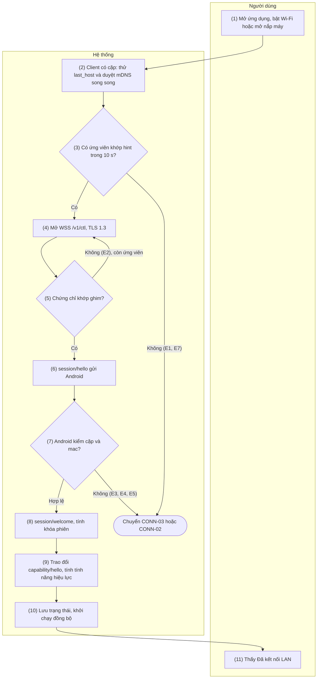
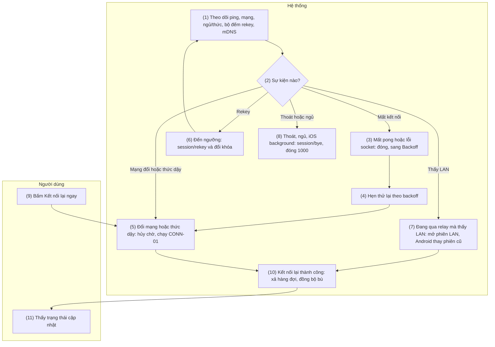
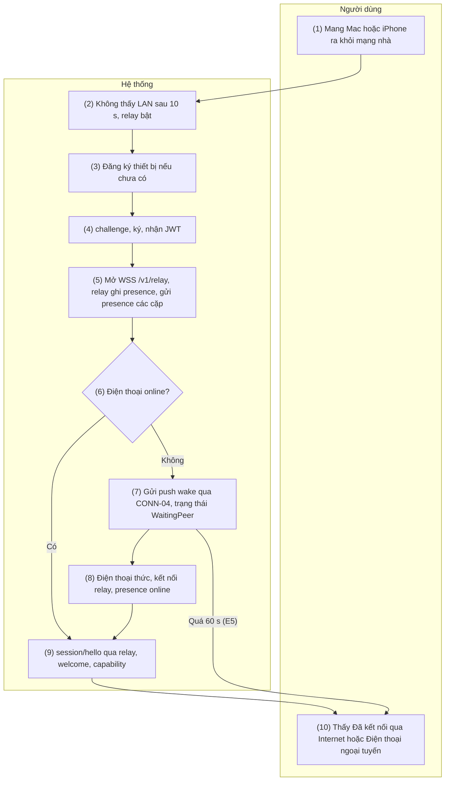
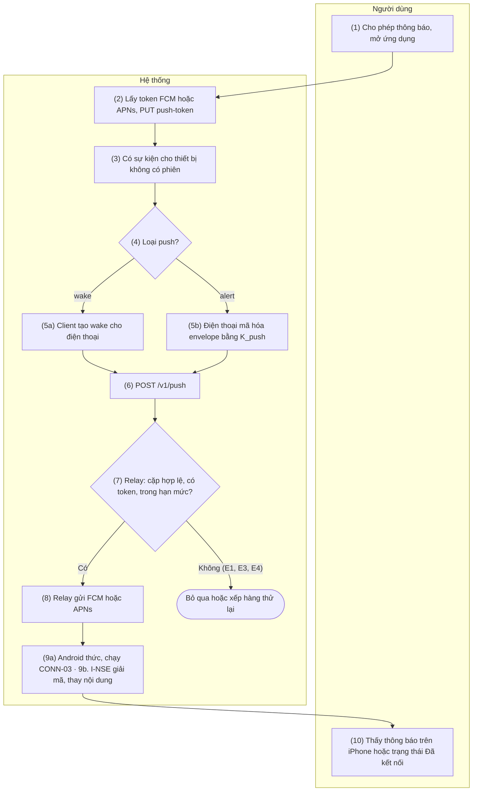

# 3. Nhóm chức năng: Kết nối

> Tham chiếu chung: [`00-common-specs.md`](00-common-specs.md) — kênh truyền (0.4), khung tin (0.5), bắt tay phiên (0.6.3), xác thực relay (0.6.4), danh mục loại tin (0.7), mã lỗi (0.8), lược đồ (0.9), hằng số (0.10), máy trạng thái client (0.11).

## 3.1 CONN-01 — Tự khám phá và kết nối trong mạng LAN

### 3.1.1 Thông tin chung

| Mục | Nội dung |
|-----|----------|
| Tên | CONN-01 — Tự khám phá và kết nối trong mạng LAN |
| Mô tả | Client (Mac/iOS) tự tìm điện thoại đã ghép trong LAN, mở kênh `/v1/ctl` qua TLS có ghim chứng chỉ, bắt tay phiên theo 0.6.3, trao đổi capability để xác định tính năng hiệu lực, rồi khởi chạy các đồng bộ phụ thuộc (SMS-01, CALL-04, gửi clipboard mới nhất). Chạy tự động khi ứng dụng khởi động, khi có mạng mới, khi Mac thức dậy, khi iOS quay lại foreground, ngay sau PAIR-01 và mỗi lần CONN-02 thử kết nối lại. |
| Tác nhân | Chính: Hệ thống (M-APP / I-APP, A-SVC). Người dùng tác động gián tiếp (mở ứng dụng, bật WiFi, mở nắp máy) hoặc bấm "Kết nối lại ngay". |
| Điều kiện trước | 1. Có một cặp hiệu lực (PAIR-01). 2. A-SVC đang chạy dưới dạng foreground service. 3. Hai thiết bị cùng LAN và mạng cho phép multicast mDNS. 4. Client đã được cấp quyền mạng cục bộ (iOS 14+, macOS 15+) theo SET-03. |
| Điều kiện sau | **Thành công:** trạng thái `Connected` (LAN); khóa phiên sẵn sàng; capability của đối phương lưu vào `features_json`; `last_seen_at`, `last_host`, `last_port` cập nhật; tính năng hiệu lực được bật; thông báo foreground service trên Android ghi "Đã kết nối với <tên>". **Thất bại:** chuyển CONN-03 sau `LAN_DISCOVERY_GRACE` (nếu relay bật) hoặc sang `Backoff` (CONN-02). |
| Ngoại lệ | E1 — Không thấy instance có hint khớp trong 10 s → CONN-03 (relay bật) hoặc tiếp tục duyệt. E2 — `TLS_PIN_MISMATCH`: bỏ instance này (có thể là thiết bị khác hoặc giả mạo), thử instance kế tiếp; mọi instance của cặp đều lệch ghim (điện thoại đã sinh lại khóa TLS, 0.6.1) → dừng thử, hiển thị "Cần ghép nối lại" (PAIR-02). E3 — `session/error AUTH_FAILED` → báo "Không xác thực được điện thoại", backoff dài 5 phút, không thử liên tục. E4 — `PAIR_UNKNOWN` hoặc `PAIR_REVOKED` (4403) → dọn cặp theo PAIR-03 luồng B, yêu cầu ghép nối lại. E5 — 4426 `UNSUPPORTED_VERSION` → nhắc cập nhật ứng dụng ở thiết bị cũ hơn. E6 — Bắt tay quá 5 s (4408) → CONN-02 backoff. E7 — Mạng cách ly client (Wi-Fi khách, mDNS bị chặn) → như E1. E8 — Quyền mạng cục bộ bị từ chối → báo và mở hướng dẫn SET-03. |
| Yêu cầu đặc biệt | **Hiệu năng:** kết nối lại < 3 s khi đã biết `last_host` (chỉ số thành công của dự án); bắt tay ≤ 300 ms trong LAN. **Bảo mật:** chỉ TLS 1.3; ghim SHA-256 chứng chỉ, không kiểm hostname; TXT mDNS không chứa định danh tĩnh (0.4.1). **Nền tảng:** iOS/macOS khai báo `NSLocalNetworkUsageDescription` và `NSBonjourServices = ["_handlive._tcp"]`; Android chạy A-SVC type `connectedDevice` (quyền `FOREGROUND_SERVICE_CONNECTED_DEVICE` + `CHANGE_NETWORK_STATE`) với thông báo thường trực. **Độc lập tính năng:** capability quyết định từng tính năng; một tính năng thiếu quyền không chặn các tính năng khác. |

### 3.1.2 Màn hình

N/A — chưa có wireframe được duyệt.

### 3.1.3 Mô tả chi tiết các thành phần

| # | Trường | Kiểu dữ liệu | Input/Output | Giá trị khởi tạo | Mô tả |
|---|--------|--------------|--------------|------------------|-------|
| 1 | Biểu tượng trạng thái (menu bar Mac / tab iOS) | enum{connected\|connecting\|peer_offline\|disconnected} | Output | `connecting` | Ánh xạ từ máy trạng thái 0.11. Mac: biểu tượng template trên thanh menu (`MenuBarExtra`, `.menuBarExtraStyle(.menu)`) — bấm vào mở menu, không popover |
| 2 | Dòng trạng thái | string | Output | "Đang kết nối…" | "Đã kết nối qua Wi-Fi với <tên điện thoại>" |
| 3 | Tên điện thoại | string(64) | Output | `peer_name` | |
| 4 | Thông báo lỗi kết nối | string | Output | Rỗng | Theo E3–E8 |
| 5 | Nút "Kết nối lại ngay" | action | Input | Ẩn khi đã kết nối | Bỏ qua thời gian chờ backoff, chạy lại từ bước 2 |
| 6 | Thông báo foreground service (Android) | string | Output | "Đang chờ kết nối" | "Đã kết nối với <tên client>"; nhiều client: "Đã kết nối với 2 thiết bị" |
| 7 | Tính năng hiệu lực | array<string> | Output | Rỗng | Hiển thị trong PAIR-02; cập nhật sau bước 9 |

### 3.1.4 Luồng nghiệp vụ



| Bước | Tác nhân | Thành phần | Mô tả | Ngoại lệ / Ghi chú |
|------|----------|-----------|-------|--------------------|
| 1 | Người dùng | M-APP / I-APP | Mở ứng dụng, bật Wi-Fi, mở nắp Mac, đưa ứng dụng iOS lên foreground; hoặc bấm "Kết nối lại ngay". | Luồng cũng tự chạy sau PAIR-01 và từ CONN-02. |
| 2 | Hệ thống | M-APP / I-APP | Đọc cặp hiệu lực và nạp `PRK` (bộ nhớ đệm hoặc Keychain). Song song: (a) thử ngay `last_host:last_port` (đường nhanh); (b) chạy `NWBrowser` cho `_handlive._tcp` với TXT. | Chưa có quyền mạng cục bộ → E8. |
| 3 | Hệ thống | M-APP / I-APP | Tính hint cho giờ hiện tại và giờ trước (0.4.1); instance có TXT `h` chứa một trong hai hint là ứng viên. Đường nhanh (a) cũng là ứng viên. | Hết 10 s không có ứng viên → E1. |
| 4 | Hệ thống | M-APP / I-APP → A-SVC | Mở `wss://<host>:<port>/v1/ctl`, TLS 1.3. A-SVC nhận kết nối, bắt đầu đếm `HANDSHAKE_TIMEOUT`. | |
| 5 | Hệ thống | M-APP / I-APP | So SHA-256 chứng chỉ máy chủ với `peer_tls_sha256`. | Khác → đóng, E2. |
| 6 | Hệ thống | M-APP / I-APP | Sinh khóa tạm X25519 và `nonce`, gửi `session/hello`. | |
| 7 | Hệ thống | A-SVC | Kiểm `pair_id` tồn tại, chưa thu hồi, `device_id` đúng đối phương, `mac` đúng (hằng thời gian), phiên bản giao thức. Nếu cặp đang có phiên khác: phiên cũ nhận `session/bye {reason: replaced}` và đóng 4409 sau khi phiên mới xác nhận được khóa (A-SVC giải mã được `capability/hello` đầu tiên của phiên mới; một `hello` phát lại chỉ nhận được `welcome`, không bao giờ đá được phiên thật). | Sai → `session/error` + đóng 4401/4403/4426 (E3, E4, E5). |
| 8 | Hệ thống | A-SVC → M-APP / I-APP | Android gửi `session/welcome`; client kiểm `mac`. Hai bên tính `k_c2s`, `k_s2c`. | Client kiểm sai → đóng 4401, E3. |
| 9 | Hệ thống | Hai bên | Mỗi bên gửi envelope mã hóa đầu tiên `capability/hello` (0.7.2). Tính năng hiệu lực = bật ở hai bên và Android đủ quyền; lưu `features_json`. | |
| 10 | Hệ thống | Hai bên | Cập nhật `last_seen_at`, `last_host`, `last_port`; phát trạng thái `Connected`; Android cập nhật thông báo foreground service và hint. Khởi chạy: SMS-01 (sms hiệu lực), CALL-04 (call hiệu lực), gửi clip mới nhất nếu tạo trong `CLIP_STALE_AFTER` (CLIP-01/02), xả `sms_outbox` (SMS-04). | Mỗi tác vụ chạy độc lập; lỗi một tác vụ không ảnh hưởng tác vụ khác. |
| 11 | Người dùng | M-APP / I-APP, A-UI | Thấy "Đã kết nối qua Wi-Fi" trên client và thông báo trên Android. | |

### 3.1.5 Đặc tả API/service

**Danh sách lời gọi**

| # | API/service | Kênh | Chiều | Dùng ở bước |
|---|-------------|------|-------|-------------|
| 1 | Quảng bá mDNS `NsdManager.registerService` | Multicast LAN | Android | Nền (trước bước 2), 10 |
| 2 | Duyệt mDNS `NWBrowser` (`.bonjourWithTXTRecord`) | Multicast LAN | Client | 2, 3 |
| 3 | Mở kết nối `wss://…/v1/ctl` (TLS 1.3, ghim) | TCP LAN | C→S | 4, 5 |
| 4 | `WS session/hello` | `/v1/ctl` | C→S | 6, 7 |
| 5 | `WS session/welcome` | `/v1/ctl` | S→C | 8 |
| 6 | `WS session/error` | `/v1/ctl` | S→C | 7 |
| 7 | `WS capability/hello` | `/v1/ctl` | Hai chiều | 9 |

#### API 1 — Quảng bá mDNS (Android)

- **URL:** N/A (mDNS multicast `224.0.0.251:5353`, `ff02::fb`)
- **Method:** `NsdManager.registerService(NsdServiceInfo, NsdManager.PROTOCOL_DNS_SD, listener)`
- **Request:**

| Thuộc tính | Giá trị | Mô tả |
|-----------|---------|-------|
| `serviceType` | `_handlive._tcp` | |
| `serviceName` | `HL-<6 hex ngẫu nhiên>` | Đổi mỗi lần A-SVC khởi động |
| `port` | Cổng thực của A-SVC (47800–47809) | |
| TXT `v` | `1` | |
| TXT `h` | Danh sách hint (0.4.1) | Tính lại mỗi giờ tròn và khi thêm/bớt cặp |

- **Response:** callback `onServiceRegistered` (tên cuối cùng có thể bị hệ thống đổi nếu trùng) hoặc `onRegistrationFailed(errorCode)`.
- **Ví dụ:** `HL-4f9a2c._handlive._tcp.local.` SRV → `192.168.1.23:47800`, TXT `v=1`, `h=1a2b3c4d`
- **Logic nghiệp vụ:**
  1. Muốn đổi TXT thì hủy đăng ký rồi đăng ký lại (NsdManager không cập nhật TXT tại chỗ); A-SVC gom thay đổi, tối đa 1 lần/giây.
  2. Đăng ký thất bại → thử lại sau 5 s, 30 s, rồi mỗi 5 phút; trong lúc đó client vẫn tới được qua `last_host`.
  3. Khi không còn cặp nào: bỏ khóa `h`, vẫn quảng bá `v` (phục vụ ghép nối).

#### API 2 — Duyệt mDNS (Mac/iOS)

- **URL:** N/A (mDNS)
- **Method:** `NWBrowser(for: .bonjourWithTXTRecord(type: "_handlive._tcp", domain: nil), using: .tcp)`
- **Request:** không có tham số ngoài kiểu dịch vụ.
- **Response:** tập `NWBrowser.Result` với `endpoint` (`.service(name:type:domain:interface:)`) và `metadata` (`.bonjour(NWTXTRecord)`).
- **Ví dụ:** kết quả `HL-4f9a2c` với TXT `["v": "1", "h": "1a2b3c4d,77e0aa19"]`.
- **Logic nghiệp vụ:**
  1. Chỉ xét kết quả có `v = 1` và `h` chứa hint của cặp (giờ hiện tại hoặc giờ trước).
  2. Kết nối tới endpoint dịch vụ (Network framework tự phân giải); sau khi kết nối thành công, lấy địa chỉ IP thực từ `currentPath.remoteEndpoint` để lưu `last_host`.
  3. Browser tiếp tục chạy khi đã kết nối qua relay, để phát hiện LAN và nâng cấp (CONN-02).

#### API 3 — Mở kết nối `/v1/ctl`

- **URL:** `wss://{android_host}:{port}/v1/ctl`
- **Method:** WebSocket upgrade (HTTP/1.1 `GET` + `Upgrade: websocket`) trên TLS 1.3.
- **Request:** header chuẩn WebSocket; không có header xác thực (xác thực nằm ở bắt tay phiên). Client: `URLSessionWebSocketTask` với delegate `urlSession(_:didReceive:completionHandler:)` kiểm chứng chỉ bằng ghim.
- **Response:** `101 Switching Protocols`. Android từ chối đường dẫn khác bằng `404`.
- **Ví dụ:** `GET /v1/ctl HTTP/1.1` · `Host: 192.168.1.23:47800` · `Upgrade: websocket` · `Sec-WebSocket-Version: 13`
- **Logic nghiệp vụ:**
  1. Delegate TLS: lấy chứng chỉ lá từ `SecTrust`, tính SHA-256 trên DER, so với `peer_tls_sha256`; khớp → `.useCredential`, khác → `.cancelAuthenticationChallenge` (E2).
  2. A-SVC giới hạn 16 kết nối `/v1/ctl` chưa bắt tay cùng lúc và đóng kết nối không gửi `session/hello` trong 5 s (chống cạn tài nguyên); kết nối thứ 17 bị đóng 4429 `RATE_LIMITED`, kết nối im lặng bị đóng 4408.

#### API 4 — `WS session/hello`

- **URL:** `wss://{android_host}:{port}/v1/ctl` (qua relay: CONN-03)
- **Method:** `WS session/hello` (C→S), payload chưa mã hóa (0.5.1), phản hồi `session/welcome` hoặc `session/error`.
- **Request (`data`):**

| Trường | Kiểu | Bắt buộc | Mô tả |
|--------|------|----------|-------|
| `protocol` | int32 | Có | `1` |
| `pair_id` | uuid | Có | |
| `device_id` | uuid | Có | `device_id` của client |
| `eph` | b64u (32 byte) | Có | Khóa công khai X25519 tạm của phiên |
| `nonce` | b64u (32 byte) | Có | |
| `mac` | b64u (32 byte) | Có | HMAC-SHA256(`K_auth`, `T1`) theo 0.6.3 |

- **Response:** API 5 hoặc API 6.
- **Ví dụ:**

```json
{"v":1,"type":"session","id":"0192f400-11aa-7b2c-9d3e-4f5a6b7c8d9e","ts":1727151000000,"payload":"eyJvcCI6ImhlbGxvIiwiZGF0YSI6eyJwcm90b2NvbCI6MSwicGFpcl9pZCI6IjNmMmIxYzRkLTVlNmYtNGE3Yi04YzlkLTBlMWYyYTNiNGM1ZCIsImRldmljZV9pZCI6IjViMWY4YzJlLTlhNGQtOGU2Zi1hMWIyLWMzZDRlNWY2MDcxOCIsImVwaCI6Ii4uLiIsIm5vbmNlIjoiLi4uIiwibWFjIjoiLi4uIn19"}
```

Payload sau khi giải base64: `{"op":"hello","data":{"protocol":1,"pair_id":"3f2b1c4d-5e6f-4a7b-8c9d-0e1f2a3b4c5d","device_id":"5b1f8c2e-9a4d-8e6f-a1b2-c3d4e5f60718","eph":"…","nonce":"…","mac":"…"}}`

- **Logic nghiệp vụ:**
  1. Thứ tự kiểm ở A-SVC: `protocol` (khác major → 4426) → cặp tồn tại (không → `PAIR_UNKNOWN`, 4401) → chưa thu hồi (4403) → `device_id` khớp → `mac`.
  2. Sai `mac` 5 lần/phút từ cùng địa chỉ IP → chặn IP đó 5 phút (kết nối từ IP bị chặn đóng 4429 `RATE_LIMITED` ngay sau TLS).
  3. Không lưu `nonce`; khóa tạm của Android sinh mới cho mỗi lần welcome nên hello bị phát lại không dẫn tới phiên dùng được.

#### API 5 — `WS session/welcome`

- **URL:** như API 4
- **Method:** `WS session/welcome` (S→C), payload chưa mã hóa.
- **Request (`data`):**

| Trường | Kiểu | Bắt buộc | Mô tả |
|--------|------|----------|-------|
| `device_id` | uuid | Có | `device_id` của Android |
| `eph` | b64u (32 byte) | Có | Khóa tạm X25519 của Android |
| `nonce` | b64u (32 byte) | Có | |
| `mac` | b64u (32 byte) | Có | HMAC-SHA256(`K_auth`, `T2`) |

- **Response:** N/A (client gửi `capability/hello` đã mã hóa để xác nhận khóa).
- **Ví dụ:** `{"op":"welcome","data":{"device_id":"8c7d6e5f-4a3b-8c2d-9e1f-0a1b2c3d4e5f","eph":"…","nonce":"…","mac":"…"}}`
- **Logic nghiệp vụ:**
  1. Android tính khóa phiên ngay sau khi gửi welcome và chờ envelope mã hóa đầu tiên; envelope đầu không giải mã được → đóng 4401.
  2. Client kiểm `mac` và `device_id` khớp `peer_device_id`; sai → đóng 4401.

#### API 6 — `WS session/error`

- **URL:** như API 4
- **Method:** `WS session/error` (S→C), payload chưa mã hóa; Android đóng kết nối ngay sau đó với mã tương ứng (0.8.3).
- **Request (`data`):** `code` — enum{AUTH_FAILED\|PAIR_UNKNOWN\|PAIR_REVOKED\|UNSUPPORTED_VERSION\|RATE_LIMITED}; `message` — string; `min_protocol` — int32 (bắt buộc khi `UNSUPPORTED_VERSION`, không có ở mã khác; client dùng để hiển thị "Cập nhật HandLive trên điện thoại" hoặc "trên máy này").
- **Response:** N/A.
- **Ví dụ:** `{"op":"error","data":{"code":"PAIR_UNKNOWN","message":"Thiết bị chưa được ghép nối"}}`
- **Logic nghiệp vụ:** Client xử lý theo E3–E5; không tự động thử lại với `AUTH_FAILED` trước 5 phút.

#### API 7 — `WS capability/hello`

- **URL:** như API 4
- **Method:** `WS capability/hello` (hai chiều), envelope mã hóa, không ack.
- **Request (`data`):** theo 0.7.2.
- **Response:** N/A (bên kia gửi capability của mình).
- **Ví dụ:** xem 0.7.2.
- **Logic nghiệp vụ:**
  1. Tính năng hiệu lực F = `features.F.enabled` của cả hai bên **và** Android không thiếu quyền cần cho F (bảng dưới).
  2. Tính năng chuyển từ hiệu lực sang không hiệu lực → dừng tác vụ của F (ví dụ hủy luồng camera) và thông báo người dùng một lần.
  3. `protocol` khác major đã bị chặn ở bắt tay; khác minor → dùng tập tính năng chung.

| Tính năng | Quyền Android cần (thiếu → không hiệu lực) |
|-----------|------------------------------------------|
| `clipboard` | Không (tự gửi cần Accessibility — chỉ ảnh hưởng `auto_send`) |
| `sms` | `READ_SMS` (tin mới phát hiện bằng `ContentObserver`, không cần `RECEIVE_SMS`); gửi thêm `SEND_SMS` (thiếu → `can_send = false`); danh sách SIM cần `READ_PHONE_STATE`; tên liên hệ cần `READ_CONTACTS` |
| `call` | `READ_PHONE_STATE`; trả lời/kết thúc thêm `ANSWER_PHONE_CALLS` (thiếu → `can_answer = can_end = false`); số gọi đến và nhật ký thêm `READ_CALL_LOG` (thiếu → `caller_id = false`) |
| `call_audio` | `BLUETOOTH_CONNECT`; đường Opus/WS thêm Shizuku đang chạy và Android 11+ (chỉ ảnh hưởng `opus_fallback`) |
| `camera` | `CAMERA`, `RECORD_AUDIO` |

#### Query

```sql
-- [Thiết kế] Mac/iOS, bước 2: cặp hiệu lực và địa chỉ đã biết
SELECT pair_id, peer_device_id, peer_name, peer_tls_sha256, last_host, last_port
FROM paired_device
WHERE revoked_at IS NULL
LIMIT 1;

-- [Thiết kế] Mac/iOS, bước 10
UPDATE paired_device
SET last_seen_at = :now, last_host = :host, last_port = :port, features_json = :features_json
WHERE pair_id = :pair_id;

-- [Thiết kế] Android, bước 7: kiểm cặp của session/hello
SELECT pair_id, peer_device_id, prk_enc, revoked_at
FROM paired_device
WHERE pair_id = :pair_id;

-- [Thiết kế] Android, bước 10
UPDATE paired_device
SET last_seen_at = :now, features_json = :features_json
WHERE pair_id = :pair_id;

-- [Thiết kế] Android, API 1: các cặp cần tính hint
SELECT pair_id, prk_enc
FROM paired_device
WHERE revoked_at IS NULL;
```

---

## 3.2 CONN-02 — Duy trì kết nối và tự kết nối lại

### 3.2.1 Thông tin chung

| Mục | Nội dung |
|-----|----------|
| Tên | CONN-02 — Duy trì kết nối và tự kết nối lại |
| Mô tả | Giữ phiên sống và tự phục hồi: ping WebSocket mỗi 15 s (qua relay thêm `ping` E2E mỗi 30 s), phát hiện mất kết nối, kết nối lại theo backoff, phản ứng ngay với sự kiện đổi mạng, ngủ/thức, foreground/background; rekey phiên sau 24 h hoặc 10 000 envelope; nâng cấp từ relay lên LAN khi thấy điện thoại trong LAN; đóng êm bằng `session/bye`. Sau khi kết nối lại, xả hàng đợi và đồng bộ bù. |
| Tác nhân | Chính: Hệ thống (M-APP / I-APP, A-SVC). Người dùng có thể bấm "Kết nối lại ngay". |
| Điều kiện trước | Đã từng có phiên (`Connected`) hoặc đang ở `Backoff`/`Discovering`. |
| Điều kiện sau | Phiên được duy trì hoặc thiết lập lại; trạng thái hiển thị đúng thực tế trong ≤ 1 s sau khi phát hiện; `sms_outbox` còn `pending` được gửi lại; SMS-01 và CALL-04 chạy bù. |
| Ngoại lệ | E1 — Mất mạng hoàn toàn: chuyển `Idle`, chờ `NWPathMonitor`/`NetworkCallback` báo có mạng, không backoff vô ích. E2 — Mac ngủ: gửi `session/bye {reason: shutdown}` nếu còn kịp; khi thức dậy chạy CONN-01 ngay. E3 — iOS vào background: gửi `session/bye {reason: shutdown}`, đóng; khi suspended nhận tin qua push (CONN-04). E4 — Rekey không nhận `ack` trong 10 s → đóng phiên, kết nối lại (bắt tay mới sinh khóa mới). E5 — `DECRYPT_FAILED` → đóng 4400, kết nối lại. E6 — Hệ điều hành dừng A-SVC (OEM tắt nền) → client thấy mất kết nối; A-SVC `START_STICKY` tự khởi động lại; SET-01 đã xin miễn tối ưu pin. E7 — Đóng 4409 (bị thay bởi kết nối mới của chính client) → không kết nối lại từ phiên cũ. |
| Yêu cầu đặc biệt | **Hiệu năng:** kết nối lại < 3 s sau khi mạng trở lại; phát hiện mất kết nối ≤ 25 s (15 s ping + 10 s chờ pong). **Pin:** client chủ động ping, Android chỉ trả pong và đóng kết nối im lặng quá 45 s; Android không giữ relay khi rảnh quá 5 phút. **Backoff:** 0,5 → 1 → 2 → 4 → 8 → 16 → 30 s, jitter ±20 %, về đầu khi thành công. |

### 3.2.2 Màn hình

N/A — chưa có wireframe được duyệt.

### 3.2.3 Mô tả chi tiết các thành phần

| # | Trường | Kiểu dữ liệu | Input/Output | Giá trị khởi tạo | Mô tả |
|---|--------|--------------|--------------|------------------|-------|
| 1 | Trạng thái kết nối | enum{connected\|connecting\|peer_offline\|disconnected} | Output | Giá trị hiện tại | Như CONN-01 trường 1 |
| 2 | Kênh | enum{lan\|relay\|usb} | Output | Kênh hiện tại | Đổi khi nâng cấp relay → LAN |
| 3 | Thời gian thử lại tiếp theo | int32 (giây) | Output | Rỗng | "Thử lại sau 8 s" khi ở `Backoff` |
| 4 | Nút "Kết nối lại ngay" | action | Input | Hiện khi `disconnected` | Hủy chờ backoff, chạy CONN-01 |
| 5 | Số tin chờ gửi | int32 | Output | Số dòng `sms_outbox` đang `pending` | "2 tin đang chờ điện thoại" |

### 3.2.4 Luồng nghiệp vụ



| Bước | Tác nhân | Thành phần | Mô tả | Ngoại lệ / Ghi chú |
|------|----------|-----------|-------|--------------------|
| 1 | Hệ thống | M-APP / I-APP, A-SVC | Client gửi WS ping mỗi 15 s; qua relay thêm envelope `ping/ping` mỗi 30 s (ping WS chỉ kiểm chặng tới relay). Theo dõi `NWPathMonitor`, `NSWorkspace.willSleepNotification`/`didWakeNotification` (Mac), `scenePhase` (iOS). Android theo dõi `ConnectivityManager.registerDefaultNetworkCallback`, đếm thời gian im lặng của từng phiên. Hai bên đếm envelope đã gửi và tuổi phiên. | |
| 2 | Hệ thống | như trên | Phân loại sự kiện. | |
| 3 | Hệ thống | M-APP / I-APP | Không nhận pong trong 10 s, hoặc socket lỗi, hoặc `ping/ping` không có `ack` 10 s → đóng phiên, trạng thái `Backoff`. Android: phiên im lặng quá 45 s → đóng 4411 `IDLE_TIMEOUT`. | E5, E6. |
| 4 | Hệ thống | M-APP / I-APP | Chờ theo bảng backoff (có jitter). Không có mạng → `Idle`, chờ sự kiện mạng. | E1. |
| 5 | Hệ thống | M-APP / I-APP | Hủy chờ, chạy CONN-01 (LAN trước, rồi CONN-03 sau 10 s). | |
| 6 | Hệ thống | Bên đạt ngưỡng trước | Gửi `session/rekey`; bên nhận trả `ack` kèm khóa tạm của mình, đổi khóa; bên gửi đổi khóa sau khi nhận `ack`. Giữ khóa cũ 30 s cho envelope đang bay. | Không có `ack` → E4. |
| 7 | Hệ thống | M-APP / I-APP → A-SVC | Đang dùng relay mà mDNS thấy hint khớp → mở phiên LAN mới theo CONN-01 bước 4–9. A-SVC gửi `session/bye {reason: replaced}` trên phiên relay rồi đóng 4409. | E7 với phiên cũ. |
| 8 | Hệ thống | M-APP / I-APP | Người dùng thoát ứng dụng, Mac sắp ngủ, iOS vào background → gửi `session/bye` và đóng 1000. | E2, E3. |
| 9 | Người dùng | M-APP / I-APP | Bấm "Kết nối lại ngay". | |
| 10 | Hệ thống | M-APP / I-APP, A-SVC | Khi `Connected` trở lại: gửi lại `sms_outbox` còn `pending` theo thứ tự tạo (SMS-04), chạy SMS-01 và CALL-04 với con trỏ đã lưu. | |
| 11 | Người dùng | M-APP / I-APP | Thấy trạng thái và số tin chờ gửi cập nhật. | |

### 3.2.5 Đặc tả API/service

**Danh sách lời gọi**

| # | API/service | Kênh | Chiều | Dùng ở bước |
|---|-------------|------|-------|-------------|
| 1 | WS ping/pong (khung điều khiển RFC 6455) | `/v1/ctl` hoặc `/v1/relay` | C→S | 1, 3 |
| 2 | `WS ping/ping` | `/v1/ctl` qua relay | C→S | 1, 3 |
| 3 | `WS session/rekey` | `/v1/ctl` | Hai chiều | 6 |
| 4 | `WS session/bye` | `/v1/ctl` | Hai chiều | 7, 8 |
| 5 | Dịch vụ hệ điều hành: `NWPathMonitor`, `NSWorkspace` sleep/wake, `scenePhase`, `ConnectivityManager.NetworkCallback`, `URLSessionWebSocketTask.sendPing` | Cục bộ | — | 1, 4, 5, 8 |

#### API 1 — WS ping/pong

- **URL:** kết nối hiện tại
- **Method:** khung điều khiển WebSocket `0x9` (ping) / `0xA` (pong).
- **Request:** payload ping 8 byte = bộ đếm uint64 BE.
- **Response:** pong cùng payload (Ktor và `URLSessionWebSocketTask` tự trả).
- **Ví dụ:** ping `00 00 00 00 00 00 00 2A` → pong `00 00 00 00 00 00 00 2A`.
- **Logic nghiệp vụ:** `URLSessionWebSocketTask.sendPing(pongReceiveHandler:)` với bộ hẹn 10 s; handler không được gọi đúng hạn → coi như mất kết nối.

#### API 2 — `WS ping/ping`

- **URL:** `wss://{RELAY_HOST}/v1/relay` với lớp bọc `to`/`from` (chỉ dùng khi phiên đi qua relay)
- **Method:** `WS ping/ping` (C→S), envelope mã hóa, có ack.
- **Request (`data`):** `seq` — int64, tăng dần.
- **Response (`ack.data`):** `seq` — int64 (lặp lại), `server_ts` — timestamp của Android.
- **Ví dụ:** `{"op":"ping","data":{"seq":42}}` → `{"re":"0192f4a0-…","ok":true,"data":{"seq":42,"server_ts":1727151030000}}`
- **Logic nghiệp vụ:** Đo RTT đầu-cuối (hiển thị trong chẩn đoán); 1 lần không có `ack` trong 10 s → mất kết nối.

#### API 3 — `WS session/rekey`

- **URL:** `/v1/ctl` (LAN, USB hoặc relay)
- **Method:** `WS session/rekey` (hai chiều), envelope mã hóa bằng khóa hiện tại, có ack.
- **Request (`data`):**

| Trường | Kiểu | Bắt buộc | Mô tả |
|--------|------|----------|-------|
| `epoch` | int32 | Có | Thế hệ khóa mới (hiện tại + 1) |
| `eph` | b64u (32 byte) | Có | Khóa tạm X25519 mới |
| `nonce` | b64u (32 byte) | Có | |

- **Response (`ack.data`):** `{epoch, eph, nonce}` của bên nhận.
- **Ví dụ:** `{"op":"rekey","data":{"epoch":1,"eph":"…","nonce":"…"}}` → `{"re":"…","ok":true,"data":{"epoch":1,"eph":"…","nonce":"…"}}`
- **Logic nghiệp vụ:**
  1. Khóa mới theo 0.6.3 bước 6; thiết bị dẫn xuất lại cả `k_c2s` và `k_s2c`.
  2. Hai bên cùng khởi tạo rekey một lúc → bên có `device_id` nhỏ hơn thắng, bên kia hủy yêu cầu của mình và trả `ack`; bên thắng bỏ qua yêu cầu của bên thua, không trả `ack`. Rekey thất bại (không `ack` trong 10 s, `ack` lỗi, dữ liệu sai) → đóng 4410 `REKEY_FAILED` rồi kết nối lại (E4).
  3. Envelope mã hóa bằng khóa cũ đến trong 30 s sau khi đổi vẫn được giải mã; sau đó → `DECRYPT_FAILED`.

#### API 4 — `WS session/bye`

Đặc tả như PAIR-03 API 2. Trong nhóm này `reason` dùng `shutdown` (thoát, ngủ, background), `replaced` (Android thay phiên cũ bằng phiên mới của cùng cặp), `update` (sắp cập nhật ứng dụng).

#### Query

```sql
-- [Thiết kế] Mac/iOS, bước 10: tin SMS chờ gửi lại
SELECT local_id, pair_id, thread_id, addresses_json, body, sub_id, attempts
FROM sms_outbox
WHERE pair_id = :pair_id AND state = 'pending'
ORDER BY created_at ASC;

-- [Thiết kế] Mac/iOS, trường 5: đếm tin chờ gửi
SELECT COUNT(*) FROM sms_outbox WHERE pair_id = :pair_id AND state = 'pending';

-- [Thiết kế] Mac/iOS, bước 10: con trỏ đồng bộ đã lưu
SELECT stream, cursor FROM sync_cursor WHERE pair_id = :pair_id;
```

---

## 3.3 CONN-03 — Kết nối qua relay khi ngoài LAN

### 3.3.1 Thông tin chung

| Mục | Nội dung |
|-----|----------|
| Tên | CONN-03 — Kết nối qua relay khi ngoài LAN |
| Mô tả | Khi client không thấy điện thoại trong LAN sau `LAN_DISCOVERY_GRACE` (10 s) hoặc mạng chặn mDNS, và `relay.enabled = true` ở cả hai bên, client kết nối relay: đăng ký thiết bị (một lần), xác thực challenge–chữ ký lấy JWT, mở WSS `/v1/relay`, nhận presence. Khi điện thoại online, client bắt tay phiên và trao đổi capability qua relay y như LAN; nội dung vẫn mã hóa đầu-cuối. Điện thoại không giữ relay thường trực: nó kết nối khi có envelope cần gửi cho client không ở LAN, khi được đánh thức bằng push (CONN-04), và tự ngắt sau 5 phút rảnh. Camera không đi qua relay. |
| Tác nhân | Chính: Hệ thống (M-APP / I-APP, A-SVC, R-API, R-KV, R-DB). |
| Điều kiện trước | 1. Có cặp hiệu lực, đã đăng ký relay hoặc đăng ký được ngay (PAIR-01 API 8). 2. `relay.enabled = true` ở cả hai thiết bị. 3. Có Internet. |
| Điều kiện sau | **Thành công:** phiên E2E qua relay, trạng thái "Đã kết nối qua Internet"; các tính năng dữ liệu hoạt động như LAN (trừ camera và âm thanh cuộc gọi — cần ở gần). **Điện thoại offline:** trạng thái `WaitingPeer` ("Điện thoại ngoại tuyến"), đã gửi push đánh thức. |
| Ngoại lệ | E1 — Relay không phản hồi hoặc 5xx → backoff (CONN-02). E2 — 401 `SIGNATURE_INVALID` hoặc 404 `DEVICE_NOT_FOUND` → đăng ký lại thiết bị rồi thử lại một lần. E3 — 410 `DEVICE_REVOKED` → báo "Thiết bị đã bị xóa khỏi dịch vụ Internet", tắt relay cho tới khi người dùng bật lại (đăng ký mới). E4 — `relay.error NOT_PAIRED` khi gửi → gọi `GET /v1/pairs`: đã thu hồi → PAIR-03 luồng B; chưa đăng ký → `POST /v1/pairs` rồi thử lại. E5 — Điện thoại không online trong 60 s sau push → giữ `WaitingPeer`; không push lại quá 1 lần/5 phút. E6 — 429 `RATE_LIMITED` → chờ `Retry-After`. E7 — Chứng chỉ relay không khớp ghim → không kết nối, báo lỗi bảo mật. E8 — `relay.error NOT_CONNECTED` (đối phương vừa rời) → quay về `WaitingPeer`. |
| Yêu cầu đặc biệt | **Bảo mật:** relay chỉ thấy lớp bọc (`to`/`from`, `type`, kích thước, thời điểm); không có khóa E2E; JWT 15 phút; ghim SPKI ISRG Root X1/X2 + khóa dự phòng. **Tài nguyên:** tối đa 2 MiB/s mỗi cặp; envelope ≤ 256 KiB. **Hiệu năng tham khảo:** SMS, thông báo cuộc gọi qua relay ≤ 1 s khi hai bên đã online. **Vận hành:** relay stateless; presence và định tuyến giữa instance qua Redis; thống kê chỉ theo `device_hash`. |

### 3.3.2 Màn hình

N/A — chưa có wireframe được duyệt.

### 3.3.3 Mô tả chi tiết các thành phần

| # | Trường | Kiểu dữ liệu | Input/Output | Giá trị khởi tạo | Mô tả |
|---|--------|--------------|--------------|------------------|-------|
| 1 | Trạng thái kết nối | enum{connected\|connecting\|peer_offline\|disconnected} | Output | `connecting` | `peer_offline` hiển thị "Điện thoại ngoại tuyến" |
| 2 | Kênh | enum{lan\|relay\|usb} | Output | `relay` khi thành công | "Qua Internet" |
| 3 | Cho phép kết nối qua Internet | bool | Input/Output | `relay.enabled` = `true` | Quản lý ở SET-02, hiển thị ở đây để giải thích khi đang tắt |
| 4 | Thông báo lỗi relay | string | Output | Rỗng | Theo E3, E6, E7 |

### 3.3.4 Luồng nghiệp vụ



| Bước | Tác nhân | Thành phần | Mô tả | Ngoại lệ / Ghi chú |
|------|----------|-----------|-------|--------------------|
| 1 | Người dùng | — | Rời mạng nhà hoặc dùng mạng chặn mDNS. | |
| 2 | Hệ thống | M-APP / I-APP | Ở `Discovering` quá 10 s, `relay.enabled = true`. | Relay tắt → ở lại `Discovering`. |
| 3 | Hệ thống | M-APP / I-APP → R-API | Nếu chưa đăng ký hoặc sau E2: `POST /v1/devices`. Nếu `relay_registered = 0` cho cặp: `POST /v1/pairs`. | 410 → E3. |
| 4 | Hệ thống | M-APP / I-APP → R-API | `POST /v1/auth/challenge` rồi `POST /v1/auth/token` (0.6.4). Token còn hạn > 60 s thì dùng lại. | E2, E6. |
| 5 | Hệ thống | M-APP / I-APP → R-API, R-KV | Mở `wss://{RELAY_HOST}/v1/relay` với `Authorization: Bearer`. Relay: ghi `presence`, subscribe `dev:<device_id>`, gửi `presence` cho từng cặp và `pair_revoked` cho cặp đã thu hồi. | Ghim sai → E7. |
| 6 | Hệ thống | M-APP / I-APP | Đọc `presence.online` của điện thoại. | |
| 7 | Hệ thống | M-APP / I-APP → R-API → PUSH | `POST /v1/push` kind `wake` tới điện thoại (CONN-04). Trạng thái `WaitingPeer`. | E5. |
| 8 | Hệ thống | A-SVC → R-API | Điện thoại nhận FCM, thực hiện bước 3–5 phía mình; relay phát `presence online` cho client. | |
| 9 | Hệ thống | M-APP / I-APP ↔ R-API ↔ A-SVC | Client gửi `session/hello` bọc `{"to": <android>, "env": …}`; relay kiểm cặp hợp lệ, chuyển thành `{"from": <client>, "env": …}`. Tiếp tục bắt tay và capability như CONN-01 bước 6–10. | E4, E8. |
| 10 | Người dùng | M-APP / I-APP | Thấy "Đã kết nối qua Internet" hoặc "Điện thoại ngoại tuyến". | |

### 3.3.5 Đặc tả API/service

**Danh sách lời gọi**

| # | API/service | Kênh | Chiều | Dùng ở bước |
|---|-------------|------|-------|-------------|
| 1 | `POST /v1/devices` | REST relay | Thiết bị → R-API | 3 |
| 2 | `POST /v1/auth/challenge` | REST relay | Thiết bị → R-API | 4 |
| 3 | `POST /v1/auth/token` | REST relay | Thiết bị → R-API | 4 |
| 4 | `GET /v1/relay` (WebSocket) | WSS relay | Thiết bị ↔ R-API | 5, 8 |
| 5 | Relay op `presence`, `error` | WSS relay (text) | R-API → thiết bị | 5, 6, 8, 9 |
| 6 | Chuyển tiếp envelope (lớp bọc `to`/`from`) | WSS relay (text) | Thiết bị → R-API → thiết bị | 9 và mọi envelope sau đó |

#### API 1 — `POST /v1/devices`

- **URL:** `https://{RELAY_HOST}/v1/devices`
- **Method:** `POST` (không cần JWT; tự chứng thực bằng chữ ký trong body)
- **Request:**

| Trường | Kiểu | Bắt buộc | Mô tả |
|--------|------|----------|-------|
| `device_id` | uuid | Có | Phải bằng UUIDv8(SHA-256(`ik_sig_pub`)) |
| `platform` | enum{android\|macos\|ios\|ipados} | Có | |
| `app_version` | string(32) | Có | |
| `ik_sig_pub` | b64u (32 byte) | Có | |
| `ts` | timestamp | Có | Lệch giờ relay ≤ 5 phút |
| `sig` | b64u (64 byte) | Có | Ed25519(`ik_sig`, `"HLREG1"` ‖ `device_id`(16) ‖ `ik_sig_pub`(32) ‖ UTF-8(`platform`) ‖ `ts`(int64 BE)) |

- **Response:**

| HTTP | Body | Khi nào |
|------|------|---------|
| 201 | `{"device_id":"…","created_at":…}` | Đăng ký mới |
| 200 | như trên | Đã có, cập nhật `app_version`, `last_seen_at` |
| 401 `SIGNATURE_INVALID` | lỗi | Chữ ký sai, `device_id` không khớp khóa, hoặc `ts` lệch |
| 410 `DEVICE_REVOKED` | lỗi | Thiết bị đã bị xóa |

- **Ví dụ:**

```json
{"device_id":"5b1f8c2e-9a4d-8e6f-a1b2-c3d4e5f60718","platform":"macos","app_version":"1.0.0 (100)","ik_sig_pub":"7Kx9vQ2mTn4pL8rWz1YcHd6fJb3gSa5eUo0iVtNkQxA","ts":1727151100000,"sig":"<b64u 64 byte>"}
```

```json
{"device_id":"5b1f8c2e-9a4d-8e6f-a1b2-c3d4e5f60718","created_at":1727151100420}
```

- **Logic nghiệp vụ:**
  1. Kiểm `ts`, dựng lại chuỗi ký, kiểm `sig`, kiểm `device_id` dẫn xuất từ khóa.
  2. Upsert theo `device_id`; `ik_sig_pub` của một `device_id` không bao giờ đổi (đổi khóa = `device_id` mới).
  3. Giới hạn 10 lần/giờ mỗi địa chỉ IP cho đăng ký mới.

#### API 2 — `POST /v1/auth/challenge`

- **URL:** `https://{RELAY_HOST}/v1/auth/challenge`
- **Method:** `POST`
- **Request:** `device_id` — uuid, bắt buộc.
- **Response 200:** `challenge` — b64u (32 byte); `expires_at` — timestamp (+60 s). Lỗi: 404 `DEVICE_NOT_FOUND`, 410 `DEVICE_REVOKED`, 429 `RATE_LIMITED`.
- **Ví dụ:** `{"device_id":"5b1f8c2e-9a4d-8e6f-a1b2-c3d4e5f60718"}` → `{"challenge":"0tXoN3f1C9aYQbJ8kVw2mZr5uHs7pLd4gEi6cBy0xQa","expires_at":1727151160000}`
- **Logic nghiệp vụ:** Sinh 32 byte ngẫu nhiên, ghi `chal:<device_id>` (ghi đè challenge cũ), TTL 60 s; tối đa 10 lần/phút mỗi thiết bị.

#### API 3 — `POST /v1/auth/token`

- **URL:** `https://{RELAY_HOST}/v1/auth/token`
- **Method:** `POST`
- **Request:**

| Trường | Kiểu | Bắt buộc | Mô tả |
|--------|------|----------|-------|
| `device_id` | uuid | Có | |
| `challenge` | b64u | Có | Giá trị vừa nhận |
| `sig` | b64u (64 byte) | Có | Ed25519(`ik_sig`, `"HLAUTH1"` ‖ challenge ‖ `device_id`(16)) |

- **Response 200:** `access_token` — string (JWT HS256, claim `sub`, `iat`, `exp`, `jti`); `expires_in` — int32 (900). Lỗi: 400 `BAD_REQUEST` (`sig` không phải b64u 64 byte), 401 `CHALLENGE_EXPIRED`, 401 `SIGNATURE_INVALID`, 404 `DEVICE_NOT_FOUND`, 410 `DEVICE_REVOKED`, 500 `INTERNAL`.
- **Ví dụ:** `{"access_token":"eyJhbGciOiJIUzI1NiJ9.eyJzdWIiOiI1YjFm…","expires_in":900}`
- **Logic nghiệp vụ:** Lấy và xóa `chal:<device_id>` trong một lệnh (`GETDEL`); không có hoặc khác → `CHALLENGE_EXPIRED`; kiểm chữ ký bằng `ik_sig_pub` trong `devices`; cập nhật `last_seen_at`.

#### API 4 — `GET /v1/relay` (WebSocket)

- **URL:** `wss://{RELAY_HOST}/v1/relay`
- **Method:** WebSocket upgrade, header `Authorization: Bearer <jwt>`.
- **Request:** không có body. Sau khi mở: text frame lớp bọc (API 6) hoặc op điều khiển (`rv_join`, `rv_msg`).
- **Response:** `101 Switching Protocols`; 401 `TOKEN_EXPIRED`/`SIGNATURE_INVALID` nếu JWT sai; 404 `DEVICE_NOT_FOUND` nếu thiết bị đã tự xóa khỏi relay. Ngay sau khi mở, relay gửi `presence` cho mọi cặp hiệu lực, `pair_revoked` cho cặp đã thu hồi trong 30 ngày, và `pair_revoked` cho từng phần tử của `revoked_notice:<device_id>` (đối phương đã xóa toàn bộ dữ liệu, SET-02) rồi xóa khóa đó.
- **Ví dụ:** `GET /v1/relay HTTP/1.1` · `Host: relay.example.com` · `Authorization: Bearer eyJhbGciOi…` · `Upgrade: websocket`
- **Logic nghiệp vụ:**
  1. Mỗi thiết bị một kết nối relay; kết nối mới thay kết nối cũ (đóng 4409).
  2. Ghi `presence:<device_id>` = id instance, TTL 60 s, gia hạn mỗi 20 s; subscribe `dev:<device_id>`.
  3. Nạp danh sách đối phương hợp lệ từ `pairs` vào bộ nhớ của kết nối; làm mới khi có `pair_revoked`.
  4. Phát `presence online` tới từng đối phương đang online (publish `dev:<peer>`); khi đóng: xóa `presence` nếu còn là của instance này, phát `presence offline`.
  5. JWT hết hạn trong lúc kết nối vẫn mở không cắt kết nối; lần mở sau mới cần token mới.

#### API 5 — Relay op `presence` và `error`

- **URL:** `wss://{RELAY_HOST}/v1/relay`
- **Method:** WS text frame điều khiển (R-API → thiết bị).
- **Request:**

| op | Trường | Kiểu | Mô tả |
|----|--------|------|-------|
| `presence` | `pair_id` | uuid | |
| `presence` | `peer_device_id` | uuid | |
| `presence` | `online` | bool | |
| `error` | `code` | string | `NOT_PAIRED`, `NOT_CONNECTED`, `PAYLOAD_TOO_LARGE`, `RATE_LIMITED`, `BAD_REQUEST` |
| `error` | `message` | string | |
| `error` | `to` | uuid | Đích của khung bị từ chối (nếu có) |

- **Response:** N/A.
- **Ví dụ:** `{"op":"presence","pair_id":"3f2b1c4d-5e6f-4a7b-8c9d-0e1f2a3b4c5d","peer_device_id":"8c7d6e5f-4a3b-8c2d-9e1f-0a1b2c3d4e5f","online":true}`
- **Logic nghiệp vụ:** Thiết bị coi `presence` là gợi ý; nguồn sự thật về phiên vẫn là bắt tay E2E thành công.

#### API 6 — Chuyển tiếp envelope qua relay

- **URL:** `wss://{RELAY_HOST}/v1/relay`
- **Method:** WS text frame lớp bọc.
- **Request (thiết bị → relay):** `to` — uuid (`device_id` đích); `env` — object (envelope 0.5.1 nguyên vẹn).
- **Response (relay → thiết bị đích):** `from` — uuid; `env` — object. Lỗi trả về bên gửi bằng op `error`.
- **Ví dụ:**

```json
{"to":"8c7d6e5f-4a3b-8c2d-9e1f-0a1b2c3d4e5f","env":{"v":1,"type":"sms","id":"0192f4b2-5c6d-7e8f-9a0b-1c2d3e4f5a6b","ts":1727151200000,"payload":"<b64>"}}
{"from":"5b1f8c2e-9a4d-8e6f-a1b2-c3d4e5f60718","env":{"v":1,"type":"sms","id":"0192f4b2-5c6d-7e8f-9a0b-1c2d3e4f5a6b","ts":1727151200000,"payload":"<b64>"}}
```

- **Logic nghiệp vụ:**
  1. `to` phải là đối phương trong một cặp hiệu lực với người gửi; không → `error NOT_PAIRED`.
  2. Khung > 256 KiB → `error PAYLOAD_TOO_LARGE`; vượt 2 MiB/s mỗi cặp → trì hoãn đọc socket (backpressure), không hủy khung.
  3. Không có `presence:<to>` → `error NOT_CONNECTED`; có → publish `dev:<to>`.
  4. Không giải mã, không ghi log `env`; chỉ cộng số envelope và byte vào `usage_daily` theo `device_hash`.

#### Query

```sql
-- [Thiết kế] Relay, API 1: đăng ký hoặc cập nhật thiết bị
INSERT INTO devices (device_id, ik_sig_pub, platform, app_version)
VALUES ($1, $2, $3, $4)
ON CONFLICT (device_id) DO UPDATE
SET app_version = EXCLUDED.app_version, last_seen_at = now()
WHERE devices.revoked_at IS NULL AND devices.ik_sig_pub = EXCLUDED.ik_sig_pub
RETURNING device_id, created_at;

-- [Thiết kế] Relay, API 2 và 3: khóa công khai và trạng thái
SELECT ik_sig_pub, revoked_at FROM devices WHERE device_id = $1;

-- [Thiết kế] Relay, API 3
UPDATE devices SET last_seen_at = now() WHERE device_id = $1;

-- [Thiết kế] Relay, API 4: đối phương hợp lệ của thiết bị vừa kết nối
SELECT pair_id,
       CASE WHEN device_a = $1 THEN device_b ELSE device_a END AS peer_device_id
FROM pairs
WHERE (device_a = $1 OR device_b = $1) AND revoked_at IS NULL;

-- [Thiết kế] Relay, API 6: cộng thống kê (gom theo lô mỗi 60 s)
INSERT INTO usage_daily (day, device_hash, envelopes, bytes)
VALUES (current_date, $1, $2, $3)
ON CONFLICT (day, device_hash) DO UPDATE
SET envelopes = usage_daily.envelopes + EXCLUDED.envelopes,
    bytes     = usage_daily.bytes + EXCLUDED.bytes;

-- [Thiết kế] Mọi thiết bị, bước 3: cặp chưa đăng ký relay
SELECT pair_id FROM paired_device WHERE revoked_at IS NULL AND relay_registered = 0;
```

```text
# [Thiết kế] Redis
SET       chal:<device_id> <challenge> EX 60           # API 2
GETDEL    chal:<device_id>                             # API 3
SET       presence:<device_id> <instance_id> EX 60     # API 4, gia hạn mỗi 20 s
SUBSCRIBE dev:<device_id>                              # API 4
SMEMBERS  revoked_notice:<device_id>                   # API 4: gửi pair_revoked cho từng phần tử
DEL       revoked_notice:<device_id>                   # API 4: sau khi đã gửi
EXISTS    presence:<to>                                # API 6
PUBLISH   dev:<to> {"from":"<device_id>","env":{...}}  # API 6
INCR      rl:<device_id>:relay:<phút>                  # rate limit
```

---

## 3.4 CONN-04 — Đăng ký push và đánh thức thiết bị

### 3.4.1 Thông tin chung

| Mục | Nội dung |
|-----|----------|
| Tên | CONN-04 — Đăng ký push và đánh thức thiết bị |
| Mô tả | Đăng ký push token với relay (FCM cho Android, APNs cho iOS) và gửi push khi thiết bị đích không có phiên: (a) **wake** — client cần điện thoại (gửi SMS, người dùng mở ứng dụng ngoài LAN): relay gửi FCM data message ưu tiên cao, điện thoại thức dậy và kết nối relay (CONN-03); (b) **alert** — điện thoại cần báo cho iPhone/iPad đang suspended (SMS mới, cuộc gọi đến, cuộc gọi nhỡ): envelope mã hóa bằng `K_push` đi trong APNs, I-NSE giải mã và thay nội dung thông báo. Mac không dùng push. |
| Tác nhân | Chính: Hệ thống (A-SVC, I-APP, I-NSE, R-API, FCM, APNs). Phụ: Người dùng (cho phép thông báo trên iOS, thấy thông báo). |
| Điều kiện trước | 1. `relay.enabled = true`; thiết bị đích đã đăng ký relay và có push token. 2. iOS: người dùng đã cho phép thông báo (SET-03). 3. Cặp hợp lệ trên relay. |
| Điều kiện sau | Token mới nhất nằm trong `devices`; push tới đúng thiết bị; điện thoại kết nối relay trong ≤ 10 s sau wake (mục tiêu tham khảo); iPhone hiển thị thông báo có nội dung khi máy đang mở khóa, nội dung chung khi đang khóa. |
| Ngoại lệ | E1 — Thiết bị đích chưa có token (409 `PUSH_TOKEN_MISSING`) → bỏ qua; dữ liệu sẽ đến qua đồng bộ khi kết nối. E2 — FCM/APNs lỗi tạm thời (502 `PUSH_PROVIDER_ERROR`) → Android xếp vào `push_outbox`, thử lại theo backoff tới `expires_at`. E3 — Token không còn hợp lệ (FCM `UNREGISTERED`, APNs 410) → relay xóa token; thiết bị đăng ký lại lần mở ứng dụng sau. E4 — 429 `RATE_LIMITED`. E5 — I-NSE không đọc được khóa (máy khóa) hoặc giải mã lỗi → hiển thị "Có thông báo mới từ điện thoại". E6 — Điện thoại ở chế độ hạn chế nền, FCM bị hạ ưu tiên → thức dậy chậm; SET-01 đã hướng dẫn tắt tối ưu pin. E7 — Envelope cũ hơn 24 h hoặc `id` đã xử lý → I-NSE hiển thị nội dung chung, không xử lý lại. |
| Yêu cầu đặc biệt | **Bảo mật:** FCM không chứa nội dung; APNs chỉ chứa envelope mã hóa (`K_push`), phần `aps.alert` là chữ chung. **Giới hạn:** payload APNs ≤ 4 KB → nội dung SMS trong push cắt ở 1 000 ký tự, đầy đủ sau SMS-01. **Chính sách nền tảng:** không dùng PushKit VoIP (iOS 13+ buộc mỗi VoIP push phải báo cuộc gọi cho CallKit); thông báo cuộc gọi đến dùng alert `interruption-level: time-sensitive`; FCM ưu tiên cao chỉ dùng cho việc người dùng cần ngay. **Chống spam:** `apns-collapse-id` theo hội thoại/cuộc gọi; tối đa 30 push/phút mỗi thiết bị gửi. |

### 3.4.2 Màn hình

N/A — chưa có wireframe được duyệt.

### 3.4.3 Mô tả chi tiết các thành phần

| # | Trường | Kiểu dữ liệu | Input/Output | Giá trị khởi tạo | Mô tả |
|---|--------|--------------|--------------|------------------|-------|
| 1 | Quyền thông báo (iOS) | enum{allowed\|denied\|not_determined} | Input/Output | `not_determined` | Hệ thống hỏi ở SET-03; hiển thị hướng dẫn nếu `denied` |
| 2 | Tiêu đề thông báo | string | Output | "HandLive" | I-NSE thay bằng tên người gửi hoặc "Cuộc gọi đến" |
| 3 | Nội dung thông báo | string | Output | "Có thông báo mới từ điện thoại" | I-NSE thay bằng nội dung đã giải mã (tôn trọng `sms.preview`) |
| 4 | Nhóm thông báo | string | Output | — | `thread-id` = hội thoại SMS hoặc "calls" |

### 3.4.4 Luồng nghiệp vụ



| Bước | Tác nhân | Thành phần | Mô tả | Ngoại lệ / Ghi chú |
|------|----------|-----------|-------|--------------------|
| 1 | Người dùng | I-APP, A-UI | iOS: cho phép thông báo khi SET-03 hỏi. Android: không cần thao tác (FCM data message không cần quyền thông báo). | Từ chối → trường 1 = `denied`, chỉ nhận khi mở ứng dụng. |
| 2 | Hệ thống | A-SVC, I-APP → R-API | Lấy token (`FirebaseMessaging.getToken()`, `registerForRemoteNotifications`), gọi `PUT /v1/devices/me/push-token` khi token mới, khi `onNewToken`, và định kỳ 7 ngày. | |
| 3 | Hệ thống | M-APP / I-APP hoặc A-SVC | Phát sinh sự kiện cần thiết bị đích xử lý mà đích không có phiên (LAN hoặc relay): client cần điện thoại (CONN-03 bước 7, gửi SMS); điện thoại có `sms/new`, `call_event/state` (ringing), `call_event/log_new` (missed) cho iPhone/iPad. | Mac đích → không push, chờ đồng bộ. |
| 4 | Hệ thống | như trên | Chọn `wake` (đích là Android) hoặc `alert` (đích là iOS/iPadOS). | |
| 5a | Hệ thống | M-APP / I-APP | Tạo yêu cầu `wake` với lý do (`user_open`, `sms_send`, `call_action`). | Tối đa 1 wake/5 phút cho cùng lý do. |
| 5b | Hệ thống | A-SVC | Dựng envelope như khi gửi qua phiên (ví dụ `sms/new`) nhưng mã hóa bằng `K_push`; cắt nội dung SMS 1 000 ký tự; `collapse_key` = `sms:<thread_id>` hoặc `call:<call_id>`. | Relay lỗi → E2, ghi `push_outbox` (hạn: 30 s cho cuộc gọi đến, 24 h cho SMS và cuộc gọi nhỡ). |
| 6 | Hệ thống | → R-API | `POST /v1/push`. | |
| 7 | Hệ thống | R-API, R-DB | Kiểm người gửi và đích cùng một cặp hiệu lực, đích có token, rate limit. | E1, E3, E4. |
| 8 | Hệ thống | R-API → PUSH | FCM HTTP v1 (Android) hoặc APNs HTTP/2 (iOS). Token hỏng → xóa khỏi `devices` (E3). | |
| 9a | Hệ thống | A-SVC | `onMessageReceived` với `t = wake`: khởi động/giữ A-SVC (ngoại lệ khởi chạy foreground service từ FCM ưu tiên cao), chạy CONN-03, chờ client bắt tay; rảnh 5 phút thì ngắt relay. | E6. |
| 9b | Hệ thống | I-NSE | Đọc `p` (pair_id) và `hl`; lấy `PRK` từ Keychain nhóm dùng chung, dẫn xuất `K_push`, giải mã; kiểm `ts` ≤ 24 h và `id` chưa xử lý; dựng tiêu đề/nội dung theo loại tin; gọi `contentHandler`. | E5, E7. |
| 10 | Người dùng | I-APP / hệ điều hành | Thấy thông báo; chạm vào mở I-APP (CONN-01, đồng bộ). Phía client chờ: thấy "Đã kết nối qua Internet". | |

### 3.4.5 Đặc tả API/service

**Danh sách lời gọi**

| # | API/service | Kênh | Chiều | Dùng ở bước |
|---|-------------|------|-------|-------------|
| 1 | `PUT /v1/devices/me/push-token` | REST relay | Thiết bị → R-API | 2 |
| 2 | `POST /v1/push` | REST relay | Thiết bị → R-API | 6, 7 |
| 3 | FCM HTTP v1 `messages:send` | HTTPS | R-API → Google | 8 |
| 4 | APNs HTTP/2 | HTTPS | R-API → Apple | 8 |
| 5 | Dịch vụ hệ điều hành: `FirebaseMessagingService.onMessageReceived`/`onNewToken`, `UIApplication.registerForRemoteNotifications`, `UNNotificationServiceExtension.didReceive(_:withContentHandler:)` | Cục bộ | — | 2, 9a, 9b |

#### API 1 — `PUT /v1/devices/me/push-token`

- **URL:** `https://{RELAY_HOST}/v1/devices/me/push-token`
- **Method:** `PUT`, header `Authorization: Bearer <jwt>`
- **Request:**

| Trường | Kiểu | Bắt buộc | Mô tả |
|--------|------|----------|-------|
| `provider` | enum{fcm\|apns\|apns_sandbox} | Có | `apns_sandbox` cho bản build phát triển |
| `token` | string(4096) | Có | FCM registration token hoặc APNs device token (hex) |
| `topic` | string(255) | Với APNs | Bundle id của I-APP |

- **Response:** 204 không body. Lỗi: 400 `BAD_REQUEST` (thiếu `topic` với APNs, provider không khớp nền tảng).
- **Ví dụ:** `{"provider":"apns","token":"4f1c2e…a9","topic":"app.handlive.ios"}`
- **Logic nghiệp vụ:** Provider phải khớp `platform` (android ↔ fcm; ios/ipados ↔ apns*); ghi đè token cũ.

#### API 2 — `POST /v1/push`

- **URL:** `https://{RELAY_HOST}/v1/push`
- **Method:** `POST`, header `Authorization: Bearer <jwt>`
- **Request:**

| Trường | Kiểu | Bắt buộc | Mô tả |
|--------|------|----------|-------|
| `pair_id` | uuid | Có | |
| `to` | uuid | Có | `device_id` đích |
| `kind` | enum{wake\|alert} | Có | `wake` chỉ tới Android; `alert` chỉ tới iOS/iPadOS |
| `reason` | enum{user_open\|sms_send\|call_action\|sms_new\|call_incoming\|call_missed} | Có | |
| `env_b64` | b64 | Với `alert` | Envelope đã mã hóa bằng `K_push`, ≤ 3 000 byte |
| `collapse_key` | string(64) | Không | |
| `ttl_s` | int32 | Không | Mặc định 60 (wake, call_incoming), 86 400 (sms_new, call_missed) |

- **Response:** 202 `{"accepted":true}`. Lỗi: 403 `NOT_PAIRED`, 409 `PUSH_TOKEN_MISSING`, 413 `PAYLOAD_TOO_LARGE`, 429 `RATE_LIMITED`, 502 `PUSH_PROVIDER_ERROR`.
- **Ví dụ:**

```json
{"pair_id":"7a6b5c4d-3e2f-4a1b-9c8d-7e6f5a4b3c2d","to":"2c3d4e5f-6a7b-8c9d-8e0f-1a2b3c4d5e6f","kind":"alert","reason":"sms_new","env_b64":"eyJ2IjoxLCJ0eXBlIjoic21zIiwiaWQiOiIwMTky…","collapse_key":"sms:118","ttl_s":86400}
```

- **Logic nghiệp vụ:**
  1. Kiểm người gọi (`sub`) và `to` là hai thành viên của `pair_id` chưa thu hồi.
  2. Kiểm `kind` khớp nền tảng đích; đích có token.
  3. Rate limit 30 push/phút mỗi người gửi; `wake` trùng `reason` trong 5 phút bị gộp (trả 202 nhưng không gửi lại).
  4. Gọi API 3 hoặc API 4; cộng `usage_daily.pushes`. Không lưu `env_b64` sau khi gửi.

#### API 3 — FCM HTTP v1 (relay → Google)

- **URL:** `https://fcm.googleapis.com/v1/projects/{project_id}/messages:send`
- **Method:** `POST`, header `Authorization: Bearer <OAuth2 access token của service account>`
- **Request:**

```json
{"message":{"token":"<fcm token>","data":{"t":"wake","p":"7a6b5c4d-3e2f-4a1b-9c8d-7e6f5a4b3c2d","r":"sms_send"},"android":{"priority":"HIGH","ttl":"60s","collapse_key":"wake"}}}
```

- **Response:** 200 `{"name":"projects/{project_id}/messages/<id>"}`; 404 với `UNREGISTERED` → xóa token (E3); 429/5xx → 502 cho người gọi.
- **Ví dụ:** như trên.
- **Logic nghiệp vụ:** Chỉ data message (không có khối `notification`) để Android xử lý trong `onMessageReceived` kể cả khi ở nền; khóa service account nằm ngoài repo (biến môi trường của relay).

#### API 4 — APNs HTTP/2 (relay → Apple)

- **URL:** `https://api.push.apple.com/3/device/{device_token}` (sandbox: `https://api.sandbox.push.apple.com/3/device/{device_token}`)
- **Method:** `POST`, header `authorization: bearer <JWT ES256 từ khóa .p8>`, `apns-push-type: alert`, `apns-topic: <bundle id>`, `apns-priority: 10`, `apns-expiration: <now + ttl>`, `apns-collapse-id: <collapse_key>`
- **Request:**

```json
{"aps":{"alert":{"body":"Có thông báo mới từ điện thoại"},"mutable-content":1,"sound":"default","thread-id":"sms:118","interruption-level":"active"},"p":"7a6b5c4d-3e2f-4a1b-9c8d-7e6f5a4b3c2d","hl":"eyJ2IjoxLCJ0eXBlIjoic21zIiwiaWQiOiIwMTky…"}
```

- **Response:** 200 (header `apns-id`); 410 `Unregistered` → xóa token (E3); 400/403 → ghi lỗi cấu hình; 429/5xx → 502.
- **Ví dụ:** như trên; với `reason = call_incoming`: `interruption-level` = `time-sensitive`, `thread-id` = `calls`.
- **Logic nghiệp vụ:**
  1. Khóa .p8 nằm ngoài repo; JWT nhà cung cấp làm mới mỗi 50 phút; tổng payload ≤ 4 KB.
  2. Nội dung mặc định (hiện khi I-NSE không giải mã được, ví dụ iPhone đang khóa) và khóa gộp theo `reason` — không chứa số điện thoại hay nội dung:

| `reason` | `aps.alert.title` | `aps.alert.body` | `interruption-level` | `apns-collapse-id` / `thread-id` |
|----------|-------------------|------------------|----------------------|----------------------------------|
| `sms_new` | — (không đặt; hệ thống hiện tên app) | Tin nhắn SMS mới | `active` | `sms:<message_key>` / `sms:<thread_id>` |
| `call_incoming` | — | Cuộc gọi đến trên điện thoại | `time-sensitive` | `call:<call_id>` / `calls` |
| `call_missed` | — | Cuộc gọi nhỡ trên điện thoại | `active` | `calllog:<entry_id>` (không có `READ_CALL_LOG`: `call:<call_id>`) / `calls` |

#### Query

```sql
-- [Thiết kế] Relay, API 1
UPDATE devices
SET push_provider = $2, push_token = $3, push_topic = $4, last_seen_at = now()
WHERE device_id = $1 AND revoked_at IS NULL;

-- [Thiết kế] Relay, API 2: kiểm cặp và lấy token đích
SELECT d.platform, d.push_provider, d.push_token, d.push_topic
FROM pairs p
JOIN devices d ON d.device_id = $3
WHERE p.pair_id = $1
  AND p.revoked_at IS NULL
  AND ((p.device_a = $2 AND p.device_b = $3) OR (p.device_b = $2 AND p.device_a = $3))
  AND d.revoked_at IS NULL;

-- [Thiết kế] Relay, API 3/4: token hỏng
UPDATE devices SET push_token = NULL, push_provider = NULL WHERE device_id = $1;

-- [Thiết kế] Relay: đếm push
INSERT INTO usage_daily (day, device_hash, pushes)
VALUES (current_date, $1, 1)
ON CONFLICT (day, device_hash) DO UPDATE SET pushes = usage_daily.pushes + 1;

-- [Thiết kế] Android, bước 5b (E2): xếp hàng push
INSERT INTO push_outbox (id, pair_id, kind, body_b64, collapse_key, attempts, next_attempt_at, expires_at)
VALUES (:id, :pair_id, :kind, :body_b64, :collapse_key, 0, :now, :expires_at);

-- [Thiết kế] Android: lấy push đến hạn gửi lại
SELECT id, pair_id, kind, body_b64, collapse_key, attempts
FROM push_outbox
WHERE next_attempt_at <= :now AND expires_at > :now
ORDER BY next_attempt_at ASC
LIMIT 20;

-- [Thiết kế] Android: dọn push đã gửi hoặc hết hạn
DELETE FROM push_outbox WHERE id = :id OR expires_at <= :now;
```
