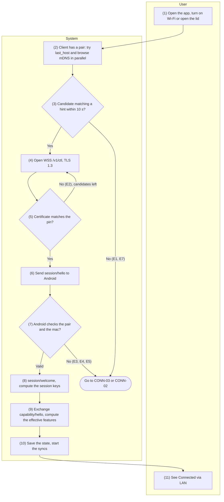
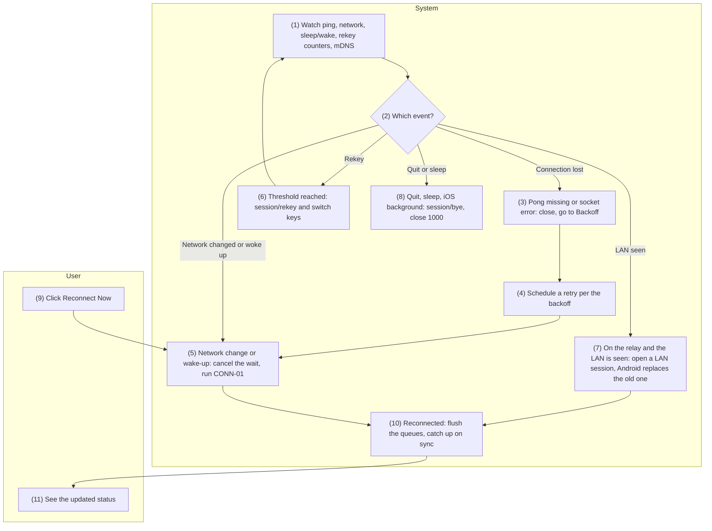
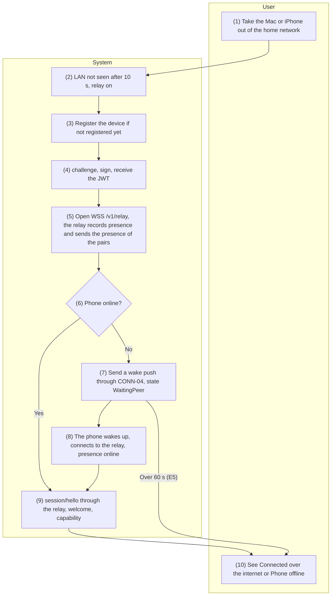
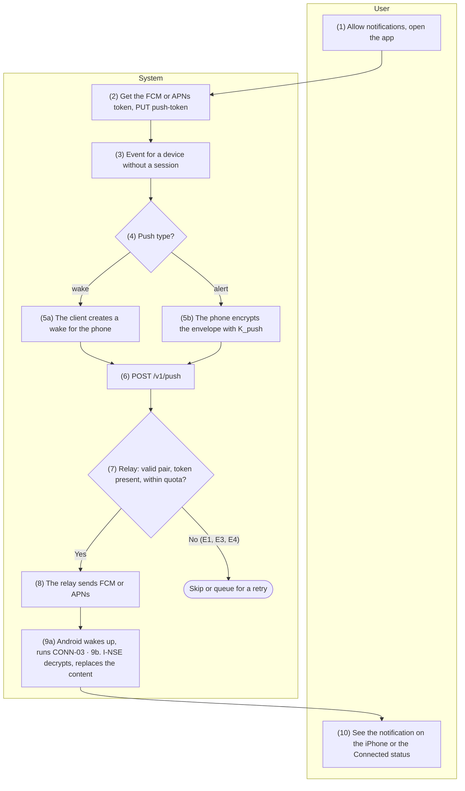

English | [Tiếng Việt](03-connectivity.vi.md)

# 3. Function group: Connectivity

> Common references: [`00-common-specs.md`](00-common-specs.md) — transport channels (0.4), message
> frames (0.5), session handshake (0.6.3), relay authentication (0.6.4), message type catalog (0.7),
> error codes (0.8), schema (0.9), constants (0.10), client state machine (0.11).

## 3.1 CONN-01 — Automatic discovery and connection on the LAN

### 3.1.1 General information

| Item | Content |
|-----|----------|
| Name | CONN-01 — Automatic discovery and connection on the LAN |
| Description | The client (Mac/iOS) finds the paired phone on the LAN by itself, opens the `/v1/ctl` channel over TLS with a pinned certificate, performs the session handshake per 0.6.3, exchanges capabilities to determine the effective features, then starts the dependent syncs (SMS-01, CALL-04, sending the latest clipboard).<br>Runs automatically when the app launches, when a new network becomes available, when the Mac wakes up, when iOS returns to the foreground, right after PAIR-01 and every time CONN-02 retries the connection. |
| Actors | Primary: System (M-APP / I-APP, A-SVC). The user acts indirectly (opening the app, turning on Wi-Fi, opening the lid) or clicks "Reconnect Now". |
| Preconditions | 1. There is a valid pair (PAIR-01).<br>2. A-SVC is running as a foreground service.<br>3. Both devices are on the same LAN and the network allows mDNS multicast.<br>4. The client has been granted the local network permission (iOS 14+, macOS 15+) per SET-03. |
| Postconditions | **Success:** state `Connected` (LAN); session keys ready; the peer's capability stored in `features_json`; `last_seen_at`, `last_host`, `last_port` updated; the effective features turned on; the Android foreground service notification reads "Connected to \<name>".<br>**Failure:** move to CONN-03 after `LAN_DISCOVERY_GRACE` (if the relay is on) or to `Backoff` (CONN-02). |
| Exceptions | E1 — No instance with a matching hint within 10 s → CONN-03 (relay on) or keep browsing.<br>E2 — `TLS_PIN_MISMATCH`: drop this instance (it may be another device or an impostor) and try the next instance; if every instance of the pair fails the pin (the phone has regenerated its TLS key, 0.6.1) → stop trying and show "Needs to be paired again" (PAIR-02).<br>E3 — `session/error AUTH_FAILED` → report "Couldn't verify the phone", long 5-minute backoff, no continuous retries.<br>E4 — `PAIR_UNKNOWN` or `PAIR_REVOKED` (4403) → clean up the pair per PAIR-03 flow B, ask to pair again.<br>E5 — 4426 `UNSUPPORTED_VERSION` → prompt to update the app on the older device.<br>E6 — Handshake longer than 5 s (4408) → CONN-02 backoff.<br>E7 — The network isolates clients (guest Wi-Fi, mDNS blocked) → same as E1.<br>E8 — Local network permission denied → report it and open the SET-03 guidance. |
| Special requirements | **Performance:** reconnect < 3 s when `last_host` is known (a project success metric); handshake ≤ 300 ms on the LAN.<br>**Security:** TLS 1.3 only; pin the certificate's SHA-256, no hostname check; the mDNS TXT contains no static identifier (0.4.1).<br>**Platform:** iOS/macOS declare `NSLocalNetworkUsageDescription` and `NSBonjourServices = ["_handlive._tcp"]`; Android runs A-SVC with type `connectedDevice` (permissions `FOREGROUND_SERVICE_CONNECTED_DEVICE` + `CHANGE_NETWORK_STATE`) with an ongoing notification.<br>**Feature independence:** capabilities decide each feature; a feature that lacks a permission does not block the other features. |

### 3.1.2 Screens

N/A — no approved wireframe yet.

### 3.1.3 Component details

| # | Field | Data type | Input/Output | Initial value | Description |
|---|--------|--------------|--------------|------------------|-------|
| 1 | Status icon (Mac menu bar / iOS tab) | enum{connected\| connecting\| peer_offline\| disconnected} | Output | `connecting` | Mapped from the state machine in 0.11. Mac: template icon in the menu bar (`MenuBarExtra`, `.menuBarExtraStyle(.menu)`) — clicking it opens a menu, not a popover |
| 2 | Status line | string | Output | "Connecting…" | "Connected via Wi-Fi to \<phone name>" |
| 3 | Phone name | string(64) | Output | `peer_name` |  |
| 4 | Connection error message | string | Output | Empty | Per E3–E8 |
| 5 | "Reconnect Now" button | action | Input | Hidden while connected | Skips the backoff wait and runs again from step 2 |
| 6 | Foreground service notification (Android) | string | Output | "Waiting for a connection" | "Connected to \<client name>"; several clients: "Connected to 2 devices" |
| 7 | Effective features | array\<string> | Output | Empty | Shown in PAIR-02; updated after step 9 |

### 3.1.4 Business flow



| Step | Actor | Component | Description | Exceptions / Notes |
|------|----------|-----------|-------|--------------------|
| 1 | User | M-APP / I-APP | Opens the app, turns on Wi-Fi, opens the Mac's lid, brings the iOS app to the foreground; or clicks "Reconnect Now". | The flow also runs by itself after PAIR-01 and from CONN-02. |
| 2 | System | M-APP / I-APP | Reads the valid pair and loads `PRK` (memory cache or Keychain). In parallel: (a) immediately tries `last_host:last_port` (fast path); (b) runs `NWBrowser` for `_handlive._tcp` with TXT. | No local network permission yet → E8. |
| 3 | System | M-APP / I-APP | Computes the hints for the current hour and the previous hour (0.4.1); an instance whose TXT `h` contains one of the two hints is a candidate. The fast path (a) is also a candidate. | 10 s without a candidate → E1. |
| 4 | System | M-APP / I-APP → A-SVC | Opens `wss://<host>:<port>/v1/ctl`, TLS 1.3. A-SVC accepts the connection and starts counting `HANDSHAKE_TIMEOUT`. |  |
| 5 | System | M-APP / I-APP | Compares the SHA-256 of the server certificate with `peer_tls_sha256`. | Different → close, E2. |
| 6 | System | M-APP / I-APP | Generates an ephemeral X25519 key and a `nonce`, sends `session/hello`. |  |
| 7 | System | A-SVC | Checks that `pair_id` exists and is not revoked, that `device_id` is the peer's, that `mac` is correct (constant time), and the protocol version.<br>If the pair already has another session: the old session receives `session/bye {reason: replaced}` and is closed with 4409 once the new session has confirmed its keys (A-SVC can decrypt the first `capability/hello` of the new session; a replayed `hello` only gets a `welcome` and can never kick out the real session). | Failure → `session/error` + close 4401/4403/4426 (E3, E4, E5). |
| 8 | System | A-SVC → M-APP / I-APP | Android sends `session/welcome`; the client checks `mac`. Both sides compute `k_c2s`, `k_s2c`. | The client's check fails → close 4401, E3. |
| 9 | System | Both sides | Each side sends its first encrypted envelope, `capability/hello` (0.7.2). Effective features = on at both sides and Android has the permissions; `features_json` is stored. |  |
| 10 | System | Both sides | Update `last_seen_at`, `last_host`, `last_port`; publish the `Connected` state; Android updates the foreground service notification and the hints.<br>Start: SMS-01 (if sms is effective), CALL-04 (if call is effective), sending the latest clip if it was created within `CLIP_STALE_AFTER` (CLIP-01/02), flushing `sms_outbox` (SMS-04). | Each task runs independently; the failure of one task does not affect the others. |
| 11 | User | M-APP / I-APP, A-UI | Sees "Connected via Wi-Fi" on the client and the notification on Android. |  |

### 3.1.5 API/service specification

**List of calls**

| # | API/service | Channel | Direction | Used in steps |
|---|-------------|------|-------|-------------|
| 1 | mDNS advertising `NsdManager.registerService` | LAN multicast | Android | Background (before step 2), 10 |
| 2 | mDNS browsing `NWBrowser` (`.bonjourWithTXTRecord`) | LAN multicast | Client | 2, 3 |
| 3 | Opening the `wss://…/v1/ctl` connection (TLS 1.3, pinned) | TCP LAN | C→S | 4, 5 |
| 4 | `WS session/hello` | `/v1/ctl` | C→S | 6, 7 |
| 5 | `WS session/welcome` | `/v1/ctl` | S→C | 8 |
| 6 | `WS session/error` | `/v1/ctl` | S→C | 7 |
| 7 | `WS capability/hello` | `/v1/ctl` | Both ways | 9 |

#### API 1 — mDNS advertising (Android)

- **URL:** N/A (mDNS multicast `224.0.0.251:5353`, `ff02::fb`)
- **Method:** `NsdManager.registerService(NsdServiceInfo, NsdManager.PROTOCOL_DNS_SD, listener)`
- **Request:**

| Property | Value | Description |
|-----------|---------|-------|
| `serviceType` | `_handlive._tcp` |  |
| `serviceName` | `HL-<6 random hex>` | Changes every time A-SVC starts |
| `port` | The actual port of A-SVC (47800–47809) |  |
| TXT `v` | `1` |  |
| TXT `h` | Hint list (0.4.1) | Recomputed at the top of every hour and when a pair is added or removed |

- **Response:** callback `onServiceRegistered` (the system may change the final name on a conflict) or
  `onRegistrationFailed(errorCode)`.
- **Example:** `HL-4f9a2c._handlive._tcp.local.` SRV → `192.168.1.23:47800`, TXT `v=1`, `h=1a2b3c4d`
- **Business logic:**
  1. To change the TXT, unregister and register again (NsdManager cannot update TXT in place); A-SVC
     batches the changes, at most once per second.
  2. Registration failure → retry after 5 s, 30 s, then every 5 minutes; meanwhile clients can still
     reach it through `last_host`.
  3. When no pair is left: drop the `h` key, keep advertising `v` (needed for pairing).

#### API 2 — mDNS browsing (Mac/iOS)

- **URL:** N/A (mDNS)
- **Method:**
  `NWBrowser(for: .bonjourWithTXTRecord(type: "_handlive._tcp", domain: nil), using: .tcp)`
- **Request:** no parameters besides the service type.
- **Response:** a set of `NWBrowser.Result` with `endpoint` (`.service(name:type:domain:interface:)`) and
  `metadata` (`.bonjour(NWTXTRecord)`).
- **Example:** result `HL-4f9a2c` with TXT `["v": "1", "h": "1a2b3c4d,77e0aa19"]`.
- **Business logic:**
  1. Only consider results with `v = 1` and an `h` that contains a hint of the pair (current or
     previous hour).
  2. Connect to the service endpoint (the Network framework resolves it); once connected, take the
     actual IP address from `currentPath.remoteEndpoint` to store as `last_host`.
  3. The browser keeps running while connected through the relay, to detect the LAN and upgrade
     (CONN-02).

#### API 3 — Opening the `/v1/ctl` connection

- **URL:** `wss://{android_host}:{port}/v1/ctl`
- **Method:** WebSocket upgrade (HTTP/1.1 `GET` + `Upgrade: websocket`) over TLS 1.3.
- **Request:** standard WebSocket headers; no authentication header (authentication happens in the
  session handshake). Client: `URLSessionWebSocketTask` with the delegate
  `urlSession(_:didReceive:completionHandler:)` checking the certificate against the pin.
- **Response:** `101 Switching Protocols`. Android rejects any other path with `404`.
- **Example:** `GET /v1/ctl HTTP/1.1` · `Host: 192.168.1.23:47800` · `Upgrade: websocket` ·
  `Sec-WebSocket-Version: 13`
- **Business logic:**
  1. TLS delegate: take the leaf certificate from `SecTrust`, compute SHA-256 over the DER, compare it
     with `peer_tls_sha256`; match → `.useCredential`, mismatch → `.cancelAuthenticationChallenge` (E2).
  2. A-SVC allows at most 16 concurrent `/v1/ctl` connections without a handshake and closes any
     connection that does not send `session/hello` within 5 s (protection against resource
     exhaustion); the 17th connection is closed with 4429 `RATE_LIMITED`, silent connections are
     closed with 4408.

#### API 4 — `WS session/hello`

- **URL:** `wss://{android_host}:{port}/v1/ctl` (via relay: CONN-03)
- **Method:** `WS session/hello` (C→S), unencrypted payload (0.5.1), answered by `session/welcome` or
  `session/error`.
- **Request (`data`):**

| Field | Type | Required | Description |
|--------|------|----------|-------|
| `protocol` | int32 | Yes | `1` |
| `pair_id` | uuid | Yes |  |
| `device_id` | uuid | Yes | The client's `device_id` |
| `eph` | b64u (32 bytes) | Yes | The session's ephemeral X25519 public key |
| `nonce` | b64u (32 bytes) | Yes |  |
| `mac` | b64u (32 bytes) | Yes | HMAC-SHA256(`K_auth`, `T1`) per 0.6.3 |

- **Response:** API 5 or API 6.
- **Example:**

```json
{"v":1,"type":"session","id":"0192f400-11aa-7b2c-9d3e-4f5a6b7c8d9e","ts":1727151000000,"payload":"eyJvcCI6ImhlbGxvIiwiZGF0YSI6eyJwcm90b2NvbCI6MSwicGFpcl9pZCI6IjNmMmIxYzRkLTVlNmYtNGE3Yi04YzlkLTBlMWYyYTNiNGM1ZCIsImRldmljZV9pZCI6IjViMWY4YzJlLTlhNGQtOGU2Zi1hMWIyLWMzZDRlNWY2MDcxOCIsImVwaCI6Ii4uLiIsIm5vbmNlIjoiLi4uIiwibWFjIjoiLi4uIn19"}
```

Payload after base64 decoding:
`{"op":"hello","data":{"protocol":1,"pair_id":"3f2b1c4d-5e6f-4a7b-8c9d-0e1f2a3b4c5d","device_id":"5b1f8c2e-9a4d-8e6f-a1b2-c3d4e5f60718","eph":"…","nonce":"…","mac":"…"}}`

- **Business logic:**
  1. Order of checks in A-SVC: `protocol` (different major → 4426) → the pair exists (no →
     `PAIR_UNKNOWN`, 4401) → not revoked (4403) → `device_id` matches → `mac`.
  2. Wrong `mac` 5 times/minute from the same IP address (every `session/hello` rejected with `AUTH_FAILED` counts: wrong `mac`, wrong `device_id`, a low-order ephemeral key; `PAIR_UNKNOWN` and `PAIR_REVOKED` do not) → block that IP for 5 minutes (connections
     from a blocked IP are closed with 4429 `RATE_LIMITED` right after TLS).
  3. `nonce` is not stored; Android's ephemeral key is generated anew for every welcome, so a
     replayed hello never leads to a usable session.

#### API 5 — `WS session/welcome`

- **URL:** as in API 4
- **Method:** `WS session/welcome` (S→C), unencrypted payload.
- **Request (`data`):**

| Field | Type | Required | Description |
|--------|------|----------|-------|
| `device_id` | uuid | Yes | Android's `device_id` |
| `eph` | b64u (32 bytes) | Yes | Android's ephemeral X25519 key |
| `nonce` | b64u (32 bytes) | Yes |  |
| `mac` | b64u (32 bytes) | Yes | HMAC-SHA256(`K_auth`, `T2`) |

- **Response:** N/A (the client sends an encrypted `capability/hello` to confirm the keys).
- **Example:**
  `{"op":"welcome","data":{"device_id":"8c7d6e5f-4a3b-8c2d-9e1f-0a1b2c3d4e5f","eph":"…","nonce":"…","mac":"…"}}`
- **Business logic:**
  1. Android computes the session keys right after sending the welcome and waits for the first
     encrypted envelope; if that first envelope cannot be decrypted → close 4401.
  2. The client checks `mac` and that `device_id` matches `peer_device_id`; failure → close 4401.

#### API 6 — `WS session/error`

- **URL:** as in API 4
- **Method:** `WS session/error` (S→C), unencrypted payload; Android closes the connection right
  afterwards with the corresponding code (0.8.3).
- **Request (`data`):** `code` —
  enum{AUTH_FAILED\|PAIR_UNKNOWN\|PAIR_REVOKED\|UNSUPPORTED_VERSION\|RATE_LIMITED}; `message` —
  string; `min_protocol` — int32 (required with `UNSUPPORTED_VERSION`, absent with the other codes;
  the client uses it to show "Update HandLive on the phone" or "Update HandLive on this device").
- **Response:** N/A.
- **Example:** `{"op":"error","data":{"code":"PAIR_UNKNOWN","message":"Device is not paired"}}`
- **Business logic:** The client handles it per E3–E5; no automatic retry within 5 minutes of an
  `AUTH_FAILED`.

#### API 7 — `WS capability/hello`

- **URL:** as in API 4
- **Method:** `WS capability/hello` (both ways), encrypted envelope, no ack.
- **Request (`data`):** per 0.7.2.
- **Response:** N/A (the other side sends its own capability).
- **Example:** see 0.7.2.
- **Business logic:**
  1. Feature F is effective = `features.F.enabled` on both sides **and** Android is not missing a
     permission that F needs (table below).
  2. A feature that goes from effective to not effective → stop F's tasks (e.g. cancel the camera
     stream) and notify the user once.
  3. A different major `protocol` has already been blocked in the handshake; a different minor → use
     the common feature set.

| Feature | Android permissions needed (missing → not effective) |
|-----------|------------------------------------------|
| `clipboard` | None (automatic sending needs Accessibility — only affects `auto_send`) |
| `sms` | `READ_SMS` (new messages are detected with a `ContentObserver`, no `RECEIVE_SMS` needed); sending also needs `SEND_SMS` (missing → `can_send = false`); the SIM list needs `READ_PHONE_STATE`; contact names need `READ_CONTACTS` |
| `call` | `READ_PHONE_STATE`; answering/ending also needs `ANSWER_PHONE_CALLS` (missing → `can_answer = can_end = false`); the incoming number and the call log also need `READ_CALL_LOG` (missing → `caller_id = false`) |
| `call_audio` | `BLUETOOTH_CONNECT`; the Opus/WS path also needs Shizuku running and Android 11+ (only affects `opus_fallback`) |
| `camera` | `CAMERA`, `RECORD_AUDIO` |

#### Query

```sql
-- [Design] Mac/iOS, step 2: the valid pair and its known address
SELECT pair_id, peer_device_id, peer_name, peer_tls_sha256, last_host, last_port
FROM paired_device
WHERE revoked_at IS NULL
LIMIT 1;

-- [Design] Mac/iOS, step 10
UPDATE paired_device
SET last_seen_at = :now, last_host = :host, last_port = :port, features_json = :features_json
WHERE pair_id = :pair_id;

-- [Design] Android, step 7: check the pair of a session/hello
SELECT pair_id, peer_device_id, prk_enc, revoked_at
FROM paired_device
WHERE pair_id = :pair_id;

-- [Design] Android, step 10
UPDATE paired_device
SET last_seen_at = :now, features_json = :features_json
WHERE pair_id = :pair_id;

-- [Design] Android, API 1: pairs whose hints must be computed
SELECT pair_id, prk_enc
FROM paired_device
WHERE revoked_at IS NULL;
```

---

## 3.2 CONN-02 — Keep the connection alive and reconnect automatically

### 3.2.1 General information

| Item | Content |
|-----|----------|
| Name | CONN-02 — Keep the connection alive and reconnect automatically |
| Description | Keeps the session alive and recovers by itself: a WebSocket ping every 15 s (over the relay, plus an E2E `ping` every 30 s), detects a lost connection, reconnects with backoff, reacts immediately to network changes, sleep/wake and foreground/background events; rekeys the session after 24 h or 10,000 envelopes; upgrades from the relay to the LAN when the phone shows up on the LAN; closes gracefully with `session/bye`.<br>After reconnecting, it flushes the queues and catches up on sync. |
| Actors | Primary: System (M-APP / I-APP, A-SVC). The user can click "Reconnect Now". |
| Preconditions | There has been a session (`Connected`) before, or the client is in `Backoff`/`Discovering`. |
| Postconditions | The session is kept or re-established; the displayed status matches reality within ≤ 1 s of detection; `sms_outbox` entries still `pending` are resent; SMS-01 and CALL-04 catch up. |
| Exceptions | E1 — The network is completely lost: go to `Idle`, wait for `NWPathMonitor`/`NetworkCallback` to report a network, no useless backoff.<br>E2 — The Mac goes to sleep: send `session/bye {reason: shutdown}` if there is still time; on wake-up run CONN-01 immediately.<br>E3 — iOS goes to the background: send `session/bye {reason: shutdown}`, close; while suspended, messages arrive through push (CONN-04).<br>E4 — Rekey without an `ack` within 10 s → close the session, reconnect (a new handshake generates new keys).<br>E5 — `DECRYPT_FAILED` → close 4400, reconnect.<br>E6 — The operating system stops A-SVC (OEM background killing) → the client sees the connection drop; A-SVC `START_STICKY` restarts by itself; SET-01 has already requested the battery optimization exemption.<br>E7 — Closed with 4409 (replaced by a new connection of the same client) → do not reconnect from the old session. |
| Special requirements | **Performance:** reconnect < 3 s after the network returns; detect a lost connection in ≤ 25 s (15 s ping + 10 s waiting for the pong).<br>**Battery:** the client pings actively, Android only answers with pongs and closes connections that have been silent for more than 45 s; Android does not keep the relay connection when idle for more than 5 minutes.<br>**Backoff:** 0.5 → 1 → 2 → 4 → 8 → 16 → 30 s, jitter ±20 %, back to the start on success. |

### 3.2.2 Screens

N/A — no approved wireframe yet.

### 3.2.3 Component details

| # | Field | Data type | Input/Output | Initial value | Description |
|---|--------|--------------|--------------|------------------|-------|
| 1 | Connection status | enum{connected\| connecting\| peer_offline\| disconnected} | Output | Current value | As in CONN-01 field 1 |
| 2 | Channel | enum{lan\| relay\| usb} | Output | Current channel | Changes on the relay → LAN upgrade |
| 3 | Time until the next retry | int32 (seconds) | Output | Empty | "Retrying in 8 s" while in `Backoff` |
| 4 | "Reconnect Now" button | action | Input | Shown when `disconnected` | Cancels the backoff wait, runs CONN-01 |
| 5 | Messages waiting to be sent | int32 | Output | Number of `sms_outbox` rows in `pending` | "2 messages waiting for the phone" |

### 3.2.4 Business flow



| Step | Actor | Component | Description | Exceptions / Notes |
|------|----------|-----------|-------|--------------------|
| 1 | System | M-APP / I-APP, A-SVC | The client sends a WS ping every 15 s; over the relay it also sends a `ping/ping` envelope every 30 s (the WS ping only checks the hop to the relay).<br>It watches `NWPathMonitor`, `NSWorkspace.willSleepNotification`/`didWakeNotification` (Mac), `scenePhase` (iOS).<br>Android watches `ConnectivityManager.registerDefaultNetworkCallback` and counts the silent time of each session.<br>Both sides count the envelopes sent and the session age. |  |
| 2 | System | as above | Classifies the event. |  |
| 3 | System | M-APP / I-APP | No pong within 10 s, or a socket error, or `ping/ping` without an `ack` for 10 s → close the session, state `Backoff`. Android: a session silent for more than 45 s → close 4411 `IDLE_TIMEOUT`. | E5, E6. |
| 4 | System | M-APP / I-APP | Waits per the backoff table (with jitter). No network → `Idle`, wait for a network event. | E1. |
| 5 | System | M-APP / I-APP | Cancels the wait, runs CONN-01 (LAN first, then CONN-03 after 10 s). |  |
| 6 | System | The side that reaches the threshold first | Sends `session/rekey`; the receiver answers with an `ack` carrying its own ephemeral key and switches keys; the sender switches keys once it receives the `ack`. The old keys are kept for 30 s for envelopes in flight. | No `ack` → E4. |
| 7 | System | M-APP / I-APP → A-SVC | On the relay while mDNS sees a matching hint → open a new LAN session per CONN-01 steps 4–9. A-SVC sends `session/bye {reason: replaced}` on the relay session, then closes it with 4409. | E7 for the old session. |
| 8 | System | M-APP / I-APP | The user quits the app, the Mac is about to sleep, iOS goes to the background → send `session/bye` and close with 1000. | E2, E3. |
| 9 | User | M-APP / I-APP | Clicks "Reconnect Now". |  |
| 10 | System | M-APP / I-APP, A-SVC | Once `Connected` again: resend the `sms_outbox` entries still `pending` in creation order (SMS-04), run SMS-01 and CALL-04 with the stored cursors. |  |
| 11 | User | M-APP / I-APP | Sees the status and the number of waiting messages updated. |  |

### 3.2.5 API/service specification

**List of calls**

| # | API/service | Channel | Direction | Used in steps |
|---|-------------|------|-------|-------------|
| 1 | WS ping/pong (RFC 6455 control frames) | `/v1/ctl` or `/v1/relay` | C→S | 1, 3 |
| 2 | `WS ping/ping` | `/v1/ctl` via relay | C→S | 1, 3 |
| 3 | `WS session/rekey` | `/v1/ctl` | Both ways | 6 |
| 4 | `WS session/bye` | `/v1/ctl` | Both ways | 7, 8 |
| 5 | Operating system services: `NWPathMonitor`, `NSWorkspace` sleep/wake, `scenePhase`, `ConnectivityManager.NetworkCallback`, `URLSessionWebSocketTask.sendPing` | Local | — | 1, 4, 5, 8 |

#### API 1 — WS ping/pong

- **URL:** the current connection
- **Method:** WebSocket control frame `0x9` (ping) / `0xA` (pong).
- **Request:** 8-byte ping payload = a uint64 BE counter.
- **Response:** a pong with the same payload (Ktor and `URLSessionWebSocketTask` answer automatically).
- **Example:** ping `00 00 00 00 00 00 00 2A` → pong `00 00 00 00 00 00 00 2A`.
- **Business logic:** `URLSessionWebSocketTask.sendPing(pongReceiveHandler:)` with a 10 s timer; if
  the handler is not called in time → treat it as a lost connection.

#### API 2 — `WS ping/ping`

- **URL:** `wss://{RELAY_HOST}/v1/relay` with the `to`/`from` wrapper (only used when the session goes
  through the relay)
- **Method:** `WS ping/ping` (C→S), encrypted envelope, with ack.
- **Request (`data`):** `seq` — int64, increasing.
- **Response (`ack.data`):** `seq` — int64 (echoed), `server_ts` — Android's timestamp.
- **Example:** `{"op":"ping","data":{"seq":42}}` →
  `{"re":"0192f4a0-…","ok":true,"data":{"seq":42,"server_ts":1727151030000}}`
- **Business logic:** Measures the end-to-end RTT (shown in diagnostics); a single missing `ack`
  within 10 s → lost connection.

#### API 3 — `WS session/rekey`

- **URL:** `/v1/ctl` (LAN, USB or relay)
- **Method:** `WS session/rekey` (both ways), envelope encrypted with the current key, with ack.
- **Request (`data`):**

| Field | Type | Required | Description |
|--------|------|----------|-------|
| `epoch` | int32 | Yes | New key generation (current + 1) |
| `eph` | b64u (32 bytes) | Yes | New ephemeral X25519 key |
| `nonce` | b64u (32 bytes) | Yes |  |

- **Response (`ack.data`):** the receiver's `{epoch, eph, nonce}`.
- **Example:** `{"op":"rekey","data":{"epoch":1,"eph":"…","nonce":"…"}}` →
  `{"re":"…","ok":true,"data":{"epoch":1,"eph":"…","nonce":"…"}}`
- **Business logic:**
  1. New keys per 0.6.3 step 6; the devices re-derive both `k_c2s` and `k_s2c`.
  2. Both sides start a rekey at the same time → the side with the smaller `device_id` wins; the other
     side cancels its own request and answers with an `ack`; the winner ignores the loser's request
     and does not return an `ack`. A failed rekey (no `ack` within 10 s, an error `ack`, invalid data) →
     close 4410 `REKEY_FAILED`, then reconnect (E4).
  3. Envelopes encrypted with the old key that arrive within 30 s of the switch are still decrypted;
     after that → `DECRYPT_FAILED`.

#### API 4 — `WS session/bye`

Specified as in PAIR-03 API 2. In this group `reason` is `shutdown` (quit, sleep, background),
`replaced` (Android replaces an old session with a new session of the same pair) or `update` (the app
is about to be updated).

#### Query

```sql
-- [Design] Mac/iOS, step 10: SMS messages waiting to be resent
SELECT local_id, pair_id, thread_id, addresses_json, body, sub_id, attempts
FROM sms_outbox
WHERE pair_id = :pair_id AND state = 'pending'
ORDER BY created_at ASC;

-- [Design] Mac/iOS, field 5: count the waiting messages
SELECT COUNT(*) FROM sms_outbox WHERE pair_id = :pair_id AND state = 'pending';

-- [Design] Mac/iOS, step 10: the stored sync cursors
SELECT stream, cursor FROM sync_cursor WHERE pair_id = :pair_id;
```

---

## 3.3 CONN-03 — Connect through the relay outside the LAN

### 3.3.1 General information

| Item | Content |
|-----|----------|
| Name | CONN-03 — Connect through the relay outside the LAN |
| Description | When the client does not see the phone on the LAN after `LAN_DISCOVERY_GRACE` (10 s) or the network blocks mDNS, and `relay.enabled = true` on both sides, the client connects to the relay: registers the device (once), authenticates with a challenge–signature exchange to get a JWT, opens the WSS `/v1/relay`, receives presence.<br>When the phone is online, the client performs the session handshake and exchanges capabilities through the relay exactly as on the LAN; the content is still end-to-end encrypted.<br>The phone does not keep a permanent relay connection: it connects when it has an envelope to send to a client that is not on the LAN, when it is woken up by push (CONN-04), and disconnects by itself after 5 idle minutes.<br>The camera does not go through the relay. |
| Actors | Primary: System (M-APP / I-APP, A-SVC, R-API, R-KV, R-DB). |
| Preconditions | 1. There is a valid pair, already registered with the relay or registrable right away (PAIR-01 API 8). 2. `relay.enabled = true` on both devices. 3. Internet access. |
| Postconditions | **Success:** an E2E session through the relay, status "Connected over the internet"; the data features work as on the LAN (except the camera and call audio — they need proximity).<br>**Phone offline:** state `WaitingPeer` ("Phone offline"), a wake push has been sent. |
| Exceptions | E1 — The relay does not respond or returns 5xx → backoff (CONN-02).<br>E2 — 401 `SIGNATURE_INVALID` or 404 `DEVICE_NOT_FOUND` → register the device again, then retry once.<br>E3 — 410 `DEVICE_REVOKED` → report "This device was removed from the internet service", turn the relay off until the user turns it back on (new registration).<br>E4 — `relay.error NOT_PAIRED` when sending → call `GET /v1/pairs`: revoked → PAIR-03 flow B; not registered → `POST /v1/pairs`, then retry.<br>E5 — The phone does not come online within 60 s of the push → stay in `WaitingPeer`; do not push again more than once per 5 minutes.<br>E6 — 429 `RATE_LIMITED` → wait for `Retry-After`.<br>E7 — The relay certificate does not match the pin → do not connect, report a security error.<br>E8 — `relay.error NOT_CONNECTED` (the peer just left) → back to `WaitingPeer`. |
| Special requirements | **Security:** the relay only sees the wrapper (`to`/`from`, `type`, size, time); it has no E2E key; 15-minute JWT; pinned SPKI of ISRG Root X1/X2 + a backup key.<br>**Resources:** at most 2 MiB/s per pair; envelope ≤ 256 KiB.<br>**Reference performance:** SMS and call notifications through the relay ≤ 1 s when both sides are online.<br>**Operations:** the relay is stateless; presence and routing between instances go through Redis; statistics only per `device_hash`. |

### 3.3.2 Screens

N/A — no approved wireframe yet.

### 3.3.3 Component details

| # | Field | Data type | Input/Output | Initial value | Description |
|---|--------|--------------|--------------|------------------|-------|
| 1 | Connection status | enum{connected\| connecting\| peer_offline\| disconnected} | Output | `connecting` | `peer_offline` shows "Phone offline" |
| 2 | Channel | enum{lan\| relay\| usb} | Output | `relay` on success | "Internet" |
| 3 | Allow internet connection | bool | Input/Output | `relay.enabled` = `true` | Managed in SET-02, shown here to explain the situation when it is off |
| 4 | Relay error message | string | Output | Empty | Per E3, E6, E7 |

### 3.3.4 Business flow



| Step | Actor | Component | Description | Exceptions / Notes |
|------|----------|-----------|-------|--------------------|
| 1 | User | — | Leaves the home network or uses a network that blocks mDNS. |  |
| 2 | System | M-APP / I-APP | In `Discovering` for more than 10 s, `relay.enabled = true`. | Relay off → stay in `Discovering`. |
| 3 | System | M-APP / I-APP → R-API | If not registered yet or after E2: `POST /v1/devices`. If `relay_registered = 0` for the pair: `POST /v1/pairs`. | 410 → E3. |
| 4 | System | M-APP / I-APP → R-API | `POST /v1/auth/challenge`, then `POST /v1/auth/token` (0.6.4). A token with more than 60 s left is reused. | E2, E6. |
| 5 | System | M-APP / I-APP → R-API, R-KV | Opens `wss://{RELAY_HOST}/v1/relay` with `Authorization: Bearer`. Relay: records `presence`, subscribes to `dev:<device_id>`, sends `presence` for each pair and `pair_revoked` for revoked pairs. | Wrong pin → E7. |
| 6 | System | M-APP / I-APP | Reads the phone's `presence.online`. |  |
| 7 | System | M-APP / I-APP → R-API → PUSH | `POST /v1/push` kind `wake` to the phone (CONN-04). State `WaitingPeer`. | E5. |
| 8 | System | A-SVC → R-API | The phone receives the FCM message and performs steps 3–5 on its side; the relay publishes `presence online` to the client. |  |
| 9 | System | M-APP / I-APP ↔ R-API ↔ A-SVC | The client sends `session/hello` wrapped in `{"to": <android>, "env": …}`; the relay checks that the pair is valid and turns it into `{"from": <client>, "env": …}`. The handshake and capability exchange continue as in CONN-01 steps 6–10. | E4, E8. |
| 10 | User | M-APP / I-APP | Sees "Connected over the internet" or "Phone offline". |  |

### 3.3.5 API/service specification

**List of calls**

| # | API/service | Channel | Direction | Used in steps |
|---|-------------|------|-------|-------------|
| 1 | `POST /v1/devices` | Relay REST | Device → R-API | 3 |
| 2 | `POST /v1/auth/challenge` | Relay REST | Device → R-API | 4 |
| 3 | `POST /v1/auth/token` | Relay REST | Device → R-API | 4 |
| 4 | `GET /v1/relay` (WebSocket) | Relay WSS | Device ↔ R-API | 5, 8 |
| 5 | Relay op `presence`, `error` | Relay WSS (text) | R-API → device | 5, 6, 8, 9 |
| 6 | Envelope forwarding (`to`/`from` wrapper) | Relay WSS (text) | Device → R-API → device | 9 and every later envelope |

#### API 1 — `POST /v1/devices`

- **URL:** `https://{RELAY_HOST}/v1/devices`
- **Method:** `POST` (no JWT needed; self-certified by the signature in the body)
- **Request:**

| Field | Type | Required | Description |
|--------|------|----------|-------|
| `device_id` | uuid | Yes | Must equal UUIDv8(SHA-256(`ik_sig_pub`)) |
| `platform` | enum{android\| macos\| ios\| ipados} | Yes |  |
| `app_version` | string(32) | Yes |  |
| `ik_sig_pub` | b64u (32 bytes) | Yes |  |
| `ts` | timestamp | Yes | Skew from the relay clock ≤ 5 minutes |
| `sig` | b64u (64 bytes) | Yes | Ed25519(`ik_sig`, `"HLREG1"` ‖ `device_id`(16) ‖ `ik_sig_pub`(32) ‖ UTF-8(`platform`) ‖ `ts`(int64 BE)) |

- **Response:**

| HTTP | Body | When |
|------|------|---------|
| 201 | `{"device_id":"…","created_at":…}` | New registration |
| 200 | as above | Already registered; `app_version`, `last_seen_at` updated |
| 401 `SIGNATURE_INVALID` | error | Wrong signature, `device_id` does not match the key, or `ts` is skewed |
| 410 `DEVICE_REVOKED` | error | The device has been removed |

- **Example:**

```json
{"device_id":"5b1f8c2e-9a4d-8e6f-a1b2-c3d4e5f60718","platform":"macos","app_version":"1.0.0 (100)","ik_sig_pub":"7Kx9vQ2mTn4pL8rWz1YcHd6fJb3gSa5eUo0iVtNkQxA","ts":1727151100000,"sig":"<b64u, 64 bytes>"}
```

```json
{"device_id":"5b1f8c2e-9a4d-8e6f-a1b2-c3d4e5f60718","created_at":1727151100420}
```

- **Business logic:**
  1. Check `ts`, rebuild the signed string, check `sig`, check that `device_id` is derived from the
     key.
  2. Upsert by `device_id`; the `ik_sig_pub` of a `device_id` never changes (a new key = a new
     `device_id`).
  3. At most 10 new registrations per hour per IP address.

#### API 2 — `POST /v1/auth/challenge`

- **URL:** `https://{RELAY_HOST}/v1/auth/challenge`
- **Method:** `POST`
- **Request:** `device_id` — uuid, required.
- **Response 200:** `challenge` — b64u (32 bytes); `expires_at` — timestamp (+60 s). Errors: 404
  `DEVICE_NOT_FOUND`, 410 `DEVICE_REVOKED`, 429 `RATE_LIMITED`.
- **Example:** `{"device_id":"5b1f8c2e-9a4d-8e6f-a1b2-c3d4e5f60718"}` →
  `{"challenge":"0tXoN3f1C9aYQbJ8kVw2mZr5uHs7pLd4gEi6cBy0xQA","expires_at":1727151160000}`
- **Business logic:** Generate 32 random bytes, write `chal:<device_id>` (overwriting any older
  challenge), TTL 60 s; at most 10 times/minute per device.

#### API 3 — `POST /v1/auth/token`

- **URL:** `https://{RELAY_HOST}/v1/auth/token`
- **Method:** `POST`
- **Request:**

| Field | Type | Required | Description |
|--------|------|----------|-------|
| `device_id` | uuid | Yes |  |
| `challenge` | b64u | Yes | The value just received |
| `sig` | b64u (64 bytes) | Yes | Ed25519(`ik_sig`, `"HLAUTH1"` ‖ challenge ‖ `device_id`(16)) |

- **Response 200:** `access_token` — string (JWT HS256, claims `sub`, `iat`, `exp`, `jti`);
  `expires_in` — int32 (900). Errors: 400 `BAD_REQUEST` (`sig` is not a 64-byte b64u), 401
  `CHALLENGE_EXPIRED`, 401 `SIGNATURE_INVALID`, 404 `DEVICE_NOT_FOUND`, 410 `DEVICE_REVOKED`, 500
  `INTERNAL`.
- **Example:** `{"access_token":"eyJhbGciOiJIUzI1NiJ9.eyJzdWIiOiI1YjFm…","expires_in":900}`
- **Business logic:** Read and delete `chal:<device_id>` in a single command (`GETDEL`); missing or
  different → `CHALLENGE_EXPIRED`; verify the signature with the `ik_sig_pub` in `devices`; update
  `last_seen_at`.

#### API 4 — `GET /v1/relay` (WebSocket)

- **URL:** `wss://{RELAY_HOST}/v1/relay`
- **Method:** WebSocket upgrade, header `Authorization: Bearer <jwt>`.
- **Request:** no body. Once open: wrapper text frames (API 6) or control ops (`rv_join`,
  `rv_msg`).
- **Response:** `101 Switching Protocols`; 401 `TOKEN_EXPIRED` /`SIGNATURE_INVALID` if the JWT is
  invalid; 404 `DEVICE_NOT_FOUND` if the device has removed itself from the relay. Right after
  opening, the relay sends `presence` for every valid pair, `pair_revoked` for pairs revoked within
  the last 30 days, and `pair_revoked` for each element of `revoked_notice:<device_id>` (the peer
  deleted all of its data, SET-02), then deletes that key.
- **Example:** `GET /v1/relay HTTP/1.1` · `Host: relay.example.com` ·
  `Authorization: Bearer eyJhbGciOi…` · `Upgrade: websocket`
- **Business logic:**
  1. One relay connection per device; a new connection replaces the old one (closed with 4409).
  2. Write `presence:<device_id>` = instance id, TTL 60 s, renewed every 20 s; subscribe to
     `dev:<device_id>`.
  3. Load the list of valid peers from `pairs` into the connection's memory; refresh it on
     `pair_revoked`.
  4. Publish `presence online` to each peer that is online (publish `dev:<peer>`); on close: delete
     `presence` if it still belongs to this instance, publish `presence offline`.
  5. A JWT that expires while the connection is open does not cut the connection; only the next
     opening needs a new token.

#### API 5 — Relay op `presence` and `error`

- **URL:** `wss://{RELAY_HOST}/v1/relay`
- **Method:** control WS text frame (R-API → device).
- **Request:**

| op | Field | Type | Description |
|----|--------|------|-------|
| `presence` | `pair_id` | uuid |  |
| `presence` | `peer_device_id` | uuid |  |
| `presence` | `online` | bool |  |
| `error` | `code` | string | `NOT_PAIRED`, `NOT_CONNECTED`, `PAYLOAD_TOO_LARGE`, `RATE_LIMITED`, `BAD_REQUEST` |
| `error` | `message` | string |  |
| `error` | `to` | uuid | Destination of the rejected frame (if any) |

- **Response:** N/A.
- **Example:**
  `{"op":"presence","pair_id":"3f2b1c4d-5e6f-4a7b-8c9d-0e1f2a3b4c5d","peer_device_id":"8c7d6e5f-4a3b-8c2d-9e1f-0a1b2c3d4e5f","online":true}`
- **Business logic:** Devices treat `presence` as a hint; the source of truth for the session is still
  a successful E2E handshake.

#### API 6 — Forwarding envelopes through the relay

- **URL:** `wss://{RELAY_HOST}/v1/relay`
- **Method:** wrapper WS text frame.
- **Request (device → relay):** `to` — uuid (destination `device_id`); `env` — object (the intact
  0.5.1 envelope).
- **Response (relay → destination device):** `from` — uuid; `env` — object. Errors go back to the
  sender with op `error`.
- **Example:**

```json
{"to":"8c7d6e5f-4a3b-8c2d-9e1f-0a1b2c3d4e5f","env":{"v":1,"type":"sms","id":"0192f4b2-5c6d-7e8f-9a0b-1c2d3e4f5a6b","ts":1727151200000,"payload":"<b64>"}}
{"from":"5b1f8c2e-9a4d-8e6f-a1b2-c3d4e5f60718","env":{"v":1,"type":"sms","id":"0192f4b2-5c6d-7e8f-9a0b-1c2d3e4f5a6b","ts":1727151200000,"payload":"<b64>"}}
```

- **Business logic:**
  1. `to` must be the peer in a valid pair with the sender; otherwise → `error NOT_PAIRED`.
  2. Frame > 256 KiB → `error PAYLOAD_TOO_LARGE`; over 2 MiB/s per pair → delay socket reads
     (backpressure), no frame is dropped.
  3. No `presence:<to>` → `error NOT_CONNECTED`; present → publish `dev:<to>`.
  4. No decryption, no logging of `env`; only the envelope count and bytes are added to
     `usage_daily` per `device_hash`.

#### Query

```sql
-- [Design] Relay, API 1: register or update a device
INSERT INTO devices (device_id, ik_sig_pub, platform, app_version)
VALUES ($1, $2, $3, $4)
ON CONFLICT (device_id) DO UPDATE
SET app_version = EXCLUDED.app_version, last_seen_at = now()
WHERE devices.revoked_at IS NULL AND devices.ik_sig_pub = EXCLUDED.ik_sig_pub
RETURNING device_id, created_at;

-- [Design] Relay, API 2 and 3: public key and status
SELECT ik_sig_pub, revoked_at FROM devices WHERE device_id = $1;

-- [Design] Relay, API 3
UPDATE devices SET last_seen_at = now() WHERE device_id = $1;

-- [Design] Relay, API 4: valid peers of the device that just connected
SELECT pair_id,
       CASE WHEN device_a = $1 THEN device_b ELSE device_a END AS peer_device_id
FROM pairs
WHERE (device_a = $1 OR device_b = $1) AND revoked_at IS NULL;

-- [Design] Relay, API 6: add to the statistics (batched every 60 s)
INSERT INTO usage_daily (day, device_hash, envelopes, bytes)
VALUES (current_date, $1, $2, $3)
ON CONFLICT (day, device_hash) DO UPDATE
SET envelopes = usage_daily.envelopes + EXCLUDED.envelopes,
    bytes     = usage_daily.bytes + EXCLUDED.bytes;

-- [Design] Every device, step 3: pairs not yet registered with the relay
SELECT pair_id FROM paired_device WHERE revoked_at IS NULL AND relay_registered = 0;
```

```text
# [Design] Redis
SET       chal:<device_id> <challenge> EX 60           # API 2
GETDEL    chal:<device_id>                             # API 3
SET       presence:<device_id> <instance_id> EX 60     # API 4, renewed every 20 s
SUBSCRIBE dev:<device_id>                              # API 4
SMEMBERS  revoked_notice:<device_id>                   # API 4: send pair_revoked for each element
DEL       revoked_notice:<device_id>                   # API 4: once they have been sent
EXISTS    presence:<to>                                # API 6
PUBLISH   dev:<to> {"from":"<device_id>","env":{...}}  # API 6
INCR      rl:<device_id>:relay:<minute>                # rate limit
```

---

## 3.4 CONN-04 — Push registration and device wake-up

### 3.4.1 General information

| Item | Content |
|-----|----------|
| Name | CONN-04 — Push registration and device wake-up |
| Description | Registers the push token with the relay (FCM for Android, APNs for iOS) and sends a push when the target device has no session: (a) **wake** — the client needs the phone (sending an SMS, the user opens the app outside the LAN): the relay sends a high-priority FCM data message, the phone wakes up and connects to the relay (CONN-03); (b) **alert** — the phone needs to notify a suspended iPhone/iPad (new SMS, incoming call, missed call): an envelope encrypted with `K_push` travels inside the APNs push, and I-NSE decrypts it and replaces the notification content.<br>The Mac does not use push. |
| Actors | Primary: System (A-SVC, I-APP, I-NSE, R-API, FCM, APNs). Secondary: User (allows notifications on iOS, sees the notifications). |
| Preconditions | 1. `relay.enabled = true`; the target device is registered with the relay and has a push token. 2. iOS: the user has allowed notifications (SET-03). 3. The pair is valid on the relay. |
| Postconditions | The latest token is in `devices`; the push reaches the right device; the phone connects to the relay within ≤ 10 s of a wake (reference target); the iPhone shows a notification with content while unlocked and generic content while locked. |
| Exceptions | E1 — The target device has no token yet (409 `PUSH_TOKEN_MISSING`) → skip; the data will arrive through sync once connected.<br>E2 — Temporary FCM/APNs error (502 `PUSH_PROVIDER_ERROR`) → Android queues the push in `push_outbox` and retries with backoff until `expires_at`.<br>E3 — The token is no longer valid (FCM `UNREGISTERED`, APNs 410) → the relay deletes the token; the device registers again the next time the app is opened.<br>E4 — 429 `RATE_LIMITED`.<br>E5 — I-NSE cannot read the key (device locked) or decryption fails → shows "New notification from your phone".<br>E6 — The phone is in a background-restricted mode and FCM is deprioritized → it wakes up late; SET-01 has already guided the user to turn off battery optimization.<br>E7 — Envelope older than 24 h or `id` already processed → I-NSE shows the generic content and does not process it again. |
| Special requirements | **Security:** FCM carries no content; APNs only carries the encrypted envelope (`K_push`), and the `aps.alert` part only has a `loc-key` — the iPhone translates the generic wording into its own language (0.12.4).<br>**Limits:** APNs payload ≤ 4 KB → SMS content in a push is cut at 1,000 characters, complete after SMS-01.<br>**Platform policy:** no PushKit VoIP (iOS 13+ requires every VoIP push to report a call to CallKit); incoming call notifications use an alert with `interruption-level: time-sensitive`; high-priority FCM is only used for things the user needs right away.<br>**Anti-spam:** `apns-collapse-id` per conversation/call; at most 30 pushes/minute per sending device. |

### 3.4.2 Screens

N/A — no approved wireframe yet.

### 3.4.3 Component details

| # | Field | Data type | Input/Output | Initial value | Description |
|---|--------|--------------|--------------|------------------|-------|
| 1 | Notification permission (iOS) | enum{allowed\| denied\| not_determined} | Input/Output | `not_determined` | The system asks during SET-03; guidance is shown if `denied` |
| 2 | Notification title | string | Output | "HandLive" | I-NSE replaces it with the sender's name or "Incoming Call" |
| 3 | Notification content | string | Output | "New notification from your phone" | I-NSE replaces it with the decrypted content (respects `sms.preview`) |
| 4 | Notification group | string | Output | — | `thread-id` = SMS conversation or "calls" |

### 3.4.4 Business flow



| Step | Actor | Component | Description | Exceptions / Notes |
|------|----------|-----------|-------|--------------------|
| 1 | User | I-APP, A-UI | iOS: allows notifications when SET-03 asks. Android: no action needed (FCM data messages need no notification permission). | Declined → field 1 = `denied`; content only arrives when the app is opened. |
| 2 | System | A-SVC, I-APP → R-API | Gets the token (`FirebaseMessaging.getToken()`, `registerForRemoteNotifications`) and calls `PUT /v1/devices/me/push-token` for a new token, on `onNewToken`, and every 7 days. |  |
| 3 | System | M-APP / I-APP or A-SVC | An event arises that the target device must handle while the target has no session (LAN or relay): the client needs the phone (CONN-03 step 7, sending an SMS); the phone has `sms/new`, `call_event/state` (ringing), `call_event/log_new` (missed) for an iPhone/iPad. | Mac as the target → no push, wait for the sync. |
| 4 | System | as above | Chooses `wake` (the target is Android) or `alert` (the target is iOS/iPadOS). |  |
| 5a | System | M-APP / I-APP | Creates a `wake` request with a reason (`user_open`, `sms_send`, `call_action`). | At most 1 wake/5 minutes for the same reason. |
| 5b | System | A-SVC | Builds the envelope as when sending over a session (e.g. `sms/new`) but encrypts it with `K_push`; cuts SMS content at 1,000 characters; `collapse_key` = `sms:<thread_id>` or `call:<call_id>`. | Relay error → E2, write to `push_outbox` (deadline: 30 s for incoming calls, 24 h for SMS and missed calls). |
| 6 | System | → R-API | `POST /v1/push`. |  |
| 7 | System | R-API, R-DB | Checks that the sender and the target are in the same valid pair, that the target has a token, and the rate limit. | E1, E3, E4. |
| 8 | System | R-API → PUSH | FCM HTTP v1 (Android) or APNs HTTP/2 (iOS). Broken token → delete it from `devices` (E3). |  |
| 9a | System | A-SVC | `onMessageReceived` with `t = wake`: starts/keeps A-SVC (the foreground service start exemption for high-priority FCM), runs CONN-03, waits for the client's handshake; after 5 idle minutes it disconnects from the relay. | E6. |
| 9b | System | I-NSE | Reads `p` (pair_id) and `hl`; takes `PRK` from the shared Keychain group, derives `K_push`, decrypts; checks `ts` ≤ 24 h and that `id` has not been processed; builds the title/content by message type; calls `contentHandler`. | E5, E7. |
| 10 | User | I-APP / operating system | Sees the notification; tapping it opens I-APP (CONN-01, sync). On the waiting client: sees "Connected over the internet". |  |

### 3.4.5 API/service specification

**List of calls**

| # | API/service | Channel | Direction | Used in steps |
|---|-------------|------|-------|-------------|
| 1 | `PUT /v1/devices/me/push-token` | Relay REST | Device → R-API | 2 |
| 2 | `POST /v1/push` | Relay REST | Device → R-API | 6, 7 |
| 3 | FCM HTTP v1 `messages:send` | HTTPS | R-API → Google | 8 |
| 4 | APNs HTTP/2 | HTTPS | R-API → Apple | 8 |
| 5 | Operating system services: `FirebaseMessagingService.onMessageReceived`/`onNewToken`, `UIApplication.registerForRemoteNotifications`, `UNNotificationServiceExtension.didReceive(_:withContentHandler:)` | Local | — | 2, 9a, 9b |

#### API 1 — `PUT /v1/devices/me/push-token`

- **URL:** `https://{RELAY_HOST}/v1/devices/me/push-token`
- **Method:** `PUT`, header `Authorization: Bearer <jwt>`
- **Request:**

| Field | Type | Required | Description |
|--------|------|----------|-------|
| `provider` | enum{fcm\| apns\| apns_sandbox} | Yes | `apns_sandbox` for development builds |
| `token` | string(4096) | Yes | FCM registration token or APNs device token (hex) |
| `topic` | string(255) | With APNs | Bundle id of I-APP |

- **Response:** 204 with no body. Errors: 400 `BAD_REQUEST` (`topic` missing with APNs, provider does
  not match the platform).
- **Example:** `{"provider":"apns","token":"4f1c2e…a9","topic":"app.handlive.ios"}`
- **Business logic:** The provider must match `platform` (android ↔ fcm; ios/ipados ↔ apns*); the old
  token is overwritten.

#### API 2 — `POST /v1/push`

- **URL:** `https://{RELAY_HOST}/v1/push`
- **Method:** `POST`, header `Authorization: Bearer <jwt>`
- **Request:**

| Field | Type | Required | Description |
|--------|------|----------|-------|
| `pair_id` | uuid | Yes |  |
| `to` | uuid | Yes | Target `device_id` |
| `kind` | enum{wake\| alert} | Yes | `wake` only to Android; `alert` only to iOS/iPadOS |
| `reason` | enum{user_open\| sms_send\| call_action\| sms_new\| call_incoming\| call_missed} | Yes |  |
| `env_b64` | b64 | With `alert` | Envelope encrypted with `K_push`, ≤ 3,000 bytes |
| `collapse_key` | string(64) | No |  |
| `ttl_s` | int32 | No | Default 60 (wake, call_incoming), 86,400 (sms_new, call_missed) |

- **Response:** 202 `{"accepted":true}`. Errors: 403 `NOT_PAIRED`, 409 `PUSH_TOKEN_MISSING`, 413
  `PAYLOAD_TOO_LARGE`, 429 `RATE_LIMITED`, 502 `PUSH_PROVIDER_ERROR`.
- **Example:**

```json
{"pair_id":"7a6b5c4d-3e2f-4a1b-9c8d-7e6f5a4b3c2d","to":"2c3d4e5f-6a7b-8c9d-8e0f-1a2b3c4d5e6f","kind":"alert","reason":"sms_new","env_b64":"eyJ2IjoxLCJ0eXBlIjoic21zIiwiaWQiOiIwMTky…","collapse_key":"sms:118","ttl_s":86400}
```

- **Business logic:**
  1. Check that the caller (`sub`) and `to` are the two members of a non-revoked `pair_id`.
  2. Check that `kind` matches the target platform and that the target has a token.
  3. Rate limit of 30 pushes/minute per sender; a `wake` with the same `reason` within 5 minutes is
     coalesced (returns 202 but is not sent again).
  4. Call API 3 or API 4; add to `usage_daily.pushes`. `env_b64` is not kept after sending.

#### API 3 — FCM HTTP v1 (relay → Google)

- **URL:** `https://fcm.googleapis.com/v1/projects/{project_id}/messages:send`
- **Method:** `POST`, header `Authorization: Bearer <OAuth2 access token of the service account>`
- **Request:**

```json
{"message":{"token":"<fcm token>","data":{"t":"wake","p":"7a6b5c4d-3e2f-4a1b-9c8d-7e6f5a4b3c2d","r":"sms_send"},"android":{"priority":"HIGH","ttl":"60s","collapse_key":"wake"}}}
```

- **Response:** 200 `{"name":"projects/{project_id}/messages/<id>"}`; 404 with `UNREGISTERED` → delete
  the token (E3); 429/5xx → 502 for the caller.
- **Example:** as above.
- **Business logic:** Data messages only (no `notification` block) so that Android handles them in
  `onMessageReceived` even in the background; the service account key lives outside the repo (an
  environment variable of the relay).

#### API 4 — APNs HTTP/2 (relay → Apple)

- **URL:** `https://api.push.apple.com/3/device/{device_token}` (sandbox:
  `https://api.sandbox.push.apple.com/3/device/{device_token}`)
- **Method:** `POST`, header `authorization: bearer <ES256 JWT from the .p8 key>`,
  `apns-push-type: alert`, `apns-topic: <bundle id>`, `apns-priority: 10`,
  `apns-expiration: <now + ttl>`, `apns-collapse-id: <collapse_key>`
- **Request:**

```json
{"aps":{"alert":{"loc-key":"push.sms_new"},"mutable-content":1,"sound":"default","thread-id":"sms:118","interruption-level":"active"},"p":"7a6b5c4d-3e2f-4a1b-9c8d-7e6f5a4b3c2d","hl":"eyJ2IjoxLCJ0eXBlIjoic21zIiwiaWQiOiIwMTky…"}
```

- **Response:** 200 (header `apns-id`); 410 `Unregistered` → delete the token (E3); 400/403 → log a
  configuration error; 429/5xx → 502.
- **Example:** as above; with `reason = call_incoming`: `interruption-level` = `time-sensitive`,
  `thread-id` = `calls`.
- **Business logic:**
  1. The .p8 key lives outside the repo; the provider JWT is refreshed every 50 minutes; total payload ≤ 4 KB.
  2. The default content (shown when I-NSE cannot decrypt, e.g. while the iPhone is locked) is sent as `aps.alert.loc-key` — the relay sends no wording, the iPhone looks the key up in the app's catalog in the device language (0.12.4); it contains no phone number and no content. Keys by `reason`:

| `reason` | `aps.alert.loc-key` | Text (`en`) | `interruption-level` | `apns-collapse-id` / `thread-id` |
|----------|-------------------|------------------|----------------------|----------------------------------|
| `sms_new` | `push.sms_new` (no title; the system shows the app name) | New SMS message | `active` | `sms:<message_key>` / `sms:<thread_id>` |
| `call_incoming` | `push.call_incoming` | Incoming call on your phone | `time-sensitive` | `call:<call_id>` / `calls` |
| `call_missed` | `push.call_missed` | Missed call on your phone | `active` | `calllog:<entry_id>` (without `READ_CALL_LOG`: `call:<call_id>`) / `calls` |

#### Query

```sql
-- [Design] Relay, API 1
UPDATE devices
SET push_provider = $2, push_token = $3, push_topic = $4, last_seen_at = now()
WHERE device_id = $1 AND revoked_at IS NULL;

-- [Design] Relay, API 2: check the pair and get the target's token
SELECT d.platform, d.push_provider, d.push_token, d.push_topic
FROM pairs p
JOIN devices d ON d.device_id = $3
WHERE p.pair_id = $1
  AND p.revoked_at IS NULL
  AND ((p.device_a = $2 AND p.device_b = $3) OR (p.device_b = $2 AND p.device_a = $3))
  AND d.revoked_at IS NULL;

-- [Design] Relay, API 3/4: broken token
UPDATE devices SET push_token = NULL, push_provider = NULL WHERE device_id = $1;

-- [Design] Relay: count pushes
INSERT INTO usage_daily (day, device_hash, pushes)
VALUES (current_date, $1, 1)
ON CONFLICT (day, device_hash) DO UPDATE SET pushes = usage_daily.pushes + 1;

-- [Design] Android, step 5b (E2): queue a push
INSERT INTO push_outbox (id, pair_id, kind, body_b64, collapse_key, attempts, next_attempt_at, expires_at)
VALUES (:id, :pair_id, :kind, :body_b64, :collapse_key, 0, :now, :expires_at);

-- [Design] Android: fetch the pushes that are due for a retry
SELECT id, pair_id, kind, body_b64, collapse_key, attempts
FROM push_outbox
WHERE next_attempt_at <= :now AND expires_at > :now
ORDER BY next_attempt_at ASC
LIMIT 20;

-- [Design] Android: clean up pushes that were sent or have expired
DELETE FROM push_outbox WHERE id = :id OR expires_at <= :now;
```
