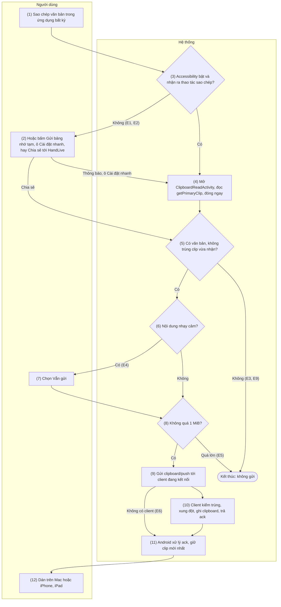
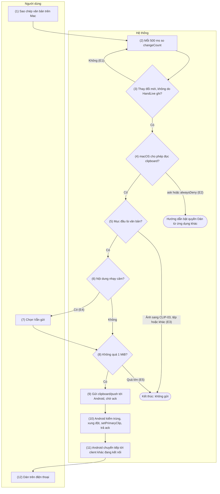
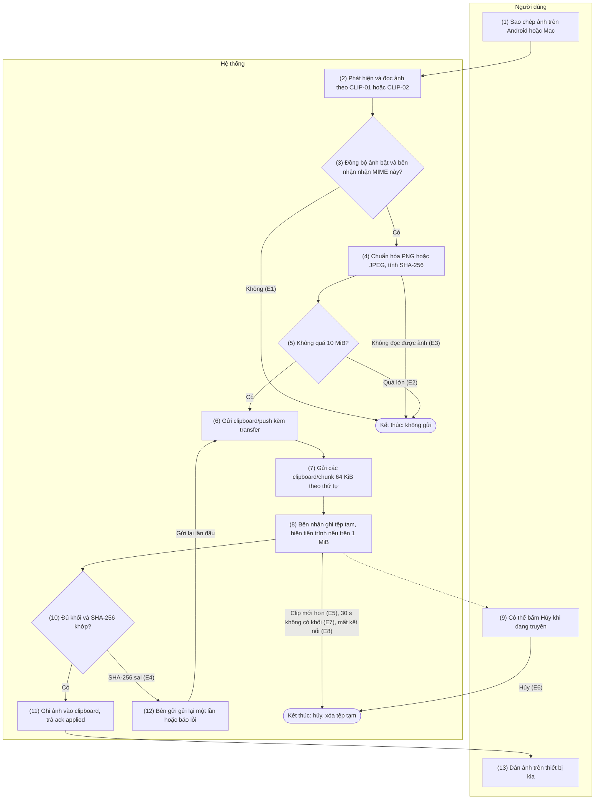
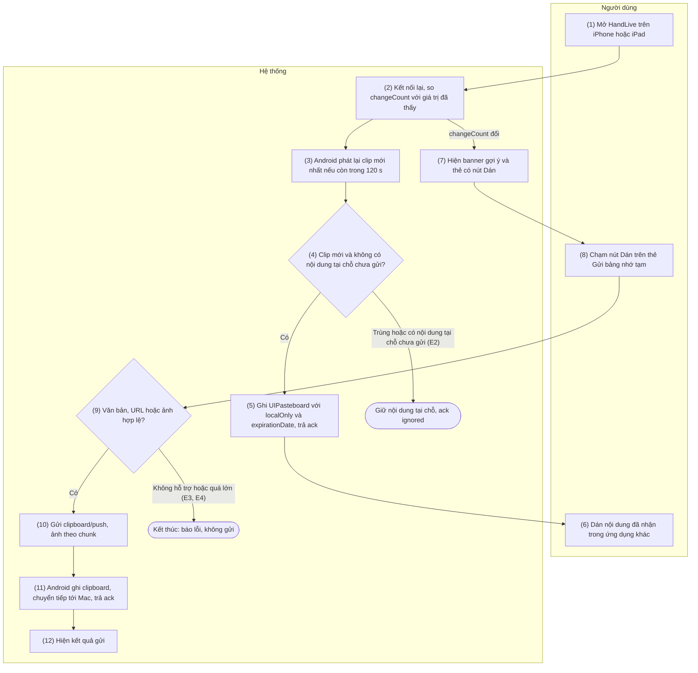
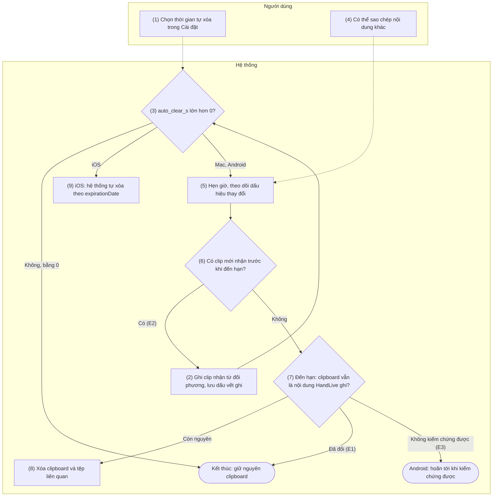

# 4. Nhóm chức năng: Đồng bộ clipboard

> Tham chiếu chung: [`00-common-specs.md`](00-common-specs.md) — thành phần A-CLIP, A-SVC, M-APP, I-APP (0.1), định danh `clip_id`, `transfer_id` (0.2), envelope, `ack` và plaintext nhị phân của `clipboard/chunk` (0.5.1), nguyên tắc bảo mật (0.6.5), loại tin `clipboard` (0.7.1), capability `features.clipboard` (0.7.2), mã lỗi `CLIP_*` (0.8.1), khóa cài đặt `feature.clipboard`, `clip.*` (0.9.5), hằng số `CLIP_*`, `CHUNK_SIZE`, `RELAY_RATE_LIMIT` (0.10). Quyết định áp dụng: README §5 C10 (quyền dán trên macOS), C15 (tự gửi qua Accessibility là mặc định).
>
> Quy tắc chung của nhóm — các chức năng lá tham chiếu theo mã QC:
> - **QC1 — Hiệu lực.** Clipboard hiệu lực với một cặp khi `feature.clipboard = true` ở cả hai phía; không cần quyền Android nào (CONN-01 API 7). Ảnh chỉ gửi khi bên gửi có `clip.send_images = true` và `features.clipboard.mimes` của bên nhận chứa MIME của ảnh; thiết bị đặt `clip.send_images = false` bỏ `image/png`, `image/jpeg` khỏi `mimes` của mình. Bên gửi lấy `max_text_bytes`, `max_image_bytes` của bên nhận làm giới hạn nếu nhỏ hơn giới hạn của mình.
> - **QC2 — Chỉ truyền tức thời.** Nội dung clip chỉ nằm trong bộ nhớ và tệp tạm của ảnh (CLIP-03); không ghi cơ sở dữ liệu, không lưu lịch sử (README §4), không ghi log (0.6.5). Log chỉ gồm `op`, `kind`, kích thước, mã lỗi.
> - **QC3 — Nội dung nhạy cảm** (bên gửi Android và Mac, khi `clip.block_sensitive = true`). Android: `ClipDescription` có extra `android.content.extra.IS_SENSITIVE` = `true` (chuẩn từ Android 13, đọc ở mọi phiên bản). Mac: mục trên clipboard có kiểu `org.nspasteboard.ConcealedType`, `org.nspasteboard.TransientType` hoặc `org.nspasteboard.AutoGeneratedType`. Cả hai: văn bản ≤ 256 ký tự chứa một dãy 13–19 chữ số (cho phép dấu cách hoặc gạch ngang giữa các nhóm) qua kiểm Luhn. Khi nhạy cảm: không gửi, hiện thông báo "Đã chặn nội dung nhạy cảm" có nút "Vẫn gửi" (`CLIP_SENSITIVE_BLOCKED`; thông báo mới thay thông báo cũ); nội dung giữ trong bộ nhớ tối đa `CLIP_STALE_AFTER`; "Vẫn gửi" gửi với `sensitive = true`. iPhone/iPad không áp dụng vì chỉ gửi khi người dùng bấm Dán (CLIP-04).
> - **QC4 — Chống vòng lặp.** Bên nhận nhớ SHA-256 (của UTF-8 văn bản hoặc byte ảnh đã chuẩn hóa) và thời điểm của clip vừa ghi từ đối phương; thay đổi tại chỗ có cùng SHA-256 trong `CLIP_LOOP_WINDOW` (5 s) bị bỏ qua. Mac nhớ thêm `changeCount` ngay sau khi ghi và gắn kiểu riêng `app.handlive.clip-id`; iOS nhớ `changeCount` sau khi ghi; Android bỏ qua tín hiệu sao chép của Accessibility trong 1 s sau khi chính HandLive ghi (overlay clipboard của Android 13+ xuất hiện cả với lần ghi này).
> - **QC5 — Kích thước.** Văn bản ≤ `CLIP_MAX_TEXT` (1 MiB UTF-8), ảnh ≤ `CLIP_MAX_IMAGE` (10 MiB); vượt → `CLIP_TOO_LARGE`, không gửi, báo tại chỗ (Android: toast; Mac: dòng trạng thái trong menu của biểu tượng thanh menu) — lỗi không đi bằng thông báo hệ thống. Văn bản đi thẳng trong `clipboard/push` khi plaintext của envelope ≤ `CLIP_INLINE_MAX` (180 KiB — để envelope sau base64 vẫn < 256 KiB, cùng lý do `SMS_PAGE_MAX_BYTES`); lớn hơn thì đi theo chunk như ảnh (CLIP-03).
> - **QC6 — Phân phối.** Bên gửi gửi `clipboard/push` tới mọi đối phương đang có phiên và clipboard hiệu lực (Android: mọi client; Mac/iOS: điện thoại). Android nhận clip từ một client thì ghi vào clipboard của mình rồi chuyển tiếp tới các client khác đang kết nối, giữ nguyên `clip_id`, `origin_device_id`, không đọc lại clipboard; clip bị Android từ chối hoặc bỏ vì xung đột thì không chuyển tiếp. Mọi bên chống trùng theo `clip_id` (nhớ 256 `clip_id` gần nhất trong 10 phút).
> - **QC7 — Kết nối lại.** Không có hàng đợi. Android giữ clip mới nhất (bất kể nguồn); Mac giữ clip sao chép tại chỗ mới nhất chưa được Android xác nhận. Khi một phiên mới thành công (CONN-01 bước 10), gửi clip đó nếu tạo trong `CLIP_STALE_AFTER` (120 s, theo đồng hồ bên gửi), đối phương chưa nhận `clip_id` đó và không phải thiết bị gốc. Quá hạn thì bỏ.
> - **QC8 — Xung đột.** Khi nhận `clipboard/push` mà bên nhận đang có một thay đổi tại chỗ chưa được chính đối phương đó xác nhận (chưa gửi, hoặc đã gửi mà chưa có `ack`): (a) thay đổi xảy ra trong `CLIP_CONFLICT_WINDOW` (500 ms, theo đồng hồ bên nhận) → giữ nội dung tại chỗ, trả `ack` `{status: "ignored", reason: "conflict"}` và gửi `clipboard/conflict`; thiết bị gốc hiện thông báo không chặn có nút "Gửi lại" — bên gửi không hiện (Android không chuyển tiếp `conflict`) nếu clip đó là clip phát lại theo QC7; (b) thay đổi cũ hơn cửa sổ (hai clip gửi chéo nhau, thường gặp khi kết nối lại) → giữ clip có `origin_ts` lớn hơn, bằng nhau thì clip có `origin_device_id` lớn hơn theo thứ tự chuỗi; hai phía dùng cùng phép so sánh nên hội tụ; bên bỏ clip đến trả `{status: "ignored", reason: "conflict"}`, không gửi `clipboard/conflict`. Bên không biết có thay đổi tại chỗ (Android chạy nền khi Accessibility tắt) coi như không có. iPhone/iPad: xem thêm CLIP-04 E2.
> - **QC9 — Hiệu năng và kênh.** Văn bản < 50 ms trong LAN, tính từ lúc bên gửi có nội dung tới lúc bên nhận ghi xong (không gồm thời gian phát hiện sao chép); ảnh 5 MB < 2 s trong LAN. Mọi thao tác chạy như nhau trong LAN và qua relay; qua relay giới hạn 2 MiB/s mỗi cặp (`RELAY_RATE_LIMIT`) và relay chỉ thấy `type = clipboard` cùng kích thước.
>
> Hằng số mới dùng trong nhóm (đề xuất bổ sung vào 0.10): `CLIP_INLINE_MAX` = 180 KiB plaintext, `CLIP_LOOP_WINDOW` = 5 s, `CLIP_DETECT_DEBOUNCE` = 300 ms, `CLIP_TRANSFER_IDLE_TIMEOUT` = 30 s.

## 4.1 CLIP-01 — Gửi văn bản clipboard từ Android sang Mac/iOS

### 4.1.1 Thông tin chung

| Mục | Nội dung |
|-----|----------|
| Tên | CLIP-01 — Gửi văn bản clipboard từ Android sang Mac/iOS |
| Mô tả | Khi người dùng sao chép văn bản trên điện thoại, HandLive đọc nội dung và gửi `clipboard/push` tới mọi Mac/iPhone/iPad đang kết nối có clipboard hiệu lực; bên nhận ghi vào clipboard hệ thống để dán ngay. Từ Android 10, ứng dụng chạy nền không đọc được clipboard (chỉ bàn phím mặc định hoặc ứng dụng đang có focus mới đọc được) và Accessibility không được miễn, nên có hai đường. **Tự động** (mặc định, quyết định D4/C15): `ClipboardAccessibilityService` nhận ra thao tác sao chép rồi mở `ClipboardReadActivity` trong suốt để đọc trong tích tắc. **Thủ công** (luôn có, là đường duy nhất khi Accessibility tắt): nút "Gửi bảng nhớ tạm" trên thông báo thường trực, ô Cài đặt nhanh "Gửi bảng nhớ tạm", hoặc chia sẻ văn bản tới HandLive. Văn bản có plaintext lớn hơn `CLIP_INLINE_MAX` đi theo chunk (CLIP-03); ảnh thuộc CLIP-03. iPhone/iPad chỉ nhận khi I-APP đang foreground (CLIP-04). |
| Tác nhân | Chính: Người dùng. Hệ thống: A-CLIP (`ClipboardAccessibilityService`, `ClipboardReadActivity`, `ClipboardModule`, `ClipboardTileService`, đích Chia sẻ), A-SVC, A-UI, OS (`ClipboardManager`, dịch vụ Hỗ trợ tiếp cận), M-APP, I-APP. |
| Điều kiện trước | 1. Có ít nhất một client đang có phiên `/v1/ctl` (CONN-01/CONN-03) và clipboard hiệu lực (QC1); nếu không, clip được giữ để phát lại (QC7). 2. Đường tự động: `clip.auto_send = true`, `clip.a11y_consent_at` đã có giá trị và người dùng đã bật `ClipboardAccessibilityService` trong Cài đặt › Hỗ trợ tiếp cận. 3. Đường thủ công: A-SVC đang chạy (nút trên thông báo); ô Cài đặt nhanh do người dùng tự thêm. |
| Điều kiện sau | **Thành công:** văn bản nằm trên clipboard của mọi client đang kết nối (Mac: kèm kiểu `app.handlive.clip-id`; iOS: `localOnly`, có hạn theo CLIP-05); bên nhận đã ghi dấu vết chống vòng lặp (QC4) và hẹn tự xóa (CLIP-05); Android giữ clip làm clip mới nhất (QC7). **Không gửi:** không bên nào đổi clipboard; người dùng thấy lý do với E3 (đường thủ công), E4–E7. |
| Ngoại lệ | E1 — Accessibility chưa bật, người dùng không đồng ý công bố hoặc `clip.auto_send = false`: không tự gửi, `features.clipboard.auto_send = false`, chỉ còn đường thủ công. E2 — Không nhận ra thao tác sao chép (ứng dụng tự vẽ menu hoặc không phát sự kiện; Android 10–12 sao chép bằng phím tắt bàn phím ngoài): không gửi, người dùng dùng đường thủ công. E3 — `ClipboardReadActivity` không có focus trong 1 s, clip rỗng, hoặc clip không phải văn bản/ảnh (`CLIP_UNSUPPORTED_MIME`, chỉ ghi log): bỏ qua; đường thủ công báo "Bảng nhớ tạm trống hoặc không phải văn bản". E4 — Nội dung nhạy cảm (QC3): chặn, thông báo có "Vẫn gửi". E5 — Văn bản > 1 MiB: `CLIP_TOO_LARGE`, không gửi; báo tại chỗ (trường 10). E6 — Không có client nào kết nối: giữ làm clip mới nhất (QC7); đường thủ công báo "Chưa kết nối — sẽ gửi nếu kết nối lại trong 2 phút". E7 — Bên nhận xung đột (QC8): `ack` `ignored`/`conflict` kèm `clipboard/conflict` → thông báo có "Gửi lại". E8 — Không có `ack` trong 10 s hoặc bên nhận ghi lỗi (`INTERNAL`): không gửi lại ngay; phát lại khi có phiên mới nếu còn trong 120 s (QC7). E9 — Trùng clip vừa nhận từ đối phương (QC4) hoặc, ở đường tự động, trùng clip vừa gửi trong 5 s: bỏ qua. E10 — Bên nhận trả `FEATURE_DISABLED` (capability chưa kịp cập nhật): bỏ qua, coi clipboard không hiệu lực với cặp đó tới `capability/update` kế tiếp. |
| Yêu cầu đặc biệt | **Hiệu năng:** theo QC9; đường tự động cộng thêm 300 ms gộp tín hiệu (`CLIP_DETECT_DEBOUNCE`) và khoảng 100–300 ms mở `ClipboardReadActivity`. **Riêng tư và chính sách:** công bố nổi bật và xin đồng ý trước khi đưa người dùng tới Cài đặt Hỗ trợ tiếp cận (trường 2, 3); cấu hình dịch vụ khai `isAccessibilityTool = false`, chỉ nhận các loại sự kiện cần thiết, không đọc nội dung cửa sổ; khai báo Accessibility trong Play Console; rủi ro Google Play từ chối đã được chủ dự án chấp nhận (C15); không dùng Notification Listener. Toast "HandLive đã dán từ bộ nhớ đệm" (Android 12+) là hành vi hệ thống, được nêu trước trong công bố. **Tin cậy:** nhận ra thao tác sao chép phụ thuộc ứng dụng và OEM nên đường thủ công luôn hiển thị; lỗi clipboard không ảnh hưởng tính năng khác. |

### 4.1.2 Màn hình

N/A — chưa có wireframe được duyệt.

### 4.1.3 Mô tả chi tiết các thành phần

| # | Trường | Kiểu dữ liệu | Input/Output | Giá trị khởi tạo | Mô tả |
|---|--------|--------------|--------------|------------------|-------|
| 1 | Tùy chọn "Tự gửi khi sao chép" | bool | Input/Output | `clip.auto_send` = `true` | Android, Cài đặt → Bảng nhớ tạm (SET-02). Bật lần đầu phải qua công bố (trường 2, 3) rồi bật dịch vụ trong Cài đặt › Hỗ trợ tiếp cận |
| 2 | Nội dung công bố Accessibility | string | Output | Văn bản cố định theo phiên bản | "HandLive dùng dịch vụ Hỗ trợ tiếp cận chỉ để nhận biết khi bạn bấm Sao chép, rồi đọc nội dung vừa sao chép và gửi (mã hóa đầu-cuối) tới Mac, iPhone, iPad đã ghép nối. Dịch vụ nhận các sự kiện bấm và thông báo ngắn trên màn hình để tìm thao tác Sao chép; sự kiện không liên quan bị bỏ ngay, không lưu, không gửi đi. Mỗi lần đọc, Android có thể hiện 'HandLive đã dán từ bộ nhớ đệm'. Bạn có thể tắt bất cứ lúc nào và gửi thủ công bằng nút Gửi bảng nhớ tạm." |
| 3 | Lựa chọn công bố | enum{Đồng ý\|Gửi thủ công} | Input | — | "Đồng ý" → lưu `clip.a11y_consent_at`, mở Cài đặt Hỗ trợ tiếp cận; "Gửi thủ công" → `clip.auto_send = false` |
| 4 | Nút "Gửi bảng nhớ tạm" trên thông báo thường trực | action | Input | Hiện khi có ≥ 1 client có clipboard hiệu lực | Mở `ClipboardReadActivity` với `source = manual` |
| 5 | Ô Cài đặt nhanh "Gửi bảng nhớ tạm" | action | Input | Người dùng tự thêm vào bảng Cài đặt nhanh | Dòng phụ: "Tới <tên client>", "Tới 2 thiết bị" hoặc "Chưa kết nối" |
| 6 | Mục chia sẻ "Gửi tới thiết bị (HandLive)" | action | Input | — | Trong bảng Chia sẻ của ứng dụng khác, chỉ với `text/plain` |
| 7 | Toast hệ thống khi đọc clipboard | string | Output | — | Android 12+: "HandLive đã dán từ bộ nhớ đệm" (nguyên văn theo ngôn ngữ hệ thống); hệ thống hiển thị, ứng dụng không tắt được |
| 8 | Thông báo chặn nội dung nhạy cảm | string | Output | — | "Đã chặn nội dung nhạy cảm — HandLive không gửi nội dung có vẻ là mật khẩu hoặc số thẻ." (QC3). Android: thông báo kênh `clipboard` ("Bảng nhớ tạm", `IMPORTANCE_DEFAULT`); Mac: thông báo hệ thống có nút |
| 9 | Nút "Vẫn gửi" | action | Input | — | Trên thông báo trường 8; gửi với `sensitive = true`; hết hạn sau 120 s |
| 10 | Báo nội dung quá lớn | string | Output | — | "Nội dung quá lớn để gửi (tối đa 1 MB văn bản)" — toast (đường thủ công), không đẩy thông báo hệ thống |
| 11 | Kết quả gửi thủ công | string | Output | — | Toast "Đã gửi tới <tên>", "Chưa kết nối — sẽ gửi nếu kết nối lại trong 2 phút" hoặc "Bảng nhớ tạm trống hoặc không phải văn bản" |
| 12 | Thông báo xung đột | string | Output | — | "Chưa ghi lên <tên thiết bị>: thiết bị này vừa có nội dung sao chép mới." Android: cùng kênh `clipboard` |
| 13 | Nút "Gửi lại" | action | Input | — | Trên thông báo trường 12; gửi lại cùng nội dung thành clip mới; hết hạn sau 120 s |
| 14 | Trạng thái tự gửi hiển thị trên Mac/iOS | string | Output | Theo `features.clipboard.auto_send` của điện thoại | `false` → "Tự gửi đang tắt trên điện thoại — dùng nút Gửi bảng nhớ tạm trên điện thoại" |
| 15 | Nội dung clipboard trên Mac/iOS | string | Output | Nội dung vừa nhận | Dán được ngay; tự xóa theo CLIP-05 |
| 16 | Tùy chọn "Chặn nội dung nhạy cảm" | bool | Input/Output | `clip.block_sensitive` = `true` | Cài đặt → Bảng nhớ tạm (SET-02) |

### 4.1.4 Luồng nghiệp vụ



| Bước | Tác nhân | Thành phần | Mô tả | Ngoại lệ / Ghi chú |
|------|----------|-----------|-------|--------------------|
| 1 | Người dùng | OS (ứng dụng bất kỳ) | Sao chép văn bản: mục "Sao chép" của menu chọn văn bản, nút sao chép riêng của ứng dụng, hoặc phím tắt. | |
| 2 | Người dùng | A-CLIP | Đường thủ công, luôn có: bấm "Gửi bảng nhớ tạm" trên thông báo thường trực của A-SVC hoặc ô Cài đặt nhanh (API 3) → bước 4; hoặc chọn HandLive trong bảng Chia sẻ (API 4) → bước 5 với văn bản lấy từ intent, không đọc clipboard. | Đường duy nhất khi E1, E2. |
| 3 | Hệ thống | A-CLIP (`ClipboardAccessibilityService`) | Khi `feature.clipboard`, `clip.auto_send` bật, đã có `clip.a11y_consent_at` và dịch vụ đang chạy: nhận sự kiện, nhận diện tín hiệu sao chép (API 1), gộp trong 300 ms rồi mở `ClipboardReadActivity`. Khi A-UI đang có focus: dùng `OnPrimaryClipChangedListener` và đọc trực tiếp (API 2), bỏ qua Accessibility. | E1, E2. Bỏ tín hiệu trong 1 s sau khi HandLive ghi clipboard (QC4). |
| 4 | Hệ thống | A-CLIP (`ClipboardReadActivity`), OS | Activity trong suốt, không hoạt ảnh; trong `onWindowFocusChanged(true)` gọi `ClipboardManager.getPrimaryClip()`, lấy item đầu, rồi `finish()` ngay (API 2). Android 12+ hệ thống hiện toast trường 7. | Không có focus trong 1 s hoặc clip rỗng → E3. Item là ảnh → CLIP-03. |
| 5 | Hệ thống | A-CLIP (`ClipboardModule`) | Chuyển thành văn bản thuần (`coerceToText`), tính SHA-256; bỏ nếu trùng clip vừa nhận từ đối phương trong 5 s (QC4) hoặc, ở đường tự động, trùng clip vừa gửi trong 5 s. | E3, E9. |
| 6 | Hệ thống | A-CLIP | Kiểm nhạy cảm theo QC3 (`EXTRA_IS_SENSITIVE`, số thẻ qua Luhn; đường Chia sẻ chỉ kiểm số thẻ). | Nhạy cảm → E4: hiện trường 8, 9; giữ nội dung trong bộ nhớ tối đa 120 s. |
| 7 | Người dùng | A-UI (thông báo) | Chọn "Vẫn gửi" → tiếp tục với `sensitive = true`. | Không chọn trong 120 s → bỏ nội dung. |
| 8 | Hệ thống | A-CLIP | Kiểm kích thước theo QC5: > 1 MiB → E5; plaintext > `CLIP_INLINE_MAX` → gửi theo chunk (CLIP-03 API 3–5); còn lại gửi thẳng. | E5. |
| 9 | Hệ thống | A-SVC | Sinh `clip_id` (UUIDv7); ghi làm clip mới nhất (QC7); gửi `clipboard/push` (API 5) tới từng client đang kết nối có clipboard hiệu lực, mỗi phiên một envelope. | Không có client → E6, sang bước 11. |
| 10 | Hệ thống | M-APP / I-APP | Chống trùng theo `clip_id`; kiểm xung đột (QC8); Mac ghi `NSPasteboard` (API 7), iOS ghi `UIPasteboard` (CLIP-04 API 1); ghi dấu vết QC4; hẹn CLIP-05; trả `ack`. | Xung đột → E7 (API 6). Lỗi ghi → `INTERNAL` (E8). |
| 11 | Hệ thống | A-SVC, A-UI | Xử lý `ack`: `applied` → xong (đường thủ công hiện "Đã gửi tới <tên>"); nhận `clipboard/conflict` → hiện trường 12, 13; hết 10 s → E8; `FEATURE_DISABLED` → E10. | |
| 12 | Người dùng | M-APP / I-APP (ứng dụng bất kỳ) | Dán nội dung (⌘V trên Mac, menu Dán trên iPhone/iPad). | Tự xóa sau `clip.auto_clear_s` (CLIP-05). |
| A1 | Người dùng | A-UI | Bật "Tự gửi khi sao chép" lần đầu (SET-01 hoặc SET-02). | |
| A2 | Hệ thống | A-UI | Hiện công bố (trường 2) toàn màn hình, chỉ tiếp tục khi người dùng chọn "Đồng ý" (trường 3): lưu `clip.a11y_consent_at`, mở `Settings.ACTION_ACCESSIBILITY_SETTINGS` kèm hướng dẫn chọn HandLive. | Chọn "Không" → `clip.auto_send = false` (E1). |
| A3 | Hệ thống | A-CLIP, A-SVC | Hệ thống gắn dịch vụ (`onServiceConnected`) → `features.clipboard.auto_send = true`, gửi `capability/update`; dịch vụ bị tắt (`onUnbind`) → `false`, gửi `capability/update`. Client cập nhật trường 14. | |

### 4.1.5 Đặc tả API/service

**Danh sách lời gọi**

| # | API/service | Kênh | Chiều | Dùng ở bước |
|---|-------------|------|-------|-------------|
| 1 | `AccessibilityService.onAccessibilityEvent` (`ClipboardAccessibilityService`) | Cục bộ Android | OS → A-CLIP | 3, A3 |
| 2 | `ClipboardManager.getPrimaryClip` trong `ClipboardReadActivity`; `OnPrimaryClipChangedListener` khi A-UI có focus | Cục bộ Android | A-CLIP ↔ OS | 3, 4, 5 |
| 3 | `TileService` (`ClipboardTileService`) và nút "Gửi bảng nhớ tạm" trên thông báo thường trực | Cục bộ Android | Người dùng → A-CLIP | 2 |
| 4 | Đích Chia sẻ `ACTION_SEND` `text/plain` | Cục bộ Android | Ứng dụng khác → A-CLIP | 2 |
| 5 | `WS clipboard/push` | `/v1/ctl` (LAN hoặc relay) | Hai chiều (ở đây S→C) | 9, 10, 11 |
| 6 | `WS clipboard/conflict` | `/v1/ctl` (LAN hoặc relay) | Hai chiều (ở đây C→S) | 10, 11 |
| 7 | `NSPasteboard` — ghi clip nhận được (Mac) | Cục bộ Mac | M-APP → OS | 10 |

Ghi clip trên iPhone/iPad: CLIP-04 API 1. `capability/update` khi trạng thái tự gửi đổi (A3) theo cấu trúc 0.7.2, như SET-02.

#### API 1 — `ClipboardAccessibilityService` (sự kiện Accessibility)

- **URL:** N/A
- **Method:** `AccessibilityService.onAccessibilityEvent(event: AccessibilityEvent)`; vòng đời `onServiceConnected()`, `onUnbind(intent)`, `disableSelf()`. Khai báo `<service android:permission="android.permission.BIND_ACCESSIBILITY_SERVICE">` với intent-filter `android.accessibilityservice.AccessibilityService` và meta-data `android.accessibilityservice` trỏ tới tệp cấu hình.
- **Request (cấu hình `res/xml/clipboard_accessibility.xml`):**

| Thuộc tính | Giá trị | Ghi chú |
|------------|---------|---------|
| `accessibilityEventTypes` | `typeViewClicked\|typeWindowStateChanged\|typeNotificationStateChanged\|typeAnnouncement` | Chỉ các loại cần để nhận ra thao tác sao chép |
| `accessibilityFeedbackType` | `feedbackGeneric` | |
| `notificationTimeout` | `100` | ms |
| `canRetrieveWindowContent` | `false` | Không đọc cây nội dung cửa sổ; chỉ dùng tên gói, tên lớp và văn bản đi kèm sự kiện |
| `isAccessibilityTool` | `false` | HandLive không phải công cụ hỗ trợ tiếp cận (chính sách Google Play) |
| `description` | Tóm tắt công bố (trường 2) | Hiển thị trong Cài đặt › Hỗ trợ tiếp cận |

- **Response (tín hiệu sao chép được nhận diện):**

| Tín hiệu | Điều kiện nhận diện |
|----------|---------------------|
| Bấm mục sao chép | `TYPE_VIEW_CLICKED` có văn bản hoặc mô tả trùng `android.R.string.copy`, `android.R.string.cut` theo ngôn ngữ hệ thống, hoặc chứa "copy", "sao chép" (không phân biệt hoa thường) |
| Toast hoặc lời thông báo "đã sao chép" | `TYPE_NOTIFICATION_STATE_CHANGED` của toast (`parcelableData` không phải `Notification`) hoặc `TYPE_ANNOUNCEMENT`, văn bản chứa "copied", "đã sao chép", "clipboard", "bảng nhớ tạm", "bộ nhớ đệm" |
| Overlay clipboard của hệ thống (Android 13+) | `TYPE_WINDOW_STATE_CHANGED` từ gói `com.android.systemui` có tên lớp hoặc văn bản của overlay clipboard (quy tắc cụ thể chốt bằng thử nghiệm trên từng dòng máy) |

- **Ví dụ:** trong Chrome người dùng chọn văn bản và bấm "Sao chép" → sự kiện `TYPE_VIEW_CLICKED`, gói `com.android.chrome`, văn bản `["Sao chép"]` → hẹn đọc sau 300 ms → không có tín hiệu mới → mở `ClipboardReadActivity` với `source = auto`.
- **Logic nghiệp vụ:**
  1. Chỉ xử lý khi `feature.clipboard = true`, `clip.auto_send = true` và đã có `clip.a11y_consent_at`. Người dùng tắt "Tự gửi khi sao chép" trong HandLive → gọi `disableSelf()` để tắt luôn dịch vụ trong Cài đặt hệ thống.
  2. Bỏ sự kiện có `packageName` là HandLive (A-UI có focus thì dùng listener, API 2) và mọi tín hiệu trong 1 s sau khi HandLive ghi clipboard (QC4).
  3. Gộp tín hiệu trong `CLIP_DETECT_DEBOUNCE` (300 ms) kể từ tín hiệu cuối: một lần sao chép thường sinh 2–3 tín hiệu (bấm, toast, overlay) nhưng chỉ mở `ClipboardReadActivity` một lần (`FLAG_ACTIVITY_NEW_TASK`, `FLAG_ACTIVITY_NO_ANIMATION`). Ứng dụng có dịch vụ Accessibility đang được hệ thống gắn thuộc diện được mở activity từ nền.
  4. Sự kiện chỉ được so khớp trong bộ nhớ rồi bỏ; không lưu, không log văn bản sự kiện, không gửi đi đâu (đúng như công bố).
  5. Độ chính xác phụ thuộc ứng dụng và OEM (E2): ứng dụng tự vẽ menu hoặc không phát sự kiện có thể bị bỏ sót; Android 13+ hiện overlay cho mọi lần ghi clipboard nên tỉ lệ nhận ra cao hơn.
  6. `onServiceConnected` / `onUnbind` cập nhật `features.clipboard.auto_send` và gửi `capability/update` (A3). A-UI kiểm trạng thái bằng `AccessibilityManager.getEnabledAccessibilityServiceList(FEEDBACK_ALL_MASK)`.

#### API 2 — `ClipboardReadActivity` và `ClipboardManager` (đọc clipboard)

- **URL:** N/A
- **Method:** `Activity.onWindowFocusChanged(hasFocus)` → `ClipboardManager.getPrimaryClip()`, `ClipData.getItemAt(0)`, `ClipData.Item.coerceToText(context)`, `ClipData.getDescription().getExtras()`; khi A-UI có focus: `ClipboardManager.addPrimaryClipChangedListener` / `removePrimaryClipChangedListener`.
- **Request:**

| Mục | Giá trị |
|-----|---------|
| Intent extra `source` | enum{auto\|manual} — `auto` từ API 1, `manual` từ API 3 |
| `android:theme` | Theme trong suốt: `windowIsTranslucent = true`, nền trong suốt, không tiêu đề, không hoạt ảnh |
| `android:excludeFromRecents`, `android:noHistory` | `true`, `true` |
| `android:taskAffinity` | `""` — task riêng, không kéo A-UI lên |
| `android:exported` | `false` (đích Chia sẻ exported qua `activity-alias`, API 4) |

- **Response:** `ClipData`, hoặc `null` khi không đọc được (chưa có focus, máy đang khóa). Dữ liệu dùng: `description.getMimeType(i)`, `description.extras` (`EXTRA_IS_SENSITIVE`), item `text` hoặc `uri`.
- **Ví dụ:**

```kotlin
// [Thiết kế] Đọc khi cửa sổ đã có focus rồi đóng ngay
override fun onWindowFocusChanged(hasFocus: Boolean) {
    super.onWindowFocusChanged(hasFocus)
    if (!hasFocus || handled) return
    handled = true
    val clip = getSystemService(ClipboardManager::class.java).primaryClip   // null → E3
    clipboardModule.onLocalClip(clip, source = intent.getStringExtra("source") ?: "auto")
    finish()   // tắt hoạt ảnh: overrideActivityTransition (API 34+) hoặc overridePendingTransition(0, 0)
}
```

- **Logic nghiệp vụ:**
  1. Chỉ đọc trong `onWindowFocusChanged(true)`: đọc ở `onCreate`/`onResume` có thể trả `null` vì cửa sổ chưa có focus. Chờ focus tối đa 1 s rồi đóng (E3).
  2. Lấy item 0: có `text` → `coerceToText` (HTML chỉ lấy chữ thuần; item là URI văn bản thì hệ thống đọc luồng); có `uri` với MIME `image/*` → CLIP-03, sao chép luồng vào cache ngay (quyền đọc URI bị thu hồi khi clip đổi); còn lại → E3.
  3. `finish()` ngay khi lấy xong dữ liệu (ảnh: sau khi sao chép xong trên luồng IO); kiểm QC3–QC5 và gửi chạy trong `ClipboardModule` của A-SVC (cùng tiến trình).
  4. Android 12+ hiện toast (trường 7) một lần cho mỗi clip mới do ứng dụng khác đặt; không hiện khi clip do chính HandLive ghi. Người dùng có thể tắt bằng tùy chọn hiển thị quyền truy cập bảng nhớ tạm trong Cài đặt › Quyền riêng tư (tên tùy OEM).
  5. Activity trong suốt nhận focus trong chốc lát: bàn phím ảo của ứng dụng đang dùng có thể ẩn rồi hiện lại (tùy ứng dụng).
  6. `OnPrimaryClipChangedListener` chỉ được hệ thống gọi khi HandLive có focus (mã nguồn AOSP kiểm cùng điều kiện với việc đọc, từ Android 10). A-UI đăng ký ở `onResume`, gỡ ở `onPause`; khi được gọi thì đọc trực tiếp như logic 2, không mở activity trong suốt.

#### API 3 — Ô Cài đặt nhanh và nút "Gửi bảng nhớ tạm" trên thông báo

- **URL:** N/A
- **Method:** `TileService.onStartListening()`, `TileService.onClick()` → `startActivityAndCollapse(PendingIntent)` (API 34+) hoặc `startActivityAndCollapse(Intent)` (API 29–33); nút thông báo: `NotificationCompat.Action` với `PendingIntent.getActivity(..., FLAG_IMMUTABLE)`.
- **Request:**

| Mục | Giá trị |
|-----|---------|
| Ô Cài đặt nhanh | `ClipboardTileService`, nhãn "Gửi bảng nhớ tạm"; `Tile.STATE_ACTIVE` khi có client có clipboard hiệu lực, `STATE_INACTIVE` khi không; dòng phụ (`Tile.setSubtitle`) theo trường 5 |
| Nút thông báo | Hành động "Gửi bảng nhớ tạm" trên thông báo foreground service của A-SVC (CONN-01 trường 6) |
| Intent đích | `ClipboardReadActivity`, extra `source = manual`, `FLAG_ACTIVITY_NEW_TASK` |

- **Response:** `ClipboardReadActivity` chạy như API 2; kết quả hiển thị bằng toast trường 11.
- **Ví dụ:**

```kotlin
// [Thiết kế] ClipboardTileService
override fun onClick() {
    val intent = Intent(this, ClipboardReadActivity::class.java)
        .putExtra("source", "manual").addFlags(Intent.FLAG_ACTIVITY_NEW_TASK)
    if (Build.VERSION.SDK_INT >= 34) {
        startActivityAndCollapse(PendingIntent.getActivity(this, 0, intent, PendingIntent.FLAG_IMMUTABLE))
    } else {
        @Suppress("DEPRECATION") startActivityAndCollapse(intent)
    }
}
```

- **Logic nghiệp vụ:**
  1. Hai lối này luôn có, không phụ thuộc Accessibility; đây là đường dự phòng thay Notification Listener (C15).
  2. Nút thông báo phải là `PendingIntent` mở thẳng activity: Android 12+ chặn "trampoline" (mở activity từ BroadcastReceiver hoặc Service do thông báo khởi chạy). Thao tác bấm của người dùng trên ô Cài đặt nhanh và thông báo thuộc diện được mở activity.
  3. `targetSdk 35`: trên API 34+ phải dùng bản `PendingIntent` của `startActivityAndCollapse` (bản `Intent` ném `UnsupportedOperationException`).
  4. Không có client: vẫn đọc và giữ làm clip mới nhất (E6); toast báo sẽ gửi nếu kết nối lại trong 2 phút.
  5. Đường thủ công không áp dụng quy tắc "trùng clip vừa gửi trong 5 s" (người dùng chủ động gửi lại).

#### API 4 — Đích Chia sẻ `ACTION_SEND` `text/plain`

- **URL:** N/A
- **Method:** `activity-alias` `ClipboardShareTarget` trỏ tới `ClipboardReadActivity`, intent-filter `android.intent.action.SEND` với `mimeType = text/plain`.
- **Request:** `Intent.EXTRA_TEXT` (CharSequence, chuyển thành chuỗi thuần); `EXTRA_SUBJECT` bị bỏ qua.
- **Response:** toast trường 11; activity đóng ngay.
- **Ví dụ:**

```xml
<!-- [Thiết kế] AndroidManifest.xml -->
<activity-alias android:name=".clip.ClipboardShareTarget"
    android:targetActivity=".clip.ClipboardReadActivity"
    android:label="@string/share_to_devices" android:exported="true">
  <intent-filter>
    <action android:name="android.intent.action.SEND" />
    <category android:name="android.intent.category.DEFAULT" />
    <data android:mimeType="text/plain" />
  </intent-filter>
</activity-alias>
```

- **Logic nghiệp vụ:**
  1. Nhận `ACTION_SEND`: lấy văn bản từ intent, không đọc clipboard nên không có toast hệ thống; `source = share`.
  2. QC3 chỉ kiểm số thẻ (không có `ClipDescription`); QC5 như đường khác (> 1 MiB → E5).
  3. Không ghi văn bản vào clipboard của điện thoại; chỉ gửi đi.
  4. v1 chỉ nhận `text/plain`; ảnh gửi bằng cách sao chép rồi dùng API 3 (CLIP-03).

#### API 5 — `WS clipboard/push`

- **URL:** `wss://{android_host}:{port}/v1/ctl` (LAN) hoặc qua relay `wss://{RELAY_HOST}/v1/relay` với lớp bọc `to`/`from`
- **Method:** `WS clipboard/push` (hai chiều), envelope mã hóa, có ack. Cấu trúc dùng chung cho CLIP-01…04.
- **Request (`data`):**

| Trường | Kiểu | Bắt buộc | Mô tả |
|--------|------|----------|-------|
| `clip_id` | uuid | Có | UUIDv7 do thiết bị gốc sinh; giữ nguyên khi Android chuyển tiếp và khi gửi lại sau `CLIP_CHECKSUM_MISMATCH` |
| `kind` | enum{text\|image} | Có | |
| `mime` | enum{text/plain\|image/png\|image/jpeg} | Có | `text/plain` luôn là UTF-8 |
| `text` | string | Khi `kind = text` và gửi thẳng | Toàn bộ văn bản; plaintext envelope ≤ `CLIP_INLINE_MAX` |
| `transfer` | object | Khi `kind = image` hoặc văn bản đi theo chunk | `{transfer_id, size, sha256, chunk_size, chunk_count}` — đặc tả ở CLIP-03 API 3 |
| `width`, `height` | int32 | Chỉ ảnh | Kích thước điểm ảnh |
| `sensitive` | bool | Có | `true` chỉ khi người dùng chọn "Vẫn gửi" (QC3) |
| `origin_ts` | timestamp | Có | Thời điểm nội dung được đọc trên thiết bị gốc (đồng hồ thiết bị gốc); chỉ dùng cho QC8 (b) |
| `source` | enum{auto\|manual\|share\|mac\|ios} | Có | Đường tạo clip: Android `auto`/`manual`/`share`; Mac `mac`; iOS `ios` |
| `origin_device_id` | uuid | Có | `device_id` của thiết bị gốc; Android dùng để chuyển tiếp và định tuyến `clipboard/conflict` |

Đúng một trong hai trường `text`, `transfer` có mặt.

- **Response (`ack`):**

| `ok` | `data` hoặc `error` | Khi nào |
|------|---------------------|---------|
| `true` | `{clip_id, status: "applied"}` | Đã ghi clipboard, hoặc nội dung trùng clipboard hiện tại |
| `true` | `{clip_id, status: "ignored", reason: "conflict"}` | QC8 |
| `true` | `{clip_id, status: "ignored", reason: "duplicate"}` | `clip_id` đã xử lý (QC6) |
| `true` | `{clip_id, status: "ignored", reason: "cancelled"}` | Lần truyền chunk bị hủy (CLIP-03 API 5) |
| `false` | `error.code` ∈ {`CLIP_TOO_LARGE`, `CLIP_UNSUPPORTED_MIME`, `CLIP_CHECKSUM_MISMATCH`, `FEATURE_DISABLED`, `BAD_REQUEST`, `INTERNAL`}; `error.details` = `{clip_id, status: "rejected"}` | Bên nhận từ chối |

- **Ví dụ (plaintext của payload):**

```json
{"op":"push","data":{"clip_id":"0192f3e0-5a21-7b3c-9d4e-1f2a3b4c5d6e","kind":"text","mime":"text/plain","text":"Mã đơn hàng: HL-240917-0042","sensitive":false,"origin_ts":1727150100123,"source":"auto","origin_device_id":"8c7d6e5f-4a3b-8c2d-9e1f-0a1b2c3d4e5f"}}
{"re":"0192f3e0-5a22-7c10-8a11-223344556677","ok":true,"data":{"clip_id":"0192f3e0-5a21-7b3c-9d4e-1f2a3b4c5d6e","status":"applied"}}
{"re":"0192f3e0-5a22-7c10-8a11-223344556677","ok":true,"data":{"clip_id":"0192f3e0-5a21-7b3c-9d4e-1f2a3b4c5d6e","status":"ignored","reason":"conflict"}}
{"re":"0192f3e0-5a22-7c10-8a11-223344556677","ok":false,"error":{"code":"CLIP_TOO_LARGE","message":"Vượt giới hạn văn bản","details":{"clip_id":"0192f3e0-5a21-7b3c-9d4e-1f2a3b4c5d6e","status":"rejected"}}}
```

- **Logic nghiệp vụ — bên gửi:**
  1. Chỉ gửi tới đối phương có clipboard hiệu lực, với giới hạn và `mimes` của đối phương (QC1); mỗi phiên một envelope, cùng `clip_id`.
  2. Chờ `ack` 10 s (`REQUEST_TIMEOUT`); clip đi theo chunk thì tính từ lúc gửi khối cuối. Không có `ack` → coi như đối phương chưa nhận, không gửi lại ngay; phát lại khi có phiên mới nếu còn trong 120 s (QC7).
  3. Clip mới hơn không hủy `push` văn bản đã gửi; lần truyền chunk đang chạy thì hủy bằng `clipboard/cancel` `reason = superseded` (CLIP-03 API 5).
  4. `ack` lỗi `CLIP_CHECKSUM_MISMATCH` → gửi lại một lần (CLIP-03); lỗi khác → thông báo cho người dùng nếu clip do thao tác thủ công, còn lại chỉ ghi log mã lỗi.
- **Logic nghiệp vụ — bên nhận:**
  5. Kiểm hợp lệ: `kind` khớp `mime`, đúng một trong `text`/`transfer`, `text` là UTF-8 hợp lệ; sai → `BAD_REQUEST`. Clipboard không hiệu lực → `FEATURE_DISABLED`. Vượt giới hạn của mình → `CLIP_TOO_LARGE`; MIME không nhận → `CLIP_UNSUPPORTED_MIME`.
  6. `clip_id` đã có kết quả `applied`/`ignored` → `ignored`/`duplicate`, không ghi lại; clip từng bị từ chối thì được nhận lại (gửi lại sau `CLIP_CHECKSUM_MISMATCH`).
  7. Kiểm xung đột QC8 → `ignored`/`conflict` (trường hợp (a) gửi thêm API 6).
  8. Ghi clipboard (Mac: API 7; Android: CLIP-02 API 3; iOS: CLIP-04 API 1). `sensitive = true`: Android thêm extra `EXTRA_IS_SENSITIVE`, Mac thêm kiểu `org.nspasteboard.ConcealedType` để trình quản lý clipboard không lưu. Ghi dấu vết QC4, hẹn CLIP-05, rồi trả `applied`.
  9. Android nhận từ client: sau logic 8 chuyển tiếp tới các client khác theo QC6 (CLIP-02 API 4).
  10. Không log `text`; log chỉ gồm `kind`, kích thước, trạng thái `ack`.

#### API 6 — `WS clipboard/conflict`

- **URL:** như API 5
- **Method:** `WS clipboard/conflict` (hai chiều), envelope mã hóa, không ack.
- **Request (`data`):**

| Trường | Kiểu | Bắt buộc | Mô tả |
|--------|------|----------|-------|
| `clip_id` | uuid | Có | Clip không được ghi |
| `origin_device_id` | uuid | Có | Thiết bị gốc của clip (lấy từ `push`) |
| `device_id` | uuid | Có | Thiết bị đã giữ nội dung tại chỗ |
| `device_name` | string(64) | Có | Tên hiển thị của thiết bị đó, dùng cho trường 12 |

- **Response:** N/A.
- **Ví dụ:** `{"op":"conflict","data":{"clip_id":"0192f3e0-5a21-7b3c-9d4e-1f2a3b4c5d6e","origin_device_id":"8c7d6e5f-4a3b-8c2d-9e1f-0a1b2c3d4e5f","device_id":"5b1f8c2e-9a4d-8e6f-a1b2-c3d4e5f60718","device_name":"MacBook của Lan"}}`
- **Logic nghiệp vụ:**
  1. Bên nhận gửi ngay sau `ack` `ignored`/`conflict` của QC8 (a), cho bên đã gửi `push` tới mình. QC8 (b) không sinh `conflict`.
  2. Android nhận `conflict` cho clip có thiết bị gốc là một client khác → chuyển tiếp tới client đó nếu đang kết nối, nếu không thì bỏ; không chuyển tiếp khi clip là clip Android phát lại theo QC7.
  3. Thiết bị gốc hiện trường 12, 13 (một thông báo, thông báo mới thay cũ); không hiện nếu chính nó đã gửi clip đó như clip phát lại. "Gửi lại" hợp lệ trong 120 s khi nội dung còn trong bộ nhớ: gửi lại cùng nội dung với `clip_id` mới; khi đó thay đổi tại chỗ ở bên kia đã quá 500 ms nên được ghi.

#### API 7 — `NSPasteboard` ghi clip nhận được (Mac)

- **URL:** N/A
- **Method:** `NSPasteboard.general.prepareForNewContents(with: .currentHostOnly)`, `setString(_:forType:)`, `setData(_:forType:)`, `changeCount`.
- **Request (kiểu dữ liệu ghi):**

| Kiểu | Giá trị | Khi nào |
|------|---------|---------|
| `public.utf8-plain-text` (`.string`) | Văn bản | Clip văn bản |
| `app.handlive.clip-id` | `clip_id` dạng UTF-8 | Luôn — nhận ra lần ghi của HandLive (QC4, CLIP-05) |
| `org.nspasteboard.ConcealedType` | Dữ liệu rỗng | Khi `sensitive = true` |

- **Response:** `prepareForNewContents` trả `changeCount` mới; `setString`/`setData` trả `Bool` (sai → `ack` `INTERNAL`).
- **Ví dụ:**

```swift
// [Thiết kế] M-APP ghi clip văn bản nhận từ điện thoại
let pb = NSPasteboard.general
pb.prepareForNewContents(with: .currentHostOnly)   // xóa nội dung cũ như clearContents(), không đi Universal Clipboard
let ok = pb.setString(text, forType: .string)
    && pb.setString(clipID, forType: NSPasteboard.PasteboardType("app.handlive.clip-id"))
if sensitive { pb.setData(Data(), forType: NSPasteboard.PasteboardType("org.nspasteboard.ConcealedType")) }
ownWrite = OwnWrite(changeCount: pb.changeCount, sha256: digest, at: .now)   // QC4, CLIP-05
```

- **Logic nghiệp vụ:**
  1. `prepareForNewContents(with: .currentHostOnly)` (macOS 10.12+) xóa nội dung cũ giống `clearContents()` và giữ clip trên máy này: Universal Clipboard không chép sang iPhone/iPad cùng Apple ID (iPhone/iPad nhận qua HandLive — CLIP-04), cùng lý do `.localOnly` ở iOS.
  2. Ghi mọi kiểu trong cùng một lượt rồi mới đọc `changeCount`; giá trị này là "lần ghi của HandLive" dùng cho QC4 và CLIP-05.
  3. Ghi không cần quyền dán (C10 chỉ áp dụng khi đọc).
  4. Ghi xong hẹn CLIP-05 theo `clip.auto_clear_s`; không hiện thông báo (ảnh lớn có tiến trình ở CLIP-03).

#### Query

Không có query cơ sở dữ liệu: nội dung clip chỉ truyền tức thời (QC2). Khóa cài đặt được đọc/ghi:

```text
# [Thiết kế] DataStore của Android (khóa 0.9.5)
prefs[booleanPreferencesKey("feature.clipboard")] ?: true        # bước 3, 9
prefs[booleanPreferencesKey("clip.auto_send")] ?: true           # bước 3, A1
prefs[longPreferencesKey("clip.a11y_consent_at")]                # bước 3: null → chưa đồng ý (E1)
prefs[booleanPreferencesKey("clip.block_sensitive")] ?: true     # bước 6
dataStore.edit { it[longPreferencesKey("clip.a11y_consent_at")] = now }   # A2: chọn Đồng ý
dataStore.edit { it[booleanPreferencesKey("clip.auto_send")] = false }    # A2: chọn Không; tắt trường 1

# [Thiết kế] UserDefaults của M-APP (mặc định 0.9.5 đăng ký bằng register(defaults:) lúc khởi động)
UserDefaults.standard.bool(forKey: "feature.clipboard")           # bước 10
UserDefaults.standard.integer(forKey: "clip.auto_clear_s")        # bước 10: hẹn CLIP-05
```

---

## 4.2 CLIP-02 — Gửi văn bản clipboard từ Mac sang Android

### 4.2.1 Thông tin chung

| Mục | Nội dung |
|-----|----------|
| Tên | CLIP-02 — Gửi văn bản clipboard từ Mac sang Android |
| Mô tả | M-APP kiểm `NSPasteboard.general.changeCount` mỗi 500 ms (`CLIP_POLL_MAC`); khi người dùng sao chép văn bản trên Mac, M-APP đọc `public.utf8-plain-text`, áp dụng QC3–QC5 rồi gửi `clipboard/push` tới điện thoại. Android ghi vào clipboard bằng `ClipboardManager.setPrimaryClip` (ghi được khi chạy nền), ghi dấu vết chống vòng lặp, hẹn CLIP-05 và chuyển tiếp clip tới các client khác đang kết nối, ví dụ iPad (QC6). Trên macOS 15.4+ M-APP kiểm quyền dán của hệ thống trước khi đọc (C10). Ảnh đi theo CLIP-03; tệp (URL tệp) chưa hỗ trợ ở v1. |
| Tác nhân | Chính: Người dùng. Hệ thống: M-APP, OS (`NSPasteboard`, `ClipboardManager`), A-SVC, A-CLIP (`ClipboardModule`), I-APP (nhận bản chuyển tiếp). |
| Điều kiện trước | 1. M-APP đang chạy, có cặp hiệu lực và `feature.clipboard = true` trên Mac. 2. Phiên `/v1/ctl` với điện thoại đang mở và clipboard hiệu lực (QC1); nếu không, clip được giữ để phát lại (QC7). 3. macOS 15.4+: quyền "Dán từ ứng dụng khác" của HandLive đang ở mặc định hoặc "Luôn cho phép". |
| Điều kiện sau | **Thành công:** clipboard Android chứa văn bản (kèm `EXTRA_IS_SENSITIVE` nếu `sensitive`); Android đã ghi dấu vết QC4, hẹn CLIP-05, chuyển tiếp tới client khác đang kết nối; Mac nhận `ack` `applied` và đánh dấu clip đã được xác nhận. **Không gửi:** clipboard Android giữ nguyên; người dùng thấy lý do với E2, E4, E5, E7, E8. |
| Ngoại lệ | E1 — `changeCount` đổi do chính HandLive ghi (bằng giá trị đã nhớ, hoặc mục đầu có kiểu `app.handlive.clip-id`), hoặc trùng SHA-256 clip vừa nhận trong 5 s (QC4): bỏ qua. E2 — macOS 15.4+ với `accessBehavior` là `.ask` hoặc `.alwaysDeny`: không tự đọc; hiện hướng dẫn mở Cài đặt hệ thống › Quyền riêng tư & Bảo mật › Dán từ ứng dụng khác và chọn "Luôn cho phép" (Apple không có API xin quyền này); với `.ask` vẫn gửi được bằng mục menu "Gửi bảng nhớ tạm sang điện thoại" (hệ thống hỏi người dùng). E3 — Nội dung không phải văn bản: ảnh → CLIP-03; URL tệp (`public.file-url`, ví dụ sao chép tệp trong Finder) hoặc kiểu khác → bỏ qua, chỉ log `CLIP_UNSUPPORTED_MIME`. E4 — Nội dung nhạy cảm (QC3): chặn, thông báo có "Vẫn gửi". E5 — Văn bản > 1 MiB: `CLIP_TOO_LARGE`, báo tại chỗ (trường 7). E6 — Chưa kết nối điện thoại: giữ làm clip tại chỗ mới nhất, phát lại nếu kết nối lại trong 120 s (QC7); mục menu báo "Chưa kết nối — sẽ gửi nếu kết nối lại trong 2 phút". E7 — Android xung đột (QC8): `ack` `ignored`/`conflict` kèm `clipboard/conflict` → Mac hiện thông báo có "Gửi lại". E8 — Android ghi lỗi (`setPrimaryClip` ném ngoại lệ): `ack` `INTERNAL` → dòng trạng thái trong menu của biểu tượng thanh menu "Không ghi được bảng nhớ tạm trên điện thoại". E9 — Không có `ack` trong 10 s: coi như chưa nhận, phát lại khi có phiên mới nếu còn trong 120 s (QC7). |
| Yêu cầu đặc biệt | **Hiệu năng:** phát hiện ≤ 500 ms do hỏi vòng, phần còn lại theo QC9; đọc `changeCount` rất nhẹ, không đọc nội dung khi `changeCount` không đổi. Hỏi vòng chạy khi có cặp và `feature.clipboard = true` (kể cả lúc mất kết nối, để giữ clip mới nhất theo QC7); dừng khi Mac ngủ, kiểm lại một lần khi thức dậy. **Riêng tư:** chỉ đọc nội dung khi `changeCount` đổi và clipboard hiệu lực; tuân thủ C10; không log nội dung (QC2). **Android:** ghi clipboard không cần focus; Android 13+ hệ thống hiện overlay xem trước (che nội dung khi có `EXTRA_IS_SENSITIVE`) — hành vi mong đợi. |

### 4.2.2 Màn hình

N/A — chưa có wireframe được duyệt.

### 4.2.3 Mô tả chi tiết các thành phần

| # | Trường | Kiểu dữ liệu | Input/Output | Giá trị khởi tạo | Mô tả |
|---|--------|--------------|--------------|------------------|-------|
| 1 | Nội dung sao chép trên Mac | string | Input | — | Người dùng sao chép (⌘C) trong ứng dụng bất kỳ |
| 2 | Trạng thái quyền dán (macOS 15.4+) | enum{default\|ask\|alwaysAllow\|alwaysDeny} | Output | `NSPasteboard.general.accessBehavior` | Cài đặt → Bảng nhớ tạm của M-APP; `ask`, `alwaysDeny` kèm cảnh báo |
| 3 | Hướng dẫn cấp quyền dán | string | Output | — | "Để tự gửi bảng nhớ tạm, mở Cài đặt hệ thống › Quyền riêng tư & Bảo mật › Dán từ ứng dụng khác và chọn Luôn cho phép cho HandLive." kèm nút mở Cài đặt hệ thống |
| 4 | Mục menu "Gửi bảng nhớ tạm sang điện thoại" | action | Input | — | Menu bar; đọc clipboard ngay, không chờ lượt hỏi vòng |
| 5 | Thông báo chặn nội dung nhạy cảm | string | Output | — | Như CLIP-01 trường 8, dạng thông báo hệ thống của Mac |
| 6 | Nút "Vẫn gửi" | action | Input | — | Như CLIP-01 trường 9 |
| 7 | Báo nội dung quá lớn | string | Output | — | "Nội dung quá lớn để gửi (tối đa 1 MB văn bản)" — dòng trạng thái trong menu của biểu tượng thanh menu, không đẩy thông báo hệ thống |
| 8 | Thông báo xung đột | string | Output | — | Như CLIP-01 trường 12, với tên điện thoại |
| 9 | Nút "Gửi lại" | action | Input | — | Như CLIP-01 trường 13 |
| 10 | Báo lỗi ghi trên điện thoại | string | Output | — | "Không ghi được bảng nhớ tạm trên điện thoại" (E8) — dòng trạng thái trong menu của biểu tượng thanh menu |
| 11 | Nội dung clipboard trên Android | string | Output | Nội dung vừa nhận | Dán được ngay; tự xóa theo CLIP-05 |
| 12 | Overlay clipboard (Android 13+) | view hệ thống | Output | — | Hệ thống hiện xem trước khi HandLive ghi; nội dung bị che khi `sensitive` |
| 13 | Tùy chọn "Đồng bộ bảng nhớ tạm" | bool | Input/Output | `feature.clipboard` = `true` | Cài đặt → Bảng nhớ tạm trên Mac (SET-02) |

### 4.2.4 Luồng nghiệp vụ



| Bước | Tác nhân | Thành phần | Mô tả | Ngoại lệ / Ghi chú |
|------|----------|-----------|-------|--------------------|
| 1 | Người dùng | OS (ứng dụng bất kỳ trên Mac) | Sao chép văn bản (⌘C, menu Sửa › Sao chép). | Mục menu trường 4 bắt đầu thẳng từ bước 4. |
| 2 | Hệ thống | M-APP | Bộ hẹn giờ 500 ms đọc `NSPasteboard.general.changeCount` (API 1); không đổi → chờ lượt sau. | |
| 3 | Hệ thống | M-APP | Bỏ nếu `changeCount` bằng giá trị ghi của HandLive hoặc mục đầu có kiểu `app.handlive.clip-id`. | E1. |
| 4 | Hệ thống | M-APP | macOS 15.4+: đọc `accessBehavior`; `.ask` hoặc `.alwaysDeny` → không đọc, hiện trường 2, 3 (một lần mỗi lần M-APP khởi động). | E2. |
| 5 | Hệ thống | M-APP | Xét kiểu của mục đầu theo thứ tự ưu tiên của ứng dụng nguồn: văn bản → đọc `string(forType: .string)`; ảnh → CLIP-03; URL tệp hoặc kiểu khác → bỏ. Tính SHA-256, kiểm QC4 (trùng clip vừa nhận trong 5 s → bỏ). | E1, E3. |
| 6 | Hệ thống | M-APP | Kiểm nhạy cảm QC3 (kiểu `org.nspasteboard.*`, số thẻ qua Luhn). | Nhạy cảm → E4, hiện trường 5, 6. |
| 7 | Người dùng | M-APP (thông báo) | Chọn "Vẫn gửi" → tiếp tục với `sensitive = true`. | Không chọn trong 120 s → bỏ nội dung. |
| 8 | Hệ thống | M-APP | Kiểm QC5: > 1 MiB → E5; plaintext > `CLIP_INLINE_MAX` → gửi theo chunk (CLIP-03). Sinh `clip_id`, ghi làm clip tại chỗ mới nhất (QC7). | E5. |
| 9 | Hệ thống | M-APP → A-SVC | Gửi `clipboard/push` (API 2) với `source = mac`, chờ `ack` 10 s. `applied` → xong; nhận `clipboard/conflict` → trường 8, 9; lỗi → trường 10. | Chưa kết nối → E6. Không có `ack` → E9. |
| 10 | Hệ thống | A-SVC, A-CLIP, OS | Chống trùng `clip_id`, kiểm xung đột QC8; ghi bằng `setPrimaryClip` (API 3); ghi dấu vết QC4, bỏ tín hiệu Accessibility trong 1 s; hẹn CLIP-05; trả `ack`. | Xung đột → E7 (API 5). Lỗi ghi → E8. |
| 11 | Hệ thống | A-SVC | Chuyển tiếp clip tới các client khác đang kết nối có clipboard hiệu lực (API 4); thay clip mới nhất của Android (QC7). | iPad đang ở nền: nhận khi quay lại nếu còn trong 120 s (CLIP-04). |
| 12 | Người dùng | OS (ứng dụng bất kỳ trên Android) | Dán nội dung (giữ ô nhập › Dán). | Android 13+ đã hiện overlay khi ghi (trường 12). |

### 4.2.5 Đặc tả API/service

**Danh sách lời gọi**

| # | API/service | Kênh | Chiều | Dùng ở bước |
|---|-------------|------|-------|-------------|
| 1 | `NSPasteboard` — hỏi vòng `changeCount`, đọc `accessBehavior`, kiểu và văn bản | Cục bộ Mac | M-APP ↔ OS | 2, 3, 4, 5, 6 |
| 2 | `WS clipboard/push` (Mac → Android) | `/v1/ctl` (LAN hoặc relay) | C→S | 9, 10 |
| 3 | `ClipboardManager.setPrimaryClip` (Android ghi) | Cục bộ Android | A-CLIP → OS | 10 |
| 4 | `WS clipboard/push` chuyển tiếp (Android → client khác) | `/v1/ctl` (LAN hoặc relay) | S→C | 11 |
| 5 | `WS clipboard/conflict` | `/v1/ctl` (LAN hoặc relay) | S→C | 9, 10 |

#### API 1 — `NSPasteboard` (hỏi vòng và đọc trên Mac)

- **URL:** N/A
- **Method:** `NSPasteboard.general.changeCount`, `NSPasteboard.general.accessBehavior` (macOS 15.4+), `pasteboardItems`, `NSPasteboardItem.types`, `NSPasteboardItem.string(forType: .string)`; bộ hẹn giờ `DispatchSourceTimer`.
- **Request:**

| Mục | Giá trị |
|-----|---------|
| Chu kỳ | `CLIP_POLL_MAC` = 500 ms, leeway 50 ms, trên hàng đợi nền |
| Kiểu văn bản | `public.utf8-plain-text` (`.string`) |
| Kiểu ảnh (CLIP-03) | `public.png`, `public.jpeg`, `public.tiff` |
| Kiểu bỏ qua | `public.file-url` (`.fileURL`) và mọi kiểu khác |
| Kiểu nhạy cảm (QC3) | `org.nspasteboard.ConcealedType`, `org.nspasteboard.TransientType`, `org.nspasteboard.AutoGeneratedType` |

- **Response:** `changeCount` (Int); `accessBehavior` ∈ {`.default`, `.ask`, `.alwaysAllow`, `.alwaysDeny`}; danh sách kiểu của mục đầu; văn bản hoặc `nil`.
- **Ví dụ:**

```swift
// [Thiết kế] M-APP, mỗi 500 ms
let pb = NSPasteboard.general
let cc = pb.changeCount
guard cc != lastSeenChangeCount else { return }
lastSeenChangeCount = cc
if cc == ownWrite?.changeCount { return }                                          // E1
if #available(macOS 15.4, *), [.ask, .alwaysDeny].contains(pb.accessBehavior) {
    pasteAccessGuide.showOnce(); return                                             // E2
}
guard let item = pb.pasteboardItems?.first else { return }
if item.types.contains(NSPasteboard.PasteboardType("app.handlive.clip-id")) { return } // E1
switch firstKnownKind(item.types) {                     // thứ tự ưu tiên của ứng dụng nguồn
case .text:  if let text = item.string(forType: .string) { clipSender.sendLocalText(text, types: item.types) }
case .image: imageSender.sendLocalImage(item)                                        // CLIP-03
default:     log(code: "CLIP_UNSUPPORTED_MIME")                                      // E3
}
```

- **Logic nghiệp vụ:**
  1. `changeCount` không chứa nội dung nên luôn được đọc trước, không cần quyền dán (C10).
  2. Kiểm `accessBehavior` trước mọi lần đọc kiểu hoặc nội dung: `.default`, `.alwaysAllow` → đọc bình thường; `.ask` → không tự đọc (mỗi lần đọc hệ thống sẽ hỏi), chỉ đọc khi người dùng chọn mục menu trường 4; `.alwaysDeny` → không đọc. Trường 2 cập nhật khi M-APP khởi động và khi mở Cài đặt → Bảng nhớ tạm.
  3. Chọn loại theo kiểu đầu tiên của mục đầu thuộc nhóm văn bản hoặc ảnh (`NSPasteboardItem.types` theo thứ tự ứng dụng nguồn ưu tiên). Mục có `public.file-url` được coi là sao chép tệp và bỏ cả mục (không gửi tên tệp).
  4. Hỏi vòng chỉ chạy khi có cặp và `feature.clipboard = true`; tạm dừng khi Mac ngủ (`NSWorkspace.willSleepNotification`), kiểm một lần khi thức dậy (`didWakeNotification`).
  5. Văn bản đọc được: tính SHA-256, kiểm QC4, QC3, QC5 rồi gửi API 2; không log nội dung.

#### API 2 — `WS clipboard/push` (Mac → Android)

- **URL:** `wss://{android_host}:{port}/v1/ctl` (LAN) hoặc qua relay `wss://{RELAY_HOST}/v1/relay` với lớp bọc `to`/`from`
- **Method:** `WS clipboard/push` (C→S), envelope mã hóa, có ack. Cấu trúc `data` và `ack`: CLIP-01 API 5.
- **Request (`data`):** như CLIP-01 API 5 với `source = mac`, `origin_device_id` = `device_id` của Mac.
- **Response:** `ack` theo CLIP-01 API 5.
- **Ví dụ:**

```json
{"op":"push","data":{"clip_id":"0192f3e8-1b2c-7d3e-8f40-5a6b7c8d9e0f","kind":"text","mime":"text/plain","text":"https://example.com/tai-lieu/bao-cao-quy-3","sensitive":false,"origin_ts":1727150160456,"source":"mac","origin_device_id":"5b1f8c2e-9a4d-8e6f-a1b2-c3d4e5f60718"}}
{"re":"0192f3e8-1b2d-7a01-9b02-c3d4e5f60711","ok":true,"data":{"clip_id":"0192f3e8-1b2c-7d3e-8f40-5a6b7c8d9e0f","status":"applied"}}
```

- **Logic nghiệp vụ:**
  1. Mac chỉ có một đối phương là điện thoại; Android lo phân phối tiếp (QC6).
  2. Clip chưa có `ack` là "clip tại chỗ mới nhất chưa được xác nhận" (QC7); nhận `applied` hoặc `ignored` → đánh dấu đã xác nhận, không phát lại.
  3. `ignored`/`conflict` → trường 8, 9 chỉ hiện khi nhận `clipboard/conflict` (API 5) và clip không phải clip phát lại.

#### API 3 — `ClipboardManager.setPrimaryClip` (Android ghi)

- **URL:** N/A
- **Method:** `ClipData.newPlainText(label, text)`, `ClipDescription.setExtras(PersistableBundle)`, `ClipboardManager.setPrimaryClip(clip)`; văn bản đi theo chunk: `FileProvider.getUriForFile` + `ClipData.newUri` (CLIP-03 API 6).
- **Request:**

| Mục | Giá trị |
|-----|---------|
| `label` | `"HandLive"` |
| `text` | Văn bản nhận được |
| Extra `android.content.extra.IS_SENSITIVE` | `true` khi `sensitive = true` (hằng `ClipDescription.EXTRA_IS_SENSITIVE` từ API 33; bản cũ hơn dùng chuỗi) |

- **Response:** không trả giá trị; lỗi ném ngoại lệ (`SecurityException`, hoặc `RuntimeException` khi giao dịch binder quá lớn) → `ack` `INTERNAL` (E8).
- **Ví dụ:**

```kotlin
// [Thiết kế] A-CLIP ghi clip văn bản nhận từ client (chạy được khi HandLive ở nền)
val clip = ClipData.newPlainText("HandLive", text)
if (sensitive) clip.description.extras = PersistableBundle().apply {
    putBoolean("android.content.extra.IS_SENSITIVE", true)
}
val t0 = System.currentTimeMillis()
clipboardManager.setPrimaryClip(clip)
ownWrite = OwnWrite(clipId, sha256, wallFrom = t0, wallTo = System.currentTimeMillis(),
                    at = SystemClock.elapsedRealtime())            // QC4, CLIP-05
```

- **Logic nghiệp vụ:**
  1. Ghi clipboard không cần focus (chỉ đọc mới cần), nên A-SVC ghi trực tiếp khi chạy nền.
  2. Văn bản gửi thẳng (≤ `CLIP_INLINE_MAX`) ghi bằng `newPlainText`. Văn bản đi theo chunk được ghi thành tệp `text/plain` qua `FileProvider` và `ClipData.newUri`, tránh vượt bộ đệm giao dịch binder (khoảng 1 MB, chuỗi truyền dạng UTF-16); ứng dụng dán đọc văn bản qua URI (`coerceToText`).
  3. Dấu vết ghi: SHA-256 và `elapsedRealtime` (QC4); khoảng thời gian thực [`wallFrom`, `wallTo`] quanh lời gọi — hệ thống đóng dấu `ClipDescription.getTimestamp()` trong khoảng này, CLIP-05 dùng để nhận ra clip của HandLive. Mở cửa sổ 1 s bỏ tín hiệu Accessibility.
  4. Android 13+ hiện overlay xem trước; `IS_SENSITIVE` làm hệ thống che nội dung trong overlay.
  5. Ghi xong: hẹn CLIP-05, thay clip mới nhất (QC7), trả `ack` `applied`, rồi chuyển tiếp (API 4).

#### API 4 — Chuyển tiếp `WS clipboard/push` (Android → client khác)

- **URL:** như API 2, trên phiên của từng client đích
- **Method:** `WS clipboard/push` (S→C), mỗi đích một envelope mới, có ack.
- **Request (`data`):** giữ nguyên `data` của clip nhận được (`clip_id`, `origin_device_id`, `source`, `origin_ts`, `sensitive`). Clip đi theo chunk: `transfer` mới (`transfer_id` mới), các khối đọc lại từ tệp Android đã kiểm SHA-256 (CLIP-03).
- **Response:** `ack` của client đích theo CLIP-01 API 5; `ignored`/`conflict` kèm `clipboard/conflict` → Android chuyển `conflict` về thiết bị gốc (CLIP-01 API 6).
- **Ví dụ:** clip `0192f3e8-1b2c-7d3e-8f40-5a6b7c8d9e0f` từ Mac được gửi tiếp trên phiên của iPad `2c3d4e5f-6a7b-8c9d-8e0f-1a2b3c4d5e6f` với `"source":"mac"`, `"origin_device_id":"5b1f8c2e-9a4d-8e6f-a1b2-c3d4e5f60718"`, các trường khác như ví dụ API 2.
- **Logic nghiệp vụ:**
  1. Đích là mọi client đang kết nối có clipboard hiệu lực, trừ thiết bị gốc; iPhone/iPad đang ở nền (không có phiên) nhận qua QC7 khi quay lại.
  2. Chỉ chuyển tiếp clip Android đã ghi thành công; clip bị từ chối, trùng hoặc bỏ vì xung đột thì không.
  3. Không đọc lại clipboard Android (không cần focus, không có toast).
  4. Ghi nhận `clip_id` đã giao cho từng client để QC7 không phát lại trùng.

#### API 5 — `WS clipboard/conflict`

- **URL:** như API 2
- **Method:** `WS clipboard/conflict` (S→C), không ack; đặc tả ở CLIP-01 API 6.
- **Request (`data`):** `{clip_id, origin_device_id, device_id, device_name}` với `device_id`, `device_name` của điện thoại.
- **Response:** N/A.
- **Ví dụ:** `{"op":"conflict","data":{"clip_id":"0192f3e8-1b2c-7d3e-8f40-5a6b7c8d9e0f","origin_device_id":"5b1f8c2e-9a4d-8e6f-a1b2-c3d4e5f60718","device_id":"8c7d6e5f-4a3b-8c2d-9e1f-0a1b2c3d4e5f","device_name":"Pixel của Lan"}}`
- **Logic nghiệp vụ:** Android chỉ biết có thay đổi tại chỗ khi đang đọc clip của chính nó (CLIP-01 bước 3–5) hoặc khi A-UI có focus; chạy nền mà Accessibility tắt thì không biết nên luôn ghi (QC8). Mac hiện trường 8, 9; "Gửi lại" gửi clip mới cùng nội dung.

#### Query

Không có query cơ sở dữ liệu (QC2). Khóa cài đặt được đọc:

```text
# [Thiết kế] UserDefaults của M-APP (khóa 0.9.5)
UserDefaults.standard.bool(forKey: "feature.clipboard")        # bước 2: bật hỏi vòng
UserDefaults.standard.bool(forKey: "clip.block_sensitive")     # bước 6
UserDefaults.standard.bool(forKey: "clip.send_images")         # bước 5: ảnh → CLIP-03

# [Thiết kế] DataStore của Android
prefs[booleanPreferencesKey("feature.clipboard")] ?: true      # bước 10: tắt → FEATURE_DISABLED
prefs[intPreferencesKey("clip.auto_clear_s")] ?: 60            # bước 10: hẹn CLIP-05
```

---

## 4.3 CLIP-03 — Đồng bộ ảnh clipboard giữa Android và Mac

### 4.3.1 Thông tin chung

| Mục | Nội dung |
|-----|----------|
| Tên | CLIP-03 — Đồng bộ ảnh clipboard giữa Android và Mac |
| Mô tả | Đồng bộ ảnh đã sao chép theo hai chiều. Nguồn: Android — item của `ClipData` là URI có MIME `image/*`, mở bằng `ContentResolver` ngay trong `ClipboardReadActivity` (đường tự động hoặc thủ công của CLIP-01); Mac — mục clipboard có `public.png`, `public.jpeg` hoặc `public.tiff` (phát hiện như CLIP-02). PNG, JPEG giữ nguyên; định dạng khác (TIFF, HEIC, WebP, GIF…) chuyển sang PNG; ảnh sau chuẩn hóa > `CLIP_MAX_IMAGE` (10 MiB) bị chặn. Truyền: `clipboard/push` kèm `transfer`, rồi các `clipboard/chunk` 64 KiB theo thứ tự (plaintext nhị phân, 0.5.1); bên nhận ghi tệp tạm, kiểm SHA-256, rồi ghi clipboard — Android bằng URI của `FileProvider` (`ClipData.newUri`), Mac bằng `setData`. Cơ chế chunk dùng chung cho văn bản lớn hơn `CLIP_INLINE_MAX` (QC5) và ảnh của iPhone/iPad (CLIP-04). |
| Tác nhân | Chính: Người dùng. Hệ thống: A-CLIP (`ClipboardReadActivity`, `ClipboardModule`), A-SVC, A-UI, M-APP, OS (`ClipboardManager`, `ContentResolver`, `FileProvider`, `ImageDecoder`, `NSPasteboard`, ImageIO), I-APP (nhận bản chuyển tiếp). |
| Điều kiện trước | 1. Clipboard hiệu lực và ảnh được phép theo QC1 (`clip.send_images = true` ở bên gửi, `mimes` của bên nhận có MIME ảnh). 2. Android: ảnh được đọc qua đường tự động hoặc thủ công của CLIP-01 (đích Chia sẻ chỉ nhận văn bản). Mac: hỏi vòng CLIP-02 đang chạy và được phép đọc (C10). 3. Bên nhận còn chỗ cho tệp tạm. |
| Điều kiện sau | **Thành công:** clipboard bên nhận chứa ảnh (Android: URI `content://` của HandLive trỏ tới tệp trong `cache/clip/`; Mac: dữ liệu PNG hoặc JPEG); bên nhận đã ghi dấu vết QC4, hẹn CLIP-05; tệp tạm của lần truyền đã xóa (Android giữ tệp của clip đang nằm trên clipboard); Android chuyển tiếp tới client khác (QC6). **Thất bại hoặc hủy:** không bên nào đổi clipboard; tệp tạm bị xóa. |
| Ngoại lệ | E1 — Ảnh không được phép (`clip.send_images = false` ở bên gửi, hoặc `mimes` của bên nhận không có MIME này): bỏ qua, không thông báo. E2 — Ảnh (nguồn hoặc sau chuẩn hóa) > 10 MiB: `CLIP_TOO_LARGE`, báo tại chỗ "Ảnh quá lớn (tối đa 10 MB)" (toast trên Android, dòng trạng thái trong menu thanh menu trên Mac). E3 — Không giải mã hoặc chuyển đổi được ảnh: `CLIP_UNSUPPORTED_MIME`, chỉ log (đường thủ công báo "Không đọc được ảnh"). E4 — SHA-256 không khớp: bên nhận trả `CLIP_CHECKSUM_MISMATCH`; bên gửi gửi lại một lần với `transfer_id` mới; sai lần nữa → thông báo "Không gửi được ảnh". E5 — Có clip mới hơn khi đang truyền: bên gửi gửi `clipboard/cancel` `superseded`. E6 — Người dùng bấm "Hủy" trên tiến trình (bên gửi hoặc bên nhận): `clipboard/cancel` `user`. E7 — Bên nhận không nhận được khối nào trong `CLIP_TRANSFER_IDLE_TIMEOUT` (30 s): gửi `clipboard/cancel` `timeout`, xóa tệp tạm. E8 — Mất kết nối giữa chừng: hai bên xóa tệp tạm, không nối tiếp; khi có phiên mới, phát lại cả ảnh nếu còn trong 120 s (QC7). E9 — Không đủ chỗ ghi tệp tạm: `ack` `INTERNAL`, bên nhận báo "Không đủ bộ nhớ để nhận ảnh". E10 — Android: quyền đọc URI mất trước khi sao chép xong (clip đã đổi): bỏ qua. |
| Yêu cầu đặc biệt | **Hiệu năng:** ảnh 5 MB < 2 s trong LAN (80 khối); qua relay giới hạn 2 MiB/s mỗi cặp nên ảnh 10 MiB mất ≥ 5 s. Hiện tiến trình khi ảnh > 1 MiB. **Tài nguyên:** bên nhận ghi khối thẳng vào tệp và băm SHA-256 dần, không giữ cả ảnh trong bộ nhớ; tối đa một lần truyền đến từ mỗi đối phương; tối đa 4 khối chờ trong bộ đệm gửi của WebSocket để envelope khác (cuộc gọi, SMS) được chen trước. **Bảo mật:** mỗi khối là một envelope mã hóa; relay chỉ thấy `type = clipboard` và kích thước; tệp tạm nằm trong vùng riêng của ứng dụng; `FileProvider` chỉ lộ thư mục `cache/clip/`, ứng dụng dán được hệ thống cấp quyền đọc tạm thời. |

### 4.3.2 Màn hình

N/A — chưa có wireframe được duyệt.

### 4.3.3 Mô tả chi tiết các thành phần

| # | Trường | Kiểu dữ liệu | Input/Output | Giá trị khởi tạo | Mô tả |
|---|--------|--------------|--------------|------------------|-------|
| 1 | Ảnh được sao chép | image (PNG, JPEG, TIFF, HEIC…) | Input | — | Người dùng sao chép ảnh trên Android hoặc Mac |
| 2 | Tiến trình gửi/nhận | int32 (%) | Output | 0 | Chỉ khi ảnh > 1 MiB. Android: thông báo có thanh tiến trình; Mac: trong menu bar. Ví dụ "Đang gửi ảnh tới Pixel của Lan — 45 %" |
| 3 | Kích thước ảnh | int64 (byte) | Output | `transfer.size` | Hiển thị dạng MB cạnh tiến trình |
| 4 | Nút "Hủy" | action | Input | — | Trên tiến trình ở cả hai bên → `clipboard/cancel` `user` |
| 5 | Thông báo ảnh quá lớn | string | Output | — | "Ảnh quá lớn (tối đa 10 MB)" |
| 6 | Thông báo gửi ảnh thất bại | string | Output | — | "Không gửi được ảnh" (E4 lần thứ hai) |
| 7 | Thông báo thiếu bộ nhớ | string | Output | — | "Không đủ bộ nhớ để nhận ảnh" (E9) |
| 8 | Ảnh trên clipboard bên nhận | image | Output | Ảnh vừa nhận | Dán được ngay trong ứng dụng nhận ảnh; tự xóa theo CLIP-05 |
| 9 | Tùy chọn "Đồng bộ ảnh" | bool | Input/Output | `clip.send_images` = `true` | Cài đặt → Bảng nhớ tạm (SET-02) trên mỗi thiết bị |

### 4.3.4 Luồng nghiệp vụ



| Bước | Tác nhân | Thành phần | Mô tả | Ngoại lệ / Ghi chú |
|------|----------|-----------|-------|--------------------|
| 1 | Người dùng | OS | Sao chép ảnh. Android: "Sao chép ảnh" trong trình duyệt, ứng dụng ảnh, ảnh chụp màn hình… Mac: ⌘C trong Xem trước, chụp màn hình vào clipboard (⌃⇧⌘4)… | |
| 2 | Hệ thống | A-CLIP / M-APP | Android: đường tự động hoặc thủ công của CLIP-01 đọc `ClipData`; item là URI có MIME `image/*` → mở bằng `ContentResolver.openInputStream`, sao chép vào `cache/clip/` trên luồng IO trước khi `ClipboardReadActivity` đóng (API 1). Mac: hỏi vòng CLIP-02 thấy kiểu ảnh đứng trước kiểu văn bản → đọc dữ liệu ảnh (API 2). | E10. |
| 3 | Hệ thống | A-CLIP / M-APP | Kiểm QC1 cho từng đích: `clip.send_images` của mình, `mimes` của đối phương. | Không đích nào nhận → E1. |
| 4 | Hệ thống | A-CLIP / M-APP | Chuẩn hóa: PNG, JPEG giữ nguyên byte; định dạng khác giải mã rồi mã hóa PNG (Android `ImageDecoder`; Mac ImageIO). Lấy `width`, `height`; tính SHA-256 và kích thước. | Không giải mã được → E3. GIF, WebP động lấy khung đầu. |
| 5 | Hệ thống | A-CLIP / M-APP | So kích thước với `CLIP_MAX_IMAGE` và `max_image_bytes` của đích. | Quá → E2. |
| 6 | Hệ thống | A-SVC / M-APP | Sinh `clip_id`, `transfer_id`; ghi làm clip mới nhất (QC7); nếu đang có lần truyền cũ tới cùng đích → `clipboard/cancel` `superseded` trước (API 5); gửi `clipboard/push` có `transfer` (API 3). | E5. |
| 7 | Hệ thống | A-SVC / M-APP | Gửi ngay các `clipboard/chunk` (API 4) theo `index` tăng dần từ 0, mỗi khối ≤ 64 KiB; tối đa 4 khối chờ trong bộ đệm gửi. | Mất kết nối → E8. |
| 8 | Hệ thống | Bên nhận (M-APP hoặc A-SVC) | Nhận `push`: kiểm QC1, QC5, chống trùng; tạo tệp tạm `<transfer_id>.part`; mỗi khối ghi nối vào tệp, cập nhật SHA-256 dần; ảnh > 1 MiB → hiện trường 2, 3, 4. | Khối sai thứ tự → `BAD_REQUEST`, xóa tệp. 30 s không có khối → E7. Thiếu chỗ → E9. |
| 9 | Người dùng | A-UI / M-APP | Có thể bấm "Hủy" trên tiến trình ở bên gửi hoặc bên nhận → `clipboard/cancel` `user`. | E6. |
| 10 | Hệ thống | Bên nhận | Sau khối cuối: kiểm số khối = `chunk_count`, tổng byte = `size`, SHA-256 = `sha256`. | Sai SHA-256 → E4. |
| 11 | Hệ thống | Bên nhận, OS | Kiểm xung đột QC8; ghi clipboard — Android: đổi tên tệp thành `cache/clip/<clip_id>.png` hoặc `.jpg`, `ClipData.newUri` với URI của `FileProvider` (API 6); Mac: `setData` (API 7). Ghi dấu vết QC4, hẹn CLIP-05, trả `ack` `applied`; Android chuyển tiếp (CLIP-02 API 4). | |
| 12 | Hệ thống | Bên gửi | Nhận `CLIP_CHECKSUM_MISMATCH` lần đầu → gửi lại cả ảnh với `transfer_id` mới, cùng `clip_id` (quay lại bước 6); lần hai → trường 6. | |
| 13 | Người dùng | OS (ứng dụng bất kỳ) | Dán ảnh (Android: giữ ô nhập › Dán trong ứng dụng nhận ảnh; Mac: ⌘V). | Ứng dụng không nhận ảnh sẽ không dán được. |

### 4.3.5 Đặc tả API/service

**Danh sách lời gọi**

| # | API/service | Kênh | Chiều | Dùng ở bước |
|---|-------------|------|-------|-------------|
| 1 | Android đọc ảnh: `ClipData.Item.getUri`, `ContentResolver.getType` / `openInputStream`, `ImageDecoder` | Cục bộ Android | A-CLIP ↔ OS | 2, 4 |
| 2 | Mac đọc ảnh: `NSPasteboardItem.data(forType:)`, ImageIO (`CGImageSource`, `CGImageDestination`) | Cục bộ Mac | M-APP ↔ OS | 2, 4 |
| 3 | `WS clipboard/push` kèm `transfer` | `/v1/ctl` (LAN hoặc relay) | Hai chiều | 6, 8, 10, 11, 12 |
| 4 | `WS clipboard/chunk` | `/v1/ctl` (LAN hoặc relay) | Hai chiều | 7, 8 |
| 5 | `WS clipboard/cancel` | `/v1/ctl` (LAN hoặc relay) | Hai chiều | 6, 8, 9 |
| 6 | Android ghi ảnh: `FileProvider.getUriForFile`, `ClipData.newUri`, `ClipboardManager.setPrimaryClip` | Cục bộ Android | A-CLIP → OS | 11 |
| 7 | Mac ghi ảnh: `NSPasteboard.setData(_:forType:)`, `NSPasteboardItemDataProvider` | Cục bộ Mac | M-APP → OS | 11 |

#### API 1 — Android đọc ảnh từ `ClipData`

- **URL:** URI `content://…` trong `ClipData` (do ứng dụng nguồn cấp)
- **Method:** `ClipData.Item.getUri()`, `ClipDescription.hasMimeType("image/*")`, `ContentResolver.getType(uri)`, `ContentResolver.openInputStream(uri)`; chuyển đổi: `ImageDecoder.decodeBitmap(ImageDecoder.createSource(file))` + `Bitmap.compress(Bitmap.CompressFormat.PNG, 100, out)`.
- **Request:** URI của item 0; đọc tối đa `CLIP_MAX_IMAGE` + 1 byte.
- **Response:** luồng byte và MIME (`image/png`, `image/jpeg`, `image/webp`, `image/heic`, `image/gif`…).
- **Ví dụ:**

```kotlin
// [Thiết kế] Trong ClipboardReadActivity, trên luồng IO, trước khi finish()
val uri = clip.getItemAt(0).uri ?: return
val srcMime = contentResolver.getType(uri) ?: clip.description.getMimeType(0)
val src = File(cacheDir, "clip/$transferId.src")
contentResolver.openInputStream(uri)?.use { copyLimited(it, src, limit = CLIP_MAX_IMAGE + 1L) }   // quá → E2
val out = if (srcMime == "image/png" || srcMime == "image/jpeg") src
          else convertToPng(src)          // ImageDecoder → Bitmap.compress(PNG); lỗi → E3
```

- **Logic nghiệp vụ:**
  1. Chỉ xét item 0; là ảnh khi `ClipDescription.hasMimeType("image/*")` hoặc `getType(uri)` bắt đầu bằng `image/`.
  2. Sao chép ngay trong `ClipboardReadActivity` vì quyền đọc URI do clipboard cấp bị thu hồi khi clip đổi; activity đóng khi sao chép xong (thường < 200 ms với ảnh 5 MB).
  3. Nguồn > 10 MiB → E2 (v1 không thu nhỏ ảnh). Ảnh động lấy khung đầu.
  4. Tệp nguồn và tệp chuyển đổi nằm trong `cache/clip/`; giữ tới khi quá `CLIP_STALE_AFTER` để phát lại (QC7), sau đó xóa.
  5. QC3 với ảnh chỉ xét extra `IS_SENSITIVE` (không kiểm Luhn).

#### API 2 — Mac đọc ảnh từ `NSPasteboard`

- **URL:** N/A
- **Method:** `NSPasteboardItem.data(forType:)` với `.png`, `public.jpeg`, `.tiff` hoặc kiểu ảnh khác mà ImageIO đọc được; chuyển đổi bằng `CGImageSourceCreateWithData` + `CGImageDestinationCreateWithData(…, UTType.png.identifier as CFString, 1, nil)`; kích thước lấy từ `CGImageSourceCopyPropertiesAtIndex` (`kCGImagePropertyPixelWidth`, `kCGImagePropertyPixelHeight`).
- **Request:** thứ tự chọn kiểu: `public.png` → `public.jpeg` → `public.tiff` → kiểu ảnh khác (ví dụ `public.heic`).
- **Response:** `Data` của ảnh; sau chuẩn hóa là PNG hoặc JPEG.
- **Ví dụ:**

```swift
// [Thiết kế] M-APP chọn và chuẩn hóa ảnh trên clipboard
let jpeg = NSPasteboard.PasteboardType("public.jpeg")
if let png = item.data(forType: .png) { send(png, mime: "image/png") }
else if let jpg = item.data(forType: jpeg) { send(jpg, mime: "image/jpeg") }
else if let raw = item.data(forType: .tiff) ?? item.data(forType: NSPasteboard.PasteboardType("public.heic")),
        let png = convertToPNG(raw) { send(png, mime: "image/png") }   // CGImageSource → CGImageDestination (PNG)
else { log(code: "CLIP_UNSUPPORTED_MIME") }                              // E3
```

- **Logic nghiệp vụ:**
  1. Chỉ đọc sau khi qua kiểm quyền dán (CLIP-02 API 1, logic 2).
  2. Ảnh chụp màn hình vào clipboard thường có cả PNG và TIFF → dùng PNG, không chuyển đổi.
  3. TIFF và kiểu khác → PNG; chuyển đổi chạy trên hàng đợi nền.
  4. QC3 với ảnh chỉ xét các kiểu `org.nspasteboard.*` trên cùng mục.

#### API 3 — `WS clipboard/push` kèm `transfer`

- **URL:** như CLIP-01 API 5
- **Method:** `WS clipboard/push` (hai chiều), envelope mã hóa, có ack; `ack` gửi sau khi nhận đủ khối và xử lý xong.
- **Request (`data`):** như CLIP-01 API 5, với `transfer` thay cho `text`:

| Trường | Kiểu | Bắt buộc | Mô tả |
|--------|------|----------|-------|
| `transfer.transfer_id` | uuid | Có | UUIDv7, mới cho mỗi lần truyền (kể cả gửi lại và mỗi chặng chuyển tiếp của Android) |
| `transfer.size` | int64 | Có | Tổng số byte sau chuẩn hóa |
| `transfer.sha256` | b64u (32 byte) | Có | SHA-256 của toàn bộ dữ liệu |
| `transfer.chunk_size` | int32 | Có | `CHUNK_SIZE` = 65 536 |
| `transfer.chunk_count` | int32 | Có | ⌈`size` / `chunk_size`⌉ |
| `width`, `height` | int32 | Với ảnh | Kích thước điểm ảnh |

- **Response:** `ack` theo CLIP-01 API 5; riêng lần truyền chunk: `ok = false` với `CLIP_CHECKSUM_MISMATCH` (kèm `details.transfer_id`) khi SHA-256 sai; `ignored`/`cancelled` khi bị hủy.
- **Ví dụ:**

```json
{"op":"push","data":{"clip_id":"0192f3f1-2c3d-7e4f-8a5b-6c7d8e9f0a1b","kind":"image","mime":"image/png","transfer":{"transfer_id":"0192f3f1-2c3e-7a10-9b20-c30d40e50f60","size":5242880,"sha256":"n4bQgYhMfWWaL-qgxVrQFaO_TxsrC4Is0V1sFbDwCgg","chunk_size":65536,"chunk_count":80},"width":2880,"height":1800,"sensitive":false,"origin_ts":1727150200456,"source":"mac","origin_device_id":"5b1f8c2e-9a4d-8e6f-a1b2-c3d4e5f60718"}}
{"re":"0192f3f1-2c3f-7b00-8c11-d22e33f44a55","ok":false,"error":{"code":"CLIP_CHECKSUM_MISMATCH","message":"SHA-256 không khớp","details":{"clip_id":"0192f3f1-2c3d-7e4f-8a5b-6c7d8e9f0a1b","status":"rejected","transfer_id":"0192f3f1-2c3e-7a10-9b20-c30d40e50f60"}}}
```

- **Logic nghiệp vụ:**
  1. Bên nhận kiểm trước khi nhận khối: `size` trong giới hạn, `chunk_size` = `CHUNK_SIZE`, `chunk_count` khớp `size`, MIME có trong `mimes`; sai → `ack` lỗi ngay và bỏ mọi khối của `transfer_id` đó.
  2. Mỗi đối phương tối đa một lần truyền đến; `push` mới từ cùng đối phương thay lần truyền cũ (lần cũ nhận `ignored`/`cancelled`, xóa tệp tạm).
  3. `ack` gửi sau khi kiểm SHA-256 và ghi clipboard (bước 10–11); bên gửi tính hạn 10 s từ lúc gửi khối cuối.
  4. Gửi lại sau `CLIP_CHECKSUM_MISMATCH`: cùng `clip_id`, `transfer_id` mới, tối đa một lần.
  5. Văn bản đi theo chunk dùng đúng cấu trúc này với `kind = text`, `mime = text/plain`, không có `width`, `height`; bên nhận ghép xong thì kiểm UTF-8 (sai → `BAD_REQUEST`).
  6. Tiến trình (ảnh > 1 MiB) = số khối đã gửi hoặc đã nhận / `chunk_count`.

#### API 4 — `WS clipboard/chunk`

- **URL:** như CLIP-01 API 5
- **Method:** `WS clipboard/chunk` (hai chiều), envelope mã hóa, không ack; plaintext nhị phân theo 0.5.1.
- **Request (plaintext trước mã hóa):**

| Phần | Độ dài | Mô tả |
|------|--------|-------|
| `hdr_len` | 2 byte | uint16 BE, độ dài phần JSON |
| JSON | `hdr_len` byte | `{"op":"chunk","data":{"transfer_id":"<uuid>","index":<int32>}}` |
| Dữ liệu | ≤ 65 536 byte | Byte của khối; mọi khối trừ khối cuối dài đúng `chunk_size` |

- **Response:** N/A.
- **Ví dụ:**

```text
hdr_len  = 0x00 0x56   (86 byte)
JSON     = {"op":"chunk","data":{"transfer_id":"0192f3f1-2c3e-7a10-9b20-c30d40e50f60","index":0}}
Dữ liệu  = 65 536 byte đầu của ảnh PNG (bắt đầu 0x89 0x50 0x4E 0x47)
Envelope = {"v":1,"type":"clipboard","id":"0192f3f1-2c40-7c21-9d32-e43f54a65b76","ts":1727150200470,"payload":"<b64: nonce ‖ ciphertext ‖ tag>"}
```

- **Logic nghiệp vụ:**
  1. Bên nhận phân biệt plaintext nhị phân với JSON bằng byte đầu: `0x00` (vì `hdr_len` < 256) so với `{` của JSON.
  2. `index` phải tăng đúng 1 từ 0 và < `chunk_count`. Khối của `transfer_id` không còn đang nhận (đã hủy, đã xong) → bỏ im lặng; sai thứ tự → `ack` lỗi `BAD_REQUEST` cho `push`, xóa tệp tạm.
  3. Mỗi khối là một envelope đầy đủ (khoảng 87 KiB sau base64), chịu `DEDUP_WINDOW`, được đếm vào `REKEY_AFTER`; qua relay chịu `RELAY_RATE_LIMIT`.
  4. Bên gửi đọc khối từ tệp hoặc bộ đệm đã chuẩn hóa, giữ tối đa 4 khối chờ trong bộ đệm gửi; envelope khác được gửi xen giữa các khối.
  5. Không log dữ liệu khối.

#### API 5 — `WS clipboard/cancel`

- **URL:** như CLIP-01 API 5
- **Method:** `WS clipboard/cancel` (hai chiều), envelope mã hóa, không ack.
- **Request (`data`):**

| Trường | Kiểu | Bắt buộc | Mô tả |
|--------|------|----------|-------|
| `transfer_id` | uuid | Có | Lần truyền bị hủy |
| `reason` | enum{superseded\|user\|timeout} | Có | `superseded`: bên gửi có clip mới hơn; `user`: người dùng bấm "Hủy" ở một trong hai bên; `timeout`: bên nhận 30 s không nhận được khối |

- **Response:** N/A.
- **Ví dụ:** `{"op":"cancel","data":{"transfer_id":"0192f3f1-2c3e-7a10-9b20-c30d40e50f60","reason":"superseded"}}`
- **Logic nghiệp vụ:**
  1. Bên gửi hủy: dừng gửi khối; bên nhận xóa tệp tạm và trả `ack` `ignored`/`cancelled` cho `push` tương ứng.
  2. Bên nhận hủy (`user`, `timeout`): gửi `cancel`, xóa tệp tạm, trả `ack` `ignored`/`cancelled`; bên gửi dừng gửi khối. `user` → không phát lại clip đó; `timeout` → coi như đối phương chưa nhận (QC7).
  3. `cancel` cho `transfer_id` không tồn tại → bỏ qua.

#### API 6 — Android ghi ảnh vào clipboard

- **URL:** `content://${applicationId}.clipfiles/clip/<clip_id>.png` (URI do `FileProvider` cấp)
- **Method:** `FileProvider.getUriForFile(context, authority, file)`, `ClipData.newUri(contentResolver, "HandLive", uri)`, `ClipboardManager.setPrimaryClip(clip)`.
- **Request:**

| Mục | Giá trị |
|-----|---------|
| Provider | `androidx.core.content.FileProvider`, `android:authorities="${applicationId}.clipfiles"`, `android:exported="false"`, `android:grantUriPermissions="true"` |
| Đường dẫn (`res/xml/clip_paths.xml`) | `<cache-path name="clip" path="clip/" />` |
| Tệp | `cache/clip/<clip_id>.png` hoặc `.jpg`; văn bản đi theo chunk: `.txt` (`text/plain`) |

- **Response:** như CLIP-02 API 3 (không trả giá trị; lỗi → `INTERNAL`).
- **Ví dụ:**

```kotlin
// [Thiết kế] A-CLIP ghi ảnh nhận được vào clipboard
val file = File(cacheDir, "clip/$clipId.png").also { partFile.renameTo(it) }
val uri = FileProvider.getUriForFile(this, "$packageName.clipfiles", file)
val clip = ClipData.newUri(contentResolver, "HandLive", uri)     // MIME lấy từ provider: image/png
clipboardManager.setPrimaryClip(clip)
previousClipFile?.delete(); previousClipFile = file
```

- **Logic nghiệp vụ:**
  1. Hệ thống tự cấp quyền đọc tạm thời cho ứng dụng dán URI lấy từ clipboard; provider phải có `grantUriPermissions = true`.
  2. Giữ tệp của clip đang nằm trên clipboard (ứng dụng dán đọc từ tệp này); xóa khi HandLive ghi clip mới, khi CLIP-05 xóa clipboard, hoặc khi A-SVC khởi động mà tệp cũ hơn 1 giờ (Android 13+ tự xóa clipboard sau 1 giờ).
  3. Ghi dấu vết QC4 và khoảng thời gian ghi như CLIP-02 API 3 (SHA-256 là SHA-256 của ảnh).
  4. Không đổi kích thước hay nén lại ảnh; MIME theo đuôi tệp.

#### API 7 — Mac ghi ảnh vào clipboard

- **URL:** N/A
- **Method:** `NSPasteboard.general.prepareForNewContents(with: .currentHostOnly)`, `setData(_:forType:)`; với JPEG: `NSPasteboardItem.setDataProvider(_:forTypes:)` để cung cấp PNG khi được yêu cầu, rồi `writeObjects([item])`.
- **Request:**

| Ảnh nhận | Kiểu ghi |
|----------|----------|
| PNG | `.png` = dữ liệu nhận được |
| JPEG | `public.jpeg` = dữ liệu nhận được; `.png` qua `NSPasteboardItemDataProvider`, chỉ chuyển đổi khi ứng dụng khác yêu cầu (nhiều ứng dụng Mac chỉ đọc PNG/TIFF) |
| Mọi ảnh | `app.handlive.clip-id` = `clip_id`; `org.nspasteboard.ConcealedType` khi `sensitive` |

- **Response:** `Bool` của `setData` / `writeObjects`; sai → `INTERNAL`.
- **Ví dụ:**

```swift
// [Thiết kế] M-APP ghi ảnh PNG nhận từ điện thoại
let pb = NSPasteboard.general
pb.prepareForNewContents(with: .currentHostOnly)
let ok = pb.setData(pngData, forType: .png)
    && pb.setString(clipID, forType: NSPasteboard.PasteboardType("app.handlive.clip-id"))
ownWrite = OwnWrite(changeCount: pb.changeCount, sha256: digest, at: .now)
try? FileManager.default.removeItem(at: partURL)          // xóa tệp tạm sau khi ghi
```

- **Logic nghiệp vụ:**
  1. Tệp tạm nằm trong `FileManager.default.temporaryDirectory` của M-APP (`HandLive/clip/<transfer_id>.part`); đọc vào bộ nhớ để ghi clipboard rồi xóa ngay.
  2. Kiểu PNG hứa cung cấp cho ảnh JPEG cần M-APP còn chạy khi ứng dụng khác dán (M-APP là ứng dụng menu bar chạy thường trực).
  3. Ghi dấu vết QC4, hẹn CLIP-05 như CLIP-01 API 7.

#### Query

Không có query cơ sở dữ liệu (QC2). Tệp tạm: Android `cacheDir/clip/`, Mac `temporaryDirectory/HandLive/clip/`. Khóa cài đặt được đọc:

```text
# [Thiết kế] DataStore của Android / UserDefaults của M-APP (khóa 0.9.5)
prefs[booleanPreferencesKey("clip.send_images")] ?: true        # bước 3 (Android gửi); dựng features.clipboard.mimes
UserDefaults.standard.bool(forKey: "clip.send_images")          # bước 3 (Mac gửi); dựng features.clipboard.mimes
prefs[intPreferencesKey("clip.auto_clear_s")] ?: 60             # bước 11 (Android nhận): hẹn CLIP-05
UserDefaults.standard.integer(forKey: "clip.auto_clear_s")      # bước 11 (Mac nhận): hẹn CLIP-05
```

---

## 4.4 CLIP-04 — Đồng bộ clipboard trên iPhone/iPad

### 4.4.1 Thông tin chung

| Mục | Nội dung |
|-----|----------|
| Tên | CLIP-04 — Đồng bộ clipboard trên iPhone/iPad |
| Mô tả | iPhone/iPad tham gia đồng bộ clipboard qua điện thoại Android (không nối thẳng với Mac). **Nhận:** chỉ khi I-APP đang foreground và có phiên; I-APP ghi bằng `UIPasteboard.general.setItems(_:options:)` với `.localOnly = true` (không để Universal Clipboard lan sang thiết bị Apple khác rồi vòng lại) và `.expirationDate` = bây giờ + `clip.auto_clear_s` khi > 0. Khi I-APP ở nền, phiên đã đóng (CONN-02 E3) và clipboard không dùng push, nên không có gì được giao; khi quay lại foreground, Android phát lại clip mới nhất nếu còn trong `CLIP_STALE_AFTER` (QC7). **Gửi:** từ iOS 16, mỗi lần ứng dụng tự đọc `UIPasteboard` hệ thống hỏi người dùng, nên I-APP không tự đọc mà dùng nút Dán của hệ thống (`UIPasteControl`, SwiftUI `PasteButton`) trên thẻ "Gửi bảng nhớ tạm sang điện thoại"; khi ứng dụng active, I-APP so `UIPasteboard.changeCount` (không gây hỏi) để hiện banner gợi ý. Hỗ trợ văn bản (kể cả URL) và ảnh; ảnh và văn bản lớn đi theo chunk (CLIP-03). |
| Tác nhân | Chính: Người dùng. Hệ thống: I-APP, OS (`UIPasteboard`, `UIPasteControl`), A-SVC, A-CLIP, M-APP (nhận bản chuyển tiếp). |
| Điều kiện trước | 1. I-APP đã ghép nối (PAIR-01), đang foreground và có phiên `/v1/ctl` (CONN-01/CONN-03) với clipboard hiệu lực (QC1). 2. iOS/iPadOS 16+. |
| Điều kiện sau | **Nhận:** `UIPasteboard.general` chứa clip, chỉ trên máy này, hết hạn theo CLIP-05; I-APP nhớ `changeCount` sau khi ghi (QC4) và lưu vào `clip.seen_change_count`. **Gửi:** clipboard Android chứa nội dung và đã chuyển tiếp tới Mac nếu Mac đang kết nối; I-APP hiện "Đã gửi tới <tên điện thoại>", ẩn banner. |
| Ngoại lệ | E1 — I-APP ở nền hoặc bị treo: không nhận gì; quay lại foreground khi clip mới nhất còn trong 120 s thì nhận (QC7), quá hạn thì không. E2 — Lúc I-APP active, `changeCount` khác giá trị đã thấy và không phải lần ghi của HandLive (có nội dung sao chép tại chỗ chưa gửi): `push` đến trong 5 s đầu sau khi phiên được lập không được ghi (giữ nội dung tại chỗ, `ack` `ignored`/`conflict`, không gửi `clipboard/conflict`); banner gợi ý hiện để người dùng gửi. E3 — Nội dung dán không phải văn bản, URL hay ảnh hỗ trợ: `CLIP_UNSUPPORTED_MIME`, báo "Chỉ gửi được văn bản hoặc ảnh". E4 — Quá 1 MiB văn bản hoặc 10 MiB ảnh: `CLIP_TOO_LARGE`, thông báo. E5 — Không có phiên: nút Dán bị vô hiệu, thẻ hiện "Chưa kết nối với điện thoại". E6 — Android xung đột (QC8): nhận `clipboard/conflict` → thông báo có "Gửi lại". E7 — `clip.send_images = false`: nút Dán chỉ nhận văn bản và URL; ảnh đến bị chặn từ phía gửi qua `mimes` (QC1). E8 — Lỗi truyền ảnh hoặc văn bản lớn: theo CLIP-03 E4–E9. E9 — Không có `ack` trong 10 s: báo "Gửi không thành công, thử lại"; I-APP không phát lại tự động. |
| Yêu cầu đặc biệt | **Quyền riêng tư iOS 16+:** I-APP không gọi API đọc nội dung `UIPasteboard` (`string`, `image`, `url`, `items`…) nên không bao giờ gây hộp thoại "Cho phép dán"; chỉ dùng `changeCount`, `hasStrings`, `hasImages`, `hasURLs` (không đọc nội dung) và nút Dán của hệ thống (thao tác của người dùng). Ghi clipboard không cần quyền. `.localOnly` chặn Universal Clipboard. Không truy cập clipboard khi ở nền; I-NSE không xử lý clipboard. **Hiệu năng:** khi đã có phiên như QC9; kết nối lại khi mở ứng dụng theo mục tiêu < 3 s của CONN-01. **iPadOS:** chạy như nhau ở Split View, Stage Manager khi scene đang foreground. |

### 4.4.2 Màn hình

N/A — chưa có wireframe được duyệt.

### 4.4.3 Mô tả chi tiết các thành phần

| # | Trường | Kiểu dữ liệu | Input/Output | Giá trị khởi tạo | Mô tả |
|---|--------|--------------|--------------|------------------|-------|
| 1 | Thẻ "Gửi bảng nhớ tạm sang điện thoại" | view | Output | Hiện trên màn hình chính khi `feature.clipboard = true` | Tiêu đề "Gửi sang <tên điện thoại>" kèm nút Dán hệ thống (trường 2) |
| 2 | Nút Dán của hệ thống | action (`UIPasteControl` / `PasteButton`) | Input | Hệ thống tự bật khi clipboard có kiểu được nhận | Nhãn và biểu tượng do hệ thống đặt ("Dán"); chạm là gửi ngay |
| 3 | Banner gợi ý | string | Output | Ẩn | "Bảng nhớ tạm trên iPhone có nội dung mới — dán để gửi sang Pixel của Lan" (hoặc "…có ảnh mới…" khi `hasImages`); có nút đóng |
| 4 | Trạng thái kết nối của thẻ | enum{connected\|disconnected} | Output | Theo phiên | `disconnected` → "Chưa kết nối với điện thoại", nút Dán vô hiệu |
| 5 | Kết quả gửi | string | Output | — | "Đã gửi tới <tên điện thoại>" hoặc "Gửi không thành công, thử lại" |
| 6 | Tiến trình gửi/nhận ảnh | int32 (%) | Output | 0 | Ảnh > 1 MiB, kèm nút "Hủy" (CLIP-03 trường 2–4) |
| 7 | Thông báo lỗi nội dung | string | Output | — | "Chỉ gửi được văn bản hoặc ảnh" (E3), "Nội dung quá lớn để gửi (tối đa 1 MB văn bản, 10 MB ảnh)" (E4) |
| 8 | Thông báo xung đột | string | Output | — | Như CLIP-01 trường 12, với tên điện thoại |
| 9 | Nút "Gửi lại" | action | Input | — | Như CLIP-01 trường 13 |
| 10 | Nội dung clipboard sau khi nhận | string hoặc image | Output | Nội dung vừa nhận | Dán được trong ứng dụng khác; chỉ trên máy này; tự hết hạn (CLIP-05) |

### 4.4.4 Luồng nghiệp vụ



| Bước | Tác nhân | Thành phần | Mô tả | Ngoại lệ / Ghi chú |
|------|----------|-----------|-------|--------------------|
| 1 | Người dùng | I-APP | Đưa I-APP lên foreground (mở ứng dụng hoặc chuyển từ ứng dụng khác). | Ở nền thì không nhận gì (E1). |
| 2 | Hệ thống | I-APP | Chạy CONN-01. Khi scene active: so `UIPasteboard.general.changeCount` với `clip.seen_change_count` (API 2); khác và không phải lần ghi của HandLive → đánh dấu "có nội dung tại chỗ chưa gửi", sang bước 7; lưu `changeCount` đã thấy. Trong lúc active, `UIPasteboard.changedNotification` xử lý tương tự. | Không gọi API đọc nội dung. |
| 3 | Hệ thống | A-SVC | Sau khi có phiên (CONN-01 bước 10): gửi clip mới nhất nếu tạo trong 120 s, I-APP chưa nhận `clip_id` đó và không phải thiết bị gốc (QC7); sau đó mọi clip mới được gửi ngay khi còn phiên (CLIP-01; chuyển tiếp CLIP-02 API 4). Ảnh và văn bản lớn đi theo chunk (CLIP-03). | |
| 4 | Hệ thống | I-APP | Kiểm hợp lệ, chống trùng `clip_id` (CLIP-01 API 5); có nội dung tại chỗ chưa gửi và `push` đến trong 5 s đầu của phiên → giữ nội dung tại chỗ; ngoài ra xét QC8. | E2 → X1 (`ack` `ignored`/`conflict`). |
| 5 | Hệ thống | I-APP, OS | Ghi bằng `setItems(_:options:)` (API 1) với `.localOnly = true` và `.expirationDate` khi `clip.auto_clear_s` > 0; nhớ `changeCount` sau khi ghi, lưu `clip.seen_change_count`; trả `ack` `applied`. | Hết hạn: CLIP-05. |
| 6 | Người dùng | OS (ứng dụng bất kỳ) | Dán nội dung trong ứng dụng khác (menu Dán). | Dán do người dùng thao tác không gây hỏi quyền. |
| 7 | Hệ thống | I-APP | Hiện banner (trường 3) và thẻ (trường 1) có nút Dán hệ thống (API 3); nút tự bật khi clipboard có kiểu được nhận. | Không có phiên → E5. |
| 8 | Người dùng | I-APP | Chạm nút Dán trên thẻ. | Hệ thống giao nội dung cho I-APP, không hỏi quyền. |
| 9 | Hệ thống | I-APP | Nhận `NSItemProvider`: văn bản hoặc URL → chuỗi UTF-8; ảnh → PNG/JPEG giữ nguyên, kiểu khác (HEIC…) chuyển PNG; kiểm QC5. Không áp dụng QC3 (người dùng chủ động gửi). | E3, E4, E7. |
| 10 | Hệ thống | I-APP → A-SVC | Gửi `clipboard/push` (API 4) với `source = ios`; ảnh hoặc văn bản vượt `CLIP_INLINE_MAX` đi theo chunk (CLIP-03 API 3–5). Xóa đánh dấu "nội dung tại chỗ chưa gửi", ẩn banner. | Không có `ack` trong 10 s → E9. |
| 11 | Hệ thống | A-SVC, A-CLIP | Android kiểm QC8, ghi clipboard (CLIP-02 API 3 hoặc CLIP-03 API 6), trả `ack`, chuyển tiếp tới Mac nếu đang kết nối (CLIP-02 API 4). | Xung đột → E6. |
| 12 | Hệ thống | I-APP | Hiện trường 5; nhận `clipboard/conflict` (API 5) → trường 8, 9. | |

### 4.4.5 Đặc tả API/service

**Danh sách lời gọi**

| # | API/service | Kênh | Chiều | Dùng ở bước |
|---|-------------|------|-------|-------------|
| 1 | `UIPasteboard.setItems(_:options:)` — ghi clip nhận được | Cục bộ iOS | I-APP → OS | 5 |
| 2 | `UIPasteboard.changeCount`, `hasStrings`, `hasImages`, `hasURLs`, `UIPasteboard.changedNotification` | Cục bộ iOS | I-APP ↔ OS | 2, 7 |
| 3 | `UIPasteControl` / SwiftUI `PasteButton` | Cục bộ iOS | Người dùng → OS → I-APP | 7, 8, 9 |
| 4 | `WS clipboard/push` (iOS ↔ Android) | `/v1/ctl` (LAN hoặc relay) | Hai chiều | 3, 4, 5, 10, 11 |
| 5 | `WS clipboard/conflict` | `/v1/ctl` (LAN hoặc relay) | S→C | 12 |

#### API 1 — `UIPasteboard.setItems(_:options:)`

- **URL:** N/A
- **Method:** `UIPasteboard.general.setItems(_:options:)`; sau đó đọc `UIPasteboard.general.changeCount`.
- **Request:**

| Tham số | Giá trị |
|---------|---------|
| `items` | Văn bản: `[[UTType.utf8PlainText.identifier: text, "app.handlive.clip-id": Data(clipID.utf8)]]`; ảnh: khóa `UTType.png.identifier` hoặc `UTType.jpeg.identifier` với dữ liệu ảnh, cùng khóa `app.handlive.clip-id` |
| `options[.localOnly]` | `true` |
| `options[.expirationDate]` | `Date()` + `clip.auto_clear_s` giây khi > 0; không đặt khi = 0 |

- **Response:** không trả giá trị; `changeCount` tăng.
- **Ví dụ:**

```swift
// [Thiết kế] I-APP ghi clip văn bản nhận từ điện thoại
var options: [UIPasteboard.OptionsKey: Any] = [.localOnly: true]
let clearAfter = defaults.integer(forKey: "clip.auto_clear_s")
if clearAfter > 0 { options[.expirationDate] = Date().addingTimeInterval(TimeInterval(clearAfter)) }
UIPasteboard.general.setItems([[UTType.utf8PlainText.identifier: text,
                                "app.handlive.clip-id": Data(clipID.utf8)]], options: options)
ownWriteChangeCount = UIPasteboard.general.changeCount
defaults.set(ownWriteChangeCount, forKey: "clip.seen_change_count")
```

- **Logic nghiệp vụ:**
  1. `.localOnly` chặn Universal Clipboard: clip không lan sang Mac hay thiết bị Apple khác rồi vòng lại HandLive (Mac nhận qua Android nếu cần).
  2. `.expirationDate` do hệ thống thực thi, kể cả khi I-APP đã vào nền hoặc bị treo (CLIP-05).
  3. `sensitive = true`: iOS không có kiểu đánh dấu tương đương; vẫn `localOnly` và hết hạn như trên.
  4. Ghi xong nhớ `changeCount` để bước 2 không coi lần ghi này là nội dung tại chỗ (QC4).

#### API 2 — `UIPasteboard.changeCount` và các thuộc tính không đọc nội dung

- **URL:** N/A
- **Method:** `UIPasteboard.general.changeCount`, `hasStrings`, `hasImages`, `hasURLs`; thông báo `UIPasteboard.changedNotification`; vòng đời scene (`scenePhase == .active`).
- **Request:** N/A (thuộc tính chỉ đọc).
- **Response:** `changeCount` (Int); `hasStrings`, `hasImages`, `hasURLs` (Bool).
- **Ví dụ:** khi active, `changeCount` = 44, `clip.seen_change_count` = 41, lần ghi gần nhất của HandLive = 41, `hasImages = true` → banner "Bảng nhớ tạm trên iPhone có ảnh mới — dán để gửi sang Pixel của Lan".
- **Logic nghiệp vụ:**
  1. Các thuộc tính này không đọc nội dung nên không làm iOS hiện hộp thoại "Cho phép dán"; I-APP không gọi `string`, `image`, `url`, `items` của `UIPasteboard`.
  2. `changeCount` khác `clip.seen_change_count` và khác `changeCount` của lần ghi gần nhất của HandLive → có nội dung tại chỗ chưa gửi (E2), hiện banner; `hasStrings`, `hasImages`, `hasURLs` chỉ dùng để chọn câu chữ banner.
  3. Lưu `changeCount` đã thấy vào `clip.seen_change_count` (UserDefaults của App Group) để lần mở ứng dụng sau vẫn so được; sau khi khởi động lại máy `changeCount` có thể nhỏ hơn giá trị đã lưu → vẫn coi là khác.
  4. Banner ẩn khi người dùng gửi, bấm đóng, hoặc `changeCount` đổi do HandLive ghi.

#### API 3 — `UIPasteControl` / SwiftUI `PasteButton`

- **URL:** N/A
- **Method:** UIKit `UIPasteControl(configuration:)` với `target` là responder hiện thực `UIPasteConfigurationSupporting` (`pasteConfiguration`, `paste(itemProviders:)`); SwiftUI `PasteButton(supportedContentTypes:payloadAction:)`.
- **Request:**

| Mục | Giá trị |
|-----|---------|
| Kiểu nhận | `UTType.plainText`, `UTType.url`; thêm `UTType.png`, `UTType.jpeg`, `UTType.heic`, `UTType.image` khi `clip.send_images = true` |
| Hiển thị | Nhãn và biểu tượng do hệ thống đặt ("Dán"); ứng dụng chỉ chọn kiểu hiển thị, không đổi được chữ |
| Bật/tắt | Hệ thống tự bật khi clipboard có kiểu được nhận; I-APP vô hiệu nút khi không có phiên |

- **Response:** mảng `NSItemProvider`; I-APP gọi `loadDataRepresentation(forTypeIdentifier:)` hoặc `loadObject(ofClass:)` để lấy văn bản, URL hoặc ảnh.
- **Ví dụ:**

```swift
// [Thiết kế] Thẻ "Gửi bảng nhớ tạm sang điện thoại" trong I-APP
PasteButton(supportedContentTypes: acceptedTypes) { providers in
    guard let provider = providers.first else { return }
    Task { await clipSender.sendFromPaste(provider) }   // văn bản/URL → text; ảnh → PNG/JPEG → CLIP-03
}
.disabled(!session.isConnected)
```

- **Logic nghiệp vụ:**
  1. Chạm nút là thao tác của người dùng: hệ thống giao nội dung, không hiện hộp thoại "Cho phép dán".
  2. Chọn loại theo thứ tự kiểu của item đầu: ảnh (khi được phép) → văn bản → URL (gửi `absoluteString` dạng văn bản).
  3. Ảnh HEIC hoặc kiểu khác chuyển PNG bằng ImageIO; PNG, JPEG giữ nguyên (như CLIP-03 API 2).
  4. Chỉ lấy item đầu; nhiều item (ví dụ nhiều ảnh) → gửi item đầu.
  5. Không áp dụng QC3; vẫn áp dụng QC5.

#### API 4 — `WS clipboard/push` (iOS ↔ Android)

- **URL:** `wss://{android_host}:{port}/v1/ctl` (LAN) hoặc qua relay `wss://{RELAY_HOST}/v1/relay` với lớp bọc `to`/`from`
- **Method:** `WS clipboard/push` (hai chiều), envelope mã hóa, có ack. Cấu trúc: CLIP-01 API 5; chunk: CLIP-03 API 3–5.
- **Request (`data`):** gửi: `source = ios`, `origin_device_id` = `device_id` của iPhone/iPad, `sensitive = false`; nhận: clip do Android tạo hoặc Android chuyển tiếp từ Mac.
- **Response:** `ack` theo CLIP-01 API 5.
- **Ví dụ:**

```json
{"op":"push","data":{"clip_id":"0192f401-3a4b-7c5d-8e6f-7a8b9c0d1e2f","kind":"text","mime":"text/plain","text":"Hẹn 15:30 tại phòng họp tầng 3","sensitive":false,"origin_ts":1727150300789,"source":"ios","origin_device_id":"2c3d4e5f-6a7b-8c9d-8e0f-1a2b3c4d5e6f"}}
{"re":"0192f401-3a4c-7d00-9e11-f22a33b44c55","ok":true,"data":{"clip_id":"0192f401-3a4b-7c5d-8e6f-7a8b9c0d1e2f","status":"applied"}}
```

- **Logic nghiệp vụ:**
  1. I-APP chỉ gửi và nhận khi có phiên; không giữ clip của mình để phát lại khi kết nối lại (người dùng chủ động gửi lại).
  2. Nhận: kiểm theo CLIP-01 API 5 (logic 5–8) cộng quy tắc E2; ghi bằng API 1.
  3. Nhận ảnh hoặc văn bản lớn: tệp tạm trong `temporaryDirectory` của I-APP, kiểm SHA-256 (CLIP-03), ghi `UIPasteboard` rồi xóa tệp tạm.
  4. I-APP vào nền giữa lúc truyền: phiên đóng (CONN-02 E3), lần truyền bị bỏ, tệp tạm bị xóa (CLIP-03 E8).

#### API 5 — `WS clipboard/conflict`

- **URL:** như API 4
- **Method:** `WS clipboard/conflict` (S→C), không ack; đặc tả ở CLIP-01 API 6.
- **Request (`data`):** `{clip_id, origin_device_id, device_id, device_name}` với `device_id`, `device_name` của điện thoại.
- **Response:** N/A.
- **Ví dụ:** `{"op":"conflict","data":{"clip_id":"0192f401-3a4b-7c5d-8e6f-7a8b9c0d1e2f","origin_device_id":"2c3d4e5f-6a7b-8c9d-8e0f-1a2b3c4d5e6f","device_id":"8c7d6e5f-4a3b-8c2d-9e1f-0a1b2c3d4e5f","device_name":"Pixel của Lan"}}`
- **Logic nghiệp vụ:** I-APP hiện trường 8, 9 khi đang foreground; "Gửi lại" chỉ hợp lệ trong 120 s và khi I-APP còn giữ nội dung vừa gửi trong bộ nhớ (vào nền thì bỏ).

#### Query

Không có query cơ sở dữ liệu (QC2). Khóa cài đặt được đọc/ghi:

```text
# [Thiết kế] UserDefaults của I-APP, suite App Group (khóa 0.9.5)
defaults.bool(forKey: "feature.clipboard")                    # bước 2, 7: hiện thẻ Gửi clipboard
defaults.bool(forKey: "clip.send_images")                     # API 3: kiểu nhận của nút Dán; features.clipboard.mimes
defaults.integer(forKey: "clip.auto_clear_s")                 # bước 5: expirationDate
defaults.integer(forKey: "clip.seen_change_count")            # bước 2: changeCount đã thấy (khóa mới, chỉ iOS)
defaults.set(changeCount, forKey: "clip.seen_change_count")   # bước 2, 5
```

---

## 4.5 CLIP-05 — Tự xóa clipboard đã nhận

### 4.5.1 Thông tin chung

| Mục | Nội dung |
|-----|----------|
| Tên | CLIP-05 — Tự xóa clipboard đã nhận |
| Mô tả | Clip nhận từ thiết bị khác (CLIP-01…04) được xóa khỏi clipboard của thiết bị nhận sau `clip.auto_clear_s` giây (mặc định 60; chọn 0 = tắt, 60, 300), nhưng chỉ khi clipboard vẫn còn đúng nội dung HandLive đã ghi — nội dung người dùng tự sao chép sau đó không bao giờ bị xóa. Chạy im lặng, không thông báo. **Mac:** hẹn giờ sau khi ghi; đến hạn chỉ xóa nếu `changeCount` vẫn bằng giá trị ngay sau lần ghi của HandLive. **Android:** hẹn giờ sau `setPrimaryClip`. Hệ thống chỉ gọi `OnPrimaryClipChangedListener` và chỉ cho đọc clipboard khi HandLive có focus (mã nguồn AOSP từ Android 10), nên HandLive nhận biết "đã đổi" qua listener khi có focus, qua tín hiệu sao chép của `ClipboardAccessibilityService` và qua các lần HandLive tự đọc; đến hạn, nếu không có dấu hiệu thay đổi và kiểm chứng được thì gọi `ClipboardManager.clearPrimaryClip()` (API 28+). **iOS:** `.expirationDate` đặt lúc ghi (CLIP-04), hệ thống tự xóa. Clip mới nhận thay hẹn giờ cũ. |
| Tác nhân | Chính: Hệ thống (M-APP, A-CLIP, A-SVC, I-APP, OS). Người dùng chọn thời gian tự xóa (SET-02). |
| Điều kiện trước | 1. `clip.auto_clear_s` > 0 trên thiết bị nhận. 2. HandLive vừa ghi vào clipboard một clip nhận từ đối phương (CLIP-01 bước 10, CLIP-02 bước 10, CLIP-03 bước 11, CLIP-04 bước 5). |
| Điều kiện sau | **Còn nguyên:** clipboard trống (Mac `clearContents()`, Android `clearPrimaryClip()`, iOS hệ thống bỏ mục hết hạn); Android xóa tệp của clip (CLIP-03 API 6); dấu vết ghi bị xóa. **Đã đổi hoặc không kiểm chứng được:** clipboard giữ nguyên. |
| Ngoại lệ | E1 — Người dùng đã sao chép nội dung khác trước khi đến hạn: không xóa, bỏ hẹn giờ. E2 — Nhận clip mới trước khi đến hạn: hẹn giờ mới thay hẹn giờ cũ. E3 — Android: đến hạn khi HandLive không có focus và Accessibility tắt → không kiểm chứng được, không xóa ngay; xóa khi A-UI có focus lần kế tiếp nếu `ClipDescription` vẫn là của HandLive; Android 13+ hệ thống tự xóa clipboard sau 1 giờ. E4 — Ứng dụng bị dừng trước khi đến hạn: Mac khởi động lại thấy mục đầu có kiểu `app.handlive.clip-id` → hẹn lại từ đầu; Android mất hẹn giờ (không xóa). E5 — Người dùng đổi `clip.auto_clear_s` khi đang có hẹn giờ: Mac, Android tính lại hạn từ thời điểm ghi theo giá trị mới, `0` → hủy hẹn giờ; iOS giữ `expirationDate` đã đặt. E6 — Máy ngủ lúc đến hạn: kiểm ngay khi thức dậy. E7 — `clearPrimaryClip()` hoặc `clearContents()` lỗi: bỏ qua, chỉ log mã lỗi. |
| Yêu cầu đặc biệt | **An toàn dữ liệu:** chỉ xóa nội dung do HandLive ghi; không xóa nội dung người dùng tự sao chép; không thông báo. **Bảo mật:** rút ngắn thời gian dữ liệu nhận từ thiết bị khác nằm trên clipboard (kiến trúc gốc: rủi ro "Clipboard leak"). **Giới hạn Android:** không có API xóa có điều kiện và ứng dụng chạy nền không đọc được mô tả clipboard. Vì vậy "còn nguyên" chỉ được kết luận khi HandLive đọc được `ClipDescription` (có focus). Tín hiệu Accessibility chỉ dùng để phát hiện sớm "đã đổi"; **không bao giờ** dùng "không thấy tín hiệu" để kết luận còn nguyên, nên không có rủi ro xóa nhầm nội dung người dùng. Cái giá: khi chạy nền, HandLive lấy focus thoáng qua bằng `ClipboardReadActivity` (cùng cơ chế CLIP-01) để kiểm; Accessibility tắt thì hoãn tới khi A-UI có focus. **Độ chính xác:** hạn theo đồng hồ thực ±1 s; có thể trễ khi máy ngủ. |

### 4.5.2 Màn hình

N/A — chưa có wireframe được duyệt.

### 4.5.3 Mô tả chi tiết các thành phần

| # | Trường | Kiểu dữ liệu | Input/Output | Giá trị khởi tạo | Mô tả |
|---|--------|--------------|--------------|------------------|-------|
| 1 | Tùy chọn "Tự xóa bảng nhớ tạm đã nhận" | enum{0\|60\|300} (giây) | Input/Output | `clip.auto_clear_s` = `60` | Cài đặt → Bảng nhớ tạm (SET-02) trên từng thiết bị; hiển thị "Tắt", "Sau 1 phút", "Sau 5 phút" |
| 2 | Chú thích của tùy chọn | string | Output | — | "Chỉ xóa nội dung nhận từ thiết bị khác, và chỉ khi bạn chưa sao chép gì mới." |
| 3 | Nội dung clipboard khi đến hạn | string hoặc image | Output | Nội dung HandLive đã ghi | Trống sau khi xóa; giữ nguyên nếu đã đổi |

### 4.5.4 Luồng nghiệp vụ



| Bước | Tác nhân | Thành phần | Mô tả | Ngoại lệ / Ghi chú |
|------|----------|-----------|-------|--------------------|
| 1 | Người dùng | A-UI / M-APP / I-APP | Chọn "Tự xóa bảng nhớ tạm đã nhận": Tắt, Sau 1 phút, Sau 5 phút (SET-02); lưu `clip.auto_clear_s`. | Áp dụng cho clip nhận sau đó; hẹn giờ đang chạy theo E5. |
| 2 | Hệ thống | M-APP / A-CLIP / I-APP | Ghi clip nhận từ đối phương (CLIP-01…04) và lưu dấu vết ghi. Mac: `changeCount` sau khi ghi, `clip_id`, thời điểm. Android: SHA-256, khoảng thời gian thực [`wallFrom`, `wallTo`] quanh `setPrimaryClip`, `elapsedRealtime`, tệp của clip nếu có. iOS: `changeCount`. | Chỉ clip nhận từ đối phương; nội dung người dùng tự sao chép không bao giờ vào luồng này. |
| 3 | Hệ thống | như trên | Đọc `clip.auto_clear_s`: `0` → không làm gì; iOS → `expirationDate` đã đặt lúc ghi (bước 9); Mac, Android → bước 5. | |
| 4 | Người dùng | OS (ứng dụng bất kỳ) | Có thể sao chép nội dung khác trong lúc chờ. | Tạo dấu hiệu thay đổi (E1). |
| 5 | Hệ thống | M-APP / A-SVC | Hẹn giờ theo hạn = thời điểm ghi + `clip.auto_clear_s` (API 1, API 2). Ghi nhận dấu hiệu thay đổi. Mac: hỏi vòng CLIP-02 thấy `changeCount` khác lần ghi. Android: `OnPrimaryClipChangedListener` (chỉ khi HandLive có focus), tín hiệu sao chép của `ClipboardAccessibilityService` sau cửa sổ 1 s (QC4), HandLive đọc được clip có SHA-256 khác hoặc gửi một clip tại chỗ (CLIP-01). | |
| 6 | Hệ thống | như trên | Nhận clip mới trước hạn → quay lại bước 2 với clip mới, hủy hẹn giờ cũ. | E2. |
| 7 | Hệ thống | M-APP / A-SVC | Đến hạn thì kiểm. Mac: `changeCount` hiện tại = `changeCount` sau lần ghi. Android: đã có dấu hiệu thay đổi → đã đổi; A-UI đang có focus → đọc `getPrimaryClipDescription()` (không gây toast), còn nguyên nếu nhãn là "HandLive" và `getTimestamp()` nằm trong [`wallFrom`, `wallTo`]; không có focus nhưng dịch vụ Accessibility đang chạy → mở `ClipboardReadActivity` ở chế độ kiểm chứng (lấy focus thoáng qua như CLIP-01, chỉ đọc mô tả, không đọc nội dung) rồi kiểm như trên; còn lại → không kiểm chứng được, hoãn. | E1, E3, E6. |
| 8 | Hệ thống | M-APP / A-CLIP, OS | Mac: `clearContents()`, lấy `changeCount` mới làm giá trị đã thấy để hỏi vòng CLIP-02 không coi là thay đổi tại chỗ. Android: `clearPrimaryClip()`, xóa tệp `cache/clip/<clip_id>.*`. Xóa dấu vết ghi. Không thông báo. | Lỗi → E7. |
| 9 | Hệ thống | OS (iOS) | Hệ thống bỏ mục có `expirationDate` đã qua, kể cả khi I-APP ở nền; I-APP không làm gì thêm. | Người dùng đã sao chép nội dung khác thì mục cũ đã bị thay, hạn không ảnh hưởng nội dung mới. |

### 4.5.5 Đặc tả API/service

**Danh sách lời gọi**

| # | API/service | Kênh | Chiều | Dùng ở bước |
|---|-------------|------|-------|-------------|
| 1 | Mac: `NSPasteboard.changeCount`, `clearContents()`; hẹn giờ `DispatchSourceTimer`, `NSWorkspace.didWakeNotification` | Cục bộ Mac | M-APP ↔ OS | 2, 5, 7, 8 |
| 2 | Android: `ClipboardManager.clearPrimaryClip()`, `getPrimaryClipDescription()`, `OnPrimaryClipChangedListener`; tín hiệu từ `ClipboardAccessibilityService` | Cục bộ Android | A-CLIP ↔ OS | 2, 5, 7, 8 |
| 3 | iOS: `UIPasteboard.setItems(_:options:)` với `.expirationDate` (CLIP-04 API 1) | Cục bộ iOS | I-APP → OS | 3, 9 |

#### API 1 — Mac: `NSPasteboard.changeCount` và `clearContents()`

- **URL:** N/A
- **Method:** `NSPasteboard.general.changeCount`, `NSPasteboard.general.clearContents()`; `DispatchSource.makeTimerSource` theo hạn thời gian thực; `NSWorkspace.didWakeNotification`.
- **Request:** dấu vết `ownWrite {changeCount, clip_id, written_at}`; hạn = `written_at` + `clip.auto_clear_s`.
- **Response:** `clearContents()` trả `changeCount` mới.
- **Ví dụ:**

```swift
// [Thiết kế] M-APP, khi đến hạn tự xóa
guard let own = ownWrite,
      Date() >= own.writtenAt.addingTimeInterval(TimeInterval(autoClearS)) else { return }
let pb = NSPasteboard.general
if pb.changeCount == own.changeCount {          // chưa ai ghi đè từ lần ghi của HandLive
    lastSeenChangeCount = pb.clearContents()    // hỏi vòng CLIP-02 không coi đây là thay đổi tại chỗ
}
ownWrite = nil
```

- **Logic nghiệp vụ:**
  1. So `changeCount` không đọc nội dung nên không cần quyền dán và không gây hỏi quyền trên macOS 15.4+ (C10).
  2. Hạn tính theo đồng hồ thực (`Date`), không theo thời gian máy chạy: khi Mac thức dậy (`didWakeNotification`) kiểm ngay các hạn đã qua (E6).
  3. M-APP khởi động, được phép đọc kiểu (C10) và thấy mục đầu có kiểu `app.handlive.clip-id` → coi `changeCount` hiện tại là lần ghi của HandLive, hẹn lại đủ `clip.auto_clear_s` (E4).
  4. Chỉ xóa clip do HandLive ghi; nội dung người dùng sao chép sau đó làm `changeCount` đổi nên không bị xóa.

#### API 2 — Android: `clearPrimaryClip()` và kiểm chứng clip của HandLive

- **URL:** N/A
- **Method:** `ClipboardManager.clearPrimaryClip()` (API 28+), `ClipboardManager.getPrimaryClipDescription()` với `ClipDescription.getLabel()`, `getTimestamp()` (API 26+), `ClipboardManager.addPrimaryClipChangedListener`; tín hiệu sao chép từ CLIP-01 API 1; hẹn giờ bằng coroutine trong A-SVC.
- **Request:** dấu vết `ownWrite {clip_id, sha256, wallFrom, wallTo, elapsedAt, changed, file}`; hạn = `elapsedAt` + `clip.auto_clear_s`.
- **Response:** `clearPrimaryClip()` không trả giá trị; `getPrimaryClipDescription()` trả `null` khi HandLive không có focus.
- **Ví dụ:**

```kotlin
// [Thiết kế] A-SVC, khi đến hạn tự xóa
suspend fun onAutoClearDue() {
    val own = ownWrite ?: return
    val verdict = when {
        own.changed -> Verdict.CHANGED                          // listener, Accessibility, lần đọc của HandLive
        appUi.hasFocus -> verifyByDescription(own)              // đọc ClipDescription, không gây toast
        a11yServiceRunning -> ClipboardReadActivity.verify(own) // lấy focus thoáng qua rồi gọi verifyByDescription
        else -> Verdict.UNKNOWN                                 // E3: hoãn tới khi A-UI có focus
    }
    if (verdict == Verdict.UNCHANGED) { clipboardManager.clearPrimaryClip(); own.file?.delete(); ownWrite = null }
}

// Chỉ gọi khi đang có focus; nhãn + dấu thời gian hệ thống xác định đúng clip HandLive đã ghi
fun verifyByDescription(own: OwnWrite): Verdict {
    val d = clipboardManager.primaryClipDescription ?: return Verdict.UNKNOWN
    return if (d.label == "HandLive" && d.timestamp in own.wallFrom..own.wallTo) Verdict.UNCHANGED else Verdict.CHANGED
}
```

- **Logic nghiệp vụ:**
  1. `OnPrimaryClipChangedListener` chỉ được gọi khi HandLive có focus (AOSP kiểm cùng điều kiện với việc đọc). Khi chạy nền, tín hiệu sao chép của `ClipboardAccessibilityService` (CLIP-01 API 1) chỉ dùng để đánh dấu sớm "đã đổi" và bỏ hẹn giờ; kết luận "còn nguyên" luôn phải qua `verifyByDescription` (logic 2), trực tiếp khi A-UI có focus hoặc qua `ClipboardReadActivity` chế độ kiểm chứng khi Accessibility đang chạy.
  2. `getPrimaryClipDescription()` chỉ trả dữ liệu khi có focus nhưng không gây toast "đã dán"; `getTimestamp()` do hệ thống đóng dấu lúc clip được đặt, nên nhãn "HandLive" cộng dấu thời gian trong [`wallFrom`, `wallTo`] xác định đúng clip của HandLive mà không đọc nội dung.
  3. `clearPrimaryClip()` là thao tác ghi nên chạy được khi HandLive ở nền.
  4. Không kiểm chứng được (E3): giữ hẹn giờ ở trạng thái chờ; khi A-UI có focus lần kế tiếp thì kiểm như logic 2 và xóa nếu còn nguyên; clip mới nhận thay trạng thái chờ. Android 13+ hệ thống tự xóa clipboard sau 1 giờ.
  5. Hẹn giờ không lưu bền; A-SVC khởi động lại thì bỏ (E4). Máy ngủ sâu có thể làm hẹn giờ trễ; khi chạy lại kiểm theo `elapsedRealtime`.
  6. Xóa xong: xóa tệp ảnh hoặc tệp văn bản lớn của clip (CLIP-03 API 6).

#### API 3 — iOS: `.expirationDate` của `UIPasteboard`

- **URL:** N/A
- **Method:** `UIPasteboard.general.setItems(_:options:)` với `UIPasteboard.OptionsKey.expirationDate` (đặt ở CLIP-04 API 1).
- **Request:** `expirationDate` = thời điểm ghi + `clip.auto_clear_s` giây; không đặt khi `clip.auto_clear_s = 0`.
- **Response:** không có; hệ thống tự bỏ mục khi hết hạn.
- **Ví dụ:** ghi lúc 10:00:00 với `clip.auto_clear_s = 60` → sau 10:01:00 `UIPasteboard.general` không còn mục này; nếu người dùng đã sao chép nội dung khác lúc 10:00:30 thì nội dung mới không bị ảnh hưởng.
- **Logic nghiệp vụ:**
  1. Hệ thống thực thi hạn kể cả khi I-APP ở nền hoặc bị treo; I-APP không cần hẹn giờ.
  2. Đổi `clip.auto_clear_s` không áp dụng cho mục đã ghi (E5).
  3. Kết hợp `.localOnly` nên mục không lan qua Universal Clipboard sang thiết bị khác.

#### Query

Không có query cơ sở dữ liệu (QC2). Khóa cài đặt được đọc/ghi:

```text
# [Thiết kế] Thời gian tự xóa (khóa 0.9.5); ghi ở bước 1 qua SET-02
UserDefaults.standard.integer(forKey: "clip.auto_clear_s")        # Mac, bước 3, 5 (mặc định 60 đăng ký bằng register(defaults:))
prefs[intPreferencesKey("clip.auto_clear_s")] ?: 60                # Android, bước 3, 5
defaults.integer(forKey: "clip.auto_clear_s")                      # iOS (suite App Group), CLIP-04 bước 5
dataStore.edit { it[intPreferencesKey("clip.auto_clear_s")] = 300 }    # bước 1 (Android)
UserDefaults.standard.set(300, forKey: "clip.auto_clear_s")             # bước 1 (Mac; iOS dùng suite App Group)
```
