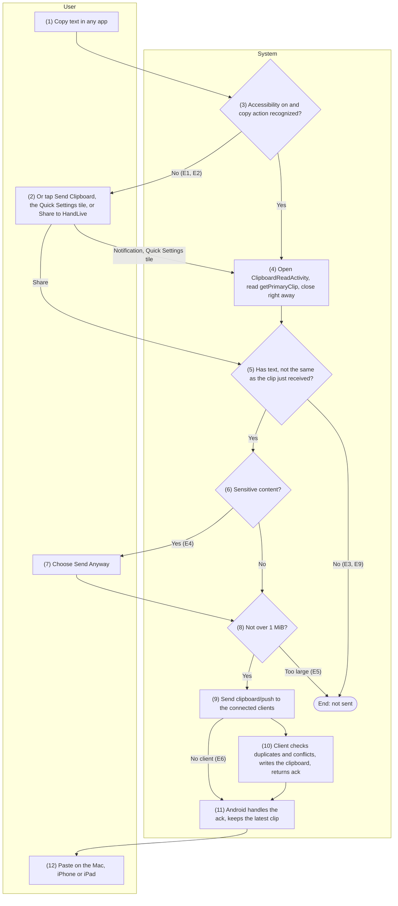
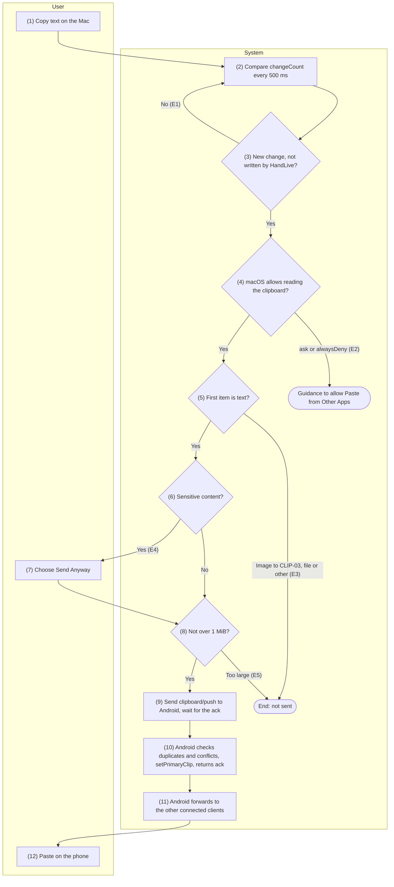
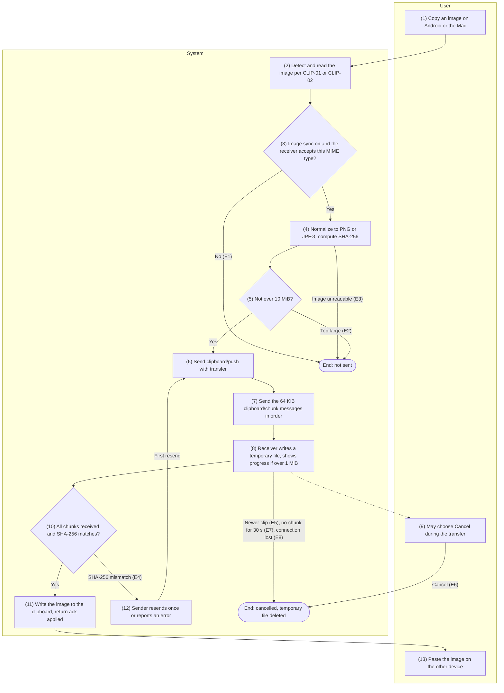
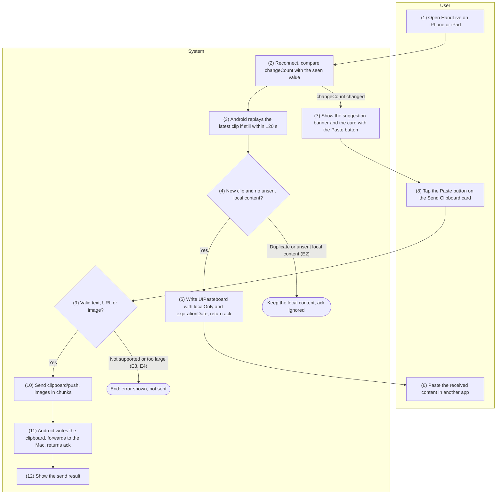
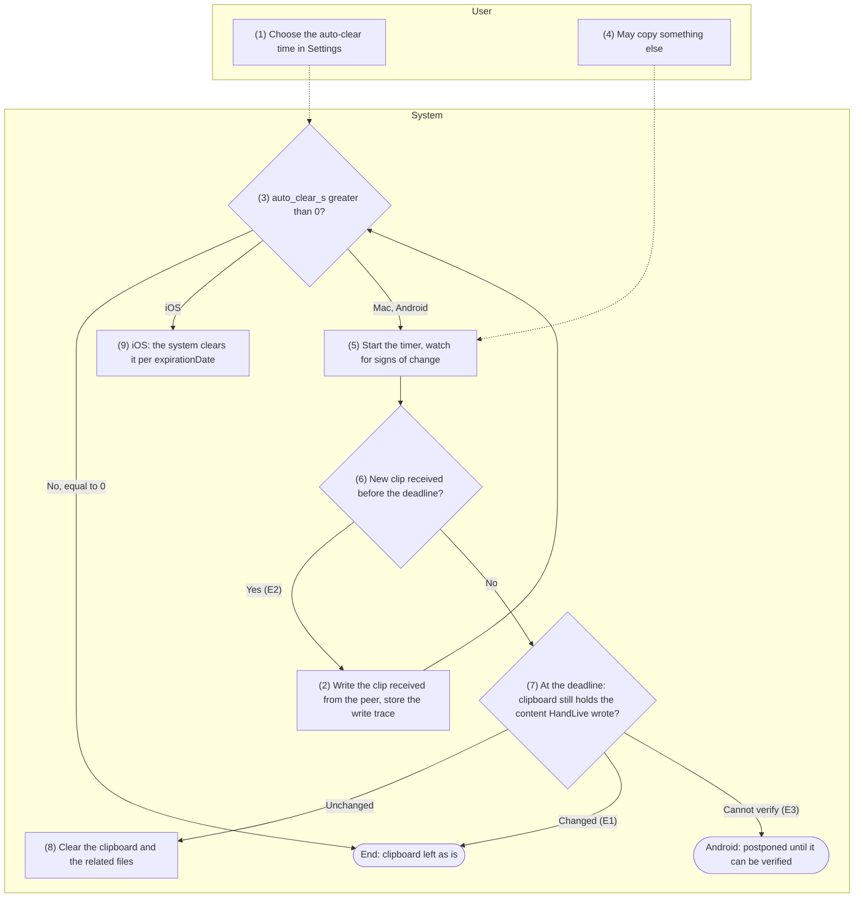

English | [Tiếng Việt](04-clipboard.vi.md)

# 4. Function group: Clipboard sync

> Common references: [`00-common-specs.md`](00-common-specs.md) — components A-CLIP, A-SVC, M-APP,
> I-APP (0.1), identifiers `clip_id`, `transfer_id` (0.2), envelope, `ack` and the binary plaintext of
> `clipboard/chunk` (0.5.1), security principles (0.6.5), message type `clipboard` (0.7.1), capability
> `features.clipboard` (0.7.2), error codes `CLIP_*` (0.8.1), settings keys `feature.clipboard`, `clip.*`
> (0.9.5), constants `CLIP_*`, `CHUNK_SIZE`, `RELAY_RATE_LIMIT` (0.10). Decisions applied: README §5
> C10 (paste permission on macOS), C15 (auto-send through Accessibility is the default).
>
> Group-wide rules — leaf functions refer to them by QC code:
> - **QC1 — Activation.** Clipboard is active for a pair when `feature.clipboard = true` on both
>   sides; no Android permission is needed (CONN-01 API 7). Images are sent only when the sender has
>   `clip.send_images = true` and the receiver's `features.clipboard.mimes` contains the image's MIME
>   type; a device with `clip.send_images = false` drops `image/png`, `image/jpeg` from its own `mimes`.
>   The sender uses the receiver's `max_text_bytes`, `max_image_bytes` as the limit when they are
>   smaller than its own.
> - **QC2 — Transfer only.** Clip content lives only in memory and in the temporary image files
>   (CLIP-03); it is never written to a database, no history is kept (README §4), and it is never
>   logged (0.6.5). Logs contain only `op`, `kind`, size, error code.
> - **QC3 — Sensitive content** (Android and Mac senders, when `clip.block_sensitive = true`).
>   Android: the `ClipDescription` has the extra `android.content.extra.IS_SENSITIVE` = `true` (standard
>   since Android 13, read on every version). Mac: the clipboard item has the type
>   `org.nspasteboard.ConcealedType`, `org.nspasteboard.TransientType` or
>   `org.nspasteboard.AutoGeneratedType`. Both: text of ≤ 256 characters containing a run of 13–19
>   digits (spaces or hyphens allowed between groups) that passes the Luhn check. When sensitive: do
>   not send, show the notification "Sensitive Content Blocked" with a "Send Anyway" button
>   (`CLIP_SENSITIVE_BLOCKED`; a new notification replaces the old one); the content stays in memory
>   for at most `CLIP_STALE_AFTER`; "Send Anyway" sends it with `sensitive = true`. Does not apply to
>   iPhone/iPad, which send only when the user taps Paste (CLIP-04).
> - **QC4 — Loop prevention.** The receiver remembers the SHA-256 (of the text's UTF-8 or of the
>   normalized image bytes) and the time of the clip it just wrote from the peer; a local change with
>   the same SHA-256 within `CLIP_LOOP_WINDOW` (5 s) is ignored. The Mac also remembers `changeCount`
>   right after writing and attaches its own type `app.handlive.clip-id`; iOS remembers `changeCount`
>   after writing; Android ignores Accessibility copy signals for 1 s after HandLive itself writes (the
>   Android 13+ clipboard overlay also appears for this write).
> - **QC5 — Size.** Text ≤ `CLIP_MAX_TEXT` (1 MiB UTF-8), images ≤ `CLIP_MAX_IMAGE` (10 MiB); over
>   the limit → `CLIP_TOO_LARGE`, not sent, reported in place (Android: toast; Mac: a status line in
>   the menu of the menu bar icon) — errors never go out as system notifications. Text goes inline
>   in `clipboard/push` when the envelope plaintext is ≤ `CLIP_INLINE_MAX` (180 KiB — so the envelope
>   stays < 256 KiB after base64, for the same reason as `SMS_PAGE_MAX_BYTES`); larger text goes in
>   chunks like images (CLIP-03).
> - **QC6 — Distribution.** The sender sends `clipboard/push` to every peer that has a session and
>   active clipboard (Android: every client; Mac/iOS: the phone). When Android receives a clip from a
>   client, it writes the clip to its own clipboard and then forwards it to the other connected
>   clients, keeping `clip_id`, `origin_device_id` unchanged and without reading the clipboard back; a
>   clip that Android rejects or drops because of a conflict is not forwarded. Every party
>   de-duplicates by `clip_id` (remembering the latest 256 `clip_id` values for 10 minutes).
> - **QC7 — Reconnection.** There is no queue. Android keeps the latest clip (whatever its source); the
>   Mac keeps the latest locally copied clip that Android has not acknowledged yet. When a new session
>   succeeds (CONN-01 step 10), that clip is sent if it was created within `CLIP_STALE_AFTER` (120 s,
>   by the sender's clock), the peer has not received that `clip_id` yet and is not the origin device.
>   Past that window it is dropped.
> - **QC8 — Conflicts.** When a `clipboard/push` arrives while the receiver has a local change that
>   this same peer has not acknowledged (not sent yet, or sent without an `ack` yet): (a) the change
>   happened within `CLIP_CONFLICT_WINDOW` (500 ms, by the receiver's clock) → keep the local content,
>   return `ack` `{status: "ignored", reason: "conflict"}` and send `clipboard/conflict`; the origin
>   device shows a non-blocking notification with a "Send Again" button — the sender does not show it
>   (Android does not forward `conflict`) if that clip was replayed under QC7; (b) the change is older
>   than the window (two clips crossing each other, common on reconnection) → keep the clip with the
>   larger `origin_ts`, and on a tie the clip with the larger `origin_device_id` in string order; both
>   sides use the same comparison, so they converge; the side that drops the incoming clip returns
>   `{status: "ignored", reason: "conflict"}` and does not send `clipboard/conflict`. A side that cannot
>   know about local changes (Android in the background with Accessibility off) treats it as having
>   none. iPhone/iPad: see also CLIP-04 E2.
> - **QC9 — Performance and channel.** Text < 50 ms on the LAN, measured from the moment the sender
>   has the content until the receiver finishes writing (copy detection time not included); a 5 MB
>   image < 2 s on the LAN. Every operation works the same on the LAN and through the relay; through
>   the relay the limit is 2 MiB/s per pair (`RELAY_RATE_LIMIT`) and the relay sees only
>   `type = clipboard` and the size.
>
> New constants used in this group (proposed for addition to 0.10): `CLIP_INLINE_MAX` = 180 KiB
> plaintext, `CLIP_LOOP_WINDOW` = 5 s, `CLIP_DETECT_DEBOUNCE` = 300 ms, `CLIP_TRANSFER_IDLE_TIMEOUT` = 30 s.

## 4.1 CLIP-01 — Send clipboard text from Android to Mac/iOS

### 4.1.1 General information

| Item | Content |
|-----|----------|
| Name | CLIP-01 — Send clipboard text from Android to Mac/iOS |
| Description | When the user copies text on the phone, HandLive reads the content and sends `clipboard/push` to every connected Mac/iPhone/iPad with active clipboard; the receiver writes it to the system clipboard so it can be pasted right away.<br>Since Android 10 a background app cannot read the clipboard (only the default keyboard or the app that has focus can) and Accessibility is not exempt, so there are two paths.<br>**Automatic** (default, decision D4/C15): `ClipboardAccessibilityService` recognizes the copy action, then opens the transparent `ClipboardReadActivity` to read it in an instant.<br>**Manual** (always available, the only path when Accessibility is off): the "Send Clipboard" button on the persistent notification, the "Send Clipboard" Quick Settings tile, or sharing text to HandLive.<br>Text whose plaintext is larger than `CLIP_INLINE_MAX` goes in chunks (CLIP-03); images belong to CLIP-03. iPhone/iPad receive only while I-APP is in the foreground (CLIP-04). |
| Actors | Primary: User. System: A-CLIP (`ClipboardAccessibilityService`, `ClipboardReadActivity`, `ClipboardModule`, `ClipboardTileService`, Share target), A-SVC, A-UI, OS (`ClipboardManager`, Accessibility service), M-APP, I-APP. |
| Preconditions | 1.<br>At least one client has a `/v1/ctl` session (CONN-01/CONN-03) and active clipboard (QC1); otherwise the clip is kept for replay (QC7).<br>2.<br>Automatic path: `clip.auto_send = true`, `clip.a11y_consent_at` has a value and the user has turned on `ClipboardAccessibilityService` in Settings › Accessibility.<br>3.<br>Manual path: A-SVC is running (notification button); the Quick Settings tile is added by the user. |
| Postconditions | **Success:** the text is on the clipboard of every connected client (Mac: with the `app.handlive.clip-id` type; iOS: `localOnly`, expiring per CLIP-05); the receiver has recorded its loop-prevention trace (QC4) and scheduled the auto-clear (CLIP-05); Android keeps the clip as the latest clip (QC7).<br>**Not sent:** no side changes its clipboard; the user sees the reason for E3 (manual path), E4–E7. |
| Exceptions | E1 — Accessibility is not on, the user did not agree to the disclosure, or `clip.auto_send = false`: no auto-send, `features.clipboard.auto_send = false`, only the manual path remains.<br>E2 — The copy action is not recognized (the app draws its own menu or emits no events; on Android 10–12, copying with an external keyboard shortcut): nothing is sent, the user uses the manual path.<br>E3 — `ClipboardReadActivity` gets no focus within 1 s, the clip is empty, or the clip is neither text nor image (`CLIP_UNSUPPORTED_MIME`, logged only): skipped; the manual path shows "The clipboard is empty or doesn't contain text".<br>E4 — Sensitive content (QC3): blocked, notification with "Send Anyway".<br>E5 — Text > 1 MiB: `CLIP_TOO_LARGE`, not sent; reported in place (field 10).<br>E6 — No client connected: kept as the latest clip (QC7); the manual path shows "Not connected — will send if reconnected within 2 minutes".<br>E7 — Conflict on the receiver (QC8): `ack` `ignored`/`conflict` with `clipboard/conflict` → notification with "Send Again".<br>E8 — No `ack` within 10 s, or the receiver failed to write (`INTERNAL`): no immediate resend; replayed when a new session starts if still within 120 s (QC7).<br>E9 — Same as the clip just received from the peer (QC4) or, on the automatic path, the same as the clip sent within the last 5 s: skipped.<br>E10 — The receiver returns `FEATURE_DISABLED` (its capability was not updated in time): skipped; clipboard is treated as inactive for that pair until the next `capability/update`. |
| Special requirements | **Performance:** per QC9; the automatic path adds 300 ms of signal debouncing (`CLIP_DETECT_DEBOUNCE`) and about 100–300 ms to open `ClipboardReadActivity`.<br>**Privacy and policy:** prominent disclosure and consent before taking the user to the Accessibility settings (fields 2, 3); the service configuration declares `isAccessibilityTool = false`, receives only the event types it needs and never reads window content; Accessibility use is declared in the Play Console; the risk of a Google Play rejection has been accepted by the project owner (C15); no Notification Listener.<br>The toast "HandLive pasted from your clipboard" (Android 12+) is system behavior and is mentioned up front in the disclosure.<br>**Reliability:** recognizing the copy action depends on the app and the OEM, so the manual path is always visible; clipboard errors do not affect other features. |

### 4.1.2 Screens

N/A — no approved wireframe yet.

### 4.1.3 Component details

| # | Field | Data type | Input/Output | Initial value | Description |
|---|--------|--------------|--------------|------------------|-------|
| 1 | Option "Auto-Send on Copy" | bool | Input/Output | `clip.auto_send` = `true` | Android, Settings → Clipboard (SET-02). Turning it on the first time goes through the disclosure (fields 2, 3), then the service is turned on in Settings › Accessibility |
| 2 | Accessibility disclosure text | string | Output | Fixed text per version | "HandLive uses an Accessibility service only to notice when you tap Copy, then reads what you just copied and sends it (end-to-end encrypted) to your paired Mac, iPhone, and iPad.<br>The service receives tap events and short on-screen messages to find the Copy action; unrelated events are dropped immediately and never stored or sent.<br>Each time HandLive reads the clipboard, Android may show “HandLive pasted from your clipboard”.<br>You can turn this off at any time and send manually with the Send Clipboard button." |
| 3 | Disclosure choice | enum{Agree\| Send Manually} | Input | — | "Agree" → save `clip.a11y_consent_at`, open the Accessibility settings; "Send Manually" → `clip.auto_send = false` |
| 4 | "Send Clipboard" button on the persistent notification | action | Input | Shown when ≥ 1 client has active clipboard | Opens `ClipboardReadActivity` with `source = manual` |
| 5 | "Send Clipboard" Quick Settings tile | action | Input | Added by the user to the Quick Settings panel | Subtitle: "To \<client name>", "To 2 devices" or "Not connected" |
| 6 | Share target "Send to Devices (HandLive)" | action | Input | — | In other apps' share sheet, only for `text/plain` |
| 7 | System toast when reading the clipboard | string | Output | — | Android 12+: "HandLive pasted from your clipboard" (exact wording follows the system language); shown by the system, the app cannot turn it off |
| 8 | Sensitive content blocked notification | string | Output | — | "Sensitive Content Blocked — HandLive doesn't send content that looks like a password or card number." (QC3). Android: notification on the `clipboard` channel ("Clipboard", `IMPORTANCE_DEFAULT`); Mac: system notification with a button |
| 9 | "Send Anyway" button | action | Input | — | On the field 8 notification; sends with `sensitive = true`; expires after 120 s |
| 10 | Content too large message | string | Output | — | "Content is too large to send (up to 1 MB of text)" — toast (manual path), no system notification |
| 11 | Manual send result | string | Output | — | Toast "Sent to \<name>", "Not connected — will send if reconnected within 2 minutes" or "The clipboard is empty or doesn't contain text" |
| 12 | Conflict notification | string | Output | — | "Clipboard Not Updated on \<device name>: That device just copied something new." Android: same `clipboard` channel |
| 13 | "Send Again" button | action | Input | — | On the field 12 notification; resends the same content as a new clip; expires after 120 s |
| 14 | Auto-send status shown on Mac/iOS | string | Output | From the phone's `features.clipboard.auto_send` | `false` → "Auto-send is off on the phone — use the Send Clipboard button on the phone" |
| 15 | Clipboard content on Mac/iOS | string | Output | The content just received | Can be pasted right away; auto-cleared per CLIP-05 |
| 16 | Option "Block Sensitive Content" | bool | Input/Output | `clip.block_sensitive` = `true` | Settings → Clipboard (SET-02) |

### 4.1.4 Business flow



| Step | Actor | Component | Description | Exceptions / Notes |
|------|----------|-----------|-------|--------------------|
| 1 | User | OS (any app) | Copy text: the "Copy" item of the text selection menu, the app's own copy button, or a keyboard shortcut. |  |
| 2 | User | A-CLIP | Manual path, always available: tap "Send Clipboard" on the A-SVC persistent notification or the Quick Settings tile (API 3) → step 4; or choose HandLive in the share sheet (API 4) → step 5 with the text taken from the intent, without reading the clipboard. | The only path for E1, E2. |
| 3 | System | A-CLIP (`ClipboardAccessibilityService`) | When `feature.clipboard` and `clip.auto_send` are on, `clip.a11y_consent_at` is set and the service is running: receive events, recognize a copy signal (API 1), debounce for 300 ms, then open `ClipboardReadActivity`.<br>When A-UI has focus: use `OnPrimaryClipChangedListener` and read directly (API 2), bypassing Accessibility. | E1, E2. Signals are ignored for 1 s after HandLive writes the clipboard (QC4). |
| 4 | System | A-CLIP (`ClipboardReadActivity`), OS | Transparent activity without animation; in `onWindowFocusChanged(true)` it calls `ClipboardManager.getPrimaryClip()`, takes the first item, then calls `finish()` right away (API 2). On Android 12+ the system shows the field 7 toast. | No focus within 1 s or empty clip → E3. Item is an image → CLIP-03. |
| 5 | System | A-CLIP (`ClipboardModule`) | Convert to plain text (`coerceToText`), compute the SHA-256; drop it if it matches the clip just received from the peer within 5 s (QC4) or, on the automatic path, the clip sent within the last 5 s. | E3, E9. |
| 6 | System | A-CLIP | Sensitive content check per QC3 (`EXTRA_IS_SENSITIVE`, card number via Luhn; the Share path checks only card numbers). | Sensitive → E4: show fields 8, 9; keep the content in memory for at most 120 s. |
| 7 | User | A-UI (notification) | Choose "Send Anyway" → continue with `sensitive = true`. | No choice within 120 s → the content is discarded. |
| 8 | System | A-CLIP | Size check per QC5: > 1 MiB → E5; plaintext > `CLIP_INLINE_MAX` → send in chunks (CLIP-03 API 3–5); otherwise send inline. | E5. |
| 9 | System | A-SVC | Generate `clip_id` (UUIDv7); store it as the latest clip (QC7); send `clipboard/push` (API 5) to each connected client with active clipboard, one envelope per session. | No client → E6, go to step 11. |
| 10 | System | M-APP / I-APP | De-duplicate by `clip_id`; check for conflicts (QC8); the Mac writes `NSPasteboard` (API 7), iOS writes `UIPasteboard` (CLIP-04 API 1); record the QC4 trace; schedule CLIP-05; return the `ack`. | Conflict → E7 (API 6). Write error → `INTERNAL` (E8). |
| 11 | System | A-SVC, A-UI | Handle the `ack`: `applied` → done (the manual path shows "Sent to \<name>"); `clipboard/conflict` received → show fields 12, 13; 10 s elapsed → E8; `FEATURE_DISABLED` → E10. |  |
| 12 | User | M-APP / I-APP (any app) | Paste the content (⌘V on the Mac, the Paste menu on iPhone/iPad). | Auto-cleared after `clip.auto_clear_s` (CLIP-05). |
| A1 | User | A-UI | Turn on "Auto-Send on Copy" for the first time (SET-01 or SET-02). |  |
| A2 | System | A-UI | Show the disclosure (field 2) full screen and continue only when the user chooses "Agree" (field 3): save `clip.a11y_consent_at`, open `Settings.ACTION_ACCESSIBILITY_SETTINGS` with instructions to select HandLive. | Choosing "Send Manually" → `clip.auto_send = false` (E1). |
| A3 | System | A-CLIP, A-SVC | The system binds the service (`onServiceConnected`) → `features.clipboard.auto_send = true`, send `capability/update`; the service is turned off (`onUnbind`) → `false`, send `capability/update`. Clients update field 14. |  |

### 4.1.5 API/service specification

**Call list**

| # | API/service | Channel | Direction | Used in steps |
|---|-------------|------|-------|-------------|
| 1 | `AccessibilityService.onAccessibilityEvent` (`ClipboardAccessibilityService`) | Local (Android) | OS → A-CLIP | 3, A3 |
| 2 | `ClipboardManager.getPrimaryClip` in `ClipboardReadActivity`; `OnPrimaryClipChangedListener` when A-UI has focus | Local (Android) | A-CLIP ↔ OS | 3, 4, 5 |
| 3 | `TileService` (`ClipboardTileService`) and the "Send Clipboard" button on the persistent notification | Local (Android) | User → A-CLIP | 2 |
| 4 | Share target `ACTION_SEND` `text/plain` | Local (Android) | Other app → A-CLIP | 2 |
| 5 | `WS clipboard/push` | `/v1/ctl` (LAN or relay) | Both ways (here S→C) | 9, 10, 11 |
| 6 | `WS clipboard/conflict` | `/v1/ctl` (LAN or relay) | Both ways (here C→S) | 10, 11 |
| 7 | `NSPasteboard` — write the received clip (Mac) | Local (Mac) | M-APP → OS | 10 |

Writing the clip on iPhone/iPad: CLIP-04 API 1. `capability/update` when the auto-send state changes (A3)
follows the 0.7.2 structure, as in SET-02.

#### API 1 — `ClipboardAccessibilityService` (Accessibility events)

- **URL:** N/A
- **Method:** `AccessibilityService.onAccessibilityEvent(event: AccessibilityEvent)`; lifecycle
  `onServiceConnected()`, `onUnbind(intent)`, `disableSelf()`. Declared as
  `<service android:permission="android.permission.BIND_ACCESSIBILITY_SERVICE">` with the intent-filter
  `android.accessibilityservice.AccessibilityService` and the meta-data `android.accessibilityservice`
  pointing to the configuration file.
- **Request (configuration `res/xml/clipboard_accessibility.xml`):**

| Attribute | Value | Notes |
|------------|---------|---------|
| `accessibilityEventTypes` | `typeViewClicked\| typeWindowStateChanged\| typeNotificationStateChanged\| typeAnnouncement` | Only the types needed to recognize the copy action |
| `accessibilityFeedbackType` | `feedbackGeneric` |  |
| `notificationTimeout` | `100` | ms |
| `canRetrieveWindowContent` | `false` | Does not read the window content tree; uses only the package name, the class name and the text attached to the event |
| `isAccessibilityTool` | `false` | HandLive is not an accessibility tool (Google Play policy) |
| `description` | Summary of the disclosure (field 2) | Shown in Settings › Accessibility |

- **Response (recognized copy signals):**

| Signal | Recognition condition |
|----------|---------------------|
| Tap on a copy item | `TYPE_VIEW_CLICKED` whose text or description matches `android.R.string.copy`, `android.R.string.cut` in the system language, or contains "copy", "sao chép" (case-insensitive) |
| "Copied" toast or announcement | `TYPE_NOTIFICATION_STATE_CHANGED` from a toast (`parcelableData` is not a `Notification`) or `TYPE_ANNOUNCEMENT`, with text containing "copied", "đã sao chép", "clipboard", "bảng nhớ tạm", "bộ nhớ đệm" |
| System clipboard overlay (Android 13+) | `TYPE_WINDOW_STATE_CHANGED` from the `com.android.systemui` package with the class name or the text of the clipboard overlay (the exact rule is settled by testing on each device line) |

- **Example:** on a phone set to Vietnamese, the user selects text in Chrome and taps "Sao chép" (Copy)
  → event `TYPE_VIEW_CLICKED`, package `com.android.chrome`, text `["Sao chép"]` → read scheduled in
  300 ms → no new signal → open `ClipboardReadActivity` with `source = auto`.
- **Business logic:**
  1. Process events only when `feature.clipboard = true`, `clip.auto_send = true` and
     `clip.a11y_consent_at` is set. When the user turns off "Auto-Send on Copy" in HandLive → call
     `disableSelf()` so the service is turned off in the system settings as well.
  2. Drop events whose `packageName` is HandLive (when A-UI has focus the listener is used, API 2) and
     every signal within 1 s after HandLive writes the clipboard (QC4).
  3. Debounce signals for `CLIP_DETECT_DEBOUNCE` (300 ms) from the last signal: one copy usually
     produces 2–3 signals (tap, toast, overlay) but opens `ClipboardReadActivity` only once
     (`FLAG_ACTIVITY_NEW_TASK`, `FLAG_ACTIVITY_NO_ANIMATION`). An app whose Accessibility service is
     currently bound by the system is allowed to start activities from the background.
  4. Events are only matched in memory, then discarded; event text is never stored, never logged and
     never sent anywhere (exactly as disclosed).
  5. Accuracy depends on the app and the OEM (E2): apps that draw their own menus or emit no events may
     be missed; Android 13+ shows an overlay for every clipboard write, so the recognition rate is higher.
  6. `onServiceConnected` / `onUnbind` update `features.clipboard.auto_send` and send
     `capability/update` (A3). A-UI checks the state with
     `AccessibilityManager.getEnabledAccessibilityServiceList(FEEDBACK_ALL_MASK)`.

#### API 2 — `ClipboardReadActivity` and `ClipboardManager` (reading the clipboard)

- **URL:** N/A
- **Method:** `Activity.onWindowFocusChanged(hasFocus)` → `ClipboardManager.getPrimaryClip()`,
  `ClipData.getItemAt(0)`, `ClipData.Item.coerceToText(context)`,
  `ClipData.getDescription().getExtras()`; when A-UI has focus:
  `ClipboardManager.addPrimaryClipChangedListener` / `removePrimaryClipChangedListener`.
- **Request:**

| Item | Value |
|-----|---------|
| Intent extra `source` | enum{auto\| manual} — `auto` from API 1, `manual` from API 3 |
| `android:theme` | Transparent theme: `windowIsTranslucent = true`, transparent background, no title, no animation |
| `android:excludeFromRecents`, `android:noHistory` | `true`, `true` |
| `android:taskAffinity` | `""` — a task of its own, does not bring A-UI forward |
| `android:exported` | `false` (the Share target is exported through an `activity-alias`, API 4) |

- **Response:** `ClipData`, or `null` when it cannot be read (no focus yet, device locked). Data used:
  `description.getMimeType(i)`, `description.extras` (`EXTRA_IS_SENSITIVE`), the item's `text` or
  `uri`.
- **Example:**

```kotlin
// [Design] Read once the window has focus, then close right away
override fun onWindowFocusChanged(hasFocus: Boolean) {
    super.onWindowFocusChanged(hasFocus)
    if (!hasFocus || handled) return
    handled = true
    val clip = getSystemService(ClipboardManager::class.java).primaryClip   // null → E3
    clipboardModule.onLocalClip(clip, source = intent.getStringExtra("source") ?: "auto")
    finish()   // no animation: overrideActivityTransition (API 34+) or overridePendingTransition(0, 0)
}
```

- **Business logic:**
  1. Read only in `onWindowFocusChanged(true)`: reading in `onCreate` /`onResume` may return `null`
     because the window has no focus yet. Wait at most 1 s for focus, then close (E3).
  2. Take item 0: has `text` → `coerceToText` (HTML yields only the plain text; for a text URI item
     the system reads the stream); has a `uri` with MIME `image/*` → CLIP-03, copy the stream into the
     cache right away (the URI read permission is revoked when the clip changes); anything else → E3.
  3. `finish()` as soon as the data has been taken (image: once the copy on the IO thread is done); the
     QC3–QC5 checks and the send run in A-SVC's `ClipboardModule` (same process).
  4. Android 12+ shows the toast (field 7) once for each new clip set by another app; it is not shown
     for a clip written by HandLive itself. Users can turn it off with the "Show clipboard access"
     option in Settings › Privacy (the name varies by OEM).
  5. The transparent activity takes focus for a moment: the on-screen keyboard of the app in use may
     hide and reappear (depends on the app).
  6. The system calls `OnPrimaryClipChangedListener` only when HandLive has focus (the AOSP source
     checks the same condition as for reading, since Android 10). A-UI registers it in `onResume` and
     removes it in `onPause`; when called, it reads directly as in logic 2, without opening the
     transparent activity.

#### API 3 — Quick Settings tile and "Send Clipboard" button on the notification

- **URL:** N/A
- **Method:** `TileService.onStartListening()`, `TileService.onClick()` →
  `startActivityAndCollapse(PendingIntent)` (API 34+) or `startActivityAndCollapse(Intent)` (API
  29–33); notification button: `NotificationCompat.Action` with
  `PendingIntent.getActivity(..., FLAG_IMMUTABLE)`.
- **Request:**

| Item | Value |
|-----|---------|
| Quick Settings tile | `ClipboardTileService`, label "Send Clipboard"; `Tile.STATE_ACTIVE` when a client has active clipboard, `STATE_INACTIVE` otherwise; subtitle (`Tile.setSubtitle`) per field 5 |
| Notification button | "Send Clipboard" action on the A-SVC foreground service notification (CONN-01 field 6) |
| Target intent | `ClipboardReadActivity`, extra `source = manual`, `FLAG_ACTIVITY_NEW_TASK` |

- **Response:** `ClipboardReadActivity` runs as in API 2; the result is shown with the field 11 toast.
- **Example:**

```kotlin
// [Design] ClipboardTileService
override fun onClick() {
    val intent = Intent(this, ClipboardReadActivity::class.java)
        .putExtra("source", "manual").addFlags(Intent.FLAG_ACTIVITY_NEW_TASK)
    if (Build.VERSION.SDK_INT >= 34) {
        startActivityAndCollapse(PendingIntent.getActivity(this, 0, intent, PendingIntent.FLAG_IMMUTABLE))
    } else {
        @Suppress("DEPRECATION") startActivityAndCollapse(intent)
    }
}
```

- **Business logic:**
  1. These two entry points are always available and do not depend on Accessibility; they are the
     fallback path in place of a Notification Listener (C15).
  2. The notification button must be a `PendingIntent` that opens the activity directly: Android 12+
     blocks "trampolines" (starting an activity from a BroadcastReceiver or Service launched by the
     notification). A user tap on the Quick Settings tile or on the notification is allowed to start an
     activity.
  3. `targetSdk 35`: on API 34+ the `PendingIntent` variant of `startActivityAndCollapse` is required
     (the `Intent` variant throws `UnsupportedOperationException`).
  4. No client: still read the clipboard and keep it as the latest clip (E6); the toast says it will be
     sent if the connection comes back within 2 minutes.
  5. The manual path does not apply the "same as the clip sent within 5 s" rule (the user is
     deliberately sending again).

#### API 4 — Share target `ACTION_SEND` `text/plain`

- **URL:** N/A
- **Method:** `activity-alias` `ClipboardShareTarget` pointing to `ClipboardReadActivity`, intent-filter
  `android.intent.action.SEND` with `mimeType = text/plain`.
- **Request:** `Intent.EXTRA_TEXT` (CharSequence, converted to a plain string); `EXTRA_SUBJECT` is
  ignored.
- **Response:** field 11 toast; the activity closes right away.
- **Example:**

```xml
<!-- [Design] AndroidManifest.xml -->
<activity-alias android:name=".clip.ClipboardShareTarget"
    android:targetActivity=".clip.ClipboardReadActivity"
    android:label="@string/share_to_devices" android:exported="true">
  <intent-filter>
    <action android:name="android.intent.action.SEND" />
    <category android:name="android.intent.category.DEFAULT" />
    <data android:mimeType="text/plain" />
  </intent-filter>
</activity-alias>
```

- **Business logic:**
  1. On `ACTION_SEND`: take the text from the intent; the clipboard is not read, so there is no system
     toast; `source = share`.
  2. QC3 checks only card numbers (there is no `ClipDescription`); QC5 as on the other paths (> 1 MiB →
     E5).
  3. The text is not written to the phone's clipboard; it is only sent.
  4. v1 accepts only `text/plain`; images are sent by copying them and then using API 3 (CLIP-03).

#### API 5 — `WS clipboard/push`

- **URL:** `wss://{android_host}:{port}/v1/ctl` (LAN) or through the relay `wss://{RELAY_HOST}/v1/relay`
  with the `to` /`from` wrapper
- **Method:** `WS clipboard/push` (both ways), encrypted envelope, acknowledged. The structure is shared
  by CLIP-01…04.
- **Request (`data`):**

| Field | Type | Required | Description |
|--------|------|----------|-------|
| `clip_id` | uuid | Yes | UUIDv7 generated by the origin device; unchanged when Android forwards it and when it is resent after `CLIP_CHECKSUM_MISMATCH` |
| `kind` | enum{text\| image} | Yes |  |
| `mime` | enum{text/plain\| image/png\| image/jpeg} | Yes | `text/plain` is always UTF-8 |
| `text` | string | When `kind = text` and sent inline | The whole text; envelope plaintext ≤ `CLIP_INLINE_MAX` |
| `transfer` | object | When `kind = image` or the text goes in chunks | `{transfer_id, size, sha256, chunk_size, chunk_count}` — specified in CLIP-03 API 3 |
| `width`, `height` | int32 | Images only | Size in pixels |
| `sensitive` | bool | Yes | `true` only when the user chose "Send Anyway" (QC3) |
| `origin_ts` | timestamp | Yes | When the content was read on the origin device (origin device clock); used only for QC8 (b) |
| `source` | enum{auto\| manual\| share\| mac\| ios} | Yes | How the clip was created: Android `auto`/`manual`/`share`; Mac `mac`; iOS `ios` |
| `origin_device_id` | uuid | Yes | `device_id` of the origin device; Android uses it to forward the clip and to route `clipboard/conflict` |

Exactly one of the two fields `text`, `transfer` is present.

- **Response (`ack`):**

| `ok` | `data` or `error` | When |
|------|---------------------|---------|
| `true` | `{clip_id, status: "applied"}` | Written to the clipboard, or the content equals the current clipboard |
| `true` | `{clip_id, status: "ignored", reason: "conflict"}` | QC8 |
| `true` | `{clip_id, status: "ignored", reason: "duplicate"}` | `clip_id` already processed (QC6) |
| `true` | `{clip_id, status: "ignored", reason: "cancelled"}` | The chunked transfer was cancelled (CLIP-03 API 5) |
| `false` | `error.code` ∈ {`CLIP_TOO_LARGE`, `CLIP_UNSUPPORTED_MIME`, `CLIP_CHECKSUM_MISMATCH`, `FEATURE_DISABLED`, `BAD_REQUEST`, `INTERNAL`}; `error.details` = `{clip_id, status: "rejected"}` | The receiver rejects it |

- **Example (payload plaintext):**

```json
{"op":"push","data":{"clip_id":"0192f3e0-5a21-7b3c-9d4e-1f2a3b4c5d6e","kind":"text","mime":"text/plain","text":"Order number: HL-240917-0042","sensitive":false,"origin_ts":1727150100123,"source":"auto","origin_device_id":"8c7d6e5f-4a3b-8c2d-9e1f-0a1b2c3d4e5f"}}
{"re":"0192f3e0-5a22-7c10-8a11-223344556677","ok":true,"data":{"clip_id":"0192f3e0-5a21-7b3c-9d4e-1f2a3b4c5d6e","status":"applied"}}
{"re":"0192f3e0-5a22-7c10-8a11-223344556677","ok":true,"data":{"clip_id":"0192f3e0-5a21-7b3c-9d4e-1f2a3b4c5d6e","status":"ignored","reason":"conflict"}}
{"re":"0192f3e0-5a22-7c10-8a11-223344556677","ok":false,"error":{"code":"CLIP_TOO_LARGE","message":"Text exceeds the size limit","details":{"clip_id":"0192f3e0-5a21-7b3c-9d4e-1f2a3b4c5d6e","status":"rejected"}}}
```

- **Business logic — sender:**
  1. Send only to peers with active clipboard, within the peer's limits and `mimes` (QC1); one
     envelope per session, same `clip_id`.
  2. Wait 10 s for the `ack` (`REQUEST_TIMEOUT`); for a chunked clip, counted from when the last chunk
     is sent. No `ack` → treat it as not received by the peer, no immediate resend; replay when a new
     session starts if still within 120 s (QC7).
  3. A newer clip does not cancel a text `push` already sent; a chunked transfer in progress is
     cancelled with `clipboard/cancel` `reason = superseded` (CLIP-03 API 5).
  4. Error `ack` `CLIP_CHECKSUM_MISMATCH` → resend once (CLIP-03); other errors → tell the user if the
     clip came from a manual action, otherwise only log the error code.
- **Business logic — receiver:**
  5. Validate: `kind` matches `mime`, exactly one of `text` /`transfer`, `text` is valid UTF-8;
     otherwise → `BAD_REQUEST`. Clipboard not active → `FEATURE_DISABLED`. Over its own limit →
     `CLIP_TOO_LARGE`; MIME type not accepted → `CLIP_UNSUPPORTED_MIME`.
  6. A `clip_id` that already has an `applied` /`ignored` result → `ignored` /`duplicate`, not written
     again; a clip that was rejected before may be accepted again (resend after
     `CLIP_CHECKSUM_MISMATCH`).
  7. QC8 conflict check → `ignored`/`conflict` (case (a) also sends API 6).
  8. Write the clipboard (Mac: API 7; Android: CLIP-02 API 3; iOS: CLIP-04 API 1). `sensitive = true`:
     Android adds the `EXTRA_IS_SENSITIVE` extra, the Mac adds the `org.nspasteboard.ConcealedType`
     type so that clipboard managers do not store it. Record the QC4 trace, schedule CLIP-05, then
     return `applied`.
  9. Android receiving from a client: after logic 8, forward to the other clients per QC6 (CLIP-02 API 4).
  10. Never log `text`; logs contain only `kind`, size, `ack` status.

#### API 6 — `WS clipboard/conflict`

- **URL:** same as API 5
- **Method:** `WS clipboard/conflict` (both ways), encrypted envelope, no ack.
- **Request (`data`):**

| Field | Type | Required | Description |
|--------|------|----------|-------|
| `clip_id` | uuid | Yes | The clip that was not written |
| `origin_device_id` | uuid | Yes | Origin device of the clip (taken from the `push`) |
| `device_id` | uuid | Yes | The device that kept its local content |
| `device_name` | string(64) | Yes | Display name of that device, used for field 12 |

- **Response:** N/A.
- **Example:**
  `{"op":"conflict","data":{"clip_id":"0192f3e0-5a21-7b3c-9d4e-1f2a3b4c5d6e","origin_device_id":"8c7d6e5f-4a3b-8c2d-9e1f-0a1b2c3d4e5f","device_id":"5b1f8c2e-9a4d-8e6f-a1b2-c3d4e5f60718","device_name":"MacBook của Lan"}}`
- **Business logic:**
  1. The receiver sends it right after the QC8 (a) `ack` `ignored` /`conflict`, to the side that sent it
     the `push`. QC8 (b) produces no `conflict`.
  2. When Android receives a `conflict` for a clip whose origin device is another client → forward it
     to that client if it is connected, otherwise drop it; it is not forwarded when the clip is one that
     Android replayed under QC7.
  3. The origin device shows fields 12, 13 (a single notification; a new one replaces the old one); not
     shown if the device itself sent that clip as a replayed clip. "Send Again" is valid for 120 s while
     the content is still in memory: it resends the same content with a new `clip_id`; by then the
     local change on the other side is older than 500 ms, so the clip gets written.

#### API 7 — `NSPasteboard` writes the received clip (Mac)

- **URL:** N/A
- **Method:** `NSPasteboard.general.prepareForNewContents(with: .currentHostOnly)`,
  `setString(_:forType:)`, `setData(_:forType:)`, `changeCount`.
- **Request (data types written):**

| Type | Value | When |
|------|---------|---------|
| `public.utf8-plain-text` (`.string`) | Text | Text clip |
| `app.handlive.clip-id` | `clip_id` as UTF-8 | Always — marks HandLive's own writes (QC4, CLIP-05) |
| `org.nspasteboard.ConcealedType` | Empty data | When `sensitive = true` |

- **Response:** `prepareForNewContents` returns the new `changeCount`; `setString` /`setData` return
  `Bool` (false → `ack` `INTERNAL`).
- **Example:**

```swift
// [Design] M-APP writes a text clip received from the phone
let pb = NSPasteboard.general
pb.prepareForNewContents(with: .currentHostOnly)   // clears old content like clearContents(), stays off Universal Clipboard
let ok = pb.setString(text, forType: .string)
    && pb.setString(clipID, forType: NSPasteboard.PasteboardType("app.handlive.clip-id"))
if sensitive { pb.setData(Data(), forType: NSPasteboard.PasteboardType("org.nspasteboard.ConcealedType")) }
ownWrite = OwnWrite(changeCount: pb.changeCount, sha256: digest, at: .now)   // QC4, CLIP-05
```

- **Business logic:**
  1. `prepareForNewContents(with: .currentHostOnly)` (macOS 10.12+) clears the old content like
     `clearContents()` and keeps the clip on this machine: Universal Clipboard does not copy it to an
     iPhone/iPad on the same Apple ID (iPhone/iPad receive it through HandLive — CLIP-04), for the same
     reason as `.localOnly` on iOS.
  2. Write all types in one pass before reading `changeCount`; this value is "HandLive's write", used
     for QC4 and CLIP-05.
  3. Writing needs no paste permission (C10 applies only to reading).
  4. After writing, schedule CLIP-05 per `clip.auto_clear_s`; no notification (large images show
     progress in CLIP-03).

#### Query

No database query: clip content is only transferred, never stored (QC2). Settings keys read/written:

```text
# [Design] Android DataStore (keys 0.9.5)
prefs[booleanPreferencesKey("feature.clipboard")] ?: true        # steps 3, 9
prefs[booleanPreferencesKey("clip.auto_send")] ?: true           # steps 3, A1
prefs[longPreferencesKey("clip.a11y_consent_at")]                # step 3: null → not agreed yet (E1)
prefs[booleanPreferencesKey("clip.block_sensitive")] ?: true     # step 6
dataStore.edit { it[longPreferencesKey("clip.a11y_consent_at")] = now }   # A2: Agree chosen
dataStore.edit { it[booleanPreferencesKey("clip.auto_send")] = false }    # A2: Send Manually chosen; field 1 turned off

# [Design] M-APP UserDefaults (0.9.5 defaults registered with register(defaults:) at launch)
UserDefaults.standard.bool(forKey: "feature.clipboard")           # step 10
UserDefaults.standard.integer(forKey: "clip.auto_clear_s")        # step 10: schedule CLIP-05
```

---

## 4.2 CLIP-02 — Send clipboard text from Mac to Android

### 4.2.1 General information

| Item | Content |
|-----|----------|
| Name | CLIP-02 — Send clipboard text from Mac to Android |
| Description | M-APP checks `NSPasteboard.general.changeCount` every 500 ms (`CLIP_POLL_MAC`); when the user copies text on the Mac, M-APP reads `public.utf8-plain-text`, applies QC3–QC5, then sends `clipboard/push` to the phone.<br>Android writes it to the clipboard with `ClipboardManager.setPrimaryClip` (writing works in the background), records the loop-prevention trace, schedules CLIP-05 and forwards the clip to the other connected clients, for example an iPad (QC6).<br>On macOS 15.4+ M-APP checks the system paste permission before reading (C10).<br>Images go through CLIP-03; files (file URLs) are not supported in v1. |
| Actors | Primary: User. System: M-APP, OS (`NSPasteboard`, `ClipboardManager`), A-SVC, A-CLIP (`ClipboardModule`), I-APP (receives the forwarded copy). |
| Preconditions | 1.<br>M-APP is running, has a valid pair and `feature.clipboard = true` on the Mac.<br>2.<br>A `/v1/ctl` session with the phone is open and clipboard is active (QC1); otherwise the clip is kept for replay (QC7).<br>3. macOS 15.4+: HandLive's "Paste from Other Apps" permission is at the default or "Always Allow". |
| Postconditions | **Success:** the Android clipboard holds the text (with `EXTRA_IS_SENSITIVE` if `sensitive`); Android has recorded the QC4 trace, scheduled CLIP-05 and forwarded it to the other connected clients; the Mac receives `ack` `applied` and marks the clip as acknowledged.<br>**Not sent:** the Android clipboard stays unchanged; the user sees the reason for E2, E4, E5, E7, E8. |
| Exceptions | E1 — `changeCount` changed because of HandLive's own write (equal to the remembered value, or the first item has the `app.handlive.clip-id` type), or the SHA-256 matches the clip received within the last 5 s (QC4): skipped.<br>E2 — macOS 15.4+ with `accessBehavior` `.ask` or `.alwaysDeny`: no automatic reading; show guidance to open System Settings › Privacy & Security › Paste from Other Apps and choose "Always Allow" (Apple has no API to request this permission); with `.ask` the menu item "Send Clipboard to Phone" still works (the system asks the user).<br>E3 — The content is not text: image → CLIP-03; file URL (`public.file-url`, for example a file copied in Finder) or another type → skipped, only `CLIP_UNSUPPORTED_MIME` is logged.<br>E4 — Sensitive content (QC3): blocked, notification with "Send Anyway".<br>E5 — Text > 1 MiB: `CLIP_TOO_LARGE`, reported in place (field 7).<br>E6 — Phone not connected: kept as the latest local clip, replayed if the connection comes back within 120 s (QC7); the menu item shows "Not connected — will send if reconnected within 2 minutes".<br>E7 — Conflict on Android (QC8): `ack` `ignored`/`conflict` with `clipboard/conflict` → the Mac shows a notification with "Send Again".<br>E8 — Android fails to write (`setPrimaryClip` throws): `ack` `INTERNAL` → status line in the menu of the menu bar icon "Couldn't update the clipboard on the phone".<br>E9 — No `ack` within 10 s: treated as not received, replayed when a new session starts if still within 120 s (QC7). |
| Special requirements | **Performance:** detection ≤ 500 ms because of polling, the rest per QC9; reading `changeCount` is very cheap, and the content is not read while `changeCount` is unchanged.<br>Polling runs while there is a pair and `feature.clipboard = true` (also while disconnected, to keep the latest clip per QC7); it stops while the Mac sleeps and checks once on wake.<br>**Privacy:** the content is read only when `changeCount` changes and clipboard is active; complies with C10; content is never logged (QC2).<br>**Android:** writing the clipboard needs no focus; on Android 13+ the system shows a preview overlay (content hidden when `EXTRA_IS_SENSITIVE` is set) — expected behavior. |

### 4.2.2 Screens

N/A — no approved wireframe yet.

### 4.2.3 Component details

| # | Field | Data type | Input/Output | Initial value | Description |
|---|--------|--------------|--------------|------------------|-------|
| 1 | Content copied on the Mac | string | Input | — | The user copies (⌘C) in any app |
| 2 | Paste permission state (macOS 15.4+) | enum{default\| ask\| alwaysAllow\| alwaysDeny} | Output | `NSPasteboard.general.accessBehavior` | Settings → Clipboard of M-APP; `ask`, `alwaysDeny` come with a warning |
| 3 | Paste permission guidance | string | Output | — | "To send the clipboard automatically, open System Settings › Privacy & Security › Paste from Other Apps and choose Always Allow for HandLive." with a button that opens System Settings |
| 4 | Menu item "Send Clipboard to Phone" | action | Input | — | Menu bar; reads the clipboard immediately, without waiting for the next poll |
| 5 | Sensitive content blocked notification | string | Output | — | Same as CLIP-01 field 8, as a Mac system notification |
| 6 | "Send Anyway" button | action | Input | — | Same as CLIP-01 field 9 |
| 7 | Content too large message | string | Output | — | "Content is too large to send (up to 1 MB of text)" — status line in the menu of the menu bar icon, no system notification |
| 8 | Conflict notification | string | Output | — | Same as CLIP-01 field 12, with the phone's name |
| 9 | "Send Again" button | action | Input | — | Same as CLIP-01 field 13 |
| 10 | Phone write error message | string | Output | — | "Couldn't update the clipboard on the phone" (E8) — status line in the menu of the menu bar icon |
| 11 | Clipboard content on Android | string | Output | The content just received | Can be pasted right away; auto-cleared per CLIP-05 |
| 12 | Clipboard overlay (Android 13+) | system view | Output | — | The system shows a preview when HandLive writes; the content is hidden when `sensitive` |
| 13 | Option "Sync Clipboard" | bool | Input/Output | `feature.clipboard` = `true` | Settings → Clipboard on the Mac (SET-02) |

### 4.2.4 Business flow



| Step | Actor | Component | Description | Exceptions / Notes |
|------|----------|-----------|-------|--------------------|
| 1 | User | OS (any app on the Mac) | Copy text (⌘C, Edit › Copy menu). | The field 4 menu item starts directly at step 4. |
| 2 | System | M-APP | A 500 ms timer reads `NSPasteboard.general.changeCount` (API 1); unchanged → wait for the next round. |  |
| 3 | System | M-APP | Skip if `changeCount` equals HandLive's write value or the first item has the `app.handlive.clip-id` type. | E1. |
| 4 | System | M-APP | macOS 15.4+: read `accessBehavior`; `.ask` or `.alwaysDeny` → do not read, show fields 2, 3 (once per M-APP launch). | E2. |
| 5 | System | M-APP | Look at the first item's types in the source app's order of preference: text → read `string(forType: .string)`; image → CLIP-03; file URL or another type → skip. Compute the SHA-256, check QC4 (same as the clip received within 5 s → skip). | E1, E3. |
| 6 | System | M-APP | QC3 sensitive content check (`org.nspasteboard.*` types, card number via Luhn). | Sensitive → E4, show fields 5, 6. |
| 7 | User | M-APP (notification) | Choose "Send Anyway" → continue with `sensitive = true`. | No choice within 120 s → the content is discarded. |
| 8 | System | M-APP | QC5 check: > 1 MiB → E5; plaintext > `CLIP_INLINE_MAX` → send in chunks (CLIP-03). Generate `clip_id`, store it as the latest local clip (QC7). | E5. |
| 9 | System | M-APP → A-SVC | Send `clipboard/push` (API 2) with `source = mac`, wait 10 s for the `ack`. `applied` → done; `clipboard/conflict` received → fields 8, 9; error → field 10. | Not connected → E6. No `ack` → E9. |
| 10 | System | A-SVC, A-CLIP, OS | De-duplicate by `clip_id`, QC8 conflict check; write with `setPrimaryClip` (API 3); record the QC4 trace, ignore Accessibility signals for 1 s; schedule CLIP-05; return the `ack`. | Conflict → E7 (API 5). Write error → E8. |
| 11 | System | A-SVC | Forward the clip to the other connected clients with active clipboard (API 4); it replaces Android's latest clip (QC7). | iPad in the background: receives it on return if still within 120 s (CLIP-04). |
| 12 | User | OS (any app on Android) | Paste the content (long-press the text field › Paste). | Android 13+ has already shown the overlay when writing (field 12). |

### 4.2.5 API/service specification

**Call list**

| # | API/service | Channel | Direction | Used in steps |
|---|-------------|------|-------|-------------|
| 1 | `NSPasteboard` — poll `changeCount`, read `accessBehavior`, the types and the text | Local (Mac) | M-APP ↔ OS | 2, 3, 4, 5, 6 |
| 2 | `WS clipboard/push` (Mac → Android) | `/v1/ctl` (LAN or relay) | C→S | 9, 10 |
| 3 | `ClipboardManager.setPrimaryClip` (Android writes) | Local (Android) | A-CLIP → OS | 10 |
| 4 | `WS clipboard/push` forwarded (Android → other clients) | `/v1/ctl` (LAN or relay) | S→C | 11 |
| 5 | `WS clipboard/conflict` | `/v1/ctl` (LAN or relay) | S→C | 9, 10 |

#### API 1 — `NSPasteboard` (polling and reading on the Mac)

- **URL:** N/A
- **Method:** `NSPasteboard.general.changeCount`, `NSPasteboard.general.accessBehavior` (macOS
  15.4+), `pasteboardItems`, `NSPasteboardItem.types`, `NSPasteboardItem.string(forType: .string)`;
  timer `DispatchSourceTimer`.
- **Request:**

| Item | Value |
|-----|---------|
| Interval | `CLIP_POLL_MAC` = 500 ms, leeway 50 ms, on a background queue |
| Text type | `public.utf8-plain-text` (`.string`) |
| Image types (CLIP-03) | `public.png`, `public.jpeg`, `public.tiff` |
| Ignored types | `public.file-url` (`.fileURL`) and every other type |
| Sensitive types (QC3) | `org.nspasteboard.ConcealedType`, `org.nspasteboard.TransientType`, `org.nspasteboard.AutoGeneratedType` |

- **Response:** `changeCount` (Int); `accessBehavior` ∈ {`.default`, `.ask`, `.alwaysAllow`,
  `.alwaysDeny` }; the list of types of the first item; the text or `nil`.
- **Example:**

```swift
// [Design] M-APP, every 500 ms
let pb = NSPasteboard.general
let cc = pb.changeCount
guard cc != lastSeenChangeCount else { return }
lastSeenChangeCount = cc
if cc == ownWrite?.changeCount { return }                                          // E1
if #available(macOS 15.4, *), [.ask, .alwaysDeny].contains(pb.accessBehavior) {
    pasteAccessGuide.showOnce(); return                                             // E2
}
guard let item = pb.pasteboardItems?.first else { return }
if item.types.contains(NSPasteboard.PasteboardType("app.handlive.clip-id")) { return } // E1
switch firstKnownKind(item.types) {                     // in the source app's order of preference
case .text:  if let text = item.string(forType: .string) { clipSender.sendLocalText(text, types: item.types) }
case .image: imageSender.sendLocalImage(item)                                        // CLIP-03
default:     log(code: "CLIP_UNSUPPORTED_MIME")                                      // E3
}
```

- **Business logic:**
  1. `changeCount` carries no content, so it is always read first and needs no paste permission (C10).
  2. Check `accessBehavior` before every read of the types or the content: `.default`, `.alwaysAllow` →
     read normally; `.ask` → no automatic reading (the system would ask on every read), read only when
     the user chooses the field 4 menu item; `.alwaysDeny` → do not read. Field 2 is updated when M-APP
     launches and when Settings → Clipboard is opened.
  3. Pick the kind from the first type of the first item that belongs to the text or image group
     (`NSPasteboardItem.types` are in the source app's order of preference). An item with
     `public.file-url` is treated as a copied file and the whole item is skipped (the file name is not
     sent).
  4. Polling runs only while there is a pair and `feature.clipboard = true`; it pauses while the Mac
     sleeps (`NSWorkspace.willSleepNotification`) and checks once on wake (`didWakeNotification`).
  5. Text read: compute the SHA-256, check QC4, QC3, QC5, then send API 2; the content is never logged.

#### API 2 — `WS clipboard/push` (Mac → Android)

- **URL:** `wss://{android_host}:{port}/v1/ctl` (LAN) or through the relay `wss://{RELAY_HOST}/v1/relay`
  with the `to` /`from` wrapper
- **Method:** `WS clipboard/push` (C→S), encrypted envelope, acknowledged. `data` and `ack` structure:
  CLIP-01 API 5.
- **Request (`data`):** as in CLIP-01 API 5 with `source = mac`, `origin_device_id` = the Mac's
  `device_id`.
- **Response:** `ack` per CLIP-01 API 5.
- **Example:**

```json
{"op":"push","data":{"clip_id":"0192f3e8-1b2c-7d3e-8f40-5a6b7c8d9e0f","kind":"text","mime":"text/plain","text":"https://example.com/docs/q3-report","sensitive":false,"origin_ts":1727150160456,"source":"mac","origin_device_id":"5b1f8c2e-9a4d-8e6f-a1b2-c3d4e5f60718"}}
{"re":"0192f3e8-1b2d-7a01-9b02-c3d4e5f60711","ok":true,"data":{"clip_id":"0192f3e8-1b2c-7d3e-8f40-5a6b7c8d9e0f","status":"applied"}}
```

- **Business logic:**
  1. The Mac has a single peer, the phone; Android takes care of further distribution (QC6).
  2. A clip without an `ack` is the "latest local clip not yet acknowledged" (QC7); `applied` or
     `ignored` received → marked as acknowledged, not replayed.
  3. `ignored` /`conflict` → fields 8, 9 are shown only when `clipboard/conflict` (API 5) arrives and
     the clip is not a replayed clip.

#### API 3 — `ClipboardManager.setPrimaryClip` (Android writes)

- **URL:** N/A
- **Method:** `ClipData.newPlainText(label, text)`, `ClipDescription.setExtras(PersistableBundle)`,
  `ClipboardManager.setPrimaryClip(clip)`; chunked text: `FileProvider.getUriForFile` +
  `ClipData.newUri` (CLIP-03 API 6).
- **Request:**

| Item | Value |
|-----|---------|
| `label` | `"HandLive"` |
| `text` | The received text |
| Extra `android.content.extra.IS_SENSITIVE` | `true` when `sensitive = true` (constant `ClipDescription.EXTRA_IS_SENSITIVE` since API 33; older versions use the string) |

- **Response:** no return value; errors throw (`SecurityException`, or `RuntimeException`
  when the binder transaction is too large) → `ack` `INTERNAL` (E8).
- **Example:**

```kotlin
// [Design] A-CLIP writes a text clip received from a client (works while HandLive is in the background)
val clip = ClipData.newPlainText("HandLive", text)
if (sensitive) clip.description.extras = PersistableBundle().apply {
    putBoolean("android.content.extra.IS_SENSITIVE", true)
}
val t0 = System.currentTimeMillis()
clipboardManager.setPrimaryClip(clip)
ownWrite = OwnWrite(clipId, sha256, wallFrom = t0, wallTo = System.currentTimeMillis(),
                    at = SystemClock.elapsedRealtime())            // QC4, CLIP-05
```

- **Business logic:**
  1. Writing the clipboard needs no focus (only reading does), so A-SVC writes directly while in the
     background.
  2. Inline text (≤ `CLIP_INLINE_MAX`) is written with `newPlainText`. Chunked text is written as a
     `text/plain` file through `FileProvider` and `ClipData.newUri`, to avoid overflowing the binder
     transaction buffer (about 1 MB; strings travel as UTF-16); the pasting app reads the text through
     the URI (`coerceToText`).
  3. Write trace: SHA-256 and `elapsedRealtime` (QC4); the wall-clock interval [`wallFrom`, `wallTo`]
     around the call — the system stamps `ClipDescription.getTimestamp()` within this interval, and
     CLIP-05 uses it to recognize HandLive's clip. Opens the 1 s window that ignores Accessibility
     signals.
  4. Android 13+ shows a preview overlay; `IS_SENSITIVE` makes the system hide the content in the overlay.
  5. After writing: schedule CLIP-05, replace the latest clip (QC7), return `ack` `applied`, then
     forward (API 4).

#### API 4 — Forwarding `WS clipboard/push` (Android → other clients)

- **URL:** same as API 2, on the session of each target client
- **Method:** `WS clipboard/push` (S→C), a new envelope per target, acknowledged.
- **Request (`data`):** the received clip's `data` unchanged (`clip_id`, `origin_device_id`,
  `source`, `origin_ts`, `sensitive`). Chunked clip: a new `transfer` (new `transfer_id`), with the
  chunks read back from the Android file whose SHA-256 has been verified (CLIP-03).
- **Response:** the target client's `ack` per CLIP-01 API 5; `ignored` /`conflict` with
  `clipboard/conflict` → Android passes the `conflict` back to the origin device (CLIP-01 API 6).
- **Example:** clip `0192f3e8-1b2c-7d3e-8f40-5a6b7c8d9e0f` from the Mac is forwarded on the session of
  iPad `2c3d4e5f-6a7b-8c9d-8e0f-1a2b3c4d5e6f` with `"source":"mac"`,
  `"origin_device_id":"5b1f8c2e-9a4d-8e6f-a1b2-c3d4e5f60718"`, the other fields as in the API 2 example.
- **Business logic:**
  1. The targets are all connected clients with active clipboard, except the origin device; an
     iPhone/iPad in the background (no session) receives it through QC7 when it comes back.
  2. Only clips that Android wrote successfully are forwarded; rejected, duplicate or conflict-dropped
     clips are not.
  3. The Android clipboard is not read back (no focus needed, no toast).
  4. Record which `clip_id` has been delivered to each client so that QC7 does not replay duplicates.

#### API 5 — `WS clipboard/conflict`

- **URL:** same as API 2
- **Method:** `WS clipboard/conflict` (S→C), no ack; specified in CLIP-01 API 6.
- **Request (`data`):** `{clip_id, origin_device_id, device_id, device_name}` with the phone's
  `device_id`, `device_name`.
- **Response:** N/A.
- **Example:**
  `{"op":"conflict","data":{"clip_id":"0192f3e8-1b2c-7d3e-8f40-5a6b7c8d9e0f","origin_device_id":"5b1f8c2e-9a4d-8e6f-a1b2-c3d4e5f60718","device_id":"8c7d6e5f-4a3b-8c2d-9e1f-0a1b2c3d4e5f","device_name":"Pixel của Lan"}}`
- **Business logic:** Android knows about a local change only while it is reading its own clip (CLIP-01
  steps 3–5) or when A-UI has focus; in the background with Accessibility off it cannot know, so it
  always writes (QC8). The Mac shows fields 8, 9; "Send Again" sends a new clip with the same content.

#### Query

No database query (QC2). Settings keys read:

```text
# [Design] M-APP UserDefaults (keys 0.9.5)
UserDefaults.standard.bool(forKey: "feature.clipboard")        # step 2: turns polling on
UserDefaults.standard.bool(forKey: "clip.block_sensitive")     # step 6
UserDefaults.standard.bool(forKey: "clip.send_images")         # step 5: image → CLIP-03

# [Design] Android DataStore
prefs[booleanPreferencesKey("feature.clipboard")] ?: true      # step 10: off → FEATURE_DISABLED
prefs[intPreferencesKey("clip.auto_clear_s")] ?: 60            # step 10: schedule CLIP-05
```

---

## 4.3 CLIP-03 — Sync clipboard images between Android and Mac

### 4.3.1 General information

| Item | Content |
|-----|----------|
| Name | CLIP-03 — Sync clipboard images between Android and Mac |
| Description | Syncs copied images in both directions.<br>Source: Android — a `ClipData` item that is a URI with MIME `image/*`, opened with `ContentResolver` right inside `ClipboardReadActivity` (the automatic or manual path of CLIP-01); Mac — a clipboard item with `public.png`, `public.jpeg` or `public.tiff` (detected as in CLIP-02).<br>PNG and JPEG are kept as they are; other formats (TIFF, HEIC, WebP, GIF…) are converted to PNG; an image larger than `CLIP_MAX_IMAGE` (10 MiB) after normalization is blocked.<br>Transfer: `clipboard/push` with `transfer`, then 64 KiB `clipboard/chunk` messages in order (binary plaintext, 0.5.1); the receiver writes a temporary file, checks the SHA-256, then writes the clipboard — Android through a `FileProvider` URI (`ClipData.newUri`), the Mac with `setData`.<br>The chunk mechanism is shared by text larger than `CLIP_INLINE_MAX` (QC5) and by iPhone/iPad images (CLIP-04). |
| Actors | Primary: User. System: A-CLIP (`ClipboardReadActivity`, `ClipboardModule`), A-SVC, A-UI, M-APP, OS (`ClipboardManager`, `ContentResolver`, `FileProvider`, `ImageDecoder`, `NSPasteboard`, ImageIO), I-APP (receives the forwarded copy). |
| Preconditions | 1.<br>Clipboard is active and images are allowed per QC1 (`clip.send_images = true` on the sender, the receiver's `mimes` include the image MIME type).<br>2.<br>Android: the image is read through the automatic or manual path of CLIP-01 (the Share target accepts only text).<br>Mac: CLIP-02 polling is running and reading is allowed (C10).<br>3.<br>The receiver has room for the temporary file. |
| Postconditions | **Success:** the receiver's clipboard holds the image (Android: a HandLive `content://` URI pointing to a file in `cache/clip/`; Mac: PNG or JPEG data); the receiver has recorded the QC4 trace and scheduled CLIP-05; the transfer's temporary file has been deleted (Android keeps the file of the clip currently on the clipboard); Android forwards the clip to the other clients (QC6).<br>**Failure or cancellation:** no side changes its clipboard; the temporary files are deleted. |
| Exceptions | E1 — Images not allowed (`clip.send_images = false` on the sender, or the receiver's `mimes` lacks this MIME type): skipped, no notification.<br>E2 — Image (source or after normalization) > 10 MiB: `CLIP_TOO_LARGE`, reported in place "Image is too large (up to 10 MB)" (toast on Android, status line in the menu bar menu on the Mac).<br>E3 — The image cannot be decoded or converted: `CLIP_UNSUPPORTED_MIME`, logged only (the manual path shows "Couldn't read the image").<br>E4 — SHA-256 mismatch: the receiver returns `CLIP_CHECKSUM_MISMATCH`; the sender resends once with a new `transfer_id`; wrong again → notification "Couldn't send the image".<br>E5 — A newer clip appears during the transfer: the sender sends `clipboard/cancel` `superseded`.<br>E6 — The user chooses "Cancel" on the progress (sender or receiver side): `clipboard/cancel` `user`.<br>E7 — The receiver gets no chunk within `CLIP_TRANSFER_IDLE_TIMEOUT` (30 s): it sends `clipboard/cancel` `timeout` and deletes the temporary file.<br>E8 — Connection lost midway: both sides delete their temporary files, no resume; when a new session starts, the whole image is replayed if still within 120 s (QC7).<br>E9 — Not enough space for the temporary file: `ack` `INTERNAL`, the receiver shows "Not enough storage to receive the image".<br>E10 — Android: the URI read permission is lost before the copy finishes (the clip changed): skipped. |
| Special requirements | **Performance:** a 5 MB image < 2 s on the LAN (80 chunks); through the relay the limit is 2 MiB/s per pair, so a 10 MiB image takes ≥ 5 s.<br>Progress is shown for images > 1 MiB.<br>**Resources:** the receiver writes chunks straight to the file and hashes SHA-256 incrementally, never holding the whole image in memory; at most one incoming transfer from each peer; at most 4 chunks waiting in the WebSocket send buffer so that other envelopes (calls, SMS) can get ahead.<br>**Security:** every chunk is an encrypted envelope; the relay sees only `type = clipboard` and the size; temporary files live in the app's private storage; `FileProvider` exposes only the `cache/clip/` directory, and the pasting app gets a temporary read permission from the system. |

### 4.3.2 Screens

N/A — no approved wireframe yet.

### 4.3.3 Component details

| # | Field | Data type | Input/Output | Initial value | Description |
|---|--------|--------------|--------------|------------------|-------|
| 1 | Copied image | image (PNG, JPEG, TIFF, HEIC…) | Input | — | The user copies an image on Android or the Mac |
| 2 | Send/receive progress | int32 (%) | Output | 0 | Only when the image > 1 MiB. Android: notification with a progress bar; Mac: in the menu bar. Example "Sending image to Lan's Pixel — 45%" |
| 3 | Image size | int64 (bytes) | Output | `transfer.size` | Shown in MB next to the progress |
| 4 | "Cancel" button | action | Input | — | On the progress on both sides → `clipboard/cancel` `user` |
| 5 | Image too large message | string | Output | — | "Image is too large (up to 10 MB)" |
| 6 | Image send failed message | string | Output | — | "Couldn't send the image" (E4, second time) |
| 7 | Not enough storage message | string | Output | — | "Not enough storage to receive the image" (E9) |
| 8 | Image on the receiver's clipboard | image | Output | The image just received | Can be pasted right away in apps that accept images; auto-cleared per CLIP-05 |
| 9 | Option "Sync Images" | bool | Input/Output | `clip.send_images` = `true` | Settings → Clipboard (SET-02) on each device |

### 4.3.4 Business flow



| Step | Actor | Component | Description | Exceptions / Notes |
|------|----------|-----------|-------|--------------------|
| 1 | User | OS | Copy an image. Android: "Copy image" in the browser, the photos app, a screenshot… Mac: ⌘C in Preview, a screenshot to the clipboard (⌃⇧⌘4)… |  |
| 2 | System | A-CLIP / M-APP | Android: the automatic or manual path of CLIP-01 reads the `ClipData`; the item is a URI with MIME `image/*` → open it with `ContentResolver.openInputStream` and copy it into `cache/clip/` on the IO thread before `ClipboardReadActivity` closes (API 1).<br>Mac: CLIP-02 polling sees an image type ahead of the text types → read the image data (API 2). | E10. |
| 3 | System | A-CLIP / M-APP | QC1 check for each target: its own `clip.send_images`, the peer's `mimes`. | No target accepts it → E1. |
| 4 | System | A-CLIP / M-APP | Normalize: PNG and JPEG keep their bytes; other formats are decoded and re-encoded as PNG (Android `ImageDecoder`; Mac ImageIO). Get `width`, `height`; compute the SHA-256 and the size. | Cannot decode → E3. Animated GIF and WebP: first frame. |
| 5 | System | A-CLIP / M-APP | Compare the size with `CLIP_MAX_IMAGE` and the target's `max_image_bytes`. | Too large → E2. |
| 6 | System | A-SVC / M-APP | Generate `clip_id`, `transfer_id`; store it as the latest clip (QC7); if an older transfer to the same target is running → `clipboard/cancel` `superseded` first (API 5); send `clipboard/push` with `transfer` (API 3). | E5. |
| 7 | System | A-SVC / M-APP | Immediately send the `clipboard/chunk` messages (API 4) with `index` increasing from 0, each chunk ≤ 64 KiB; at most 4 chunks waiting in the send buffer. | Connection lost → E8. |
| 8 | System | Receiver (M-APP or A-SVC) | On the `push`: check QC1, QC5, de-duplicate; create the temporary file `<transfer_id>.part`; append each chunk to the file, updating the SHA-256 incrementally; image > 1 MiB → show fields 2, 3, 4. | Chunk out of order → `BAD_REQUEST`, delete the file. No chunk for 30 s → E7. No space → E9. |
| 9 | User | A-UI / M-APP | May choose "Cancel" on the progress, on the sender or the receiver side → `clipboard/cancel` `user`. | E6. |
| 10 | System | Receiver | After the last chunk: check number of chunks = `chunk_count`, total bytes = `size`, SHA-256 = `sha256`. | SHA-256 mismatch → E4. |
| 11 | System | Receiver, OS | QC8 conflict check; write the clipboard — Android: rename the file to `cache/clip/<clip_id>.png` or `.jpg`, `ClipData.newUri` with the `FileProvider` URI (API 6); Mac: `setData` (API 7). Record the QC4 trace, schedule CLIP-05, return `ack` `applied`; Android forwards the clip (CLIP-02 API 4). |  |
| 12 | System | Sender | First `CLIP_CHECKSUM_MISMATCH` → resend the whole image with a new `transfer_id` and the same `clip_id` (back to step 6); second time → field 6. |  |
| 13 | User | OS (any app) | Paste the image (Android: long-press the text field › Paste in an app that accepts images; Mac: ⌘V). | Apps that do not accept images cannot paste it. |

### 4.3.5 API/service specification

**Call list**

| # | API/service | Channel | Direction | Used in steps |
|---|-------------|------|-------|-------------|
| 1 | Android reads the image: `ClipData.Item.getUri`, `ContentResolver.getType` / `openInputStream`, `ImageDecoder` | Local (Android) | A-CLIP ↔ OS | 2, 4 |
| 2 | Mac reads the image: `NSPasteboardItem.data(forType:)`, ImageIO (`CGImageSource`, `CGImageDestination`) | Local (Mac) | M-APP ↔ OS | 2, 4 |
| 3 | `WS clipboard/push` with `transfer` | `/v1/ctl` (LAN or relay) | Both ways | 6, 8, 10, 11, 12 |
| 4 | `WS clipboard/chunk` | `/v1/ctl` (LAN or relay) | Both ways | 7, 8 |
| 5 | `WS clipboard/cancel` | `/v1/ctl` (LAN or relay) | Both ways | 6, 8, 9 |
| 6 | Android writes the image: `FileProvider.getUriForFile`, `ClipData.newUri`, `ClipboardManager.setPrimaryClip` | Local (Android) | A-CLIP → OS | 11 |
| 7 | Mac writes the image: `NSPasteboard.setData(_:forType:)`, `NSPasteboardItemDataProvider` | Local (Mac) | M-APP → OS | 11 |

#### API 1 — Android reads the image from `ClipData`

- **URL:** the `content://…` URI in the `ClipData` (provided by the source app)
- **Method:** `ClipData.Item.getUri()`, `ClipDescription.hasMimeType("image/*")`,
  `ContentResolver.getType(uri)`, `ContentResolver.openInputStream(uri)`; conversion:
  `ImageDecoder.decodeBitmap(ImageDecoder.createSource(file))` +
  `Bitmap.compress(Bitmap.CompressFormat.PNG, 100, out)`.
- **Request:** the URI of item 0; read at most `CLIP_MAX_IMAGE` + 1 bytes.
- **Response:** a byte stream and the MIME type (`image/png`, `image/jpeg`, `image/webp`, `image/heic`,
  `image/gif` …).
- **Example:**

```kotlin
// [Design] In ClipboardReadActivity, on the IO thread, before finish()
val uri = clip.getItemAt(0).uri ?: return
val srcMime = contentResolver.getType(uri) ?: clip.description.getMimeType(0)
val src = File(cacheDir, "clip/$transferId.src")
contentResolver.openInputStream(uri)?.use { copyLimited(it, src, limit = CLIP_MAX_IMAGE + 1L) }   // over the limit → E2
val out = if (srcMime == "image/png" || srcMime == "image/jpeg") src
          else convertToPng(src)          // ImageDecoder → Bitmap.compress(PNG); error → E3
```

- **Business logic:**
  1. Only item 0 is considered; it is an image when `ClipDescription.hasMimeType("image/*")` or
     `getType(uri)` starts with `image/`.
  2. Copy right inside `ClipboardReadActivity`, because the URI read permission granted by the
     clipboard is revoked when the clip changes; the activity closes when the copy finishes (usually
     < 200 ms for a 5 MB image).
  3. Source > 10 MiB → E2 (v1 does not downscale images). Animated images: first frame.
  4. The source and converted files live in `cache/clip/`; they are kept until `CLIP_STALE_AFTER` has
     passed, for replay (QC7), then deleted.
  5. For images, QC3 looks only at the `IS_SENSITIVE` extra (no Luhn check).

#### API 2 — Mac reads the image from `NSPasteboard`

- **URL:** N/A
- **Method:** `NSPasteboardItem.data(forType:)` with `.png`, `public.jpeg`, `.tiff` or another image
  type that ImageIO can read; conversion with `CGImageSourceCreateWithData` +
  `CGImageDestinationCreateWithData(…, UTType.png.identifier as CFString, 1, nil)`; dimensions taken
  from `CGImageSourceCopyPropertiesAtIndex` (`kCGImagePropertyPixelWidth`,
  `kCGImagePropertyPixelHeight`).
- **Request:** type selection order: `public.png` → `public.jpeg` → `public.tiff` → other image types
  (for example `public.heic`).
- **Response:** the image `Data`; PNG or JPEG after normalization.
- **Example:**

```swift
// [Design] M-APP picks and normalizes the image on the clipboard
let jpeg = NSPasteboard.PasteboardType("public.jpeg")
if let png = item.data(forType: .png) { send(png, mime: "image/png") }
else if let jpg = item.data(forType: jpeg) { send(jpg, mime: "image/jpeg") }
else if let raw = item.data(forType: .tiff) ?? item.data(forType: NSPasteboard.PasteboardType("public.heic")),
        let png = convertToPNG(raw) { send(png, mime: "image/png") }   // CGImageSource → CGImageDestination (PNG)
else { log(code: "CLIP_UNSUPPORTED_MIME") }                              // E3
```

- **Business logic:**
  1. Read only after passing the paste permission check (CLIP-02 API 1, logic 2).
  2. A screenshot copied to the clipboard usually has both PNG and TIFF → use the PNG, no conversion.
  3. TIFF and other types → PNG; the conversion runs on a background queue.
  4. For images, QC3 looks only at the `org.nspasteboard.*` types on the same item.

#### API 3 — `WS clipboard/push` with `transfer`

- **URL:** same as CLIP-01 API 5
- **Method:** `WS clipboard/push` (both ways), encrypted envelope, acknowledged; the `ack` is sent after
  all chunks have arrived and been processed.
- **Request (`data`):** as in CLIP-01 API 5, with `transfer` instead of `text`:

| Field | Type | Required | Description |
|--------|------|----------|-------|
| `transfer.transfer_id` | uuid | Yes | UUIDv7, new for each transfer (including resends and each forwarding hop by Android) |
| `transfer.size` | int64 | Yes | Total number of bytes after normalization |
| `transfer.sha256` | b64u (32 bytes) | Yes | SHA-256 of all the data |
| `transfer.chunk_size` | int32 | Yes | `CHUNK_SIZE` = 65,536 |
| `transfer.chunk_count` | int32 | Yes | ⌈`size` / `chunk_size`⌉ |
| `width`, `height` | int32 | For images | Size in pixels |

- **Response:** `ack` per CLIP-01 API 5; specific to chunked transfers: `ok = false` with
  `CLIP_CHECKSUM_MISMATCH` (plus `details.transfer_id`) when the SHA-256 is wrong; `ignored` /`cancelled`
  when cancelled.
- **Example:**

```json
{"op":"push","data":{"clip_id":"0192f3f1-2c3d-7e4f-8a5b-6c7d8e9f0a1b","kind":"image","mime":"image/png","transfer":{"transfer_id":"0192f3f1-2c3e-7a10-9b20-c30d40e50f60","size":5242880,"sha256":"n4bQgYhMfWWaL-qgxVrQFaO_TxsrC4Is0V1sFbDwCgg","chunk_size":65536,"chunk_count":80},"width":2880,"height":1800,"sensitive":false,"origin_ts":1727150200456,"source":"mac","origin_device_id":"5b1f8c2e-9a4d-8e6f-a1b2-c3d4e5f60718"}}
{"re":"0192f3f1-2c3f-7b00-8c11-d22e33f44a55","ok":false,"error":{"code":"CLIP_CHECKSUM_MISMATCH","message":"SHA-256 mismatch","details":{"clip_id":"0192f3f1-2c3d-7e4f-8a5b-6c7d8e9f0a1b","status":"rejected","transfer_id":"0192f3f1-2c3e-7a10-9b20-c30d40e50f60"}}}
```

- **Business logic:**
  1. The receiver checks before accepting chunks: `size` within the limit, `chunk_size` = `CHUNK_SIZE`,
     `chunk_count` consistent with `size`, the MIME type present in `mimes`; otherwise → an error `ack`
     right away, and every chunk of that `transfer_id` is dropped.
  2. At most one incoming transfer per peer; a new `push` from the same peer replaces the old transfer
     (the old one gets `ignored` /`cancelled` and its temporary file is deleted).
  3. The `ack` is sent after the SHA-256 check and the clipboard write (steps 10–11); the sender counts
     the 10 s timeout from when it sends the last chunk.
  4. Resend after `CLIP_CHECKSUM_MISMATCH`: same `clip_id`, new `transfer_id`, at most once.
  5. Chunked text uses exactly this structure with `kind = text`, `mime = text/plain`, without `width`,
     `height`; once the text is reassembled, the receiver checks the UTF-8 (invalid → `BAD_REQUEST`).
  6. Progress (images > 1 MiB) = chunks sent or received / `chunk_count`.

#### API 4 — `WS clipboard/chunk`

- **URL:** same as CLIP-01 API 5
- **Method:** `WS clipboard/chunk` (both ways), encrypted envelope, no ack; binary plaintext per
  0.5.1.
- **Request (plaintext before encryption):**

| Part | Length | Description |
|------|--------|-------|
| `hdr_len` | 2 bytes | uint16 BE, length of the JSON part |
| JSON | `hdr_len` bytes | `{"op":"chunk","data":{"transfer_id":"<uuid>","index":<int32>}}` |
| Data | ≤ 65,536 bytes | The chunk's bytes; every chunk except the last is exactly `chunk_size` long |

- **Response:** N/A.
- **Example:**

```text
hdr_len  = 0x00 0x56   (86 bytes)
JSON     = {"op":"chunk","data":{"transfer_id":"0192f3f1-2c3e-7a10-9b20-c30d40e50f60","index":0}}
Data     = the first 65,536 bytes of the PNG image (starting with 0x89 0x50 0x4E 0x47)
Envelope = {"v":1,"type":"clipboard","id":"0192f3f1-2c40-7c21-9d32-e43f54a65b76","ts":1727150200470,"payload":"<b64: nonce ‖ ciphertext ‖ tag>"}
```

- **Business logic:**
  1. The receiver tells binary plaintext from JSON by the first byte: `0x00` (because `hdr_len` < 256)
     versus the `{` of JSON.
  2. `index` must increase by exactly 1 from 0 and stay < `chunk_count`. A chunk for a `transfer_id`
     that is no longer being received (cancelled, finished) → dropped silently; out of order → error
     `ack` `BAD_REQUEST` for the `push`, and the temporary file is deleted.
  3. Each chunk is a complete envelope (about 87 KiB after base64), subject to `DEDUP_WINDOW` and
     counted toward `REKEY_AFTER`; through the relay it is subject to `RELAY_RATE_LIMIT`.
  4. The sender reads chunks from the file or from the normalized buffer and keeps at most 4 chunks
     waiting in the send buffer; other envelopes are sent in between the chunks.
  5. Chunk data is never logged.

#### API 5 — `WS clipboard/cancel`

- **URL:** same as CLIP-01 API 5
- **Method:** `WS clipboard/cancel` (both ways), encrypted envelope, no ack.
- **Request (`data`):**

| Field | Type | Required | Description |
|--------|------|----------|-------|
| `transfer_id` | uuid | Yes | The transfer being cancelled |
| `reason` | enum{superseded\| user\| timeout} | Yes | `superseded`: the sender has a newer clip; `user`: the user chose "Cancel" on either side; `timeout`: the receiver got no chunk for 30 s |

- **Response:** N/A.
- **Example:**
  `{"op":"cancel","data":{"transfer_id":"0192f3f1-2c3e-7a10-9b20-c30d40e50f60","reason":"superseded"}}`
- **Business logic:**
  1. The sender cancels: it stops sending chunks; the receiver deletes the temporary file and returns
     `ack` `ignored` /`cancelled` for the corresponding `push`.
  2. The receiver cancels (`user`, `timeout`): it sends `cancel`, deletes the temporary file and returns
     `ack` `ignored` /`cancelled`; the sender stops sending chunks. `user` → that clip is not replayed;
     `timeout` → treated as not received by the peer (QC7).
  3. `cancel` for a `transfer_id` that does not exist → ignored.

#### API 6 — Android writes the image to the clipboard

- **URL:** `content://${applicationId}.clipfiles/clip/<clip_id>.png` (URI issued by `FileProvider`)
- **Method:** `FileProvider.getUriForFile(context, authority, file)`,
  `ClipData.newUri(contentResolver, "HandLive", uri)`, `ClipboardManager.setPrimaryClip(clip)`.
- **Request:**

| Item | Value |
|-----|---------|
| Provider | `androidx.core.content.FileProvider`, `android:authorities="${applicationId}.clipfiles"`, `android:exported="false"`, `android:grantUriPermissions="true"` |
| Path (`res/xml/clip_paths.xml`) | `<cache-path name="clip" path="clip/" />` |
| File | `cache/clip/<clip_id>.png` or `.jpg`; chunked text: `.txt` (`text/plain`) |

- **Response:** as in CLIP-02 API 3 (no return value; error → `INTERNAL`).
- **Example:**

```kotlin
// [Design] A-CLIP writes the received image to the clipboard
val file = File(cacheDir, "clip/$clipId.png").also { partFile.renameTo(it) }
val uri = FileProvider.getUriForFile(this, "$packageName.clipfiles", file)
val clip = ClipData.newUri(contentResolver, "HandLive", uri)     // MIME taken from the provider: image/png
clipboardManager.setPrimaryClip(clip)
previousClipFile?.delete(); previousClipFile = file
```

- **Business logic:**
  1. The system automatically grants a temporary read permission to the app that pastes a URI taken
     from the clipboard; the provider must have `grantUriPermissions = true`.
  2. Keep the file of the clip currently on the clipboard (pasting apps read from this file); delete it
     when HandLive writes a new clip, when CLIP-05 clears the clipboard, or when A-SVC starts and the
     file is older than 1 hour (Android 13+ clears the clipboard by itself after 1 hour).
  3. Record the QC4 trace and the write interval as in CLIP-02 API 3 (the SHA-256 is the image's
     SHA-256).
  4. The image is not resized or recompressed; the MIME type follows the file extension.

#### API 7 — Mac writes the image to the clipboard

- **URL:** N/A
- **Method:** `NSPasteboard.general.prepareForNewContents(with: .currentHostOnly)`,
  `setData(_:forType:)`; for JPEG: `NSPasteboardItem.setDataProvider(_:forTypes:)` to provide PNG
  on demand, then `writeObjects([item])`.
- **Request:**

| Received image | Types written |
|----------|----------|
| PNG | `.png` = the received data |
| JPEG | `public.jpeg` = the received data; `.png` through `NSPasteboardItemDataProvider`, converted only when another app asks for it (many Mac apps read only PNG/TIFF) |
| Every image | `app.handlive.clip-id` = `clip_id`; `org.nspasteboard.ConcealedType` when `sensitive` |

- **Response:** the `Bool` of `setData` / `writeObjects`; false → `INTERNAL`.
- **Example:**

```swift
// [Design] M-APP writes a PNG image received from the phone
let pb = NSPasteboard.general
pb.prepareForNewContents(with: .currentHostOnly)
let ok = pb.setData(pngData, forType: .png)
    && pb.setString(clipID, forType: NSPasteboard.PasteboardType("app.handlive.clip-id"))
ownWrite = OwnWrite(changeCount: pb.changeCount, sha256: digest, at: .now)
try? FileManager.default.removeItem(at: partURL)          // delete the temporary file after writing
```

- **Business logic:**
  1. The temporary file lives in M-APP's `FileManager.default.temporaryDirectory`
     (`HandLive/clip/<transfer_id>.part`); it is read into memory to write the clipboard, then deleted
     right away.
  2. The PNG type promised for a JPEG image requires M-APP to still be running when another app pastes
     (M-APP is a menu bar app that is always running).
  3. Record the QC4 trace and schedule CLIP-05 as in CLIP-01 API 7.

#### Query

No database query (QC2). Temporary files: Android `cacheDir/clip/`, Mac
`temporaryDirectory/HandLive/clip/`. Settings keys read:

```text
# [Design] Android DataStore / M-APP UserDefaults (keys 0.9.5)
prefs[booleanPreferencesKey("clip.send_images")] ?: true        # step 3 (Android sends); builds features.clipboard.mimes
UserDefaults.standard.bool(forKey: "clip.send_images")          # step 3 (Mac sends); builds features.clipboard.mimes
prefs[intPreferencesKey("clip.auto_clear_s")] ?: 60             # step 11 (Android receives): schedule CLIP-05
UserDefaults.standard.integer(forKey: "clip.auto_clear_s")      # step 11 (Mac receives): schedule CLIP-05
```

---

## 4.4 CLIP-04 — Clipboard sync on iPhone/iPad

### 4.4.1 General information

| Item | Content |
|-----|----------|
| Name | CLIP-04 — Clipboard sync on iPhone/iPad |
| Description | iPhone/iPad take part in clipboard sync through the Android phone (no direct connection to the Mac).<br>**Receive:** only while I-APP is in the foreground and has a session; I-APP writes with `UIPasteboard.general.setItems(_:options:)` with `.localOnly = true` (so that Universal Clipboard does not spread the clip to other Apple devices and loop it back) and `.expirationDate` = now + `clip.auto_clear_s` when > 0.<br>While I-APP is in the background, its session is closed (CONN-02 E3) and the clipboard does not use push, so nothing is delivered; when it returns to the foreground, Android replays the latest clip if it is still within `CLIP_STALE_AFTER` (QC7).<br>**Send:** since iOS 16 the system asks the user every time an app reads `UIPasteboard` on its own, so I-APP never reads it by itself and uses the system Paste button instead (`UIPasteControl`, SwiftUI `PasteButton`) on the "Send Clipboard to Phone" card; while the app is active, I-APP compares `UIPasteboard.changeCount` (which triggers no prompt) to show a suggestion banner.<br>Supports text (URLs included) and images; images and large text go in chunks (CLIP-03). |
| Actors | Primary: User. System: I-APP, OS (`UIPasteboard`, `UIPasteControl`), A-SVC, A-CLIP, M-APP (receives the forwarded copy). |
| Preconditions | 1. I-APP is paired (PAIR-01), in the foreground and has a `/v1/ctl` session (CONN-01/CONN-03) with active clipboard (QC1). 2. iOS/iPadOS 16+. |
| Postconditions | **Receive:** `UIPasteboard.general` holds the clip, on this device only, expiring per CLIP-05; I-APP remembers `changeCount` after writing (QC4) and saves it in `clip.seen_change_count`.<br>**Send:** the Android clipboard holds the content, and it has been forwarded to the Mac if the Mac is connected; I-APP shows "Sent to \<phone name>" and hides the banner. |
| Exceptions | E1 — I-APP is in the background or suspended: nothing is received; if it returns to the foreground while the latest clip is still within 120 s, it receives the clip (QC7), otherwise not.<br>E2 — When I-APP becomes active, `changeCount` differs from the seen value and is not a HandLive write (there is locally copied content that has not been sent): a `push` arriving in the first 5 s after the session is established is not written (the local content is kept, `ack` `ignored`/`conflict`, no `clipboard/conflict` is sent); the suggestion banner appears so the user can send it.<br>E3 — The pasted content is not text, a URL or a supported image: `CLIP_UNSUPPORTED_MIME`, shows "Only text or images can be sent".<br>E4 — Over 1 MiB of text or 10 MiB of image: `CLIP_TOO_LARGE`, message shown.<br>E5 — No session: the Paste button is disabled, the card shows "Not connected to the phone".<br>E6 — Conflict on Android (QC8): `clipboard/conflict` received → notification with "Send Again".<br>E7 — `clip.send_images = false`: the Paste button accepts only text and URLs; incoming images are blocked on the sending side through `mimes` (QC1).<br>E8 — Errors while transferring an image or large text: per CLIP-03 E4–E9.<br>E9 — No `ack` within 10 s: shows "Couldn't send. Try again."; I-APP does not replay automatically. |
| Special requirements | **iOS 16+ privacy:** I-APP never calls the `UIPasteboard` APIs that read content (`string`, `image`, `url`, `items`…), so it never triggers the "Allow Paste" dialog; it uses only `changeCount`, `hasStrings`, `hasImages`, `hasURLs` (which do not read content) and the system Paste button (a user action).<br>Writing the clipboard needs no permission. `.localOnly` blocks Universal Clipboard.<br>No clipboard access in the background; I-NSE does not handle the clipboard.<br>**Performance:** once a session exists, as in QC9; reconnecting when the app opens follows the CONN-01 target of < 3 s.<br>**iPadOS:** works the same in Split View and Stage Manager while the scene is in the foreground. |

### 4.4.2 Screens

N/A — no approved wireframe yet.

### 4.4.3 Component details

| # | Field | Data type | Input/Output | Initial value | Description |
|---|--------|--------------|--------------|------------------|-------|
| 1 | "Send Clipboard to Phone" card | view | Output | Shown on the main screen when `feature.clipboard = true` | Title "Send to \<phone name>" with the system Paste button (field 2) |
| 2 | System Paste button | action (`UIPasteControl` / `PasteButton`) | Input | Enabled by the system when the clipboard has an accepted type | Label and icon set by the system ("Paste"); a tap sends right away |
| 3 | Suggestion banner | string | Output | Hidden | "The iPhone clipboard has new content — paste to send it to Lan's Pixel" (or "…has a new image…" when `hasImages`); with a close button |
| 4 | Card connection state | enum{connected\| disconnected} | Output | Per session | `disconnected` → "Not connected to the phone", Paste button disabled |
| 5 | Send result | string | Output | — | "Sent to \<phone name>" or "Couldn't send. Try again." |
| 6 | Image send/receive progress | int32 (%) | Output | 0 | Images > 1 MiB, with a "Cancel" button (CLIP-03 fields 2–4) |
| 7 | Content error message | string | Output | — | "Only text or images can be sent" (E3), "Content is too large to send (up to 1 MB of text, 10 MB for images)" (E4) |
| 8 | Conflict notification | string | Output | — | Same as CLIP-01 field 12, with the phone's name |
| 9 | "Send Again" button | action | Input | — | Same as CLIP-01 field 13 |
| 10 | Clipboard content after receiving | string or image | Output | The content just received | Can be pasted in other apps; on this device only; expires by itself (CLIP-05) |

### 4.4.4 Business flow



| Step | Actor | Component | Description | Exceptions / Notes |
|------|----------|-----------|-------|--------------------|
| 1 | User | I-APP | Bring I-APP to the foreground (open the app or switch from another app). | Nothing is received in the background (E1). |
| 2 | System | I-APP | Run CONN-01.<br>When the scene becomes active: compare `UIPasteboard.general.changeCount` with `clip.seen_change_count` (API 2); different and not a HandLive write → mark "unsent local content", go to step 7; save the seen `changeCount`.<br>While active, `UIPasteboard.changedNotification` is handled the same way. | No content-reading API is called. |
| 3 | System | A-SVC | Once there is a session (CONN-01 step 10): send the latest clip if it was created within 120 s, I-APP has not received that `clip_id` yet and is not the origin device (QC7); after that every new clip is sent right away while the session lasts (CLIP-01; forwarding CLIP-02 API 4). Images and large text go in chunks (CLIP-03). |  |
| 4 | System | I-APP | Validate, de-duplicate by `clip_id` (CLIP-01 API 5); unsent local content and a `push` arriving in the first 5 s of the session → keep the local content; otherwise apply QC8. | E2 → X1 (`ack` `ignored`/`conflict`). |
| 5 | System | I-APP, OS | Write with `setItems(_:options:)` (API 1) with `.localOnly = true` and `.expirationDate` when `clip.auto_clear_s` > 0; remember `changeCount` after writing, save `clip.seen_change_count`; return `ack` `applied`. | Expiry: CLIP-05. |
| 6 | User | OS (any app) | Paste the content in another app (Paste menu). | A paste done by the user triggers no permission prompt. |
| 7 | System | I-APP | Show the banner (field 3) and the card (field 1) with the system Paste button (API 3); the button enables itself when the clipboard has an accepted type. | No session → E5. |
| 8 | User | I-APP | Tap the Paste button on the card. | The system hands the content to I-APP without a permission prompt. |
| 9 | System | I-APP | Receive the `NSItemProvider`: text or URL → UTF-8 string; image → PNG/JPEG kept as is, other types (HEIC…) converted to PNG; check QC5. QC3 does not apply (the user sends deliberately). | E3, E4, E7. |
| 10 | System | I-APP → A-SVC | Send `clipboard/push` (API 4) with `source = ios`; images or text larger than `CLIP_INLINE_MAX` go in chunks (CLIP-03 API 3–5). Clear the "unsent local content" mark, hide the banner. | No `ack` within 10 s → E9. |
| 11 | System | A-SVC, A-CLIP | Android checks QC8, writes the clipboard (CLIP-02 API 3 or CLIP-03 API 6), returns the `ack` and forwards the clip to the Mac if it is connected (CLIP-02 API 4). | Conflict → E6. |
| 12 | System | I-APP | Show field 5; `clipboard/conflict` (API 5) received → fields 8, 9. |  |

### 4.4.5 API/service specification

**Call list**

| # | API/service | Channel | Direction | Used in steps |
|---|-------------|------|-------|-------------|
| 1 | `UIPasteboard.setItems(_:options:)` — write the received clip | Local (iOS) | I-APP → OS | 5 |
| 2 | `UIPasteboard.changeCount`, `hasStrings`, `hasImages`, `hasURLs`, `UIPasteboard.changedNotification` | Local (iOS) | I-APP ↔ OS | 2, 7 |
| 3 | `UIPasteControl` / SwiftUI `PasteButton` | Local (iOS) | User → OS → I-APP | 7, 8, 9 |
| 4 | `WS clipboard/push` (iOS ↔ Android) | `/v1/ctl` (LAN or relay) | Both ways | 3, 4, 5, 10, 11 |
| 5 | `WS clipboard/conflict` | `/v1/ctl` (LAN or relay) | S→C | 12 |

#### API 1 — `UIPasteboard.setItems(_:options:)`

- **URL:** N/A
- **Method:** `UIPasteboard.general.setItems(_:options:)`; then read
  `UIPasteboard.general.changeCount`.
- **Request:**

| Parameter | Value |
|---------|---------|
| `items` | Text: `[[UTType.utf8PlainText.identifier: text, "app.handlive.clip-id": Data(clipID.utf8)]]`; image: key `UTType.png.identifier` or `UTType.jpeg.identifier` with the image data, plus the `app.handlive.clip-id` key |
| `options[.localOnly]` | `true` |
| `options[.expirationDate]` | `Date()` + `clip.auto_clear_s` seconds when > 0; not set when = 0 |

- **Response:** no return value; `changeCount` increases.
- **Example:**

```swift
// [Design] I-APP writes a text clip received from the phone
var options: [UIPasteboard.OptionsKey: Any] = [.localOnly: true]
let clearAfter = defaults.integer(forKey: "clip.auto_clear_s")
if clearAfter > 0 { options[.expirationDate] = Date().addingTimeInterval(TimeInterval(clearAfter)) }
UIPasteboard.general.setItems([[UTType.utf8PlainText.identifier: text,
                                "app.handlive.clip-id": Data(clipID.utf8)]], options: options)
ownWriteChangeCount = UIPasteboard.general.changeCount
defaults.set(ownWriteChangeCount, forKey: "clip.seen_change_count")
```

- **Business logic:**
  1. `.localOnly` blocks Universal Clipboard: the clip does not spread to the Mac or other Apple devices
     and loop back into HandLive (the Mac receives it through Android when needed).
  2. `.expirationDate` is enforced by the system, even after I-APP has gone to the background or been
     suspended (CLIP-05).
  3. `sensitive = true`: iOS has no equivalent marker type; the item is still `localOnly` and expires as
     above.
  4. After writing, remember `changeCount` so that step 2 does not treat this write as local content
     (QC4).

#### API 2 — `UIPasteboard.changeCount` and the properties that do not read content

- **URL:** N/A
- **Method:** `UIPasteboard.general.changeCount`, `hasStrings`, `hasImages`, `hasURLs`; the
  `UIPasteboard.changedNotification` notification; scene lifecycle (`scenePhase == .active`).
- **Request:** N/A (read-only properties).
- **Response:** `changeCount` (Int); `hasStrings`, `hasImages`, `hasURLs` (Bool).
- **Example:** on becoming active, `changeCount` = 44, `clip.seen_change_count` = 41, HandLive's latest
  write = 41, `hasImages = true` → banner "The iPhone clipboard has a new image — paste to send it to
  Lan's Pixel".
- **Business logic:**
  1. These properties do not read content, so iOS does not show the "Allow Paste" dialog; I-APP never
     calls `string`, `image`, `url`, `items` of `UIPasteboard`.
  2. `changeCount` differs from `clip.seen_change_count` and from the `changeCount` of HandLive's latest
     write → there is unsent local content (E2), show the banner; `hasStrings`, `hasImages`, `hasURLs`
     are used only to pick the banner wording.
  3. Save the seen `changeCount` in `clip.seen_change_count` (App Group UserDefaults) so that the next
     app launch can still compare; after a device restart `changeCount` may be smaller than the saved
     value → still treated as different.
  4. The banner hides when the user sends, taps close, or `changeCount` changes because of a HandLive
     write.

#### API 3 — `UIPasteControl` / SwiftUI `PasteButton`

- **URL:** N/A
- **Method:** UIKit `UIPasteControl(configuration:)` with a `target` responder that implements
  `UIPasteConfigurationSupporting` (`pasteConfiguration`, `paste(itemProviders:)`); SwiftUI
  `PasteButton(supportedContentTypes:payloadAction:)`.
- **Request:**

| Item | Value |
|-----|---------|
| Accepted types | `UTType.plainText`, `UTType.url`; plus `UTType.png`, `UTType.jpeg`, `UTType.heic`, `UTType.image` when `clip.send_images = true` |
| Display | Label and icon set by the system ("Paste"); the app only picks the display style and cannot change the text |
| Enabled/disabled | The system enables it when the clipboard has an accepted type; I-APP disables it when there is no session |

- **Response:** an array of `NSItemProvider`; I-APP calls `loadDataRepresentation(forTypeIdentifier:)` or
  `loadObject(ofClass:)` to get the text, URL or image.
- **Example:**

```swift
// [Design] The "Send Clipboard to Phone" card in I-APP
PasteButton(supportedContentTypes: acceptedTypes) { providers in
    guard let provider = providers.first else { return }
    Task { await clipSender.sendFromPaste(provider) }   // text/URL → text; image → PNG/JPEG → CLIP-03
}
.disabled(!session.isConnected)
```

- **Business logic:**
  1. Tapping the button is a user action: the system hands over the content without showing the "Allow
     Paste" dialog.
  2. Pick the kind by the type order of the first item: image (when allowed) → text → URL (sent as text
     via `absoluteString`).
  3. HEIC or other image types are converted to PNG with ImageIO; PNG and JPEG are kept as is (as in
     CLIP-03 API 2).
  4. Only the first item is taken; several items (for example several images) → the first item is sent.
  5. QC3 does not apply; QC5 still does.

#### API 4 — `WS clipboard/push` (iOS ↔ Android)

- **URL:** `wss://{android_host}:{port}/v1/ctl` (LAN) or through the relay `wss://{RELAY_HOST}/v1/relay`
  with the `to` /`from` wrapper
- **Method:** `WS clipboard/push` (both ways), encrypted envelope, acknowledged. Structure: CLIP-01 API 5;
  chunks: CLIP-03 API 3–5.
- **Request (`data`):** sending: `source = ios`, `origin_device_id` = the iPhone/iPad's `device_id`,
  `sensitive = false`; receiving: clips created by Android or forwarded by Android from the Mac.
- **Response:** `ack` per CLIP-01 API 5.
- **Example:**

```json
{"op":"push","data":{"clip_id":"0192f401-3a4b-7c5d-8e6f-7a8b9c0d1e2f","kind":"text","mime":"text/plain","text":"Meeting at 15:30 in the 3rd-floor room","sensitive":false,"origin_ts":1727150300789,"source":"ios","origin_device_id":"2c3d4e5f-6a7b-8c9d-8e0f-1a2b3c4d5e6f"}}
{"re":"0192f401-3a4c-7d00-9e11-f22a33b44c55","ok":true,"data":{"clip_id":"0192f401-3a4b-7c5d-8e6f-7a8b9c0d1e2f","status":"applied"}}
```

- **Business logic:**
  1. I-APP sends and receives only while it has a session; it does not keep its own clip for replay on
     reconnection (the user sends again deliberately).
  2. Receiving: checks per CLIP-01 API 5 (logic 5–8) plus the E2 rule; writes with API 1.
  3. Receiving images or large text: a temporary file in I-APP's `temporaryDirectory`, SHA-256 check
     (CLIP-03), write `UIPasteboard`, then delete the temporary file.
  4. I-APP goes to the background mid-transfer: the session closes (CONN-02 E3), the transfer is
     abandoned and the temporary file is deleted (CLIP-03 E8).

#### API 5 — `WS clipboard/conflict`

- **URL:** same as API 4
- **Method:** `WS clipboard/conflict` (S→C), no ack; specified in CLIP-01 API 6.
- **Request (`data`):** `{clip_id, origin_device_id, device_id, device_name}` with the phone's
  `device_id`, `device_name`.
- **Response:** N/A.
- **Example:**
  `{"op":"conflict","data":{"clip_id":"0192f401-3a4b-7c5d-8e6f-7a8b9c0d1e2f","origin_device_id":"2c3d4e5f-6a7b-8c9d-8e0f-1a2b3c4d5e6f","device_id":"8c7d6e5f-4a3b-8c2d-9e1f-0a1b2c3d4e5f","device_name":"Pixel của Lan"}}`
- **Business logic:** I-APP shows fields 8, 9 while in the foreground; "Send Again" is valid only for
  120 s and while I-APP still holds the content it just sent in memory (dropped when it goes to the
  background).

#### Query

No database query (QC2). Settings keys read/written:

```text
# [Design] I-APP UserDefaults, App Group suite (keys 0.9.5)
defaults.bool(forKey: "feature.clipboard")                    # steps 2, 7: show the Send Clipboard card
defaults.bool(forKey: "clip.send_images")                     # API 3: accepted types of the Paste button; features.clipboard.mimes
defaults.integer(forKey: "clip.auto_clear_s")                 # step 5: expirationDate
defaults.integer(forKey: "clip.seen_change_count")            # step 2: seen changeCount (new key, iOS only)
defaults.set(changeCount, forKey: "clip.seen_change_count")   # steps 2, 5
```

---

## 4.5 CLIP-05 — Auto-clear received clipboard content

### 4.5.1 General information

| Item | Content |
|-----|----------|
| Name | CLIP-05 — Auto-clear received clipboard content |
| Description | A clip received from another device (CLIP-01…04) is removed from the receiving device's clipboard after `clip.auto_clear_s` seconds (default 60; choices 0 = off, 60, 300), but only if the clipboard still holds exactly the content HandLive wrote — content the user copies afterwards is never cleared.<br>Runs silently, without notifications.<br>**Mac:** a timer starts after the write; when it is due, the clipboard is cleared only if `changeCount` still equals the value right after HandLive's write.<br>**Android:** a timer starts after `setPrimaryClip`.<br>The system calls `OnPrimaryClipChangedListener` and allows reading the clipboard only when HandLive has focus (AOSP source, since Android 10), so HandLive learns that the clipboard "has changed" through the listener while it has focus, through the copy signals of `ClipboardAccessibilityService` and through its own reads; when the timer is due, if there is no sign of change and the clip can be verified, it calls `ClipboardManager.clearPrimaryClip()` (API 28+).<br>**iOS:** `.expirationDate` is set at write time (CLIP-04) and the system clears the item by itself.<br>A newly received clip replaces the old timer. |
| Actors | Primary: System (M-APP, A-CLIP, A-SVC, I-APP, OS). The user picks the auto-clear time (SET-02). |
| Preconditions | 1. `clip.auto_clear_s` > 0 on the receiving device. 2. HandLive has just written a clip received from the peer to the clipboard (CLIP-01 step 10, CLIP-02 step 10, CLIP-03 step 11, CLIP-04 step 5). |
| Postconditions | **Unchanged:** the clipboard is empty (Mac `clearContents()`, Android `clearPrimaryClip()`, on iOS the system drops the expired item); Android deletes the clip's file (CLIP-03 API 6); the write trace is deleted.<br>**Changed or cannot be verified:** the clipboard is left as it is. |
| Exceptions | E1 — The user copied something else before the deadline: nothing is cleared, the timer is dropped.<br>E2 — A new clip arrives before the deadline: the new timer replaces the old one.<br>E3 — Android: the deadline passes while HandLive has no focus and Accessibility is off → cannot verify, no immediate clearing; the clipboard is cleared the next time A-UI has focus if the `ClipDescription` is still HandLive's; on Android 13+ the system clears the clipboard by itself after 1 hour.<br>E4 — The app is stopped before the deadline: when the Mac app restarts and finds the first item with the `app.handlive.clip-id` type → the timer starts again from the beginning; Android loses the timer (nothing is cleared).<br>E5 — The user changes `clip.auto_clear_s` while a timer is running: Mac and Android recompute the deadline from the write time with the new value, `0` → the timer is cancelled; iOS keeps the `expirationDate` already set.<br>E6 — The device is asleep at the deadline: the check runs right after it wakes.<br>E7 — `clearPrimaryClip()` or `clearContents()` fails: ignored, only the error code is logged. |
| Special requirements | **Data safety:** only content written by HandLive is cleared; content the user copied is never cleared; no notifications.<br>**Security:** shortens the time that data received from another device stays on the clipboard (original architecture: the "Clipboard leak" risk).<br>**Android limits:** there is no conditional-clear API, and a background app cannot read the clipboard description.<br>So "unchanged" is concluded only when HandLive can read the `ClipDescription` (with focus).<br>Accessibility signals are used only to detect "changed" early; "no signal seen" is **never** used to conclude that the clipboard is unchanged, so there is no risk of clearing the user's content by mistake.<br>The cost: in the background, HandLive takes focus for a moment with `ClipboardReadActivity` (the same mechanism as CLIP-01) to check; when Accessibility is off, the check waits until A-UI has focus.<br>**Accuracy:** deadlines follow the wall clock ±1 s; they may be late while the device sleeps. |

### 4.5.2 Screens

N/A — no approved wireframe yet.

### 4.5.3 Component details

| # | Field | Data type | Input/Output | Initial value | Description |
|---|--------|--------------|--------------|------------------|-------|
| 1 | Option "Auto-Clear Received Clipboard" | enum{0\| 60\| 300} (seconds) | Input/Output | `clip.auto_clear_s` = `60` | Settings → Clipboard (SET-02) on each device; shown as "Off", "After 1 Minute", "After 5 Minutes" |
| 2 | Option footnote | string | Output | — | "Clears only content received from other devices, and only if you haven't copied anything new." |
| 3 | Clipboard content at the deadline | string or image | Output | The content HandLive wrote | Empty after clearing; unchanged if it has changed |

### 4.5.4 Business flow



| Step | Actor | Component | Description | Exceptions / Notes |
|------|----------|-----------|-------|--------------------|
| 1 | User | A-UI / M-APP / I-APP | Choose "Auto-Clear Received Clipboard": Off, After 1 Minute, After 5 Minutes (SET-02); saves `clip.auto_clear_s`. | Applies to clips received afterwards; running timers follow E5. |
| 2 | System | M-APP / A-CLIP / I-APP | Write the clip received from the peer (CLIP-01…04) and store the write trace. Mac: `changeCount` after the write, `clip_id`, time. Android: SHA-256, the wall-clock interval [`wallFrom`, `wallTo`] around `setPrimaryClip`, `elapsedRealtime`, the clip's file if any. iOS: `changeCount`. | Only clips received from the peer; content the user copies never enters this flow. |
| 3 | System | Same as above | Read `clip.auto_clear_s`: `0` → do nothing; iOS → `expirationDate` already set at write time (step 9); Mac, Android → step 5. |  |
| 4 | User | OS (any app) | May copy something else while waiting. | Creates a sign of change (E1). |
| 5 | System | M-APP / A-SVC | Start a timer with deadline = write time + `clip.auto_clear_s` (API 1, API 2).<br>Record signs of change.<br>Mac: CLIP-02 polling sees a `changeCount` different from the write.<br>Android: `OnPrimaryClipChangedListener` (only while HandLive has focus), a copy signal from `ClipboardAccessibilityService` after the 1 s window (QC4), HandLive reads a clip with a different SHA-256, or HandLive sends a local clip (CLIP-01). |  |
| 6 | System | Same as above | A new clip is received before the deadline → back to step 2 with the new clip, the old timer is cancelled. | E2. |
| 7 | System | M-APP / A-SVC | Check at the deadline.<br>Mac: current `changeCount` = `changeCount` after the write.<br>Android: a sign of change exists → changed; A-UI has focus → read `getPrimaryClipDescription()` (no toast), unchanged if the label is "HandLive" and `getTimestamp()` falls within [`wallFrom`, `wallTo`]; no focus but the Accessibility service is running → open `ClipboardReadActivity` in verification mode (takes focus for a moment as in CLIP-01, reads only the description, not the content), then check as above; otherwise → cannot verify, postpone. | E1, E3, E6. |
| 8 | System | M-APP / A-CLIP, OS | Mac: `clearContents()`, take the new `changeCount` as the seen value so that CLIP-02 polling does not treat it as a local change. Android: `clearPrimaryClip()`, delete the file `cache/clip/<clip_id>.*`. Delete the write trace. No notification. | Error → E7. |
| 9 | System | OS (iOS) | The system drops the item whose `expirationDate` has passed, even while I-APP is in the background; I-APP does nothing more. | If the user has copied something else, the old item has already been replaced, and the expiry does not affect the new content. |

### 4.5.5 API/service specification

**Call list**

| # | API/service | Channel | Direction | Used in steps |
|---|-------------|------|-------|-------------|
| 1 | Mac: `NSPasteboard.changeCount`, `clearContents()`; timer `DispatchSourceTimer`, `NSWorkspace.didWakeNotification` | Local (Mac) | M-APP ↔ OS | 2, 5, 7, 8 |
| 2 | Android: `ClipboardManager.clearPrimaryClip()`, `getPrimaryClipDescription()`, `OnPrimaryClipChangedListener`; signals from `ClipboardAccessibilityService` | Local (Android) | A-CLIP ↔ OS | 2, 5, 7, 8 |
| 3 | iOS: `UIPasteboard.setItems(_:options:)` with `.expirationDate` (CLIP-04 API 1) | Local (iOS) | I-APP → OS | 3, 9 |

#### API 1 — Mac: `NSPasteboard.changeCount` and `clearContents()`

- **URL:** N/A
- **Method:** `NSPasteboard.general.changeCount`, `NSPasteboard.general.clearContents()`;
  `DispatchSource.makeTimerSource` on a wall-clock deadline; `NSWorkspace.didWakeNotification`.
- **Request:** the trace `ownWrite {changeCount, clip_id, written_at}`; deadline = `written_at` +
  `clip.auto_clear_s`.
- **Response:** `clearContents()` returns the new `changeCount`.
- **Example:**

```swift
// [Design] M-APP, when the auto-clear deadline is reached
guard let own = ownWrite,
      Date() >= own.writtenAt.addingTimeInterval(TimeInterval(autoClearS)) else { return }
let pb = NSPasteboard.general
if pb.changeCount == own.changeCount {          // nobody has written over HandLive's write
    lastSeenChangeCount = pb.clearContents()    // so CLIP-02 polling does not treat this as a local change
}
ownWrite = nil
```

- **Business logic:**
  1. Comparing `changeCount` reads no content, so it needs no paste permission and triggers no
     permission prompt on macOS 15.4+ (C10).
  2. The deadline follows the wall clock (`Date`), not uptime: when the Mac wakes
     (`didWakeNotification`) it checks any deadlines that have passed right away (E6).
  3. When M-APP launches, is allowed to read types (C10) and finds the first item with the
     `app.handlive.clip-id` type → it treats the current `changeCount` as HandLive's write and schedules
     a full `clip.auto_clear_s` again (E4).
  4. Only clips written by HandLive are cleared; content the user copies afterwards changes
     `changeCount`, so it is not cleared.

#### API 2 — Android: `clearPrimaryClip()` and verifying HandLive's clip

- **URL:** N/A
- **Method:** `ClipboardManager.clearPrimaryClip()` (API 28+),
  `ClipboardManager.getPrimaryClipDescription()` with `ClipDescription.getLabel()`, `getTimestamp()`
  (API 26+), `ClipboardManager.addPrimaryClipChangedListener`; copy signals from CLIP-01 API 1;
  the timer is a coroutine in A-SVC.
- **Request:** the trace `ownWrite {clip_id, sha256, wallFrom, wallTo, elapsedAt, changed, file}`;
  deadline = `elapsedAt` + `clip.auto_clear_s`.
- **Response:** `clearPrimaryClip()` returns nothing; `getPrimaryClipDescription()` returns `null` when
  HandLive has no focus.
- **Example:**

```kotlin
// [Design] A-SVC, when the auto-clear deadline is reached
suspend fun onAutoClearDue() {
    val own = ownWrite ?: return
    val verdict = when {
        own.changed -> Verdict.CHANGED                          // listener, Accessibility, HandLive's own reads
        appUi.hasFocus -> verifyByDescription(own)              // reads ClipDescription, no toast
        a11yServiceRunning -> ClipboardReadActivity.verify(own) // takes focus for a moment, then calls verifyByDescription
        else -> Verdict.UNKNOWN                                 // E3: postponed until A-UI has focus
    }
    if (verdict == Verdict.UNCHANGED) { clipboardManager.clearPrimaryClip(); own.file?.delete(); ownWrite = null }
}

// Call only while focused; the label + the system timestamp identify exactly the clip HandLive wrote
fun verifyByDescription(own: OwnWrite): Verdict {
    val d = clipboardManager.primaryClipDescription ?: return Verdict.UNKNOWN
    return if (d.label == "HandLive" && d.timestamp in own.wallFrom..own.wallTo) Verdict.UNCHANGED else Verdict.CHANGED
}
```

- **Business logic:**
  1. `OnPrimaryClipChangedListener` is called only while HandLive has focus (AOSP checks the same
     condition as for reading). In the background, the copy signals of `ClipboardAccessibilityService`
     (CLIP-01 API 1) are used only to mark "changed" early and drop the timer; concluding "unchanged"
     always goes through `verifyByDescription` (logic 2), directly when A-UI has focus or through
     `ClipboardReadActivity` in verification mode while Accessibility is running.
  2. `getPrimaryClipDescription()` returns data only with focus, but it does not trigger the "pasted"
     toast; `getTimestamp()` is stamped by the system when the clip is set, so the "HandLive" label plus
     a timestamp within [`wallFrom`, `wallTo`] identifies HandLive's clip exactly without reading the
     content.
  3. `clearPrimaryClip()` is a write operation, so it works while HandLive is in the background.
  4. Cannot verify (E3): keep the timer in a pending state; the next time A-UI has focus, check as in
     logic 2 and clear if unchanged; a newly received clip replaces the pending state. On Android 13+
     the system clears the clipboard by itself after 1 hour.
  5. The timer is not persisted; it is dropped when A-SVC restarts (E4). Deep sleep can delay the
     timer; when it runs again, the check uses `elapsedRealtime`.
  6. After clearing: delete the clip's image file or large-text file (CLIP-03 API 6).

#### API 3 — iOS: `.expirationDate` of `UIPasteboard`

- **URL:** N/A
- **Method:** `UIPasteboard.general.setItems(_:options:)` with
  `UIPasteboard.OptionsKey.expirationDate` (set in CLIP-04 API 1).
- **Request:** `expirationDate` = write time + `clip.auto_clear_s` seconds; not set when
  `clip.auto_clear_s = 0`.
- **Response:** none; the system drops the item by itself when it expires.
- **Example:** written at 10:00:00 with `clip.auto_clear_s = 60` → after 10:01:00 `UIPasteboard.general`
  no longer has this item; if the user copied something else at 10:00:30, the new content is not
  affected.
- **Business logic:**
  1. The system enforces the expiry even while I-APP is in the background or suspended; I-APP needs no
     timer.
  2. Changing `clip.auto_clear_s` does not apply to items already written (E5).
  3. Combined with `.localOnly`, the item does not spread to other devices through Universal Clipboard.

#### Query

No database query (QC2). Settings keys read/written:

```text
# [Design] Auto-clear time (key 0.9.5); written in step 1 through SET-02
UserDefaults.standard.integer(forKey: "clip.auto_clear_s")        # Mac, steps 3, 5 (default 60 registered with register(defaults:))
prefs[intPreferencesKey("clip.auto_clear_s")] ?: 60                # Android, steps 3, 5
defaults.integer(forKey: "clip.auto_clear_s")                      # iOS (App Group suite), CLIP-04 step 5
dataStore.edit { it[intPreferencesKey("clip.auto_clear_s")] = 300 }    # step 1 (Android)
UserDefaults.standard.set(300, forKey: "clip.auto_clear_s")             # step 1 (Mac; iOS uses the App Group suite)
```
