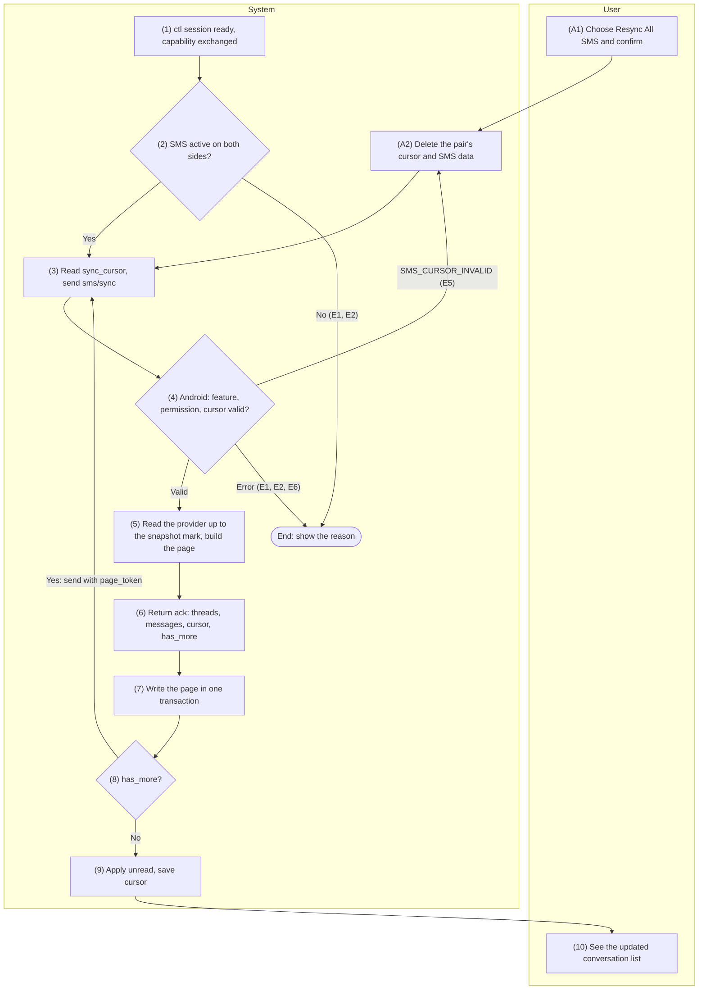
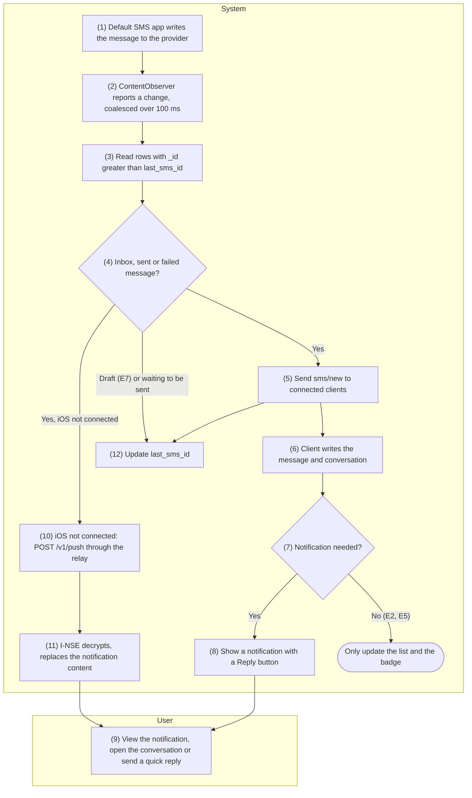
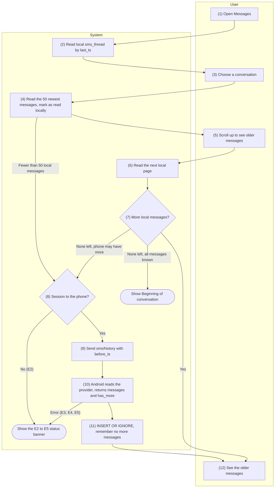
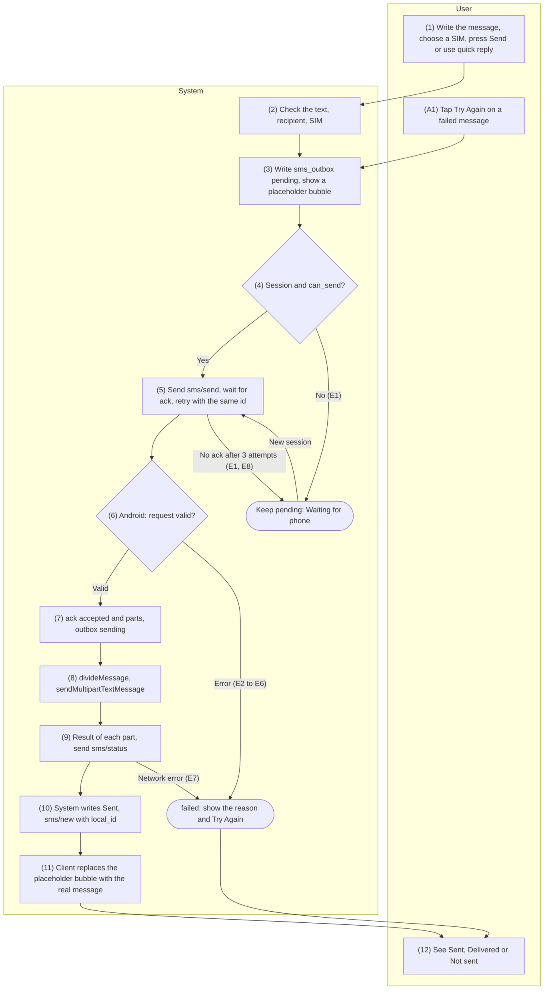
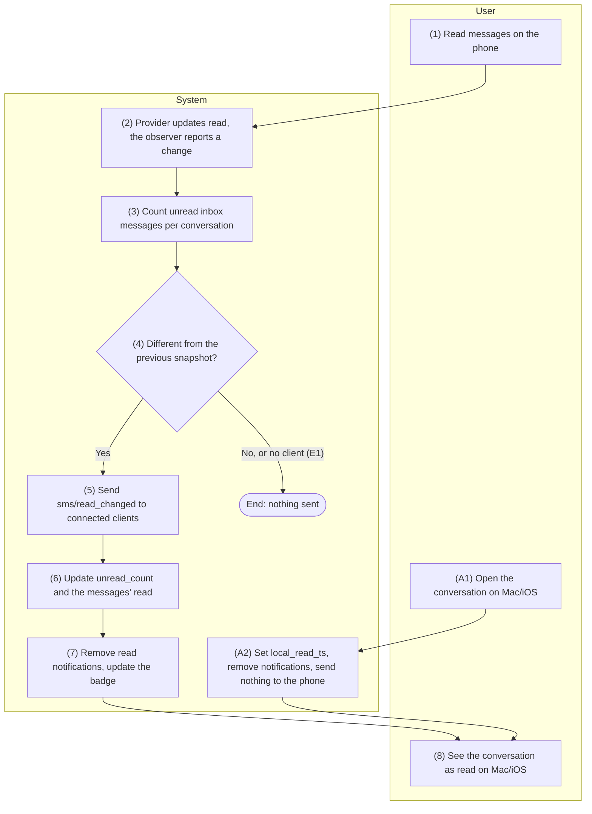

English | [Tiếng Việt](05-sms.vi.md)

# 5. Function group: SMS messages

> Common references: [`00-common-specs.md`](00-common-specs.md) — components (0.1), identifiers
> `thread_id`, `message_key`, `local_id` (0.2), data types (0.3), envelope and `ack` (0.5.1),
> security principles (0.6.5), message type `sms` (0.7.1), capability `features.sms` (0.7.2), error
> codes `SMS_*` (0.8.1), Android data sources (0.9.2), tables `sms_thread`, `sms_message`,
> `sms_outbox`, `sync_cursor` (0.9.3), keys `feature.sms`, `sms.notify`, `sms.preview` (0.9.5),
> constants `SMS_*` (0.10).
>
> General rules of the group:
> - Only SMS is handled. MMS, RCS and drafts (`type = 3`) are ignored (README §4).
> - SMS is **active** for a pair when `feature.sms = true` on both sides and Android has `READ_SMS`;
>   sending also needs `SEND_SMS` (`features.sms.can_send`).
> - No component logs message content, phone numbers or contact names; logs contain only `type`,
>   `op`, size and error code.
> - Errors in the SMS group are isolated: they do not stop A-SVC, do not close the `/v1/ctl` session
>   and do not affect the clipboard or calls.
> - Every `sms` envelope travels the same way on the LAN and over the relay; the relay sees only
>   `type = sms` and the size.

## 5.1 SMS-01 — Sync conversations and SMS history

### 5.1.1 General information

| Item | Content |
|-----|----------|
| Name | SMS-01 — Sync conversations and SMS history |
| Description | Copies the conversation list and the SMS messages from the phone into the encrypted database on the Mac/iOS device, as the basis for offline viewing (SMS-03), notifications (SMS-02) and replies (SMS-04).<br>**First sync** (no cursor yet): the 200 most recent conversations, the 50 newest messages of each.<br>**Catch-up sync** (cursor present): every message newer than the cursor, plus summaries of the conversations touched.<br>Each `ack` carries at most 500 messages; the client loops on `page_token` until `has_more = false`, then saves the new cursor and reconciles the unread state.<br>Runs automatically after every connection; the user can request "Resync All SMS". |
| Actors | Primary: System. Secondary: User (follows the progress, requests a resync). Components: M-APP or I-APP, A-SVC, A-SMS, OS (Telephony provider, Contacts provider), R-API (forwarding only, when traffic goes through the relay). |
| Preconditions | 1. An active pair (PAIR-01).<br>2. The `/v1/ctl` session has completed its handshake and both sides have exchanged `capability/hello` (CONN-01 on the LAN or CONN-03 over the relay).<br>3. SMS is active for the pair.<br>4. The client has no other SMS sync running for this pair. |
| Postconditions | **Success:** `sms_thread` and `sms_message` hold the data up to the phone's snapshot mark; `sync_cursor` (`stream = 'sms'`) holds the new cursor; `unread_count` and the `read` flags match the phone.<br>**Stopped midway:** the pages already written are kept (writing them again creates no duplicates) and the old cursor is unchanged; the next connection syncs again from the old cursor. |
| Exceptions | E1 — SMS is off on one side: no sync; if Android still receives `sms/sync`, it returns `FEATURE_DISABLED`.<br>E2 — The phone lacks `READ_SMS`: `PERMISSION_MISSING` (`details.permission = "android.permission.READ_SMS"`); the client shows the SET-01 instructions.<br>E3 — `READ_CONTACTS` missing: the sync still runs, `display_name = null`, the client shows the number.<br>E4 — Connection lost or `TIMEOUT` midway: stop, keep the data already written, run again at the next connection.<br>E5 — Invalid cursor or `page_token` (`SMS_CURSOR_INVALID`): for `page_token` → start over from the stored cursor; for the cursor → automatic "Resync All SMS" (A2).<br>E6 — Provider read error on Android (`INTERNAL`): retry once after 5 s, then wait for the next connection.<br>E7 — Database write error on the client (out of storage, SQLCipher cannot be opened): roll back the page's transaction, stop, show the non-blocking error "Couldn't save messages on this device". |
| Special requirements | **Performance:** the first sync (up to 10,000 messages) finishes in ≤ 20 s on the LAN and ≤ 40 s over the relay; a catch-up sync of fewer than 500 messages finishes in ≤ 2 s.<br>The conversation list fills in page by page; database writes run on a background queue and never block the UI.<br>Android reads the provider on a background thread and keeps no provider cursor open between pages.<br>**Security:** the data lives only in the SQLCipher-encrypted `handlive.sqlite` (0.6.5); no logging of content, numbers or names.<br>**Compliance:** the SMS permissions (`READ_SMS`, `SEND_SMS`) need Google Play's Permissions Declaration Form under the "Cross-device synchronization or transfer of SMS or calls" exception (`docs/deployment-guide.md`); the design detects new messages with a `ContentObserver`, so `RECEIVE_SMS` is not needed; if the declaration is rejected, Plan B uses a Notification Listener only to receive new messages, and there is then no history sync.<br>**v1 limitation:** messages deleted on the phone are not deleted on the Mac/iOS device as well; the user runs "Resync All SMS" to clean up. |

### 5.1.2 Screens

N/A — no approved wireframe yet.

### 5.1.3 Component details

| # | Field | Data type | Input/Output | Initial value | Description |
|---|--------|--------------|--------------|------------------|-------|
| 1 | Sync status | enum{idle\| syncing\| done\| failed} | Output | `idle` | Status banner above the conversation list: "Syncing messages…", "Couldn't sync — will try again when connected". Hidden when `idle` or `done` |
| 2 | Messages downloaded | int32 | Output | 0 | Shown only during the first sync: "Downloaded 1500 messages" (the count has no digit grouping, 0.12.1) |
| 3 | Conversation list | array\<object> | Output | Empty | The `sms_thread` rows, updated after each page; display rules in SMS-03 |
| 4 | Last sync | timestamp | Output | `sync_cursor.updated_at` | Settings → Messages; shown as relative time ("5 minutes ago") |
| 5 | "Resync All SMS" button | action | Input | — | Settings → Messages; disabled when there is no session to the phone |
| 6 | Resync confirmation | enum{Resync\| Cancel} | Input | — | "Delete messages saved on \<device> and download them again from the phone? Messages waiting to be sent are kept." |
| 7 | Error message, instructions | string | Output | Empty | Content per E1, E2, E6, E7; E2 adds a "View Instructions" button |
| 8 | Contacts permission hint | string | Output | Hidden | "Allow HandLive to read contacts on the phone to show names" when `permissions_missing` contains `READ_CONTACTS` (E3) |

### 5.1.4 Business flow



| Step | Actor | Component | Description | Exceptions / Notes |
|------|----------|-----------|-------|--------------------|
| 1 | System | M-APP / I-APP | The `/v1/ctl` session moves to `Connected` (0.11) and Android's `capability/hello` has been received. Also runs when a `capability/update` makes SMS active (SET-02) and after A2. | Another sync of the pair is already running → do not start one more. |
| 2 | System | M-APP / I-APP | Check that SMS is active: local `feature.sms`, Android's `features.sms.enabled`, and `permissions_missing` does not contain `READ_SMS`. | No → E1 or E2, show the reason. |
| 3 | System | M-APP / I-APP | Read the pair's `sync_cursor`. Send `sms/sync` (API 1) with `cursor` (if any), `thread_limit = 200`, `per_thread_limit = 50`, and the previous page's `page_token` while looping. Wait for the `ack` for up to `REQUEST_TIMEOUT`. | Timeout or connection lost → E4. |
| 4 | System | A-SVC | Check `feature.sms`, the `READ_SMS` permission and the parameters; decode `cursor` and `page_token`. | `FEATURE_DISABLED` (E1), `PERMISSION_MISSING` (E2), `SMS_CURSOR_INVALID` (E5). |
| 5 | System | A-SMS, OS | First page: take the snapshot mark `snap` = the largest `_id`.<br>No cursor: take up to the 200 newest conversations and, in each, up to 50 SMS messages with `_id ≤ snap`.<br>With a cursor: take the messages matching `(_id > id OR date > t) AND _id ≤ snap` in ascending `_id` order.<br>Build a `thread` object for every conversation that has messages in the page (addresses from `canonical-addresses`, names from `PhoneLookup`, `unread_count` from the unread inbox messages).<br>A page stops at 500 messages or when the plaintext reaches 180 KiB. | Provider error → `INTERNAL` (E6). `READ_CONTACTS` missing → E3. |
| 6 | System | A-SVC | Return the `ack` `{threads, messages, cursor, page_token?, has_more}`; the last page (`has_more = false`) also carries `unread`. |  |
| 7 | System | M-APP / I-APP | Write the whole page in one transaction: upsert `sms_thread` (keeping `local_read_ts`), upsert `sms_message` (keeping `local_id`). Update fields 1–3. | Write error → E7, roll back the transaction, stop. |
| 8 | System | M-APP / I-APP | `has_more = true` → back to step 3 with the new `page_token`, sending the same `cursor` as before. |  |
| 9 | System | M-APP / I-APP | Last page, in the same transaction as step 7: apply `unread` (absent conversations → `unread_count = 0` and their inbox messages read; present conversations → as in SMS-05 step 6); save `cursor` into `sync_cursor`; set the status to `done`. Remove the notifications of conversations already read on the phone (SMS-05). |  |
| 10 | User | M-APP / I-APP | Sees the updated conversation list (SMS-03). |  |
| A1 | User | M-APP / I-APP | Chooses "Resync All SMS" and confirms (fields 5, 6). | Only while a session exists. |
| A2 | System | M-APP / I-APP | In one transaction: delete the pair's `sync_cursor` (`stream = 'sms'`), `sms_message`, `sms_thread` and the completed `sms_outbox` rows; keep the rows still waiting to be sent. Go to step 3 without a cursor. | Also runs automatically in E5 when the cursor is invalid. |

### 5.1.5 API/service specification

**List of calls**

| # | API/service | Channel | Direction | Used in steps |
|---|-------------|------|-------|-------------|
| 1 | `WS sms/sync` | `/v1/ctl` (LAN or relay) | C→S, ack with data | 3–6, 8 |
| 2 | Android OS service: `ContentResolver.query` on `content://sms`, `content://mms-sms/conversations?simple=true`, `content://mms-sms/canonical-addresses`, `ContactsContract.PhoneLookup.CONTENT_FILTER_URI` | Local | — | 5 |
| 3 | GRDB `DatabasePool.write` (transaction on SQLCipher) | Local on Mac/iOS | — | 7, 9, A2 |

**Shared data objects** — used in `sms/sync`, `sms/history` and `sms/new` across group 5.

The `thread` object:

| Field | Type | Required | Description |
|--------|------|----------|-------|
| `thread_id` | int64 | Yes | The Telephony provider's `thread_id` (0.2) |
| `addresses` | array\<e164> | Yes | From the conversation's `recipient_ids` via `canonical-addresses`, normalized to E.164 using the country of the default SIM; strings that cannot be normalized (short codes, sender names such as `VIETTEL`) are kept as they are |
| `display_name` | string \| null | Yes | Contact name from `PhoneLookup`; several addresses → the names joined with `", "`; `null` when `READ_CONTACTS` is missing or the number is not in the contacts |
| `snippet` | string(160) | Yes | `body` of the newest SMS message in the conversation, cut to its first 160 code points, without "…" |
| `last_ts` | timestamp | Yes | `date` of the newest SMS message in the conversation |
| `unread_count` | int32 | Yes | Number of inbox messages with `read = 0` (SMS only) |

The `message` object:

| Field | Type | Required | Description |
|--------|------|----------|-------|
| `message_key` | string | Yes | `sms:<_id>` (0.2) |
| `thread_id` | int64 | Yes |  |
| `address` | e164 | Yes | The `address` column, normalized like `thread.addresses` |
| `body` | string | Yes | The `body` column; `null` in the provider → `""` |
| `box` | enum{inbox\| sent\| outbox\| failed\| queued} | Yes | From the `type` column: 1 → `inbox`, 2 → `sent`, 4 → `outbox`, 5 → `failed`, 6 → `queued`; 3 (draft) is never sent |
| `ts` | timestamp | Yes | The `date` column |
| `ts_sent` | timestamp \| null | No | The `date_sent` column; `0` → `null` |
| `read` | bool | Yes | True when the provider column has `read = 1` |
| `sub_id` | int32 \| null | No | The `sub_id` column; `-1` → `null` |
| `local_id` | uuid | No | Present only in the `sms/new` sent to the client that created the message (SMS-04) |

#### API 1 — `WS sms/sync`

- **URL:** `wss://{android_host}:{port}/v1/ctl` (LAN) or through the relay `wss://{RELAY_HOST}/v1/relay`
  with the `to` /`from` wrapper
- **Method:** `WS sms/sync` (C→S), encrypted envelope, ack with data.
- **Request (`data`):**

| Field | Type | Required | Description |
|--------|------|----------|-------|
| `cursor` | string | No | Opaque cursor received at the previous sync; absent → first sync |
| `page_token` | string | No | Taken from the previous page's `ack`; sent only while looping |
| `thread_limit` | int32 | Yes | `SMS_SYNC_THREADS` = 200; Android accepts 1–500 |
| `per_thread_limit` | int32 | Yes | `SMS_SYNC_PER_THREAD` = 50; Android accepts 1–200 |

- **Response (`ack.data`):**

| Field | Type | Description |
|--------|------|-------|
| `threads` | array\<thread> | First sync: the conversations whose messages appear for the first time in the page. Catch-up sync: every conversation with messages in the page |
| `messages` | array\<message> | At most `SMS_PAGE_MAX` = 500 messages; the `ack` plaintext is ≤ 180 KiB |
| `cursor` | string | The cursor after the whole sync completes (the same on every page); the client saves it only when `has_more = false` |
| `page_token` | string | Present when `has_more = true` |
| `has_more` | bool | Another page follows |
| `unread` | array\<object> | Last page only: every conversation with unread messages on the phone, each entry `{thread_id, unread_count, read_up_to_ts}` with `unread_count ≥ 1` — same meaning as in `sms/read_changed` (SMS-05) |

Errors (`ack.error.code`): `FEATURE_DISABLED`, `PERMISSION_MISSING`, `BAD_REQUEST` (parameter out of
range), `SMS_CURSOR_INVALID` (`details.reason` = `cursor` or `page_token`), `INTERNAL`.

- **Example:**

```json
{"op":"sync","data":{"thread_limit":200,"per_thread_limit":50}}
```

```json
{"re":"0192f3e0-1a2b-7c3d-8e4f-5a6b7c8d9e01","ok":true,"data":{"threads":[{"thread_id":42,"addresses":["+84900000123"],"display_name":"Nguyễn Văn A","snippet":"Chiều nay 3h họp nhé","last_ts":1727150000123,"unread_count":1}],"messages":[{"message_key":"sms:12846","thread_id":42,"address":"+84900000123","body":"Chiều nay 3h họp nhé","box":"inbox","ts":1727150000123,"ts_sent":1727149998000,"read":false,"sub_id":1},{"message_key":"sms:12790","thread_id":42,"address":"+84900000123","body":"Ok anh","box":"sent","ts":1727140000000,"ts_sent":null,"read":true,"sub_id":1}],"cursor":"eyJ2IjoxLCJpZCI6MTI4NDYsInQiOjE3MjcxNTAwMDAxMjN9","page_token":"eyJ2IjoxLCJtIjoxMjg0NiwidGgiOls0Miw1Nyw2M10sIm8iOjIwfQ","has_more":true}}
```

Catch-up sync, a single page (the last page carries `unread`):

```json
{"op":"sync","data":{"cursor":"eyJ2IjoxLCJpZCI6MTI4NDYsInQiOjE3MjcxNTAwMDAxMjN9","thread_limit":200,"per_thread_limit":50}}
```

```json
{"re":"0192f3e0-3c4d-7e5f-9a6b-7c8d9e0f1a23","ok":true,"data":{"threads":[{"thread_id":42,"addresses":["+84900000123"],"display_name":"Nguyễn Văn A","snippet":"Nhớ mang theo tài liệu","last_ts":1727150060456,"unread_count":2}],"messages":[{"message_key":"sms:12847","thread_id":42,"address":"+84900000123","body":"Nhớ mang theo tài liệu","box":"inbox","ts":1727150060456,"ts_sent":1727150059000,"read":false,"sub_id":1}],"cursor":"eyJ2IjoxLCJpZCI6MTI4NDcsInQiOjE3MjcxNTAwNjA0NTZ9","has_more":false,"unread":[{"thread_id":42,"unread_count":2,"read_up_to_ts":1727150000122}]}}
```

- **Business logic:**
  1. Checks, in order: `feature.sms` → `READ_SMS` → parameter limits → decoding of `cursor` and
     `page_token`.
  2. **Cursor** = b64u of the JSON `{"v":1,"id":<largest _id covered>,"t":<largest date covered>}`.
     A catch-up sync sends the messages matching `_id > id OR date > t`: the `date > t` term also
     catches a new message that was given an old `_id` again (the provider can reuse the `_id` of the
     newest message after that message is deleted). The client treats the cursor as an opaque string.
  3. **Snapshot mark** `snap` = the largest `_id` when the first page is processed; every page reads
     only messages with `_id ≤ snap`, so the number of pages stays stable even when new messages
     arrive midway. Messages with `_id > snap` go through `sms/new` (SMS-02) and are covered again by
     the next sync (writes are upserts, so there are no duplicates).
  4. **`page_token`** = b64u of a stateless JSON: first sync
     `{"v":1,"m":snap,"th":[remaining thread_ids],"o":number of messages already sent from the first conversation in the list}`;
     catch-up sync `{"v":1,"m":snap,"a":last _id sent}`. Android keeps no state between pages, so an
     A-SVC restart midway does not break the loop. A malformed token or a different `v` →
     `SMS_CURSOR_INVALID` (`page_token`); a malformed cursor → `SMS_CURSOR_INVALID` (`cursor`).
  5. **First sync:** conversations are taken in descending `date` order, at most `thread_limit`;
     conversations without any SMS message (MMS only) are skipped, so there may be fewer than 200.
     The messages of each conversation are taken in descending `date` order, at most
     `per_thread_limit`; one conversation can span two pages, and its `thread` object travels with the
     page that holds its first message. Returned cursor: `id = snap`, `t` = the largest `date` among
     the messages with `_id ≤ snap`.
  6. **Catch-up sync:** messages in ascending `_id` order; `threads` contains every conversation with
     messages in the page, with summaries recomputed from the provider at return time (the client
     overwrites `snippet`, `last_ts`, `unread_count`, `display_name`, `addresses`). Returned cursor:
     `id = max(old id, snap)`,
     `t = max(old t, largest date among the covered messages)`.
  7. A page stops at 500 messages or 180 KiB of plaintext, so that the envelope after encryption and
     base64 stays within 256 KiB (0.5.1 rule 4); a single message always fits in one page.
  8. `unread` lists every conversation with inbox messages where `read = 0`; the client treats absent
     conversations as fully read. This is how read-state changes made while the client was not
     connected are reconciled (SMS-05).
  9. Contact names are looked up per address, with an LRU cache of 500 entries scoped to one sync;
     Android does not store names on disk.
  10. Client: one transaction per page; `cursor` is saved only at the last page; `sms/new` messages
      arriving during a sync are written right away (upsert by primary key, no conflict); each pair
      runs only one sync at a time.

#### Query

```text
// [Design] Android, step 5: snapshot mark snap (read the first row only)
ContentResolver.query(Telephony.Sms.CONTENT_URI, arrayOf("_id"), null, null, "_id DESC")

// [Design] Android, step 5 (first sync): conversation list — read sequentially, stop at thread_limit
ContentResolver.query(
    Uri.parse("content://mms-sms/conversations?simple=true"),
    arrayOf("_id", "date", "recipient_ids"),
    null, null, "date DESC")

// [Design] Android, step 5: canonical address table, loaded once per sync (map _id → address)
ContentResolver.query(
    Uri.parse("content://mms-sms/canonical-addresses"),
    arrayOf("_id", "address"), null, null, null)

// [Design] Android, step 5 (first sync): messages of one conversation — skip the first o rows, read up to per_thread_limit
ContentResolver.query(
    Telephony.Sms.CONTENT_URI,
    arrayOf("_id", "thread_id", "address", "body", "type", "date", "date_sent", "read", "sub_id"),
    "thread_id = ? AND _id <= ? AND type IN (1, 2, 4, 5, 6)",
    arrayOf(threadId, snap),
    "date DESC, _id DESC")

// [Design] Android, step 5 (catch-up sync): new messages after the cursor — read at most SMS_PAGE_MAX rows
ContentResolver.query(
    Telephony.Sms.CONTENT_URI,
    arrayOf("_id", "thread_id", "address", "body", "type", "date", "date_sent", "read", "sub_id"),
    "(_id > ? OR date > ?) AND _id > ? AND _id <= ? AND type IN (1, 2, 4, 5, 6)",
    arrayOf(cursorId, cursorT, afterId, snap),
    "_id ASC")

// [Design] Android, step 5: t of the new cursor (read the first row only; catch-up sync adds the condition (_id > ? OR date > ?))
ContentResolver.query(
    Telephony.Sms.CONTENT_URI, arrayOf("date"),
    "_id <= ? AND type IN (1, 2, 4, 5, 6)", arrayOf(snap), "date DESC")

// [Design] Android, step 5 (catch-up sync): recipient_ids of the conversations touched
ContentResolver.query(
    Uri.parse("content://mms-sms/conversations?simple=true"),
    arrayOf("_id", "recipient_ids"), "_id IN (?, ?, ?)", threadIds, null)

// [Design] Android, step 5: newest SMS message of a conversation → snippet, last_ts (read the first row only)
ContentResolver.query(
    Telephony.Sms.CONTENT_URI, arrayOf("body", "date"),
    "thread_id = ? AND type IN (1, 2, 4, 5, 6)", arrayOf(threadId), "date DESC, _id DESC")

// [Design] Android, steps 5 and 6: unread inbox messages → unread_count and unread (grouped by thread_id in memory)
ContentResolver.query(
    Telephony.Sms.CONTENT_URI, arrayOf("thread_id", "date"),
    "type = 1 AND read = 0", null, null)

// [Design] Android, step 5: contact name of an address (read the first row only)
ContentResolver.query(
    Uri.withAppendedPath(ContactsContract.PhoneLookup.CONTENT_FILTER_URI, Uri.encode(address)),
    arrayOf(ContactsContract.PhoneLookup.DISPLAY_NAME), null, null, null)
```

Android does not rely on `LIMIT` in `sortOrder`; the number of rows is limited by stopping reading the
cursor.

```sql
-- [Design] Mac/iOS, step 3: current cursor
SELECT cursor FROM sync_cursor WHERE pair_id = :pair_id AND stream = 'sms';

-- [Design] Mac/iOS, step 7: upsert the conversation, keeping local_read_ts
INSERT INTO sms_thread (pair_id, thread_id, addresses_json, display_name, snippet, last_ts, unread_count)
VALUES (:pair_id, :thread_id, :addresses_json, :display_name, :snippet, :last_ts, :unread_count)
ON CONFLICT (pair_id, thread_id) DO UPDATE SET
  addresses_json = excluded.addresses_json,
  display_name   = excluded.display_name,
  snippet        = excluded.snippet,
  last_ts        = excluded.last_ts,
  unread_count   = excluded.unread_count;

-- [Design] Mac/iOS, step 7: upsert the message, keeping a local_id already attached (SMS-04)
INSERT INTO sms_message (pair_id, message_key, thread_id, address, body, box, ts, ts_sent, read, sub_id)
VALUES (:pair_id, :message_key, :thread_id, :address, :body, :box, :ts, :ts_sent, :read, :sub_id)
ON CONFLICT (pair_id, message_key) DO UPDATE SET
  thread_id = excluded.thread_id, address = excluded.address, body = excluded.body,
  box = excluded.box, ts = excluded.ts, ts_sent = excluded.ts_sent,
  read = excluded.read, sub_id = excluded.sub_id;

-- [Design] Mac/iOS, step 9: conversations absent from unread → fully read
UPDATE sms_thread SET unread_count = 0
WHERE pair_id = :pair_id AND unread_count <> 0 AND thread_id NOT IN (:unread_thread_ids);
UPDATE sms_message SET read = 1
WHERE pair_id = :pair_id AND box = 'inbox' AND read = 0 AND thread_id NOT IN (:unread_thread_ids);
-- Each entry present in unread: apply as in SMS-05 (5.5.5, Query, step 6).

-- [Design] Mac/iOS, step 9: save the cursor
INSERT INTO sync_cursor (pair_id, stream, cursor, updated_at)
VALUES (:pair_id, 'sms', :cursor, :now)
ON CONFLICT (pair_id, stream) DO UPDATE SET cursor = excluded.cursor, updated_at = excluded.updated_at;

-- [Design] Mac/iOS, A2 (one transaction): full resync, keeping the messages waiting to be sent
DELETE FROM sync_cursor WHERE pair_id = :pair_id AND stream = 'sms';
DELETE FROM sms_outbox
WHERE pair_id = :pair_id
  AND (state IN ('sent', 'delivered')
       OR local_id IN (SELECT local_id FROM sms_message
                       WHERE pair_id = :pair_id AND local_id IS NOT NULL));
DELETE FROM sms_message WHERE pair_id = :pair_id;
DELETE FROM sms_thread  WHERE pair_id = :pair_id;
```

---

## 5.2 SMS-02 — Receive new SMS notifications

### 5.2.1 General information

| Item | Content |
|-----|----------|
| Name | SMS-02 — Receive new SMS notifications |
| Description | When the phone has a new SMS message (received, sent from the phone itself, or a message HandLive has just sent on the user's behalf in SMS-04), A-SMS detects it through a `ContentObserver` on `content://sms` and sends `sms/new` to every connected client for which SMS is active.<br>The client stores the message, updates the conversation and shows a system notification with a quick-reply field (SMS-04). An iPhone/iPad without a session (I-APP suspended in the background) is woken by a push through the relay; I-NSE decrypts and shows the content if the device is unlocked.<br>A Mac that is not connected gets no push and catches up through SMS-01 when it reconnects. |
| Actors | Primary: User (receives and handles the notification). System: A-SMS, A-SVC, OS (Telephony provider, `UNUserNotificationCenter`), M-APP, I-APP, I-NSE, R-API, PUSH (APNs). |
| Preconditions | 1.<br>SMS is active for at least one pair; A-SVC is running and A-SMS has registered its observer.<br>2.<br>To receive immediately: the client has a `/v1/ctl` session (CONN-01/CONN-03); iOS alone can also receive through push if it has registered for push (CONN-04) and `features.sms.notify = true`.<br>3.<br>The user has allowed HandLive to show notifications on the Mac/iOS device (SET-03). |
| Postconditions | The message and the conversation summary are in `sms_message` and `sms_thread` of every connected client; the notification is shown according to `sms.notify` and `sms.preview`; `sms_observer_state.last_sms_id` = the largest `_id` processed. Clients that are not connected get the message at their next SMS-01. |
| Exceptions | E1 — No client is connected and no pair needs a push: only update `last_sms_id`.<br>E2 — `sms.notify = false` on the client: store the message, no notification.<br>E3 — Relay or APNs error: handled per CONN-04 (`push_outbox`, retried until it expires); iOS still gets the message through SMS-01.<br>E4 — iPhone locked: I-NSE cannot read the keys (Keychain `WhenUnlockedThisDeviceOnly`) → shows "New SMS message", with no reply button.<br>E5 — The user has turned off notifications for HandLive: only the list and the badge are updated.<br>E6 — `READ_SMS` lost while running: unregister the observer, send `capability/update` with `permissions_missing`; the client shows instructions.<br>E7 — The new row is a draft: ignore it. |
| Special requirements | **Performance:** from the first `ContentObserver.onChange` of the batch (the moment the provider writes the message cannot be observed) until the Mac shows the notification: < 500 ms on the LAN (`onChange` coalesced over 100 ms, query ≤ 50 ms), ≤ 1 s over the relay, both judged at the 95th percentile; iOS push depends on APNs.<br>**Privacy:** the push content that the relay and APNs see is always generic; the real content is inside an envelope encrypted with `K_push`. `sms.preview = false` hides the message content from notifications.<br>**Reliability:** the observer runs inside A-SVC (foreground service); `last_sms_id` is persisted, so a restart neither replays old messages nor misses new ones.<br>**Compliance:** as in SMS-01 (Permissions Declaration Form; the Plan B Notification Listener only receives messages). |

### 5.2.2 Screens

N/A — no approved wireframe yet.

### 5.2.3 Component details

| # | Field | Data type | Input/Output | Initial value | Description |
|---|--------|--------------|--------------|------------------|-------|
| 1 | Notification title | string | Output | `display_name`; `null` → number in national format | Group conversation: the names joined with ", " |
| 2 | Notification body | string | Output | `body` | `sms.preview = false` or iPhone locked → "New SMS message" |
| 3 | SIM label | string | Output | Hidden | Subtitle = the SIM's `label` for `sub_id`, only when the phone has > 1 SIM |
| 4 | "Reply" button | action + string(1600) | Input | — | Quick-reply field in the notification → SMS-04; not offered for group conversations |
| 5 | Tap on the notification | action | Input | — | Opens the conversation (SMS-03) |
| 6 | Unread badge | int32 | Output | 0 | Number of conversations shown as unread (SMS-05 rule); on the menu bar icon (Mac) and the app icon (iOS) |
| 7 | "New SMS Notifications" option | bool | Input/Output | `sms.notify` = `true` | Settings → Messages (SET-02) |
| 8 | "Show Content in Notifications" option | bool | Input/Output | `sms.preview` = `true` | Settings → Messages (SET-02) |

### 5.2.4 Business flow



| Step | Actor | Component | Description | Exceptions / Notes |
|------|----------|-----------|-------|--------------------|
| 1 | System | OS | The default SMS app receives a message and writes it to `content://sms`; or the user sends a message from the phone; or the system writes a message HandLive has just sent into the Sent box (SMS-04). |  |
| 2 | System | A-SMS | `ContentObserver.onChange` (API 3); calls within 100 ms are coalesced, then processed sequentially on a background thread. |  |
| 3 | System | A-SMS | Read `last_sms_id`; if the current largest `_id` is smaller, lower `last_sms_id` to it (the newest message was deleted). Read the rows with `_id > last_sms_id` in ascending `_id` order and re-check the rows waiting to be sent (the `pending_out` set). | Provider error → record the error code, process again at the next `onChange`. |
| 4 | System | A-SMS | Classify by `type`: `inbox`, `sent`, `failed` → broadcast; `outbox`, `queued` → add to `pending_out`, broadcast when it moves to `sent` or `failed`; draft → ignore. | E7. |
| 5 | System | A-SVC | Build `message` and `thread` (5.1.5); attach `local_id` if the message matches one sent by a client (SMS-04); send `sms/new` (API 1) to every client that has a session and SMS active. | No client → E1. |
| 6 | System | M-APP / I-APP | Upsert `sms_message` and `sms_thread` in one transaction; with `local_id` → the placeholder bubble is replaced by the real message (SMS-04). Update the list and the badge. |  |
| 7 | System | M-APP / I-APP | Notify only when: `box = inbox`, `sms.notify = true`, notification permission is granted, and the conversation is not open in the window in use. | No → E2, E5 (X1). |
| 8 | System | M-APP / I-APP, OS | Create the notification (API 4): title, body according to `sms.preview`, grouped by conversation, "Reply" button. |  |
| 9 | User | M-APP / I-APP / I-NSE | Views the notification; taps it to open the conversation (SMS-03) or sends a quick reply (SMS-04). |  |
| 10 | System | A-SVC, R-API, PUSH | For each iOS/iPadOS pair without a session, with SMS active according to the latest capability and `features.sms.notify = true`, when the message is `inbox`: build an `sms/new` envelope encrypted with `K_push` and call `POST /v1/push` with `kind = alert` (API 2, CONN-04). | Relay error → E3 (`push_outbox`). |
| 11 | System | I-NSE | Receives the push. Device unlocked: read `PRK`, derive `K_push`, decrypt, replace the title and body as in step 8, set `threadIdentifier` (API 4), attach the category with the "Reply" button. Device locked or decryption error: keep the generic content. | E4. |
| 12 | System | A-SMS | Write `last_sms_id` = the largest `_id` processed (skipped rows included), without waiting for clients. Then run the read-state computation (SMS-05 step 3). |  |

### 5.2.5 API/service specification

**List of calls**

| # | API/service | Channel | Direction | Used in steps |
|---|-------------|------|-------|-------------|
| 1 | `WS sms/new` | `/v1/ctl` (LAN or relay) | S→C | 5, 6 |
| 2 | `POST /v1/push` (full specification in CONN-04) | REST relay → APNs | A-SVC → R-API → PUSH | 10, 11 |
| 3 | `ContentResolver.registerContentObserver` on `content://sms` | Local on Android | OS → A-SMS | 2, 3, 4, 12 |
| 4 | Local `UNUserNotificationCenter` notifications and the `HL_SMS` category | Local on Mac/iOS, I-NSE | — | 8, 11 |

#### API 1 — `WS sms/new`

- **URL:** `wss://{android_host}:{port}/v1/ctl` (LAN) or through the relay `wss://{RELAY_HOST}/v1/relay`
  with the `to` /`from` wrapper
- **Method:** `WS sms/new` (S→C), encrypted envelope, no ack (0.7.1).
- **Request (`data`):**

| Field | Type | Required | Description |
|--------|------|----------|-------|
| `message` | message (5.1.5) | Yes | The new message; `local_id` only in the envelope sent to the client that created the message |
| `thread` | thread (5.1.5) | Yes | Conversation summary after this message |

- **Response:** N/A (no ack; messages missed because of a lost connection are caught up in SMS-01).
- **Example:**

```json
{"op":"new","data":{"message":{"message_key":"sms:12847","thread_id":42,"address":"+84900000123","body":"Nhớ mang theo tài liệu","box":"inbox","ts":1727150060456,"ts_sent":1727150059000,"read":false,"sub_id":1},"thread":{"thread_id":42,"addresses":["+84900000123"],"display_name":"Nguyễn Văn A","snippet":"Nhớ mang theo tài liệu","last_ts":1727150060456,"unread_count":2}}}
```

- **Business logic:**
  1. Each session gets its own envelope (encrypted with that session's key), in ascending `_id`
     order.
  2. `local_id` is attached only to the envelope sent to the pair that created the message (SMS-04
     API 4); the other clients receive the message as one sent from the phone.
  3. The same `message_key` may be sent again (a row in `pending_out` moves to `sent` /`failed`);
     the client upserts, so there are no duplicates.
  4. Client: unknown `thread_id` → create the conversation from `thread`; messages whose `box` is not
     `inbox` do not create notifications.
  5. The client does not notify for messages that arrive through SMS-01 (to avoid a flood of
     notifications on reconnect); it only updates the list and the badge.

#### API 2 — `POST /v1/push`

- **URL:** `https://{RELAY_HOST}/v1/push`
- **Method:** `POST`, header `Authorization: Bearer <jwt>` (Android's JWT, 0.6.4).
- **Request:** full structure in CONN-04. Values used for SMS (field names as in CONN-04):

| Field | Value for SMS |
|--------|-----------------|
| `pair_id` | The pair of the target iPhone/iPad |
| `to` | `device_id` of the iPhone/iPad |
| `kind` | `alert` |
| `reason` | `sms_new` |
| `env_b64` | `sms/new` envelope (API 1, without `local_id`) encrypted with `K_push`, in standard base64 with padding, ≤ 3,000 characters (logic 3) |
| `collapse_key` | The `message_key` itself (e.g. `sms:12847`) — the relay and APNs collapse repeated sends of the same message |
| `ttl_s` | 86,400 |

- **Response:** per CONN-04. Relevant relay errors: 409 `PUSH_TOKEN_MISSING` (ignored, iOS catches up
  through SMS-01), 403 `NOT_PAIRED` (pair revoked — PAIR-03), 429 `RATE_LIMITED` and 502
  `PUSH_PROVIDER_ERROR` (written to `push_outbox`, retried).
- **Example (illustrative):**

```http
POST /v1/push HTTP/1.1
Host: relay.example.com
Authorization: Bearer <jwt>
Content-Type: application/json

{"pair_id":"7a6b5c4d-3e2f-4a1b-9c8d-7e6f5a4b3c2d","to":"2c3d4e5f-6a7b-8c9d-8e0f-1a2b3c4d5e6f","kind":"alert","reason":"sms_new","env_b64":"<b64: sms/new envelope encrypted with K_push>","collapse_key":"sms:12847","ttl_s":86400}
```

- **Business logic:**
  1. Push only when every condition holds: the peer is iOS/iPadOS, has no `/v1/ctl` session,
     `relay_registered = 1`, the latest capability has `features.sms.enabled = true` and
     `features.sms.notify = true`, and the message has `box = inbox`.
  2. The default APNs content (shown when I-NSE cannot decrypt) has no title (the system shows the
     app name) and the body "New SMS message"; it contains no phone number or message content.
  3. APNs payload ≤ 4 KB (0.4.4), cut rule of CONN-04 step 5b: a `message.body` over 1,000 code
     points becomes its first 999 code points + "…". While `env_b64` is over 3,000 characters,
     `message.body` becomes the longest shorter cut that fits (fewer code points each step, ending with
     "…"), down to "…" alone; only then `thread.snippet` is cut the same way. If nothing fits, no alert
     push is sent. The full content arrives through SMS-01 when I-APP connects.
  4. Temporary push error → write to `push_outbox` (0.9.1), retry per CONN-04; drop it once expired.
  5. A Mac never receives pushes (0.4.4).

#### API 3 — `ContentObserver` on `content://sms`

- **URL:** `content://sms` (`Telephony.Sms.CONTENT_URI`)
- **Method:** `ContentResolver.registerContentObserver(uri, true, observer)` (also watches child
  URIs); callback `ContentObserver.onChange(selfChange, uri)`; unregistered with
  `ContentResolver.unregisterContentObserver(observer)`.
- **Request:** N/A. A-SMS registers when A-SVC starts, `feature.sms = true` and `READ_SMS` is
  granted; it unregisters when the feature is turned off or the permission is lost (E6).
- **Response:** `onChange` carries no message data; A-SMS always queries the provider again.
- **Example:** `onChange` at `t0` → processing scheduled at `t0 + 100 ms`; `last_sms_id = 12846` →
  querying `_id > 12846` returns row `12847` (`type = 1`) → broadcast `sms/new` → write
  `last_sms_id = 12847`.
- **Business logic:**
  1. First run (no `sms_observer_state` row yet): set `last_sms_id` = the current largest `_id`,
     without broadcasting old messages (history goes through SMS-01).
  2. `onChange` calls within 100 ms are coalesced; a single worker processes them sequentially,
     never overlapping.
  3. Do not rely on the `uri` in the callback (it may be `null` or only the parent URI); always query
     by `last_sms_id`.
  4. Largest `_id` < `last_sms_id` → set `last_sms_id` = the largest `_id` (the newest message was
     deleted and its `_id` may be reused).
  5. `pending_out` (in memory): `_id` of the `outbox` /`queued` rows, re-checked on every `onChange`,
     broadcast when they move to `sent` /`failed`, dropped after 10 minutes.
  6. The same observer serves SMS-04 (the row the system writes after sending) and SMS-05 (changes
     of the `read` column); the new-message part always runs first to keep the < 500 ms target.
  7. Every exception during processing is caught and its error code recorded; the observer never
     stops A-SVC.

#### API 4 — SMS notifications on Mac/iOS

- **URL:** N/A
- **Method:** `UNUserNotificationCenter.add(_:withCompletionHandler:)` with a `UNNotificationRequest`
  (M-APP, and I-APP while running); categories are registered at launch with
  `setNotificationCategories(_:)`; I-NSE replaces the content in
  `UNNotificationServiceExtension.didReceive(_:withContentHandler:)`.
- **Request (notification content):**

| Property | Value |
|------------|---------|
| `identifier` | `sms:<pair_id>:<message_key>` (notifications created by a push: identifier set by the system) |
| `title` | Field 1 |
| `subtitle` | Field 3, empty if there is only 1 SIM |
| `body` | Field 2 |
| `threadIdentifier` | `sms:<pair_id>:<thread_id>` — groups notifications by conversation; for a push, I-NSE sets it after decrypting (the APNs `thread-id` is the generic `sms`, CONN-04 API 4) |
| `categoryIdentifier` | `HL_SMS`, with the actions `HL_SMS_REPLY` (`UNTextInputNotificationAction`, title "Reply", button "Send", text field placeholder "SMS Message") and `HL_SMS_MARK_READ` (`UNNotificationAction`, title "Mark as Read", not `.foreground`: sets `local_read_ts` on this device per SMS-05 and removes the conversation's notifications); a group conversation uses `HL_SMS_GROUP` (logic 2) |
| `userInfo` | `{pair_id, thread_id, message_key, ts, address, sub_id}` — used for quick reply (SMS-04) and for removing notifications (SMS-05) |
| `sound` | `UNNotificationSound.default` |

- **Response:** the completion handler returns an error when notification permission is missing →
  E5, ignored.
- **Example:**

```json
{"identifier":"sms:3f2b1c4d-5e6f-4a7b-8c9d-0e1f2a3b4c5d:sms:12847","title":"Nguyễn Văn A","subtitle":"","body":"Nhớ mang theo tài liệu","threadIdentifier":"sms:3f2b1c4d-5e6f-4a7b-8c9d-0e1f2a3b4c5d:42","categoryIdentifier":"HL_SMS","userInfo":{"pair_id":"3f2b1c4d-5e6f-4a7b-8c9d-0e1f2a3b4c5d","thread_id":42,"message_key":"sms:12847","ts":1727150060456,"address":"+84900000123","sub_id":1}}
```

- **Business logic:**
  1. No notification is created when `box` is not `inbox`, when `sms.notify = false`, or when the
     conversation is open in the window in use.
  2. Conversations with several addresses use the category `HL_SMS_GROUP`, which has only
     `HL_SMS_MARK_READ` (v1 does not reply to group conversations — SMS-04 E9).
  3. I-NSE reads `sms.preview` from the App Group's `UserDefaults` and does not write to the database
     (0.9.3); if it cannot read the keys or decryption fails → keep the default content and the
     generic `sms` group, and set no category (E4).
  4. Notifications are removed when the conversation has been read on the phone (SMS-05) or opened
     on the device (SMS-03).

#### Query

```text
// [Design] Android, step 3: current largest _id (read the first row only)
ContentResolver.query(Telephony.Sms.CONTENT_URI, arrayOf("_id"), null, null, "_id DESC")

// [Design] Android, step 3: the new rows
ContentResolver.query(
    Telephony.Sms.CONTENT_URI,
    arrayOf("_id", "thread_id", "address", "body", "type", "date", "date_sent", "read", "sub_id"),
    "_id > ?", arrayOf(lastSmsId), "_id ASC")

// [Design] Android, step 3: re-check the rows in pending_out
ContentResolver.query(
    Telephony.Sms.CONTENT_URI,
    arrayOf("_id", "thread_id", "address", "body", "type", "date", "date_sent", "read", "sub_id"),
    "_id IN (?, ?)", pendingIds, null)

// [Design] Android, step 5: conversation summary — reuses the "recipient_ids", "newest SMS message",
// "unread inbox messages" (plus the condition thread_id = ?) and PhoneLookup queries of 5.1.5
```

```sql
-- [Design] Android, step 3: processed mark
SELECT last_sms_id FROM sms_observer_state WHERE id = 1;

-- [Design] Android, step 12 and API 3 (logic 1, 4): write the mark, create the row on the first run
INSERT INTO sms_observer_state (id, last_sms_id, updated_at)
VALUES (1, :last_sms_id, :now)
ON CONFLICT (id) DO UPDATE SET last_sms_id = excluded.last_sms_id, updated_at = excluded.updated_at;

-- [Design] Android, step 10: iOS/iPadOS pairs that may need a push (further filtered by session and features_json in memory)
SELECT pair_id, peer_device_id, features_json
FROM paired_device
WHERE revoked_at IS NULL AND relay_registered = 1 AND peer_platform IN ('ios', 'ipados');

-- [Design] Mac/iOS, step 6: upsert the conversation as in 5.1.5; upsert the message with local_id
INSERT INTO sms_message (pair_id, message_key, thread_id, address, body, box, ts, ts_sent, read, sub_id, local_id)
VALUES (:pair_id, :message_key, :thread_id, :address, :body, :box, :ts, :ts_sent, :read, :sub_id, :local_id)
ON CONFLICT (pair_id, message_key) DO UPDATE SET
  thread_id = excluded.thread_id, address = excluded.address, body = excluded.body,
  box = excluded.box, ts = excluded.ts, ts_sent = excluded.ts_sent,
  read = excluded.read, sub_id = excluded.sub_id,
  local_id = COALESCE(excluded.local_id, sms_message.local_id);

-- [Design] Mac/iOS, step 6: badge = number of conversations shown as unread
SELECT COUNT(*) AS unread_threads
FROM sms_thread
WHERE pair_id = :pair_id AND unread_count > 0 AND local_read_ts < last_ts;
```

Writing to `push_outbox` when a push fails: see CONN-04.

---

## 5.3 SMS-03 — View conversations and load older messages

### 5.3.1 General information

| Item | Content |
|-----|----------|
| Name | SMS-03 — View conversations and load older messages |
| Description | The user views the conversation list and the content of each conversation on the Mac/iOS device.<br>Every read comes from the local database (SQLCipher), so conversations can be viewed even when the phone is not connected.<br>When the user scrolls to the oldest message stored on the device and the phone may still have older ones, the client sends `sms/history` to load more, one page of 50 messages at a time, and inserts them into the database.<br>Opening a conversation marks it as read locally and removes that conversation's notifications (SMS-05). |
| Actors | Primary: User. System: M-APP / I-APP, A-SVC, A-SMS, OS (Telephony provider), R-API (forwarding only, when traffic goes through the relay). |
| Preconditions | 1. An active pair. 2. Data from SMS-01 or SMS-02 exists (if not, the empty state is shown). 3. Loading older messages needs a `/v1/ctl` session and SMS active. |
| Postconditions | The list and the conversation show the local data correctly; older messages loaded are stored in `sms_message` (no duplicates, nothing overwritten); `sms_thread.local_read_ts` of the conversation just opened = `last_ts`; that conversation's notifications are removed. |
| Exceptions | E1 — No conversations yet: empty state "No Messages Yet" · "Messages from your phone appear here after the first sync." with the SMS-01 sync status.<br>E2 — No session to the phone when more messages are needed: banner "Connect the phone to load older messages"; after reconnecting, loading starts automatically if the user is still at the top of the conversation.<br>E3 — `SMS_THREAD_NOT_FOUND`: the conversation was deleted on the phone → keep the local data, banner "This conversation is no longer on the phone", no further loading.<br>E4 — `TIMEOUT` or `INTERNAL`: error banner "Couldn't load older messages" with a "Try Again" button.<br>E5 — `FEATURE_DISABLED`, `PERMISSION_MISSING`: show the reason as in SMS-01 E1, E2.<br>E6 — Local database read error: show an error, allow retrying. |
| Special requirements | **Performance:** opening the list or a conversation ≤ 200 ms (paged reads using the `idx_sms_message_thread_ts` index); one `sms/history` page ≤ 1 s on the LAN; smooth scrolling in conversations with tens of thousands of messages (pages of 50 messages, keyset pagination).<br>**Usability:** each bubble has a VoiceOver label with the sender, time and status: "{sender}, {time}" for a received message, "You, {time}, {status}" for a sent one (`{sender}` = field 2, or the sender's number in national format in a group conversation; `{time}` formatted by the system; `{status}` = the field 8 text); the message text is the bubble's accessibility value, read after the label; text follows the system text size (Dynamic Type on iOS); times are shown in the device's time zone.<br>**Privacy:** reads only from the encrypted database; loaded messages pass through no other cache. |

### 5.3.2 Screens

N/A — no approved wireframe yet.

### 5.3.3 Component details

| # | Field | Data type | Input/Output | Initial value | Description |
|---|--------|--------------|--------------|------------------|-------|
| 1 | Conversation list | array\<object> | Output | Empty | Sorted by `last_ts`, newest first; loads 50 rows at a time |
| 2 | Conversation name | string | Output | `display_name`; `null` → number in national format | Group conversation: names or numbers joined with ", " |
| 3 | Snippet | string(160) | Output | `snippet` | At most 2 lines |
| 4 | Time of last message | timestamp | Output | `last_ts` | "2:05 PM", "Yesterday", "Sep 12" |
| 5 | Unread indicator | bool | Output | `unread_count > 0` and `local_read_ts < last_ts` | Colored dot and bold text; no count in the row — the number of unread conversations is on the menu bar icon (Mac) and the Messages tab badge (iOS) |
| 6 | Message bubble | string | Output | `body` | `inbox` messages on the left, sent messages on the right; links and phone numbers in the text are detected |
| 7 | Message time | timestamp | Output | `ts` | Messages grouped by day |
| 8 | Outgoing message status | enum{pending\| sending\| sent\| delivered\| failed} | Output | From `sms_outbox.state` or `box` | "Waiting for phone", "Sending…", "Sent", "Delivered", "Not sent" (SMS-04) |
| 9 | SIM label | string | Output | Hidden | Shown when the phone has > 1 SIM, per `sub_id` |
| 10 | "Loading older messages" indicator | bool | Output | `false` | At the top of the conversation while waiting for `sms/history` |
| 11 | Conversation status banner | string | Output | Hidden | Per E2–E5; "Try Again" button for E4; "Beginning of conversation" when there are no more messages |
| 12 | Message field | string(1600) | Input | Empty | See SMS-04; hidden for group conversations |

### 5.3.4 Business flow



| Step | Actor | Component | Description | Exceptions / Notes |
|------|----------|-----------|-------|--------------------|
| 1 | User | M-APP / I-APP | Opens "Messages" (Mac: the Messages window from the menu bar; iOS: the Messages tab). |  |
| 2 | System | M-APP / I-APP | Read the pair's `sms_thread` by `last_ts`, newest first, 50 rows at a time; observe changes (GRDB `ValueObservation`) to update when SMS-01, 02, 05 write data. | No rows → E1. Read error → E6. |
| 3 | User | M-APP / I-APP | Chooses a conversation. |  |
| 4 | System | M-APP / I-APP | Read the 50 newest local messages and the `sms_outbox` bubbles not yet matched to a real message (SMS-04); set `local_read_ts = last_ts`, remove the conversation's notifications (SMS-05 A2). Fewer than 50 local messages and the conversation not yet marked "no more messages" → go to step 8 right away. |  |
| 5 | User | M-APP / I-APP | Scrolls up to see older messages. |  |
| 6 | System | M-APP / I-APP | Read the next local page (keyset on `ts`, `message_key`). |  |
| 7 | System | M-APP / I-APP | The local page has data → show it (step 12). No local messages left: the conversation is already marked "no more messages" (in memory, per `thread_id`) → show "Beginning of conversation"; otherwise → step 8. |  |
| 8 | System | M-APP / I-APP | Check the session to the phone and that SMS is active. | No → E2. |
| 9 | System | M-APP / I-APP | Send `sms/history` (API 1) `{thread_id, before_ts, limit: 50}` with `before_ts` = the smallest `ts` of the conversation in the local database (no messages → the current time); show field 10. Each conversation has at most one pending request. |  |
| 10 | System | A-SVC, A-SMS | Check the feature, the permission and that the conversation still exists; read up to 50 messages with `date < before_ts`, newest first by `date`; return `{messages, has_more}`. | `SMS_THREAD_NOT_FOUND` (E3), `TIMEOUT` or `INTERNAL` (E4), E5. |
| 11 | System | M-APP / I-APP | `INSERT OR IGNORE` the messages in one transaction; `has_more = false` → mark "no more messages" in memory. |  |
| 12 | User | M-APP / I-APP | Sees the older messages; the scroll position is kept. |  |

### 5.3.5 API/service specification

**List of calls**

| # | API/service | Channel | Direction | Used in steps |
|---|-------------|------|-------|-------------|
| 1 | `WS sms/history` | `/v1/ctl` (LAN or relay) | C→S, ack with data | 9, 10, 11 |
| 2 | Local services: `ContentResolver.query` (Android); GRDB `ValueObservation` and `DatabasePool.read` (Mac/iOS); removing notifications per 5.5.5 API 2 | Local | — | 2, 4, 6, 10 |

#### API 1 — `WS sms/history`

- **URL:** `wss://{android_host}:{port}/v1/ctl` (LAN) or through the relay `wss://{RELAY_HOST}/v1/relay`
  with the `to` /`from` wrapper
- **Method:** `WS sms/history` (C→S), encrypted envelope, ack with data.
- **Request (`data`):**

| Field | Type | Required | Description |
|--------|------|----------|-------|
| `thread_id` | int64 | Yes | The conversation to load more of |
| `before_ts` | timestamp | Yes | Only messages whose `date` is smaller than this value |
| `limit` | int32 | Yes | `SMS_HISTORY_PAGE` = 50; Android accepts 1–200 |

- **Response (`ack.data`):**

| Field | Type | Description |
|--------|------|-------|
| `messages` | array\<message> (5.1.5) | Newest first by `date`; no `local_id` |
| `has_more` | bool | There are messages older than the last one of the page |

Errors (`ack.error.code`): `SMS_THREAD_NOT_FOUND`, `FEATURE_DISABLED`, `PERMISSION_MISSING`,
`BAD_REQUEST`, `INTERNAL`.

- **Example:**

```json
{"op":"history","data":{"thread_id":42,"before_ts":1727140000000,"limit":50}}
{"re":"0192f3e1-2b3c-7d4e-9f50-6a7b8c9d0e12","ok":true,"data":{"messages":[{"message_key":"sms:12611","thread_id":42,"address":"+84900000123","body":"Anh gửi em file báo cáo nhé","box":"inbox","ts":1727052000000,"ts_sent":1727051998000,"read":true,"sub_id":1}],"has_more":false}}
{"re":"0192f3e1-2b3c-7d4e-9f50-6a7b8c9d0e12","ok":false,"error":{"code":"SMS_THREAD_NOT_FOUND","message":"Conversation no longer exists on the phone","details":{}}}
```

- **Business logic:**
  1. Checks, in order: `feature.sms` → `READ_SMS` → parameters → the conversation still exists in
     `content://mms-sms/conversations?simple=true` (`SMS_THREAD_NOT_FOUND`).
  2. Select the messages `thread_id = ? AND date < before_ts` (SMS only, drafts excluded) ordered by
     `date DESC, _id DESC`, reading at most `limit` rows; if the rows right after the last row have
     the same `date`, return them as well until that group ends, so that the next request with
     `date <` does not miss messages sharing the same millisecond.
  3. Stop early when the plaintext reaches 180 KiB (as in SMS-01); `has_more = true` in that case.
  4. `has_more` is determined by reading one more row after the page.
  5. No conversation summary is returned and the sync cursor is not changed (older messages are
     already below the cursor).
  6. Client: `INSERT OR IGNORE` (existing data is never overwritten, `local_id` included);
     `has_more = false` → remember "no more messages" in memory until the app restarts or a full
     resync runs; E3 is also remembered as "no more messages".

#### Query

```text
// [Design] Android, step 10: check that the conversation still exists
ContentResolver.query(
    Uri.parse("content://mms-sms/conversations?simple=true"),
    arrayOf("_id"), "_id = ?", arrayOf(threadId), null)

// [Design] Android, step 10: page of older messages — read limit + 1 rows, plus the group sharing the same date at the boundary
ContentResolver.query(
    Telephony.Sms.CONTENT_URI,
    arrayOf("_id", "thread_id", "address", "body", "type", "date", "date_sent", "read", "sub_id"),
    "thread_id = ? AND date < ? AND type IN (1, 2, 4, 5, 6)",
    arrayOf(threadId, beforeTs),
    "date DESC, _id DESC")
```

```sql
-- [Design] Mac/iOS, step 2: conversation list (the next page passes the last row of the previous page)
SELECT thread_id, addresses_json, display_name, snippet, last_ts, unread_count,
       (unread_count > 0 AND local_read_ts < last_ts) AS is_unread
FROM sms_thread
WHERE pair_id = :pair_id
  AND (:after_ts IS NULL OR (last_ts, thread_id) < (:after_ts, :after_thread_id))
ORDER BY last_ts DESC, thread_id DESC
LIMIT 50;

-- [Design] Mac/iOS, steps 4 and 6: page of local messages (keyset), with the send status of messages created on this device
SELECT m.message_key, m.address, m.body, m.box, m.ts, m.ts_sent, m.read, m.sub_id,
       m.local_id, o.state AS send_state
FROM sms_message m
LEFT JOIN sms_outbox o ON o.local_id = m.local_id
WHERE m.pair_id = :pair_id AND m.thread_id = :thread_id
  AND (:before_ts IS NULL OR (m.ts, m.message_key) < (:before_ts, :before_key))
ORDER BY m.ts DESC, m.message_key DESC
LIMIT 50;

-- [Design] Mac/iOS, step 4: placeholder bubbles not yet matched to a real message (SMS-04)
SELECT o.local_id, o.body, o.state, o.last_error, o.created_at
FROM sms_outbox o
WHERE o.pair_id = :pair_id AND o.thread_id = :thread_id
  AND NOT EXISTS (SELECT 1 FROM sms_message m
                  WHERE m.pair_id = o.pair_id AND m.local_id = o.local_id)
ORDER BY o.created_at;

-- [Design] Mac/iOS, step 4: mark as read locally
UPDATE sms_thread SET local_read_ts = last_ts
WHERE pair_id = :pair_id AND thread_id = :thread_id;

-- [Design] Mac/iOS, step 9: before_ts
SELECT MIN(ts) AS before_ts
FROM sms_message
WHERE pair_id = :pair_id AND thread_id = :thread_id;

-- [Design] Mac/iOS, step 11: insert older messages, never overwriting
INSERT OR IGNORE INTO sms_message (pair_id, message_key, thread_id, address, body, box, ts, ts_sent, read, sub_id)
VALUES (:pair_id, :message_key, :thread_id, :address, :body, :box, :ts, :ts_sent, :read, :sub_id);
```

---

## 5.4 SMS-04 — Send and reply to SMS from Mac/iOS

### 5.4.1 General information

| Item | Content |
|-----|----------|
| Name | SMS-04 — Send and reply to SMS from Mac/iOS |
| Description | The user writes a message in a conversation, to a new number, or as a quick reply right in the notification.<br>The client writes the message to the `sms_outbox` queue and shows a placeholder bubble, then sends `sms/send` to the phone.<br>Android checks the request, returns the `ack` `{accepted, parts}`, sends with `SmsManager` through the selected SIM and reports progress with `sms/status` (`sending` → `sent` → `delivered`, or `failed`).<br>The Android system itself writes the sent message into the Sent box; the SMS-02 observer broadcasts `sms/new` with `local_id` so that the client replaces the placeholder bubble with the real message.<br>When there is no session, the message waits in the queue. |
| Actors | Primary: User. System: M-APP / I-APP, A-SVC, A-SMS, OS (`SmsManager`, `SubscriptionManager`, `UNUserNotificationCenter`), R-API (forwarding only, when traffic goes through the relay). |
| Preconditions | 1. An active pair; SMS active and `features.sms.can_send = true` (Android has `SEND_SMS`).<br>2. The phone has at least one active SIM.<br>3. Sending immediately needs a `/v1/ctl` session; without a session the message is queued. |
| Postconditions | **Success:** the message is in the phone's Sent box and in `sms_message` (`box = sent`, `local_id` = the temporary ID); `sms_outbox.state` = `sent` or `delivered`.<br>**Failure:** `sms_outbox.state = failed`, `last_error` = the error code, the bubble has a "Try Again" button.<br>**Not sent yet:** `state = pending` ("Waiting for phone") until a session exists or 24 h have passed. |
| Exceptions | E1 — No session, or no `ack` after 3 retries: keep `pending`, send again when a new session exists; after 24 h → `failed` (`NOT_CONNECTED`).<br>E2 — `FEATURE_DISABLED`.<br>E3 — `PERMISSION_MISSING` (`SEND_SMS`) or `can_send = false`: the reason shown is "Missing SMS permission on the phone" (the PAIR-02 field 8 text).<br>E4 — `SMS_INVALID_ADDRESS`.<br>E5 — Empty content (`BAD_REQUEST`) or more than 1,600 characters (`PAYLOAD_TOO_LARGE`); the client blocks it before sending.<br>E6 — `SMS_SIM_UNAVAILABLE`: the selected SIM is not active, or the phone has several SIMs and the default SIM cannot be determined → the client opens the SIM picker.<br>E7 — Sending fails at the network: `SMS_NO_SERVICE`, `SMS_RADIO_OFF`, `SMS_LIMIT_EXCEEDED`, `SMS_GENERIC_FAILURE` → `failed`, "Try Again" button.<br>E8 — A quick reply on iOS gets no `ack` within about 20 s: keep `pending`, show the local notification "Not sent yet. Open HandLive to try again."<br>E9 — Conversation with several recipients: v1 does not allow replying from Mac/iOS.<br>E10 — The carrier sends no delivery report: the status stays at "Sent". |
| Special requirements | **Performance:** the placeholder bubble appears ≤ 100 ms after pressing Send; `ack` ≤ 300 ms on the LAN; "Sent" ≤ 2 s with normal signal (Phase 2 target).<br>**No duplicate sends:** a retry reuses the same envelope `id`; Android deduplicates by `id` (0.5.1) and by `local_id` within 24 h; the client never resends on its own a message that was already `accepted`.<br>**Privacy:** no logging of content or recipient numbers; the queue lives in the SQLCipher database.<br>**Cost:** long messages are split into several parts, each billed as one SMS; the client shows the estimated number of parts before sending.<br>**Compliance:** `SEND_SMS` needs the Permissions Declaration Form; if it is rejected (Plan B), `can_send = false` and the client hides the message field. |

### 5.4.2 Screens

N/A — no approved wireframe yet.

### 5.4.3 Component details

| # | Field | Data type | Input/Output | Initial value | Description |
|---|--------|--------------|--------------|------------------|-------|
| 1 | Recipient | e164 | Input | Empty | Label "To:"; only for "New Message": type a number or pick from an existing conversation; basic check (digits, the `+` sign, 3–15 characters) before sending |
| 2 | Message text | string(1600) | Input | Empty | Cannot be sent when empty or whitespace only |
| 3 | Character and part counter | string | Output | "0/160" | Estimate: GSM-7 encoding, 160 characters per part (153 characters per part when there are several parts); any character outside GSM-7 (for example Vietnamese with diacritics) → 70 (67 per part). Shown as "{used}/{limit} · {parts}", where `{parts}` is "1 message" or "{count} messages" (a plural string, 0.12.1); the empty field shows "0/160". `{used}` is the number of characters in the message and `{limit}` the capacity of the current number of parts: 160 for one GSM-7 part, 153 × parts when there are several; 70 for one part with a character outside GSM-7, 67 × parts when there are several. Examples "120/160 · 1 message", "230/306 · 2 messages" |
| 4 | Sending SIM | int32 (`sub_id`) | Input/Output | `features.sms.default_sub_id` | Shown only when `features.sms.sims` has > 1 SIM; displayed by `label`; the SIM picker (also opened by E6) has the title "Choose SIM" |
| 5 | "Send" button | action | Input | — | Disabled for E5 or when `can_send = false` |
| 6 | Placeholder bubble | string | Output | — | The text just sent, shown right away; disappears when the real message arrives |
| 7 | Send status | enum{pending\| sending\| sent\| delivered\| failed} | Output | `pending` | "Waiting for phone", "Sending…", "Sent", "Delivered", "Not sent" |
| 8 | Failure reason | string | Output | Hidden | By error code: "No service", "The phone is in airplane mode", "Invalid number", "The SIM isn't active", "Missing SMS permission on the phone", "Sending limit reached. Try again later.", "Couldn't send", "Couldn't connect to the phone" |
| 9 | "Try Again" button | action | Input | — | On a `failed` bubble; creates a new `local_id` |
| 10 | Quick-reply field | string(1600) | Input | Empty | In the SMS-02 notification (action `HL_SMS_REPLY`) |
| 11 | "Not sent yet" notification | string | Output | — | iOS only (E8): "Not sent yet. Open HandLive to try again." |

### 5.4.4 Business flow



| Step | Actor | Component | Description | Exceptions / Notes |
|------|----------|-----------|-------|--------------------|
| 1 | User | M-APP / I-APP | Writes in a conversation (recipient = the conversation's address), or in "New Message" (types a number), or as a quick reply in the notification (API 5). Chooses a SIM if there is > 1 SIM. Presses "Send". | Group conversation → no message field (E9). |
| 2 | System | M-APP / I-APP | Check: the text, after trimming leading and trailing whitespace, is not empty and is ≤ 1,600 characters; the recipient looks like a number; the SIM belongs to `features.sms.sims` (default `default_sub_id`; a quick reply uses the SIM of the original message). | E5; malformed number → reported right away at the recipient field. |
| 3 | System | M-APP / I-APP | Generate `local_id` (UUIDv7); write `sms_outbox` with `state = pending`, `thread_id` (null for a new number), `addresses_json`, `body`, `sub_id`; show the placeholder bubble "Waiting for phone". |  |
| 4 | System | M-APP / I-APP | Check the `/v1/ctl` session and `can_send`. | No session → E1. `can_send = false` → E3. |
| 5 | System | M-APP / I-APP | Generate the envelope `id`, send `sms/send` (API 1), increment `attempts`. No `ack` within `REQUEST_TIMEOUT` → resend with the **same `id`** after 5 s, 15 s, 45 s (`SMS_OUTBOX_RETRY`). When a new session exists, the `pending` rows are sent again in `created_at` order. | After 3 attempts → E1; quick reply on iOS → E8. |
| 6 | System | A-SVC, A-SMS | Checks, in order: `feature.sms`, `SEND_SMS`, parameters, recipient (libphonenumber → E.164), text, SIM; deduplicate by `id` and `local_id`. | Error `ack` → the client sets `failed` and `last_error` (E2–E6). |
| 7 | System | A-SVC, M-APP / I-APP | Android returns the `ack` `{accepted: true, parts}`; the client sets `state = sending` and shows "Sending…". |  |
| 8 | System | A-SMS, OS | Record `local_id` in `SendRegistry`; split the message with `divideMessage` and send it with `sendMultipartTextMessage` through the `SmsManager` of `sub_id` (API 3), with a "sent" and a "delivered" PendingIntent for each part. Send `sms/status` `sending`. |  |
| 9 | System | A-SMS, A-SVC | Receive the result of each part: every part `RESULT_OK` → `sms/status` `sent`; every part with a successful delivery report → `delivered`; the first part that fails → `failed` with `error_code` (API 2). The client updates `sms_outbox.state`. | E7, E10. |
| 10 | System | OS, A-SMS | The Android system writes the message into the Sent box (or `failed`); the SMS-02 observer sees the new row, matches it against `SendRegistry` (same address, same text, within 60 s after the final result) and sends `sms/new` with `message.local_id` to the client that sent it (API 4). | No match → the client's fallback matching (API 4, logic 3). |
| 11 | System | M-APP / I-APP | Upsert the real message with its `local_id` → the placeholder bubble disappears and the real message is shown with the status taken from `sms_outbox` by `local_id`. Message to a new number: the compose screen switches to the newly created conversation. |  |
| 12 | User | M-APP / I-APP | Sees "Sent" or "Delivered"; or "Not sent" with the reason and "Try Again". |  |
| A1 | User | M-APP / I-APP | Taps "Try Again" on a failed message: the old `sms_outbox` row is deleted, a new `local_id` is created, back to step 3 with the same text, recipient and SIM. | If the phone has already recorded the failed message (`box = failed`), that message is still shown as it is on the phone. |
| B1 | User | I-APP | iOS: types a reply in the notification while I-APP is suspended in the background. |  |
| B2 | System | I-APP | The system wakes I-APP in the background to handle the action; I-APP requests background execution time, writes `sms_outbox`, connects (CONN-01 on the LAN or CONN-03 over the relay) and sends as in step 5. |  |
| B3 | System | I-APP | `ack` within about 20 s → end the background task (later status changes are applied when the app reconnects). Otherwise → keep `pending`, show field 11, end the background task. | E8. |

### 5.4.5 API/service specification

**List of calls**

| # | API/service | Channel | Direction | Used in steps |
|---|-------------|------|-------|-------------|
| 1 | `WS sms/send` | `/v1/ctl` (LAN or relay) | C→S, ack | 5, 6, 7, B2 |
| 2 | `WS sms/status` | `/v1/ctl` (LAN or relay) | S→C | 8, 9 |
| 3 | `SmsManager.divideMessage` and `SmsManager.sendMultipartTextMessage` | Local on Android | A-SMS → OS | 8, 9 |
| 4 | `WS sms/new` with `local_id` (main specification in 5.2.5 API 1) | `/v1/ctl` (LAN or relay) | S→C | 10, 11 |
| 5 | Quick reply from the notification (`UNTextInputNotificationAction`) | Local on Mac/iOS | OS → M-APP / I-APP | 1, B1–B3 |
| 6 | Android OS services: `SubscriptionManager.getActiveSubscriptionInfoList`, `SmsManager.getDefaultSmsSubscriptionId`, libphonenumber `PhoneNumberUtil` | Local | — | 6 |

#### API 1 — `WS sms/send`

- **URL:** `wss://{android_host}:{port}/v1/ctl` (LAN) or through the relay `wss://{RELAY_HOST}/v1/relay`
  with the `to` /`from` wrapper
- **Method:** `WS sms/send` (C→S), encrypted envelope, ack.
- **Request (`data`):**

| Field | Type | Required | Description |
|--------|------|----------|-------|
| `local_id` | uuid | Yes | Temporary ID generated by the client; Android's deduplication key |
| `thread_id` | int64 | No | The conversation being written in; Android only records it and does not require it to still exist (the recipient is what counts) |
| `addresses` | array\<string> | Yes | Exactly 1 element in v1 |
| `body` | string(1600) | Yes | Not empty |
| `sub_id` | int32 | No | Sending SIM; absent → the phone's default SMS SIM |

- **Response (`ack.data`):**

| Field | Type | Description |
|--------|------|-------|
| `accepted` | bool | Always `true` when `ok = true` |
| `parts` | int32 | Number of parts after `divideMessage` |

Errors (`ack.error.code`), in the order they are checked:

| Code | When |
|----|---------|
| `FEATURE_DISABLED` | `feature.sms = false` on Android |
| `PERMISSION_MISSING` | `SEND_SMS` missing; `details.permission = "android.permission.SEND_SMS"` |
| `BAD_REQUEST` | Missing field, `addresses` does not have exactly 1 element, empty `body` |
| `PAYLOAD_TOO_LARGE` | `body` > 1,600 characters |
| `SMS_INVALID_ADDRESS` | Cannot be normalized to E.164 and is not a short code |
| `SMS_SIM_UNAVAILABLE` | `sub_id` is not an active SIM, or `sub_id` is absent and no SIM can be determined; `details.sims` = the valid `sub_id` values |

- **Example:**

```json
{"op":"send","data":{"local_id":"0192f3e2-4b5c-7d6e-9f70-8a9b0c1d2e3f","thread_id":42,"addresses":["+84900000123"],"body":"Ok, 3h mình có mặt","sub_id":1}}
{"re":"0192f3e2-5c6d-7e7f-8a9b-0c1d2e3f4a5b","ok":true,"data":{"accepted":true,"parts":1}}
{"re":"0192f3e2-5c6d-7e7f-8a9b-0c1d2e3f4a5b","ok":false,"error":{"code":"SMS_SIM_UNAVAILABLE","message":"Selected SIM is not active","details":{"sims":[1]}}}
```

- **Business logic:**
  1. The `ack` is sent as soon as the checks pass, **before** the radio sends; the sending result
     goes through `sms/status`.
  2. The recipient is normalized with libphonenumber, using the country of the sending SIM as the
     region: a valid number → E.164; a string of 3–8 digits → kept as is (short code); anything
     else → `SMS_INVALID_ADDRESS`.
  3. SIM selection: `sub_id` given → it must be in the list of active SIMs; absent →
     `SmsManager.getDefaultSmsSubscriptionId()`; if that value is invalid (the phone is set to
     "always ask") and there is only 1 SIM → use that SIM, several SIMs → `SMS_SIM_UNAVAILABLE`. The
     list of active SIMs (`SubscriptionManager.getActiveSubscriptionInfoList()`) needs
     `READ_PHONE_STATE`; without that permission → `features.sms.sims` is empty, only requests
     without `sub_id` are accepted and they are sent with the default SIM.
  4. Deduplication: an `id` already processed within `DEDUP_WINDOW` → send the old `ack` again
     (0.5.1). A `local_id` already in `SendRegistry` → return `{accepted: true, parts}` as the first
     time, do not send again, then re-broadcast the current `sms/status`.
  5. `SendRegistry` (in A-SMS memory, at most 1,000 entries, kept for 24 h): `local_id` → `pair_id`,
     E.164 address, `body`, `parts`, the status of each part, `message_key` once matched, and the
     timestamps. It is lost when A-SVC restarts; in that rare case a resend can create a duplicate
     message.
  6. Client: `ok = false` → `state = failed`, `last_error = code`; `ok = true` → `state = sending`.
     The client never resends a message in `sending`; when a new session exists, Android
     re-broadcasts the `sms/status` of every `SendRegistry` entry of that pair.
  7. The envelope `id` of the first send is kept in memory for retries; after the client restarts,
     a new `id` is used and Android still deduplicates by `local_id`.

#### API 2 — `WS sms/status`

- **URL:** as in API 1
- **Method:** `WS sms/status` (S→C), encrypted envelope, no ack.
- **Request (`data`):**

| Field | Type | Required | Description |
|--------|------|----------|-------|
| `local_id` | uuid | Yes | That of the corresponding `sms/send` |
| `message_key` | string | No | Present once the row in the provider has been matched |
| `status` | enum{sending\| sent\| delivered\| failed} | Yes |  |
| `error_code` | enum{SMS_NO_SERVICE\| SMS_RADIO_OFF\| SMS_LIMIT_EXCEEDED\| SMS_GENERIC_FAILURE} | When `failed` | Error code from 0.8.1 |

- **Response:** N/A.
- **Example:**

```json
{"op":"status","data":{"local_id":"0192f3e2-4b5c-7d6e-9f70-8a9b0c1d2e3f","status":"sending"}}
{"op":"status","data":{"local_id":"0192f3e2-4b5c-7d6e-9f70-8a9b0c1d2e3f","message_key":"sms:12848","status":"sent"}}
{"op":"status","data":{"local_id":"0192f3e2-4b5c-7d6e-9f70-8a9b0c1d2e3f","status":"failed","error_code":"SMS_NO_SERVICE"}}
```

- **Business logic:**
  1. `sending`: right after calling `sendMultipartTextMessage`. `sent`: every part reports
     `RESULT_OK`. `delivered`: every part has a successful delivery report (if the carrier supports
     it). `failed`: the first part that reports an error; later results for the same `local_id` are
     ignored.
  2. The client lets the status only move forward (`pending` → `sending` → `sent` → `delivered`;
     `pending` or `sending` → `failed`); duplicate or backward updates are ignored. A failed delivery
     report after `sent` does not lower the status.
  3. Sent only to the session of the pair that created the message; pair not connected → kept in
     `SendRegistry`, broadcast when a new session exists.

#### API 3 — `SmsManager.divideMessage` and `SmsManager.sendMultipartTextMessage`

- **URL:** N/A
- **Method:** `SmsManager.divideMessage(body)` then
  `SmsManager.sendMultipartTextMessage(destinationAddress, scAddress, parts, sentIntents, deliveryIntents)`
  on the SIM's `SmsManager`:
  `context.getSystemService(SmsManager::class.java).createForSubscriptionId(subId)` (API 31+) or
  `SmsManager.getSmsManagerForSubscriptionId(subId)` (API 29–30).
- **Request:**

| Parameter | Type | Value |
|---------|------|---------|
| `destinationAddress` | String | The normalized recipient |
| `scAddress` | String | `null` (use the SIM's default SMSC) |
| `parts` | ArrayList\<String> | Result of `divideMessage` |
| `sentIntents` | ArrayList\<PendingIntent> | One intent per part, extras `local_id`, `part_index`, `part_count` |
| `deliveryIntents` | ArrayList\<PendingIntent> | Same as above, for delivery reports |

- **Response:** the result of each part comes back to an internal receiver through `sentIntents`;
  mapping to HandLive codes:

| "sent" result code | HandLive code |
|-------------------|-------------|
| `Activity.RESULT_OK` | Part sent |
| `SmsManager.RESULT_ERROR_NO_SERVICE` | `SMS_NO_SERVICE` |
| `SmsManager.RESULT_ERROR_RADIO_OFF` | `SMS_RADIO_OFF` |
| `SmsManager.RESULT_ERROR_LIMIT_EXCEEDED` | `SMS_LIMIT_EXCEEDED` |
| `SmsManager.RESULT_ERROR_GENERIC_FAILURE`, `SmsManager.RESULT_ERROR_NULL_PDU` and every other code | `SMS_GENERIC_FAILURE` |

- **Example:** `divideMessage("Ok, 3h mình có mặt")` → 1 part; the "sent" intent of part 0 (`local_id =
  0192f3e2-4b5c-7d6e-9f70-8a9b0c1d2e3f`, `part_index = 0`, `part_count = 1`) comes back with `RESULT_OK` →
  `sms/status` `sent`.
- **Business logic:**
  1. The PendingIntent is an explicit broadcast to an internal receiver (not exported), with a unique
     request code per (`local_id`, part); it uses `FLAG_MUTABLE` because the system fills result data
     (the delivery report) into the intent.
  2. Called on an A-SMS background thread; an exception during the call → `failed` with
     `SMS_GENERIC_FAILURE`.
  3. HandLive is not the default SMS app, so it does not write to the provider itself; the system
     writes the message into the Sent box (or `failed`) after sending completes (0.9.2).
  4. HandLive does not retry on its own when `SmsManager` reports an error; the user decides with
     "Try Again".
  5. Delivery report: the message counts as `delivered` only when the delivery-report data of every
     part indicates success.

#### API 4 — `WS sms/new` with `local_id`

- **URL:** as in API 1
- **Method:** `WS sms/new` (S→C), encrypted envelope, no ack — main specification in 5.2.5 API 1.
- **Request (`data`):** as in 5.2.5 API 1; `message.local_id` = the `local_id` of the corresponding
  `sms/send`, present only in the envelope sent to the pair that created the message.
- **Response:** N/A.
- **Example:**

```json
{"op":"new","data":{"message":{"message_key":"sms:12848","thread_id":42,"address":"+84900000123","body":"Ok, 3h mình có mặt","box":"sent","ts":1727150125000,"ts_sent":null,"read":true,"sub_id":1,"local_id":"0192f3e2-4b5c-7d6e-9f70-8a9b0c1d2e3f"},"thread":{"thread_id":42,"addresses":["+84900000123"],"display_name":"Nguyễn Văn A","snippet":"Ok, 3h mình có mặt","last_ts":1727150125000,"unread_count":2}}}
```

- **Business logic:**
  1. Android matches a new provider row whose `box` is `sent` or `failed` with the `SendRegistry`
     entry that has the same address and the same text, within 60 s after that entry's final result;
     several entries match → pick the oldest; each entry matches at most one row.
  2. Once matched, the `message_key` is stored in `SendRegistry` and sent with the later
     `sms/status` messages.
  3. Fallback matching on the client when an `sms/new` with `box = sent` lacks `local_id`: find an
     unmatched `sms_outbox` row with the same recipient and the same text, created within the
     10 minutes before `ts` → attach that `local_id`.
  4. The client writes the real message and attaches `local_id` in one transaction, so the
     placeholder bubble disappears at the same moment the real message appears.

#### API 5 — Quick reply from the notification

- **URL:** N/A
- **Method:** action `HL_SMS_REPLY` (`UNTextInputNotificationAction`, category `HL_SMS` — 5.2.5
  API 4) →
  `UNUserNotificationCenterDelegate.userNotificationCenter(_:didReceive:withCompletionHandler:)`
  receives a `UNTextInputNotificationResponse`. On iOS, the sending runs inside
  `UIApplication.beginBackgroundTask(withName:expirationHandler:)` … `endBackgroundTask(_:)`.
- **Request:**

| Property | Value |
|------------|---------|
| `actionIdentifier` | `HL_SMS_REPLY` |
| `userText` | The reply text |
| `notification.request.content.userInfo` | `{pair_id, thread_id, message_key, ts, address, sub_id}` of the original message |

- **Response:** call `completionHandler()` when the `ack` arrives, or when about 20 s have passed on
  iOS.
- **Example:**
  `userInfo = {"pair_id":"3f2b1c4d-5e6f-4a7b-8c9d-0e1f2a3b4c5d","thread_id":42,"message_key":"sms:12847","ts":1727150060456,"address":"+84900000123","sub_id":1}`,
  `userText = "Ok, 3h mình có mặt"` → `sms/send` as in the API 1 example.
- **Business logic:**
  1. Mac: M-APP always runs (menu bar); handled as in steps 2–12.
  2. iOS: the action has no option to open the app, so the system wakes I-APP in the background;
     I-APP requests background execution time, connects per CONN-01 or CONN-03 and sends `sms/send`
     (B2).
  3. About 20 s pass without an `ack` → keep `pending`, post the field 11 local notification, call
     `completionHandler`, end the background task (E8); the next time the app opens, it sends again
     per step 5.
  4. `userText` empty after trimming whitespace → ignored.
  5. A quick reply sets the conversation's `local_read_ts` (SMS-05 A2) but does not change the read
     status on the phone.

#### Query

```sql
-- [Design] Mac/iOS, step 3: create the queue entry
INSERT INTO sms_outbox (local_id, pair_id, thread_id, addresses_json, body, sub_id,
                        state, attempts, created_at, updated_at)
VALUES (:local_id, :pair_id, :thread_id, :addresses_json, :body, :sub_id,
        'pending', 0, :now, :now);

-- [Design] Mac/iOS, step 5: record one send attempt
UPDATE sms_outbox SET attempts = attempts + 1, updated_at = :now
WHERE local_id = :local_id;

-- [Design] Mac/iOS, step 5: when a new session exists, the messages waiting to be sent
SELECT local_id, thread_id, addresses_json, body, sub_id, attempts
FROM sms_outbox
WHERE pair_id = :pair_id AND state = 'pending'
ORDER BY created_at;

-- [Design] Mac/iOS, steps 6, 7, 9: status transition, forward only
UPDATE sms_outbox
SET state = :new_state, last_error = :error_code, updated_at = :now
WHERE local_id = :local_id
  AND ((:new_state = 'sending'   AND state = 'pending')
    OR (:new_state = 'sent'      AND state IN ('pending', 'sending'))
    OR (:new_state = 'delivered' AND state IN ('pending', 'sending', 'sent'))
    OR (:new_state = 'failed'    AND state IN ('pending', 'sending')));

-- [Design] Mac/iOS, step 11: real message with local_id — upsert as in 5.2.5 (Query, step 6)
-- Fallback matching when an sms/new (box = sent) lacks local_id
SELECT o.local_id
FROM sms_outbox o
WHERE o.pair_id = :pair_id AND o.addresses_json = :addresses_json AND o.body = :body
  AND o.created_at >= :ts - 600000
  AND NOT EXISTS (SELECT 1 FROM sms_message m
                  WHERE m.pair_id = o.pair_id AND m.local_id = o.local_id)
ORDER BY o.created_at
LIMIT 1;

-- [Design] Mac/iOS, at launch and every hour: messages waiting more than 24 h → failed
UPDATE sms_outbox SET state = 'failed', last_error = 'NOT_CONNECTED', updated_at = :now
WHERE state = 'pending' AND created_at < :now - 86400000;

-- [Design] Mac/iOS, A1: drop the old failed entry before creating a new one
DELETE FROM sms_outbox WHERE local_id = :old_local_id AND state = 'failed';

-- [Design] Mac/iOS, periodic cleanup: entries completed more than 30 days ago (the real message stays in sms_message)
DELETE FROM sms_outbox
WHERE state IN ('sent', 'delivered') AND updated_at < :now - 2592000000;
```

Android has no query of its own for SMS-04: the message row the system writes after sending is read
with the "new rows" query of 5.2.5 (adding the filter `type IN (2, 5)` when matching `SendRegistry`);
`SendRegistry` lives in memory.

---

## 5.5 SMS-05 — Sync read status

### 5.5.1 General information

| Item | Content |
|-----|----------|
| Name | SMS-05 — Sync read status |
| Description | **One-way** sync from the phone to Mac/iOS: when the user reads messages on the phone (or new unread messages arrive), A-SMS recomputes the number of unread messages per conversation, compares it with the previous snapshot and sends `sms/read_changed` for the conversations that changed.<br>The client updates `unread_count` and the messages' `read` flags and removes notifications that have been read.<br>The opposite direction **does not exist**: HandLive is not the default SMS app, so it cannot write to the SMS provider; opening a conversation on Mac/iOS only marks it as read **locally** (`local_read_ts`) on that device, and the messages stay unread on the phone.<br>A conversation is shown as unread when `unread_count > 0` and `local_read_ts < last_ts`. |
| Actors | Primary: System. Secondary: User (reads messages on the phone, opens conversations on Mac/iOS). Components: A-SMS, A-SVC, OS (Telephony provider, `UNUserNotificationCenter`), M-APP / I-APP. |
| Preconditions | 1. SMS is active. 2. Receiving `sms/read_changed` needs a `/v1/ctl` session; a client that is not connected is reconciled through the `unread` field of SMS-01. 3. The conversation already exists on the client. |
| Postconditions | `sms_thread.unread_count` and `sms_message.read` of the conversation match the phone; notifications of read messages are removed; the badge is updated. Local read: `local_read_ts = last_ts`, the phone is unchanged. |
| Exceptions | E1 — The client is not connected when the status changes: nothing is sent; reconciled at the last page of SMS-01 (`unread`).<br>E2 — iOS suspended in the background: notifications already shown through push stay until I-APP reconnects and reconciles.<br>E3 — The user reads on Mac/iOS: the message cannot be marked as read on the phone (an Android limit for apps that are not the default SMS app); the message stays unread on the phone and on the other clients.<br>E4 — `read_changed` for a conversation the client does not have yet: ignored.<br>E5 — `READ_SMS` lost: stop observing (as in SMS-02 E6).<br>E6 — A conversation read locally receives a new message (`last_ts > local_read_ts`): shown as unread again. |
| Special requirements | **Performance:** the status on Mac/iOS updates ≤ 1 s after reading on the phone (LAN); the unread query reads only two columns and runs after the new-message part of SMS-02 so it does not delay notifications.<br>**Transparency:** the one-way limitation is stated in Settings → Messages.<br>**Privacy:** `read_changed` contains no content or phone numbers. |

### 5.5.2 Screens

N/A — no approved wireframe yet.

### 5.5.3 Component details

| # | Field | Data type | Input/Output | Initial value | Description |
|---|--------|--------------|--------------|------------------|-------|
| 1 | Conversation unread indicator | bool | Output | `unread_count > 0` and `local_read_ts < last_ts` | Colored dot, bold text in the list (SMS-03 field 5) |
| 2 | Unread message count | int32 | Output | `unread_count` | Not shown in the row (`ThreadRow` shows only the dot, SMS-03 field 5); it is the accessibility label of the conversation row: "2 unread messages" |
| 3 | "Unread messages" divider | bool | Output | From `sms_message.read` | Placed before the first unread inbox message when the conversation opens |
| 4 | Badge | int32 | Output | 0 | Number of conversations with the indicator on; menu bar icon (Mac), app icon (iOS) |
| 5 | SMS notifications shown | array\<string> (notification identifiers) | Output | — | Removed when the conversation has been read on the phone or opened on the device |
| 6 | Limitation note | string | Output | "Marking as read on this device doesn't change the status on the phone." | Settings → Messages |

### 5.5.4 Business flow



| Step | Actor | Component | Description | Exceptions / Notes |
|------|----------|-----------|-------|--------------------|
| 1 | User | Default SMS app on the phone | Opens a conversation, or marks messages read/unread on the phone. | New unread messages arriving also go through this flow (after SMS-02). |
| 2 | System | OS, A-SMS | The default SMS app updates the `read` column; the observer (5.2.5 API 3) reports the change, coalesced over 100 ms. |  |
| 3 | System | A-SMS | After the new-message part of SMS-02: read the messages with `type = 1 AND read = 0` (columns `thread_id`, `date`) and group them by `thread_id` into `unread_count` and the smallest `date`. | Provider error → skip this round. |
| 4 | System | A-SMS | Compare with the previous snapshot (in memory: `thread_id` → `unread_count`, `read_up_to_ts`); a conversation present on one side and not the other also counts as a change. Skip conversations that just had an `sms/new` in the same round with the same `unread_count`. Store the new snapshot. | The first snapshot is built when A-SMS starts and emits no events. |
| 5 | System | A-SVC | For each changed conversation: send `sms/read_changed` `{thread_id, unread_count, read_up_to_ts}` (API 1) to every client that has a session and SMS active. | No client → E1. |
| 6 | System | M-APP / I-APP | In one transaction: update `sms_thread.unread_count`; set `read` of the inbox messages according to `ts ≤ read_up_to_ts`. | Conversation not present yet → E4. |
| 7 | System | M-APP / I-APP | Remove the conversation's notifications with `ts ≤ read_up_to_ts` (API 2); recompute the badge. |  |
| 8 | User | M-APP / I-APP | Sees the conversation without the unread dot, or still with it while unread messages remain; the row shows no count, its accessibility label carries it (field 2). |  |
| A1 | User | M-APP / I-APP | Opens the conversation on Mac/iOS (SMS-03 step 4) or quick-replies from the notification (SMS-04). |  |
| A2 | System | M-APP / I-APP | Set `local_read_ts = last_ts`, remove the conversation's notifications, recompute the badge. Nothing is sent to the phone; `unread_count` is unchanged. | E3. A later new message makes the conversation unread again (E6). |

### 5.5.5 API/service specification

**List of calls**

| # | API/service | Channel | Direction | Used in steps |
|---|-------------|------|-------|-------------|
| 1 | `WS sms/read_changed` | `/v1/ctl` (LAN or relay) | S→C | 5, 6 |
| 2 | Removing notifications: `UNUserNotificationCenter.getDeliveredNotifications(completionHandler:)` and `removeDeliveredNotifications(withIdentifiers:)` | Local on Mac/iOS | — | 7, A2 |
| 3 | Watching the provider: shares the SMS-02 observer (5.2.5 API 3) | Local on Android | OS → A-SMS | 2, 3 |

#### API 1 — `WS sms/read_changed`

- **URL:** `wss://{android_host}:{port}/v1/ctl` (LAN) or through the relay `wss://{RELAY_HOST}/v1/relay`
  with the `to` /`from` wrapper
- **Method:** `WS sms/read_changed` (S→C), encrypted envelope, no ack.
- **Request (`data`):**

| Field | Type | Required | Description |
|--------|------|----------|-------|
| `thread_id` | int64 | Yes |  |
| `unread_count` | int32 | Yes | Current number of unread inbox messages of the conversation on the phone |
| `read_up_to_ts` | timestamp | Yes | Every inbox message with `ts ≤` this value is read. `unread_count = 0` → the time the event was created; otherwise → the `date` of the oldest unread message minus 1 |

- **Response:** N/A.
- **Example:**

```json
{"op":"read_changed","data":{"thread_id":42,"unread_count":0,"read_up_to_ts":1727150130000}}
{"op":"read_changed","data":{"thread_id":57,"unread_count":1,"read_up_to_ts":1727149500122}}
```

- **Business logic:**
  1. Emitted only for conversations that changed, one envelope per conversation.
  2. No ack; updates missed because of a lost connection are reconciled with `unread` at the last page
     of SMS-01 (same entry structure).
  3. The client sets `read = 1` for inbox messages with `ts ≤ read_up_to_ts` and `read = 0` for
     newer inbox messages; `unread_count` is the number displayed.
  4. `local_read_ts` is not changed by this event.
  5. The unread messages are usually the last stretch of a conversation; when they are not contiguous
     (the user marked an old message as unread on the phone), the `read` flags on the client are
     approximate, while `unread_count` stays exact.

#### API 2 — Removing notifications already shown

- **URL:** N/A
- **Method:** `UNUserNotificationCenter.getDeliveredNotifications(completionHandler:)`, filter, then
  `removeDeliveredNotifications(withIdentifiers:)`.
- **Request:** notifications with `userInfo.pair_id` = the pair, `userInfo.thread_id` = the
  conversation and (for `read_changed`) `userInfo.ts ≤ read_up_to_ts`; for A2: every notification of
  the conversation.
- **Response:** N/A.
- **Example:** receiving `read_changed {thread_id: 42, unread_count: 0}` → remove
  `sms:3f2b1c4d-5e6f-4a7b-8c9d-0e1f2a3b4c5d:sms:12846` and
  `sms:3f2b1c4d-5e6f-4a7b-8c9d-0e1f2a3b4c5d:sms:12847`.
- **Business logic:**
  1. Filter by `userInfo` rather than by identifier, because notifications shown by I-NSE have
     identifiers set by the system (I-NSE writes `pair_id`, `thread_id`, `ts` into `userInfo` when it
     can decrypt).
  2. Generic notifications (SMS-02 E4) have no `userInfo`: I-APP removes them after SMS-01 completes,
     because the messages are then in the app.
  3. Recompute the badge after removing.

#### Query

```text
// [Design] Android, step 3: unread inbox messages (grouped by thread_id in memory)
ContentResolver.query(
    Telephony.Sms.CONTENT_URI,
    arrayOf("thread_id", "date"),
    "type = 1 AND read = 0", null, null)
```

```sql
-- [Design] Mac/iOS, step 6 (one transaction): unread count and read flags as on the phone
UPDATE sms_thread SET unread_count = :unread_count
WHERE pair_id = :pair_id AND thread_id = :thread_id;

UPDATE sms_message
SET read = CASE WHEN ts <= :read_up_to_ts THEN 1 ELSE 0 END
WHERE pair_id = :pair_id AND thread_id = :thread_id AND box = 'inbox'
  AND read <> CASE WHEN ts <= :read_up_to_ts THEN 1 ELSE 0 END;

-- [Design] Mac/iOS, A2: local read
UPDATE sms_thread SET local_read_ts = last_ts
WHERE pair_id = :pair_id AND thread_id = :thread_id;

-- [Design] Mac/iOS, step 7 and A2: badge = number of conversations shown as unread
SELECT COUNT(*) AS unread_threads
FROM sms_thread
WHERE pair_id = :pair_id AND unread_count > 0 AND local_read_ts < last_ts;
```
