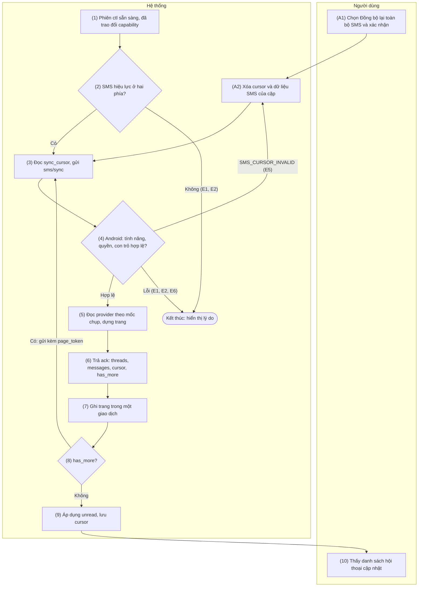
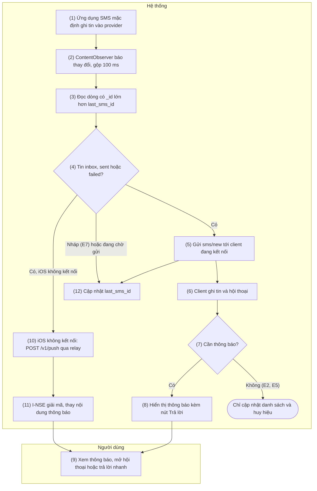
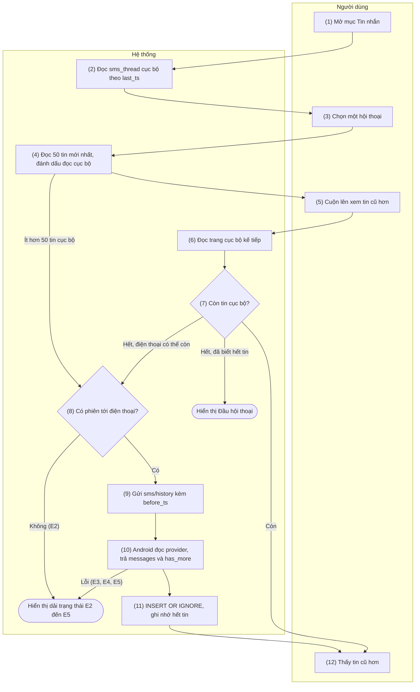
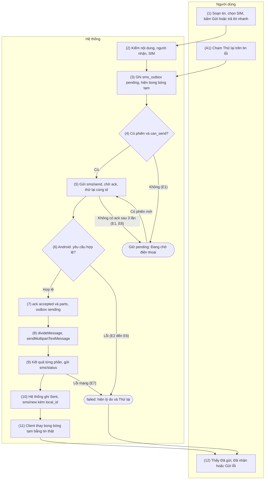
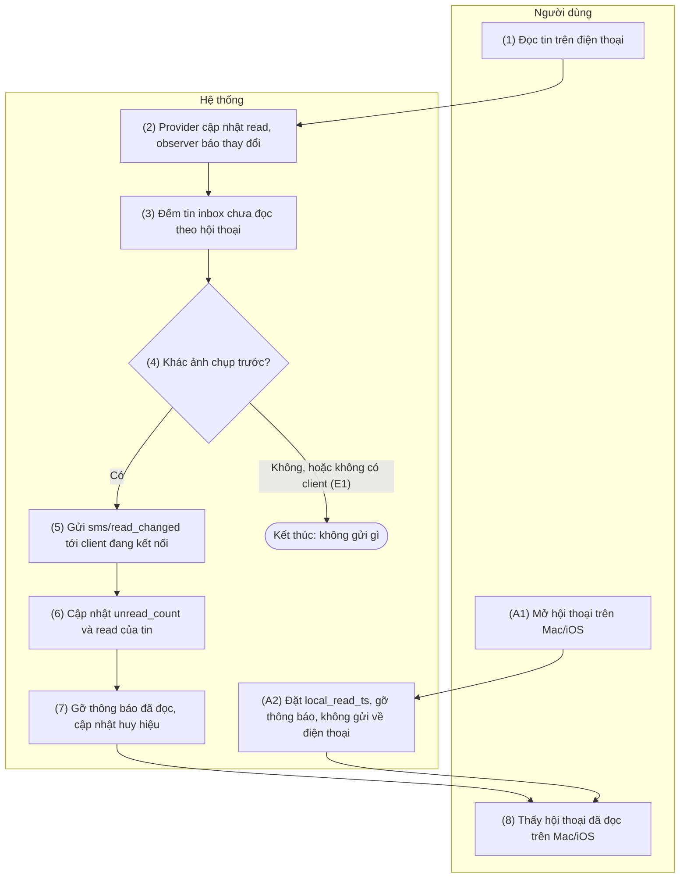

[English](05-sms.md) | Tiếng Việt

# 5. Nhóm chức năng: Tin nhắn SMS

> Tham chiếu chung: [`00-common-specs.md`](00-common-specs.vi.md) — thành phần (0.1), định danh
> `thread_id`, `message_key`, `local_id` (0.2), kiểu dữ liệu (0.3), envelope và `ack` (0.5.1),
> nguyên tắc bảo mật (0.6.5), loại tin `sms` (0.7.1), capability `features.sms` (0.7.2), mã lỗi
> `SMS_*` (0.8.1), nguồn dữ liệu Android (0.9.2), bảng `sms_thread`, `sms_message`, `sms_outbox`,
> `sync_cursor` (0.9.3), khóa `feature.sms`, `sms.notify`, `sms.preview` (0.9.5), hằng số `SMS_*`
> (0.10).
>
> Quy tắc chung của nhóm:
> - Chỉ xử lý SMS. MMS, RCS và tin nháp (`type = 3`) bị bỏ qua (README §4).
> - SMS **hiệu lực** với một cặp khi `feature.sms = true` ở cả hai phía và Android có `READ_SMS`;
>   gửi tin cần thêm `SEND_SMS` (`features.sms.can_send`).
> - Không ghi log nội dung tin, số điện thoại hay tên liên hệ ở bất kỳ thành phần nào; log chỉ gồm
>   `type`, `op`, kích thước, mã lỗi.
> - Lỗi của nhóm SMS được cô lập: không làm dừng A-SVC, không đóng phiên `/v1/ctl`, không ảnh hưởng
>   clipboard hay cuộc gọi.
> - Mọi envelope `sms` đi được trong LAN và qua relay như nhau; relay chỉ thấy `type = sms` và kích
>   thước.

## 5.1 SMS-01 — Đồng bộ hội thoại và lịch sử SMS

### 5.1.1 Thông tin chung

| Mục | Nội dung |
|-----|----------|
| Tên | SMS-01 — Đồng bộ hội thoại và lịch sử SMS |
| Mô tả | Sao chép danh sách hội thoại và tin SMS từ điện thoại sang cơ sở dữ liệu mã hóa trên Mac/iOS, làm nền cho xem ngoại tuyến (SMS-03), thông báo (SMS-02) và trả lời (SMS-04).<br>**Lần đầu** (chưa có con trỏ): 200 hội thoại gần nhất, mỗi hội thoại 50 tin mới nhất.<br>**Đồng bộ bù** (có con trỏ): mọi tin mới hơn con trỏ, kèm tóm tắt các hội thoại bị chạm.<br>Mỗi `ack` chứa tối đa 500 tin; client lặp theo `page_token` tới khi `has_more = false`, rồi lưu con trỏ mới và hòa giải trạng thái chưa đọc.<br>Tự chạy sau mỗi lần kết nối; người dùng có thể yêu cầu "Đồng bộ lại toàn bộ SMS". |
| Tác nhân | Chính: Hệ thống. Phụ: Người dùng (theo dõi tiến độ, yêu cầu đồng bộ lại). Thành phần: M-APP hoặc I-APP, A-SVC, A-SMS, OS (Telephony provider, Contacts provider), R-API (chỉ chuyển tiếp khi đi qua relay). |
| Điều kiện trước | 1. Cặp hiệu lực (PAIR-01).<br>2. Phiên `/v1/ctl` đã bắt tay và hai bên đã trao đổi `capability/hello` (CONN-01 trong LAN hoặc CONN-03 qua relay).<br>3. SMS hiệu lực với cặp.<br>4. Client không có lần đồng bộ SMS nào khác đang chạy cho cặp này. |
| Điều kiện sau | **Thành công:** `sms_thread`, `sms_message` chứa dữ liệu tới mốc chụp của điện thoại; `sync_cursor` (`stream = 'sms'`) giữ con trỏ mới; `unread_count` và cờ `read` khớp điện thoại.<br>**Dừng giữa chừng:** các trang đã ghi được giữ nguyên (ghi lặp không sinh trùng), con trỏ cũ không đổi; lần kết nối sau đồng bộ lại từ con trỏ cũ. |
| Ngoại lệ | E1 — SMS tắt ở một phía: không đồng bộ; nếu Android vẫn nhận `sms/sync` thì trả `FEATURE_DISABLED`.<br>E2 — Điện thoại thiếu `READ_SMS`: `PERMISSION_MISSING` (`details.permission = "android.permission.READ_SMS"`), client hiển thị hướng dẫn SET-01.<br>E3 — Thiếu `READ_CONTACTS`: vẫn đồng bộ, `display_name = null`, client hiển thị số.<br>E4 — Mất kết nối hoặc `TIMEOUT` giữa chừng: dừng, giữ dữ liệu đã ghi, chạy lại ở lần kết nối sau.<br>E5 — Con trỏ hoặc `page_token` không hợp lệ (`SMS_CURSOR_INVALID`): với `page_token` → bắt đầu lại từ con trỏ đang lưu; với con trỏ → tự "Đồng bộ lại toàn bộ SMS" (A2).<br>E6 — Lỗi đọc provider trên Android (`INTERNAL`): thử lại 1 lần sau 5 s, sau đó chờ lần kết nối sau.<br>E7 — Lỗi ghi cơ sở dữ liệu trên client (hết dung lượng, không mở được SQLCipher): hủy giao dịch của trang, dừng, báo lỗi không chặn "Không lưu được tin nhắn trên máy này". |
| Yêu cầu đặc biệt | **Hiệu năng:** lần đầu (tối đa 10 000 tin) xong ≤ 20 s trong LAN, ≤ 40 s qua relay; đồng bộ bù dưới 500 tin xong ≤ 2 s.<br>Danh sách hội thoại hiện dần sau từng trang; ghi cơ sở dữ liệu trên hàng đợi nền, giao diện không bị chặn.<br>Android đọc provider trên luồng nền, không giữ con trỏ provider giữa các trang.<br>**Bảo mật:** dữ liệu chỉ nằm trong `handlive.sqlite` mã hóa SQLCipher (0.6.5); không log nội dung, số, tên.<br>**Tuân thủ:** quyền SMS (`READ_SMS`, `SEND_SMS`) cần Permissions Declaration Form của Google Play theo ngoại lệ "Cross-device synchronization or transfer of SMS or calls" (`docs/deployment-guide.md`); thiết kế phát hiện tin mới bằng `ContentObserver` nên không cần `RECEIVE_SMS`; nếu bị từ chối, Plan B dùng Notification Listener chỉ để nhận tin mới, khi đó không có đồng bộ lịch sử.<br>**Giới hạn v1:** tin bị xóa trên điện thoại không được xóa theo trên Mac/iOS; người dùng dùng "Đồng bộ lại toàn bộ SMS" để làm sạch. |

### 5.1.2 Màn hình

N/A — chưa có wireframe được duyệt.

### 5.1.3 Mô tả chi tiết các thành phần

| # | Trường | Kiểu dữ liệu | Input/Output | Giá trị khởi tạo | Mô tả |
|---|--------|--------------|--------------|------------------|-------|
| 1 | Trạng thái đồng bộ | enum{idle\| syncing\| done\| failed} | Output | `idle` | Dải trạng thái trên đầu danh sách hội thoại: "Đang đồng bộ tin nhắn…", "Đồng bộ lỗi — sẽ thử lại khi kết nối". Ẩn khi `idle` hoặc `done` |
| 2 | Số tin đã tải | int32 | Output | 0 | Chỉ hiện trong lần đồng bộ đầu: "Đã tải 1500 tin" (số không có dấu ngăn nghìn, 0.12.1) |
| 3 | Danh sách hội thoại | array\<object> | Output | Rỗng | Các dòng `sms_thread`, cập nhật sau từng trang; cách hiển thị ở SMS-03 |
| 4 | Lần đồng bộ cuối | timestamp | Output | `sync_cursor.updated_at` | Cài đặt → Tin nhắn; hiển thị tương đối ("5 phút trước") |
| 5 | Nút "Đồng bộ lại toàn bộ SMS" | action | Input | — | Cài đặt → Tin nhắn; vô hiệu khi không có phiên tới điện thoại |
| 6 | Xác nhận đồng bộ lại | enum{Đồng bộ lại\| Hủy} | Input | — | "Xóa tin nhắn đã lưu trên <thiết bị> và tải lại từ điện thoại? Tin đang chờ gửi được giữ lại." |
| 7 | Thông báo lỗi, hướng dẫn | string | Output | Rỗng | Nội dung theo E1, E2, E6, E7; với E2 kèm nút "Xem hướng dẫn" |
| 8 | Gợi ý cấp quyền danh bạ | string | Output | Ẩn | "Cho phép HandLive đọc danh bạ trên điện thoại để hiện tên" khi `permissions_missing` có `READ_CONTACTS` (E3) |

### 5.1.4 Luồng nghiệp vụ



| Bước | Tác nhân | Thành phần | Mô tả | Ngoại lệ / Ghi chú |
|------|----------|-----------|-------|--------------------|
| 1 | Hệ thống | M-APP / I-APP | Phiên `/v1/ctl` chuyển `Connected` (0.11) và đã nhận `capability/hello` của Android. Cũng chạy khi `capability/update` làm SMS chuyển sang hiệu lực (SET-02) và sau A2. | Đang có lần đồng bộ khác của cặp → không chạy thêm. |
| 2 | Hệ thống | M-APP / I-APP | Kiểm SMS hiệu lực: `feature.sms` cục bộ, `features.sms.enabled` của Android, `permissions_missing` không chứa `READ_SMS`. | Không → E1 hoặc E2, hiển thị lý do. |
| 3 | Hệ thống | M-APP / I-APP | Đọc `sync_cursor` của cặp. Gửi `sms/sync` (API 1) với `cursor` (nếu có), `thread_limit = 200`, `per_thread_limit = 50`, và `page_token` của trang trước khi đang lặp. Chờ `ack` tối đa `REQUEST_TIMEOUT`. | Hết hạn hoặc mất kết nối → E4. |
| 4 | Hệ thống | A-SVC | Kiểm `feature.sms`, quyền `READ_SMS`, tham số, giải mã `cursor` và `page_token`. | `FEATURE_DISABLED` (E1), `PERMISSION_MISSING` (E2), `SMS_CURSOR_INVALID` (E5). |
| 5 | Hệ thống | A-SMS, OS | Trang đầu: chụp mốc `snap` = `_id` lớn nhất.<br>Không có con trỏ: lấy tối đa 200 hội thoại mới nhất, mỗi hội thoại tối đa 50 tin SMS có `_id ≤ snap`.<br>Có con trỏ: lấy tin thỏa `(_id > id OR date > t) AND _id ≤ snap` theo `_id` tăng dần.<br>Dựng đối tượng `thread` cho mọi hội thoại có tin trong trang (địa chỉ từ `canonical-addresses`, tên từ `PhoneLookup`, `unread_count` từ tin inbox chưa đọc).<br>Trang dừng khi đủ 500 tin hoặc plaintext đạt 180 KiB. | Lỗi provider → `INTERNAL` (E6). Thiếu `READ_CONTACTS` → E3. |
| 6 | Hệ thống | A-SVC | Trả `ack` `{threads, messages, cursor, page_token?, has_more}`; trang cuối (`has_more = false`) kèm `unread`. |  |
| 7 | Hệ thống | M-APP / I-APP | Ghi cả trang trong một giao dịch: upsert `sms_thread` (giữ `local_read_ts`), upsert `sms_message` (giữ `local_id`). Cập nhật trường 1–3. | Lỗi ghi → E7, hủy giao dịch, dừng. |
| 8 | Hệ thống | M-APP / I-APP | `has_more = true` → quay lại bước 3 với `page_token` mới, giữ nguyên `cursor` gửi đi. |  |
| 9 | Hệ thống | M-APP / I-APP | Trang cuối, cùng giao dịch ở bước 7: áp dụng `unread` (hội thoại vắng mặt → `unread_count = 0` và tin inbox đã đọc; hội thoại có mặt → như SMS-05 bước 6); lưu `cursor` vào `sync_cursor`; đặt trạng thái `done`. Gỡ thông báo của hội thoại đã đọc trên điện thoại (SMS-05). |  |
| 10 | Người dùng | M-APP / I-APP | Thấy danh sách hội thoại đã cập nhật (SMS-03). |  |
| A1 | Người dùng | M-APP / I-APP | Chọn "Đồng bộ lại toàn bộ SMS" và xác nhận (trường 5, 6). | Chỉ khi đang có phiên. |
| A2 | Hệ thống | M-APP / I-APP | Trong một giao dịch: xóa `sync_cursor` (`stream = 'sms'`), `sms_message`, `sms_thread` của cặp và các dòng `sms_outbox` đã hoàn tất; giữ dòng đang chờ gửi. Chuyển sang bước 3 không có con trỏ. | Cũng chạy tự động ở E5 khi con trỏ không hợp lệ. |

### 5.1.5 Đặc tả API/service

**Danh sách lời gọi**

| # | API/service | Kênh | Chiều | Dùng ở bước |
|---|-------------|------|-------|-------------|
| 1 | `WS sms/sync` | `/v1/ctl` (LAN hoặc relay) | C→S, có ack kèm dữ liệu | 3–6, 8 |
| 2 | Dịch vụ hệ điều hành Android: `ContentResolver.query` trên `content://sms`, `content://mms-sms/conversations?simple=true`, `content://mms-sms/canonical-addresses`, `ContactsContract.PhoneLookup.CONTENT_FILTER_URI` | Cục bộ | — | 5 |
| 3 | GRDB `DatabasePool.write` (giao dịch trên SQLCipher) | Cục bộ Mac/iOS | — | 7, 9, A2 |

**Đối tượng dữ liệu dùng chung** — dùng trong `sms/sync`, `sms/history`, `sms/new` của cả nhóm 5.

Đối tượng `thread`:

| Trường | Kiểu | Bắt buộc | Mô tả |
|--------|------|----------|-------|
| `thread_id` | int64 | Có | `thread_id` của Telephony provider (0.2) |
| `addresses` | array\<e164> | Có | Từ `recipient_ids` của hội thoại qua `canonical-addresses`, chuẩn hóa E.164 theo quốc gia của SIM mặc định; chuỗi không chuẩn hóa được (tổng đài ngắn, tên người gửi như `VIETTEL`) giữ nguyên |
| `display_name` | string \| null | Có | Tên liên hệ từ `PhoneLookup`; nhiều địa chỉ → các tên nối bằng `", "`; `null` khi thiếu `READ_CONTACTS` hoặc số không có trong danh bạ |
| `snippet` | string(160) | Có | `body` của tin SMS mới nhất trong hội thoại, cắt 160 ký tự |
| `last_ts` | timestamp | Có | `date` của tin SMS mới nhất trong hội thoại |
| `unread_count` | int32 | Có | Số tin inbox có `read = 0` (chỉ tính SMS) |

Đối tượng `message`:

| Trường | Kiểu | Bắt buộc | Mô tả |
|--------|------|----------|-------|
| `message_key` | string | Có | `sms:<_id>` (0.2) |
| `thread_id` | int64 | Có |  |
| `address` | e164 | Có | Cột `address`, chuẩn hóa như `thread.addresses` |
| `body` | string | Có | Cột `body`; `null` trong provider → `""` |
| `box` | enum{inbox\| sent\| outbox\| failed\| queued} | Có | Theo cột `type`: 1 → `inbox`, 2 → `sent`, 4 → `outbox`, 5 → `failed`, 6 → `queued`; 3 (nháp) không bao giờ được gửi |
| `ts` | timestamp | Có | Cột `date` |
| `ts_sent` | timestamp \| null | Không | Cột `date_sent`; `0` → `null` |
| `read` | bool | Có | Cột `read = 1` |
| `sub_id` | int32 \| null | Không | Cột `sub_id`; `-1` → `null` |
| `local_id` | uuid | Không | Chỉ có trong `sms/new` gửi cho client đã tạo tin (SMS-04) |

#### API 1 — `WS sms/sync`

- **URL:** `wss://{android_host}:{port}/v1/ctl` (LAN) hoặc qua relay `wss://{RELAY_HOST}/v1/relay`
  với lớp bọc `to` /`from`
- **Method:** `WS sms/sync` (C→S), envelope mã hóa, có ack kèm dữ liệu.
- **Request (`data`):**

| Trường | Kiểu | Bắt buộc | Mô tả |
|--------|------|----------|-------|
| `cursor` | string | Không | Con trỏ mờ nhận ở lần đồng bộ trước; vắng → đồng bộ lần đầu |
| `page_token` | string | Không | Lấy từ `ack` trang trước; chỉ gửi khi đang lặp |
| `thread_limit` | int32 | Có | `SMS_SYNC_THREADS` = 200; Android chấp nhận 1–500 |
| `per_thread_limit` | int32 | Có | `SMS_SYNC_PER_THREAD` = 50; Android chấp nhận 1–200 |

- **Response (`ack.data`):**

| Trường | Kiểu | Mô tả |
|--------|------|-------|
| `threads` | array\<thread> | Lần đầu: hội thoại có tin xuất hiện lần đầu trong trang. Đồng bộ bù: mọi hội thoại có tin trong trang |
| `messages` | array\<message> | Tối đa `SMS_PAGE_MAX` = 500 tin; plaintext của `ack` ≤ 180 KiB |
| `cursor` | string | Con trỏ sau khi hoàn tất cả lần đồng bộ (giống nhau ở mọi trang); client chỉ lưu khi `has_more = false` |
| `page_token` | string | Có khi `has_more = true` |
| `has_more` | bool | Còn trang tiếp theo |
| `unread` | array\<object> | Chỉ ở trang cuối: mọi hội thoại có tin chưa đọc trên điện thoại, mỗi mục `{thread_id, unread_count, read_up_to_ts}` với `unread_count ≥ 1` — ý nghĩa như `sms/read_changed` (SMS-05) |

Lỗi (`ack.error.code`): `FEATURE_DISABLED`, `PERMISSION_MISSING`, `BAD_REQUEST` (tham số ngoài giới
hạn), `SMS_CURSOR_INVALID` (`details.reason` = `cursor` hoặc `page_token`), `INTERNAL`.

- **Ví dụ:**

```json
{"op":"sync","data":{"thread_limit":200,"per_thread_limit":50}}
```

```json
{"re":"0192f3e0-1a2b-7c3d-8e4f-5a6b7c8d9e01","ok":true,"data":{"threads":[{"thread_id":42,"addresses":["+84900000123"],"display_name":"Nguyễn Văn A","snippet":"Chiều nay 3h họp nhé","last_ts":1727150000123,"unread_count":1}],"messages":[{"message_key":"sms:12846","thread_id":42,"address":"+84900000123","body":"Chiều nay 3h họp nhé","box":"inbox","ts":1727150000123,"ts_sent":1727149998000,"read":false,"sub_id":1},{"message_key":"sms:12790","thread_id":42,"address":"+84900000123","body":"Ok anh","box":"sent","ts":1727140000000,"ts_sent":null,"read":true,"sub_id":1}],"cursor":"eyJ2IjoxLCJpZCI6MTI4NDYsInQiOjE3MjcxNTAwMDAxMjN9","page_token":"eyJ2IjoxLCJtIjoxMjg0NiwidGgiOls0Miw1Nyw2M10sIm8iOjIwfQ","has_more":true}}
```

Đồng bộ bù, một trang duy nhất (trang cuối kèm `unread`):

```json
{"op":"sync","data":{"cursor":"eyJ2IjoxLCJpZCI6MTI4NDYsInQiOjE3MjcxNTAwMDAxMjN9","thread_limit":200,"per_thread_limit":50}}
```

```json
{"re":"0192f3e0-3c4d-7e5f-9a6b-7c8d9e0f1a23","ok":true,"data":{"threads":[{"thread_id":42,"addresses":["+84900000123"],"display_name":"Nguyễn Văn A","snippet":"Nhớ mang theo tài liệu","last_ts":1727150060456,"unread_count":2}],"messages":[{"message_key":"sms:12847","thread_id":42,"address":"+84900000123","body":"Nhớ mang theo tài liệu","box":"inbox","ts":1727150060456,"ts_sent":1727150059000,"read":false,"sub_id":1}],"cursor":"eyJ2IjoxLCJpZCI6MTI4NDcsInQiOjE3MjcxNTAwNjA0NTZ9","has_more":false,"unread":[{"thread_id":42,"unread_count":2,"read_up_to_ts":1727150000122}]}}
```

- **Logic nghiệp vụ:**
  1. Kiểm theo thứ tự: `feature.sms` → `READ_SMS` → giới hạn tham số → giải mã `cursor` và
     `page_token`.
  2. **Con trỏ** = b64u của JSON `{"v":1,"id":<_id lớn nhất đã phủ>,"t":<date lớn nhất đã phủ>}`.
     Tin cần gửi ở lần đồng bộ bù thỏa `_id > id OR date > t`: vế `date > t` bắt cả tin mới được cấp
     lại `_id` cũ (provider có thể cấp lại `_id` của tin mới nhất sau khi tin đó bị xóa). Client coi
     con trỏ là chuỗi mờ.
  3. **Mốc chụp** `snap` = `_id` lớn nhất lúc xử lý trang đầu; mọi trang chỉ đọc tin `_id ≤ snap`,
     nên số trang ổn định dù có tin mới đến giữa chừng. Tin `_id > snap` đi qua `sms/new` (SMS-02)
     và được phủ lại ở lần đồng bộ sau (ghi upsert nên không trùng).
  4. **`page_token`** = b64u của JSON không trạng thái: lần đầu
     `{"v":1,"m":snap,"th":[thread_id còn lại],"o":số tin đã gửi của hội thoại đầu danh sách}`; đồng
     bộ bù `{"v":1,"m":snap,"a":_id cuối đã gửi}`. Android không giữ trạng thái giữa các trang, nên
     A-SVC khởi động lại giữa chừng không làm hỏng việc lặp. Token sai định dạng hoặc khác `v` →
     `SMS_CURSOR_INVALID` (`page_token`); con trỏ sai định dạng → `SMS_CURSOR_INVALID` (`cursor`).
  5. **Lần đầu:** hội thoại lấy theo `date` giảm dần, tối đa `thread_limit`; hội thoại không có tin
     SMS nào (chỉ MMS) bị bỏ qua nên có thể ít hơn 200. Tin mỗi hội thoại lấy theo `date` giảm dần,
     tối đa `per_thread_limit`; một hội thoại có thể trải qua hai trang, đối tượng `thread` đi cùng
     trang chứa tin đầu tiên của nó. Con trỏ trả về: `id = snap`, `t` = `date` lớn nhất trong các
     tin `_id ≤ snap`.
  6. **Đồng bộ bù:** tin theo `_id` tăng dần; `threads` gồm mọi hội thoại có tin trong trang, tóm
     tắt tính lại từ provider tại thời điểm trả (client ghi đè `snippet`, `last_ts`, `unread_count`,
     `display_name`, `addresses`). Con trỏ trả về: `id = max(id cũ, snap)`,
     `t = max(t cũ, date lớn nhất trong các tin được phủ)`.
  7. Trang dừng khi đạt 500 tin hoặc plaintext 180 KiB, để envelope sau mã hóa và base64 không vượt
     256 KiB (0.5.1 quy tắc 4); một tin đơn lẻ luôn vừa một trang.
  8. `unread` liệt kê mọi hội thoại có tin inbox `read = 0`; client coi hội thoại vắng mặt là đã đọc
     hết. Đây là cách hòa giải trạng thái đọc đã đổi trong lúc client không kết nối (SMS-05).
  9. Tên liên hệ tra theo từng địa chỉ, cache LRU 500 mục trong phạm vi một lần đồng bộ; Android
     không lưu tên xuống đĩa.
  10. Client: mỗi trang một giao dịch; chỉ lưu `cursor` ở trang cuối; `sms/new` đến trong lúc đồng
      bộ được ghi ngay (upsert theo khóa chính, không xung đột); mỗi cặp chỉ chạy một lần đồng bộ
      tại một thời điểm.

#### Query

```text
// [Thiết kế] Android, bước 5: mốc chụp snap (chỉ đọc dòng đầu)
ContentResolver.query(Telephony.Sms.CONTENT_URI, arrayOf("_id"), null, null, "_id DESC")

// [Thiết kế] Android, bước 5 (lần đầu): danh sách hội thoại — đọc tuần tự, dừng khi đủ thread_limit
ContentResolver.query(
    Uri.parse("content://mms-sms/conversations?simple=true"),
    arrayOf("_id", "date", "recipient_ids"),
    null, null, "date DESC")

// [Thiết kế] Android, bước 5: bảng địa chỉ chuẩn, nạp một lần mỗi lần đồng bộ (map _id → address)
ContentResolver.query(
    Uri.parse("content://mms-sms/canonical-addresses"),
    arrayOf("_id", "address"), null, null, null)

// [Thiết kế] Android, bước 5 (lần đầu): tin của một hội thoại — bỏ qua o dòng đầu, đọc tới đủ per_thread_limit
ContentResolver.query(
    Telephony.Sms.CONTENT_URI,
    arrayOf("_id", "thread_id", "address", "body", "type", "date", "date_sent", "read", "sub_id"),
    "thread_id = ? AND _id <= ? AND type IN (1, 2, 4, 5, 6)",
    arrayOf(threadId, snap),
    "date DESC, _id DESC")

// [Thiết kế] Android, bước 5 (đồng bộ bù): tin mới theo con trỏ — đọc tối đa SMS_PAGE_MAX dòng
ContentResolver.query(
    Telephony.Sms.CONTENT_URI,
    arrayOf("_id", "thread_id", "address", "body", "type", "date", "date_sent", "read", "sub_id"),
    "(_id > ? OR date > ?) AND _id > ? AND _id <= ? AND type IN (1, 2, 4, 5, 6)",
    arrayOf(cursorId, cursorT, afterId, snap),
    "_id ASC")

// [Thiết kế] Android, bước 5: t của con trỏ mới (chỉ đọc dòng đầu; đồng bộ bù thêm điều kiện (_id > ? OR date > ?))
ContentResolver.query(
    Telephony.Sms.CONTENT_URI, arrayOf("date"),
    "_id <= ? AND type IN (1, 2, 4, 5, 6)", arrayOf(snap), "date DESC")

// [Thiết kế] Android, bước 5 (đồng bộ bù): recipient_ids của các hội thoại bị chạm
ContentResolver.query(
    Uri.parse("content://mms-sms/conversations?simple=true"),
    arrayOf("_id", "recipient_ids"), "_id IN (?, ?, ?)", threadIds, null)

// [Thiết kế] Android, bước 5: tin SMS mới nhất của một hội thoại → snippet, last_ts (chỉ đọc dòng đầu)
ContentResolver.query(
    Telephony.Sms.CONTENT_URI, arrayOf("body", "date"),
    "thread_id = ? AND type IN (1, 2, 4, 5, 6)", arrayOf(threadId), "date DESC, _id DESC")

// [Thiết kế] Android, bước 5 và 6: tin inbox chưa đọc → unread_count và unread (gom theo thread_id trong bộ nhớ)
ContentResolver.query(
    Telephony.Sms.CONTENT_URI, arrayOf("thread_id", "date"),
    "type = 1 AND read = 0", null, null)

// [Thiết kế] Android, bước 5: tên liên hệ của một địa chỉ (chỉ đọc dòng đầu)
ContentResolver.query(
    Uri.withAppendedPath(ContactsContract.PhoneLookup.CONTENT_FILTER_URI, Uri.encode(address)),
    arrayOf(ContactsContract.PhoneLookup.DISPLAY_NAME), null, null, null)
```

Android không dựa vào `LIMIT` trong `sortOrder`; số dòng được giới hạn bằng cách dừng đọc con trỏ.

```sql
-- [Thiết kế] Mac/iOS, bước 3: con trỏ hiện tại
SELECT cursor FROM sync_cursor WHERE pair_id = :pair_id AND stream = 'sms';

-- [Thiết kế] Mac/iOS, bước 7: upsert hội thoại, giữ local_read_ts
INSERT INTO sms_thread (pair_id, thread_id, addresses_json, display_name, snippet, last_ts, unread_count)
VALUES (:pair_id, :thread_id, :addresses_json, :display_name, :snippet, :last_ts, :unread_count)
ON CONFLICT (pair_id, thread_id) DO UPDATE SET
  addresses_json = excluded.addresses_json,
  display_name   = excluded.display_name,
  snippet        = excluded.snippet,
  last_ts        = excluded.last_ts,
  unread_count   = excluded.unread_count;

-- [Thiết kế] Mac/iOS, bước 7: upsert tin, giữ local_id đã gắn (SMS-04)
INSERT INTO sms_message (pair_id, message_key, thread_id, address, body, box, ts, ts_sent, read, sub_id)
VALUES (:pair_id, :message_key, :thread_id, :address, :body, :box, :ts, :ts_sent, :read, :sub_id)
ON CONFLICT (pair_id, message_key) DO UPDATE SET
  thread_id = excluded.thread_id, address = excluded.address, body = excluded.body,
  box = excluded.box, ts = excluded.ts, ts_sent = excluded.ts_sent,
  read = excluded.read, sub_id = excluded.sub_id;

-- [Thiết kế] Mac/iOS, bước 9: hội thoại không có trong unread → đã đọc hết
UPDATE sms_thread SET unread_count = 0
WHERE pair_id = :pair_id AND unread_count <> 0 AND thread_id NOT IN (:unread_thread_ids);
UPDATE sms_message SET read = 1
WHERE pair_id = :pair_id AND box = 'inbox' AND read = 0 AND thread_id NOT IN (:unread_thread_ids);
-- Mỗi mục có trong unread: áp dụng như SMS-05 (5.5.5, Query, bước 6).

-- [Thiết kế] Mac/iOS, bước 9: lưu con trỏ
INSERT INTO sync_cursor (pair_id, stream, cursor, updated_at)
VALUES (:pair_id, 'sms', :cursor, :now)
ON CONFLICT (pair_id, stream) DO UPDATE SET cursor = excluded.cursor, updated_at = excluded.updated_at;

-- [Thiết kế] Mac/iOS, A2 (một giao dịch): đồng bộ lại toàn bộ, giữ tin đang chờ gửi
DELETE FROM sync_cursor WHERE pair_id = :pair_id AND stream = 'sms';
DELETE FROM sms_outbox
WHERE pair_id = :pair_id
  AND (state IN ('sent', 'delivered')
       OR local_id IN (SELECT local_id FROM sms_message
                       WHERE pair_id = :pair_id AND local_id IS NOT NULL));
DELETE FROM sms_message WHERE pair_id = :pair_id;
DELETE FROM sms_thread  WHERE pair_id = :pair_id;
```

---

## 5.2 SMS-02 — Nhận thông báo SMS mới

### 5.2.1 Thông tin chung

| Mục | Nội dung |
|-----|----------|
| Tên | SMS-02 — Nhận thông báo SMS mới |
| Mô tả | Khi điện thoại có tin SMS mới (nhận về, gửi đi từ chính điện thoại, hoặc tin HandLive vừa gửi hộ ở SMS-04), A-SMS phát hiện qua `ContentObserver` trên `content://sms` và gửi `sms/new` tới mọi client đang kết nối có SMS hiệu lực.<br>Client lưu tin, cập nhật hội thoại và hiển thị thông báo hệ thống có ô trả lời nhanh (SMS-04). iPhone/iPad không có phiên (I-APP bị treo nền) được đánh thức bằng push qua relay; I-NSE giải mã và hiển thị nội dung nếu máy đang mở khóa.<br>Mac không kết nối không nhận push, bù bằng SMS-01 khi kết nối lại. |
| Tác nhân | Chính: Người dùng (nhận và xử lý thông báo). Hệ thống: A-SMS, A-SVC, OS (Telephony provider, `UNUserNotificationCenter`), M-APP, I-APP, I-NSE, R-API, PUSH (APNs). |
| Điều kiện trước | 1.<br>SMS hiệu lực với ít nhất một cặp; A-SVC đang chạy và A-SMS đã đăng ký observer.<br>2.<br>Để nhận ngay: client có phiên `/v1/ctl` (CONN-01/CONN-03); riêng iOS có thể nhận qua push nếu đã đăng ký push (CONN-04) và `features.sms.notify = true`.<br>3.<br>Người dùng đã cho phép HandLive hiển thị thông báo trên Mac/iOS (SET-03). |
| Điều kiện sau | Tin và tóm tắt hội thoại có trong `sms_message`, `sms_thread` của mọi client đang kết nối; thông báo được hiển thị theo `sms.notify` và `sms.preview`; `sms_observer_state.last_sms_id` = `_id` lớn nhất đã xử lý. Client không kết nối nhận tin ở lần SMS-01 kế tiếp. |
| Ngoại lệ | E1 — Không có client nào kết nối và không cặp nào cần push: chỉ cập nhật `last_sms_id`.<br>E2 — `sms.notify = false` trên client: lưu tin, không thông báo.<br>E3 — Relay hoặc APNs lỗi: xử lý theo CONN-04 (`push_outbox`, thử lại tới khi hết hạn); iOS vẫn nhận tin qua SMS-01.<br>E4 — iPhone đang khóa: I-NSE không đọc được khóa (Keychain `WhenUnlockedThisDeviceOnly`) → hiển thị "Tin nhắn SMS mới", không có nút trả lời.<br>E5 — Người dùng tắt quyền thông báo của HandLive: chỉ cập nhật danh sách và huy hiệu.<br>E6 — Mất `READ_SMS` khi đang chạy: gỡ observer, gửi `capability/update` với `permissions_missing`; client hiển thị hướng dẫn.<br>E7 — Dòng mới là tin nháp: bỏ qua. |
| Yêu cầu đặc biệt | **Hiệu năng:** từ `ContentObserver.onChange` đầu tiên của lượt gộp (không quan sát được lúc provider ghi tin) tới khi Mac hiện thông báo < 500 ms trong LAN (gộp `onChange` 100 ms, truy vấn ≤ 50 ms), ≤ 1 s qua relay, cả hai xét ở phân vị 95; push iOS phụ thuộc APNs.<br>**Riêng tư:** nội dung push mà relay và APNs thấy luôn chung chung; nội dung thật nằm trong envelope mã hóa bằng `K_push`. `sms.preview = false` ẩn nội dung tin khỏi thông báo.<br>**Tin cậy:** observer chạy trong A-SVC (foreground service); `last_sms_id` lưu bền nên khởi động lại không phát lại tin cũ và không bỏ sót tin mới.<br>**Tuân thủ:** như SMS-01 (Permissions Declaration Form; Plan B Notification Listener chỉ nhận tin). |

### 5.2.2 Màn hình

N/A — chưa có wireframe được duyệt.

### 5.2.3 Mô tả chi tiết các thành phần

| # | Trường | Kiểu dữ liệu | Input/Output | Giá trị khởi tạo | Mô tả |
|---|--------|--------------|--------------|------------------|-------|
| 1 | Tiêu đề thông báo | string | Output | `display_name`; `null` → số định dạng quốc gia | Hội thoại nhiều người: các tên nối bằng ", " |
| 2 | Nội dung thông báo | string | Output | `body` | `sms.preview = false` hoặc iPhone đang khóa → "Tin nhắn SMS mới" |
| 3 | Nhãn SIM | string | Output | Ẩn | Dòng phụ = `label` của SIM theo `sub_id`, chỉ khi điện thoại có > 1 SIM |
| 4 | Nút "Trả lời" | action + string(1600) | Input | — | Ô nhập trả lời nhanh trong thông báo → SMS-04; không có với hội thoại nhiều người |
| 5 | Chạm vào thông báo | action | Input | — | Mở hội thoại (SMS-03) |
| 6 | Huy hiệu chưa đọc | int32 | Output | 0 | Số hội thoại hiển thị chưa đọc (quy tắc SMS-05); trên biểu tượng menu bar (Mac) và biểu tượng ứng dụng (iOS) |
| 7 | Tùy chọn "Thông báo SMS mới" | bool | Input/Output | `sms.notify` = `true` | Cài đặt → Tin nhắn (SET-02) |
| 8 | Tùy chọn "Hiện nội dung trong thông báo" | bool | Input/Output | `sms.preview` = `true` | Cài đặt → Tin nhắn (SET-02) |

### 5.2.4 Luồng nghiệp vụ



| Bước | Tác nhân | Thành phần | Mô tả | Ngoại lệ / Ghi chú |
|------|----------|-----------|-------|--------------------|
| 1 | Hệ thống | OS | Ứng dụng SMS mặc định nhận tin và ghi vào `content://sms`; hoặc người dùng gửi tin từ điện thoại; hoặc hệ thống ghi tin HandLive vừa gửi vào hộp Sent (SMS-04). |  |
| 2 | Hệ thống | A-SMS | `ContentObserver.onChange` (API 3); gộp các lần gọi trong 100 ms rồi xử lý tuần tự trên luồng nền. |  |
| 3 | Hệ thống | A-SMS | Đọc `last_sms_id`; nếu `_id` lớn nhất hiện tại nhỏ hơn thì hạ `last_sms_id` xuống (tin mới nhất đã bị xóa). Đọc các dòng `_id > last_sms_id` theo `_id` tăng dần và kiểm lại các dòng đang chờ gửi (tập `pending_out`). | Lỗi provider → ghi mã lỗi, xử lý lại ở lần `onChange` sau. |
| 4 | Hệ thống | A-SMS | Phân loại theo `type`: `inbox`, `sent`, `failed` → phát; `outbox`, `queued` → đưa vào `pending_out`, phát khi chuyển sang `sent` hoặc `failed`; nháp → bỏ qua. | E7. |
| 5 | Hệ thống | A-SVC | Dựng `message` và `thread` (5.1.5); gắn `local_id` nếu khớp tin do client gửi (SMS-04); gửi `sms/new` (API 1) tới từng client đang có phiên và SMS hiệu lực. | Không có client nào → E1. |
| 6 | Hệ thống | M-APP / I-APP | Upsert `sms_message`, `sms_thread` trong một giao dịch; có `local_id` → bong bóng tạm được thay bằng tin thật (SMS-04). Cập nhật danh sách, huy hiệu. |  |
| 7 | Hệ thống | M-APP / I-APP | Chỉ thông báo khi: `box = inbox`, `sms.notify = true`, có quyền thông báo, và hội thoại không đang mở ở cửa sổ đang được dùng. | Không → E2, E5 (X1). |
| 8 | Hệ thống | M-APP / I-APP, OS | Tạo thông báo (API 4): tiêu đề, nội dung theo `sms.preview`, nhóm theo hội thoại, nút "Trả lời". |  |
| 9 | Người dùng | M-APP / I-APP / I-NSE | Xem thông báo; chạm để mở hội thoại (SMS-03) hoặc trả lời nhanh (SMS-04). |  |
| 10 | Hệ thống | A-SVC, R-API, PUSH | Với mỗi cặp iOS/iPadOS không có phiên, SMS hiệu lực theo capability gần nhất và `features.sms.notify = true`, khi tin là `inbox`: dựng envelope `sms/new` mã hóa bằng `K_push`, gọi `POST /v1/push` `kind = alert` (API 2, CONN-04). | Relay lỗi → E3 (`push_outbox`). |
| 11 | Hệ thống | I-NSE | Nhận push. Máy đang mở khóa: đọc `PRK`, tính `K_push`, giải mã, thay tiêu đề và nội dung như bước 8, đặt `threadIdentifier` (API 4), gắn danh mục có nút "Trả lời". Máy đang khóa hoặc giải mã lỗi: giữ nội dung chung chung. | E4. |
| 12 | Hệ thống | A-SMS | Ghi `last_sms_id` = `_id` lớn nhất đã xử lý (kể cả dòng bỏ qua), không chờ client. Sau đó chạy phần tính trạng thái đọc (SMS-05 bước 3). |  |

### 5.2.5 Đặc tả API/service

**Danh sách lời gọi**

| # | API/service | Kênh | Chiều | Dùng ở bước |
|---|-------------|------|-------|-------------|
| 1 | `WS sms/new` | `/v1/ctl` (LAN hoặc relay) | S→C | 5, 6 |
| 2 | `POST /v1/push` (đặc tả đầy đủ ở CONN-04) | REST relay → APNs | A-SVC → R-API → PUSH | 10, 11 |
| 3 | `ContentResolver.registerContentObserver` trên `content://sms` | Cục bộ Android | OS → A-SMS | 2, 3, 4, 12 |
| 4 | Thông báo cục bộ `UNUserNotificationCenter` và danh mục `HL_SMS` | Cục bộ Mac/iOS, I-NSE | — | 8, 11 |

#### API 1 — `WS sms/new`

- **URL:** `wss://{android_host}:{port}/v1/ctl` (LAN) hoặc qua relay `wss://{RELAY_HOST}/v1/relay`
  với lớp bọc `to` /`from`
- **Method:** `WS sms/new` (S→C), envelope mã hóa, không ack (0.7.1).
- **Request (`data`):**

| Trường | Kiểu | Bắt buộc | Mô tả |
|--------|------|----------|-------|
| `message` | message (5.1.5) | Có | Tin mới; `local_id` chỉ có trong envelope gửi cho client đã tạo tin |
| `thread` | thread (5.1.5) | Có | Tóm tắt hội thoại sau khi có tin này |

- **Response:** N/A (không ack; tin bị lỡ do mất kết nối được bù ở SMS-01).
- **Ví dụ:**

```json
{"op":"new","data":{"message":{"message_key":"sms:12847","thread_id":42,"address":"+84900000123","body":"Nhớ mang theo tài liệu","box":"inbox","ts":1727150060456,"ts_sent":1727150059000,"read":false,"sub_id":1},"thread":{"thread_id":42,"addresses":["+84900000123"],"display_name":"Nguyễn Văn A","snippet":"Nhớ mang theo tài liệu","last_ts":1727150060456,"unread_count":2}}}
```

- **Logic nghiệp vụ:**
  1. Mỗi phiên nhận một envelope riêng (mã hóa theo khóa của phiên), theo thứ tự `_id` tăng dần.
  2. `local_id` chỉ gắn vào envelope gửi cho cặp đã tạo tin (SMS-04 API 4); các client khác nhận tin
     như tin gửi từ điện thoại.
  3. Cùng `message_key` có thể được gửi lại (dòng trong `pending_out` chuyển sang `sent` /`failed`);
     client upsert nên không trùng.
  4. Client: `thread_id` chưa có → tạo hội thoại từ `thread`; tin `box` khác `inbox` không tạo thông
     báo.
  5. Client không thông báo cho tin đến qua SMS-01 (tránh dồn thông báo hàng loạt khi kết nối lại);
     chỉ cập nhật danh sách và huy hiệu.

#### API 2 — `POST /v1/push`

- **URL:** `https://{RELAY_HOST}/v1/push`
- **Method:** `POST`, header `Authorization: Bearer <jwt>` (JWT của Android, 0.6.4).
- **Request:** cấu trúc đầy đủ ở CONN-04. Giá trị dùng cho SMS (tên trường theo CONN-04):

| Trường | Giá trị cho SMS |
|--------|-----------------|
| `pair_id` | Cặp của iPhone/iPad đích |
| `to` | `device_id` của iPhone/iPad |
| `kind` | `alert` |
| `reason` | `sms_new` |
| `env_b64` | Envelope `sms/new` (API 1, không có `local_id`) mã hóa bằng `K_push`, dạng base64 chuẩn có padding, ≤ 3 000 ký tự (logic 3) |
| `collapse_key` | Chính `message_key` (ví dụ `sms:12847`) — relay và APNs gộp các lần gửi lặp của cùng một tin |
| `ttl_s` | 86 400 |

- **Response:** theo CONN-04. Lỗi relay liên quan: 409 `PUSH_TOKEN_MISSING` (bỏ qua, iOS bù qua
  SMS-01), 403 `NOT_PAIRED` (cặp đã thu hồi — PAIR-03), 429 `RATE_LIMITED` và 502
  `PUSH_PROVIDER_ERROR` (ghi `push_outbox`, thử lại).
- **Ví dụ (minh họa):**

```http
POST /v1/push HTTP/1.1
Host: relay.example.com
Authorization: Bearer <jwt>
Content-Type: application/json

{"pair_id":"7a6b5c4d-3e2f-4a1b-9c8d-7e6f5a4b3c2d","to":"2c3d4e5f-6a7b-8c9d-8e0f-1a2b3c4d5e6f","kind":"alert","reason":"sms_new","env_b64":"<b64: envelope sms/new mã hóa bằng K_push>","collapse_key":"sms:12847","ttl_s":86400}
```

- **Logic nghiệp vụ:**
  1. Chỉ push khi đủ mọi điều kiện: đối phương là iOS/iPadOS, không có phiên `/v1/ctl`,
     `relay_registered = 1`, capability gần nhất có `features.sms.enabled = true` và
     `features.sms.notify = true`, tin có `box = inbox`.
  2. Nội dung APNs mặc định (hiện khi I-NSE không giải mã được) là không đặt tiêu đề (hệ thống hiện
     tên app), nội dung "Tin nhắn SMS mới"; không chứa số điện thoại hay nội dung tin.
  3. Payload APNs ≤ 4 KB (0.4.4): Android cắt `message.body` còn tối đa 1 000 ký tự tại ranh giới
     code point, kết thúc bằng "…". Nếu `env_b64` vẫn dài hơn 3 000 ký tự thì rút gọn tiếp
     `message.body`, rồi `thread.snippet`, tại ranh giới code point, mỗi lần kết thúc bằng "…"
     (CONN-04 bước 5b). Nội dung đầy đủ đến qua SMS-01 khi I-APP kết nối.
  4. Push lỗi tạm thời → ghi `push_outbox` (0.9.1), thử lại theo CONN-04; quá hạn thì bỏ.
  5. Mac không bao giờ nhận push (0.4.4).

#### API 3 — `ContentObserver` trên `content://sms`

- **URL:** `content://sms` (`Telephony.Sms.CONTENT_URI`)
- **Method:** `ContentResolver.registerContentObserver(uri, true, observer)` (theo dõi cả URI con);
  callback `ContentObserver.onChange(selfChange, uri)`; gỡ bằng
  `ContentResolver.unregisterContentObserver(observer)`.
- **Request:** N/A. A-SMS đăng ký khi A-SVC khởi động, `feature.sms = true` và có `READ_SMS`; gỡ khi
  tắt tính năng hoặc mất quyền (E6).
- **Response:** `onChange` không kèm dữ liệu tin; A-SMS luôn truy vấn lại provider.
- **Ví dụ:** `onChange` lúc `t0` → hẹn xử lý tại `t0 + 100 ms`; `last_sms_id = 12846` → truy vấn
  `_id > 12846` được dòng `12847` (`type = 1`) → phát `sms/new` → ghi `last_sms_id = 12847`.
- **Logic nghiệp vụ:**
  1. Lần chạy đầu (chưa có dòng `sms_observer_state`): đặt `last_sms_id` = `_id` lớn nhất hiện tại,
     không phát tin cũ (lịch sử đi qua SMS-01).
  2. Gộp các `onChange` trong 100 ms; một luồng xử lý tuần tự, không chạy chồng.
  3. Không dựa vào `uri` trong callback (có thể `null` hoặc chỉ là URI cha); luôn truy vấn theo
     `last_sms_id`.
  4. `_id` lớn nhất < `last_sms_id` → đặt `last_sms_id` = `_id` lớn nhất (tin mới nhất đã bị xóa và
     `_id` có thể được cấp lại).
  5. `pending_out` (trong bộ nhớ): `_id` của dòng `outbox` /`queued`, kiểm lại mỗi lần `onChange`,
     phát khi chuyển sang `sent` /`failed`, bỏ sau 10 phút.
  6. Cùng observer phục vụ SMS-04 (dòng hệ thống ghi sau khi gửi) và SMS-05 (thay đổi cột `read`);
     phần tin mới luôn chạy trước để giữ mục tiêu < 500 ms.
  7. Mọi ngoại lệ trong xử lý được bắt và ghi mã lỗi; observer không làm dừng A-SVC.

#### API 4 — Thông báo SMS trên Mac/iOS

- **URL:** N/A
- **Method:** `UNUserNotificationCenter.add(_:withCompletionHandler:)` với `UNNotificationRequest`
  (M-APP, I-APP khi đang chạy); danh mục đăng ký lúc khởi động bằng `setNotificationCategories(_:)`;
  I-NSE thay nội dung trong `UNNotificationServiceExtension.didReceive(_:withContentHandler:)`.
- **Request (nội dung thông báo):**

| Thuộc tính | Giá trị |
|------------|---------|
| `identifier` | `sms:<pair_id>:<message_key>` (thông báo do push tạo: định danh do hệ thống đặt) |
| `title` | Trường 1 |
| `subtitle` | Trường 3, rỗng nếu chỉ có 1 SIM |
| `body` | Trường 2 |
| `threadIdentifier` | `sms:<pair_id>:<thread_id>` — gom thông báo theo hội thoại; với push, I-NSE đặt sau khi giải mã (`thread-id` của APNs là nhóm chung `sms`, CONN-04 API 4) |
| `categoryIdentifier` | `HL_SMS`, có hành động `HL_SMS_REPLY` (`UNTextInputNotificationAction`, tiêu đề "Trả lời", nút "Gửi", chữ gợi ý trong ô nhập "Tin nhắn SMS") và `HL_SMS_MARK_READ` (`UNNotificationAction`, tiêu đề "Đánh dấu đã đọc", không `.foreground`: đặt `local_read_ts` trên máy này theo SMS-05 và gỡ thông báo của hội thoại); hội thoại nhiều người dùng `HL_SMS_GROUP` (logic 2) |
| `userInfo` | `{pair_id, thread_id, message_key, ts, address, sub_id}` — dùng cho trả lời nhanh (SMS-04) và gỡ thông báo (SMS-05) |
| `sound` | `UNNotificationSound.default` |

- **Response:** completion handler trả lỗi khi không có quyền thông báo → E5, bỏ qua.
- **Ví dụ:**

```json
{"identifier":"sms:3f2b1c4d-5e6f-4a7b-8c9d-0e1f2a3b4c5d:sms:12847","title":"Nguyễn Văn A","subtitle":"","body":"Nhớ mang theo tài liệu","threadIdentifier":"sms:3f2b1c4d-5e6f-4a7b-8c9d-0e1f2a3b4c5d:42","categoryIdentifier":"HL_SMS","userInfo":{"pair_id":"3f2b1c4d-5e6f-4a7b-8c9d-0e1f2a3b4c5d","thread_id":42,"message_key":"sms:12847","ts":1727150060456,"address":"+84900000123","sub_id":1}}
```

- **Logic nghiệp vụ:**
  1. Không tạo thông báo khi `box` khác `inbox`, `sms.notify = false`, hoặc hội thoại đang mở ở cửa
     sổ đang được dùng.
  2. Hội thoại nhiều địa chỉ dùng danh mục `HL_SMS_GROUP`, chỉ có `HL_SMS_MARK_READ` (v1 không trả
     lời hội thoại nhóm — SMS-04 E9).
  3. I-NSE đọc `sms.preview` từ `UserDefaults` của App Group, không ghi cơ sở dữ liệu (0.9.3); không
     đọc được khóa hoặc giải mã lỗi → giữ nội dung mặc định và nhóm chung `sms`, không đặt danh mục (E4).
  4. Thông báo được gỡ khi hội thoại đã đọc trên điện thoại (SMS-05) hoặc được mở trên thiết bị
     (SMS-03).

#### Query

```text
// [Thiết kế] Android, bước 3: _id lớn nhất hiện tại (chỉ đọc dòng đầu)
ContentResolver.query(Telephony.Sms.CONTENT_URI, arrayOf("_id"), null, null, "_id DESC")

// [Thiết kế] Android, bước 3: các dòng mới
ContentResolver.query(
    Telephony.Sms.CONTENT_URI,
    arrayOf("_id", "thread_id", "address", "body", "type", "date", "date_sent", "read", "sub_id"),
    "_id > ?", arrayOf(lastSmsId), "_id ASC")

// [Thiết kế] Android, bước 3: kiểm lại các dòng trong pending_out
ContentResolver.query(
    Telephony.Sms.CONTENT_URI,
    arrayOf("_id", "thread_id", "address", "body", "type", "date", "date_sent", "read", "sub_id"),
    "_id IN (?, ?)", pendingIds, null)

// [Thiết kế] Android, bước 5: tóm tắt hội thoại — dùng lại các query "recipient_ids", "tin SMS mới nhất",
// "tin inbox chưa đọc" (thêm điều kiện thread_id = ?) và PhoneLookup ở 5.1.5
```

```sql
-- [Thiết kế] Android, bước 3: mốc đã xử lý
SELECT last_sms_id FROM sms_observer_state WHERE id = 1;

-- [Thiết kế] Android, bước 12 và API 3 (logic 1, 4): ghi mốc, tạo dòng ở lần chạy đầu
INSERT INTO sms_observer_state (id, last_sms_id, updated_at)
VALUES (1, :last_sms_id, :now)
ON CONFLICT (id) DO UPDATE SET last_sms_id = excluded.last_sms_id, updated_at = excluded.updated_at;

-- [Thiết kế] Android, bước 10: cặp iOS/iPadOS có thể cần push (lọc tiếp theo phiên và features_json trong bộ nhớ)
SELECT pair_id, peer_device_id, features_json
FROM paired_device
WHERE revoked_at IS NULL AND relay_registered = 1 AND peer_platform IN ('ios', 'ipados');

-- [Thiết kế] Mac/iOS, bước 6: upsert hội thoại như 5.1.5; upsert tin kèm local_id
INSERT INTO sms_message (pair_id, message_key, thread_id, address, body, box, ts, ts_sent, read, sub_id, local_id)
VALUES (:pair_id, :message_key, :thread_id, :address, :body, :box, :ts, :ts_sent, :read, :sub_id, :local_id)
ON CONFLICT (pair_id, message_key) DO UPDATE SET
  thread_id = excluded.thread_id, address = excluded.address, body = excluded.body,
  box = excluded.box, ts = excluded.ts, ts_sent = excluded.ts_sent,
  read = excluded.read, sub_id = excluded.sub_id,
  local_id = COALESCE(excluded.local_id, sms_message.local_id);

-- [Thiết kế] Mac/iOS, bước 6: huy hiệu = số hội thoại hiển thị chưa đọc
SELECT COUNT(*) AS unread_threads
FROM sms_thread
WHERE pair_id = :pair_id AND unread_count > 0 AND local_read_ts < last_ts;
```

Ghi `push_outbox` khi push lỗi: xem CONN-04.

---

## 5.3 SMS-03 — Xem hội thoại và tải tin cũ hơn

### 5.3.1 Thông tin chung

| Mục | Nội dung |
|-----|----------|
| Tên | SMS-03 — Xem hội thoại và tải tin cũ hơn |
| Mô tả | Người dùng xem danh sách hội thoại và nội dung từng hội thoại trên Mac/iOS.<br>Mọi thao tác đọc lấy từ cơ sở dữ liệu cục bộ (SQLCipher), nên xem được cả khi không kết nối điện thoại.<br>Khi người dùng cuộn tới tin cũ nhất đang có trên máy và điện thoại có thể còn tin cũ hơn, client gửi `sms/history` để tải thêm từng trang 50 tin và chèn vào cơ sở dữ liệu.<br>Mở một hội thoại đánh dấu đã đọc cục bộ và gỡ thông báo của hội thoại đó (SMS-05). |
| Tác nhân | Chính: Người dùng. Hệ thống: M-APP / I-APP, A-SVC, A-SMS, OS (Telephony provider), R-API (chỉ chuyển tiếp khi đi qua relay). |
| Điều kiện trước | 1. Cặp hiệu lực. 2. Có dữ liệu từ SMS-01 hoặc SMS-02 (nếu chưa, hiển thị trạng thái trống). 3. Tải tin cũ hơn cần phiên `/v1/ctl` và SMS hiệu lực. |
| Điều kiện sau | Danh sách và hội thoại hiển thị đúng dữ liệu cục bộ; tin cũ tải thêm được lưu vào `sms_message` (không trùng, không ghi đè); `sms_thread.local_read_ts` của hội thoại vừa mở = `last_ts`; thông báo của hội thoại đó bị gỡ. |
| Ngoại lệ | E1 — Chưa có hội thoại: trạng thái trống "Chưa có tin nhắn" · "Tin nhắn từ điện thoại sẽ hiện ở đây sau lần đồng bộ đầu tiên." kèm trạng thái đồng bộ SMS-01.<br>E2 — Không có phiên tới điện thoại khi cần tải thêm: dải "Kết nối điện thoại để tải tin cũ hơn"; khi kết nối lại mà người dùng vẫn ở đầu hội thoại thì tự tải.<br>E3 — `SMS_THREAD_NOT_FOUND`: hội thoại đã bị xóa trên điện thoại → giữ dữ liệu cục bộ, dải "Hội thoại không còn trên điện thoại", không tải thêm.<br>E4 — `TIMEOUT` hoặc `INTERNAL`: dải lỗi "Không tải được tin cũ hơn" kèm nút "Thử lại".<br>E5 — `FEATURE_DISABLED`, `PERMISSION_MISSING`: hiển thị lý do như SMS-01 E1, E2.<br>E6 — Lỗi đọc cơ sở dữ liệu cục bộ: báo lỗi, cho thử lại. |
| Yêu cầu đặc biệt | **Hiệu năng:** mở danh sách hoặc một hội thoại ≤ 200 ms (đọc theo trang, dùng chỉ mục `idx_sms_message_thread_ts`); một trang `sms/history` ≤ 1 s trong LAN; cuộn mượt với hội thoại hàng chục nghìn tin (trang 50 tin, phân trang keyset).<br>**Khả dụng:** mỗi bong bóng có nhãn VoiceOver gồm người gửi, thời điểm, trạng thái: "{sender}, {time}" với tin nhận, "Bạn, {time}, {status}" với tin gửi (`{sender}` là trường 2, hoặc số người gửi dạng quốc gia trong hội thoại nhiều người; `{time}` do formatter của hệ thống định dạng; `{status}` là chữ của trường 8). Nội dung tin là giá trị trợ năng của bong bóng, đọc sau nhãn; theo cỡ chữ hệ thống (Dynamic Type trên iOS); thời điểm hiển thị theo múi giờ của thiết bị.<br>**Riêng tư:** chỉ đọc từ cơ sở dữ liệu mã hóa; tin tải thêm không đi qua bộ nhớ đệm nào khác. |

### 5.3.2 Màn hình

N/A — chưa có wireframe được duyệt.

### 5.3.3 Mô tả chi tiết các thành phần

| # | Trường | Kiểu dữ liệu | Input/Output | Giá trị khởi tạo | Mô tả |
|---|--------|--------------|--------------|------------------|-------|
| 1 | Danh sách hội thoại | array\<object> | Output | Rỗng | Sắp theo `last_ts` giảm dần; tải 50 dòng mỗi lần |
| 2 | Tên hội thoại | string | Output | `display_name`; `null` → số định dạng quốc gia | Hội thoại nhiều người: tên hoặc số nối bằng ", " |
| 3 | Đoạn trích | string(160) | Output | `snippet` | Tối đa 2 dòng |
| 4 | Thời điểm tin cuối | timestamp | Output | `last_ts` | "14:05", "Hôm qua", "12/09" |
| 5 | Chỉ báo chưa đọc | bool | Output | `unread_count > 0` và `local_read_ts < last_ts` | Chấm màu và chữ đậm; không hiện số trong dòng — số hội thoại chưa đọc ở biểu tượng thanh menu (Mac) và huy hiệu tab Tin nhắn (iOS) |
| 6 | Bong bóng tin | string | Output | `body` | Tin `inbox` bên trái, tin gửi đi bên phải; nhận diện liên kết và số điện thoại trong nội dung |
| 7 | Thời điểm tin | timestamp | Output | `ts` | Tin nhóm theo ngày |
| 8 | Trạng thái tin gửi đi | enum{pending\| sending\| sent\| delivered\| failed} | Output | Theo `sms_outbox.state` hoặc `box` | "Đang chờ điện thoại", "Đang gửi…", "Đã gửi", "Đã nhận", "Gửi lỗi" (SMS-04) |
| 9 | Nhãn SIM | string | Output | Ẩn | Hiện khi điện thoại có > 1 SIM, theo `sub_id` |
| 10 | Chỉ báo "Đang tải tin cũ hơn" | bool | Output | `false` | Ở đầu hội thoại khi đang chờ `sms/history` |
| 11 | Dải trạng thái hội thoại | string | Output | Ẩn | Theo E2–E5; nút "Thử lại" với E4; "Đầu hội thoại" khi đã hết tin |
| 12 | Ô soạn tin | string(1600) | Input | Rỗng | Xem SMS-04; ẩn với hội thoại nhiều người |

### 5.3.4 Luồng nghiệp vụ



| Bước | Tác nhân | Thành phần | Mô tả | Ngoại lệ / Ghi chú |
|------|----------|-----------|-------|--------------------|
| 1 | Người dùng | M-APP / I-APP | Mở mục "Tin nhắn" (Mac: cửa sổ Tin nhắn từ menu bar; iOS: tab Tin nhắn). |  |
| 2 | Hệ thống | M-APP / I-APP | Đọc `sms_thread` của cặp theo `last_ts` giảm dần, 50 dòng mỗi lần; theo dõi thay đổi (GRDB `ValueObservation`) để cập nhật khi SMS-01, 02, 05 ghi dữ liệu. | Không có dòng → E1. Lỗi đọc → E6. |
| 3 | Người dùng | M-APP / I-APP | Chọn một hội thoại. |  |
| 4 | Hệ thống | M-APP / I-APP | Đọc 50 tin mới nhất cục bộ và các bong bóng `sms_outbox` chưa khớp tin thật (SMS-04); đặt `local_read_ts = last_ts`, gỡ thông báo của hội thoại (SMS-05 A2). Có ít hơn 50 tin cục bộ và hội thoại chưa được đánh dấu "đã hết tin" → sang bước 8 ngay. |  |
| 5 | Người dùng | M-APP / I-APP | Cuộn lên xem tin cũ hơn. |  |
| 6 | Hệ thống | M-APP / I-APP | Đọc trang cục bộ kế tiếp (keyset theo `ts`, `message_key`). |  |
| 7 | Hệ thống | M-APP / I-APP | Trang cục bộ có dữ liệu → hiển thị (bước 12). Hết tin cục bộ: hội thoại đã được đánh dấu "đã hết tin" (trong bộ nhớ, theo `thread_id`) → hiển thị "Đầu hội thoại"; ngược lại → bước 8. |  |
| 8 | Hệ thống | M-APP / I-APP | Kiểm phiên tới điện thoại và SMS hiệu lực. | Không → E2. |
| 9 | Hệ thống | M-APP / I-APP | Gửi `sms/history` (API 1) `{thread_id, before_ts, limit: 50}` với `before_ts` = `ts` nhỏ nhất của hội thoại trong cơ sở dữ liệu cục bộ (không có tin → thời điểm hiện tại); hiện trường 10. Mỗi hội thoại chỉ có một yêu cầu đang chờ. |  |
| 10 | Hệ thống | A-SVC, A-SMS | Kiểm tính năng, quyền, hội thoại còn tồn tại; đọc tối đa 50 tin `date < before_ts` theo `date` giảm dần; trả `{messages, has_more}`. | `SMS_THREAD_NOT_FOUND` (E3), `TIMEOUT` hoặc `INTERNAL` (E4), E5. |
| 11 | Hệ thống | M-APP / I-APP | `INSERT OR IGNORE` các tin trong một giao dịch; `has_more = false` → đánh dấu "đã hết tin" trong bộ nhớ. |  |
| 12 | Người dùng | M-APP / I-APP | Thấy tin cũ hơn; vị trí cuộn được giữ nguyên. |  |

### 5.3.5 Đặc tả API/service

**Danh sách lời gọi**

| # | API/service | Kênh | Chiều | Dùng ở bước |
|---|-------------|------|-------|-------------|
| 1 | `WS sms/history` | `/v1/ctl` (LAN hoặc relay) | C→S, có ack kèm dữ liệu | 9, 10, 11 |
| 2 | Dịch vụ cục bộ: `ContentResolver.query` (Android); GRDB `ValueObservation` và `DatabasePool.read` (Mac/iOS); gỡ thông báo theo 5.5.5 API 2 | Cục bộ | — | 2, 4, 6, 10 |

#### API 1 — `WS sms/history`

- **URL:** `wss://{android_host}:{port}/v1/ctl` (LAN) hoặc qua relay `wss://{RELAY_HOST}/v1/relay`
  với lớp bọc `to` /`from`
- **Method:** `WS sms/history` (C→S), envelope mã hóa, có ack kèm dữ liệu.
- **Request (`data`):**

| Trường | Kiểu | Bắt buộc | Mô tả |
|--------|------|----------|-------|
| `thread_id` | int64 | Có | Hội thoại cần tải thêm |
| `before_ts` | timestamp | Có | Chỉ lấy tin có `date` nhỏ hơn giá trị này |
| `limit` | int32 | Có | `SMS_HISTORY_PAGE` = 50; Android chấp nhận 1–200 |

- **Response (`ack.data`):**

| Trường | Kiểu | Mô tả |
|--------|------|-------|
| `messages` | array\<message> (5.1.5) | Theo `date` giảm dần; không có `local_id` |
| `has_more` | bool | Còn tin cũ hơn tin cuối cùng của trang |

Lỗi (`ack.error.code`): `SMS_THREAD_NOT_FOUND`, `FEATURE_DISABLED`, `PERMISSION_MISSING`,
`BAD_REQUEST`, `INTERNAL`.

- **Ví dụ:**

```json
{"op":"history","data":{"thread_id":42,"before_ts":1727140000000,"limit":50}}
{"re":"0192f3e1-2b3c-7d4e-9f50-6a7b8c9d0e12","ok":true,"data":{"messages":[{"message_key":"sms:12611","thread_id":42,"address":"+84900000123","body":"Anh gửi em file báo cáo nhé","box":"inbox","ts":1727052000000,"ts_sent":1727051998000,"read":true,"sub_id":1}],"has_more":false}}
{"re":"0192f3e1-2b3c-7d4e-9f50-6a7b8c9d0e12","ok":false,"error":{"code":"SMS_THREAD_NOT_FOUND","message":"Conversation no longer exists on the phone","details":{}}}
```

- **Logic nghiệp vụ:**
  1. Kiểm theo thứ tự: `feature.sms` → `READ_SMS` → tham số → hội thoại còn trong
     `content://mms-sms/conversations?simple=true` (`SMS_THREAD_NOT_FOUND`).
  2. Chọn tin `thread_id = ? AND date < before_ts` (chỉ SMS, bỏ nháp) theo `date DESC, _id DESC`,
     đọc tối đa `limit` dòng; nếu các dòng ngay sau dòng cuối có cùng `date` thì trả thêm cho hết
     nhóm đó, để lần sau dùng `date <` không bỏ sót tin trùng mili-giây.
  3. Dừng sớm khi plaintext đạt 180 KiB (như SMS-01); khi đó `has_more = true`.
  4. `has_more` xác định bằng cách đọc thêm một dòng sau trang.
  5. Không trả tóm tắt hội thoại và không đổi con trỏ đồng bộ (tin cũ đã nằm dưới con trỏ).
  6. Client: `INSERT OR IGNORE` (không ghi đè dữ liệu đã có, kể cả `local_id`); `has_more = false` →
     ghi nhớ "đã hết tin" trong bộ nhớ tới khi ứng dụng khởi động lại hoặc đồng bộ lại toàn bộ; E3
     cũng được ghi nhớ như "đã hết tin".

#### Query

```text
// [Thiết kế] Android, bước 10: kiểm hội thoại còn tồn tại
ContentResolver.query(
    Uri.parse("content://mms-sms/conversations?simple=true"),
    arrayOf("_id"), "_id = ?", arrayOf(threadId), null)

// [Thiết kế] Android, bước 10: trang tin cũ hơn — đọc limit + 1 dòng, cộng nhóm trùng date ở ranh giới
ContentResolver.query(
    Telephony.Sms.CONTENT_URI,
    arrayOf("_id", "thread_id", "address", "body", "type", "date", "date_sent", "read", "sub_id"),
    "thread_id = ? AND date < ? AND type IN (1, 2, 4, 5, 6)",
    arrayOf(threadId, beforeTs),
    "date DESC, _id DESC")
```

```sql
-- [Thiết kế] Mac/iOS, bước 2: danh sách hội thoại (trang sau truyền dòng cuối của trang trước)
SELECT thread_id, addresses_json, display_name, snippet, last_ts, unread_count,
       (unread_count > 0 AND local_read_ts < last_ts) AS is_unread
FROM sms_thread
WHERE pair_id = :pair_id
  AND (:after_ts IS NULL OR (last_ts, thread_id) < (:after_ts, :after_thread_id))
ORDER BY last_ts DESC, thread_id DESC
LIMIT 50;

-- [Thiết kế] Mac/iOS, bước 4 và 6: trang tin cục bộ (keyset), kèm trạng thái gửi của tin tạo từ thiết bị này
SELECT m.message_key, m.address, m.body, m.box, m.ts, m.ts_sent, m.read, m.sub_id,
       m.local_id, o.state AS send_state
FROM sms_message m
LEFT JOIN sms_outbox o ON o.local_id = m.local_id
WHERE m.pair_id = :pair_id AND m.thread_id = :thread_id
  AND (:before_ts IS NULL OR (m.ts, m.message_key) < (:before_ts, :before_key))
ORDER BY m.ts DESC, m.message_key DESC
LIMIT 50;

-- [Thiết kế] Mac/iOS, bước 4: bong bóng tạm chưa khớp tin thật (SMS-04)
SELECT o.local_id, o.body, o.state, o.last_error, o.created_at
FROM sms_outbox o
WHERE o.pair_id = :pair_id AND o.thread_id = :thread_id
  AND NOT EXISTS (SELECT 1 FROM sms_message m
                  WHERE m.pair_id = o.pair_id AND m.local_id = o.local_id)
ORDER BY o.created_at;

-- [Thiết kế] Mac/iOS, bước 4: đánh dấu đã đọc cục bộ
UPDATE sms_thread SET local_read_ts = last_ts
WHERE pair_id = :pair_id AND thread_id = :thread_id;

-- [Thiết kế] Mac/iOS, bước 9: before_ts
SELECT MIN(ts) AS before_ts
FROM sms_message
WHERE pair_id = :pair_id AND thread_id = :thread_id;

-- [Thiết kế] Mac/iOS, bước 11: chèn tin cũ, không ghi đè
INSERT OR IGNORE INTO sms_message (pair_id, message_key, thread_id, address, body, box, ts, ts_sent, read, sub_id)
VALUES (:pair_id, :message_key, :thread_id, :address, :body, :box, :ts, :ts_sent, :read, :sub_id);
```

---

## 5.4 SMS-04 — Gửi và trả lời SMS từ Mac/iOS

### 5.4.1 Thông tin chung

| Mục | Nội dung |
|-----|----------|
| Tên | SMS-04 — Gửi và trả lời SMS từ Mac/iOS |
| Mô tả | Người dùng soạn tin trong một hội thoại, tới một số mới, hoặc trả lời nhanh ngay trong thông báo.<br>Client ghi tin vào hàng đợi `sms_outbox` và hiển thị bong bóng tạm, rồi gửi `sms/send` tới điện thoại.<br>Android kiểm tra, trả `ack` `{accepted, parts}`, gửi bằng `SmsManager` qua SIM được chọn và báo tiến trình bằng `sms/status` (`sending` → `sent` → `delivered`, hoặc `failed`).<br>Hệ thống Android tự ghi tin đã gửi vào hộp Sent; observer của SMS-02 phát `sms/new` kèm `local_id` để client thay bong bóng tạm bằng tin thật.<br>Khi không có phiên, tin chờ trong hàng đợi. |
| Tác nhân | Chính: Người dùng. Hệ thống: M-APP / I-APP, A-SVC, A-SMS, OS (`SmsManager`, `SubscriptionManager`, `UNUserNotificationCenter`), R-API (chỉ chuyển tiếp khi đi qua relay). |
| Điều kiện trước | 1. Cặp hiệu lực; SMS hiệu lực và `features.sms.can_send = true` (Android có `SEND_SMS`).<br>2. Điện thoại có ít nhất một SIM hoạt động.<br>3. Gửi ngay cần phiên `/v1/ctl`; không có phiên thì tin được xếp hàng. |
| Điều kiện sau | **Thành công:** tin nằm trong hộp Sent của điện thoại và trong `sms_message` (`box = sent`, `local_id` = mã tạm); `sms_outbox.state` = `sent` hoặc `delivered`.<br>**Thất bại:** `sms_outbox.state = failed`, `last_error` = mã lỗi, bong bóng có nút "Thử lại".<br>**Chưa gửi:** `state = pending` ("Đang chờ điện thoại") tới khi có phiên hoặc quá 24 h. |
| Ngoại lệ | E1 — Không có phiên, hoặc không có `ack` sau 3 lần thử lại: giữ `pending`, gửi lại khi có phiên mới; quá 24 h → `failed` (`NOT_CONNECTED`).<br>E2 — `FEATURE_DISABLED`.<br>E3 — `PERMISSION_MISSING` (`SEND_SMS`) hoặc `can_send = false`: lý do hiện là "Thiếu quyền SMS trên điện thoại" (câu của PAIR-02 trường 8).<br>E4 — `SMS_INVALID_ADDRESS`.<br>E5 — Nội dung rỗng (`BAD_REQUEST`) hoặc quá 1 600 ký tự (`PAYLOAD_TOO_LARGE`); client chặn trước khi gửi.<br>E6 — `SMS_SIM_UNAVAILABLE`: SIM được chọn không hoạt động, hoặc máy nhiều SIM mà không xác định được SIM mặc định → client mở bộ chọn SIM.<br>E7 — Gửi thất bại ở mạng: `SMS_NO_SERVICE`, `SMS_RADIO_OFF`, `SMS_LIMIT_EXCEEDED`, `SMS_GENERIC_FAILURE` → `failed`, nút "Thử lại".<br>E8 — Trả lời nhanh trên iOS không nhận được `ack` trong khoảng 20 s: giữ `pending`, hiện thông báo cục bộ "Chưa gửi được, mở HandLive để thử lại."<br>E9 — Hội thoại nhiều người nhận: v1 không cho trả lời từ Mac/iOS.<br>E10 — Nhà mạng không gửi báo phát: trạng thái dừng ở "Đã gửi". |
| Yêu cầu đặc biệt | **Hiệu năng:** bong bóng tạm hiện ≤ 100 ms sau khi bấm Gửi; `ack` ≤ 300 ms trong LAN; "Đã gửi" ≤ 2 s trong điều kiện sóng bình thường (mục tiêu Phase 2).<br>**Không gửi trùng:** thử lại dùng lại cùng `id` envelope; Android chống trùng theo `id` (0.5.1) và theo `local_id` trong 24 h; client không tự gửi lại tin đã được `accepted`.<br>**Riêng tư:** không log nội dung, số nhận; hàng đợi nằm trong cơ sở dữ liệu SQLCipher.<br>**Chi phí:** tin dài bị chia nhiều phần, mỗi phần tính cước như một SMS; client hiển thị số phần ước tính trước khi gửi.<br>**Tuân thủ:** `SEND_SMS` cần Permissions Declaration Form; nếu bị từ chối (Plan B), `can_send = false` và client ẩn ô soạn tin. |

### 5.4.2 Màn hình

N/A — chưa có wireframe được duyệt.

### 5.4.3 Mô tả chi tiết các thành phần

| # | Trường | Kiểu dữ liệu | Input/Output | Giá trị khởi tạo | Mô tả |
|---|--------|--------------|--------------|------------------|-------|
| 1 | Người nhận | e164 | Input | Rỗng | Nhãn "Đến:"; chỉ với "Tin nhắn mới": nhập số hoặc chọn từ hội thoại có sẵn; kiểm sơ bộ (chữ số, dấu `+`, 3–15 ký tự) trước khi gửi |
| 2 | Nội dung tin | string(1600) | Input | Rỗng | Không cho gửi khi rỗng hoặc chỉ có khoảng trắng |
| 3 | Bộ đếm ký tự và số phần | string | Output | "0/160" | Ước tính: bảng mã GSM-7 160 ký tự một phần (153 ký tự mỗi phần khi nhiều phần); có ký tự ngoài GSM-7 (ví dụ tiếng Việt có dấu) → 70 (67 mỗi phần). Hiển thị "{used}/{limit} · {parts}", trong đó `{parts}` là "1 tin" hoặc "{count} tin" (chuỗi số nhiều, 0.12.1); ô trống hiện "0/160". `{used}` là số ký tự của tin. `{limit}` là sức chứa của số phần hiện có: 160 cho một phần GSM-7, 153 × số phần khi nhiều phần; 70 cho một phần có ký tự ngoài GSM-7, 67 × số phần khi nhiều phần. Ví dụ "120/160 · 1 tin", "230/306 · 2 tin" |
| 4 | SIM gửi | int32 (`sub_id`) | Input/Output | `features.sms.default_sub_id` | Chỉ hiện khi `features.sms.sims` có > 1 SIM; hiển thị theo `label`; bộ chọn SIM (E6 cũng mở) có tiêu đề "Chọn SIM" |
| 5 | Nút "Gửi" | action | Input | — | Vô hiệu khi E5 hoặc `can_send = false` |
| 6 | Bong bóng tạm | string | Output | — | Nội dung vừa gửi, hiện ngay; biến mất khi tin thật đến |
| 7 | Trạng thái gửi | enum{pending\| sending\| sent\| delivered\| failed} | Output | `pending` | "Đang chờ điện thoại", "Đang gửi…", "Đã gửi", "Đã nhận", "Gửi lỗi" |
| 8 | Lý do lỗi | string | Output | Ẩn | Theo mã lỗi: "Không có sóng", "Điện thoại đang ở chế độ máy bay", "Số không hợp lệ", "SIM không hoạt động", "Thiếu quyền SMS trên điện thoại", "Đã vượt giới hạn gửi, thử lại sau.", "Gửi không thành công", "Không kết nối được điện thoại" |
| 9 | Nút "Thử lại" | action | Input | — | Trên bong bóng `failed`; tạo `local_id` mới |
| 10 | Ô trả lời nhanh | string(1600) | Input | Rỗng | Trong thông báo của SMS-02 (hành động `HL_SMS_REPLY`) |
| 11 | Thông báo "Chưa gửi được" | string | Output | — | Chỉ iOS (E8): "Chưa gửi được, mở HandLive để thử lại." |

### 5.4.4 Luồng nghiệp vụ



| Bước | Tác nhân | Thành phần | Mô tả | Ngoại lệ / Ghi chú |
|------|----------|-----------|-------|--------------------|
| 1 | Người dùng | M-APP / I-APP | Soạn trong hội thoại (người nhận = địa chỉ của hội thoại), hoặc "Tin nhắn mới" (nhập số), hoặc trả lời nhanh trong thông báo (API 5). Chọn SIM nếu có > 1 SIM. Bấm "Gửi". | Hội thoại nhiều người → không có ô soạn (E9). |
| 2 | Hệ thống | M-APP / I-APP | Kiểm: nội dung sau khi bỏ khoảng trắng đầu và cuối không rỗng, ≤ 1 600 ký tự; người nhận có dạng số; SIM thuộc `features.sms.sims` (mặc định `default_sub_id`; trả lời nhanh dùng SIM của tin gốc). | E5; số sai dạng → báo ngay tại ô người nhận. |
| 3 | Hệ thống | M-APP / I-APP | Sinh `local_id` (UUIDv7); ghi `sms_outbox` với `state = pending`, `thread_id` (null với số mới), `addresses_json`, `body`, `sub_id`; hiện bong bóng tạm "Đang chờ điện thoại". |  |
| 4 | Hệ thống | M-APP / I-APP | Kiểm phiên `/v1/ctl` và `can_send`. | Không có phiên → E1. `can_send = false` → E3. |
| 5 | Hệ thống | M-APP / I-APP | Sinh `id` envelope, gửi `sms/send` (API 1), tăng `attempts`. Không có `ack` trong `REQUEST_TIMEOUT` → gửi lại **cùng `id`** sau 5 s, 15 s, 45 s (`SMS_OUTBOX_RETRY`). Khi có phiên mới, các dòng `pending` được gửi lại theo thứ tự `created_at`. | Hết 3 lần → E1; trả lời nhanh trên iOS → E8. |
| 6 | Hệ thống | A-SVC, A-SMS | Kiểm theo thứ tự: `feature.sms`, `SEND_SMS`, tham số, người nhận (libphonenumber → E.164), nội dung, SIM; chống trùng theo `id` và `local_id`. | `ack` lỗi → client đặt `failed` và `last_error` (E2–E6). |
| 7 | Hệ thống | A-SVC, M-APP / I-APP | Android trả `ack` `{accepted: true, parts}`; client đặt `state = sending`, hiện "Đang gửi…". |  |
| 8 | Hệ thống | A-SMS, OS | Ghi `local_id` vào `SendRegistry`; chia tin bằng `divideMessage`, gửi bằng `sendMultipartTextMessage` qua `SmsManager` của `sub_id` (API 3), mỗi phần một PendingIntent "sent" và "delivered". Gửi `sms/status` `sending`. |  |
| 9 | Hệ thống | A-SMS, A-SVC | Nhận kết quả từng phần: mọi phần `RESULT_OK` → `sms/status` `sent`; mọi phần có báo phát thành công → `delivered`; phần đầu tiên lỗi → `failed` kèm `error_code` (API 2). Client cập nhật `sms_outbox.state`. | E7, E10. |
| 10 | Hệ thống | OS, A-SMS | Hệ thống Android ghi tin vào hộp Sent (hoặc `failed`); observer SMS-02 thấy dòng mới, khớp `SendRegistry` (cùng địa chỉ, cùng nội dung, trong 60 s sau kết quả cuối) và gửi `sms/new` kèm `message.local_id` cho client đã gửi (API 4). | Không khớp được → client khớp dự phòng (API 4, logic 3). |
| 11 | Hệ thống | M-APP / I-APP | Upsert tin thật có `local_id` → bong bóng tạm biến mất, tin thật hiển thị với trạng thái lấy từ `sms_outbox` theo `local_id`. Tin tới số mới: màn hình soạn chuyển sang hội thoại vừa tạo. |  |
| 12 | Người dùng | M-APP / I-APP | Thấy "Đã gửi" hoặc "Đã nhận"; hoặc "Gửi lỗi" kèm lý do và "Thử lại". |  |
| A1 | Người dùng | M-APP / I-APP | Chạm "Thử lại" trên tin lỗi: xóa dòng `sms_outbox` cũ, tạo `local_id` mới, quay lại bước 3 với cùng nội dung, người nhận, SIM. | Nếu điện thoại đã ghi tin lỗi (`box = failed`), tin đó vẫn hiển thị như trên điện thoại. |
| B1 | Người dùng | I-APP | iOS: nhập trả lời trong thông báo khi I-APP đang treo nền. |  |
| B2 | Hệ thống | I-APP | Hệ thống đánh thức I-APP ở nền để xử lý hành động; I-APP xin thời gian chạy nền, ghi `sms_outbox`, kết nối (CONN-01 trong LAN hoặc CONN-03 qua relay) và gửi như bước 5. |  |
| B3 | Hệ thống | I-APP | Có `ack` trong khoảng 20 s → kết thúc tác vụ nền (trạng thái tiếp theo cập nhật khi ứng dụng kết nối lại). Không có → giữ `pending`, hiện trường 11, kết thúc tác vụ nền. | E8. |

### 5.4.5 Đặc tả API/service

**Danh sách lời gọi**

| # | API/service | Kênh | Chiều | Dùng ở bước |
|---|-------------|------|-------|-------------|
| 1 | `WS sms/send` | `/v1/ctl` (LAN hoặc relay) | C→S, có ack | 5, 6, 7, B2 |
| 2 | `WS sms/status` | `/v1/ctl` (LAN hoặc relay) | S→C | 8, 9 |
| 3 | `SmsManager.divideMessage` và `SmsManager.sendMultipartTextMessage` | Cục bộ Android | A-SMS → OS | 8, 9 |
| 4 | `WS sms/new` kèm `local_id` (đặc tả chính ở 5.2.5 API 1) | `/v1/ctl` (LAN hoặc relay) | S→C | 10, 11 |
| 5 | Trả lời nhanh từ thông báo (`UNTextInputNotificationAction`) | Cục bộ Mac/iOS | OS → M-APP / I-APP | 1, B1–B3 |
| 6 | Dịch vụ hệ điều hành Android: `SubscriptionManager.getActiveSubscriptionInfoList`, `SmsManager.getDefaultSmsSubscriptionId`, libphonenumber `PhoneNumberUtil` | Cục bộ | — | 6 |

#### API 1 — `WS sms/send`

- **URL:** `wss://{android_host}:{port}/v1/ctl` (LAN) hoặc qua relay `wss://{RELAY_HOST}/v1/relay`
  với lớp bọc `to` /`from`
- **Method:** `WS sms/send` (C→S), envelope mã hóa, có ack.
- **Request (`data`):**

| Trường | Kiểu | Bắt buộc | Mô tả |
|--------|------|----------|-------|
| `local_id` | uuid | Có | Mã tạm do client sinh; khóa chống trùng phía Android |
| `thread_id` | int64 | Không | Hội thoại đang soạn; Android chỉ ghi nhận, không bắt buộc còn tồn tại (người nhận là căn cứ) |
| `addresses` | array\<string> | Có | Đúng 1 phần tử ở v1 |
| `body` | string(1600) | Có | Không rỗng |
| `sub_id` | int32 | Không | SIM gửi; vắng → SIM SMS mặc định của điện thoại |

- **Response (`ack.data`):**

| Trường | Kiểu | Mô tả |
|--------|------|-------|
| `accepted` | bool | Luôn `true` khi `ok = true` |
| `parts` | int32 | Số phần sau `divideMessage` |

Lỗi (`ack.error.code`), theo thứ tự kiểm:

| Mã | Khi nào |
|----|---------|
| `FEATURE_DISABLED` | `feature.sms = false` trên Android |
| `PERMISSION_MISSING` | Thiếu `SEND_SMS`; `details.permission = "android.permission.SEND_SMS"` |
| `BAD_REQUEST` | Thiếu trường, `addresses` không đúng 1 phần tử, `body` rỗng |
| `PAYLOAD_TOO_LARGE` | `body` > 1 600 ký tự |
| `SMS_INVALID_ADDRESS` | Không chuẩn hóa được thành E.164 và không phải số tổng đài ngắn |
| `SMS_SIM_UNAVAILABLE` | `sub_id` không thuộc SIM đang hoạt động, hoặc vắng `sub_id` mà không xác định được SIM; `details.sims` = các `sub_id` hợp lệ |

- **Ví dụ:**

```json
{"op":"send","data":{"local_id":"0192f3e2-4b5c-7d6e-9f70-8a9b0c1d2e3f","thread_id":42,"addresses":["+84900000123"],"body":"Ok, 3h mình có mặt","sub_id":1}}
{"re":"0192f3e2-5c6d-7e7f-8a9b-0c1d2e3f4a5b","ok":true,"data":{"accepted":true,"parts":1}}
{"re":"0192f3e2-5c6d-7e7f-8a9b-0c1d2e3f4a5b","ok":false,"error":{"code":"SMS_SIM_UNAVAILABLE","message":"Selected SIM is not active","details":{"sims":[1]}}}
```

- **Logic nghiệp vụ:**
  1. `ack` được gửi ngay sau khi kiểm xong, **trước** khi radio gửi; kết quả gửi đi qua
     `sms/status`.
  2. Chuẩn hóa người nhận bằng libphonenumber với vùng = quốc gia của SIM gửi: số hợp lệ → E.164;
     chuỗi 3–8 chữ số → giữ nguyên (tổng đài ngắn); còn lại → `SMS_INVALID_ADDRESS`.
  3. Chọn SIM: có `sub_id` → phải thuộc danh sách SIM hoạt động; vắng →
     `SmsManager.getDefaultSmsSubscriptionId()`; giá trị này không hợp lệ (máy đặt "luôn hỏi") mà
     chỉ có 1 SIM → dùng SIM đó, nhiều SIM → `SMS_SIM_UNAVAILABLE`. Danh sách SIM hoạt động
     (`SubscriptionManager.getActiveSubscriptionInfoList()`) cần `READ_PHONE_STATE`; thiếu quyền →
     `features.sms.sims` rỗng, chỉ nhận yêu cầu không có `sub_id` và gửi bằng SIM mặc định.
  4. Chống trùng: `id` đã xử lý trong `DEDUP_WINDOW` → gửi lại `ack` cũ (0.5.1). `local_id` đã có
     trong `SendRegistry` → trả `{accepted: true, parts}` như lần đầu, không gửi lại, rồi phát lại
     `sms/status` hiện tại.
  5. `SendRegistry` (trong bộ nhớ A-SMS, tối đa 1 000 mục, giữ 24 h): `local_id` → `pair_id`, địa
     chỉ E.164, `body`, `parts`, trạng thái từng phần, `message_key` khi đã khớp, các mốc thời gian.
     Mất khi A-SVC khởi động lại; trường hợp hiếm này một lần gửi lại có thể tạo tin trùng.
  6. Client: `ok = false` → `state = failed`, `last_error = code`; `ok = true` → `state = sending`.
     Tin ở `sending` không được client gửi lại; khi có phiên mới, Android phát lại `sms/status` của
     mọi mục `SendRegistry` thuộc cặp đó.
  7. `id` envelope của lần gửi đầu được giữ trong bộ nhớ để thử lại; sau khi client khởi động lại
     thì dùng `id` mới, Android vẫn chống trùng theo `local_id`.

#### API 2 — `WS sms/status`

- **URL:** như API 1
- **Method:** `WS sms/status` (S→C), envelope mã hóa, không ack.
- **Request (`data`):**

| Trường | Kiểu | Bắt buộc | Mô tả |
|--------|------|----------|-------|
| `local_id` | uuid | Có | Của `sms/send` tương ứng |
| `message_key` | string | Không | Có khi đã khớp được dòng trong provider |
| `status` | enum{sending\| sent\| delivered\| failed} | Có |  |
| `error_code` | enum{SMS_NO_SERVICE\| SMS_RADIO_OFF\| SMS_LIMIT_EXCEEDED\| SMS_GENERIC_FAILURE} | Khi `failed` | Mã lỗi 0.8.1 |

- **Response:** N/A.
- **Ví dụ:**

```json
{"op":"status","data":{"local_id":"0192f3e2-4b5c-7d6e-9f70-8a9b0c1d2e3f","status":"sending"}}
{"op":"status","data":{"local_id":"0192f3e2-4b5c-7d6e-9f70-8a9b0c1d2e3f","message_key":"sms:12848","status":"sent"}}
{"op":"status","data":{"local_id":"0192f3e2-4b5c-7d6e-9f70-8a9b0c1d2e3f","status":"failed","error_code":"SMS_NO_SERVICE"}}
```

- **Logic nghiệp vụ:**
  1. `sending`: ngay sau khi gọi `sendMultipartTextMessage`. `sent`: mọi phần báo `RESULT_OK`.
     `delivered`: mọi phần có báo phát thành công (nếu nhà mạng hỗ trợ). `failed`: phần đầu tiên báo
     lỗi; kết quả sau đó của cùng `local_id` bị bỏ qua.
  2. Client chỉ cho trạng thái đi tiến (`pending` → `sending` → `sent` → `delivered`; `pending` hoặc
     `sending` → `failed`); bản tin trùng hoặc đi lùi bị bỏ qua. Báo phát thất bại sau khi đã `sent`
     không hạ trạng thái.
  3. Chỉ gửi tới phiên của cặp đã tạo tin; cặp không kết nối → giữ trong `SendRegistry`, phát khi có
     phiên mới.

#### API 3 — `SmsManager.divideMessage` và `SmsManager.sendMultipartTextMessage`

- **URL:** N/A
- **Method:** `SmsManager.divideMessage(body)` rồi
  `SmsManager.sendMultipartTextMessage(destinationAddress, scAddress, parts, sentIntents, deliveryIntents)`
  trên `SmsManager` của SIM:
  `context.getSystemService(SmsManager::class.java).createForSubscriptionId(subId)` (API 31+) hoặc
  `SmsManager.getSmsManagerForSubscriptionId(subId)` (API 29–30).
- **Request:**

| Tham số | Kiểu | Giá trị |
|---------|------|---------|
| `destinationAddress` | String | Người nhận đã chuẩn hóa |
| `scAddress` | String | `null` (dùng SMSC mặc định của SIM) |
| `parts` | ArrayList\<String> | Kết quả `divideMessage` |
| `sentIntents` | ArrayList\<PendingIntent> | Mỗi phần một intent, extra `local_id`, `part_index`, `part_count` |
| `deliveryIntents` | ArrayList\<PendingIntent> | Như trên, cho báo phát |

- **Response:** kết quả mỗi phần về receiver nội bộ qua `sentIntents`; ánh xạ sang mã HandLive:

| Mã kết quả "sent" | Mã HandLive |
|-------------------|-------------|
| `Activity.RESULT_OK` | Phần đã gửi |
| `SmsManager.RESULT_ERROR_NO_SERVICE` | `SMS_NO_SERVICE` |
| `SmsManager.RESULT_ERROR_RADIO_OFF` | `SMS_RADIO_OFF` |
| `SmsManager.RESULT_ERROR_LIMIT_EXCEEDED` | `SMS_LIMIT_EXCEEDED` |
| `SmsManager.RESULT_ERROR_GENERIC_FAILURE`, `SmsManager.RESULT_ERROR_NULL_PDU` và mọi mã khác | `SMS_GENERIC_FAILURE` |

- **Ví dụ:** `divideMessage("Ok, 3h mình có mặt")` → 1 phần; intent "sent" của phần 0 (`local_id =
  0192f3e2-4b5c-7d6e-9f70-8a9b0c1d2e3f`, `part_index = 0`, `part_count = 1`) về với `RESULT_OK` →
  `sms/status` `sent`.
- **Logic nghiệp vụ:**
  1. PendingIntent là broadcast tường minh tới receiver nội bộ (không export), request code duy nhất
     theo (`local_id`, phần); dùng `FLAG_MUTABLE` vì hệ thống điền thêm dữ liệu kết quả (báo phát)
     vào intent.
  2. Gọi trên luồng nền của A-SMS; ngoại lệ khi gọi → `failed` với `SMS_GENERIC_FAILURE`.
  3. HandLive không phải ứng dụng SMS mặc định nên không tự ghi provider; hệ thống ghi tin vào hộp
     Sent (hoặc `failed`) sau khi gửi xong (0.9.2).
  4. HandLive không tự thử lại khi `SmsManager` báo lỗi; người dùng quyết định bằng "Thử lại".
  5. Báo phát: chỉ coi là `delivered` khi dữ liệu báo phát của mọi phần cho trạng thái thành công.

#### API 4 — `WS sms/new` kèm `local_id`

- **URL:** như API 1
- **Method:** `WS sms/new` (S→C), envelope mã hóa, không ack — đặc tả chính ở 5.2.5 API 1.
- **Request (`data`):** như 5.2.5 API 1; `message.local_id` = `local_id` của `sms/send` tương ứng,
  chỉ có trong envelope gửi cho cặp đã tạo tin.
- **Response:** N/A.
- **Ví dụ:**

```json
{"op":"new","data":{"message":{"message_key":"sms:12848","thread_id":42,"address":"+84900000123","body":"Ok, 3h mình có mặt","box":"sent","ts":1727150125000,"ts_sent":null,"read":true,"sub_id":1,"local_id":"0192f3e2-4b5c-7d6e-9f70-8a9b0c1d2e3f"},"thread":{"thread_id":42,"addresses":["+84900000123"],"display_name":"Nguyễn Văn A","snippet":"Ok, 3h mình có mặt","last_ts":1727150125000,"unread_count":2}}}
```

- **Logic nghiệp vụ:**
  1. Android khớp dòng provider mới có `box` = `sent` hoặc `failed` với mục `SendRegistry` cùng địa
     chỉ và cùng nội dung, trong 60 s sau kết quả cuối của mục đó; nhiều mục khớp → chọn mục cũ
     nhất; mỗi mục khớp tối đa một dòng.
  2. Sau khi khớp, `message_key` được lưu vào `SendRegistry` và gửi kèm các `sms/status` sau đó.
  3. Khớp dự phòng ở client khi `sms/new` có `box = sent` mà thiếu `local_id`: tìm dòng `sms_outbox`
     chưa khớp, cùng người nhận, cùng nội dung, tạo trong 10 phút trước `ts` → gắn `local_id` đó.
  4. Client ghi tin thật và gắn `local_id` trong một giao dịch, nên bong bóng tạm biến mất cùng lúc
     tin thật xuất hiện.

#### API 5 — Trả lời nhanh từ thông báo

- **URL:** N/A
- **Method:** hành động `HL_SMS_REPLY` (`UNTextInputNotificationAction`, danh mục `HL_SMS` — 5.2.5
  API 4) →
  `UNUserNotificationCenterDelegate.userNotificationCenter(_:didReceive:withCompletionHandler:)`
  nhận `UNTextInputNotificationResponse`. Trên iOS, việc gửi nằm trong
  `UIApplication.beginBackgroundTask(withName:expirationHandler:)` … `endBackgroundTask(_:)`.
- **Request:**

| Thuộc tính | Giá trị |
|------------|---------|
| `actionIdentifier` | `HL_SMS_REPLY` |
| `userText` | Nội dung trả lời |
| `notification.request.content.userInfo` | `{pair_id, thread_id, message_key, ts, address, sub_id}` của tin gốc |

- **Response:** gọi `completionHandler()` khi nhận được `ack`, hoặc khi hết khoảng 20 s trên iOS.
- **Ví dụ:**
  `userInfo = {"pair_id":"3f2b1c4d-5e6f-4a7b-8c9d-0e1f2a3b4c5d","thread_id":42,"message_key":"sms:12847","ts":1727150060456,"address":"+84900000123","sub_id":1}`,
  `userText = "Ok, 3h mình có mặt"` → `sms/send` như ví dụ API 1.
- **Logic nghiệp vụ:**
  1. Mac: M-APP luôn chạy (menu bar); xử lý như bước 2–12.
  2. iOS: hành động không có tùy chọn mở ứng dụng, nên hệ thống đánh thức I-APP ở nền; I-APP xin
     thời gian chạy nền, kết nối theo CONN-01 hoặc CONN-03, gửi `sms/send` (B2).
  3. Hết khoảng 20 s chưa có `ack` → giữ `pending`, đăng thông báo cục bộ trường 11, gọi
     `completionHandler`, kết thúc tác vụ nền (E8); lần mở ứng dụng sau gửi lại theo bước 5.
  4. `userText` rỗng sau khi bỏ khoảng trắng → bỏ qua.
  5. Trả lời nhanh đặt `local_read_ts` của hội thoại (SMS-05 A2) nhưng không đổi trạng thái đọc trên
     điện thoại.

#### Query

```sql
-- [Thiết kế] Mac/iOS, bước 3: tạo mục hàng đợi
INSERT INTO sms_outbox (local_id, pair_id, thread_id, addresses_json, body, sub_id,
                        state, attempts, created_at, updated_at)
VALUES (:local_id, :pair_id, :thread_id, :addresses_json, :body, :sub_id,
        'pending', 0, :now, :now);

-- [Thiết kế] Mac/iOS, bước 5: ghi nhận một lần gửi
UPDATE sms_outbox SET attempts = attempts + 1, updated_at = :now
WHERE local_id = :local_id;

-- [Thiết kế] Mac/iOS, bước 5: khi có phiên mới, các tin chờ gửi
SELECT local_id, thread_id, addresses_json, body, sub_id, attempts
FROM sms_outbox
WHERE pair_id = :pair_id AND state = 'pending'
ORDER BY created_at;

-- [Thiết kế] Mac/iOS, bước 6, 7, 9: chuyển trạng thái, chỉ đi tiến
UPDATE sms_outbox
SET state = :new_state, last_error = :error_code, updated_at = :now
WHERE local_id = :local_id
  AND ((:new_state = 'sending'   AND state = 'pending')
    OR (:new_state = 'sent'      AND state IN ('pending', 'sending'))
    OR (:new_state = 'delivered' AND state IN ('pending', 'sending', 'sent'))
    OR (:new_state = 'failed'    AND state IN ('pending', 'sending')));

-- [Thiết kế] Mac/iOS, bước 11: tin thật kèm local_id — upsert như 5.2.5 (Query, bước 6)
-- Khớp dự phòng khi sms/new (box = sent) thiếu local_id
SELECT o.local_id
FROM sms_outbox o
WHERE o.pair_id = :pair_id AND o.addresses_json = :addresses_json AND o.body = :body
  AND o.created_at >= :ts - 600000
  AND NOT EXISTS (SELECT 1 FROM sms_message m
                  WHERE m.pair_id = o.pair_id AND m.local_id = o.local_id)
ORDER BY o.created_at
LIMIT 1;

-- [Thiết kế] Mac/iOS, lúc khởi động và mỗi giờ: tin chờ quá 24 h → lỗi
UPDATE sms_outbox SET state = 'failed', last_error = 'NOT_CONNECTED', updated_at = :now
WHERE state = 'pending' AND created_at < :now - 86400000;

-- [Thiết kế] Mac/iOS, A1: bỏ mục lỗi cũ trước khi tạo mục mới
DELETE FROM sms_outbox WHERE local_id = :old_local_id AND state = 'failed';

-- [Thiết kế] Mac/iOS, dọn định kỳ: mục đã hoàn tất quá 30 ngày (tin thật vẫn còn trong sms_message)
DELETE FROM sms_outbox
WHERE state IN ('sent', 'delivered') AND updated_at < :now - 2592000000;
```

Android không có query riêng cho SMS-04: dòng tin hệ thống ghi sau khi gửi được đọc bằng query "các
dòng mới" của 5.2.5 (lọc thêm `type IN (2, 5)` khi khớp `SendRegistry`); `SendRegistry` nằm trong bộ
nhớ.

---

## 5.5 SMS-05 — Đồng bộ trạng thái đã đọc

### 5.5.1 Thông tin chung

| Mục | Nội dung |
|-----|----------|
| Tên | SMS-05 — Đồng bộ trạng thái đã đọc |
| Mô tả | Đồng bộ **một chiều** từ điện thoại sang Mac/iOS: khi người dùng đọc tin trên điện thoại (hoặc có tin mới chưa đọc), A-SMS tính lại số tin chưa đọc theo hội thoại, so với ảnh chụp trước và gửi `sms/read_changed` cho các hội thoại thay đổi.<br>Client cập nhật `unread_count`, cờ `read` của tin và gỡ thông báo đã đọc.<br>Chiều ngược lại **không có**: HandLive không phải ứng dụng SMS mặc định nên không ghi được provider SMS; mở hội thoại trên Mac/iOS chỉ đánh dấu đã đọc **cục bộ** (`local_read_ts`) trên thiết bị đó, tin vẫn chưa đọc trên điện thoại.<br>Hội thoại hiển thị chưa đọc khi `unread_count > 0` và `local_read_ts < last_ts`. |
| Tác nhân | Chính: Hệ thống. Phụ: Người dùng (đọc tin trên điện thoại, mở hội thoại trên Mac/iOS). Thành phần: A-SMS, A-SVC, OS (Telephony provider, `UNUserNotificationCenter`), M-APP / I-APP. |
| Điều kiện trước | 1. SMS hiệu lực. 2. Nhận `sms/read_changed` cần phiên `/v1/ctl`; client không kết nối được hòa giải qua trường `unread` của SMS-01. 3. Hội thoại đã có trên client. |
| Điều kiện sau | `sms_thread.unread_count` và `sms_message.read` của hội thoại khớp điện thoại; thông báo của tin đã đọc bị gỡ; huy hiệu cập nhật. Đọc cục bộ: `local_read_ts = last_ts`, điện thoại không đổi. |
| Ngoại lệ | E1 — Client không kết nối khi trạng thái đổi: không gửi; hòa giải ở trang cuối SMS-01 (`unread`).<br>E2 — iOS đang treo nền: thông báo đã hiện qua push còn nguyên tới khi I-APP kết nối lại và hòa giải.<br>E3 — Người dùng đọc trên Mac/iOS: không thể đánh dấu đã đọc trên điện thoại (giới hạn của Android với ứng dụng không phải SMS mặc định); tin vẫn chưa đọc trên điện thoại và trên các client khác.<br>E4 — `read_changed` cho hội thoại chưa có ở client: bỏ qua.<br>E5 — Mất `READ_SMS`: dừng theo dõi (như SMS-02 E6).<br>E6 — Hội thoại đã đọc cục bộ nhận tin mới (`last_ts > local_read_ts`): hiển thị chưa đọc trở lại. |
| Yêu cầu đặc biệt | **Hiệu năng:** trạng thái trên Mac/iOS cập nhật ≤ 1 s sau khi đọc trên điện thoại (LAN); truy vấn tin chưa đọc chỉ lấy hai cột và chạy sau phần tin mới của SMS-02 để không làm chậm thông báo.<br>**Minh bạch:** giới hạn một chiều được nêu trong Cài đặt → Tin nhắn.<br>**Riêng tư:** `read_changed` không chứa nội dung hay số điện thoại. |

### 5.5.2 Màn hình

N/A — chưa có wireframe được duyệt.

### 5.5.3 Mô tả chi tiết các thành phần

| # | Trường | Kiểu dữ liệu | Input/Output | Giá trị khởi tạo | Mô tả |
|---|--------|--------------|--------------|------------------|-------|
| 1 | Chỉ báo chưa đọc của hội thoại | bool | Output | `unread_count > 0` và `local_read_ts < last_ts` | Chấm màu, chữ đậm trong danh sách (SMS-03 trường 5) |
| 2 | Số tin chưa đọc | int32 | Output | `unread_count` | Không hiện trong dòng (`ThreadRow` chỉ có chấm, SMS-03 trường 5); là nhãn trợ năng của dòng hội thoại: "2 tin chưa đọc" |
| 3 | Vạch "Tin chưa đọc" | bool | Output | Theo `sms_message.read` | Đặt trước tin inbox chưa đọc đầu tiên khi mở hội thoại |
| 4 | Huy hiệu | int32 | Output | 0 | Số hội thoại có chỉ báo bật; biểu tượng menu bar (Mac), biểu tượng ứng dụng (iOS) |
| 5 | Thông báo SMS đã hiển thị | array\<string> (định danh thông báo) | Output | — | Bị gỡ khi hội thoại đã đọc trên điện thoại hoặc được mở trên thiết bị |
| 6 | Ghi chú giới hạn | string | Output | "Đánh dấu đã đọc trên máy này không đổi trạng thái trên điện thoại." | Cài đặt → Tin nhắn |

### 5.5.4 Luồng nghiệp vụ



| Bước | Tác nhân | Thành phần | Mô tả | Ngoại lệ / Ghi chú |
|------|----------|-----------|-------|--------------------|
| 1 | Người dùng | Ứng dụng SMS mặc định trên điện thoại | Mở hội thoại, hoặc đánh dấu đã đọc/chưa đọc trên điện thoại. | Tin mới chưa đọc đến cũng đi qua luồng này (sau SMS-02). |
| 2 | Hệ thống | OS, A-SMS | Ứng dụng SMS mặc định cập nhật cột `read`; observer (5.2.5 API 3) báo thay đổi, gộp 100 ms. |  |
| 3 | Hệ thống | A-SMS | Sau phần tin mới của SMS-02: đọc các tin `type = 1 AND read = 0` (cột `thread_id`, `date`), gom theo `thread_id` thành `unread_count` và `date` nhỏ nhất. | Lỗi provider → bỏ qua lượt này. |
| 4 | Hệ thống | A-SMS | So với ảnh chụp trước (trong bộ nhớ: `thread_id` → `unread_count`, `read_up_to_ts`); hội thoại có ở một bên mà không có ở bên kia cũng là thay đổi. Bỏ qua hội thoại vừa có `sms/new` trong cùng lượt với cùng `unread_count`. Lưu ảnh chụp mới. | Ảnh chụp đầu tiên dựng lúc A-SMS khởi động, không phát sự kiện. |
| 5 | Hệ thống | A-SVC | Với mỗi hội thoại thay đổi: gửi `sms/read_changed` `{thread_id, unread_count, read_up_to_ts}` (API 1) tới mọi client đang có phiên và SMS hiệu lực. | Không có client → E1. |
| 6 | Hệ thống | M-APP / I-APP | Trong một giao dịch: cập nhật `sms_thread.unread_count`; đặt `read` của tin inbox theo `ts ≤ read_up_to_ts`. | Hội thoại chưa có → E4. |
| 7 | Hệ thống | M-APP / I-APP | Gỡ thông báo của hội thoại có `ts ≤ read_up_to_ts` (API 2); tính lại huy hiệu. |  |
| 8 | Người dùng | M-APP / I-APP | Thấy hội thoại hết chấm chưa đọc, hoặc vẫn còn chấm khi còn tin chưa đọc; dòng không hiện số, nhãn trợ năng của dòng mang số đó (trường 2). |  |
| A1 | Người dùng | M-APP / I-APP | Mở hội thoại trên Mac/iOS (SMS-03 bước 4) hoặc trả lời nhanh từ thông báo (SMS-04). |  |
| A2 | Hệ thống | M-APP / I-APP | Đặt `local_read_ts = last_ts`, gỡ thông báo của hội thoại, tính lại huy hiệu. Không gửi gì tới điện thoại; `unread_count` giữ nguyên. | E3. Tin mới sau đó làm hội thoại chưa đọc trở lại (E6). |

### 5.5.5 Đặc tả API/service

**Danh sách lời gọi**

| # | API/service | Kênh | Chiều | Dùng ở bước |
|---|-------------|------|-------|-------------|
| 1 | `WS sms/read_changed` | `/v1/ctl` (LAN hoặc relay) | S→C | 5, 6 |
| 2 | Gỡ thông báo: `UNUserNotificationCenter.getDeliveredNotifications(completionHandler:)` và `removeDeliveredNotifications(withIdentifiers:)` | Cục bộ Mac/iOS | — | 7, A2 |
| 3 | Theo dõi provider: dùng chung observer của SMS-02 (5.2.5 API 3) | Cục bộ Android | OS → A-SMS | 2, 3 |

#### API 1 — `WS sms/read_changed`

- **URL:** `wss://{android_host}:{port}/v1/ctl` (LAN) hoặc qua relay `wss://{RELAY_HOST}/v1/relay`
  với lớp bọc `to` /`from`
- **Method:** `WS sms/read_changed` (S→C), envelope mã hóa, không ack.
- **Request (`data`):**

| Trường | Kiểu | Bắt buộc | Mô tả |
|--------|------|----------|-------|
| `thread_id` | int64 | Có |  |
| `unread_count` | int32 | Có | Số tin inbox chưa đọc hiện tại của hội thoại trên điện thoại |
| `read_up_to_ts` | timestamp | Có | Mọi tin inbox có `ts ≤` giá trị này là đã đọc. `unread_count = 0` → thời điểm tạo sự kiện; ngược lại → `date` của tin chưa đọc cũ nhất trừ 1 |

- **Response:** N/A.
- **Ví dụ:**

```json
{"op":"read_changed","data":{"thread_id":42,"unread_count":0,"read_up_to_ts":1727150130000}}
{"op":"read_changed","data":{"thread_id":57,"unread_count":1,"read_up_to_ts":1727149500122}}
```

- **Logic nghiệp vụ:**
  1. Chỉ phát cho hội thoại thay đổi, mỗi hội thoại một envelope.
  2. Không có ack; bản tin lỡ do mất kết nối được hòa giải bằng `unread` ở trang cuối SMS-01 (cùng
     cấu trúc mục).
  3. Client đặt `read = 1` cho tin inbox có `ts ≤ read_up_to_ts` và `read = 0` cho tin inbox mới
     hơn; `unread_count` là số hiển thị.
  4. `local_read_ts` không bị sự kiện này thay đổi.
  5. Tập tin chưa đọc thường là đoạn cuối của hội thoại; nếu không liên tục (người dùng đánh dấu
     chưa đọc một tin cũ trên điện thoại), cờ `read` trên client là gần đúng, còn `unread_count` vẫn
     đúng.

#### API 2 — Gỡ thông báo đã hiển thị

- **URL:** N/A
- **Method:** `UNUserNotificationCenter.getDeliveredNotifications(completionHandler:)`, lọc, rồi
  `removeDeliveredNotifications(withIdentifiers:)`.
- **Request:** thông báo có `userInfo.pair_id` = cặp, `userInfo.thread_id` = hội thoại, và (với
  `read_changed`) `userInfo.ts ≤ read_up_to_ts`; với A2: mọi thông báo của hội thoại.
- **Response:** N/A.
- **Ví dụ:** nhận `read_changed {thread_id: 42, unread_count: 0}` → gỡ
  `sms:3f2b1c4d-5e6f-4a7b-8c9d-0e1f2a3b4c5d:sms:12846` và
  `sms:3f2b1c4d-5e6f-4a7b-8c9d-0e1f2a3b4c5d:sms:12847`.
- **Logic nghiệp vụ:**
  1. Lọc theo `userInfo` thay vì định danh, vì thông báo do I-NSE hiển thị có định danh do hệ thống
     đặt (I-NSE ghi `pair_id`, `thread_id`, `ts` vào `userInfo` khi giải mã được).
  2. Thông báo chung chung (SMS-02 E4) không có `userInfo`: I-APP gỡ chúng sau khi hoàn tất SMS-01,
     vì tin đã có trong ứng dụng.
  3. Tính lại huy hiệu sau khi gỡ.

#### Query

```text
// [Thiết kế] Android, bước 3: tin inbox chưa đọc (gom theo thread_id trong bộ nhớ)
ContentResolver.query(
    Telephony.Sms.CONTENT_URI,
    arrayOf("thread_id", "date"),
    "type = 1 AND read = 0", null, null)
```

```sql
-- [Thiết kế] Mac/iOS, bước 6 (một giao dịch): số chưa đọc và cờ read theo điện thoại
UPDATE sms_thread SET unread_count = :unread_count
WHERE pair_id = :pair_id AND thread_id = :thread_id;

UPDATE sms_message
SET read = CASE WHEN ts <= :read_up_to_ts THEN 1 ELSE 0 END
WHERE pair_id = :pair_id AND thread_id = :thread_id AND box = 'inbox'
  AND read <> CASE WHEN ts <= :read_up_to_ts THEN 1 ELSE 0 END;

-- [Thiết kế] Mac/iOS, A2: đọc cục bộ
UPDATE sms_thread SET local_read_ts = last_ts
WHERE pair_id = :pair_id AND thread_id = :thread_id;

-- [Thiết kế] Mac/iOS, bước 7 và A2: huy hiệu = số hội thoại hiển thị chưa đọc
SELECT COUNT(*) AS unread_threads
FROM sms_thread
WHERE pair_id = :pair_id AND unread_count > 0 AND local_read_ts < last_ts;
```
