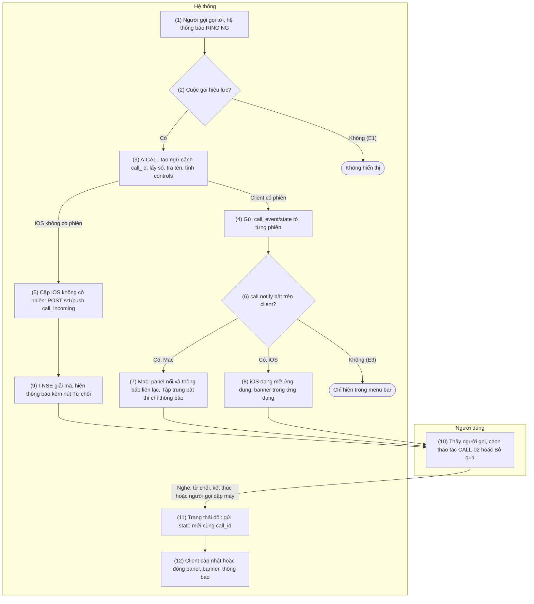
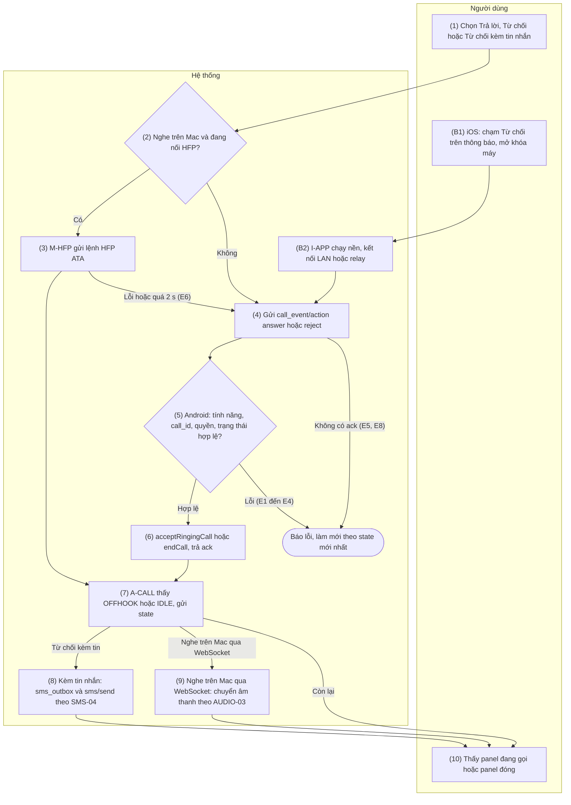
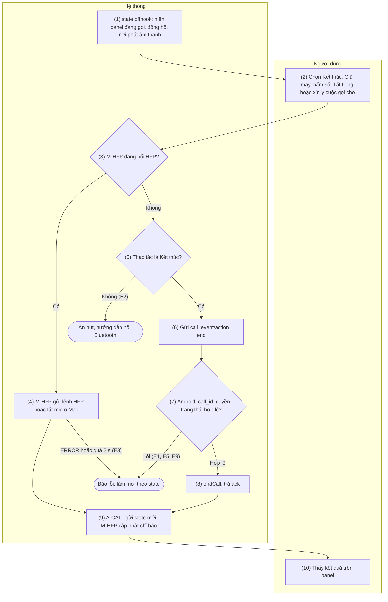
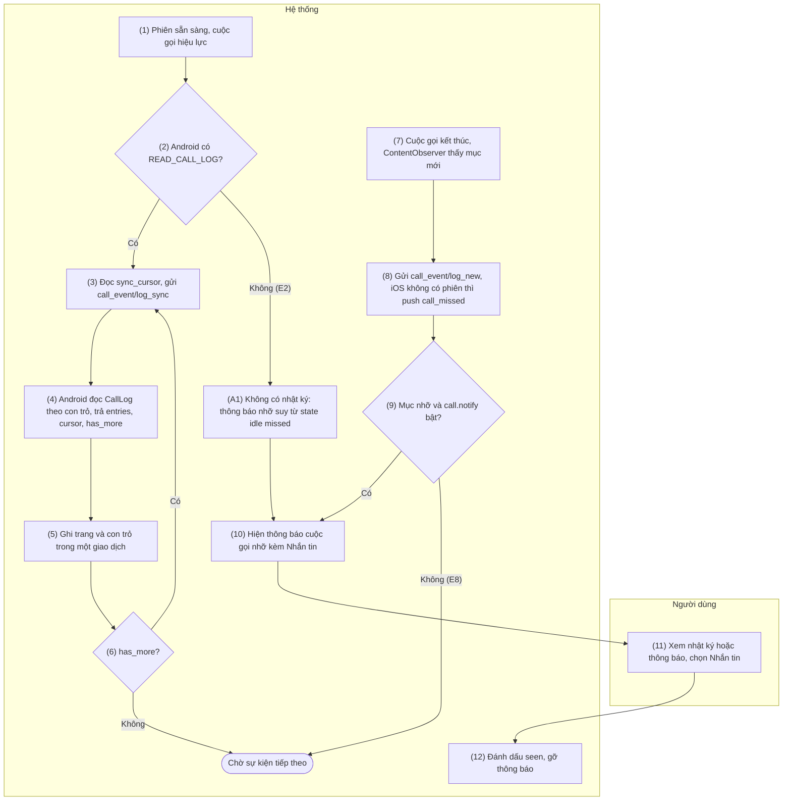

# 6. Nhóm chức năng: Thông tin và điều khiển cuộc gọi

> Tham chiếu chung: [`00-common-specs.md`](00-common-specs.md) — thành phần A-CALL, A-AUD, M-APP,
> M-HFP, I-APP, I-NSE (0.1), định danh `call_id`, `entry_id` (0.2), kiểu dữ liệu (0.3), envelope và
> `ack` (0.5.1), nguyên tắc bảo mật (0.6.5), loại tin `call_event` (0.7.1), capability
> `features.call`, `features.call_audio.hfp_connected` (0.7.2), mã lỗi `CALL_*`,
> `PERMISSION_MISSING` (0.8.1), nguồn dữ liệu `CallLog.Calls`, `PhoneLookup` (0.9.2), bảng
> `call_log_entry`, `sync_cursor` (0.9.3), khóa `feature.call`, `call.notify` (0.9.5), hằng số
> `CALLLOG_SYNC_WINDOW` (0.10). Push: CONN-04. Âm thanh cuộc gọi: nhóm 7 (AUDIO-01…04).
>
> Quy tắc chung của nhóm:
> - **Không dùng `InCallService`** (README §5 C12). A-CALL chỉ thấy trạng thái tổng hợp của máy
>   (`IDLE`, `RINGING`, `OFFHOOK`) qua API công khai: không có chi tiết từng cuộc gọi, không biết
>   chắc tình huống nhiều cuộc gọi, số của cuộc gọi đi chưa biết cho tới khi nhật ký ghi xong.
> - Cuộc gọi **hiệu lực** với một cặp khi `feature.call = true` ở cả hai phía và Android có
>   `READ_PHONE_STATE`. Số gọi đến cần thêm `READ_CALL_LOG` (`features.call.caller_id`); trả lời, từ
>   chối, kết thúc cần `ANSWER_PHONE_CALLS` (`features.call.can_answer`, `can_end`); tên liên hệ cần
>   `READ_CONTACTS`.
> - Qua WebSocket chỉ có `answer`, `reject`, `end`. Giữ máy, DTMF, tắt tiếng và xử lý cuộc gọi chờ
>   chỉ làm được bằng lệnh HFP do Mac gửi khi đang nối Bluetooth HFP tới điện thoại (P4, M-HFP).
> - iOS không dùng PushKit/CallKit (C7): cuộc gọi đến trên iPhone/iPad là thông báo `time-sensitive`
>   hoặc banner trong ứng dụng; iPhone/iPad chỉ từ chối được, không trả lời được.
> - Không ghi log số điện thoại, tên liên hệ, phím DTMF; log chỉ gồm `type`, `op`, `call_id`, mã
>   lỗi. Lỗi của nhóm được cô lập: không làm dừng A-SVC, không đóng phiên `/v1/ctl`.

## 6.1 CALL-01 — Thông báo cuộc gọi đến trên Mac/iOS

### 6.1.1 Thông tin chung

| Mục | Nội dung |
|-----|----------|
| Tên | CALL-01 — Thông báo cuộc gọi đến trên Mac/iOS |
| Mô tả | Khi điện thoại đổ chuông, A-CALL phát hiện trạng thái `RINGING`, tạo ngữ cảnh cuộc gọi (`call_id`), lấy số gọi đến và tên liên hệ, rồi gửi `call_event/state` tới mọi client đang kết nối có cuộc gọi hiệu lực.<br>Mac hiện panel nổi (`NSPanel`) trên mọi Space với tên, số hoặc "Số ẩn", nhãn SIM nếu biết, các nút theo `controls` và chuông tùy chọn, kèm một thông báo liên lạc (`INStartCallIntent`); khi chế độ Tập trung đang bật thì chỉ có thông báo. iPhone/iPad đang mở ứng dụng hiện banner trong ứng dụng; iPhone/iPad đang treo nền nhận thông báo APNs `time-sensitive` qua CONN-04, I-NSE giải mã và gắn nút "Từ chối".<br>Mỗi lần trạng thái đổi (có số hoặc tên, nghe máy, kết thúc, có cuộc gọi chờ, đổi trạng thái HFP hoặc nơi phát âm thanh), A-CALL gửi `state` mới để client cập nhật hoặc đóng giao diện. `call_event/state` định nghĩa ở đây và dùng chung cho CALL-02, CALL-03, CALL-04. |
| Tác nhân | Chính: Người dùng (thấy cuộc gọi, chọn thao tác), Người gọi (tạo cuộc gọi). Hệ thống: A-CALL, A-SVC, A-AUD (trạng thái HFP, nơi phát âm thanh), OS (Telephony, Contacts provider), M-APP, I-APP, I-NSE, R-API, PUSH (APNs). |
| Điều kiện trước | 1.<br>Cặp hiệu lực (PAIR-01).<br>2.<br>Cuộc gọi hiệu lực với cặp; A-SVC đang chạy và A-CALL đã đăng ký listener (SET-01 đã xin `READ_PHONE_STATE`, `READ_CALL_LOG`, `READ_CONTACTS`, `ANSWER_PHONE_CALLS`).<br>3.<br>Để nhận ngay: client có phiên `/v1/ctl` (CONN-01 hoặc CONN-03); iPhone/iPad không có phiên nhận qua push khi đã đăng ký push (CONN-04), `relay.enabled = true` và `features.call.notify = true`.<br>4. iOS: người dùng đã cho phép thông báo, gồm thông báo nhạy cảm thời gian (SET-03). |
| Điều kiện sau | Client đang kết nối hiển thị cuộc gọi theo `call.notify` trong ≤ 300 ms (LAN); iPhone/iPad treo nền có thông báo (nội dung đầy đủ khi máy đang mở khóa).<br>Giao diện luôn khớp `state` mới nhất: `offhook` → Mac chuyển sang panel đang gọi (CALL-03), iOS đóng banner; `idle` → đóng panel, dừng chuông, gỡ thông báo cuộc gọi đến (cuộc gọi nhỡ do CALL-04 thông báo).<br>Ngữ cảnh cuộc gọi trên Android tồn tại tới `IDLE`, sau đó nằm thêm 60 s trong danh sách "vừa kết thúc" để ghép với nhật ký (CALL-04).<br>Không ghi dữ liệu bền nào. |
| Ngoại lệ | E1 — Cuộc gọi không hiệu lực (tắt ở một phía, thiếu `READ_PHONE_STATE`): không gửi gì; PAIR-02 hiển thị lý do.<br>E2 — Thiếu `READ_CALL_LOG`: `number = null`, `presentation = unknown` → hiển thị "Không rõ số" kèm gợi ý cấp quyền; thiếu `READ_CONTACTS`: `display_name = null` → hiển thị số.<br>E3 — `call.notify = false` trên client: Mac không mở panel, không đổ chuông, chỉ hiện cuộc gọi trong menu của biểu tượng menu bar; iOS không hiện banner; Android không push cho iPhone/iPad đó.<br>E4 — Mac đang bật chế độ Tập trung (`isFocused = true`): không hiện panel, không đổ chuông; thông báo liên lạc mức time-sensitive (API 7) để hệ thống quyết định theo người gọi và cài đặt Tập trung; cuộc gọi vẫn nằm trong menu của biểu tượng thanh menu.<br>Chưa được phép đọc trạng thái Tập trung → hiện panel, không đổ chuông.<br>E5 — Không push được (relay tắt, chưa có token, APNs lỗi): xử lý theo CONN-04 (`push_outbox` hạn 30 s); cuộc gọi nhỡ sẽ đến qua CALL-04.<br>E6 — iPhone đang khóa khi push tới: I-NSE không đọc được khóa (C3) → nội dung chung "Cuộc gọi đến trên điện thoại", không có nút "Từ chối".<br>E7 — Push tới trễ (quá 60 s sau `started_at`): I-NSE hiển thị "Cuộc gọi đến lúc <giờ>", không gắn nút.<br>E8 — A-SVC khởi động khi đang có cuộc gọi, hoặc client kết nối giữa chừng: A-CALL dựng ngữ cảnh từ trạng thái hiện tại (`direction = unknown` nếu đang `OFFHOOK`) và gửi `state` ngay sau khi phiên trao đổi capability.<br>E9 — Cuộc gọi chờ (`RINGING` khi đang `OFFHOOK`): `waiting = true`, chỉ hiển thị thông tin; xử lý cần HFP (CALL-03).<br>E10 — Số đến sau lượt `RINGING` đầu (broadcast đến hai lần, thứ tự không cố định): A-CALL gửi lại `state` cùng `call_id` khi có số và tên. |
| Yêu cầu đặc biệt | **Hiệu năng:** `state` tới client < 200 ms trong LAN kể từ callback của hệ điều hành (tra tên ≤ 30 ms nhờ cache LRU); panel Mac hiện ≤ 300 ms sau `RINGING`; qua relay ≤ 1 s khi phiên sẵn có, ≤ 3 s khi điện thoại phải mở relay; push iOS phụ thuộc APNs.<br>**Nền tảng:** panel Mac không lấy focus của ứng dụng đang dùng (non-activating), hiện trên mọi Space kể cả ứng dụng toàn màn hình — lệch có chủ đích so với HIG (panel thường ẩn khi ứng dụng không active), bù lại luôn đi kèm thông báo liên lạc; Mac cần capability Communication Notifications, `NSUserActivityTypes` chứa `INStartCallIntent`, entitlement `com.apple.developer.focus-status` và `NSFocusStatusUsageDescription`; I-APP cần entitlement Time Sensitive Notifications (`com.apple.developer.usernotifications.time-sensitive`); không PushKit/CallKit (C7).<br>**Riêng tư:** relay và APNs chỉ thấy `reason = call_incoming` và nội dung chung; số, tên nằm trong envelope mã hóa bằng `K_push`; không log số, tên.<br>**Tuân thủ:** `READ_CALL_LOG` thuộc ngoại lệ "Cross-device synchronization or transfer of SMS or calls" của Google Play, cần Permissions Declaration Form (`docs/deployment-guide.md`); `READ_PHONE_STATE`, `READ_CONTACTS`, `ANSWER_PHONE_CALLS` là quyền runtime (SET-01).<br>**Truy cập:** VoiceOver đọc "Cuộc gọi đến từ <tên hoặc số>" khi panel hoặc banner xuất hiện. |

### 6.1.2 Màn hình

N/A — chưa có wireframe được duyệt.

### 6.1.3 Mô tả chi tiết các thành phần

| # | Trường | Kiểu dữ liệu | Input/Output | Giá trị khởi tạo | Mô tả |
|---|--------|--------------|--------------|------------------|-------|
| 1 | Tiêu đề | string | Output | "Cuộc gọi đến" | "Cuộc gọi chờ" khi `waiting = true` |
| 2 | Tên người gọi | string | Output | `display_name` | `null` → dòng này hiển thị số (trường 3) |
| 3 | Số người gọi | e164 | Output | `number` | Định dạng quốc gia; `presentation = restricted` → "Số ẩn"; `unknown` hoặc `null` → "Không rõ số" |
| 4 | Nhãn SIM | string | Output | Ẩn | `sim_label`, chỉ khi điện thoại có > 1 SIM và biết SIM đổ chuông |
| 5 | Người gọi chờ | string | Output | Ẩn | Chỉ khi `waiting = true`: `waiting_display_name` hoặc `waiting_number` ("Không rõ số" khi cả hai `null`); kèm "Xử lý trên điện thoại hoặc nối Bluetooth" khi `hfp_connected = false` |
| 6 | Nút "Trả lời" | action | Input | Ẩn | Chỉ Mac, khi `controls.answer = true`; khi âm thanh cuộc gọi hiệu lực (AUDIO-01) tách thành "Nghe trên điện thoại" và "Nghe trên Mac" → CALL-02 |
| 7 | Nút "Từ chối" | action | Input | Ẩn | Panel Mac, banner iOS, hành động của thông báo iOS; khi `controls.reject = true` → CALL-02 |
| 8 | Nút "Từ chối kèm tin nhắn" | action | Input | Ẩn | Chỉ Mac; khi `controls.reject = true`, `number` khác `null`, SMS hiệu lực và `features.sms.can_send = true` → CALL-02 |
| 9 | Nút "Bỏ qua" | action | Input | — | Chỉ Mac: đóng panel và tắt chuông trên Mac; cuộc gọi vẫn đổ chuông trên điện thoại, vẫn nằm trong menu của biểu tượng menu bar |
| 10 | Chuông trên Mac | âm thanh | Output | Tắt | Phát lặp khi panel hiện, `call.notify = true`, `call.ringtone = true` và Focus không bật; dừng khi `state` đổi, khi bấm trường 6, 7, 8, 9, hoặc sau 60 s |
| 11 | Thông báo iOS | string | Output | Không đặt tiêu đề (hệ thống hiện tên app), nội dung "Cuộc gọi đến trên điện thoại" | I-NSE thay tiêu đề bằng trường 2 (hoặc 3), nội dung "Cuộc gọi đến" kèm nhãn SIM; gắn nút "Từ chối" |
| 12 | Gợi ý cấp quyền | string | Output | Ẩn | "Cho phép HandLive đọc nhật ký cuộc gọi trên điện thoại để hiện số gọi đến" khi `permissions_missing` có `READ_CALL_LOG` (E2) |
| 13 | Tùy chọn "Thông báo cuộc gọi" | bool | Input/Output | `call.notify` = `true` | Cài đặt → Cuộc gọi (SET-02), Mac và iOS |
| 14 | Tùy chọn "Đổ chuông trên Mac" | bool | Input/Output | `call.ringtone` = `true` | Cài đặt → Cuộc gọi, chỉ Mac; khóa mới, đề xuất bổ sung vào 0.9.5 |
| 15 | Thông báo liên lạc trên Mac | string | Output | Tiêu đề: trường 2 (hoặc 3); nội dung "Cuộc gọi đến" kèm nhãn SIM | `INStartCallIntent` (API 7): mức passive khi panel đang hiện (chỉ vào Trung tâm thông báo, không banner, không âm), time-sensitive khi Tập trung bật; nút "Trả lời", "Từ chối"; gỡ khi `state` khác `ringing` |

### 6.1.4 Luồng nghiệp vụ



| Bước | Tác nhân | Thành phần | Mô tả | Ngoại lệ / Ghi chú |
|------|----------|-----------|-------|--------------------|
| 1 | Hệ thống | OS, A-CALL | Người gọi gọi tới. Listener trạng thái (API 2) báo `RINGING`; broadcast `PHONE_STATE` (API 3) mang `EXTRA_INCOMING_NUMBER`. | Đang `OFFHOOK` → cuộc gọi chờ (E9). |
| 2 | Hệ thống | A-CALL, A-SVC | Kiểm `feature.call` và `READ_PHONE_STATE` trên Android; với từng phiên, kiểm capability của client (`features.call.enabled`). | Không → E1. |
| 3 | Hệ thống | A-CALL, OS | Tạo ngữ cảnh: `call_id` (UUIDv7), `direction = incoming`, `state = ringing`, `started_at`.<br>Gán `sub_id`, `sim_label` từ listener theo SIM (nếu xác định được).<br>Lấy số từ broadcast kèm số, chuẩn hóa E.164; tra tên bằng `PhoneLookup` (Query); tính `presentation` và `controls` theo API 1. | Số đến sau → E10. Thiếu quyền → E2. |
| 4 | Hệ thống | A-SVC | Dựng `call_event/state` riêng cho từng phiên (các trường `controls`, `hfp_connected`, `audio_on` tính theo client nhận) và gửi. Client không ở LAN mà đang chờ trên relay: A-SVC mở relay (CONN-03); client bắt tay lại và nhận `state` ngay sau khi trao đổi capability. | E8. |
| 5 | Hệ thống | A-SVC, R-API, PUSH | Với mỗi cặp iOS/iPadOS không có phiên, `relay_registered = 1`, capability gần nhất có `features.call.enabled = true` và `features.call.notify = true`: chờ có số (tối đa 300 ms sau `RINGING`), dựng envelope `call_event/state` mã hóa bằng `K_push`, gọi `POST /v1/push` (API 4).<br>Sau đó mở relay nếu chưa có, để lệnh "Từ chối" từ iOS tới nhanh (CALL-02 B2). | Lỗi → E5. Không push cho cuộc gọi chờ. |
| 6 | Hệ thống | M-APP / I-APP | Kiểm `call.notify`. | Không → E3 (X2). |
| 7 | Hệ thống | M-APP | Đọc trạng thái Tập trung (API 5). Không bật: hiện panel với trường 1–9, gửi thông báo liên lạc mức passive (trường 15, API 7), phát chuông (trường 10) nếu `call.ringtone = true`. Đang bật: không panel, không chuông, thông báo liên lạc mức time-sensitive. | E4. |
| 8 | Hệ thống | I-APP | Ứng dụng ở foreground: banner trong ứng dụng với trường 1–5, 7 (API 6); không đổ chuông vì điện thoại đang đổ chuông. |  |
| 9 | Hệ thống | I-NSE, OS | Nhận push (API 6). Máy đang mở khóa: giải mã, đặt tiêu đề và nội dung (trường 11), danh mục `HL_CALL_INCOMING` có nút "Từ chối", `userInfo`. Máy đang khóa hoặc giải mã lỗi: giữ nội dung chung. | E6, E7. |
| 10 | Người dùng | M-APP / I-APP | Thấy người gọi; chọn "Trả lời", "Từ chối", "Từ chối kèm tin nhắn" (CALL-02), "Bỏ qua", hoặc không làm gì. |  |
| 11 | Hệ thống | A-CALL, A-SVC | Mọi thay đổi (có số hoặc tên, `OFFHOOK`, `IDLE`, `waiting`, `hfp_connected`, `audio_on`) → gửi `state` mới cùng `call_id` tới các phiên. `IDLE`: đặt `ended_at`, `end_reason`, chuyển ngữ cảnh vào danh sách "vừa kết thúc" (giữ 60 s). |  |
| 12 | Hệ thống | M-APP / I-APP | `ringing` → cập nhật các trường; `offhook` → Mac chuyển panel sang chế độ đang gọi (CALL-03) và gỡ thông báo liên lạc, iOS đóng banner và gỡ thông báo cuộc gọi đến; `idle` → đóng panel, dừng chuông, gỡ thông báo cuộc gọi đến. | Cuộc gọi nhỡ: CALL-04. |

### 6.1.5 Đặc tả API/service

**Danh sách lời gọi**

| # | API/service | Kênh | Chiều | Dùng ở bước |
|---|-------------|------|-------|-------------|
| 1 | `WS call_event/state` | `/v1/ctl` (LAN hoặc relay) | S→C | 4, 11, 12 |
| 2 | Listener trạng thái cuộc gọi: `TelephonyCallback.CallStateListener` (API 31+) / `PhoneStateListener` `LISTEN_CALL_STATE` (API 29–30) | Cục bộ Android | OS → A-CALL | 1, 3, 11 |
| 3 | Broadcast `TelephonyManager.ACTION_PHONE_STATE_CHANGED` (receiver đăng ký lúc chạy) | Cục bộ Android | OS → A-CALL | 1, 3 |
| 4 | `POST /v1/push` với `reason = call_incoming` (đặc tả đầy đủ ở CONN-04) | REST relay → APNs | A-SVC → R-API → PUSH | 5 |
| 5 | Panel cuộc gọi `NSPanel`, chuông `NSSound`, trạng thái Focus `INFocusStatusCenter` | Cục bộ Mac | — | 7, 12 |
| 6 | Banner trong ứng dụng và thông báo `HL_CALL_INCOMING` (`UNNotificationServiceExtension`, `UNUserNotificationCenter`) | Cục bộ iOS, I-NSE | — | 8, 9, 12 |
| 7 | Thông báo liên lạc trên Mac: `INStartCallIntent`, `UNNotificationContent.updating(from:)`, `UNUserNotificationCenter` | Cục bộ Mac | — | 7, 12 |

#### API 1 — `WS call_event/state`

- **URL:** `wss://{android_host}:{port}/v1/ctl` (LAN) hoặc qua relay `wss://{RELAY_HOST}/v1/relay`
  với lớp bọc `to` /`from`
- **Method:** `WS call_event/state` (S→C), envelope mã hóa, không ack (0.7.1). Cũng là plaintext của
  envelope trong push `call_incoming` (mã hóa bằng `K_push`, API 4).
- **Request (`data`):**

| Trường | Kiểu | Bắt buộc | Mô tả |
|--------|------|----------|-------|
| `call_id` | uuid | Có | UUIDv7 của ngữ cảnh; tạo khi `RINGING` từ `IDLE` (cuộc gọi đến) hoặc `OFFHOOK` từ `IDLE` (cuộc gọi đi bắt đầu trên điện thoại) |
| `direction` | enum{incoming\ | outgoing\ | unknown} | Có | `unknown` khi ngữ cảnh dựng lúc máy đã `OFFHOOK` (E8) |
| `state` | enum{ringing\ | offhook\ | idle} | Có | Trạng thái tổng hợp của máy |
| `waiting` | bool | Có | `true` khi `RINGING` xuất hiện lúc đang `OFFHOOK` (cuộc gọi chờ) |
| `number` | e164 \ | null | Có | Số của cuộc gọi chính; `null` khi thiếu `READ_CALL_LOG`, số ẩn, hoặc cuộc gọi đi |
| `display_name` | string \ | null | Có | Tên từ `PhoneLookup`; `null` khi thiếu `READ_CONTACTS` hoặc số không có trong danh bạ |
| `presentation` | enum{allowed\ | restricted\ | unknown} | Có | `allowed`: có số; `restricted`: có `READ_CALL_LOG` nhưng bản broadcast kèm số cho số rỗng (người gọi ẩn số); `unknown`: các trường hợp còn lại |
| `sub_id` | int32 \ | null | Có | SIM của cuộc gọi (API 2, listener theo SIM); không xác định → `null` |
| `sim_label` | string \ | null | Có | Tên SIM (`SubscriptionInfo.getDisplayName()`) của `sub_id`; chỉ khi máy có > 1 SIM hoạt động |
| `waiting_number` | e164 \ | null | Có | Số của cuộc gọi chờ; `null` khi `waiting = false` hoặc không biết |
| `waiting_display_name` | string \ | null | Có | Tên của cuộc gọi chờ |
| `started_at` | timestamp | Có | Lúc tạo ngữ cảnh (đồng hồ Android) |
| `answered_at` | timestamp \ | null | Có | Lúc `RINGING` → `OFFHOOK` của cuộc gọi đến; cuộc gọi đi và `unknown` luôn `null` (không biết lúc bên kia nhấc máy) |
| `ended_at` | timestamp \ | null | Có | Chỉ khi `state = idle` |
| `end_reason` | enum{missed\ | rejected\ | ended\ | answered_elsewhere} \ | null | Có | Chỉ khi `state = idle`; quy tắc ở logic 5 |
| `controls` | object | Có | Thao tác client được phép làm (bảng dưới) |
| `hfp_connected` | bool | Có | Mac nhận tin đang nối hồ sơ HFP tới điện thoại (A-AUD, AUDIO-02); luôn `false` với iPhone/iPad |
| `audio_on` | enum{phone\ | mac} | Có | `mac`: âm thanh cuộc gọi đang ở chính Mac nhận tin (SCO tới Mac đó, hoặc đường Opus/WS của phiên đó — nhóm 7); còn lại `phone` |

Đối tượng `controls`:

| Trường | Kiểu | Giá trị |
|--------|------|---------|
| `answer` | bool | `true` khi `state = ringing`, `waiting = false`, có `ANSWER_PHONE_CALLS` và client nhận là Mac |
| `reject` | bool | `true` khi `state = ringing`, `waiting = false`, có `ANSWER_PHONE_CALLS` |
| `end` | bool | `true` khi `state = offhook`, `waiting = false`, có `ANSWER_PHONE_CALLS` |
| `hold` | enum{hfp\ | unavailable} | `hfp` khi `state = offhook` và `hfp_connected = true` |
| `dtmf` | enum{hfp\ | unavailable} | Như `hold` |
| `mute` | enum{hfp\ | unavailable} | `hfp` khi `state = offhook`, `hfp_connected = true` và `audio_on = mac` |

- **Response:** N/A (không ack; client lỡ tin do mất kết nối nhận bản hiện tại khi phiên mới trao
  đổi capability — logic 3).
- **Ví dụ:** cuộc gọi đến đang đổ chuông, sau đó bị nhỡ.

```json
{"op":"state","data":{"call_id":"0192f3f0-6a1b-7c2d-8e3f-4a5b6c7d8e90","direction":"incoming","state":"ringing","waiting":false,"number":"+84900000123","display_name":"Nguyễn Văn A","presentation":"allowed","sub_id":1,"sim_label":"SIM 1","waiting_number":null,"waiting_display_name":null,"started_at":1727150400123,"answered_at":null,"ended_at":null,"end_reason":null,"controls":{"answer":true,"reject":true,"end":false,"hold":"unavailable","dtmf":"unavailable","mute":"unavailable"},"hfp_connected":false,"audio_on":"phone"}}
```

```json
{"op":"state","data":{"call_id":"0192f3f0-6a1b-7c2d-8e3f-4a5b6c7d8e90","direction":"incoming","state":"idle","waiting":false,"number":"+84900000123","display_name":"Nguyễn Văn A","presentation":"allowed","sub_id":1,"sim_label":"SIM 1","waiting_number":null,"waiting_display_name":null,"started_at":1727150400123,"answered_at":null,"ended_at":1727150425456,"end_reason":"missed","controls":{"answer":false,"reject":false,"end":false,"hold":"unavailable","dtmf":"unavailable","mute":"unavailable"},"hfp_connected":false,"audio_on":"phone"}}
```

- **Logic nghiệp vụ:**
  1. **Nguồn dữ liệu:** trạng thái lấy từ listener mặc định (API 2); số lấy từ broadcast (API 3);
     `sub_id` từ listener theo SIM. A-CALL xử lý mọi sự kiện tuần tự trên một luồng.
  2. **Máy trạng thái ngữ cảnh:** `IDLE → RINGING` tạo ngữ cảnh `incoming`; `IDLE → OFFHOOK` tạo ngữ
     cảnh `outgoing` (`number = null`, `presentation = unknown`); `RINGING → OFFHOOK` (không chờ)
     đặt `answered_at`; `OFFHOOK → RINGING` đặt `waiting = true` và `waiting_*` theo broadcast;
     `RINGING → OFFHOOK` khi đang chờ đặt `waiting = false`, xóa `waiting_*`, giữ nguyên `call_id`
     và số của cuộc gọi đầu — A-CALL không biết cuộc gọi chờ đã được nhận hay bị bỏ qua (giới hạn
     C12); `→ IDLE` kết thúc ngữ cảnh. Máy đã ở `RINGING` hoặc `OFFHOOK` lúc đăng ký listener → dựng
     ngữ cảnh theo E8.
  3. **Khi nào gửi:** mỗi khi một trường của `data` đổi so với bản đã gửi cho phiên đó; khi phiên
     mới trao đổi xong `capability/hello` mà ngữ cảnh khác `idle`. Không gửi lại bản giống hệt.
  4. **Theo từng client:** mỗi phiên nhận một envelope riêng; `controls.answer` chỉ `true` với Mac
     (`peer_platform = macos`); `hfp_connected`, `controls.hold` /`dtmf`/`mute`, `audio_on` tính
     theo `bt_address` và phiên của client nhận.
  5. **`end_reason`:** A-CALL đã gọi `endCall()` cho cuộc gọi đang đổ chuông trong vòng 3 s trước đó
     (CALL-02) → `rejected`; `RINGING → IDLE` không qua `OFFHOOK` → `missed`; có `OFFHOOK` →
     `ended`. **Hiệu chỉnh** (chỉ khi có `READ_CALL_LOG`): khi mục nhật ký của ngữ cảnh vừa kết thúc
     xuất hiện (CALL-04 API 3) với loại `REJECTED_TYPE`, `BLOCKED_TYPE` (người dùng từ chối hoặc
     chặn trên điện thoại) hoặc `ANSWERED_EXTERNALLY_TYPE` (nghe trên thiết bị khác dùng chung số)
     trong khi đã báo `missed`, A-CALL gửi thêm đúng một `state` cùng `call_id`, `state = idle`,
     `end_reason` = `rejected` hoặc `answered_elsewhere`. Client lấy bản sau cùng.
  6. **Phía client:** giữ ngữ cảnh mới nhất theo `ts` của envelope; bản của `call_id` đã `idle` chỉ
     được nhận khi cũng là `idle` (bản hiệu chỉnh); `call_id` mới ở `ringing` thay ngữ cảnh cũ
     (phòng mất bản `idle`).
  7. Số chuẩn hóa bằng libphonenumber theo quốc gia của SIM (như SMS-04 API 1); không chuẩn hóa được
     → giữ chuỗi gốc. Không log `number`, `display_name`, `waiting_*`.

#### API 2 — Listener trạng thái cuộc gọi

- **URL:** N/A
- **Method:** API 31+: `TelephonyManager.registerTelephonyCallback(executor, callback)` với
  `callback` cài `TelephonyCallback.CallStateListener.onCallStateChanged(state)`; gỡ bằng
  `unregisterTelephonyCallback(callback)`. API 29–30:
  `TelephonyManager.listen(listener, PhoneStateListener.LISTEN_CALL_STATE)`, callback
  `PhoneStateListener.onCallStateChanged(state, phoneNumber)`; gỡ bằng
  `listen(listener, PhoneStateListener.LISTEN_NONE)`.
- **Request:** một listener trên `TelephonyManager` mặc định (trạng thái tổng hợp) và một listener
  cho mỗi SIM hoạt động trên `TelephonyManager.createForSubscriptionId(subId)` (chỉ để gán
  `sub_id`). Đăng ký khi A-SVC khởi động, `feature.call = true` và có `READ_PHONE_STATE`; đăng ký
  lại listener theo SIM khi danh sách SIM đổi (`SubscriptionManager.OnSubscriptionsChangedListener`,
  danh sách từ `getActiveSubscriptionInfoList()`).
- **Response:** `state` ∈ `TelephonyManager.CALL_STATE_IDLE` (0), `CALL_STATE_RINGING` (1),
  `CALL_STATE_OFFHOOK` (2). Callback API 31+ không có số; `phoneNumber` của API 29–30 không được
  dùng (lấy số thống nhất từ API 3).
- **Ví dụ:** listener mặc định báo `onCallStateChanged(1)` lúc `t0`; listener của `subId = 1` cũng
  báo `1` tại `t0 + 12 ms`, listener của `subId = 2` không báo → ngữ cảnh mới có `sub_id = 1`,
  `sim_label = "SIM 1"`.
- **Logic nghiệp vụ:**
  1. Callback chạy trên executor một luồng của A-CALL; xử lý tuần tự.
  2. Khi đăng ký, hệ thống báo ngay trạng thái hiện tại → dựng ngữ cảnh cho E8.
  3. `sub_id` chỉ được gán khi đúng một listener theo SIM báo cùng trạng thái trong vòng 500 ms
     quanh callback mặc định; nhiều SIM cùng báo hoặc máy không báo theo SIM → `null`.
  4. Mất `READ_PHONE_STATE` (`SecurityException` hoặc người dùng thu hồi quyền) → gỡ listener, gửi
     `capability/update` với `permissions_missing`; cuộc gọi hết hiệu lực (E1). `feature.call`
     chuyển `false` → gỡ mọi listener, receiver và observer của nhóm.

#### API 3 — Broadcast `ACTION_PHONE_STATE_CHANGED`

- **URL:** N/A
- **Method:**
  `Context.registerReceiver(receiver, IntentFilter(TelephonyManager.ACTION_PHONE_STATE_CHANGED))`
  trong A-SVC (receiver đăng ký lúc chạy, không khai trong manifest); gỡ bằng
  `unregisterReceiver(receiver)`.
- **Request:** N/A (hệ thống phát khi trạng thái tổng hợp đổi).
- **Response:** extra `TelephonyManager.EXTRA_STATE` ∈ {`EXTRA_STATE_IDLE`, `EXTRA_STATE_RINGING`,
  `EXTRA_STATE_OFFHOOK` }; `TelephonyManager.EXTRA_INCOMING_NUMBER` (deprecated từ API 29, vẫn được
  gửi) chỉ có trong bản phát cho ứng dụng có cả `READ_PHONE_STATE` và `READ_CALL_LOG`.
- **Ví dụ:** hai intent cho cùng lượt đổ chuông: `{state: "RINGING"}` và
  `{state: "RINGING", incoming_number: "0900000123"}` → `number = "+84900000123"`,
  `presentation = allowed`.
- **Logic nghiệp vụ:**
  1. Ứng dụng có đủ hai quyền nhận broadcast **hai lần** cho mỗi lần đổi trạng thái (một bản có
     `EXTRA_INCOMING_NUMBER`, một bản không), thứ tự không cố định. A-CALL chỉ lấy số từ bản có khóa
     `EXTRA_INCOMING_NUMBER` (`intent.hasExtra(...)`) và ghép với ngữ cảnh theo `EXTRA_STATE`.
  2. Bản `RINGING` khi ngữ cảnh đang `OFFHOOK` → gán `waiting_number`; ngược lại gán `number`. Tên
     tra theo số vừa có (Query).
  3. Có khóa nhưng giá trị rỗng → `presentation = restricted`. Thiếu `READ_CALL_LOG` → chỉ nhận bản
     không số → `number = null`, `presentation = unknown` (E2).
  4. Broadcast không đổi trạng thái ngữ cảnh (nguồn trạng thái là API 2). Bản có số tới trước
     callback của API 2 được giữ tạm tối đa 2 s để gán khi ngữ cảnh được tạo.

#### API 4 — `POST /v1/push` (`call_incoming`)

- **URL:** `https://{RELAY_HOST}/v1/push`
- **Method:** `POST`, header `Authorization: Bearer <jwt>` (JWT của Android, 0.6.4).
- **Request:** cấu trúc đầy đủ ở CONN-04 API 2. Giá trị dùng cho cuộc gọi đến:

| Trường | Giá trị |
|--------|---------|
| `pair_id` | Cặp của iPhone/iPad đích |
| `to` | `device_id` của iPhone/iPad |
| `kind` | `alert` |
| `reason` | `call_incoming` |
| `env_b64` | Envelope `call_event/state` (API 1, `state = ringing`) mã hóa bằng `K_push` |
| `collapse_key` | `call:<call_id>` — push cuộc gọi nhỡ của cùng cuộc gọi (CALL-04) thay thế thông báo này |
| `ttl_s` | 30 |

- **Response:** theo CONN-04: 202 → xong; 409 `PUSH_TOKEN_MISSING` → bỏ qua; 403 `NOT_PAIRED` → cặp
  đã thu hồi (PAIR-03); 429 `RATE_LIMITED`, 502 `PUSH_PROVIDER_ERROR` → ghi `push_outbox`, hạn 30 s
  (E5).
- **Ví dụ (minh họa):**

```http
POST /v1/push HTTP/1.1
Host: relay.example.com
Authorization: Bearer <jwt>
Content-Type: application/json

{"pair_id":"7a6b5c4d-3e2f-4a1b-9c8d-7e6f5a4b3c2d","to":"2c3d4e5f-6a7b-8c9d-8e0f-1a2b3c4d5e6f","kind":"alert","reason":"call_incoming","env_b64":"<b64: envelope call_event/state mã hóa bằng K_push>","collapse_key":"call:0192f3f0-6a1b-7c2d-8e3f-4a5b6c7d8e90","ttl_s":30}
```

- **Logic nghiệp vụ:**
  1. Chỉ push khi đủ điều kiện ở bước 5; mỗi `call_id` tối đa một push `call_incoming`; cuộc gọi chờ
     không push.
  2. Chờ có số tối đa 300 ms sau `RINGING` để push mang đủ số và tên (push không sửa được sau khi
     gửi); quá hạn thì gửi với `number = null`.
  3. Relay đặt `interruption-level = time-sensitive`, `thread-id = calls` và nội dung mặc định:
     không đặt tiêu đề (hệ thống hiện tên app), nội dung "Cuộc gọi đến trên điện thoại" (CONN-04 API
     4); nội dung thật chỉ nằm trong envelope.
  4. Sau khi push, A-SVC mở kết nối relay (CONN-03) nếu chưa có và giữ ít nhất tới khi cuộc gọi hết
     đổ chuông, sau đó theo `RELAY_IDLE_DISCONNECT`; nhờ vậy I-APP từ chối từ thông báo thường không
     cần wake push.

#### API 5 — Panel cuộc gọi trên Mac

- **URL:** N/A
- **Method:** `NSPanel` (AppKit) với `styleMask` có `.nonactivatingPanel`, `level = .floating`,
  `collectionBehavior = [.canJoinAllSpaces, .fullScreenAuxiliary]`, `hidesOnDeactivate = false`,
  hiển thị bằng `orderFrontRegardless()`. Chuông: `NSSound` phát lặp tệp chuông trong bundle. Focus:
  `INFocusStatusCenter.default.focusStatus.isFocused`. Trợ năng:
  `NSAccessibility.post(element:notification:userInfo:)` với `.announcementRequested`.
- **Request (dữ liệu hiển thị):** trường 1–10 lấy từ `state` mới nhất.
- **Response:** thao tác của người dùng → CALL-02 ("Trả lời", "Từ chối", "Từ chối kèm tin nhắn")
  hoặc "Bỏ qua" (chỉ cục bộ).
- **Ví dụ:** `state` `ringing` ở ví dụ API 1 → panel góc trên bên phải: "Cuộc gọi đến", "Nguyễn Văn
  A", số ở định dạng quốc gia, "SIM 1", nút "Trả lời", "Từ chối", "Từ chối kèm tin nhắn", "Bỏ qua";
  chuông phát nếu Focus không bật.
- **Logic nghiệp vụ:**
  1. Một panel cho một cuộc gọi, đặt ở góc trên bên phải của màn hình đang có con trỏ chuột. Panel
     không lấy focus: người dùng đang gõ trong ứng dụng khác không bị gián đoạn.
  2. Chuông chỉ phát khi `call.notify = true`, `call.ringtone = true` và `isFocused = false`; dừng
     khi `state` khác `ringing`, khi bấm nút, hoặc sau 60 s; âm lượng theo âm lượng hệ thống.
  3. Đọc trạng thái Focus cần capability "Focus Status" của Xcode (entitlement
     `com.apple.developer.focus-status`) và người dùng cho phép; M-APP xin quyền này khi người dùng
     bật "Đổ chuông trên Mac" (trường 14); Info.plist có `NSFocusStatusUsageDescription` ("HandLive
     đọc trạng thái Tập trung để không đổ chuông và không hiện cuộc gọi khi bạn đang tập trung.").
     Chưa được phép (`INFocusStatusCenter.default.authorizationStatus` khác `.authorized`) →
     **không** phát chuông riêng (an toàn cho chế độ Tập trung); panel vẫn hiện.
  4. `call.notify = false` → không tạo panel; menu của biểu tượng menu bar hiện cuộc gọi kèm các nút
     theo `controls` (E3).
  5. Khi panel xuất hiện, VoiceOver đọc "Cuộc gọi đến từ <tên hoặc số>".
  6. `isFocused = true` → không tạo panel (E4); thông báo liên lạc mức time-sensitive (API 7) thay
     thế. Panel nổi khi ứng dụng không active là lệch có chủ đích so với HIG (design system, mục
     Trình bày).
  7. Panel chỉ đóng khi `state` đổi, người dùng bấm nút hoặc "Bỏ qua"; không tự đóng theo thời gian
     (chuông dừng sau 60 s nhưng panel vẫn giữ).

#### API 6 — Banner iOS và thông báo `HL_CALL_INCOMING`

- **URL:** N/A
- **Method:** I-NSE: `UNNotificationServiceExtension.didReceive(_:withContentHandler:)` thay
  `title`, `body`, đặt `categoryIdentifier`, `userInfo`; máy đang mở khóa còn dựng
  `INStartCallIntent` (`INPerson` từ tên hoặc số đã giải mã) và gọi `content.updating(from:)` để
  thành thông báo liên lạc — hệ thống hiện avatar và lọc theo người gọi trong chế độ Tập trung (cần
  capability Communication Notifications cho I-NSE). I-APP đăng ký danh mục lúc khởi động bằng
  `UNUserNotificationCenter.setNotificationCategories(_:)`: `UNNotificationCategory`
  `HL_CALL_INCOMING` gồm `UNNotificationAction` `HL_CALL_REJECT` (tiêu đề "Từ chối", tùy chọn
  `.destructive` và `.authenticationRequired`, không có `.foreground`). Ứng dụng ở foreground nhận
  `userNotificationCenter(_:willPresent:withCompletionHandler:)`; banner trong ứng dụng là view
  SwiftUI phủ trên cùng.
- **Request (nội dung thông báo do I-NSE đặt):**

| Thuộc tính | Giá trị |
|------------|---------|
| `title` | Trường 2, hoặc trường 3 khi không có tên |
| `body` | "Cuộc gọi đến", thêm " · <nhãn SIM>" khi có |
| `threadIdentifier` | `calls` (relay đặt `thread-id`) |
| `categoryIdentifier` | `HL_CALL_INCOMING` |
| `interruptionLevel` | `.timeSensitive` (từ `interruption-level` của APNs) |
| `userInfo` | `{pair_id, call_id, started_at}` — dùng cho hành động "Từ chối" (CALL-02 B2) |

- **Response:** chạm "Từ chối" → CALL-02 (B1–B3); chạm vào thông báo → mở I-APP (kết nối, hiện
  banner nếu cuộc gọi còn đổ chuông).
- **Ví dụ:**

```json
{"title":"Nguyễn Văn A","body":"Cuộc gọi đến · SIM 1","threadIdentifier":"calls","categoryIdentifier":"HL_CALL_INCOMING","userInfo":{"pair_id":"7a6b5c4d-3e2f-4a1b-9c8d-7e6f5a4b3c2d","call_id":"0192f3f0-6a1b-7c2d-8e3f-4a5b6c7d8e90","started_at":1727150400123}}
```

- **Logic nghiệp vụ:**
  1. I-NSE giải mã theo CONN-04 bước 9b; envelope `call_event/state` có `state = ringing` → nội dung
     cuộc gọi đến. Máy khóa hoặc giải mã lỗi → giữ nội dung chung, không đặt danh mục (E6).
  2. `now − started_at > 60 s` → nội dung "Cuộc gọi đến lúc <giờ>", không đặt danh mục (E7).
  3. Foreground (`willPresent`): đã có banner cho cùng `call_id` → không trình bày thông báo hệ
     thống; chưa có phiên → hiện banner từ nội dung đã giải mã, đồng thời kết nối (CONN-01 hoặc
     CONN-03).
  4. Điện thoại không push khi cuộc gọi được nghe hoặc bị từ chối, nên I-APP tự gỡ thông báo
     (`removeDeliveredNotifications(withIdentifiers:)`): khi nhận `state` khác `ringing` của
     `call_id` đó, và mỗi lần vào foreground với mọi thông báo `HL_CALL_INCOMING` có `started_at` cũ
     hơn 60 s. Push cuộc gọi nhỡ cùng `collapse_key` tự thay thế thông báo (CALL-04).

#### API 7 — Thông báo liên lạc trên Mac

- **URL:** N/A
- **Method:**
  `INStartCallIntent(callRecordFilter: nil, callRecordToCallBack: nil, audioRoute: .unknown, destinationType: .normal, contacts: [INPerson], callCapability: .audioCall)`;
  `INInteraction(intent:response:)` với `direction = .incoming`, `donate(completion:)`;
  `UNMutableNotificationContent.updating(from:)`; `UNUserNotificationCenter.add(_:)`; gỡ bằng
  `removeDeliveredNotifications(withIdentifiers:)`. Cần capability Communication Notifications và
  `NSUserActivityTypes` có `INStartCallIntent`.
- **Request (nội dung thông báo):**

| Thuộc tính | Giá trị |
|------------|---------|
| `INPerson` | `displayName` = trường 2, hoặc trường 3 khi không có tên; `personHandle` = số E.164 (`.phoneNumber`) để hệ thống lọc theo người gọi trong chế độ Tập trung |
| `body` | "Cuộc gọi đến", thêm " · <nhãn SIM>" khi có |
| `threadIdentifier` | `calls` |
| `categoryIdentifier` | `HL_CALL_INCOMING_MAC`: hành động "Trả lời" (`HL_CALL_ANSWER`), "Từ chối" (`HL_CALL_REJECT`, `.destructive`) |
| `interruptionLevel` | `.passive` khi panel đang hiện; `.timeSensitive` khi chế độ Tập trung bật và không có panel |
| `identifier` | `call_id` — một thông báo cho một cuộc gọi; gửi lại cùng `identifier` để cập nhật |
| `userInfo` | `{pair_id, call_id, started_at}` |

- **Response:** "Trả lời" → CALL-02 (`answer`) và mở panel ở chế độ đang gọi; "Từ chối" → CALL-02
  (`reject`); bấm vào thông báo → đưa panel ra trước (mở panel nếu Tập trung đã tắt).
- **Ví dụ:** cuộc gọi ở ví dụ API 1 khi panel đang hiện → thông báo
  `identifier = "0192f3f0-6a1b-7c2d-8e3f-4a5b6c7d8e90"`, `interruptionLevel = .passive`: nằm trong
  Trung tâm thông báo, không banner, không âm.
- **Logic nghiệp vụ:**
  1. Một cuộc gọi chỉ có một lớp báo hiện lên: panel (Tập trung tắt) hoặc banner thông báo (Tập
     trung bật). Khi có panel, thông báo ở mức passive để lịch sử vẫn nằm trong Trung tâm thông báo.
  2. Gỡ thông báo khi `state` khác `ringing` (bước 12); cuộc gọi nhỡ dùng thông báo riêng của
     CALL-04.
  3. `call.notify = false` → không gửi thông báo, không panel (E3).
  4. Hành động của thông báo chạy trong tiến trình M-APP (luôn chạy) qua
     `UNUserNotificationCenterDelegate.userNotificationCenter(_:didReceive:withCompletionHandler:)`;
     không cần mở cửa sổ.

#### Query

```text
// [Thiết kế] Android, bước 3 và API 3: tên liên hệ của số gọi đến (chỉ đọc dòng đầu;
// cache LRU 200 số trong bộ nhớ A-CALL, không ghi đĩa)
ContentResolver.query(
    Uri.withAppendedPath(ContactsContract.PhoneLookup.CONTENT_FILTER_URI, Uri.encode(number)),
    arrayOf(ContactsContract.PhoneLookup.DISPLAY_NAME), null, null, null)
```

```sql
-- [Thiết kế] Android, bước 4: nền tảng và địa chỉ Bluetooth của client nhận (tính controls, hfp_connected)
SELECT peer_platform, peer_bt_address
FROM paired_device
WHERE pair_id = :pair_id AND revoked_at IS NULL;

-- [Thiết kế] Android, bước 5: cặp iOS/iPadOS có thể cần push (lọc tiếp theo phiên đang mở và features_json trong bộ nhớ)
SELECT pair_id, peer_device_id, features_json
FROM paired_device
WHERE revoked_at IS NULL AND relay_registered = 1 AND peer_platform IN ('ios', 'ipados');

-- [Thiết kế] Mac/iOS, bước 6: capability gần nhất của điện thoại (features.call, permissions_missing)
SELECT features_json
FROM paired_device
WHERE pair_id = :pair_id AND revoked_at IS NULL;
```

Ghi `push_outbox` khi push lỗi: xem CONN-04.

---

## 6.2 CALL-02 — Trả lời hoặc từ chối cuộc gọi đến

### 6.2.1 Thông tin chung

| Mục | Nội dung |
|-----|----------|
| Tên | CALL-02 — Trả lời hoặc từ chối cuộc gọi đến |
| Mô tả | Từ panel cuộc gọi đến (CALL-01), người dùng Mac trả lời, từ chối, hoặc từ chối kèm một tin nhắn trả lời nhanh; người dùng iPhone/iPad từ chối từ banner trong ứng dụng hoặc từ nút "Từ chối" của thông báo.<br>Client gửi `call_event/action` (`answer` hoặc `reject`); Android kiểm tra rồi gọi `TelecomManager.acceptRingingCall()` hoặc `TelecomManager.endCall()` (quyền `ANSWER_PHONE_CALLS`; hai hàm deprecated từ API 29 nhưng vẫn hoạt động — C12).<br>Kết quả thấy qua `call_event/state`: `offhook` (đã nghe) hoặc `idle` với `end_reason = rejected`.<br>**Nghe trên Mac** (P4, cần âm thanh cuộc gọi hiệu lực): Mac đang nối HFP → M-HFP trả lời bằng lệnh HFP `ATA` để âm thanh đi thẳng tới Mac; không nối HFP → trả lời qua WebSocket rồi chuyển âm thanh theo AUDIO-03 (qua HFP — AUDIO-02, hoặc Opus/WS — AUDIO-04).<br>**Từ chối kèm tin nhắn** (chỉ Mac) = từ chối rồi gửi SMS trả lời nhanh tới người gọi qua SMS-04; mẫu tin lưu cục bộ trên Mac. |
| Tác nhân | Chính: Người dùng. Hệ thống: M-APP, M-HFP, I-APP, A-SVC, A-CALL, A-SMS (tin trả lời nhanh), OS (Telecom, `UNUserNotificationCenter`), R-API (chuyển tiếp khi qua relay, wake push). |
| Điều kiện trước | 1.<br>Có ngữ cảnh `state = ringing`, `waiting = false` (CALL-01) và client đang hiển thị nó.<br>2. `controls.answer` (chỉ Mac) hoặc `controls.reject` bằng `true` (Android có `ANSWER_PHONE_CALLS`).<br>3.<br>Có phiên `/v1/ctl`; iOS từ thông báo: I-APP tự kết nối trong tác vụ nền.<br>4.<br>Nghe trên Mac: âm thanh cuộc gọi hiệu lực (AUDIO-01 đã chấp thuận, `feature.call_audio = true` ở hai phía).<br>5.<br>Từ chối kèm tin nhắn: `number` khác `null`, SMS hiệu lực và `features.sms.can_send = true`. |
| Điều kiện sau | **Trả lời:** điện thoại ở `OFFHOOK`; mọi client nhận `state = offhook` có `answered_at`; Mac chuyển sang panel đang gọi (CALL-03); âm thanh ở điện thoại hoặc ở Mac theo lựa chọn (`audio_on`).<br>**Từ chối:** cuộc gọi kết thúc, `state = idle` với `end_reason = rejected`; nhật ký điện thoại ghi loại `rejected`, không có thông báo cuộc gọi nhỡ.<br>**Kèm tin nhắn:** thêm một dòng `sms_outbox` và một tin SMS tới người gọi theo SMS-04.<br>**Thất bại:** cuộc gọi giữ nguyên; client làm mới giao diện theo `state` mới nhất. |
| Ngoại lệ | E1 — `CALL_NOT_FOUND`: ngữ cảnh đã kết thúc hoặc `call_id` cũ.<br>E2 — `CALL_ACTION_NOT_ALLOWED`: trạng thái không còn cho phép (đã nghe trên điện thoại, client khác nhanh hơn, đang là cuộc gọi chờ, iPhone/iPad gửi `answer`).<br>E3 — `PERMISSION_MISSING` (`details.permission = "android.permission.ANSWER_PHONE_CALLS"`): ẩn nút, hiện hướng dẫn SET-01.<br>E4 — `FEATURE_DISABLED`.<br>E5 — Không có `ack` trong `REQUEST_TIMEOUT` hoặc mất phiên: panel trở lại trạng thái trước kèm "Không gửi được lệnh tới điện thoại"; không tự gửi lại bằng `id` mới (cuộc gọi có thể đã đổi).<br>E6 — Lệnh HFP `ATA` trả `ERROR` hoặc không phản hồi trong 2 s: gửi `call_event/action answer` (`audio = mac`) qua WebSocket như nhánh không HFP.<br>E7 — Chuyển âm thanh sang Mac thất bại sau khi đã trả lời: cuộc gọi vẫn được nghe, âm thanh ở điện thoại (`audio_on = phone`), lỗi báo theo AUDIO-03 (`CALL_ROUTE_FAILED`, `CALL_BT_NOT_CONNECTED`, `SHIZUKU_NOT_RUNNING`, `CALL_AUDIO_CAPTURE_UNSUPPORTED`).<br>E8 — iOS từ thông báo: không kết nối được hoặc không có `ack` trong 15 s → thông báo cục bộ "Không gửi được lệnh từ chối".<br>E9 — Từ chối kèm tin nhắn khi cuộc gọi đã được nghe: không gửi tin, báo "Cuộc gọi đã được nghe, tin nhắn không được gửi"; gửi SMS lỗi → xử lý theo SMS-04.<br>E10 — Thông báo iOS không có nút "Từ chối" (máy khóa khi nhận push, CALL-01 E6): người dùng mở I-APP để từ chối từ banner. |
| Yêu cầu đặc biệt | **Hiệu năng:** trả lời < 500 ms từ lúc bấm tới khi Mac nhận `state = offhook` (LAN, cả nhánh WebSocket và nhánh `ATA`); từ chối < 500 ms tới `state = idle`; iOS từ thông báo ≤ 15 s tính cả kết nối trong nền.<br>**Không thao tác trùng:** nút bị khóa sau lần bấm đầu tới khi có `ack` hoặc `state` mới; gửi lại do mạng dùng cùng `id` envelope (Android chống trùng theo 0.5.1); Android chỉ nhận một lệnh cho mỗi `call_id` trong 3 s (client khác bấm cùng lúc nhận `CALL_ACTION_NOT_ALLOWED`).<br>**An toàn:** chỉ phiên đã xác thực của cặp hợp lệ gửi được lệnh; `answer` chỉ nhận từ Mac.<br>**Riêng tư:** không log tin trả lời nhanh; mẫu tin nằm trong `UserDefaults` của Mac, không đồng bộ sang thiết bị khác. |

### 6.2.2 Màn hình

N/A — chưa có wireframe được duyệt.

### 6.2.3 Mô tả chi tiết các thành phần

| # | Trường | Kiểu dữ liệu | Input/Output | Giá trị khởi tạo | Mô tả |
|---|--------|--------------|--------------|------------------|-------|
| 1 | Nút "Trả lời" | action | Input | — | Mac; khi âm thanh cuộc gọi chưa hiệu lực: nghe trên điện thoại (`audio = phone`) |
| 2 | Nơi nghe | enum{phone\ | mac} | Input | `phone` | "Nghe trên điện thoại" / "Nghe trên Mac"; chỉ hiện khi âm thanh cuộc gọi hiệu lực (AUDIO-01) |
| 3 | Nút "Từ chối" | action | Input | — | Panel Mac, banner iOS |
| 4 | Hành động "Từ chối" trên thông báo | action | Input | — | iOS (`HL_CALL_REJECT`); hệ thống yêu cầu mở khóa máy trước khi chạy |
| 5 | Nút "Từ chối kèm tin nhắn" | action | Input | — | Mac; mở danh sách mẫu tin (trường 6, 7) |
| 6 | Mẫu tin trả lời nhanh | string(160) | Input | "Tôi sẽ gọi lại sau", "Tôi đang họp" | Chọn một mẫu trong `call.quick_replies` → từ chối và gửi ngay |
| 7 | Tin tự soạn | string(160) | Input | Rỗng | Mục "Tin khác…": ô nhập một dòng, bấm "Gửi"; không gửi khi rỗng sau khi bỏ khoảng trắng |
| 8 | Danh sách mẫu tin | array<string(160)> | Input/Output | `call.quick_replies` | Cài đặt → Cuộc gọi (Mac): thêm, sửa, xóa, sắp xếp; tối đa 6 mẫu; khóa mới, đề xuất bổ sung vào 0.9.5 |
| 9 | Trạng thái đang xử lý | enum{idle\ | answering\ | rejecting} | Output | `idle` | "Đang trả lời…", "Đang từ chối…"; các nút bị khóa |
| 10 | Thông báo lỗi | string | Output | Ẩn | Theo E1–E9: "Cuộc gọi đã kết thúc", "Cuộc gọi đã được nghe trên điện thoại", "Điện thoại chưa cho phép HandLive trả lời cuộc gọi", "Không gửi được lệnh tới điện thoại", "Không chuyển được âm thanh sang Mac" |
| 11 | Thông báo iOS "Không gửi được lệnh từ chối" | string | Output | — | E8: "Không gửi được lệnh từ chối. Cuộc gọi vẫn đổ chuông trên điện thoại." |

### 6.2.4 Luồng nghiệp vụ



| Bước | Tác nhân | Thành phần | Mô tả | Ngoại lệ / Ghi chú |
|------|----------|-----------|-------|--------------------|
| 1 | Người dùng | M-APP / I-APP | Mac: bấm "Trả lời" (hoặc "Nghe trên điện thoại" / "Nghe trên Mac"), "Từ chối", hoặc "Từ chối kèm tin nhắn" rồi chọn mẫu tin hoặc nhập tin. iOS: bấm "Từ chối" trên banner. Client khóa nút, hiện trường 9. | Nút chỉ có khi `controls` cho phép. |
| 2 | Hệ thống | M-APP | "Nghe trên Mac" và M-HFP đang có kết nối HFP (`hfp_connected = true`) → bước 3; mọi trường hợp khác → bước 4. |  |
| 3 | Hệ thống | M-HFP | Gửi lệnh HFP `ATA` (API 4); điện thoại nghe máy và mở kết nối âm thanh SCO tới Mac. Không gửi `call_event/action`. | `ERROR` hoặc quá 2 s → E6, sang bước 4 với `audio = mac`. |
| 4 | Hệ thống | M-APP / I-APP | Gửi `call_event/action` (API 1) `{call_id, action, audio}`; chờ `ack` tối đa `REQUEST_TIMEOUT`; mất phiên trong lúc chờ → gửi lại cùng `id` nếu phiên nối lại trước hạn. | Hết hạn → E5. |
| 5 | Hệ thống | A-SVC, A-CALL | Kiểm theo thứ tự: `feature.call`, `action`, `call_id` khớp ngữ cảnh hiện tại, quyền `ANSWER_PHONE_CALLS`, trạng thái (`ringing`, không chờ, chưa có lệnh khác trong 3 s), nền tảng client với `answer`. | `ack` lỗi → E1–E4 (X1). |
| 6 | Hệ thống | A-CALL, OS | `answer` → `acceptRingingCall()` (API 2), ghi `audio` vào ngữ cảnh. `reject` → đánh dấu ngữ cảnh "HandLive từ chối" rồi `endCall()` (API 3). Trả `ack` `{}`. | `endCall()` trả `false` → `CALL_NOT_FOUND`; `SecurityException` → `PERMISSION_MISSING`. |
| 7 | Hệ thống | A-CALL, A-SVC | Listener báo `OFFHOOK` (đặt `answered_at`) hoặc `IDLE` (`end_reason = rejected`); gửi `state` tới mọi phiên (CALL-01 API 1). Client khác đang hiện cuộc gọi cũng cập nhật. | Không có `state` mới trong 3 s sau `ack` → client mở khóa nút, hiển thị theo `state` gần nhất. |
| 8 | Hệ thống | M-APP, A-SMS | Từ chối kèm tin nhắn: khi `ack` thành công hoặc `state = idle`, M-APP tạo `sms_outbox` và gửi `sms/send` (API 5) tới `number`, qua `sub_id` của cuộc gọi. | `state = offhook` → không gửi (E9). |
| 9 | Hệ thống | M-APP, A-AUD | "Nghe trên Mac" đi qua bước 4: sau `ack` thành công, M-APP chạy AUDIO-03 để chuyển âm thanh sang Mac (nối HFP theo AUDIO-02 rồi mở SCO, hoặc Opus/WS theo AUDIO-04). | Lỗi → E7. |
| 10 | Người dùng | M-APP / I-APP | Mac: thấy panel đang gọi (CALL-03) với `audio_on`, hoặc panel đóng sau khi từ chối; tin trả lời nằm trong hội thoại (SMS-04). iOS: banner đóng. |  |
| B1 | Người dùng | I-APP (thông báo) | iOS: chạm "Từ chối" trên thông báo cuộc gọi đến (CALL-01 API 6); hệ thống yêu cầu mở khóa (`.authenticationRequired`). | Thông báo không có nút → E10. |
| B2 | Hệ thống | I-APP | Hệ thống đánh thức I-APP ở nền (API 6).<br>I-APP xin thời gian chạy nền, đọc `pair_id`, `call_id` trong `userInfo`, kết nối CONN-01 (LAN) hoặc CONN-03 (relay — điện thoại thường đã mở relay sau push, CALL-01 API 4; chưa online thì gửi wake `call_action` theo CONN-04), rồi làm bước 4 với `reject`. |  |
| B3 | Hệ thống | I-APP | `ack` thành công, `CALL_NOT_FOUND` hoặc `CALL_ACTION_NOT_ALLOWED` → gỡ thông báo, kết thúc tác vụ nền. Không kết nối được hoặc quá 15 s → đăng trường 11, kết thúc tác vụ nền. | E8. |

### 6.2.5 Đặc tả API/service

**Danh sách lời gọi**

| # | API/service | Kênh | Chiều | Dùng ở bước |
|---|-------------|------|-------|-------------|
| 1 | `WS call_event/action` (`answer`, `reject`) | `/v1/ctl` (LAN hoặc relay) | C→S, có ack | 4, 5, 6, B2 |
| 2 | `TelecomManager.acceptRingingCall()` | Cục bộ Android | A-CALL → OS | 6 |
| 3 | `TelecomManager.endCall()` | Cục bộ Android | A-CALL → OS | 6 |
| 4 | Lệnh HFP `ATA` qua M-HFP | Bluetooth HFP (Mac vai trò HF, điện thoại vai trò AG) | M-HFP → điện thoại | 3 |
| 5 | `WS sms/send` (đặc tả chính ở SMS-04 API 1) | `/v1/ctl` (LAN hoặc relay) | C→S, có ack | 8 |
| 6 | Hành động thông báo `HL_CALL_REJECT` và tác vụ nền iOS | Cục bộ iOS | OS → I-APP | B1–B3 |

Kết quả của bước 7 đi qua `call_event/state` (CALL-01 API 1); wake push `call_action` ở B2 theo
CONN-04 API 2 — không phát sinh lời gọi mới.

#### API 1 — `WS call_event/action`

- **URL:** `wss://{android_host}:{port}/v1/ctl` (LAN) hoặc qua relay `wss://{RELAY_HOST}/v1/relay`
  với lớp bọc `to` /`from`
- **Method:** `WS call_event/action` (C→S), envelope mã hóa, có ack. Dùng chung cho CALL-03 (`end`).
- **Request (`data`):**

| Trường | Kiểu | Bắt buộc | Mô tả |
|--------|------|----------|-------|
| `call_id` | uuid | Có | Của ngữ cảnh client đang hiển thị |
| `action` | enum{answer\ | reject\ | end\ | hold\ | unhold\ | dtmf\ | mute} | Có | Qua WebSocket chỉ thực hiện `answer`, `reject`, `end`; các giá trị còn lại luôn nhận `CALL_HFP_REQUIRED` (0.7.1) |
| `audio` | enum{phone\ | mac} | Không | Chỉ với `answer`: nơi người dùng muốn nghe; vắng → `phone` |

- **Response (`ack.data`):** `{}` khi `ok = true` — Android đã gọi API Telecom; kết quả thật đi qua
  `state`.

Lỗi (`ack.error.code`), theo thứ tự kiểm:

| Mã | Khi nào |
|----|---------|
| `FEATURE_DISABLED` | `feature.call = false` trên Android |
| `BAD_REQUEST` | Thiếu trường, `action` hoặc `audio` ngoài danh sách |
| `CALL_HFP_REQUIRED` | `action` ∈ {`hold`, `unhold`, `dtmf`, `mute`}; `details.action` = giá trị đã gửi |
| `CALL_NOT_FOUND` | Không có ngữ cảnh, `call_id` khác ngữ cảnh hiện tại, hoặc `endCall()` trả `false` khi máy đã `IDLE` |
| `PERMISSION_MISSING` | Thiếu `ANSWER_PHONE_CALLS`; `details.permission = "android.permission.ANSWER_PHONE_CALLS"` |
| `CALL_ACTION_NOT_ALLOWED` | `details.state` = trạng thái hiện tại; `details.reason` = `state` (`answer`/`reject` khi không `ringing`, `end` khi không `offhook`, hoặc đã có lệnh khác cho `call_id` trong 3 s), `waiting` (đang có cuộc gọi chờ), `platform` (`answer` từ iPhone/iPad), `system` (Telecom từ chối, ví dụ cuộc gọi khẩn cấp — CALL-03) |

- **Ví dụ:**

```json
{"op":"action","data":{"call_id":"0192f3f0-6a1b-7c2d-8e3f-4a5b6c7d8e90","action":"answer","audio":"phone"}}
{"re":"0192f3f1-0b2c-7d3e-8f4a-5b6c7d8e9f01","ok":true,"data":{}}
```

```json
{"op":"action","data":{"call_id":"0192f3f0-6a1b-7c2d-8e3f-4a5b6c7d8e90","action":"reject"}}
{"re":"0192f3f1-2c3d-7e4f-9a5b-6c7d8e9f0a12","ok":false,"error":{"code":"CALL_ACTION_NOT_ALLOWED","message":"Cuộc gọi không còn đổ chuông","details":{"state":"offhook","reason":"state"}}}
```

- **Logic nghiệp vụ:**
  1. Kiểm theo thứ tự trong bảng lỗi; `call_id` chỉ so với ngữ cảnh hiện tại (không nhận `call_id`
     trong danh sách "vừa kết thúc").
  2. `ack` gửi ngay sau khi hàm Telecom trả về, không chờ `OFFHOOK` /`IDLE`; client coi `state` là
     kết quả cuối.
  3. Lệnh hợp lệ đầu tiên cho một `call_id` giữ "khóa thao tác" 3 s; lệnh khác (cùng hoặc khác
     client, `id` khác) trong thời gian này → `CALL_ACTION_NOT_ALLOWED` (`state`). Gửi lại cùng `id`
     → nhận lại `ack` cũ (0.5.1).
  4. `reject`: đặt cờ "HandLive từ chối" trước khi gọi `endCall()`; cờ hết hạn sau 3 s, dùng để tính
     `end_reason = rejected` (CALL-01 API 1, logic 5).
  5. `answer` với `audio = mac`: cách trả lời không đổi; `audio` được ghi vào ngữ cảnh để A-AUD biết
     âm thanh sắp chuyển sang Mac (AUDIO-03). Việc chuyển do M-APP khởi xướng; M-APP chỉ hiện "Nghe
     trên Mac" khi âm thanh cuộc gọi hiệu lực ở cả hai phía.
  6. Client: `ok = false` → hiện trường 10 theo mã, mở khóa nút, áp dụng `state` mới nhất;
     `ok = true` → chờ `state` tối đa 3 s.

#### API 2 — `TelecomManager.acceptRingingCall()`

- **URL:** N/A
- **Method:** `context.getSystemService(TelecomManager::class.java).acceptRingingCall()`; quyền
  runtime `ANSWER_PHONE_CALLS`. Deprecated từ API 29, vẫn hoạt động (C12).
- **Request:** không tham số (bản không có `videoState` — cuộc gọi thoại).
- **Response:** không trả giá trị; kết quả thấy qua listener (`OFFHOOK`). Thiếu quyền →
  `SecurityException`.
- **Ví dụ:** ngữ cảnh `0192f3f0-6a1b-7c2d-8e3f-4a5b6c7d8e90` đang `ringing` → `acceptRingingCall()`
  → khoảng 150 ms sau listener báo `CALL_STATE_OFFHOOK` → `state = offhook`,
  `answered_at = 1727150405321`.
- **Logic nghiệp vụ:**
  1. Gọi trên luồng A-CALL; `SecurityException` → `PERMISSION_MISSING`, gửi `capability/update`
     (`can_answer = false`, `permissions_missing`).
  2. Chỉ gọi khi trạng thái tổng hợp là `RINGING` và không có cuộc gọi chờ; với cuộc gọi chờ, hệ
     thống sẽ giữ hoặc ngắt cuộc gọi đang nói — đó là xử lý cuộc gọi chờ, chỉ làm qua HFP (CALL-03).
  3. Điện thoại đang khóa màn hình vẫn nghe máy được. Âm thanh theo tuyến mặc định của điện thoại
     (loa trong, tai nghe có dây, hoặc thiết bị Bluetooth đang nối).

#### API 3 — `TelecomManager.endCall()`

- **URL:** N/A
- **Method:** `telecomManager.endCall()` → `Boolean`; quyền `ANSWER_PHONE_CALLS`. Deprecated từ API
  29, vẫn hoạt động (C12). Dùng chung cho CALL-03.
- **Request:** không tham số.
- **Response:** `true` khi Telecom đã từ chối cuộc gọi đang đổ chuông hoặc kết thúc cuộc gọi đang
  nói; `false` khi không có cuộc gọi hoặc Telecom không cho kết thúc (ví dụ cuộc gọi khẩn cấp).
- **Ví dụ:** ngữ cảnh đang `ringing`, cờ "HandLive từ chối" đã đặt → `endCall()` = `true` → listener
  báo `CALL_STATE_IDLE` → `state = idle`, `end_reason = rejected`; nhật ký ghi `REJECTED_TYPE`.
- **Logic nghiệp vụ:**
  1. Cuộc gọi tiền cảnh đang đổ chuông → Telecom từ chối nó; đang nói → kết thúc (CALL-03).
  2. `false` khi máy đã `IDLE` → `CALL_NOT_FOUND`; `false` khi máy vẫn `RINGING` hoặc `OFFHOOK` →
     `CALL_ACTION_NOT_ALLOWED` (`reason = system`).
  3. Không gọi khi `waiting = true` (API 1): khi có hai cuộc gọi, trạng thái tổng hợp không cho biết
     cuộc gọi nào sẽ bị tác động.

#### API 4 — Lệnh HFP `ATA` qua M-HFP

- **URL:** N/A (kết nối HFP mức dịch vụ giữa Mac — vai trò HF — và điện thoại — vai trò AG; thiết
  lập ở AUDIO-02)
- **Method:** M-HFP gửi lệnh HFP qua protocol abstraction (tầng cài đặt
  `IOBluetoothHandsFreeDevice`, lệnh AT thô bằng `sendATCommand`).
- **Request:** `ATA`
- **Response:** `OK`, sau đó chỉ báo `+CIEV` (cuộc gọi chuyển sang đang nói); hoặc `ERROR`.
- **Ví dụ:** Mac gửi `ATA` → điện thoại trả `OK`, `+CIEV` báo có cuộc gọi đang nói, mở SCO tới Mac →
  A-CALL thấy `OFFHOOK`, A-AUD thấy SCO tới Mac → `state = offhook`, `audio_on = mac`.
- **Logic nghiệp vụ:**
  1. Chỉ dùng khi người dùng chọn "Nghe trên Mac", âm thanh cuộc gọi hiệu lực và M-HFP đang có kết
     nối HFP tới điện thoại; M-HFP không nhận lệnh khi chưa chấp thuận AUDIO-01.
  2. Chờ `OK` tối đa 2 s; `ERROR` hoặc quá hạn → E6 (gửi `answer` qua WebSocket với `audio = mac`).
  3. Không có `call_event/action`, nên ngữ cảnh trên Android không có `audio`; A-AUD tự nhận ra SCO
     tới Mac và `state` báo `audio_on = mac`.
  4. Từ chối không đi bằng HFP: luôn dùng `call_event/action reject`, để Mac và iPhone/iPad dùng
     chung một đường và A-CALL đặt được `end_reason = rejected`.

#### API 5 — `WS sms/send` cho "Từ chối kèm tin nhắn"

- **URL:** như API 1
- **Method:** `WS sms/send` (C→S), envelope mã hóa, có ack — đặc tả chính ở SMS-04 API 1.
- **Request (`data`), giá trị dùng ở đây:**

| Trường | Giá trị |
|--------|---------|
| `local_id` | UUIDv7 mới |
| `thread_id` | Hội thoại sẵn có với số người gọi (Query); không có → vắng |
| `addresses` | `[number]` của `state` |
| `body` | Mẫu tin đã chọn (trường 6) hoặc tin tự soạn (trường 7) |
| `sub_id` | `sub_id` của `state`; `null` → vắng (SIM gửi SMS mặc định) |

- **Response:** theo SMS-04 API 1 (`{accepted, parts}`); trạng thái tiếp theo qua `sms/status`.
- **Ví dụ:**

```json
{"op":"send","data":{"local_id":"0192f3f1-4d5e-7f60-8a7b-9c0d1e2f3a4b","thread_id":42,"addresses":["+84900000123"],"body":"Tôi đang họp","sub_id":1}}
```

- **Logic nghiệp vụ:**
  1. Gửi khi `ack` của `reject` thành công hoặc khi đã nhận `state = idle` của cuộc gọi;
     `state = offhook` → không gửi (E9).
  2. Đi qua `sms_outbox` như SMS-04 (bong bóng tạm, thử lại, trạng thái); tin hiện trong hội thoại
     với người gọi.
  3. `call.quick_replies` nằm trong `UserDefaults` của Mac, mỗi mẫu ≤ 160 ký tự, tối đa 6 mẫu; cài
     mới có hai mẫu mặc định (trường 6).

#### API 6 — Hành động `HL_CALL_REJECT` trên iOS

- **URL:** N/A
- **Method:**
  `UNUserNotificationCenterDelegate.userNotificationCenter(_:didReceive:withCompletionHandler:)`
  nhận `UNNotificationResponse` có `actionIdentifier = "HL_CALL_REJECT"` (danh mục ở CALL-01 API 6).
  Việc kết nối và gửi nằm trong `UIApplication.beginBackgroundTask(withName:expirationHandler:)` …
  `endBackgroundTask(_:)`.
- **Request:**

| Thuộc tính | Giá trị |
|------------|---------|
| `actionIdentifier` | `HL_CALL_REJECT` |
| `notification.request.content.userInfo` | `{pair_id, call_id, started_at}` do I-NSE đặt |

- **Response:** gọi `completionHandler()` khi có kết quả (B3) hoặc hết 15 s.
- **Ví dụ:**
  `userInfo = {"pair_id":"7a6b5c4d-3e2f-4a1b-9c8d-7e6f5a4b3c2d","call_id":"0192f3f0-6a1b-7c2d-8e3f-4a5b6c7d8e90","started_at":1727150400123}`
  → kết nối qua relay → `call_event/action` `{call_id, action: "reject"}` → `ack` thành công → gỡ
  thông báo.
- **Logic nghiệp vụ:**
  1. Tùy chọn `.authenticationRequired` bảo đảm máy đã mở khóa, nên I-APP đọc được `PRK` trong
     Keychain (C3) kể cả khi tiến trình phải khởi động lại.
  2. `now − started_at > 90 s` → không gửi (cuộc gọi chắc chắn đã kết thúc), chỉ gỡ thông báo.
  3. Thứ tự đường kết nối: LAN (CONN-01) → relay (CONN-03). Điện thoại chưa online trên relay →
     `POST /v1/push` `kind = wake`, `reason = call_action` (CONN-04) rồi chờ presence trong thời
     gian còn lại.
  4. Kết quả theo B3; lỗi không làm I-APP mở ra foreground.

#### Query

```sql
-- [Thiết kế] Android, bước 5: nền tảng của client gửi lệnh (answer chỉ nhận từ Mac)
SELECT peer_platform
FROM paired_device
WHERE pair_id = :pair_id AND revoked_at IS NULL;

-- [Thiết kế] Mac, bước 8: hội thoại sẵn có với số người gọi, gắn thread_id cho tin trả lời nhanh
SELECT thread_id
FROM sms_thread
WHERE pair_id = :pair_id AND addresses_json = :addresses_json   -- '["+84900000123"]'
LIMIT 1;

-- [Thiết kế] Mac, bước 8: tạo mục hàng đợi tin trả lời nhanh (như SMS-04, Query bước 3)
INSERT INTO sms_outbox (local_id, pair_id, thread_id, addresses_json, body, sub_id,
                        state, attempts, created_at, updated_at)
VALUES (:local_id, :pair_id, :thread_id, :addresses_json, :body, :sub_id,
        'pending', 0, :now, :now);
```

Ngữ cảnh cuộc gọi, khóa thao tác và cờ "HandLive từ chối" nằm trong bộ nhớ A-CALL, không có bảng.

---

## 6.3 CALL-03 — Điều khiển cuộc gọi đang diễn ra

### 6.3.1 Thông tin chung

| Mục | Nội dung |
|-----|----------|
| Tên | CALL-03 — Điều khiển cuộc gọi đang diễn ra |
| Mô tả | Khi điện thoại đang trong cuộc gọi (`state = offhook`: cuộc gọi đến đã nghe, hoặc cuộc gọi đi bấm trên điện thoại), Mac hiện panel đang gọi với tên hoặc số, đồng hồ tính từ `answered_at`, trạng thái và nơi đang phát âm thanh (`audio_on`).<br>"Kết thúc" đi bằng lệnh HFP `AT+CHUP` khi Mac đang nối HFP, ngược lại qua WebSocket `call_event/action end` → `TelecomManager.endCall()`.<br>Giữ máy/tiếp tục (`AT+CHLD=2`), bàn phím DTMF (`AT+VTS`) và tắt tiếng (tắt micro Mac khi âm thanh đang ở Mac) **chỉ** làm được qua HFP khi `hfp_connected = true` (P4); gửi qua WebSocket nhận `CALL_HFP_REQUIRED`, và giao diện ẩn các nút này khi không nối HFP.<br>Cuộc gọi chờ: qua WebSocket chỉ có thông tin; xử lý (`AT+CHLD=0` từ chối cuộc gọi chờ, `AT+CHLD=1` kết thúc cuộc gọi đang nói và nghe cuộc gọi chờ, `AT+CHLD=2` giữ cuộc gọi đang nói và nghe cuộc gọi chờ) cần HFP.<br>Chuyển âm thanh giữa Mac và điện thoại thuộc AUDIO-03. |
| Tác nhân | Chính: Người dùng (Mac). Hệ thống: M-APP, M-HFP, A-SVC, A-CALL, A-AUD, OS (Telecom; stack Bluetooth của Android ở vai trò AG). |
| Điều kiện trước | 1.<br>Có ngữ cảnh `state = offhook` (CALL-01, CALL-02) và Mac có phiên `/v1/ctl` hoặc đang nối HFP tới điện thoại.<br>2.<br>"Kết thúc" qua WebSocket: `controls.end = true` (có `ANSWER_PHONE_CALLS`).<br>3.<br>Giữ máy, DTMF, tắt tiếng, xử lý cuộc gọi chờ: M-HFP đang có kết nối HFP tới điện thoại (AUDIO-02, P4, đã chấp thuận AUDIO-01); tắt tiếng cần thêm `audio_on = mac`. |
| Điều kiện sau | Thao tác được áp dụng trên điện thoại; khi trạng thái tổng hợp đổi, mọi client nhận `state` mới (kết thúc → `idle`, `end_reason = ended`; cuộc gọi chờ đã xử lý → `waiting = false`).<br>Trạng thái giữ máy, micro tắt và dãy số DTMF chỉ nằm ở M-HFP (WebSocket không có thông tin này).<br>Kết thúc: panel hiện "Đã kết thúc · mm:ss" 2 s rồi đóng. |
| Ngoại lệ | E1 — `CALL_NOT_FOUND` hoặc `CALL_ACTION_NOT_ALLOWED` (`state`): cuộc gọi đã kết thúc hoặc đổi trạng thái → làm mới theo `state`.<br>E2 — `CALL_HFP_REQUIRED` (client gửi `hold`, `unhold`, `dtmf`, `mute` qua WebSocket): ẩn nút, hiện "Nối Bluetooth với điện thoại để giữ máy, bấm số, tắt tiếng" (AUDIO-02).<br>E3 — Điện thoại trả `ERROR` hoặc không phản hồi lệnh HFP trong 2 s (ví dụ AG không hỗ trợ gọi ba bên nên không có `AT+CHLD`): báo "Điện thoại không thực hiện được thao tác này", giữ nguyên trạng thái.<br>E4 — HFP ngắt giữa cuộc gọi: `hfp_connected = false` (qua `state` và `call_event/hfp_status`), nút chỉ-HFP ẩn, tắt tiếng bị hủy, "Kết thúc" chuyển sang WebSocket.<br>E5 — `PERMISSION_MISSING` (`ANSWER_PHONE_CALLS`) và không nối HFP: nút "Kết thúc" ẩn, hướng dẫn SET-01.<br>E6 — Mất phiên WebSocket giữa cuộc gọi: panel hiện "Mất kết nối với điện thoại"; thao tác HFP vẫn dùng được nếu đang nối; khi phiên nối lại, A-CALL gửi `state` hiện tại (CALL-01 E8).<br>E7 — Cuộc gọi chờ: trong lúc `waiting = true`, `controls.end = false` và panel ẩn "Kết thúc"; nối HFP → hiện ba nút xử lý cuộc gọi chờ; không nối HFP → chỉ hiện thông tin.<br>E8 — Cuộc gọi đi bắt đầu trên điện thoại: chưa biết số (`number = null`) → "Cuộc gọi đi"; đồng hồ tính từ `started_at` (gồm cả thời gian đổ chuông); số có trong nhật ký sau khi kết thúc (CALL-04).<br>E9 — Telecom không cho kết thúc (ví dụ cuộc gọi khẩn cấp: `endCall()` trả `false` khi máy vẫn `OFFHOOK`) → `CALL_ACTION_NOT_ALLOWED` (`reason = system`), báo "Hãy kết thúc cuộc gọi này trên điện thoại". |
| Yêu cầu đặc biệt | **Hiệu năng:** "Kết thúc" < 500 ms tới `state = idle` (LAN hoặc HFP); DTMF: mỗi phím gửi ngay, hàng đợi tuần tự chờ `OK` của từng lệnh (≤ 300 ms mỗi phím).<br>**Đồng hồ:** không phụ thuộc lệch giờ giữa hai máy: thời lượng = (`ts` của envelope − `answered_at`) + thời gian trôi trên Mac kể từ lúc nhận envelope.<br>**Giới hạn nền tảng (C12):** WebSocket chỉ có trạng thái tổng hợp; khi nối HFP, M-HFP có thêm chỉ báo của AG (`+CIEV`, `+CCWA`, `+CLCC`) nên biết cuộc gọi đang giữ và số của cuộc gọi chờ chính xác hơn — giao diện ưu tiên thông tin HFP khi có.<br>**Riêng tư:** không log phím DTMF (có thể là mã PIN, OTP); dãy số đã bấm không lưu.<br>**Phạm vi:** iPhone/iPad không có chức năng này (chỉ đóng banner khi `state = offhook`, CALL-01). |

### 6.3.2 Màn hình

N/A — chưa có wireframe được duyệt.

### 6.3.3 Mô tả chi tiết các thành phần

| # | Trường | Kiểu dữ liệu | Input/Output | Giá trị khởi tạo | Mô tả |
|---|--------|--------------|--------------|------------------|-------|
| 1 | Tên hoặc số | string | Output | `display_name` / `number` | Như CALL-01 trường 2–3; "Cuộc gọi đi" khi cuộc gọi đi chưa biết số (E8) |
| 2 | Đồng hồ | string (mm:ss) | Output | "00:00" | Tính từ `answered_at`; `answered_at = null` → tính từ `started_at` |
| 3 | Trạng thái | enum{active\ | held\ | waiting\ | ended} | Output | `active` | "Đang gọi", "Đang giữ máy" (chỉ khi nối HFP), "Có cuộc gọi chờ", "Đã kết thúc · mm:ss" |
| 4 | Nơi phát âm thanh | enum{phone\ | mac} | Output | `audio_on` | "Âm thanh: Điện thoại" / "Âm thanh: Mac"; nút chuyển → AUDIO-03 |
| 5 | Nút "Kết thúc" | action | Input | — | Hiện khi `waiting = false` và (`controls.end = true` hoặc M-HFP đang nối) |
| 6 | Nút "Giữ máy" / "Tiếp tục" | action | Input | Ẩn | Chỉ khi `controls.hold = hfp` và `waiting = false` |
| 7 | Bàn phím DTMF | string(1) | Input | Ẩn | Chỉ khi `controls.dtmf = hfp`; một trong `0`–`9`, `*`, `#`; nhận cả phím trên bàn phím Mac khi panel có focus |
| 8 | Dãy số đã bấm | string | Output | Rỗng | Dưới bàn phím; xóa khi đóng bàn phím; không lưu, không log |
| 9 | Nút "Tắt tiếng" | bool | Input/Output | `false` | Chỉ khi `controls.mute = hfp`; `true` = micro Mac đang tắt |
| 10 | Người gọi chờ | string | Output | Ẩn | `waiting_display_name` / `waiting_number`, hoặc số từ `+CCWA` khi nối HFP |
| 11 | Nút xử lý cuộc gọi chờ | enum{reject_waiting\ | end_and_accept\ | hold_and_accept} | Input | Ẩn | Chỉ khi `waiting = true` và M-HFP đang nối: "Từ chối cuộc gọi chờ" (`AT+CHLD=0`), "Kết thúc và nghe" (`AT+CHLD=1`), "Giữ và nghe" (`AT+CHLD=2`) |
| 12 | Thông báo lỗi, hướng dẫn | string | Output | Ẩn | Theo E1–E9 |

### 6.3.4 Luồng nghiệp vụ



| Bước | Tác nhân | Thành phần | Mô tả | Ngoại lệ / Ghi chú |
|------|----------|-----------|-------|--------------------|
| 1 | Hệ thống | M-APP | Nhận `state = offhook` (sau CALL-02, hoặc cuộc gọi bắt đầu trên điện thoại khi `call.notify = true`): panel chuyển sang chế độ đang gọi (trường 1–4), bật đồng hồ; nút theo `controls` và kết nối HFP của M-HFP. | E8. |
| 2 | Người dùng | M-APP | Chọn thao tác: "Kết thúc", "Giữ máy"/"Tiếp tục", bấm phím DTMF, "Tắt tiếng", hoặc một nút xử lý cuộc gọi chờ. | Cuộc gọi chờ → E7. |
| 3 | Hệ thống | M-APP | M-HFP đang có kết nối HFP mức dịch vụ tới điện thoại → bước 4; ngược lại → bước 5. |  |
| 4 | Hệ thống | M-HFP | Gửi lệnh HFP (API 3) và chờ `OK` tối đa 2 s: Kết thúc → `AT+CHUP`; Giữ máy/Tiếp tục → `AT+CHLD=2`; phím DTMF → `AT+VTS=<phím>`; cuộc gọi chờ → `AT+CHLD=0`, `1` hoặc `2`. Tắt tiếng không có lệnh AT: M-HFP ngừng đưa micro Mac vào kênh SCO (gửi khung im lặng). | `ERROR` hoặc quá hạn → E3 (X2). |
| 5 | Hệ thống | M-APP | Không nối HFP: chỉ "Kết thúc" đi được qua WebSocket; các nút khác đã bị ẩn. | Client gửi thao tác khác qua WebSocket → `CALL_HFP_REQUIRED` (E2, X1). |
| 6 | Hệ thống | M-APP | Gửi `call_event/action` `{call_id, action: "end"}` (API 1), chờ `ack` tối đa `REQUEST_TIMEOUT`. | Hết hạn → như CALL-02 E5. |
| 7 | Hệ thống | A-SVC, A-CALL | Kiểm như CALL-02 bước 5 với `end`: `state = offhook`, `waiting = false`, có `ANSWER_PHONE_CALLS`. | E1, E5, E7. |
| 8 | Hệ thống | A-CALL, OS | Gọi `endCall()` (API 2), trả `ack` `{}`. | `false` → `CALL_NOT_FOUND` (máy đã `IDLE`) hoặc `CALL_ACTION_NOT_ALLOWED` (`system`, E9). |
| 9 | Hệ thống | A-CALL, A-SVC, M-HFP | Trạng thái tổng hợp đổi → `state` mới (API 4): `idle` với `end_reason = ended`, hoặc `waiting = false` sau khi xử lý cuộc gọi chờ. Giữ máy, tắt tiếng, DTMF không đổi trạng thái tổng hợp: panel cập nhật theo phản hồi `OK` và chỉ báo HFP (`+CIEV` của `callheld`). | E4 khi HFP ngắt. |
| 10 | Người dùng | M-APP | Thấy "Đang giữ máy", micro tắt, dãy số đã bấm, hoặc "Đã kết thúc · mm:ss" (panel đóng sau 2 s). |  |

### 6.3.5 Đặc tả API/service

**Danh sách lời gọi**

| # | API/service | Kênh | Chiều | Dùng ở bước |
|---|-------------|------|-------|-------------|
| 1 | `WS call_event/action` với `end` (đặc tả chính ở CALL-02 API 1) | `/v1/ctl` (LAN hoặc relay) | C→S, có ack | 5, 6, 7, 8 |
| 2 | `TelecomManager.endCall()` (đặc tả chính ở CALL-02 API 3) | Cục bộ Android | A-CALL → OS | 8 |
| 3 | Lệnh HFP qua M-HFP: `AT+CHUP`, `AT+CHLD`, `AT+VTS`; tắt micro Mac | Bluetooth HFP (Mac vai trò HF, điện thoại vai trò AG) | M-HFP ↔ điện thoại | 4, 9 |
| 4 | `WS call_event/state` (CALL-01 API 1) và `WS call_event/hfp_status` (AUDIO-02) | `/v1/ctl` (LAN hoặc relay) | S→C | 1, 9 |

#### API 1 — `WS call_event/action` với `end`

- **URL:** `wss://{android_host}:{port}/v1/ctl` (LAN) hoặc qua relay `wss://{RELAY_HOST}/v1/relay`
  với lớp bọc `to` /`from`
- **Method:** `WS call_event/action` (C→S), envelope mã hóa, có ack — cấu trúc, mã lỗi và thứ tự
  kiểm ở CALL-02 API 1.
- **Request (`data`):**

| Trường | Kiểu | Bắt buộc | Mô tả |
|--------|------|----------|-------|
| `call_id` | uuid | Có | Ngữ cảnh đang `offhook` |
| `action` | enum{end\ | hold\ | unhold\ | dtmf\ | mute} | Có | Trong CALL-03 chỉ `end` được thực hiện qua WebSocket |

- **Response (`ack.data`):** `{}` khi `ok = true`. Lỗi: `FEATURE_DISABLED`, `BAD_REQUEST`,
  `CALL_HFP_REQUIRED` (`hold`, `unhold`, `dtmf`, `mute`), `CALL_NOT_FOUND`, `PERMISSION_MISSING`,
  `CALL_ACTION_NOT_ALLOWED` (`reason` ∈ {`state`, `waiting`, `system` }).
- **Ví dụ:**

```json
{"op":"action","data":{"call_id":"0192f3f0-6a1b-7c2d-8e3f-4a5b6c7d8e90","action":"end"}}
{"re":"0192f3f2-1a2b-7c3d-9e4f-5a6b7c8d9e0f","ok":true,"data":{}}
```

```json
{"op":"action","data":{"call_id":"0192f3f0-6a1b-7c2d-8e3f-4a5b6c7d8e90","action":"hold"}}
{"re":"0192f3f2-3c4d-7e5f-8a6b-7c8d9e0f1a2b","ok":false,"error":{"code":"CALL_HFP_REQUIRED","message":"Giữ máy chỉ làm được qua Bluetooth HFP","details":{"action":"hold"}}}
```

- **Logic nghiệp vụ:**
  1. Android không bao giờ thực hiện `hold`, `unhold`, `dtmf`, `mute`: không có API công khai khi
     không dùng `InCallService` (C12). Luôn trả `CALL_HFP_REQUIRED`, kể cả khi Mac đang nối HFP (Mac
     phải dùng API 3).
  2. `end` khi `waiting = true` → `CALL_ACTION_NOT_ALLOWED` (`waiting`): khi có hai cuộc gọi, trạng
     thái tổng hợp không cho biết `endCall()` tác động vào cuộc gọi nào.
  3. Sau `ack` thành công, `state = idle` đến với `end_reason = ended`; không có `state` mới trong 3
     s → client mở khóa nút, hiển thị theo `state` gần nhất.

#### API 2 — `TelecomManager.endCall()` khi đang nói

- **URL:** N/A
- **Method:** `telecomManager.endCall()` → `Boolean`; quyền `ANSWER_PHONE_CALLS` — đặc tả chính ở
  CALL-02 API 3.
- **Request:** không tham số.
- **Response:** `true` → Telecom ngắt cuộc gọi tiền cảnh (đang nói); `false` → không có cuộc gọi,
  hoặc Telecom không cho kết thúc.
- **Ví dụ:** ngữ cảnh `offhook`, `answered_at = 1727150405321` → `endCall()` = `true` → listener báo
  `CALL_STATE_IDLE` lúc `1727150530456` → `state = idle`, `end_reason = ended`; panel hiện "Đã kết
  thúc · 02:05".
- **Logic nghiệp vụ:**
  1. Chỉ gọi khi `state = offhook` và `waiting = false`.
  2. `false` khi máy vẫn `OFFHOOK` (ví dụ cuộc gọi khẩn cấp) → `CALL_ACTION_NOT_ALLOWED` (`system`,
     E9); `false` khi máy đã `IDLE` → `CALL_NOT_FOUND`.

#### API 3 — Lệnh HFP qua M-HFP

- **URL:** N/A (kết nối HFP mức dịch vụ giữa Mac — vai trò HF — và điện thoại — vai trò AG; thiết
  lập ở AUDIO-02)
- **Method:** M-HFP gửi lệnh HFP qua protocol abstraction (tầng cài đặt
  `IOBluetoothHandsFreeDevice`, lệnh AT thô bằng `sendATCommand`); nhận phản hồi `OK` /`ERROR` và
  chỉ báo không yêu cầu (`+CIEV`, `+CCWA`) từ điện thoại.
- **Request:**

| Thao tác | Lệnh | Điều kiện |
|----------|------|-----------|
| Kết thúc | `AT+CHUP` | Đang có cuộc gọi, `waiting = false` |
| Giữ máy / tiếp tục | `AT+CHLD=2` | Đang nói (giữ máy) hoặc chỉ còn cuộc gọi đang giữ (tiếp tục); AG hỗ trợ gọi ba bên |
| Từ chối cuộc gọi chờ | `AT+CHLD=0` | Có cuộc gọi chờ |
| Kết thúc cuộc gọi đang nói và nghe cuộc gọi chờ | `AT+CHLD=1` | Có cuộc gọi chờ |
| Giữ cuộc gọi đang nói và nghe cuộc gọi chờ | `AT+CHLD=2` | Có cuộc gọi chờ |
| DTMF | `AT+VTS=<c>`, `<c>` ∈ `0`–`9`, `*`, `#` | Đang nói |
| Tắt tiếng / bật tiếng | Không có lệnh AT: M-HFP ngừng hoặc tiếp tục đưa micro Mac vào SCO | `audio_on = mac` |

- **Response:** `OK`, `ERROR` hoặc `+CME ERROR: <n>`. Sau lệnh giữ máy, chỉ báo `+CIEV` của
  `callheld` cho biết có cuộc gọi đang giữ; `+CCWA` mang số của cuộc gọi chờ (khi HF đã bật thông
  báo cuộc gọi chờ lúc thiết lập kết nối).
- **Ví dụ:** người dùng bấm "1" → `AT+VTS=1` → `OK`, trường 8 = "1". Người dùng bấm "Giữ máy" →
  `AT+CHLD=2` → `OK`, `+CIEV` (`callheld` = 2) → trường 3 = "Đang giữ máy"; bấm "Tiếp tục" →
  `AT+CHLD=2` → `OK`, `+CIEV` (`callheld` = 0) → "Đang gọi".
- **Logic nghiệp vụ:**
  1. Lệnh xếp hàng tuần tự: chỉ gửi lệnh kế tiếp khi lệnh trước đã có `OK` /`ERROR` hoặc quá 2 s
     (HFP chỉ cho một lệnh đang chờ).
  2. Nút dùng `AT+CHLD` chỉ hiện khi tính năng của AG (`+BRSF`) có gọi ba bên và `AT+CHLD=?` liệt kê
     giá trị tương ứng; không có → ẩn (E3).
  3. Tắt tiếng là thao tác cục bộ của M-HFP; tự hủy khi cuộc gọi kết thúc, khi âm thanh rời Mac
     (AUDIO-03) hoặc khi HFP ngắt (E4).
  4. Sau `AT+CHUP` hoặc `AT+CHLD`, A-CALL thấy trạng thái tổng hợp đổi và gửi `state`; nhãn "Đang
     giữ máy" lấy từ chỉ báo HFP vì `state` không có thông tin giữ máy.
  5. Không log phím DTMF; M-HFP chỉ nhận lệnh khi đã chấp thuận AUDIO-01.

#### API 4 — `WS call_event/state` và `WS call_event/hfp_status`

- **URL:** `wss://{android_host}:{port}/v1/ctl` (LAN) hoặc qua relay `wss://{RELAY_HOST}/v1/relay`
- **Method:** `WS call_event/state` (S→C, đặc tả ở CALL-01 API 1); `WS call_event/hfp_status` (S→C,
  đặc tả ở AUDIO-02). Không ack.
- **Request (`data`):** các trường CALL-03 dùng: `direction`, `state`, `waiting`, `waiting_number`,
  `waiting_display_name`, `number`, `display_name`, `started_at`, `answered_at`, `ended_at`,
  `end_reason`, `controls`, `hfp_connected`, `audio_on`.
- **Response:** N/A.
- **Ví dụ:** cuộc gọi đang nói, Mac nối HFP, âm thanh ở Mac:

```json
{"op":"state","data":{"call_id":"0192f3f0-6a1b-7c2d-8e3f-4a5b6c7d8e90","direction":"incoming","state":"offhook","waiting":false,"number":"+84900000123","display_name":"Nguyễn Văn A","presentation":"allowed","sub_id":1,"sim_label":"SIM 1","waiting_number":null,"waiting_display_name":null,"started_at":1727150400123,"answered_at":1727150405321,"ended_at":null,"end_reason":null,"controls":{"answer":false,"reject":false,"end":true,"hold":"hfp","dtmf":"hfp","mute":"hfp"},"hfp_connected":true,"audio_on":"mac"}}
```

- **Logic nghiệp vụ:**
  1. Đồng hồ: `elapsed = (ts − answered_at) + (giờ Mac hiện tại − giờ Mac lúc nhận envelope)`;
     `answered_at = null` → dùng `started_at`.
  2. `hfp_connected` đổi (qua `state` hoặc `hfp_status`) → hiện hoặc ẩn trường 6, 7, 9, 11 ngay;
     việc có gửi được lệnh HFP hay không lấy theo trạng thái kết nối của chính M-HFP.
  3. `idle` → trường 3 = "Đã kết thúc · mm:ss" trong 2 s rồi đóng panel; bản `idle` hiệu chỉnh
     (CALL-01 API 1, logic 5) chỉ cập nhật `end_reason`.

#### Query

N/A — CALL-03 không đọc hoặc ghi cơ sở dữ liệu: ngữ cảnh cuộc gọi nằm trong bộ nhớ A-CALL; trạng
thái giữ máy, micro, dãy số DTMF nằm trong bộ nhớ M-HFP; kiểm nền tảng client dùng query bước 5 của
CALL-02.

---

## 6.4 CALL-04 — Đồng bộ nhật ký cuộc gọi và cuộc gọi nhỡ

### 6.4.1 Thông tin chung

| Mục | Nội dung |
|-----|----------|
| Tên | CALL-04 — Đồng bộ nhật ký cuộc gọi và cuộc gọi nhỡ |
| Mô tả | Sao chép nhật ký cuộc gọi của điện thoại (`CallLog.Calls`) sang bảng `call_log_entry` mã hóa trên Mac/iOS và báo cuộc gọi nhỡ.<br>**Đồng bộ** chạy sau mỗi lần kết nối khi cuộc gọi hiệu lực: `call_event/log_sync` với con trỏ mờ; lần đầu lấy tối đa 500 mục trong 90 ngày gần nhất (`CALLLOG_SYNC_WINDOW`), các lần sau lấy mục có `_ID` lớn hơn con trỏ; mỗi `ack` là một trang `{entries, cursor, has_more}`.<br>**Mục mới** khi đang kết nối: `ContentObserver` trên `CallLog.Calls.CONTENT_URI` phát `call_event/log_new`.<br>**Cuộc gọi nhỡ:** Mac/iOS hiện thông báo `UNUserNotificationCenter` có nút "Nhắn tin" (SMS-04) và huy hiệu theo cờ `seen`; iPhone/iPad treo nền nhận push `call_missed` qua CONN-04.<br>Thiếu `READ_CALL_LOG`: không có nhật ký, nhưng cuộc gọi nhỡ vẫn được suy từ `call_event/state` (`ringing` → `idle`, `end_reason = missed`) và được thông báo (luồng A).<br>Mục bị xóa trên điện thoại không bị xóa theo. |
| Tác nhân | Chính: Hệ thống. Phụ: Người dùng (xem nhật ký, xử lý thông báo cuộc gọi nhỡ). Thành phần: M-APP / I-APP, I-NSE, A-SVC, A-CALL, OS (CallLog provider, Contacts provider, `UNUserNotificationCenter`), R-API, PUSH (APNs). |
| Điều kiện trước | 1.<br>Cặp hiệu lực; phiên `/v1/ctl` đã trao đổi capability (CONN-01 hoặc CONN-03).<br>2.<br>Cuộc gọi hiệu lực với cặp.<br>3.<br>Nhật ký: Android có `READ_CALL_LOG` (`features.call.caller_id = true`).<br>4.<br>Client không có lần đồng bộ nhật ký nào khác đang chạy cho cặp.<br>5.<br>Thông báo: người dùng cho phép thông báo trên Mac/iOS (SET-03) và `call.notify = true`. |
| Điều kiện sau | `call_log_entry` chứa các mục tới trang đã ghi cuối; `sync_cursor` (`stream = 'calllog'`) giữ con trỏ của trang đó; mỗi cuộc gọi nhỡ mới có đúng một thông báo trên mỗi client và `seen = 0` cho tới khi người dùng xem trên thiết bị đó. |
| Ngoại lệ | E1 — Cuộc gọi không hiệu lực: không đồng bộ; nếu Android vẫn nhận `log_sync` → `FEATURE_DISABLED`.<br>E2 — Thiếu `READ_CALL_LOG`: `log_sync` trả `PERMISSION_MISSING` (`details.permission = "android.permission.READ_CALL_LOG"`), không có `log_new`; client hiện hướng dẫn và dùng luồng A.<br>E3 — Thiếu `READ_CONTACTS`: `display_name` lấy `CACHED_NAME` của nhật ký, không có thì `null`.<br>E4 — Mất kết nối hoặc `TIMEOUT` giữa chừng: dừng; các trang đã ghi giữ nguyên cùng con trỏ của chúng; lần kết nối sau chạy tiếp.<br>E5 — Con trỏ không đọc được, khác phiên bản, hoặc lớn hơn `_ID` lớn nhất hiện có (nhật ký bị xóa phần mới nhất hoặc bị làm lại): Android xử lý như lần đầu và trả `reset = true`; client xóa nhật ký cũ của cặp trong cùng giao dịch của trang đầu.<br>E6 — Lỗi đọc provider (`INTERNAL`): thử lại 1 lần sau 5 s, sau đó chờ lần kết nối sau.<br>E7 — Lỗi ghi cơ sở dữ liệu trên client: hủy giao dịch của trang, dừng, báo lỗi không chặn.<br>E8 — `call.notify = false` hoặc không có quyền thông báo: vẫn đồng bộ và cập nhật huy hiệu, không thông báo.<br>E9 — iPhone đang khóa khi push cuộc gọi nhỡ tới: nội dung chung "Cuộc gọi nhỡ", không có nút "Nhắn tin" (C3).<br>E10 — Số ẩn hoặc không rõ số, hoặc SMS không gửi được: thông báo không có nút "Nhắn tin".<br>E11 — Luồng A: cuộc gọi bị từ chối ngay trên điện thoại cũng hiện như cuộc gọi nhỡ (không có nhật ký để phân biệt — C12). |
| Yêu cầu đặc biệt | **Hiệu năng:** lần đầu (≤ 500 mục) ≤ 2 s trong LAN, ≤ 5 s qua relay; `log_new` tới client ≤ 1 s sau khi cuộc gọi kết thúc; thông báo cuộc gọi nhỡ trên Mac ≤ 1,5 s sau khi cuộc gọi kết thúc.<br>**Không dồn thông báo:** mục đến qua `log_sync` không tạo thông báo, chỉ cập nhật danh sách và huy hiệu; mỗi cuộc gọi nhỡ thông báo tối đa một lần trên mỗi client.<br>**Bảo mật:** dữ liệu chỉ nằm trong `handlive.sqlite` mã hóa SQLCipher (0.6.5); không log số, tên.<br>**Tuân thủ:** `READ_CALL_LOG` thuộc ngoại lệ "Cross-device synchronization or transfer of SMS or calls" của Google Play (đã kiểm chứng), cần Permissions Declaration Form (`docs/deployment-guide.md`).<br>**Giới hạn v1:** mục bị xóa trên điện thoại không được xóa theo (trừ khi E5 làm lại toàn bộ); client giữ mục trong 90 ngày. |

### 6.4.2 Màn hình

N/A — chưa có wireframe được duyệt.

### 6.4.3 Mô tả chi tiết các thành phần

| # | Trường | Kiểu dữ liệu | Input/Output | Giá trị khởi tạo | Mô tả |
|---|--------|--------------|--------------|------------------|-------|
| 1 | Danh sách cuộc gọi | array<object> | Output | Rỗng | Mac: mục "Cuộc gọi" ở thanh bên cửa sổ Tin nhắn; iOS: tab "Cuộc gọi". Mỗi dòng gồm trường 2–6, sắp theo `ts` giảm dần, tải thêm khi cuộn |
| 2 | Tên hoặc số | string | Output | `display_name` / `number` | `number = null` → "Số ẩn" |
| 3 | Loại cuộc gọi | enum{incoming\ | outgoing\ | missed\ | rejected\ | blocked\ | voicemail} | Output | `type` | Biểu tượng theo loại; `missed` màu cảnh báo, in đậm khi `seen = 0` |
| 4 | Thời điểm | timestamp | Output | `ts` | Giờ ("14:05") nếu trong ngày, ngày tháng nếu cũ hơn |
| 5 | Thời lượng | int32 (giây) | Output | `duration_s` | "2 phút 5 giây"; ẩn khi bằng 0 |
| 6 | Nhãn SIM | string | Output | Ẩn | `label` của SIM có `sub_id` tương ứng trong `features.sms.sims`; chỉ khi > 1 SIM |
| 7 | Huy hiệu cuộc gọi nhỡ | int32 | Output | 0 | Số mục `type = missed`, `seen = 0` của cặp; trên tab "Cuộc gọi" (iOS) và mục "Cuộc gọi" (Mac) |
| 8 | Thông báo cuộc gọi nhỡ | string | Output | — | Tiêu đề: tên, số hoặc "Số ẩn"; nội dung: "Cuộc gọi nhỡ · 14:05" (kèm nhãn SIM khi có) |
| 9 | Hành động "Nhắn tin" | string(1600) | Input | Rỗng | Ô nhập trong thông báo, nút "Gửi" → SMS-04; chỉ khi có số và SMS gửi được |
| 10 | Chạm vào thông báo | action | Input | — | Mở danh sách cuộc gọi (Mac: cửa sổ Tin nhắn › Cuộc gọi; iOS: tab Cuộc gọi) và đánh dấu đã xem |
| 11 | Lần đồng bộ cuối | timestamp | Output | `sync_cursor.updated_at` | Cài đặt → Cuộc gọi; hiển thị tương đối ("5 phút trước") |
| 12 | Hướng dẫn cấp quyền | string | Output | Ẩn | "Cho phép HandLive đọc nhật ký cuộc gọi trên điện thoại để xem lịch sử cuộc gọi" (E2) |

### 6.4.4 Luồng nghiệp vụ



| Bước | Tác nhân | Thành phần | Mô tả | Ngoại lệ / Ghi chú |
|------|----------|-----------|-------|--------------------|
| 1 | Hệ thống | M-APP / I-APP | Phiên `Connected` và đã nhận `capability/hello` của Android (CONN-01 bước 10, CONN-02 bước 10); cũng chạy khi `capability/update` làm cuộc gọi hoặc nhật ký chuyển sang hiệu lực. | Đang có lần đồng bộ khác của cặp → không chạy thêm. |
| 2 | Hệ thống | M-APP / I-APP | Kiểm `features.call.caller_id = true` và `permissions_missing` không có `READ_CALL_LOG`. | Không → E2, luồng A. |
| 3 | Hệ thống | M-APP / I-APP | Đọc `sync_cursor` (`stream = 'calllog'`); gửi `log_sync` (API 1) với `cursor` (nếu có) và `limit = 200`; chờ `ack` tối đa `REQUEST_TIMEOUT`. | Hết hạn hoặc mất kết nối → E4. |
| 4 | Hệ thống | A-SVC, A-CALL, OS | Kiểm `feature.call`, `READ_CALL_LOG`, `limit`, con trỏ.<br>Không có con trỏ (hoặc E5): lấy 500 mục mới nhất có `DATE` trong 90 ngày, trả theo `_ID` tăng dần; có con trỏ: các mục `_ID > id`.<br>Tên theo `PhoneLookup`, dự phòng `CACHED_NAME`.<br>Trả `ack` `{entries, cursor, has_more, reset}` (Query). | E1, E2, E3, E5, E6. |
| 5 | Hệ thống | M-APP / I-APP | Một giao dịch cho mỗi trang: `reset = true` → xóa `call_log_entry` của cặp; upsert mục, giữ `seen` đã có (mục mới: `seen = 1` khi là lần đầu, `reset`, hoặc loại khác `missed`; ngược lại `seen = 0`); lưu `cursor`. Không tạo thông báo. Cập nhật trường 1, 7, 11. | Lỗi ghi → E7. |
| 6 | Hệ thống | M-APP / I-APP | `has_more = true` → quay lại bước 3 với con trỏ vừa lưu. |  |
| 7 | Hệ thống | OS, A-CALL | Hệ thống ghi mục nhật ký khi cuộc gọi kết thúc. `ContentObserver` (API 3) báo; A-CALL gộp 100 ms, đọc các mục `_ID > last_calllog_id`, ghép với ngữ cảnh vừa kết thúc để gắn `call_id` và gửi `state` hiệu chỉnh khi cần (CALL-01 API 1, logic 5). |  |
| 8 | Hệ thống | A-SVC, R-API, PUSH | Gửi `log_new` (API 2) tới mọi phiên có cuộc gọi hiệu lực. Mục `missed`: với mỗi cặp iOS/iPadOS không có phiên và `features.call.notify = true` → push `call_missed` (API 5). | Relay lỗi → `push_outbox` hạn 24 h (CONN-04). |
| 9 | Hệ thống | M-APP / I-APP | Upsert mục như bước 5 (không đổi con trỏ). Thông báo khi `type = missed`, `call.notify = true` và có quyền thông báo. | Không → E8 (X1). |
| 10 | Hệ thống | M-APP / I-APP / I-NSE, OS | Tạo thông báo cuộc gọi nhỡ (API 4): tiêu đề và nội dung theo trường 8, nút "Nhắn tin" khi có số và `features.sms.can_send = true`. iPhone/iPad treo nền: I-NSE dựng thông báo từ push. | E9, E10. |
| 11 | Người dùng | M-APP / I-APP | Xem thông báo hoặc danh sách cuộc gọi (Mac: cửa sổ Tin nhắn › Cuộc gọi; iOS: tab "Cuộc gọi"); chọn "Nhắn tin" để gửi SMS (SMS-04, như trả lời nhanh ở SMS-04 API 5). |  |
| 12 | Hệ thống | M-APP / I-APP | Mở danh sách cuộc gọi → mọi mục `missed` của cặp có `seen = 1`, gỡ các thông báo cuộc gọi nhỡ đã hiển thị; chạm một thông báo → `seen = 1` cho mục đó. |  |
| A1 | Hệ thống | A-SVC, M-APP / I-APP | Luồng A (không có `READ_CALL_LOG`): client nhận `state` `idle` với `end_reason = missed` → thông báo cuộc gọi nhỡ như bước 10 (không lưu vào `call_log_entry` vì không có `entry_id`; `number` thường `null` nên không có "Nhắn tin"). iPhone/iPad không có phiên → Android push `call_missed` với envelope `call_event/state` (API 5). | E11. |

### 6.4.5 Đặc tả API/service

**Danh sách lời gọi**

| # | API/service | Kênh | Chiều | Dùng ở bước |
|---|-------------|------|-------|-------------|
| 1 | `WS call_event/log_sync` | `/v1/ctl` (LAN hoặc relay) | C→S, ack kèm dữ liệu | 3, 4, 5, 6 |
| 2 | `WS call_event/log_new` | `/v1/ctl` (LAN hoặc relay) | S→C | 8, 9 |
| 3 | `ContentResolver.registerContentObserver` trên `CallLog.Calls.CONTENT_URI` | Cục bộ Android | OS → A-CALL | 7 |
| 4 | Thông báo cuộc gọi nhỡ, danh mục `HL_CALL_MISSED` (`UNUserNotificationCenter`, I-NSE) | Cục bộ Mac/iOS | — | 9, 10, 11, 12, A1 |
| 5 | `POST /v1/push` với `reason = call_missed` (đặc tả đầy đủ ở CONN-04) | REST relay → APNs | A-SVC → R-API → PUSH | 8, A1 |

**Đối tượng dữ liệu dùng chung** — `entry`, dùng trong `log_sync` và `log_new`:

| Trường | Kiểu | Bắt buộc | Mô tả |
|--------|------|----------|-------|
| `entry_id` | int64 | Có | `CallLog.Calls._ID` (0.2) |
| `number` | e164 \ | null | Có | Cột `NUMBER`, chuẩn hóa như CALL-01; rỗng hoặc `NUMBER_PRESENTATION` khác `PRESENTATION_ALLOWED` → `null` |
| `display_name` | string \ | null | Có | Tên từ `PhoneLookup` (có `READ_CONTACTS`); không có → cột `CACHED_NAME`; rỗng → `null` |
| `type` | enum{incoming\ | outgoing\ | missed\ | rejected\ | blocked\ | voicemail} | Có | Cột `TYPE`: 1 → `incoming`, 2 → `outgoing`, 3 → `missed`, 4 → `voicemail`, 5 → `rejected`, 6 → `blocked`, 7 (`ANSWERED_EXTERNALLY_TYPE`) → `incoming`; giá trị khác → bỏ mục |
| `ts` | timestamp | Có | Cột `DATE` (lúc cuộc gọi bắt đầu) |
| `duration_s` | int32 | Có | Cột `DURATION` (giây) |
| `sub_id` | int32 \ | null | Có | Từ `PHONE_ACCOUNT_COMPONENT_NAME` và `PHONE_ACCOUNT_ID` qua `TelephonyManager.getSubscriptionId(PhoneAccountHandle)` (API 30+); API 29 hoặc không ánh xạ được → `null` |

#### API 1 — `WS call_event/log_sync`

- **URL:** `wss://{android_host}:{port}/v1/ctl` (LAN) hoặc qua relay `wss://{RELAY_HOST}/v1/relay`
  với lớp bọc `to` /`from`
- **Method:** `WS call_event/log_sync` (C→S), envelope mã hóa, có ack kèm dữ liệu.
- **Request (`data`):**

| Trường | Kiểu | Bắt buộc | Mô tả |
|--------|------|----------|-------|
| `cursor` | string | Không | Con trỏ mờ nhận ở trang trước hoặc lần đồng bộ trước; vắng → đồng bộ lần đầu |
| `limit` | int32 | Có | Số mục tối đa của trang; client gửi 200; Android chấp nhận 1–500 |

- **Response (`ack.data`):**

| Trường | Kiểu | Mô tả |
|--------|------|-------|
| `entries` | array<entry> | Theo `_ID` tăng dần |
| `cursor` | string | Con trỏ sau trang này; client lưu trong cùng giao dịch với trang |
| `has_more` | bool | Còn mục sau trang này |
| `reset` | bool | `true` khi Android bỏ qua con trỏ gửi lên và trả trang đầu như đồng bộ lần đầu (E5) |

Lỗi (`ack.error.code`): `FEATURE_DISABLED`, `PERMISSION_MISSING` (`details.permission =
"android.permission.READ_CALL_LOG"`), `BAD_REQUEST` (`limit` ngoài 1–500), `INTERNAL`.

- **Ví dụ:** đồng bộ lần đầu, một trang:

```json
{"op":"log_sync","data":{"limit":200}}
```

```json
{"re":"0192f3f3-5e6f-7a80-9b1c-2d3e4f5a6b7c","ok":true,"data":{"entries":[{"entry_id":5119,"number":"+84900000456","display_name":null,"type":"outgoing","ts":1727140000000,"duration_s":62,"sub_id":1},{"entry_id":5120,"number":"+84900000123","display_name":"Nguyễn Văn A","type":"missed","ts":1727150400123,"duration_s":0,"sub_id":1}],"cursor":"eyJ2IjoxLCJpZCI6NTEyMH0","has_more":false,"reset":false}}
```

Đồng bộ bù:

```json
{"op":"log_sync","data":{"cursor":"eyJ2IjoxLCJpZCI6NTEyMH0","limit":200}}
```

```json
{"re":"0192f3f3-7a8b-7c9d-8e0f-1a2b3c4d5e6f","ok":true,"data":{"entries":[{"entry_id":5123,"number":"+84900000123","display_name":"Nguyễn Văn A","type":"incoming","ts":1727160000000,"duration_s":125,"sub_id":1}],"cursor":"eyJ2IjoxLCJpZCI6NTEyM30","has_more":false,"reset":false}}
```

- **Logic nghiệp vụ:**
  1. Kiểm theo thứ tự: `feature.call` → `READ_CALL_LOG` → `limit` → con trỏ.
  2. **Con trỏ** = b64u của JSON `{"v":1,"id":<_ID lớn nhất đã phủ>}`; client coi là chuỗi mờ. `_ID`
     của nhật ký tăng dần khi thêm mục, nên đồng bộ bù chỉ cần `_ID > id`.
  3. **Lần đầu** (không có con trỏ, hoặc `reset`): `since = now − 90 ngày`; đọc `_ID` theo `_ID`
     giảm dần với `DATE >= since`, tối đa 500 dòng; `start` = `_ID` nhỏ nhất đọc được; trang đầu gồm
     các mục `_ID >= start` theo `_ID` tăng dần; các trang sau dùng con trỏ như đồng bộ bù. Nhật ký
     rỗng → `entries = []`, con trỏ `{"v":1,"id":0}`.
  4. Mỗi trang đọc `limit + 1` dòng để biết `has_more`; con trỏ trả về = `_ID` của dòng cuối trong
     trang (kể cả dòng bị bỏ vì `TYPE` lạ); trang rỗng giữ nguyên con trỏ.
  5. **E5:** con trỏ sai định dạng, khác `v`, hoặc `id` lớn hơn `_ID` lớn nhất hiện có → xử lý như
     lần đầu, `reset = true`. Không cần mã lỗi riêng, và việc người dùng xóa các mục mới nhất cũng
     được phản ánh sang client.
  6. Kích thước: Android dừng trang khi plaintext đạt 180 KiB (như `SMS_PAGE_MAX_BYTES`) để envelope
     < 256 KiB (0.5.1 quy tắc 4).
  7. Tên tra theo từng số, cache LRU 200 mục trong phạm vi một lần đồng bộ; Android không lưu tên
     xuống đĩa. Mục thư thoại có thể bị provider ẩn với ứng dụng không có quyền thư thoại; khi đó
     không xuất hiện.
  8. Client: mỗi trang một giao dịch (mục và con trỏ), nên dừng giữa chừng không mất tiến độ;
     `log_new` đến trong lúc đồng bộ được upsert ngay; mỗi cặp chỉ chạy một lần đồng bộ tại một thời
     điểm.

#### API 2 — `WS call_event/log_new`

- **URL:** như API 1
- **Method:** `WS call_event/log_new` (S→C), envelope mã hóa, không ack (0.7.1). Cũng là plaintext
  của envelope push `call_missed` khi có `READ_CALL_LOG` (API 5).
- **Request (`data`):**

| Trường | Kiểu | Bắt buộc | Mô tả |
|--------|------|----------|-------|
| `entry` | entry | Có | Mục mới |
| `call_id` | uuid \ | null | Có | Ngữ cảnh cuộc gọi (CALL-01) ghép được với mục; `null` khi không ghép được |

- **Response:** N/A (mục bị lỡ do mất kết nối đến ở `log_sync` kế tiếp vì `_ID` lớn hơn con trỏ đã
  lưu).
- **Ví dụ:**

```json
{"op":"log_new","data":{"entry":{"entry_id":5120,"number":"+84900000123","display_name":"Nguyễn Văn A","type":"missed","ts":1727150400123,"duration_s":0,"sub_id":1},"call_id":"0192f3f0-6a1b-7c2d-8e3f-4a5b6c7d8e90"}}
```

- **Logic nghiệp vụ:**
  1. Gửi tới mọi phiên có cuộc gọi hiệu lực, theo `_ID` tăng dần. Client không cập nhật con trỏ khi
     nhận `log_new` (tránh bỏ sót mục khi có `log_new` bị lỡ).
  2. **Ghép với ngữ cảnh:** chọn ngữ cảnh trong danh sách "vừa kết thúc" (60 s) chưa được ghép, có
     `|DATE − started_at| ≤ 5 s`, chiều khớp (`incoming`/`unknown` với loại 1, 3, 5, 6, 7;
     `outgoing` /`unknown` với loại 2) và cùng số khi cả hai đều có số.
  3. **Nguồn thông báo cuộc gọi nhỡ:** khi Android có `READ_CALL_LOG`, client chỉ thông báo từ
     `log_new` có `type = missed` (nhật ký đã phân biệt nhỡ, từ chối, nghe nơi khác); `state` có
     `end_reason = missed` không tạo thông báo. Không có `READ_CALL_LOG` → luồng A. Hai nguồn không
     bao giờ cùng dùng, nên không trùng.
  4. Upsert giữ `seen` đã có; mục `missed` mới có `seen = 0`.

#### API 3 — `ContentObserver` trên `CallLog.Calls.CONTENT_URI`

- **URL:** `CallLog.Calls.CONTENT_URI` (`content://call_log/calls`)
- **Method:** `ContentResolver.registerContentObserver(CallLog.Calls.CONTENT_URI, true, observer)`;
  callback `ContentObserver.onChange(selfChange, uri)`; gỡ bằng
  `ContentResolver.unregisterContentObserver(observer)`.
- **Request:** N/A. A-CALL đăng ký khi A-SVC khởi động, `feature.call = true` và có `READ_CALL_LOG`;
  gỡ khi tắt tính năng hoặc mất quyền (gửi `capability/update` với `permissions_missing`).
- **Response:** `onChange` không kèm dữ liệu; A-CALL luôn truy vấn lại provider (Query).
- **Ví dụ:** `last_calllog_id = 5119`; cuộc gọi nhỡ kết thúc lúc `1727150425456` → `onChange` → sau
  100 ms truy vấn `_ID > 5119` được mục `5120` (`TYPE = 3`) → ghép với ngữ cảnh
  `0192f3f0-6a1b-7c2d-8e3f-4a5b6c7d8e90` → gửi `log_new`, push `call_missed` cho iPhone không có
  phiên → `last_calllog_id = 5120`.
- **Logic nghiệp vụ:**
  1. `last_calllog_id` nằm trong bộ nhớ A-CALL, khởi tạo bằng `_ID` lớn nhất lúc đăng ký (không phát
     lại mục cũ; lịch sử đi qua `log_sync`). A-SVC khởi động lại thì mọi phiên cũng nối lại và chạy
     `log_sync`, nên không cần lưu bền; mục phát sinh trong lúc A-SVC dừng không có push.
  2. Gộp các `onChange` trong 100 ms; xử lý tuần tự trên luồng A-CALL, không chạy chồng.
  3. Không dựa vào `uri` của callback; luôn đọc `_ID > last_calllog_id`. `_ID` lớn nhất nhỏ hơn
     `last_calllog_id` (mục bị xóa) → hạ `last_calllog_id` xuống giá trị đó.
  4. Sau khi phát `log_new`, kiểm hiệu chỉnh `end_reason` cho ngữ cảnh đã ghép (CALL-01 API 1, logic
     5).
  5. Mọi ngoại lệ được bắt và ghi mã lỗi; observer không làm dừng A-SVC.

#### API 4 — Thông báo cuộc gọi nhỡ trên Mac/iOS

- **URL:** N/A
- **Method:** `UNUserNotificationCenter.add(_:withCompletionHandler:)` với `UNNotificationRequest`
  (M-APP; I-APP khi đang chạy); I-NSE thay nội dung push trong
  `UNNotificationServiceExtension.didReceive(_:withContentHandler:)`. Danh mục `HL_CALL_MISSED` đăng
  ký lúc khởi động bằng `setNotificationCategories(_:)`, gồm `UNTextInputNotificationAction`
  `HL_CALL_SMS` (tiêu đề "Nhắn tin", nút "Gửi").
- **Request (nội dung thông báo):**

| Thuộc tính | Giá trị |
|------------|---------|
| `identifier` | `call-missed:<pair_id>:<entry_id>`; luồng A: `call-missed:<pair_id>:<call_id>` (thông báo do push tạo: định danh do hệ thống đặt) |
| `title` | Tên, số ở định dạng quốc gia, hoặc "Số ẩn" |
| `body` | "Cuộc gọi nhỡ · <giờ>", thêm " · <nhãn SIM>" khi có |
| `threadIdentifier` | `calls:<pair_id>` (push: `calls` do relay đặt) |
| `categoryIdentifier` | `HL_CALL_MISSED` khi có số và `features.sms.can_send = true`; ngược lại không đặt (E10) |
| `userInfo` | `{pair_id, entry_id, call_id, number, sub_id}` — cho "Nhắn tin" và đánh dấu `seen` |
| `sound` | `UNNotificationSound.default` |

- **Response:** "Nhắn tin" → `UNTextInputNotificationResponse` → gửi SMS như SMS-04 API 5 (Mac xử lý
  ngay; iOS trong tác vụ nền khoảng 20 s, `SMS_QUICK_REPLY_TIMEOUT`); chạm thông báo → mở tab "Cuộc
  gọi", đặt `seen = 1` cho mục. Không có quyền thông báo → bỏ qua (E8).
- **Ví dụ:**

```json
{"identifier":"call-missed:3f2b1c4d-5e6f-4a7b-8c9d-0e1f2a3b4c5d:5120","title":"Nguyễn Văn A","body":"Cuộc gọi nhỡ · 11:00 · SIM 1","threadIdentifier":"calls:3f2b1c4d-5e6f-4a7b-8c9d-0e1f2a3b4c5d","categoryIdentifier":"HL_CALL_MISSED","userInfo":{"pair_id":"3f2b1c4d-5e6f-4a7b-8c9d-0e1f2a3b4c5d","entry_id":5120,"call_id":"0192f3f0-6a1b-7c2d-8e3f-4a5b6c7d8e90","number":"+84900000123","sub_id":1}}
```

- **Logic nghiệp vụ:**
  1. Nguồn thông báo theo API 2, logic 3; mỗi cuộc gọi nhỡ tối đa một thông báo trên mỗi client; mục
     đến qua `log_sync` không tạo thông báo.
  2. I-NSE: envelope `call_event/log_new` có `entry.type = missed`, hoặc `call_event/state` có
     `end_reason = missed` (luồng A) → dựng nội dung như bảng; máy khóa hoặc giải mã lỗi → nội dung
     chung "Cuộc gọi nhỡ", không đặt danh mục (E9). I-NSE không ghi cơ sở dữ liệu (0.9.3); mục vào
     `call_log_entry` ở lần `log_sync` sau.
  3. Gỡ thông báo khi mục được xem (bước 12) bằng `removeDeliveredNotifications(withIdentifiers:)`;
     mở danh sách cuộc gọi gỡ mọi thông báo cuộc gọi nhỡ của cặp.
  4. "Nhắn tin" gửi tới `number` qua `sub_id` của cuộc gọi (vắng → SIM SMS mặc định); nội dung rỗng
     sau khi bỏ khoảng trắng → bỏ qua.

#### API 5 — `POST /v1/push` (`call_missed`)

- **URL:** `https://{RELAY_HOST}/v1/push`
- **Method:** `POST`, header `Authorization: Bearer <jwt>` (JWT của Android, 0.6.4).
- **Request:** cấu trúc đầy đủ ở CONN-04 API 2. Giá trị dùng cho cuộc gọi nhỡ:

| Trường | Giá trị |
|--------|---------|
| `pair_id` | Cặp của iPhone/iPad đích |
| `to` | `device_id` của iPhone/iPad |
| `kind` | `alert` |
| `reason` | `call_missed` |
| `env_b64` | Envelope `call_event/log_new` (API 2) khi có `READ_CALL_LOG`; luồng A: `call_event/state` có `end_reason = missed` (CALL-01 API 1); mã hóa bằng `K_push` |
| `collapse_key` | `call:<call_id>` khi biết `call_id` (thay thế thông báo cuộc gọi đến của cùng cuộc gọi); không biết → `calllog:<entry_id>` |
| `ttl_s` | 86 400 |

- **Response:** theo CONN-04: 409 `PUSH_TOKEN_MISSING` → bỏ qua (iOS thấy mục ở `log_sync` sau); 403
  `NOT_PAIRED` → cặp đã thu hồi; 429, 502 → ghi `push_outbox`, hạn 24 h.
- **Ví dụ (minh họa):**

```http
POST /v1/push HTTP/1.1
Host: relay.example.com
Authorization: Bearer <jwt>
Content-Type: application/json

{"pair_id":"7a6b5c4d-3e2f-4a1b-9c8d-7e6f5a4b3c2d","to":"2c3d4e5f-6a7b-8c9d-8e0f-1a2b3c4d5e6f","kind":"alert","reason":"call_missed","env_b64":"<b64: envelope call_event/log_new mã hóa bằng K_push>","collapse_key":"call:0192f3f0-6a1b-7c2d-8e3f-4a5b6c7d8e90","ttl_s":86400}
```

- **Logic nghiệp vụ:**
  1. Chỉ push khi: đối phương là iOS/iPadOS, không có phiên `/v1/ctl`, `relay_registered = 1`,
     capability gần nhất có `features.call.enabled = true` và `features.call.notify = true`, và là
     cuộc gọi nhỡ (`type = missed`, hoặc `end_reason = missed` ở luồng A).
  2. Mỗi cuộc gọi nhỡ một push; khi có `READ_CALL_LOG` thì không push từ `state` (API 2, logic 3).
  3. Relay đặt nội dung mặc định: không đặt tiêu đề, nội dung "Cuộc gọi nhỡ", `thread-id = calls`,
     `interruption-level = active` (CONN-04 API 4).
  4. Mac không nhận push (0.4.4); Mac thấy cuộc gọi nhỡ qua `log_sync` khi kết nối lại (không thông
     báo, chỉ huy hiệu).

#### Query

```text
// [Thiết kế] Android, bước 4 (E5) và API 3: _ID lớn nhất hiện có (chỉ đọc dòng đầu)
ContentResolver.query(
    CallLog.Calls.CONTENT_URI.buildUpon()
        .appendQueryParameter(CallLog.Calls.LIMIT_PARAM_KEY, "1").build(),
    arrayOf(CallLog.Calls._ID), null, null, "_id DESC")

// [Thiết kế] Android, bước 4 (lần đầu): start = _ID nhỏ nhất trong 500 mục mới nhất của 90 ngày
ContentResolver.query(
    CallLog.Calls.CONTENT_URI.buildUpon()
        .appendQueryParameter(CallLog.Calls.LIMIT_PARAM_KEY, "500").build(),
    arrayOf(CallLog.Calls._ID),
    "date >= ?", arrayOf(since.toString()), "_id DESC")

// [Thiết kế] Android, bước 4: một trang — trang đầu của lần đồng bộ đầu dùng "_id >= ?" với start,
// các trang khác dùng "_id > ?" với id của con trỏ; đọc limit + 1 dòng để biết has_more
ContentResolver.query(
    CallLog.Calls.CONTENT_URI.buildUpon()
        .appendQueryParameter(CallLog.Calls.LIMIT_PARAM_KEY, (limit + 1).toString()).build(),
    arrayOf(CallLog.Calls._ID, CallLog.Calls.NUMBER, CallLog.Calls.NUMBER_PRESENTATION,
            CallLog.Calls.CACHED_NAME, CallLog.Calls.TYPE, CallLog.Calls.DATE, CallLog.Calls.DURATION,
            CallLog.Calls.PHONE_ACCOUNT_COMPONENT_NAME, CallLog.Calls.PHONE_ACCOUNT_ID),
    "_id > ?", arrayOf(afterId.toString()), "_id ASC")

// [Thiết kế] Android, bước 7 (API 3): mục mới — cùng projection, "_id > ?" với last_calllog_id, "_id ASC"

// [Thiết kế] Android, bước 4 và 7: tên liên hệ — query PhoneLookup của CALL-01 (6.1.5)
```

```sql
-- [Thiết kế] Android, bước 8: cặp iOS/iPadOS có thể cần push — dùng lại query bước 5 của CALL-01 (6.1.5)

-- [Thiết kế] Mac/iOS, bước 3: con trỏ hiện tại
SELECT cursor FROM sync_cursor WHERE pair_id = :pair_id AND stream = 'calllog';

-- [Thiết kế] Mac/iOS, bước 5 (reset = true, cùng giao dịch với trang đầu): xóa nhật ký cũ của cặp
DELETE FROM call_log_entry WHERE pair_id = :pair_id;

-- [Thiết kế] Mac/iOS, bước 5 và 9: upsert mục, giữ seen đã có
INSERT INTO call_log_entry (pair_id, entry_id, number, display_name, type, ts, duration_s, sub_id, seen)
VALUES (:pair_id, :entry_id, :number, :display_name, :type, :ts, :duration_s, :sub_id, :seen)
ON CONFLICT (pair_id, entry_id) DO UPDATE SET
  number = excluded.number, display_name = excluded.display_name, type = excluded.type,
  ts = excluded.ts, duration_s = excluded.duration_s, sub_id = excluded.sub_id;

-- [Thiết kế] Mac/iOS, bước 5: lưu con trỏ của trang (cùng giao dịch)
INSERT INTO sync_cursor (pair_id, stream, cursor, updated_at)
VALUES (:pair_id, 'calllog', :cursor, :now)
ON CONFLICT (pair_id, stream) DO UPDATE SET cursor = excluded.cursor, updated_at = excluded.updated_at;

-- [Thiết kế] Mac/iOS, trường 1: một trang danh sách (tải thêm theo ts của dòng cuối)
SELECT entry_id, number, display_name, type, ts, duration_s, sub_id, seen
FROM call_log_entry
WHERE pair_id = :pair_id AND ts < :before_ts
ORDER BY ts DESC
LIMIT 100;

-- [Thiết kế] Mac/iOS, trường 7: huy hiệu cuộc gọi nhỡ chưa xem
SELECT COUNT(*) AS unseen_missed
FROM call_log_entry
WHERE pair_id = :pair_id AND type = 'missed' AND seen = 0;

-- [Thiết kế] Mac/iOS, bước 12: mở tab Cuộc gọi
UPDATE call_log_entry SET seen = 1
WHERE pair_id = :pair_id AND type = 'missed' AND seen = 0;

-- [Thiết kế] Mac/iOS, bước 12: chạm một thông báo
UPDATE call_log_entry SET seen = 1
WHERE pair_id = :pair_id AND entry_id = :entry_id;

-- [Thiết kế] Mac/iOS, hằng ngày: chỉ giữ 90 ngày (7 776 000 000 ms)
DELETE FROM call_log_entry WHERE ts < :now - 7776000000;
```

Ghi `push_outbox` khi push lỗi: xem CONN-04.
