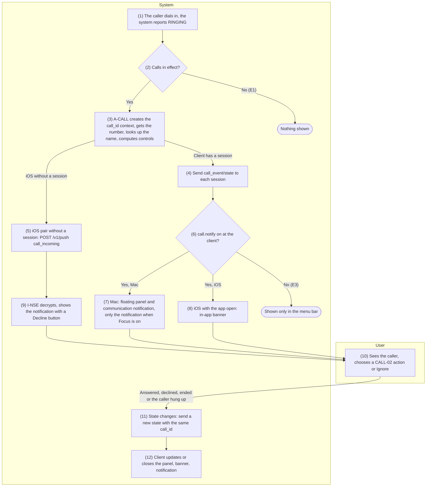
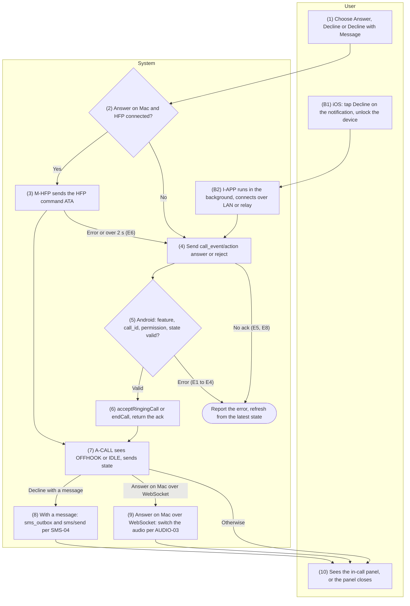
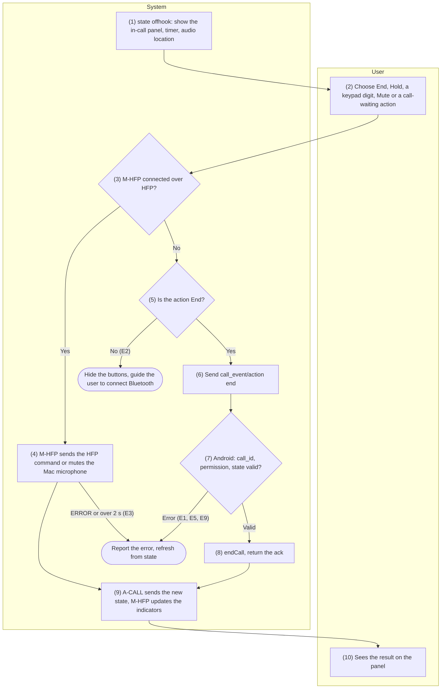
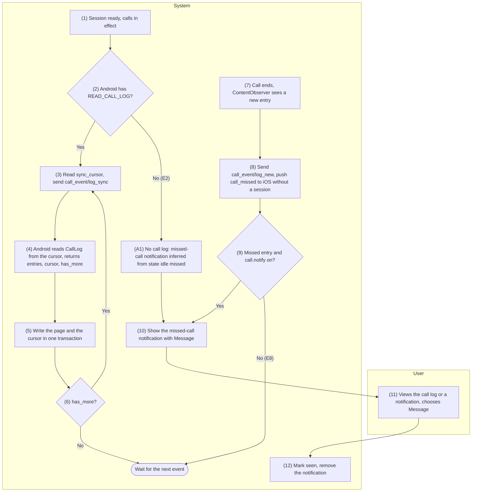

English | [Tiếng Việt](06-call-control.vi.md)

# 6. Function group: Call information and control

> Common references: [`00-common-specs.md`](00-common-specs.md) — components A-CALL, A-AUD, M-APP,
> M-HFP, I-APP, I-NSE (0.1), identifiers `call_id`, `entry_id` (0.2), data types (0.3), envelope and
> `ack` (0.5.1), security principles (0.6.5), message type `call_event` (0.7.1), capabilities
> `features.call`, `features.call_audio.hfp_connected` (0.7.2), error codes `CALL_*`,
> `PERMISSION_MISSING` (0.8.1), data sources `CallLog.Calls`, `PhoneLookup` (0.9.2), tables
> `call_log_entry`, `sync_cursor` (0.9.3), keys `feature.call`, `call.notify` (0.9.5), constant
> `CALLLOG_SYNC_WINDOW` (0.10). Push: CONN-04. Call audio: group 7 (AUDIO-01…04).
>
> Rules for the whole group:
> - **No `InCallService`** (README §5 C12). A-CALL sees only the phone's aggregate state (`IDLE`,
>   `RINGING`, `OFFHOOK`) through public APIs: no per-call details, no certainty when several calls
>   exist, and the number of an outgoing call is unknown until the call log entry is written.
> - Calls are **in effect** for a pair when `feature.call = true` on both sides and Android has
>   `READ_PHONE_STATE`. The incoming number also needs `READ_CALL_LOG` (`features.call.caller_id`);
>   answering, declining and ending need `ANSWER_PHONE_CALLS` (`features.call.can_answer`,
>   `can_end`); contact names need `READ_CONTACTS`.
> - Over WebSocket there are only `answer`, `reject`, `end`. Hold, DTMF, mute and call-waiting
>   handling are possible only through HFP commands sent by the Mac while it is connected to the
>   phone over Bluetooth HFP (P4, M-HFP).
> - iOS uses no PushKit/CallKit (C7): an incoming call on iPhone/iPad is a `time-sensitive`
>   notification or an in-app banner; iPhone/iPad can only decline, never answer.
> - Never log phone numbers, contact names or DTMF keys; logs hold only `type`, `op`, `call_id` and
>   error codes. Errors in this group stay isolated: they never stop A-SVC and never close the
>   `/v1/ctl` session.

## 6.1 CALL-01 — Incoming call notification on Mac/iOS

### 6.1.1 General information

| Item | Content |
|-----|----------|
| Name | CALL-01 — Incoming call notification on Mac/iOS |
| Description | When the phone rings, A-CALL detects the `RINGING` state, creates a call context (`call_id`), gets the incoming number and the contact name, then sends `call_event/state` to every connected client for which calls are in effect.<br>The Mac shows a floating panel (`NSPanel`) on every Space with the name, the number or "No Caller ID", the SIM label if known, buttons according to `controls` and an optional ringtone, together with a communication notification (`INStartCallIntent`); while Focus is on, there is only the notification. An iPhone/iPad with the app open shows an in-app banner; an iPhone/iPad suspended in the background receives a `time-sensitive` APNs notification via CONN-04, which I-NSE decrypts and gives a "Decline" button.<br>Every time the state changes (number or name known, answered, ended, a call waiting, HFP state or audio location changed), A-CALL sends a new `state` so the client updates or closes its UI. `call_event/state` is defined here and shared by CALL-02, CALL-03, CALL-04. |
| Actors | Primary: User (sees the call, chooses an action), Caller (places the call). System: A-CALL, A-SVC, A-AUD (HFP state, audio location), OS (Telephony, Contacts provider), M-APP, I-APP, I-NSE, R-API, PUSH (APNs). |
| Preconditions | 1.<br>A valid pair (PAIR-01).<br>2.<br>Calls are in effect for the pair; A-SVC is running and A-CALL has registered its listeners (SET-01 has requested `READ_PHONE_STATE`, `READ_CALL_LOG`, `READ_CONTACTS`, `ANSWER_PHONE_CALLS`).<br>3.<br>For immediate delivery: the client has a `/v1/ctl` session (CONN-01 or CONN-03); an iPhone/iPad without a session receives it via push once it has registered for push (CONN-04), `relay.enabled = true` and `features.call.notify = true`.<br>4. iOS: the user has allowed notifications, including time-sensitive notifications (SET-03). |
| Postconditions | Connected clients show the call according to `call.notify` within ≤ 300 ms (LAN); a suspended iPhone/iPad has a notification (full content while the device is unlocked).<br>The UI always matches the latest `state`: `offhook` → the Mac switches to the in-call panel (CALL-03), iOS closes the banner; `idle` → close the panel, stop the ringtone, remove the incoming-call notification (missed calls are notified by CALL-04).<br>The call context on Android lives until `IDLE`, then stays another 60 s in the "recently ended" list so it can be matched with the call log (CALL-04).<br>No persistent data is written. |
| Exceptions | E1 — Calls not in effect (turned off on one side, `READ_PHONE_STATE` missing): nothing is sent; PAIR-02 shows the reason.<br>E2 — `READ_CALL_LOG` missing: `number = null`, `presentation = unknown` → show "Unknown Number" with a hint to grant the permission; `READ_CONTACTS` missing: `display_name = null` → show the number.<br>E3 — `call.notify = false` on the client: the Mac opens no panel and does not ring, it only shows the call in the menu of the menu bar icon; iOS shows no banner; Android sends no push to that iPhone/iPad.<br>E4 — Focus is active on the Mac (`isFocused = true`): no panel, no ringing; a time-sensitive communication notification (API 7) lets the system decide based on the caller and the Focus settings; the call still appears in the menu of the menu bar icon.<br>Not yet allowed to read the Focus status → show the panel, no ringing.<br>E5 — Push not possible (relay off, no token yet, APNs error): handled per CONN-04 (`push_outbox` with a 30 s expiry); the missed call will arrive through CALL-04.<br>E6 — The iPhone is locked when the push arrives: I-NSE cannot read the key (C3) → generic content "Incoming call on the phone", no "Decline" button.<br>E7 — The push arrives late (more than 60 s after `started_at`): I-NSE shows "Incoming call at <time>", with no button.<br>E8 — A-SVC starts during a call, or a client connects midway: A-CALL builds the context from the current state (`direction = unknown` if `OFFHOOK`) and sends `state` right after the session exchanges capabilities.<br>E9 — Call waiting (`RINGING` while `OFFHOOK`): `waiting = true`, information only; handling it needs HFP (CALL-03).<br>E10 — The number arrives after the first `RINGING` (the broadcast arrives twice, in no fixed order): A-CALL re-sends `state` with the same `call_id` once the number and name are known. |
| Special requirements | **Performance:** `state` reaches the client in < 200 ms on the LAN, counted from the OS callback (name lookup ≤ 30 ms thanks to an LRU cache); the Mac panel appears ≤ 300 ms after `RINGING`; via the relay ≤ 1 s when a session exists, ≤ 3 s when the phone has to open the relay; iOS push depends on APNs.<br>**Platform:** the Mac panel does not take focus from the app in use (non-activating) and shows on every Space, including full-screen apps — a deliberate deviation from the HIG (panels normally hide while their app is inactive), offset by always pairing it with a communication notification; the Mac needs the Communication Notifications capability, `NSUserActivityTypes` containing `INStartCallIntent`, the `com.apple.developer.focus-status` entitlement and `NSFocusStatusUsageDescription`; I-APP needs the Time Sensitive Notifications entitlement (`com.apple.developer.usernotifications.time-sensitive`); no PushKit/CallKit (C7).<br>**Privacy:** the relay and APNs see only `reason = call_incoming` and generic content; the number and name travel inside the envelope encrypted with `K_push`; numbers and names are never logged.<br>**Compliance:** `READ_CALL_LOG` falls under Google Play's "Cross-device synchronization or transfer of SMS or calls" exception and needs the Permissions Declaration Form (`docs/deployment-guide.md`); `READ_PHONE_STATE`, `READ_CONTACTS`, `ANSWER_PHONE_CALLS` are runtime permissions (SET-01).<br>**Accessibility:** VoiceOver reads "Incoming call from <name or number>" when the panel or banner appears. |

### 6.1.2 Screens

N/A — no approved wireframe yet.

### 6.1.3 Component details

| # | Field | Data type | Input/Output | Initial value | Description |
|---|--------|--------------|--------------|------------------|-------|
| 1 | Title | string | Output | "Incoming Call" | "Call Waiting" when `waiting = true` |
| 2 | Caller name | string | Output | `display_name` | `null` → this line shows the number (field 3) |
| 3 | Caller number | e164 | Output | `number` | National format; `presentation = restricted` → "No Caller ID"; `unknown` or `null` → "Unknown Number" |
| 4 | SIM label | string | Output | Hidden | `sim_label`, only when the phone has > 1 SIM and the ringing SIM is known |
| 5 | Waiting caller | string | Output | Hidden | Only when `waiting = true`: `waiting_display_name` or `waiting_number` ("Unknown Number" when both are `null`); plus "Handle it on the phone or connect via Bluetooth" when `hfp_connected = false` |
| 6 | "Answer" button | action | Input | Hidden | Mac only, when `controls.answer = true`; when call audio is in effect (AUDIO-01) it splits into "Answer on Phone" and "Answer on Mac" → CALL-02 |
| 7 | "Decline" button | action | Input | Hidden | Mac panel, iOS banner, iOS notification action; when `controls.reject = true` → CALL-02 |
| 8 | "Decline with Message" button | action | Input | Hidden | Mac only; when `controls.reject = true`, `number` is not `null`, SMS is in effect and `features.sms.can_send = true` → CALL-02 |
| 9 | "Ignore" button | action | Input | — | Mac only: closes the panel and silences the ringtone on the Mac; the call keeps ringing on the phone and stays in the menu of the menu bar icon |
| 10 | Ringtone on the Mac | audio | Output | Off | Loops while the panel shows, `call.notify = true`, `call.ringtone = true` and Focus is off; stops when `state` changes, when field 6, 7, 8 or 9 is clicked, or after 60 s |
| 11 | iOS notification | string | Output | No title (the system shows the app name), body "Incoming call on the phone" | I-NSE replaces the title with field 2 (or 3) and the body with "Incoming call" plus the SIM label; adds the "Decline" button |
| 12 | Permission hint | string | Output | Hidden | "Allow HandLive to read the call log on the phone to show caller numbers" when `permissions_missing` contains `READ_CALL_LOG` (E2) |
| 13 | "Call Notifications" option | bool | Input/Output | `call.notify` = `true` | Settings → Calls (SET-02), Mac and iOS |
| 14 | "Ring on Mac" option | bool | Input/Output | `call.ringtone` = `true` | Settings → Calls, Mac only; new key, proposed for addition to 0.9.5 |
| 15 | Communication notification on the Mac | string | Output | Title: field 2 (or 3); body "Incoming call" plus the SIM label | `INStartCallIntent` (API 7): passive level while the panel shows (Notification Center only, no banner, no sound), time-sensitive when Focus is on; "Answer" and "Decline" buttons; removed when `state` is no longer `ringing` |

### 6.1.4 Business flow



| Step | Actor | Component | Description | Exceptions / Notes |
|------|----------|-----------|-------|--------------------|
| 1 | System | OS, A-CALL | The caller dials in. The state listener (API 2) reports `RINGING`; the `PHONE_STATE` broadcast (API 3) carries `EXTRA_INCOMING_NUMBER`. | Already `OFFHOOK` → call waiting (E9). |
| 2 | System | A-CALL, A-SVC | Check `feature.call` and `READ_PHONE_STATE` on Android; for each session, check the client's capability (`features.call.enabled`). | No → E1. |
| 3 | System | A-CALL, OS | Create the context: `call_id` (UUIDv7), `direction = incoming`, `state = ringing`, `started_at`.<br>Set `sub_id`, `sim_label` from the per-SIM listeners (if they can be determined).<br>Take the number from the broadcast that carries it, normalize it to E.164; look up the name with `PhoneLookup` (Query); compute `presentation` and `controls` per API 1. | Number arrives later → E10. Permission missing → E2. |
| 4 | System | A-SVC | Build a separate `call_event/state` for each session (the `controls`, `hfp_connected`, `audio_on` fields are computed for the receiving client) and send it. A client that is not on the LAN but waits on the relay: A-SVC opens the relay (CONN-03); the client handshakes again and receives `state` right after the capability exchange. | E8. |
| 5 | System | A-SVC, R-API, PUSH | For each iOS/iPadOS pair with no session, `relay_registered = 1` and a latest capability with `features.call.enabled = true` and `features.call.notify = true`: wait for the number (at most 300 ms after `RINGING`), build a `call_event/state` envelope encrypted with `K_push`, call `POST /v1/push` (API 4).<br>Then open the relay if it is not open yet, so that a "Decline" command from iOS arrives quickly (CALL-02 B2). | Error → E5. No push for a waiting call. |
| 6 | System | M-APP / I-APP | Check `call.notify`. | No → E3 (X2). |
| 7 | System | M-APP | Read the Focus status (API 5). Off: show the panel with fields 1–9, post a passive communication notification (field 15, API 7), play the ringtone (field 10) if `call.ringtone = true`. On: no panel, no ringtone, a time-sensitive communication notification. | E4. |
| 8 | System | I-APP | App in the foreground: in-app banner with fields 1–5, 7 (API 6); no ringing because the phone is already ringing. |  |
| 9 | System | I-NSE, OS | Receive the push (API 6). Device unlocked: decrypt, set the title and body (field 11), the `HL_CALL_INCOMING` category with the "Decline" button, `userInfo`. Device locked or decryption failed: keep the generic content. | E6, E7. |
| 10 | User | M-APP / I-APP | Sees the caller; chooses "Answer", "Decline", "Decline with Message" (CALL-02), "Ignore", or does nothing. |  |
| 11 | System | A-CALL, A-SVC | Any change (number or name known, `OFFHOOK`, `IDLE`, `waiting`, `hfp_connected`, `audio_on`) → send a new `state` with the same `call_id` to the sessions. `IDLE`: set `ended_at`, `end_reason`, move the context to the "recently ended" list (kept 60 s). |  |
| 12 | System | M-APP / I-APP | `ringing` → update the fields; `offhook` → the Mac switches the panel to in-call mode (CALL-03) and removes the communication notification, iOS closes the banner and removes the incoming-call notification; `idle` → close the panel, stop the ringtone, remove the incoming-call notification. | Missed calls: CALL-04. |

### 6.1.5 API/service specification

**List of API calls**

| # | API/service | Channel | Direction | Used in steps |
|---|-------------|------|-------|-------------|
| 1 | `WS call_event/state` | `/v1/ctl` (LAN or relay) | S→C | 4, 11, 12 |
| 2 | Call state listener: `TelephonyCallback.CallStateListener` (API 31+) / `PhoneStateListener` `LISTEN_CALL_STATE` (API 29–30) | Local (Android) | OS → A-CALL | 1, 3, 11 |
| 3 | Broadcast `TelephonyManager.ACTION_PHONE_STATE_CHANGED` (receiver registered at runtime) | Local (Android) | OS → A-CALL | 1, 3 |
| 4 | `POST /v1/push` with `reason = call_incoming` (full specification in CONN-04) | Relay REST → APNs | A-SVC → R-API → PUSH | 5 |
| 5 | Call panel `NSPanel`, ringtone `NSSound`, Focus status `INFocusStatusCenter` | Local (Mac) | — | 7, 12 |
| 6 | In-app banner and the `HL_CALL_INCOMING` notification (`UNNotificationServiceExtension`, `UNUserNotificationCenter`) | Local (iOS), I-NSE | — | 8, 9, 12 |
| 7 | Communication notification on the Mac: `INStartCallIntent`, `UNNotificationContent.updating(from:)`, `UNUserNotificationCenter` | Local (Mac) | — | 7, 12 |

#### API 1 — `WS call_event/state`

- **URL:** `wss://{android_host}:{port}/v1/ctl` (LAN) or via the relay `wss://{RELAY_HOST}/v1/relay`
  with the `to` /`from` wrapper
- **Method:** `WS call_event/state` (S→C), encrypted envelope, no ack (0.7.1). Also the plaintext of
  the envelope in the `call_incoming` push (encrypted with `K_push`, API 4).
- **Request (`data`):**

| Field | Type | Required | Description |
|--------|------|----------|-------|
| `call_id` | uuid | Yes | UUIDv7 of the context; created on `RINGING` from `IDLE` (incoming call) or `OFFHOOK` from `IDLE` (outgoing call started on the phone) |
| `direction` | enum{incoming\ | outgoing\ | unknown} | Yes | `unknown` when the context is built while the phone is already `OFFHOOK` (E8) |
| `state` | enum{ringing\ | offhook\ | idle} | Yes | The phone's aggregate state |
| `waiting` | bool | Yes | `true` when `RINGING` appears while `OFFHOOK` (call waiting) |
| `number` | e164 \ | null | Yes | Number of the main call; `null` when `READ_CALL_LOG` is missing, the number is withheld, or for an outgoing call |
| `display_name` | string \ | null | Yes | Name from `PhoneLookup`; `null` when `READ_CONTACTS` is missing or the number is not in the contacts |
| `presentation` | enum{allowed\ | restricted\ | unknown} | Yes | `allowed`: number available; `restricted`: `READ_CALL_LOG` granted but the number-carrying broadcast has an empty number (the caller withholds it); `unknown`: every other case |
| `sub_id` | int32 \ | null | Yes | SIM of the call (API 2, per-SIM listeners); undetermined → `null` |
| `sim_label` | string \ | null | Yes | SIM name (`SubscriptionInfo.getDisplayName()`) of `sub_id`; only when the phone has > 1 active SIM |
| `waiting_number` | e164 \ | null | Yes | Number of the waiting call; `null` when `waiting = false` or unknown |
| `waiting_display_name` | string \ | null | Yes | Name of the waiting caller |
| `started_at` | timestamp | Yes | When the context was created (Android clock) |
| `answered_at` | timestamp \ | null | Yes | When an incoming call went `RINGING` → `OFFHOOK`; always `null` for outgoing and `unknown` calls (the moment the other party picks up is unknown) |
| `ended_at` | timestamp \ | null | Yes | Only when `state = idle` |
| `end_reason` | enum{missed\ | rejected\ | ended\ | answered_elsewhere} \ | null | Yes | Only when `state = idle`; rules in logic 5 |
| `controls` | object | Yes | Actions the client may perform (table below) |
| `hfp_connected` | bool | Yes | The receiving Mac has the HFP profile connected to the phone (A-AUD, AUDIO-02); always `false` for iPhone/iPad |
| `audio_on` | enum{phone\ | mac} | Yes | `mac`: the call audio is on the receiving Mac itself (SCO to that Mac, or the Opus/WS path of that session — group 7); otherwise `phone` |

The `controls` object:

| Field | Type | Value |
|--------|------|---------|
| `answer` | bool | `true` when `state = ringing`, `waiting = false`, `ANSWER_PHONE_CALLS` is granted and the receiving client is a Mac |
| `reject` | bool | `true` when `state = ringing`, `waiting = false`, `ANSWER_PHONE_CALLS` is granted |
| `end` | bool | `true` when `state = offhook`, `waiting = false`, `ANSWER_PHONE_CALLS` is granted |
| `hold` | enum{hfp\ | unavailable} | `hfp` when `state = offhook` and `hfp_connected = true` |
| `dtmf` | enum{hfp\ | unavailable} | Same as `hold` |
| `mute` | enum{hfp\ | unavailable} | `hfp` when `state = offhook`, `hfp_connected = true` and `audio_on = mac` |

- **Response:** N/A (no ack; a client that missed a message because of a lost connection receives
  the current version when its new session exchanges capabilities — logic 3).
- **Example:** an incoming call ringing, then missed.

```json
{"op":"state","data":{"call_id":"0192f3f0-6a1b-7c2d-8e3f-4a5b6c7d8e90","direction":"incoming","state":"ringing","waiting":false,"number":"+84900000123","display_name":"Nguyễn Văn A","presentation":"allowed","sub_id":1,"sim_label":"SIM 1","waiting_number":null,"waiting_display_name":null,"started_at":1727150400123,"answered_at":null,"ended_at":null,"end_reason":null,"controls":{"answer":true,"reject":true,"end":false,"hold":"unavailable","dtmf":"unavailable","mute":"unavailable"},"hfp_connected":false,"audio_on":"phone"}}
```

```json
{"op":"state","data":{"call_id":"0192f3f0-6a1b-7c2d-8e3f-4a5b6c7d8e90","direction":"incoming","state":"idle","waiting":false,"number":"+84900000123","display_name":"Nguyễn Văn A","presentation":"allowed","sub_id":1,"sim_label":"SIM 1","waiting_number":null,"waiting_display_name":null,"started_at":1727150400123,"answered_at":null,"ended_at":1727150425456,"end_reason":"missed","controls":{"answer":false,"reject":false,"end":false,"hold":"unavailable","dtmf":"unavailable","mute":"unavailable"},"hfp_connected":false,"audio_on":"phone"}}
```

- **Business logic:**
  1. **Data sources:** the state comes from the default listener (API 2); the number from the
     broadcast (API 3); `sub_id` from the per-SIM listeners. A-CALL processes every event
     sequentially on one thread.
  2. **Context state machine:** `IDLE → RINGING` creates an `incoming` context; `IDLE → OFFHOOK`
     creates an `outgoing` context (`number = null`, `presentation = unknown`); `RINGING → OFFHOOK`
     (not waiting) sets `answered_at`; `OFFHOOK → RINGING` sets `waiting = true` and `waiting_*` from
     the broadcast; `RINGING → OFFHOOK` while waiting sets `waiting = false`, clears `waiting_*`, and
     keeps the `call_id` and number of the first call — A-CALL cannot tell whether the waiting call
     was accepted or ignored (limitation C12); `→ IDLE` ends the context. Phone already `RINGING` or
     `OFFHOOK` when the listener is registered → build the context per E8.
  3. **When to send:** whenever a field of `data` differs from the version last sent to that
     session; when a new session has finished exchanging `capability/hello` and the context is not
     `idle`. Never re-send an identical version.
  4. **Per client:** each session gets its own envelope; `controls.answer` is `true` only for a Mac
     (`peer_platform = macos`); `hfp_connected`, `controls.hold` /`dtmf`/`mute`, `audio_on` are
     computed from the `bt_address` and session of the receiving client.
  5. **`end_reason`:** A-CALL called `endCall()` for the ringing call within the previous 3 s
     (CALL-02) → `rejected`; `RINGING → IDLE` without `OFFHOOK` → `missed`; with `OFFHOOK` →
     `ended`. **Correction** (only with `READ_CALL_LOG`): when the call log entry of the context that
     just ended appears (CALL-04 API 3) with type `REJECTED_TYPE`, `BLOCKED_TYPE` (the user declined
     or blocked it on the phone) or `ANSWERED_EXTERNALLY_TYPE` (answered on another device sharing
     the number) while `missed` was already reported, A-CALL sends exactly one more `state` with the
     same `call_id`, `state = idle`, `end_reason` = `rejected` or `answered_elsewhere`. The client
     keeps the last version.
  6. **Client side:** keep the latest context by the envelope `ts`; for a `call_id` that is already
     `idle`, a new version is accepted only if it is also `idle` (the correction); a new `call_id` in
     `ringing` replaces the old context (in case the `idle` version was lost).
  7. Numbers are normalized with libphonenumber for the SIM's country (as in SMS-04 API 1); if that
     fails → keep the original string. Never log `number`, `display_name`, `waiting_*`.

#### API 2 — Call state listener

- **URL:** N/A
- **Method:** API 31+: `TelephonyManager.registerTelephonyCallback(executor, callback)` with a
  `callback` implementing `TelephonyCallback.CallStateListener.onCallStateChanged(state)`; removed
  with `unregisterTelephonyCallback(callback)`. API 29–30:
  `TelephonyManager.listen(listener, PhoneStateListener.LISTEN_CALL_STATE)`, callback
  `PhoneStateListener.onCallStateChanged(state, phoneNumber)`; removed with
  `listen(listener, PhoneStateListener.LISTEN_NONE)`.
- **Request:** one listener on the default `TelephonyManager` (aggregate state) and one listener per
  active SIM on `TelephonyManager.createForSubscriptionId(subId)` (only to set `sub_id`). Registered
  when A-SVC starts, `feature.call = true` and `READ_PHONE_STATE` is granted; the per-SIM listeners
  are registered again when the SIM list changes (`SubscriptionManager.OnSubscriptionsChangedListener`,
  list from `getActiveSubscriptionInfoList()`).
- **Response:** `state` ∈ `TelephonyManager.CALL_STATE_IDLE` (0), `CALL_STATE_RINGING` (1),
  `CALL_STATE_OFFHOOK` (2). The API 31+ callback has no number; the `phoneNumber` of API 29–30 is not
  used (the number always comes from API 3).
- **Example:** the default listener reports `onCallStateChanged(1)` at `t0`; the listener of
  `subId = 1` also reports `1` at `t0 + 12 ms`, the listener of `subId = 2` reports nothing → the new
  context has `sub_id = 1`, `sim_label = "SIM 1"`.
- **Business logic:**
  1. Callbacks run on A-CALL's single-thread executor and are processed sequentially.
  2. On registration the system reports the current state right away → build the context for E8.
  3. `sub_id` is set only when exactly one per-SIM listener reports the same state within 500 ms
     around the default callback; several SIMs reporting, or a phone that does not report per SIM →
     `null`.
  4. Losing `READ_PHONE_STATE` (`SecurityException` or the user revokes the permission) → remove the
     listeners, send `capability/update` with `permissions_missing`; calls are no longer in effect
     (E1). `feature.call` switched to `false` → remove every listener, receiver and observer of the
     group.

#### API 3 — Broadcast `ACTION_PHONE_STATE_CHANGED`

- **URL:** N/A
- **Method:**
  `Context.registerReceiver(receiver, IntentFilter(TelephonyManager.ACTION_PHONE_STATE_CHANGED))`
  in A-SVC (receiver registered at runtime, not declared in the manifest); removed with
  `unregisterReceiver(receiver)`.
- **Request:** N/A (the system broadcasts it when the aggregate state changes).
- **Response:** extra `TelephonyManager.EXTRA_STATE` ∈ {`EXTRA_STATE_IDLE`, `EXTRA_STATE_RINGING`,
  `EXTRA_STATE_OFFHOOK` }; `TelephonyManager.EXTRA_INCOMING_NUMBER` (deprecated since API 29, still
  sent) is present only in the copy delivered to apps that hold both `READ_PHONE_STATE` and
  `READ_CALL_LOG`.
- **Example:** two intents for the same ring: `{state: "RINGING"}` and
  `{state: "RINGING", incoming_number: "0900000123"}` → `number = "+84900000123"`,
  `presentation = allowed`.
- **Business logic:**
  1. An app holding both permissions receives the broadcast **twice** for every state change (one
     copy with `EXTRA_INCOMING_NUMBER`, one without), in no fixed order. A-CALL takes the number only
     from the copy that has the `EXTRA_INCOMING_NUMBER` key (`intent.hasExtra(...)`) and matches it
     to the context by `EXTRA_STATE`.
  2. A `RINGING` copy while the context is `OFFHOOK` → set `waiting_number`; otherwise set `number`.
     The name is looked up for the number just received (Query).
  3. Key present but value empty → `presentation = restricted`. `READ_CALL_LOG` missing → only the
     copy without a number arrives → `number = null`, `presentation = unknown` (E2).
  4. The broadcast never changes the context state (the state source is API 2). A copy with a number
     that arrives before the API 2 callback is held for up to 2 s and applied when the context is
     created.

#### API 4 — `POST /v1/push` (`call_incoming`)

- **URL:** `https://{RELAY_HOST}/v1/push`
- **Method:** `POST`, header `Authorization: Bearer <jwt>` (Android's JWT, 0.6.4).
- **Request:** full structure in CONN-04 API 2. Values used for an incoming call:

| Field | Value |
|--------|---------|
| `pair_id` | Pair of the target iPhone/iPad |
| `to` | `device_id` of the iPhone/iPad |
| `kind` | `alert` |
| `reason` | `call_incoming` |
| `env_b64` | `call_event/state` envelope (API 1, `state = ringing`) encrypted with `K_push` |
| `collapse_key` | `call:<call_id>` — the missed-call push for the same call (CALL-04) replaces this notification |
| `ttl_s` | 30 |

- **Response:** per CONN-04: 202 → done; 409 `PUSH_TOKEN_MISSING` → skip; 403 `NOT_PAIRED` → the pair
  has been revoked (PAIR-03); 429 `RATE_LIMITED`, 502 `PUSH_PROVIDER_ERROR` → write to `push_outbox`,
  30 s expiry (E5).
- **Example (illustrative):**

```http
POST /v1/push HTTP/1.1
Host: relay.example.com
Authorization: Bearer <jwt>
Content-Type: application/json

{"pair_id":"7a6b5c4d-3e2f-4a1b-9c8d-7e6f5a4b3c2d","to":"2c3d4e5f-6a7b-8c9d-8e0f-1a2b3c4d5e6f","kind":"alert","reason":"call_incoming","env_b64":"<b64: call_event/state envelope encrypted with K_push>","collapse_key":"call:0192f3f0-6a1b-7c2d-8e3f-4a5b6c7d8e90","ttl_s":30}
```

- **Business logic:**
  1. Push only when the conditions of step 5 hold; at most one `call_incoming` push per `call_id`; no
     push for a waiting call.
  2. Wait up to 300 ms after `RINGING` for the number, so the push carries the number and the name (a
     push cannot be changed once sent); after that, send with `number = null`.
  3. The relay sets `interruption-level = time-sensitive`, `thread-id = calls` and the default
     content: no title (the system shows the app name), body "Incoming call on the phone" (CONN-04 API
     4); the real content is only inside the envelope.
  4. After the push, A-SVC opens the relay connection (CONN-03) if it is not open yet and keeps it at
     least until the call stops ringing, then follows `RELAY_IDLE_DISCONNECT`; this way I-APP usually
     needs no wake push to decline from the notification.

#### API 5 — Call panel on the Mac

- **URL:** N/A
- **Method:** `NSPanel` (AppKit) with a `styleMask` that includes `.nonactivatingPanel`,
  `level = .floating`, `collectionBehavior = [.canJoinAllSpaces, .fullScreenAuxiliary]`,
  `hidesOnDeactivate = false`, shown with `orderFrontRegardless()`. Ringtone: `NSSound` looping a
  ringtone file from the bundle. Focus: `INFocusStatusCenter.default.focusStatus.isFocused`.
  Accessibility: `NSAccessibility.post(element:notification:userInfo:)` with
  `.announcementRequested`.
- **Request (displayed data):** fields 1–10 from the latest `state`.
- **Response:** the user's action → CALL-02 ("Answer", "Decline", "Decline with Message") or
  "Ignore" (local only).
- **Example:** the `ringing` `state` from the API 1 example → panel in the top-right corner:
  "Incoming Call", "Nguyễn Văn A", the number in national format, "SIM 1", buttons "Answer",
  "Decline", "Decline with Message", "Ignore"; the ringtone plays if Focus is off.
- **Business logic:**
  1. One panel per call, placed in the top-right corner of the screen that has the mouse pointer.
     The panel takes no focus: a user typing in another app is not interrupted.
  2. The ringtone plays only when `call.notify = true`, `call.ringtone = true` and
     `isFocused = false`; it stops when `state` is no longer `ringing`, when a button is clicked, or
     after 60 s; the volume follows the system volume.
  3. Reading the Focus status needs Xcode's "Focus Status" capability (entitlement
     `com.apple.developer.focus-status`) and the user's permission; M-APP asks for it when the user
     turns on "Ring on Mac" (field 14); Info.plist has `NSFocusStatusUsageDescription` ("HandLive
     reads your Focus status so it doesn't ring or show calls while a Focus is on."). Not allowed
     yet (`INFocusStatusCenter.default.authorizationStatus` is not `.authorized`) → **no** ringtone
     of its own (the safe choice for Focus); the panel still shows.
  4. `call.notify = false` → no panel; the menu of the menu bar icon shows the call with buttons
     according to `controls` (E3).
  5. When the panel appears, VoiceOver reads "Incoming call from <name or number>".
  6. `isFocused = true` → no panel (E4); a time-sensitive communication notification (API 7) takes
     its place. A panel that floats while the app is inactive is a deliberate deviation from the HIG
     (design system, Presentation section).
  7. The panel closes only when `state` changes or the user clicks a button or "Ignore"; it never
     closes on a timer (the ringtone stops after 60 s but the panel stays).

#### API 6 — iOS banner and the `HL_CALL_INCOMING` notification

- **URL:** N/A
- **Method:** I-NSE: `UNNotificationServiceExtension.didReceive(_:withContentHandler:)` replaces
  `title`, `body`, sets `categoryIdentifier`, `userInfo`; on an unlocked device it also builds an
  `INStartCallIntent` (`INPerson` from the decrypted name or number) and calls
  `content.updating(from:)` to turn it into a communication notification — the system shows the
  avatar and filters by caller during Focus (I-NSE needs the Communication Notifications
  capability). I-APP registers the category at launch with
  `UNUserNotificationCenter.setNotificationCategories(_:)`: `UNNotificationCategory`
  `HL_CALL_INCOMING` with the `UNNotificationAction` `HL_CALL_REJECT` (title "Decline", options
  `.destructive` and `.authenticationRequired`, no `.foreground`). An app in the foreground receives
  `userNotificationCenter(_:willPresent:withCompletionHandler:)`; the in-app banner is a SwiftUI view
  overlaid on top.
- **Request (notification content set by I-NSE):**

| Property | Value |
|------------|---------|
| `title` | Field 2, or field 3 when there is no name |
| `body` | "Incoming call", plus " · <SIM label>" when present |
| `threadIdentifier` | `calls` (the relay sets `thread-id`) |
| `categoryIdentifier` | `HL_CALL_INCOMING` |
| `interruptionLevel` | `.timeSensitive` (from the APNs `interruption-level`) |
| `userInfo` | `{pair_id, call_id, started_at}` — used by the "Decline" action (CALL-02 B2) |

- **Response:** tap "Decline" → CALL-02 (B1–B3); tap the notification → opens I-APP (connects, shows
  the banner if the call is still ringing).
- **Example:**

```json
{"title":"Nguyễn Văn A","body":"Incoming call · SIM 1","threadIdentifier":"calls","categoryIdentifier":"HL_CALL_INCOMING","userInfo":{"pair_id":"7a6b5c4d-3e2f-4a1b-9c8d-7e6f5a4b3c2d","call_id":"0192f3f0-6a1b-7c2d-8e3f-4a5b6c7d8e90","started_at":1727150400123}}
```

- **Business logic:**
  1. I-NSE decrypts per CONN-04 step 9b; a `call_event/state` envelope with `state = ringing` →
     incoming-call content. Device locked or decryption failed → keep the generic content, set no
     category (E6).
  2. `now − started_at > 60 s` → body "Incoming call at <time>", no category (E7).
  3. Foreground (`willPresent`): a banner already exists for the same `call_id` → do not present the
     system notification; no session yet → show the banner from the decrypted content and connect at
     the same time (CONN-01 or CONN-03).
  4. The phone does not push when the call is answered or declined, so I-APP removes the
     notification itself (`removeDeliveredNotifications(withIdentifiers:)`): when it receives a
     `state` other than `ringing` for that `call_id`, and every time it enters the foreground, for
     every `HL_CALL_INCOMING` notification whose `started_at` is older than 60 s. The missed-call push
     with the same `collapse_key` replaces the notification by itself (CALL-04).

#### API 7 — Communication notification on the Mac

- **URL:** N/A
- **Method:**
  `INStartCallIntent(callRecordFilter: nil, callRecordToCallBack: nil, audioRoute: .unknown, destinationType: .normal, contacts: [INPerson], callCapability: .audioCall)`;
  `INInteraction(intent:response:)` with `direction = .incoming`, `donate(completion:)`;
  `UNMutableNotificationContent.updating(from:)`; `UNUserNotificationCenter.add(_:)`; removed with
  `removeDeliveredNotifications(withIdentifiers:)`. Needs the Communication Notifications capability
  and `NSUserActivityTypes` containing `INStartCallIntent`.
- **Request (notification content):**

| Property | Value |
|------------|---------|
| `INPerson` | `displayName` = field 2, or field 3 when there is no name; `personHandle` = the E.164 number (`.phoneNumber`) so the system can filter by caller during Focus |
| `body` | "Incoming call", plus " · <SIM label>" when present |
| `threadIdentifier` | `calls` |
| `categoryIdentifier` | `HL_CALL_INCOMING_MAC`: actions "Answer" (`HL_CALL_ANSWER`), "Decline" (`HL_CALL_REJECT`, `.destructive`) |
| `interruptionLevel` | `.passive` while the panel shows; `.timeSensitive` when Focus is on and there is no panel |
| `identifier` | `call_id` — one notification per call; post again with the same `identifier` to update it |
| `userInfo` | `{pair_id, call_id, started_at}` |

- **Response:** "Answer" → CALL-02 (`answer`) and opens the in-call panel; "Decline" →
  CALL-02 (`reject`); clicking the notification → brings the panel to the front (opens the panel if
  Focus has been turned off).
- **Example:** the call from the API 1 example while the panel shows → notification
  `identifier = "0192f3f0-6a1b-7c2d-8e3f-4a5b6c7d8e90"`, `interruptionLevel = .passive`: it sits in
  Notification Center, with no banner and no sound.
- **Business logic:**
  1. A call has only one visible alert layer: the panel (Focus off) or the notification banner
     (Focus on). While there is a panel, the notification is passive so the history still sits in
     Notification Center.
  2. Remove the notification when `state` is no longer `ringing` (step 12); missed calls use the
     separate notification of CALL-04.
  3. `call.notify = false` → no notification, no panel (E3).
  4. Notification actions run in the M-APP process (always running) through
     `UNUserNotificationCenterDelegate.userNotificationCenter(_:didReceive:withCompletionHandler:)`;
     no window has to open.

#### Query

```text
// [Design] Android, step 3 and API 3: contact name of the incoming number (read the first row only;
// LRU cache of 200 numbers in A-CALL memory, never written to disk)
ContentResolver.query(
    Uri.withAppendedPath(ContactsContract.PhoneLookup.CONTENT_FILTER_URI, Uri.encode(number)),
    arrayOf(ContactsContract.PhoneLookup.DISPLAY_NAME), null, null, null)
```

```sql
-- [Design] Android, step 4: platform and Bluetooth address of the receiving client (to compute controls, hfp_connected)
SELECT peer_platform, peer_bt_address
FROM paired_device
WHERE pair_id = :pair_id AND revoked_at IS NULL;

-- [Design] Android, step 5: iOS/iPadOS pairs that may need a push (then filtered in memory by open sessions and features_json)
SELECT pair_id, peer_device_id, features_json
FROM paired_device
WHERE revoked_at IS NULL AND relay_registered = 1 AND peer_platform IN ('ios', 'ipados');

-- [Design] Mac/iOS, step 6: the phone's latest capability (features.call, permissions_missing)
SELECT features_json
FROM paired_device
WHERE pair_id = :pair_id AND revoked_at IS NULL;
```

Writing to `push_outbox` when a push fails: see CONN-04.

---

## 6.2 CALL-02 — Answer or decline an incoming call

### 6.2.1 General information

| Item | Content |
|-----|----------|
| Name | CALL-02 — Answer or decline an incoming call |
| Description | From the incoming-call panel (CALL-01), a Mac user answers, declines, or declines with a quick-reply message; an iPhone/iPad user declines from the in-app banner or from the notification's "Decline" button.<br>The client sends `call_event/action` (`answer` or `reject`); Android validates it, then calls `TelecomManager.acceptRingingCall()` or `TelecomManager.endCall()` (permission `ANSWER_PHONE_CALLS`; both methods are deprecated since API 29 but still work — C12).<br>The result shows up through `call_event/state`: `offhook` (answered) or `idle` with `end_reason = rejected`.<br>**Answer on Mac** (P4, needs call audio in effect): the Mac is connected over HFP → M-HFP answers with the HFP command `ATA` so the audio goes straight to the Mac; not connected over HFP → answer over WebSocket, then switch the audio per AUDIO-03 (over HFP — AUDIO-02, or Opus/WS — AUDIO-04).<br>**Decline with Message** (Mac only) = decline, then send a quick-reply SMS to the caller through SMS-04; the message templates are stored locally on the Mac. |
| Actors | Primary: User. System: M-APP, M-HFP, I-APP, A-SVC, A-CALL, A-SMS (quick-reply message), OS (Telecom, `UNUserNotificationCenter`), R-API (forwarding via the relay, wake push). |
| Preconditions | 1.<br>A context with `state = ringing`, `waiting = false` exists (CALL-01) and the client is showing it.<br>2. `controls.answer` (Mac only) or `controls.reject` is `true` (Android has `ANSWER_PHONE_CALLS`).<br>3.<br>A `/v1/ctl` session exists; iOS from a notification: I-APP connects by itself in a background task.<br>4.<br>Answer on Mac: call audio is in effect (AUDIO-01 accepted, `feature.call_audio = true` on both sides).<br>5.<br>Decline with Message: `number` is not `null`, SMS is in effect and `features.sms.can_send = true`. |
| Postconditions | **Answer:** the phone is `OFFHOOK`; every client receives `state = offhook` with `answered_at`; the Mac switches to the in-call panel (CALL-03); the audio is on the phone or on the Mac as chosen (`audio_on`).<br>**Decline:** the call ends, `state = idle` with `end_reason = rejected`; the phone's call log records type `rejected`, and there is no missed-call notification.<br>**With a message:** one more `sms_outbox` row and one SMS to the caller per SMS-04.<br>**Failure:** the call is unchanged; the client refreshes its UI from the latest `state`. |
| Exceptions | E1 — `CALL_NOT_FOUND`: the context has ended or the `call_id` is stale.<br>E2 — `CALL_ACTION_NOT_ALLOWED`: the state no longer allows it (already answered on the phone, another client was faster, it is a waiting call, an iPhone/iPad sent `answer`).<br>E3 — `PERMISSION_MISSING` (`details.permission = "android.permission.ANSWER_PHONE_CALLS"`): hide the buttons, show the SET-01 guidance.<br>E4 — `FEATURE_DISABLED`.<br>E5 — No `ack` within `REQUEST_TIMEOUT`, or the session is lost: the panel returns to its previous state with "Couldn't send the command to the phone"; never re-send automatically with a new `id` (the call may have changed).<br>E6 — The HFP command `ATA` returns `ERROR` or gets no response within 2 s: send `call_event/action answer` (`audio = mac`) over WebSocket as in the non-HFP branch.<br>E7 — Switching the audio to the Mac fails after the call was answered: the call stays answered, with the audio on the phone (`audio_on = phone`); the error is reported per AUDIO-03 (`CALL_ROUTE_FAILED`, `CALL_BT_NOT_CONNECTED`, `SHIZUKU_NOT_RUNNING`, `CALL_AUDIO_CAPTURE_UNSUPPORTED`).<br>E8 — iOS from a notification: cannot connect, or no `ack` within 15 s → local notification "Couldn't decline the call".<br>E9 — Decline with Message after the call was already answered: the message is not sent, show "The call was answered, so the message wasn't sent"; an SMS send error → handled per SMS-04.<br>E10 — The iOS notification has no "Decline" button (device locked when the push arrived, CALL-01 E6): the user opens I-APP to decline from the banner. |
| Special requirements | **Performance:** answer < 500 ms from the click until the Mac receives `state = offhook` (LAN, both the WebSocket branch and the `ATA` branch); decline < 500 ms to `state = idle`; iOS from a notification ≤ 15 s, including the background connection.<br>**No duplicate actions:** buttons are locked after the first click until an `ack` or a new `state` arrives; network retries reuse the same envelope `id` (Android deduplicates per 0.5.1); Android accepts only one command per `call_id` within 3 s (another client clicking at the same time gets `CALL_ACTION_NOT_ALLOWED`).<br>**Safety:** only an authenticated session of a valid pair can send commands; `answer` is accepted only from a Mac.<br>**Privacy:** quick-reply messages are never logged; the templates live in the Mac's `UserDefaults` and are not synced to other devices. |

### 6.2.2 Screens

N/A — no approved wireframe yet.

### 6.2.3 Component details

| # | Field | Data type | Input/Output | Initial value | Description |
|---|--------|--------------|--------------|------------------|-------|
| 1 | "Answer" button | action | Input | — | Mac; when call audio is not in effect: answer on the phone (`audio = phone`) |
| 2 | Where to answer | enum{phone\ | mac} | Input | `phone` | "Answer on Phone" / "Answer on Mac"; shown only when call audio is in effect (AUDIO-01) |
| 3 | "Decline" button | action | Input | — | Mac panel, iOS banner |
| 4 | "Decline" action on the notification | action | Input | — | iOS (`HL_CALL_REJECT`); the system requires unlocking the device before it runs |
| 5 | "Decline with Message" button | action | Input | — | Mac; opens the list of templates (fields 6, 7) |
| 6 | Quick-reply template | string(160) | Input | "I'll call you back later", "I'm in a meeting" | Choosing a template from `call.quick_replies` → declines and sends right away |
| 7 | Custom message | string(160) | Input | Empty | The "Custom Message…" item: a single-line field, click "Send"; nothing is sent when it is empty after trimming whitespace |
| 8 | Template list | array<string(160)> | Input/Output | `call.quick_replies` | Settings → Calls (Mac): add, edit, delete, reorder; at most 6 templates; new key, proposed for addition to 0.9.5 |
| 9 | In-progress state | enum{idle\ | answering\ | rejecting} | Output | `idle` | "Answering…", "Declining…"; the buttons are locked |
| 10 | Error message | string | Output | Hidden | Per E1–E9: "The call has ended", "The call was answered on the phone", "The phone hasn't allowed HandLive to answer calls", "Couldn't send the command to the phone", "Couldn't switch the audio to the Mac" |
| 11 | iOS notification "Couldn't decline the call" | string | Output | — | E8: "Couldn't decline the call. It's still ringing on the phone." |

### 6.2.4 Business flow



| Step | Actor | Component | Description | Exceptions / Notes |
|------|----------|-----------|-------|--------------------|
| 1 | User | M-APP / I-APP | Mac: click "Answer" (or "Answer on Phone" / "Answer on Mac"), "Decline", or "Decline with Message" and then pick a template or type a message. iOS: tap "Decline" on the banner. The client locks the buttons and shows field 9. | Buttons exist only when `controls` allows them. |
| 2 | System | M-APP | "Answer on Mac" and M-HFP has an HFP connection (`hfp_connected = true`) → step 3; every other case → step 4. |  |
| 3 | System | M-HFP | Send the HFP command `ATA` (API 4); the phone answers and opens the SCO audio connection to the Mac. No `call_event/action` is sent. | `ERROR` or over 2 s → E6, go to step 4 with `audio = mac`. |
| 4 | System | M-APP / I-APP | Send `call_event/action` (API 1) `{call_id, action, audio}`; wait for the `ack` up to `REQUEST_TIMEOUT`; session lost while waiting → re-send with the same `id` if the session reconnects before the deadline. | Timeout → E5. |
| 5 | System | A-SVC, A-CALL | Check in order: `feature.call`, `action`, `call_id` matches the current context, the `ANSWER_PHONE_CALLS` permission, the state (`ringing`, not waiting, no other command within 3 s), the client platform for `answer`. | Error `ack` → E1–E4 (X1). |
| 6 | System | A-CALL, OS | `answer` → `acceptRingingCall()` (API 2), store `audio` in the context. `reject` → mark the context "declined by HandLive", then `endCall()` (API 3). Return `ack` `{}`. | `endCall()` returns `false` → `CALL_NOT_FOUND`; `SecurityException` → `PERMISSION_MISSING`. |
| 7 | System | A-CALL, A-SVC | The listener reports `OFFHOOK` (sets `answered_at`) or `IDLE` (`end_reason = rejected`); `state` is sent to every session (CALL-01 API 1). Other clients showing the call update as well. | No new `state` within 3 s after the `ack` → the client unlocks the buttons and shows the most recent `state`. |
| 8 | System | M-APP, A-SMS | Decline with Message: on a successful `ack` or on `state = idle`, M-APP creates the `sms_outbox` row and sends `sms/send` (API 5) to `number`, through the call's `sub_id`. | `state = offhook` → not sent (E9). |
| 9 | System | M-APP, A-AUD | "Answer on Mac" that went through step 4: after a successful `ack`, M-APP runs AUDIO-03 to switch the audio to the Mac (connect HFP per AUDIO-02, then open SCO, or Opus/WS per AUDIO-04). | Error → E7. |
| 10 | User | M-APP / I-APP | Mac: sees the in-call panel (CALL-03) with `audio_on`, or the panel closes after declining; the reply message appears in the conversation (SMS-04). iOS: the banner closes. |  |
| B1 | User | I-APP (notification) | iOS: tap "Decline" on the incoming-call notification (CALL-01 API 6); the system asks to unlock (`.authenticationRequired`). | Notification without the button → E10. |
| B2 | System | I-APP | The system wakes I-APP in the background (API 6).<br>I-APP asks for background execution time, reads `pair_id`, `call_id` from `userInfo`, connects via CONN-01 (LAN) or CONN-03 (relay — the phone has usually opened the relay after the push, CALL-01 API 4; if it is not online yet, send a `call_action` wake per CONN-04), then performs step 4 with `reject`. |  |
| B3 | System | I-APP | Successful `ack`, `CALL_NOT_FOUND` or `CALL_ACTION_NOT_ALLOWED` → remove the notification, end the background task. Cannot connect, or over 15 s → post field 11, end the background task. | E8. |

### 6.2.5 API/service specification

**List of API calls**

| # | API/service | Channel | Direction | Used in steps |
|---|-------------|------|-------|-------------|
| 1 | `WS call_event/action` (`answer`, `reject`) | `/v1/ctl` (LAN or relay) | C→S, with ack | 4, 5, 6, B2 |
| 2 | `TelecomManager.acceptRingingCall()` | Local (Android) | A-CALL → OS | 6 |
| 3 | `TelecomManager.endCall()` | Local (Android) | A-CALL → OS | 6 |
| 4 | HFP command `ATA` via M-HFP | Bluetooth HFP (Mac in the HF role, phone in the AG role) | M-HFP → phone | 3 |
| 5 | `WS sms/send` (main specification in SMS-04 API 1) | `/v1/ctl` (LAN or relay) | C→S, with ack | 8 |
| 6 | Notification action `HL_CALL_REJECT` and the iOS background task | Local (iOS) | OS → I-APP | B1–B3 |

The result of step 7 travels through `call_event/state` (CALL-01 API 1); the `call_action` wake push
in B2 follows CONN-04 API 2 — no new call is introduced.

#### API 1 — `WS call_event/action`

- **URL:** `wss://{android_host}:{port}/v1/ctl` (LAN) or via the relay `wss://{RELAY_HOST}/v1/relay`
  with the `to` /`from` wrapper
- **Method:** `WS call_event/action` (C→S), encrypted envelope, with ack. Shared with CALL-03 (`end`).
- **Request (`data`):**

| Field | Type | Required | Description |
|--------|------|----------|-------|
| `call_id` | uuid | Yes | Of the context the client is showing |
| `action` | enum{answer\ | reject\ | end\ | hold\ | unhold\ | dtmf\ | mute} | Yes | Over WebSocket only `answer`, `reject`, `end` are carried out; the other values always get `CALL_HFP_REQUIRED` (0.7.1) |
| `audio` | enum{phone\ | mac} | No | Only with `answer`: where the user wants to take the call; absent → `phone` |

- **Response (`ack.data`):** `{}` when `ok = true` — Android has called the Telecom API; the actual
  result travels through `state`.

Errors (`ack.error.code`), in check order:

| Code | When |
|----|---------|
| `FEATURE_DISABLED` | `feature.call = false` on Android |
| `BAD_REQUEST` | Missing field, or `action` or `audio` outside the list |
| `CALL_HFP_REQUIRED` | `action` ∈ {`hold`, `unhold`, `dtmf`, `mute`}; `details.action` = the value sent |
| `CALL_NOT_FOUND` | No context, a `call_id` other than the current context, or `endCall()` returns `false` when the phone is already `IDLE` |
| `PERMISSION_MISSING` | `ANSWER_PHONE_CALLS` missing; `details.permission = "android.permission.ANSWER_PHONE_CALLS"` |
| `CALL_ACTION_NOT_ALLOWED` | `details.state` = the current state; `details.reason` = `state` (`answer`/`reject` when not `ringing`, `end` when not `offhook`, or another command for the `call_id` within 3 s), `waiting` (a waiting call is present), `platform` (`answer` from an iPhone/iPad), `system` (Telecom refuses, for example an emergency call — CALL-03) |

- **Example:**

```json
{"op":"action","data":{"call_id":"0192f3f0-6a1b-7c2d-8e3f-4a5b6c7d8e90","action":"answer","audio":"phone"}}
{"re":"0192f3f1-0b2c-7d3e-8f4a-5b6c7d8e9f01","ok":true,"data":{}}
```

```json
{"op":"action","data":{"call_id":"0192f3f0-6a1b-7c2d-8e3f-4a5b6c7d8e90","action":"reject"}}
{"re":"0192f3f1-2c3d-7e4f-9a5b-6c7d8e9f0a12","ok":false,"error":{"code":"CALL_ACTION_NOT_ALLOWED","message":"Cuộc gọi không còn đổ chuông","details":{"state":"offhook","reason":"state"}}}
```

- **Business logic:**
  1. Check in the order of the error table; `call_id` is compared only with the current context (a
     `call_id` in the "recently ended" list is not accepted).
  2. The `ack` is sent as soon as the Telecom method returns, without waiting for `OFFHOOK` /`IDLE`;
     the client treats `state` as the final result.
  3. The first valid command for a `call_id` holds an "action lock" for 3 s; any other command (same
     or another client, different `id`) during that time → `CALL_ACTION_NOT_ALLOWED` (`state`). A
     re-send with the same `id` → gets the original `ack` again (0.5.1).
  4. `reject`: set the "declined by HandLive" flag before calling `endCall()`; the flag expires after
     3 s and is used to derive `end_reason = rejected` (CALL-01 API 1, logic 5).
  5. `answer` with `audio = mac`: the call is answered the same way; `audio` is stored in the context
     so that A-AUD knows the audio is about to move to the Mac (AUDIO-03). M-APP initiates the switch;
     M-APP shows "Answer on Mac" only when call audio is in effect on both sides.
  6. Client: `ok = false` → show field 10 for the code, unlock the buttons, apply the latest `state`;
     `ok = true` → wait up to 3 s for `state`.

#### API 2 — `TelecomManager.acceptRingingCall()`

- **URL:** N/A
- **Method:** `context.getSystemService(TelecomManager::class.java).acceptRingingCall()`; runtime
  permission `ANSWER_PHONE_CALLS`. Deprecated since API 29, still works (C12).
- **Request:** no parameters (the variant without `videoState` — a voice call).
- **Response:** no return value; the result shows up through the listener (`OFFHOOK`). Missing
  permission → `SecurityException`.
- **Example:** context `0192f3f0-6a1b-7c2d-8e3f-4a5b6c7d8e90` is `ringing` → `acceptRingingCall()`
  → about 150 ms later the listener reports `CALL_STATE_OFFHOOK` → `state = offhook`,
  `answered_at = 1727150405321`.
- **Business logic:**
  1. Called on the A-CALL thread; `SecurityException` → `PERMISSION_MISSING`, send
     `capability/update` (`can_answer = false`, `permissions_missing`).
  2. Called only when the aggregate state is `RINGING` and there is no waiting call; with a waiting
     call the system would hold or drop the active call — that is call-waiting handling, done only
     over HFP (CALL-03).
  3. A phone with a locked screen can still answer. The audio follows the phone's default route
     (earpiece, wired headset, or the connected Bluetooth device).

#### API 3 — `TelecomManager.endCall()`

- **URL:** N/A
- **Method:** `telecomManager.endCall()` → `Boolean`; permission `ANSWER_PHONE_CALLS`. Deprecated
  since API 29, still works (C12). Shared with CALL-03.
- **Request:** no parameters.
- **Response:** `true` when Telecom has declined the ringing call or ended the active call; `false`
  when there is no call or Telecom does not allow ending it (for example an emergency call).
- **Example:** the context is `ringing`, the "declined by HandLive" flag is set → `endCall()` =
  `true` → the listener reports `CALL_STATE_IDLE` → `state = idle`, `end_reason = rejected`; the call
  log records `REJECTED_TYPE`.
- **Business logic:**
  1. The foreground call is ringing → Telecom declines it; it is active → Telecom ends it (CALL-03).
  2. `false` when the phone is already `IDLE` → `CALL_NOT_FOUND`; `false` while the phone is still
     `RINGING` or `OFFHOOK` → `CALL_ACTION_NOT_ALLOWED` (`reason = system`).
  3. Never called when `waiting = true` (API 1): with two calls, the aggregate state does not tell
     which call would be affected.

#### API 4 — HFP command `ATA` via M-HFP

- **URL:** N/A (HFP service-level connection between the Mac — HF role — and the phone — AG role; set
  up in AUDIO-02)
- **Method:** M-HFP sends the HFP command through the protocol abstraction (implementation layer
  `IOBluetoothHandsFreeDevice`, raw AT commands via `sendATCommand`).
- **Request:** `ATA`
- **Response:** `OK`, then the `+CIEV` indicator (the call becomes active); or `ERROR`.
- **Example:** the Mac sends `ATA` → the phone replies `OK`, `+CIEV` reports an active call, SCO
  opens to the Mac → A-CALL sees `OFFHOOK`, A-AUD sees SCO to the Mac → `state = offhook`,
  `audio_on = mac`.
- **Business logic:**
  1. Used only when the user chooses "Answer on Mac", call audio is in effect and M-HFP has an HFP
     connection to the phone; M-HFP accepts no commands until AUDIO-01 has been accepted.
  2. Wait up to 2 s for `OK`; `ERROR` or timeout → E6 (send `answer` over WebSocket with
     `audio = mac`).
  3. There is no `call_event/action`, so the context on Android has no `audio`; A-AUD detects the
     SCO link to the Mac by itself and `state` reports `audio_on = mac`.
  4. Declining never goes over HFP: it always uses `call_event/action reject`, so the Mac and
     iPhone/iPad share one path and A-CALL can set `end_reason = rejected`.

#### API 5 — `WS sms/send` for "Decline with Message"

- **URL:** as in API 1
- **Method:** `WS sms/send` (C→S), encrypted envelope, with ack — main specification in SMS-04 API 1.
- **Request (`data`), values used here:**

| Field | Value |
|--------|---------|
| `local_id` | A new UUIDv7 |
| `thread_id` | The existing conversation with the caller's number (Query); none → absent |
| `addresses` | `[number]` from `state` |
| `body` | The chosen template (field 6) or the custom message (field 7) |
| `sub_id` | `sub_id` from `state`; `null` → absent (the default SMS SIM) |

- **Response:** per SMS-04 API 1 (`{accepted, parts}`); subsequent status via `sms/status`.
- **Example:**

```json
{"op":"send","data":{"local_id":"0192f3f1-4d5e-7f60-8a7b-9c0d1e2f3a4b","thread_id":42,"addresses":["+84900000123"],"body":"I'm in a meeting","sub_id":1}}
```

- **Business logic:**
  1. Sent when the `reject` `ack` succeeds or once `state = idle` for the call has arrived;
     `state = offhook` → not sent (E9).
  2. Goes through `sms_outbox` as in SMS-04 (provisional bubble, retries, status); the message
     appears in the conversation with the caller.
  3. `call.quick_replies` lives in the Mac's `UserDefaults`, each template ≤ 160 characters, at most
     6 templates; a fresh install has two default templates (field 6).

#### API 6 — The `HL_CALL_REJECT` action on iOS

- **URL:** N/A
- **Method:**
  `UNUserNotificationCenterDelegate.userNotificationCenter(_:didReceive:withCompletionHandler:)`
  receives a `UNNotificationResponse` with `actionIdentifier = "HL_CALL_REJECT"` (category in CALL-01
  API 6). Connecting and sending happen inside
  `UIApplication.beginBackgroundTask(withName:expirationHandler:)` … `endBackgroundTask(_:)`.
- **Request:**

| Property | Value |
|------------|---------|
| `actionIdentifier` | `HL_CALL_REJECT` |
| `notification.request.content.userInfo` | `{pair_id, call_id, started_at}` set by I-NSE |

- **Response:** call `completionHandler()` when there is a result (B3) or after 15 s.
- **Example:**
  `userInfo = {"pair_id":"7a6b5c4d-3e2f-4a1b-9c8d-7e6f5a4b3c2d","call_id":"0192f3f0-6a1b-7c2d-8e3f-4a5b6c7d8e90","started_at":1727150400123}`
  → connect via the relay → `call_event/action` `{call_id, action: "reject"}` → successful `ack` →
  remove the notification.
- **Business logic:**
  1. The `.authenticationRequired` option guarantees that the device is unlocked, so I-APP can read
     `PRK` from the Keychain (C3) even when the process has to relaunch.
  2. `now − started_at > 90 s` → nothing is sent (the call has certainly ended); only remove the
     notification.
  3. Order of connection paths: LAN (CONN-01) → relay (CONN-03). The phone is not online on the
     relay yet → `POST /v1/push` `kind = wake`, `reason = call_action` (CONN-04), then wait for
     presence for the remaining time.
  4. Result per B3; an error never brings I-APP to the foreground.

#### Query

```sql
-- [Design] Android, step 5: platform of the client sending the command (answer is accepted only from a Mac)
SELECT peer_platform
FROM paired_device
WHERE pair_id = :pair_id AND revoked_at IS NULL;

-- [Design] Mac, step 8: existing conversation with the caller's number, to attach thread_id to the quick reply
SELECT thread_id
FROM sms_thread
WHERE pair_id = :pair_id AND addresses_json = :addresses_json   -- '["+84900000123"]'
LIMIT 1;

-- [Design] Mac, step 8: create the queue entry for the quick reply (as in SMS-04, Query step 3)
INSERT INTO sms_outbox (local_id, pair_id, thread_id, addresses_json, body, sub_id,
                        state, attempts, created_at, updated_at)
VALUES (:local_id, :pair_id, :thread_id, :addresses_json, :body, :sub_id,
        'pending', 0, :now, :now);
```

The call context, the action lock and the "declined by HandLive" flag live in A-CALL memory; there
is no table.

---

## 6.3 CALL-03 — Control an ongoing call

### 6.3.1 General information

| Item | Content |
|-----|----------|
| Name | CALL-03 — Control an ongoing call |
| Description | While the phone is in a call (`state = offhook`: an answered incoming call, or an outgoing call dialed on the phone), the Mac shows the in-call panel with the name or number, a timer counting from `answered_at`, the status and where the audio is playing (`audio_on`).<br>"End" goes out as the HFP command `AT+CHUP` when the Mac is connected over HFP, otherwise over WebSocket as `call_event/action end` → `TelecomManager.endCall()`.<br>Hold/resume (`AT+CHLD=2`), the DTMF keypad (`AT+VTS`) and mute (muting the Mac microphone while the audio is on the Mac) work **only** over HFP when `hfp_connected = true` (P4); sending them over WebSocket gets `CALL_HFP_REQUIRED`, and the UI hides these buttons when HFP is not connected.<br>Call waiting: over WebSocket there is information only; handling it (`AT+CHLD=0` declines the waiting call, `AT+CHLD=1` ends the active call and answers the waiting call, `AT+CHLD=2` holds the active call and answers the waiting call) needs HFP.<br>Switching the audio between the Mac and the phone belongs to AUDIO-03. |
| Actors | Primary: User (Mac). System: M-APP, M-HFP, A-SVC, A-CALL, A-AUD, OS (Telecom; the Android Bluetooth stack in the AG role). |
| Preconditions | 1.<br>A context with `state = offhook` exists (CALL-01, CALL-02) and the Mac has a `/v1/ctl` session or is connected to the phone over HFP.<br>2.<br>"End" over WebSocket: `controls.end = true` (`ANSWER_PHONE_CALLS` granted).<br>3.<br>Hold, DTMF, mute, call-waiting handling: M-HFP has an HFP connection to the phone (AUDIO-02, P4, AUDIO-01 accepted); mute also needs `audio_on = mac`. |
| Postconditions | The action is applied on the phone; when the aggregate state changes, every client receives a new `state` (ended → `idle`, `end_reason = ended`; waiting call handled → `waiting = false`).<br>The hold state, the muted microphone and the DTMF digits exist only in M-HFP (WebSocket carries none of this).<br>Ended: the panel shows "Call ended · mm:ss" for 2 s, then closes. |
| Exceptions | E1 — `CALL_NOT_FOUND` or `CALL_ACTION_NOT_ALLOWED` (`state`): the call has ended or changed state → refresh from `state`.<br>E2 — `CALL_HFP_REQUIRED` (the client sent `hold`, `unhold`, `dtmf`, `mute` over WebSocket): hide the buttons, show "Connect to the phone via Bluetooth to hold, use the keypad, or mute" (AUDIO-02).<br>E3 — The phone returns `ERROR` or does not respond to the HFP command within 2 s (for example the AG does not support three-way calling, so there is no `AT+CHLD`): show "The phone couldn't perform this action", keep the state unchanged.<br>E4 — HFP disconnects mid-call: `hfp_connected = false` (via `state` and `call_event/hfp_status`), the HFP-only buttons hide, mute is cancelled, "End" moves to WebSocket.<br>E5 — `PERMISSION_MISSING` (`ANSWER_PHONE_CALLS`) and no HFP connection: the "End" button is hidden, SET-01 guidance.<br>E6 — WebSocket session lost mid-call: the panel shows "Lost connection to the phone"; HFP actions still work while connected; when the session reconnects, A-CALL sends the current `state` (CALL-01 E8).<br>E7 — Call waiting: while `waiting = true`, `controls.end = false` and the panel hides "End"; HFP connected → show the three call-waiting buttons; no HFP → information only.<br>E8 — Outgoing call started on the phone: the number is unknown (`number = null`) → "Outgoing Call"; the timer counts from `started_at` (ringing time included); the number shows up in the call log after the call ends (CALL-04).<br>E9 — Telecom refuses to end the call (for example an emergency call: `endCall()` returns `false` while the phone is still `OFFHOOK`) → `CALL_ACTION_NOT_ALLOWED` (`reason = system`), show "End this call on the phone". |
| Special requirements | **Performance:** "End" < 500 ms to `state = idle` (LAN or HFP); DTMF: each key is sent right away, through a sequential queue that waits for the `OK` of each command (≤ 300 ms per key).<br>**Timer:** independent of clock skew between the two devices: duration = (envelope `ts` − `answered_at`) + the time elapsed on the Mac since the envelope arrived.<br>**Platform limits (C12):** WebSocket has only the aggregate state; with HFP connected, M-HFP also gets the AG indicators (`+CIEV`, `+CCWA`, `+CLCC`) and so knows about held calls and the waiting call's number more accurately — the UI prefers the HFP information when it has it.<br>**Privacy:** DTMF keys are never logged (they may be a PIN or an OTP); the dialed digits are not stored.<br>**Scope:** iPhone/iPad do not have this function (they only close the banner on `state = offhook`, CALL-01). |

### 6.3.2 Screens

N/A — no approved wireframe yet.

### 6.3.3 Component details

| # | Field | Data type | Input/Output | Initial value | Description |
|---|--------|--------------|--------------|------------------|-------|
| 1 | Name or number | string | Output | `display_name` / `number` | As in CALL-01 fields 2–3; "Outgoing Call" when the number of an outgoing call is unknown (E8) |
| 2 | Timer | string (mm:ss) | Output | "00:00" | Counts from `answered_at`; `answered_at = null` → counts from `started_at` |
| 3 | Status | enum{active\ | held\ | waiting\ | ended} | Output | `active` | "On call", "On hold" (only with HFP connected), "Call waiting", "Call ended · mm:ss" |
| 4 | Audio location | enum{phone\ | mac} | Output | `audio_on` | "Audio: Phone" / "Audio: Mac"; the switch button → AUDIO-03 |
| 5 | "End" button | action | Input | — | Shown when `waiting = false` and (`controls.end = true` or M-HFP is connected) |
| 6 | "Hold" / "Resume" button | action | Input | Hidden | Only when `controls.hold = hfp` and `waiting = false` |
| 7 | DTMF keypad | string(1) | Input | Hidden | Only when `controls.dtmf = hfp`; one of `0`–`9`, `*`, `#`; also takes keys from the Mac keyboard while the panel has focus |
| 8 | Dialed digits | string | Output | Empty | Below the keypad; cleared when the keypad closes; never stored, never logged |
| 9 | "Mute" button | bool | Input/Output | `false` | Only when `controls.mute = hfp`; `true` = the Mac microphone is muted |
| 10 | Waiting caller | string | Output | Hidden | `waiting_display_name` / `waiting_number`, or the number from `+CCWA` with HFP connected |
| 11 | Call-waiting buttons | enum{reject_waiting\ | end_and_accept\ | hold_and_accept} | Input | Hidden | Only when `waiting = true` and M-HFP is connected: "Decline Waiting Call" (`AT+CHLD=0`), "End & Answer" (`AT+CHLD=1`), "Hold & Answer" (`AT+CHLD=2`) |
| 12 | Error message, guidance | string | Output | Hidden | Per E1–E9 |

### 6.3.4 Business flow



| Step | Actor | Component | Description | Exceptions / Notes |
|------|----------|-----------|-------|--------------------|
| 1 | System | M-APP | Receives `state = offhook` (after CALL-02, or a call started on the phone with `call.notify = true`): the panel switches to in-call mode (fields 1–4) and starts the timer; the buttons follow `controls` and M-HFP's HFP connection. | E8. |
| 2 | User | M-APP | Chooses an action: "End", "Hold"/"Resume", a DTMF key, "Mute", or one of the call-waiting buttons. | Call waiting → E7. |
| 3 | System | M-APP | M-HFP has an HFP service-level connection to the phone → step 4; otherwise → step 5. |  |
| 4 | System | M-HFP | Send the HFP command (API 3) and wait up to 2 s for `OK`: End → `AT+CHUP`; Hold/Resume → `AT+CHLD=2`; DTMF key → `AT+VTS=<key>`; call waiting → `AT+CHLD=0`, `1` or `2`. Mute has no AT command: M-HFP stops feeding the Mac microphone into the SCO channel (it sends silent frames). | `ERROR` or timeout → E3 (X2). |
| 5 | System | M-APP | No HFP connection: only "End" can go over WebSocket; the other buttons are already hidden. | A client that sends another action over WebSocket → `CALL_HFP_REQUIRED` (E2, X1). |
| 6 | System | M-APP | Send `call_event/action` `{call_id, action: "end"}` (API 1), wait for the `ack` up to `REQUEST_TIMEOUT`. | Timeout → as in CALL-02 E5. |
| 7 | System | A-SVC, A-CALL | Check as in CALL-02 step 5 with `end`: `state = offhook`, `waiting = false`, `ANSWER_PHONE_CALLS` granted. | E1, E5, E7. |
| 8 | System | A-CALL, OS | Call `endCall()` (API 2), return `ack` `{}`. | `false` → `CALL_NOT_FOUND` (phone already `IDLE`) or `CALL_ACTION_NOT_ALLOWED` (`system`, E9). |
| 9 | System | A-CALL, A-SVC, M-HFP | The aggregate state changes → a new `state` (API 4): `idle` with `end_reason = ended`, or `waiting = false` after the waiting call was handled. Hold, mute and DTMF do not change the aggregate state: the panel updates from the `OK` response and the HFP indicators (`+CIEV` for `callheld`). | E4 when HFP disconnects. |
| 10 | User | M-APP | Sees "On hold", the microphone muted, the dialed digits, or "Call ended · mm:ss" (the panel closes after 2 s). |  |

### 6.3.5 API/service specification

**List of API calls**

| # | API/service | Channel | Direction | Used in steps |
|---|-------------|------|-------|-------------|
| 1 | `WS call_event/action` with `end` (main specification in CALL-02 API 1) | `/v1/ctl` (LAN or relay) | C→S, with ack | 5, 6, 7, 8 |
| 2 | `TelecomManager.endCall()` (main specification in CALL-02 API 3) | Local (Android) | A-CALL → OS | 8 |
| 3 | HFP commands via M-HFP: `AT+CHUP`, `AT+CHLD`, `AT+VTS`; muting the Mac microphone | Bluetooth HFP (Mac in the HF role, phone in the AG role) | M-HFP ↔ phone | 4, 9 |
| 4 | `WS call_event/state` (CALL-01 API 1) and `WS call_event/hfp_status` (AUDIO-02) | `/v1/ctl` (LAN or relay) | S→C | 1, 9 |

#### API 1 — `WS call_event/action` with `end`

- **URL:** `wss://{android_host}:{port}/v1/ctl` (LAN) or via the relay `wss://{RELAY_HOST}/v1/relay`
  with the `to` /`from` wrapper
- **Method:** `WS call_event/action` (C→S), encrypted envelope, with ack — structure, error codes and
  check order in CALL-02 API 1.
- **Request (`data`):**

| Field | Type | Required | Description |
|--------|------|----------|-------|
| `call_id` | uuid | Yes | The `offhook` context |
| `action` | enum{end\ | hold\ | unhold\ | dtmf\ | mute} | Yes | In CALL-03 only `end` is carried out over WebSocket |

- **Response (`ack.data`):** `{}` when `ok = true`. Errors: `FEATURE_DISABLED`, `BAD_REQUEST`,
  `CALL_HFP_REQUIRED` (`hold`, `unhold`, `dtmf`, `mute`), `CALL_NOT_FOUND`, `PERMISSION_MISSING`,
  `CALL_ACTION_NOT_ALLOWED` (`reason` ∈ {`state`, `waiting`, `system` }).
- **Example:**

```json
{"op":"action","data":{"call_id":"0192f3f0-6a1b-7c2d-8e3f-4a5b6c7d8e90","action":"end"}}
{"re":"0192f3f2-1a2b-7c3d-9e4f-5a6b7c8d9e0f","ok":true,"data":{}}
```

```json
{"op":"action","data":{"call_id":"0192f3f0-6a1b-7c2d-8e3f-4a5b6c7d8e90","action":"hold"}}
{"re":"0192f3f2-3c4d-7e5f-8a6b-7c8d9e0f1a2b","ok":false,"error":{"code":"CALL_HFP_REQUIRED","message":"Giữ máy chỉ làm được qua Bluetooth HFP","details":{"action":"hold"}}}
```

- **Business logic:**
  1. Android never carries out `hold`, `unhold`, `dtmf`, `mute`: without `InCallService` there is no
     public API for them (C12). It always returns `CALL_HFP_REQUIRED`, even while the Mac is
     connected over HFP (the Mac must use API 3).
  2. `end` while `waiting = true` → `CALL_ACTION_NOT_ALLOWED` (`waiting`): with two calls, the
     aggregate state does not tell which call `endCall()` would affect.
  3. After a successful `ack`, `state = idle` arrives with `end_reason = ended`; no new `state` within
     3 s → the client unlocks the buttons and shows the most recent `state`.

#### API 2 — `TelecomManager.endCall()` during an active call

- **URL:** N/A
- **Method:** `telecomManager.endCall()` → `Boolean`; permission `ANSWER_PHONE_CALLS` — main
  specification in CALL-02 API 3.
- **Request:** no parameters.
- **Response:** `true` → Telecom disconnects the foreground (active) call; `false` → there is no
  call, or Telecom does not allow ending it.
- **Example:** context `offhook`, `answered_at = 1727150405321` → `endCall()` = `true` → the listener
  reports `CALL_STATE_IDLE` at `1727150530456` → `state = idle`, `end_reason = ended`; the panel shows
  "Call ended · 02:05".
- **Business logic:**
  1. Called only when `state = offhook` and `waiting = false`.
  2. `false` while the phone is still `OFFHOOK` (for example an emergency call) →
     `CALL_ACTION_NOT_ALLOWED` (`system`, E9); `false` when the phone is already `IDLE` →
     `CALL_NOT_FOUND`.

#### API 3 — HFP commands via M-HFP

- **URL:** N/A (HFP service-level connection between the Mac — HF role — and the phone — AG role; set
  up in AUDIO-02)
- **Method:** M-HFP sends HFP commands through the protocol abstraction (implementation layer
  `IOBluetoothHandsFreeDevice`, raw AT commands via `sendATCommand`); it receives `OK` /`ERROR`
  responses and unsolicited indicators (`+CIEV`, `+CCWA`) from the phone.
- **Request:**

| Action | Command | Condition |
|----------|------|-----------|
| End | `AT+CHUP` | A call is in progress, `waiting = false` |
| Hold / resume | `AT+CHLD=2` | An active call (hold) or only a held call left (resume); the AG supports three-way calling |
| Decline the waiting call | `AT+CHLD=0` | A call is waiting |
| End the active call and answer the waiting call | `AT+CHLD=1` | A call is waiting |
| Hold the active call and answer the waiting call | `AT+CHLD=2` | A call is waiting |
| DTMF | `AT+VTS=<c>`, `<c>` ∈ `0`–`9`, `*`, `#` | An active call |
| Mute / unmute | No AT command: M-HFP stops or resumes feeding the Mac microphone into SCO | `audio_on = mac` |

- **Response:** `OK`, `ERROR` or `+CME ERROR: <n>`. After a hold command, the `+CIEV` indicator for
  `callheld` tells that a call is on hold; `+CCWA` carries the number of the waiting call (when the
  HF turned on call-waiting notification while setting up the connection).
- **Example:** the user clicks "1" → `AT+VTS=1` → `OK`, field 8 = "1". The user clicks "Hold" →
  `AT+CHLD=2` → `OK`, `+CIEV` (`callheld` = 2) → field 3 = "On hold"; clicks "Resume" →
  `AT+CHLD=2` → `OK`, `+CIEV` (`callheld` = 0) → "On call".
- **Business logic:**
  1. Commands are queued sequentially: the next command is sent only after the previous one got
     `OK` /`ERROR` or 2 s have passed (HFP allows only one pending command).
  2. Buttons that use `AT+CHLD` show only when the AG features (`+BRSF`) include three-way calling
     and `AT+CHLD=?` lists the matching value; otherwise → hidden (E3).
  3. Mute is a local M-HFP action; it cancels itself when the call ends, when the audio leaves the
     Mac (AUDIO-03) or when HFP disconnects (E4).
  4. After `AT+CHUP` or `AT+CHLD`, A-CALL sees the aggregate state change and sends `state`; the "On
     hold" label comes from the HFP indicator because `state` carries no hold information.
  5. DTMF keys are never logged; M-HFP accepts commands only after AUDIO-01 has been accepted.

#### API 4 — `WS call_event/state` and `WS call_event/hfp_status`

- **URL:** `wss://{android_host}:{port}/v1/ctl` (LAN) or via the relay `wss://{RELAY_HOST}/v1/relay`
- **Method:** `WS call_event/state` (S→C, specified in CALL-01 API 1); `WS call_event/hfp_status`
  (S→C, specified in AUDIO-02). No ack.
- **Request (`data`):** the fields CALL-03 uses: `direction`, `state`, `waiting`, `waiting_number`,
  `waiting_display_name`, `number`, `display_name`, `started_at`, `answered_at`, `ended_at`,
  `end_reason`, `controls`, `hfp_connected`, `audio_on`.
- **Response:** N/A.
- **Example:** an active call, the Mac connected over HFP, the audio on the Mac:

```json
{"op":"state","data":{"call_id":"0192f3f0-6a1b-7c2d-8e3f-4a5b6c7d8e90","direction":"incoming","state":"offhook","waiting":false,"number":"+84900000123","display_name":"Nguyễn Văn A","presentation":"allowed","sub_id":1,"sim_label":"SIM 1","waiting_number":null,"waiting_display_name":null,"started_at":1727150400123,"answered_at":1727150405321,"ended_at":null,"end_reason":null,"controls":{"answer":false,"reject":false,"end":true,"hold":"hfp","dtmf":"hfp","mute":"hfp"},"hfp_connected":true,"audio_on":"mac"}}
```

- **Business logic:**
  1. Timer: `elapsed = (ts − answered_at) + (current Mac time − Mac time when the envelope arrived)`;
     `answered_at = null` → use `started_at`.
  2. A change in `hfp_connected` (via `state` or `hfp_status`) → show or hide fields 6, 7, 9, 11
     immediately; whether HFP commands can be sent is decided by M-HFP's own connection state.
  3. `idle` → field 3 = "Call ended · mm:ss" for 2 s, then the panel closes; a corrected `idle`
     version (CALL-01 API 1, logic 5) only updates `end_reason`.

#### Query

N/A — CALL-03 neither reads nor writes a database: the call context lives in A-CALL memory; the hold
state, the microphone state and the DTMF digits live in M-HFP memory; the client-platform check uses
the step 5 query of CALL-02.

---

## 6.4 CALL-04 — Sync the call log and missed calls

### 6.4.1 General information

| Item | Content |
|-----|----------|
| Name | CALL-04 — Sync the call log and missed calls |
| Description | Copies the phone's call log (`CallLog.Calls`) into the encrypted `call_log_entry` table on Mac/iOS and reports missed calls.<br>**Sync** runs after every connection while calls are in effect: `call_event/log_sync` with an opaque cursor; the first run fetches at most 500 entries from the last 90 days (`CALLLOG_SYNC_WINDOW`), later runs fetch the entries with an `_ID` greater than the cursor; each `ack` is one page `{entries, cursor, has_more}`.<br>**New entries** while connected: a `ContentObserver` on `CallLog.Calls.CONTENT_URI` emits `call_event/log_new`.<br>**Missed calls:** Mac/iOS show a `UNUserNotificationCenter` notification with a "Message" button (SMS-04) and a badge based on the `seen` flag; a suspended iPhone/iPad receives a `call_missed` push via CONN-04.<br>`READ_CALL_LOG` missing: there is no call log, but missed calls are still inferred from `call_event/state` (`ringing` → `idle`, `end_reason = missed`) and notified (flow A).<br>Entries deleted on the phone are not deleted on the client. |
| Actors | Primary: System. Secondary: User (views the call log, handles missed-call notifications). Components: M-APP / I-APP, I-NSE, A-SVC, A-CALL, OS (CallLog provider, Contacts provider, `UNUserNotificationCenter`), R-API, PUSH (APNs). |
| Preconditions | 1.<br>A valid pair; the `/v1/ctl` session has exchanged capabilities (CONN-01 or CONN-03).<br>2.<br>Calls are in effect for the pair.<br>3.<br>Call log: Android has `READ_CALL_LOG` (`features.call.caller_id = true`).<br>4.<br>The client has no other call-log sync running for the pair.<br>5.<br>Notifications: the user has allowed notifications on Mac/iOS (SET-03) and `call.notify = true`. |
| Postconditions | `call_log_entry` holds the entries up to the last page written; `sync_cursor` (`stream = 'calllog'`) holds the cursor of that page; each new missed call has exactly one notification on each client and `seen = 0` until the user views it on that device. |
| Exceptions | E1 — Calls not in effect: no sync; if Android still receives `log_sync` → `FEATURE_DISABLED`.<br>E2 — `READ_CALL_LOG` missing: `log_sync` returns `PERMISSION_MISSING` (`details.permission = "android.permission.READ_CALL_LOG"`), no `log_new`; the client shows guidance and uses flow A.<br>E3 — `READ_CONTACTS` missing: `display_name` takes the call log's `CACHED_NAME`, or `null` if there is none.<br>E4 — Connection lost or `TIMEOUT` midway: stop; the pages already written stay with their cursor; the next connection carries on.<br>E5 — The cursor cannot be read, has a different version, or is greater than the largest existing `_ID` (the newest part of the call log was deleted, or the log was rebuilt): Android handles it as a first sync and returns `reset = true`; the client deletes the pair's old call log in the same transaction as the first page.<br>E6 — Provider read error (`INTERNAL`): retry once after 5 s, then wait for the next connection.<br>E7 — Database write error on the client: roll back the page's transaction, stop, report a non-blocking error.<br>E8 — `call.notify = false` or no notification permission: still sync and update the badge, but no notification.<br>E9 — The iPhone is locked when the missed-call push arrives: generic content "Missed call", no "Message" button (C3).<br>E10 — Withheld or unknown number, or SMS cannot be sent: the notification has no "Message" button.<br>E11 — Flow A: a call declined right on the phone also shows up as a missed call (there is no call log to tell them apart — C12). |
| Special requirements | **Performance:** first sync (≤ 500 entries) ≤ 2 s on the LAN, ≤ 5 s via the relay; `log_new` reaches the client ≤ 1 s after the call ends; the missed-call notification on the Mac ≤ 1.5 s after the call ends.<br>**No notification flood:** entries that arrive via `log_sync` create no notification, they only update the list and the badge; each missed call is notified at most once on each client.<br>**Security:** the data lives only in `handlive.sqlite`, encrypted with SQLCipher (0.6.5); numbers and names are never logged.<br>**Compliance:** `READ_CALL_LOG` falls under Google Play's "Cross-device synchronization or transfer of SMS or calls" exception (verified) and needs the Permissions Declaration Form (`docs/deployment-guide.md`).<br>**v1 limits:** entries deleted on the phone are not deleted on the client (unless E5 rebuilds everything); the client keeps entries for 90 days. |

### 6.4.2 Screens

N/A — no approved wireframe yet.

### 6.4.3 Component details

| # | Field | Data type | Input/Output | Initial value | Description |
|---|--------|--------------|--------------|------------------|-------|
| 1 | Call list | array<object> | Output | Empty | Mac: the "Calls" item in the sidebar of the Messages window; iOS: the "Calls" tab. Each row holds fields 2–6, sorted by `ts` in descending order, loading more on scroll |
| 2 | Name or number | string | Output | `display_name` / `number` | `number = null` → "No Caller ID" |
| 3 | Call type | enum{incoming\ | outgoing\ | missed\ | rejected\ | blocked\ | voicemail} | Output | `type` | Icon per type; `missed` in the warning color, bold while `seen = 0` |
| 4 | Time | timestamp | Output | `ts` | The time ("2:05 PM") if today, the date if older |
| 5 | Duration | int32 (seconds) | Output | `duration_s` | "2 minutes, 5 seconds"; hidden when 0 |
| 6 | SIM label | string | Output | Hidden | `label` of the SIM with the matching `sub_id` in `features.sms.sims`; only when there is > 1 SIM |
| 7 | Missed-call badge | int32 | Output | 0 | Number of the pair's entries with `type = missed`, `seen = 0`; on the "Calls" tab (iOS) and the "Calls" item (Mac) |
| 8 | Missed-call notification | string | Output | — | Title: the name, the number or "No Caller ID"; body: "Missed call · 2:05 PM" (plus the SIM label when present) |
| 9 | "Message" action | string(1600) | Input | Empty | Text field in the notification, "Send" button → SMS-04; only when there is a number and SMS can be sent |
| 10 | Tap on the notification | action | Input | — | Opens the call list (Mac: Messages window › Calls; iOS: Calls tab) and marks the entry as seen |
| 11 | Last sync | timestamp | Output | `sync_cursor.updated_at` | Settings → Calls; shown as relative time ("5 minutes ago") |
| 12 | Permission guidance | string | Output | Hidden | "Allow HandLive to read the call log on the phone to see call history" (E2) |

### 6.4.4 Business flow



| Step | Actor | Component | Description | Exceptions / Notes |
|------|----------|-----------|-------|--------------------|
| 1 | System | M-APP / I-APP | The session is `Connected` and Android's `capability/hello` has arrived (CONN-01 step 10, CONN-02 step 10); also runs when a `capability/update` brings calls or the call log into effect. | Another sync of the pair is running → do not start one more. |
| 2 | System | M-APP / I-APP | Check `features.call.caller_id = true` and that `permissions_missing` does not contain `READ_CALL_LOG`. | No → E2, flow A. |
| 3 | System | M-APP / I-APP | Read `sync_cursor` (`stream = 'calllog'`); send `log_sync` (API 1) with `cursor` (if any) and `limit = 200`; wait for the `ack` up to `REQUEST_TIMEOUT`. | Timeout or connection lost → E4. |
| 4 | System | A-SVC, A-CALL, OS | Check `feature.call`, `READ_CALL_LOG`, `limit`, the cursor.<br>No cursor (or E5): take the 500 newest entries with a `DATE` within 90 days, returned in ascending `_ID` order; with a cursor: the entries with `_ID > id`.<br>Names from `PhoneLookup`, falling back to `CACHED_NAME`.<br>Return `ack` `{entries, cursor, has_more, reset}` (Query). | E1, E2, E3, E5, E6. |
| 5 | System | M-APP / I-APP | One transaction per page: `reset = true` → delete the pair's `call_log_entry` rows; upsert the entries, keeping any existing `seen` (a new entry: `seen = 1` on the first sync, on `reset`, or for a type other than `missed`; otherwise `seen = 0`); store `cursor`. No notification is created. Update fields 1, 7, 11. | Write error → E7. |
| 6 | System | M-APP / I-APP | `has_more = true` → back to step 3 with the cursor just stored. |  |
| 7 | System | OS, A-CALL | The system writes the call log entry when the call ends. The `ContentObserver` (API 3) fires; A-CALL coalesces for 100 ms, reads the entries with `_ID > last_calllog_id`, matches them with the context that just ended to attach the `call_id`, and sends a corrected `state` when needed (CALL-01 API 1, logic 5). |  |
| 8 | System | A-SVC, R-API, PUSH | Send `log_new` (API 2) to every session for which calls are in effect. A `missed` entry: for each iOS/iPadOS pair with no session and `features.call.notify = true` → push `call_missed` (API 5). | Relay error → `push_outbox` with a 24 h expiry (CONN-04). |
| 9 | System | M-APP / I-APP | Upsert the entry as in step 5 (the cursor is unchanged). Notify when `type = missed`, `call.notify = true` and the notification permission is granted. | No → E8 (X1). |
| 10 | System | M-APP / I-APP / I-NSE, OS | Create the missed-call notification (API 4): title and body per field 8, a "Message" button when there is a number and `features.sms.can_send = true`. Suspended iPhone/iPad: I-NSE builds the notification from the push. | E9, E10. |
| 11 | User | M-APP / I-APP | Views the notification or the call list (Mac: Messages window › Calls; iOS: the "Calls" tab); chooses "Message" to send an SMS (SMS-04, like the quick reply in SMS-04 API 5). |  |
| 12 | System | M-APP / I-APP | Opening the call list → every `missed` entry of the pair gets `seen = 1` and the delivered missed-call notifications are removed; tapping one notification → `seen = 1` for that entry. |  |
| A1 | System | A-SVC, M-APP / I-APP | Flow A (no `READ_CALL_LOG`): the client receives `state` `idle` with `end_reason = missed` → missed-call notification as in step 10 (not stored in `call_log_entry` because there is no `entry_id`; `number` is usually `null`, so there is no "Message"). An iPhone/iPad without a session → Android pushes `call_missed` with a `call_event/state` envelope (API 5). | E11. |

### 6.4.5 API/service specification

**List of API calls**

| # | API/service | Channel | Direction | Used in steps |
|---|-------------|------|-------|-------------|
| 1 | `WS call_event/log_sync` | `/v1/ctl` (LAN or relay) | C→S, ack with data | 3, 4, 5, 6 |
| 2 | `WS call_event/log_new` | `/v1/ctl` (LAN or relay) | S→C | 8, 9 |
| 3 | `ContentResolver.registerContentObserver` on `CallLog.Calls.CONTENT_URI` | Local (Android) | OS → A-CALL | 7 |
| 4 | Missed-call notification, category `HL_CALL_MISSED` (`UNUserNotificationCenter`, I-NSE) | Local (Mac/iOS) | — | 9, 10, 11, 12, A1 |
| 5 | `POST /v1/push` with `reason = call_missed` (full specification in CONN-04) | Relay REST → APNs | A-SVC → R-API → PUSH | 8, A1 |

**Shared data object** — `entry`, used in `log_sync` and `log_new`:

| Field | Type | Required | Description |
|--------|------|----------|-------|
| `entry_id` | int64 | Yes | `CallLog.Calls._ID` (0.2) |
| `number` | e164 \ | null | Yes | Column `NUMBER`, normalized as in CALL-01; empty, or `NUMBER_PRESENTATION` other than `PRESENTATION_ALLOWED` → `null` |
| `display_name` | string \ | null | Yes | Name from `PhoneLookup` (with `READ_CONTACTS`); otherwise → column `CACHED_NAME`; empty → `null` |
| `type` | enum{incoming\ | outgoing\ | missed\ | rejected\ | blocked\ | voicemail} | Yes | Column `TYPE`: 1 → `incoming`, 2 → `outgoing`, 3 → `missed`, 4 → `voicemail`, 5 → `rejected`, 6 → `blocked`, 7 (`ANSWERED_EXTERNALLY_TYPE`) → `incoming`; any other value → the entry is skipped |
| `ts` | timestamp | Yes | Column `DATE` (when the call started) |
| `duration_s` | int32 | Yes | Column `DURATION` (seconds) |
| `sub_id` | int32 \ | null | Yes | From `PHONE_ACCOUNT_COMPONENT_NAME` and `PHONE_ACCOUNT_ID` via `TelephonyManager.getSubscriptionId(PhoneAccountHandle)` (API 30+); API 29, or no mapping → `null` |

#### API 1 — `WS call_event/log_sync`

- **URL:** `wss://{android_host}:{port}/v1/ctl` (LAN) or via the relay `wss://{RELAY_HOST}/v1/relay`
  with the `to` /`from` wrapper
- **Method:** `WS call_event/log_sync` (C→S), encrypted envelope, with an ack that carries data.
- **Request (`data`):**

| Field | Type | Required | Description |
|--------|------|----------|-------|
| `cursor` | string | No | The opaque cursor received with the previous page or the previous sync; absent → first sync |
| `limit` | int32 | Yes | Maximum number of entries in the page; the client sends 200; Android accepts 1–500 |

- **Response (`ack.data`):**

| Field | Type | Description |
|--------|------|-------|
| `entries` | array<entry> | In ascending `_ID` order |
| `cursor` | string | The cursor after this page; the client stores it in the same transaction as the page |
| `has_more` | bool | More entries follow this page |
| `reset` | bool | `true` when Android ignored the cursor it received and returns the first page as in a first sync (E5) |

Errors (`ack.error.code`): `FEATURE_DISABLED`, `PERMISSION_MISSING` (`details.permission =
"android.permission.READ_CALL_LOG"`), `BAD_REQUEST` (`limit` outside 1–500), `INTERNAL`.

- **Example:** first sync, a single page:

```json
{"op":"log_sync","data":{"limit":200}}
```

```json
{"re":"0192f3f3-5e6f-7a80-9b1c-2d3e4f5a6b7c","ok":true,"data":{"entries":[{"entry_id":5119,"number":"+84900000456","display_name":null,"type":"outgoing","ts":1727140000000,"duration_s":62,"sub_id":1},{"entry_id":5120,"number":"+84900000123","display_name":"Nguyễn Văn A","type":"missed","ts":1727150400123,"duration_s":0,"sub_id":1}],"cursor":"eyJ2IjoxLCJpZCI6NTEyMH0","has_more":false,"reset":false}}
```

Incremental sync:

```json
{"op":"log_sync","data":{"cursor":"eyJ2IjoxLCJpZCI6NTEyMH0","limit":200}}
```

```json
{"re":"0192f3f3-7a8b-7c9d-8e0f-1a2b3c4d5e6f","ok":true,"data":{"entries":[{"entry_id":5123,"number":"+84900000123","display_name":"Nguyễn Văn A","type":"incoming","ts":1727160000000,"duration_s":125,"sub_id":1}],"cursor":"eyJ2IjoxLCJpZCI6NTEyM30","has_more":false,"reset":false}}
```

- **Business logic:**
  1. Check in order: `feature.call` → `READ_CALL_LOG` → `limit` → the cursor.
  2. **Cursor** = b64u of the JSON `{"v":1,"id":<largest _ID covered>}`; the client treats it as an
     opaque string. Call log `_ID`s increase as entries are added, so an incremental sync only needs
     `_ID > id`.
  3. **First sync** (no cursor, or `reset`): `since = now − 90 days`; read `_ID`s in descending
     `_ID` order with `DATE >= since`, at most 500 rows; `start` = the smallest `_ID` read; the first
     page holds the entries with `_ID >= start` in ascending `_ID` order; the following pages use the
     cursor as in an incremental sync. Empty call log → `entries = []`, cursor `{"v":1,"id":0}`.
  4. Each page reads `limit + 1` rows to know `has_more`; the returned cursor = the `_ID` of the last
     row in the page (including a row skipped for an unknown `TYPE`); an empty page keeps the cursor
     unchanged.
  5. **E5:** a malformed cursor, a different `v`, or an `id` greater than the largest existing `_ID`
     → handled as a first sync, `reset = true`. No separate error code is needed, and the user
     deleting the newest entries is reflected on the client as well.
  6. Size: Android closes the page when the plaintext reaches 180 KiB (like `SMS_PAGE_MAX_BYTES`) so
     the envelope stays < 256 KiB (0.5.1 rule 4).
  7. Names are looked up per number, with a 200-entry LRU cache scoped to one sync; Android never
     writes names to disk. The provider may hide voicemail entries from apps without the voicemail
     permission; in that case they do not appear.
  8. Client: one transaction per page (entries and cursor), so stopping midway loses no progress; a
     `log_new` that arrives during a sync is upserted right away; each pair runs only one sync at a
     time.

#### API 2 — `WS call_event/log_new`

- **URL:** as in API 1
- **Method:** `WS call_event/log_new` (S→C), encrypted envelope, no ack (0.7.1). Also the plaintext
  of the `call_missed` push envelope when `READ_CALL_LOG` is granted (API 5).
- **Request (`data`):**

| Field | Type | Required | Description |
|--------|------|----------|-------|
| `entry` | entry | Yes | The new entry |
| `call_id` | uuid \ | null | Yes | The call context (CALL-01) matched with the entry; `null` when there is no match |

- **Response:** N/A (an entry missed because of a lost connection arrives with the next `log_sync`,
  since its `_ID` is greater than the stored cursor).
- **Example:**

```json
{"op":"log_new","data":{"entry":{"entry_id":5120,"number":"+84900000123","display_name":"Nguyễn Văn A","type":"missed","ts":1727150400123,"duration_s":0,"sub_id":1},"call_id":"0192f3f0-6a1b-7c2d-8e3f-4a5b6c7d8e90"}}
```

- **Business logic:**
  1. Sent to every session for which calls are in effect, in ascending `_ID` order. The client does
     not update the cursor on `log_new` (so that no entry is skipped when a `log_new` was missed).
  2. **Matching with a context:** pick a context from the "recently ended" list (60 s) that has not
     been matched yet, with `|DATE − started_at| ≤ 5 s`, a matching direction (`incoming`/`unknown`
     for types 1, 3, 5, 6, 7; `outgoing` /`unknown` for type 2) and the same number when both have a
     number.
  3. **Source of missed-call notifications:** when Android has `READ_CALL_LOG`, the client notifies
     only from a `log_new` with `type = missed` (the call log already tells missed, declined and
     answered elsewhere apart); a `state` with `end_reason = missed` creates no notification. No
     `READ_CALL_LOG` → flow A. The two sources are never used together, so there are no duplicates.
  4. The upsert keeps any existing `seen`; a new `missed` entry has `seen = 0`.

#### API 3 — `ContentObserver` on `CallLog.Calls.CONTENT_URI`

- **URL:** `CallLog.Calls.CONTENT_URI` (`content://call_log/calls`)
- **Method:** `ContentResolver.registerContentObserver(CallLog.Calls.CONTENT_URI, true, observer)`;
  callback `ContentObserver.onChange(selfChange, uri)`; removed with
  `ContentResolver.unregisterContentObserver(observer)`.
- **Request:** N/A. A-CALL registers it when A-SVC starts, `feature.call = true` and `READ_CALL_LOG`
  is granted; it unregisters it when the feature is turned off or the permission is lost (sending
  `capability/update` with `permissions_missing`).
- **Response:** `onChange` carries no data; A-CALL always queries the provider again (Query).
- **Example:** `last_calllog_id = 5119`; a missed call ends at `1727150425456` → `onChange` → 100 ms
  later the query `_ID > 5119` returns entry `5120` (`TYPE = 3`) → matched with context
  `0192f3f0-6a1b-7c2d-8e3f-4a5b6c7d8e90` → send `log_new`, push `call_missed` to the iPhone that has
  no session → `last_calllog_id = 5120`.
- **Business logic:**
  1. `last_calllog_id` lives in A-CALL memory and starts at the largest `_ID` at registration (old
     entries are not replayed; the history goes through `log_sync`). When A-SVC restarts, every
     session reconnects and runs `log_sync` too, so nothing has to persist; entries created while
     A-SVC was stopped get no push.
  2. Coalesce `onChange` calls within 100 ms; process them sequentially on the A-CALL thread, never
     overlapping.
  3. Do not rely on the callback's `uri`; always read `_ID > last_calllog_id`. The largest `_ID` is
     smaller than `last_calllog_id` (entries were deleted) → lower `last_calllog_id` to that value.
  4. After emitting `log_new`, check the `end_reason` correction for the matched context (CALL-01
     API 1, logic 5).
  5. Every exception is caught and its error code logged; the observer never stops A-SVC.

#### API 4 — Missed-call notification on Mac/iOS

- **URL:** N/A
- **Method:** `UNUserNotificationCenter.add(_:withCompletionHandler:)` with a `UNNotificationRequest`
  (M-APP; I-APP while it is running); I-NSE replaces the push content in
  `UNNotificationServiceExtension.didReceive(_:withContentHandler:)`. The `HL_CALL_MISSED` category is
  registered at launch with `setNotificationCategories(_:)` and contains the
  `UNTextInputNotificationAction` `HL_CALL_SMS` (title "Message", button "Send").
- **Request (notification content):**

| Property | Value |
|------------|---------|
| `identifier` | `call-missed:<pair_id>:<entry_id>`; flow A: `call-missed:<pair_id>:<call_id>` (notifications created by a push: the identifier is set by the system) |
| `title` | The name, the number in national format, or "No Caller ID" |
| `body` | "Missed call · <time>", plus " · <SIM label>" when present |
| `threadIdentifier` | `calls:<pair_id>` (push: `calls`, set by the relay) |
| `categoryIdentifier` | `HL_CALL_MISSED` when there is a number and `features.sms.can_send = true`; otherwise not set (E10) |
| `userInfo` | `{pair_id, entry_id, call_id, number, sub_id}` — for "Message" and for marking `seen` |
| `sound` | `UNNotificationSound.default` |

- **Response:** "Message" → `UNTextInputNotificationResponse` → send the SMS as in SMS-04 API 5 (the
  Mac handles it right away; iOS in a background task of about 20 s, `SMS_QUICK_REPLY_TIMEOUT`); tap
  the notification → open the "Calls" tab, set `seen = 1` for the entry. No notification permission
  → skipped (E8).
- **Example:**

```json
{"identifier":"call-missed:3f2b1c4d-5e6f-4a7b-8c9d-0e1f2a3b4c5d:5120","title":"Nguyễn Văn A","body":"Missed call · 11:00 AM · SIM 1","threadIdentifier":"calls:3f2b1c4d-5e6f-4a7b-8c9d-0e1f2a3b4c5d","categoryIdentifier":"HL_CALL_MISSED","userInfo":{"pair_id":"3f2b1c4d-5e6f-4a7b-8c9d-0e1f2a3b4c5d","entry_id":5120,"call_id":"0192f3f0-6a1b-7c2d-8e3f-4a5b6c7d8e90","number":"+84900000123","sub_id":1}}
```

- **Business logic:**
  1. Notification source per API 2, logic 3; at most one notification per missed call on each
     client; entries that arrive via `log_sync` create no notification.
  2. I-NSE: a `call_event/log_new` envelope with `entry.type = missed`, or a `call_event/state` with
     `end_reason = missed` (flow A) → build the content as in the table; device locked or decryption
     failed → generic content "Missed call", no category (E9). I-NSE never writes to the database
     (0.9.3); the entry reaches `call_log_entry` with the next `log_sync`.
  3. Remove the notification when the entry is viewed (step 12) with
     `removeDeliveredNotifications(withIdentifiers:)`; opening the call list removes every missed-call
     notification of the pair.
  4. "Message" sends to `number` through the call's `sub_id` (absent → the default SMS SIM); a body
     that is empty after trimming whitespace → ignored.

#### API 5 — `POST /v1/push` (`call_missed`)

- **URL:** `https://{RELAY_HOST}/v1/push`
- **Method:** `POST`, header `Authorization: Bearer <jwt>` (Android's JWT, 0.6.4).
- **Request:** full structure in CONN-04 API 2. Values used for a missed call:

| Field | Value |
|--------|---------|
| `pair_id` | Pair of the target iPhone/iPad |
| `to` | `device_id` of the iPhone/iPad |
| `kind` | `alert` |
| `reason` | `call_missed` |
| `env_b64` | `call_event/log_new` envelope (API 2) when `READ_CALL_LOG` is granted; flow A: `call_event/state` with `end_reason = missed` (CALL-01 API 1); encrypted with `K_push` |
| `collapse_key` | `call:<call_id>` when the `call_id` is known (replaces the incoming-call notification of the same call); unknown → `calllog:<entry_id>` |
| `ttl_s` | 86,400 |

- **Response:** per CONN-04: 409 `PUSH_TOKEN_MISSING` → skip (iOS sees the entry at the next
  `log_sync`); 403 `NOT_PAIRED` → the pair has been revoked; 429, 502 → write to `push_outbox`, 24 h
  expiry.
- **Example (illustrative):**

```http
POST /v1/push HTTP/1.1
Host: relay.example.com
Authorization: Bearer <jwt>
Content-Type: application/json

{"pair_id":"7a6b5c4d-3e2f-4a1b-9c8d-7e6f5a4b3c2d","to":"2c3d4e5f-6a7b-8c9d-8e0f-1a2b3c4d5e6f","kind":"alert","reason":"call_missed","env_b64":"<b64: call_event/log_new envelope encrypted with K_push>","collapse_key":"call:0192f3f0-6a1b-7c2d-8e3f-4a5b6c7d8e90","ttl_s":86400}
```

- **Business logic:**
  1. Push only when: the peer is iOS/iPadOS, there is no `/v1/ctl` session, `relay_registered = 1`,
     the latest capability has `features.call.enabled = true` and `features.call.notify = true`, and
     it is a missed call (`type = missed`, or `end_reason = missed` in flow A).
  2. One push per missed call; with `READ_CALL_LOG`, no push is made from `state` (API 2, logic 3).
  3. The relay sets the default content: no title, body "Missed call", `thread-id = calls`,
     `interruption-level = active` (CONN-04 API 4).
  4. The Mac receives no push (0.4.4); the Mac sees the missed call through `log_sync` when it
     reconnects (no notification, only the badge).

#### Query

```text
// [Design] Android, step 4 (E5) and API 3: the largest existing _ID (read the first row only)
ContentResolver.query(
    CallLog.Calls.CONTENT_URI.buildUpon()
        .appendQueryParameter(CallLog.Calls.LIMIT_PARAM_KEY, "1").build(),
    arrayOf(CallLog.Calls._ID), null, null, "_id DESC")

// [Design] Android, step 4 (first sync): start = the smallest _ID among the 500 newest entries of the last 90 days
ContentResolver.query(
    CallLog.Calls.CONTENT_URI.buildUpon()
        .appendQueryParameter(CallLog.Calls.LIMIT_PARAM_KEY, "500").build(),
    arrayOf(CallLog.Calls._ID),
    "date >= ?", arrayOf(since.toString()), "_id DESC")

// [Design] Android, step 4: one page — the first page of the first sync uses "_id >= ?" with start,
// the other pages use "_id > ?" with the cursor's id; read limit + 1 rows to know has_more
ContentResolver.query(
    CallLog.Calls.CONTENT_URI.buildUpon()
        .appendQueryParameter(CallLog.Calls.LIMIT_PARAM_KEY, (limit + 1).toString()).build(),
    arrayOf(CallLog.Calls._ID, CallLog.Calls.NUMBER, CallLog.Calls.NUMBER_PRESENTATION,
            CallLog.Calls.CACHED_NAME, CallLog.Calls.TYPE, CallLog.Calls.DATE, CallLog.Calls.DURATION,
            CallLog.Calls.PHONE_ACCOUNT_COMPONENT_NAME, CallLog.Calls.PHONE_ACCOUNT_ID),
    "_id > ?", arrayOf(afterId.toString()), "_id ASC")

// [Design] Android, step 7 (API 3): new entries — same projection, "_id > ?" with last_calllog_id, "_id ASC"

// [Design] Android, steps 4 and 7: contact name — the PhoneLookup query of CALL-01 (6.1.5)
```

```sql
-- [Design] Android, step 8: iOS/iPadOS pairs that may need a push — reuse the step 5 query of CALL-01 (6.1.5)

-- [Design] Mac/iOS, step 3: the current cursor
SELECT cursor FROM sync_cursor WHERE pair_id = :pair_id AND stream = 'calllog';

-- [Design] Mac/iOS, step 5 (reset = true, same transaction as the first page): delete the pair's old call log
DELETE FROM call_log_entry WHERE pair_id = :pair_id;

-- [Design] Mac/iOS, steps 5 and 9: upsert an entry, keeping the existing seen
INSERT INTO call_log_entry (pair_id, entry_id, number, display_name, type, ts, duration_s, sub_id, seen)
VALUES (:pair_id, :entry_id, :number, :display_name, :type, :ts, :duration_s, :sub_id, :seen)
ON CONFLICT (pair_id, entry_id) DO UPDATE SET
  number = excluded.number, display_name = excluded.display_name, type = excluded.type,
  ts = excluded.ts, duration_s = excluded.duration_s, sub_id = excluded.sub_id;

-- [Design] Mac/iOS, step 5: store the page's cursor (same transaction)
INSERT INTO sync_cursor (pair_id, stream, cursor, updated_at)
VALUES (:pair_id, 'calllog', :cursor, :now)
ON CONFLICT (pair_id, stream) DO UPDATE SET cursor = excluded.cursor, updated_at = excluded.updated_at;

-- [Design] Mac/iOS, field 1: one page of the list (load more by the ts of the last row)
SELECT entry_id, number, display_name, type, ts, duration_s, sub_id, seen
FROM call_log_entry
WHERE pair_id = :pair_id AND ts < :before_ts
ORDER BY ts DESC
LIMIT 100;

-- [Design] Mac/iOS, field 7: badge of unseen missed calls
SELECT COUNT(*) AS unseen_missed
FROM call_log_entry
WHERE pair_id = :pair_id AND type = 'missed' AND seen = 0;

-- [Design] Mac/iOS, step 12: open the Calls tab
UPDATE call_log_entry SET seen = 1
WHERE pair_id = :pair_id AND type = 'missed' AND seen = 0;

-- [Design] Mac/iOS, step 12: tap one notification
UPDATE call_log_entry SET seen = 1
WHERE pair_id = :pair_id AND entry_id = :entry_id;

-- [Design] Mac/iOS, daily: keep only 90 days (7,776,000,000 ms)
DELETE FROM call_log_entry WHERE ts < :now - 7776000000;
```

Writing to `push_outbox` when a push fails: see CONN-04.
