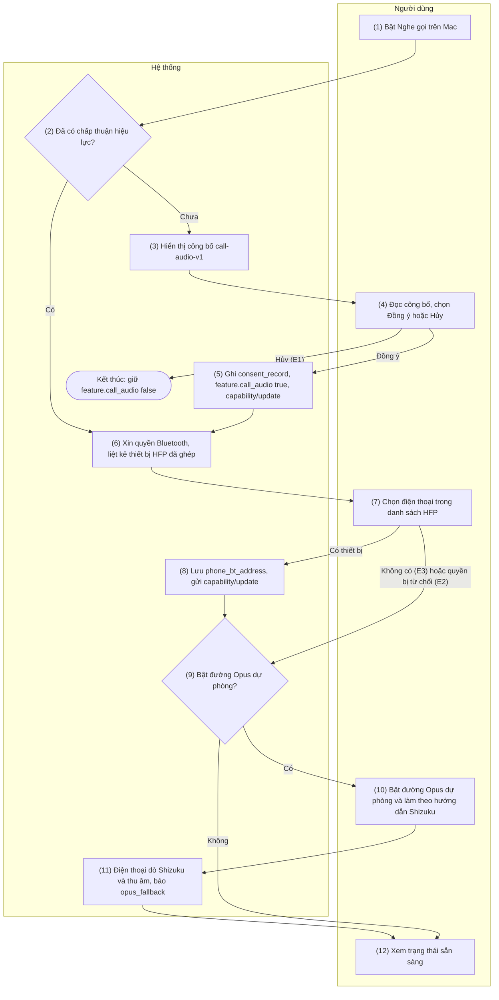
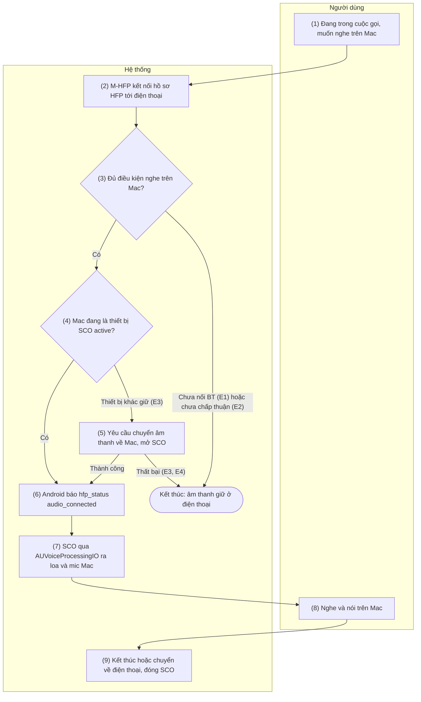
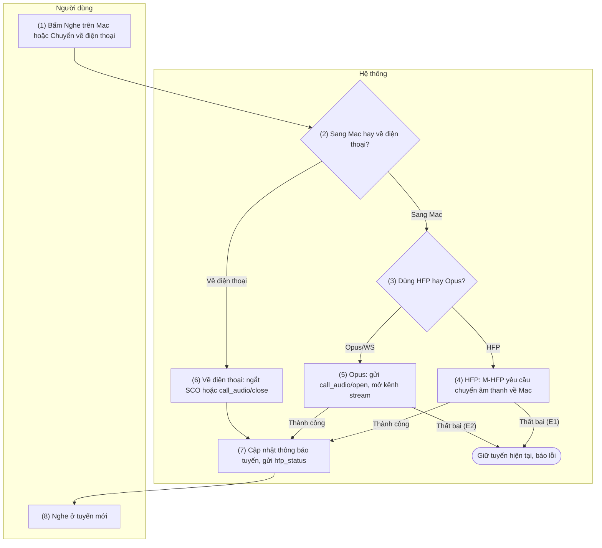
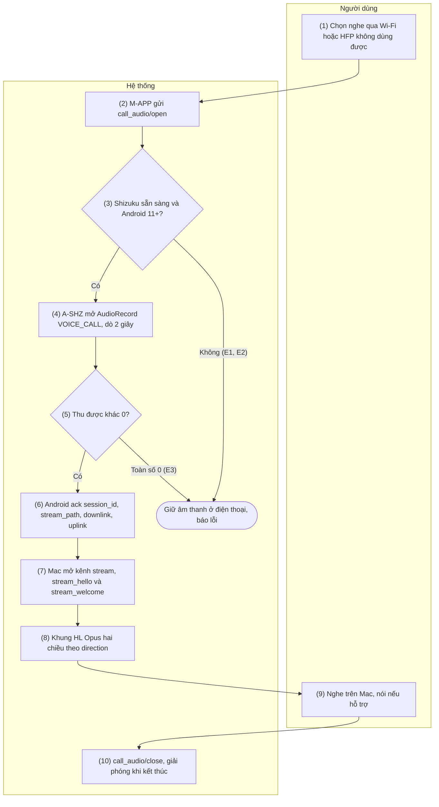

# 7. Nhóm chức năng: Âm thanh cuộc gọi

> Tham chiếu chung: [`00-common-specs.md`](00-common-specs.md) — thành phần A-AUD (`CallAudioRelay`,
> `HfpCallAudioRelay`, `OpusWsCallAudioRelay`), A-SHZ, M-HFP, M-APP (0.1); envelope và `ack`
> (0.5.1); khung nhị phân HL trên `/v1/stream/call-audio` (0.5.2); khóa kênh stream và
> `call_audio/stream_hello` (0.6.3 bước 7); lớp bọc nhị phân HR qua relay (0.4.3); danh mục
> `call_event/hfp_status` và `call_audio` (0.7.1); capability `features.call_audio` gồm
> `opus_fallback` (0.7.2); mã lỗi `CALL_*`, `SHIZUKU_NOT_RUNNING`, `CALL_AUDIO_CAPTURE_UNSUPPORTED`
> (0.8.1); bảng `consent_record` (0.9.3); khóa cài đặt `feature.call_audio`,
> `call_audio.allow_opus_fallback`, `call_audio.phone_bt_address` (0.9.5). Quyết định áp dụng:
> README §5 C13 (giữ Opus/WS + Shizuku), C14 (mã hóa HFP dựa vào mã hóa liên kết Bluetooth); plan
> §12 D1, D2 và §13 D10, D11.
>
> Quy tắc chung của nhóm 7:
> - **Chỉ Mac** nhận âm thanh cuộc gọi. iPhone/iPad không có nhóm chức năng này (Apple không mở API
>   vai trò Hands-Free — README §4, plan §3.3).
> - **Hai đường âm thanh.** Đường chính là Bluetooth HFP (AUDIO-02): Mac đóng vai Hands-Free, điện
>   thoại đóng vai Audio Gateway bằng **stack Bluetooth chuẩn của Android** (không cần API Android
>   nào để tải âm thanh). Đường dự phòng chính thức là Opus qua WebSocket (AUDIO-04), cần Shizuku.
>   AUDIO-03 chuyển âm thanh giữa Mac và điện thoại.
> - **Trạng thái kiểm chứng nền tảng (nêu trung thực).** `IOBluetoothHandsFreeDevice` chưa bị khai
>   tử nhưng **chưa tìm được báo cáo trực tiếp** nào xác nhận nhận được âm thanh SCO của HF trên
>   macOS 13–26, kèm tín hiệu tiêu cực; go/no-go do spike một tuần đầu Phase 4 (D1) quyết định — mọi
>   mục dưới đây ghi rõ điểm phụ thuộc spike. `BluetoothHeadsetClient` là API vai trò HF
>   (`@SystemApi @hide`), **không** phục vụ điện thoại ở vai trò AG, nên **không dùng** cho đường
>   HFP; Shizuku chỉ phục vụ AUDIO-04 (C13, D10).
> - **Điều khiển cuộc gọi qua HFP** (`ATA`, `AT+CHUP`, `AT+CHLD`, `AT+VTS`, `+CLIP`, `+CIEV`,
>   `AT+CLCC`) thuộc CALL-02/CALL-03; nhóm 7 chỉ tham chiếu, không đặc tả lại.
> - **Bảo mật.** Với cuộc gọi di động, âm thanh SCO đi thẳng modem ↔ chip Bluetooth nên
>   **không mã hóa tầng ứng dụng từng khung SCO được** (C14, D11): đường HFP dựa vào mã hóa liên kết
>   Bluetooth của hệ điều hành (Secure Connections trên máy mới), rủi ro KNOB/BIAS còn lại được công
>   bố ở AUDIO-01. Đường Opus/WS giữ hai lớp (TLS 1.3 + E2E khóa kênh stream).
> - Không ghi âm, không lưu, không ghi log nội dung âm thanh ở bất kỳ thành phần nào; log chỉ gồm
>   `type`, `op`, kích thước, mã lỗi.

## 7.1 AUDIO-01 — Bật nghe gọi trên Mac và chấp thuận công bố

### 7.1.1 Thông tin chung

| Mục | Nội dung |
|-----|----------|
| Tên | AUDIO-01 — Bật nghe gọi trên Mac và chấp thuận công bố |
| Mô tả | Bật tính năng nghe và nói cuộc gọi trên Mac theo mô hình công bố trước (disclosure-first — plan §12 D2).<br>Lần đầu bật, M-APP hiển thị bản công bố "call-audio-v1" (âm thanh chỉ đi giữa các thiết bị của chính người dùng, không ghi âm, người dùng chịu trách nhiệm báo cho bên kia ở nơi luật đòi hai bên đồng ý — ví dụ California, Florida, Illinois; đường HFP chỉ được bảo vệ bằng mã hóa liên kết Bluetooth, còn rủi ro KNOB/BIAS; đường Wi-Fi mã hóa đầu cuối).<br>Người dùng đồng ý → ghi `consent_record` → `feature.call_audio = true` → gửi `capability/update`.<br>Sau đó hướng dẫn cấp quyền Bluetooth cho Mac (`NSBluetoothAlwaysUsageDescription`) và chọn điện thoại trong danh sách thiết bị đã ghép ở tầng hệ điều hành có bộ hồ sơ HFP AG (lưu `call_audio.phone_bt_address`; Android **không đọc được địa chỉ Bluetooth của chính nó** từ Android 6 nên Mac phải tự chọn).<br>Có luồng phụ tùy chọn để bật đường Opus/WS dự phòng (AUDIO-04): hướng dẫn cài và khởi động Shizuku, cấp quyền HandLive, rồi điện thoại dò khả năng thu âm và báo `opus_fallback`.<br>Có luồng thu hồi chấp thuận. |
| Tác nhân | Chính: Người dùng (sở hữu cả Mac và điện thoại). Hệ thống: M-APP, M-HFP, OS macOS (TCC Bluetooth, IOBluetooth), A-SVC, A-AUD, A-SHZ (Shizuku UserService), A-UI. |
| Điều kiện trước | 1.<br>Mac và điện thoại đã ghép nối HandLive (PAIR-01) và có cặp hiệu lực.<br>2. macOS 13+.<br>3.<br>Để dùng đường HFP: Mac và điện thoại đã ghép ở **tầng Bluetooth của hệ điều hành** và điện thoại công bố hồ sơ HFP Audio Gateway.<br>4.<br>Để bật đường Opus/WS: điện thoại chạy Android 11+ và người dùng sẵn sàng cài Shizuku. |
| Điều kiện sau | **Thành công (tối thiểu):** có `consent_record` (`feature = call_audio`, `text_version = call-audio-v1`, `accepted_at` đặt, `revoked_at` null); `feature.call_audio = true` trên Mac; đã gửi `capability/update`.<br>**Đầy đủ HFP:** `call_audio.phone_bt_address` đã lưu, quyền Bluetooth của Mac là `authorized`.<br>**Có Opus/WS:** điện thoại báo `opus_fallback.available = true` (kèm `downlink`, `uplink`, `reason = ok`).<br>**Thu hồi:** `consent_record.revoked_at` đặt, `feature.call_audio = false`, đã gửi `capability/update`.<br>**Thất bại:** không thay đổi cấu hình nào; `feature.call_audio` giữ `false`. |
| Ngoại lệ | E1 — Người dùng chọn "Hủy" ở hộp thoại công bố: không bật, `feature.call_audio` giữ `false`.<br>E2 — Quyền Bluetooth của Mac bị từ chối: hiển thị hướng dẫn mở Cài đặt hệ thống, tính năng vẫn bật nhưng đường HFP chưa dùng được (`CALL_BT_NOT_CONNECTED` khi thử nghe ở AUDIO-02).<br>E3 — Không có thiết bị nào đã ghép Bluetooth ở tầng hệ điều hành công bố HFP AG: hướng dẫn người dùng ghép điện thoại qua Cài đặt › Bluetooth trước.<br>E4 — Người dùng thu hồi chấp thuận (luồng B): đặt `revoked_at`, tắt tính năng, dừng mọi phiên âm thanh đang chạy.<br>E5 — Bật đường Opus/WS nhưng Shizuku chưa chạy hoặc chưa cấp quyền HandLive: `opus_fallback.available = false`, `reason = shizuku_not_running` (`SHIZUKU_NOT_RUNNING`).<br>E6 — Điện thoại chạy Android 10: đường Opus/WS không khả thi, `reason = android_10`.<br>E7 — Dò thu âm ra toàn số 0: `reason = capture_silent`, đánh dấu máy không thu được (`CALL_AUDIO_CAPTURE_UNSUPPORTED`). |
| Yêu cầu đặc biệt | **Pháp lý (D2):** phải hiển thị công bố **trước** lần bật đầu; lưu `text_version` và `accepted_at` để chứng minh đã công bố; văn bản nêu rõ trách nhiệm của người dùng ở vùng luật hai bên đồng ý và việc không ghi âm.<br>Đổi nội dung công bố → tăng `text_version` (ví dụ `call-audio-v2`) và xin lại chấp thuận.<br>**Bảo mật:** công bố rủi ro KNOB/BIAS còn lại của đường HFP (C14); không lưu địa chỉ Bluetooth của người khác, chỉ của điện thoại người dùng chọn.<br>**Riêng tư:** chỉ xin quyền Bluetooth khi người dùng thực sự bật tính năng.<br>**Khả dụng:** mọi màn hình đọc được bằng VoiceOver; hướng dẫn Shizuku nêu rõ Shizuku **phải khởi động lại sau mỗi lần bật máy** (qua gỡ lỗi không dây trên Android 11+).<br>**Trung thực kỹ thuật:** UI nêu đường HFP đang chờ kết quả spike D1 và có thể không khả dụng trên một số phiên bản macOS; đường Opus/WS ghi rõ giới hạn theo máy và theo phiên bản Android (chi tiết ở AUDIO-04). |

### 7.1.2 Màn hình

N/A — chưa có wireframe được duyệt.

### 7.1.3 Mô tả chi tiết các thành phần

| # | Trường | Kiểu dữ liệu | Input/Output | Giá trị khởi tạo | Mô tả |
|---|--------|--------------|--------------|------------------|-------|
| 1 | Công tắc "Nghe gọi trên Mac" | bool | Input/Output | `feature.call_audio` (`false`) | Bật → chạy luồng công bố và thiết lập; tắt → thu hồi (luồng B) |
| 2 | Nội dung công bố | string | Output | Văn bản bản `call-audio-v1` | Nêu: chỉ giữa thiết bị của bạn; không ghi âm; bạn chịu trách nhiệm báo bên kia ở nơi luật đòi hai bên đồng ý (California, Florida, Illinois…); HFP chỉ có mã hóa liên kết Bluetooth (rủi ro KNOB/BIAS còn lại); Wi-Fi mã hóa đầu cuối |
| 3 | Chấp thuận công bố | enum{Đồng ý\ | Hủy} | Input | — | "Đồng ý" mới bật tính năng |
| 4 | Phiên bản văn bản công bố | string | Output | `call-audio-v1` | Ghi vào `consent_record.text_version` |
| 5 | Quyền Bluetooth của Mac | enum{not_determined\ | authorized\ | denied} | Output | Theo `CBManager.authorization` | `denied` kèm nút mở Cài đặt › Quyền riêng tư & Bảo mật › Bluetooth |
| 6 | Danh sách điện thoại đã ghép (HFP AG) | array<object{name, bt_address}> | Output | Từ IOBluetooth (bước 7) | Chỉ liệt kê thiết bị đã ghép ở tầng hệ điều hành công bố hồ sơ HFP AG |
| 7 | Điện thoại chọn cho HFP | string (bt_address) | Input/Output | `call_audio.phone_bt_address` (rỗng) | Người dùng chọn; lưu để Android nhận ra Mac và để M-HFP kết nối đúng máy |
| 8 | Bật đường Opus/WS dự phòng | bool | Input/Output | `call_audio.allow_opus_fallback` (`true`) | Cho phép dùng Opus/WS khi HFP không dùng được (cần Shizuku) |
| 9 | Trạng thái Shizuku trên điện thoại | enum{unknown\ | not_installed\ | not_running\ | no_permission\ | ready} | Output | `unknown` | Điện thoại báo qua A-UI và capability |
| 10 | Khả năng đường Opus/WS | object{available, downlink, uplink, reason} | Output | Theo `features.call_audio.opus_fallback` | Điện thoại dò và báo về (bước 11) |
| 11 | Thông báo lỗi hoặc hướng dẫn | string | Output | Rỗng | Nội dung theo E1–E7 |

### 7.1.4 Luồng nghiệp vụ



| Bước | Tác nhân | Thành phần | Mô tả | Ngoại lệ / Ghi chú |
|------|----------|-----------|-------|--------------------|
| 1 | Người dùng | M-APP | Bật "Nghe gọi trên Mac" (menu bar › Cài đặt › Âm thanh cuộc gọi). |  |
| 2 | Hệ thống | M-APP | Kiểm `consent_record` của `call_audio` với `text_version = call-audio-v1`, `revoked_at` null. Có → bỏ qua công bố, sang bước 6. |  |
| 3 | Hệ thống | M-APP | Hiển thị bản công bố `call-audio-v1` (trường 2), nút "Đồng ý" và "Hủy". |  |
| 4 | Người dùng | M-APP | Đọc công bố, chọn "Đồng ý" hoặc "Hủy". | "Hủy" → E1, đóng, không bật. |
| 5 | Hệ thống | M-APP → A-SVC | Ghi `consent_record` (API 1); đặt `feature.call_audio = true`; gửi `capability/update` với `features.call_audio.enabled = true` và `features.call_audio.consented = true` (API 2). Android lưu giá trị này và dựa vào nó để trả `CALL_CONSENT_REQUIRED`. |  |
| 6 | Hệ thống | M-APP, OS (TCC), M-HFP | Kiểm và xin quyền Bluetooth (`NSBluetoothAlwaysUsageDescription`, API 3) và quyền micro (`NSMicrophoneUsageDescription`, `AVCaptureDevice.requestAccess(for: .audio)`) — mỗi quyền đi sau một màn hình giải thích chỉ có nút "Tiếp tục"; liệt kê thiết bị đã ghép ở tầng hệ điều hành công bố hồ sơ HFP AG (API 4). | Quyền bị từ chối → E2, tiếp tục nhưng đánh dấu HFP chưa dùng được. |
| 7 | Người dùng | M-APP | Chọn điện thoại của mình trong danh sách (trường 6). | Không có thiết bị nào → E3, hướng dẫn ghép Bluetooth trước. |
| 8 | Hệ thống | M-APP → A-SVC | Lưu `call_audio.phone_bt_address`; gửi `capability/update` kèm `features.call_audio.bt_address` = địa chỉ Bluetooth của Mac để Android nhận ra Mac trong danh sách thiết bị HFP (API 2, API 5). |  |
| 9 | Người dùng | M-APP | Quyết định có bật đường Opus/WS dự phòng không (trường 8, `call_audio.allow_opus_fallback`). | Không bật → sang bước 12. |
| 10 | Người dùng | M-APP, A-UI | Làm theo hướng dẫn cài/khởi động Shizuku trên điện thoại (gỡ lỗi không dây trên Android 11+; phải khởi động lại Shizuku sau mỗi lần bật máy) và cấp quyền HandLive cho Shizuku. | Android 10 → E6. |
| 11 | Hệ thống | A-SHZ, A-AUD → A-SVC → M-APP | Điện thoại yêu cầu quyền Shizuku (API 6), bind UserService, dò thu âm cuộc gọi 2 giây (API 7), rồi báo `opus_fallback` qua `capability/update`. | Shizuku chưa chạy/ chưa cấp quyền → E5. Dò ra toàn số 0 → E7. |
| 12 | Người dùng | M-APP | Xem danh sách kiểm tra: chấp thuận, quyền Bluetooth, điện thoại đã chọn, khả năng Opus/WS. |  |
| B1 | Người dùng | M-APP | Tắt công tắc trường 1 hoặc bấm "Thu hồi chấp thuận". |  |
| B2 | Hệ thống | M-APP → A-SVC | Dừng mọi phiên âm thanh đang chạy (AUDIO-02/AUDIO-04); đặt `consent_record.revoked_at`; `feature.call_audio = false`; gửi `capability/update` với `features.call_audio.consented = false`. | E4. |

### 7.1.5 Đặc tả API/service

**Danh sách lời gọi**

| # | API/service | Kênh | Chiều | Dùng ở bước |
|---|-------------|------|-------|-------------|
| 1 | Ghi `consent_record` (SQLite qua GRDB/SQLCipher) | Cục bộ (Mac) | M-APP ↔ OS | 2, 5, B2 |
| 2 | `WS capability/update` | `/v1/ctl` (LAN, USB hoặc relay) | Hai chiều | 5, 8, 11, B2 |
| 3 | Quyền Bluetooth macOS (`CBManager.authorization`, `NSBluetoothAlwaysUsageDescription`) và quyền micro (`AVCaptureDevice.authorizationStatus(for: .audio)`, `NSMicrophoneUsageDescription`) | Cục bộ (Mac) | M-APP ↔ OS | 6 |
| 4 | Liệt kê thiết bị HFP đã ghép (`IOBluetoothDevice.pairedDevices`, `IOBluetoothHandsFreeDevice`) | Cục bộ (Mac) | M-HFP ↔ OS | 6, 7 |
| 5 | Lưu khóa cài đặt (`UserDefaults` Mac; `DataStore` Android) | Cục bộ | M-APP / A-SVC | 5, 8 |
| 6 | `Shizuku.requestPermission`, `Shizuku.bindUserService` | Cục bộ (Android) | A-SVC ↔ Shizuku | 11 |
| 7 | Dò thu âm cuộc gọi (`AudioRecord` nguồn `VOICE_CALL`) | Cục bộ (Android, A-SHZ) | A-SHZ | 11 |

#### API 1 — Ghi `consent_record`

- **URL:** N/A (SQLite `handlive.sqlite`, bảng `consent_record` — 0.9.3, chỉ trên Mac)
- **Method:** ghi/đọc qua GRDB (SQLCipher). Chi tiết ở phần Query.
- **Request (trường ghi):**

| Trường | Kiểu | Bắt buộc | Mô tả |
|--------|------|----------|-------|
| `feature` | string | Có | Luôn là `call_audio` |
| `text_version` | string | Có | `call-audio-v1` |
| `accepted_at` | timestamp | Có | Thời điểm người dùng bấm "Đồng ý" |
| `revoked_at` | timestamp \ | null | Không | Đặt khi thu hồi (luồng B) |

- **Response:** N/A (thao tác cục bộ).
- **Ví dụ:** người dùng đồng ý lúc `1727150400000` → chèn
  `(call_audio, call-audio-v1, 1727150400000, null)`.
- **Logic nghiệp vụ:**
  1. Chấp thuận **hiệu lực** = có dòng `feature = call_audio` và `text_version` bằng bản đang hiển
     thị và `revoked_at` null.
  2. Đổi văn bản công bố → tăng `text_version`; bản mới không có dòng hiệu lực nên buộc xin lại chấp
     thuận.
  3. Thu hồi chỉ đặt `revoked_at`, giữ dòng cũ làm bằng chứng đã từng công bố; bật lại sau này thì
     chèn dòng mới với `accepted_at` mới.
  4. Không đồng bộ `consent_record` sang điện thoại; đây là bằng chứng công bố phía Mac.

#### API 2 — `WS capability/update`

- **URL:** `wss://{android_host}:{port}/v1/ctl` (LAN hoặc USB) hoặc qua relay
- **Method:** `WS capability/update` (hai chiều), envelope mã hóa, không ack (0.7.1).
- **Request (`data`):** ảnh chụp đầy đủ, cùng cấu trúc `capability/hello` (0.7.2); nhóm này quan tâm
  các trường:

| Trường | Kiểu | Bên gửi | Mô tả |
|--------|------|---------|-------|
| `features.call_audio.enabled` | bool | Mac | Giá trị mới của `feature.call_audio` |
| `features.call_audio.consented` | bool | Mac | Có `consent_record` hiệu lực; Android dựa vào đây để trả `CALL_CONSENT_REQUIRED` |
| `features.call_audio.bt_address` | string \ | null | Mac | Địa chỉ Bluetooth của Mac để Android nhận ra Mac trong danh sách thiết bị HFP |
| `features.call_audio.hfp_connected` | bool | Android | Mac đang nối hồ sơ HFP tới điện thoại (AUDIO-02) |
| `features.call_audio.opus_fallback` | object | Android | `{available, downlink, uplink, reason}` — kết quả dò ở bước 11 |

- **Response:** N/A; bên kia gửi capability của mình khi cấu hình đổi.
- **Ví dụ** (trích phần `call_audio`; bản thật mang đủ mọi tính năng như 0.7.2):

```json
{"op":"update","data":{"protocol":1,"app_version":"1.0.0 (100)","platform":"macos","os_version":"15.1","model":"Mac15,3","features":{"call_audio":{"enabled":true,"consented":true,"bt_address":"A1:B2:C3:D4:E5:F6"}}}}
```

```json
{"op":"update","data":{"protocol":1,"app_version":"1.0.0 (100)","platform":"android","os_version":"15","model":"Pixel 8","features":{"call_audio":{"enabled":true,"bt_address":null,"hfp_connected":false,"opus_fallback":{"available":true,"downlink":true,"uplink":false,"reason":"ok"}}}}}
```

- **Logic nghiệp vụ:**
  1. Tính năng `call_audio` **hiệu lực** khi bật ở cả hai phía; đường HFP dùng được cần thêm quyền
     Bluetooth và `phone_bt_address`; đường Opus/WS dùng được cần `opus_fallback.available = true`
     (CONN-01 API 7).
  2. Android dùng `features.call_audio.bt_address` của Mac để so khớp thiết bị HFP đang nối
     (AUDIO-02 API 3).
  3. Mac tắt tính năng (thu hồi) → gửi `enabled = false`; Android dừng theo dõi HFP và giải phóng
     đường Opus/WS.

#### API 3 — Quyền Bluetooth trên macOS

- **URL:** N/A
- **Method:** `CBManager.authorization` (đọc), khởi tạo `CBCentralManager` để kích hoạt hộp thoại
  TCC; `Info.plist` có `NSBluetoothAlwaysUsageDescription`. Micro:
  `AVCaptureDevice.authorizationStatus(for: .audio)`, `requestAccess(for: .audio)`; `Info.plist` có
  `NSMicrophoneUsageDescription` ("HandLive dùng micro để bạn nói trong cuộc gọi chuyển từ điện
  thoại."). Micro bị từ chối → tính năng vẫn bật nhưng chỉ nghe, không nói (AUDIO-02 E7, AUDIO-04
  điều kiện 6); hướng dẫn Cài đặt hệ thống › Quyền riêng tư & Bảo mật › Micrô.
- **Request:** không tham số; chuỗi mô tả quyền = "HandLive kết nối Bluetooth với điện thoại của bạn
  để nghe và nói cuộc gọi trên Mac."
- **Response:** `CBManagerAuthorization` = `.notDetermined` \| `.allowedAlways` \| `.denied` \|
  `.restricted`.
- **Ví dụ:** lần đầu → hộp thoại hệ thống → `.allowedAlways` → trường 5 = `authorized`.
- **Logic nghiệp vụ:**
  1. Chỉ xin khi người dùng bật tính năng, không xin lúc khởi động ứng dụng.
  2. `.denied` /`.restricted` → E2, hiển thị nút mở
     `x-apple.systempreferences:com.apple.preference.security?Privacy_Bluetooth`; tính năng vẫn bật
     nhưng đường HFP báo `CALL_BT_NOT_CONNECTED` khi thử nghe.
  3. Quyền này độc lập với việc ghép Bluetooth ở tầng hệ điều hành (bước 7).

#### API 4 — Liệt kê thiết bị HFP đã ghép

- **URL:** N/A
- **Method:** `IOBluetoothDevice.pairedDevices()`; với mỗi thiết bị, kiểm hồ sơ Hands-Free AG và
  khởi tạo `IOBluetoothHandsFreeDevice(device:delegate:)` khi người dùng chọn.
- **Request:** không tham số.
- **Response:** mảng thiết bị đã ghép; mỗi thiết bị có `name` và `addressString` (dạng
  `A1:B2:C3:D4:E5:F6`).
- **Ví dụ:** trả `[{name: "Pixel của Lan", addressString: "A1:B2:C3:D4:E5:F6"}]` → trường 6.
- **Logic nghiệp vụ:**
  1. Chỉ hiển thị thiết bị đã ghép ở tầng hệ điều hành có hồ sơ HFP Audio Gateway; không tự ghép
     Bluetooth thay người dùng.
  2. Không có thiết bị nào → E3, hướng dẫn: "Hãy ghép điện thoại với Mac trong Cài đặt hệ thống ›
     Bluetooth, rồi quay lại."
  3. Việc nhận âm thanh SCO qua `IOBluetoothHandsFreeDevice` **phụ thuộc kết quả spike D1**; nếu
     spike thất bại trên phiên bản macOS của người dùng, M-APP ẩn đường HFP và chỉ chào đường
     Opus/WS.

#### API 5 — Lưu khóa cài đặt

- **URL:** N/A
- **Method:** Mac: `UserDefaults`; Android: Jetpack `DataStore` (0.9.5).
- **Request/Response:** đọc/ghi khóa `feature.call_audio`, `call_audio.allow_opus_fallback`,
  `call_audio.phone_bt_address` (chỉ Mac).
- **Ví dụ:** xem phần Query.
- **Logic nghiệp vụ:** `call_audio.phone_bt_address` chỉ nằm trên Mac (điện thoại không đọc được địa
  chỉ Bluetooth của chính mình từ Android 6); Android lưu `feature.call_audio` để tính capability.

#### API 6 — Shizuku: xin quyền và bind UserService

- **URL:** N/A
- **Method:** `Shizuku.pingBinder()`, `Shizuku.checkSelfPermission()`,
  `Shizuku.requestPermission(requestCode)`, `Shizuku.bindUserService(userServiceArgs, connection)`.
- **Request:** `userServiceArgs` trỏ tới lớp UserService của A-SHZ (chạy uid shell).
- **Response:** kết quả quyền (`PERMISSION_GRANTED`/`PERMISSION_DENIED`); `IBinder` của UserService
  khi bind thành công.
- **Ví dụ:** `pingBinder()` = true, `checkSelfPermission()` = denied → `requestPermission(1001)` →
  người dùng cấp trong Shizuku → bind UserService.
- **Logic nghiệp vụ:**
  1. `pingBinder()` false → Shizuku chưa chạy → E5 (`SHIZUKU_NOT_RUNNING`), hướng dẫn khởi động
     Shizuku qua gỡ lỗi không dây; nhắc phải khởi động lại sau mỗi lần bật máy.
  2. Quyền bị từ chối → `reason = shizuku_not_running` với ghi chú "no_permission" cho UI (trường 9
     = `no_permission`).
  3. Chỉ bind khi người dùng bật đường Opus/WS; A-SHZ là tùy chọn, không bind lúc khởi động A-SVC.

#### API 7 — Dò thu âm cuộc gọi

- **URL:** N/A
- **Method:** `AudioRecord` nguồn `MediaRecorder.AudioSource.VOICE_CALL` (dự phòng
  `VOICE_DOWNLINK`), 16 kHz mono PCM 16-bit, chạy trong A-SHZ (uid shell giữ `CAPTURE_AUDIO_OUTPUT`
  từ Android 11).
- **Request:** cấu hình nguồn, tần số lấy mẫu; thời lượng dò 2 giây.
- **Response:** khối PCM; kết quả `{available, downlink, uplink, reason}`.
- **Ví dụ:** Pixel 8 → có mẫu khác 0 →
  `{available: true, downlink: true, uplink: <13+>, reason: "ok"}`. Galaxy S22 Ultra (Android 14) →
  toàn số 0 → `{available: false, downlink: false, uplink: false, reason: "capture_silent"}`.
- **Logic nghiệp vụ:**
  1. Android 10 → không dò, `reason = android_10` (E6): shell không có `CAPTURE_AUDIO_OUTPUT` trước
     Android 11.
  2. Dò cần không có cuộc gọi thật cũng chạy được (mở AudioRecord và đọc); toàn số 0 trong 2 giây →
     `capture_silent` (E7, `CALL_AUDIO_CAPTURE_UNSUPPORTED`), đánh dấu máy để không mời đường
     Opus/WS lần sau.
  3. `uplink` = có `AudioManager.getCallUplinkInjectionAudioTrack()` (Android 13+) hay không; giá
     trị này **chưa kiểm chứng** nên chỉ dùng để bật chế độ "nghe và nói (thử nghiệm)" ở AUDIO-04,
     mặc định coi như chỉ nghe.
  4. Không lưu mẫu âm thanh dò; chỉ giữ cờ toàn-số-0 hay không.

#### Query

```sql
-- [Thiết kế] Mac, bước 2: chấp thuận hiệu lực cho call_audio
SELECT text_version, accepted_at
FROM consent_record
WHERE feature = 'call_audio'
  AND text_version = 'call-audio-v1'
  AND revoked_at IS NULL
LIMIT 1;

-- [Thiết kế] Mac, bước 5: ghi chấp thuận (chèn mới hoặc bật lại sau thu hồi)
INSERT INTO consent_record (feature, text_version, accepted_at, revoked_at)
VALUES ('call_audio', 'call-audio-v1', :accepted_at, NULL)
ON CONFLICT (feature, text_version)
DO UPDATE SET accepted_at = excluded.accepted_at, revoked_at = NULL;

-- [Thiết kế] Mac, bước B2: thu hồi chấp thuận
UPDATE consent_record
SET revoked_at = :now
WHERE feature = 'call_audio' AND text_version = 'call-audio-v1' AND revoked_at IS NULL;
```

```text
# [Thiết kế] UserDefaults của M-APP (khóa 0.9.5)
UserDefaults.standard.bool(forKey: "feature.call_audio")                       # bước 1
UserDefaults.standard.set(true,  forKey: "feature.call_audio")                 # bước 5
UserDefaults.standard.set("A1:B2:C3:D4:E5:F6", forKey: "call_audio.phone_bt_address")  # bước 8
UserDefaults.standard.bool(forKey: "call_audio.allow_opus_fallback")           # bước 9

# [Thiết kế] DataStore của A-SVC (Android)
booleanPreferencesKey("feature.call_audio")   # đọc/ghi để tính capability
```

---

## 7.2 AUDIO-02 — Nghe và nói cuộc gọi trên Mac qua Bluetooth HFP

### 7.2.1 Thông tin chung

| Mục | Nội dung |
|-----|----------|
| Tên | AUDIO-02 — Nghe và nói cuộc gọi trên Mac qua Bluetooth HFP |
| Mô tả | Đường âm thanh **chính**: khi có cuộc gọi di động đang diễn ra, người dùng nghe và nói ngay trên Mac qua Bluetooth Hands-Free Profile.<br>Mac đóng vai **Hands-Free (HF)** bằng `IOBluetoothHandsFreeDevice`; điện thoại đóng vai **Audio Gateway (AG)** bằng stack Bluetooth chuẩn của Android — **không cần API Android nào** để tải âm thanh cuộc gọi (âm thanh SCO đi thẳng modem ↔ chip Bluetooth).<br>M-HFP yêu cầu chuyển âm thanh về máy tính để mở kênh SCO; âm thanh SCO đưa vào `AUVoiceProcessingIO` (khử vọng AEC, giảm ồn, tự chỉnh mức AGC) rồi ra loa và micro của Mac.<br>Android theo dõi trạng thái hồ sơ HFP bằng API công khai và báo `call_event/hfp_status` (`connected`, `audio_connected`, `mac_is_active_device`), so khớp Mac theo `features.call_audio.bt_address`.<br>Điều khiển cuộc gọi (trả lời, cúp, giữ máy, DTMF, tắt tiếng) đi bằng lệnh HFP và thuộc CALL-02/CALL-03 — mục này không đặc tả lại. |
| Tác nhân | Chính: Người dùng (đang trong cuộc gọi). Hệ thống: M-HFP, M-APP, OS macOS (IOBluetooth, CoreAudio/`AUVoiceProcessingIO`), A-CALL, A-AUD (`HfpCallAudioRelay`), A-SVC, OS Android (`BluetoothHeadset`). |
| Điều kiện trước | 1.<br>AUDIO-01 hoàn tất: `feature.call_audio = true` hai phía, có `consent_record` hiệu lực, quyền Bluetooth Mac `authorized`, `call_audio.phone_bt_address` đã lưu; quyền micro Mac `authorized` để nói (chỉ nghe thì không cần).<br>2.<br>Mac và điện thoại đã ghép ở tầng Bluetooth của hệ điều hành; điện thoại công bố hồ sơ HFP AG.<br>3.<br>Có cuộc gọi đang diễn ra (đã trả lời — CALL-02) hoặc đang đổ chuông và người dùng chọn nghe trên Mac.<br>4.<br>Kết quả spike D1 cho biết `IOBluetoothHandsFreeDevice` nhận được âm thanh SCO trên phiên bản macOS hiện tại. |
| Điều kiện sau | **Đang nghe trên Mac:** kênh SCO mở; âm thanh hai chiều qua `AUVoiceProcessingIO`; Android báo `hfp_status` `{connected: true, audio_connected: true, mac_is_active_device: true}`; M-APP hiển thị "Đang nghe trên Mac".<br>**Kết thúc:** khi cuộc gọi kết thúc hoặc người dùng chuyển về điện thoại (AUDIO-03), SCO đóng, `audio_connected = false`; không thay đổi dữ liệu bền vững nào. |
| Ngoại lệ | E1 — Quyền Bluetooth Mac chưa cấp hoặc chưa chọn điện thoại (`phone_bt_address` rỗng): `CALL_BT_NOT_CONNECTED`, hướng dẫn quay lại AUDIO-01.<br>E2 — Chưa có chấp thuận hiệu lực: `CALL_CONSENT_REQUIRED`, mở AUDIO-01.<br>E3 — Thiết bị HFP khác (ví dụ AirPods) đang giữ âm thanh SCO: M-HFP yêu cầu chuyển âm thanh về phía Mac; thất bại → nếu đường Opus/WS khả dụng thì chuyển sang AUDIO-04, không thì âm thanh giữ ở điện thoại (`CALL_ROUTE_FAILED`).<br>E4 — Không mở được SCO hoặc macOS không đưa âm thanh SCO tới ứng dụng (spike D1 cho kết quả xấu trên máy này): `CALL_ROUTE_FAILED`, gợi ý đường Opus/WS.<br>E5 — Ra khỏi tầm Bluetooth giữa cuộc gọi: SCO đứt, âm thanh **tự về điện thoại** (hành vi mặc định của stack Bluetooth); M-APP cập nhật trạng thái theo `hfp_status`.<br>E6 — Mất mã hóa liên kết Bluetooth (không đàm phán được Secure Connections): vẫn cho nghe nhưng nhắc lại rủi ro đã công bố (không chặn — quyết định của người dùng ở AUDIO-01).<br>E7 — Quyền micro của Mac bị từ chối: nghe được nhưng không nói; M-APP hiện "Cần quyền micro để nói trên Mac" kèm nút mở Cài đặt hệ thống › Quyền riêng tư & Bảo mật › Micrô; không chặn đường nghe. |
| Yêu cầu đặc biệt | **Chất lượng:** MOS ≥ 3.5; khử vọng đạt echo return loss > 40 dB (cùng engine FaceTime dùng).<br>**Codec:** CVSD 8 kHz hoặc mSBC 16 kHz theo đàm phán của tầng Bluetooth (không do ứng dụng chọn).<br>**Độ trễ:** đường SCO ~40 ms (mục tiêu plan §4).<br>**Bảo mật:** chỉ có mã hóa liên kết Bluetooth (C14, D11) — không mã hóa tầng ứng dụng từng khung SCO được; rủi ro KNOB/BIAS đã công bố ở AUDIO-01.<br>**Trung thực kỹ thuật:** **cách macOS đưa âm thanh SCO của vai trò HF tới ứng dụng phải được spike D1 xác nhận** — tài liệu này không bịa ra tên thiết bị đầu vào/đầu ra hay cơ chế cụ thể; nếu spike thất bại, đường HFP bị vô hiệu và người dùng chuyển sang AUDIO-04.<br>**Nhiều thiết bị HFP:** Android giữ được nhiều thiết bị HFP cùng lúc nhưng chỉ một thiết bị active cho SCO tại một thời điểm. |

### 7.2.2 Màn hình

N/A — chưa có wireframe được duyệt.

### 7.2.3 Mô tả chi tiết các thành phần

| # | Trường | Kiểu dữ liệu | Input/Output | Giá trị khởi tạo | Mô tả |
|---|--------|--------------|--------------|------------------|-------|
| 1 | Trạng thái nghe | enum{on_phone\ | connecting\ | on_mac\ | failed} | Output | `on_phone` | "Đang nghe trên điện thoại", "Đang chuyển…", "Đang nghe trên Mac", "Không nghe được trên Mac" |
| 2 | Trạng thái HFP | object{connected, audio_connected, mac_is_active_device} | Output | `{false,false,false}` | Từ `call_event/hfp_status` của Android |
| 3 | Codec SCO | enum{cvsd_8k\ | msbc_16k\ | unknown} | Output | `unknown` | Do tầng Bluetooth đàm phán; hiển thị ở mục chẩn đoán |
| 4 | Thiết bị HFP đang active | string | Output | Rỗng | Tên thiết bị đang giữ SCO (ví dụ "AirPods" khi bị chiếm — E3) |
| 5 | Nút "Nghe trên Mac" / "Chuyển về điện thoại" | action | Input | — | Kích hoạt AUDIO-03 (mục này chỉ hiển thị kết quả) |
| 6 | Chất lượng ước tính | object{mos, erl_db} | Output | Rỗng | Mục chẩn đoán của M-APP |
| 7 | Thông báo lỗi | string | Output | Rỗng | Theo E1–E6 |

### 7.2.4 Luồng nghiệp vụ



| Bước | Tác nhân | Thành phần | Mô tả | Ngoại lệ / Ghi chú |
|------|----------|-----------|-------|--------------------|
| 1 | Người dùng | M-APP | Đang trong cuộc gọi (CALL-01…03); chọn nghe trên Mac (mặc định khi đã bật, hoặc qua AUDIO-03). |  |
| 2 | Hệ thống | M-HFP, OS | Bảo đảm kết nối hồ sơ HFP (service-level) tới điện thoại theo `call_audio.phone_bt_address` (`IOBluetoothHandsFreeDevice.connect` — API 1). | Chưa cấp quyền/chưa chọn máy → E1. |
| 3 | Hệ thống | M-APP | Kiểm `feature.call_audio` hiệu lực, có chấp thuận, quyền Bluetooth `authorized`, có cuộc gọi active. | Thiếu chấp thuận → E2; thiếu Bluetooth → E1. |
| 4 | Hệ thống | A-SVC, OS Android | Android đọc thiết bị HFP đang active cho SCO (`BluetoothHeadset` — API 4); so khớp Mac theo `bt_address`. | Thiết bị khác đang giữ SCO (AirPods) → E3, sang bước 5. |
| 5 | Hệ thống | M-HFP, OS | Mac (phía HF) yêu cầu chuyển âm thanh về máy tính để giành kênh SCO (API 1). | Thất bại → E3/E4: nếu có Opus/WS thì chuyển AUDIO-04, không thì `CALL_ROUTE_FAILED`. |
| 6 | Hệ thống | A-SVC → M-APP | Android phát hiện SCO connected (`ACTION_AUDIO_STATE_CHANGED`), gửi `call_event/hfp_status` `{connected, audio_connected: true, mac_is_active_device: true}` (API 3). |  |
| 7 | Hệ thống | M-HFP, OS (CoreAudio) | Âm thanh SCO đưa vào `AUVoiceProcessingIO` (AEC/NS/AGC) rồi ra loa và micro Mac (API 2). Trạng thái `on_mac`. | **Cách macOS đưa SCO tới ứng dụng do spike D1 xác nhận.** Không đưa được → E4. |
| 8 | Người dùng | M-APP | Nghe và nói trên Mac; điều khiển cuộc gọi (giữ, DTMF, tắt tiếng) qua CALL-03. |  |
| 9 | Hệ thống | M-HFP, A-SVC | Cuộc gọi kết thúc (CALL-03) hoặc chuyển về điện thoại (AUDIO-03): đóng SCO; Android gửi `hfp_status` `audio_connected = false`. | Ra ngoài tầm BT → E5 (âm thanh tự về điện thoại). |

### 7.2.5 Đặc tả API/service

**Danh sách lời gọi**

| # | API/service | Kênh | Chiều | Dùng ở bước |
|---|-------------|------|-------|-------------|
| 1 | `IOBluetoothHandsFreeDevice` (kết nối / chuyển âm thanh / `sendATCommand`) | Cục bộ (Mac) | M-HFP ↔ OS | 2, 5 |
| 2 | `AUVoiceProcessingIO` (AEC, giảm ồn, AGC) | Cục bộ (Mac) | M-HFP ↔ OS | 7 |
| 3 | `WS call_event/hfp_status` | `/v1/ctl` | S→C | 6, 9 |
| 4 | `BluetoothHeadset` proxy và broadcast (Android) | Cục bộ (Android) | A-SVC ↔ OS | 4, 6, 9 |

#### API 1 — `IOBluetoothHandsFreeDevice`

- **URL:** N/A
- **Method:** khởi tạo `IOBluetoothHandsFreeDevice(device:delegate:)`; `connect()`; chuyển âm thanh
  SCO về/khỏi máy tính bằng API chuyển âm thanh của lớp này; `sendATCommand(_:)` cho lệnh HFP (do
  CALL-02/CALL-03 dùng). Chỉ dùng các method của chính lớp này; tài liệu không bịa thêm tên method.
- **Request:** `device` = `IOBluetoothDevice` khớp `call_audio.phone_bt_address`; `delegate` nhận
  callback trạng thái SCO và chỉ báo AG.
- **Response (callback delegate):** sự kiện kết nối service-level, kết nối/ngắt SCO, chỉ báo `+CIEV`
  /`+CLIP` (chuyển cho CALL-02/CALL-03).
- **Ví dụ:** khởi tạo với thiết bị "Pixel của Lan" → `connect()` → khi có cuộc gọi, yêu cầu chuyển
  âm thanh về máy tính → delegate báo SCO connected.
- **Logic nghiệp vụ:**
  1. **Toàn bộ lớp này nằm sau abstraction `CallAudioRelay` phía Mac** (song song
     `HfpCallAudioRelay` /`OpusWsCallAudioRelay` phía Android) để chuyển đường khi spike D1 thất bại
     (plan §12 D1, code-standards).
  2. Kết nối service-level HFP giữ suốt khi tính năng bật; SCO chỉ mở khi có cuộc gọi và Mac là
     thiết bị được chọn nghe.
  3. **Điểm phụ thuộc spike D1:** có nhận được luồng âm thanh SCO của vai trò HF trên macOS 13–26
     hay không, và macOS phơi bày luồng đó cho ứng dụng bằng cách nào — chưa có báo cáo trực tiếp
     xác nhận, có tín hiệu tiêu cực; spike một tuần quyết định go/no-go. Tài liệu không mô tả cơ chế
     cụ thể trước khi có kết quả.

#### API 2 — `AUVoiceProcessingIO`

- **URL:** N/A
- **Method:** Audio Unit `kAudioUnitType_Output` / `kAudioUnitSubType_VoiceProcessingIO`, dựng bằng
  `AVAudioEngine` hoặc AUGraph; bật khử vọng, giảm ồn, tự chỉnh mức.
- **Request:** định dạng đầu vào là luồng âm thanh SCO (nguồn do spike D1 xác nhận), đầu ra là loa
  Mac; micro Mac làm nguồn chiều ngược (cần `NSMicrophoneUsageDescription` và quyền micro
  `authorized`; bị từ chối → E7, chỉ nghe).
- **Response:** luồng đã khử vọng ra loa; tín hiệu micro đã xử lý đẩy về đường SCO.
- **Ví dụ:** cùng engine FaceTime dùng; đo được echo return loss > 40 dB trong kịch bản loa ngoài.
- **Logic nghiệp vụ:**
  1. Bắt buộc bật khử vọng để tránh phản hồi âm khi dùng loa ngoài của Mac.
  2. Micro và loa mặc định của Mac; nếu người dùng đổi thiết bị ra/vào hệ thống thì engine bám theo
     thiết bị mặc định.
  3. Không ghi âm, không đệm quá mức cần cho xử lý; giải phóng engine khi SCO đóng.

#### API 3 — `WS call_event/hfp_status`

- **URL:** `wss://{android_host}:{port}/v1/ctl` (LAN hoặc USB); mục này chạy khi cùng LAN/BT, không
  đi relay.
- **Method:** `WS call_event/hfp_status` (S→C), envelope mã hóa, không ack (0.7.1).
- **Request (`data`):**

| Trường | Kiểu | Bắt buộc | Mô tả |
|--------|------|----------|-------|
| `connected` | bool | Có | Có thiết bị HFP nào (khớp `bt_address` của Mac) đang nối service-level không |
| `audio_connected` | bool | Có | Kênh SCO (âm thanh) đang mở tới thiết bị đó không |
| `mac_is_active_device` | bool | Có | Thiết bị đang giữ SCO có đúng là Mac không (phân biệt với AirPods) |
| `active_device_name` | string | Không | Tên thiết bị HFP đang active (để hiển thị khi bị chiếm — trường 4) |
| `codec` | enum{cvsd\ | msbc\ | unknown} | Không | Codec SCO đàm phán được, nếu đọc được |

- **Response:** N/A (sự kiện một chiều).
- **Ví dụ:**

```json
{"op":"hfp_status","data":{"connected":true,"audio_connected":true,"mac_is_active_device":true,"active_device_name":"MacBook của Lan","codec":"msbc"}}
```

- **Logic nghiệp vụ:**
  1. Android gửi mỗi khi trạng thái đổi (kết nối/ngắt hồ sơ, mở/đóng SCO) và một lần khi bắt tay
     xong.
  2. `mac_is_active_device = false` trong khi `connected = true` nghĩa là thiết bị khác đang giữ SCO
     (E3) — M-APP hiển thị `active_device_name` và mời chuyển âm thanh về Mac hoặc dùng AUDIO-04.
  3. Android **không cần API tải âm thanh**: chỉ đọc trạng thái hồ sơ để báo cáo; việc mở SCO do
     phía Mac (HF) yêu cầu.

#### API 4 — `BluetoothHeadset` proxy và broadcast (Android)

- **URL:** N/A
- **Method:** `BluetoothAdapter.getProfileProxy(context, listener, BluetoothProfile.HEADSET)`;
  `BluetoothHeadset.getConnectedDevices()`; broadcast
  `BluetoothHeadset.ACTION_CONNECTION_STATE_CHANGED` và `ACTION_AUDIO_STATE_CHANGED`. Quyền
  `BLUETOOTH_CONNECT`.
- **Request:** đăng ký proxy và receiver; lọc thiết bị theo địa chỉ Bluetooth của Mac
  (`features.call_audio.bt_address`).
- **Response:** danh sách thiết bị HFP đang nối; sự kiện đổi trạng thái kết nối và trạng thái âm
  thanh (SCO).
- **Ví dụ:** `getConnectedDevices()` trả `[Pixel↔MacBook]`; `ACTION_AUDIO_STATE_CHANGED` =
  `STATE_AUDIO_CONNECTED` → gửi `hfp_status` `audio_connected: true`.
- **Logic nghiệp vụ:**
  1. Đây là **vai trò AG dùng API công khai chỉ để quan sát**: `BluetoothHeadset` (proxy HEADSET)
     cho biết thiết bị nào đang nối và SCO có mở không; không dùng để carry âm thanh.
  2. Thiếu `BLUETOOTH_CONNECT` → không đọc được trạng thái → `hfp_status` không gửi được; capability
     đánh dấu quyền thiếu (CONN-01 API 7).
  3. Khớp Mac theo `bt_address` do Mac gửi ở `capability` (AUDIO-01 API 2); thiết bị khác địa chỉ
     được coi là AirPods/thiết bị khác (đặt `mac_is_active_device` phù hợp).
  4. `BluetoothHeadsetClient` (vai trò HF) **không** dùng ở đây (C13, D10): nó phục vụ khi máy
     Android làm HF cho một AG khác, không phải khi Android là AG cho Mac.

#### Query

N/A — chức năng không đọc/ghi cơ sở dữ liệu; chỉ đọc khóa cài đặt `call_audio.phone_bt_address` và
capability đã lưu trong bộ nhớ.

---

## 7.3 AUDIO-03 — Chuyển âm thanh cuộc gọi giữa Mac và điện thoại

### 7.3.1 Thông tin chung

| Mục | Nội dung |
|-----|----------|
| Tên | AUDIO-03 — Chuyển âm thanh cuộc gọi giữa Mac và điện thoại |
| Mô tả | Trong khi có cuộc gọi đang diễn ra, người dùng chuyển âm thanh qua lại giữa Mac và điện thoại bằng bảng điều khiển của M-APP ("Nghe trên Mac" / "Chuyển về điện thoại").<br>Với đường HFP: M-HFP (phía Hands-Free) yêu cầu chuyển âm thanh về máy tính hoặc trả về điện thoại — việc kết nối/ngắt SCO do phía HF điều khiển, **Android không cần thao tác gì**.<br>Với đường Opus/WS: M-APP gửi `call_audio/open` để bắt đầu và `call_audio/close` để dừng (AUDIO-04).<br>Nếu người dùng ra khỏi tầm Bluetooth khi đang nghe qua HFP, âm thanh **tự trở về điện thoại** (hành vi mặc định của stack Bluetooth) và M-APP hiển thị điều đó.<br>Điện thoại luôn cho biết tuyến âm thanh hiện tại trong thông báo thường trực của A-SVC. |
| Tác nhân | Chính: Người dùng. Hệ thống: M-HFP, M-APP, A-AUD, A-SVC, A-UI (thông báo tuyến), OS (IOBluetooth, `BluetoothHeadset`). |
| Điều kiện trước | 1. Có cuộc gọi đang diễn ra.<br>2. AUDIO-01 hoàn tất; ít nhất một đường khả dụng: HFP (quyền Bluetooth + `phone_bt_address` + spike D1 đạt) hoặc Opus/WS (`opus_fallback.available = true`). |
| Điều kiện sau | **Sang Mac:** tuyến hiện tại là `mac_hfp` hoặc `mac_opus`; âm thanh phát trên Mac; thông báo trên điện thoại ghi "Âm thanh đang ở <tên Mac>".<br>**Về điện thoại:** SCO đóng (HFP) hoặc `call_audio/close` gửi xong (Opus); âm thanh trở lại loa/tai nghe điện thoại; thông báo ghi "Âm thanh đang ở điện thoại".<br>Không thay đổi dữ liệu bền vững nào. |
| Ngoại lệ | E1 — Chuyển sang HFP thất bại (thiết bị HFP khác giữ SCO, hoặc SCO không mở được — phụ thuộc spike D1): tự thử đường Opus/WS nếu khả dụng; không thì `CALL_ROUTE_FAILED`, giữ âm thanh ở điện thoại.<br>E2 — Chuyển sang Opus/WS thất bại (Shizuku không chạy → `SHIZUKU_NOT_RUNNING`; hoặc máy không thu được → `CALL_AUDIO_CAPTURE_UNSUPPORTED`): giữ tuyến hiện tại, báo người dùng.<br>E3 — Ra khỏi tầm Bluetooth khi đang nghe HFP: âm thanh tự về điện thoại; M-APP cập nhật và có thể mời chuyển sang Opus/WS.<br>E4 — Không có đường nào khả dụng: nút "Nghe trên Mac" bị vô hiệu, hướng dẫn quay lại AUDIO-01.<br>E5 — Không có cuộc gọi đang diễn ra: bảng chuyển hướng ẩn hoặc vô hiệu. |
| Yêu cầu đặc biệt | **Phản hồi nhanh:** thao tác chuyển hướng có phản hồi hiển thị ≤ 1 s; chuyển tuyến hoàn tất (âm thanh nghe được ở tuyến mới) ≤ 3 s.<br>**Nhất quán:** khi cả hai đường khả dụng, ưu tiên HFP (độ trễ thấp hơn) trừ khi HFP bị chiếm.<br>**Trung thực:** UI cho biết tuyến đang dùng (HFP hay Opus/WS) và lý do khi không chuyển được.<br>**Riêng tư:** thông báo trên điện thoại luôn cho biết âm thanh đang phát ở đâu. |

### 7.3.2 Màn hình

N/A — chưa có wireframe được duyệt.

### 7.3.3 Mô tả chi tiết các thành phần

| # | Trường | Kiểu dữ liệu | Input/Output | Giá trị khởi tạo | Mô tả |
|---|--------|--------------|--------------|------------------|-------|
| 1 | Nút chuyển hướng | enum{Nghe trên Mac\ | Chuyển về điện thoại} | Input | "Nghe trên Mac" | Nhãn đổi theo tuyến hiện tại |
| 2 | Tuyến âm thanh hiện tại | enum{phone\ | mac_hfp\ | mac_opus} | Output | `phone` | "Điện thoại", "Mac (Bluetooth)", "Mac (Wi-Fi)" |
| 3 | Đường khả dụng | array<enum{hfp\ | opus}> | Output | Rỗng | Tính từ capability và trạng thái HFP |
| 4 | Trạng thái HFP | object{connected, audio_connected, mac_is_active_device} | Output | `{false,false,false}` | Từ `call_event/hfp_status` (AUDIO-02 API 3) |
| 5 | Thông báo tuyến trên điện thoại | string | Output | "Âm thanh đang ở điện thoại" | A-SVC cập nhật trong thông báo thường trực |
| 6 | Thông báo lỗi | string | Output | Rỗng | Theo E1–E5 |

### 7.3.4 Luồng nghiệp vụ



| Bước | Tác nhân | Thành phần | Mô tả | Ngoại lệ / Ghi chú |
|------|----------|-----------|-------|--------------------|
| 1 | Người dùng | M-APP | Bấm "Nghe trên Mac" hoặc "Chuyển về điện thoại" trong bảng cuộc gọi. | Không có cuộc gọi → E5 (nút vô hiệu). |
| 2 | Hệ thống | M-APP | Xác định hướng chuyển theo nút và tuyến hiện tại. |  |
| 3 | Hệ thống | M-APP | Chọn đường: HFP nếu khả dụng và không bị chiếm; ngược lại Opus/WS nếu `opus_fallback.available`. | Không đường nào → E4. |
| 4 | Hệ thống | M-HFP, OS | Đường HFP: M-HFP (phía HF) yêu cầu chuyển âm thanh về máy tính để mở SCO (AUDIO-02 API 1). Android không thao tác. | Thiết bị khác giữ SCO hoặc SCO không mở được → E1, thử Opus/WS. |
| 5 | Hệ thống | M-APP → A-SVC | Đường Opus/WS: gửi `call_audio/open` rồi mở `/v1/stream/call-audio` (AUDIO-04). | Shizuku/thu âm lỗi → E2. |
| 6 | Hệ thống | M-HFP hoặc M-APP → A-SVC | Về điện thoại: đường HFP ngắt SCO (phía HF); đường Opus/WS gửi `call_audio/close`. |  |
| 7 | Hệ thống | A-SVC, M-APP | Android cập nhật thông báo tuyến (trường 5) và gửi `call_event/hfp_status` phản ánh tuyến mới; M-APP cập nhật trường 2. | Ra ngoài tầm BT → E3 (âm thanh tự về điện thoại, `hfp_status` báo `audio_connected: false`). |
| 8 | Người dùng | M-APP | Nghe ở tuyến mới. |  |

### 7.3.5 Đặc tả API/service

**Danh sách lời gọi**

| # | API/service | Kênh | Chiều | Dùng ở bước |
|---|-------------|------|-------|-------------|
| 1 | `IOBluetoothHandsFreeDevice` (chuyển âm thanh về/khỏi máy tính) | Cục bộ (Mac) | M-HFP ↔ OS | 4, 6 |
| 2 | `WS call_audio/open` | `/v1/ctl` | C→S | 5 |
| 3 | `WS call_audio/close` | `/v1/ctl` | Hai chiều | 6 |
| 4 | `WS call_event/hfp_status` | `/v1/ctl` | S→C | 7 |

#### API 1 — `IOBluetoothHandsFreeDevice` (chuyển hướng âm thanh)

- **URL:** N/A
- **Method:** API chuyển âm thanh SCO về/khỏi máy tính của `IOBluetoothHandsFreeDevice` (đã khởi tạo
  ở AUDIO-02 API 1). Không bịa thêm tên method.
- **Request:** yêu cầu chuyển âm thanh tới máy tính (giành SCO) hoặc trả về điện thoại (nhả SCO).
- **Response:** callback delegate báo SCO connected/disconnected.
- **Ví dụ:** người dùng bấm "Nghe trên Mac" → M-HFP yêu cầu chuyển âm thanh về máy tính → delegate
  báo SCO connected → tuyến `mac_hfp`.
- **Logic nghiệp vụ:**
  1. Việc kết nối/ngắt SCO do **phía HF (Mac)** điều khiển; Android chỉ quan sát và báo
     `hfp_status`.
  2. Nếu thiết bị HFP khác đang giữ SCO (AirPods), yêu cầu chuyển có thể bị từ chối ở tầng Bluetooth
     → E1, chuyển thử Opus/WS.
  3. Phụ thuộc spike D1 như AUDIO-02.

#### API 2 — `WS call_audio/open`

- **URL:** `wss://{android_host}:{port}/v1/ctl` (LAN) hoặc qua relay
- **Method:** `WS call_audio/open` (C→S), envelope mã hóa, có ack. Chi tiết trường ở AUDIO-04 API 1;
  ở đây dùng để bật tuyến Opus/WS khi chuyển sang Mac mà không đi HFP.
- **Request/Response:** theo AUDIO-04 API 1.
- **Ví dụ:** xem AUDIO-04.
- **Logic nghiệp vụ:** chỉ gọi khi `opus_fallback.available` và có cuộc gọi active; ack lỗi → E2.

#### API 3 — `WS call_audio/close`

- **URL:** như API 2
- **Method:** `WS call_audio/close` (hai chiều), envelope mã hóa, có ack. Chi tiết ở AUDIO-04 API 2.
- **Request (`data`):** `session_id`, `reason` — enum{user\|switch_to_hfp\|call_ended\|error}.
- **Response (`ack.data`):** `{}`.
- **Ví dụ:** chuyển về điện thoại khi đang dùng Opus/WS →
  `{"op":"close","data":{"session_id":"…","reason":"user"}}`.
- **Logic nghiệp vụ:** đóng kênh `/v1/stream/call-audio`, giải phóng A-SHZ; Android cập nhật thông
  báo tuyến.

#### API 4 — `WS call_event/hfp_status`

- **URL:** `wss://{android_host}:{port}/v1/ctl`
- **Method:** `WS call_event/hfp_status` (S→C) — như AUDIO-02 API 3.
- **Request (`data`):** như AUDIO-02 API 3.
- **Response:** N/A.
- **Ví dụ:** sau khi về điện thoại →
  `{"op":"hfp_status","data":{"connected":true,"audio_connected":false,"mac_is_active_device":false}}`.
- **Logic nghiệp vụ:** M-APP dùng `hfp_status` làm nguồn sự thật cho trường 2 và 4; tự sửa hiển thị
  khi tuyến đổi do sự kiện ngoài (ra tầm BT).

#### Query

N/A — chức năng không đọc/ghi cơ sở dữ liệu.

---

## 7.4 AUDIO-04 — Âm thanh cuộc gọi qua Opus/WebSocket (dự phòng, cần Shizuku)

### 7.4.1 Thông tin chung

| Mục | Nội dung |
|-----|----------|
| Tên | AUDIO-04 — Âm thanh cuộc gọi qua Opus/WebSocket (dự phòng, cần Shizuku) |
| Mô tả | Đường **dự phòng chính thức** cho âm thanh cuộc gọi khi HFP không dùng được (AirPods chiếm SCO, ngoài tầm Bluetooth, hoặc spike D1 thất bại) — quyết định C13/D10.<br>M-APP gửi `call_audio/open`; Android (qua A-SHZ chạy uid shell của Shizuku) thu âm cuộc gọi bằng `AudioRecord` nguồn `VOICE_CALL`, mã hóa Opus và truyền khung nhị phân HL qua kênh `/v1/stream/call-audio`; Mac giải mã, đưa vào `AUVoiceProcessingIO` rồi ra loa.<br>Chiều nói (uplink) chỉ có thể qua `AudioManager.getCallUplinkInjectionAudioTrack()` (Android 13+) và **chưa được ai kiểm chứng**; Android 11–12 không có đường chèn giọng nên chạy ở chế độ **"chỉ nghe"** và UI nhắc người dùng nói trực tiếp vào điện thoại.<br>Chạy được cả trong LAN và qua relay (lớp bọc nhị phân HR — 0.4.3), băng thông ~32 kbps mỗi chiều.<br>**Giới hạn theo máy và theo phiên bản được ghi rõ ở bảng khả thi bên dưới.** |
| Tác nhân | Chính: Người dùng. Hệ thống: M-APP, A-SVC, A-AUD (`OpusWsCallAudioRelay`), A-SHZ (Shizuku UserService, uid shell), OS Android (`AudioRecord`, `AudioManager`), OS macOS (`AUVoiceProcessingIO`, libopus). |
| Điều kiện trước | 1.<br>Shizuku đang chạy và HandLive đã được cấp quyền Shizuku (AUDIO-01).<br>2.<br>Android ≥ 11.<br>3. `call_audio.allow_opus_fallback = true`.<br>4.<br>Có cuộc gọi đang diễn ra.<br>5.<br>Máy chưa bị đánh dấu `capture_silent`.<br>6.<br>Để nói (`direction = both`): quyền micro của Mac `authorized` (AUDIO-01 API 3); bị từ chối → chỉ nghe (`direction = downlink`). |
| Điều kiện sau | **Đang chạy:** kênh `/v1/stream/call-audio` mở với một `session_id`; downlink (nghe) hoạt động; uplink (nói) hoạt động nếu Android 13+ và injection dùng được, ngược lại chế độ "chỉ nghe".<br>**Kết thúc:** `call_audio/close` gửi xong, A-SHZ giải phóng `AudioRecord`/injection, kênh stream đóng mã 1000.<br>Không lưu bất kỳ mẫu âm thanh nào. |
| Ngoại lệ | E1 — Shizuku không chạy hoặc chưa cấp quyền: `SHIZUKU_NOT_RUNNING`, hướng dẫn AUDIO-01.<br>E2 — Android 10: `CALL_AUDIO_CAPTURE_UNSUPPORTED` (`reason = android_10`).<br>E3 — Dò 2 giây đầu ra toàn số 0: `CALL_AUDIO_CAPTURE_UNSUPPORTED` (`reason = capture_silent`), đánh dấu máy để không mời lại.<br>E4 — Android 11–12 hoặc không có injection: chế độ "chỉ nghe" (`direction = downlink`), UI nhắc người dùng nói vào điện thoại (không phải lỗi chặn).<br>E5 — Kênh stream không mở được, `stream_hello` bị từ chối, hoặc im lặng kéo dài: mở lại cùng `session_id` tối đa 3 lần (0,25 s, 0,5 s, 1 s); vẫn lỗi → đóng phiên, giữ âm thanh ở điện thoại (`CALL_ROUTE_FAILED`).<br>E6 — Cuộc gọi kết thúc giữa chừng: `call_audio/close` `reason = call_ended`. |
| Yêu cầu đặc biệt | **Codec:** libopus 32 kbps CBR, complexity 5, `OPUS_APPLICATION_VOIP`, 16 kHz mono, khung 20 ms.<br>**Jitter buffer (Mac):** thích ứng 40–120 ms, bắt đầu 60 ms, điều chỉnh theo độ lệch chuẩn động của khoảng cách tới của các khung.<br>**Khử vọng:** `AUVoiceProcessingIO` phía Mac.<br>**Chất lượng/độ trễ:** độ trễ 100–150 ms; MOS ≥ 3.0.<br>**Bảo mật:** hai lớp — TLS 1.3 trên kênh và E2E bằng khóa kênh stream (0.6.3 bước 7); khung nhị phân HL (0.5.2).<br>**Thời gian thực, không lưu:** chỉ relay realtime, **không bao giờ ghi ra đĩa**.<br>**Rủi ro chính sách:** Google Play liệt kê "call recorder" là mục đích **không hợp lệ** của quyền nhật ký cuộc gọi; thiết kế này thu realtime, không lưu, không dùng quyền nhật ký cuộc gọi để ghi âm — nhưng vẫn có rủi ro khi xét duyệt, cần nêu rõ trong hồ sơ khai báo quyền.<br>**Shizuku:** phải khởi động lại sau mỗi lần bật máy; A-SVC phát hiện Shizuku mất và báo `opus_fallback.available = false`. |

**Bảng khả thi theo phiên bản Android** (nêu trung thực — plan §13 D10):

| Phiên bản Android | Thu âm để nghe (downlink) | Chèn giọng để nói (uplink) | Kết luận |
|-------------------|---------------------------|----------------------------|----------|
| Android 10 | Không — shell thiếu `CAPTURE_AUDIO_OUTPUT` | Không | **Không khả thi** |
| Android 11–12 | Được trên một số máy (uid shell có `CAPTURE_AUDIO_OUTPUT`) | Không có API | Nghe được trên một số máy, **không nói được** (chế độ "chỉ nghe") |
| Android 13+ | Được trên một số máy | `getCallUplinkInjectionAudioTrack()` (`@SystemApi`, quyền `CALL_AUDIO_INTERCEPTION` do shell giữ từ Android 13) — **chưa kiểm chứng** | Nghe trên một số máy; **nói qua injection API chưa kiểm chứng** |

Báo cáo thực nghiệm đã biết: Pixel 8 và Pixel 9 thu được âm cuộc gọi; Galaxy S22 Ultra (Android 14)
thu ra **im lặng** (đánh dấu `capture_silent`). Vì phân mảnh theo OEM, khả năng thu và chèn giọng
phải kiểm trên ma trận thiết bị thật (≥ 6 máy — code-standards). Shizuku phải khởi động lại sau mỗi
lần bật máy nên đường này không bền như HFP.

### 7.4.2 Màn hình

N/A — chưa có wireframe được duyệt.

### 7.4.3 Mô tả chi tiết các thành phần

| # | Trường | Kiểu dữ liệu | Input/Output | Giá trị khởi tạo | Mô tả |
|---|--------|--------------|--------------|------------------|-------|
| 1 | Chế độ âm thanh | enum{both\ | downlink} | Output | Theo khả năng máy | "Nghe và nói (thử nghiệm)" khi 13+ có injection; "Chỉ nghe" khi 11–12 hoặc injection không dùng được |
| 2 | `session_id` | uuid | Output | Sinh khi mở | Định danh phiên âm thanh Opus/WS |
| 3 | Đường dẫn kênh stream | string | Output | `/v1/stream/call-audio` | Do Android trả trong ack |
| 4 | Cấu hình codec | object{codec, sample_rate, channels, bitrate, frame_ms} | Output | `{opus,16000,1,32000,20}` | Đàm phán trong `call_audio/open` |
| 5 | Trạng thái Shizuku | enum{ready\ | not_running\ | no_permission} | Output | Theo A-SHZ | `not_running`/`no_permission` → E1 |
| 6 | Độ trễ và jitter buffer | object{latency_ms, jitter_ms} | Output | Rỗng | Mục chẩn đoán của M-APP |
| 7 | Chỉ báo "chỉ nghe" | bool | Output | Theo trường 1 | Bật → UI nhắc "Hãy nói vào điện thoại" |
| 8 | Thông báo lỗi | string | Output | Rỗng | Theo E1–E6 |

### 7.4.4 Luồng nghiệp vụ



| Bước | Tác nhân | Thành phần | Mô tả | Ngoại lệ / Ghi chú |
|------|----------|-----------|-------|--------------------|
| 1 | Người dùng | M-APP | Chọn nghe qua Wi-Fi (AUDIO-03), hoặc M-APP tự chuyển khi HFP bị chiếm/không dùng được. |  |
| 2 | Hệ thống | M-APP → A-SVC | Gửi `call_audio/open` `{call_id, codec, sample_rate, channels, bitrate, frame_ms, direction}` (API 1); `direction = "both"` nếu muốn nói, ngược lại `"downlink"`. Trạng thái `requesting`. |  |
| 3 | Hệ thống | A-SVC, A-SHZ | Kiểm Shizuku đang chạy, có quyền, Android ≥ 11, `allow_opus_fallback`. | Shizuku lỗi → E1; Android 10 → E2. |
| 4 | Hệ thống | A-SHZ | Bind UserService (nếu chưa), mở `AudioRecord` nguồn `VOICE_CALL` (dự phòng `VOICE_DOWNLINK`), dò 2 giây đầu (API 2). |  |
| 5 | Hệ thống | A-SHZ | Kiểm khối dò: có mẫu khác 0 → tiếp; toàn số 0 → E3, đánh dấu `capture_silent`. |  |
| 6 | Hệ thống | A-SVC → M-APP | Ack `{session_id, stream_path: "/v1/stream/call-audio", downlink: true, uplink: <13+ và có injection>}`; nếu `uplink = false` mà xin `both` → chuyển chế độ "chỉ nghe" (E4). |  |
| 7 | Hệ thống | M-APP ↔ A-SVC | Mở `/v1/stream/call-audio` với cùng ghim TLS; gửi `call_audio/stream_hello`, nhận `call_audio/stream_welcome` (API 3, 0.6.3 bước 7). | Lỗi/từ chối/im lặng → E5, mở lại tối đa 3 lần. |
| 8 | Hệ thống | A-SHZ → A-SVC → M-APP (và ngược lại) | Downlink: A-SHZ thu → Opus encode → khung HL (API 4) → Mac decode → jitter buffer → `AUVoiceProcessingIO` → loa. Uplink (nếu bật): Mac mic → Opus → khung HL → A-SHZ → `getCallUplinkInjectionAudioTrack()` chèn vào cuộc gọi. Trạng thái `live`. | Qua relay dùng lớp bọc HR (0.4.3). Injection **chưa kiểm chứng** — chỉ chạy khi máy báo `uplink = true`. |
| 9 | Người dùng | M-APP | Nghe trên Mac; nói trên Mac nếu `both`, hoặc nói vào điện thoại nếu "chỉ nghe" (trường 7). |  |
| 10 | Hệ thống | M-APP / A-SVC | Cuộc gọi kết thúc, người dùng chuyển tuyến, hoặc lỗi: gửi `call_audio/close` (API 5); A-SHZ dừng `AudioRecord`/injection; đóng kênh mã 1000. | E6. |

### 7.4.5 Đặc tả API/service

**Danh sách lời gọi**

| # | API/service | Kênh | Chiều | Dùng ở bước |
|---|-------------|------|-------|-------------|
| 1 | `WS call_audio/open` | `/v1/ctl` | C→S | 2, 6 |
| 2 | Thu và chèn âm cuộc gọi (`AudioRecord` `VOICE_CALL`, `getCallUplinkInjectionAudioTrack`, libopus) | Cục bộ (Android, A-SHZ) | A-SHZ ↔ OS | 4, 8 |
| 3 | `WS call_audio/stream_hello` / `stream_welcome` | `/v1/stream/call-audio` | C→S / S→C | 7 |
| 4 | Khung nhị phân HL trên `/v1/stream/call-audio` | `/v1/stream/call-audio` | Hai chiều | 8 |
| 5 | `WS call_audio/close` | `/v1/ctl` | Hai chiều | 10 |

#### API 1 — `WS call_audio/open`

- **URL:** `wss://{android_host}:{port}/v1/ctl` (LAN) hoặc qua relay
- **Method:** `WS call_audio/open` (C→S), envelope mã hóa, có ack.
- **Request (`data`):**

| Trường | Kiểu | Bắt buộc | Mô tả |
|--------|------|----------|-------|
| `call_id` | uuid | Có | Cuộc gọi đang diễn ra (theo `call_event/state`) |
| `codec` | string | Có | `opus` |
| `sample_rate` | int32 | Có | `16000` |
| `channels` | int32 | Có | `1` |
| `bitrate` | int32 | Có | `32000` |
| `frame_ms` | int32 | Có | `20` |
| `direction` | enum{both\ | downlink} | Có | `both` = muốn nghe và nói; `downlink` = chỉ nghe |

- **Response (`ack.data`):**

| Trường | Kiểu | Mô tả |
|--------|------|-------|
| `session_id` | uuid | Định danh phiên âm thanh |
| `stream_path` | string | `/v1/stream/call-audio` |
| `downlink` | bool | Nghe được (thu được âm người gọi) |
| `uplink` | bool | Nói được (chèn giọng Mac vào cuộc gọi) — `false` nếu Android 11–12 hoặc injection không dùng được |

Lỗi: `SHIZUKU_NOT_RUNNING` (E1), `CALL_AUDIO_CAPTURE_UNSUPPORTED` (E2, E3), `CALL_NOT_FOUND`,
`FEATURE_DISABLED`, `CALL_CONSENT_REQUIRED`.

- **Ví dụ:**

```json
{"op":"open","data":{"call_id":"0192f5a1-2b3c-7d4e-8f90-1a2b3c4d5e6f","codec":"opus","sample_rate":16000,"channels":1,"bitrate":32000,"frame_ms":20,"direction":"both"}}
{"re":"0192f5a1-9c8b-7a6d-8e4f-3d2c1b0a9f8e","ok":true,"data":{"session_id":"0192f5a2-7c1e-7a55-9d0b-3f4c2a1b9e10","stream_path":"/v1/stream/call-audio","downlink":true,"uplink":false}}
```

- **Logic nghiệp vụ:**
  1. Android kiểm: có chấp thuận (`CALL_CONSENT_REQUIRED` khi capability gần nhất của Mac có
     `features.call_audio.consented = false`), `feature.call_audio` hiệu lực, `call_id` còn active,
     Shizuku sẵn sàng, Android ≥ 11.
  2. Dò 2 giây (API 2): toàn số 0 → `CALL_AUDIO_CAPTURE_UNSUPPORTED` và đặt
     `opus_fallback.reason = capture_silent`, phát `capability/update`.
  3. `direction = both` nhưng máy không chèn được giọng → ack `uplink: false` (chế độ "chỉ nghe",
     E4), không coi là lỗi.
  4. Một cuộc gọi chỉ có một phiên `call_audio` tại một thời điểm; `open` khi đã có phiên → trả lại
     `session_id` hiện có (idempotent theo `call_id`).

#### API 2 — Thu và chèn âm cuộc gọi (A-SHZ)

- **URL:** N/A
- **Method:**
  `AudioRecord(MediaRecorder.AudioSource.VOICE_CALL, 16000, CHANNEL_IN_MONO, ENCODING_PCM_16BIT)`
  (dự phòng `VOICE_DOWNLINK`); chèn giọng bằng `AudioManager.getCallUplinkInjectionAudioTrack()`
  (Android 13+); mã hóa/giải mã bằng libopus (JNI). Chạy trong A-SHZ (uid shell): shell giữ
  `CAPTURE_AUDIO_OUTPUT` từ Android 11 và `CALL_AUDIO_INTERCEPTION` từ Android 13.
- **Request:** cấu hình nguồn, tần số, kích thước khung; libopus `OPUS_APPLICATION_VOIP`, 32 kbps
  CBR, complexity 5.
- **Response:** khung Opus 20 ms (downlink); trạng thái chèn giọng (uplink).
- **Ví dụ:** Pixel 9 → thu được, downlink chạy; injection thử nghiệm khi `uplink = true`.
- **Logic nghiệp vụ:**
  1. **Android 10 không dùng được** (shell thiếu `CAPTURE_AUDIO_OUTPUT`) → `reason = android_10`.
  2. Dò 2 giây đầu: toàn số 0 → `capture_silent` (Galaxy S22 Ultra Android 14 rơi vào đây); đánh dấu
     máy trong bộ nhớ để không mời lại và báo qua `capability`.
  3. **`getCallUplinkInjectionAudioTrack()` chưa được ai kiểm chứng** ("chưa kiểm chứng"); chỉ bật
     khi máy báo `uplink = true`, và UI ghi rõ đây là chế độ thử nghiệm. Android 11–12 không có
     đường này → luôn "chỉ nghe".
  4. **Không ghi ra đĩa**; chỉ giữ đệm tối thiểu cho encode/inject. Giải phóng `AudioRecord` và
     injection khi `call_audio/close`.
  5. Mất Shizuku giữa chừng (khởi động lại máy) → A-SVC phát hiện `pingBinder()` false, đóng phiên,
     báo `opus_fallback.available = false`.

#### API 3 — `WS call_audio/stream_hello` / `stream_welcome`

- **URL:** `wss://{android_host}:{port}/v1/stream/call-audio`
- **Method:** `WS call_audio/stream_hello` (C→S) và `stream_welcome` (S→C); payload **chưa mã hóa**
  (ngoại lệ 0.5.1), toàn vẹn bằng trường `mac`.
- **Request (`data`):** `session_id` (uuid, từ ack của API 1); `nonce` (b64u); `mac` =
  HMAC(`k_auth`, `"HLSTREAM1|"` ‖ `session_id` ‖ `nonce`) — theo 0.6.3 bước 7.
- **Response:** `stream_welcome` từ Android: `session_id`, `nonce` (`nonce_s`), `mac` =
  HMAC(`k_auth`, `"HLSTREAM1|welcome|"` ‖ `session_id` ‖ `nonce_c` ‖ `nonce_s`) — theo 0.6.3 bước 7.
- **Ví dụ:**
  `{"op":"stream_hello","data":{"session_id":"0192f5a2-7c1e-7a55-9d0b-3f4c2a1b9e10","nonce":"…","mac":"…"}}`
- **Logic nghiệp vụ:**
  1. `K_stream` = HKDF(`secret`, info = `"handlive/v1/stream/call-audio/" ‖ session_id`, L = 96) →
     `k_auth` ‖ `k_c2s` ‖ `k_s2c` (0.6.3 bước 7).
  2. `session_id` phải trùng ack của API 1; sai hoặc `mac` sai → đóng kênh (4401).
  3. Kênh chỉ mở khi cuộc gọi còn active; là tin đầu tiên trên kênh stream trước khi truyền khung
     HL.

#### API 4 — Khung nhị phân HL trên `/v1/stream/call-audio`

- **URL:** `wss://{android_host}:{port}/v1/stream/call-audio` (LAN); qua relay dùng lớp bọc nhị phân
  HR (0.4.3)
- **Method:** `WS binary HL` (0.5.2).
- **Request/Response:** khung `[0x48 0x4C][ver][seq][ts][encrypted]`; plaintext = **một gói Opus**
  20 ms. Hai chiều: downlink (S→C, âm người gọi) và uplink (C→S, giọng Mac) khi `uplink = true`.
- **Ví dụ:** khung downlink `seq = 128`, `ts` = ms kể từ lúc mở kênh, `encrypted` =
  `nonce(24) ‖ ciphertext ‖ tag(16)` của gói Opus.
- **Logic nghiệp vụ:**
  1. `seq` tăng dần theo kết nối; bên nhận bỏ khung có `seq` ≤ `seq` lớn nhất đã nhận (chống phát
     lại — 0.5.2).
  2. Mac: giải mã → jitter buffer thích ứng 40–120 ms (bắt đầu 60 ms, điều chỉnh theo độ lệch chuẩn
     động của khoảng tới) → `AUVoiceProcessingIO` → loa; mic Mac → Opus → khung HL uplink.
  3. Qua relay: khung HL bọc trong khung nhị phân HR (`[0x48 0x52]` ‖ ver ‖ op ‖ `device_id` ‖ khung
     HL); băng thông ~32 kbps mỗi chiều.
  4. Không ghi log nội dung khung; chỉ đếm `seq`, kích thước.

#### API 5 — `WS call_audio/close`

- **URL:** `wss://{android_host}:{port}/v1/ctl` hoặc qua relay
- **Method:** `WS call_audio/close` (hai chiều), envelope mã hóa, có ack.
- **Request (`data`):** `session_id` (uuid); `reason` —
  enum{user\|switch_to_hfp\|call_ended\|error}.
- **Response (`ack.data`):** `{}`.
- **Ví dụ:**
  `{"op":"close","data":{"session_id":"0192f5a2-7c1e-7a55-9d0b-3f4c2a1b9e10","reason":"call_ended"}}`
- **Logic nghiệp vụ:**
  1. Bên nào cũng gửi được `close`; Android giải phóng `AudioRecord` /injection, đóng kênh
     `/v1/stream/call-audio` mã 1000.
  2. `reason = switch_to_hfp` khi người dùng chuyển sang HFP (AUDIO-03); `call_ended` khi cuộc gọi
     kết thúc.
  3. Gửi `close` cho `session_id` đã đóng → ack `ok` (idempotent).

#### Query

N/A — chức năng không đọc/ghi cơ sở dữ liệu; cờ khả năng (`opus_fallback`, `capture_silent`) giữ
trong bộ nhớ và báo qua `capability/update`.
