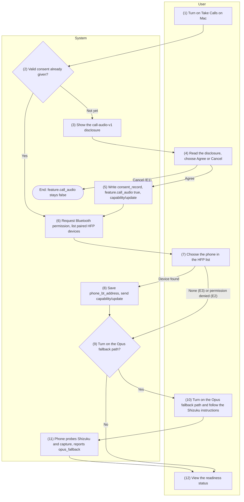
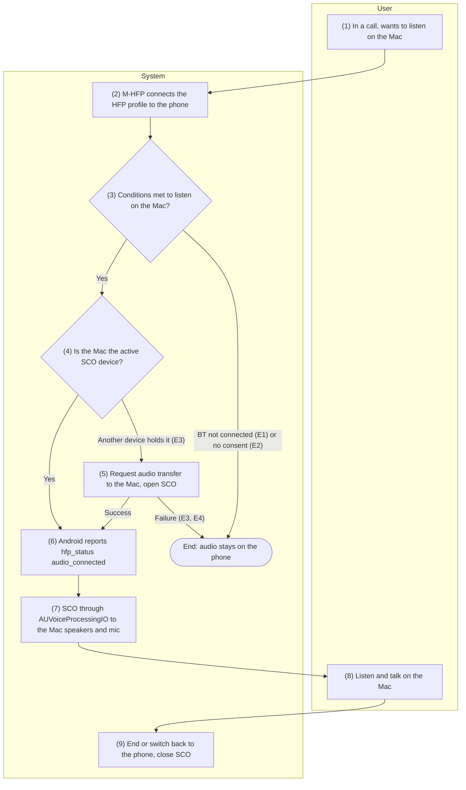
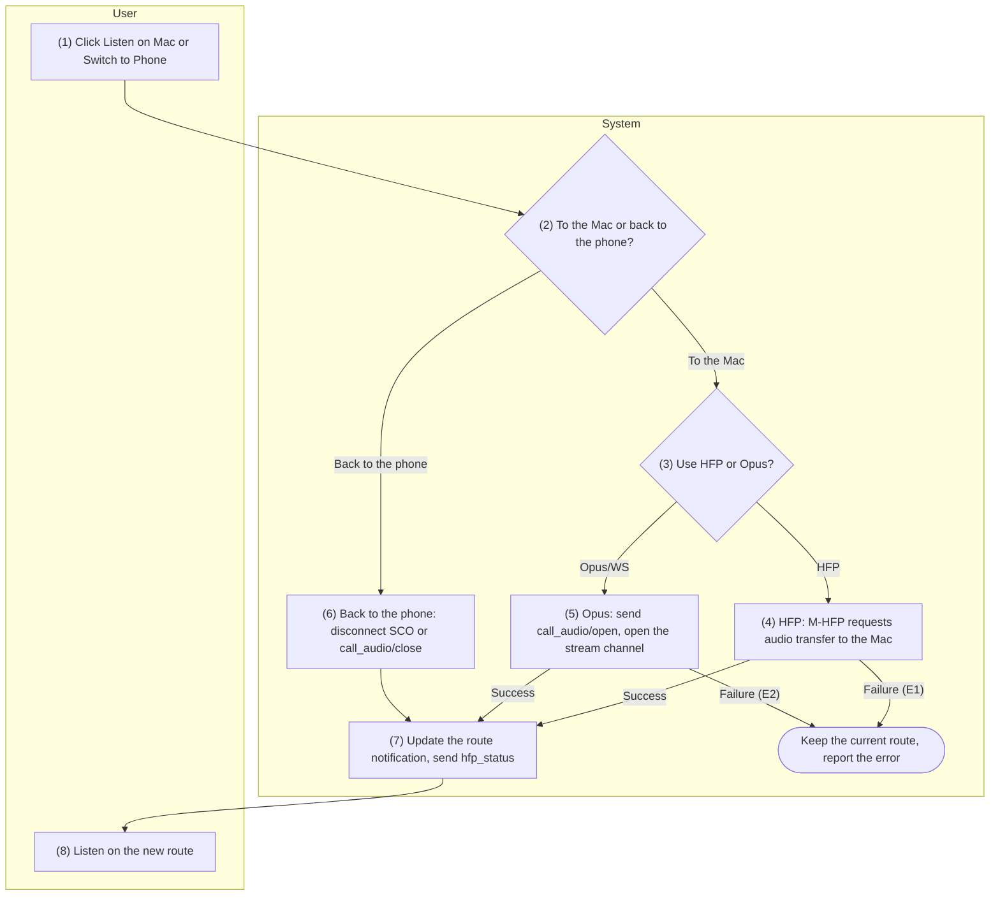
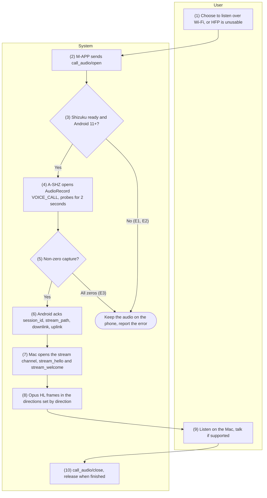

English | [Tiếng Việt](07-call-audio.vi.md)

# 7. Function group: Call audio

> Common references: [`00-common-specs.md`](00-common-specs.md) — components A-AUD (`CallAudioRelay`,
> `HfpCallAudioRelay`, `OpusWsCallAudioRelay`), A-SHZ, M-HFP, M-APP (0.1); envelope and `ack`
> (0.5.1); HL binary frame on `/v1/stream/call-audio` (0.5.2); stream channel keys and
> `call_audio/stream_hello` (0.6.3 step 7); HR binary wrapper over the relay (0.4.3); catalog entries
> `call_event/hfp_status` and `call_audio` (0.7.1); capability `features.call_audio` including
> `opus_fallback` (0.7.2); error codes `CALL_*`, `SHIZUKU_NOT_RUNNING`, `CALL_AUDIO_CAPTURE_UNSUPPORTED`
> (0.8.1); table `consent_record` (0.9.3); settings keys `feature.call_audio`,
> `call_audio.allow_opus_fallback`, `call_audio.phone_bt_address` (0.9.5). Decisions applied:
> README §5 C13 (keep Opus/WS + Shizuku), C14 (HFP encryption relies on Bluetooth link encryption);
> plan §12 D1, D2 and §13 D10, D11.
>
> General rules of group 7:
> - **Only the Mac** receives call audio. iPhone/iPad have no such function group (Apple exposes no
>   Hands-Free role API — README §4, plan §3.3).
> - **Two audio paths.** The primary path is Bluetooth HFP (AUDIO-02): the Mac takes the Hands-Free
>   role and the phone takes the Audio Gateway role through **Android's standard Bluetooth stack** (no
>   Android API is needed to carry the audio). The official fallback path is Opus over WebSocket
>   (AUDIO-04), which needs Shizuku. AUDIO-03 moves the audio between the Mac and the phone.
> - **Platform verification status (stated honestly).** `IOBluetoothHandsFreeDevice` is not
>   deprecated, but **no direct report has been found** confirming that HF SCO audio can be received
>   on macOS 13–26, and there are negative signals; go/no-go is decided by the one-week spike at the
>   start of Phase 4 (D1) — every item below states where it depends on the spike.
>   `BluetoothHeadsetClient` is an HF-role API (`@SystemApi @hide`) and does **not** serve a phone in
>   the AG role, so it is **not used** for the HFP path; Shizuku serves only AUDIO-04 (C13, D10).
> - **Call control over HFP** (`ATA`, `AT+CHUP`, `AT+CHLD`, `AT+VTS`, `+CLIP`, `+CIEV`,
>   `AT+CLCC`) belongs to CALL-02/CALL-03; group 7 only refers to it and does not specify it again.
> - **Security.** For cellular calls, SCO audio flows directly modem ↔ Bluetooth chip, so
>   **application-layer encryption of each SCO frame is not possible** (C14, D11): the HFP path relies
>   on the operating system's Bluetooth link encryption (Secure Connections on newer devices), and the
>   residual KNOB/BIAS risk is disclosed in AUDIO-01. The Opus/WS path keeps two layers (TLS 1.3 + E2E
>   with the stream channel keys).
> - No component records, stores or logs audio content; logs contain only `type`, `op`, size and
>   error code.

## 7.1 AUDIO-01 — Turn on calls on the Mac and accept the disclosure

### 7.1.1 General information

| Item | Content |
|-----|----------|
| Name | AUDIO-01 — Turn on calls on the Mac and accept the disclosure |
| Description | Turns on listening and talking on calls on the Mac following the disclosure-first model (plan §12 D2).<br>The first time it is turned on, M-APP shows the "call-audio-v1" disclosure (audio travels only between the user's own devices; nothing is recorded; the user is responsible for informing the other party where the law requires the consent of both parties — for example California, Florida, Illinois; the HFP path is protected only by Bluetooth link encryption, with a residual KNOB/BIAS risk; the Wi-Fi path is end-to-end encrypted).<br>The user agrees → `consent_record` is written → `feature.call_audio = true` → `capability/update` is sent.<br>Then the user is guided to grant the Mac the Bluetooth permission (`NSBluetoothAlwaysUsageDescription`) and to choose the phone in the list of devices paired at the operating-system level that offer the HFP AG profile (stored in `call_audio.phone_bt_address`; since Android 6, Android **cannot read its own Bluetooth address**, so the Mac has to make the choice).<br>An optional sub-flow turns on the Opus/WS fallback path (AUDIO-04): instructions to install and start Shizuku and to grant HandLive permission, after which the phone probes its capture capability and reports `opus_fallback`.<br>There is a flow to withdraw consent. |
| Actors | Primary: User (owns both the Mac and the phone). System: M-APP, M-HFP, OS macOS (TCC Bluetooth, IOBluetooth), A-SVC, A-AUD, A-SHZ (Shizuku UserService), A-UI. |
| Preconditions | 1.<br>The Mac and the phone are paired in HandLive (PAIR-01) and the pair is active.<br>2. macOS 13+.<br>3.<br>To use the HFP path: the Mac and the phone are paired at the **operating system's Bluetooth level** and the phone advertises the HFP Audio Gateway profile.<br>4.<br>To turn on the Opus/WS path: the phone runs Android 11+ and the user is willing to install Shizuku. |
| Postconditions | **Success (minimum):** a `consent_record` exists (`feature = call_audio`, `text_version = call-audio-v1`, `accepted_at` set, `revoked_at` null); `feature.call_audio = true` on the Mac; `capability/update` has been sent.<br>**Full HFP:** `call_audio.phone_bt_address` is stored and the Mac's Bluetooth permission is `authorized`.<br>**With Opus/WS:** the phone reports `opus_fallback.available = true` (with `downlink`, `uplink`, `reason = ok`).<br>**Withdrawn:** `consent_record.revoked_at` is set, `feature.call_audio = false`, `capability/update` has been sent.<br>**Failure:** no configuration changes; `feature.call_audio` stays `false`. |
| Exceptions | E1 — The user chooses "Cancel" in the disclosure dialog: nothing is turned on, `feature.call_audio` stays `false`.<br>E2 — The Mac's Bluetooth permission is denied: show instructions to open System Settings; the feature stays on, but the HFP path cannot be used yet (`CALL_BT_NOT_CONNECTED` when trying to listen in AUDIO-02).<br>E3 — No device paired over Bluetooth at the operating-system level advertises HFP AG: guide the user to pair the phone in System Settings › Bluetooth first.<br>E4 — The user withdraws consent (flow B): set `revoked_at`, turn the feature off, stop every running audio session.<br>E5 — The Opus/WS path is turned on, but Shizuku is not running or has not granted HandLive permission: `opus_fallback.available = false`, `reason = shizuku_not_running` (`SHIZUKU_NOT_RUNNING`).<br>E6 — The phone runs Android 10: the Opus/WS path is not feasible, `reason = android_10`.<br>E7 — The capture probe returns all zeros: `reason = capture_silent`, the device is marked as unable to capture (`CALL_AUDIO_CAPTURE_UNSUPPORTED`). |
| Special requirements | **Legal (D2):** the disclosure must be shown **before** the first activation; `text_version` and `accepted_at` are stored as proof that the disclosure was made; the text states clearly the user's responsibility in jurisdictions where the law requires the consent of both parties, and that nothing is recorded.<br>A change to the disclosure content → increment `text_version` (for example `call-audio-v2`) and ask for consent again.<br>**Security:** disclose the residual KNOB/BIAS risk of the HFP path (C14); store no one else's Bluetooth address, only that of the phone the user chose.<br>**Privacy:** request the Bluetooth permission only when the user actually turns the feature on.<br>**Usability:** every screen can be read with VoiceOver; the Shizuku instructions state clearly that Shizuku **must be restarted after every reboot of the phone** (through wireless debugging on Android 11+).<br>**Technical honesty:** the UI states that the HFP path is waiting for the result of spike D1 and may be unavailable on some macOS versions; the Opus/WS path states its limits per device and per Android version (details in AUDIO-04). |

### 7.1.2 Screens

N/A — no approved wireframe yet.

### 7.1.3 Component details

| # | Field | Data type | Input/Output | Initial value | Description |
|---|--------|--------------|--------------|------------------|-------|
| 1 | "Take Calls on Mac" switch | bool | Input/Output | `feature.call_audio` (`false`) | On → runs the disclosure and setup flow; off → withdraws consent (flow B) |
| 2 | Disclosure content | string | Output | Text of version `call-audio-v1` | States: only between your devices; nothing is recorded; you are responsible for informing the other party where the law requires the consent of both parties (California, Florida, Illinois…); HFP has only Bluetooth link encryption (residual KNOB/BIAS risk); Wi-Fi is end-to-end encrypted |
| 3 | Disclosure consent | enum{Agree\ | Cancel} | Input | — | Only "Agree" turns the feature on |
| 4 | Disclosure text version | string | Output | `call-audio-v1` | Written to `consent_record.text_version` |
| 5 | Mac Bluetooth permission | enum{not_determined\ | authorized\ | denied} | Output | From `CBManager.authorization` | `denied` comes with a button that opens System Settings › Privacy & Security › Bluetooth |
| 6 | Paired phones (HFP AG) | array<object{name, bt_address}> | Output | From IOBluetooth (step 7) | Lists only devices paired at the operating-system level that advertise the HFP AG profile |
| 7 | Phone chosen for HFP | string (bt_address) | Input/Output | `call_audio.phone_bt_address` (empty) | Chosen by the user; stored so that Android recognizes the Mac and M-HFP connects to the right device |
| 8 | Enable the Opus/WS fallback path | bool | Input/Output | `call_audio.allow_opus_fallback` (`true`) | Allows Opus/WS when HFP cannot be used (needs Shizuku) |
| 9 | Shizuku status on the phone | enum{unknown\ | not_installed\ | not_running\ | no_permission\ | ready} | Output | `unknown` | Reported by the phone through A-UI and capability |
| 10 | Opus/WS path capability | object{available, downlink, uplink, reason} | Output | From `features.call_audio.opus_fallback` | Probed and reported by the phone (step 11) |
| 11 | Error message or instructions | string | Output | Empty | Content per E1–E7 |

### 7.1.4 Business flow



| Step | Actor | Component | Description | Exceptions / Notes |
|------|----------|-----------|-------|--------------------|
| 1 | User | M-APP | Turns on "Take Calls on Mac" (menu bar › Settings › Call Audio). |  |
| 2 | System | M-APP | Check the `consent_record` of `call_audio` with `text_version = call-audio-v1` and `revoked_at` null. Present → skip the disclosure, go to step 6. |  |
| 3 | System | M-APP | Show the `call-audio-v1` disclosure (field 2) with the "Agree" and "Cancel" buttons. |  |
| 4 | User | M-APP | Reads the disclosure, chooses "Agree" or "Cancel". | "Cancel" → E1, close, nothing is turned on. |
| 5 | System | M-APP → A-SVC | Write `consent_record` (API 1); set `feature.call_audio = true`; send `capability/update` with `features.call_audio.enabled = true` and `features.call_audio.consented = true` (API 2). Android stores this value and relies on it to return `CALL_CONSENT_REQUIRED`. |  |
| 6 | System | M-APP, OS (TCC), M-HFP | Check and request the Bluetooth permission (`NSBluetoothAlwaysUsageDescription`, API 3) and the microphone permission (`NSMicrophoneUsageDescription`, `AVCaptureDevice.requestAccess(for: .audio)`) — each request comes after an explanation screen that has only a "Continue" button; list the devices paired at the operating-system level that advertise the HFP AG profile (API 4). | Permission denied → E2, continue but mark HFP as not usable yet. |
| 7 | User | M-APP | Chooses their phone in the list (field 6). | No device → E3, guide the user to pair over Bluetooth first. |
| 8 | System | M-APP → A-SVC | Save `call_audio.phone_bt_address`; send `capability/update` with `features.call_audio.bt_address` = the Mac's Bluetooth address, so that Android recognizes the Mac in its list of HFP devices (API 2, API 5). |  |
| 9 | User | M-APP | Decides whether to turn on the Opus/WS fallback path (field 8, `call_audio.allow_opus_fallback`). | Not turned on → go to step 12. |
| 10 | User | M-APP, A-UI | Follows the instructions to install/start Shizuku on the phone (wireless debugging on Android 11+; Shizuku must be restarted after every reboot of the phone) and grants HandLive permission in Shizuku. | Android 10 → E6. |
| 11 | System | A-SHZ, A-AUD → A-SVC → M-APP | The phone requests the Shizuku permission (API 6), binds the UserService, probes call capture for 2 seconds (API 7), then reports `opus_fallback` through `capability/update`. | Shizuku not running/permission not granted → E5. The probe returns all zeros → E7. |
| 12 | User | M-APP | Views the checklist: consent, Bluetooth permission, chosen phone, Opus/WS capability. |  |
| B1 | User | M-APP | Turns off the field 1 switch or clicks "Withdraw Consent". |  |
| B2 | System | M-APP → A-SVC | Stop every running audio session (AUDIO-02/AUDIO-04); set `consent_record.revoked_at`; `feature.call_audio = false`; send `capability/update` with `features.call_audio.consented = false`. | E4. |

### 7.1.5 API/service specification

**List of calls**

| # | API/service | Channel | Direction | Used in steps |
|---|-------------|------|-------|-------------|
| 1 | Write `consent_record` (SQLite through GRDB/SQLCipher) | Local (Mac) | M-APP ↔ OS | 2, 5, B2 |
| 2 | `WS capability/update` | `/v1/ctl` (LAN, USB or relay) | Both directions | 5, 8, 11, B2 |
| 3 | macOS Bluetooth permission (`CBManager.authorization`, `NSBluetoothAlwaysUsageDescription`) and microphone permission (`AVCaptureDevice.authorizationStatus(for: .audio)`, `NSMicrophoneUsageDescription`) | Local (Mac) | M-APP ↔ OS | 6 |
| 4 | List the paired HFP devices (`IOBluetoothDevice.pairedDevices`, `IOBluetoothHandsFreeDevice`) | Local (Mac) | M-HFP ↔ OS | 6, 7 |
| 5 | Store settings keys (`UserDefaults` on the Mac; `DataStore` on Android) | Local | M-APP / A-SVC | 5, 8 |
| 6 | `Shizuku.requestPermission`, `Shizuku.bindUserService` | Local (Android) | A-SVC ↔ Shizuku | 11 |
| 7 | Call capture probe (`AudioRecord` with source `VOICE_CALL`) | Local (Android, A-SHZ) | A-SHZ | 11 |

#### API 1 — Write `consent_record`

- **URL:** N/A (SQLite `handlive.sqlite`, table `consent_record` — 0.9.3, Mac only)
- **Method:** read/write through GRDB (SQLCipher). Details in the Query part.
- **Request (fields written):**

| Field | Type | Required | Description |
|--------|------|----------|-------|
| `feature` | string | Yes | Always `call_audio` |
| `text_version` | string | Yes | `call-audio-v1` |
| `accepted_at` | timestamp | Yes | When the user clicked "Agree" |
| `revoked_at` | timestamp \ | null | No | Set on withdrawal (flow B) |

- **Response:** N/A (local operation).
- **Example:** the user agrees at `1727150400000` → insert
  `(call_audio, call-audio-v1, 1727150400000, null)`.
- **Business logic:**
  1. **Valid** consent = a row exists with `feature = call_audio`, a `text_version` equal to the
     version being shown and `revoked_at` null.
  2. A change to the disclosure text → increment `text_version`; the new version has no valid row,
     which forces consent to be asked again.
  3. Withdrawal only sets `revoked_at` and keeps the old row as proof that the disclosure was once
     made; turning the feature on again later inserts a new row with a new `accepted_at`.
  4. `consent_record` is not synced to the phone; it is the Mac-side proof of disclosure.

#### API 2 — `WS capability/update`

- **URL:** `wss://{android_host}:{port}/v1/ctl` (LAN or USB) or through the relay
- **Method:** `WS capability/update` (both directions), encrypted envelope, no ack (0.7.1).
- **Request (`data`):** a full snapshot with the same structure as `capability/hello` (0.7.2); this
  group is concerned with the fields:

| Field | Type | Sender | Description |
|--------|------|---------|-------|
| `features.call_audio.enabled` | bool | Mac | New value of `feature.call_audio` |
| `features.call_audio.consented` | bool | Mac | A valid `consent_record` exists; Android relies on it to return `CALL_CONSENT_REQUIRED` |
| `features.call_audio.bt_address` | string \ | null | Mac | The Mac's Bluetooth address, so that Android recognizes the Mac in its list of HFP devices |
| `features.call_audio.hfp_connected` | bool | Android | The Mac has the HFP profile connected to the phone (AUDIO-02) |
| `features.call_audio.opus_fallback` | object | Android | `{available, downlink, uplink, reason}` — result of the probe in step 11 |

- **Response:** N/A; the other side sends its own capability when its configuration changes.
- **Example** (only the `call_audio` part; the real message carries every feature as in 0.7.2):

```json
{"op":"update","data":{"protocol":1,"app_version":"1.0.0 (100)","platform":"macos","os_version":"15.1","model":"Mac15,3","features":{"call_audio":{"enabled":true,"consented":true,"bt_address":"A1:B2:C3:D4:E5:F6"}}}}
```

```json
{"op":"update","data":{"protocol":1,"app_version":"1.0.0 (100)","platform":"android","os_version":"15","model":"Pixel 8","features":{"call_audio":{"enabled":true,"bt_address":null,"hfp_connected":false,"opus_fallback":{"available":true,"downlink":true,"uplink":false,"reason":"ok"}}}}}
```

- **Business logic:**
  1. The `call_audio` feature is **active** when it is on at both sides; for the HFP path to be
     usable, the Bluetooth permission and `phone_bt_address` are also needed; for the Opus/WS path,
     `opus_fallback.available = true` is needed (CONN-01 API 7).
  2. Android uses the Mac's `features.call_audio.bt_address` to match the connected HFP device
     (AUDIO-02 API 3).
  3. The Mac turns the feature off (withdrawal) → it sends `enabled = false`; Android stops monitoring
     HFP and releases the Opus/WS path.

#### API 3 — Bluetooth permission on macOS

- **URL:** N/A
- **Method:** `CBManager.authorization` (read); creating a `CBCentralManager` triggers the TCC
  dialog; `Info.plist` contains `NSBluetoothAlwaysUsageDescription`. Microphone:
  `AVCaptureDevice.authorizationStatus(for: .audio)`, `requestAccess(for: .audio)`; `Info.plist`
  contains `NSMicrophoneUsageDescription` ("HandLive uses the microphone so you can talk during calls
  transferred from your phone."). Microphone denied → the feature stays on, but only listening works,
  not talking (AUDIO-02 E7, AUDIO-04 precondition 6); guide the user to
  System Settings › Privacy & Security › Microphone.
- **Request:** no parameters; the permission purpose string = "HandLive connects to your phone over
  Bluetooth so you can listen and talk during calls on this Mac."
- **Response:** `CBManagerAuthorization` = `.notDetermined` \| `.allowedAlways` \| `.denied` \|
  `.restricted`.
- **Example:** first time → system dialog → `.allowedAlways` → field 5 = `authorized`.
- **Business logic:**
  1. Request it only when the user turns the feature on, never at app launch.
  2. `.denied` /`.restricted` → E2, show a button that opens
     `x-apple.systempreferences:com.apple.preference.security?Privacy_Bluetooth`; the feature stays
     on, but the HFP path reports `CALL_BT_NOT_CONNECTED` when trying to listen.
  3. This permission is independent of Bluetooth pairing at the operating-system level (step 7).

#### API 4 — List the paired HFP devices

- **URL:** N/A
- **Method:** `IOBluetoothDevice.pairedDevices()`; for each device, check the Hands-Free AG profile,
  and create `IOBluetoothHandsFreeDevice(device:delegate:)` when the user chooses it.
- **Request:** no parameters.
- **Response:** array of paired devices; each has `name` and `addressString` (format
  `A1:B2:C3:D4:E5:F6`).
- **Example:** returns `[{name: "Pixel của Lan", addressString: "A1:B2:C3:D4:E5:F6"}]` → field 6.
- **Business logic:**
  1. Show only devices paired at the operating-system level that have the HFP Audio Gateway profile;
     never pair over Bluetooth on the user's behalf.
  2. No device → E3, instructions: "Pair your phone with this Mac in System Settings › Bluetooth, then
     come back."
  3. Receiving SCO audio through `IOBluetoothHandsFreeDevice` **depends on the result of spike D1**;
     if the spike fails on the user's macOS version, M-APP hides the HFP path and offers only the
     Opus/WS path.

#### API 5 — Store settings keys

- **URL:** N/A
- **Method:** Mac: `UserDefaults`; Android: Jetpack `DataStore` (0.9.5).
- **Request/Response:** read/write the keys `feature.call_audio`, `call_audio.allow_opus_fallback`,
  `call_audio.phone_bt_address` (Mac only).
- **Example:** see the Query part.
- **Business logic:** `call_audio.phone_bt_address` lives only on the Mac (since Android 6 the phone
  cannot read its own Bluetooth address); Android stores `feature.call_audio` to compute its
  capability.

#### API 6 — Shizuku: request permission and bind the UserService

- **URL:** N/A
- **Method:** `Shizuku.pingBinder()`, `Shizuku.checkSelfPermission()`,
  `Shizuku.requestPermission(requestCode)`, `Shizuku.bindUserService(userServiceArgs, connection)`.
- **Request:** `userServiceArgs` points to the A-SHZ UserService class (runs as the shell uid).
- **Response:** permission result (`PERMISSION_GRANTED`/`PERMISSION_DENIED`); the UserService's
  `IBinder` when binding succeeds.
- **Example:** `pingBinder()` = true, `checkSelfPermission()` = denied → `requestPermission(1001)` →
  the user grants it in Shizuku → bind the UserService.
- **Business logic:**
  1. `pingBinder()` false → Shizuku is not running → E5 (`SHIZUKU_NOT_RUNNING`), instructions to
     start Shizuku through wireless debugging; a reminder that it must be restarted after every
     reboot of the phone.
  2. Permission denied → `reason = shizuku_not_running` with the note "no_permission" for the UI
     (field 9 = `no_permission`).
  3. Bind only when the user turns on the Opus/WS path; A-SHZ is optional and is not bound when A-SVC
     starts.

#### API 7 — Call capture probe

- **URL:** N/A
- **Method:** `AudioRecord` with source `MediaRecorder.AudioSource.VOICE_CALL` (fallback
  `VOICE_DOWNLINK`), 16 kHz mono 16-bit PCM, running inside A-SHZ (the shell uid holds
  `CAPTURE_AUDIO_OUTPUT` from Android 11).
- **Request:** source configuration, sample rate; probe duration 2 seconds.
- **Response:** PCM blocks; result `{available, downlink, uplink, reason}`.
- **Example:** Pixel 8 → non-zero samples →
  `{available: true, downlink: true, uplink: <13+>, reason: "ok"}`. Galaxy S22 Ultra (Android 14) →
  all zeros → `{available: false, downlink: false, uplink: false, reason: "capture_silent"}`.
- **Business logic:**
  1. Android 10 → no probe, `reason = android_10` (E6): the shell has no `CAPTURE_AUDIO_OUTPUT` before
     Android 11.
  2. The probe must also run without a real call (open the AudioRecord and read); all zeros for
     2 seconds → `capture_silent` (E7, `CALL_AUDIO_CAPTURE_UNSUPPORTED`), and the device is marked so
     that the Opus/WS path is not offered next time.
  3. `uplink` = whether `AudioManager.getCallUplinkInjectionAudioTrack()` (Android 13+) is available;
     this value is **unverified**, so it is only used to enable the "listen and talk (experimental)"
     mode in AUDIO-04; by default the device is treated as listen-only.
  4. The probe's audio samples are not stored; only the flag telling whether they were all zeros is
     kept.

#### Query

```sql
-- [Design] Mac, step 2: valid consent for call_audio
SELECT text_version, accepted_at
FROM consent_record
WHERE feature = 'call_audio'
  AND text_version = 'call-audio-v1'
  AND revoked_at IS NULL
LIMIT 1;

-- [Design] Mac, step 5: record consent (new insert, or turning it on again after withdrawal)
INSERT INTO consent_record (feature, text_version, accepted_at, revoked_at)
VALUES ('call_audio', 'call-audio-v1', :accepted_at, NULL)
ON CONFLICT (feature, text_version)
DO UPDATE SET accepted_at = excluded.accepted_at, revoked_at = NULL;

-- [Design] Mac, step B2: withdraw consent
UPDATE consent_record
SET revoked_at = :now
WHERE feature = 'call_audio' AND text_version = 'call-audio-v1' AND revoked_at IS NULL;
```

```text
# [Design] M-APP UserDefaults (keys 0.9.5)
UserDefaults.standard.bool(forKey: "feature.call_audio")                       # step 1
UserDefaults.standard.set(true,  forKey: "feature.call_audio")                 # step 5
UserDefaults.standard.set("A1:B2:C3:D4:E5:F6", forKey: "call_audio.phone_bt_address")  # step 8
UserDefaults.standard.bool(forKey: "call_audio.allow_opus_fallback")           # step 9

# [Design] A-SVC DataStore (Android)
booleanPreferencesKey("feature.call_audio")   # read/write to compute capability
```

---

## 7.2 AUDIO-02 — Listen and talk on the Mac over Bluetooth HFP

### 7.2.1 General information

| Item | Content |
|-----|----------|
| Name | AUDIO-02 — Listen and talk on the Mac over Bluetooth HFP |
| Description | The **primary** audio path: during an ongoing cellular call, the user listens and talks right on the Mac over the Bluetooth Hands-Free Profile.<br>The Mac takes the **Hands-Free (HF)** role with `IOBluetoothHandsFreeDevice`; the phone takes the **Audio Gateway (AG)** role with Android's standard Bluetooth stack — **no Android API is needed** to carry the call audio (SCO audio flows directly modem ↔ Bluetooth chip).<br>M-HFP requests that the audio be transferred to the computer to open the SCO channel; the SCO audio goes into `AUVoiceProcessingIO` (AEC echo cancellation, noise reduction, AGC automatic level control) and then to the Mac's speakers and microphone.<br>Android monitors the HFP profile state with public APIs and reports `call_event/hfp_status` (`connected`, `audio_connected`, `mac_is_active_device`), matching the Mac by `features.call_audio.bt_address`.<br>Call control (answer, hang up, hold, DTMF, mute) goes through HFP commands and belongs to CALL-02/CALL-03 — this item does not specify it again. |
| Actors | Primary: User (in a call). System: M-HFP, M-APP, OS macOS (IOBluetooth, CoreAudio/`AUVoiceProcessingIO`), A-CALL, A-AUD (`HfpCallAudioRelay`), A-SVC, OS Android (`BluetoothHeadset`). |
| Preconditions | 1.<br>AUDIO-01 is complete: `feature.call_audio = true` on both sides, a valid `consent_record`, Mac Bluetooth permission `authorized`, `call_audio.phone_bt_address` stored; Mac microphone permission `authorized` to talk (not needed to listen only).<br>2.<br>The Mac and the phone are paired at the operating system's Bluetooth level; the phone advertises the HFP AG profile.<br>3.<br>A call is in progress (answered — CALL-02) or ringing, and the user chooses to listen on the Mac.<br>4.<br>The result of spike D1 shows that `IOBluetoothHandsFreeDevice` receives SCO audio on the current macOS version. |
| Postconditions | **Listening on the Mac:** the SCO channel is open; two-way audio through `AUVoiceProcessingIO`; Android reports `hfp_status` `{connected: true, audio_connected: true, mac_is_active_device: true}`; M-APP shows "Listening on Mac".<br>**End:** when the call ends or the user switches back to the phone (AUDIO-03), SCO closes, `audio_connected = false`; no persistent data changes. |
| Exceptions | E1 — The Mac's Bluetooth permission is not granted or no phone has been chosen (`phone_bt_address` empty): `CALL_BT_NOT_CONNECTED`, guide the user back to AUDIO-01.<br>E2 — No valid consent yet: `CALL_CONSENT_REQUIRED`, open AUDIO-01.<br>E3 — Another HFP device (for example AirPods) holds the SCO audio: M-HFP requests that the audio be transferred to the Mac; on failure → if the Opus/WS path is available, switch to AUDIO-04, otherwise the audio stays on the phone (`CALL_ROUTE_FAILED`).<br>E4 — SCO cannot be opened or macOS does not deliver SCO audio to the app (spike D1 gave a bad result on this machine): `CALL_ROUTE_FAILED`, suggest the Opus/WS path.<br>E5 — Out of Bluetooth range during the call: SCO drops, the audio **returns to the phone on its own** (default behavior of the Bluetooth stack); M-APP updates the status from `hfp_status`.<br>E6 — Bluetooth link encryption lost (Secure Connections could not be negotiated): listening is still allowed, but the user is reminded of the disclosed risk (not blocked — the user's decision in AUDIO-01).<br>E7 — The Mac's microphone permission is denied: listening works but talking does not; M-APP shows "Microphone access is needed to talk on this Mac" with a button that opens System Settings › Privacy & Security › Microphone; the listening path is not blocked. |
| Special requirements | **Quality:** MOS ≥ 3.5; echo cancellation reaches an echo return loss > 40 dB (the same engine FaceTime uses).<br>**Codec:** CVSD 8 kHz or mSBC 16 kHz as negotiated by the Bluetooth layer (not chosen by the app).<br>**Latency:** SCO path ~40 ms (plan §4 target).<br>**Security:** Bluetooth link encryption only (C14, D11) — application-layer encryption of each SCO frame is not possible; the KNOB/BIAS risk is disclosed in AUDIO-01.<br>**Technical honesty:** **how macOS delivers HF-role SCO audio to the app must be confirmed by spike D1** — this document does not invent input/output device names or a specific mechanism; if the spike fails, the HFP path is disabled and the user moves to AUDIO-04.<br>**Several HFP devices:** Android can keep several HFP devices connected at the same time, but only one device is active for SCO at a time. |

### 7.2.2 Screens

N/A — no approved wireframe yet.

### 7.2.3 Component details

| # | Field | Data type | Input/Output | Initial value | Description |
|---|--------|--------------|--------------|------------------|-------|
| 1 | Listening status | enum{on_phone\ | connecting\ | on_mac\ | failed} | Output | `on_phone` | "Listening on phone", "Switching…", "Listening on Mac", "Can't listen on Mac" |
| 2 | HFP status | object{connected, audio_connected, mac_is_active_device} | Output | `{false,false,false}` | From Android's `call_event/hfp_status` |
| 3 | SCO codec | enum{cvsd_8k\ | msbc_16k\ | unknown} | Output | `unknown` | Negotiated by the Bluetooth layer; shown in the diagnostics section |
| 4 | Active HFP device | string | Output | Empty | Name of the device holding SCO (for example "AirPods" when it has taken over — E3) |
| 5 | "Listen on Mac" / "Switch to Phone" button | action | Input | — | Triggers AUDIO-03 (this item only shows the result) |
| 6 | Estimated quality | object{mos, erl_db} | Output | Empty | M-APP diagnostics section |
| 7 | Error message | string | Output | Empty | Per E1–E6 |

### 7.2.4 Business flow



| Step | Actor | Component | Description | Exceptions / Notes |
|------|----------|-----------|-------|--------------------|
| 1 | User | M-APP | In a call (CALL-01…03); chooses to listen on the Mac (the default once turned on, or through AUDIO-03). |  |
| 2 | System | M-HFP, OS | Ensure the HFP profile (service-level) connection to the phone given by `call_audio.phone_bt_address` (`IOBluetoothHandsFreeDevice.connect` — API 1). | Permission not granted/no phone chosen → E1. |
| 3 | System | M-APP | Check that `feature.call_audio` is active, consent exists, the Bluetooth permission is `authorized` and a call is active. | No consent → E2; no Bluetooth → E1. |
| 4 | System | A-SVC, OS Android | Android reads which HFP device is active for SCO (`BluetoothHeadset` — API 4); matches the Mac by `bt_address`. | Another device holds SCO (AirPods) → E3, go to step 5. |
| 5 | System | M-HFP, OS | The Mac (HF side) requests that the audio be transferred to the computer to take over the SCO channel (API 1). | Failure → E3/E4: if Opus/WS is available, switch to AUDIO-04, otherwise `CALL_ROUTE_FAILED`. |
| 6 | System | A-SVC → M-APP | Android detects SCO connected (`ACTION_AUDIO_STATE_CHANGED`) and sends `call_event/hfp_status` `{connected, audio_connected: true, mac_is_active_device: true}` (API 3). |  |
| 7 | System | M-HFP, OS (CoreAudio) | The SCO audio goes into `AUVoiceProcessingIO` (AEC/NS/AGC) and then to the Mac's speakers and microphone (API 2). Status `on_mac`. | **How macOS delivers SCO to the app is confirmed by spike D1.** Not delivered → E4. |
| 8 | User | M-APP | Listens and talks on the Mac; controls the call (hold, DTMF, mute) through CALL-03. |  |
| 9 | System | M-HFP, A-SVC | The call ends (CALL-03) or the audio is switched back to the phone (AUDIO-03): close SCO; Android sends `hfp_status` `audio_connected = false`. | Out of BT range → E5 (the audio returns to the phone on its own). |

### 7.2.5 API/service specification

**List of calls**

| # | API/service | Channel | Direction | Used in steps |
|---|-------------|------|-------|-------------|
| 1 | `IOBluetoothHandsFreeDevice` (connect / transfer audio / `sendATCommand`) | Local (Mac) | M-HFP ↔ OS | 2, 5 |
| 2 | `AUVoiceProcessingIO` (AEC, noise reduction, AGC) | Local (Mac) | M-HFP ↔ OS | 7 |
| 3 | `WS call_event/hfp_status` | `/v1/ctl` | S→C | 6, 9 |
| 4 | `BluetoothHeadset` proxy and broadcasts (Android) | Local (Android) | A-SVC ↔ OS | 4, 6, 9 |

#### API 1 — `IOBluetoothHandsFreeDevice`

- **URL:** N/A
- **Method:** create `IOBluetoothHandsFreeDevice(device:delegate:)`; `connect()`; transfer SCO audio
  to/from the computer with this class's audio transfer API; `sendATCommand(_:)` for HFP commands
  (used by CALL-02/CALL-03). Only this class's own methods are used; the document does not invent any
  further method names.
- **Request:** `device` = the `IOBluetoothDevice` matching `call_audio.phone_bt_address`; `delegate`
  receives the SCO state callbacks and the AG indicators.
- **Response (delegate callbacks):** service-level connection events, SCO connect/disconnect, `+CIEV`
  /`+CLIP` indicators (passed on to CALL-02/CALL-03).
- **Example:** create it with the device "Pixel của Lan" → `connect()` → when there is a call, request
  that the audio be transferred to the computer → the delegate reports SCO connected.
- **Business logic:**
  1. **The whole class sits behind the Mac-side `CallAudioRelay` abstraction** (parallel to
     `HfpCallAudioRelay` /`OpusWsCallAudioRelay` on Android) so that the path can be switched when
     spike D1 fails (plan §12 D1, code-standards).
  2. The HFP service-level connection is kept for as long as the feature is on; SCO opens only when
     there is a call and the Mac is the device chosen for listening.
  3. **Spike D1 dependency:** whether the HF-role SCO audio stream can be received on macOS 13–26,
     and how macOS exposes that stream to the app — no direct report confirms it and there are
     negative signals; the one-week spike decides go/no-go. The document describes no specific
     mechanism before the result is in.

#### API 2 — `AUVoiceProcessingIO`

- **URL:** N/A
- **Method:** Audio Unit `kAudioUnitType_Output` / `kAudioUnitSubType_VoiceProcessingIO`, built with
  `AVAudioEngine` or AUGraph; echo cancellation, noise reduction and automatic level control turned
  on.
- **Request:** the input format is the SCO audio stream (source confirmed by spike D1), the output is
  the Mac's speakers; the Mac's microphone is the source for the reverse direction (needs
  `NSMicrophoneUsageDescription` and the microphone permission `authorized`; denied → E7, listen
  only).
- **Response:** echo-cancelled stream to the speakers; the processed microphone signal is pushed back
  to the SCO path.
- **Example:** the same engine FaceTime uses; an echo return loss > 40 dB measured in the loudspeaker
  scenario.
- **Business logic:**
  1. Echo cancellation must be on to avoid acoustic feedback when the Mac's loudspeakers are used.
  2. The Mac's default microphone and speakers; if the user changes the system output/input device,
     the engine follows the default device.
  3. No recording and no buffering beyond what processing needs; the engine is released when SCO
     closes.

#### API 3 — `WS call_event/hfp_status`

- **URL:** `wss://{android_host}:{port}/v1/ctl` (LAN or USB); this item runs when both devices are on
  the same LAN/within Bluetooth range and does not go through the relay.
- **Method:** `WS call_event/hfp_status` (S→C), encrypted envelope, no ack (0.7.1).
- **Request (`data`):**

| Field | Type | Required | Description |
|--------|------|----------|-------|
| `connected` | bool | Yes | Whether an HFP device (matching the Mac's `bt_address`) has a service-level connection |
| `audio_connected` | bool | Yes | Whether the SCO (audio) channel to that device is open |
| `mac_is_active_device` | bool | Yes | Whether the device holding SCO really is the Mac (as opposed to AirPods) |
| `active_device_name` | string | No | Name of the active HFP device (shown when it has taken over — field 4) |
| `codec` | enum{cvsd\ | msbc\ | unknown} | No | Negotiated SCO codec, if it can be read |

- **Response:** N/A (one-way event).
- **Example:**

```json
{"op":"hfp_status","data":{"connected":true,"audio_connected":true,"mac_is_active_device":true,"active_device_name":"MacBook của Lan","codec":"msbc"}}
```

- **Business logic:**
  1. Android sends it whenever the state changes (profile connected/disconnected, SCO opened/closed)
     and once after the handshake.
  2. `mac_is_active_device = false` while `connected = true` means that another device holds SCO
     (E3) — M-APP shows `active_device_name` and offers to move the audio to the Mac or to use
     AUDIO-04.
  3. Android **needs no API to carry audio**: it only reads the profile state to report it; opening
     SCO is requested by the Mac (HF) side.

#### API 4 — `BluetoothHeadset` proxy and broadcasts (Android)

- **URL:** N/A
- **Method:** `BluetoothAdapter.getProfileProxy(context, listener, BluetoothProfile.HEADSET)`;
  `BluetoothHeadset.getConnectedDevices()`; broadcasts
  `BluetoothHeadset.ACTION_CONNECTION_STATE_CHANGED` and `ACTION_AUDIO_STATE_CHANGED`. Permission
  `BLUETOOTH_CONNECT`.
- **Request:** register the proxy and the receiver; filter devices by the Mac's Bluetooth address
  (`features.call_audio.bt_address`).
- **Response:** list of connected HFP devices; events for changes of the connection state and the
  audio (SCO) state.
- **Example:** `getConnectedDevices()` returns `[Pixel↔MacBook]`; `ACTION_AUDIO_STATE_CHANGED` =
  `STATE_AUDIO_CONNECTED` → send `hfp_status` `audio_connected: true`.
- **Business logic:**
  1. This is the **AG role using public APIs for observation only**: `BluetoothHeadset` (HEADSET
     proxy) tells which device is connected and whether SCO is open; it is not used to carry audio.
  2. `BLUETOOTH_CONNECT` missing → the state cannot be read → `hfp_status` cannot be sent; the
     capability flags the missing permission (CONN-01 API 7).
  3. The Mac is matched by the `bt_address` it sends in `capability` (AUDIO-01 API 2); devices with a
     different address are treated as AirPods/other devices (`mac_is_active_device` set accordingly).
  4. `BluetoothHeadsetClient` (HF role) is **not** used here (C13, D10): it serves an Android device
     acting as HF for another AG, not Android acting as AG for the Mac.

#### Query

N/A — this function does not read or write the database; it only reads the settings key
`call_audio.phone_bt_address` and the capability kept in memory.

---

## 7.3 AUDIO-03 — Move call audio between the Mac and the phone

### 7.3.1 General information

| Item | Content |
|-----|----------|
| Name | AUDIO-03 — Move call audio between the Mac and the phone |
| Description | During an ongoing call, the user moves the audio back and forth between the Mac and the phone with the M-APP call panel ("Listen on Mac" / "Switch to Phone").<br>On the HFP path: M-HFP (the Hands-Free side) requests that the audio be transferred to the computer or handed back to the phone — connecting/disconnecting SCO is controlled by the HF side, and **Android needs to do nothing**.<br>On the Opus/WS path: M-APP sends `call_audio/open` to start and `call_audio/close` to stop (AUDIO-04).<br>If the user moves out of Bluetooth range while listening over HFP, the audio **returns to the phone on its own** (default behavior of the Bluetooth stack) and M-APP shows this.<br>The phone always shows the current audio route in the A-SVC persistent notification. |
| Actors | Primary: User. System: M-HFP, M-APP, A-AUD, A-SVC, A-UI (route notification), OS (IOBluetooth, `BluetoothHeadset`). |
| Preconditions | 1. A call is in progress.<br>2. AUDIO-01 is complete; at least one path is available: HFP (Bluetooth permission + `phone_bt_address` + spike D1 passed) or Opus/WS (`opus_fallback.available = true`). |
| Postconditions | **To the Mac:** the current route is `mac_hfp` or `mac_opus`; the audio plays on the Mac; the notification on the phone reads "Audio is on <Mac name>".<br>**Back to the phone:** SCO is closed (HFP) or `call_audio/close` has been sent (Opus); the audio returns to the phone's speaker or earpiece; the notification reads "Audio is on this phone".<br>No persistent data changes. |
| Exceptions | E1 — Switching to HFP fails (another HFP device holds SCO, or SCO cannot be opened — depends on spike D1): automatically try the Opus/WS path if it is available; otherwise `CALL_ROUTE_FAILED`, keep the audio on the phone.<br>E2 — Switching to Opus/WS fails (Shizuku not running → `SHIZUKU_NOT_RUNNING`; or the device cannot capture → `CALL_AUDIO_CAPTURE_UNSUPPORTED`): keep the current route, inform the user.<br>E3 — Out of Bluetooth range while listening over HFP: the audio returns to the phone on its own; M-APP updates and may offer to switch to Opus/WS.<br>E4 — No path is available: the "Listen on Mac" button is disabled, with guidance back to AUDIO-01.<br>E5 — No call in progress: the routing panel is hidden or disabled. |
| Special requirements | **Responsiveness:** a routing action gets visible feedback in ≤ 1 s; the route switch completes (audio audible on the new route) in ≤ 3 s.<br>**Consistency:** when both paths are available, HFP is preferred (lower latency) unless HFP has been taken over.<br>**Honesty:** the UI shows the path in use (HFP or Opus/WS) and the reason when switching is not possible.<br>**Privacy:** the notification on the phone always shows where the audio is playing. |

### 7.3.2 Screens

N/A — no approved wireframe yet.

### 7.3.3 Component details

| # | Field | Data type | Input/Output | Initial value | Description |
|---|--------|--------------|--------------|------------------|-------|
| 1 | Routing button | enum{Listen on Mac\ | Switch to Phone} | Input | "Listen on Mac" | The label changes with the current route |
| 2 | Current audio route | enum{phone\ | mac_hfp\ | mac_opus} | Output | `phone` | "Phone", "Mac (Bluetooth)", "Mac (Wi-Fi)" |
| 3 | Available paths | array<enum{hfp\ | opus}> | Output | Empty | Computed from the capability and the HFP status |
| 4 | HFP status | object{connected, audio_connected, mac_is_active_device} | Output | `{false,false,false}` | From `call_event/hfp_status` (AUDIO-02 API 3) |
| 5 | Route notification on the phone | string | Output | "Audio is on this phone" | Updated by A-SVC in the persistent notification |
| 6 | Error message | string | Output | Empty | Per E1–E5 |

### 7.3.4 Business flow



| Step | Actor | Component | Description | Exceptions / Notes |
|------|----------|-----------|-------|--------------------|
| 1 | User | M-APP | Clicks "Listen on Mac" or "Switch to Phone" in the call panel. | No call → E5 (button disabled). |
| 2 | System | M-APP | Determine the direction of the switch from the button and the current route. |  |
| 3 | System | M-APP | Choose the path: HFP if it is available and not taken over; otherwise Opus/WS if `opus_fallback.available`. | No path → E4. |
| 4 | System | M-HFP, OS | HFP path: M-HFP (HF side) requests that the audio be transferred to the computer to open SCO (AUDIO-02 API 1). Android does nothing. | Another device holds SCO or SCO cannot be opened → E1, try Opus/WS. |
| 5 | System | M-APP → A-SVC | Opus/WS path: send `call_audio/open`, then open `/v1/stream/call-audio` (AUDIO-04). | Shizuku/capture error → E2. |
| 6 | System | M-HFP or M-APP → A-SVC | Back to the phone: the HFP path disconnects SCO (HF side); the Opus/WS path sends `call_audio/close`. |  |
| 7 | System | A-SVC, M-APP | Android updates the route notification (field 5) and sends a `call_event/hfp_status` that reflects the new route; M-APP updates field 2. | Out of BT range → E3 (the audio returns to the phone on its own, `hfp_status` reports `audio_connected: false`). |
| 8 | User | M-APP | Listens on the new route. |  |

### 7.3.5 API/service specification

**List of calls**

| # | API/service | Channel | Direction | Used in steps |
|---|-------------|------|-------|-------------|
| 1 | `IOBluetoothHandsFreeDevice` (transfer audio to/from the computer) | Local (Mac) | M-HFP ↔ OS | 4, 6 |
| 2 | `WS call_audio/open` | `/v1/ctl` | C→S | 5 |
| 3 | `WS call_audio/close` | `/v1/ctl` | Both directions | 6 |
| 4 | `WS call_event/hfp_status` | `/v1/ctl` | S→C | 7 |

#### API 1 — `IOBluetoothHandsFreeDevice` (audio routing)

- **URL:** N/A
- **Method:** the `IOBluetoothHandsFreeDevice` API for transferring SCO audio to/from the computer
  (instance created in AUDIO-02 API 1). No further method names are invented.
- **Request:** a request to transfer the audio to the computer (take SCO) or back to the phone
  (release SCO).
- **Response:** delegate callback reporting SCO connected/disconnected.
- **Example:** the user clicks "Listen on Mac" → M-HFP requests that the audio be transferred to the
  computer → the delegate reports SCO connected → route `mac_hfp`.
- **Business logic:**
  1. Connecting/disconnecting SCO is controlled by the **HF side (Mac)**; Android only observes and
     reports `hfp_status`.
  2. If another HFP device holds SCO (AirPods), the transfer request may be refused at the Bluetooth
     layer → E1, try Opus/WS instead.
  3. Depends on spike D1, as in AUDIO-02.

#### API 2 — `WS call_audio/open`

- **URL:** `wss://{android_host}:{port}/v1/ctl` (LAN) or through the relay
- **Method:** `WS call_audio/open` (C→S), encrypted envelope, ack. Field details in AUDIO-04 API 1;
  used here to turn on the Opus/WS route when switching to the Mac without HFP.
- **Request/Response:** per AUDIO-04 API 1.
- **Example:** see AUDIO-04.
- **Business logic:** called only when `opus_fallback.available` and a call is active; error ack →
  E2.

#### API 3 — `WS call_audio/close`

- **URL:** as in API 2
- **Method:** `WS call_audio/close` (both directions), encrypted envelope, ack. Details in AUDIO-04
  API 2.
- **Request (`data`):** `session_id`, `reason` — enum{user\|switch_to_hfp\|call_ended\|error}.
- **Response (`ack.data`):** `{}`.
- **Example:** switching back to the phone while on Opus/WS →
  `{"op":"close","data":{"session_id":"…","reason":"user"}}`.
- **Business logic:** close the `/v1/stream/call-audio` channel, release A-SHZ; Android updates the
  route notification.

#### API 4 — `WS call_event/hfp_status`

- **URL:** `wss://{android_host}:{port}/v1/ctl`
- **Method:** `WS call_event/hfp_status` (S→C) — as in AUDIO-02 API 3.
- **Request (`data`):** as in AUDIO-02 API 3.
- **Response:** N/A.
- **Example:** after going back to the phone →
  `{"op":"hfp_status","data":{"connected":true,"audio_connected":false,"mac_is_active_device":false}}`.
- **Business logic:** M-APP uses `hfp_status` as the source of truth for fields 2 and 4; it corrects
  the display on its own when the route changes because of an outside event (out of BT range).

#### Query

N/A — this function does not read or write the database.

---

## 7.4 AUDIO-04 — Call audio over Opus/WebSocket (fallback, requires Shizuku)

### 7.4.1 General information

| Item | Content |
|-----|----------|
| Name | AUDIO-04 — Call audio over Opus/WebSocket (fallback, requires Shizuku) |
| Description | The **official fallback** path for call audio when HFP cannot be used (AirPods hold SCO, out of Bluetooth range, or spike D1 failed) — decision C13/D10.<br>M-APP sends `call_audio/open`; Android (through A-SHZ, running as Shizuku's shell uid) captures the call audio with `AudioRecord` source `VOICE_CALL`, encodes it with Opus and sends HL binary frames over the `/v1/stream/call-audio` channel; the Mac decodes them, feeds them into `AUVoiceProcessingIO` and then to the speakers.<br>The talk direction (uplink) is only possible through `AudioManager.getCallUplinkInjectionAudioTrack()` (Android 13+) and **has not been verified by anyone**; Android 11–12 has no voice-injection path, so it runs in **"listen-only"** mode and the UI reminds the user to speak directly into the phone.<br>Works both on the LAN and over the relay (HR binary wrapper — 0.4.3), with a bandwidth of ~32 kbps in each direction.<br>**The limits per device and per version are spelled out in the feasibility table below.** |
| Actors | Primary: User. System: M-APP, A-SVC, A-AUD (`OpusWsCallAudioRelay`), A-SHZ (Shizuku UserService, shell uid), OS Android (`AudioRecord`, `AudioManager`), OS macOS (`AUVoiceProcessingIO`, libopus). |
| Preconditions | 1.<br>Shizuku is running and HandLive has been granted the Shizuku permission (AUDIO-01).<br>2.<br>Android ≥ 11.<br>3. `call_audio.allow_opus_fallback = true`.<br>4.<br>A call is in progress.<br>5.<br>The device has not been marked `capture_silent`.<br>6.<br>To talk (`direction = both`): the Mac's microphone permission is `authorized` (AUDIO-01 API 3); denied → listen only (`direction = downlink`). |
| Postconditions | **Running:** the `/v1/stream/call-audio` channel is open with a `session_id`; the downlink (listening) works; the uplink (talking) works if the phone runs Android 13+ and injection is usable, otherwise "listen-only" mode.<br>**Ended:** `call_audio/close` has been sent, A-SHZ has released `AudioRecord`/injection, the stream channel is closed with code 1000.<br>No audio sample is ever stored. |
| Exceptions | E1 — Shizuku is not running or the permission has not been granted: `SHIZUKU_NOT_RUNNING`, AUDIO-01 instructions.<br>E2 — Android 10: `CALL_AUDIO_CAPTURE_UNSUPPORTED` (`reason = android_10`).<br>E3 — The first 2 seconds of probing return all zeros: `CALL_AUDIO_CAPTURE_UNSUPPORTED` (`reason = capture_silent`), the device is marked so that the path is not offered again.<br>E4 — Android 11–12 or no injection: "listen-only" mode (`direction = downlink`), the UI reminds the user to speak into the phone (not a blocking error).<br>E5 — The stream channel cannot be opened, `stream_hello` is rejected, or the silence lasts too long: reopen with the same `session_id` up to 3 times (0.25 s, 0.5 s, 1 s); still failing → close the session, keep the audio on the phone (`CALL_ROUTE_FAILED`).<br>E6 — The call ends midway: `call_audio/close` `reason = call_ended`. |
| Special requirements | **Codec:** libopus 32 kbps CBR, complexity 5, `OPUS_APPLICATION_VOIP`, 16 kHz mono, 20 ms frames.<br>**Jitter buffer (Mac):** adaptive 40–120 ms, starting at 60 ms, adjusted to the running standard deviation of the frames' inter-arrival times.<br>**Echo cancellation:** `AUVoiceProcessingIO` on the Mac.<br>**Quality/latency:** latency 100–150 ms; MOS ≥ 3.0.<br>**Security:** two layers — TLS 1.3 on the channel and E2E with the stream channel keys (0.6.3 step 7); HL binary frames (0.5.2).<br>**Real time, nothing stored:** real-time relay only, **never written to disk**.<br>**Policy risk:** Google Play lists "call recorder" as an **invalid** use of the call log permissions; this design captures in real time, stores nothing and does not use the call log permissions to record — but there is still a risk at review, which must be stated clearly in the permission declaration.<br>**Shizuku:** must be restarted after every reboot of the phone; A-SVC detects that Shizuku is gone and reports `opus_fallback.available = false`. |

**Feasibility by Android version** (stated honestly — plan §13 D10):

| Android version | Capture to listen (downlink) | Voice injection to talk (uplink) | Conclusion |
|-------------------|---------------------------|----------------------------|----------|
| Android 10 | No — the shell lacks `CAPTURE_AUDIO_OUTPUT` | No | **Not feasible** |
| Android 11–12 | Works on some devices (the shell uid has `CAPTURE_AUDIO_OUTPUT`) | No API | Listening on some devices, **talking is not possible** ("listen-only" mode) |
| Android 13+ | Works on some devices | `getCallUplinkInjectionAudioTrack()` (`@SystemApi`, permission `CALL_AUDIO_INTERCEPTION` held by the shell since Android 13) — **unverified** | Listening on some devices; **talking through the injection API is unverified** |

Known field reports: Pixel 8 and Pixel 9 capture call audio; Galaxy S22 Ultra (Android 14) captures
**silence** (marked `capture_silent`). Because of OEM fragmentation, capture and voice injection must
be tested on a matrix of real devices (≥ 6 devices — code-standards). Shizuku must be restarted after
every reboot of the phone, so this path is less durable than HFP.

### 7.4.2 Screens

N/A — no approved wireframe yet.

### 7.4.3 Component details

| # | Field | Data type | Input/Output | Initial value | Description |
|---|--------|--------------|--------------|------------------|-------|
| 1 | Audio mode | enum{both\ | downlink} | Output | From the device's capability | "Listen and talk (experimental)" when 13+ has injection; "Listen only" on 11–12 or when injection is unusable |
| 2 | `session_id` | uuid | Output | Generated on open | Identifier of the Opus/WS audio session |
| 3 | Stream channel path | string | Output | `/v1/stream/call-audio` | Returned by Android in the ack |
| 4 | Codec configuration | object{codec, sample_rate, channels, bitrate, frame_ms} | Output | `{opus,16000,1,32000,20}` | Negotiated in `call_audio/open` |
| 5 | Shizuku status | enum{ready\ | not_running\ | no_permission} | Output | From A-SHZ | `not_running`/`no_permission` → E1 |
| 6 | Latency and jitter buffer | object{latency_ms, jitter_ms} | Output | Empty | M-APP diagnostics section |
| 7 | "Listen only" indicator | bool | Output | From field 1 | On → the UI reminds the user "Speak into your phone" |
| 8 | Error message | string | Output | Empty | Per E1–E6 |

### 7.4.4 Business flow



| Step | Actor | Component | Description | Exceptions / Notes |
|------|----------|-----------|-------|--------------------|
| 1 | User | M-APP | Chooses to listen over Wi-Fi (AUDIO-03), or M-APP switches automatically when HFP is taken over/unusable. |  |
| 2 | System | M-APP → A-SVC | Send `call_audio/open` `{call_id, codec, sample_rate, channels, bitrate, frame_ms, direction}` (API 1); `direction = "both"` to talk, otherwise `"downlink"`. Status `requesting`. |  |
| 3 | System | A-SVC, A-SHZ | Check that Shizuku is running and permitted, Android ≥ 11, `allow_opus_fallback`. | Shizuku error → E1; Android 10 → E2. |
| 4 | System | A-SHZ | Bind the UserService (if not bound yet), open `AudioRecord` with source `VOICE_CALL` (fallback `VOICE_DOWNLINK`), probe the first 2 seconds (API 2). |  |
| 5 | System | A-SHZ | Check the probe block: non-zero samples → continue; all zeros → E3, mark `capture_silent`. |  |
| 6 | System | A-SVC → M-APP | Ack `{session_id, stream_path: "/v1/stream/call-audio", downlink: true, uplink: <13+ and injection available>}`; if `uplink = false` while `both` was requested → switch to "listen-only" mode (E4). |  |
| 7 | System | M-APP ↔ A-SVC | Open `/v1/stream/call-audio` with the same TLS pin; send `call_audio/stream_hello`, receive `call_audio/stream_welcome` (API 3, 0.6.3 step 7). | Error/rejection/silence → E5, reopen up to 3 times. |
| 8 | System | A-SHZ → A-SVC → M-APP (and back) | Downlink: A-SHZ captures → Opus encode → HL frame (API 4) → Mac decodes → jitter buffer → `AUVoiceProcessingIO` → speakers. Uplink (if on): Mac mic → Opus → HL frame → A-SHZ → `getCallUplinkInjectionAudioTrack()` injects it into the call. Status `live`. | Over the relay, the HR wrapper is used (0.4.3). Injection is **unverified** — it runs only when the device reports `uplink = true`. |
| 9 | User | M-APP | Listens on the Mac; talks on the Mac if `both`, or talks into the phone in "listen-only" mode (field 7). |  |
| 10 | System | M-APP / A-SVC | The call ends, the user switches the route, or an error occurs: send `call_audio/close` (API 5); A-SHZ stops `AudioRecord`/injection; close the channel with code 1000. | E6. |

### 7.4.5 API/service specification

**List of calls**

| # | API/service | Channel | Direction | Used in steps |
|---|-------------|------|-------|-------------|
| 1 | `WS call_audio/open` | `/v1/ctl` | C→S | 2, 6 |
| 2 | Capture and injection of call audio (`AudioRecord` `VOICE_CALL`, `getCallUplinkInjectionAudioTrack`, libopus) | Local (Android, A-SHZ) | A-SHZ ↔ OS | 4, 8 |
| 3 | `WS call_audio/stream_hello` / `stream_welcome` | `/v1/stream/call-audio` | C→S / S→C | 7 |
| 4 | HL binary frames on `/v1/stream/call-audio` | `/v1/stream/call-audio` | Both directions | 8 |
| 5 | `WS call_audio/close` | `/v1/ctl` | Both directions | 10 |

#### API 1 — `WS call_audio/open`

- **URL:** `wss://{android_host}:{port}/v1/ctl` (LAN) or through the relay
- **Method:** `WS call_audio/open` (C→S), encrypted envelope, ack.
- **Request (`data`):**

| Field | Type | Required | Description |
|--------|------|----------|-------|
| `call_id` | uuid | Yes | The ongoing call (per `call_event/state`) |
| `codec` | string | Yes | `opus` |
| `sample_rate` | int32 | Yes | `16000` |
| `channels` | int32 | Yes | `1` |
| `bitrate` | int32 | Yes | `32000` |
| `frame_ms` | int32 | Yes | `20` |
| `direction` | enum{both\ | downlink} | Yes | `both` = wants to listen and talk; `downlink` = listen only |

- **Response (`ack.data`):**

| Field | Type | Description |
|--------|------|-------|
| `session_id` | uuid | Audio session identifier |
| `stream_path` | string | `/v1/stream/call-audio` |
| `downlink` | bool | Listening works (the caller's audio can be captured) |
| `uplink` | bool | Talking works (the Mac's voice can be injected into the call) — `false` on Android 11–12 or when injection is unusable |

Errors: `SHIZUKU_NOT_RUNNING` (E1), `CALL_AUDIO_CAPTURE_UNSUPPORTED` (E2, E3), `CALL_NOT_FOUND`,
`FEATURE_DISABLED`, `CALL_CONSENT_REQUIRED`.

- **Example:**

```json
{"op":"open","data":{"call_id":"0192f5a1-2b3c-7d4e-8f90-1a2b3c4d5e6f","codec":"opus","sample_rate":16000,"channels":1,"bitrate":32000,"frame_ms":20,"direction":"both"}}
{"re":"0192f5a1-9c8b-7a6d-8e4f-3d2c1b0a9f8e","ok":true,"data":{"session_id":"0192f5a2-7c1e-7a55-9d0b-3f4c2a1b9e10","stream_path":"/v1/stream/call-audio","downlink":true,"uplink":false}}
```

- **Business logic:**
  1. Android checks: consent (`CALL_CONSENT_REQUIRED` when the Mac's latest capability has
     `features.call_audio.consented = false`), `feature.call_audio` active, `call_id` still active,
     Shizuku ready, Android ≥ 11.
  2. 2-second probe (API 2): all zeros → `CALL_AUDIO_CAPTURE_UNSUPPORTED` and set
     `opus_fallback.reason = capture_silent`, emit `capability/update`.
  3. `direction = both` but the device cannot inject voice → ack `uplink: false` ("listen-only" mode,
     E4), not treated as an error.
  4. A call has only one `call_audio` session at a time; `open` while a session exists → return the
     existing `session_id` (idempotent per `call_id`).

#### API 2 — Capture and injection of call audio (A-SHZ)

- **URL:** N/A
- **Method:**
  `AudioRecord(MediaRecorder.AudioSource.VOICE_CALL, 16000, CHANNEL_IN_MONO, ENCODING_PCM_16BIT)`
  (fallback `VOICE_DOWNLINK`); voice injection with `AudioManager.getCallUplinkInjectionAudioTrack()`
  (Android 13+); encoding/decoding with libopus (JNI). Runs inside A-SHZ (shell uid): the shell holds
  `CAPTURE_AUDIO_OUTPUT` from Android 11 and `CALL_AUDIO_INTERCEPTION` from Android 13.
- **Request:** source configuration, sample rate, frame size; libopus `OPUS_APPLICATION_VOIP`, 32 kbps
  CBR, complexity 5.
- **Response:** 20 ms Opus frames (downlink); voice injection status (uplink).
- **Example:** Pixel 9 → capture works, the downlink runs; experimental injection when `uplink = true`.
- **Business logic:**
  1. **Android 10 cannot use it** (the shell lacks `CAPTURE_AUDIO_OUTPUT`) → `reason = android_10`.
  2. Probe the first 2 seconds: all zeros → `capture_silent` (Galaxy S22 Ultra on Android 14 falls into
     this case); mark the device in memory so that the path is not offered again, and report it
     through `capability`.
  3. **`getCallUplinkInjectionAudioTrack()` has not been verified by anyone** ("unverified"); it is
     turned on only when the device reports `uplink = true`, and the UI states clearly that this is
     an experimental mode. Android 11–12 has no such path → always "listen-only".
  4. **Nothing is written to disk**; only the minimum buffering needed for encoding/injection is
     kept. `AudioRecord` and the injection are released on `call_audio/close`.
  5. Shizuku lost midway (phone restarted) → A-SVC detects `pingBinder()` false, closes the session
     and reports `opus_fallback.available = false`.

#### API 3 — `WS call_audio/stream_hello` / `stream_welcome`

- **URL:** `wss://{android_host}:{port}/v1/stream/call-audio`
- **Method:** `WS call_audio/stream_hello` (C→S) and `stream_welcome` (S→C); the payload is
  **not encrypted** (exception in 0.5.1), its integrity is protected by the `mac` field.
- **Request (`data`):** `session_id` (uuid, from the API 1 ack); `nonce` (b64u); `mac` =
  HMAC(`k_auth`, `"HLSTREAM1|"` ‖ `session_id` ‖ `nonce`) — per 0.6.3 step 7.
- **Response:** `stream_welcome` from Android: `session_id`, `nonce` (`nonce_s`), `mac` =
  HMAC(`k_auth`, `"HLSTREAM1|welcome|"` ‖ `session_id` ‖ `nonce_c` ‖ `nonce_s`) — per 0.6.3 step 7.
- **Example:**
  `{"op":"stream_hello","data":{"session_id":"0192f5a2-7c1e-7a55-9d0b-3f4c2a1b9e10","nonce":"…","mac":"…"}}`
- **Business logic:**
  1. `K_stream` = HKDF(`secret`, info = `"handlive/v1/stream/call-audio/" ‖ session_id`, L = 96) →
     `k_auth` ‖ `k_c2s` ‖ `k_s2c` (0.6.3 step 7).
  2. `session_id` must match the API 1 ack; a mismatch or a wrong `mac` → close the channel (4401).
  3. The channel opens only while the call is active; this is the first message on the stream
     channel, before any HL frame is sent.

#### API 4 — HL binary frames on `/v1/stream/call-audio`

- **URL:** `wss://{android_host}:{port}/v1/stream/call-audio` (LAN); over the relay, the HR binary
  wrapper is used (0.4.3)
- **Method:** `WS binary HL` (0.5.2).
- **Request/Response:** frame `[0x48 0x4C][ver][seq][ts][encrypted]`; plaintext = **one Opus packet**
  of 20 ms. Both directions: downlink (S→C, the caller's audio) and uplink (C→S, the Mac's voice) when
  `uplink = true`.
- **Example:** downlink frame `seq = 128`, `ts` = ms since the channel was opened, `encrypted` =
  `nonce(24) ‖ ciphertext ‖ tag(16)` of the Opus packet.
- **Business logic:**
  1. `seq` increases per connection; the receiver drops frames whose `seq` ≤ the largest `seq`
     received (replay protection — 0.5.2).
  2. Mac: decrypt and decode → adaptive jitter buffer 40–120 ms (starting at 60 ms, adjusted to the
     running standard deviation of the inter-arrival times) → `AUVoiceProcessingIO` → speakers; Mac
     mic → Opus → uplink HL frame.
  3. Over the relay: the HL frame is wrapped in an HR binary frame (`[0x48 0x52]` ‖ ver ‖ op ‖
     `device_id` ‖ HL frame); bandwidth ~32 kbps in each direction.
  4. Frame content is never logged; only `seq` and the size are counted.

#### API 5 — `WS call_audio/close`

- **URL:** `wss://{android_host}:{port}/v1/ctl` or through the relay
- **Method:** `WS call_audio/close` (both directions), encrypted envelope, ack.
- **Request (`data`):** `session_id` (uuid); `reason` —
  enum{user\|switch_to_hfp\|call_ended\|error}.
- **Response (`ack.data`):** `{}`.
- **Example:**
  `{"op":"close","data":{"session_id":"0192f5a2-7c1e-7a55-9d0b-3f4c2a1b9e10","reason":"call_ended"}}`
- **Business logic:**
  1. Either side can send `close`; Android releases `AudioRecord` /injection and closes the
     `/v1/stream/call-audio` channel with code 1000.
  2. `reason = switch_to_hfp` when the user switches to HFP (AUDIO-03); `call_ended` when the call
     ends.
  3. Sending `close` for a `session_id` that is already closed → ack `ok` (idempotent).

#### Query

N/A — this function does not read or write the database; the capability flags (`opus_fallback`,
`capture_silent`) are kept in memory and reported through `capability/update`.
