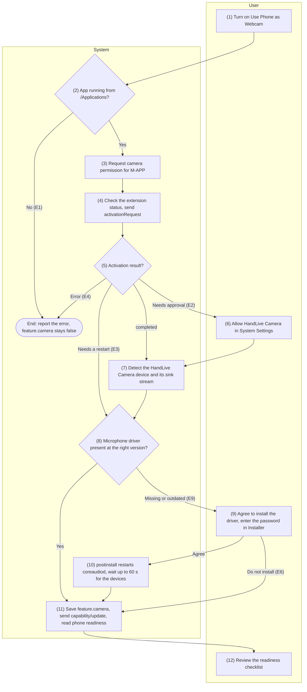
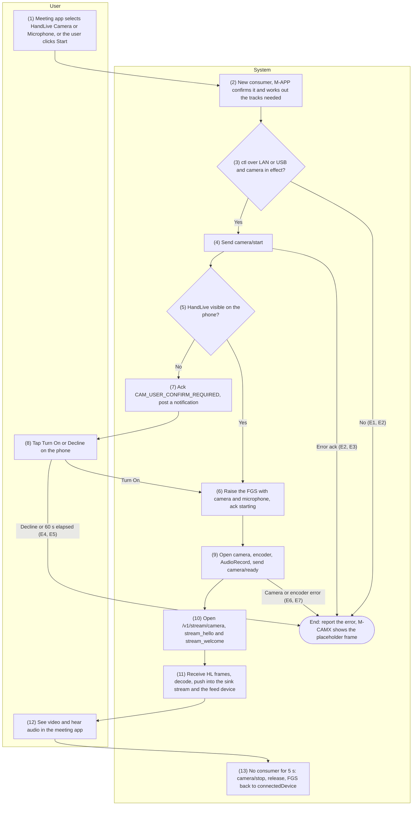
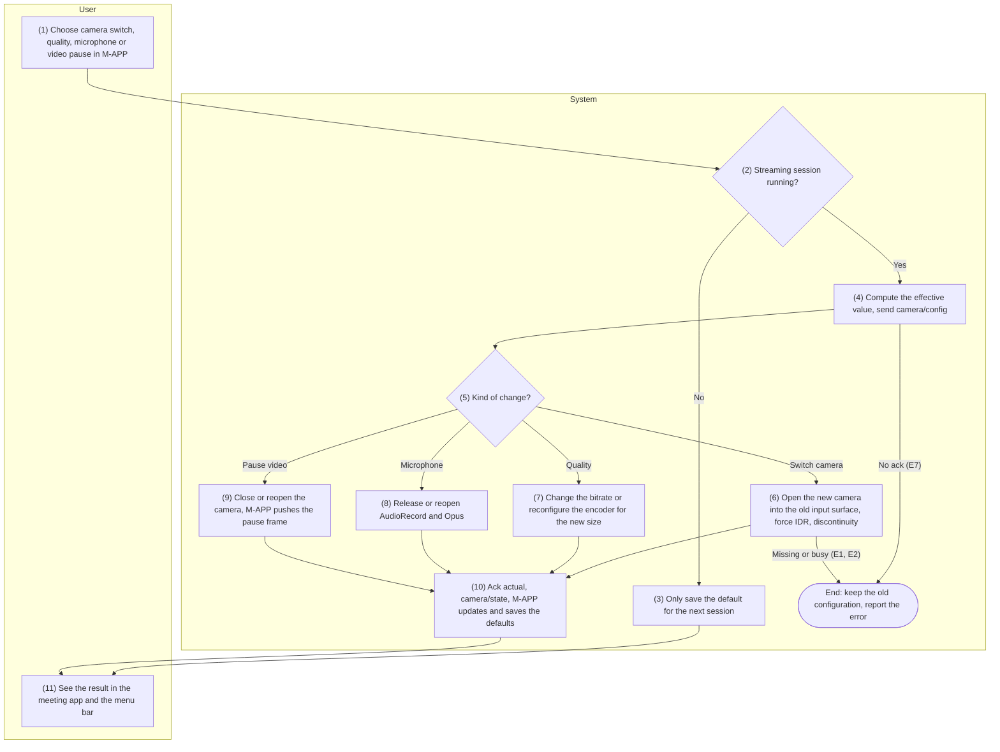
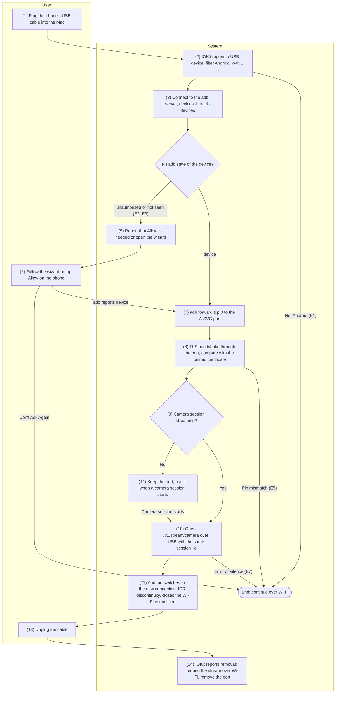
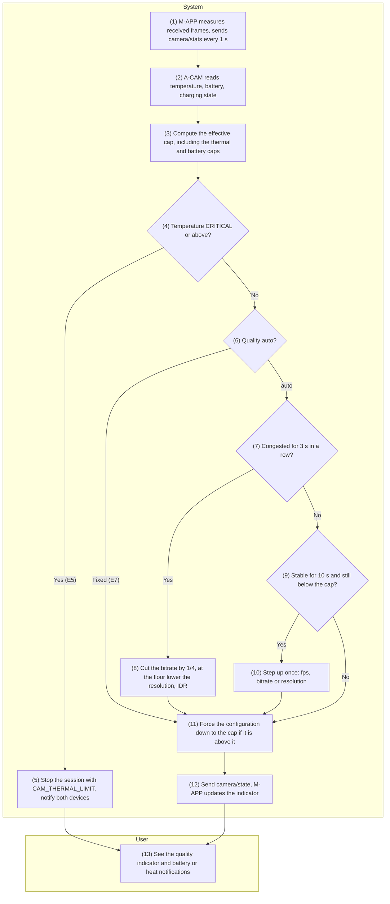

English | [Tiếng Việt](08-camera-mic.vi.md)

# 8. Function group: Camera and microphone

> Common reference: [`00-common-specs.md`](00-common-specs.md) — components M-APP, M-CAMX, M-MIC,
> A-CAM, A-SVC (0.1), USB channel (0.4.2), HL binary frame of `/v1/stream/camera` (0.5.2), stream
> channel key and `camera/stream_hello` (0.6.3 step 7), the `camera` catalog entry (0.7.1), capability
> `features.camera` (0.7.2), error codes `CAM_*`, `USB_*`, `MAC_*` (0.8.1), settings keys
> `feature.camera`, `cam.*` (0.9.5), constants `CAM_*`, `USB_DETECT_DEBOUNCE` (0.10). Adjustments
> applied: README §5 C8 (virtual microphone on the loopback model), C9 (driver installed with a PKG),
> C11 (Camera Extension).
>
> Common scope: camera/microphone only run when the Mac and the phone are **on the same LAN (Wi-Fi)**
> or **connected by a USB cable**; they never go through the relay (README §4). iPhone/iPad do not
> have this function group. A camera session exists only in memory and has no data table of its own.

**Identifiers shared across group 8**

| Identifier | Value | Notes |
|-----------|---------|---------|
| M-APP bundle id | `app.handlive.mac` | M-CAMX uses this signature so that only M-APP can attach to the sink stream |
| M-CAMX system extension | `app.handlive.mac.camera` | Located in `HandLive.app/Contents/Library/SystemExtensions/` |
| Virtual camera device | Name "HandLive Camera", UID `app.handlive.camera.device` | One source stream (read by meeting apps), one sink stream (written only by M-APP) |
| Virtual camera formats | Index `0`: 640×480, `1`: 1280×720, `2`: 1920×1080; 30 fps; `kCVPixelFormatType_32BGRA` | Unchanged for the whole run of a stream |
| Custom CMIO properties (read-only) | `hlsc` = number of consumers running the source stream; `hlaf` = index of the format the consumer chose | CMIOExtension property names: `4cc_hlsc_glob_0000`, `4cc_hlaf_glob_0000`, set on the device |
| Darwin notification | `app.handlive.camera.demand` (consumer count 0 → 1), `app.handlive.camera.idle` (1 → 0) | Carries no data |
| M-MIC microphone driver | `/Library/Audio/Plug-Ins/HAL/HandLiveMic.driver` | BlackHole loopback model (C8) |
| Microphone devices | Input, visible: "HandLive Microphone", UID `app.handlive.mic.input`. Output, hidden: UID `app.handlive.mic.feed` | The two devices share one ring buffer inside the driver |
| Installer packages | `HandLive.app/Contents/Resources/HandLiveMic.pkg`, `HandLiveMic-Uninstall.pkg` | Signed with Developer ID Installer, notarized, stapled (C9) |

The error codes, settings keys and constants specific to group 8 (`CAM_TRANSPORT_UNSUPPORTED`,
`cam.usb_wizard_dismissed`, `CAM_STOP_GRACE`, `CAM_CONFIRM_TIMEOUT`, `CAM_STREAM_OPEN_TIMEOUT`,
`CAM_STREAM_STALL`, `CAM_PLACEHOLDER_AFTER`, `CAM_JITTER_BUFFER`, `CAM_KEYFRAME_MIN_GAP`,
`CAM_MAX_FRAME`, `CAM_CONGESTION`, `CAM_RECOVER_AFTER`, `MIC_DRIVER_WAIT`, `USB_SWITCH_GAP`) have
been merged into `00-common-specs.md` (0.8.1, 0.9.5, 0.10).

**Image rules shared by CAM-02…CAM-05**

1. **Orientation.** The encoder always receives frames in sensor orientation (landscape). A-CAM
   computes `rotation_deg` ∈ {0, 90, 180, 270} from `CameraCharacteristics.SENSOR_ORIENTATION`, the
   camera facing and the way the phone is held (`OrientationEventListener`, rounded to a multiple of
   90°, changed only after a stable deviation of 1 s), and sends it in `actual.video.rotation_deg` of
   `camera/ready`, `camera/config` and `camera/state`. M-APP rotates the frame upright with
   `VTPixelRotationSession` (macOS 13+) before scaling. The virtual camera format is always a
   landscape frame; when the phone stands upright, the rotated image is
   **center-cropped to fill the frame** (no black bars), and M-APP suggests "Place the phone
   horizontally for the widest view".
2. **Encoding size.** A-CAM picks the output size from
   `StreamConfigurationMap.getOutputSizes(MediaCodec::class.java)` with the same aspect ratio as the
   target level and closest to it (preferring a short side ≥ the target), for example 480p 16:9 →
   848×480 or 864×480 depending on the device; if no size has the same aspect ratio, it picks the
   size closest in area. M-APP always scales to exactly the format the consumer chose
   (`VTPixelTransferSession`), so the encoding size does not have to match the virtual camera format
   exactly.

## 8.1 CAM-01 — Install the virtual camera and virtual microphone on the Mac

### 8.1.1 General information

| Item | Content |
|-----|----------|
| Name | CAM-01 — Install the virtual camera and virtual microphone on the Mac |
| Description | Prepares the Mac so that every meeting app (FaceTime, Zoom, Meet, Teams, OBS…) sees "HandLive Camera" and "HandLive Microphone": activates the M-CAMX Camera Extension with `OSSystemExtensionRequest`, requests camera permission for M-APP (a precaution because M-APP pushes frames into the sink stream — C11), installs the M-MIC virtual microphone driver with a signed + notarized PKG embedded in the app (C8, C9), checks that both virtual devices have appeared, saves `feature.camera` and informs the phone, then shows the phone-side readiness according to its capability.<br>An alternative flow removes the virtual camera and microphone. |
| Actors | Primary: User (needs Mac administrator rights to install the driver). System: M-APP, M-CAMX, M-MIC, OS (System Extensions, TCC, Installer, `coreaudiod`), A-SVC (receives `capability/update`). |
| Preconditions | 1. macOS 13+; M-APP is a notarized Developer ID build.<br>2. M-APP runs from `/Applications` (C11).<br>3. To check phone-side readiness: a valid pair exists (PAIR-01); the installation on the Mac does not need a pair.<br>4. The user has, or can get, an administrator password (only for the microphone driver). |
| Postconditions | **Success:** M-CAMX is activated, CoreMediaIO has the device with UID `app.handlive.camera.device` and its sink stream; M-MIC is in `/Library/Audio/Plug-Ins/HAL/`, CoreAudio has `app.handlive.mic.input` and `app.handlive.mic.feed`; `feature.camera = true`; `capability/update` has been sent.<br>**Partial:** the camera is ready but the microphone driver is missing (`MAC_MIC_DRIVER_MISSING`) — the camera still works, without a virtual microphone; or waiting for a restart (`needs_reboot`).<br>**Failure:** `feature.camera` stays `false`, the system is not changed. |
| Exceptions | E1 — M-APP is not in `/Applications` (`unsupportedParentBundleLocation`).<br>E2 — The system needs the user to allow the extension (`requestNeedsUserApproval`).<br>E3 — Result `.willCompleteAfterReboot` (common when the extension is updated, since macOS 14.5 — C11): the Mac must be restarted.<br>E4 — Activation fails (signature, extension not found, blocked by MDM policy…) or no camera device after 10 s → `MAC_EXTENSION_NOT_ACTIVE`.<br>E5 — M-APP's camera permission is denied: warn and continue.<br>E6 — The user does not install the microphone driver or cancels Installer → `MAC_MIC_DRIVER_MISSING`.<br>E7 — No microphone device after 60 s (`MIC_DRIVER_WAIT`) → suggest restarting the Mac.<br>E8 — The phone is not ready: not connected, `features.camera.enabled = false`, or `permissions_missing` contains `CAMERA`/`RECORD_AUDIO`.<br>E9 — The driver is installed but older than the bundled version → offer an update. |
| Special requirements | **Distribution:** Developer ID, outside the Mac App Store (a HAL driver cannot be installed through the App Store).<br>M-APP has the `com.apple.developer.system-extension.install` entitlement; M-CAMX and M-MIC are signed with Developer ID (ad-hoc signatures are rejected).<br>**Security:** no privileged helper (`SMJobBless` is deprecated since macOS 13 — C9); administrator rights are requested only by Installer; the PKG sits inside the signed bundle, so it is sealed by the app's signature, and Installer itself checks the signature and notarization.<br>M-CAMX lets only a process with signing ID `app.handlive.mac` attach to the sink stream.<br>**Usability:** approval instructions match the exact macOS version; every screen can be read with VoiceOver; installing the driver cuts out audio on the Mac for about 1–2 s and must be announced beforehand.<br>**Performance:** the camera device appears ≤ 10 s after approval; the microphone device appears ≤ 10 s after `coreaudiod` restarts (maximum wait 60 s).<br>**Compatibility:** the driver may already have been installed by a Homebrew cask (D7) — detect it by device UID, not by how it was installed. |

### 8.1.2 Screens

N/A — no approved wireframe yet.

### 8.1.3 Component details

| # | Field | Data type | Input/Output | Initial value | Description |
|---|--------|--------------|--------------|------------------|-------|
| 1 | "Use Phone as Webcam" toggle | bool | Input/Output | `feature.camera` (`false`) | On → run the installation flow. Off → M-APP stops serving camera/microphone demand, without removing components (removal is field 10) |
| 2 | Virtual camera status | enum{not_installed\| awaiting_approval\| activating\| active\| needs_reboot\| failed} | Output | `not_installed` | "Not installed", "Waiting for your approval", "Activating…", "Ready", "Mac restart required", "Error" |
| 3 | Virtual microphone status | enum{not_installed\| installing\| installed\| outdated\| failed} | Output | From the device detection result (step 8) | "Not installed", "Installing…", "Ready", "Update required", "Error" |
| 4 | HandLive's camera permission on the Mac | enum{not_determined\| authorized\| denied} | Output | `AVCaptureDevice.authorizationStatus(for: .video)` | `denied` is shown with a button that opens System Settings › Privacy & Security › Camera |
| 5 | Instructions for allowing the extension | string | Output | By macOS version | macOS 15+: "General › Login Items & Extensions › Camera Extensions → turn on HandLive". macOS 13–14: "Privacy & Security → click Allow next to HandLive" |
| 6 | "Open System Settings" button | action | Input | Shown when field 2 = `awaiting_approval` | Opens System Settings at the matching page |
| 7 | "Install Microphone Driver" / "Update Microphone Driver" button | action | Input | Shown when field 3 = `not_installed` or `outdated` | Opens the PKG (step 9) |
| 8 | Explanation before installing the driver | string | Output | "HandLive needs to install a virtual microphone driver on the system. macOS will ask for an administrator password, and sound on the Mac will cut out for about 1–2 seconds." | Shown before Installer opens |
| 9 | Readiness on the phone | enum{ready\| not_connected\| feature_off\| permission_missing} | Output | From the latest capability | With the list of missing permissions (`CAMERA`, `RECORD_AUDIO`) and what to do on the phone (SET-01, SET-02) |
| 10 | "Remove Virtual Camera and Microphone" button | action | Input | Shown when field 2 = `active` or field 3 = `installed` | Alternative flow A1–A4 |
| 11 | Error message | string | Output | Empty | Per E1–E9, with the system error code if there is one |

### 8.1.4 Business flow



| Step | Actor | Component | Description | Exceptions / Notes |
|------|----------|-----------|-------|--------------------|
| 1 | User | M-APP | Turns on "Use Phone as Webcam" (menu bar › Settings › Camera), or picks it from the suggestion in PAIR-02 when the phone has `features.camera`. |  |
| 2 | System | M-APP | Checks that `Bundle.main.bundleURL` is under `/Applications`. | Not there → E1: "Move HandLive to the Applications folder, then open it again". |
| 3 | System | M-APP, OS (TCC) | `AVCaptureDevice.authorizationStatus(for: .video)`; `.notDetermined` → `requestAccess(for: .video)` (API 2). | `.denied` → E5, warn and continue. |
| 4 | System | M-APP, OS | Sends `propertiesRequest` (API 1): if the extension is already enabled with the same `bundleVersion` as the embedded one → go to step 7. Otherwise sends `activationRequest`; the delegate returns `.replace` when asked to replace an old version. |  |
| 5 | System | OS → M-APP | Classifies the delegate result: `requestNeedsUserApproval` → step 6; `.completed` → step 7; `.willCompleteAfterReboot` → E3, field 2 = `needs_reboot`, still continues with the microphone part (step 8); `didFailWithError` → E1 or E4. |  |
| 6 | User | OS | Opens System Settings as described in field 5 and turns on HandLive Camera. The system calls `didFinishWithResult`. | The user can close the instructions and come back later; M-APP runs step 4 again the next time it opens. |
| 7 | System | M-APP, M-CAMX | Turns on `kCMIOHardwarePropertyAllowScreenCaptureDevices`, enumerates the CMIO devices, looks for UID `app.handlive.camera.device` and its sink stream (API 3); waits up to 10 s with a `kCMIOHardwarePropertyDevices` listener. | Not found → E4. |
| 8 | System | M-APP, M-MIC | Looks up `kAudioHardwarePropertyTranslateUIDToDevice` for `app.handlive.mic.input` and `app.handlive.mic.feed` (API 4); reads `CFBundleVersion` in the driver's `Info.plist`. Both devices present and version ≥ the bundled one → step 11. | Missing → step 9. Older → E9, then step 9. |
| 9 | User | M-APP, OS (Installer) | Reads field 8 and clicks "Install Microphone Driver". M-APP opens the PKG with `NSWorkspace.shared.open` (API 5); Installer asks for the administrator password. | Not installed or Installer canceled → E6, field 3 = `not_installed`, go to step 11. |
| 10 | System | OS, M-APP | The PKG copies the driver; `postinstall` (root) runs `killall coreaudiod`; launchd restarts `coreaudiod`, which loads M-MIC. M-APP listens to `kAudioHardwarePropertyDevices` (API 6) and repeats step 8 on every change. | After 60 s → E7, "Check Again" button. |
| 11 | System | M-APP → A-SVC | When field 2 = `active`: saves `feature.camera = true`, sends `capability/update` (API 7). Reads the phone's capability from the current session or `features_json` to fill in field 9. | Phone not ready → E8; the Mac part still completes. |
| 12 | User | M-APP | Reviews the checklist: virtual camera, virtual microphone, camera permission on the Mac, phone readiness; every item not yet satisfied has a button to fix it. |  |
| A1 | User | M-APP | Chooses "Remove Virtual Camera and Microphone" (field 10) and confirms. |  |
| A2 | System | M-APP, OS | Stops the camera session if there is one (CAM-02 step 13). Sends `deactivationRequest` (API 8); result `.completed` or `.willCompleteAfterReboot` (reports that a restart is needed). | The system may ask for authentication. |
| A3 | System | M-APP, OS (Installer) | If the driver is present: opens `HandLiveMic-Uninstall.pkg`; `postinstall` deletes the driver bundle, deletes the receipt, runs `killall coreaudiod`. | Driver installed by Homebrew: the uninstall PKG still works; or `brew uninstall --cask handlive`. |
| A4 | System | M-APP → A-SVC | Sets `feature.camera = false`, sends `capability/update`. |  |

### 8.1.5 API/service specification

**List of calls**

| # | API/service | Channel | Direction | Used in steps |
|---|-------------|------|-------|-------------|
| 1 | `OSSystemExtensionRequest` (`propertiesRequest`, `activationRequest`) + `OSSystemExtensionRequestDelegate` | Local | M-APP ↔ OS | 4, 5, 6 |
| 2 | `AVCaptureDevice.requestAccess(for: .video)` | Local | M-APP ↔ OS | 3 |
| 3 | Virtual camera device detection through CoreMediaIO (`CMIOObjectGetPropertyData`, `CMIOObjectAddPropertyListenerBlock`) | Local | M-APP ↔ OS, M-CAMX | 7 |
| 4 | Virtual microphone device detection: `AudioObjectGetPropertyData` with `kAudioHardwarePropertyTranslateUIDToDevice` | Local | M-APP ↔ OS, M-MIC | 8, 10 |
| 5 | Open the driver installer PKG: `NSWorkspace.shared.open` + `postinstall` script | Local | M-APP → Installer | 9, 10 |
| 6 | `AudioObjectAddPropertyListenerBlock` on `kAudioHardwarePropertyDevices` | Local | OS → M-APP | 10 |
| 7 | `WS capability/update` | `/v1/ctl` (LAN, USB or relay) | C→S | 11, A4 |
| 8 | Uninstall: `OSSystemExtensionRequest.deactivationRequest` + `HandLiveMic-Uninstall.pkg` | Local | M-APP ↔ OS | A2, A3 |

#### API 1 — `OSSystemExtensionRequest` (activate the Camera Extension)

- **URL:** N/A
- **Method:** `OSSystemExtensionRequest.propertiesRequest(forExtensionWithIdentifier:queue:)`, then
  `OSSystemExtensionRequest.activationRequest(forExtensionWithIdentifier:queue:)`; submitted with
  `OSSystemExtensionManager.shared.submitRequest(_:)`.
- **Request:**

| Parameter | Value | Description |
|---------|---------|-------|
| `identifier` | `app.handlive.mac.camera` | Bundle id of M-CAMX |
| `queue` | `.main` | Queue that receives the callbacks |
| `delegate` | M-APP's extension installer | Implements `OSSystemExtensionRequestDelegate` |

- **Response (delegate callbacks):**

| Callback | Meaning | Handling |
|----------|---------|-------|
| `request(_:foundProperties:)` | Array of `OSSystemExtensionProperties` (`bundleVersion`, `bundleShortVersion`, `isEnabled`, `isAwaitingUserApproval`, `isUninstalling`) | Enabled with the same `bundleVersion` → skip activation; `isAwaitingUserApproval` → field 2 = `awaiting_approval` |
| `request(_:actionForReplacingExtension:withExtension:)` | Another version is installed | Return `.replace` |
| `requestNeedsUserApproval(_:)` | Waiting for the user to allow it | E2, show fields 5, 6 |
| `request(_:didFinishWithResult:)` | `.completed` or `.willCompleteAfterReboot` | Step 7 or E3 |
| `request(_:didFailWithError:)` | `OSSystemExtensionError` | `unsupportedParentBundleLocation` → E1; `requestCanceled`, `requestSuperseded` → submit again once; other codes (`extensionNotFound`, `codeSignatureInvalid`, `validationFailed`, `forbiddenBySystemPolicy`…) → E4 |

- **Example:**

```swift
let request = OSSystemExtensionRequest.activationRequest(
    forExtensionWithIdentifier: "app.handlive.mac.camera", queue: .main)
request.delegate = cameraExtensionInstaller
OSSystemExtensionManager.shared.submitRequest(request)
// delegate: requestNeedsUserApproval → show the instructions; didFinishWithResult(.completed) → detect the devices
```

- **Business logic:**
  1. Only one request at a time; a new request made while the previous one is unfinished is
     ignored.
  2. Always return `.replace`: the version embedded in M-APP is the one whose sink/custom property
     protocol matches M-APP, even when the running version is newer (the user downgraded the app).
  3. `.willCompleteAfterReboot`: show "Restart the Mac to finish updating the virtual camera"; the
     next time M-APP opens, it runs `propertiesRequest` again to confirm `isEnabled`.
  4. Activation runs every time M-APP starts while `feature.camera = true` (only `propertiesRequest`,
     without bothering the user if the extension is already enabled), so that an extension that was
     removed, or needs an update after the app was upgraded, is detected automatically.

#### API 2 — `AVCaptureDevice.requestAccess(for: .video)`

- **URL:** N/A
- **Method:** `AVCaptureDevice.authorizationStatus(for: .video)`,
  `AVCaptureDevice.requestAccess(for: .video, completionHandler:)`
- **Request:** media type `.video`. M-APP's `Info.plist` has `NSCameraUsageDescription` = "HandLive
  sends video from the phone to the HandLive Camera virtual camera."
- **Response:** `Bool` (granted or not); status `AVAuthorizationStatus` = `.notDetermined`
  \| `.authorized` \| `.denied` \| `.restricted`.
- **Example:** first time → system dialog "HandLive would like to access the camera" → `true` →
  field 4 = `authorized`.
- **Business logic:**
  1. Only a precaution (C11): M-APP opens no real camera; this permission covers the case where
     macOS treats writing to the sink stream as camera use.
  2. TCC asks only once; `.denied` /`.restricted` → field 4 with a button that opens
     `x-apple.systempreferences:com.apple.preference.security?Privacy_Camera`.
  3. Does not block the installation flow; if CAM-02 cannot get the sink queue while the permission
     is `.denied`, these instructions are shown again.

#### API 3 — Virtual camera device detection through CoreMediaIO

- **URL:** N/A
- **Method:** `CMIOObjectSetPropertyData` (`kCMIOHardwarePropertyAllowScreenCaptureDevices` = 1 on
  `kCMIOObjectSystemObject`); `CMIOObjectGetPropertyData` with `kCMIOHardwarePropertyDevices`,
  `kCMIODevicePropertyDeviceUID`, `kCMIODevicePropertyStreams`, `kCMIOStreamPropertyDirection`;
  `CMIOObjectAddPropertyListenerBlock` on `kCMIOHardwarePropertyDevices`.
- **Request:** UID to find `app.handlive.camera.device`; property address
  `{selector, kCMIOObjectPropertyScopeGlobal, kCMIOObjectPropertyElementMain}`.
- **Response:** the device's `CMIOObjectID` and the list of `CMIOStreamID`; the sink stream is the
  stream whose direction is opposite to the source stream (read with `kCMIOStreamPropertyDirection`).
- **Example:** device `HandLive Camera` (id 57) has two streams: 58 (source), 59 (sink).
- **Business logic (the M-CAMX specification this step checks):**
  1. The `CMIOExtensionProviderSource` provider publishes one `CMIOExtensionDeviceSource` device named
     "HandLive Camera", UID `app.handlive.camera.device`, with a source stream and a sink stream
     `CMIOExtensionStreamSource`, and three formats 640×480, 1280×720, 1920×1080 @30 fps, BGRA.
  2. The device publishes two read-only custom properties `4cc_hlsc_glob_0000` (consumer count of the
     source stream) and `4cc_hlaf_glob_0000` (index of the format in use); writes from outside are
     ignored.
  3. The sink stream's `authorizedToStartStream(for:)` returns `true` only when `client.signingID` =
     `app.handlive.mac`; the source stream allows every client.
  4. No XPC, App Group or shm between M-APP and M-CAMX (the extension runs as user
     `_cmiodalassistants`); data goes through the sink stream, signals through the Darwin
     notification and the custom properties.
  5. Waits up to 10 s after activation; the device does not appear → E4.

#### API 4 — Virtual microphone device detection through CoreAudio

- **URL:** N/A
- **Method:**
  `AudioObjectGetPropertyData(kAudioObjectSystemObject, {kAudioHardwarePropertyTranslateUIDToDevice, global, main}, qualifier = CFString UID)`
- **Request:** UID `app.handlive.mic.input`, then `app.handlive.mic.feed`.
- **Response:** `AudioObjectID`; `kAudioObjectUnknown` if the device does not exist.
- **Example:** `app.handlive.mic.input` → 92, `app.handlive.mic.feed` → 91 → field 3 = `installed`.
- **Business logic (the M-MIC specification this step checks):**
  1. One driver publishes two devices: `app.handlive.mic.feed` has only an output stream,
     `kAudioDevicePropertyIsHidden` = 1, and cannot become the default device; `app.handlive.mic.input`
     ("HandLive Microphone") has only an input stream and can become the default microphone.
  2. Format: 48 kHz, Float32, mono. A 16,384-frame ring buffer shared inside the driver process;
     read/write position = sample time mod ring length (BlackHole model — C8). No shm, no separate
     IPC with M-APP.
  3. When no client is playing into `feed`, `input` returns silence (it never replays old data from
     the ring).
  4. Driver version = `CFBundleVersion` in `HandLiveMic.driver/Contents/Info.plist`; lower than the
     bundled PKG → `outdated` (E9).
  5. The `AudioObjectID` may change after `coreaudiod` restarts: M-APP always looks it up again by UID
     before use.

#### API 5 — Open the microphone driver installer PKG

- **URL:** N/A (file `HandLive.app/Contents/Resources/HandLiveMic.pkg`)
- **Method:** `NSWorkspace.shared.open(URL)` → Installer; `postinstall` script in the PKG.
- **Request:**

| Item | Value |
|-----|---------|
| Package | `HandLiveMic.pkg`, identifier `app.handlive.mic`, signed with Developer ID Installer, notarized + stapled |
| Install location | `/Library/Audio/Plug-Ins/HAL/HandLiveMic.driver` |
| `postinstall` | Runs as root: `killall coreaudiod` |

- **Response:** `open` returns `Bool` (Installer has opened). The installation result is not returned
  to M-APP; M-APP infers it through API 6.
- **Example:**

```sh
#!/bin/sh
# [Design] postinstall of HandLiveMic.pkg (root). launchd restarts coreaudiod on its own.
/usr/bin/killall coreaudiod || true
exit 0
```

- **Business logic:**
  1. Do not use `launchctl kickstart -k` (blocked for system processes since macOS 14.4) and do not
     use a privileged helper (C9).
  2. Before opening the PKG, stop the virtual microphone stream if a session is running (CAM-02),
     because `coreaudiod` is about to restart.
  3. Installing through the Homebrew cask uses the same PKG, so API 4 recognizes the driver however it
     was installed.

#### API 6 — Watch the list of audio devices

- **URL:** N/A
- **Method:**
  `AudioObjectAddPropertyListenerBlock(kAudioObjectSystemObject, {kAudioHardwarePropertyDevices, global, main}, queue, block)`;
  removed with `AudioObjectRemovePropertyListenerBlock`.
- **Request:** a serial queue of M-APP.
- **Response:** the block is called every time the device list changes (possibly several times in a
  row while `coreaudiod` restarts).
- **Example:** 3.2 s after Installer finishes, the block is called; API 4 returns both UIDs → field 3 =
  `installed`.
- **Business logic:** Each call runs API 4 again; both UIDs present → remove the listener, go to
  step 11. After 60 s (`MIC_DRIVER_WAIT`) → E7. A listener is also kept for the whole lifetime of
  M-APP to detect a removed driver (field 3 → `not_installed`).

#### API 7 — `WS capability/update`

- **URL:** `wss://{android_host}:{port}/v1/ctl` (LAN or USB) or via the relay
- **Method:** `WS capability/update` (C→S), encrypted envelope, no ack.
- **Request (`data`):** a full snapshot with the same structure as the Mac's `capability/hello`
  (0.7.2), with `features.camera.enabled` = the new value of `feature.camera`.
- **Response:** N/A; if the phone's configuration changes as a result, the phone sends its own
  `capability/update`.
- **Example** (only the `camera` part; the real message carries every feature as in 0.7.2):
  `{"op":"update","data":{"protocol":1,"app_version":"1.0.0 (100)","platform":"macos","os_version":"15.1","model":"Mac15,3","features":{"camera":{"enabled":true}}}}`
- **Business logic:** The camera is in effect when both sides have it turned on and the phone is not
  missing `CAMERA`, `RECORD_AUDIO` (CONN-01 API 7). Going from in effect to not in effect → stop the
  running camera session (CAM-02 step 13).

#### API 8 — Remove the virtual camera and microphone

- **URL:** N/A (file `HandLive.app/Contents/Resources/HandLiveMic-Uninstall.pkg`)
- **Method:** `OSSystemExtensionRequest.deactivationRequest(forExtensionWithIdentifier:queue:)`;
  `NSWorkspace.shared.open(URL)` for the driver uninstall PKG.
- **Request:** `identifier` = `app.handlive.mac.camera`; the uninstall PKG has no payload, only
  `postinstall`.
- **Response:** delegate as in API 1 (`.completed` / `.willCompleteAfterReboot` / error); the
  uninstall PKG returns no result, M-APP checks with API 4 and 6.
- **Example:**

```sh
#!/bin/sh
# [Design] postinstall of HandLiveMic-Uninstall.pkg (root)
/bin/rm -rf /Library/Audio/Plug-Ins/HAL/HandLiveMic.driver
/usr/sbin/pkgutil --forget app.handlive.mic >/dev/null 2>&1 || true
/usr/bin/killall coreaudiod || true
exit 0
```

- **Business logic:**
  1. Stop the camera session before removing. Removing the extension may require user
     authentication.
  2. When the user drags HandLive to the Trash, macOS offers to remove the extension by itself, but
     the microphone driver stays; the "Remove Virtual Camera and Microphone" menu item must be
     described in the uninstall documentation.

#### Query

N/A — the function writes nothing to the database; it only reads the stored capability when there is
no session.

```sql
-- [Design] Mac, step 11: latest capability of the phone when not connected
SELECT pair_id, peer_name, features_json
FROM paired_device
WHERE revoked_at IS NULL
LIMIT 1;
```

```text
# [Design] M-APP UserDefaults (keys 0.9.5)
UserDefaults.standard.bool(forKey: "feature.camera")          # step 1: current value of field 1
UserDefaults.standard.set(true,  forKey: "feature.camera")    # step 11
UserDefaults.standard.set(false, forKey: "feature.camera")    # A4
```

---

## 8.2 CAM-02 — Start and stop camera/microphone streaming

### 8.2.1 General information

| Item | Content |
|-----|----------|
| Name | CAM-02 — Start and stop camera/microphone streaming |
| Description | Opens and closes the session that streams video and audio from the phone into "HandLive Camera" and "HandLive Microphone" according to actual demand.<br>Three triggers: (a) a meeting app starts reading the virtual camera's source stream → M-CAMX increments the consumer counter and posts the Darwin notification `app.handlive.camera.demand`; (b) a meeting app starts using the virtual microphone → `kAudioDevicePropertyDeviceIsRunningSomewhere` of the input device changes to 1; (c) the user clicks "Start" in M-APP's preview window.<br>M-APP sends `camera/start`; Android raises the foreground service to type `connectedDevice\| camera\| microphone` (immediately if HandLive is visible, otherwise after the user taps "Turn On" on the notification), opens Camera2 → MediaCodec H.264 and AudioRecord → Opus, and returns `camera/ready`; M-APP opens the dedicated channel `/v1/stream/camera` (Wi-Fi, or USB per CAM-04), decodes the video and pushes it into M-CAMX's sink stream, and plays the audio into M-MIC's hidden device. No consumers for 5 s → `camera/stop`.<br>The user can stop it from the notification on the phone. |
| Actors | Primary: User; Meeting app (consumer of the virtual devices). System: M-APP, M-CAMX, M-MIC, A-SVC, A-CAM, A-UI, OS (CoreMediaIO, CoreAudio, VideoToolbox, Camera2, MediaCodec, AudioRecord). |
| Preconditions | 1.<br>CAM-01 is complete (virtual camera; virtual microphone if audio is needed); `feature.camera = true` on both sides and the camera is in effect per capability (the phone has `CAMERA`, `RECORD_AUDIO`).<br>2.<br>The `/v1/ctl` session is `Connected` over LAN or USB, not via the relay.<br>3.<br>The phone is not streaming its camera to another device.<br>4.<br>Android has the `POST_NOTIFICATIONS` permission for confirming while in the background (otherwise the user has to open HandLive on the phone). |
| Postconditions | **Streaming:** the meeting app receives video and audio; A-SVC runs an FGS of type `connectedDevice\| camera\| microphone`; the phone shows the system privacy indicator and the notification "Using the camera for \<Mac name>" with a "Stop" button; there is exactly one authenticated `/v1/stream/camera` connection for the `session_id`. **After stopping:** the camera, the encoder and AudioRecord are released; the FGS goes back to type `connectedDevice`; the stream channel is closed with code 1000; M-CAMX shows the placeholder frame if consumers remain; the virtual microphone plays silence. |
| Exceptions | E1 — The ctl session goes through the relay or is not connected: M-APP does not send `camera/start` and reports "Requires the same Wi-Fi network or a USB cable"; Android receiving `camera/start` through the relay → `CAM_TRANSPORT_UNSUPPORTED`.<br>E2 — The camera is not in effect: `FEATURE_DISABLED` or `PERMISSION_MISSING` (`details.permission` = `CAMERA`/`RECORD_AUDIO`).<br>E3 — The phone is streaming to another device → `CAM_BUSY` (`details.holder_name`).<br>E4 — The user taps "Decline" → `camera/stop` reason `denied`, code `CAM_DENIED_BY_USER`.<br>E5 — No confirmation within 60 s (`CAM_CONFIRM_TIMEOUT`) → `camera/stop` reason `confirm_timeout`.<br>E6 — The hardware camera is being used by another app → `CAM_BUSY`; the requested camera does not exist → use the other camera; no camera at all → `CAM_UNAVAILABLE`.<br>E7 — No usable H.264 encoder at any tier → `CAM_ENCODER_UNSUPPORTED`.<br>E8 — The sink queue cannot be obtained (extension not activated, M-APP's camera permission denied) → `MAC_EXTENSION_NOT_ACTIVE`, open CAM-01, the preview keeps running; microphone driver missing → `MAC_MIC_DRIVER_MISSING`, video only.<br>E9 — The stream channel cannot be opened, `stream_hello` is rejected, or it stays silent for more than 1 s (`CAM_STREAM_STALL`) → reopen with the same `session_id` up to 3 times (0.25 s, 0.5 s, 1 s); still failing → stop the session with reason `error`.<br>E10 — Both the ctl session and the stream channel are lost for more than 5 s, or the phone overheats (CAM-05) → the session ends, M-CAMX shows the placeholder frame. |
| Special requirements | **Latency** (720p30, from the lens to the meeting app): < 120 ms over Wi-Fi, < 70 ms over USB; audio no more than 45 ms ahead of video and no more than 125 ms behind it.<br>From demand to the first frame ≤ 2 s when HandLive is visible on the phone.<br>**Privacy:** only open the hardware of the track that is needed; when HandLive is in the background, every session needs one tap on the phone; the system privacy indicator and an ongoing notification stay for the whole session.<br>**Android platform:** the manifest declares `android:foregroundServiceType="connectedDevice\| camera\| microphone"` and the permissions `FOREGROUND_SERVICE_CAMERA`, `FOREGROUND_SERVICE_MICROPHONE`, `CAMERA`, `RECORD_AUDIO`, `POST_NOTIFICATIONS`. A CompanionDeviceManager association does **not** exempt camera/microphone FGS starts from the background restriction (verified), so the design does not rely on it. **Security:** media frames are encrypted with the stream channel key (0.6.3 step 7); the receiver drops frames whose `seq` does not increase; media content is never logged; the sink stream accepts only M-APP. **Resources:** default 1280×720, 30 fps, 2.5 Mbps (`CAM_DEFAULT`); Opus audio at 32 kbps. |

### 8.2.2 Screens

N/A — no approved wireframe yet.

### 8.2.3 Component details

| # | Field | Data type | Input/Output | Initial value | Description |
|---|--------|--------------|--------------|------------------|-------|
| 1 | Streaming status (M-APP menu bar) | enum{idle\| requesting\| waiting_phone\| starting\| live\| stopping\| error} | Output | `idle` | "Not streaming", "Requesting…", "On the phone, tap Turn On", "Starting…", "Streaming", "Stopping…", "Error" |
| 2 | Virtual devices in use | array<enum{camera\| microphone\| preview}> | Output | Empty | For example "An app is using HandLive Camera and HandLive Microphone" |
| 3 | Preview window | video | Output | Hidden | Decoded video and the microphone level |
| 4 | "Start" / "Stop" button in the preview | action | Input | "Start" | Trigger (c); "Stop" only removes the preview's demand |
| 5 | Transport | enum{wifi\| usb} | Output | From the ctl session | "Via Wi-Fi", "Via USB" |
| 6 | Request notification on Android | string | Output | — | "\<Mac name> wants to use the camera and microphone" (or "…the microphone" when there is only an audio track); dismissed automatically after 60 s |
| 7 | Choice on the request notification or the A-UI dialog | enum{Turn On\| Decline} | Input | — | The A-UI dialog appears when the user opens HandLive while a request is pending |
| 8 | Streaming notification on Android | string | Output | — | "Using the camera for \<Mac name>"; has a "Stop" button (the other controls are in CAM-03) |
| 9 | "Stop" button on the streaming notification | action | Input | — | Flow A1–A2 |
| 10 | Virtual camera placeholder frame | image | Output | "Waiting for the phone…" | M-CAMX shows it when no frame has come from the sink for more than 1 s |
| 11 | Estimated latency | int32 (ms) | Output | Empty | An M-APP diagnostics item |
| 12 | Error message | string | Output | Empty | Per E1–E10 |

### 8.2.4 Business flow



| Step | Actor | Component | Description | Exceptions / Notes |
|------|----------|-----------|-------|--------------------|
| 1 | User, Meeting app | Meeting app, M-APP | (a) Selects "HandLive Camera" and turns on video; (b) selects "HandLive Microphone" and joins the meeting; (c) opens "Preview" in M-APP and clicks "Start". |  |
| 2 | System | M-CAMX, M-MIC, M-APP | (a) Source stream `startStream()` → M-CAMX increments the consumer counter; on 0 → 1 it posts `app.handlive.camera.demand` (API 1); M-APP reads `hlsc` > 0 and `hlaf` (API 2). (b) The `kAudioDevicePropertyDeviceIsRunningSomewhere` listener of `app.handlive.mic.input` reports 1 (API 3). (c) UI event.<br>M-APP works out the tracks needed: video when `hlsc` > 0 or the preview is open; audio when the virtual microphone is running or the preview is open.<br>A session already exists → only change the tracks with `camera/config` (CAM-03 API 1: `video_paused`, `mic_enabled`) and cancel the stop countdown. | The notification may arrive before `hlsc` updates: read again after 100 ms, up to 3 times. At startup, M-APP reads `hlsc` and the microphone state once, because demand may already exist before M-APP starts. |
| 3 | System | M-APP | Checks `feature.camera = true`, the camera in effect per capability, and the ctl session `Connected` on channel `lan` or `usb`. | Relay or not connected → E1 (M-CAMX keeps showing the placeholder frame). Not in effect → E2. |
| 4 | System | M-APP → A-SVC | Generates `session_id` (UUIDv7); sends `camera/start` (API 4): camera = `cam.default_camera`; size = the format per `hlaf`, capped by `cam.default_quality` and `features.camera.max_*`; 30 fps; bitrate per tier (CAM-05); audio 32 kbps. Status `requesting`. | Error ack `CAM_TRANSPORT_UNSUPPORTED` (E1), `FEATURE_DISABLED`/`PERMISSION_MISSING` (E2), `CAM_BUSY` (E3). No ack within 10 s → send again once with the same `session_id`. |
| 5 | System | A-SVC | Checks that the ctl session is not via the relay, that the feature is in effect and that no other camera session exists; then checks whether A-UI is visible (`ProcessLifecycleOwner` in state `STARTED`). |  |
| 6 | System | A-SVC | Calls `ServiceCompat.startForeground` with type `CONNECTED_DEVICE \| CAMERA \| MICROPHONE` (API 5); ack `{status: "starting"}`. When coming from step 8, the request was already acked in step 7, so go straight to step 9. | The system refuses to raise the type (`SecurityException`) → `camera/stop` reason `error`, code `PERMISSION_MISSING`. |
| 7 | System | A-SVC, M-APP | Error ack `CAM_USER_CONFIRM_REQUIRED` with `details = {status: "needs_user_confirm", confirm_timeout_ms: 60000}`; posts a high-priority notification (field 6) with the actions "Turn On" and "Decline" (API 5). M-APP switches to `waiting_phone` and shows "On the phone, tap Turn On". | The user opens HandLive while waiting → the A-UI dialog (field 7) replaces the notification. |
| 8 | User | A-UI (notification) | "Turn On" → the PendingIntent starts A-SVC directly (interacting with a notification is a documented exemption for camera/microphone FGS started from the background, Android 14+) → step 6. "Decline" → A-SVC sends `camera/stop` reason `denied`, code `CAM_DENIED_BY_USER`. | E4. After 60 s → A-SVC cancels the notification and sends `camera/stop` reason `confirm_timeout` (E5). |
| 9 | System | A-CAM, A-SVC → M-APP | Opens the camera, configures the encoder and the capture session, opens AudioRecord + Opus for the enabled tracks (API 6); sends `camera/ready` (API 7) with the actual configuration; switches the FGS notification to field 8. | Camera busy or missing → E6; no encoder → E7: `camera/stop` reason `error` with the code. |
| 10 | System | M-APP ↔ A-SVC | Opens `wss://{android_host}:{port}/v1/stream/camera` (or the USB forwarded port — CAM-04) with the same TLS pin; sends `camera/stream_hello`, receives `camera/stream_welcome` (API 8). Status `starting`. | More than 10 s after `camera/ready` (`CAM_STREAM_OPEN_TIMEOUT`) → Android stops the session with reason `error`. Error → E9. |
| 11 | System | A-SVC → M-APP → M-CAMX, M-MIC | Android sends HL frames (API 9); the first video frame is an IDR with SPS/PPS.<br>M-APP: video → `VTDecompressionSession` → `VTPixelTransferSession` to the `hlaf` format → `CMSampleBufferCreateReadyWithImageBuffer` (PTS on the host clock) → sink queue; M-CAMX `consumeSampleBuffer` → source stream with a new host time (API 11).<br>Audio → Opus decode → 20–60 ms jitter buffer → AUHAL out to `app.handlive.mic.feed` → M-MIC → "HandLive Microphone" (API 12).<br>Decode error → `camera/keyframe` (API 10).<br>Status `live`; Android sends `camera/state` (API 14). | Sink queue cannot be obtained → E8. Channel dropped → E9. |
| 12 | User | Meeting app, A-UI | Sees video and hears audio from the phone; the phone shows the privacy indicator and the field 8 notification. |  |
| 13 | System | M-APP ↔ A-SVC | No camera, microphone or preview consumer is left: wait 5 s (`CAM_STOP_GRACE`); still none → `camera/stop` `{reason: "no_consumer"}` (API 13).<br>Android stops capture, closes the camera, releases the encoder and AudioRecord, closes the stream channel with code 1000, calls `startForeground` again with only `CONNECTED_DEVICE`, then acks.<br>M-APP stops AUHAL and destroys the decoding session. | A consumer comes back within 5 s → cancel the countdown, keep the session. |
| A1 | User | A-UI (notification) | Taps "Stop" (field 9). |  |
| A2 | System | A-SVC → M-APP | Android releases everything as in step 13 and sends `camera/stop` `{reason: "user"}`; M-APP acks, closes the stream, returns to `idle` and shows "Stopped from the phone".<br>M-CAMX shows the placeholder frame to the remaining consumers; the virtual microphone plays silence.<br>M-APP does not start again on its own until the consumer count drops to 0 and rises again, or the user clicks "Start". | Avoids turning the camera back on against the user's wishes. |
| A3 | System | M-APP, A-SVC | Connection lost midway: M-APP reopens the stream channel with the same `session_id` (E9).<br>Android keeps the session while the ctl session or an authenticated stream channel remains; both lost for more than 5 s → release as in step 13 (reason `disconnected`).<br>The Mac is about to sleep or M-APP is quitting → send `camera/stop` reason `no_consumer` before closing. | E10. |

### 8.2.5 API/service specification

**List of calls**

| # | API/service | Channel | Direction | Used in steps |
|---|-------------|------|-------|-------------|
| 1 | Darwin notification `app.handlive.camera.demand` / `app.handlive.camera.idle` | Local | M-CAMX → M-APP | 2, 13 |
| 2 | Custom CMIO properties `hlsc`, `hlaf` (`CMIOObjectGetPropertyData`, `CMIOObjectAddPropertyListenerBlock`) | Local | M-CAMX → M-APP | 2, 4 |
| 3 | `kAudioDevicePropertyDeviceIsRunningSomewhere` listener on `app.handlive.mic.input` | Local | OS → M-APP | 2, 13 |
| 4 | `WS camera/start` | `/v1/ctl` (LAN or USB, not via the relay) | C→S | 4, 5, 6, 7 |
| 5 | Raising the FGS and the confirmation notification: `ServiceCompat.startForeground`, `NotificationCompat` + `PendingIntent.getForegroundService` | Local | A-SVC ↔ OS | 6, 7, 8, 13, A1 |
| 6 | Capture and encoding on Android: Camera2, `MediaCodec` H.264, `AudioRecord`, libopus (JNI) | Local | A-CAM ↔ OS | 9 |
| 7 | `WS camera/ready` | `/v1/ctl` | S→C | 9 |
| 8 | Channel `/v1/stream/camera`: `WS camera/stream_hello` / `camera/stream_welcome` | `/v1/stream/camera` (LAN or USB) | C→S / S→C | 10, A3 |
| 9 | `WS binary HL` — media frames | `/v1/stream/camera` | S→C | 11 |
| 10 | `WS camera/keyframe` | `/v1/ctl` | C→S | 11 |
| 11 | Video path on the Mac: `VTDecompressionSession` → `VTPixelTransferSession` → sink queue (`CMIOStreamCopyBufferQueue`, `CMSimpleQueueEnqueue`) → M-CAMX | Local | M-APP → M-CAMX | 11, 13 |
| 12 | Audio path on the Mac: Opus → jitter buffer → AUHAL → `app.handlive.mic.feed` | Local | M-APP → M-MIC | 11, 13 |
| 13 | `WS camera/stop` | `/v1/ctl` | Both directions | 8, 13, A2, A3 |
| 14 | `WS camera/state` | `/v1/ctl` | S→C | 11 |

#### API 1 — Darwin notification `app.handlive.camera.demand` / `app.handlive.camera.idle`

- **URL:** N/A
- **Method:** M-CAMX:
  `CFNotificationCenterPostNotification(CFNotificationCenterGetDarwinNotifyCenter(), name, nil, nil, true)`.
  M-APP:
  `CFNotificationCenterAddObserver(CFNotificationCenterGetDarwinNotifyCenter(), observer, callback, name, nil, .deliverImmediately)`.
- **Request:**

| Name | When M-CAMX posts it | Data |
|-----|-----------------|---------|
| `app.handlive.camera.demand` | Source stream `startStream()` changes the consumer count 0 → 1 | None (a Darwin notification carries no `object`/`userInfo`) |
| `app.handlive.camera.idle` | Source stream `stopStream()` changes the consumer count 1 → 0 | None |

- **Response:** N/A (one-way signal). M-APP reads the real figures through API 2.
- **Example:** Zoom turns on video with "HandLive Camera" → M-CAMX posts `app.handlive.camera.demand` →
  M-APP reads `hlsc` = `"1"`, `hlaf` = `"1"` → sends `camera/start` 1280×720.
- **Business logic:**
  1. The notification is only a "read again" signal: it can be coalesced, lost, or arrive before the
     property updates; M-APP always reads `hlsc` after receiving it (retry after 100 ms, up to 3
     times while the value has not changed — step 2).
  2. `demand` while counting down `CAM_STOP_GRACE` → cancel the countdown, keep the session. `idle` →
     if the virtual microphone and the preview are not in use either, start the 5 s countdown, then
     go to step 13; if the virtual microphone is still in use → `camera/config`
     `{video_paused: true}` (CAM-03 API 1) to close the camera but keep the audio.
  3. M-APP registers the observer at startup and when `feature.camera = true`; it removes the
     observer when the feature is turned off.

#### API 2 — Custom CMIO properties `hlsc`, `hlaf`

- **URL:** N/A
- **Method:** `CMIOObjectGetPropertyData(deviceID, &address, 0, nil, dataSize, &dataUsed, &value)`;
  `CMIOObjectAddPropertyListenerBlock(deviceID, &address, queue, block)` for `hlaf`.
- **Request:**

| Property | Selector (FourCC) | Scope / Element | Value type | Meaning |
|------------|-------------------|-----------------|--------------|---------|
| `4cc_hlsc_glob_0000` | `'hlsc'` = `0x686C7363` | `kCMIOObjectPropertyScopeGlobal` / `kCMIOObjectPropertyElementMain` | `CFString` holding a decimal number | Number of consumers running the source stream |
| `4cc_hlaf_glob_0000` | `'hlaf'` = `0x686C6166` | Same as above | `CFString` holding a decimal number | Index of the source stream format in use: `0` 640×480, `1` 1280×720, `2` 1920×1080 |

- **Response:** `OSStatus` = `kCMIOHardwareNoError` and the string value;
  `kCMIOHardwareUnknownPropertyError` when an old M-CAMX does not have the property yet → treated as
  E8 (the extension must be updated through CAM-01).
- **Example:** `hlsc` = `"2"` (Zoom and OBS reading at the same time), `hlaf` = `"2"` → M-APP sets the
  decode target to 1920×1080.
- **Business logic:**
  1. M-CAMX updates both values in `startStream()` /`stopStream()` and when a consumer changes
     `activeFormatIndex`, then calls `notifyPropertiesChanged` on the device; M-APP watches `hlaf` with
     a listener because a format change posts no Darwin notification.
  2. The values are strings because CMIOExtension custom properties only carry strings or raw data;
     a string that is not a valid number → ignore that read.
  3. `hlaf` changes mid-session → M-APP changes the target of `VTPixelTransferSession` (API 11) and
     sends `camera/config` `{consumer_format}` (CAM-03 API 1) so that Android recomputes the cap.
  4. The properties are read-only: M-CAMX ignores every write from outside (CAM-01 API 3).

#### API 3 — `kAudioDevicePropertyDeviceIsRunningSomewhere` listener

- **URL:** N/A
- **Method:** `AudioObjectAddPropertyListenerBlock(inputID, &address, queue, block)`;
  `AudioObjectGetPropertyData(inputID, &address, 0, nil, &size, &isRunning)`.
- **Request:** `inputID` = the `AudioObjectID` looked up by UID `app.handlive.mic.input`
  (CAM-01 API 4); `address` =
  `{kAudioDevicePropertyDeviceIsRunningSomewhere, kAudioObjectPropertyScopeGlobal, kAudioObjectPropertyElementMain}`.
- **Response:** `UInt32`: `1` — at least one process is running IO on "HandLive Microphone";
  `0` — none.
- **Example:** the user joins a Meet call with the microphone set to "HandLive Microphone" → value
  0 → 1 → M-APP turns on the audio track.
- **Business logic:**
  1. `1` → the audio track is needed: no session yet → start one (steps 3–4); a session exists →
     `camera/config` `{mic_enabled: true}`. `0` → drop the audio demand; no demand left at all →
     count down `CAM_STOP_GRACE`.
  2. M-APP only runs IO on the hidden device `app.handlive.mic.feed` and never opens
     `app.handlive.mic.input` (the level in the preview is measured from the decoded PCM), so that it
     does not count itself as a consumer.
  3. Meeting apps usually keep IO running even when the user clicks mute, so the audio track stays
     on; the user turns off the phone microphone with CAM-03.
  4. `coreaudiod` restarts → the `AudioObjectID` changes: remove the old listener, look up the UID
     again and register again (following the events of CAM-01 API 6).

#### API 4 — `WS camera/start`

- **URL:** `wss://{android_host}:{port}/v1/ctl` (LAN) or
  `wss://127.0.0.1:{cổng chuyển tiếp}/v1/ctl` (USB — CAM-04). Never sent through the relay.
- **Method:** `WS camera/start` (C→S), encrypted envelope, with ack.
- **Request (`data`):**

| Field | Type | Required | Description |
|--------|------|----------|-------|
| `session_id` | uuid | Yes | UUIDv7 generated by M-APP for the camera session |
| `video` | object | Yes |  |
| `video.enabled` | bool | Yes | There is a camera consumer or the preview is open |
| `video.camera` | enum{front\| back} | Yes | From `cam.default_camera` |
| `video.width`, `video.height` | int32 | Yes | One of 640×480, 1280×720, 1920×1080; = the `hlaf` format, capped by the quality the user chose and by `features.camera.max_width`/`max_height`. This is the session's cap |
| `video.fps` | int32 | Yes | `30` (CAM-05 may lower it to 24, 15) |
| `video.bitrate_bps` | int32 | Yes | Nominal bitrate of the tier (CAM-05): 1,000,000 / 2,500,000 / 4,500,000 |
| `video.quality` | enum{auto\| 480p\| 720p\| 1080p} | No (default `auto`) | Quality mode; only `auto` adapts to the network (CAM-05) |
| `audio` | object | Yes |  |
| `audio.enabled` | bool | Yes | The virtual microphone is in use or the preview is open, and the M-MIC driver is present |
| `audio.bitrate_bps` | int32 | Yes | `32000` |

- **Response (`ack`):**

| Result | Content | Meaning |
|---------|----------|---------|
| `ok = true` | `data = {status: "starting"}` | Android has raised the FGS and is opening the hardware; wait for `camera/ready` |
| `ok = false`, `CAM_USER_CONFIRM_REQUIRED` | `details = {status: "needs_user_confirm", confirm_timeout_ms: 60000}` | Not a final error: M-APP keeps the session and waits for `camera/ready` or `camera/stop` |
| `ok = false`, `CAM_TRANSPORT_UNSUPPORTED` |  | The ctl session goes through the relay (E1) |
| `ok = false`, `FEATURE_DISABLED` / `PERMISSION_MISSING` | `details.permission` = `CAMERA` \| `RECORD_AUDIO` | E2 |
| `ok = false`, `CAM_BUSY` | `details.holder_name` | The phone is streaming to another device (E3) |
| `ok = false`, `CAM_THERMAL_LIMIT` |  | The phone is overheating (level ≥ `SEVERE` — CAM-05) |
| `ok = false`, `BAD_REQUEST` |  | Size outside the allowed set, or both tracks are off |

- **Example:**

```json
{"op":"start","data":{"session_id":"0192f5a0-3c4d-7e8f-9a0b-1c2d3e4f5a6b","video":{"enabled":true,"camera":"front","width":1280,"height":720,"fps":30,"bitrate_bps":2500000,"quality":"auto"},"audio":{"enabled":true,"bitrate_bps":32000}}}
{"re":"0192f5a0-3c4e-7a11-8b22-3c4d5e6f7a8b","ok":true,"data":{"status":"starting"}}
{"re":"0192f5a0-3c4e-7a11-8b22-3c4d5e6f7a8b","ok":false,"error":{"code":"CAM_USER_CONFIRM_REQUIRED","message":"Waiting for confirmation on the phone","details":{"status":"needs_user_confirm","confirm_timeout_ms":60000}}}
```

- **Business logic:**
  1. Android checks in this order: the ctl connection is not the relay → the feature is in effect
     with enough permissions for the enabled tracks → temperature < `SEVERE` → no camera session of
     another device → valid parameters; the first error found is returned.
  2. Idempotent per `session_id`: `start` received again with the same `session_id` (M-APP resends
     after 10 s without an ack) → return the current state, do not reopen the hardware. Same Mac but
     a different `session_id` (M-APP restarted) → release the old session silently, then handle it as
     a new request.
  3. A-UI is visible (`ProcessLifecycleOwner` ≥ `STARTED`) → API 5 right away, ack `starting`.
     Otherwise → ack `CAM_USER_CONFIRM_REQUIRED` and post the confirmation notification (API 5); only
     one request can be pending at a time, and a new request replaces the old one.
  4. `video.quality` other than `auto` → CAM-05 applies only the thermal/battery safety limits and
     never steps down for the network on its own.

#### API 5 — Raise the foreground service and the confirmation notification (Android)

- **URL:** N/A
- **Method:** `ServiceCompat.startForeground(service, NOTIF_ID_SERVICE, notification, types)`;
  `NotificationManagerCompat.notify(NOTIF_ID_CAMERA_REQUEST, notification)` with a
  `NotificationCompat.Action` that uses
  `PendingIntent.getForegroundService(context, requestCode, intent, FLAG_IMMUTABLE or FLAG_UPDATE_CURRENT)`.
- **Request:**

| Item | Value |
|-----|---------|
| `types` while streaming | `FOREGROUND_SERVICE_TYPE_CONNECTED_DEVICE or FOREGROUND_SERVICE_TYPE_CAMERA or FOREGROUND_SERVICE_TYPE_MICROPHONE` |
| `types` after stopping (step 13) | `FOREGROUND_SERVICE_TYPE_CONNECTED_DEVICE` |
| Request notification channel | `camera_request`, `IMPORTANCE_HIGH` (heads-up); content from field 6; `setTimeoutAfter(60000)`, `setAutoCancel(true)` |
| "Turn On" action | `Intent(context, HandLiveService::class.java)`, action `app.handlive.action.CAMERA_ALLOW`, extra `session_id` → `PendingIntent.getForegroundService` |
| "Decline" action | action `app.handlive.action.CAMERA_DENY`, extra `session_id` → `PendingIntent.getService` (the service is already running) |
| Streaming notification | Replaces the content of the FGS notification with field 8; channel `camera_live`, `IMPORTANCE_LOW`, `setOngoing(true)`; action "Stop" (action `app.handlive.action.CAMERA_STOP`) and the CAM-03 actions |

- **Response:** `startForeground` returns no value; errors thrown:
  `ForegroundServiceStartNotAllowedException` (the app is in the background and not covered by an
  exemption), `SecurityException` (missing `CAMERA` /`RECORD_AUDIO` or a `FOREGROUND_SERVICE_*`
  permission, or the "while-in-use" permission not granted).
- **Example:**

```kotlin
// [Design] A-SVC, step 6
ServiceCompat.startForeground(
    this, NOTIF_ID_SERVICE, liveNotification(macName),
    ServiceInfo.FOREGROUND_SERVICE_TYPE_CONNECTED_DEVICE or
        ServiceInfo.FOREGROUND_SERVICE_TYPE_CAMERA or
        ServiceInfo.FOREGROUND_SERVICE_TYPE_MICROPHONE)
```

- **Business logic:**
  1. Always raise both types `camera` and `microphone` (the camera being in effect already required
     both permissions), even when only one track is needed so far: a type does not open any
     hardware; this way CAM-03 can turn the camera or the microphone back on while the app is in the
     background without asking for confirmation again. The system privacy indicator only appears when
     the hardware is actually opened (API 6).
  2. Android 14+ blocks an FGS of type `camera` /`microphone` from starting or raising its type from
     the background; tapping a notification is a documented exemption, so "Turn On" calls the service
     directly with `getForegroundService`. A CompanionDeviceManager association does not exempt this
     case (Special requirements).
  3. `onStartCommand(CAMERA_ALLOW)`: the `session_id` is still pending → raise the FGS, then go to
     step 9; expired or replaced → cancel the notification and ignore it. `CAMERA_DENY` →
     `camera/stop` `{reason: "denied", code: "CAM_DENIED_BY_USER"}`. After 60 s → `camera/stop`
     `{reason: "confirm_timeout"}`.
  4. `ForegroundServiceStartNotAllowedException` in step 6 (A-UI has just left the screen) → switch
     to the confirmation flow (step 7) if the request has not been acked yet; already acked
     `starting` → `camera/stop` `{reason: "error", code: "PERMISSION_MISSING"}`. `SecurityException` →
     `camera/stop` `{reason: "error", code: "PERMISSION_MISSING"}` with the missing permission.
  5. Missing `POST_NOTIFICATIONS` (Android 13+) → the notification does not appear; M-APP still
     receives `CAM_USER_CONFIRM_REQUIRED` and shows "Open HandLive on the phone to turn on the camera";
     A-UI shows the dialog (field 7) when the user opens the app.
  6. Stopping the session (step 13, A2): call `startForeground` again with only `CONNECTED_DEVICE` —
     not `stopForeground`, because A-SVC still has to keep `/v1/ctl`.

#### API 6 — Capture and encoding on Android (A-CAM)

- **URL:** N/A
- **Method:** `CameraManager.openCamera(cameraId, executor, stateCallback)`;
  `MediaCodec.createByCodecName(name)` → `configure(format, null, null, CONFIGURE_FLAG_ENCODE)` →
  `createInputSurface()` → `start()`;
  `CameraDevice.createCaptureSession(SessionConfiguration(SESSION_REGULAR, listOf(OutputConfiguration(inputSurface)), executor, callback))`;
  `setRepeatingRequest` with `TEMPLATE_RECORD`; `AudioRecord.Builder`; JNI libopus
  `opus_encoder_create`, `opus_encode`.
- **Request (configuration):**

| Component | Parameter | Value |
|------------|---------|---------|
| Camera selection | `LENS_FACING` | From `video.camera`; not available → the other camera (E6) |
| Capture request | `CONTROL_AE_TARGET_FPS_RANGE` | `[fps, fps]` if listed in `CONTROL_AE_AVAILABLE_TARGET_FPS_RANGES`, otherwise `[15, fps]` |
| Capture request | `CONTROL_VIDEO_STABILIZATION_MODE` | `OFF` (electronic stabilization holds back a few frames and adds latency); turn on OIS if available |
| Encoder | `KEY_MIME` | `video/avc`; a hardware encoder (`MediaCodecInfo.isHardwareAccelerated`) for which `areSizeAndRateSupported(w, h, fps)` holds |
| Encoder | `KEY_WIDTH`, `KEY_HEIGHT`, `KEY_FRAME_RATE` | From the request (after stepping down a tier if needed) |
| Encoder | `KEY_COLOR_FORMAT` | `COLOR_FormatSurface` |
| Encoder | `KEY_BITRATE_MODE`, `KEY_BIT_RATE` | `BITRATE_MODE_CBR` (not supported → `VBR`), `bitrate_bps` |
| Encoder | `KEY_PROFILE`, `KEY_LEVEL` | `AVCProfileConstrainedBaseline` (not available → `AVCProfileBaseline`); `AVCLevel3` (480p), `AVCLevel31` (720p), `AVCLevel4` (1080p) |
| Encoder | `KEY_PRIORITY`, `KEY_LATENCY` | `0` (real time), `1` (holds at most 1 frame) |
| Encoder | `KEY_PREPEND_HEADER_TO_SYNC_FRAMES` | `1` — SPS/PPS come with every IDR |
| Encoder | `KEY_I_FRAME_INTERVAL` | `3600` (effectively off); A-CAM itself requests IDRs according to the current channel's `CAM_IDR_INTERVAL` (1 s Wi-Fi, 2 s USB) with `PARAMETER_KEY_REQUEST_SYNC_FRAME`, so the interval can change when switching channels (CAM-04) without reconfiguring |
| Encoder (API 30+) | `setParameters(PARAMETER_KEY_LOW_LATENCY = 1)` | Encoders that do not support it ignore it |
| Audio capture | `AudioRecord` | `AudioSource.CAMCORDER`, 48,000 Hz, `CHANNEL_IN_MONO`, `ENCODING_PCM_16BIT`, buffer ≥ 4 × 10 ms; reads 480 samples at a time |
| Audio encoding | libopus | `opus_encoder_create(48000, 1, OPUS_APPLICATION_RESTRICTED_LOWDELAY)`, `OPUS_SET_BITRATE(32000)`, 10 ms frames, `OPUS_SET_INBAND_FEC(0)` (TCP does not lose packets) |

- **Response:** `CameraDevice.StateCallback.onOpened`; `onError`: `ERROR_CAMERA_IN_USE`,
  `ERROR_MAX_CAMERAS_IN_USE` → `CAM_BUSY`; `ERROR_CAMERA_DISABLED` → `CAM_UNAVAILABLE`;
  `ERROR_CAMERA_DEVICE` /`ERROR_CAMERA_SERVICE` → close, reopen once, then `CAM_UNAVAILABLE`.
  `onDisconnected` (a higher-priority app took the camera) → `CAM_BUSY`.
  `CameraCaptureSession.StateCallback.onConfigureFailed` or `MediaCodec.CodecException` during
  configuration → try a lower tier (1080p → 720p → 480p); no tier left → `CAM_ENCODER_UNSUPPORTED`.
  `MediaCodec.Callback.onOutputBufferAvailable` returns Annex-B NAL units, `BufferInfo.flags`
  (`BUFFER_FLAG_KEY_FRAME`, `BUFFER_FLAG_CODEC_CONFIG`), `presentationTimeUs`.
- **Example:** Pixel 8, front camera 1280×720 @30, encoder `c2.exynos.h264.encoder`, CBR 2.5 Mbps →
  the first IDR comes with SPS `67 42 C0 1F…` (Constrained Baseline, level 3.1).
- **Business logic:**
  1. Only open the hardware of the enabled tracks: `video.enabled = false` → do not open the camera;
     `audio.enabled = false` → do not create `AudioRecord`.
  2. Order: configure the encoder → get the input surface → open the camera → create the capture
     session into the surface → repeating request → open `AudioRecord` + Opus. `camera/ready` (API 7)
     is sent only after all of this is done.
  3. Time sync: the video `pts_us` = `presentationTimeUs` (sensor time); the audio `pts_us` is
     computed from `AudioRecord.getTimestamp` with the same kind of time base as the camera —
     `SENSOR_INFO_TIMESTAMP_SOURCE` = `REALTIME` → `AudioTimestamp.TIMEBASE_BOOTTIME`, otherwise
     `TIMEBASE_MONOTONIC`.
  4. Until there is an authenticated stream channel, drop every output frame; when the channel is
     ready (API 8), call `setParameters(PARAMETER_KEY_REQUEST_SYNC_FRAME = 0)` so that the first frame
     sent is an IDR with SPS/PPS.
  5. Release (step 13): `stopRepeating` → close the capture session → `CameraDevice.close()` →
     `MediaCodec.stop()` /`release()` → `AudioRecord.stop()` /`release()` → `opus_encoder_destroy`.

#### API 7 — `WS camera/ready`

- **URL:** `/v1/ctl` as in API 4
- **Method:** `WS camera/ready` (S→C), encrypted envelope, no ack.
- **Request (`data`):**

| Field | Type | Required | Description |
|--------|------|----------|-------|
| `session_id` | uuid | Yes |  |
| `stream_path` | string | Yes | `/v1/stream/camera` |
| `actual` | object | Yes | Actual configuration; the same structure is used in the `camera/config` ack (CAM-03) and in `camera/state` (API 14) |
| `actual.quality` | enum{auto\| 480p\| 720p\| 1080p} | Yes |  |
| `actual.transport` | enum{lan\| usb\| none} | Yes | Channel of the stream being sent; `none` while there is no stream channel yet |
| `actual.video` | object | Yes | `enabled` (bool), `camera` (enum{front\| back}), `width`, `height`, `fps`, `bitrate_bps` (int32), `paused` (bool), `idr_interval_ms` (int32: 1000 \| 2000), `rotation_deg` (int32: 0 \| 90 \| 180 \| 270 — M-APP rotates frames by this value, see the image rules at the start of group 8) |
| `actual.audio` | object | Yes | `enabled` (bool), `sample_rate` (48000), `channels` (1), `frame_ms` (10), `bitrate_bps` (32000) |

- **Response:** N/A. M-APP opens the stream channel (API 8) within `CAM_STREAM_OPEN_TIMEOUT` (10 s).
- **Example:**

```json
{"op":"ready","data":{"session_id":"0192f5a0-3c4d-7e8f-9a0b-1c2d3e4f5a6b","stream_path":"/v1/stream/camera","actual":{"quality":"auto","transport":"none","video":{"enabled":true,"camera":"front","width":1280,"height":720,"fps":30,"bitrate_bps":2500000,"paused":false,"idr_interval_ms":1000},"audio":{"enabled":true,"sample_rate":48000,"channels":1,"frame_ms":10,"bitrate_bps":32000}}}}
```

- **Business logic:**
  1. `actual` may differ from the request (the other camera is used — E6; a lower tier because of
     the encoder). M-APP displays according to `actual` and still scales to the consumer format
     (API 11).
  2. M-APP receives `ready` for a `session_id` that no longer has demand (the consumer left while
     confirmation was pending) → sends `camera/stop` `{reason: "no_consumer"}` right away and does not
     open a stream channel.
  3. Android starts counting `CAM_STREAM_OPEN_TIMEOUT` when it sends `ready`; on timeout → release as
     in step 13, `camera/stop` `{reason: "error"}`.

#### API 8 — Channel `/v1/stream/camera`: `WS camera/stream_hello` / `camera/stream_welcome`

- **URL:** `wss://{android_host}:{port}/v1/stream/camera` (LAN) or
  `wss://127.0.0.1:{cổng chuyển tiếp}/v1/stream/camera` (USB — CAM-04). Same TLS 1.3 server and same
  certificate pin as `/v1/ctl` (0.4.1).
- **Method:** open a WebSocket; the first message is `WS camera/stream_hello` (C→S), answered with
  `WS camera/stream_welcome` (S→C). The payloads of these two messages are not encrypted (0.5.1); their
  integrity comes from `mac`.
- **Request (`data` of `stream_hello`):**

| Field | Type | Required | Description |
|--------|------|----------|-------|
| `session_id` | uuid | Yes | A camera session that already has `camera/ready` |
| `nonce` | b64u (32 bytes) | Yes | Random `nonce_c`, fresh for every connection |
| `mac` | b64u (32 bytes) | Yes | HMAC-SHA256(`k_auth`, `"HLSTREAM1\|"` ‖ `session_id` ‖ `nonce_c`); `k_auth` is the first 32 bytes of `K_stream` (0.6.3 step 7, channel = `camera`) |

- **Response (`data` of `stream_welcome`):** `session_id` (uuid); `nonce` (b64u 32 bytes,
  `nonce_s`); `mac` = HMAC-SHA256(`k_auth`, `"HLSTREAM1|welcome|"` ‖ `session_id` ‖ `nonce_c` ‖
  `nonce_s`) — as in 0.6.3 step 7: both nonces are bound so that the
  welcome cannot be replayed. Errors → close the WebSocket: 4400 (`session_id` does not exist or has
  stopped), 4401 (wrong `mac`), 4408 (no hello within 5 s — `HANDSHAKE_TIMEOUT`).
- **Example:**

```json
{"op":"stream_hello","data":{"session_id":"0192f5a0-3c4d-7e8f-9a0b-1c2d3e4f5a6b","nonce":"q1w2e3r4t5y6u7i8o9p0a1s2d3f4g5h6j7k8l9z0x1c","mac":"Vb7kQ2nL0xR4tY8uI3oP6aS9dF1gH5jK7lZ2cX4vB6n"}}
{"op":"stream_welcome","data":{"session_id":"0192f5a0-3c4d-7e8f-9a0b-1c2d3e4f5a6b","nonce":"m9n8b7v6c5x4z3l2k1j0h9g8f7d6s5a4p3o2i1u0y9t","mac":"Rt5yU8iO1pA4sD7fG0hJ3kL6zX9cV2bN5mQ8wE1rT4y"}}
```

- **Business logic:**
  1. `K_stream` is derived from the `secret` of the pair's **current** `/v1/ctl` session at the time
     the hello is received; an open stream connection keeps its key even if the ctl session
     reconnects afterwards. No ctl session → no new stream channel can be opened.
  2. Accepted only when the camera session is already `ready` or streaming. A new stream connection
     that authenticates successfully for the same `session_id` replaces the old one: Android moves the
     output to the new connection, sends an IDR with the discontinuity flag and closes the old
     connection with code 4409 (used when switching USB ↔ Wi-Fi — CAM-04, and when reopening after an
     error — E9).
  3. Android determines the channel from the peer address: `127.0.0.1` → `usb` (IDR every 2 s), a
     LAN address → `lan` (IDR every 1 s); it updates `actual.transport` and sends `camera/state`
     (API 14).
  4. After the welcome, the S→C direction carries only binary frames (API 9); the C→S direction
     carries only WebSocket pings and the close frame. `permessage-deflate` is off (media is already
     compressed); `TCP_NODELAY` is on at both ends.
  5. M-APP reopens on error (E9): 0.25 s, 0.5 s, 1 s; a new nonce every time. Close code 4409 caused
     by M-APP itself deliberately replacing the channel does not count as an error.

#### API 9 — Media frames `WS binary HL` on `/v1/stream/camera`

- **URL:** the connection of API 8
- **Method:** `WS binary HL` (S→C), format 0.5.2, encrypted with `k_s2c` of `K_stream`, AAD = the
  first 11 bytes.
- **Request (plaintext after decryption):**

| Offset | Length | Field | Description |
|--------|--------|--------|-------|
| 0 | 1 | `track` | `0x01` H.264 video; `0x02` Opus audio |
| 1 | 1 | `flags` | bit0 keyframe (IDR); bit1 codec config (contains SPS/PPS); bit2 discontinuity (first frame after a camera change, a size change, a channel switch, or a track turned back on) |
| 2 | 8 | `pts_us` | int64 BE, microseconds on the phone's clock (API 6 logic 3) |
| 10 | N | `data` | Video: one H.264 access unit in Annex-B form (start code `00 00 00 01`); an IDR is preceded by SPS and PPS. Audio: one 10 ms Opus packet |

- **Response:** N/A (frames are not acknowledged one by one; statistics go through `camera/stats` —
  CAM-05).
- **Example (the first IDR frame, in hex):**

```text
Header : 48 4C 01 | 00 00 00 00 | 00 00 00 21            # magic, ver, seq = 0, ts = 33 ms
Enc    : <nonce 24 byte> <ciphertext> <tag 16 byte>
Plain  : 01 | 03 | 00 00 00 00 3B 9A CA 00 | 00 00 00 01 67 42 C0 1F … 00 00 00 01 68 CE 3C 80 00 00 00 01 65 88 84 …
         # track = video, flags = keyframe + config, pts_us = 1,000,000,000, SPS, PPS, IDR slice
```

- **Business logic:**
  1. The receiver drops frames whose `seq` ≤ the largest `seq` received on the same connection
     (0.5.2); a decryption error → close with 4400 and reopen (E9). A frame > `CAM_MAX_FRAME` (1 MiB) →
     drop it and send `camera/keyframe` (API 10).
  2. Android prevents backlog: data waiting to be sent on the socket exceeds 250 ms (at the current
     bitrate) → drop the following video frames (never audio) until the queue drains, then request an
     IDR; the number of dropped frames is added to the CAM-05 frame-drop statistics.
  3. M-APP passes video frames to API 11 and audio frames to API 12; an unknown `track` → ignore it.
     Discontinuity flag: reset the jitter meter and the time reference of that track.
  4. The header's `ts` is used to measure `queue_delay_ms` and `jitter_ms` (CAM-05 API 1). Frame
     content is never logged.

#### API 10 — `WS camera/keyframe`

- **URL:** `/v1/ctl` as in API 4
- **Method:** `WS camera/keyframe` (C→S), encrypted envelope, no ack.
- **Request (`data`):** `session_id` — uuid; `reason` — enum{decode_error\|stream_gap}:
  `decode_error` when VideoToolbox reports an error or a reference frame is missing; `stream_gap` when
  the first video frame on a new stream connection is not an IDR.
- **Response:** N/A; the result is an IDR frame (flags `0x03`) on the stream channel.
- **Example:**
  `{"op":"keyframe","data":{"session_id":"0192f5a0-3c4d-7e8f-9a0b-1c2d3e4f5a6b","reason":"decode_error"}}`
- **Business logic:**
  1. Android calls
     `MediaCodec.setParameters(Bundle().apply { putInt(PARAMETER_KEY_REQUEST_SYNC_FRAME, 0) })`; two
     requests are at least `CAM_KEYFRAME_MIN_GAP` (500 ms) apart, and requests within that gap are
     merged.
  2. From sending until the IDR arrives, M-APP drops P-frames and keeps the last decoded frame on the
     sink stream (the meeting app sees a frozen picture instead of a corrupted one).
  3. No IDR after 1 s → send again once; still none → handle it as a dropped channel (E9).

#### API 11 — Video path on the Mac: VideoToolbox → sink stream → M-CAMX

- **URL:** N/A
- **Method:** M-APP: `CMVideoFormatDescriptionCreateFromH264ParameterSets`;
  `VTDecompressionSessionCreate`; `VTDecompressionSessionDecodeFrame`;
  `VTPixelTransferSessionCreate` + `VTPixelTransferSessionTransferImage`;
  `CMSampleBufferCreateReadyWithImageBuffer`; `CMIOStreamCopyBufferQueue` + `CMIODeviceStartStream`
  /`CMIODeviceStopStream`; `CMSimpleQueueEnqueue`. M-CAMX:
  `CMIOExtensionStream.consumeSampleBuffer(from:completionHandler:)`,
  `notifyScheduledOutputChanged(_:)`, `send(_:discontinuity:hostTimeInNanoseconds:)` on the source
  stream.
- **Request (configuration):**

| Processing step | Parameter | Value |
|-----------|---------|---------|
| Decoding | Decoder specification | `kVTVideoDecoderSpecification_EnableHardwareAcceleratedVideoDecoder = true` (not `Require…`, so that it still runs without decoding hardware) |
| Decoding | `destinationImageBufferAttributes` | `kCVPixelBufferPixelFormatTypeKey = kCVPixelFormatType_32BGRA`, `kCVPixelBufferIOSurfacePropertiesKey = [:]` |
| Decoding | Session property | `kVTDecompressionPropertyKey_RealTime = true` |
| Input | H.264 samples | Annex-B → 4-byte big-endian lengths (AVCC); SPS/PPS are split out into the format description and not put into the samples |
| Scaling | `VTPixelTransferSession` | Destination taken from a BGRA `CVPixelBufferPool`, IOSurface, size per `hlaf`; `kVTPixelTransferPropertyKey_ScalingMode = kVTScalingMode_Trim` (fill, keep the aspect ratio) |
| Packaging | `CMSampleTimingInfo` | `presentationTimeStamp = CMClockGetTime(CMClockGetHostTimeClock())`, `duration = 1/30 s`, `decodeTimeStamp = .invalid` |
| Pushing into the sink | Queue | Obtained once per session with `CMIOStreamCopyBufferQueue(sinkStreamID, …)`, then `CMIODeviceStartStream(deviceID, sinkStreamID)` |

- **Response:** `OSStatus` of the decode callback: `noErr`; `kVTVideoDecoderBadDataErr` (-12909) →
  drop the frame, `camera/keyframe` `decode_error`; `kVTInvalidSessionErr` (-12903, usually after the
  Mac wakes from sleep) or `kVTVideoDecoderMalfunctionErr` (-12911) → recreate the decoding session,
  request an IDR. `CMIOStreamCopyBufferQueue` /`CMIODeviceStartStream` fails (M-CAMX not activated,
  M-CAMX refuses because of the signature, M-APP's camera permission denied) → E8
  `MAC_EXTENSION_NOT_ACTIVE`.
- **Example:**

```swift
// [Design] M-APP: push one decoded frame into the sink stream
var timing = CMSampleTimingInfo(duration: CMTime(value: 1, timescale: 30),
    presentationTimeStamp: CMClockGetTime(CMClockGetHostTimeClock()),
    decodeTimeStamp: .invalid)
CMSampleBufferCreateReadyWithImageBuffer(allocator: nil, imageBuffer: scaled,
    formatDescription: format, sampleTiming: &timing, sampleBufferOut: &sample)
if CMSimpleQueueGetCount(sinkQueue) < CMSimpleQueueGetCapacity(sinkQueue) {
    CMSimpleQueueEnqueue(sinkQueue, element: Unmanaged.passRetained(sample!).toOpaque())
}   // queue full → drop the frame, never block the decoding thread
```

- **Business logic:**
  1. Decoding is synchronous with no reordering by `pts_us`: every frame is pushed as soon as it is
     decoded to keep latency low; the PTS given to M-CAMX is the current host time.
  2. Source size equal to the `hlaf` format → skip `VTPixelTransferSession` and pass the decoded
     IOSurface buffer straight through (no copy).
  3. M-CAMX calls `consumeSampleBuffer` again right after every completion (empty queue → wait 5 ms)
     instead of on a timer, so as not to add an extra frame period; it reports
     `notifyScheduledOutputChanged` to M-APP, creates a copy with a new host time
     (`CMSampleBufferCreateCopyWithNewTiming`) and then calls `send` on the source stream.
  4. M-CAMX checks that the buffer size equals the format the source stream is using; if not → drop
     the frame. No frame from the sink for more than `CAM_PLACEHOLDER_AFTER` (1 s) → show the
     placeholder frame (field 10) at 30 fps.
  5. While video is paused (CAM-03), M-APP itself pushes a "Video paused" frame into this queue at
     30 fps.
  6. Field 11 (estimated latency) = `queue_delay_ms` + decode time + time spent in the sink queue; it
     only reflects the network and the Mac.

#### API 12 — Audio path on the Mac: Opus → virtual microphone

- **URL:** N/A
- **Method:** libopus `opus_decoder_create(48000, 1)`, `opus_decode_float`; AudioUnit
  `kAudioUnitSubType_HALOutput` (AUHAL) with `kAudioOutputUnitProperty_CurrentDevice`;
  `AudioOutputUnitStart` /`AudioOutputUnitStop`.
- **Request (configuration):**

| Parameter | Value |
|---------|---------|
| Output device | `AudioObjectID` of UID `app.handlive.mic.feed` (looked up again at every start — CAM-01 API 4) |
| Stream format | `kAudioFormatLinearPCM`, Float32, 48,000 Hz, 1 channel, non-interleaved |
| IO cycle size | `kAudioDevicePropertyBufferFrameSize` = 480 frames (10 ms) on `feed` |
| Jitter buffer | Adaptive target 20–60 ms (`CAM_JITTER_BUFFER`), starting at 30 ms |

- **Response:** `OSStatus` of `AudioUnitInitialize` /`AudioOutputUnitStart`; the UID does not exist
  (`kAudioObjectUnknown`) → E8 `MAC_MIC_DRIVER_MISSING`.
- **Example:** a 10 ms Opus packet → `opus_decode_float` returns 480 samples → jitter buffer
  (currently holding 30 ms) → the AUHAL render callback pulls 480 samples → M-MIC writes them into the
  ring buffer → Meet reads "HandLive Microphone".
- **Business logic:**
  1. A packet is missing at render time: use Opus packet loss concealment (`opus_decode_float` with
     empty data) for up to 3 packets, then play silence. The buffer stays above target + 20 ms for 1 s
     → drop the oldest packet to bring latency back down.
  2. Sync with video: M-APP keeps the offset (play time − `pts_us`) between audio and video within
     audio at most 45 ms early and at most 125 ms late, only by raising the audio jitter-buffer target;
     video is never delayed.
  3. M-MIC driver missing → M-APP sends `camera/start` with `audio.enabled = false` and streams video
     only; microphone demand (API 3) cannot appear when the device does not exist.
  4. The device list changes (`coreaudiod` restarts) → stop AUHAL, look up the UID again, start
     again; audio packets are dropped in the meantime.
  5. No audio track (microphone off — CAM-03) → stop AUHAL; M-MIC returns silence to "HandLive
     Microphone" on its own (CAM-01 API 4).

#### API 13 — `WS camera/stop`

- **URL:** `/v1/ctl` as in API 4
- **Method:** `WS camera/stop` (both directions), encrypted envelope, with ack.
- **Request (`data`):**

| Field | Type | Required | Description |
|--------|------|----------|-------|
| `session_id` | uuid | Yes |  |
| `reason` | enum{no_consumer\| user\| denied\| confirm_timeout\| disconnected\| thermal\| error} | Yes | `no_consumer`: M-APP has no demand left, the Mac is about to sleep or M-APP is quitting; `user`: the user tapped "Stop" on the phone; `denied`: tapped "Decline"; `confirm_timeout`: not confirmed within 60 s; `disconnected`: both ctl and stream lost for more than 5 s; `thermal`: temperature ≥ `CRITICAL` (CAM-05); `error`: any other error |
| `code` | string | No | Error code from 0.8.1: `CAM_DENIED_BY_USER` (with `denied`), `CAM_THERMAL_LIMIT` (with `thermal`), `CAM_BUSY`, `CAM_UNAVAILABLE`, `CAM_ENCODER_UNSUPPORTED`, `PERMISSION_MISSING`, `INTERNAL` (with `error`) |
| `message` | string | No | English diagnostic string for logs; the UI shows the text for the reason code from the catalog (0.12.4) |

- **Response (`ack.data`):** `{}`; always `ok = true`, even when the `session_id` no longer exists
  (idempotent).
- **Example:**

```json
{"op":"stop","data":{"session_id":"0192f5a0-3c4d-7e8f-9a0b-1c2d3e4f5a6b","reason":"no_consumer"}}
{"op":"stop","data":{"session_id":"0192f5a0-3c4d-7e8f-9a0b-1c2d3e4f5a6b","reason":"thermal","code":"CAM_THERMAL_LIMIT","message":"Device overheating"}}
{"re":"0192f5b2-0a1b-7c2d-8e3f-4a5b6c7d8e9f","ok":true,"data":{}}
```

- **Business logic:**
  1. Android always releases first and only then acks or sends: stop capture, close the camera,
     release the encoder and `AudioRecord` (API 6), close the stream channel with code 1000, lower the
     FGS to `connectedDevice` (API 5), cancel the notification.
  2. M-APP, when sending or receiving: stop AUHAL (API 12), destroy the decoding session,
     `CMIODeviceStopStream` on the sink stream, status `idle`; M-CAMX shows the placeholder frame if
     consumers remain.
  3. `reason = user`: M-APP does not start again on its own until the consumer count drops to 0 and
     rises again, or the user clicks "Start" (A2). `reason = thermal`: M-APP shows "The phone is too
     hot — try again later"; Android rejects a new `camera/start` with `CAM_THERMAL_LIMIT` while the
     temperature is still ≥ `SEVERE`.
  4. `disconnected` cannot be sent while the connection is lost: Android sends it once the pair's
     next ctl session is established, so that M-APP can clean up the old session if it still holds
     it.
  5. No ack after 10 s → the sender still treats the session as stopped (its own resources are
     already released).

#### API 14 — `WS camera/state`

- **URL:** `/v1/ctl` as in API 4
- **Method:** `WS camera/state` (S→C), encrypted envelope, no ack.
- **Request (`data`):**

| Field | Type | Required | Description |
|--------|------|----------|-------|
| `session_id` | uuid | Yes |  |
| `state` | enum{live\| reconfiguring\| degraded} | Yes | `live`: streaming at the target level; `reconfiguring`: changing the camera, the size or the channel; `degraded`: running below the target level because of the network, temperature or battery |
| `actual` | object | Yes | As in `camera/ready` (API 7) |
| `thermal` | enum{none\| light\| moderate\| severe\| critical\| emergency\| shutdown} | Yes | From `PowerManager.getCurrentThermalStatus()` |
| `battery_pct` | int32 | Yes | 0–100 |
| `charging` | bool | Yes | Charging (including over the USB cable to the Mac) |
| `reason` | enum{start\| user_config\| network\| thermal\| battery\| recovered\| transport\| consumer\| periodic} | Yes | What triggered this message |

- **Response:** N/A.
- **Example:**
  `{"op":"state","data":{"session_id":"0192f5a0-3c4d-7e8f-9a0b-1c2d3e4f5a6b","state":"live","actual":{"quality":"auto","transport":"lan","video":{"enabled":true,"camera":"front","width":1280,"height":720,"fps":30,"bitrate_bps":2500000,"paused":false,"idr_interval_ms":1000},"audio":{"enabled":true,"sample_rate":48000,"channels":1,"frame_ms":10,"bitrate_bps":32000}},"thermal":"none","battery_pct":76,"charging":false,"reason":"start"}}`
- **Business logic:**
  1. Android sends the first one as soon as the first frame goes out on the stream channel
     (`reason = start`; M-APP switches field 1 to `live`), then whenever `state` or `actual` changes,
     and periodically every 10 s (`reason = periodic`) to update temperature and battery.
  2. M-APP updates fields 1, 5 and the quality indicator (CAM-05); a `session_id` that does not match
     the current session → ignore it.

#### Query

N/A — the function neither reads nor writes the database; the camera session lives only in the memory
of M-APP and A-SVC. Only settings keys are read (0.9.5):

```text
# [Design] M-APP UserDefaults, steps 3–4
UserDefaults.standard.bool(forKey: "feature.camera")            # step 3
UserDefaults.standard.string(forKey: "cam.default_camera")      # step 4: "front" | "back"
UserDefaults.standard.string(forKey: "cam.default_quality")     # step 4: "auto" | "480p" | "720p" | "1080p"
UserDefaults.standard.bool(forKey: "cam.usb_boost")             # step 10: prefer the USB port when CAM-04 is ready

# [Design] Android DataStore, step 5
context.dataStore.data.first()[booleanPreferencesKey("feature.camera")] ?: false
```

---

## 8.3 CAM-03 — Control the camera stream

### 8.3.1 General information

| Item | Content |
|-----|----------|
| Name | CAM-03 — Control the camera stream |
| Description | During a running session (CAM-02), the user controls the stream from the menu of the menu bar icon (Camera submenu) or M-APP's Camera Preview window, or from the buttons on Android's streaming notification: switch between the front and back cameras, choose the quality (`auto`, 480p, 720p, 1080p — never above the format the meeting app chose), turn the microphone on/off, pause video.<br>M-APP sends `camera/config`; Android applies it, returns an ack `{actual}` and sends `camera/state`.<br>Switching cameras reopens the capture session with the new camera, keeps the encoder when the size does not change, forces an IDR and sets the discontinuity flag.<br>Pausing video and turning off the microphone release the real hardware; the meeting app sees a "Video paused" frame made by M-APP, and the virtual microphone plays silence.<br>Actions on the phone are applied locally and then reported to the Mac through `camera/state`.<br>The camera and quality choices are saved as defaults (`cam.default_camera`, `cam.default_quality`).<br>There is no mirroring option. |
| Actors | Primary: User. System: M-APP, M-CAMX, A-SVC, A-CAM, A-UI (notification), OS (Camera2, MediaCodec, AudioRecord). |
| Preconditions | 1.<br>A CAM-02 camera session exists in state `starting` or `live`; without a session, the camera and quality choices are only saved as defaults.<br>2.<br>The `/v1/ctl` session is `Connected` over LAN or USB.<br>3.<br>Switching cameras: `features.camera.cameras` has both `front` and `back`.<br>4.<br>Turning the microphone on: the M-MIC driver is present. |
| Postconditions | Android runs the new configuration; `actual` in the ack and in `camera/state` reflects the actual configuration; M-APP displays and saves the choice.<br>After a camera change or a size change, the first video frame is an IDR with the discontinuity flag.<br>Microphone off: `AudioRecord` has been released and Android's microphone indicator is off.<br>Video paused: the camera is closed, the camera indicator is off, and the meeting app receives the "Video paused" frame.<br>The FGS keeps type `camera\| microphone` for the whole session. |
| Exceptions | E1 — The phone does not have the requested camera → error ack `CAM_UNAVAILABLE`, keep the old camera.<br>E2 — The new camera is busy or fails to open → reopen the old camera; if that fails → `camera/stop` reason `error`, code `CAM_BUSY` (CAM-02 API 13).<br>E3 — The chosen quality exceeds the device's capability (`features.camera.max_*`, the encoder refuses) → use the nearest lower tier; `actual` shows the real level.<br>E4 — The chosen quality is higher than the meeting app's format (`hlaf`) → capped at that format, with "Limited by the meeting app: 720p" shown.<br>E5 — A thermal or battery limit is in force (CAM-05) → record the chosen level and apply it when the limit ends.<br>E6 — The virtual microphone driver is missing → the microphone toggle is disabled, with `MAC_MIC_DRIVER_MISSING`.<br>E7 — No ack within 10 s → send again once; still none → `TIMEOUT`, and the UI reverts to the old value.<br>E8 — `session_id` does not match Android's session → `BAD_REQUEST`, M-APP refreshes the session state. |
| Special requirements | **Performance:** switching cameras interrupts video for ≤ 1 s (M-APP keeps the last frame while waiting); turning the microphone on/off ≤ 200 ms; pausing video closes the camera within ≤ 500 ms.<br>**Privacy:** pausing video and turning off the microphone close the real hardware instead of just dropping data, so that Android's privacy indicators turn off as well.<br>Outgoing video is never mirrored; meeting apps mirror their own self-view, so there is no mirroring option.<br>**Platform:** the FGS keeps type `camera\| microphone` from CAM-02 for the whole session, so reopening the camera or the microphone while HandLive is in the background, even with the screen locked, needs no new confirmation. **Consistency:** at most one `camera/config` awaiting an ack; rapid actions are coalesced and only the latest desired state is sent.<br>Changes made on the phone show up in M-APP within ≤ 1 s.<br>**Usability:** every control has a VoiceOver label; the Android notification has at most 3 buttons. |

### 8.3.2 Screens

N/A — no approved wireframe yet.

### 8.3.3 Component details

| # | Field | Data type | Input/Output | Initial value | Description |
|---|--------|--------------|--------------|------------------|-------|
| 1 | "Switch Camera" button (menu bar, preview) | action | Input | Shown when the phone has two cameras | Switches `front` ↔ `back` |
| 2 | Camera in use | enum{front\| back} | Input/Output | `actual.video.camera`; no session yet: `cam.default_camera` (`front`) | "Front Camera", "Back Camera"; the choice is saved as the default |
| 3 | Quality | enum{auto\| 480p\| 720p\| 1080p} | Input/Output | `cam.default_quality` (`auto`) | "Automatic", "480p", "720p", "1080p"; items above the meeting app's format or the device's capability are dimmed, with the reason |
| 4 | Actual quality | string | Output | From `actual` | For example "1280×720 · 30 fps · 2.5 Mbps" |
| 5 | "Phone Microphone" toggle | bool | Input/Output | `true` when there is microphone demand | Off → Android releases `AudioRecord`, the virtual microphone plays silence |
| 6 | "Pause Video" toggle | bool | Input/Output | `false` | On → the camera closes, the meeting app sees field 7 |
| 7 | "Video paused" frame | image | Output | Black background, pause icon, the text "Video paused" | M-APP pushes it into the sink stream when `video_paused = true` |
| 8 | Buttons on the streaming notification (Android) | action | Input | "Switch Camera", "Turn Off Microphone"/"Turn On Microphone", "Stop" | "Stop" follows CAM-02 A1; "Switch Camera" is hidden when the device has only one camera |
| 9 | Error and limit messages | string | Output | Empty | Per E1–E8, for example "Limited by the meeting app: 720p" |

### 8.3.4 Business flow



| Step | Actor | Component | Description | Exceptions / Notes |
|------|----------|-----------|-------|--------------------|
| 1 | User | M-APP | In the menu of the menu bar icon or the Camera Preview window: clicks "Switch Camera" (field 1), chooses a quality (field 3), turns "Phone Microphone" (field 5) or "Pause Video" (field 6) on or off. |  |
| 2 | System | M-APP | Checks for a camera session in `starting` or `live`. |  |
| 3 | System | M-APP | No session: writes `cam.default_camera` or `cam.default_quality`; fields 5 and 6 only make sense within a session, so they are hidden. |  |
| 4 | System | M-APP → A-SVC | Computes the effective value: quality ≤ the `hlaf` format and ≤ `features.camera.max_*` (E3, E4); the microphone can only be turned on when the driver is present (E6). Coalesces rapid actions and sends `camera/config` (API 1) with only the changed fields; the UI shows the new value in a pending state. | No ack within 10 s → send again once; still none → E7. Wrong `session_id` → E8. |
| 5 | System | A-CAM | Classifies the change. A request with several fields → applied in the order `video_paused`, `camera`, `quality`/`consumer_format`, `mic_enabled`. |  |
| 6 | System | A-CAM, OS (Camera2) | Camera switch (API 2): stop the repeating request, close the old camera, open the new camera, create a capture session into the **same** encoder input surface if the new camera supports the current size (if not → reconfigure as in step 7); force an IDR, the first frame has the discontinuity flag.<br>M-APP keeps the last frame on the sink stream. | E1: ack `CAM_UNAVAILABLE`. E2: reopen the old camera; if that fails → `camera/stop` reason `error`, `CAM_BUSY`. |
| 7 | System | A-CAM | Quality (API 2): `auto` → hand over to CAM-05 within the new cap; fixed → set the matching tier.<br>Same size → `setParameters(PARAMETER_KEY_VIDEO_BITRATE)`; different size → stop repeating, `MediaCodec.stop()` → `configure()` → `createInputSurface()` → `start()`, new capture session, IDR + discontinuity. | E3: step down to the nearest tier. E5: record the chosen level, keep the safety cap. |
| 8 | System | A-CAM, M-APP | Microphone (API 2): `mic_enabled = false` → `AudioRecord.stop()`/`release()`, destroy the Opus encoder; `true` → create them again, and the first audio packet has the discontinuity flag. M-APP stops or starts AUHAL (CAM-02 API 12). |  |
| 9 | System | A-CAM, M-APP | Video pause (API 2, API 3): `video_paused = true` → stop repeating, close the camera, keep the encoder; M-APP pushes field 7 into the sink at 30 fps. `false` → reopen the camera, IDR + discontinuity; M-APP stops the pause frame as soon as the first decoded frame arrives. |  |
| 10 | System | A-SVC → M-APP | Ack `{actual}`; sends `camera/state` `reason = user_config` (API 5). M-APP updates fields 2–6 and saves the camera and the quality into `cam.default_camera`, `cam.default_quality`. |  |
| 11 | User | Meeting app, M-APP | Sees video from the new camera, the new quality, the audio turned off or the pause frame; the menu bar shows the actual configuration (field 4). |  |
| A1 | User | A-UI (notification) | Taps "Switch Camera" or "Turn Off Microphone"/"Turn On Microphone" on the streaming notification (field 8). |  |
| A2 | System | A-SVC, A-CAM | The PendingIntent (API 4) calls A-SVC; the change is applied as in step 6 or 8; the button labels on the notification are updated. |  |
| A3 | System | A-SVC → M-APP | Sends `camera/state` `reason = user_config` (API 5); M-APP updates fields 2 and 5 and saves `cam.default_camera`. | A microphone turned off from the phone stays off until the user turns it back on; M-APP does not turn it on by itself even though the virtual microphone is still in use. |
| A4 | System | M-APP → A-SVC | `hlaf` changes mid-session (CAM-02 API 2): sends `camera/config` `{consumer_format}`; Android recomputes the cap as in step 7 and keeps the quality mode. | No settings key is written. |

### 8.3.5 API/service specification

**List of calls**

| # | API/service | Channel | Direction | Used in steps |
|---|-------------|------|-------|-------------|
| 1 | `WS camera/config` | `/v1/ctl` (LAN or USB) | C→S | 4, 10, A4 |
| 2 | Applying the configuration on Android: Camera2 (`openCamera`, `createCaptureSession`), `MediaCodec` (`setParameters`, reconfiguration), `AudioRecord` | Local | A-CAM ↔ OS | 6, 7, 8, 9, A2 |
| 3 | "Video paused" frame into the sink stream | Local | M-APP → M-CAMX | 9 |
| 4 | Buttons on the streaming notification: `NotificationCompat.Action` + `PendingIntent.getService` | Local | A-UI → A-SVC | A1, A2 |
| 5 | `WS camera/state` | `/v1/ctl` | S→C | 10, A3 |

#### API 1 — `WS camera/config`

- **URL:** `wss://{android_host}:{port}/v1/ctl` (LAN) or
  `wss://127.0.0.1:{cổng chuyển tiếp}/v1/ctl` (USB); never through the relay.
- **Method:** `WS camera/config` (C→S), encrypted envelope, with ack.
- **Request (`data`):** must contain `session_id` and at least one optional field.

| Field | Type | Required | Description |
|--------|------|----------|-------|
| `session_id` | uuid | Yes | Current camera session |
| `camera` | enum{front\| back} | No | Switch camera |
| `quality` | enum{auto\| 480p\| 720p\| 1080p} | No | Quality mode; `auto` = adaptive per CAM-05 |
| `consumer_format` | object `{width, height}` (int32) | No | Current consumer format per `hlaf` (640×480, 1280×720, 1920×1080): the size cap and the aspect ratio for every quality mode |
| `mic_enabled` | bool | No | Turn the audio track on/off |
| `video_paused` | bool | No | Pause the video track (close the camera) |

- **Response (`ack`):** `ok = true`, `data = {actual}` — structure as in CAM-02 API 7. Errors:
  `CAM_UNAVAILABLE` (E1), `CAM_BUSY` (E2, together with `camera/stop` if the old camera cannot be
  reopened), `BAD_REQUEST` (no optional field, an unknown value, a `session_id` that does not match —
  E8).
- **Example:**

```json
{"op":"config","data":{"session_id":"0192f5a0-3c4d-7e8f-9a0b-1c2d3e4f5a6b","camera":"back"}}
{"re":"0192f5c4-1d2e-7f30-8a41-5b6c7d8e9f01","ok":true,"data":{"actual":{"quality":"auto","transport":"lan","video":{"enabled":true,"camera":"back","width":1280,"height":720,"fps":30,"bitrate_bps":2500000,"paused":false,"idr_interval_ms":1000},"audio":{"enabled":true,"sample_rate":48000,"channels":1,"frame_ms":10,"bitrate_bps":32000}}}}
```

- **Business logic:**
  1. Video cap = the smallest of: `consumer_format` (never sent yet → the size in `camera/start`),
     the fixed quality level if there is one, `features.camera.max_width` /`max_height`, and the
     safety limit of CAM-05. The aspect ratio follows `consumer_format`: 4:3 for 640×480, 16:9 for the
     other two formats.
  2. Absent fields stay unchanged; a value equal to the current one → do nothing, but still return
     `actual`.
  3. Android acks after the change has been fully applied (the new camera is producing frames, the
     encoder is running again); if applying it interrupts video, it sends `camera/state`
     `state = reconfiguring` as soon as it starts.
  4. `video_paused = true` and `mic_enabled = false` at the same time: the session stays and the
     stream channel stays open but carries no frames (liveness is checked with WebSocket pings;
     `CAM_STREAM_STALL` only applies while a track is on) until M-APP stops per CAM-02 step 13.
  5. CAM-02 step 2 uses this op to turn tracks on/off according to the meeting app's demand; those
     changes do not write settings keys. A microphone turned off by the user (on the Mac or on the
     phone) is not turned back on automatically by demand within the same session.

#### API 2 — Applying the configuration on Android (A-CAM)

- **URL:** N/A
- **Method:** `CameraCaptureSession.stopRepeating()`, `CameraDevice.close()`,
  `CameraManager.openCamera`, `CameraDevice.createCaptureSession(SessionConfiguration)`,
  `setRepeatingRequest`; `MediaCodec.setParameters(Bundle)` with `PARAMETER_KEY_VIDEO_BITRATE`,
  `PARAMETER_KEY_REQUEST_SYNC_FRAME`; `MediaCodec.stop()` → `configure()` → `createInputSurface()` →
  `start()`; `AudioRecord.stop()` /`release()`, `AudioRecord.Builder().build()`.
- **Request (operations per kind of change):**

| Change | Operations | Video interruption | IDR + discontinuity |
|----------|----------|----------------|---------------------|
| `camera`, same size | Stop repeating → close the old camera → open the new camera → capture session into the existing input surface → repeating | 300–800 ms | Yes |
| `camera`, the new camera lacks the current size | As above, plus reconfiguring the encoder to the nearest size with the same aspect ratio | 500–1,000 ms | Yes |
| `quality`, same size | `setParameters(PARAMETER_KEY_VIDEO_BITRATE)`; change fps with `CONTROL_AE_TARGET_FPS_RANGE` | None | No |
| `quality` or `consumer_format`, different size | Stop repeating → reconfigure the encoder → new input surface → new capture session | 200–400 ms | Yes |
| `mic_enabled` | Release or recreate `AudioRecord` and the Opus encoder | None | The first audio packet has discontinuity |
| `video_paused = true` | Stop repeating → close the capture session → `CameraDevice.close()`; keep the encoder | — | — |
| `video_paused = false` | Open the camera → capture session into the existing input surface → repeating | 300–800 ms | Yes |

- **Response:** callbacks as in CAM-02 API 6; `onError` /`onDisconnected` of the new camera → E2,
  `onConfigureFailed` or `CodecException` while reconfiguring → try a lower tier (E3).
- **Example:** Pixel 8, switching `front` → `back` at 1280×720: close camera 1 (~80 ms), open camera 0
  (~250 ms), configure the session (~120 ms); the first IDR frame reaches the Mac after ~520 ms.
- **Business logic:**
  1. The encoder's input surface stays valid after the camera is closed, so it is reused for the new
     capture session; the old capture session must be closed first because a surface belongs to only
     one session.
  2. New size: choose the camera-supported size
     (`StreamConfigurationMap.getOutputSizes(MediaCodec::class.java)`) that is closest, has the same
     aspect ratio and does not exceed the cap; none → E3. The old input surface is released only after
     the new session has been configured.
  3. Each camera may have a different `SENSOR_INFO_TIMESTAMP_SOURCE`: A-CAM picks the audio time base
     again for the new camera (CAM-02 API 6 logic 3) and sets the discontinuity flag so that the Mac
     resets its sync reference.
  4. No flip is applied: the front camera's video is sent exactly as the person on the other side
     sees it.
  5. After each change, update the button labels on the streaming notification (API 4).

#### API 3 — "Video paused" frame into the sink stream

- **URL:** N/A
- **Method:** as in CAM-02 API 11 (`CMSampleBufferCreateReadyWithImageBuffer`,
  `CMSimpleQueueEnqueue`); the source is a BGRA `CVPixelBuffer` backed by an IOSurface, drawn by M-APP
  with Core Graphics.
- **Request:** size per `hlaf`; content from field 7; 30 fps cadence; PTS = the current host time.
- **Response:** as in CAM-02 API 11.
- **Example:** the consumer uses 1280×720 → M-APP draws one 1280×720 buffer once and pushes the same
  buffer again every 33 ms with a new time.
- **Business logic:**
  1. Redraw only when `hlaf` changes.
  2. Start as soon as `video_paused = true` is sent (without waiting for the ack) so that the last real
     frame does not stay frozen for long; stop when the first decoded frame after
     `video_paused = false` arrives.
  3. M-CAMX's placeholder frame (CAM-02 field 10) is not used, because its content "Waiting for the
     phone…" is wrong in this context, and M-APP has no channel other than the sink stream to signal
     M-CAMX.

#### API 4 — Buttons on the streaming notification (Android)

- **URL:** N/A
- **Method:**
  `NotificationCompat.Builder.addAction(icon, title, PendingIntent.getService(context, requestCode, intent, FLAG_IMMUTABLE or FLAG_UPDATE_CURRENT))`;
  updated with `NotificationManagerCompat.notify` using the notification id of the FGS.
- **Request:**

| Button | Intent action | Extra | Shown when |
|-----|-------------------|-------|----------|
| "Switch Camera" | `app.handlive.action.CAMERA_SWITCH` | `session_id` | The device has two cameras and video is not paused |
| "Turn Off Microphone" / "Turn On Microphone" | `app.handlive.action.CAMERA_MIC_TOGGLE` | `session_id` | The session has audio demand |
| "Stop" | `app.handlive.action.CAMERA_STOP` | `session_id` | Always (CAM-02 A1) |

- **Response:** A-SVC's `onStartCommand` receives the Intent.
- **Example:** tapping "Turn Off Microphone" → A-SVC releases `AudioRecord`, changes the button label
  to "Turn On Microphone" and sends `camera/state`.
- **Business logic:**
  1. `session_id` does not match the current session → ignore it.
  2. A-UI is not opened; it works even with the screen locked, because the FGS holds type
     `camera\|microphone`.
  3. Quality and video pause are controlled only from the Mac, because the notification shows at most
     3 buttons.

#### API 5 — `WS camera/state`

Specified as in CAM-02 API 14. In this function `reason` = `user_config` (a change made by the user,
from the Mac or the phone) or `consumer` (following `consumer_format`); `state` = `reconfiguring` while
the camera or the size is changing, `live` when done.

#### Query

N/A — the function neither reads nor writes the database; it only reads/writes settings keys (0.9.5):

```text
# [Design] M-APP UserDefaults
UserDefaults.standard.string(forKey: "cam.default_camera")          # field 2 when there is no session
UserDefaults.standard.set("back", forKey: "cam.default_camera")     # steps 3, 10, A3
UserDefaults.standard.string(forKey: "cam.default_quality")         # field 3
UserDefaults.standard.set("720p", forKey: "cam.default_quality")    # steps 3, 10
```

---

## 8.4 CAM-04 — Automatic USB boost when the cable is plugged in

### 8.4.1 General information

| Item | Content |
|-----|----------|
| Name | CAM-04 — Automatic USB boost when the cable is plugged in |
| Description | Wi-Fi is the main path; USB is an optional boost that turns on by itself when the cable is plugged in (D8: adb + wizard in version 1).<br>When `cam.usb_boost = true`, M-APP listens to IOKit, recognizes an Android phone (ADB interface or a known vendor ID), waits 1 s for it to settle, uses the bundled adb to create a forwarded port `tcp:0` → `tcp:<cổng A-SVC>` and verifies that it is the paired phone with the pinned TLS certificate.<br>If a camera session is running, M-APP opens an additional `/v1/stream/camera` connection over USB with the same `session_id`; Android moves the output to the most recently authenticated connection, sends an IDR with the discontinuity flag and closes the Wi-Fi connection. `/v1/ctl` only moves to USB when the LAN is unusable.<br>Unplugging the cable → reopen the stream channel over Wi-Fi with the same `session_id` (interruption < 500 ms).<br>The first time, if adb does not see the device → a 3-step wizard for turning on USB debugging, with "Don't Ask Again"; if the device does not trust the Mac yet → instructions to tap "Allow" on the RSA dialog.<br>Android recognizes USB when the peer address of the stream channel is `127.0.0.1` and stretches the IDR interval to 2 s. |
| Actors | Primary: System (M-APP). User: plugs/unplugs the cable, follows the wizard, taps "Allow" on the phone. System: M-APP, adb server (a local process on the Mac), `adbd` on the phone, A-SVC, A-CAM, OS (IOKit). |
| Preconditions | 1. `cam.usb_boost = true`.<br>2.<br>The Mac has a valid pair with the phone (PAIR-01) with a pinned `peer_tls_sha256`.<br>3.<br>A-SVC is running.<br>4.<br>The automatic path needs the phone to have "USB debugging" turned on and to trust the Mac's adb RSA key; otherwise the flow goes through the wizard.<br>5.<br>Switching the stream needs a running CAM-02 session; without a session, only the port is prepared in advance. |
| Postconditions | **Success:** there is a forwarded port `127.0.0.1:<cổng cục bộ>` to A-SVC of exactly the paired phone; the session's stream channel runs over USB (CAM-02 field 5 = "Via USB"), IDR every 2 s.<br>**Cable unplugged:** the stream channel is back on Wi-Fi with the same `session_id`, IDR every 1 s, and the forwarded port has been removed.<br>**Unsuccessful:** the session continues over Wi-Fi without interruption; M-APP shows the USB status and the matching instructions. |
| Exceptions | E1 — The USB device is not an Android device (no ADB interface, vendor ID not in the list) → ignore it.<br>E2 — adb reports `unauthorized` → `USB_ADB_UNAUTHORIZED`: "Unlock the phone and tap Allow for USB debugging".<br>E3 — IOKit sees an Android device but adb does not (USB debugging not turned on, charge-only cable) → `USB_ADB_UNAVAILABLE`, open the wizard if `cam.usb_wizard_dismissed = false`.<br>E4 — The adb server cannot be started or reached → `USB_ADB_UNAVAILABLE`, log it, do not open the wizard.<br>E5 — The certificate seen through the forwarded port does not match the pin (a different Android device) → `TLS_PIN_MISMATCH`: remove the port, ignore the device until it is plugged in again.<br>E6 — The forwarded port cannot be created or A-SVC does not answer through it → try ports 47800–47809 in turn; none left → ignore.<br>E7 — The USB channel fails or stays silent for more than 1 s (`CAM_STREAM_STALL`) while the cable is still plugged in → fall back to Wi-Fi as when the cable is unplugged, retry USB after 30 s, up to 3 times per plug-in.<br>E8 — The cable is unplugged while the LAN is also unusable → the session ends after 5 s with reason `disconnected` (CAM-02 A3). |
| Special requirements | **Performance:** from plugging in the cable (device already trusts the Mac) until the stream runs over USB ≤ 3 s; interruption when switching Wi-Fi ↔ USB < 500 ms (`USB_SWITCH_GAP`); latency over USB < 70 ms.<br>**Security:** only four adb server services are used (`track-devices`, `devices -l`, `forward`, `forward --remove`), never `shell`, `install` or `push`, and no phone data is read; the forwarded port listens only on `127.0.0.1`; over USB it is still TLS 1.3 + certificate pinning + session handshake + stream channel key, as on LAN.<br>The adb RSA key lives at `~/.android/adbkey` and is shared with the user's other tools.<br>**Compatibility:** reuse an adb server already running on port 5037 (Android Studio, scrcpy) without restarting it: M-APP sends commands with the adb server's host protocol, so it does not depend on the version.<br>**Distribution:** adb built from AOSP source (Apache-2.0), shipped with its NOTICE, placed at `HandLive.app/Contents/Helpers/adb`, signed with Developer ID with the hardened runtime, notarized together with the app.<br>**Usability:** the wizard has illustrations and can be read with VoiceOver; "Don't Ask Again" turns off the wizard (turn it back on in Settings › Camera). |

### 8.4.2 Screens

N/A — no approved wireframe yet.

### 8.4.3 Component details

| # | Field | Data type | Input/Output | Initial value | Description |
|---|--------|--------------|--------------|------------------|-------|
| 1 | "Automatic USB Boost" toggle | bool | Input/Output | `cam.usb_boost` (`true`) | Off → the stream goes back to Wi-Fi, the forwarded port is removed, USB events are ignored (A1) |
| 2 | USB status | enum{not_connected\| detecting\| unauthorized\| adb_unavailable\| verifying\| ready\| active\| error} | Output | `not_connected` | "Not plugged in", "Checking…", "On the phone, tap Allow", "USB debugging not turned on", "Verifying…", "Ready over USB", "Using USB", "Error" |
| 3 | Stream transport | enum{wifi\| usb} | Output | From `actual.transport` | Same as CAM-02 field 5 |
| 4 | USB debugging wizard | wizard (3 steps) | Output | Hidden | Intro: "Speed up the camera over a USB cable for \<USB Product Name>?".<br>Step 1: Settings › About phone › tap "Build number" 7 times.<br>Step 2: Settings › System › Developer options › turn on "USB debugging".<br>Step 3: unlock the phone, tap "Allow" (preferably check "Always allow from this computer") |
| 5 | "Check Again" button | action | Input | In the wizard | Runs step 3 again |
| 6 | "Don't Ask Again" button | action | Input | In the wizard | Writes `cam.usb_wizard_dismissed = true`, closes the wizard |
| 7 | Instructions for allowing debugging | string | Output | "Unlock the phone and tap Allow for USB debugging" | Shown when field 2 = `unauthorized` |
| 8 | Error message | string | Output | Empty | Per E1–E8 |

### 8.4.4 Business flow



| Step | Actor | Component | Description | Exceptions / Notes |
|------|----------|-----------|-------|--------------------|
| 1 | User | — | Plugs a USB cable (a data cable) from the phone into the Mac. |  |
| 2 | System | OS (IOKit) → M-APP | `IOServiceAddMatchingNotification` (API 1) reports a new `IOUSBHostDevice`.<br>It is recognized as Android when it has an ADB interface (class `0xFF`, subclass `0x42`, protocol `0x01`) or a vendor ID from the known list; wait `USB_DETECT_DEBOUNCE` (1 s) because the device may re-enumerate when its USB mode changes.<br>Records `USB Serial Number`, `USB Product Name`. | `cam.usb_boost = false` → ignore. Not Android → E1. |
| 3 | System | M-APP ↔ adb server | Connects to `127.0.0.1:5037`; no server yet → runs `Contents/Helpers/adb start-server`. Sends `host:devices-l` and keeps one `host:track-devices` connection (API 2). Matches the IOKit device with adb by serial number. | Cannot start or connect → E4. |
| 4 | System | M-APP | State of the serial: `device` → step 7; `unauthorized` → E2; not in the list → E3; `offline` or `authorizing` → wait for `track-devices` up to 10 s, then treat it as E3. |  |
| 5 | System | M-APP | E2: show field 7 without blocking the user. E3: `cam.usb_wizard_dismissed = false` → open the wizard (field 4); `true` → only set field 2 = `adb_unavailable`. |  |
| 6 | User | M-APP, phone | Follows the wizard or taps "Allow" on the RSA dialog; clicks "Check Again" or "Don't Ask Again". `track-devices` reports the serial switching to `device` → M-APP closes the wizard and moves on to step 7 by itself. | "Don't Ask Again" → save `cam.usb_wizard_dismissed = true`, end. |
| 7 | System | M-APP → adb server | `forward` `tcp:0` → `tcp:<cổng A-SVC>` for the serial (API 3); the A-SVC port comes from the current LAN session or `last_port`, and if neither exists, 47800–47809 are tried. Receives the local port. | Error → E6. |
| 8 | System | M-APP ↔ A-SVC | TLS 1.3 handshake to `127.0.0.1:<cổng cục bộ>`, then close, without a WebSocket upgrade (API 4); the SHA-256 of the certificate must equal `peer_tls_sha256`. Match → field 2 = `ready`. If `/v1/ctl` currently cannot connect over LAN → CONN-02 uses this port for ctl (channel `usb`). | Mismatch → E5. |
| 9 | System | M-APP | Checks for a camera session in `starting` or `live` whose stream channel runs over Wi-Fi. |  |
| 10 | System | M-APP → A-SVC | Opens `wss://127.0.0.1:<cổng cục bộ>/v1/stream/camera` and sends `stream_hello` with the same `session_id` (API 5); the Wi-Fi connection keeps running until Android switches. | Error or silent for more than 1 s → E7. |
| 11 | System | A-SVC, A-CAM → M-APP | Android authenticates the new connection, sees the peer `127.0.0.1` → channel `usb`: moves the output to the new connection, IDR with the discontinuity flag, IDR interval 2 s, closes the Wi-Fi connection with code 4409, sends `camera/state` `reason = transport` (API 7).<br>M-APP decodes from the IDR on the new connection; field 2 = `active`. | The first video frame on the new connection is not an IDR → `camera/keyframe` `stream_gap` (API 6). |
| 12 | System | M-APP | No session: keep the port, field 2 = `ready`; when CAM-02 reaches step 10, M-APP opens the stream channel through the USB port from the start (→ step 10). |  |
| 13 | User | — | Unplugs the cable. |  |
| 14 | System | OS (IOKit) → M-APP → A-SVC | `kIOTerminatedNotification` (API 1): M-APP immediately opens the stream channel over Wi-Fi with the same `session_id` (CAM-02 API 8); Android switches as in step 11 with an IDR interval of 1 s, `camera/state` `reason = transport`.<br>Removes the port (`forward --remove` — API 3; adb also removes it by itself when the device disappears).<br>Field 2 = `not_connected`. | LAN unusable → E8. |
| A1 | System | M-APP | The user turns off `cam.usb_boost` (field 1) while USB is in use → do as in step 14 without waiting for the cable to be unplugged, then ignore IOKit events. |  |
| A2 | System | M-APP | The USB channel fails or stays silent for more than 1 s while the cable is still plugged in (E7) → as in step 14; schedule steps 7–11 to run again after 30 s, up to 3 times per plug-in. |  |
| A3 | System | M-APP ↔ A-SVC | LAN lost while USB is `ready` or `active` → CONN-02 connects `/v1/ctl` through `wss://127.0.0.1:<cổng cục bộ>/v1/ctl`; the camera session continues because neither ctl nor stream goes through the relay. LAN comes back → ctl returns to LAN, the stream stays on USB. |  |

### 8.4.5 API/service specification

**List of calls**

| # | API/service | Channel | Direction | Used in steps |
|---|-------------|------|-------|-------------|
| 1 | IOKit: `IOServiceAddMatchingNotification` (`kIOFirstMatchNotification`, `kIOTerminatedNotification`) on `IOUSBHostDevice` | Local | OS → M-APP | 2, 14 |
| 2 | adb server: `host:track-devices`, `host:devices-l` (equivalent to `adb track-devices`, `adb devices -l`) | TCP `127.0.0.1:5037` | M-APP ↔ adb server | 3, 4, 6 |
| 3 | adb server: `forward` / `killforward` (equivalent to `adb -s <serial> forward tcp:0 tcp:<port>`, `adb forward --remove`) | TCP `127.0.0.1:5037` | M-APP → adb server | 7, 14, A1, A2 |
| 4 | Phone verification: TLS 1.3 handshake through the forwarded port, pin comparison | `127.0.0.1:<cổng cục bộ>` | M-APP → A-SVC | 8 |
| 5 | Channel `/v1/stream/camera` over USB and output switching | `wss://127.0.0.1:<cổng cục bộ>/v1/stream/camera` | C→S / S→C | 10, 11, 14 |
| 6 | `WS camera/keyframe` | `/v1/ctl` | C→S | 11 |
| 7 | `WS camera/state` | `/v1/ctl` | S→C | 11, 14 |

#### API 1 — IOKit: watching USB devices

- **URL:** N/A
- **Method:** `IONotificationPortCreate(kIOMainPortDefault)`, `IONotificationPortSetDispatchQueue`;
  `IOServiceAddMatchingNotification(port, kIOFirstMatchNotification, IOServiceMatching("IOUSBHostDevice"), callback, refCon, &addedIter)`
  and likewise with `kIOTerminatedNotification`; `IORegistryEntryCreateCFProperty` reads the
  properties; the `IOUSBHostInterface` children are walked to read the interface class.
- **Request:**

| Item | Value |
|-----|---------|
| Matching | `IOServiceMatching("IOUSBHostDevice")` |
| Device properties | `idVendor`, `idProduct`, `USB Serial Number`, `USB Product Name` |
| ADB interface | `bInterfaceClass` = `0xFF`, `bInterfaceSubClass` = `0x42`, `bInterfaceProtocol` = `0x01` |
| Known vendor IDs (updated with each release) | Google `0x18D1`, Samsung `0x04E8`, Xiaomi `0x2717`, OnePlus `0x2A70`, OPPO/realme `0x22D9`, vivo `0x2D95`, Motorola `0x22B8`, Sony `0x0FCE`, Huawei `0x12D1` |

- **Response:** an iterator over the `io_service_t` objects just plugged in or just removed.
- **Example:** a Pixel 8 is plugged in: `idVendor` = `0x18D1`, `idProduct` = `0x4EE2`, `USB Serial Number` =
  `3A091FDJH00ABC`, `USB Product Name` = `Pixel 8`, it has the interface `0xFF/0x42/0x01` → Android
  with ADB.
- **Business logic:**
  1. Drain the iterator right after registering (to arm the notification and to handle a device that
     is already plugged in when M-APP starts).
  2. Coalesce events for the same serial within 1 s (`USB_DETECT_DEBOUNCE`): the device re-enumerates
     when the user changes the USB mode or accepts the RSA dialog.
  3. Has an ADB interface → go to step 3. Only the vendor ID matches (USB debugging is off) → still go
     to step 3; adb will not see the device → E3. The wizard opens with a question that includes the
     `USB Product Name`, so that the user can skip it on a false match (for example an SSD from the
     same manufacturer).
  4. `kIOTerminatedNotification` does not wait for the debounce: switch back to Wi-Fi immediately
     (step 14).

#### API 2 — adb server: `track-devices`, `devices -l`

- **URL:** `tcp://127.0.0.1:5037` (adb server)
- **Method:** the adb server's host protocol: request = 4 hex characters of length ‖ service name;
  reply `OKAY`, or `FAIL` ‖ 4 hex ‖ message. When there is no server yet: `Process` runs
  `HandLive.app/Contents/Helpers/adb start-server`.
- **Request:**

| Service | Equivalent command | Used for |
|---------|------------------|---------|
| `host:version` | `adb version` (the server part) | Check whether a server is already running; its version does not have to match the bundled adb |
| `host:devices-l` | `adb devices -l` | List of serials, states, `product:`, `model:`, `transport_id:` |
| `host:track-devices` | `adb track-devices` | Keeps the connection open; the server pushes the list again whenever something changes |

- **Response:** after `OKAY`, length-prefixed blocks; each line is `<serial>\t<trạng thái>` with the
  state `device`, `unauthorized`, `authorizing`, `offline` …
- **Example:**

```text
→ 0012host:track-devices
← OKAY
← 001C3A091FDJH00ABC\tunauthorized\n
← 00163A091FDJH00ABC\tdevice\n            # after the user taps "Allow"
```

- **Business logic:**
  1. `host:version` answers → use the existing server and do not run any command of the bundled adb:
     an adb client of a different version would kill the running server to replace it with its own,
     interrupting Android Studio or scrcpy. No server yet → `adb start-server` with the bundled
     version; the server keeps running after M-APP quits (like with Android Studio).
  2. Keep exactly one `track-devices` connection; connection lost (the server was killed) → reconnect
     after 1, 2, 4 s…, up to 30 s; exhausted → E4.
  3. The serial in adb equals the IOKit `USB Serial Number`; wireless debugging serials
     (`adb-…._adb-tls-connect._tcp`, `ip:port`) are not USB → ignore them.

#### API 3 — adb server: `forward` / `killforward`

- **URL:** `tcp://127.0.0.1:5037`
- **Method:** service `host-serial:<serial>:forward:tcp:0;tcp:<port>` (equivalent to
  `adb -s <serial> forward tcp:0 tcp:<port>`) and
  `host-serial:<serial>:killforward:tcp:<cổng cục bộ>` (equivalent to
  `adb -s <serial> forward --remove tcp:<cổng cục bộ>`).
- **Request:** the device's `serial`; `port` = the A-SVC port (47800–47809); `tcp:0` lets adb pick a
  free local port.
- **Response:** `OKAY`, then a length-prefixed string that holds the assigned local port; error: `FAIL`
  with a message (for example the device was not found or has not been authorized yet).
- **Example:**

```text
→ 0032host-serial:3A091FDJH00ABC:forward:tcp:0;tcp:47800
← OKAY … 000553127                      # local port 53127
```

- **Business logic:**
  1. The local port listens only on `127.0.0.1`; each serial holds one port, recreated when A-SVC
     changes its port.
  2. Remove the port when the cable is unplugged, when `cam.usb_boost` is turned off, when M-APP quits
     or on E5; a "device not found" error on removal (the device is already gone) is ignored.
  3. A-SVC does not need to know about adb: connections through the forwarded port are opened by
     `adbd` on the phone, so their source address is `127.0.0.1`.

#### API 4 — Verifying the phone through the forwarded port

- **URL:** `127.0.0.1:<cổng cục bộ>` (TLS, no WebSocket upgrade)
- **Method:** `NWConnection` with `NWProtocolTLS.Options` (TLS 1.3);
  `sec_protocol_options_set_verify_block` takes the leaf certificate (`SecTrustCopyCertificateChain`,
  `SecCertificateCopyData`) and compares its SHA-256 with the pin; when done, `cancel()`.
- **Request:** host `127.0.0.1`, the local port from API 3; the pair's `peer_tls_sha256` pin (Query).
- **Response:** match → the connection becomes `.ready`, then it is closed and field 2 = `ready`;
  mismatch → the verify block returns `false`, error `TLS_PIN_MISMATCH` (E5); the handshake has not
  finished within 3 s → try the next A-SVC port (E6).
- **Example:** SHA-256 of the certificate through port 53127 = `3q2-7wAAAAAAAAAAAAAAAAAAAAAAAAAAAAAAAAAAAAA` =
  `peer_tls_sha256` → it is the paired phone.
- **Business logic:**
  1. Only a TLS handshake followed by a close, without opening `/v1/ctl`, so the existing ctl session
     is not replaced (one ctl per pair — 0.4.1).
  2. The pin is sufficient proof because only the paired phone holds the certificate's private key;
     the serial ↔ pair match is kept in memory until the cable is unplugged.
  3. Mismatch → remove the port (API 3) and do not retry until the device is plugged in again.

#### API 5 — Channel `/v1/stream/camera` over USB and output switching

Specified as in CAM-02 API 8, with the URL `wss://127.0.0.1:<cổng cục bộ>/v1/stream/camera`. Additions in
this function:

- **Business logic:**
  1. Android keeps one output connection per camera session. A new connection that authenticates
     successfully for the same `session_id` becomes the output immediately (frames still waiting on
     the old connection are dropped); A-CAM requests an IDR, and the first frame has the flags
     keyframe + config + discontinuity (`0x07`); the old connection is closed with code 4409.
  2. The channel is determined by the peer address: `127.0.0.1` → `usb`, IDR interval 2 s; a LAN
     address → `lan`, 1 s (`CAM_IDR_INTERVAL`, the IDR timer of CAM-02 API 6 — the encoder is not
     reconfigured).
  3. During the switch, M-APP receives on both connections in parallel and stops using the old
     connection as soon as the new one has an IDR; close code 4409 from Android is normal and does not
     trigger E9 of CAM-02.
  4. Interruption = the gap between the last video frame on the old connection and the first one on
     the new connection; > 500 ms (`USB_SWITCH_GAP`) is recorded in diagnostics.
  5. `/v1/ctl` does not change channel when the stream switches; it only uses USB when the LAN cannot
     connect (A3).

#### API 6 — `WS camera/keyframe`

Specified as in CAM-02 API 10. In this function `reason = stream_gap`, sent when there is still no IDR
frame 200 ms after `stream_welcome` on the new connection.

#### API 7 — `WS camera/state`

Specified as in CAM-02 API 14. In this function `reason = transport`; `actual.transport` = `usb` or
`lan`, `actual.video.idr_interval_ms` = 2000 or 1000. Plugging in the cable usually switches
`charging` to `true`, and CAM-05 lifts the battery limit.

#### Query

```sql
-- [Design] Mac, steps 7–8: known A-SVC port and the phone's certificate pin
SELECT pair_id, peer_tls_sha256, last_port
FROM paired_device
WHERE revoked_at IS NULL
LIMIT 1;
```

```text
# [Design] M-APP UserDefaults (keys from 0.9.5 and the proposal at the start of section 8)
UserDefaults.standard.bool(forKey: "cam.usb_boost")                    # steps 2, A1
UserDefaults.standard.bool(forKey: "cam.usb_wizard_dismissed")         # step 5
UserDefaults.standard.set(true, forKey: "cam.usb_wizard_dismissed")    # step 6: "Don't Ask Again"
```

---

## 8.5 CAM-05 — Adaptive quality adjustment

### 8.5.1 General information

| Item | Content |
|-----|----------|
| Name | CAM-05 — Adaptive quality adjustment |
| Description | During a running session, A-CAM adjusts the bitrate, resolution and fps of the video track by itself based on three sources: M-APP's receive statistics (`camera/stats` every 1 s), the phone's temperature (`PowerManager`) and battery/charging.<br>Network-based adjustment only runs when the quality = `auto`; the thermal and battery safety limits always apply.<br>Tier ladder @30 fps: 480p/1.0 Mbps, 720p/2.5 Mbps, 1080p/4.5 Mbps; fps 30 → 24 → 15.<br>Congestion (`queue_delay_ms` > 150 or frame drops > 5% for 3 s in a row) → reduce the bitrate by 25% with `setParameters`; reaching the tier's floor → lower the resolution (reconfigure the encoder, IDR).<br>Stable for 10 s → step back up one step at a time, never above the consumer format or the level the user chose.<br>Thermal: headroom ≥ 0.7 or `MODERATE` → cap 720p/24 fps; `SEVERE` → 480p/15 fps; `CRITICAL` → stop with `CAM_THERMAL_LIMIT` and a notification.<br>Battery < 20% while not charging → cap 720p, notify once; < 10% → 480p.<br>Android reports every change with `camera/state`; M-APP shows a quality indicator.<br>Opus audio at 32 kbps is not adjusted. |
| Actors | Primary: System — A-CAM (the controller), A-SVC, M-APP (measures, sends statistics, displays). OS: `PowerManager`, `BatteryManager`, `MediaCodec`, Camera2, `UNUserNotificationCenter`. User: sees the indicator, receives low-battery or overheating notifications. |
| Preconditions | A CAM-02 session is `live` with the video track on and not paused (CAM-03). Network-based adjustment needs `actual.quality = auto`. |
| Postconditions | The actual configuration always stays within the effective cap = the smallest of (consumer format, level chosen by the user, device capability, thermal cap, battery cap); every change is reported with `camera/state`; the indicator in M-APP matches `state` and `reason`.<br>Temperature ≥ `CRITICAL` → the session has stopped, and both devices report "The phone is too hot". |
| Exceptions | E1 — No `camera/stats` for more than 3 s → keep the configuration and do not step up (a dropped channel is handled by CAM-02 E9).<br>E2 — The encoder ignores dynamic bitrate changes (the measured bitrate stays above 130% of the target for 5 s in a row after a decrease) → lower the resolution by reconfiguring instead of `setParameters`.<br>E3 — Android 10 (API 29), or `getThermalHeadroom` returns `NaN` → use only `getCurrentThermalStatus`.<br>E4 — Reconfiguring at the new tier fails → keep the old tier and try a lower one; no tier left → `camera/stop` reason `error`, `CAM_ENCODER_UNSUPPORTED`.<br>E5 — Temperature ≥ `CRITICAL` → `camera/stop` reason `thermal`, `CAM_THERMAL_LIMIT`; a new `camera/start` is rejected while the temperature is still ≥ `SEVERE`.<br>E6 — Battery < 20% while not charging → cap 720p, notify once per session; < 10% → cap 480p.<br>E7 — Fixed quality while the network is congested → no automatic step-down; M-APP warns "Weak network — choose Automatic or connect a USB cable".<br>E8 — Oscillation (congested again within 10 s of stepping up) → double the recovery wait: 10 → 20 → 40 s, up to 60 s; back to 10 s after 60 s of stability. |
| Special requirements | **Performance:** reacts to congestion within ≤ 4 s (3 s of observation + 1 s to apply); a bitrate change creates no IDR and does not interrupt video; a resolution change interrupts video for ≤ 400 ms (M-APP keeps the last frame).<br>**Stability:** at most one resolution change every 10 s (unless forced down to the thermal/battery cap); the bitrate changes at most once per second.<br>**Thermal and battery:** the thermal cap is only relaxed after the condition has been gone for 30 s in a row; the battery cap is relaxed as soon as charging starts; the back camera usually runs hotter than the front camera.<br>**Privacy:** `camera/stats` contains only technical measurements, no content.<br>**Platform:** `getCurrentThermalStatus`, `addThermalStatusListener` from API 29; `getThermalHeadroom` from API 30, called no more than once per second (frequent calls return `NaN`). |

### 8.5.2 Screens

N/A — no approved wireframe yet.

### 8.5.3 Component details

| # | Field | Data type | Input/Output | Initial value | Description |
|---|--------|--------------|--------------|------------------|-------|
| 1 | Quality indicator (menu bar, preview) | enum{good\| adapting\| limited} | Output | `good` | Green "Good" (`state = live`); orange "Adapting to the network" (`degraded`, `reason = network`); orange "Limited by heat or battery" (`degraded`, `reason` = `thermal` or `battery`) — the two orange states differ by text and icon; yellow is not used |
| 2 | Actual configuration | string | Output | From `actual` | For example "1280×720 · 24 fps · 1.9 Mbps" |
| 3 | Limit reason | enum{none\| network\| thermal\| battery\| consumer\| preset} | Output | `none` | "Slow Wi-Fi network", "Phone is hot", "Low phone battery (18%)", "Set by the meeting app", "Set by you" |
| 4 | Phone temperature | enum{none\| light\| moderate\| severe\| critical\| emergency\| shutdown} | Output | `camera/state.thermal` | Shown only when ≥ `moderate` |
| 5 | Phone battery | int32 (%) | Output | `camera/state.battery_pct` | With a charging icon when `charging = true` |
| 6 | Low-battery notification (Mac and Android) | string | Output | — | "Phone battery is below 20% — HandLive is lowering the quality to 720p. Plug in a charger or a USB cable to keep the quality." Once per session |
| 7 | Overheating notification (Mac and Android) | string | Output | — | "The phone is too hot — the camera has stopped. Let the phone cool down, then try again." |
| 8 | Weak-network warning | string | Output | Empty | E7, only when the quality is fixed |
| 9 | Diagnostic statistics | object | Output | Hidden | `recv_fps`, `dropped`, `jitter_ms`, `queue_delay_ms`, `decode_ms`, channel — an M-APP diagnostics item |

### 8.5.4 Business flow



| Step | Actor | Component | Description | Exceptions / Notes |
|------|----------|-----------|-------|--------------------|
| 1 | System | M-APP → A-SVC | Every 1 s (`CAM_STATS_INTERVAL`) sends `camera/stats` (API 1) measured over the past 1 s window. Not sent while the video track is off or paused. |  |
| 2 | System | A-CAM, OS | Reads `getCurrentThermalStatus()` and listens with `addThermalStatusListener`; `getThermalHeadroom(10)` every 5 s (API 30+); battery and charging state from `ACTION_BATTERY_CHANGED` (API 2). | E3. |
| 3 | System | A-CAM | Effective cap = the smallest of: the consumer format (`consumer_format` or the size in `camera/start`), the level chosen by the user (when not `auto`), device capability, thermal cap, battery cap (table in API 2). The thermal cap is relaxed 30 s after the condition ends; the battery cap is relaxed as soon as charging starts. | The battery drops below 20% for the first time while not charging → notification field 6 (E6, API 6). |
| 4 | System | A-CAM | Checks whether the temperature is ≥ `CRITICAL`. |  |
| 5 | System | A-SVC → M-APP | Releases everything as in CAM-02 step 13 and sends `camera/stop` `{reason: "thermal", code: "CAM_THERMAL_LIMIT"}` (API 5); notification field 7 on Android and on the Mac (API 6). | E5. |
| 6 | System | A-CAM | Checks `actual.quality`. Fixed → skip network-based adjustment and only apply the caps; M-APP shows field 8 when its own statistics show congestion. | E7. |
| 7 | System | A-CAM | Congestion = `queue_delay_ms` > 150 or a frame-drop rate > 5% in 3 consecutive `camera/stats` reports (`CAM_CONGESTION`); the drop rate counts the frames M-APP reports as dropped and the frames Android dropped itself because of backlog (CAM-02 API 9). | No statistics for more than 3 s → E1. |
| 8 | System | A-CAM, OS (MediaCodec) | Reduces the bitrate to 75% with `setParameters(PARAMETER_KEY_VIDEO_BITRATE)` (API 3). A reduction that takes the bitrate below the tier's floor → lower the resolution by one tier (reconfigure the encoder and the capture session, IDR, discontinuity); already at 480p → lower fps 30 → 24 → 15. Resets the stability counter. | E2, E4. |
| 9 | System | A-CAM | Stable = no congestion for `CAM_RECOVER_AFTER` (10 s, doubled per E8) and the configuration is below the effective cap. |  |
| 10 | System | A-CAM | Steps up once, in this order: fps (if it was lowered because of the network) → bitrate +25% up to the tier's nominal → resolution up one tier (reconfigure, IDR). Never above the cap. | Congested again within 10 s of stepping up → E8. |
| 11 | System | A-CAM | The configuration is above the cap (temperature or battery just got worse, the user lowered the quality, the consumer changed format) → drop to the cap immediately, even in fixed mode. The limit ends: fixed mode returns to the chosen level; `auto` recovers gradually through step 10. |  |
| 12 | System | A-SVC → M-APP | A change → `camera/state` (API 4) with `state` (`live`, `degraded`, `reconfiguring`), `actual`, `thermal`, `battery_pct`, `charging`, `reason` (`network`, `thermal`, `battery`, `recovered`); no change → only the periodic 10 s report. M-APP updates fields 1–5. |  |
| 13 | User | M-APP, A-UI | Sees the quality indicator (fields 1–5); receives the low-battery (field 6) or overheating (field 7) notification. |  |

### 8.5.5 API/service specification

**List of calls**

| # | API/service | Channel | Direction | Used in steps |
|---|-------------|------|-------|-------------|
| 1 | `WS camera/stats` | `/v1/ctl` (LAN or USB) | C→S | 1, 7, 9 |
| 2 | Temperature and battery: `PowerManager.getCurrentThermalStatus`, `addThermalStatusListener`, `getThermalHeadroom`; `ACTION_BATTERY_CHANGED` | Local | OS → A-CAM | 2, 3 |
| 3 | Encoder and capture adjustment: `MediaCodec.setParameters`, encoder reconfiguration, `CONTROL_AE_TARGET_FPS_RANGE` | Local | A-CAM ↔ OS | 8, 10, 11 |
| 4 | `WS camera/state` | `/v1/ctl` | S→C | 12 |
| 5 | `WS camera/stop` | `/v1/ctl` | S→C | 5 |
| 6 | User notifications: `NotificationManagerCompat.notify` (Android), `UNUserNotificationCenter.add` (Mac) | Local | A-SVC, M-APP → OS | 3, 5, 13 |

#### API 1 — `WS camera/stats`

- **URL:** `wss://{android_host}:{port}/v1/ctl` (LAN) or
  `wss://127.0.0.1:{cổng chuyển tiếp}/v1/ctl` (USB)
- **Method:** `WS camera/stats` (C→S), encrypted envelope, no ack.
- **Request (`data`):**

| Field | Type | Required | Description |
|--------|------|----------|-------|
| `session_id` | uuid | Yes |  |
| `recv_fps` | int32 | Yes | Number of video frames decoded in the past 1 s |
| `dropped` | int32 | Yes | Number of video frames M-APP dropped within 1 s: decode errors, waiting for an IDR, sink queue full |
| `jitter_ms` | int32 | Yes | Jitter of the arrival timing, smoothed per RFC 3550 §6.4.1 |
| `queue_delay_ms` | int32 | Yes | Estimated queuing delay (logic 1) |
| `decode_ms` | int32 | Yes | Average VideoToolbox decode time, rounded up |
| `transport` | enum{lan\| usb} | Yes | Channel of the stream connection being received |

- **Response:** N/A.
- **Example:**

```json
{"op":"stats","data":{"session_id":"0192f5a0-3c4d-7e8f-9a0b-1c2d3e4f5a6b","recv_fps":30,"dropped":0,"jitter_ms":6,"queue_delay_ms":18,"decode_ms":3,"transport":"lan"}}
{"op":"stats","data":{"session_id":"0192f5a0-3c4d-7e8f-9a0b-1c2d3e4f5a6b","recv_fps":22,"dropped":3,"jitter_ms":41,"queue_delay_ms":212,"decode_ms":3,"transport":"lan"}}
```

- **Business logic:**
  1. `queue_delay_ms`: for each video frame, `d` = host time at reception (ms) − the `ts` of the HL
     header; baseline = the smallest `d` in the last 10 s; `queue_delay_ms` = the average of
     (`d` − baseline) over the 1 s window. The clock offset between the two devices cancels out; the
     baseline is reset when a new stream connection is opened (CAM-04), and wrap-around of `ts`
     (uint32) is handled.
  2. `jitter_ms`: `J = J + (|D| − J) / 16`, where `D` = the difference between the arrival spacing and
     the `ts` spacing of two consecutive video frames.
  3. Only the video track (`0x01`) is counted; nothing is sent while the video track is off or paused.
  4. Android drops reports whose `session_id` differs from the current session or whose `transport`
     differs from the channel in use (late reports after a channel switch).
  5. The drop rate used in step 7 = (`dropped` + frames Android dropped itself in the same second) /
     (`recv_fps` + total dropped frames).

#### API 2 — Temperature and battery (Android)

- **URL:** N/A
- **Method:** `PowerManager.getCurrentThermalStatus()`,
  `PowerManager.addThermalStatusListener(executor, listener)` / `removeThermalStatusListener`
  (API 29); `PowerManager.getThermalHeadroom(forecastSeconds = 10)` (API 30);
  `context.registerReceiver(null, IntentFilter(Intent.ACTION_BATTERY_CHANGED))` (sticky) reading
  `EXTRA_LEVEL`, `EXTRA_SCALE`, `EXTRA_STATUS`; receivers for `ACTION_POWER_CONNECTED`,
  `ACTION_POWER_DISCONNECTED` while a session is running.
- **Request:** no parameters other than `forecastSeconds = 10`.
- **Response (cap rules):**

| Condition | Cap | Notes |
|-----------|------|---------|
| `headroom` ≥ 0.7 or state ≥ `THERMAL_STATUS_MODERATE` | 720p, 24 fps | `reason = thermal` |
| State ≥ `THERMAL_STATUS_SEVERE` | 480p, 15 fps | `reason = thermal` |
| State ≥ `THERMAL_STATUS_CRITICAL` | Stop the session | `CAM_THERMAL_LIMIT` (step 5) |
| Battery < 20%, not charging | 720p | Notify once per session |
| Battery < 10%, not charging | 480p |  |

- **Example:** streaming 1080p continuously for 25 minutes: state `MODERATE`, headroom 0.78 → cap
  720p/24 fps → `camera/state` `{state: "degraded", reason: "thermal", thermal: "moderate"}`.
- **Business logic:**
  1. `getThermalHeadroom` forecasts 10 s ahead, and 1.0 corresponds to the `SEVERE` threshold; it
     returns `NaN` when the device does not support it or when it is called more than once per second
     → skip that reading (E3). Called every 5 s.
  2. `thermal` mapping: `THERMAL_STATUS_NONE` → `none`, `LIGHT` → `light`, `MODERATE` → `moderate`,
     `SEVERE` → `severe`, `CRITICAL` → `critical`, `EMERGENCY` → `emergency`, `SHUTDOWN` →
     `shutdown`.
  3. Battery = `EXTRA_LEVEL` × 100 / `EXTRA_SCALE`; `charging` when `EXTRA_STATUS` is
     `BATTERY_STATUS_CHARGING` or `BATTERY_STATUS_FULL`. Plugging a USB cable into the Mac (CAM-04)
     usually makes `charging = true`.
  4. The thermal cap is relaxed one tier at a time once the condition has been gone for 30 s in a row;
     the battery cap is relaxed as soon as charging starts. The listener and the receivers are only
     registered while a session is running and are removed in CAM-02 step 13.

#### API 3 — Encoder and capture adjustment (A-CAM)

- **URL:** N/A
- **Method:** bitrate:
  `MediaCodec.setParameters(Bundle().apply { putInt(MediaCodec.PARAMETER_KEY_VIDEO_BITRATE, bps) })`.
  Resolution: stop repeating → `MediaCodec.stop()` → `configure()` → `createInputSurface()` →
  `start()` → new capture session → `PARAMETER_KEY_REQUEST_SYNC_FRAME`. fps: a new repeating request
  with `CONTROL_AE_TARGET_FPS_RANGE = [fps, fps]`, with the bitrate reset in proportion to fps.
- **Request (tier ladder):**

| Tier | Size (consumer 16:9 / 4:3) | Nominal bitrate @30 fps | Bitrate floor | H.264 level |
|-----|----------------------------------|---------------------------|-------------|-------------|
| 1080p | 1920×1080 / — | 4.5 Mbps | 2.25 Mbps | 4 |
| 720p | 1280×720 / — | 2.5 Mbps | 1.25 Mbps | 3.1 |
| 480p | ≈ 848×480 (the nearest 16:9 size the camera supports) / 640×480 | 1.0 Mbps | 0.5 Mbps | 3 |

fps per tier 30 → 24 → 15; the nominal bitrate and the floor are multiplied by fps/30 (for example
720p/24 fps = 2.0 Mbps).

- **Response:** `setParameters` returns no result (whether it took effect is checked by logic 4);
  `IllegalStateException` or `MediaCodec.CodecException` while reconfiguring → E4.
- **Example:** 720p/30 fps, 2.5 Mbps, congestion → 1.875 Mbps → still congested → 1.41 Mbps → the next
  reduction (1.05 Mbps) falls below the 1.25 Mbps floor → drop to 480p at 1.0 Mbps, IDR. Then stable
  for 10 s: 480p is already at its nominal 1.0 Mbps, so the next step up is to 720p at 75% of nominal
  (1.875 Mbps), IDR.
- **Business logic:**
  1. Decrease: new bitrate = current × 0.75; below the tier's floor → lower the resolution by one tier
     with bitrate = min(nominal of the lower tier, current × 0.75); at 480p and hitting the floor →
     lower fps.
  2. Increase: bitrate × 1.25, up to the nominal; already at the nominal → move up to the next
     resolution tier at 75% of that tier's nominal, then keep increasing step by step.
  3. Pace: `setParameters` at most once per second; the resolution changes at most once every 10 s,
     except when forced down to the thermal or battery cap (applied immediately).
  4. Effectiveness check: A-CAM counts the encoder's output bytes every second; after a decrease, an
     actual bitrate > 130% of the target for 5 s in a row → E2.
  5. The new size is chosen as in CAM-03 API 2 logic 2 (same aspect ratio as the consumer); the first
     frame after reconfiguring has the flags keyframe + config + discontinuity.

#### API 4 — `WS camera/state`

Specified as in CAM-02 API 14. In this function: `state = degraded` when the actual configuration is
below the target level (the consumer's cap, the level chosen by the user and the device capability)
because of the network, temperature or battery; `reason` = `network` (decrease because of the
network), `thermal` or `battery` (cap applied or relaxed), `recovered` (stepped back up). M-APP maps
it to field 1: `live` → `good`; `degraded` + `network` → `adapting`; `degraded` + `thermal`
/`battery` → `limited`.

#### API 5 — `WS camera/stop`

Specified as in CAM-02 API 13, with `reason = thermal`, `code = CAM_THERMAL_LIMIT`, `message` = "The
phone is too hot".

#### API 6 — User notifications

- **URL:** N/A
- **Method:** Android `NotificationManagerCompat.notify(id, notification)` on the channel
  `camera_alert` (`IMPORTANCE_DEFAULT`); Mac
  `UNUserNotificationCenter.current().add(UNNotificationRequest(identifier:content:trigger: nil))`.
- **Request:**

| Notification | Identifier / id | Content | When |
|-----------|-----------------|----------|---------|
| Low battery | `camera.battery_low` | Field 6 | The battery drops below 20% for the first time in the session while not charging |
| Overheating | `camera.thermal_stop` | Field 7 | The session stopped because of the temperature (step 5) |

- **Response:** N/A.
- **Example:** the Mac receives `camera/state` `{reason: "battery", battery_pct: 18, charging: false}`
  for the first time in the session → notification `camera.battery_low`.
- **Business logic:**
  1. Each kind at most once per session; Android notifies based on its own measurements, the Mac
     notifies based on `camera/state` or `camera/stop`.
  2. The user has turned off HandLive's notifications → nothing appears, but fields 1–5 in the menu bar
     still reflect the state.

#### Query

N/A — the function neither reads nor writes the database; the controller state (current tier,
congestion and stability counters, effective cap, the flag saying low battery was already reported)
lives only in the memory of A-CAM and M-APP and is lost when the session ends. The quality mode comes
from `camera/start` and `camera/config` (the key `cam.default_quality` is read in CAM-02 step 4).
