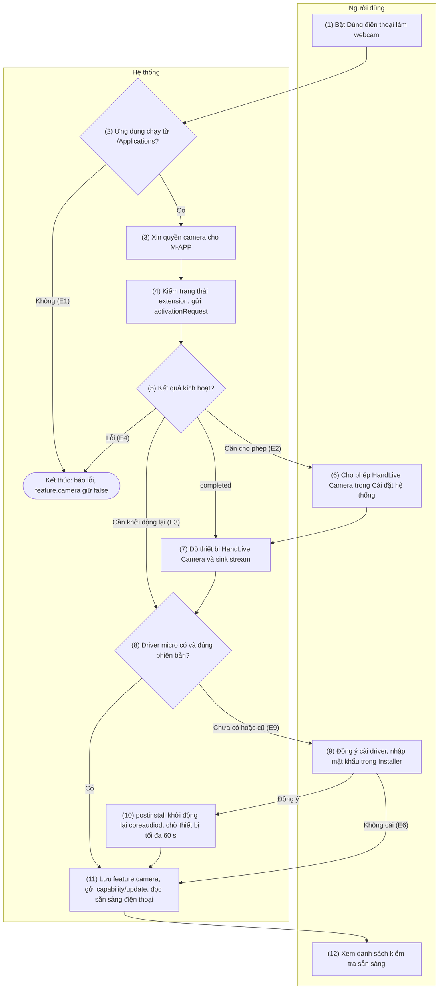
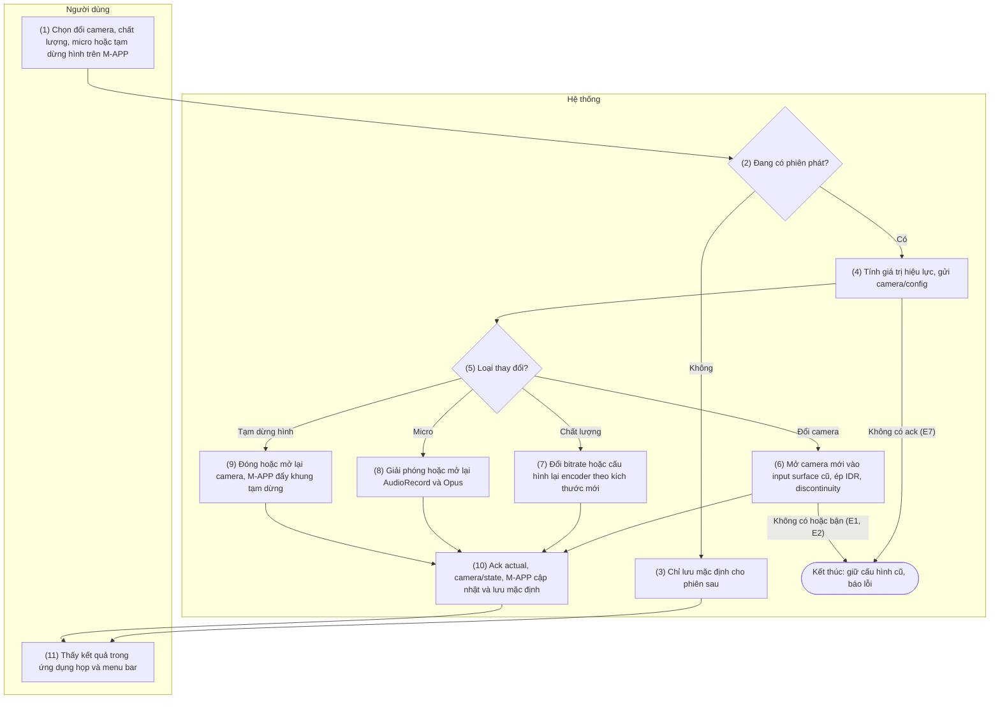
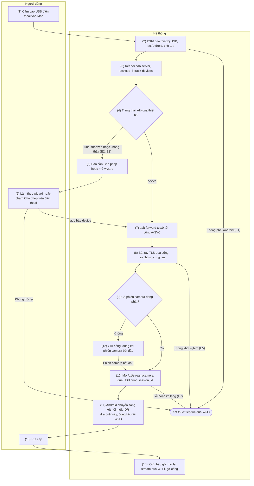
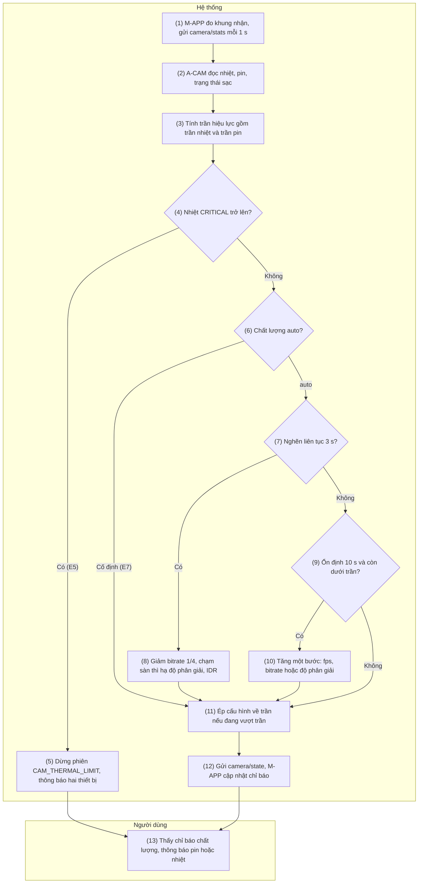

# 8. Nhóm chức năng: Camera và micro

> Tham chiếu chung: [`00-common-specs.md`](00-common-specs.md) — thành phần M-APP, M-CAMX, M-MIC,
> A-CAM, A-SVC (0.1), kênh USB (0.4.2), khung nhị phân HL của `/v1/stream/camera` (0.5.2), khóa kênh
> stream và `camera/stream_hello` (0.6.3 bước 7), danh mục `camera` (0.7.1), capability
> `features.camera` (0.7.2), mã lỗi `CAM_*`, `USB_*`, `MAC_*` (0.8.1), khóa cài đặt
> `feature.camera`, `cam.*` (0.9.5), hằng số `CAM_*`, `USB_DETECT_DEBOUNCE` (0.10). Điều chỉnh áp
> dụng: README §5 C8 (micro ảo theo mô hình loopback), C9 (cài driver bằng PKG), C11 (Camera
> Extension).
>
> Phạm vi chung: camera/micro chỉ chạy khi Mac và điện thoại **cùng LAN (Wi-Fi)** hoặc
> **nối cáp USB**; không đi qua relay (README §4). iPhone/iPad không có nhóm chức năng này. Phiên
> camera chỉ nằm trong bộ nhớ, không có bảng dữ liệu riêng.

**Định danh dùng chung trong nhóm 8**

| Định danh | Giá trị | Ghi chú |
|-----------|---------|---------|
| Bundle id M-APP | `app.handlive.mac` | M-CAMX dùng chữ ký này để chỉ cho M-APP nối sink stream |
| System extension M-CAMX | `app.handlive.mac.camera` | Nằm trong `HandLive.app/Contents/Library/SystemExtensions/` |
| Thiết bị camera ảo | Tên "HandLive Camera", UID `app.handlive.camera.device` | Một source stream (ứng dụng họp đọc), một sink stream (chỉ M-APP ghi) |
| Định dạng camera ảo | Chỉ số `0`: 640×480, `1`: 1280×720, `2`: 1920×1080; 30 fps; `kCVPixelFormatType_32BGRA` | Không đổi trong suốt một lần chạy stream |
| Thuộc tính CMIO tùy biến (chỉ đọc) | `hlsc` = số consumer đang chạy source stream; `hlaf` = chỉ số định dạng consumer đã chọn | Tên thuộc tính CMIOExtension: `4cc_hlsc_glob_0000`, `4cc_hlaf_glob_0000`, đặt trên thiết bị |
| Darwin notification | `app.handlive.camera.demand` (số consumer 0 → 1), `app.handlive.camera.idle` (1 → 0) | Không mang dữ liệu |
| Driver micro M-MIC | `/Library/Audio/Plug-Ins/HAL/HandLiveMic.driver` | Mô hình loopback BlackHole (C8) |
| Thiết bị micro | Vào, hiển thị: "HandLive Microphone", UID `app.handlive.mic.input`. Ra, ẩn: UID `app.handlive.mic.feed` | Hai thiết bị dùng chung một ring buffer trong driver |
| Gói cài đặt | `HandLive.app/Contents/Resources/HandLiveMic.pkg`, `HandLiveMic-Uninstall.pkg` | Ký Developer ID Installer, notarize, staple (C9) |

Các mã lỗi, khóa cài đặt và hằng số riêng của nhóm 8 (`CAM_TRANSPORT_UNSUPPORTED`,
`cam.usb_wizard_dismissed`, `CAM_STOP_GRACE`, `CAM_CONFIRM_TIMEOUT`, `CAM_STREAM_OPEN_TIMEOUT`,
`CAM_STREAM_STALL`, `CAM_PLACEHOLDER_AFTER`, `CAM_JITTER_BUFFER`, `CAM_KEYFRAME_MIN_GAP`,
`CAM_MAX_FRAME`, `CAM_CONGESTION`, `CAM_RECOVER_AFTER`, `MIC_DRIVER_WAIT`, `USB_SWITCH_GAP`) đã được
hợp nhất vào `00-common-specs.md` (0.8.1, 0.9.5, 0.10).

**Quy tắc hình ảnh dùng chung cho CAM-02…CAM-05**

1. **Hướng ảnh.** Bộ mã hóa luôn nhận khung theo hướng cảm biến (nằm ngang). A-CAM tính
   `rotation_deg` ∈ {0, 90, 180, 270} từ `CameraCharacteristics.SENSOR_ORIENTATION`, mặt camera và
   hướng cầm máy (`OrientationEventListener`, làm tròn về bội số 90°, đổi chỉ khi lệch ổn định 1 s),
   gửi trong `actual.video.rotation_deg` của `camera/ready`, `camera/config` và `camera/state`.
   M-APP xoay khung cho thẳng bằng `VTPixelRotationSession` (macOS 13+) trước khi co giãn. Định dạng
   camera ảo luôn là khung ngang; khi điện thoại dựng đứng, ảnh đã xoay được
   **cắt giữa cho đầy khung** (không viền đen), và M-APP gợi ý "Đặt điện thoại nằm ngang để có góc
   rộng nhất".
2. **Kích thước mã hóa.** A-CAM chọn kích thước ra trong
   `StreamConfigurationMap.getOutputSizes(MediaCodec::class.java)` cùng tỉ lệ với mức mục tiêu và
   gần nhất (ưu tiên cạnh ngắn ≥ mục tiêu), ví dụ 480p 16:9 → 848×480 hoặc 864×480 tùy máy; không có
   kích thước cùng tỉ lệ thì chọn kích thước gần nhất theo diện tích. M-APP luôn co giãn về đúng
   định dạng consumer đã chọn (`VTPixelTransferSession`), nên kích thước mã hóa không cần trùng khít
   định dạng camera ảo.

## 8.1 CAM-01 — Cài đặt camera ảo và micro ảo trên Mac

### 8.1.1 Thông tin chung

| Mục | Nội dung |
|-----|----------|
| Tên | CAM-01 — Cài đặt camera ảo và micro ảo trên Mac |
| Mô tả | Chuẩn bị Mac để mọi ứng dụng họp (FaceTime, Zoom, Meet, Teams, OBS…) thấy "HandLive Camera" và "HandLive Microphone": kích hoạt Camera Extension M-CAMX bằng `OSSystemExtensionRequest`, xin quyền camera cho M-APP (biện pháp phòng ngừa vì M-APP đẩy khung vào sink stream — C11), cài driver micro ảo M-MIC bằng PKG ký + notarize nhúng trong ứng dụng (C8, C9), kiểm hai thiết bị ảo đã xuất hiện, lưu `feature.camera` và báo cho điện thoại, rồi hiển thị mức sẵn sàng phía điện thoại theo capability.<br>Có luồng thay thế gỡ camera và micro ảo. |
| Tác nhân | Chính: Người dùng (cần quyền quản trị Mac khi cài driver). Hệ thống: M-APP, M-CAMX, M-MIC, OS (System Extensions, TCC, Installer, `coreaudiod`), A-SVC (nhận `capability/update`). |
| Điều kiện trước | 1. macOS 13+; M-APP là bản Developer ID đã notarize.<br>2. M-APP chạy từ `/Applications` (C11).<br>3. Để kiểm sẵn sàng phía điện thoại: có cặp hiệu lực (PAIR-01); phần cài đặt trên Mac không cần cặp.<br>4. Người dùng có hoặc xin được mật khẩu quản trị (chỉ cho driver micro). |
| Điều kiện sau | **Thành công:** M-CAMX được kích hoạt, CoreMediaIO có thiết bị UID `app.handlive.camera.device` với sink stream; M-MIC nằm ở `/Library/Audio/Plug-Ins/HAL/`, CoreAudio có `app.handlive.mic.input` và `app.handlive.mic.feed`; `feature.camera = true`; đã gửi `capability/update`.<br>**Một phần:** camera sẵn sàng nhưng thiếu driver micro (`MAC_MIC_DRIVER_MISSING`) — camera vẫn dùng được, không có micro ảo; hoặc chờ khởi động lại (`needs_reboot`).<br>**Thất bại:** `feature.camera` giữ `false`, không thay đổi hệ thống. |
| Ngoại lệ | E1 — M-APP không nằm trong `/Applications` (`unsupportedParentBundleLocation`).<br>E2 — Hệ thống cần người dùng cho phép extension (`requestNeedsUserApproval`).<br>E3 — Kết quả `.willCompleteAfterReboot` (thường gặp khi cập nhật extension từ macOS 14.5 — C11): cần khởi động lại Mac.<br>E4 — Kích hoạt lỗi (chữ ký, không tìm thấy extension, chính sách MDM chặn…) hoặc không thấy thiết bị camera sau 10 s → `MAC_EXTENSION_NOT_ACTIVE`.<br>E5 — Quyền camera của M-APP bị từ chối: cảnh báo, vẫn tiếp tục.<br>E6 — Người dùng không cài driver micro hoặc hủy Installer → `MAC_MIC_DRIVER_MISSING`.<br>E7 — Quá 60 s (`MIC_DRIVER_WAIT`) chưa thấy thiết bị micro → gợi ý khởi động lại Mac.<br>E8 — Điện thoại chưa sẵn sàng: chưa kết nối, `features.camera.enabled = false`, hoặc `permissions_missing` có `CAMERA`/`RECORD_AUDIO`.<br>E9 — Driver đã cài nhưng cũ hơn bản đi kèm → đề nghị cập nhật. |
| Yêu cầu đặc biệt | **Phân phối:** Developer ID, ngoài Mac App Store (driver HAL không cài được qua App Store).<br>M-APP có entitlement `com.apple.developer.system-extension.install`; M-CAMX và M-MIC ký Developer ID (ad-hoc bị từ chối).<br>**Bảo mật:** không dùng privileged helper (`SMJobBless` deprecated từ macOS 13 — C9); quyền quản trị chỉ do Installer hỏi; PKG nằm trong bundle đã ký nên được niêm phong bởi chữ ký ứng dụng, Installer tự kiểm chữ ký và notarization.<br>M-CAMX chỉ cho tiến trình có signing ID `app.handlive.mac` nối sink stream.<br>**Khả dụng:** hướng dẫn phê duyệt theo đúng phiên bản macOS; mọi màn hình đọc được bằng VoiceOver; cài driver làm âm thanh trên Mac ngắt khoảng 1–2 s và phải được báo trước.<br>**Hiệu năng:** thiết bị camera xuất hiện ≤ 10 s sau khi được phê duyệt; thiết bị micro xuất hiện ≤ 10 s sau khi `coreaudiod` khởi động lại (thời hạn chờ tối đa 60 s).<br>**Tương thích:** driver có thể đã được Homebrew cask cài (D7) — phát hiện theo UID thiết bị, không theo cách cài. |

### 8.1.2 Màn hình

N/A — chưa có wireframe được duyệt.

### 8.1.3 Mô tả chi tiết các thành phần

| # | Trường | Kiểu dữ liệu | Input/Output | Giá trị khởi tạo | Mô tả |
|---|--------|--------------|--------------|------------------|-------|
| 1 | Công tắc "Dùng điện thoại làm webcam" | bool | Input/Output | `feature.camera` (`false`) | Bật → chạy luồng cài đặt. Tắt → M-APP ngừng phục vụ nhu cầu camera/micro, không gỡ thành phần (gỡ ở trường 10) |
| 2 | Trạng thái camera ảo | enum{not_installed\ | awaiting_approval\ | activating\ | active\ | needs_reboot\ | failed} | Output | `not_installed` | "Chưa cài", "Chờ bạn cho phép", "Đang kích hoạt…", "Đã sẵn sàng", "Cần khởi động lại Mac", "Lỗi" |
| 3 | Trạng thái micro ảo | enum{not_installed\ | installing\ | installed\ | outdated\ | failed} | Output | Theo kết quả dò thiết bị (bước 8) | "Chưa cài", "Đang cài…", "Đã sẵn sàng", "Cần cập nhật", "Lỗi" |
| 4 | Quyền camera của HandLive trên Mac | enum{not_determined\ | authorized\ | denied} | Output | `AVCaptureDevice.authorizationStatus(for: .video)` | `denied` hiển thị kèm nút mở Cài đặt › Quyền riêng tư & Bảo mật › Camera |
| 5 | Hướng dẫn cho phép extension | string | Output | Theo phiên bản macOS | macOS 15+: "Cài đặt chung › Mục đăng nhập và tiện ích mở rộng › Tiện ích mở rộng camera → bật HandLive". macOS 13–14: "Quyền riêng tư & Bảo mật → bấm Cho phép cạnh HandLive" |
| 6 | Nút "Mở Cài đặt hệ thống" | action | Input | Hiện khi trường 2 = `awaiting_approval` | Mở System Settings tới trang tương ứng |
| 7 | Nút "Cài driver micro" / "Cập nhật driver micro" | action | Input | Hiện khi trường 3 = `not_installed` hoặc `outdated` | Mở PKG (bước 9) |
| 8 | Giải thích trước khi cài driver | string | Output | "HandLive cần cài driver micro ảo vào hệ thống. macOS sẽ hỏi mật khẩu quản trị và âm thanh trên Mac sẽ ngắt khoảng 1–2 giây." | Hiển thị trước khi mở Installer |
| 9 | Sẵn sàng trên điện thoại | enum{ready\ | not_connected\ | feature_off\ | permission_missing} | Output | Theo capability gần nhất | Kèm danh sách quyền thiếu (`CAMERA`, `RECORD_AUDIO`) và việc cần làm trên điện thoại (SET-01, SET-02) |
| 10 | Nút "Gỡ camera và micro ảo" | action | Input | Hiện khi trường 2 = `active` hoặc trường 3 = `installed` | Luồng thay thế A1–A4 |
| 11 | Thông báo lỗi | string | Output | Rỗng | Theo E1–E9, kèm mã lỗi hệ thống nếu có |

### 8.1.4 Luồng nghiệp vụ



| Bước | Tác nhân | Thành phần | Mô tả | Ngoại lệ / Ghi chú |
|------|----------|-----------|-------|--------------------|
| 1 | Người dùng | M-APP | Bật "Dùng điện thoại làm webcam" (menu bar › Cài đặt › Camera), hoặc chọn từ gợi ý trong PAIR-02 khi điện thoại có `features.camera`. |  |
| 2 | Hệ thống | M-APP | Kiểm `Bundle.main.bundleURL` nằm dưới `/Applications`. | Sai → E1: "Hãy chuyển HandLive vào thư mục Ứng dụng rồi mở lại". |
| 3 | Hệ thống | M-APP, OS (TCC) | `AVCaptureDevice.authorizationStatus(for: .video)`; `.notDetermined` → `requestAccess(for: .video)` (API 2). | `.denied` → E5, cảnh báo và tiếp tục. |
| 4 | Hệ thống | M-APP, OS | Gửi `propertiesRequest` (API 1): nếu extension đã bật và cùng `bundleVersion` với bản nhúng → sang bước 7. Ngược lại gửi `activationRequest`; delegate trả `.replace` khi được hỏi thay bản cũ. |  |
| 5 | Hệ thống | OS → M-APP | Phân loại kết quả delegate: `requestNeedsUserApproval` → bước 6; `.completed` → bước 7; `.willCompleteAfterReboot` → E3, trường 2 = `needs_reboot`, vẫn làm tiếp phần micro (bước 8); `didFailWithError` → E1 hoặc E4. |  |
| 6 | Người dùng | OS | Mở Cài đặt hệ thống theo trường 5 và bật HandLive Camera. Hệ thống gọi `didFinishWithResult`. | Người dùng có thể đóng hướng dẫn và quay lại sau; M-APP chạy lại bước 4 lần mở kế tiếp. |
| 7 | Hệ thống | M-APP, M-CAMX | Bật `kCMIOHardwarePropertyAllowScreenCaptureDevices`, liệt kê thiết bị CMIO, tìm UID `app.handlive.camera.device` và sink stream (API 3); chờ tối đa 10 s bằng listener `kCMIOHardwarePropertyDevices`. | Không thấy → E4. |
| 8 | Hệ thống | M-APP, M-MIC | Tra `kAudioHardwarePropertyTranslateUIDToDevice` cho `app.handlive.mic.input` và `app.handlive.mic.feed` (API 4); đọc `CFBundleVersion` trong `Info.plist` của driver. Đủ hai thiết bị và phiên bản ≥ bản đi kèm → bước 11. | Thiếu → bước 9. Cũ hơn → E9 rồi bước 9. |
| 9 | Người dùng | M-APP, OS (Installer) | Đọc trường 8, bấm "Cài driver micro". M-APP mở PKG bằng `NSWorkspace.shared.open` (API 5); Installer hỏi mật khẩu quản trị. | Không cài hoặc hủy Installer → E6, trường 3 = `not_installed`, sang bước 11. |
| 10 | Hệ thống | OS, M-APP | PKG chép driver; `postinstall` (root) chạy `killall coreaudiod`; launchd khởi động lại `coreaudiod` và nạp M-MIC. M-APP nghe `kAudioHardwarePropertyDevices` (API 6), mỗi lần đổi lặp lại bước 8. | Quá 60 s → E7, nút "Kiểm tra lại". |
| 11 | Hệ thống | M-APP → A-SVC | Khi trường 2 = `active`: lưu `feature.camera = true`, gửi `capability/update` (API 7). Đọc capability điện thoại từ phiên hiện tại hoặc `features_json` để điền trường 9. | Điện thoại chưa sẵn sàng → E8, phần Mac vẫn hoàn tất. |
| 12 | Người dùng | M-APP | Xem danh sách kiểm tra: camera ảo, micro ảo, quyền camera trên Mac, điện thoại sẵn sàng; mỗi mục chưa đạt có nút xử lý. |  |
| A1 | Người dùng | M-APP | Chọn "Gỡ camera và micro ảo" (trường 10), xác nhận. |  |
| A2 | Hệ thống | M-APP, OS | Dừng phiên camera nếu có (CAM-02 bước 13). Gửi `deactivationRequest` (API 8); kết quả `.completed` hoặc `.willCompleteAfterReboot` (báo cần khởi động lại). | Hệ thống có thể hỏi xác thực. |
| A3 | Hệ thống | M-APP, OS (Installer) | Nếu driver có mặt: mở `HandLiveMic-Uninstall.pkg`; `postinstall` xóa bundle driver, xóa receipt, `killall coreaudiod`. | Driver do Homebrew cài: gỡ PKG vẫn đúng; hoặc `brew uninstall --cask handlive`. |
| A4 | Hệ thống | M-APP → A-SVC | Đặt `feature.camera = false`, gửi `capability/update`. |  |

### 8.1.5 Đặc tả API/service

**Danh sách lời gọi**

| # | API/service | Kênh | Chiều | Dùng ở bước |
|---|-------------|------|-------|-------------|
| 1 | `OSSystemExtensionRequest` (`propertiesRequest`, `activationRequest`) + `OSSystemExtensionRequestDelegate` | Cục bộ | M-APP ↔ OS | 4, 5, 6 |
| 2 | `AVCaptureDevice.requestAccess(for: .video)` | Cục bộ | M-APP ↔ OS | 3 |
| 3 | Dò thiết bị camera ảo qua CoreMediaIO (`CMIOObjectGetPropertyData`, `CMIOObjectAddPropertyListenerBlock`) | Cục bộ | M-APP ↔ OS, M-CAMX | 7 |
| 4 | Dò thiết bị micro ảo: `AudioObjectGetPropertyData` với `kAudioHardwarePropertyTranslateUIDToDevice` | Cục bộ | M-APP ↔ OS, M-MIC | 8, 10 |
| 5 | Mở PKG cài driver: `NSWorkspace.shared.open` + script `postinstall` | Cục bộ | M-APP → Installer | 9, 10 |
| 6 | `AudioObjectAddPropertyListenerBlock` trên `kAudioHardwarePropertyDevices` | Cục bộ | OS → M-APP | 10 |
| 7 | `WS capability/update` | `/v1/ctl` (LAN, USB hoặc relay) | C→S | 11, A4 |
| 8 | Gỡ cài đặt: `OSSystemExtensionRequest.deactivationRequest` + `HandLiveMic-Uninstall.pkg` | Cục bộ | M-APP ↔ OS | A2, A3 |

#### API 1 — `OSSystemExtensionRequest` (kích hoạt Camera Extension)

- **URL:** N/A
- **Method:** `OSSystemExtensionRequest.propertiesRequest(forExtensionWithIdentifier:queue:)` rồi
  `OSSystemExtensionRequest.activationRequest(forExtensionWithIdentifier:queue:)`; gửi bằng
  `OSSystemExtensionManager.shared.submitRequest(_:)`.
- **Request:**

| Tham số | Giá trị | Mô tả |
|---------|---------|-------|
| `identifier` | `app.handlive.mac.camera` | Bundle id của M-CAMX |
| `queue` | `.main` | Hàng đợi nhận callback |
| `delegate` | Bộ cài extension của M-APP | Cài `OSSystemExtensionRequestDelegate` |

- **Response (callback của delegate):**

| Callback | Ý nghĩa | Xử lý |
|----------|---------|-------|
| `request(_:foundProperties:)` | Mảng `OSSystemExtensionProperties` (`bundleVersion`, `bundleShortVersion`, `isEnabled`, `isAwaitingUserApproval`, `isUninstalling`) | Đã bật và cùng `bundleVersion` → bỏ qua kích hoạt; `isAwaitingUserApproval` → trường 2 = `awaiting_approval` |
| `request(_:actionForReplacingExtension:withExtension:)` | Đang có bản khác được cài | Trả `.replace` |
| `requestNeedsUserApproval(_:)` | Chờ người dùng cho phép | E2, hiển thị trường 5, 6 |
| `request(_:didFinishWithResult:)` | `.completed` hoặc `.willCompleteAfterReboot` | Bước 7 hoặc E3 |
| `request(_:didFailWithError:)` | `OSSystemExtensionError` | `unsupportedParentBundleLocation` → E1; `requestCanceled`, `requestSuperseded` → gửi lại một lần; mã khác (`extensionNotFound`, `codeSignatureInvalid`, `validationFailed`, `forbiddenBySystemPolicy`…) → E4 |

- **Ví dụ:**

```swift
let request = OSSystemExtensionRequest.activationRequest(
    forExtensionWithIdentifier: "app.handlive.mac.camera", queue: .main)
request.delegate = cameraExtensionInstaller
OSSystemExtensionManager.shared.submitRequest(request)
// delegate: requestNeedsUserApproval → hiển thị hướng dẫn; didFinishWithResult(.completed) → dò thiết bị
```

- **Logic nghiệp vụ:**
  1. Mỗi lúc chỉ một request; request mới trong khi request cũ chưa xong bị bỏ qua.
  2. Luôn trả `.replace`: bản nhúng trong M-APP là bản khớp giao thức sink/custom property với
     M-APP, kể cả khi bản đang chạy mới hơn (người dùng hạ cấp ứng dụng).
  3. `.willCompleteAfterReboot`: hiển thị "Cần khởi động lại Mac để hoàn tất cập nhật camera ảo";
     lần mở M-APP kế tiếp chạy lại `propertiesRequest` để xác nhận `isEnabled`.
  4. Kích hoạt chạy mỗi lần M-APP khởi động khi `feature.camera = true` (chỉ `propertiesRequest`,
     không làm phiền người dùng nếu đã bật), để tự phát hiện extension bị gỡ hoặc cần cập nhật sau
     khi nâng cấp ứng dụng.

#### API 2 — `AVCaptureDevice.requestAccess(for: .video)`

- **URL:** N/A
- **Method:** `AVCaptureDevice.authorizationStatus(for: .video)`,
  `AVCaptureDevice.requestAccess(for: .video, completionHandler:)`
- **Request:** loại media `.video`. `Info.plist` của M-APP có `NSCameraUsageDescription` = "HandLive
  đưa hình từ điện thoại vào camera ảo HandLive Camera."
- **Response:** `Bool` (được cấp hay không); trạng thái `AVAuthorizationStatus` = `.notDetermined`
  \| `.authorized` \| `.denied` \| `.restricted`.
- **Ví dụ:** lần đầu → hộp thoại hệ thống "HandLive muốn truy cập camera" → `true` → trường 4 =
  `authorized`.
- **Logic nghiệp vụ:**
  1. Chỉ là biện pháp phòng ngừa (C11): M-APP không mở camera thật nào; quyền này phòng trường hợp
     macOS coi việc ghi vào sink stream là dùng camera.
  2. TCC chỉ hỏi một lần; `.denied` /`.restricted` → trường 4 kèm nút mở
     `x-apple.systempreferences:com.apple.preference.security?Privacy_Camera`.
  3. Không chặn luồng cài đặt; nếu CAM-02 không lấy được hàng đợi sink và quyền đang `.denied` thì
     hiển thị lại hướng dẫn này.

#### API 3 — Dò thiết bị camera ảo qua CoreMediaIO

- **URL:** N/A
- **Method:** `CMIOObjectSetPropertyData` (`kCMIOHardwarePropertyAllowScreenCaptureDevices` = 1 trên
  `kCMIOObjectSystemObject`); `CMIOObjectGetPropertyData` với `kCMIOHardwarePropertyDevices`,
  `kCMIODevicePropertyDeviceUID`, `kCMIODevicePropertyStreams`, `kCMIOStreamPropertyDirection`;
  `CMIOObjectAddPropertyListenerBlock` trên `kCMIOHardwarePropertyDevices`.
- **Request:** UID cần tìm `app.handlive.camera.device`; địa chỉ thuộc tính
  `{selector, kCMIOObjectPropertyScopeGlobal, kCMIOObjectPropertyElementMain}`.
- **Response:** `CMIOObjectID` của thiết bị và danh sách `CMIOStreamID`; sink stream là stream có
  hướng ngược với source stream (đọc bằng `kCMIOStreamPropertyDirection`).
- **Ví dụ:** thiết bị `HandLive Camera` (id 57) có hai stream: 58 (source), 59 (sink).
- **Logic nghiệp vụ (đặc tả M-CAMX mà bước này kiểm):**
  1. Provider `CMIOExtensionProviderSource` công bố một thiết bị `CMIOExtensionDeviceSource` tên
     "HandLive Camera", UID `app.handlive.camera.device`, gồm source stream và sink stream
     `CMIOExtensionStreamSource`, cùng ba định dạng 640×480, 1280×720, 1920×1080 @30 fps, BGRA.
  2. Thiết bị công bố hai thuộc tính tùy biến chỉ đọc `4cc_hlsc_glob_0000` (số consumer của source
     stream) và `4cc_hlaf_glob_0000` (chỉ số định dạng đang dùng); ghi từ ngoài bị bỏ qua.
  3. Sink stream `authorizedToStartStream(for:)` chỉ trả `true` khi `client.signingID` =
     `app.handlive.mac`; source stream cho mọi client.
  4. Không có XPC, App Group hay shm giữa M-APP và M-CAMX (extension chạy dưới user
     `_cmiodalassistants`); dữ liệu đi qua sink stream, tín hiệu qua Darwin notification và thuộc
     tính tùy biến.
  5. Chờ tối đa 10 s sau khi kích hoạt; thiết bị không xuất hiện → E4.

#### API 4 — Dò thiết bị micro ảo qua CoreAudio

- **URL:** N/A
- **Method:**
  `AudioObjectGetPropertyData(kAudioObjectSystemObject, {kAudioHardwarePropertyTranslateUIDToDevice, global, main}, qualifier = CFString UID)`
- **Request:** UID `app.handlive.mic.input`, sau đó `app.handlive.mic.feed`.
- **Response:** `AudioObjectID`; `kAudioObjectUnknown` nếu không có thiết bị.
- **Ví dụ:** `app.handlive.mic.input` → 92, `app.handlive.mic.feed` → 91 → trường 3 = `installed`.
- **Logic nghiệp vụ (đặc tả M-MIC mà bước này kiểm):**
  1. Một driver công bố hai thiết bị: `app.handlive.mic.feed` chỉ có luồng ra,
     `kAudioDevicePropertyIsHidden` = 1, không được làm thiết bị mặc định; `app.handlive.mic.input`
     ("HandLive Microphone") chỉ có luồng vào, được làm micro mặc định.
  2. Định dạng: 48 kHz, Float32, mono. Ring buffer 16 384 khung dùng chung trong tiến trình driver;
     vị trí đọc/ghi = sample time mod độ dài ring (mô hình BlackHole — C8). Không có shm, không có
     IPC riêng với M-APP.
  3. Khi `feed` không có client đang phát, `input` trả về khoảng lặng (không phát lại dữ liệu cũ
     trong ring).
  4. Phiên bản driver = `CFBundleVersion` trong `HandLiveMic.driver/Contents/Info.plist`; nhỏ hơn
     bản PKG đi kèm → `outdated` (E9).
  5. `AudioObjectID` có thể đổi sau khi `coreaudiod` khởi động lại: M-APP luôn tra lại theo UID
     trước khi dùng.

#### API 5 — Mở PKG cài driver micro

- **URL:** N/A (tệp `HandLive.app/Contents/Resources/HandLiveMic.pkg`)
- **Method:** `NSWorkspace.shared.open(URL)` → Installer; script `postinstall` trong PKG.
- **Request:**

| Mục | Giá trị |
|-----|---------|
| Gói | `HandLiveMic.pkg`, identifier `app.handlive.mic`, ký Developer ID Installer, notarize + staple |
| Nơi cài | `/Library/Audio/Plug-Ins/HAL/HandLiveMic.driver` |
| `postinstall` | Chạy bằng root: `killall coreaudiod` |

- **Response:** `open` trả `Bool` (Installer đã mở). Kết quả cài không trả về M-APP; M-APP suy ra
  qua API 6.
- **Ví dụ:**

```sh
#!/bin/sh
# [Thiết kế] postinstall của HandLiveMic.pkg (root). launchd tự khởi động lại coreaudiod.
/usr/bin/killall coreaudiod || true
exit 0
```

- **Logic nghiệp vụ:**
  1. Không dùng `launchctl kickstart -k` (bị chặn với tiến trình hệ thống từ macOS 14.4) và không
     dùng privileged helper (C9).
  2. Trước khi mở PKG, dừng phát micro ảo nếu đang có phiên (CAM-02) vì `coreaudiod` sắp khởi động
     lại.
  3. Cài qua Homebrew cask dùng cùng PKG, nên API 4 nhận ra driver bất kể cách cài.

#### API 6 — Theo dõi danh sách thiết bị âm thanh

- **URL:** N/A
- **Method:**
  `AudioObjectAddPropertyListenerBlock(kAudioObjectSystemObject, {kAudioHardwarePropertyDevices, global, main}, queue, block)`;
  gỡ bằng `AudioObjectRemovePropertyListenerBlock`.
- **Request:** hàng đợi nối tiếp của M-APP.
- **Response:** block được gọi mỗi khi danh sách thiết bị đổi (có thể nhiều lần liên tiếp khi
  `coreaudiod` khởi động lại).
- **Ví dụ:** 3,2 s sau khi Installer xong, block được gọi; API 4 trả đủ hai UID → trường 3 =
  `installed`.
- **Logic nghiệp vụ:** Mỗi lần được gọi, chạy lại API 4; đủ hai UID → gỡ listener, sang bước 11. Hết
  60 s (`MIC_DRIVER_WAIT`) → E7. Listener cũng giữ suốt vòng đời M-APP để phát hiện driver bị gỡ
  (trường 3 → `not_installed`).

#### API 7 — `WS capability/update`

- **URL:** `wss://{android_host}:{port}/v1/ctl` (LAN hoặc USB) hoặc qua relay
- **Method:** `WS capability/update` (C→S), envelope mã hóa, không ack.
- **Request (`data`):** ảnh chụp đầy đủ, cùng cấu trúc `capability/hello` (0.7.2) của Mac, với
  `features.camera.enabled` = giá trị mới của `feature.camera`.
- **Response:** N/A; nếu cấu hình của điện thoại đổi theo, điện thoại gửi `capability/update` của
  nó.
- **Ví dụ** (trích phần `camera`; bản thật mang đủ mọi tính năng như 0.7.2):
  `{"op":"update","data":{"protocol":1,"app_version":"1.0.0 (100)","platform":"macos","os_version":"15.1","model":"Mac15,3","features":{"camera":{"enabled":true}}}}`
- **Logic nghiệp vụ:** Camera hiệu lực khi cả hai bên bật và điện thoại không thiếu `CAMERA`,
  `RECORD_AUDIO` (CONN-01 API 7). Chuyển từ hiệu lực sang không hiệu lực → dừng phiên camera đang
  chạy (CAM-02 bước 13).

#### API 8 — Gỡ camera và micro ảo

- **URL:** N/A (tệp `HandLive.app/Contents/Resources/HandLiveMic-Uninstall.pkg`)
- **Method:** `OSSystemExtensionRequest.deactivationRequest(forExtensionWithIdentifier:queue:)`;
  `NSWorkspace.shared.open(URL)` cho PKG gỡ driver.
- **Request:** `identifier` = `app.handlive.mac.camera`; PKG gỡ không có payload, chỉ có
  `postinstall`.
- **Response:** delegate như API 1 (`.completed` / `.willCompleteAfterReboot` / lỗi); PKG gỡ không
  trả kết quả, M-APP kiểm bằng API 4 và 6.
- **Ví dụ:**

```sh
#!/bin/sh
# [Thiết kế] postinstall của HandLiveMic-Uninstall.pkg (root)
/bin/rm -rf /Library/Audio/Plug-Ins/HAL/HandLiveMic.driver
/usr/sbin/pkgutil --forget app.handlive.mic >/dev/null 2>&1 || true
/usr/bin/killall coreaudiod || true
exit 0
```

- **Logic nghiệp vụ:**
  1. Dừng phiên camera trước khi gỡ. Gỡ extension có thể cần xác thực người dùng.
  2. Khi người dùng kéo HandLive vào Thùng rác, macOS tự đề nghị gỡ extension nhưng driver micro vẫn
     còn; menu "Gỡ camera và micro ảo" phải được giới thiệu trong tài liệu gỡ cài đặt.

#### Query

N/A — chức năng không ghi cơ sở dữ liệu; chỉ đọc capability đã lưu khi chưa có phiên.

```sql
-- [Thiết kế] Mac, bước 11: capability gần nhất của điện thoại khi chưa kết nối
SELECT pair_id, peer_name, features_json
FROM paired_device
WHERE revoked_at IS NULL
LIMIT 1;
```

```text
# [Thiết kế] UserDefaults của M-APP (khóa 0.9.5)
UserDefaults.standard.bool(forKey: "feature.camera")          # bước 1: giá trị hiện tại của trường 1
UserDefaults.standard.set(true,  forKey: "feature.camera")    # bước 11
UserDefaults.standard.set(false, forKey: "feature.camera")    # A4
```

---

## 8.2 CAM-02 — Bắt đầu và dừng phát camera/micro

### 8.2.1 Thông tin chung

| Mục | Nội dung |
|-----|----------|
| Tên | CAM-02 — Bắt đầu và dừng phát camera/micro |
| Mô tả | Mở và đóng phiên phát hình và tiếng từ điện thoại vào "HandLive Camera" và "HandLive Microphone" theo nhu cầu thực.<br>Ba nguồn kích hoạt: (a) ứng dụng họp bắt đầu đọc source stream của camera ảo → M-CAMX tăng bộ đếm consumer và phát Darwin notification `app.handlive.camera.demand`; (b) ứng dụng họp bắt đầu dùng micro ảo → `kAudioDevicePropertyDeviceIsRunningSomewhere` của thiết bị vào đổi sang 1; (c) người dùng bấm "Bắt đầu" trong cửa sổ xem trước của M-APP.<br>M-APP gửi `camera/start`; Android nâng foreground service lên type `connectedDevice\ | camera\ | microphone` (ngay nếu HandLive đang hiển thị, ngược lại sau khi người dùng chạm "Bật" trên thông báo), mở Camera2 → MediaCodec H.264 và AudioRecord → Opus, trả `camera/ready`; M-APP mở kênh riêng `/v1/stream/camera` (Wi-Fi, hoặc USB theo CAM-04), giải mã hình đẩy vào sink stream của M-CAMX và phát tiếng vào thiết bị ẩn của M-MIC. Hết mọi consumer 5 s → `camera/stop`.<br>Người dùng dừng được từ thông báo trên điện thoại. |
| Tác nhân | Chính: Người dùng; Ứng dụng họp (consumer của thiết bị ảo). Hệ thống: M-APP, M-CAMX, M-MIC, A-SVC, A-CAM, A-UI, OS (CoreMediaIO, CoreAudio, VideoToolbox, Camera2, MediaCodec, AudioRecord). |
| Điều kiện trước | 1.<br>CAM-01 hoàn tất (camera ảo; micro ảo nếu cần tiếng); `feature.camera = true` ở hai phía và camera hiệu lực theo capability (điện thoại có `CAMERA`, `RECORD_AUDIO`).<br>2.<br>Phiên `/v1/ctl` đang `Connected` qua LAN hoặc USB, không qua relay.<br>3.<br>Điện thoại không đang phát camera cho thiết bị khác.<br>4.<br>Android có quyền `POST_NOTIFICATIONS` để xác nhận khi ở nền (nếu không, người dùng phải mở HandLive trên điện thoại). |
| Điều kiện sau | **Đang phát:** ứng dụng họp nhận hình và tiếng; A-SVC chạy FGS type `connectedDevice\ | camera\ | microphone`; điện thoại hiện chỉ báo quyền riêng tư của hệ thống và thông báo "Đang dùng camera cho <tên Mac>" có nút "Dừng"; có đúng một kết nối `/v1/stream/camera` đã xác thực cho `session_id`. **Sau khi dừng:** camera, bộ mã hóa, AudioRecord được giải phóng; FGS về type `connectedDevice`; kênh stream đóng mã 1000; M-CAMX phát khung chờ nếu còn consumer; micro ảo phát khoảng lặng. |
| Ngoại lệ | E1 — Phiên ctl đi qua relay hoặc chưa kết nối: M-APP không gửi `camera/start`, báo "Cần cùng mạng Wi-Fi hoặc cắm cáp USB"; Android nhận `camera/start` qua relay → `CAM_TRANSPORT_UNSUPPORTED`.<br>E2 — Camera không hiệu lực: `FEATURE_DISABLED` hoặc `PERMISSION_MISSING` (`details.permission` = `CAMERA`/`RECORD_AUDIO`).<br>E3 — Điện thoại đang phát cho thiết bị khác → `CAM_BUSY` (`details.holder_name`).<br>E4 — Người dùng chạm "Từ chối" → `camera/stop` reason `denied`, mã `CAM_DENIED_BY_USER`.<br>E5 — Không xác nhận trong 60 s (`CAM_CONFIRM_TIMEOUT`) → `camera/stop` reason `confirm_timeout`.<br>E6 — Camera phần cứng đang bị ứng dụng khác dùng → `CAM_BUSY`; không có camera yêu cầu → dùng camera còn lại, không có camera nào → `CAM_UNAVAILABLE`.<br>E7 — Không có bộ mã hóa H.264 dùng được ở mọi bậc → `CAM_ENCODER_UNSUPPORTED`.<br>E8 — Không lấy được hàng đợi sink (extension chưa kích hoạt, quyền camera của M-APP bị từ chối) → `MAC_EXTENSION_NOT_ACTIVE`, mở CAM-01, xem trước vẫn chạy; thiếu driver micro → `MAC_MIC_DRIVER_MISSING`, chỉ phát hình.<br>E9 — Kênh stream không mở được, `stream_hello` bị từ chối, hoặc im lặng quá 1 s (`CAM_STREAM_STALL`) → mở lại cùng `session_id` tối đa 3 lần (0,25 s, 0,5 s, 1 s); vẫn lỗi → dừng phiên reason `error`.<br>E10 — Mất cả phiên ctl lẫn kênh stream quá 5 s, hoặc điện thoại quá nóng (CAM-05) → phiên kết thúc, M-CAMX phát khung chờ. |
| Yêu cầu đặc biệt | **Độ trễ** (720p30, từ ống kính tới ứng dụng họp): < 120 ms qua Wi-Fi, < 70 ms qua USB; tiếng không sớm hơn hình quá 45 ms và không muộn hơn quá 125 ms.<br>Từ lúc có nhu cầu tới khung hình đầu ≤ 2 s khi HandLive đang hiển thị trên điện thoại.<br>**Quyền riêng tư:** chỉ mở phần cứng của track đang cần; khi HandLive ở nền, mỗi phiên cần một lần chạm trên điện thoại; chỉ báo quyền riêng tư của hệ thống và thông báo thường trực trong suốt phiên.<br>**Nền tảng Android:** manifest khai báo `android:foregroundServiceType="connectedDevice\ | camera\ | microphone"` và quyền `FOREGROUND_SERVICE_CAMERA`, `FOREGROUND_SERVICE_MICROPHONE`, `CAMERA`, `RECORD_AUDIO`, `POST_NOTIFICATIONS`. Liên kết CompanionDeviceManager **không** miễn trừ hạn chế khởi động FGS camera/micro từ nền (đã kiểm chứng) nên thiết kế không dựa vào nó. **Bảo mật:** khung media mã hóa bằng khóa kênh stream (0.6.3 bước 7); bên nhận bỏ khung có `seq` không tăng; không ghi log nội dung media; sink stream chỉ nhận M-APP. **Tài nguyên:** mặc định 1280×720, 30 fps, 2,5 Mbps (`CAM_DEFAULT`); tiếng Opus 32 kbps. |

### 8.2.2 Màn hình

N/A — chưa có wireframe được duyệt.

### 8.2.3 Mô tả chi tiết các thành phần

| # | Trường | Kiểu dữ liệu | Input/Output | Giá trị khởi tạo | Mô tả |
|---|--------|--------------|--------------|------------------|-------|
| 1 | Trạng thái phát (menu bar M-APP) | enum{idle\ | requesting\ | waiting_phone\ | starting\ | live\ | stopping\ | error} | Output | `idle` | "Chưa phát", "Đang yêu cầu…", "Chạm Bật trên điện thoại", "Đang khởi động…", "Đang phát", "Đang dừng…", "Lỗi" |
| 2 | Thiết bị ảo đang được dùng | array<enum{camera\ | microphone\ | preview}> | Output | Rỗng | Ví dụ "Có ứng dụng đang dùng HandLive Camera và HandLive Microphone" |
| 3 | Cửa sổ xem trước | video | Output | Ẩn | Hình đã giải mã và mức âm lượng micro |
| 4 | Nút "Bắt đầu" / "Dừng" trong xem trước | action | Input | "Bắt đầu" | Nguồn kích hoạt (c); "Dừng" chỉ bỏ nhu cầu của xem trước |
| 5 | Kênh truyền | enum{wifi\ | usb} | Output | Theo phiên ctl | "Qua Wi-Fi", "Qua USB" |
| 6 | Thông báo yêu cầu trên Android | string | Output | — | "<tên Mac> muốn dùng camera và micro" (hoặc "…micro" khi chỉ có track tiếng); tự hủy sau 60 s |
| 7 | Lựa chọn trên thông báo yêu cầu hoặc hộp thoại A-UI | enum{Bật\ | Từ chối} | Input | — | Hộp thoại A-UI hiện khi người dùng mở HandLive lúc đang có yêu cầu chờ |
| 8 | Thông báo đang phát trên Android | string | Output | — | "Đang dùng camera cho <tên Mac>"; có nút "Dừng" (nút điều khiển khác ở CAM-03) |
| 9 | Nút "Dừng" trên thông báo đang phát | action | Input | — | Luồng A1–A2 |
| 10 | Khung chờ của camera ảo | image | Output | "Đang chờ điện thoại…" | M-CAMX phát khi quá 1 s không có khung từ sink |
| 11 | Độ trễ ước tính | int32 (ms) | Output | Rỗng | Mục chẩn đoán của M-APP |
| 12 | Thông báo lỗi | string | Output | Rỗng | Theo E1–E10 |

### 8.2.4 Luồng nghiệp vụ


| Bước | Tác nhân | Thành phần | Mô tả | Ngoại lệ / Ghi chú |
|------|----------|-----------|-------|--------------------|
| 1 | Người dùng, Ứng dụng họp | Ứng dụng họp, M-APP | (a) Chọn "HandLive Camera" và bật hình; (b) chọn "HandLive Microphone" và vào cuộc họp; (c) mở "Xem trước" trong M-APP và bấm "Bắt đầu". |  |
| 2 | Hệ thống | M-CAMX, M-MIC, M-APP | (a) Source stream `startStream()` → M-CAMX tăng bộ đếm consumer; 0 → 1 thì phát `app.handlive.camera.demand` (API 1); M-APP đọc `hlsc` > 0 và `hlaf` (API 2). (b) Listener `kAudioDevicePropertyDeviceIsRunningSomewhere` của `app.handlive.mic.input` báo 1 (API 3). (c) Sự kiện giao diện.<br>M-APP tính track cần: video khi `hlsc` > 0 hoặc đang xem trước; audio khi micro ảo đang chạy hoặc đang xem trước.<br>Đang có phiên → chỉ đổi track bằng `camera/config` (CAM-03 API 1: `video_paused`, `mic_enabled`) và hủy đếm dừng. | Notification có thể đến trước khi `hlsc` cập nhật: đọc lại sau 100 ms, tối đa 3 lần. Khi khởi động, M-APP đọc `hlsc` và trạng thái micro một lần vì nhu cầu có thể có trước M-APP. |
| 3 | Hệ thống | M-APP | Kiểm `feature.camera = true`, camera hiệu lực theo capability, phiên ctl `Connected` với kênh `lan` hoặc `usb`. | Relay hoặc chưa kết nối → E1 (M-CAMX tiếp tục phát khung chờ). Không hiệu lực → E2. |
| 4 | Hệ thống | M-APP → A-SVC | Sinh `session_id` (UUIDv7); gửi `camera/start` (API 4): camera = `cam.default_camera`; kích thước = định dạng theo `hlaf`, giới hạn bởi `cam.default_quality` và `features.camera.max_*`; 30 fps; bitrate theo bậc (CAM-05); audio 32 kbps. Trạng thái `requesting`. | Ack lỗi `CAM_TRANSPORT_UNSUPPORTED` (E1), `FEATURE_DISABLED`/`PERMISSION_MISSING` (E2), `CAM_BUSY` (E3). Không có ack trong 10 s → gửi lại 1 lần cùng `session_id`. |
| 5 | Hệ thống | A-SVC | Kiểm phiên ctl không qua relay, tính năng hiệu lực, không có phiên camera khác; rồi kiểm A-UI đang hiển thị (`ProcessLifecycleOwner` ở trạng thái `STARTED`). |  |
| 6 | Hệ thống | A-SVC | Gọi `ServiceCompat.startForeground` với type `CONNECTED_DEVICE \ | CAMERA \ | MICROPHONE` (API 5); ack `{status: "starting"}`. Khi đến từ bước 8 thì yêu cầu đã được ack ở bước 7, chuyển thẳng bước 9. | Hệ thống từ chối nâng type (`SecurityException`) → `camera/stop` reason `error`, mã `PERMISSION_MISSING`. |
| 7 | Hệ thống | A-SVC, M-APP | Ack lỗi `CAM_USER_CONFIRM_REQUIRED` với `details = {status: "needs_user_confirm", confirm_timeout_ms: 60000}`; đăng thông báo ưu tiên cao (trường 6) với action "Bật", "Từ chối" (API 5). M-APP chuyển `waiting_phone`, hiển thị "Chạm Bật trên điện thoại". | Người dùng mở HandLive trong lúc chờ → hộp thoại A-UI (trường 7) thay thông báo. |
| 8 | Người dùng | A-UI (thông báo) | "Bật" → PendingIntent khởi động trực tiếp A-SVC (tương tác với thông báo là ngoại lệ được tài liệu hóa cho FGS camera/micro khởi động từ nền, Android 14+) → bước 6. "Từ chối" → A-SVC gửi `camera/stop` reason `denied`, mã `CAM_DENIED_BY_USER`. | E4. Hết 60 s → A-SVC hủy thông báo, gửi `camera/stop` reason `confirm_timeout` (E5). |
| 9 | Hệ thống | A-CAM, A-SVC → M-APP | Mở camera, cấu hình encoder và capture session, mở AudioRecord + Opus cho track được bật (API 6); gửi `camera/ready` (API 7) với cấu hình thực tế; đổi thông báo FGS sang trường 8. | Camera bận hoặc không có → E6; không có encoder → E7: `camera/stop` reason `error` kèm mã. |
| 10 | Hệ thống | M-APP ↔ A-SVC | Mở `wss://{android_host}:{port}/v1/stream/camera` (hoặc cổng chuyển tiếp USB — CAM-04) với cùng ghim TLS; gửi `camera/stream_hello`, nhận `camera/stream_welcome` (API 8). Trạng thái `starting`. | Quá 10 s sau `camera/ready` (`CAM_STREAM_OPEN_TIMEOUT`) → Android dừng phiên reason `error`. Lỗi → E9. |
| 11 | Hệ thống | A-SVC → M-APP → M-CAMX, M-MIC | Android gửi khung HL (API 9); khung video đầu là IDR kèm SPS/PPS.<br>M-APP: video → `VTDecompressionSession` → `VTPixelTransferSession` về định dạng `hlaf` → `CMSampleBufferCreateReadyWithImageBuffer` (PTS theo host clock) → hàng đợi sink; M-CAMX `consumeSampleBuffer` → source stream với thời gian host mới (API 11).<br>Audio → Opus decode → jitter buffer 20–60 ms → AUHAL ra `app.handlive.mic.feed` → M-MIC → "HandLive Microphone" (API 12).<br>Lỗi giải mã → `camera/keyframe` (API 10).<br>Trạng thái `live`; Android gửi `camera/state` (API 14). | Không lấy được hàng đợi sink → E8. Kênh đứt → E9. |
| 12 | Người dùng | Ứng dụng họp, A-UI | Thấy hình, nghe tiếng từ điện thoại; điện thoại hiện chỉ báo quyền riêng tư và thông báo trường 8. |  |
| 13 | Hệ thống | M-APP ↔ A-SVC | Không còn consumer camera, micro và xem trước: chờ 5 s (`CAM_STOP_GRACE`), vẫn không có → `camera/stop` `{reason: "no_consumer"}` (API 13).<br>Android dừng capture, đóng camera, giải phóng encoder và AudioRecord, đóng kênh stream mã 1000, gọi lại `startForeground` chỉ với `CONNECTED_DEVICE`, rồi ack.<br>M-APP dừng AUHAL, hủy phiên giải mã. | Consumer quay lại trong 5 s → hủy đếm, giữ phiên. |
| A1 | Người dùng | A-UI (thông báo) | Chạm "Dừng" (trường 9). |  |
| A2 | Hệ thống | A-SVC → M-APP | Android giải phóng như bước 13, gửi `camera/stop` `{reason: "user"}`; M-APP ack, đóng stream, về `idle`, hiển thị "Đã dừng từ điện thoại".<br>M-CAMX phát khung chờ cho consumer còn lại; micro ảo phát khoảng lặng.<br>M-APP không tự bắt đầu lại cho tới khi số consumer về 0 rồi tăng lại, hoặc người dùng bấm "Bắt đầu". | Tránh tự bật lại trái ý người dùng. |
| A3 | Hệ thống | M-APP, A-SVC | Mất kết nối giữa chừng: M-APP mở lại kênh stream cùng `session_id` (E9).<br>Android giữ phiên khi còn phiên ctl hoặc một kênh stream đã xác thực; mất cả hai quá 5 s → giải phóng như bước 13 (reason `disconnected`).<br>Mac sắp ngủ hoặc M-APP thoát → gửi `camera/stop` reason `no_consumer` trước khi đóng. | E10. |

### 8.2.5 Đặc tả API/service

**Danh sách lời gọi**

| # | API/service | Kênh | Chiều | Dùng ở bước |
|---|-------------|------|-------|-------------|
| 1 | Darwin notification `app.handlive.camera.demand` / `app.handlive.camera.idle` | Cục bộ | M-CAMX → M-APP | 2, 13 |
| 2 | Thuộc tính CMIO tùy biến `hlsc`, `hlaf` (`CMIOObjectGetPropertyData`, `CMIOObjectAddPropertyListenerBlock`) | Cục bộ | M-CAMX → M-APP | 2, 4 |
| 3 | Listener `kAudioDevicePropertyDeviceIsRunningSomewhere` trên `app.handlive.mic.input` | Cục bộ | OS → M-APP | 2, 13 |
| 4 | `WS camera/start` | `/v1/ctl` (LAN hoặc USB, không qua relay) | C→S | 4, 5, 6, 7 |
| 5 | Nâng FGS và thông báo xác nhận: `ServiceCompat.startForeground`, `NotificationCompat` + `PendingIntent.getForegroundService` | Cục bộ | A-SVC ↔ OS | 6, 7, 8, 13, A1 |
| 6 | Thu và mã hóa trên Android: Camera2, `MediaCodec` H.264, `AudioRecord`, libopus (JNI) | Cục bộ | A-CAM ↔ OS | 9 |
| 7 | `WS camera/ready` | `/v1/ctl` | S→C | 9 |
| 8 | Kênh `/v1/stream/camera`: `WS camera/stream_hello` / `camera/stream_welcome` | `/v1/stream/camera` (LAN hoặc USB) | C→S / S→C | 10, A3 |
| 9 | `WS binary HL` — khung media | `/v1/stream/camera` | S→C | 11 |
| 10 | `WS camera/keyframe` | `/v1/ctl` | C→S | 11 |
| 11 | Đường hình trên Mac: `VTDecompressionSession` → `VTPixelTransferSession` → hàng đợi sink (`CMIOStreamCopyBufferQueue`, `CMSimpleQueueEnqueue`) → M-CAMX | Cục bộ | M-APP → M-CAMX | 11, 13 |
| 12 | Đường tiếng trên Mac: Opus → jitter buffer → AUHAL → `app.handlive.mic.feed` | Cục bộ | M-APP → M-MIC | 11, 13 |
| 13 | `WS camera/stop` | `/v1/ctl` | Hai chiều | 8, 13, A2, A3 |
| 14 | `WS camera/state` | `/v1/ctl` | S→C | 11 |

#### API 1 — Darwin notification `app.handlive.camera.demand` / `app.handlive.camera.idle`

- **URL:** N/A
- **Method:** M-CAMX:
  `CFNotificationCenterPostNotification(CFNotificationCenterGetDarwinNotifyCenter(), name, nil, nil, true)`.
  M-APP:
  `CFNotificationCenterAddObserver(CFNotificationCenterGetDarwinNotifyCenter(), observer, callback, name, nil, .deliverImmediately)`.
- **Request:**

| Tên | Khi M-CAMX phát | Dữ liệu |
|-----|-----------------|---------|
| `app.handlive.camera.demand` | Source stream `startStream()` làm số consumer đổi 0 → 1 | Không (Darwin notification không mang `object`/`userInfo`) |
| `app.handlive.camera.idle` | Source stream `stopStream()` làm số consumer đổi 1 → 0 | Không |

- **Response:** N/A (tín hiệu một chiều). M-APP đọc số liệu thật qua API 2.
- **Ví dụ:** Zoom bật hình với "HandLive Camera" → M-CAMX phát `app.handlive.camera.demand` → M-APP
  đọc `hlsc` = `"1"`, `hlaf` = `"1"` → gửi `camera/start` 1280×720.
- **Logic nghiệp vụ:**
  1. Notification chỉ là tín hiệu "hãy đọc lại": có thể dồn, mất hoặc đến trước khi thuộc tính cập
     nhật; M-APP luôn đọc `hlsc` sau khi nhận (thử lại sau 100 ms, tối đa 3 lần khi giá trị chưa đổi
     — bước 2).
  2. `demand` khi đang đếm `CAM_STOP_GRACE` → hủy đếm, giữ phiên. `idle` → nếu micro ảo và xem trước
     cũng không dùng, bắt đầu đếm 5 s rồi sang bước 13; nếu micro ảo còn dùng → `camera/config`
     `{video_paused: true}` (CAM-03 API 1) để đóng camera nhưng giữ tiếng.
  3. M-APP đăng ký observer ngay khi khởi động và khi `feature.camera = true`; gỡ khi tắt tính năng.

#### API 2 — Thuộc tính CMIO tùy biến `hlsc`, `hlaf`

- **URL:** N/A
- **Method:** `CMIOObjectGetPropertyData(deviceID, &address, 0, nil, dataSize, &dataUsed, &value)`;
  `CMIOObjectAddPropertyListenerBlock(deviceID, &address, queue, block)` cho `hlaf`.
- **Request:**

| Thuộc tính | Selector (FourCC) | Scope / Element | Kiểu giá trị | Ý nghĩa |
|------------|-------------------|-----------------|--------------|---------|
| `4cc_hlsc_glob_0000` | `'hlsc'` = `0x686C7363` | `kCMIOObjectPropertyScopeGlobal` / `kCMIOObjectPropertyElementMain` | `CFString` chứa số thập phân | Số consumer đang chạy source stream |
| `4cc_hlaf_glob_0000` | `'hlaf'` = `0x686C6166` | như trên | `CFString` chứa số thập phân | Chỉ số định dạng source stream đang dùng: `0` 640×480, `1` 1280×720, `2` 1920×1080 |

- **Response:** `OSStatus` = `kCMIOHardwareNoError` và giá trị chuỗi;
  `kCMIOHardwareUnknownPropertyError` khi M-CAMX cũ chưa có thuộc tính → coi như E8 (cần cập nhật
  extension qua CAM-01).
- **Ví dụ:** `hlsc` = `"2"` (Zoom và OBS cùng đọc), `hlaf` = `"2"` → M-APP đặt đích giải mã
  1920×1080.
- **Logic nghiệp vụ:**
  1. M-CAMX cập nhật hai giá trị trong `startStream()` /`stopStream()` và khi consumer đổi
     `activeFormatIndex`, rồi gọi `notifyPropertiesChanged` trên thiết bị; M-APP nghe `hlaf` bằng
     listener vì đổi định dạng không phát Darwin notification.
  2. Giá trị là chuỗi vì thuộc tính tùy biến của CMIOExtension chỉ truyền chuỗi hoặc dữ liệu thô;
     chuỗi không phải số hợp lệ → bỏ qua lần đọc đó.
  3. `hlaf` đổi giữa phiên → M-APP đổi đích của `VTPixelTransferSession` (API 11) và gửi
     `camera/config` `{consumer_format}` (CAM-03 API 1) để Android tính lại trần.
  4. Thuộc tính chỉ đọc: M-CAMX bỏ qua mọi lệnh ghi từ ngoài (CAM-01 API 3).

#### API 3 — Listener `kAudioDevicePropertyDeviceIsRunningSomewhere`

- **URL:** N/A
- **Method:** `AudioObjectAddPropertyListenerBlock(inputID, &address, queue, block)`;
  `AudioObjectGetPropertyData(inputID, &address, 0, nil, &size, &isRunning)`.
- **Request:** `inputID` = `AudioObjectID` tra theo UID `app.handlive.mic.input` (CAM-01 API 4);
  `address` =
  `{kAudioDevicePropertyDeviceIsRunningSomewhere, kAudioObjectPropertyScopeGlobal, kAudioObjectPropertyElementMain}`.
- **Response:** `UInt32`: `1` — có ít nhất một tiến trình đang chạy IO trên "HandLive Microphone";
  `0` — không có.
- **Ví dụ:** người dùng vào cuộc họp Meet với micro "HandLive Microphone" → giá trị 0 → 1 → M-APP
  bật track audio.
- **Logic nghiệp vụ:**
  1. `1` → cần track audio: chưa có phiên thì bắt đầu (bước 3–4); đã có phiên thì `camera/config`
     `{mic_enabled: true}`. `0` → bỏ nhu cầu audio; hết mọi nhu cầu thì đếm `CAM_STOP_GRACE`.
  2. M-APP chỉ chạy IO trên thiết bị ẩn `app.handlive.mic.feed`, không bao giờ mở
     `app.handlive.mic.input` (mức âm lượng trong xem trước đo từ PCM đã giải mã), để không tự tính
     mình là consumer.
  3. Ứng dụng họp thường giữ IO chạy cả khi người dùng bấm tắt tiếng, nên track audio vẫn bật; người
     dùng tắt micro điện thoại bằng CAM-03.
  4. `coreaudiod` khởi động lại → `AudioObjectID` đổi: gỡ listener cũ, tra lại UID, đăng ký lại
     (theo sự kiện của CAM-01 API 6).

#### API 4 — `WS camera/start`

- **URL:** `wss://{android_host}:{port}/v1/ctl` (LAN) hoặc
  `wss://127.0.0.1:{cổng chuyển tiếp}/v1/ctl` (USB — CAM-04). Không gửi qua relay.
- **Method:** `WS camera/start` (C→S), envelope mã hóa, có ack.
- **Request (`data`):**

| Trường | Kiểu | Bắt buộc | Mô tả |
|--------|------|----------|-------|
| `session_id` | uuid | Có | UUIDv7 do M-APP sinh cho phiên camera |
| `video` | object | Có |  |
| `video.enabled` | bool | Có | Có consumer camera hoặc đang xem trước |
| `video.camera` | enum{front\ | back} | Có | Theo `cam.default_camera` |
| `video.width`, `video.height` | int32 | Có | Một trong 640×480, 1280×720, 1920×1080; = định dạng `hlaf`, giới hạn bởi chất lượng người dùng chọn và `features.camera.max_width`/`max_height`. Là trần của phiên |
| `video.fps` | int32 | Có | `30` (CAM-05 có thể hạ 24, 15) |
| `video.bitrate_bps` | int32 | Có | Bitrate danh định của bậc (CAM-05): 1 000 000 / 2 500 000 / 4 500 000 |
| `video.quality` | enum{auto\ | 480p\ | 720p\ | 1080p} | Không (mặc định `auto`) | Chế độ chất lượng; chỉ `auto` mới thích ứng theo mạng (CAM-05) |
| `audio` | object | Có |  |
| `audio.enabled` | bool | Có | Micro ảo đang được dùng hoặc đang xem trước, và driver M-MIC có mặt |
| `audio.bitrate_bps` | int32 | Có | `32000` |

- **Response (`ack`):**

| Kết quả | Nội dung | Ý nghĩa |
|---------|----------|---------|
| `ok = true` | `data = {status: "starting"}` | Android đã nâng FGS, đang mở phần cứng; chờ `camera/ready` |
| `ok = false`, `CAM_USER_CONFIRM_REQUIRED` | `details = {status: "needs_user_confirm", confirm_timeout_ms: 60000}` | Không phải lỗi cuối: M-APP giữ phiên, chờ `camera/ready` hoặc `camera/stop` |
| `ok = false`, `CAM_TRANSPORT_UNSUPPORTED` |  | Phiên ctl đi qua relay (E1) |
| `ok = false`, `FEATURE_DISABLED` / `PERMISSION_MISSING` | `details.permission` = `CAMERA` \ | `RECORD_AUDIO` | E2 |
| `ok = false`, `CAM_BUSY` | `details.holder_name` | Điện thoại đang phát cho thiết bị khác (E3) |
| `ok = false`, `CAM_THERMAL_LIMIT` |  | Điện thoại đang quá nóng (mức ≥ `SEVERE` — CAM-05) |
| `ok = false`, `BAD_REQUEST` |  | Kích thước ngoài tập cho phép hoặc cả hai track đều tắt |

- **Ví dụ:**

```json
{"op":"start","data":{"session_id":"0192f5a0-3c4d-7e8f-9a0b-1c2d3e4f5a6b","video":{"enabled":true,"camera":"front","width":1280,"height":720,"fps":30,"bitrate_bps":2500000,"quality":"auto"},"audio":{"enabled":true,"bitrate_bps":32000}}}
{"re":"0192f5a0-3c4e-7a11-8b22-3c4d5e6f7a8b","ok":true,"data":{"status":"starting"}}
{"re":"0192f5a0-3c4e-7a11-8b22-3c4d5e6f7a8b","ok":false,"error":{"code":"CAM_USER_CONFIRM_REQUIRED","message":"Chạm Bật trên điện thoại","details":{"status":"needs_user_confirm","confirm_timeout_ms":60000}}}
```

- **Logic nghiệp vụ:**
  1. Android kiểm theo thứ tự: kết nối ctl không phải relay → tính năng hiệu lực và đủ quyền cho
     track được bật → nhiệt < `SEVERE` → không có phiên camera của thiết bị khác → tham số hợp lệ;
     lỗi đầu tiên gặp được trả về.
  2. Idempotent theo `session_id`: nhận lại `start` cùng `session_id` (M-APP gửi lại sau 10 s không
     có ack) → trả trạng thái hiện tại, không mở lại phần cứng. Cùng Mac nhưng `session_id` khác
     (M-APP khởi động lại) → giải phóng phiên cũ không báo rồi xử lý như yêu cầu mới.
  3. A-UI đang hiển thị (`ProcessLifecycleOwner` ≥ `STARTED`) → API 5 ngay, ack `starting`. Ngược
     lại → ack `CAM_USER_CONFIRM_REQUIRED`, đăng thông báo xác nhận (API 5); mỗi lúc chỉ một yêu cầu
     chờ, yêu cầu mới thay yêu cầu cũ.
  4. `video.quality` khác `auto` → CAM-05 chỉ áp giới hạn an toàn nhiệt/pin, không tự hạ theo mạng.

#### API 5 — Nâng foreground service và thông báo xác nhận (Android)

- **URL:** N/A
- **Method:** `ServiceCompat.startForeground(service, NOTIF_ID_SERVICE, notification, types)`;
  `NotificationManagerCompat.notify(NOTIF_ID_CAMERA_REQUEST, notification)` với
  `NotificationCompat.Action` dùng
  `PendingIntent.getForegroundService(context, requestCode, intent, FLAG_IMMUTABLE or FLAG_UPDATE_CURRENT)`.
- **Request:**

| Mục | Giá trị |
|-----|---------|
| `types` khi phát | `FOREGROUND_SERVICE_TYPE_CONNECTED_DEVICE or FOREGROUND_SERVICE_TYPE_CAMERA or FOREGROUND_SERVICE_TYPE_MICROPHONE` |
| `types` sau khi dừng (bước 13) | `FOREGROUND_SERVICE_TYPE_CONNECTED_DEVICE` |
| Kênh thông báo yêu cầu | `camera_request`, `IMPORTANCE_HIGH` (heads-up); nội dung trường 6; `setTimeoutAfter(60000)`, `setAutoCancel(true)` |
| Action "Bật" | `Intent(context, HandLiveService::class.java)`, action `app.handlive.action.CAMERA_ALLOW`, extra `session_id` → `PendingIntent.getForegroundService` |
| Action "Từ chối" | action `app.handlive.action.CAMERA_DENY`, extra `session_id` → `PendingIntent.getService` (dịch vụ đang chạy) |
| Thông báo đang phát | Thay nội dung thông báo của FGS bằng trường 8; kênh `camera_live`, `IMPORTANCE_LOW`, `setOngoing(true)`; action "Dừng" (action `app.handlive.action.CAMERA_STOP`) và các action của CAM-03 |

- **Response:** `startForeground` không trả giá trị; lỗi ném ra:
  `ForegroundServiceStartNotAllowedException` (ứng dụng ở nền, không thuộc diện miễn trừ),
  `SecurityException` (thiếu `CAMERA` /`RECORD_AUDIO` hoặc quyền `FOREGROUND_SERVICE_*`, hoặc không
  được cấp quyền "while-in-use").
- **Ví dụ:**

```kotlin
// [Thiết kế] A-SVC, bước 6
ServiceCompat.startForeground(
    this, NOTIF_ID_SERVICE, liveNotification(macName),
    ServiceInfo.FOREGROUND_SERVICE_TYPE_CONNECTED_DEVICE or
        ServiceInfo.FOREGROUND_SERVICE_TYPE_CAMERA or
        ServiceInfo.FOREGROUND_SERVICE_TYPE_MICROPHONE)
```

- **Logic nghiệp vụ:**
  1. Luôn nâng đủ hai type `camera` và `microphone` (camera hiệu lực đã đòi đủ hai quyền), kể cả khi
     mới cần một track: type không mở phần cứng; nhờ vậy CAM-03 bật lại camera hoặc micro khi ứng
     dụng ở nền mà không phải xin xác nhận lại. Chỉ báo quyền riêng tư của hệ thống chỉ hiện khi
     phần cứng thật sự mở (API 6).
  2. Android 14+ chặn FGS type `camera` /`microphone` khởi động hoặc nâng type từ nền; chạm vào
     thông báo là trường hợp miễn trừ được tài liệu hóa, nên "Bật" gọi thẳng dịch vụ bằng
     `getForegroundService`. Liên kết CompanionDeviceManager không miễn trừ trường hợp này (Yêu cầu
     đặc biệt).
  3. `onStartCommand(CAMERA_ALLOW)`: `session_id` còn đang chờ → nâng FGS rồi sang bước 9; đã hết
     hạn hoặc bị thay → hủy thông báo, bỏ qua. `CAMERA_DENY` → `camera/stop`
     `{reason: "denied", code: "CAM_DENIED_BY_USER"}`. Hết 60 s → `camera/stop`
     `{reason: "confirm_timeout"}`.
  4. `ForegroundServiceStartNotAllowedException` ở bước 6 (A-UI vừa rời màn hình) → chuyển sang
     luồng xác nhận (bước 7) nếu yêu cầu chưa được ack; đã ack `starting` → `camera/stop`
     `{reason: "error", code: "PERMISSION_MISSING"}`. `SecurityException` → `camera/stop`
     `{reason: "error", code: "PERMISSION_MISSING"}` kèm quyền thiếu.
  5. Thiếu `POST_NOTIFICATIONS` (Android 13+) → thông báo không hiển thị; M-APP vẫn nhận
     `CAM_USER_CONFIRM_REQUIRED` và hiển thị "Mở HandLive trên điện thoại để bật camera"; A-UI hiện
     hộp thoại (trường 7) khi người dùng mở ứng dụng.
  6. Dừng phiên (bước 13, A2): gọi lại `startForeground` chỉ với `CONNECTED_DEVICE` — không
     `stopForeground`, vì A-SVC vẫn phải giữ `/v1/ctl`.

#### API 6 — Thu và mã hóa trên Android (A-CAM)

- **URL:** N/A
- **Method:** `CameraManager.openCamera(cameraId, executor, stateCallback)`;
  `MediaCodec.createByCodecName(name)` → `configure(format, null, null, CONFIGURE_FLAG_ENCODE)` →
  `createInputSurface()` → `start()`;
  `CameraDevice.createCaptureSession(SessionConfiguration(SESSION_REGULAR, listOf(OutputConfiguration(inputSurface)), executor, callback))`;
  `setRepeatingRequest` với `TEMPLATE_RECORD`; `AudioRecord.Builder`; JNI libopus
  `opus_encoder_create`, `opus_encode`.
- **Request (cấu hình):**

| Thành phần | Tham số | Giá trị |
|------------|---------|---------|
| Chọn camera | `LENS_FACING` | Theo `video.camera`; không có → camera còn lại (E6) |
| Capture request | `CONTROL_AE_TARGET_FPS_RANGE` | `[fps, fps]` nếu có trong `CONTROL_AE_AVAILABLE_TARGET_FPS_RANGES`, không thì `[15, fps]` |
| Capture request | `CONTROL_VIDEO_STABILIZATION_MODE` | `OFF` (chống rung điện tử giữ lại vài khung, tăng độ trễ); bật OIS nếu có |
| Encoder | `KEY_MIME` | `video/avc`; bộ mã hóa phần cứng (`MediaCodecInfo.isHardwareAccelerated`) có `areSizeAndRateSupported(w, h, fps)` |
| Encoder | `KEY_WIDTH`, `KEY_HEIGHT`, `KEY_FRAME_RATE` | Theo request (sau khi hạ bậc nếu cần) |
| Encoder | `KEY_COLOR_FORMAT` | `COLOR_FormatSurface` |
| Encoder | `KEY_BITRATE_MODE`, `KEY_BIT_RATE` | `BITRATE_MODE_CBR` (không hỗ trợ → `VBR`), `bitrate_bps` |
| Encoder | `KEY_PROFILE`, `KEY_LEVEL` | `AVCProfileConstrainedBaseline` (không có → `AVCProfileBaseline`); `AVCLevel3` (480p), `AVCLevel31` (720p), `AVCLevel4` (1080p) |
| Encoder | `KEY_PRIORITY`, `KEY_LATENCY` | `0` (thời gian thực), `1` (giữ tối đa 1 khung) |
| Encoder | `KEY_PREPEND_HEADER_TO_SYNC_FRAMES` | `1` — SPS/PPS đi kèm mọi IDR |
| Encoder | `KEY_I_FRAME_INTERVAL` | `3600` (thực tế tắt); A-CAM tự yêu cầu IDR theo `CAM_IDR_INTERVAL` của kênh hiện tại (1 s Wi-Fi, 2 s USB) bằng `PARAMETER_KEY_REQUEST_SYNC_FRAME`, nên đổi được chu kỳ khi chuyển kênh (CAM-04) mà không cấu hình lại |
| Encoder (API 30+) | `setParameters(PARAMETER_KEY_LOW_LATENCY = 1)` | Bộ mã hóa không hỗ trợ tự bỏ qua |
| Thu âm | `AudioRecord` | `AudioSource.CAMCORDER`, 48 000 Hz, `CHANNEL_IN_MONO`, `ENCODING_PCM_16BIT`, bộ đệm ≥ 4 lần 10 ms; đọc mỗi lần 480 mẫu |
| Mã hóa tiếng | libopus | `opus_encoder_create(48000, 1, OPUS_APPLICATION_RESTRICTED_LOWDELAY)`, `OPUS_SET_BITRATE(32000)`, khung 10 ms, `OPUS_SET_INBAND_FEC(0)` (TCP không mất gói) |

- **Response:** `CameraDevice.StateCallback.onOpened`; `onError`: `ERROR_CAMERA_IN_USE`,
  `ERROR_MAX_CAMERAS_IN_USE` → `CAM_BUSY`; `ERROR_CAMERA_DISABLED` → `CAM_UNAVAILABLE`;
  `ERROR_CAMERA_DEVICE` /`ERROR_CAMERA_SERVICE` → đóng, mở lại 1 lần rồi `CAM_UNAVAILABLE`.
  `onDisconnected` (ứng dụng ưu tiên cao hơn lấy camera) → `CAM_BUSY`.
  `CameraCaptureSession.StateCallback.onConfigureFailed` hoặc `MediaCodec.CodecException` khi cấu
  hình → thử bậc thấp hơn (1080p → 720p → 480p); hết bậc → `CAM_ENCODER_UNSUPPORTED`.
  `MediaCodec.Callback.onOutputBufferAvailable` trả NAL unit Annex-B, `BufferInfo.flags`
  (`BUFFER_FLAG_KEY_FRAME`, `BUFFER_FLAG_CODEC_CONFIG`), `presentationTimeUs`.
- **Ví dụ:** Pixel 8, camera trước 1280×720 @30, encoder `c2.exynos.h264.encoder`, CBR 2,5 Mbps →
  IDR đầu kèm SPS `67 42 C0 1F…` (Constrained Baseline, level 3.1).
- **Logic nghiệp vụ:**
  1. Chỉ mở phần cứng của track được bật: `video.enabled = false` → không mở camera;
     `audio.enabled = false` → không tạo `AudioRecord`.
  2. Thứ tự: cấu hình encoder → lấy input surface → mở camera → tạo capture session vào surface →
     repeating request → mở `AudioRecord` + Opus. Xong bước này mới gửi `camera/ready` (API 7).
  3. Đồng bộ thời gian: `pts_us` của hình = `presentationTimeUs` (thời điểm cảm biến); `pts_us` của
     tiếng tính từ `AudioRecord.getTimestamp` với gốc cùng loại với camera —
     `SENSOR_INFO_TIMESTAMP_SOURCE` = `REALTIME` → `AudioTimestamp.TIMEBASE_BOOTTIME`, ngược lại
     `TIMEBASE_MONOTONIC`.
  4. Trước khi có kênh stream đã xác thực, bỏ mọi khung đầu ra; khi kênh sẵn sàng (API 8) gọi
     `setParameters(PARAMETER_KEY_REQUEST_SYNC_FRAME = 0)` để khung đầu tiên gửi đi là IDR kèm
     SPS/PPS.
  5. Giải phóng (bước 13): `stopRepeating` → đóng capture session → `CameraDevice.close()` →
     `MediaCodec.stop()` /`release()` → `AudioRecord.stop()` /`release()` → `opus_encoder_destroy`.

#### API 7 — `WS camera/ready`

- **URL:** `/v1/ctl` như API 4
- **Method:** `WS camera/ready` (S→C), envelope mã hóa, không ack.
- **Request (`data`):**

| Trường | Kiểu | Bắt buộc | Mô tả |
|--------|------|----------|-------|
| `session_id` | uuid | Có |  |
| `stream_path` | string | Có | `/v1/stream/camera` |
| `actual` | object | Có | Cấu hình thực tế; cùng cấu trúc dùng trong `camera/config` ack (CAM-03) và `camera/state` (API 14) |
| `actual.quality` | enum{auto\ | 480p\ | 720p\ | 1080p} | Có |  |
| `actual.transport` | enum{lan\ | usb\ | none} | Có | Kênh của stream đang phát; `none` khi chưa có kênh stream |
| `actual.video` | object | Có | `enabled` (bool), `camera` (enum{front\ | back}), `width`, `height`, `fps`, `bitrate_bps` (int32), `paused` (bool), `idr_interval_ms` (int32: 1000 \ | 2000), `rotation_deg` (int32: 0 \ | 90 \ | 180 \ | 270 — M-APP xoay khung theo giá trị này, xem Quy tắc hình ảnh đầu nhóm 8) |
| `actual.audio` | object | Có | `enabled` (bool), `sample_rate` (48000), `channels` (1), `frame_ms` (10), `bitrate_bps` (32000) |

- **Response:** N/A. M-APP mở kênh stream (API 8) trong `CAM_STREAM_OPEN_TIMEOUT` (10 s).
- **Ví dụ:**

```json
{"op":"ready","data":{"session_id":"0192f5a0-3c4d-7e8f-9a0b-1c2d3e4f5a6b","stream_path":"/v1/stream/camera","actual":{"quality":"auto","transport":"none","video":{"enabled":true,"camera":"front","width":1280,"height":720,"fps":30,"bitrate_bps":2500000,"paused":false,"idr_interval_ms":1000},"audio":{"enabled":true,"sample_rate":48000,"channels":1,"frame_ms":10,"bitrate_bps":32000}}}}
```

- **Logic nghiệp vụ:**
  1. `actual` có thể khác yêu cầu (dùng camera còn lại — E6; hạ bậc vì encoder). M-APP hiển thị theo
     `actual` và vẫn scale về định dạng consumer (API 11).
  2. M-APP nhận `ready` của `session_id` không còn nhu cầu (consumer rời đi trong lúc chờ xác nhận)
     → gửi `camera/stop` `{reason: "no_consumer"}` ngay, không mở kênh stream.
  3. Android bắt đầu đếm `CAM_STREAM_OPEN_TIMEOUT` khi gửi `ready`; quá hạn → giải phóng như bước
     13, `camera/stop` `{reason: "error"}`.

#### API 8 — Kênh `/v1/stream/camera`: `WS camera/stream_hello` / `camera/stream_welcome`

- **URL:** `wss://{android_host}:{port}/v1/stream/camera` (LAN) hoặc
  `wss://127.0.0.1:{cổng chuyển tiếp}/v1/stream/camera` (USB — CAM-04). Cùng máy chủ TLS 1.3 và cùng
  ghim chứng chỉ với `/v1/ctl` (0.4.1).
- **Method:** mở WebSocket; tin đầu tiên `WS camera/stream_hello` (C→S), trả
  `WS camera/stream_welcome` (S→C). Payload hai tin này chưa mã hóa (0.5.1), toàn vẹn nhờ `mac`.
- **Request (`data` của `stream_hello`):**

| Trường | Kiểu | Bắt buộc | Mô tả |
|--------|------|----------|-------|
| `session_id` | uuid | Có | Phiên camera đã có `camera/ready` |
| `nonce` | b64u (32 byte) | Có | `nonce_c` ngẫu nhiên, mới cho mỗi kết nối |
| `mac` | b64u (32 byte) | Có | HMAC-SHA256(`k_auth`, `"HLSTREAM1 | "` ‖ `session_id` ‖ `nonce_c`); `k_auth` là 32 byte đầu của `K_stream` (0.6.3 bước 7, kênh = `camera`) |

- **Response (`data` của `stream_welcome`):** `session_id` (uuid); `nonce` (b64u 32 byte,
  `nonce_s`); `mac` = HMAC-SHA256(`k_auth`, `"HLSTREAM1|welcome|"` ‖ `session_id` ‖ `nonce_c` ‖
  `nonce_s`) — làm rõ chữ "tương tự" ở 0.6.3 bước 7: gắn cả hai nonce để welcome không phát lại
  được. Lỗi → đóng WebSocket: 4400 (`session_id` không tồn tại hoặc đã dừng), 4401 (`mac` sai), 4408
  (không có hello trong 5 s — `HANDSHAKE_TIMEOUT`).
- **Ví dụ:**

```json
{"op":"stream_hello","data":{"session_id":"0192f5a0-3c4d-7e8f-9a0b-1c2d3e4f5a6b","nonce":"q1w2e3r4t5y6u7i8o9p0a1s2d3f4g5h6j7k8l9z0x1c","mac":"Vb7kQ2nL0xR4tY8uI3oP6aS9dF1gH5jK7lZ2cX4vB6n"}}
{"op":"stream_welcome","data":{"session_id":"0192f5a0-3c4d-7e8f-9a0b-1c2d3e4f5a6b","nonce":"m9n8b7v6c5x4z3l2k1j0h9g8f7d6s5a4p3o2i1u0y9t","mac":"Rt5yU8iO1pA4sD7fG0hJ3kL6zX9cV2bN5mQ8wE1rT4y"}}
```

- **Logic nghiệp vụ:**
  1. `K_stream` dẫn xuất từ `secret` của phiên `/v1/ctl` **hiện tại** của cặp lúc nhận hello; kết
     nối stream đã mở giữ nguyên khóa của nó dù phiên ctl sau đó kết nối lại. Không có phiên ctl →
     không mở được kênh stream mới.
  2. Chỉ nhận khi phiên camera ở trạng thái đã `ready` hoặc đang phát. Kết nối stream mới xác thực
     thành công cho cùng `session_id` thay kết nối cũ: Android chuyển đầu ra sang kết nối mới, gửi
     IDR có cờ discontinuity, đóng kết nối cũ mã 4409 (dùng khi chuyển USB ↔ Wi-Fi — CAM-04, và khi
     mở lại sau lỗi — E9).
  3. Android xác định kênh theo địa chỉ đối phương: `127.0.0.1` → `usb` (IDR mỗi 2 s), địa chỉ LAN →
     `lan` (IDR mỗi 1 s); cập nhật `actual.transport` và gửi `camera/state` (API 14).
  4. Sau welcome, chiều S→C chỉ có khung nhị phân (API 9); chiều C→S chỉ có ping WebSocket và khung
     đóng. Tắt `permessage-deflate` (media đã nén); bật `TCP_NODELAY` ở cả hai đầu.
  5. M-APP mở lại khi lỗi (E9): 0,25 s, 0,5 s, 1 s; mỗi lần nonce mới. Mã đóng 4409 do chính M-APP
     chủ động thay kênh không tính là lỗi.

#### API 9 — Khung media `WS binary HL` trên `/v1/stream/camera`

- **URL:** kết nối của API 8
- **Method:** `WS binary HL` (S→C), định dạng 0.5.2, mã hóa bằng `k_s2c` của `K_stream`, AAD = 11
  byte đầu.
- **Request (plaintext sau giải mã):**

| Offset | Độ dài | Trường | Mô tả |
|--------|--------|--------|-------|
| 0 | 1 | `track` | `0x01` hình H.264; `0x02` tiếng Opus |
| 1 | 1 | `flags` | bit0 keyframe (IDR); bit1 codec config (có SPS/PPS); bit2 discontinuity (khung đầu sau đổi camera, đổi kích thước, chuyển kênh, bật lại track) |
| 2 | 8 | `pts_us` | int64 BE, micro-giây theo đồng hồ của điện thoại (API 6 logic 3) |
| 10 | N | `data` | Hình: một access unit H.264 dạng Annex-B (mã bắt đầu `00 00 00 01`); IDR có SPS và PPS đứng trước. Tiếng: một gói Opus 10 ms |

- **Response:** N/A (không xác nhận từng khung; thống kê đi qua `camera/stats` — CAM-05).
- **Ví dụ (khung IDR đầu tiên, dạng hex):**

```text
Header : 48 4C 01 | 00 00 00 00 | 00 00 00 21            # magic, ver, seq = 0, ts = 33 ms
Enc    : <nonce 24 byte> <ciphertext> <tag 16 byte>
Plain  : 01 | 03 | 00 00 00 00 3B 9A CA 00 | 00 00 00 01 67 42 C0 1F … 00 00 00 01 68 CE 3C 80 00 00 00 01 65 88 84 …
         # track = hình, flags = keyframe + config, pts_us = 1 000 000 000, SPS, PPS, lát IDR
```

- **Logic nghiệp vụ:**
  1. Bên nhận bỏ khung có `seq` ≤ `seq` lớn nhất đã nhận trên cùng kết nối (0.5.2); giải mã lỗi →
     đóng 4400 và mở lại (E9). Khung > `CAM_MAX_FRAME` (1 MiB) → bỏ, gửi `camera/keyframe` (API 10).
  2. Android chống dồn ứ: dữ liệu chờ gửi trên socket vượt 250 ms (theo bitrate hiện tại) → bỏ các
     khung hình tiếp theo (không bỏ tiếng) tới khi hàng đợi hết, rồi yêu cầu IDR; số khung bị bỏ
     cộng vào thống kê rơi khung của CAM-05.
  3. M-APP chuyển khung hình sang API 11, khung tiếng sang API 12; `track` không biết → bỏ qua. Cờ
     discontinuity: đặt lại bộ đo jitter và mốc thời gian của track đó.
  4. `ts` của header dùng để đo `queue_delay_ms` và `jitter_ms` (CAM-05 API 1). Không ghi log nội
     dung khung.

#### API 10 — `WS camera/keyframe`

- **URL:** `/v1/ctl` như API 4
- **Method:** `WS camera/keyframe` (C→S), envelope mã hóa, không ack.
- **Request (`data`):** `session_id` — uuid; `reason` — enum{decode_error\|stream_gap}:
  `decode_error` khi VideoToolbox báo lỗi hoặc thiếu khung tham chiếu; `stream_gap` khi khung hình
  đầu trên kết nối stream mới không phải IDR.
- **Response:** N/A; kết quả là khung IDR (flags `0x03`) trên kênh stream.
- **Ví dụ:**
  `{"op":"keyframe","data":{"session_id":"0192f5a0-3c4d-7e8f-9a0b-1c2d3e4f5a6b","reason":"decode_error"}}`
- **Logic nghiệp vụ:**
  1. Android gọi
     `MediaCodec.setParameters(Bundle().apply { putInt(PARAMETER_KEY_REQUEST_SYNC_FRAME, 0) })`; hai
     lần yêu cầu cách nhau ít nhất `CAM_KEYFRAME_MIN_GAP` (500 ms), yêu cầu trong khoảng đó được
     gộp.
  2. Từ lúc gửi tới khi nhận IDR, M-APP bỏ khung P và giữ khung đã giải mã cuối cùng trên sink
     stream (ứng dụng họp thấy hình đứng thay vì hình vỡ).
  3. Không có IDR sau 1 s → gửi lại một lần; vẫn không có → xử lý như kênh đứt (E9).

#### API 11 — Đường hình trên Mac: VideoToolbox → sink stream → M-CAMX

- **URL:** N/A
- **Method:** M-APP: `CMVideoFormatDescriptionCreateFromH264ParameterSets`;
  `VTDecompressionSessionCreate`; `VTDecompressionSessionDecodeFrame`;
  `VTPixelTransferSessionCreate` + `VTPixelTransferSessionTransferImage`;
  `CMSampleBufferCreateReadyWithImageBuffer`; `CMIOStreamCopyBufferQueue` + `CMIODeviceStartStream`
  /`CMIODeviceStopStream`; `CMSimpleQueueEnqueue`. M-CAMX:
  `CMIOExtensionStream.consumeSampleBuffer(from:completionHandler:)`,
  `notifyScheduledOutputChanged(_:)`, `send(_:discontinuity:hostTimeInNanoseconds:)` trên source
  stream.
- **Request (cấu hình):**

| Bước xử lý | Tham số | Giá trị |
|-----------|---------|---------|
| Giải mã | Decoder specification | `kVTVideoDecoderSpecification_EnableHardwareAcceleratedVideoDecoder = true` (không dùng `Require…` để vẫn chạy khi không có phần cứng giải mã) |
| Giải mã | `destinationImageBufferAttributes` | `kCVPixelBufferPixelFormatTypeKey = kCVPixelFormatType_32BGRA`, `kCVPixelBufferIOSurfacePropertiesKey = [:]` |
| Giải mã | Thuộc tính phiên | `kVTDecompressionPropertyKey_RealTime = true` |
| Đầu vào | Mẫu H.264 | Annex-B → độ dài 4 byte big-endian (AVCC); tách SPS/PPS vào format description, không đưa vào mẫu |
| Scale | `VTPixelTransferSession` | Đích lấy từ `CVPixelBufferPool` BGRA, IOSurface, kích thước theo `hlaf`; `kVTPixelTransferPropertyKey_ScalingMode = kVTScalingMode_Trim` (lấp đầy, giữ tỉ lệ) |
| Đóng gói | `CMSampleTimingInfo` | `presentationTimeStamp = CMClockGetTime(CMClockGetHostTimeClock())`, `duration = 1/30 s`, `decodeTimeStamp = .invalid` |
| Đẩy vào sink | Hàng đợi | Lấy một lần mỗi phiên bằng `CMIOStreamCopyBufferQueue(sinkStreamID, …)` rồi `CMIODeviceStartStream(deviceID, sinkStreamID)` |

- **Response:** `OSStatus` của callback giải mã: `noErr`; `kVTVideoDecoderBadDataErr` (-12909) → bỏ
  khung, `camera/keyframe` `decode_error`; `kVTInvalidSessionErr` (-12903, thường sau khi Mac ngủ
  dậy) hoặc `kVTVideoDecoderMalfunctionErr` (-12911) → tạo lại phiên giải mã, yêu cầu IDR.
  `CMIOStreamCopyBufferQueue` /`CMIODeviceStartStream` lỗi (M-CAMX chưa kích hoạt, M-CAMX từ chối vì
  chữ ký, quyền camera của M-APP bị từ chối) → E8 `MAC_EXTENSION_NOT_ACTIVE`.
- **Ví dụ:**

```swift
// [Thiết kế] M-APP: đẩy một khung đã giải mã vào sink stream
var timing = CMSampleTimingInfo(duration: CMTime(value: 1, timescale: 30),
    presentationTimeStamp: CMClockGetTime(CMClockGetHostTimeClock()),
    decodeTimeStamp: .invalid)
CMSampleBufferCreateReadyWithImageBuffer(allocator: nil, imageBuffer: scaled,
    formatDescription: format, sampleTiming: &timing, sampleBufferOut: &sample)
if CMSimpleQueueGetCount(sinkQueue) < CMSimpleQueueGetCapacity(sinkQueue) {
    CMSimpleQueueEnqueue(sinkQueue, element: Unmanaged.passRetained(sample!).toOpaque())
}   // hàng đợi đầy → bỏ khung, không chặn luồng giải mã
```

- **Logic nghiệp vụ:**
  1. Giải mã đồng bộ, không sắp lại theo `pts_us`: mỗi khung được đẩy ngay khi giải mã xong để giữ
     độ trễ thấp; PTS gửi cho M-CAMX là thời điểm host hiện tại.
  2. Kích thước nguồn bằng định dạng `hlaf` → bỏ qua `VTPixelTransferSession`, đưa thẳng buffer
     IOSurface đã giải mã (không sao chép).
  3. M-CAMX gọi `consumeSampleBuffer` lặp lại ngay sau mỗi completion (hàng đợi rỗng → chờ 5 ms)
     thay vì theo nhịp hẹn giờ, để không cộng thêm một chu kỳ khung; báo
     `notifyScheduledOutputChanged` cho M-APP; tạo bản sao với thời gian host mới
     (`CMSampleBufferCreateCopyWithNewTiming`) rồi `send` ra source stream.
  4. M-CAMX kiểm kích thước buffer bằng định dạng đang dùng của source stream; khác → bỏ khung. Quá
     `CAM_PLACEHOLDER_AFTER` (1 s) không có khung từ sink → phát khung chờ (trường 10) ở 30 fps.
  5. Khi tạm dừng hình (CAM-03) M-APP tự đẩy khung "Đã tạm dừng hình" vào hàng đợi này ở 30 fps.
  6. Trường 11 (độ trễ ước tính) = `queue_delay_ms` + thời gian giải mã + thời gian nằm trong hàng
     đợi sink; chỉ phản ánh phần mạng và Mac.

#### API 12 — Đường tiếng trên Mac: Opus → micro ảo

- **URL:** N/A
- **Method:** libopus `opus_decoder_create(48000, 1)`, `opus_decode_float`; AudioUnit
  `kAudioUnitSubType_HALOutput` (AUHAL) với `kAudioOutputUnitProperty_CurrentDevice`;
  `AudioOutputUnitStart` /`AudioOutputUnitStop`.
- **Request (cấu hình):**

| Tham số | Giá trị |
|---------|---------|
| Thiết bị ra | `AudioObjectID` của UID `app.handlive.mic.feed` (tra lại mỗi lần bắt đầu — CAM-01 API 4) |
| Định dạng luồng | `kAudioFormatLinearPCM`, Float32, 48 000 Hz, 1 kênh, non-interleaved |
| Kích thước chu kỳ IO | `kAudioDevicePropertyBufferFrameSize` = 480 khung (10 ms) trên `feed` |
| Jitter buffer | Mục tiêu thích ứng 20–60 ms (`CAM_JITTER_BUFFER`), bắt đầu 30 ms |

- **Response:** `OSStatus` của `AudioUnitInitialize` /`AudioOutputUnitStart`; UID không tồn tại
  (`kAudioObjectUnknown`) → E8 `MAC_MIC_DRIVER_MISSING`.
- **Ví dụ:** gói Opus 10 ms → `opus_decode_float` trả 480 mẫu → jitter buffer (đang giữ 30 ms) →
  render callback của AUHAL kéo 480 mẫu → M-MIC ghi vào ring buffer → Meet đọc "HandLive
  Microphone".
- **Logic nghiệp vụ:**
  1. Thiếu gói khi render: dùng che mất gói của Opus (`opus_decode_float` với dữ liệu rỗng) tối đa 3
     gói, sau đó phát khoảng lặng. Bộ đệm vượt mục tiêu + 20 ms liên tục 1 s → bỏ gói cũ nhất để kéo
     độ trễ về.
  2. Đồng bộ với hình: M-APP giữ chênh lệch (thời điểm phát − `pts_us`) giữa tiếng và hình trong
     khoảng tiếng sớm tối đa 45 ms, muộn tối đa 125 ms, chỉ bằng cách tăng mục tiêu jitter buffer
     của tiếng; không làm chậm hình.
  3. Thiếu driver M-MIC → M-APP gửi `camera/start` với `audio.enabled = false` và chỉ phát hình; nhu
     cầu micro (API 3) không thể xuất hiện khi thiết bị không tồn tại.
  4. Danh sách thiết bị đổi (`coreaudiod` khởi động lại) → dừng AUHAL, tra lại UID, khởi động lại;
     trong lúc đó bỏ gói tiếng.
  5. Không có track tiếng (micro tắt — CAM-03) → dừng AUHAL; M-MIC tự trả khoảng lặng cho "HandLive
     Microphone" (CAM-01 API 4).

#### API 13 — `WS camera/stop`

- **URL:** `/v1/ctl` như API 4
- **Method:** `WS camera/stop` (hai chiều), envelope mã hóa, có ack.
- **Request (`data`):**

| Trường | Kiểu | Bắt buộc | Mô tả |
|--------|------|----------|-------|
| `session_id` | uuid | Có |  |
| `reason` | enum{no_consumer\ | user\ | denied\ | confirm_timeout\ | disconnected\ | thermal\ | error} | Có | `no_consumer`: M-APP hết nhu cầu, Mac sắp ngủ hoặc M-APP thoát; `user`: người dùng chạm "Dừng" trên điện thoại; `denied`: chạm "Từ chối"; `confirm_timeout`: quá 60 s chưa xác nhận; `disconnected`: mất cả ctl lẫn stream quá 5 s; `thermal`: nhiệt ≥ `CRITICAL` (CAM-05); `error`: lỗi khác |
| `code` | string | Không | Mã lỗi 0.8.1: `CAM_DENIED_BY_USER` (với `denied`), `CAM_THERMAL_LIMIT` (với `thermal`), `CAM_BUSY`, `CAM_UNAVAILABLE`, `CAM_ENCODER_UNSUPPORTED`, `PERMISSION_MISSING`, `INTERNAL` (với `error`) |
| `message` | string | Không | Mô tả ngắn cho người dùng |

- **Response (`ack.data`):** `{}`; luôn `ok = true`, kể cả khi `session_id` không còn (idempotent).
- **Ví dụ:**

```json
{"op":"stop","data":{"session_id":"0192f5a0-3c4d-7e8f-9a0b-1c2d3e4f5a6b","reason":"no_consumer"}}
{"op":"stop","data":{"session_id":"0192f5a0-3c4d-7e8f-9a0b-1c2d3e4f5a6b","reason":"thermal","code":"CAM_THERMAL_LIMIT","message":"Điện thoại quá nóng"}}
{"re":"0192f5b2-0a1b-7c2d-8e3f-4a5b6c7d8e9f","ok":true,"data":{}}
```

- **Logic nghiệp vụ:**
  1. Android luôn giải phóng trước rồi mới ack hoặc gửi: dừng thu, đóng camera, giải phóng encoder
     và `AudioRecord` (API 6), đóng kênh stream mã 1000, hạ FGS về `connectedDevice` (API 5), hủy
     thông báo.
  2. M-APP khi gửi hoặc nhận: dừng AUHAL (API 12), hủy phiên giải mã, `CMIODeviceStopStream` sink
     stream, trạng thái `idle`; M-CAMX phát khung chờ nếu còn consumer.
  3. `reason = user`: M-APP không tự bắt đầu lại cho tới khi số consumer về 0 rồi tăng lại, hoặc
     người dùng bấm "Bắt đầu" (A2). `reason = thermal`: M-APP hiển thị "Điện thoại quá nóng — thử
     lại sau"; Android từ chối `camera/start` mới bằng `CAM_THERMAL_LIMIT` khi nhiệt còn ≥ `SEVERE`.
  4. `disconnected` không gửi được lúc mất kết nối: Android gửi khi phiên ctl kế tiếp của cặp được
     thiết lập, để M-APP dọn phiên cũ nếu còn giữ.
  5. Không có ack sau 10 s → bên gửi vẫn coi phiên đã dừng (tài nguyên phía mình đã giải phóng).

#### API 14 — `WS camera/state`

- **URL:** `/v1/ctl` như API 4
- **Method:** `WS camera/state` (S→C), envelope mã hóa, không ack.
- **Request (`data`):**

| Trường | Kiểu | Bắt buộc | Mô tả |
|--------|------|----------|-------|
| `session_id` | uuid | Có |  |
| `state` | enum{live\ | reconfiguring\ | degraded} | Có | `live`: đang phát đúng mức mục tiêu; `reconfiguring`: đang đổi camera, kích thước hoặc kênh; `degraded`: đang chạy dưới mức mục tiêu do mạng, nhiệt hoặc pin |
| `actual` | object | Có | Như `camera/ready` (API 7) |
| `thermal` | enum{none\ | light\ | moderate\ | severe\ | critical\ | emergency\ | shutdown} | Có | Từ `PowerManager.getCurrentThermalStatus()` |
| `battery_pct` | int32 | Có | 0–100 |
| `charging` | bool | Có | Đang sạc (kể cả qua cáp USB nối Mac) |
| `reason` | enum{start\ | user_config\ | network\ | thermal\ | battery\ | recovered\ | transport\ | consumer\ | periodic} | Có | Nguyên nhân của lần gửi này |

- **Response:** N/A.
- **Ví dụ:**
  `{"op":"state","data":{"session_id":"0192f5a0-3c4d-7e8f-9a0b-1c2d3e4f5a6b","state":"live","actual":{"quality":"auto","transport":"lan","video":{"enabled":true,"camera":"front","width":1280,"height":720,"fps":30,"bitrate_bps":2500000,"paused":false,"idr_interval_ms":1000},"audio":{"enabled":true,"sample_rate":48000,"channels":1,"frame_ms":10,"bitrate_bps":32000}},"thermal":"none","battery_pct":76,"charging":false,"reason":"start"}}`
- **Logic nghiệp vụ:**
  1. Android gửi lần đầu ngay khi khung đầu tiên ra kênh stream (`reason = start`; M-APP chuyển
     trường 1 sang `live`), mỗi khi `state` hoặc `actual` đổi, và định kỳ 10 s (`reason = periodic`)
     để cập nhật nhiệt, pin.
  2. M-APP cập nhật trường 1, 5 và chỉ báo chất lượng (CAM-05); `session_id` không khớp phiên hiện
     tại → bỏ qua.

#### Query

N/A — chức năng không đọc/ghi cơ sở dữ liệu; phiên camera chỉ nằm trong bộ nhớ của M-APP và A-SVC.
Chỉ đọc khóa cài đặt (0.9.5):

```text
# [Thiết kế] UserDefaults của M-APP, bước 3–4
UserDefaults.standard.bool(forKey: "feature.camera")            # bước 3
UserDefaults.standard.string(forKey: "cam.default_camera")      # bước 4: "front" | "back"
UserDefaults.standard.string(forKey: "cam.default_quality")     # bước 4: "auto" | "480p" | "720p" | "1080p"
UserDefaults.standard.bool(forKey: "cam.usb_boost")             # bước 10: ưu tiên cổng USB khi CAM-04 sẵn sàng

# [Thiết kế] DataStore của Android, bước 5
context.dataStore.data.first()[booleanPreferencesKey("feature.camera")] ?: false
```

---

## 8.3 CAM-03 — Điều khiển luồng camera

### 8.3.1 Thông tin chung

| Mục | Nội dung |
|-----|----------|
| Tên | CAM-03 — Điều khiển luồng camera |
| Mô tả | Trong phiên đang phát (CAM-02), người dùng điều khiển luồng từ menu của biểu tượng thanh menu (menu con Camera) hoặc cửa sổ Xem trước camera của M-APP, hoặc từ nút trên thông báo đang phát của Android: đổi camera trước/sau, chọn chất lượng (`auto`, 480p, 720p, 1080p — không vượt định dạng ứng dụng họp đã chọn), bật/tắt micro, tạm dừng hình.<br>M-APP gửi `camera/config`; Android áp dụng, trả ack `{actual}` và phát `camera/state`.<br>Đổi camera mở lại capture session với camera mới, giữ nguyên encoder khi kích thước không đổi, ép IDR và đặt cờ discontinuity.<br>Tạm dừng hình và tắt micro giải phóng phần cứng thật; ứng dụng họp thấy khung "Đã tạm dừng hình" do M-APP tạo, micro ảo phát khoảng lặng.<br>Thao tác trên điện thoại được áp dụng tại chỗ rồi báo cho Mac qua `camera/state`.<br>Lựa chọn camera và chất lượng được lưu làm mặc định (`cam.default_camera`, `cam.default_quality`).<br>Không có tùy chọn lật gương. |
| Tác nhân | Chính: Người dùng. Hệ thống: M-APP, M-CAMX, A-SVC, A-CAM, A-UI (thông báo), OS (Camera2, MediaCodec, AudioRecord). |
| Điều kiện trước | 1.<br>Có phiên camera CAM-02 ở trạng thái `starting` hoặc `live`; khi chưa có phiên, lựa chọn camera và chất lượng chỉ được lưu làm mặc định.<br>2.<br>Phiên `/v1/ctl` đang `Connected` qua LAN hoặc USB.<br>3.<br>Đổi camera: `features.camera.cameras` có cả `front` và `back`.<br>4.<br>Bật micro: driver M-MIC có mặt. |
| Điều kiện sau | Android chạy đúng cấu hình mới; `actual` trong ack và `camera/state` phản ánh cấu hình thực tế; M-APP hiển thị và lưu lựa chọn.<br>Sau khi đổi camera hoặc đổi kích thước, khung hình đầu là IDR có cờ discontinuity.<br>Tắt micro: `AudioRecord` đã giải phóng, chỉ báo micro của Android tắt.<br>Tạm dừng hình: camera đã đóng, chỉ báo camera tắt, ứng dụng họp nhận khung "Đã tạm dừng hình".<br>FGS giữ type `camera\ | microphone` suốt phiên. |
| Ngoại lệ | E1 — Điện thoại không có camera yêu cầu → ack lỗi `CAM_UNAVAILABLE`, giữ camera cũ.<br>E2 — Camera mới bận hoặc lỗi khi mở → mở lại camera cũ; không được → `camera/stop` reason `error`, mã `CAM_BUSY` (CAM-02 API 13).<br>E3 — Chất lượng chọn vượt khả năng máy (`features.camera.max_*`, encoder từ chối) → dùng bậc thấp hơn gần nhất; `actual` cho biết mức thực.<br>E4 — Chất lượng chọn cao hơn định dạng ứng dụng họp (`hlaf`) → giới hạn theo định dạng đó, hiển thị "Giới hạn theo ứng dụng họp: 720p".<br>E5 — Đang có giới hạn nhiệt hoặc pin (CAM-05) → ghi nhận mức chọn, áp dụng khi hết giới hạn.<br>E6 — Thiếu driver micro ảo → công tắc micro bị vô hiệu kèm `MAC_MIC_DRIVER_MISSING`.<br>E7 — Không có ack trong 10 s → gửi lại một lần; vẫn không có → `TIMEOUT`, giao diện trả về giá trị cũ.<br>E8 — `session_id` không khớp phiên của Android → `BAD_REQUEST`, M-APP làm mới trạng thái phiên. |
| Yêu cầu đặc biệt | **Hiệu năng:** đổi camera làm hình gián đoạn ≤ 1 s (M-APP giữ khung cuối trong lúc chờ); bật/tắt micro ≤ 200 ms; tạm dừng hình đóng camera ≤ 500 ms.<br>**Quyền riêng tư:** tạm dừng hình và tắt micro đóng phần cứng thật, không chỉ bỏ dữ liệu, để chỉ báo quyền riêng tư của Android tắt theo.<br>Hình gửi đi không bao giờ bị lật; ứng dụng họp tự lật khung xem trước của chính nó nên không có tùy chọn lật gương.<br>**Nền tảng:** FGS giữ type `camera\ | microphone` từ CAM-02 suốt phiên nên mở lại camera hoặc micro khi HandLive ở nền, kể cả khi màn hình khóa, không cần xác nhận lại. **Nhất quán:** tối đa một `camera/config` đang chờ ack; thao tác dồn dập được gộp, chỉ gửi trạng thái mong muốn mới nhất.<br>Thay đổi từ điện thoại hiện trên M-APP ≤ 1 s.<br>**Khả dụng:** mọi điều khiển có nhãn VoiceOver; thông báo Android tối đa 3 nút. |

### 8.3.2 Màn hình

N/A — chưa có wireframe được duyệt.

### 8.3.3 Mô tả chi tiết các thành phần

| # | Trường | Kiểu dữ liệu | Input/Output | Giá trị khởi tạo | Mô tả |
|---|--------|--------------|--------------|------------------|-------|
| 1 | Nút "Đổi camera" (menu bar, xem trước) | action | Input | Hiện khi điện thoại có hai camera | Đổi `front` ↔ `back` |
| 2 | Camera đang dùng | enum{front\ | back} | Input/Output | `actual.video.camera`; chưa có phiên: `cam.default_camera` (`front`) | "Camera trước", "Camera sau"; lựa chọn được lưu làm mặc định |
| 3 | Chất lượng | enum{auto\ | 480p\ | 720p\ | 1080p} | Input/Output | `cam.default_quality` (`auto`) | "Tự động", "480p", "720p", "1080p"; mục vượt định dạng ứng dụng họp hoặc khả năng máy bị làm mờ kèm lý do |
| 4 | Chất lượng thực tế | string | Output | Theo `actual` | Ví dụ "1280×720 · 30 fps · 2,5 Mbps" |
| 5 | Công tắc "Micro điện thoại" | bool | Input/Output | `true` khi có nhu cầu micro | Tắt → Android giải phóng `AudioRecord`, micro ảo phát khoảng lặng |
| 6 | Công tắc "Tạm dừng hình" | bool | Input/Output | `false` | Bật → camera đóng, ứng dụng họp thấy trường 7 |
| 7 | Khung "Đã tạm dừng hình" | image | Output | Nền đen, biểu tượng tạm dừng, chữ "Đã tạm dừng hình" | M-APP đẩy vào sink stream khi `video_paused = true` |
| 8 | Nút trên thông báo đang phát (Android) | action | Input | "Đổi camera", "Tắt micro"/"Bật micro", "Dừng" | "Dừng" theo CAM-02 A1; "Đổi camera" ẩn khi máy chỉ có một camera |
| 9 | Thông báo lỗi, giới hạn | string | Output | Rỗng | Theo E1–E8, ví dụ "Giới hạn theo ứng dụng họp: 720p" |

### 8.3.4 Luồng nghiệp vụ



| Bước | Tác nhân | Thành phần | Mô tả | Ngoại lệ / Ghi chú |
|------|----------|-----------|-------|--------------------|
| 1 | Người dùng | M-APP | Trong menu của biểu tượng thanh menu hoặc cửa sổ Xem trước camera: bấm "Đổi camera" (trường 1), chọn chất lượng (trường 3), bật/tắt "Micro điện thoại" (trường 5) hoặc "Tạm dừng hình" (trường 6). |  |
| 2 | Hệ thống | M-APP | Kiểm có phiên camera ở `starting` hoặc `live`. |  |
| 3 | Hệ thống | M-APP | Chưa có phiên: ghi `cam.default_camera` hoặc `cam.default_quality`; trường 5, 6 chỉ có nghĩa trong phiên nên bị ẩn. |  |
| 4 | Hệ thống | M-APP → A-SVC | Tính giá trị hiệu lực: chất lượng ≤ định dạng `hlaf` và ≤ `features.camera.max_*` (E3, E4); micro chỉ bật được khi driver có (E6). Gộp thao tác dồn dập, gửi `camera/config` (API 1) chỉ với trường thay đổi; giao diện hiển thị giá trị mới ở trạng thái chờ. | Không có ack 10 s → gửi lại 1 lần; vẫn không → E7. `session_id` sai → E8. |
| 5 | Hệ thống | A-CAM | Phân loại thay đổi. Một yêu cầu có nhiều trường → áp dụng theo thứ tự `video_paused`, `camera`, `quality`/`consumer_format`, `mic_enabled`. |  |
| 6 | Hệ thống | A-CAM, OS (Camera2) | Đổi camera (API 2): dừng repeating request, đóng camera cũ, mở camera mới, tạo capture session vào **cùng** input surface của encoder nếu camera mới hỗ trợ kích thước hiện tại (không hỗ trợ → cấu hình lại như bước 7); ép IDR, khung đầu có cờ discontinuity.<br>M-APP giữ khung cuối trên sink stream. | E1: ack `CAM_UNAVAILABLE`. E2: mở lại camera cũ; thất bại → `camera/stop` reason `error`, `CAM_BUSY`. |
| 7 | Hệ thống | A-CAM | Chất lượng (API 2): `auto` → trao cho CAM-05 trong trần mới; cố định → đặt bậc tương ứng.<br>Cùng kích thước → `setParameters(PARAMETER_KEY_VIDEO_BITRATE)`; khác kích thước → dừng repeating, `MediaCodec.stop()` → `configure()` → `createInputSurface()` → `start()`, capture session mới, IDR + discontinuity. | E3: hạ về bậc gần nhất. E5: ghi nhận mức chọn, giữ trần an toàn. |
| 8 | Hệ thống | A-CAM, M-APP | Micro (API 2): `mic_enabled = false` → `AudioRecord.stop()`/`release()`, hủy encoder Opus; `true` → tạo lại, gói tiếng đầu có cờ discontinuity. M-APP dừng hoặc khởi động AUHAL (CAM-02 API 12). |  |
| 9 | Hệ thống | A-CAM, M-APP | Tạm dừng hình (API 2, API 3): `video_paused = true` → dừng repeating, đóng camera, giữ encoder; M-APP đẩy trường 7 vào sink ở 30 fps. `false` → mở lại camera, IDR + discontinuity; M-APP ngừng khung tạm dừng khi có khung giải mã đầu tiên. |  |
| 10 | Hệ thống | A-SVC → M-APP | Ack `{actual}`; gửi `camera/state` `reason = user_config` (API 5). M-APP cập nhật trường 2–6 và lưu camera, chất lượng vào `cam.default_camera`, `cam.default_quality`. |  |
| 11 | Người dùng | Ứng dụng họp, M-APP | Thấy hình từ camera mới, chất lượng mới, tiếng tắt hoặc khung tạm dừng; menu bar hiển thị cấu hình thực tế (trường 4). |  |
| A1 | Người dùng | A-UI (thông báo) | Chạm "Đổi camera" hoặc "Tắt micro"/"Bật micro" trên thông báo đang phát (trường 8). |  |
| A2 | Hệ thống | A-SVC, A-CAM | PendingIntent (API 4) gọi A-SVC; áp dụng như bước 6 hoặc 8; cập nhật nhãn nút trên thông báo. |  |
| A3 | Hệ thống | A-SVC → M-APP | Gửi `camera/state` `reason = user_config` (API 5); M-APP cập nhật trường 2, 5 và lưu `cam.default_camera`. | Micro tắt từ điện thoại giữ nguyên tới khi người dùng bật lại; M-APP không tự bật dù micro ảo vẫn đang được dùng. |
| A4 | Hệ thống | M-APP → A-SVC | `hlaf` đổi giữa phiên (CAM-02 API 2): gửi `camera/config` `{consumer_format}`; Android tính lại trần như bước 7, giữ chế độ chất lượng. | Không ghi khóa cài đặt. |

### 8.3.5 Đặc tả API/service

**Danh sách lời gọi**

| # | API/service | Kênh | Chiều | Dùng ở bước |
|---|-------------|------|-------|-------------|
| 1 | `WS camera/config` | `/v1/ctl` (LAN hoặc USB) | C→S | 4, 10, A4 |
| 2 | Áp dụng cấu hình trên Android: Camera2 (`openCamera`, `createCaptureSession`), `MediaCodec` (`setParameters`, cấu hình lại), `AudioRecord` | Cục bộ | A-CAM ↔ OS | 6, 7, 8, 9, A2 |
| 3 | Khung "Đã tạm dừng hình" vào sink stream | Cục bộ | M-APP → M-CAMX | 9 |
| 4 | Nút trên thông báo đang phát: `NotificationCompat.Action` + `PendingIntent.getService` | Cục bộ | A-UI → A-SVC | A1, A2 |
| 5 | `WS camera/state` | `/v1/ctl` | S→C | 10, A3 |

#### API 1 — `WS camera/config`

- **URL:** `wss://{android_host}:{port}/v1/ctl` (LAN) hoặc
  `wss://127.0.0.1:{cổng chuyển tiếp}/v1/ctl` (USB); không qua relay.
- **Method:** `WS camera/config` (C→S), envelope mã hóa, có ack.
- **Request (`data`):** phải có `session_id` và ít nhất một trường tùy chọn.

| Trường | Kiểu | Bắt buộc | Mô tả |
|--------|------|----------|-------|
| `session_id` | uuid | Có | Phiên camera hiện tại |
| `camera` | enum{front\ | back} | Không | Đổi camera |
| `quality` | enum{auto\ | 480p\ | 720p\ | 1080p} | Không | Chế độ chất lượng; `auto` = thích ứng theo CAM-05 |
| `consumer_format` | object `{width, height}` (int32) | Không | Định dạng consumer hiện tại theo `hlaf` (640×480, 1280×720, 1920×1080): trần kích thước và tỉ lệ khung cho mọi chế độ chất lượng |
| `mic_enabled` | bool | Không | Bật/tắt track tiếng |
| `video_paused` | bool | Không | Tạm dừng track hình (đóng camera) |

- **Response (`ack`):** `ok = true`, `data = {actual}` — cấu trúc như CAM-02 API 7. Lỗi:
  `CAM_UNAVAILABLE` (E1), `CAM_BUSY` (E2, kèm `camera/stop` nếu không mở lại được camera cũ),
  `BAD_REQUEST` (không có trường tùy chọn, giá trị lạ, `session_id` không khớp — E8).
- **Ví dụ:**

```json
{"op":"config","data":{"session_id":"0192f5a0-3c4d-7e8f-9a0b-1c2d3e4f5a6b","camera":"back"}}
{"re":"0192f5c4-1d2e-7f30-8a41-5b6c7d8e9f01","ok":true,"data":{"actual":{"quality":"auto","transport":"lan","video":{"enabled":true,"camera":"back","width":1280,"height":720,"fps":30,"bitrate_bps":2500000,"paused":false,"idr_interval_ms":1000},"audio":{"enabled":true,"sample_rate":48000,"channels":1,"frame_ms":10,"bitrate_bps":32000}}}}
```

- **Logic nghiệp vụ:**
  1. Trần hình = nhỏ nhất của: `consumer_format` (chưa từng gửi thì lấy kích thước trong
     `camera/start`), mức chất lượng cố định nếu có, `features.camera.max_width` /`max_height`, giới
     hạn an toàn của CAM-05. Tỉ lệ khung theo `consumer_format`: 4:3 với 640×480, 16:9 với hai định
     dạng còn lại.
  2. Trường vắng mặt giữ nguyên; giá trị trùng hiện tại → không làm gì, vẫn trả `actual`.
  3. Android ack sau khi đã áp dụng xong (camera mới đã ra khung, encoder chạy lại); nếu việc áp
     dụng làm gián đoạn hình, gửi `camera/state` `state = reconfiguring` ngay khi bắt đầu.
  4. `video_paused = true` và `mic_enabled = false` cùng lúc: phiên vẫn giữ, kênh stream mở nhưng
     không có khung (kiểm sống bằng ping WebSocket; `CAM_STREAM_STALL` chỉ áp dụng khi có track đang
     bật) cho tới khi M-APP dừng theo CAM-02 bước 13.
  5. CAM-02 bước 2 dùng op này để bật/tắt track theo nhu cầu của ứng dụng họp; thay đổi đó không ghi
     khóa cài đặt. Micro do người dùng tắt (trên Mac hoặc điện thoại) không bị nhu cầu tự động bật
     lại trong cùng phiên.

#### API 2 — Áp dụng cấu hình trên Android (A-CAM)

- **URL:** N/A
- **Method:** `CameraCaptureSession.stopRepeating()`, `CameraDevice.close()`,
  `CameraManager.openCamera`, `CameraDevice.createCaptureSession(SessionConfiguration)`,
  `setRepeatingRequest`; `MediaCodec.setParameters(Bundle)` với `PARAMETER_KEY_VIDEO_BITRATE`,
  `PARAMETER_KEY_REQUEST_SYNC_FRAME`; `MediaCodec.stop()` → `configure()` → `createInputSurface()` →
  `start()`; `AudioRecord.stop()` /`release()`, `AudioRecord.Builder().build()`.
- **Request (thao tác theo loại thay đổi):**

| Thay đổi | Thao tác | Gián đoạn hình | IDR + discontinuity |
|----------|----------|----------------|---------------------|
| `camera`, cùng kích thước | Dừng repeating → đóng camera cũ → mở camera mới → capture session vào input surface hiện có → repeating | 300–800 ms | Có |
| `camera`, camera mới không có kích thước hiện tại | Như trên, cộng cấu hình lại encoder theo kích thước gần nhất cùng tỉ lệ | 500–1 000 ms | Có |
| `quality`, cùng kích thước | `setParameters(PARAMETER_KEY_VIDEO_BITRATE)`; đổi fps bằng `CONTROL_AE_TARGET_FPS_RANGE` | Không | Không |
| `quality` hoặc `consumer_format`, khác kích thước | Dừng repeating → cấu hình lại encoder → input surface mới → capture session mới | 200–400 ms | Có |
| `mic_enabled` | Giải phóng hoặc tạo lại `AudioRecord` và encoder Opus | Không | Gói tiếng đầu có discontinuity |
| `video_paused = true` | Dừng repeating → đóng capture session → `CameraDevice.close()`; giữ encoder | — | — |
| `video_paused = false` | Mở camera → capture session vào input surface hiện có → repeating | 300–800 ms | Có |

- **Response:** callback như CAM-02 API 6; `onError` /`onDisconnected` của camera mới → E2,
  `onConfigureFailed` hoặc `CodecException` khi cấu hình lại → thử bậc thấp hơn (E3).
- **Ví dụ:** Pixel 8, đổi `front` → `back` ở 1280×720: đóng camera 1 (~80 ms), mở camera 0 (~250
  ms), cấu hình session (~120 ms), khung IDR đầu tới Mac sau ~520 ms.
- **Logic nghiệp vụ:**
  1. Input surface của encoder vẫn hợp lệ sau khi đóng camera, nên dùng lại cho capture session mới;
     capture session cũ phải đóng trước vì một surface chỉ thuộc một session.
  2. Kích thước mới: chọn kích thước camera hỗ trợ
     (`StreamConfigurationMap.getOutputSizes(MediaCodec::class.java)`) gần nhất, cùng tỉ lệ, không
     vượt trần; không có → E3. Input surface cũ chỉ giải phóng sau khi session mới đã cấu hình.
  3. Mỗi camera có thể có `SENSOR_INFO_TIMESTAMP_SOURCE` khác nhau: A-CAM chọn lại gốc thời gian cho
     tiếng theo camera mới (CAM-02 API 6 logic 3) và đặt cờ discontinuity để Mac đặt lại mốc đồng
     bộ.
  4. Không áp phép lật nào: hình camera trước gửi đi đúng như người đối diện nhìn thấy.
  5. Sau mỗi thay đổi, cập nhật nhãn nút trên thông báo đang phát (API 4).

#### API 3 — Khung "Đã tạm dừng hình" vào sink stream

- **URL:** N/A
- **Method:** như CAM-02 API 11 (`CMSampleBufferCreateReadyWithImageBuffer`,
  `CMSimpleQueueEnqueue`); nguồn là một `CVPixelBuffer` BGRA có IOSurface do M-APP vẽ bằng Core
  Graphics.
- **Request:** kích thước theo `hlaf`; nội dung trường 7; nhịp 30 fps; PTS = thời điểm host hiện
  tại.
- **Response:** như CAM-02 API 11.
- **Ví dụ:** consumer dùng 1280×720 → M-APP vẽ một buffer 1280×720 một lần, cứ 33 ms đẩy lại cùng
  buffer với thời gian mới.
- **Logic nghiệp vụ:**
  1. Chỉ vẽ lại khi `hlaf` đổi.
  2. Bắt đầu ngay khi gửi `video_paused = true` (không chờ ack) để khung thật cuối không đứng lâu;
     dừng khi khung giải mã đầu tiên sau `video_paused = false` tới.
  3. Không dùng khung chờ của M-CAMX (CAM-02 trường 10) vì nội dung "Đang chờ điện thoại…" sai ngữ
     cảnh, và M-APP không có kênh nào khác để báo M-CAMX ngoài sink stream.

#### API 4 — Nút trên thông báo đang phát (Android)

- **URL:** N/A
- **Method:**
  `NotificationCompat.Builder.addAction(icon, title, PendingIntent.getService(context, requestCode, intent, FLAG_IMMUTABLE or FLAG_UPDATE_CURRENT))`;
  cập nhật bằng `NotificationManagerCompat.notify` với id thông báo của FGS.
- **Request:**

| Nút | Action của Intent | Extra | Hiện khi |
|-----|-------------------|-------|----------|
| "Đổi camera" | `app.handlive.action.CAMERA_SWITCH` | `session_id` | Máy có hai camera và hình không tạm dừng |
| "Tắt micro" / "Bật micro" | `app.handlive.action.CAMERA_MIC_TOGGLE` | `session_id` | Phiên có nhu cầu tiếng |
| "Dừng" | `app.handlive.action.CAMERA_STOP` | `session_id` | Luôn (CAM-02 A1) |

- **Response:** `onStartCommand` của A-SVC nhận Intent.
- **Ví dụ:** chạm "Tắt micro" → A-SVC giải phóng `AudioRecord`, đổi nhãn nút thành "Bật micro", gửi
  `camera/state`.
- **Logic nghiệp vụ:**
  1. `session_id` không khớp phiên hiện tại → bỏ qua.
  2. Không mở A-UI; hoạt động cả khi màn hình khóa nhờ FGS đang giữ type `camera\|microphone`.
  3. Chất lượng và tạm dừng hình chỉ điều khiển từ Mac vì thông báo hiển thị tối đa 3 nút.

#### API 5 — `WS camera/state`

Đặc tả như CAM-02 API 14. Trong chức năng này `reason` = `user_config` (thay đổi do người dùng, từ
Mac hoặc điện thoại) hoặc `consumer` (theo `consumer_format`); `state` = `reconfiguring` trong lúc
đổi camera hoặc kích thước, `live` khi xong.

#### Query

N/A — chức năng không đọc/ghi cơ sở dữ liệu; chỉ đọc/ghi khóa cài đặt (0.9.5):

```text
# [Thiết kế] UserDefaults của M-APP
UserDefaults.standard.string(forKey: "cam.default_camera")          # trường 2 khi chưa có phiên
UserDefaults.standard.set("back", forKey: "cam.default_camera")     # bước 3, 10, A3
UserDefaults.standard.string(forKey: "cam.default_quality")         # trường 3
UserDefaults.standard.set("720p", forKey: "cam.default_quality")    # bước 3, 10
```

---

## 8.4 CAM-04 — Tự tăng tốc qua USB khi cắm cáp

### 8.4.1 Thông tin chung

| Mục | Nội dung |
|-----|----------|
| Tên | CAM-04 — Tự tăng tốc qua USB khi cắm cáp |
| Mô tả | Wi-Fi là đường chính; USB là tăng tốc tùy chọn, tự bật khi cắm cáp (D8: adb + wizard ở phiên bản 1).<br>Khi `cam.usb_boost = true`, M-APP nghe IOKit, nhận ra điện thoại Android (giao diện ADB hoặc vendor ID đã biết), chờ 1 s cho ổn định, dùng adb đi kèm tạo cổng chuyển tiếp `tcp:0` → `tcp:<cổng A-SVC>` và xác minh đúng điện thoại đã ghép bằng chứng chỉ TLS đã ghim.<br>Nếu đang có phiên camera, M-APP mở thêm một kết nối `/v1/stream/camera` qua USB với cùng `session_id`; Android chuyển đầu ra sang kết nối đã xác thực mới nhất, gửi IDR có cờ discontinuity và đóng kết nối Wi-Fi. `/v1/ctl` chỉ chuyển sang USB khi LAN không dùng được.<br>Rút cáp → mở lại kênh stream qua Wi-Fi cùng `session_id` (gián đoạn < 500 ms).<br>Lần đầu adb chưa thấy máy → wizard 3 bước bật gỡ lỗi USB, có "Không hỏi lại"; máy chưa tin cậy Mac → hướng dẫn chạm "Cho phép" trên hộp thoại RSA.<br>Android nhận ra USB khi địa chỉ đối phương của kênh stream là `127.0.0.1` và giãn chu kỳ IDR lên 2 s. |
| Tác nhân | Chính: Hệ thống (M-APP). Người dùng: cắm/rút cáp, làm theo wizard, chạm "Cho phép" trên điện thoại. Hệ thống: M-APP, adb server (tiến trình cục bộ trên Mac), `adbd` trên điện thoại, A-SVC, A-CAM, OS (IOKit). |
| Điều kiện trước | 1. `cam.usb_boost = true`.<br>2.<br>Mac có cặp hiệu lực với điện thoại (PAIR-01) và có ghim `peer_tls_sha256`.<br>3.<br>A-SVC đang chạy.<br>4.<br>Đường tự động cần điện thoại đã bật "Gỡ lỗi USB" và tin cậy khóa RSA của adb trên Mac; nếu chưa, luồng đi qua wizard.<br>5.<br>Chuyển luồng cần phiên CAM-02 đang phát; không có phiên thì chỉ chuẩn bị sẵn cổng. |
| Điều kiện sau | **Thành công:** có cổng chuyển tiếp `127.0.0.1:<cổng cục bộ>` tới A-SVC của đúng điện thoại đã ghép; kênh stream của phiên chạy qua USB (CAM-02 trường 5 = "Qua USB"), IDR mỗi 2 s.<br>**Rút cáp:** kênh stream về Wi-Fi cùng `session_id`, IDR mỗi 1 s, cổng chuyển tiếp đã gỡ.<br>**Không thành công:** phiên tiếp tục qua Wi-Fi, không gián đoạn; M-APP hiển thị trạng thái USB và hướng dẫn tương ứng. |
| Ngoại lệ | E1 — Thiết bị USB không phải Android (không có giao diện ADB, vendor ID ngoài danh sách) → bỏ qua.<br>E2 — adb báo `unauthorized` → `USB_ADB_UNAUTHORIZED`: "Mở khóa điện thoại và chạm Cho phép gỡ lỗi USB".<br>E3 — IOKit thấy Android nhưng adb không thấy (chưa bật gỡ lỗi USB, cáp chỉ sạc) → `USB_ADB_UNAVAILABLE`, mở wizard nếu `cam.usb_wizard_dismissed = false`.<br>E4 — Không khởi động hoặc không kết nối được adb server → `USB_ADB_UNAVAILABLE`, ghi log, không mở wizard.<br>E5 — Chứng chỉ qua cổng chuyển tiếp không khớp ghim (máy Android khác) → `TLS_PIN_MISMATCH`: gỡ cổng, bỏ qua thiết bị tới khi cắm lại.<br>E6 — Không tạo được cổng chuyển tiếp hoặc A-SVC không trả lời qua cổng → thử lần lượt cổng 47800–47809; hết → bỏ qua.<br>E7 — Kênh USB lỗi hoặc im lặng quá 1 s (`CAM_STREAM_STALL`) khi cáp vẫn cắm → quay về Wi-Fi như khi rút cáp, thử lại USB sau 30 s, tối đa 3 lần mỗi lần cắm.<br>E8 — Rút cáp khi LAN cũng không dùng được → phiên kết thúc sau 5 s với reason `disconnected` (CAM-02 A3). |
| Yêu cầu đặc biệt | **Hiệu năng:** từ lúc cắm cáp (máy đã tin cậy Mac) tới khi luồng chạy qua USB ≤ 3 s; gián đoạn khi chuyển Wi-Fi ↔ USB < 500 ms (`USB_SWITCH_GAP`); độ trễ qua USB < 70 ms.<br>**Bảo mật:** chỉ dùng bốn dịch vụ của adb server (`track-devices`, `devices -l`, `forward`, `forward --remove`), không `shell`, `install`, `push`, không đọc dữ liệu điện thoại; cổng chuyển tiếp chỉ nghe trên `127.0.0.1`; qua USB vẫn TLS 1.3 + ghim chứng chỉ + bắt tay phiên + khóa kênh stream như LAN.<br>Khóa RSA của adb ở `~/.android/adbkey`, dùng chung với công cụ khác của người dùng.<br>**Tương thích:** dùng lại adb server đang chạy trên cổng 5037 (Android Studio, scrcpy) mà không khởi động lại nó: M-APP gửi lệnh theo giao thức host của adb server nên không phụ thuộc phiên bản.<br>**Phân phối:** adb build từ mã nguồn AOSP (Apache-2.0), kèm NOTICE, đặt ở `HandLive.app/Contents/Helpers/adb`, ký Developer ID với hardened runtime, notarize cùng ứng dụng.<br>**Khả dụng:** wizard có ảnh minh họa, đọc được bằng VoiceOver; "Không hỏi lại" tắt wizard (bật lại trong Cài đặt › Camera). |

### 8.4.2 Màn hình

N/A — chưa có wireframe được duyệt.

### 8.4.3 Mô tả chi tiết các thành phần

| # | Trường | Kiểu dữ liệu | Input/Output | Giá trị khởi tạo | Mô tả |
|---|--------|--------------|--------------|------------------|-------|
| 1 | Công tắc "Tự tăng tốc qua USB" | bool | Input/Output | `cam.usb_boost` (`true`) | Tắt → luồng về Wi-Fi, gỡ cổng chuyển tiếp, bỏ qua sự kiện USB (A1) |
| 2 | Trạng thái USB | enum{not_connected\ | detecting\ | unauthorized\ | adb_unavailable\ | verifying\ | ready\ | active\ | error} | Output | `not_connected` | "Chưa cắm cáp", "Đang kiểm tra…", "Chạm Cho phép trên điện thoại", "Chưa bật gỡ lỗi USB", "Đang xác minh…", "Sẵn sàng qua USB", "Đang dùng USB", "Lỗi" |
| 3 | Kênh truyền của luồng | enum{wifi\ | usb} | Output | Theo `actual.transport` | Trùng CAM-02 trường 5 |
| 4 | Wizard bật gỡ lỗi USB | wizard (3 bước) | Output | Ẩn | Mở đầu: "Tăng tốc camera qua cáp USB cho <USB Product Name>?".<br>Bước 1: Cài đặt › Giới thiệu về điện thoại › chạm "Số bản dựng" 7 lần.<br>Bước 2: Cài đặt › Hệ thống › Tùy chọn cho nhà phát triển › bật "Gỡ lỗi USB".<br>Bước 3: mở khóa điện thoại, chạm "Cho phép" (nên chọn "Luôn cho phép từ máy tính này") |
| 5 | Nút "Kiểm tra lại" | action | Input | Trong wizard | Chạy lại bước 3 |
| 6 | Nút "Không hỏi lại" | action | Input | Trong wizard | Ghi `cam.usb_wizard_dismissed = true`, đóng wizard |
| 7 | Hướng dẫn cho phép gỡ lỗi | string | Output | "Mở khóa điện thoại và chạm Cho phép gỡ lỗi USB" | Hiện khi trường 2 = `unauthorized` |
| 8 | Thông báo lỗi | string | Output | Rỗng | Theo E1–E8 |

### 8.4.4 Luồng nghiệp vụ



| Bước | Tác nhân | Thành phần | Mô tả | Ngoại lệ / Ghi chú |
|------|----------|-----------|-------|--------------------|
| 1 | Người dùng | — | Cắm cáp USB (loại truyền dữ liệu) từ điện thoại vào Mac. |  |
| 2 | Hệ thống | OS (IOKit) → M-APP | `IOServiceAddMatchingNotification` (API 1) báo thiết bị `IOUSBHostDevice` mới.<br>Nhận là Android khi có giao diện ADB (class `0xFF`, subclass `0x42`, protocol `0x01`) hoặc vendor ID thuộc danh sách đã biết; chờ `USB_DETECT_DEBOUNCE` (1 s) vì thiết bị có thể liệt kê lại khi đổi chế độ USB.<br>Ghi nhận `USB Serial Number`, `USB Product Name`. | `cam.usb_boost = false` → bỏ qua. Không phải Android → E1. |
| 3 | Hệ thống | M-APP ↔ adb server | Kết nối `127.0.0.1:5037`; chưa có server → chạy `Contents/Helpers/adb start-server`. Gửi `host:devices-l`, giữ một kết nối `host:track-devices` (API 2). Ghép thiết bị IOKit với adb theo số serial. | Không khởi động hoặc không kết nối được → E4. |
| 4 | Hệ thống | M-APP | Trạng thái của serial: `device` → bước 7; `unauthorized` → E2; không có trong danh sách → E3; `offline` hoặc `authorizing` → chờ `track-devices` tối đa 10 s rồi coi như E3. |  |
| 5 | Hệ thống | M-APP | E2: hiện trường 7, không chặn người dùng. E3: `cam.usb_wizard_dismissed = false` → mở wizard (trường 4); `true` → chỉ đặt trường 2 = `adb_unavailable`. |  |
| 6 | Người dùng | M-APP, điện thoại | Làm theo wizard hoặc chạm "Cho phép" trên hộp thoại RSA; bấm "Kiểm tra lại" hoặc "Không hỏi lại". `track-devices` báo serial chuyển sang `device` → M-APP đóng wizard, tự sang bước 7. | "Không hỏi lại" → lưu `cam.usb_wizard_dismissed = true`, kết thúc. |
| 7 | Hệ thống | M-APP → adb server | `forward` `tcp:0` → `tcp:<cổng A-SVC>` cho serial (API 3); cổng A-SVC lấy từ phiên LAN hiện tại hoặc `last_port`, không có thì thử 47800–47809. Nhận cổng cục bộ. | Lỗi → E6. |
| 8 | Hệ thống | M-APP ↔ A-SVC | Bắt tay TLS 1.3 tới `127.0.0.1:<cổng cục bộ>` rồi đóng, không nâng cấp WebSocket (API 4); SHA-256 chứng chỉ phải bằng `peer_tls_sha256`. Khớp → trường 2 = `ready`. `/v1/ctl` đang không kết nối được qua LAN → CONN-02 dùng cổng này cho ctl (kênh `usb`). | Không khớp → E5. |
| 9 | Hệ thống | M-APP | Kiểm có phiên camera `starting` hoặc `live` đang dùng kênh stream qua Wi-Fi. |  |
| 10 | Hệ thống | M-APP → A-SVC | Mở `wss://127.0.0.1:<cổng cục bộ>/v1/stream/camera`, `stream_hello` cùng `session_id` (API 5); kết nối Wi-Fi vẫn chạy tới khi Android chuyển. | Lỗi hoặc im lặng quá 1 s → E7. |
| 11 | Hệ thống | A-SVC, A-CAM → M-APP | Android xác thực kết nối mới, thấy đối phương `127.0.0.1` → kênh `usb`: chuyển đầu ra sang kết nối mới, IDR có cờ discontinuity, chu kỳ IDR 2 s, đóng kết nối Wi-Fi mã 4409, gửi `camera/state` `reason = transport` (API 7).<br>M-APP giải mã từ IDR trên kết nối mới; trường 2 = `active`. | Khung hình đầu trên kết nối mới không phải IDR → `camera/keyframe` `stream_gap` (API 6). |
| 12 | Hệ thống | M-APP | Không có phiên: giữ cổng, trường 2 = `ready`; khi CAM-02 tới bước 10, M-APP mở kênh stream qua cổng USB ngay từ đầu (→ bước 10). |  |
| 13 | Người dùng | — | Rút cáp. |  |
| 14 | Hệ thống | OS (IOKit) → M-APP → A-SVC | `kIOTerminatedNotification` (API 1): M-APP mở ngay kênh stream qua Wi-Fi cùng `session_id` (CAM-02 API 8); Android chuyển như bước 11 với chu kỳ IDR 1 s, `camera/state` `reason = transport`.<br>Gỡ cổng (`forward --remove` — API 3; adb cũng tự gỡ khi thiết bị biến mất).<br>Trường 2 = `not_connected`. | LAN không dùng được → E8. |
| A1 | Hệ thống | M-APP | Người dùng tắt `cam.usb_boost` (trường 1) khi đang dùng USB → làm như bước 14 không chờ rút cáp, sau đó bỏ qua sự kiện IOKit. |  |
| A2 | Hệ thống | M-APP | Kênh USB lỗi hoặc im lặng quá 1 s khi cáp vẫn cắm (E7) → như bước 14; hẹn chạy lại bước 7–11 sau 30 s, tối đa 3 lần mỗi lần cắm. |  |
| A3 | Hệ thống | M-APP ↔ A-SVC | LAN mất khi USB đang `ready` hoặc `active` → CONN-02 kết nối `/v1/ctl` qua `wss://127.0.0.1:<cổng cục bộ>/v1/ctl`; phiên camera tiếp tục vì ctl và stream đều không qua relay. LAN trở lại → ctl về LAN, stream giữ USB. |  |

### 8.4.5 Đặc tả API/service

**Danh sách lời gọi**

| # | API/service | Kênh | Chiều | Dùng ở bước |
|---|-------------|------|-------|-------------|
| 1 | IOKit: `IOServiceAddMatchingNotification` (`kIOFirstMatchNotification`, `kIOTerminatedNotification`) trên `IOUSBHostDevice` | Cục bộ | OS → M-APP | 2, 14 |
| 2 | adb server: `host:track-devices`, `host:devices-l` (tương đương `adb track-devices`, `adb devices -l`) | TCP `127.0.0.1:5037` | M-APP ↔ adb server | 3, 4, 6 |
| 3 | adb server: `forward` / `killforward` (tương đương `adb -s <serial> forward tcp:0 tcp:<port>`, `adb forward --remove`) | TCP `127.0.0.1:5037` | M-APP → adb server | 7, 14, A1, A2 |
| 4 | Xác minh điện thoại: bắt tay TLS 1.3 qua cổng chuyển tiếp, so ghim | `127.0.0.1:<cổng cục bộ>` | M-APP → A-SVC | 8 |
| 5 | Kênh `/v1/stream/camera` qua USB và chuyển đầu ra | `wss://127.0.0.1:<cổng cục bộ>/v1/stream/camera` | C→S / S→C | 10, 11, 14 |
| 6 | `WS camera/keyframe` | `/v1/ctl` | C→S | 11 |
| 7 | `WS camera/state` | `/v1/ctl` | S→C | 11, 14 |

#### API 1 — IOKit: theo dõi thiết bị USB

- **URL:** N/A
- **Method:** `IONotificationPortCreate(kIOMainPortDefault)`, `IONotificationPortSetDispatchQueue`;
  `IOServiceAddMatchingNotification(port, kIOFirstMatchNotification, IOServiceMatching("IOUSBHostDevice"), callback, refCon, &addedIter)`
  và tương tự với `kIOTerminatedNotification`; `IORegistryEntryCreateCFProperty` đọc thuộc tính;
  duyệt con `IOUSBHostInterface` để đọc lớp giao diện.
- **Request:**

| Mục | Giá trị |
|-----|---------|
| Matching | `IOServiceMatching("IOUSBHostDevice")` |
| Thuộc tính thiết bị | `idVendor`, `idProduct`, `USB Serial Number`, `USB Product Name` |
| Giao diện ADB | `bInterfaceClass` = `0xFF`, `bInterfaceSubClass` = `0x42`, `bInterfaceProtocol` = `0x01` |
| Vendor ID đã biết (cập nhật theo bản phát hành) | Google `0x18D1`, Samsung `0x04E8`, Xiaomi `0x2717`, OnePlus `0x2A70`, OPPO/realme `0x22D9`, vivo `0x2D95`, Motorola `0x22B8`, Sony `0x0FCE`, Huawei `0x12D1` |

- **Response:** iterator các `io_service_t` mới cắm hoặc vừa gỡ.
- **Ví dụ:** Pixel 8 cắm vào: `idVendor` = `0x18D1`, `idProduct` = `0x4EE2`, `USB Serial Number` =
  `3A091FDJH00ABC`, `USB Product Name` = `Pixel 8`, có giao diện `0xFF/0x42/0x01` → Android có ADB.
- **Logic nghiệp vụ:**
  1. Duyệt hết iterator ngay sau khi đăng ký (để kích hoạt thông báo và xử lý máy đã cắm sẵn khi
     M-APP khởi động).
  2. Gộp sự kiện cùng serial trong 1 s (`USB_DETECT_DEBOUNCE`): thiết bị liệt kê lại khi người dùng
     đổi chế độ USB hoặc chấp nhận hộp thoại RSA.
  3. Có giao diện ADB → sang bước 3. Chỉ khớp vendor ID (gỡ lỗi USB đang tắt) → vẫn sang bước 3; adb
     sẽ không thấy máy → E3. Wizard mở đầu bằng câu hỏi kèm `USB Product Name` để người dùng bỏ qua
     khi nhận nhầm (ví dụ ổ SSD cùng hãng).
  4. `kIOTerminatedNotification` không chờ debounce: chuyển về Wi-Fi ngay (bước 14).

#### API 2 — adb server: `track-devices`, `devices -l`

- **URL:** `tcp://127.0.0.1:5037` (adb server)
- **Method:** giao thức host của adb server: yêu cầu = 4 ký tự hex độ dài ‖ tên dịch vụ; trả `OKAY`
  hoặc `FAIL` ‖ 4 hex ‖ thông điệp. Khi chưa có server: `Process` chạy
  `HandLive.app/Contents/Helpers/adb start-server`.
- **Request:**

| Dịch vụ | Tương đương lệnh | Dùng để |
|---------|------------------|---------|
| `host:version` | `adb version` (phần server) | Kiểm đã có server đang chạy; không đòi trùng phiên bản với adb đi kèm |
| `host:devices-l` | `adb devices -l` | Danh sách serial, trạng thái, `product:`, `model:`, `transport_id:` |
| `host:track-devices` | `adb track-devices` | Giữ kết nối; server đẩy lại danh sách mỗi khi có thay đổi |

- **Response:** sau `OKAY`, các khối có tiền tố độ dài; mỗi dòng `<serial>\t<trạng thái>` với trạng
  thái `device`, `unauthorized`, `authorizing`, `offline` …
- **Ví dụ:**

```text
→ 0012host:track-devices
← OKAY
← 001C3A091FDJH00ABC\tunauthorized\n
← 00163A091FDJH00ABC\tdevice\n            # sau khi người dùng chạm "Cho phép"
```

- **Logic nghiệp vụ:**
  1. `host:version` có trả lời → dùng server hiện có và không chạy thêm lệnh nào của adb đi kèm:
     client adb khác phiên bản sẽ tắt server đang chạy để thay bằng bản của nó, làm gián đoạn
     Android Studio hoặc scrcpy. Chưa có server → `adb start-server` bằng bản đi kèm; server còn
     chạy sau khi M-APP thoát (giống Android Studio).
  2. Giữ đúng một kết nối `track-devices`; mất kết nối (server bị tắt) → kết nối lại sau 1, 2, 4 s…,
     tối đa 30 s; hết → E4.
  3. Serial trong adb trùng `USB Serial Number` của IOKit; serial của gỡ lỗi không dây
     (`adb-…._adb-tls-connect._tcp`, `ip:port`) không phải USB → bỏ qua.

#### API 3 — adb server: `forward` / `killforward`

- **URL:** `tcp://127.0.0.1:5037`
- **Method:** dịch vụ `host-serial:<serial>:forward:tcp:0;tcp:<port>` (tương đương
  `adb -s <serial> forward tcp:0 tcp:<port>`) và
  `host-serial:<serial>:killforward:tcp:<cổng cục bộ>` (tương đương
  `adb -s <serial> forward --remove tcp:<cổng cục bộ>`).
- **Request:** `serial` của thiết bị; `port` = cổng A-SVC (47800–47809); `tcp:0` để adb tự chọn cổng
  cục bộ còn trống.
- **Response:** `OKAY` rồi chuỗi có tiền tố độ dài chứa cổng cục bộ được cấp; lỗi: `FAIL` kèm thông
  điệp (ví dụ thiết bị không tìm thấy hoặc chưa được cho phép).
- **Ví dụ:**

```text
→ 0032host-serial:3A091FDJH00ABC:forward:tcp:0;tcp:47800
← OKAY … 000553127                      # cổng cục bộ 53127
```

- **Logic nghiệp vụ:**
  1. Cổng cục bộ chỉ nghe trên `127.0.0.1`; mỗi serial giữ một cổng, tạo lại khi A-SVC đổi cổng.
  2. Gỡ cổng khi rút cáp, tắt `cam.usb_boost`, M-APP thoát hoặc E5; lỗi "không tìm thấy thiết bị"
     khi gỡ (thiết bị đã biến mất) được bỏ qua.
  3. A-SVC không cần biết adb: kết nối qua cổng chuyển tiếp do `adbd` mở trên điện thoại nên có địa
     chỉ nguồn `127.0.0.1`.

#### API 4 — Xác minh điện thoại qua cổng chuyển tiếp

- **URL:** `127.0.0.1:<cổng cục bộ>` (TLS, không nâng cấp WebSocket)
- **Method:** `NWConnection` với `NWProtocolTLS.Options` (TLS 1.3);
  `sec_protocol_options_set_verify_block` lấy chứng chỉ lá (`SecTrustCopyCertificateChain`,
  `SecCertificateCopyData`) và so SHA-256 với ghim; xong thì `cancel()`.
- **Request:** host `127.0.0.1`, cổng cục bộ từ API 3; ghim `peer_tls_sha256` của cặp (Query).
- **Response:** khớp → kết nối `.ready` rồi đóng, trường 2 = `ready`; không khớp → verify block trả
  `false`, lỗi `TLS_PIN_MISMATCH` (E5); quá 3 s không xong bắt tay → thử cổng A-SVC kế tiếp (E6).
- **Ví dụ:** SHA-256 chứng chỉ qua cổng 53127 = `3q2-7wAAAAAAAAAAAAAAAAAAAAAAAAAAAAAAAAAAAAA` =
  `peer_tls_sha256` → đúng điện thoại đã ghép.
- **Logic nghiệp vụ:**
  1. Chỉ bắt tay TLS rồi đóng, không mở `/v1/ctl`, nên không thay phiên ctl đang có (mỗi cặp chỉ một
     ctl — 0.4.1).
  2. Ghim là bằng chứng đủ vì chỉ điện thoại đã ghép có khóa riêng của chứng chỉ; ghép serial ↔ cặp
     giữ trong bộ nhớ tới khi rút cáp.
  3. Không khớp → gỡ cổng (API 3), không thử lại tới khi thiết bị được cắm lại.

#### API 5 — Kênh `/v1/stream/camera` qua USB và chuyển đầu ra

Đặc tả như CAM-02 API 8, với URL `wss://127.0.0.1:<cổng cục bộ>/v1/stream/camera`. Bổ sung trong
chức năng này:

- **Logic nghiệp vụ:**
  1. Android giữ cho mỗi phiên camera một kết nối đầu ra. Kết nối mới xác thực thành công cho cùng
     `session_id` trở thành đầu ra ngay (khung còn chờ trên kết nối cũ bị bỏ); A-CAM yêu cầu IDR,
     khung đầu có flags keyframe + config + discontinuity (`0x07`); kết nối cũ đóng mã 4409.
  2. Kênh xác định theo địa chỉ đối phương: `127.0.0.1` → `usb`, chu kỳ IDR 2 s; địa chỉ LAN →
     `lan`, 1 s (`CAM_IDR_INTERVAL`, bộ hẹn IDR của CAM-02 API 6 — không cấu hình lại encoder).
  3. M-APP nhận song song trên hai kết nối trong lúc chuyển, ngừng dùng kết nối cũ ngay khi kết nối
     mới có IDR; mã đóng 4409 từ Android là bình thường, không kích hoạt E9 của CAM-02.
  4. Gián đoạn = khoảng giữa khung hình cuối trên kết nối cũ và khung đầu trên kết nối mới; > 500 ms
     (`USB_SWITCH_GAP`) ghi vào chẩn đoán.
  5. `/v1/ctl` không đổi kênh khi chuyển stream; chỉ dùng USB khi LAN không kết nối được (A3).

#### API 6 — `WS camera/keyframe`

Đặc tả như CAM-02 API 10. Trong chức năng này `reason = stream_gap`, gửi khi 200 ms sau
`stream_welcome` trên kết nối mới vẫn chưa có khung IDR.

#### API 7 — `WS camera/state`

Đặc tả như CAM-02 API 14. Trong chức năng này `reason = transport`; `actual.transport` = `usb` hoặc
`lan`, `actual.video.idr_interval_ms` = 2000 hoặc 1000. Cắm cáp thường làm `charging` chuyển `true`,
CAM-05 bỏ giới hạn pin.

#### Query

```sql
-- [Thiết kế] Mac, bước 7–8: cổng A-SVC đã biết và ghim chứng chỉ của điện thoại
SELECT pair_id, peer_tls_sha256, last_port
FROM paired_device
WHERE revoked_at IS NULL
LIMIT 1;
```

```text
# [Thiết kế] UserDefaults của M-APP (khóa 0.9.5 và đề xuất ở đầu mục 8)
UserDefaults.standard.bool(forKey: "cam.usb_boost")                    # bước 2, A1
UserDefaults.standard.bool(forKey: "cam.usb_wizard_dismissed")         # bước 5
UserDefaults.standard.set(true, forKey: "cam.usb_wizard_dismissed")    # bước 6: "Không hỏi lại"
```

---

## 8.5 CAM-05 — Điều chỉnh chất lượng thích ứng

### 8.5.1 Thông tin chung

| Mục | Nội dung |
|-----|----------|
| Tên | CAM-05 — Điều chỉnh chất lượng thích ứng |
| Mô tả | Trong phiên đang phát, A-CAM tự điều chỉnh bitrate, độ phân giải và fps của track hình theo ba nguồn: thống kê nhận của M-APP (`camera/stats` mỗi 1 s), nhiệt độ điện thoại (`PowerManager`) và pin/sạc.<br>Điều chỉnh theo mạng chỉ chạy khi chất lượng = `auto`; giới hạn an toàn nhiệt và pin luôn áp dụng.<br>Thang bậc @30 fps: 480p/1,0 Mbps, 720p/2,5 Mbps, 1080p/4,5 Mbps; fps 30 → 24 → 15.<br>Nghẽn (`queue_delay_ms` > 150 hoặc rơi khung > 5 % liên tục 3 s) → giảm bitrate 25 % bằng `setParameters`; chạm sàn của bậc → hạ độ phân giải (cấu hình lại encoder, IDR).<br>Ổn định 10 s → tăng lại từng bước, không vượt định dạng consumer và mức người dùng chọn.<br>Nhiệt: headroom ≥ 0,7 hoặc `MODERATE` → trần 720p/24 fps; `SEVERE` → 480p/15 fps; `CRITICAL` → dừng với `CAM_THERMAL_LIMIT` và thông báo.<br>Pin < 20 % không sạc → trần 720p, báo một lần; < 10 % → 480p.<br>Android báo mọi thay đổi bằng `camera/state`; M-APP hiển thị chỉ báo chất lượng.<br>Tiếng Opus 32 kbps không điều chỉnh. |
| Tác nhân | Chính: Hệ thống — A-CAM (bộ điều khiển), A-SVC, M-APP (đo, gửi thống kê, hiển thị). OS: `PowerManager`, `BatteryManager`, `MediaCodec`, Camera2, `UNUserNotificationCenter`. Người dùng: xem chỉ báo, nhận thông báo pin yếu hoặc quá nóng. |
| Điều kiện trước | Phiên CAM-02 đang `live` với track hình bật và không tạm dừng (CAM-03). Điều chỉnh theo mạng cần `actual.quality = auto`. |
| Điều kiện sau | Cấu hình thực tế luôn nằm trong trần hiệu lực = nhỏ nhất của (định dạng consumer, mức người dùng chọn, khả năng máy, trần nhiệt, trần pin); mọi thay đổi được báo bằng `camera/state`; chỉ báo trên M-APP khớp `state` và `reason`.<br>Nhiệt ≥ `CRITICAL` → phiên đã dừng, hai thiết bị báo "Điện thoại quá nóng". |
| Ngoại lệ | E1 — Không nhận `camera/stats` quá 3 s → giữ nguyên cấu hình, không tăng (kênh đứt do CAM-02 E9 xử lý).<br>E2 — Encoder bỏ qua đổi bitrate động (bitrate đo được vượt 130 % mục tiêu liên tục 5 s sau khi giảm) → hạ độ phân giải bằng cấu hình lại thay cho `setParameters`.<br>E3 — Android 10 (API 29) hoặc `getThermalHeadroom` trả `NaN` → chỉ dùng `getCurrentThermalStatus`.<br>E4 — Cấu hình lại ở bậc mới thất bại → giữ bậc cũ, thử bậc thấp hơn; hết bậc → `camera/stop` reason `error`, `CAM_ENCODER_UNSUPPORTED`.<br>E5 — Nhiệt ≥ `CRITICAL` → `camera/stop` reason `thermal`, `CAM_THERMAL_LIMIT`; `camera/start` mới bị từ chối khi nhiệt còn ≥ `SEVERE`.<br>E6 — Pin < 20 % không sạc → trần 720p, thông báo một lần mỗi phiên; < 10 % → trần 480p.<br>E7 — Chất lượng cố định mà mạng nghẽn → không tự hạ; M-APP cảnh báo "Mạng yếu — chọn Tự động hoặc cắm cáp USB".<br>E8 — Dao động (vừa tăng đã nghẽn lại trong 10 s) → gấp đôi thời gian chờ hồi phục: 10 → 20 → 40 s, tối đa 60 s; về 10 s sau 60 s ổn định. |
| Yêu cầu đặc biệt | **Hiệu năng:** phản ứng nghẽn ≤ 4 s (3 s quan sát + 1 s áp dụng); đổi bitrate không tạo IDR, không gián đoạn hình; đổi độ phân giải gián đoạn ≤ 400 ms (M-APP giữ khung cuối).<br>**Ổn định:** tối đa một lần đổi độ phân giải mỗi 10 s (trừ khi ép về trần nhiệt/pin); bitrate đổi tối đa một lần mỗi giây.<br>**Nhiệt và pin:** trần nhiệt chỉ nới khi điều kiện hết liên tục 30 s; trần pin nới ngay khi sạc; camera sau thường nóng hơn camera trước.<br>**Riêng tư:** `camera/stats` chỉ gồm số đo kỹ thuật, không nội dung.<br>**Nền tảng:** `getCurrentThermalStatus`, `addThermalStatusListener` từ API 29; `getThermalHeadroom` từ API 30, không gọi quá một lần mỗi giây (gọi dày trả `NaN`). |

### 8.5.2 Màn hình

N/A — chưa có wireframe được duyệt.

### 8.5.3 Mô tả chi tiết các thành phần

| # | Trường | Kiểu dữ liệu | Input/Output | Giá trị khởi tạo | Mô tả |
|---|--------|--------------|--------------|------------------|-------|
| 1 | Chỉ báo chất lượng (menu bar, xem trước) | enum{good\ | adapting\ | limited} | Output | `good` | Xanh lá "Tốt" (`state = live`); cam "Đang thích ứng với mạng" (`degraded`, `reason = network`); cam "Giới hạn do nhiệt/pin" (`degraded`, `reason` = `thermal` hoặc `battery`) — hai trạng thái cam khác nhau bằng chữ và biểu tượng, không dùng vàng |
| 2 | Cấu hình thực tế | string | Output | Theo `actual` | Ví dụ "1280×720 · 24 fps · 1,9 Mbps" |
| 3 | Lý do giới hạn | enum{none\ | network\ | thermal\ | battery\ | consumer\ | preset} | Output | `none` | "Mạng Wi-Fi chậm", "Điện thoại nóng", "Pin điện thoại yếu (18 %)", "Theo ứng dụng họp", "Theo lựa chọn của bạn" |
| 4 | Nhiệt độ điện thoại | enum{none\ | light\ | moderate\ | severe\ | critical\ | emergency\ | shutdown} | Output | `camera/state.thermal` | Chỉ hiện khi ≥ `moderate` |
| 5 | Pin điện thoại | int32 (%) | Output | `camera/state.battery_pct` | Kèm biểu tượng sạc khi `charging = true` |
| 6 | Thông báo pin yếu (Mac và Android) | string | Output | — | "Pin điện thoại dưới 20 % — HandLive giảm chất lượng xuống 720p. Cắm sạc hoặc cáp USB để giữ chất lượng." Một lần mỗi phiên |
| 7 | Thông báo quá nóng (Mac và Android) | string | Output | — | "Điện thoại quá nóng — đã dừng camera. Hãy để máy nguội rồi thử lại." |
| 8 | Cảnh báo mạng yếu | string | Output | Rỗng | E7, chỉ khi chất lượng cố định |
| 9 | Thống kê chẩn đoán | object | Output | Ẩn | `recv_fps`, `dropped`, `jitter_ms`, `queue_delay_ms`, `decode_ms`, kênh — mục chẩn đoán của M-APP |

### 8.5.4 Luồng nghiệp vụ



| Bước | Tác nhân | Thành phần | Mô tả | Ngoại lệ / Ghi chú |
|------|----------|-----------|-------|--------------------|
| 1 | Hệ thống | M-APP → A-SVC | Mỗi 1 s (`CAM_STATS_INTERVAL`) gửi `camera/stats` (API 1) đo trên cửa sổ 1 s vừa qua. Không gửi khi track hình tắt hoặc tạm dừng. |  |
| 2 | Hệ thống | A-CAM, OS | Đọc `getCurrentThermalStatus()` và nghe `addThermalStatusListener`; `getThermalHeadroom(10)` mỗi 5 s (API 30+); pin và trạng thái sạc từ `ACTION_BATTERY_CHANGED` (API 2). | E3. |
| 3 | Hệ thống | A-CAM | Trần hiệu lực = nhỏ nhất của: định dạng consumer (`consumer_format` hoặc kích thước trong `camera/start`), mức người dùng chọn (khi không `auto`), khả năng máy, trần nhiệt, trần pin (bảng ở API 2). Trần nhiệt nới sau 30 s hết điều kiện; trần pin nới ngay khi sạc. | Pin lần đầu xuống dưới 20 % khi không sạc → thông báo trường 6 (E6, API 6). |
| 4 | Hệ thống | A-CAM | Kiểm nhiệt ≥ `CRITICAL`. |  |
| 5 | Hệ thống | A-SVC → M-APP | Giải phóng như CAM-02 bước 13, gửi `camera/stop` `{reason: "thermal", code: "CAM_THERMAL_LIMIT"}` (API 5); thông báo trường 7 trên Android và Mac (API 6). | E5. |
| 6 | Hệ thống | A-CAM | Kiểm `actual.quality`. Cố định → bỏ điều chỉnh theo mạng, chỉ áp trần; M-APP hiện trường 8 khi thống kê của chính nó cho thấy nghẽn. | E7. |
| 7 | Hệ thống | A-CAM | Nghẽn = `queue_delay_ms` > 150 hoặc tỉ lệ rơi khung > 5 % trong 3 bản `camera/stats` liên tiếp (`CAM_CONGESTION`); tỉ lệ rơi gồm khung M-APP báo rơi và khung Android tự bỏ do dồn ứ (CAM-02 API 9). | Không có thống kê quá 3 s → E1. |
| 8 | Hệ thống | A-CAM, OS (MediaCodec) | Giảm bitrate còn 75 % bằng `setParameters(PARAMETER_KEY_VIDEO_BITRATE)` (API 3). Lần giảm làm bitrate xuống dưới sàn của bậc → hạ một bậc độ phân giải (cấu hình lại encoder và capture session, IDR, discontinuity); đã ở 480p → hạ fps 30 → 24 → 15. Đặt lại bộ đếm ổn định. | E2, E4. |
| 9 | Hệ thống | A-CAM | Ổn định = không nghẽn trong `CAM_RECOVER_AFTER` (10 s, gấp đôi theo E8) và cấu hình đang dưới trần hiệu lực. |  |
| 10 | Hệ thống | A-CAM | Tăng một bước theo thứ tự: fps (nếu đã hạ vì mạng) → bitrate +25 % tới danh định của bậc → độ phân giải lên một bậc (cấu hình lại, IDR). Không bao giờ vượt trần. | Nghẽn lại trong 10 s sau khi tăng → E8. |
| 11 | Hệ thống | A-CAM | Cấu hình đang vượt trần (nhiệt hoặc pin vừa xấu đi, người dùng hạ chất lượng, consumer đổi định dạng) → hạ ngay về trần, kể cả ở chế độ cố định. Hết giới hạn: chế độ cố định trở lại mức đã chọn; `auto` hồi phục dần qua bước 10. |  |
| 12 | Hệ thống | A-SVC → M-APP | Có thay đổi → `camera/state` (API 4) với `state` (`live`, `degraded`, `reconfiguring`), `actual`, `thermal`, `battery_pct`, `charging`, `reason` (`network`, `thermal`, `battery`, `recovered`); không đổi → chỉ bản định kỳ 10 s. M-APP cập nhật trường 1–5. |  |
| 13 | Người dùng | M-APP, A-UI | Thấy chỉ báo chất lượng (trường 1–5); nhận thông báo pin yếu (trường 6) hoặc quá nóng (trường 7). |  |

### 8.5.5 Đặc tả API/service

**Danh sách lời gọi**

| # | API/service | Kênh | Chiều | Dùng ở bước |
|---|-------------|------|-------|-------------|
| 1 | `WS camera/stats` | `/v1/ctl` (LAN hoặc USB) | C→S | 1, 7, 9 |
| 2 | Nhiệt và pin: `PowerManager.getCurrentThermalStatus`, `addThermalStatusListener`, `getThermalHeadroom`; `ACTION_BATTERY_CHANGED` | Cục bộ | OS → A-CAM | 2, 3 |
| 3 | Điều chỉnh encoder và capture: `MediaCodec.setParameters`, cấu hình lại encoder, `CONTROL_AE_TARGET_FPS_RANGE` | Cục bộ | A-CAM ↔ OS | 8, 10, 11 |
| 4 | `WS camera/state` | `/v1/ctl` | S→C | 12 |
| 5 | `WS camera/stop` | `/v1/ctl` | S→C | 5 |
| 6 | Thông báo người dùng: `NotificationManagerCompat.notify` (Android), `UNUserNotificationCenter.add` (Mac) | Cục bộ | A-SVC, M-APP → OS | 3, 5, 13 |

#### API 1 — `WS camera/stats`

- **URL:** `wss://{android_host}:{port}/v1/ctl` (LAN) hoặc
  `wss://127.0.0.1:{cổng chuyển tiếp}/v1/ctl` (USB)
- **Method:** `WS camera/stats` (C→S), envelope mã hóa, không ack.
- **Request (`data`):**

| Trường | Kiểu | Bắt buộc | Mô tả |
|--------|------|----------|-------|
| `session_id` | uuid | Có |  |
| `recv_fps` | int32 | Có | Số khung hình giải mã được trong 1 s vừa qua |
| `dropped` | int32 | Có | Số khung hình M-APP bỏ trong 1 s: lỗi giải mã, chờ IDR, hàng đợi sink đầy |
| `jitter_ms` | int32 | Có | Độ dao động nhịp đến, làm trơn theo RFC 3550 §6.4.1 |
| `queue_delay_ms` | int32 | Có | Trễ hàng đợi ước lượng (logic 1) |
| `decode_ms` | int32 | Có | Thời gian giải mã trung bình của VideoToolbox, làm tròn lên |
| `transport` | enum{lan\ | usb} | Có | Kênh của kết nối stream đang nhận |

- **Response:** N/A.
- **Ví dụ:**

```json
{"op":"stats","data":{"session_id":"0192f5a0-3c4d-7e8f-9a0b-1c2d3e4f5a6b","recv_fps":30,"dropped":0,"jitter_ms":6,"queue_delay_ms":18,"decode_ms":3,"transport":"lan"}}
{"op":"stats","data":{"session_id":"0192f5a0-3c4d-7e8f-9a0b-1c2d3e4f5a6b","recv_fps":22,"dropped":3,"jitter_ms":41,"queue_delay_ms":212,"decode_ms":3,"transport":"lan"}}
```

- **Logic nghiệp vụ:**
  1. `queue_delay_ms`: với mỗi khung hình, `d` = giờ host lúc nhận (ms) − `ts` của header HL; mốc =
     `d` nhỏ nhất trong 10 s gần nhất; `queue_delay_ms` = trung bình (`d` − mốc) trong cửa sổ 1 s.
     Độ lệch đồng hồ hai máy triệt tiêu; mốc đặt lại khi mở kết nối stream mới (CAM-04) và xử lý
     quay vòng của `ts` (uint32).
  2. `jitter_ms`: `J = J + (|D| − J) / 16`, với `D` = chênh lệch giữa khoảng cách đến và khoảng cách
     `ts` của hai khung hình liên tiếp.
  3. Chỉ tính track hình (`0x01`); không gửi khi track hình tắt hoặc tạm dừng.
  4. Android bỏ bản có `session_id` khác phiên hiện tại hoặc `transport` khác kênh đang dùng (bản
     đến muộn sau khi chuyển kênh).
  5. Tỉ lệ rơi dùng ở bước 7 = (`dropped` + khung Android tự bỏ trong cùng giây) / (`recv_fps` +
     tổng khung bị bỏ).

#### API 2 — Nhiệt và pin (Android)

- **URL:** N/A
- **Method:** `PowerManager.getCurrentThermalStatus()`,
  `PowerManager.addThermalStatusListener(executor, listener)` / `removeThermalStatusListener` (API
  29); `PowerManager.getThermalHeadroom(forecastSeconds = 10)` (API 30);
  `context.registerReceiver(null, IntentFilter(Intent.ACTION_BATTERY_CHANGED))` (sticky) đọc
  `EXTRA_LEVEL`, `EXTRA_SCALE`, `EXTRA_STATUS`; receiver `ACTION_POWER_CONNECTED`,
  `ACTION_POWER_DISCONNECTED` trong lúc có phiên.
- **Request:** không có tham số ngoài `forecastSeconds = 10`.
- **Response (quy tắc trần):**

| Điều kiện | Trần | Ghi chú |
|-----------|------|---------|
| `headroom` ≥ 0,7 hoặc trạng thái ≥ `THERMAL_STATUS_MODERATE` | 720p, 24 fps | `reason = thermal` |
| Trạng thái ≥ `THERMAL_STATUS_SEVERE` | 480p, 15 fps | `reason = thermal` |
| Trạng thái ≥ `THERMAL_STATUS_CRITICAL` | Dừng phiên | `CAM_THERMAL_LIMIT` (bước 5) |
| Pin < 20 %, không sạc | 720p | Thông báo một lần mỗi phiên |
| Pin < 10 %, không sạc | 480p |  |

- **Ví dụ:** phát 1080p liên tục 25 phút: trạng thái `MODERATE`, headroom 0,78 → trần 720p/24 fps →
  `camera/state` `{state: "degraded", reason: "thermal", thermal: "moderate"}`.
- **Logic nghiệp vụ:**
  1. `getThermalHeadroom` dự báo sau 10 s, 1,0 ứng với ngưỡng `SEVERE`; trả `NaN` khi máy không hỗ
     trợ hoặc gọi dày hơn một lần mỗi giây → bỏ lần đọc đó (E3). Gọi mỗi 5 s.
  2. Ánh xạ `thermal`: `THERMAL_STATUS_NONE` → `none`, `LIGHT` → `light`, `MODERATE` → `moderate`,
     `SEVERE` → `severe`, `CRITICAL` → `critical`, `EMERGENCY` → `emergency`, `SHUTDOWN` →
     `shutdown`.
  3. Pin = `EXTRA_LEVEL` × 100 / `EXTRA_SCALE`; `charging` khi `EXTRA_STATUS` là
     `BATTERY_STATUS_CHARGING` hoặc `BATTERY_STATUS_FULL`. Cắm cáp USB vào Mac (CAM-04) thường làm
     `charging = true`.
  4. Trần nhiệt nới từng bậc khi điều kiện hết liên tục 30 s; trần pin nới ngay khi sạc. Listener và
     receiver chỉ đăng ký trong lúc có phiên, gỡ ở CAM-02 bước 13.

#### API 3 — Điều chỉnh encoder và capture (A-CAM)

- **URL:** N/A
- **Method:** bitrate:
  `MediaCodec.setParameters(Bundle().apply { putInt(MediaCodec.PARAMETER_KEY_VIDEO_BITRATE, bps) })`.
  Độ phân giải: dừng repeating → `MediaCodec.stop()` → `configure()` → `createInputSurface()` →
  `start()` → capture session mới → `PARAMETER_KEY_REQUEST_SYNC_FRAME`. fps: repeating request mới
  với `CONTROL_AE_TARGET_FPS_RANGE = [fps, fps]`, kèm đặt lại bitrate theo tỉ lệ fps.
- **Request (thang bậc):**

| Bậc | Kích thước (consumer 16:9 / 4:3) | Bitrate danh định @30 fps | Sàn bitrate | Level H.264 |
|-----|----------------------------------|---------------------------|-------------|-------------|
| 1080p | 1920×1080 / — | 4,5 Mbps | 2,25 Mbps | 4 |
| 720p | 1280×720 / — | 2,5 Mbps | 1,25 Mbps | 3.1 |
| 480p | ≈ 848×480 (kích thước 16:9 gần nhất camera hỗ trợ) / 640×480 | 1,0 Mbps | 0,5 Mbps | 3 |

fps theo bậc 30 → 24 → 15; bitrate danh định và sàn nhân với fps/30 (ví dụ 720p/24 fps = 2,0 Mbps).

- **Response:** `setParameters` không trả kết quả (hiệu lực kiểm bằng logic 4);
  `IllegalStateException` hoặc `MediaCodec.CodecException` khi cấu hình lại → E4.
- **Ví dụ:** 720p/30 fps, 2,5 Mbps, nghẽn → 1,875 Mbps → vẫn nghẽn → 1,41 Mbps → lần giảm kế tiếp
  (1,05 Mbps) dưới sàn 1,25 Mbps → hạ 480p ở 1,0 Mbps, IDR. Sau đó ổn định 10 s: 480p đã ở danh định
  1,0 Mbps nên bước tăng kế tiếp là lên 720p ở 75 % danh định (1,875 Mbps), IDR.
- **Logic nghiệp vụ:**
  1. Giảm: bitrate mới = hiện tại × 0,75; dưới sàn của bậc → hạ một bậc độ phân giải với bitrate =
     min(danh định bậc dưới, hiện tại × 0,75); ở 480p mà chạm sàn → hạ fps.
  2. Tăng: bitrate × 1,25, tối đa danh định; đã ở danh định → lên bậc độ phân giải kế tiếp với 75 %
     danh định của bậc đó, rồi tăng dần tiếp.
  3. Nhịp: `setParameters` tối đa một lần mỗi giây; đổi độ phân giải tối đa một lần mỗi 10 s, trừ
     khi ép về trần nhiệt hoặc pin (áp dụng ngay).
  4. Kiểm hiệu lực: A-CAM đếm byte đầu ra encoder mỗi giây; sau một lần giảm, bitrate thực > 130 %
     mục tiêu liên tục 5 s → E2.
  5. Kích thước mới chọn như CAM-03 API 2 logic 2 (cùng tỉ lệ với consumer); khung đầu sau cấu hình
     lại có flags keyframe + config + discontinuity.

#### API 4 — `WS camera/state`

Đặc tả như CAM-02 API 14. Trong chức năng này: `state = degraded` khi cấu hình thực tế thấp hơn mức
mục tiêu (trần của consumer, mức người dùng chọn và khả năng máy) vì mạng, nhiệt hoặc pin; `reason`
= `network` (giảm theo mạng), `thermal` hoặc `battery` (áp hoặc nới trần), `recovered` (tăng lại).
M-APP ánh xạ sang trường 1: `live` → `good`; `degraded` + `network` → `adapting`; `degraded` +
`thermal` /`battery` → `limited`.

#### API 5 — `WS camera/stop`

Đặc tả như CAM-02 API 13, với `reason = thermal`, `code = CAM_THERMAL_LIMIT`, `message` = "Điện
thoại quá nóng".

#### API 6 — Thông báo người dùng

- **URL:** N/A
- **Method:** Android `NotificationManagerCompat.notify(id, notification)` trên kênh `camera_alert`
  (`IMPORTANCE_DEFAULT`); Mac
  `UNUserNotificationCenter.current().add(UNNotificationRequest(identifier:content:trigger: nil))`.
- **Request:**

| Thông báo | Identifier / id | Nội dung | Khi nào |
|-----------|-----------------|----------|---------|
| Pin yếu | `camera.battery_low` | Trường 6 | Pin lần đầu < 20 % khi không sạc trong phiên |
| Quá nóng | `camera.thermal_stop` | Trường 7 | Phiên dừng vì nhiệt (bước 5) |

- **Response:** N/A.
- **Ví dụ:** Mac nhận `camera/state` `{reason: "battery", battery_pct: 18, charging: false}` lần đầu
  trong phiên → thông báo `camera.battery_low`.
- **Logic nghiệp vụ:**
  1. Mỗi loại tối đa một lần mỗi phiên; Android tự thông báo theo đo đạc của mình, Mac thông báo
     theo `camera/state` hoặc `camera/stop`.
  2. Người dùng tắt thông báo của HandLive → không hiện, nhưng trường 1–5 trên menu bar vẫn phản ánh
     trạng thái.

#### Query

N/A — chức năng không đọc/ghi cơ sở dữ liệu; trạng thái bộ điều khiển (bậc hiện tại, bộ đếm nghẽn và
ổn định, trần hiệu lực, cờ đã báo pin yếu) chỉ nằm trong bộ nhớ của A-CAM và M-APP, mất khi phiên
kết thúc. Chế độ chất lượng lấy từ `camera/start` và `camera/config` (khóa `cam.default_quality` đọc
ở CAM-02 bước 4).
