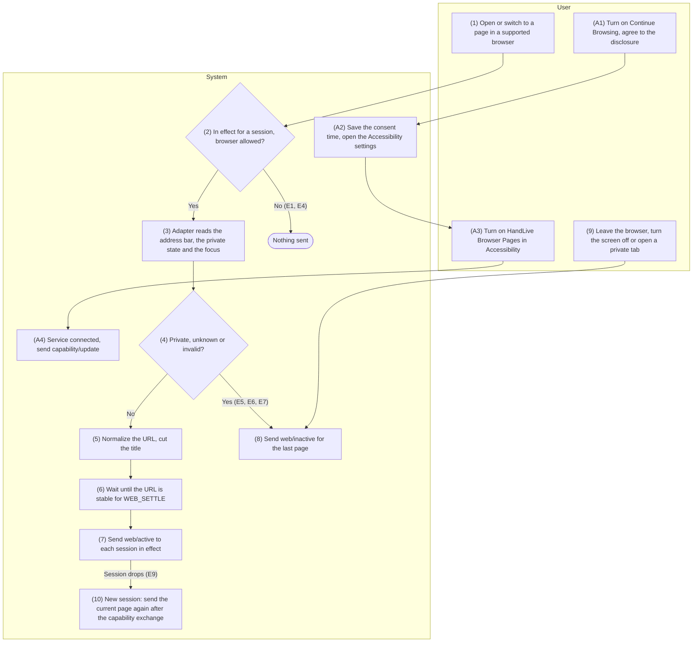
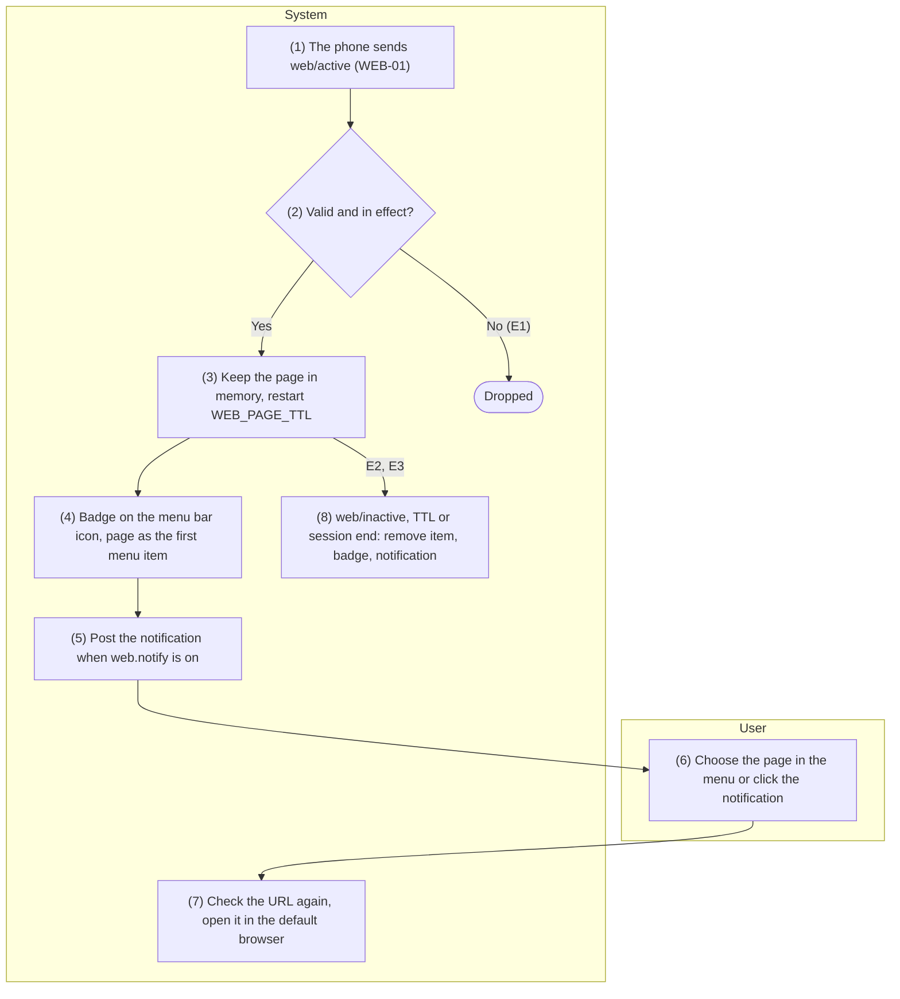
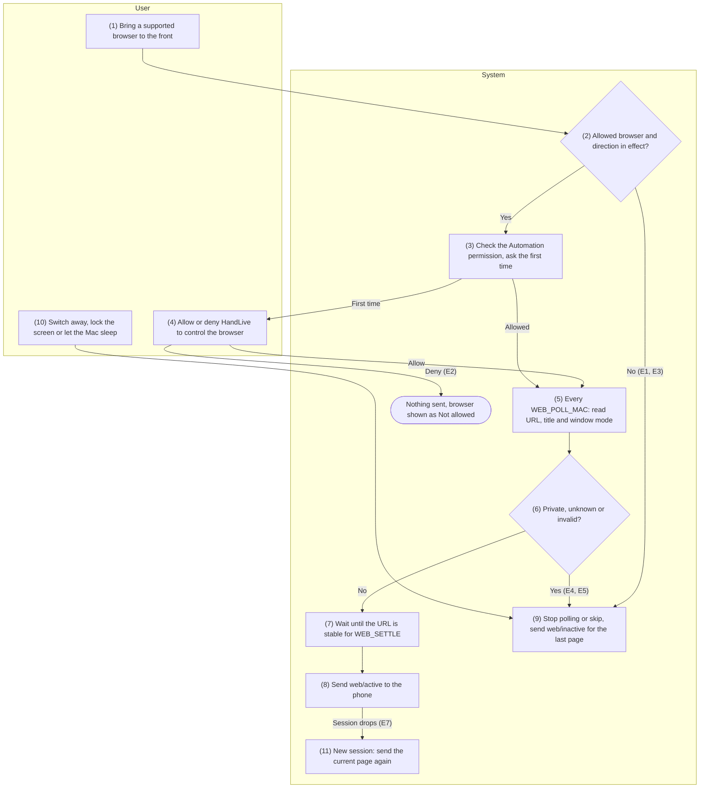
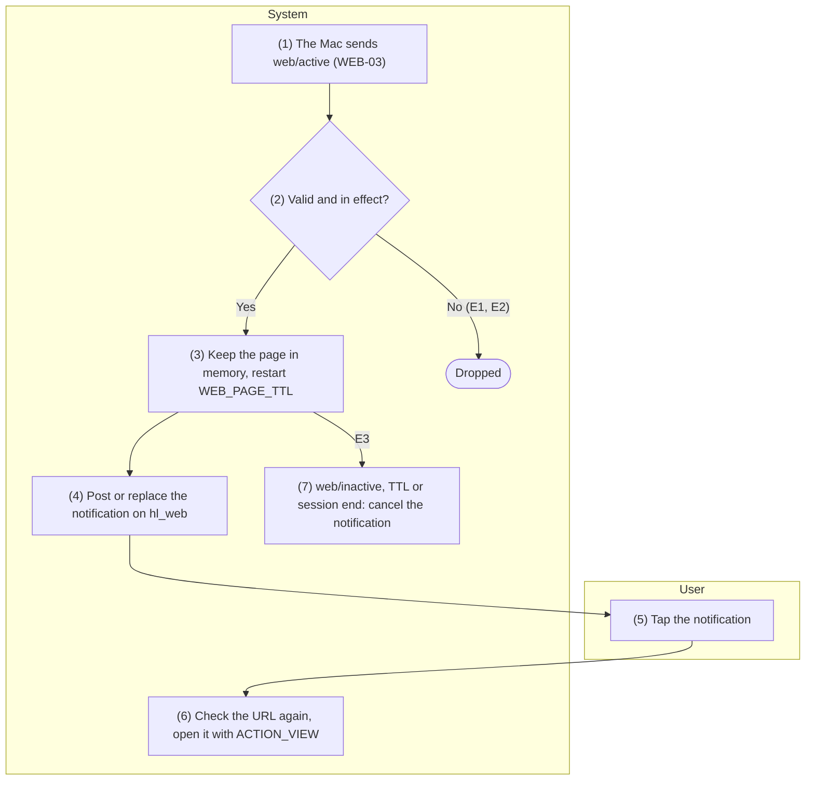
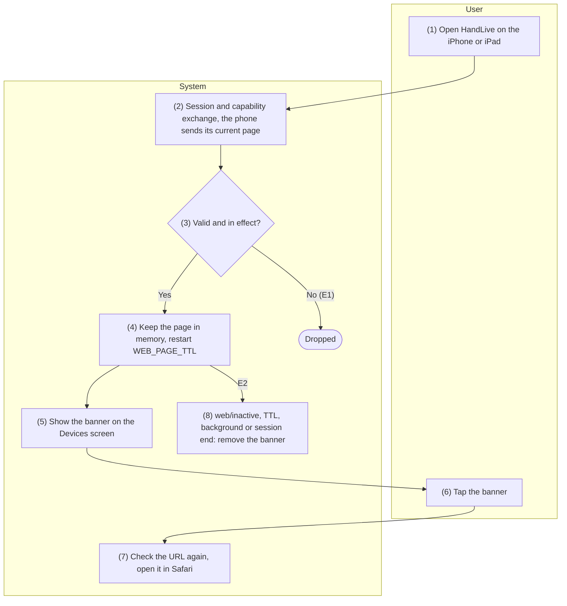

English | [Tiếng Việt](09-web-handoff.vi.md)

# 9. Function group: Continue Browsing

> Common references: [`00-common-specs.md`](00-common-specs.md) — components A-WEB, A-SVC, M-APP,
> I-APP (0.1), identifier `page_id` (0.2), data types (0.3), envelope (0.5.1), security principles
> (0.6.5), message type `web` (0.7.1), browser ids (0.7.1), capability `features.web` (0.7.2), settings
> keys `feature.web`, `web.send`, `web.notify`, `web.browsers` (0.9.5), constants `WEB_SETTLE`,
> `WEB_POLL_MAC`, `WEB_PAGE_TTL`, `WEB_URL_MAX`, `WEB_TITLE_MAX` (0.10). Decision applied: README §5 C21.
> Source: `plans/20260928-web-handoff/plan.md` (W1–W9).
>
> **Phase P6, not built yet.** Every leaf function in this group depends on gate **G6** (the spike,
> plan W8): the browser adapters, the detection of private windows and the list of supported
> browsers are confirmed there. Browsers the spike rejects are listed in this file before any other
> Phase 6 card starts.
>
> Group-wide rules — leaf functions refer to them by QW code:
> - **QW1 — Name and directions.** The UI name is "Continue Browsing"; the Apple term "Handoff" never
>   appears in the UI. Directions: Android → Mac (WEB-01, WEB-02), Android → iPhone/iPad (WEB-01,
>   WEB-05, only while the app is open), Mac → Android (WEB-03, WEB-04). iPhone/iPad never send: no API
>   reads Safari's open tab (a Share Extension is a later option, README §4). Android never forwards a
>   page received from a Mac to other clients. No push: the open page is live state.
> - **QW2 — In effect per direction.** A direction is in effect for a session when the sender has
>   `features.web.enabled` and `send`, and the receiver has `features.web.enabled` and `receive`, per
>   the latest capability of each side (0.7.2). Mapping of the settings keys: SET-02 API 1.
> - **QW3 — Latest wins, no `ack`.** `web/active` and `web/inactive` are events without an `ack`, like
>   `call_event/state`. The sender sends only when the page changes, and re-sends its current
>   `web/active` once, right after a new session has finished exchanging capabilities. Nothing is
>   queued while there is no session.
> - **QW4 — Never stored.** The receiver keeps only the latest page of each pair, in memory. It
>   forgets it on `web/inactive` for that `page_id`, after `WEB_PAGE_TTL` (10 minutes) without a new
>   `web/active`, when the session ends, and when the feature stops being in effect. No page is written
>   to a database, a file or a log (logs hold only `type`, `op`, `browser` and the size); the relay
>   sees only `type = web`.
> - **QW5 — Private pages are never sent.** A page in an incognito or private tab or window, a window
>   with `FLAG_SECURE`, or a page whose private state cannot be determined is never sent; the sender
>   sends `web/inactive` for the page it last sent instead. The user can exclude browsers
>   (`web.browsers`).
> - **QW6 — Settle.** The sender sends a page only after its URL has stayed the same for
>   `WEB_SETTLE` (1.5 s), and never while the user is typing in the address bar.
> - **QW7 — Safe display and opening.** Every receiver shows the host in full; a host label that mixes
>   scripts (for example Latin with Cyrillic) is shown in its ASCII (punycode) form, as a homograph
>   defense. Only `http` and `https` URLs are opened, and only when the user clicks or taps: nothing
>   ever opens automatically.
> - **QW8 — Validation.** An invalid `web/*` payload (0.7.1 rules, API 1 of WEB-01) is dropped silently;
>   debug builds count the drops in the bench log. There is no error code on the wire.
> - **QW9 — Isolation.** Errors in this group never stop A-SVC, never close the `/v1/ctl` session and
>   never affect other features.

## 9.1 WEB-01 — Send the open page from Android

### 9.1.1 General information

| Item | Content |
|-----|----------|
| Name | WEB-01 — Send the open page from Android |
| Description | While a supported browser is in the foreground on the phone, a separate Accessibility service, "HandLive Browser Pages" (A-WEB), reads the address bar of that browser through a per-browser adapter, turns its text into a URL and, once the URL has settled (QW6), sends `web/active` to every client for which the direction is in effect: Macs (WEB-02) and iPhone/iPad (WEB-05).<br>When the browser leaves the foreground, the screen turns off or the page becomes private, A-WEB sends `web/inactive`.<br>Turning the feature on runs a prominent disclosure, then the user turns the service on in Settings › Accessibility (SET-01 part B). `web/active` and `web/inactive` are defined here and shared by WEB-02…05. |
| Actors | Primary: User (browses on the phone). System: A-WEB (`BrowserPagesAccessibilityService`, browser adapters), A-SVC, A-UI, OS (Accessibility framework, the browser app). |
| Preconditions | 1.<br>A valid pair (PAIR-01) and a `/v1/ctl` session (CONN-01 or CONN-03).<br>2.<br>`feature.web = true` and `web.send = true` on the phone, the disclosure accepted (`web.a11y_consent_at` set) and the "HandLive Browser Pages" service turned on.<br>3.<br>The client reports `features.web.enabled = true` and `receive = true` (QW2).<br>4. Gate G6 passed for the browser in use. |
| Postconditions | Every client in effect holds the page open on the phone within `WEB_SETTLE` plus the transfer time, or no page when the phone shows nothing that may be sent.<br>Nothing is written to disk. |
| Exceptions | E1 — The direction is not in effect for any session (feature off on either side, `web.send = false`, the client's `receive = false`, no session): A-WEB ignores the events and reads nothing.<br>E2 — Disclosure declined ("Not Now"): `feature.web` stays `false`; nothing else changes.<br>E3 — The service is not turned on, or Android 13+ blocks it as a "Restricted setting" (install from outside Google Play): as SET-01 E7 and E8; the feature card shows "Browser pages aren't on yet".<br>E4 — The browser is not supported or is excluded in `web.browsers`: its events are ignored; if the last page sent came from another browser, `web/inactive` is sent for it when this browser comes to the foreground.<br>E5 — The adapter cannot find the address bar (a browser update changed its views): nothing is sent, `web/inactive` for the last page; debug builds log the browser and its version.<br>E6 — The page is private or its private state is unknown (QW5): `web/inactive` for the last page, never `web/active`.<br>E7 — The text is not a valid `http` or `https` URL, or is longer than `WEB_URL_MAX`: not sent, `web/inactive` for the last page.<br>E8 — The address bar has focus (the user is typing): wait; the settle timer starts again when the focus leaves.<br>E9 — The session drops: nothing is queued; after the next capability exchange the current page is sent again if the browser is still in the foreground (QW3).<br>E10 — Google Play refuses the Accessibility declaration for this use: the feature is left out of the Play build and stays in the F-Droid and APK builds (the SMS fallback, plan W3). |
| Special requirements | **Privacy:** QW4, QW5; the disclosure names exactly what is read; the URL and the title are never logged; the service receives events only from the supported browsers (`android:packageNames`).<br>**Battery:** event types `TYPE_WINDOW_STATE_CHANGED` and `TYPE_WINDOW_CONTENT_CHANGED` only, `notificationTimeout` ≥ 500 ms, the node tree is read only while a session is in effect; the cost is measured in G6.<br>**Compliance:** Accessibility used for a purpose other than helping users with disabilities needs a prominent in-app disclosure with consent and the Play Console declaration (`isAccessibilityTool = false`); the feature is off by default (`feature.web = false`).<br>**Separation:** the clipboard service keeps `canRetrieveWindowContent = false` (CLIP-01); only this service reads window content.<br>**Accessibility:** the disclosure and the settings rows are readable with TalkBack. |

### 9.1.2 Screens

N/A — no approved wireframe yet.

### 9.1.3 Component details

| # | Field | Data type | Input/Output | Initial value | Description |
|---|--------|--------------|--------------|------------------|-------|
| 1 | "Continue Browsing" switch | bool | Input/Output | `feature.web` = `false` | Android, Settings (SET-02 field 34). Turning it on the first time runs the disclosure (fields 2–4), then the Accessibility settings |
| 2 | Disclosure title | string | Output | "Continue Browsing on Your Other Devices" | Full screen, like the clipboard disclosure (CLIP-01 field 2) |
| 3 | Disclosure text | string | Output | Fixed text per version | "HandLive uses a separate Accessibility service, HandLive Browser Pages, only to read the address and title of the page open in supported browsers, then sends them (end-to-end encrypted) to your paired Mac, iPhone, and iPad.<br>The service receives events only from those browsers. It never reads other apps or what you type, and never sends pages from incognito or private tabs. Addresses are never stored.<br>You can turn this off at any time." |
| 4 | Disclosure choice | enum{Agree\| Not Now} | Input | — | "Agree" → save `web.a11y_consent_at`, open the Accessibility settings; "Not Now" → E2 |
| 5 | Accessibility service name and summary | string | Output | "HandLive Browser Pages" | Shown by Android in Settings › Accessibility; summary "Reads the address of the page open in supported browsers so you can continue on your Mac, iPhone, or iPad." |
| 6 | "Continue Browsing" feature card | enum{on\| off\| needs_accessibility} | Output | `needs_accessibility` | In the feature list (SET-01 field 10): `on` "On", `off` "Off", `needs_accessibility` "Browser pages aren't on yet" with the "Grant Permission" button (SET-01 field 11) |
| 7 | "Send Pages from This Phone" switch | bool | Input/Output | `web.send` = `true` | SET-02 field 35; off → `features.web.send = false`, `web/inactive` for the last page |
| 8 | Browser list | set\<enum> | Input/Output | `web.browsers` = every supported browser | SET-02 field 37: one switch per supported browser (names from 0.7.1, not translated); unsupported browsers are not listed |

### 9.1.4 Business flow



| Step | Actor | Component | Description | Exceptions / Notes |
|------|----------|-----------|-------|--------------------|
| A1 | User | A-UI | Turns on "Continue Browsing" (field 1), reads the disclosure (fields 2, 3) and chooses "Agree" (field 4). | "Not Now" → E2. |
| A2 | System | A-UI | Writes `feature.web = true` and `web.a11y_consent_at`; Android 13+ with an install source other than Google Play → shows the restricted setting instructions (SET-01 field 14); opens `ACTION_ACCESSIBILITY_SETTINGS` (API 3). | E3. |
| A3 | User | OS | Selects "HandLive Browser Pages" (field 5), turns it on, confirms the system dialog, comes back. | Not turned on → E3. |
| A4 | System | A-WEB, A-SVC | `onServiceConnected` → `features.web.send` becomes `true` (when `web.send = true`); A-SVC sends `capability/update` (SET-02 API 1) to every session. `onUnbind` → `send = false`, update again. |  |
| 1 | User | OS (browser) | Opens a page, switches tabs, or brings the browser back to the foreground. |  |
| 2 | System | A-WEB | Receives a window event from a package in `android:packageNames` (API 3). Checks that at least one session has the direction in effect (QW2) and that the browser's id is in `web.browsers`. | No → E1, E4. |
| 3 | System | A-WEB | The adapter of that browser (API 4) finds the address bar node, reads its text and focus, determines whether the tab or window is private, and reads the title when the browser exposes it. | Node not found → E5. Focused → E8. |
| 4 | System | A-WEB | Private, unknown, `FLAG_SECURE`, not `http`/`https`, or longer than `WEB_URL_MAX` → step 8. | E5, E6, E7. |
| 5 | System | A-WEB | Normalizes (API 4, logic 3): adds `https://` when the bar shows only the host; keeps the fragment; cuts the title to `WEB_TITLE_MAX` characters; empty title → absent. |  |
| 6 | System | A-WEB | Starts or restarts the `WEB_SETTLE` timer on every change of the normalized URL; the timer fires only when the URL has not changed and the bar has no focus. |  |
| 7 | System | A-SVC | Builds `web/active` (API 1): a new `page_id` when the URL differs from the last one sent, the same `page_id` when only the title changed; sends it to every session in effect. Nothing is sent when the URL and the title equal the last ones sent. |  |
| 8 | System | A-SVC | Sends `web/inactive` (API 2) for the last `page_id` sent, once, to every session that received it; forgets that page. | Nothing sent before → nothing to do. |
| 9 | User | OS | Switches to another app, turns the screen off, or opens a private tab. | Detection: API 3 logic 4, API 5. |
| 10 | System | A-SVC | When a new session finishes the capability exchange and the direction is in effect: sends the current `web/active` again (same `page_id`) if a page is still active. | E9. |

### 9.1.5 API/service specification

**List of calls**

| # | API/service | Channel | Direction | Used in steps |
|---|-------------|------|-------|-------------|
| 1 | `WS web/active` | `/v1/ctl` (LAN or relay) | Both ways (S→C here) | 7, 10 |
| 2 | `WS web/inactive` | `/v1/ctl` (LAN or relay) | Both ways (S→C here) | 8 |
| 3 | `BrowserPagesAccessibilityService` (`AccessibilityService`, `onAccessibilityEvent`) and `Settings.ACTION_ACCESSIBILITY_SETTINGS` | Local (Android) | OS → A-WEB | A2–A4, 2, 3, 9 |
| 4 | Browser adapters (`BrowserAdapter`, one per browser) | Local (Android) | A-WEB | 3, 4, 5 |
| 5 | Broadcast `Intent.ACTION_SCREEN_OFF` (receiver registered at runtime) | Local (Android) | OS → A-SVC | 9 |
| 6 | `WS capability/update` (specified in SET-02 API 1) | `/v1/ctl` | S→C | A4 |

#### API 1 — `WS web/active`

- **URL:** `wss://{android_host}:{port}/v1/ctl` (LAN) or via the relay `wss://{RELAY_HOST}/v1/relay`
  with the `to`/`from` wrapper
- **Method:** `WS web/active`, encrypted envelope, no ack (0.7.1). Android sends it to clients
  (WEB-01); the Mac sends it to Android (WEB-03). iPhone/iPad never send it.
- **Request (`data`):**

| Field | Type | Required | Description |
|--------|------|----------|-------|
| `page_id` | uuid | Yes | UUIDv7, new for each page (a new URL); the same while only the title changes and when the page is sent again after a reconnect |
| `url` | string | Yes | The page's URL as the browser shows it, fragment kept; scheme `http` or `https` only; at most `WEB_URL_MAX` (8 KiB) of UTF-8 |
| `title` | string(256) | No | The page title, at most `WEB_TITLE_MAX` characters; absent when the browser does not expose it or it is empty |
| `browser` | enum | Yes | Browser id from the list in 0.7.1 (`chrome`, `samsung`, `firefox`, `edge`, `brave`, `opera`, `vivaldi`, `duckduckgo`, `safari`, `arc`, `other`) |
| `observed_at` | timestamp | Yes | When the sender read the URL that settled (sender clock) |

- **Response:** N/A (no ack; a client that missed a message receives the current page after its next
  capability exchange — QW3).
- **Example:**

```json
{"op":"active","data":{"page_id":"0192f4a0-1b2c-7d3e-8f40-5a6b7c8d9e0f","url":"https://en.wikipedia.org/wiki/Handoff#History","title":"Handoff - Wikipedia","browser":"chrome","observed_at":1727150400123}}
```

- **Business logic:**
  1. **Sender:** sends only per QW2, QW5, QW6; never re-sends an identical `data` (except once after
     a new capability exchange, QW3).
  2. **Receiver validation** (QW8) — drop the message silently when: `url` does not parse, its scheme
     is not `http` or `https`, it has no host, or it is longer than `WEB_URL_MAX`; `title` is longer than
     `WEB_TITLE_MAX`; `page_id` is not a uuid; the direction is not in effect for the session. An unknown
     `browser` value is treated as `other` (0.5.1 rule 6).
  3. **Latest wins:** per pair, the receiver keeps the message with the largest `observed_at` and drops
     an older one; the stored page is replaced as a whole.
  4. **Lifetime:** QW4; the `WEB_PAGE_TTL` timer restarts with every accepted `web/active`.
  5. Never log `url` or `title`.

#### API 2 — `WS web/inactive`

- **URL:** as API 1
- **Method:** `WS web/inactive`, encrypted envelope, no ack (0.7.1); same directions as API 1.
- **Request (`data`):**

| Field | Type | Required | Description |
|--------|------|----------|-------|
| `page_id` | uuid | Yes | The page that is no longer open in the foreground |

- **Response:** N/A.
- **Example:**

```json
{"op":"inactive","data":{"page_id":"0192f4a0-1b2c-7d3e-8f40-5a6b7c8d9e0f"}}
```

- **Business logic:**
  1. Sent when the browser leaves the foreground, the screen turns off or locks, the device sleeps,
     the page becomes private or unsupported, the user excludes the browser, or `web.send` is turned
     off.
  2. The receiver removes its stored page only when `page_id` matches; otherwise it ignores the
     message.

#### API 3 — `BrowserPagesAccessibilityService`

- **URL:** N/A
- **Method:** `AccessibilityService.onAccessibilityEvent(event)`, `onServiceConnected()`,
  `onUnbind()`, `getRootInActiveWindow()`; settings opened with
  `startActivity(Intent(Settings.ACTION_ACCESSIBILITY_SETTINGS))`.
- **Request — declaration:**
  `<service android:name=".BrowserPagesAccessibilityService" android:permission="android.permission.BIND_ACCESSIBILITY_SERVICE" android:exported="false">`
  with the intent filter `android.accessibilityservice.AccessibilityService` and the configuration
  `@xml/a11y_browser_pages`:

| Attribute | Value |
|-----------|-------|
| `android:canRetrieveWindowContent` | `true` (the clipboard service keeps `false`) |
| `android:packageNames` | The packages of the supported browsers (API 4) only |
| `android:accessibilityEventTypes` | `typeWindowStateChanged\|typeWindowContentChanged` |
| `android:notificationTimeout` | ≥ 500 |
| `android:isAccessibilityTool` | `false` |
| `android:description` | Field 5 summary |

- **Response:** events of the listed packages only.
- **Example:** Chrome comes to the foreground with a tab open → `TYPE_WINDOW_STATE_CHANGED` from
  `com.android.chrome` → the Chrome adapter reads the address bar.
- **Business logic:**
  1. Open the Accessibility settings only after `web.a11y_consent_at` is set; the restricted setting
     instructions follow SET-01 API 6 logic 2.
  2. While no session has the direction in effect (E1), return from `onAccessibilityEvent` without
     reading any node.
  3. `feature.web` or `web.send` turned off → `web/inactive` for the last page; `feature.web` off → the
     service calls `disableSelf()` to give the permission back (as SET-01 API 6 logic 5).
  4. **Leaving the foreground:** with the package filter the service does not see other apps' events;
     how it learns that the browser left the foreground (for example the package of
     `getRootInActiveWindow()` at the next event) is settled in the G6 spike. Required result: step 8
     runs within `WEB_SETTLE` after the browser leaves the foreground.
  5. An app update that widens what the disclosure covers deletes `web.a11y_consent_at` so consent is
     asked again.

#### API 4 — Browser adapters

- **URL:** N/A
- **Method:** interface `BrowserAdapter` (strategy pattern, like the OEM Bluetooth adapters):
  `id` (browser id, 0.7.1), `packageName`, `read(root): BrowserPage?` returning
  `{rawUrlText, title?, urlBarFocused, privateState ∈ {normal, private, unknown}}`.
- **Request:** the root node of the browser window and the event. Candidate packages (confirmed in
  G6):

| Browser id | Package | G6 tests |
|------------|---------|----------|
| `chrome` | `com.android.chrome` | Yes |
| `samsung` | `com.sec.android.app.sbrowser` | Yes |
| `firefox` | `org.mozilla.firefox` | Yes |
| `edge` | `com.microsoft.emmx` | Yes |
| `brave` | `com.brave.browser` | Yes |
| `opera` | `com.opera.browser` | Later |
| `vivaldi` | `com.vivaldi.browser` | Later |
| `duckduckgo` | `com.duckduckgo.mobile.android` | Later |

- **Response:** a `BrowserPage` or `null` (address bar not found, E5).
- **Example:** Chrome shows `en.wikipedia.org/wiki/Handoff` in the bar → `rawUrlText` of that text,
  `privateState = normal` → URL `https://en.wikipedia.org/wiki/Handoff`.
- **Business logic:**
  1. **Address bar:** the view id per browser version (from the G6 table); fallback: the `EditText` of
     the browser toolbar.
  2. **Private state:** Chrome, Edge and Brave from the incognito toolbar state, Samsung Internet from
     secret mode, Firefox from its private mode, any window with `FLAG_SECURE`; whatever cannot be
     determined is `unknown` and is not sent (QW5).
  3. **Normalization:** text without a scheme that parses as a host (with an optional path) → add
     `https://`; anything that does not parse as an `http` or `https` URL is dropped (E7); the fragment
     is kept.
  4. Only packages whose adapter passed G6 are in `android:packageNames` and in the browser list
     (field 8).

#### API 5 — Broadcast `Intent.ACTION_SCREEN_OFF`

- **URL:** N/A
- **Method:** `Context.registerReceiver(receiver, IntentFilter(Intent.ACTION_SCREEN_OFF))` in A-SVC
  while `feature.web = true`.
- **Request:** N/A.
- **Response:** the intent, when the screen turns off.
- **Example:** the user presses the power button while Chrome shows a page → `web/inactive`.
- **Business logic:** screen off → step 8; the page is sent again only after the browser shows it
  again in the foreground and the URL settles.

#### API 6 — `WS capability/update`

Specified in SET-02 API 1. In WEB-01, Android sends it when the service connects or disconnects and
when `feature.web`, `web.send` or `web.notify` changes.

#### Query

N/A — no database: the last page sent lives only in A-SVC memory (QW4). DataStore keys read:

```text
# [Design] Android DataStore<Preferences> (A-UI, A-WEB)
prefs[booleanPreferencesKey("feature.web")] ?: false                        # step 2
prefs[booleanPreferencesKey("web.send")] ?: true                           # step 2
prefs[stringSetPreferencesKey("web.browsers")] ?: allSupportedBrowserIds   # step 2
dataStore.edit { it[longPreferencesKey("web.a11y_consent_at")] = now }       # A2
```

---

## 9.2 WEB-02 — Show the phone's page on the Mac

### 9.2.1 General information

| Item | Content |
|-----|----------|
| Name | WEB-02 — Show the phone's page on the Mac |
| Description | When the Mac receives `web/active` from the phone (WEB-01), the menu bar icon switches to its badge variant and the menu's first item becomes "\<title or host> — from \<phone>" with the browser's glyph; choosing it opens the URL in the Mac's default browser.<br>With `web.notify = true`, a notification is posted too.<br>The item, the badge and the notification disappear on `web/inactive`, after `WEB_PAGE_TTL`, or when the session ends (QW4). |
| Actors | Primary: User (continues reading on the Mac). System: M-APP, A-SVC (sender), OS (`NSWorkspace`, `UNUserNotificationCenter`). |
| Preconditions | 1.<br>A valid pair and a session to the phone.<br>2.<br>`feature.web = true` on the Mac (`features.web.receive = true`) and the Android → Mac direction in effect (QW2). |
| Postconditions | The menu shows the phone's latest page while it is valid; opening it hands the URL to the default browser. Nothing is written to disk. |
| Exceptions | E1 — Invalid payload or direction not in effect: dropped silently (QW8).<br>E2 — No `web/active` for `WEB_PAGE_TTL`: the item, the badge and the notification are removed.<br>E3 — The session ends (connection lost, unpaired, the feature turned off on either side): the same.<br>E4 — Notifications not allowed on the Mac, or `web.notify = false`: only the menu item and the badge.<br>E5 — The URL fails the checks again when the user opens it (QW7): nothing opens; the item is removed.<br>E6 — `NSWorkspace.open` returns `false` (no app handles the URL): the item stays; macOS shows its own message, if any. |
| Special requirements | **Privacy:** QW4; the notification (when on) shows only the title and the host.<br>**Security:** QW7; the URL opened is exactly the received `url`, never a URL rebuilt from the displayed text.<br>**Accessibility:** VoiceOver reads the item as "Page from \<phone>: \<title or host>"; the badge variant has the accessibility label "HandLive, page from your phone available". |

### 9.2.2 Screens

N/A — no approved wireframe yet.

### 9.2.3 Component details

| # | Field | Data type | Input/Output | Initial value | Description |
|---|--------|--------------|--------------|------------------|-------|
| 1 | Menu bar icon badge variant | bool | Output | Off | On while a page from the phone is kept; the status icon of CONN-01 field 1 in its badge variant (design system `MenuBarMenu`) |
| 2 | Page menu item | string | Output | Hidden | First item of the menu: "\<title or host> — from \<phone>", the browser glyph as its image; keyboard shortcut ⌘O while the menu is open |
| 3 | Host line | string | Output | Hidden | The host in full, under the title (menu item subtitle; a second, disabled line where the system has no subtitle); punycode per QW7. Hidden when field 2 already shows the host |
| 4 | Notification | string | Output | Not posted | Only with `web.notify = true`: title "\<title or host>", body "\<host> — from \<phone>"; clicking it opens the page; replaced by the next page, removed with the item |
| 5 | "Page Notifications" option | bool | Input/Output | `web.notify` = `false` | Mac Settings (SET-02 field 36) |

### 9.2.4 Business flow



| Step | Actor | Component | Description | Exceptions / Notes |
|------|----------|-----------|-------|--------------------|
| 1 | System | A-SVC | The phone sends `web/active` (WEB-01 API 1). |  |
| 2 | System | M-APP | Validates per WEB-01 API 1 logic 2 and checks that the direction is in effect. | E1. |
| 3 | System | M-APP | Replaces the stored page of the pair (older `observed_at` → drop), restarts the `WEB_PAGE_TTL` timer. |  |
| 4 | System | M-APP | Shows fields 1–3. |  |
| 5 | System | M-APP | `web.notify = true` and notifications allowed → posts field 4 (API 2), replacing the previous one. | E4. |
| 6 | User | M-APP | Chooses the item (field 2, or ⌘O while the menu is open) or clicks the notification. |  |
| 7 | System | M-APP, OS | Checks the URL again (QW7) and calls `NSWorkspace.shared.open(url)` (API 1). The page stays in the menu until it ends. | E5, E6. |
| 8 | System | M-APP | `web/inactive` with the stored `page_id`, TTL expired or session ended → removes fields 1–4. | E2, E3. |

### 9.2.5 API/service specification

**List of calls**

| # | API/service | Channel | Direction | Used in steps |
|---|-------------|------|-------|-------------|
| 1 | `NSWorkspace.shared.open(_:)` | Local (Mac) | M-APP → OS | 7 |
| 2 | `UNUserNotificationCenter.add(_:)`, `removeDeliveredNotifications(withIdentifiers:)` | Local (Mac) | M-APP → OS | 5, 8 |
| 3 | `WS web/active`, `WS web/inactive` (specified in WEB-01 API 1, API 2) | `/v1/ctl` | S→C | 1, 8 |

#### API 1 — `NSWorkspace.shared.open(_:)`

- **URL:** N/A
- **Method:** `NSWorkspace.shared.open(url)`
- **Request:** the stored `url` as a `URL`, after the QW7 checks.
- **Response:** `Bool` — `false` → E6.
- **Example:** `https://en.wikipedia.org/wiki/Handoff#History` opens in Safari when Safari is the
  default browser.
- **Business logic:** only `http`/`https`; never called without a click (QW7).

#### API 2 — Page notification on the Mac

- **URL:** N/A
- **Method:** `UNUserNotificationCenter.current().add(request)` with the identifier `web:<pair_id>`;
  `removeDeliveredNotifications(withIdentifiers:)` at step 8.
- **Request:** `UNMutableNotificationContent` with field 4, `threadIdentifier = "web"`,
  `interruptionLevel = .passive`, no sound; `userInfo` holds only `page_id`.
- **Response:** N/A.
- **Example:** title "Handoff - Wikipedia", body "en.wikipedia.org — from Pixel 8".
- **Business logic:** a click looks up the stored page by `page_id`; a page that has already ended
  opens nothing (the notification is removed).

#### API 3 — `WS web/active`, `WS web/inactive`

Specified in WEB-01 API 1 and API 2.

#### Query

N/A — the page lives only in M-APP memory (QW4); `web.notify` is read from `UserDefaults.standard`.

---

## 9.3 WEB-03 — Send the open page from the Mac

### 9.3.1 General information

| Item | Content |
|-----|----------|
| Name | WEB-03 — Send the open page from the Mac |
| Description | While a supported browser is the frontmost app and the user session is active, M-APP reads the front window's active tab (URL, title, window mode) through Apple Events every `WEB_POLL_MAC` (1.5 s) and, once the URL has settled (QW6), sends `web/active` to the phone (WEB-04).<br>When the browser stops being frontmost, the screen locks or the Mac sleeps, M-APP stops polling and sends `web/inactive`.<br>Each browser asks the user once for the Automation permission; a denied browser shows "Not allowed" in Settings with a button to System Settings. |
| Actors | Primary: User (browses on the Mac). System: M-APP, OS (`NSWorkspace`, Apple Events, TCC), the browser app, A-SVC (receiver). |
| Preconditions | 1.<br>A valid pair and a session to the phone.<br>2.<br>`feature.web = true` and `web.send = true` on the Mac; the phone reports `features.web.enabled = true` and `receive = true` (QW2).<br>3. Gate G6 passed for the browser in use. |
| Postconditions | The phone holds the page open on the Mac, or no page when the Mac shows nothing that may be sent. Polling runs only while it is needed. Nothing is written to disk. |
| Exceptions | E1 — The direction is not in effect (feature off on either side, `web.send = false`, the phone's `receive = false`, no session): no polling at all.<br>E2 — Automation denied for the browser (`errAEEventNotPermitted`, -1743): nothing is sent for it; Settings shows "Not allowed" and "Open System Settings" (field 3).<br>E3 — The browser is not supported (Firefox has no URL scripting, other browsers) or is excluded in `web.browsers`: ignored; `web/inactive` for the last page when it comes to the front.<br>E4 — Private window (Chromium `mode` is `incognito`) or a mode that cannot be determined (Safari until G6 settles it): `web/inactive` for the last page, never `web/active` (QW5).<br>E5 — Not an `http`/`https` URL, or longer than `WEB_URL_MAX`: not sent, `web/inactive` for the last page.<br>E6 — The script fails or takes longer than 1 s (the browser is busy, no window is open): this poll is skipped; nothing is sent.<br>E7 — The session drops: nothing is queued; the current page is sent again after the next capability exchange if the browser is still frontmost (QW3). |
| Special requirements | **Platform:** `NSAppleEventsUsageDescription` in Info.plist; hardened runtime entitlement `com.apple.security.automation.apple-events`; the TCC behavior of a Developer ID signed build is checked in G6.<br>**Performance:** polling only while a supported browser is frontmost, the user session is active and the direction is in effect; scripts run off the main thread.<br>**Privacy:** QW4, QW5; the URL and the title are never logged. |

### 9.3.2 Screens

N/A — no approved wireframe yet.

### 9.3.3 Component details

| # | Field | Data type | Input/Output | Initial value | Description |
|---|--------|--------------|--------------|------------------|-------|
| 1 | "Send Pages from This Mac" switch | bool | Input/Output | `web.send` = `true` | Mac Settings (SET-02 field 35); shown under "Continue Browsing" (SET-02 field 34) |
| 2 | Browser list | set\<enum> | Input/Output | `web.browsers` = every supported browser | SET-02 field 37: one checkbox per supported browser installed on the Mac, with its status (field 3) |
| 3 | Automation status of a browser | enum{allowed\| not_allowed\| not_asked} | Output | `not_asked` | `not_allowed` shows "Not allowed" and the "Open System Settings" button, which opens System Settings › Privacy & Security › Automation; `not_asked` shows nothing |
| 4 | Automation purpose string | string | Output | Fixed text | `NSAppleEventsUsageDescription`: "HandLive reads the address of the page open in your browser so you can continue on your phone." |

### 9.3.4 Business flow



| Step | Actor | Component | Description | Exceptions / Notes |
|------|----------|-----------|-------|--------------------|
| 1 | User | OS | Activates a browser (click, ⌘Tab, a new window). |  |
| 2 | System | M-APP | `NSWorkspace.didActivateApplicationNotification` (API 2) → the bundle id is supported (API 1 table) and in `web.browsers`, `web.send = true`, and the phone's `receive = true`. | No → E1, E3; `web/inactive` if a page from another browser was active. |
| 3 | System | M-APP, OS | `AEDeterminePermissionToAutomateTarget` (API 3): allowed → step 5; not asked yet → ask (`askUserIfNeeded = true`), which shows the TCC prompt with field 4; denied → E2. |  |
| 4 | User | OS | Chooses "Allow" or "Don't Allow" in the system prompt (once per browser). | Deny → E2. |
| 5 | System | M-APP | Starts a timer: every `WEB_POLL_MAC` runs the browser's script (API 1) on a background queue and reads `{url, title, mode}`. | E6. |
| 6 | System | M-APP | Private or unknown mode, a scheme other than `http`/`https`, or longer than `WEB_URL_MAX` → step 9. | E4, E5. |
| 7 | System | M-APP | Restarts the `WEB_SETTLE` timer on every URL change; cuts the title to `WEB_TITLE_MAX`. |  |
| 8 | System | M-APP | Sends `web/active` (WEB-01 API 1, `browser` from the API 1 table) with the `page_id` rules of WEB-01 step 7. |  |
| 9 | System | M-APP | Sends `web/inactive` for the last page sent (once); stops the timer when the browser is no longer frontmost or the direction is no longer in effect. |  |
| 10 | User | OS | Activates another app, locks the screen, or the Mac sleeps or switches user. | API 2. |
| 11 | System | M-APP | After a new session's capability exchange: sends the current `web/active` again when a browser is still frontmost with an active page. | E7. |

### 9.3.5 API/service specification

**List of calls**

| # | API/service | Channel | Direction | Used in steps |
|---|-------------|------|-------|-------------|
| 1 | Apple Events scripts per browser (`NSAppleScript`) | Local (Mac) | M-APP → browser | 5 |
| 2 | `NSWorkspace` notifications and the screen lock notifications | Local (Mac) | OS → M-APP | 2, 9, 10 |
| 3 | `AEDeterminePermissionToAutomateTarget` | Local (Mac) | M-APP → OS (TCC) | 3 |
| 4 | `WS web/active`, `WS web/inactive` (specified in WEB-01 API 1, API 2) | `/v1/ctl` | C→S | 8, 9, 11 |

#### API 1 — Apple Events scripts per browser

- **URL:** N/A
- **Method:** `NSAppleScript(source:)` compiled once per browser, `executeAndReturnError(_:)` on a
  serial background queue, 1 s time limit (E6).
- **Request:** one script per browser family:

| Browser id | Bundle id | Script (front window) | Private mode |
|------------|-----------|------------------------|--------------|
| `safari` | `com.apple.Safari` | `URL` and `name` of `current tab of front window` | To be detected in G6; until then `unknown` (E4) |
| `chrome` | `com.google.Chrome` | `URL` and `title` of `active tab of front window` | `mode of front window` = `incognito` |
| `edge` | `com.microsoft.edgemac` | As Chrome | As Chrome |
| `brave` | `com.brave.Browser` | As Chrome | As Chrome |
| `vivaldi` | `com.vivaldi.Vivaldi` | As Chrome | As Chrome |
| `opera` | `com.operasoftware.Opera` | As Chrome | As Chrome |
| `arc` | `company.thebrowser.Browser` | `URL` and `title` of `active tab of front window` | To be checked in G6 |

- **Response:** a list `{url, title, mode}`; an error number → E2 (-1743), E6 (others).
- **Example (Chrome):**
  `tell application id "com.google.Chrome" to get {URL, title} of active tab of front window & mode of front window`
  → `{"https://developer.apple.com/documentation/", "Apple Developer Documentation", "normal"}`.
- **Business logic:**
  1. The script targets the browser by bundle id and runs only while that browser is frontmost, so it
     never launches a browser.
  2. Firefox (`org.mozilla.firefox`) has no URL scripting: unsupported (E3).
  3. Only browsers that pass G6 are listed in field 2.

#### API 2 — Foreground, lock and sleep notifications

- **URL:** N/A
- **Method:** `NSWorkspace.shared.notificationCenter`: `didActivateApplicationNotification`,
  `willSleepNotification`, `didWakeNotification`, `sessionDidResignActiveNotification`,
  `sessionDidBecomeActiveNotification`; `DistributedNotificationCenter`: `com.apple.screenIsLocked`,
  `com.apple.screenIsUnlocked`.
- **Request:** N/A.
- **Response:** the notification and, for activation, the `NSRunningApplication` (bundle id).
- **Example:** the user switches from Safari to Mail → `didActivateApplicationNotification` with
  `com.apple.mail` → step 9.
- **Business logic:** another app activated, sleep, lock or session resigned → step 9; wake,
  unlock or session active with a supported browser frontmost → step 2.

#### API 3 — `AEDeterminePermissionToAutomateTarget`

- **URL:** N/A
- **Method:** `AEDeterminePermissionToAutomateTarget(target, typeWildCard, typeWildCard, askUserIfNeeded)`
  with the browser's bundle id as the target descriptor, called off the main thread.
- **Request:** `askUserIfNeeded = false` to read the status (field 3), `true` at step 3 the first
  time.
- **Response:** `noErr` → allowed; `errAEEventNotPermitted` (-1743) → denied; `errAEEventWouldRequireUserConsent`
  (-1744) → not asked yet.
- **Example:** the user denied Chrome earlier → -1743 → field 3 = `not_allowed`.
- **Business logic:** the prompt is shown only when the user brings that browser to the front with
  `web.send = true`; never at launch for every browser.

#### API 4 — `WS web/active`, `WS web/inactive`

Specified in WEB-01 API 1 and API 2; here the Mac is the sender (C→S).

#### Query

N/A — no database: the last page sent lives only in M-APP memory (QW4). `UserDefaults.standard` keys
read:

```text
# [Design] Mac UserDefaults.standard (M-APP)
UserDefaults.standard.bool(forKey: "feature.web")                  # step 2, registered default false
UserDefaults.standard.bool(forKey: "web.send")                     # step 2, registered default true
UserDefaults.standard.stringArray(forKey: "web.browsers")          # step 2, default every supported id
```

---

## 9.4 WEB-04 — Show the Mac's page on Android

### 9.4.1 General information

| Item | Content |
|-----|----------|
| Name | WEB-04 — Show the Mac's page on Android |
| Description | When the phone receives `web/active` from a Mac (WEB-03), A-SVC posts a silent, low-importance notification on the channel `hl_web` ("Pages from your devices"): the title or the host, and "Open on this phone"; tapping it opens the URL with `ACTION_VIEW`. The notification is replaced by each new page of that Mac and removed on `web/inactive`, after `WEB_PAGE_TTL`, or when the session ends. |
| Actors | Primary: User (continues reading on the phone). System: A-SVC, OS (`NotificationManager`, the default browser). |
| Preconditions | 1.<br>A valid pair and a session with the Mac.<br>2.<br>`feature.web = true` and `web.notify = true` on the phone, notifications allowed (`features.web.receive = true`), and the Mac → Android direction in effect (QW2). |
| Postconditions | The notification shows the Mac's latest page while it is valid; tapping it opens the page in the default browser. Nothing is written to disk. |
| Exceptions | E1 — Invalid payload or direction not in effect: dropped silently (QW8).<br>E2 — `POST_NOTIFICATIONS` denied or the `hl_web` channel blocked by the user: `receive = false` is reported in the capability, so the Mac does not send.<br>E3 — No `web/active` for `WEB_PAGE_TTL`, `web/inactive`, or the session ends: the notification is removed.<br>E4 — No app handles the URL (`ActivityNotFoundException`): nothing opens; a toast "No app can open this page." |
| Special requirements | **Privacy:** QW4; the notification uses `VISIBILITY_PRIVATE` with a public version that shows only "Page from \<Mac>" on the lock screen.<br>**Security:** QW7; the intent carries exactly the received `url`.<br>**Platform:** one notification per Mac (tag `web:<pair_id>`); channel `IMPORTANCE_LOW`, no sound, no vibration.<br>**Accessibility:** TalkBack reads the title, the host and "Open on this phone". |

### 9.4.2 Screens

N/A — no approved wireframe yet.

### 9.4.3 Component details

| # | Field | Data type | Input/Output | Initial value | Description |
|---|--------|--------------|--------------|------------------|-------|
| 1 | Notification title | string | Output | `title`, or the host when absent | Punycode per QW7 when the host is shown |
| 2 | Notification text | string | Output | "Open on this phone" |  |
| 3 | Host | string | Output | The host | Sub-text of the notification (`setSubText`) when field 1 shows the title; hidden when field 1 already shows the host |
| 4 | Notification channel | string | Output | `hl_web` | Name "Pages from your devices", description "The web page open on your Mac, to continue on this phone.", `IMPORTANCE_LOW` |
| 5 | "Page Notifications" option | bool | Input/Output | `web.notify` = `true` | Android Settings (SET-02 field 36); off → `features.web.receive = false` |
| 6 | Lock screen version | string | Output | "Page from \<Mac name>" | Public version of the notification (`setPublicVersion`) |

### 9.4.4 Business flow



| Step | Actor | Component | Description | Exceptions / Notes |
|------|----------|-----------|-------|--------------------|
| 1 | System | M-APP | The Mac sends `web/active` (WEB-01 API 1). |  |
| 2 | System | A-SVC | Validates per WEB-01 API 1 logic 2 and checks the direction for that session. | E1, E2. |
| 3 | System | A-SVC | Replaces the stored page of the pair, restarts the `WEB_PAGE_TTL` timer. |  |
| 4 | System | A-SVC, OS | Posts fields 1–3 and 6 with tag `web:<pair_id>` (API 1), replacing that Mac's previous notification. |  |
| 5 | User | OS | Taps the notification. |  |
| 6 | System | A-SVC, OS | The `PendingIntent` starts `ACTION_VIEW` with the URL directly, without a trampoline (API 2), after the QW7 checks; the notification is dismissed (`setAutoCancel(true)`). | E4. |
| 7 | System | A-SVC | `web/inactive` with the stored `page_id`, TTL or session end → `cancel(tag, id)`. | E3. |

### 9.4.5 API/service specification

**List of calls**

| # | API/service | Channel | Direction | Used in steps |
|---|-------------|------|-------|-------------|
| 1 | `NotificationManagerCompat.notify(tag, id, notification)` on the channel `hl_web` | Local (Android) | A-SVC → OS | 4, 7 |
| 2 | `Intent(Intent.ACTION_VIEW, uri)` with `CATEGORY_BROWSABLE` | Local (Android) | OS → browser | 6 |
| 3 | `WS web/active`, `WS web/inactive` (specified in WEB-01 API 1, API 2) | `/v1/ctl` | C→S | 1, 7 |

#### API 1 — Page notification on Android

- **URL:** N/A
- **Method:** `NotificationManagerCompat.from(context).notify("web:<pair_id>", NOTIF_WEB_ID, notification)`;
  `cancel("web:<pair_id>", NOTIF_WEB_ID)` at step 7.
- **Request:**

| Item | Value |
|-----|---------|
| Channel | id `hl_web`, name and description per field 4, `IMPORTANCE_LOW`, `setShowBadge(false)`; created with the other channels at process start |
| Notification | `CATEGORY_RECOMMENDATION`, `setOnlyAlertOnce(true)`, `setAutoCancel(true)`, `VISIBILITY_PRIVATE` with the public version of field 6, `setTimeoutAfter` = the remaining `WEB_PAGE_TTL` |
| Tap | `PendingIntent.getActivity` (`FLAG_IMMUTABLE`) with the intent of API 2 |

- **Response:** N/A.
- **Example:** title "Apple Developer Documentation", text "Open on this phone", sub-text
  "developer.apple.com".
- **Business logic:** posted only while `web.notify = true` and `NotificationManagerCompat.areNotificationsEnabled()`;
  the channel's importance changed to none by the user → `receive = false` in the next capability.

#### API 2 — `ACTION_VIEW`

- **URL:** N/A
- **Method:** `startActivity(Intent(Intent.ACTION_VIEW, Uri.parse(url)).addCategory(Intent.CATEGORY_BROWSABLE))`
  through the notification's `PendingIntent`.
- **Request:** the stored `url` after the QW7 checks.
- **Response:** the default browser (or the user's chooser) opens the page;
  `ActivityNotFoundException` → E4.
- **Example:** `https://developer.apple.com/documentation/` opens in Chrome.
- **Business logic:** the intent is built when the notification is posted from the validated URL;
  never started without a tap.

#### API 3 — `WS web/active`, `WS web/inactive`

Specified in WEB-01 API 1 and API 2.

#### Query

N/A — the page lives only in A-SVC memory (QW4); `web.notify` is read from DataStore.

---

## 9.5 WEB-05 — Show the phone's page on iPhone/iPad

### 9.5.1 General information

| Item | Content |
|-----|----------|
| Name | WEB-05 — Show the phone's page on iPhone/iPad |
| Description | While the HandLive app is in the foreground on iPhone/iPad and has a session with the phone, a page received from the phone (WEB-01) is shown as a banner at the top of the Devices screen: "Continue browsing: \<title or host>", with the host under it; tapping it opens the URL in Safari (`UIApplication.open`).<br>No push and no Live Activity: an app in the background has no session and receives the current page again after it returns to the foreground and reconnects (QW3). |
| Actors | Primary: User. System: I-APP, A-SVC (sender), OS (`UIApplication`). |
| Preconditions | 1.<br>A valid pair; the app in the foreground with a session to the phone.<br>2.<br>`feature.web = true` on iPhone/iPad (`features.web.receive = true`) and the Android → iPhone/iPad direction in effect (QW2). |
| Postconditions | The banner shows the phone's latest page while it is valid. Nothing is written to disk. |
| Exceptions | E1 — Invalid payload or direction not in effect: dropped silently (QW8).<br>E2 — `web/inactive`, `WEB_PAGE_TTL` or the session ends (including the app going to the background): the banner is removed.<br>E3 — `UIApplication.open` completes with `false`: nothing opens; the banner stays. |
| Special requirements | **Privacy:** QW4.<br>**Security:** QW7.<br>**Accessibility:** VoiceOver reads the banner as a button, "Continue browsing: \<title or host>, \<host>"; Dynamic Type up to AX5. |

### 9.5.2 Screens

N/A — no approved wireframe yet.

### 9.5.3 Component details

| # | Field | Data type | Input/Output | Initial value | Description |
|---|--------|--------------|--------------|------------------|-------|
| 1 | Page banner | string | Output | Hidden | Top of the Devices screen (PAIR-02): "Continue browsing: \<title or host>" with the browser glyph |
| 2 | Host line | string | Output | Hidden | The host in full under field 1 (punycode per QW7); hidden when field 1 already shows the host |
| 3 | Tap on the banner | action | Input | — | Opens the URL (API 1) |
| 4 | "Continue Browsing" switch | bool | Input/Output | `feature.web` = `false` | iPhone/iPad Settings (SET-02 field 34) |

### 9.5.4 Business flow



| Step | Actor | Component | Description | Exceptions / Notes |
|------|----------|-----------|-------|--------------------|
| 1 | User | I-APP | Opens HandLive (or brings it back to the foreground). |  |
| 2 | System | I-APP, A-SVC | The session opens (CONN-01 or CONN-03); after the capability exchange the phone sends its current `web/active` if a page is active (WEB-01 step 10); later pages arrive as they settle. |  |
| 3 | System | I-APP | Validates per WEB-01 API 1 logic 2 and checks the direction. | E1. |
| 4 | System | I-APP | Replaces the stored page, restarts the `WEB_PAGE_TTL` timer. |  |
| 5 | System | I-APP | Shows fields 1 and 2 at the top of the Devices screen. |  |
| 6 | User | I-APP | Taps the banner (field 3). |  |
| 7 | System | I-APP, OS | Checks the URL again (QW7), calls `UIApplication.shared.open(url)` (API 1). | E3. |
| 8 | System | I-APP | `web/inactive` with the stored `page_id`, TTL, the app moving to the background or the session ending → removes the banner and forgets the page. | E2. |

### 9.5.5 API/service specification

**List of calls**

| # | API/service | Channel | Direction | Used in steps |
|---|-------------|------|-------|-------------|
| 1 | `UIApplication.shared.open(_:options:completionHandler:)` | Local (iOS) | I-APP → OS | 7 |
| 2 | `WS web/active`, `WS web/inactive` (specified in WEB-01 API 1, API 2) | `/v1/ctl` | S→C | 2, 8 |

#### API 1 — `UIApplication.shared.open`

- **URL:** N/A
- **Method:** `UIApplication.shared.open(url, options: [:], completionHandler:)`
- **Request:** the stored `url` after the QW7 checks.
- **Response:** `Bool` in the completion handler — `false` → E3.
- **Example:** `https://en.wikipedia.org/wiki/Handoff#History` opens in Safari.
- **Business logic:** only on a tap; only `http`/`https`.

#### API 2 — `WS web/active`, `WS web/inactive`

Specified in WEB-01 API 1 and API 2.

#### Query

N/A — the page lives only in I-APP memory (QW4); `feature.web` is read from the App Group
`UserDefaults`.
