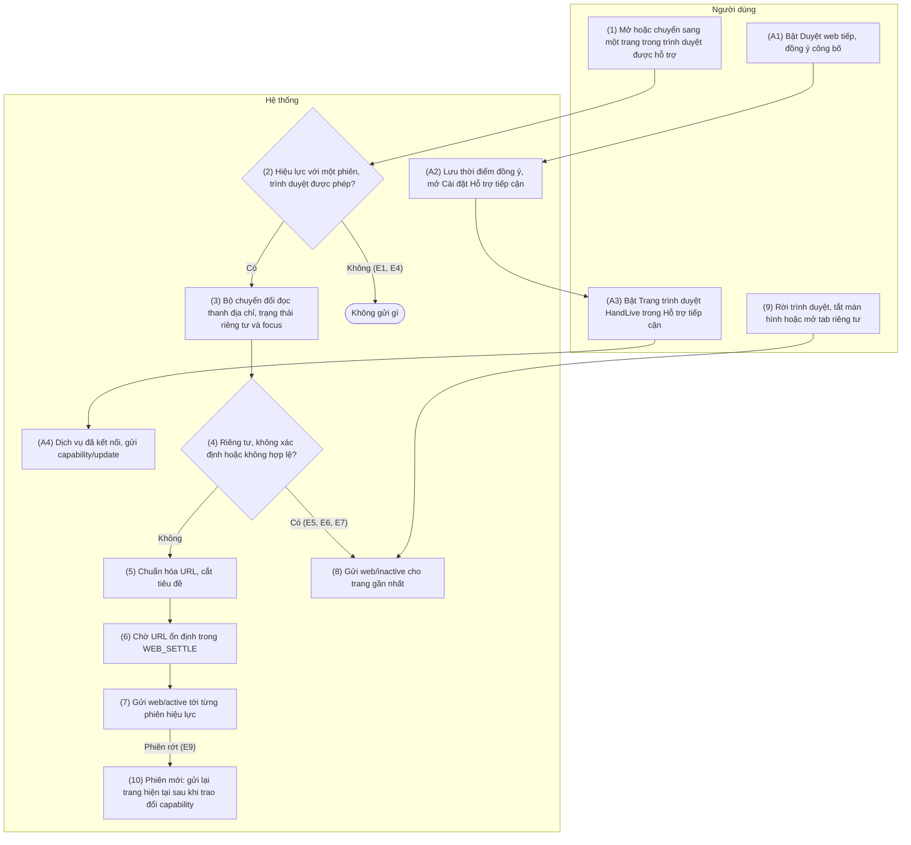
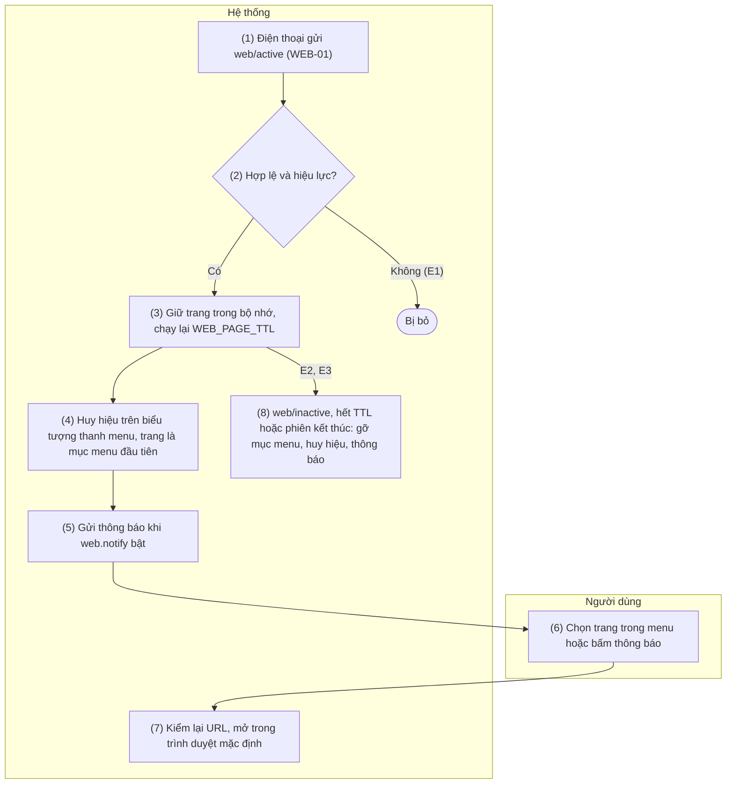
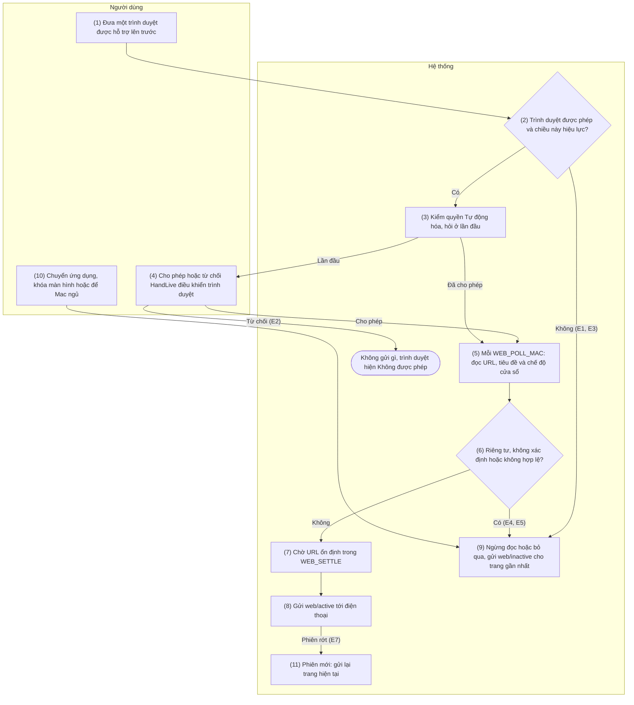
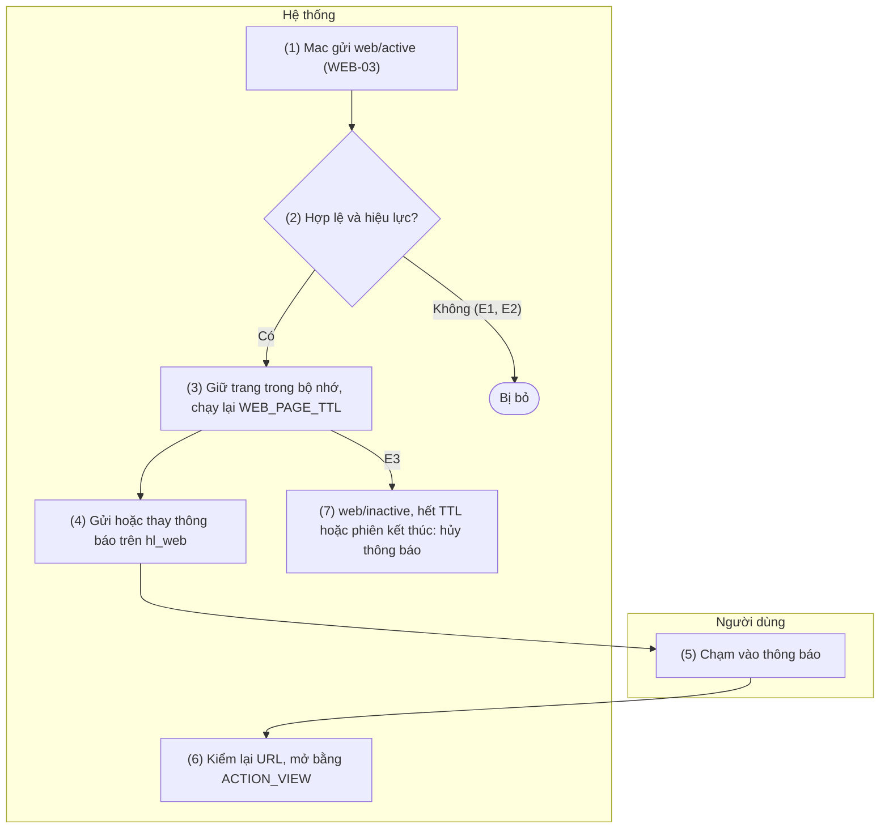
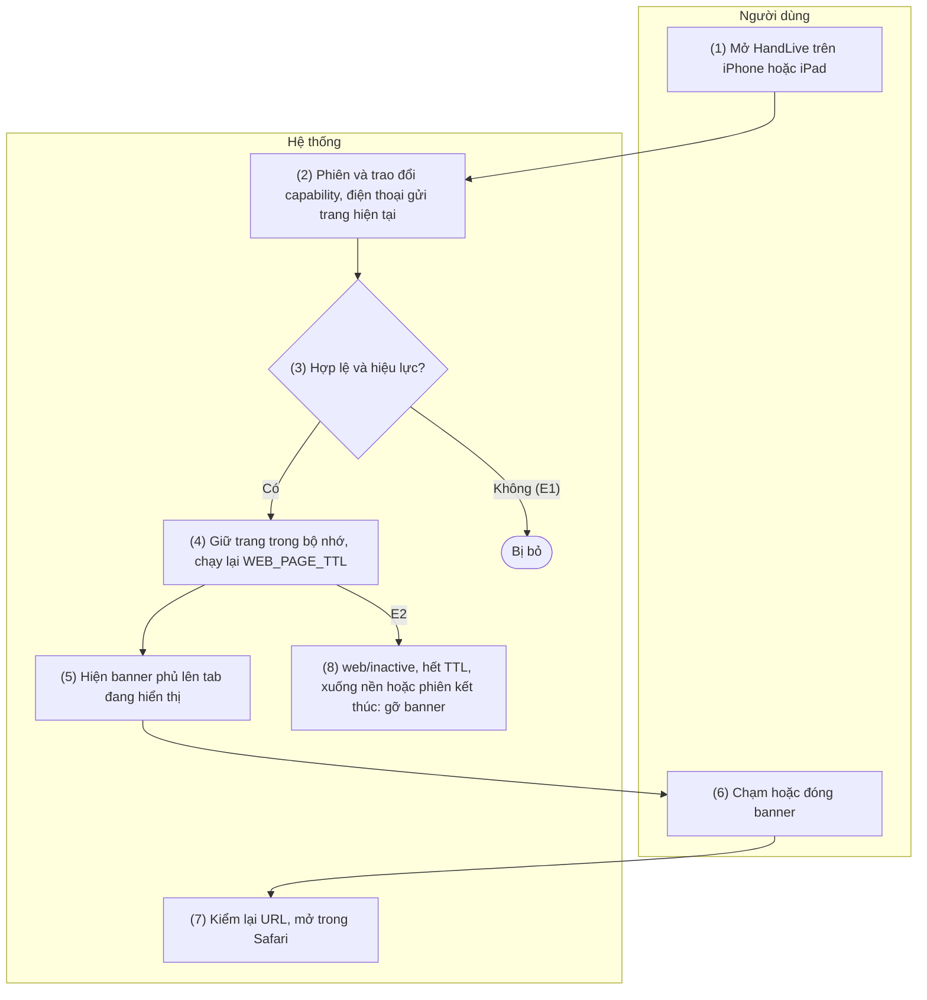

[English](09-web-handoff.md) | Tiếng Việt

# 9. Nhóm chức năng: Duyệt web tiếp

> Tham chiếu chung: [`00-common-specs.md`](00-common-specs.vi.md) — thành phần A-WEB, A-SVC, M-APP,
> I-APP (0.1), định danh `page_id` (0.2), kiểu dữ liệu (0.3), envelope (0.5.1), nguyên tắc bảo mật
> (0.6.5), loại tin `web` (0.7.1), mã trình duyệt (0.7.1), capability `features.web` (0.7.2), khóa cài
> đặt `feature.web`, `web.send`, `web.notify`, `web.browsers` (0.9.5), hằng số `WEB_SETTLE`,
> `WEB_POLL_MAC`, `WEB_REFRESH`, `WEB_PAGE_TTL`, `WEB_URL_MAX`, `WEB_TITLE_MAX` (0.10). Quyết định áp dụng: README §5 C21.
> Nguồn: `plans/20260928-web-handoff/plan.md` (W1–W9).
>
> **Phase P6, chưa xây dựng.** Mọi chức năng lá của nhóm phụ thuộc cổng **G6** (spike, plan W8): bộ
> chuyển đổi theo trình duyệt, cách nhận biết cửa sổ riêng tư và danh sách trình duyệt được hỗ trợ được
> xác nhận ở đó. Trình duyệt bị spike loại được ghi vào file này trước khi bắt đầu thẻ nào khác của
> Phase 6.
>
> Quy tắc chung của nhóm — chức năng lá dẫn chiếu theo mã QW:
> - **QW1 — Tên và chiều.** Tên trên giao diện là "Duyệt web tiếp"; thuật ngữ "Handoff" của Apple
>   không bao giờ xuất hiện trên giao diện. Các chiều: Android → Mac (WEB-01, WEB-02), Android →
>   iPhone/iPad (WEB-01, WEB-05, chỉ khi ứng dụng đang mở), Mac → Android (WEB-03, WEB-04). iPhone/iPad
>   không bao giờ gửi: không có API đọc tab đang mở của Safari (Share Extension là lựa chọn về sau,
>   README §4). Android không chuyển tiếp trang nhận từ Mac tới client khác. Không push: trang đang mở
>   là trạng thái tức thời.
> - **QW2 — Hiệu lực theo chiều.** Một chiều hiệu lực với một phiên khi bên gửi có
>   `features.web.enabled` và `send`, bên nhận có `features.web.enabled` và `receive`, theo capability
>   mới nhất của mỗi bên (0.7.2). Ánh xạ khóa cài đặt: SET-02 API 1.
> - **QW3 — Bản mới nhất thắng, không `ack`.** `web/active` và `web/inactive` là sự kiện không có
>   `ack`, như `call_event/state`. Bên gửi gửi khi trang đổi, gửi lại `web/active` hiện tại một lần ngay
>   sau khi phiên mới trao đổi xong capability, và khi trang vẫn mở thì gửi lại với cùng `page_id` mỗi
>   `WEB_REFRESH` (5 phút), để `WEB_PAGE_TTL` của bên nhận không bao giờ làm hết hạn một trang còn mở.
>   Không xếp hàng khi không có phiên.
> - **QW4 — Không bao giờ lưu.** Bên nhận chỉ giữ trang mới nhất của mỗi cặp, trong bộ nhớ. Bên nhận
>   quên trang khi có `web/inactive` cho `page_id` đó, sau `WEB_PAGE_TTL` (10 phút) không có
>   `web/active` mới, khi phiên kết thúc, và khi tính năng hết hiệu lực. Không trang nào được ghi vào cơ
>   sở dữ liệu, file hay log (log chỉ gồm `type`, `op`, `browser` và kích thước); relay chỉ thấy
>   `type = web`.
> - **QW5 — Không bao giờ gửi trang riêng tư.** Trang trong tab hoặc cửa sổ ẩn danh, riêng tư, cửa sổ
>   có `FLAG_SECURE`, hoặc trang không xác định được có riêng tư hay không thì không bao giờ được gửi;
>   thay vào đó bên gửi gửi `web/inactive` cho trang đã gửi gần nhất. Người dùng có thể loại trừ trình
>   duyệt (`web.browsers`).
> - **QW6 — Chờ ổn định.** Bên gửi chỉ gửi trang khi URL giữ nguyên trong `WEB_SETTLE` (1,5 s), và
>   không bao giờ gửi khi người dùng đang gõ trên thanh địa chỉ.
> - **QW7 — Hiển thị và mở an toàn.** Mọi bên nhận hiển thị đầy đủ host; nhãn host trộn nhiều hệ chữ
>   (ví dụ Latin với Kirin) được hiển thị ở dạng ASCII (punycode) để chống giả mạo ký tự giống nhau.
>   Chỉ mở URL `http` và `https`, và chỉ khi người dùng bấm hoặc chạm: không bao giờ tự mở.
> - **QW8 — Kiểm tra hợp lệ.** Payload `web/*` không hợp lệ (quy tắc 0.7.1, API 1 của WEB-01) bị bỏ
>   im lặng; bản debug đếm số lần bỏ trong bench log. Không có mã lỗi trên dây.
> - **QW9 — Cô lập.** Lỗi trong nhóm không làm dừng A-SVC, không đóng phiên `/v1/ctl` và không ảnh
>   hưởng tính năng khác.

## 9.1 WEB-01 — Gửi trang đang mở từ Android

### 9.1.1 Thông tin chung

| Mục | Nội dung |
|-----|----------|
| Tên | WEB-01 — Gửi trang đang mở từ Android |
| Mô tả | Khi một trình duyệt được hỗ trợ đang ở foreground trên điện thoại, một dịch vụ Hỗ trợ tiếp cận riêng, "Trang trình duyệt HandLive" (A-WEB), đọc thanh địa chỉ của trình duyệt đó qua bộ chuyển đổi theo từng trình duyệt, chuyển văn bản thành URL và, khi URL đã ổn định (QW6), gửi `web/active` tới mọi client mà chiều này hiệu lực: Mac (WEB-02) và iPhone/iPad (WEB-05).<br>Khi trình duyệt rời foreground, màn hình tắt hoặc trang chuyển sang riêng tư, A-WEB gửi `web/inactive`.<br>Bật tính năng phải qua màn hình công bố nổi bật, rồi người dùng bật dịch vụ trong Cài đặt › Hỗ trợ tiếp cận (SET-01 phần B). `web/active` và `web/inactive` định nghĩa ở đây và dùng chung cho WEB-02…05. |
| Tác nhân | Chính: Người dùng (duyệt web trên điện thoại). Hệ thống: A-WEB (`BrowserPagesAccessibilityService`, bộ chuyển đổi trình duyệt), A-SVC, A-UI, OS (khung Hỗ trợ tiếp cận, ứng dụng trình duyệt). |
| Điều kiện trước | 1.<br>Cặp hiệu lực (PAIR-01) và có phiên `/v1/ctl` (CONN-01 hoặc CONN-03).<br>2.<br>`feature.web = true` và `web.send = true` trên điện thoại, đã đồng ý công bố (`web.a11y_consent_at` đã đặt) và dịch vụ "Trang trình duyệt HandLive" đang bật.<br>3.<br>Client báo `features.web.enabled = true` và `receive = true` (QW2).<br>4. Cổng G6 đã đạt với trình duyệt đang dùng. |
| Điều kiện sau | Mọi client hiệu lực giữ trang đang mở trên điện thoại trong `WEB_SETTLE` cộng thời gian truyền, hoặc không giữ trang nào khi điện thoại không hiện gì được phép gửi.<br>Không ghi gì xuống đĩa. |
| Ngoại lệ | E1 — Chiều này không hiệu lực với phiên nào (tắt ở một phía, `web.send = false`, `receive = false` ở client, không có phiên): A-WEB bỏ qua sự kiện và không đọc gì.<br>E2 — Từ chối công bố ("Để sau"): `feature.web` giữ `false`; không đổi gì khác.<br>E3 — Dịch vụ chưa bật, hoặc Android 13+ chặn vì "Cài đặt bị hạn chế" (cài ngoài Google Play): như SET-01 E7 và E8; thẻ tính năng hiện "Chưa bật trang trình duyệt".<br>E4 — Trình duyệt không được hỗ trợ hoặc bị loại trong `web.browsers`: sự kiện của nó bị bỏ qua; nếu trang gửi gần nhất đến từ trình duyệt khác thì gửi `web/inactive` cho trang đó khi trình duyệt này lên foreground.<br>E5 — Bộ chuyển đổi không tìm thấy thanh địa chỉ (bản cập nhật trình duyệt đổi view): không gửi, `web/inactive` cho trang gần nhất; bản debug ghi log trình duyệt và phiên bản.<br>E6 — Trang riêng tư hoặc không xác định được trạng thái riêng tư (QW5): `web/inactive` cho trang gần nhất, không bao giờ `web/active`.<br>E7 — Văn bản không phải URL `http` hoặc `https` hợp lệ, hoặc dài hơn `WEB_URL_MAX`: không gửi, `web/inactive` cho trang gần nhất.<br>E8 — Thanh địa chỉ đang có focus (người dùng đang gõ): chờ; bộ hẹn giờ ổn định chạy lại khi focus rời đi.<br>E9 — Phiên rớt: không xếp hàng; sau lần trao đổi capability kế tiếp, trang hiện tại được gửi lại nếu trình duyệt vẫn ở foreground (QW3).<br>E10 — Google Play từ chối khai báo Hỗ trợ tiếp cận cho mục đích này: tính năng bị bỏ khỏi bản Play, vẫn có trong bản F-Droid và APK (phương án dự phòng như SMS, plan W3). |
| Yêu cầu đặc biệt | **Riêng tư:** QW4, QW5; công bố nêu đúng những gì được đọc; không ghi log URL và tiêu đề; dịch vụ chỉ nhận sự kiện từ các trình duyệt được hỗ trợ (`android:packageNames`).<br>**Pin:** chỉ loại sự kiện `TYPE_WINDOW_STATE_CHANGED` và `TYPE_WINDOW_CONTENT_CHANGED`, `notificationTimeout` ≥ 500 ms, chỉ đọc cây node khi có phiên hiệu lực; chi phí được đo ở G6.<br>**Tuân thủ:** dùng Hỗ trợ tiếp cận cho mục đích khác ngoài hỗ trợ người khuyết tật cần công bố nổi bật trong ứng dụng kèm đồng ý và khai báo trên Play Console (`isAccessibilityTool = false`); tính năng mặc định tắt (`feature.web = false`).<br>**Tách biệt:** dịch vụ bảng nhớ tạm giữ `canRetrieveWindowContent = false` (CLIP-01); chỉ dịch vụ này đọc nội dung cửa sổ.<br>**Truy cập:** màn hình công bố và các dòng cài đặt đọc được bằng TalkBack. |

### 9.1.2 Màn hình

N/A — chưa có wireframe được duyệt.

### 9.1.3 Mô tả chi tiết các thành phần

| # | Trường | Kiểu dữ liệu | Input/Output | Giá trị khởi tạo | Mô tả |
|---|--------|--------------|--------------|------------------|-------|
| 1 | Công tắc "Duyệt web tiếp" | bool | Input/Output | `feature.web` = `false` | Android, Cài đặt (SET-02 trường 34). Bật lần đầu phải qua công bố (trường 2–4), rồi tới Cài đặt Hỗ trợ tiếp cận |
| 2 | Tiêu đề công bố | string | Output | "Duyệt web tiếp trên thiết bị khác" | Toàn màn hình, như công bố của bảng nhớ tạm (CLIP-01 trường 2) |
| 3 | Nội dung công bố | string | Output | Văn bản cố định theo phiên bản | "HandLive dùng một dịch vụ Hỗ trợ tiếp cận riêng, Trang trình duyệt HandLive, chỉ để đọc địa chỉ và tiêu đề của trang đang mở trong các trình duyệt được hỗ trợ, rồi gửi (mã hóa đầu-cuối) tới Mac, iPhone, iPad đã ghép nối.<br>Dịch vụ chỉ nhận sự kiện từ các trình duyệt đó. Dịch vụ không đọc ứng dụng khác hay nội dung bạn gõ, và không gửi trang trong tab ẩn danh hoặc riêng tư. Địa chỉ không bao giờ được lưu.<br>Bạn có thể tắt bất cứ lúc nào." |
| 4 | Lựa chọn công bố | enum{Đồng ý\| Để sau} | Input | — | "Đồng ý" → lưu `web.a11y_consent_at`, mở Cài đặt Hỗ trợ tiếp cận; "Để sau" → E2 |
| 5 | Tên và mô tả của dịch vụ Hỗ trợ tiếp cận | string | Output | "Trang trình duyệt HandLive" | Android hiện trong Cài đặt › Hỗ trợ tiếp cận; mô tả "Đọc địa chỉ trang đang mở trong các trình duyệt được hỗ trợ để bạn xem tiếp trên Mac, iPhone, iPad." |
| 6 | Thẻ tính năng "Duyệt web tiếp" | enum{on\| off\| needs_accessibility} | Output | `needs_accessibility` | Trong danh sách tính năng (SET-01 trường 10): `on` "Bật", `off` "Tắt", `needs_accessibility` "Chưa bật trang trình duyệt" kèm nút "Cấp quyền" (SET-01 trường 11) |
| 7 | Công tắc "Gửi trang từ điện thoại này" | bool | Input/Output | `web.send` = `true` | SET-02 trường 35; tắt → `features.web.send = false`, `web/inactive` cho trang gần nhất |
| 8 | Danh sách trình duyệt | set\<enum> | Input/Output | `web.browsers` = mọi trình duyệt được hỗ trợ | SET-02 trường 37: một công tắc cho mỗi trình duyệt được hỗ trợ (tên theo 0.7.1, không dịch); trình duyệt không được hỗ trợ không có trong danh sách |

### 9.1.4 Luồng nghiệp vụ



| Bước | Tác nhân | Thành phần | Mô tả | Ngoại lệ / Ghi chú |
|------|----------|-----------|-------|--------------------|
| A1 | Người dùng | A-UI | Bật "Duyệt web tiếp" (trường 1), đọc công bố (trường 2, 3) và chọn "Đồng ý" (trường 4). | "Để sau" → E2. |
| A2 | Hệ thống | A-UI | Ghi `feature.web = true` và `web.a11y_consent_at`; Android 13+ với nguồn cài khác Google Play → hiện hướng dẫn cài đặt bị hạn chế (SET-01 trường 14); mở `ACTION_ACCESSIBILITY_SETTINGS` (API 3). | E3. |
| A3 | Người dùng | OS | Chọn "Trang trình duyệt HandLive" (trường 5), bật, xác nhận hộp thoại hệ thống, quay lại. | Không bật → E3. |
| A4 | Hệ thống | A-WEB, A-SVC | `onServiceConnected` → `features.web.send` thành `true` (khi `web.send = true`); A-SVC gửi `capability/update` (SET-02 API 1) tới mọi phiên. `onUnbind` → `send = false`, cập nhật lại. |  |
| 1 | Người dùng | OS (trình duyệt) | Mở một trang, chuyển tab, hoặc đưa trình duyệt trở lại foreground. |  |
| 2 | Hệ thống | A-WEB | Nhận sự kiện cửa sổ từ một gói trong `android:packageNames` (API 3). Kiểm có ít nhất một phiên mà chiều này hiệu lực (QW2) và mã của trình duyệt nằm trong `web.browsers`. | Không → E1, E4. |
| 3 | Hệ thống | A-WEB | Bộ chuyển đổi của trình duyệt đó (API 4) tìm node thanh địa chỉ, đọc văn bản và focus, xác định tab hoặc cửa sổ có riêng tư không, và đọc tiêu đề khi trình duyệt cung cấp. | Không thấy node → E5. Đang focus → E8. |
| 4 | Hệ thống | A-WEB | Riêng tư, không xác định, `FLAG_SECURE`, không phải `http`/`https`, hoặc dài hơn `WEB_URL_MAX` → bước 8. | E5, E6, E7. |
| 5 | Hệ thống | A-WEB | Chuẩn hóa (API 4, logic 3): thêm `https://` khi thanh địa chỉ chỉ hiện host; giữ fragment; cắt tiêu đề còn `WEB_TITLE_MAX` ký tự; tiêu đề rỗng → vắng mặt. |  |
| 6 | Hệ thống | A-WEB | Khởi động hoặc khởi động lại bộ hẹn giờ `WEB_SETTLE` mỗi khi URL đã chuẩn hóa đổi; bộ hẹn giờ chỉ kích hoạt khi URL không đổi và thanh địa chỉ không có focus. |  |
| 7 | Hệ thống | A-SVC | Dựng `web/active` (API 1): `page_id` mới khi URL khác URL gửi gần nhất, giữ `page_id` khi chỉ tiêu đề đổi; gửi tới mọi phiên hiệu lực. Không gửi khi URL và tiêu đề trùng với lần gửi gần nhất, trừ lần làm mới: khi trang vẫn mở, cùng `web/active` (cùng `page_id`, `observed_at` mới) được gửi lại mỗi `WEB_REFRESH` (QW3). |  |
| 8 | Hệ thống | A-SVC | Gửi `web/inactive` (API 2) cho `page_id` gửi gần nhất, một lần, tới mọi phiên đã nhận nó; quên trang đó. | Chưa gửi gì trước đó → không làm gì. |
| 9 | Người dùng | OS | Chuyển sang ứng dụng khác, tắt màn hình, hoặc mở tab riêng tư. | Cách phát hiện: API 3 logic 4, API 5. |
| 10 | Hệ thống | A-SVC | Khi phiên mới trao đổi xong capability và chiều này hiệu lực: gửi lại `web/active` hiện tại (cùng `page_id`) nếu còn trang đang mở. | E9. |

### 9.1.5 Đặc tả API/service

**Danh sách lời gọi**

| # | API/service | Kênh | Chiều | Dùng ở bước |
|---|-------------|------|-------|-------------|
| 1 | `WS web/active` | `/v1/ctl` (LAN hoặc relay) | Hai chiều (ở đây S→C) | 7, 10 |
| 2 | `WS web/inactive` | `/v1/ctl` (LAN hoặc relay) | Hai chiều (ở đây S→C) | 8 |
| 3 | `BrowserPagesAccessibilityService` (`AccessibilityService`, `onAccessibilityEvent`) và `Settings.ACTION_ACCESSIBILITY_SETTINGS` | Cục bộ Android | OS → A-WEB | A2–A4, 2, 3, 9 |
| 4 | Bộ chuyển đổi trình duyệt (`BrowserAdapter`, một cho mỗi trình duyệt) | Cục bộ Android | A-WEB | 3, 4, 5 |
| 5 | Broadcast `Intent.ACTION_SCREEN_OFF` (receiver đăng ký lúc chạy) | Cục bộ Android | OS → A-SVC | 9 |
| 6 | `WS capability/update` (đặc tả ở SET-02 API 1) | `/v1/ctl` | S→C | A4 |

#### API 1 — `WS web/active`

- **URL:** `wss://{android_host}:{port}/v1/ctl` (LAN) hoặc qua relay `wss://{RELAY_HOST}/v1/relay`
  với lớp bọc `to`/`from`
- **Method:** `WS web/active`, envelope mã hóa, không ack (0.7.1). Android gửi tới client (WEB-01);
  Mac gửi tới Android (WEB-03). iPhone/iPad không bao giờ gửi.
- **Request (`data`):**

| Trường | Kiểu | Bắt buộc | Mô tả |
|--------|------|----------|-------|
| `page_id` | uuid | Có | UUIDv7, mới cho mỗi trang (URL mới); giữ nguyên khi chỉ tiêu đề đổi và khi trang được gửi lại sau khi kết nối lại |
| `url` | string | Có | URL của trang như trình duyệt hiển thị, giữ fragment; chỉ scheme `http` hoặc `https`; tối đa `WEB_URL_MAX` (8 KiB) UTF-8 |
| `title` | string(256) | Không | Tiêu đề trang, tối đa `WEB_TITLE_MAX` ký tự; vắng mặt khi trình duyệt không cung cấp hoặc tiêu đề rỗng |
| `browser` | enum | Có | Mã trình duyệt theo danh sách ở 0.7.1 (`chrome`, `samsung`, `firefox`, `edge`, `brave`, `opera`, `vivaldi`, `duckduckgo`, `safari`, `arc`, `other`) |
| `observed_at` | timestamp | Có | Lúc bên gửi đọc được URL đã ổn định (đồng hồ bên gửi) |

- **Response:** N/A (không ack; client lỡ một tin sẽ nhận trang hiện tại sau lần trao đổi capability
  kế tiếp — QW3).
- **Ví dụ:**

```json
{"op":"active","data":{"page_id":"0192f4a0-1b2c-7d3e-8f40-5a6b7c8d9e0f","url":"https://en.wikipedia.org/wiki/Handoff#History","title":"Handoff - Wikipedia","browser":"chrome","observed_at":1727150400123}}
```

- **Logic nghiệp vụ:**
  1. **Bên gửi:** chỉ gửi theo QW2, QW5, QW6; không gửi lại cùng trang, trừ một lần sau lần trao
     đổi capability mới và mỗi `WEB_REFRESH` khi trang vẫn mở (QW3).
  2. **Bên nhận kiểm tra** (QW8) — bỏ im lặng khi: `url` không phân tích được, scheme không phải
     `http` hoặc `https`, không có host, hoặc dài hơn `WEB_URL_MAX`; `title` dài hơn `WEB_TITLE_MAX`;
     `page_id` không phải uuid; chiều này không hiệu lực với phiên. Giá trị `browser` không biết được coi
     là `other` (0.5.1 quy tắc 6).
  3. **Bản mới nhất thắng:** với mỗi cặp, bên nhận giữ tin có `observed_at` lớn nhất và bỏ tin cũ hơn;
     trang đang giữ được thay nguyên cả trang.
  4. **Thời gian sống:** QW4; bộ hẹn giờ `WEB_PAGE_TTL` chạy lại với mỗi `web/active` được nhận.
  5. Không ghi log `url` hay `title`.

#### API 2 — `WS web/inactive`

- **URL:** như API 1
- **Method:** `WS web/inactive`, envelope mã hóa, không ack (0.7.1); cùng các chiều như API 1.
- **Request (`data`):**

| Trường | Kiểu | Bắt buộc | Mô tả |
|--------|------|----------|-------|
| `page_id` | uuid | Có | Trang không còn mở ở foreground |

- **Response:** N/A.
- **Ví dụ:**

```json
{"op":"inactive","data":{"page_id":"0192f4a0-1b2c-7d3e-8f40-5a6b7c8d9e0f"}}
```

- **Logic nghiệp vụ:**
  1. Gửi khi trình duyệt rời foreground, màn hình tắt hoặc khóa, thiết bị ngủ, trang chuyển sang
     riêng tư hoặc không được hỗ trợ, người dùng loại trình duyệt, hoặc `web.send` bị tắt.
  2. Bên nhận chỉ xóa trang đang giữ khi `page_id` khớp; nếu không thì bỏ qua tin.

#### API 3 — `BrowserPagesAccessibilityService`

- **URL:** N/A
- **Method:** `AccessibilityService.onAccessibilityEvent(event)`, `onServiceConnected()`,
  `onUnbind()`, `getRootInActiveWindow()`; mở cài đặt bằng
  `startActivity(Intent(Settings.ACTION_ACCESSIBILITY_SETTINGS))`.
- **Request — khai báo:**
  `<service android:name=".BrowserPagesAccessibilityService" android:permission="android.permission.BIND_ACCESSIBILITY_SERVICE" android:exported="false">`
  với intent filter `android.accessibilityservice.AccessibilityService` và cấu hình
  `@xml/a11y_browser_pages`:

| Thuộc tính | Giá trị |
|-----------|-------|
| `android:canRetrieveWindowContent` | `true` (dịch vụ bảng nhớ tạm giữ `false`) |
| `android:packageNames` | Chỉ các gói của trình duyệt được hỗ trợ (API 4) |
| `android:accessibilityEventTypes` | `typeWindowStateChanged\|typeWindowContentChanged` |
| `android:notificationTimeout` | ≥ 500 |
| `android:isAccessibilityTool` | `false` |
| `android:description` | Mô tả của trường 5 |

- **Response:** chỉ sự kiện của các gói đã liệt kê.
- **Ví dụ:** Chrome lên foreground với một tab đang mở → `TYPE_WINDOW_STATE_CHANGED` từ
  `com.android.chrome` → bộ chuyển đổi Chrome đọc thanh địa chỉ.
- **Logic nghiệp vụ:**
  1. Chỉ mở Cài đặt Hỗ trợ tiếp cận sau khi `web.a11y_consent_at` đã đặt; hướng dẫn cài đặt bị hạn chế
     theo SET-01 API 6 logic 2.
  2. Khi không phiên nào có chiều này hiệu lực (E1), thoát khỏi `onAccessibilityEvent` mà không đọc
     node nào.
  3. Tắt `feature.web` hoặc `web.send` → `web/inactive` cho trang gần nhất; tắt `feature.web` → dịch vụ
     gọi `disableSelf()` để trả lại quyền (như SET-01 API 6 logic 5).
  4. **Rời foreground:** do lọc theo gói, dịch vụ không thấy sự kiện của ứng dụng khác; cách dịch vụ
     biết trình duyệt đã rời foreground (ví dụ gói của `getRootInActiveWindow()` ở sự kiện kế tiếp) được
     chốt trong spike G6. Kết quả bắt buộc: bước 8 chạy trong vòng `WEB_SETTLE` sau khi trình duyệt rời
     foreground.
  5. Bản cập nhật ứng dụng mở rộng phạm vi công bố thì xóa `web.a11y_consent_at` để hỏi đồng ý lại.

#### API 4 — Bộ chuyển đổi trình duyệt

- **URL:** N/A
- **Method:** interface `BrowserAdapter` (strategy pattern, như các bộ chuyển đổi Bluetooth theo hãng):
  `id` (mã trình duyệt, 0.7.1), `packageName`, `read(root): BrowserPage?` trả về
  `{rawUrlText, title?, urlBarFocused, privateState ∈ {normal, private, unknown}}`.
- **Request:** node gốc của cửa sổ trình duyệt và sự kiện. Các gói ứng viên (xác nhận ở G6):

| Mã trình duyệt | Gói | G6 kiểm |
|------------|---------|----------|
| `chrome` | `com.android.chrome` | Có |
| `samsung` | `com.sec.android.app.sbrowser` | Có |
| `firefox` | `org.mozilla.firefox` | Có |
| `edge` | `com.microsoft.emmx` | Có |
| `brave` | `com.brave.browser` | Có |
| `opera` | `com.opera.browser` | Sau |
| `vivaldi` | `com.vivaldi.browser` | Sau |
| `duckduckgo` | `com.duckduckgo.mobile.android` | Sau |

- **Response:** một `BrowserPage` hoặc `null` (không thấy thanh địa chỉ, E5).
- **Ví dụ:** Chrome hiện `en.wikipedia.org/wiki/Handoff` trên thanh → `rawUrlText` là văn bản đó,
  `privateState = normal` → URL `https://en.wikipedia.org/wiki/Handoff`.
- **Logic nghiệp vụ:**
  1. **Thanh địa chỉ:** view id theo phiên bản trình duyệt (từ bảng của G6); dự phòng: `EditText` trên
     thanh công cụ của trình duyệt.
  2. **Trạng thái riêng tư:** Chrome, Edge và Brave theo trạng thái thanh công cụ ẩn danh, Samsung
     Internet theo chế độ bí mật, Firefox theo chế độ riêng tư, mọi cửa sổ có `FLAG_SECURE`; không xác
     định được thì là `unknown` và không gửi (QW5).
  3. **Chuẩn hóa:** văn bản không có scheme mà phân tích được thành host (kèm path tùy chọn) → thêm
     `https://`; văn bản không phân tích được thành URL `http` hoặc `https` bị bỏ (E7); giữ fragment.
  4. Chỉ các gói có bộ chuyển đổi đạt G6 mới nằm trong `android:packageNames` và danh sách trình duyệt
     (trường 8).

#### API 5 — Broadcast `Intent.ACTION_SCREEN_OFF`

- **URL:** N/A
- **Method:** `Context.registerReceiver(receiver, IntentFilter(Intent.ACTION_SCREEN_OFF))` trong A-SVC
  khi `feature.web = true`.
- **Request:** N/A.
- **Response:** intent, khi màn hình tắt.
- **Ví dụ:** người dùng bấm nút nguồn khi Chrome đang hiện một trang → `web/inactive`.
- **Logic nghiệp vụ:** màn hình tắt → bước 8; trang chỉ được gửi lại sau khi trình duyệt hiện lại nó ở
  foreground và URL ổn định.

#### API 6 — `WS capability/update`

Đặc tả ở SET-02 API 1. Trong WEB-01, Android gửi khi dịch vụ kết nối hoặc ngắt, và khi `feature.web`,
`web.send` hoặc `web.notify` đổi.

#### Query

N/A — không có cơ sở dữ liệu: trang gửi gần nhất chỉ nằm trong bộ nhớ A-SVC (QW4). Khóa DataStore được
đọc:

```text
# [Thiết kế] Android DataStore<Preferences> (A-UI, A-WEB)
prefs[booleanPreferencesKey("feature.web")] ?: false                        # bước 2
prefs[booleanPreferencesKey("web.send")] ?: true                           # bước 2
prefs[stringSetPreferencesKey("web.browsers")] ?: allSupportedBrowserIds   # bước 2
dataStore.edit { it[longPreferencesKey("web.a11y_consent_at")] = now }       # A2
```

---

## 9.2 WEB-02 — Hiện trang của điện thoại trên Mac

### 9.2.1 Thông tin chung

| Mục | Nội dung |
|-----|----------|
| Tên | WEB-02 — Hiện trang của điện thoại trên Mac |
| Mô tả | Khi Mac nhận `web/active` từ điện thoại (WEB-01), biểu tượng thanh menu chuyển sang dạng có huy hiệu và mục đầu tiên của menu thành "\<tiêu đề hoặc host> — từ \<điện thoại>" kèm biểu tượng của trình duyệt; chọn mục này mở URL trong trình duyệt mặc định của Mac.<br>Khi `web.notify = true`, một thông báo cũng được gửi.<br>Mục menu, huy hiệu và thông báo biến mất khi có `web/inactive`, sau `WEB_PAGE_TTL`, hoặc khi phiên kết thúc (QW4). |
| Tác nhân | Chính: Người dùng (đọc tiếp trên Mac). Hệ thống: M-APP, A-SVC (bên gửi), OS (`NSWorkspace`, `UNUserNotificationCenter`). |
| Điều kiện trước | 1.<br>Cặp hiệu lực và có phiên tới điện thoại.<br>2.<br>`feature.web = true` trên Mac (`features.web.receive = true`) và chiều Android → Mac hiệu lực (QW2). |
| Điều kiện sau | Menu hiện trang mới nhất của điện thoại khi trang còn hợp lệ; mở trang là giao URL cho trình duyệt mặc định. Không ghi gì xuống đĩa. |
| Ngoại lệ | E1 — Payload không hợp lệ hoặc chiều này không hiệu lực: bỏ im lặng (QW8).<br>E2 — Không có `web/active` trong `WEB_PAGE_TTL`: gỡ mục menu, huy hiệu và thông báo.<br>E3 — Phiên kết thúc (mất kết nối, hủy ghép nối, tính năng bị tắt ở một phía): như trên.<br>E4 — Mac không cho phép thông báo, hoặc `web.notify = false`: chỉ có mục menu và huy hiệu.<br>E5 — URL không qua kiểm tra lại khi người dùng mở (QW7): không mở gì; gỡ mục menu.<br>E6 — `NSWorkspace.open` trả `false` (không ứng dụng nào mở được URL): mục menu vẫn giữ; macOS hiện thông báo của chính nó, nếu có. |
| Yêu cầu đặc biệt | **Riêng tư:** QW4; thông báo (khi bật) chỉ hiện tiêu đề và host.<br>**Bảo mật:** QW7; URL được mở đúng là `url` đã nhận, không bao giờ là URL dựng lại từ văn bản hiển thị.<br>**Truy cập:** VoiceOver đọc mục menu là "Trang từ \<điện thoại>: \<tiêu đề hoặc host>"; dạng có huy hiệu có nhãn truy cập "HandLive, có trang từ điện thoại". |

### 9.2.2 Màn hình

N/A — chưa có wireframe được duyệt.

### 9.2.3 Mô tả chi tiết các thành phần

| # | Trường | Kiểu dữ liệu | Input/Output | Giá trị khởi tạo | Mô tả |
|---|--------|--------------|--------------|------------------|-------|
| 1 | Biểu tượng thanh menu dạng có huy hiệu | bool | Output | Tắt | Bật khi đang giữ một trang từ điện thoại; biểu tượng trạng thái của CONN-01 trường 1 ở dạng có huy hiệu (design system `MenuBarMenu`) |
| 2 | Mục menu trang | string | Output | Ẩn | Mục đầu tiên của menu: "\<tiêu đề hoặc host> — từ \<điện thoại>", biểu tượng trình duyệt làm hình; phím tắt ⌘O khi menu đang mở |
| 3 | Dòng host | string | Output | Ẩn | Host đầy đủ, dưới tiêu đề (subtitle của mục menu; dòng thứ hai bị vô hiệu khi hệ thống không có subtitle); punycode theo QW7. Ẩn khi trường 2 đã hiện host |
| 4 | Thông báo | string | Output | Không gửi | Chỉ khi `web.notify = true`: tiêu đề "\<tiêu đề hoặc host>", nội dung "\<host> — từ \<điện thoại>"; bấm vào thì mở trang; bị trang kế tiếp thay, bị gỡ cùng mục menu |
| 5 | Tùy chọn "Thông báo trang" | bool | Input/Output | `web.notify` = `false` | Cài đặt trên Mac (SET-02 trường 36) |

### 9.2.4 Luồng nghiệp vụ



| Bước | Tác nhân | Thành phần | Mô tả | Ngoại lệ / Ghi chú |
|------|----------|-----------|-------|--------------------|
| 1 | Hệ thống | A-SVC | Điện thoại gửi `web/active` (WEB-01 API 1). |  |
| 2 | Hệ thống | M-APP | Kiểm hợp lệ theo WEB-01 API 1 logic 2 và kiểm chiều này hiệu lực. | E1. |
| 3 | Hệ thống | M-APP | Thay trang đang giữ của cặp (`observed_at` cũ hơn → bỏ), chạy lại bộ hẹn giờ `WEB_PAGE_TTL`. |  |
| 4 | Hệ thống | M-APP | Hiện trường 1–3. |  |
| 5 | Hệ thống | M-APP | `web.notify = true` và thông báo được phép → gửi trường 4 (API 2), thay thông báo trước. | E4. |
| 6 | Người dùng | M-APP | Chọn mục menu (trường 2, hoặc ⌘O khi menu đang mở) hoặc bấm thông báo. |  |
| 7 | Hệ thống | M-APP, OS | Kiểm lại URL (QW7) và gọi `NSWorkspace.shared.open(url)` (API 1). Trang vẫn nằm trong menu tới khi kết thúc. | E5, E6. |
| 8 | Hệ thống | M-APP | `web/inactive` với `page_id` đang giữ, hết TTL hoặc phiên kết thúc → gỡ trường 1–4. | E2, E3. |

### 9.2.5 Đặc tả API/service

**Danh sách lời gọi**

| # | API/service | Kênh | Chiều | Dùng ở bước |
|---|-------------|------|-------|-------------|
| 1 | `NSWorkspace.shared.open(_:)` | Cục bộ Mac | M-APP → OS | 7 |
| 2 | `UNUserNotificationCenter.add(_:)`, `removeDeliveredNotifications(withIdentifiers:)` | Cục bộ Mac | M-APP → OS | 5, 8 |
| 3 | `WS web/active`, `WS web/inactive` (đặc tả ở WEB-01 API 1, API 2) | `/v1/ctl` | S→C | 1, 8 |

#### API 1 — `NSWorkspace.shared.open(_:)`

- **URL:** N/A
- **Method:** `NSWorkspace.shared.open(url)`
- **Request:** `url` đang giữ dưới dạng `URL`, sau các kiểm tra của QW7.
- **Response:** `Bool` — `false` → E6.
- **Ví dụ:** `https://en.wikipedia.org/wiki/Handoff#History` mở trong Safari khi Safari là trình duyệt
  mặc định.
- **Logic nghiệp vụ:** chỉ `http`/`https`; không bao giờ gọi khi người dùng chưa bấm (QW7).

#### API 2 — Thông báo trang trên Mac

- **URL:** N/A
- **Method:** `UNUserNotificationCenter.current().add(request)` với định danh `web:<pair_id>`;
  `removeDeliveredNotifications(withIdentifiers:)` ở bước 8.
- **Request:** `UNMutableNotificationContent` với trường 4, `threadIdentifier = "web"`,
  `interruptionLevel = .passive`, không âm thanh; `userInfo` chỉ chứa `page_id`.
- **Response:** N/A.
- **Ví dụ:** tiêu đề "Handoff - Wikipedia", nội dung "en.wikipedia.org — từ Pixel 8".
- **Logic nghiệp vụ:** khi bấm, tìm trang đang giữ theo `page_id`; trang đã kết thúc thì không mở gì
  (thông báo bị gỡ).

#### API 3 — `WS web/active`, `WS web/inactive`

Đặc tả ở WEB-01 API 1 và API 2.

#### Query

N/A — trang chỉ nằm trong bộ nhớ M-APP (QW4); `web.notify` đọc từ `UserDefaults.standard`.

---

## 9.3 WEB-03 — Gửi trang đang mở từ Mac

### 9.3.1 Thông tin chung

| Mục | Nội dung |
|-----|----------|
| Tên | WEB-03 — Gửi trang đang mở từ Mac |
| Mô tả | Khi một trình duyệt được hỗ trợ là ứng dụng ở trước nhất và phiên người dùng đang hoạt động, M-APP đọc tab đang mở của cửa sổ trước nhất (URL, tiêu đề, chế độ cửa sổ) qua Apple Events mỗi `WEB_POLL_MAC` (1,5 s) và, khi URL đã ổn định (QW6), gửi `web/active` tới điện thoại (WEB-04).<br>Khi trình duyệt không còn ở trước nhất, màn hình khóa hoặc Mac ngủ, M-APP ngừng đọc và gửi `web/inactive`.<br>Mỗi trình duyệt hỏi người dùng quyền Tự động hóa một lần; trình duyệt bị từ chối hiện "Không được phép" trong Cài đặt kèm nút tới Cài đặt hệ thống. |
| Tác nhân | Chính: Người dùng (duyệt web trên Mac). Hệ thống: M-APP, OS (`NSWorkspace`, Apple Events, TCC), ứng dụng trình duyệt, A-SVC (bên nhận). |
| Điều kiện trước | 1.<br>Cặp hiệu lực và có phiên tới điện thoại.<br>2.<br>`feature.web = true` và `web.send = true` trên Mac; điện thoại báo `features.web.enabled = true` và `receive = true` (QW2).<br>3. Cổng G6 đã đạt với trình duyệt đang dùng. |
| Điều kiện sau | Điện thoại giữ trang đang mở trên Mac, hoặc không giữ trang nào khi Mac không hiện gì được phép gửi. Chỉ đọc khi cần. Không ghi gì xuống đĩa. |
| Ngoại lệ | E1 — Chiều này không hiệu lực (tắt ở một phía, `web.send = false`, `receive = false` ở điện thoại, không có phiên): không đọc gì cả.<br>E2 — Quyền Tự động hóa bị từ chối với trình duyệt (`errAEEventNotPermitted`, -1743): không gửi gì cho trình duyệt đó; Cài đặt hiện "Không được phép" và "Mở Cài đặt hệ thống" (trường 3).<br>E3 — Trình duyệt không được hỗ trợ (Firefox không có scripting URL, các trình duyệt khác) hoặc bị loại trong `web.browsers`: bỏ qua; `web/inactive` cho trang gần nhất khi trình duyệt đó lên trước.<br>E4 — Cửa sổ riêng tư (`mode` của Chromium là `incognito`) hoặc chế độ không xác định được (Safari cho tới khi G6 chốt): `web/inactive` cho trang gần nhất, không bao giờ `web/active` (QW5).<br>E5 — Không phải URL `http`/`https`, hoặc dài hơn `WEB_URL_MAX`: không gửi, `web/inactive` cho trang gần nhất.<br>E6 — Script lỗi hoặc chạy quá 1 s (trình duyệt bận, không có cửa sổ): bỏ lần đọc này; không gửi gì.<br>E7 — Phiên rớt: không xếp hàng; trang hiện tại được gửi lại sau lần trao đổi capability kế tiếp nếu trình duyệt vẫn ở trước nhất (QW3). |
| Yêu cầu đặc biệt | **Nền tảng:** `NSAppleEventsUsageDescription` trong Info.plist; entitlement hardened runtime `com.apple.security.automation.apple-events`; hành vi TCC của bản ký Developer ID được kiểm ở G6.<br>**Hiệu năng:** chỉ đọc khi một trình duyệt được hỗ trợ ở trước nhất, phiên người dùng đang hoạt động và chiều này hiệu lực; script chạy ngoài luồng chính.<br>**Riêng tư:** QW4, QW5; không ghi log URL và tiêu đề. |

### 9.3.2 Màn hình

N/A — chưa có wireframe được duyệt.

### 9.3.3 Mô tả chi tiết các thành phần

| # | Trường | Kiểu dữ liệu | Input/Output | Giá trị khởi tạo | Mô tả |
|---|--------|--------------|--------------|------------------|-------|
| 1 | Công tắc "Gửi trang từ Mac này" | bool | Input/Output | `web.send` = `true` | Cài đặt trên Mac (SET-02 trường 35); nằm dưới "Duyệt web tiếp" (SET-02 trường 34) |
| 2 | Danh sách trình duyệt | set\<enum> | Input/Output | `web.browsers` = mọi trình duyệt được hỗ trợ | SET-02 trường 37: một ô chọn cho mỗi trình duyệt được hỗ trợ đã cài trên Mac, kèm trạng thái (trường 3) |
| 3 | Trạng thái Tự động hóa của trình duyệt | enum{allowed\| not_allowed\| not_asked} | Output | `not_asked` | `not_allowed` hiện "Không được phép" và nút "Mở Cài đặt hệ thống", nút này mở Cài đặt hệ thống › Quyền riêng tư & Bảo mật › Tự động hóa; `not_asked` không hiện gì |
| 4 | Chuỗi mục đích Tự động hóa | string | Output | Văn bản cố định | `NSAppleEventsUsageDescription`: "HandLive đọc địa chỉ trang đang mở trong trình duyệt để bạn xem tiếp trên điện thoại." |

### 9.3.4 Luồng nghiệp vụ



| Bước | Tác nhân | Thành phần | Mô tả | Ngoại lệ / Ghi chú |
|------|----------|-----------|-------|--------------------|
| 1 | Người dùng | OS | Kích hoạt một trình duyệt (bấm, ⌘Tab, mở cửa sổ mới). |  |
| 2 | Hệ thống | M-APP | `NSWorkspace.didActivateApplicationNotification` (API 2) → bundle id được hỗ trợ (bảng API 1) và nằm trong `web.browsers`, `web.send = true`, và `receive = true` ở điện thoại. | Không → E1, E3; `web/inactive` nếu đang có trang từ trình duyệt khác. |
| 3 | Hệ thống | M-APP, OS | `AEDeterminePermissionToAutomateTarget` (API 3): đã cho phép → bước 5; chưa hỏi → hỏi (`askUserIfNeeded = true`), hệ thống hiện hộp thoại TCC với trường 4; bị từ chối → E2. |  |
| 4 | Người dùng | OS | Chọn "Cho phép" hoặc "Không cho phép" trong hộp thoại hệ thống (một lần cho mỗi trình duyệt). | Từ chối → E2. |
| 5 | Hệ thống | M-APP | Khởi động bộ hẹn giờ: mỗi `WEB_POLL_MAC` chạy script của trình duyệt (API 1) trên hàng đợi nền và đọc `{url, title, mode}`. | E6. |
| 6 | Hệ thống | M-APP | Chế độ riêng tư hoặc không xác định, scheme khác `http`/`https`, hoặc dài hơn `WEB_URL_MAX` → bước 9. | E4, E5. |
| 7 | Hệ thống | M-APP | Chạy lại bộ hẹn giờ `WEB_SETTLE` mỗi khi URL đổi; cắt tiêu đề còn `WEB_TITLE_MAX`. |  |
| 8 | Hệ thống | M-APP | Gửi `web/active` (WEB-01 API 1, `browser` theo bảng API 1) với quy tắc `page_id` và `WEB_REFRESH` của WEB-01 bước 7. |  |
| 9 | Hệ thống | M-APP | Gửi `web/inactive` cho trang gửi gần nhất (một lần); dừng bộ hẹn giờ khi trình duyệt không còn ở trước nhất hoặc chiều này hết hiệu lực. |  |
| 10 | Người dùng | OS | Kích hoạt ứng dụng khác, khóa màn hình, hoặc Mac ngủ hay chuyển người dùng. | API 2. |
| 11 | Hệ thống | M-APP | Sau lần trao đổi capability của phiên mới: gửi lại `web/active` hiện tại khi một trình duyệt vẫn ở trước nhất với trang đang mở. | E7. |

### 9.3.5 Đặc tả API/service

**Danh sách lời gọi**

| # | API/service | Kênh | Chiều | Dùng ở bước |
|---|-------------|------|-------|-------------|
| 1 | Script Apple Events theo trình duyệt (`NSAppleScript`) | Cục bộ Mac | M-APP → trình duyệt | 5 |
| 2 | Thông báo của `NSWorkspace` và thông báo khóa màn hình | Cục bộ Mac | OS → M-APP | 2, 9, 10 |
| 3 | `AEDeterminePermissionToAutomateTarget` | Cục bộ Mac | M-APP → OS (TCC) | 3 |
| 4 | `WS web/active`, `WS web/inactive` (đặc tả ở WEB-01 API 1, API 2) | `/v1/ctl` | C→S | 8, 9, 11 |

#### API 1 — Script Apple Events theo trình duyệt

- **URL:** N/A
- **Method:** `NSAppleScript(source:)` biên dịch một lần cho mỗi trình duyệt, `executeAndReturnError(_:)`
  trên hàng đợi nền tuần tự, giới hạn 1 s (E6).
- **Request:** một script cho mỗi họ trình duyệt:

| Mã trình duyệt | Bundle id | Script (cửa sổ trước nhất) | Chế độ riêng tư |
|------------|-----------|------------------------|--------------|
| `safari` | `com.apple.Safari` | `URL` và `name` của `current tab of front window` | Phát hiện trong G6; tới lúc đó là `unknown` (E4) |
| `chrome` | `com.google.Chrome` | `URL` và `title` của `active tab of front window` | `mode of front window` = `incognito` |
| `edge` | `com.microsoft.edgemac` | Như Chrome | Như Chrome |
| `brave` | `com.brave.Browser` | Như Chrome | Như Chrome |
| `vivaldi` | `com.vivaldi.Vivaldi` | Như Chrome | Như Chrome |
| `opera` | `com.operasoftware.Opera` | Như Chrome | Như Chrome |
| `arc` | `company.thebrowser.Browser` | `URL` và `title` của `active tab of front window` | Kiểm trong G6 |

- **Response:** danh sách `{url, title, mode}`; mã lỗi → E2 (-1743), E6 (các mã khác).
- **Ví dụ (Chrome):**
  `tell application id "com.google.Chrome" to get {URL, title} of active tab of front window & mode of front window`
  → `{"https://developer.apple.com/documentation/", "Apple Developer Documentation", "normal"}`.
- **Logic nghiệp vụ:**
  1. Script nhắm trình duyệt theo bundle id và chỉ chạy khi trình duyệt đó ở trước nhất, nên không bao
     giờ khởi chạy trình duyệt.
  2. Firefox (`org.mozilla.firefox`) không có scripting URL: không được hỗ trợ (E3).
  3. Chỉ các trình duyệt đạt G6 mới có trong trường 2.

#### API 2 — Thông báo foreground, khóa màn hình và ngủ

- **URL:** N/A
- **Method:** `NSWorkspace.shared.notificationCenter`: `didActivateApplicationNotification`,
  `willSleepNotification`, `didWakeNotification`, `sessionDidResignActiveNotification`,
  `sessionDidBecomeActiveNotification`; `DistributedNotificationCenter`: `com.apple.screenIsLocked`,
  `com.apple.screenIsUnlocked`.
- **Request:** N/A.
- **Response:** thông báo và, với kích hoạt ứng dụng, `NSRunningApplication` (bundle id).
- **Ví dụ:** người dùng chuyển từ Safari sang Mail → `didActivateApplicationNotification` với
  `com.apple.mail` → bước 9.
- **Logic nghiệp vụ:** ứng dụng khác được kích hoạt, ngủ, khóa hoặc phiên ngừng hoạt động → bước 9;
  thức dậy, mở khóa hoặc phiên hoạt động lại khi một trình duyệt được hỗ trợ đang ở trước nhất → bước 2.

#### API 3 — `AEDeterminePermissionToAutomateTarget`

- **URL:** N/A
- **Method:** `AEDeterminePermissionToAutomateTarget(target, typeWildCard, typeWildCard, askUserIfNeeded)`
  với bundle id của trình duyệt làm target descriptor, gọi ngoài luồng chính.
- **Request:** `askUserIfNeeded = false` để đọc trạng thái (trường 3), `true` ở bước 3 lần đầu.
- **Response:** `noErr` → đã cho phép; `errAEEventNotPermitted` (-1743) → bị từ chối; `errAEEventWouldRequireUserConsent`
  (-1744) → chưa hỏi.
- **Ví dụ:** người dùng đã từ chối Chrome trước đó → -1743 → trường 3 = `not_allowed`.
- **Logic nghiệp vụ:** chỉ hỏi khi người dùng đưa trình duyệt đó lên trước với `web.send = true`; không
  bao giờ hỏi mọi trình duyệt lúc khởi chạy.

#### API 4 — `WS web/active`, `WS web/inactive`

Đặc tả ở WEB-01 API 1 và API 2; ở đây Mac là bên gửi (C→S).

#### Query

N/A — không có cơ sở dữ liệu: trang gửi gần nhất chỉ nằm trong bộ nhớ M-APP (QW4). Khóa
`UserDefaults.standard` được đọc:

```text
# [Thiết kế] Mac UserDefaults.standard (M-APP)
UserDefaults.standard.bool(forKey: "feature.web")                  # bước 2, mặc định đăng ký false
UserDefaults.standard.bool(forKey: "web.send")                     # bước 2, mặc định đăng ký true
UserDefaults.standard.stringArray(forKey: "web.browsers")          # bước 2, mặc định mọi mã được hỗ trợ
```

---

## 9.4 WEB-04 — Hiện trang của Mac trên Android

### 9.4.1 Thông tin chung

| Mục | Nội dung |
|-----|----------|
| Tên | WEB-04 — Hiện trang của Mac trên Android |
| Mô tả | Khi điện thoại nhận `web/active` từ một Mac (WEB-03), A-SVC gửi một thông báo im lặng, mức quan trọng thấp trên kênh `hl_web` ("Trang từ thiết bị của bạn"): tiêu đề hoặc host, và "Mở trên điện thoại này"; chạm vào thì mở URL bằng `ACTION_VIEW`. Thông báo bị thay bởi mỗi trang mới của Mac đó và bị gỡ khi có `web/inactive`, sau `WEB_PAGE_TTL`, hoặc khi phiên kết thúc. |
| Tác nhân | Chính: Người dùng (đọc tiếp trên điện thoại). Hệ thống: A-SVC, OS (`NotificationManager`, trình duyệt mặc định). |
| Điều kiện trước | 1.<br>Cặp hiệu lực và có phiên với Mac.<br>2.<br>`feature.web = true` và `web.notify = true` trên điện thoại, thông báo được phép (`features.web.receive = true`), và chiều Mac → Android hiệu lực (QW2). |
| Điều kiện sau | Thông báo hiện trang mới nhất của Mac khi trang còn hợp lệ; chạm vào thì mở trang trong trình duyệt mặc định. Không ghi gì xuống đĩa. |
| Ngoại lệ | E1 — Payload không hợp lệ hoặc chiều này không hiệu lực: bỏ im lặng (QW8).<br>E2 — `POST_NOTIFICATIONS` bị từ chối hoặc người dùng chặn kênh `hl_web`: capability báo `receive = false`, nên Mac không gửi.<br>E3 — Không có `web/active` trong `WEB_PAGE_TTL`, có `web/inactive`, hoặc phiên kết thúc: gỡ thông báo.<br>E4 — Không ứng dụng nào mở được URL (`ActivityNotFoundException`): không mở gì; toast "Không có ứng dụng nào mở được trang này." |
| Yêu cầu đặc biệt | **Riêng tư:** QW4; thông báo dùng `VISIBILITY_PRIVATE` với bản công khai chỉ hiện "Trang từ \<Mac>" trên màn hình khóa.<br>**Bảo mật:** QW7; intent mang đúng `url` đã nhận.<br>**Nền tảng:** một thông báo cho mỗi Mac (tag `web:<pair_id>`); kênh `IMPORTANCE_LOW`, không âm thanh, không rung.<br>**Truy cập:** TalkBack đọc tiêu đề, host và "Mở trên điện thoại này". |

### 9.4.2 Màn hình

N/A — chưa có wireframe được duyệt.

### 9.4.3 Mô tả chi tiết các thành phần

| # | Trường | Kiểu dữ liệu | Input/Output | Giá trị khởi tạo | Mô tả |
|---|--------|--------------|--------------|------------------|-------|
| 1 | Tiêu đề thông báo | string | Output | `title`, hoặc host khi vắng mặt | Punycode theo QW7 khi hiện host |
| 2 | Nội dung thông báo | string | Output | "Mở trên điện thoại này" |  |
| 3 | Host | string | Output | Host | Dòng phụ của thông báo (`setSubText`) khi trường 1 hiện tiêu đề; ẩn khi trường 1 đã hiện host |
| 4 | Kênh thông báo | string | Output | `hl_web` | Tên "Trang từ thiết bị của bạn", mô tả "Trang web đang mở trên Mac, để xem tiếp trên điện thoại này.", `IMPORTANCE_LOW` |
| 5 | Tùy chọn "Thông báo trang" | bool | Input/Output | `web.notify` = `true` | Cài đặt trên Android (SET-02 trường 36); tắt → `features.web.receive = false` |
| 6 | Bản trên màn hình khóa | string | Output | "Trang từ \<tên Mac>" | Bản công khai của thông báo (`setPublicVersion`) |

### 9.4.4 Luồng nghiệp vụ



| Bước | Tác nhân | Thành phần | Mô tả | Ngoại lệ / Ghi chú |
|------|----------|-----------|-------|--------------------|
| 1 | Hệ thống | M-APP | Mac gửi `web/active` (WEB-01 API 1). |  |
| 2 | Hệ thống | A-SVC | Kiểm hợp lệ theo WEB-01 API 1 logic 2 và kiểm chiều này với phiên đó. | E1, E2. |
| 3 | Hệ thống | A-SVC | Thay trang đang giữ của cặp, chạy lại bộ hẹn giờ `WEB_PAGE_TTL`. |  |
| 4 | Hệ thống | A-SVC, OS | Gửi trường 1–3 và 6 với tag `web:<pair_id>` (API 1), thay thông báo trước của Mac đó. |  |
| 5 | Người dùng | OS | Chạm vào thông báo. |  |
| 6 | Hệ thống | A-SVC, OS | `PendingIntent` khởi chạy `ACTION_VIEW` với URL trực tiếp, không qua trampoline (API 2), sau các kiểm tra của QW7; thông báo tự đóng (`setAutoCancel(true)`). | E4. |
| 7 | Hệ thống | A-SVC | `web/inactive` với `page_id` đang giữ, hết TTL hoặc phiên kết thúc → `cancel(tag, id)`. | E3. |

### 9.4.5 Đặc tả API/service

**Danh sách lời gọi**

| # | API/service | Kênh | Chiều | Dùng ở bước |
|---|-------------|------|-------|-------------|
| 1 | `NotificationManagerCompat.notify(tag, id, notification)` trên kênh `hl_web` | Cục bộ Android | A-SVC → OS | 4, 7 |
| 2 | `Intent(Intent.ACTION_VIEW, uri)` với `CATEGORY_BROWSABLE` | Cục bộ Android | OS → trình duyệt | 6 |
| 3 | `WS web/active`, `WS web/inactive` (đặc tả ở WEB-01 API 1, API 2) | `/v1/ctl` | C→S | 1, 7 |

#### API 1 — Thông báo trang trên Android

- **URL:** N/A
- **Method:** `NotificationManagerCompat.from(context).notify("web:<pair_id>", NOTIF_WEB_ID, notification)`;
  `cancel("web:<pair_id>", NOTIF_WEB_ID)` ở bước 7.
- **Request:**

| Mục | Giá trị |
|-----|---------|
| Kênh | id `hl_web`, tên và mô tả theo trường 4, `IMPORTANCE_LOW`, `setShowBadge(false)`; tạo cùng các kênh khác khi tiến trình khởi động |
| Thông báo | `CATEGORY_RECOMMENDATION`, `setOnlyAlertOnce(true)`, `setAutoCancel(true)`, `VISIBILITY_PRIVATE` với bản công khai của trường 6, `setTimeoutAfter` = phần `WEB_PAGE_TTL` còn lại |
| Chạm | `PendingIntent.getActivity` (`FLAG_IMMUTABLE`) với intent của API 2 |

- **Response:** N/A.
- **Ví dụ:** tiêu đề "Apple Developer Documentation", nội dung "Mở trên điện thoại này", dòng phụ
  "developer.apple.com".
- **Logic nghiệp vụ:** chỉ gửi khi `web.notify = true` và `NotificationManagerCompat.areNotificationsEnabled()`;
  người dùng hạ mức quan trọng của kênh xuống không → `receive = false` trong capability kế tiếp.

#### API 2 — `ACTION_VIEW`

- **URL:** N/A
- **Method:** `startActivity(Intent(Intent.ACTION_VIEW, Uri.parse(url)).addCategory(Intent.CATEGORY_BROWSABLE))`
  qua `PendingIntent` của thông báo.
- **Request:** `url` đang giữ sau các kiểm tra của QW7.
- **Response:** trình duyệt mặc định (hoặc bảng chọn của người dùng) mở trang;
  `ActivityNotFoundException` → E4.
- **Ví dụ:** `https://developer.apple.com/documentation/` mở trong Chrome.
- **Logic nghiệp vụ:** intent được dựng lúc gửi thông báo từ URL đã kiểm; không bao giờ khởi chạy khi
  chưa chạm.

#### API 3 — `WS web/active`, `WS web/inactive`

Đặc tả ở WEB-01 API 1 và API 2.

#### Query

N/A — trang chỉ nằm trong bộ nhớ A-SVC (QW4); `web.notify` đọc từ DataStore.

---

## 9.5 WEB-05 — Hiện trang của điện thoại trên iPhone/iPad

### 9.5.1 Thông tin chung

| Mục | Nội dung |
|-----|----------|
| Tên | WEB-05 — Hiện trang của điện thoại trên iPhone/iPad |
| Mô tả | Khi ứng dụng HandLive đang ở foreground trên iPhone/iPad và có phiên với điện thoại, trang nhận từ điện thoại (WEB-01) hiện thành banner phủ lên đầu tab đang hiển thị, bất kể tab nào: "Duyệt web tiếp: \<tiêu đề hoặc host>", kèm host bên dưới; chạm vào thì mở URL trong Safari (`UIApplication.open`). Người dùng có thể đóng banner; banner ẩn cho tới khi có trang với `page_id` mới.<br>Không push, không Live Activity: ứng dụng ở nền không có phiên và nhận lại trang hiện tại sau khi trở lại foreground và kết nối lại (QW3). |
| Tác nhân | Chính: Người dùng. Hệ thống: I-APP, A-SVC (bên gửi), OS (`UIApplication`). |
| Điều kiện trước | 1.<br>Cặp hiệu lực; ứng dụng ở foreground và có phiên tới điện thoại.<br>2.<br>`feature.web = true` trên iPhone/iPad (`features.web.receive = true`) và chiều Android → iPhone/iPad hiệu lực (QW2). |
| Điều kiện sau | Banner hiện trang mới nhất của điện thoại khi trang còn hợp lệ, trừ khi người dùng đã đóng nó cho `page_id` đó. Không ghi gì xuống đĩa. |
| Ngoại lệ | E1 — Payload không hợp lệ hoặc chiều này không hiệu lực: bỏ im lặng (QW8).<br>E2 — `web/inactive`, hết `WEB_PAGE_TTL` hoặc phiên kết thúc (kể cả khi ứng dụng xuống nền): gỡ banner.<br>E3 — `UIApplication.open` kết thúc với `false`: không mở gì; banner vẫn giữ. |
| Yêu cầu đặc biệt | **Riêng tư:** QW4.<br>**Bảo mật:** QW7.<br>**Truy cập:** VoiceOver đọc banner là một nút, "Duyệt web tiếp: \<tiêu đề hoặc host>, \<host>"; Dynamic Type tới AX5. |

### 9.5.2 Màn hình

N/A — chưa có wireframe được duyệt.

### 9.5.3 Mô tả chi tiết các thành phần

| # | Trường | Kiểu dữ liệu | Input/Output | Giá trị khởi tạo | Mô tả |
|---|--------|--------------|--------------|------------------|-------|
| 1 | Banner trang | string | Output | Ẩn | Lớp phủ ở đầu tab đang hiển thị, bất kể tab nào: "Duyệt web tiếp: \<tiêu đề hoặc host>" kèm biểu tượng trình duyệt; ẩn khi `page_id` của trang là `page_id` người dùng đã đóng (trường 5) |
| 2 | Dòng host | string | Output | Ẩn | Host đầy đủ dưới trường 1 (punycode theo QW7); ẩn khi trường 1 đã hiện host |
| 3 | Chạm vào banner | action | Input | — | Mở URL (API 1) |
| 4 | Công tắc "Duyệt web tiếp" | bool | Input/Output | `feature.web` = `false` | Cài đặt trên iPhone/iPad (SET-02 trường 34) |
| 5 | Nút "Đóng" trên banner | action | Input | — | Ẩn banner và nhớ `page_id` đó trong bộ nhớ; `web/active` cùng `page_id` (làm mới, kết nối lại) giữ banner ẩn, `page_id` mới thì hiện lại |

### 9.5.4 Luồng nghiệp vụ



| Bước | Tác nhân | Thành phần | Mô tả | Ngoại lệ / Ghi chú |
|------|----------|-----------|-------|--------------------|
| 1 | Người dùng | I-APP | Mở HandLive (hoặc đưa lại lên foreground). |  |
| 2 | Hệ thống | I-APP, A-SVC | Phiên mở (CONN-01 hoặc CONN-03); sau khi trao đổi capability, điện thoại gửi `web/active` hiện tại nếu có trang đang mở (WEB-01 bước 10); các trang sau tới khi chúng ổn định. |  |
| 3 | Hệ thống | I-APP | Kiểm hợp lệ theo WEB-01 API 1 logic 2 và kiểm chiều này. | E1. |
| 4 | Hệ thống | I-APP | Thay trang đang giữ, chạy lại bộ hẹn giờ `WEB_PAGE_TTL`. |  |
| 5 | Hệ thống | I-APP | Hiện trường 1 và 2 phủ lên đầu tab đang hiển thị, trừ khi người dùng đã đóng `page_id` này (trường 5). |  |
| 6 | Người dùng | I-APP | Chạm vào banner (trường 3), hoặc đóng nó (trường 5): banner ẩn cho tới khi có `page_id` mới. |  |
| 7 | Hệ thống | I-APP, OS | Kiểm lại URL (QW7), gọi `UIApplication.shared.open(url)` (API 1). | E3. |
| 8 | Hệ thống | I-APP | `web/inactive` với `page_id` đang giữ, hết TTL, ứng dụng xuống nền hoặc phiên kết thúc → gỡ banner và quên trang. | E2. |

### 9.5.5 Đặc tả API/service

**Danh sách lời gọi**

| # | API/service | Kênh | Chiều | Dùng ở bước |
|---|-------------|------|-------|-------------|
| 1 | `UIApplication.shared.open(_:options:completionHandler:)` | Cục bộ iOS | I-APP → OS | 7 |
| 2 | `WS web/active`, `WS web/inactive` (đặc tả ở WEB-01 API 1, API 2) | `/v1/ctl` | S→C | 2, 8 |

#### API 1 — `UIApplication.shared.open`

- **URL:** N/A
- **Method:** `UIApplication.shared.open(url, options: [:], completionHandler:)`
- **Request:** `url` đang giữ sau các kiểm tra của QW7.
- **Response:** `Bool` trong completion handler — `false` → E3.
- **Ví dụ:** `https://en.wikipedia.org/wiki/Handoff#History` mở trong Safari.
- **Logic nghiệp vụ:** chỉ khi chạm; chỉ `http`/`https`.

#### API 2 — `WS web/active`, `WS web/inactive`

Đặc tả ở WEB-01 API 1 và API 2.

#### Query

N/A — trang chỉ nằm trong bộ nhớ I-APP (QW4); `feature.web` đọc từ `UserDefaults` của App Group.
