English | [Tiếng Việt](README.vi.md)

# Screenshots

Screens of the HandLive apps as of 2026-09-27 (Phase 3 in progress, android `e495907`, apple `2edd00c`; iPhone Messages list and New Message on both platforms: apple `2fd87b3`). Every screen exists in English and Vietnamese: files end in `.en.png` or `.vi.png`. All names, numbers and devices are fictional (+1 201 555 01xx, "E2E Test Mac").

The three welcome screens were captured again on 2026-10-04 with the brand mark (android `41f13c3`, apple `8ecd350`).

## Android

Real app on an Android 15 emulator, paired with the fake Mac of `shared/tools/e2e`. The Android app has no SMS or call screens: SMS and calls are shown on the Mac and iPhone, and a ringing call uses Android's own dialer.

| | | | |
|---|---|---|---|
| 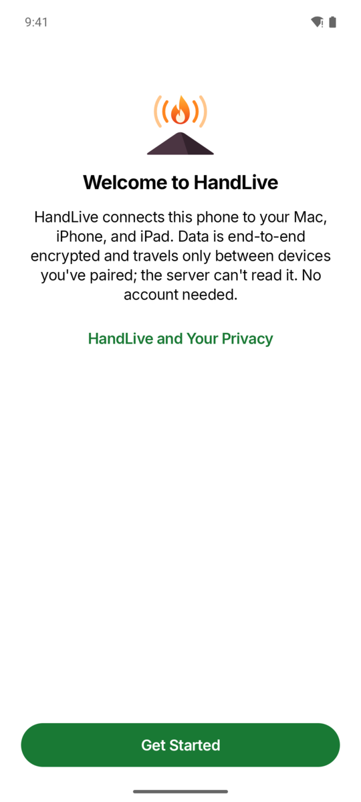 | 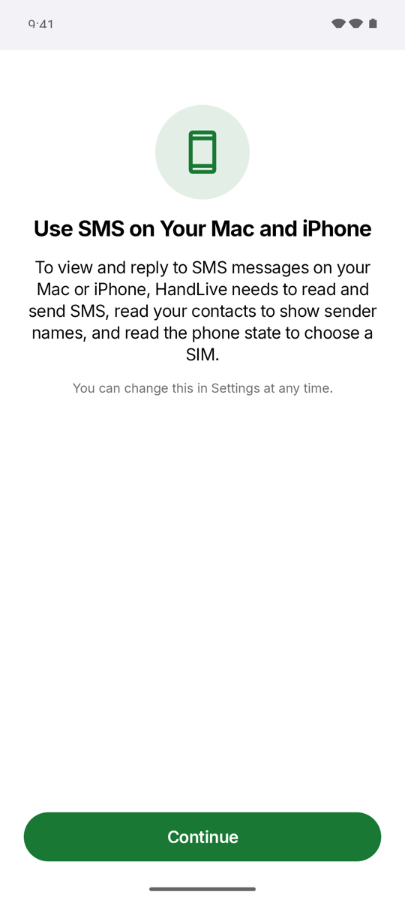 | 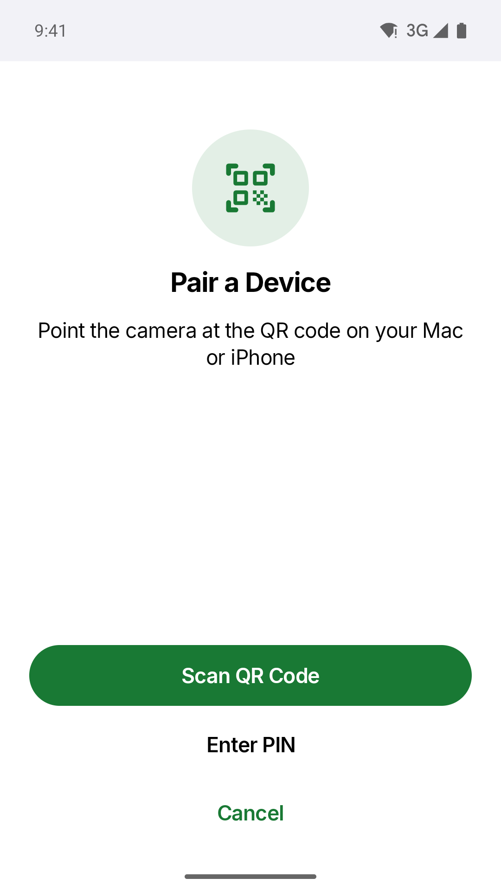 |  |
| Welcome: end-to-end encrypted, no account needed. | HandLive explains why it needs SMS permissions before Android asks. | Pair with a Mac or iPhone by QR code or PIN. | The paired Mac, connected over Wi-Fi. |
| 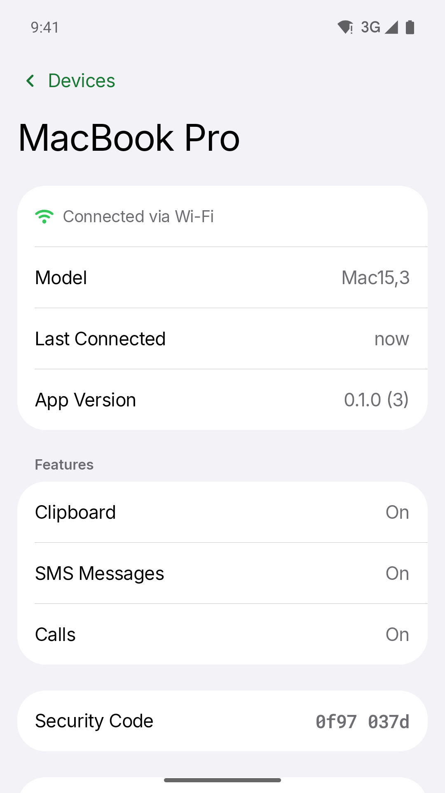 | 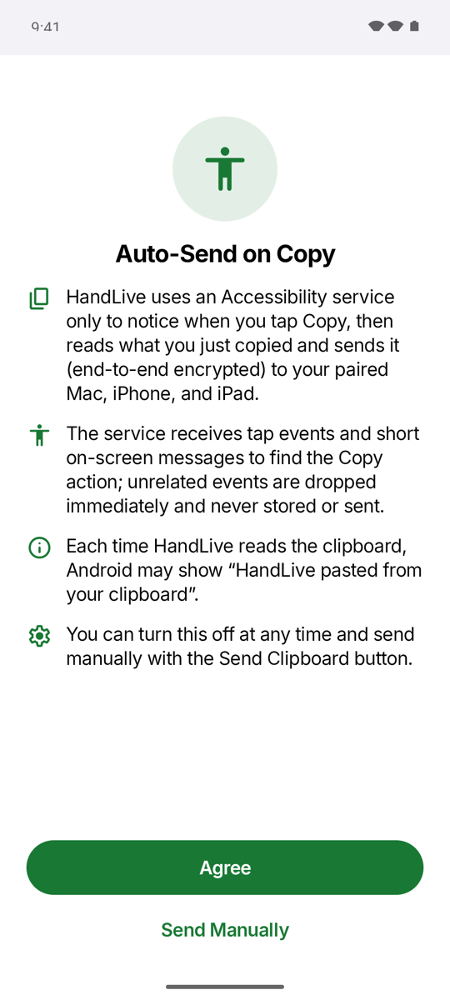 | 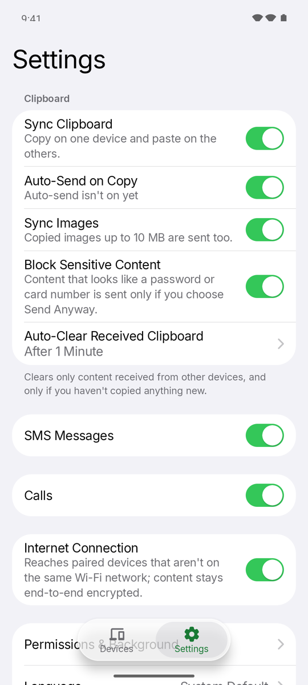 |  |
| Model, last connection, features and Security Code. | What the Accessibility service does before auto-send is turned on. | Clipboard, SMS, calls and Internet connection settings. |  |

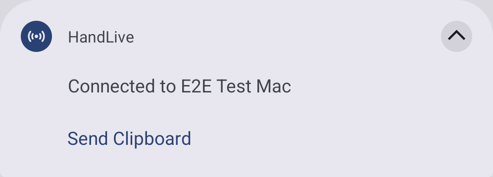

The service notification on Android: connected to the Mac, with a Send Clipboard button.

## iPhone and iPad

Real `HLiOSUI` views in a harness app on the iOS 27 Simulator, with sample data written through the real stores. They are not taken from a device paired with a real phone.

| | | | |
|---|---|---|---|
| 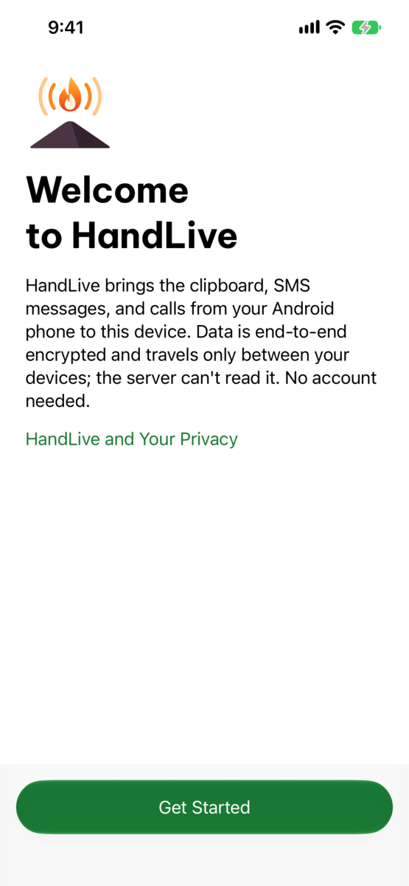 | 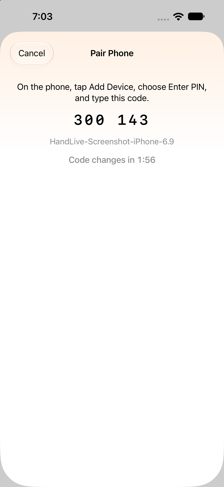 | 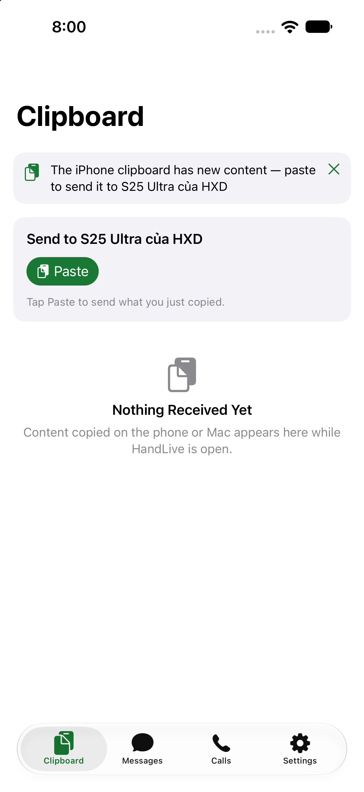 |  |
| First run: what HandLive does and how it protects your data. | Pair with the Android phone by QR code, or use a PIN. | Paste to send; the last clip from the phone is ready to copy. | Read and reply to the phone's SMS messages. |
|  | 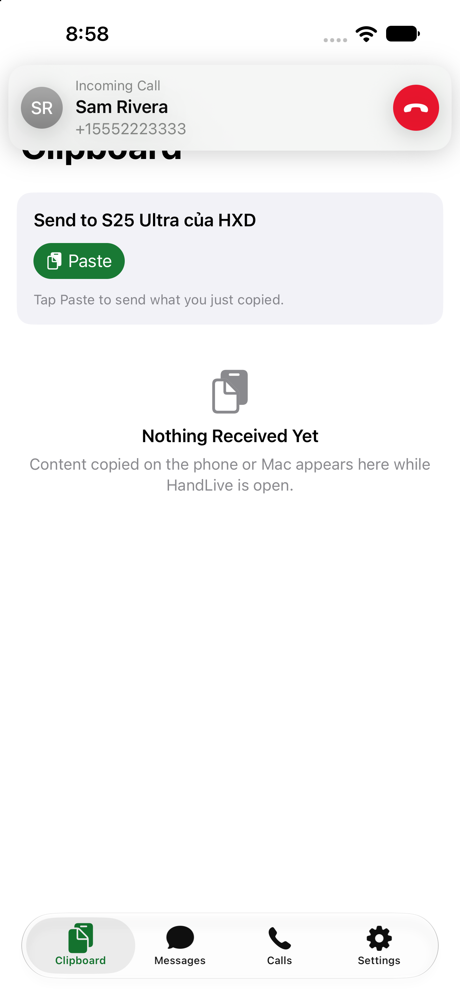 | 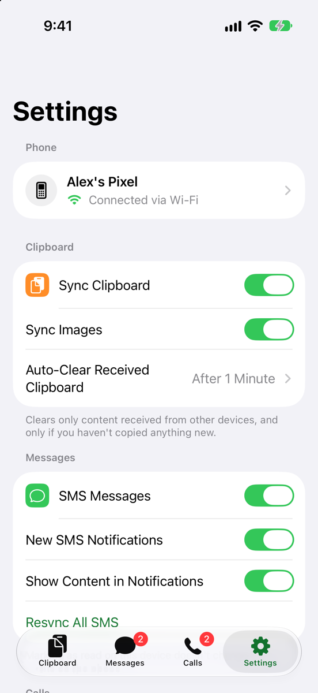 | 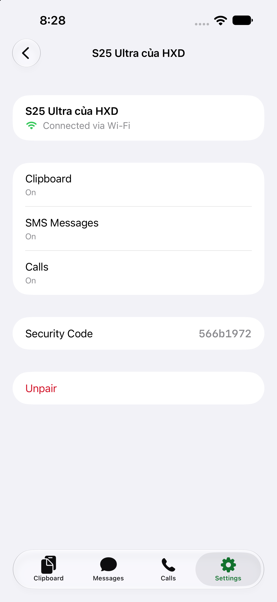 |
| The phone's call log, missed calls in red. | An incoming call shows a banner with Decline. | Turn each feature on or off separately. | The paired phone: connection, features, Security Code, Unpair. |
| 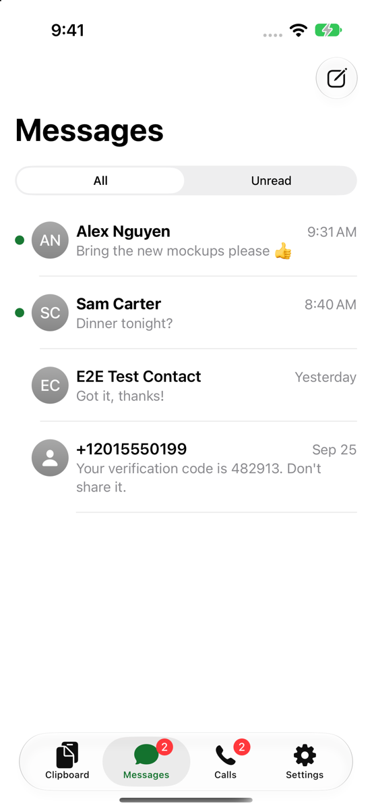 | 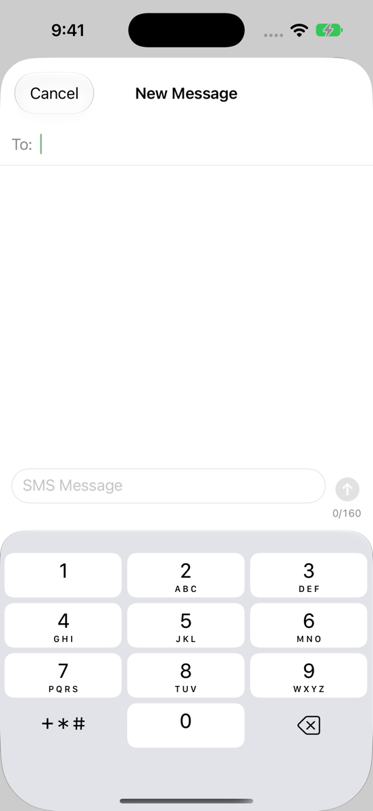 |  |  |
| The conversation list with the All / Unread filter; unread conversations have a dot. | New Message: type the phone number after To:. |  |  |

## Mac

Real `HLMacUI` windows and views in a harness app on macOS 27, with sample data; each window captured itself. The menu bar menu is not shown: it exists only while open, and this session had no Screen Recording permission.

| | |
|---|---|
| 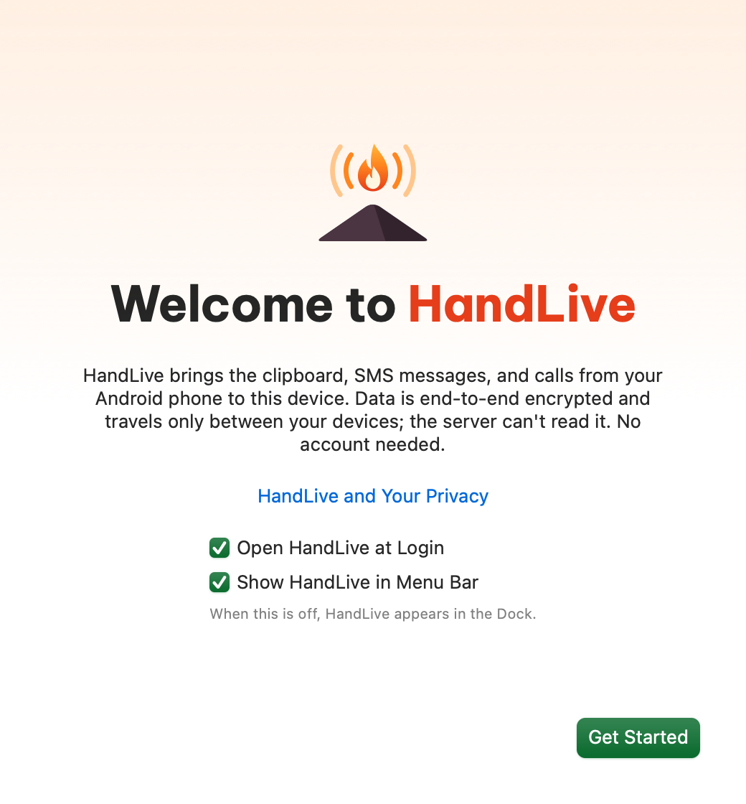 | 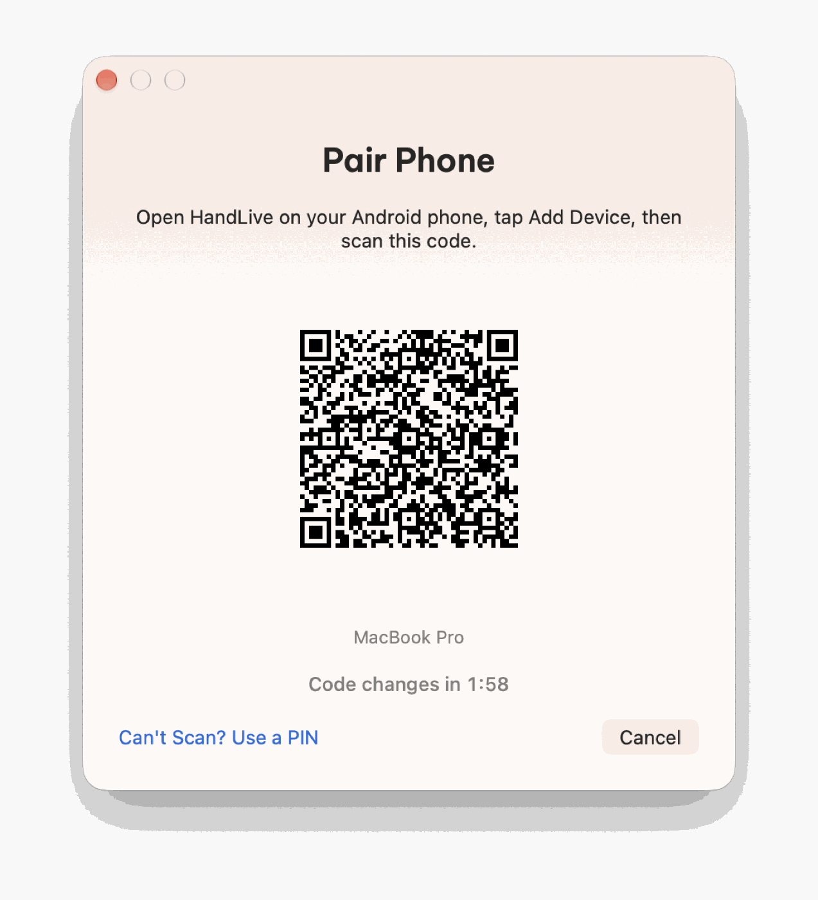 |
| First run: Open at Login and the menu bar icon. | Scan the QR code with HandLive on the Android phone, or use a PIN. |
|  |  |
| SMS conversations and the call log in one window. | Floating panel for an incoming call: Answer, Decline or Ignore. |
| 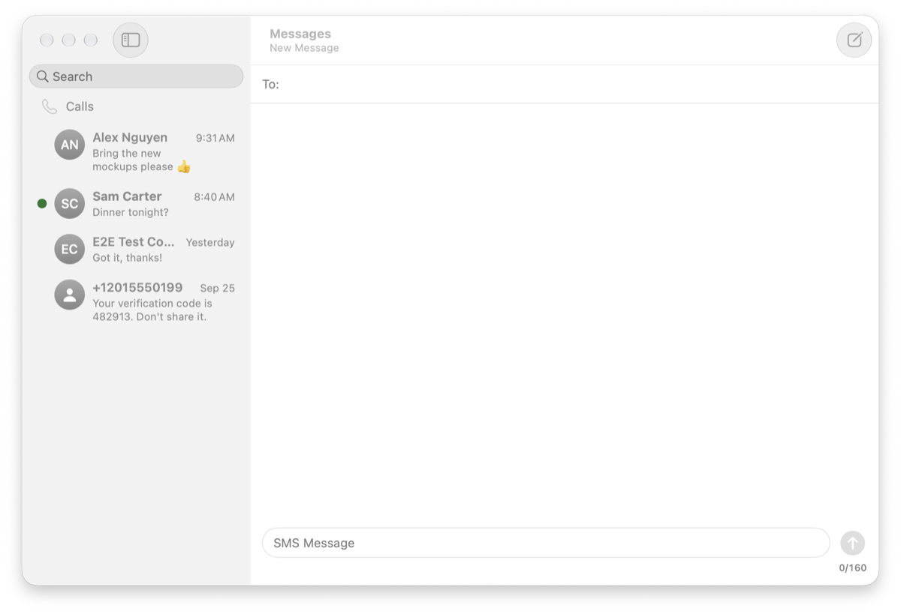 |  |
| New Message in the Messages window. |  |

## Dark Mode and iPad

| | | |
|---|---|---|
|  |  |  |
| Android: device details | iPhone: conversation | iPad: conversation list and conversation side by side |

## Known issues seen while capturing

- Android pairing: when the Mac connects while the PIN is still being typed, the phone switches to Pairing… and the PIN can no longer be entered (PAIR-01 A3–A4).

To refresh: rerun the same flows on the next build and replace files with the same names.
